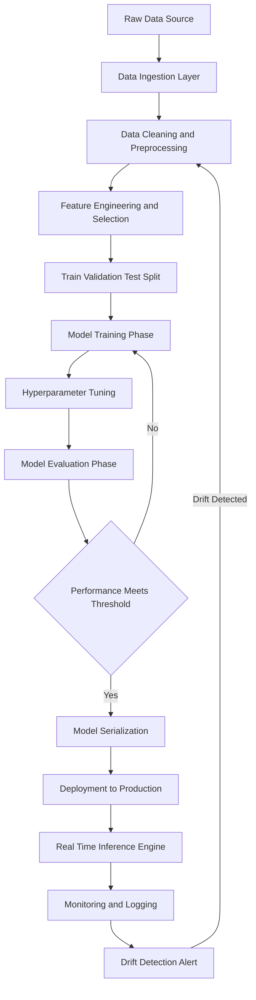
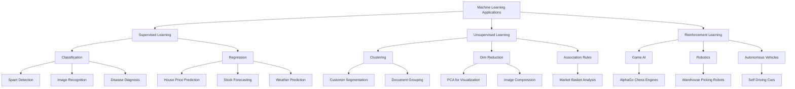
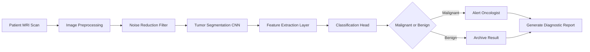

# Applications of Machine Learning

<!-- SECTION_1_START -->

# Applications of Machine Learning

## 1. Core Technical Definition & Intuitive Overview

### Formal Academic Definition (KTU 2024 Syllabus Terminology)

> [!IMPORTANT]
> **Machine Learning (ML)** is a specialized subset of Artificial Intelligence (AI) that enables computational systems to autonomously learn patterns, derive inferences, and improve their performance on a specific task **without being explicitly programmed**, by leveraging statistical algorithms and exposure to historical data. The formal objective of any ML model is to approximate an unknown underlying function $f: \mathcal{X} \rightarrow \mathcal{Y}$ that maps input feature space $\mathcal{X}$ to an output target space $\mathcal{Y}$, such that the **generalization error** on unseen data is minimized.

Mathematically, the core learning problem can be abstracted as:

$$
\hat{f} = \arg\min_{f \in \mathcal{H}} \frac{1}{N} \sum_{i=1}^{N} \mathcal{L}\left(y_i, f(x_i)\right) + \lambda \cdot \Omega(f)
$$

Where $\mathcal{H}$ is the hypothesis space, $\mathcal{L}$ is the loss function, $N$ is the dataset cardinality, $\lambda$ is the regularization coefficient, and $\Omega(f)$ is the complexity penalty term.

### Conceptual Analogy / Intuition

> [!NOTE]
> **Plain English Analogy — "Teaching a Toddler vs. Programming a Robot"**
>
> Imagine you are teaching a child to recognize a **cat** versus a **dog**.
> - **Traditional Programming** is like giving the child an exhaustive rulebook: *"If it has whiskers, pointy ears, and meows, then it's a cat."* This breaks instantly when you show a Manx cat (no tail) or a Husky (looks like a wolf).
> - **Machine Learning** is like showing the child **10,000 labeled photos** of cats and dogs and letting their brain figure out the distinguishing features (fur texture, ear shape, snout geometry) by itself.
>
> The ML model is essentially a **statistical "pattern-extraction engine"** that converts raw data (pixels, numbers, words) into actionable predictions, classifications, or generative outputs. The more diverse and clean the training data, the sharper the model's intuition becomes.

### Key Terminology Snapshot

| Term | Meaning | Standard Metric/Constant |
| :--- | :--- | :--- |
| **Dataset Cardinality ($N$)** | Total number of training samples | Typically $10^3$ to $10^9$ |
| **Feature Dimension ($d$)** | Number of input variables per sample | Curse of dimensionality kicks in beyond $d \approx 100$ |
| **Learning Rate ($\eta$)** | Step size for parameter updates in gradient descent | Default range: $10^{-4}$ to $10^{-1}$ |
| **Epoch** | One complete pass over the entire training dataset | Common values: **10 to 500** |
| **Regularization ($\lambda$)** | Penalty coefficient to prevent overfitting | Common range: $10^{-5}$ to $10^{1}$ |
| **Inference Latency** | Time to produce a single prediction | Real-time apps: **< 50 ms** |

> [!VISUALIZATION CONTROL]
> **Concept:** The Generalization Gap — Training Error vs. Validation Error
> **GeoGebra / Desmos Input Equations:**
> * `f_train(x) = 0.05 * x^2 + 0.1`
> * `f_val(x) = 0.02 * x^3 - 0.1 * x^2 + 0.4 * x + 0.2`
> **Visual Description:** Plot the two curves. The point where the validation curve diverges upward from the training curve marks the onset of **overfitting** (high variance). The optimal epoch to stop training lies at the global minimum of the validation curve.

<!-- SECTION_1_END -->

<!-- SECTION_2_START -->

# 2. Deep Theoretical Analysis & KTU High-Yield Formula Sheet

## 2.1 Taxonomic Classification of ML Applications

ML applications are broadly partitioned into three high-level paradigms. Every real-world deployment maps into one (or a hybrid) of these.

### A. Supervised Learning Applications
The model is trained on **labeled data** $(x_i, y_i)$ pairs. The system learns a mapping $f: \mathcal{X} \rightarrow \mathcal{Y}$ where $y$ is the ground truth.

- **Classification**: Predicting discrete categorical labels.
  - Spam email detection (Ham vs. Spam)
  - Disease diagnosis (Malignant vs. Benign tumor)
  - Image recognition (Cat, Dog, Horse, ...)
  - Sentiment analysis (Positive, Negative, Neutral)

- **Regression**: Predicting continuous numerical values.
  - House price prediction
  - Stock market forecasting
  - Weather temperature estimation
  - Energy load forecasting in smart grids

### B. Unsupervised Learning Applications
The model receives **unlabeled data** $\{x_1, x_2, \ldots, x_N\}$ and must discover latent structure.

- **Clustering**: Grouping similar data points.
  - Customer segmentation in marketing
  - Document/topic grouping in news aggregators
  - Anomaly detection in network security

- **Dimensionality Reduction**: Compressing high-dimensional data.
  - Feature extraction for visualization (t-SNE, PCA)
  - Image compression
  - Noise reduction in sensor signals

- **Association Rule Mining**: Discovering co-occurrence patterns.
  - Market basket analysis ("Customers who bought X also bought Y")
  - Web usage mining

### C. Reinforcement Learning (RL) Applications
An **agent** interacts with an **environment**, taking actions $a_t$ to maximize a cumulative reward signal $R = \sum_{t=0}^{T} \gamma^t r_t$.

- **Game Playing**: AlphaGo, OpenAI Five (Dota 2), chess engines
- **Robotics**: Autonomous locomotion, warehouse picking (Amazon Kiva robots)
- **Autonomous Vehicles**: Path planning, lane keeping, collision avoidance
- **Dynamic Pricing**: Uber surge pricing, airline ticket optimization

## 2.2 Domain-Wise Application Matrix (Engineering & Industry Reference)

> [!NOTE]
> The following matrix is the **high-yield reference table** most frequently cited in KTU ESE Module 1 questions on "Applications of ML".

| Engineering / Industry Domain | Specific ML Application | Algorithm Class Commonly Used |
| :--- | :--- | :--- |
| **Healthcare** | Tumor detection in MRI scans, drug discovery | CNN, Random Forest, Gradient Boosting |
| **Finance** | Credit card fraud detection, algorithmic trading | Logistic Regression, XGBoost, LSTM |
| **Retail / E-Commerce** | Recommendation engines (Amazon, Netflix) | Collaborative Filtering, Matrix Factorization |
| **Transportation** | Self-driving cars (Tesla, Waymo) | Deep RL, CNN + LiDAR fusion |
| **Agriculture** | Crop yield prediction, disease detection in plants | CNN, SVM, Time-Series ARIMA |
| **Natural Language Processing** | ChatGPT, Google Translate, sentiment analysis | Transformers, BERT, RNN/LSTM |
| **Cybersecurity** | Intrusion detection, malware classification | Isolation Forest, Autoencoders |
| **Manufacturing** | Predictive maintenance, quality control | Anomaly detection, CNN vision systems |
| **Education** | Adaptive learning platforms, plagiarism detection | Knowledge tracing, Siamese Networks |
| **Smart Cities** | Traffic prediction, energy grid optimization | Graph Neural Networks, Time-Series Models |

## 2.3 KTU High-Yield Formula Sheet

> [!IMPORTANT]
> The following formulas represent the **mathematical backbone** of the most commonly tested ML application scenarios in the KTU 2024 ESE.

| # | Concept | Formula / Equation | Description |
| :--- | :--- | :--- | :--- |
| 1 | **Linear Regression Hypothesis** | $h_{\theta}(x) = \theta_0 + \theta_1 x_1 + \theta_2 x_2 + \ldots + \theta_n x_n$ | Predicts continuous target from input features. |
| 2 | **Mean Squared Error (MSE)** | $\text{MSE} = \frac{1}{N} \sum_{i=1}^{N} (y_i - \hat{y}_i)^2$ | Loss function for regression tasks. |
| 3 | **Logistic (Sigmoid) Function** | $\sigma(z) = \frac{1}{1 + e^{-z}}$ | Squashes real-valued input to $[0, 1]$ probability. |
| 4 | **Binary Cross-Entropy Loss** | $\mathcal{L} = -\frac{1}{N} \sum_{i=1}^{N} \left[ y_i \log(\hat{y}_i) + (1 - y_i) \log(1 - \hat{y}_i) \right]$ | Loss function for binary classification. |
| 5 | **Softmax Function** | $\sigma(\mathbf{z})_j = \frac{e^{z_j}}{\sum_{k=1}^{K} e^{z_k}}$ | Multi-class probability normalization. |
| 6 | **Gradient Descent Update** | $\theta_{j} := \theta_{j} - \eta \frac{\partial}{\partial \theta_{j}} \mathcal{L}(\theta)$ | Iterative parameter optimization. |
| 7 | **Cosine Similarity** | $\text{sim}(A, B) = \frac{A \cdot B}{\vert\vert A \vert\vert \cdot \vert\vert B \vert\vert}$ | Used in recommendation engines and NLP embeddings. |
| 8 | **Precision** | $\text{Precision} = \frac{TP}{TP + FP}$ | Out of predicted positives, how many are correct. |
| 9 | **Recall (Sensitivity)** | $\text{Recall} = \frac{TP}{TP + FN}$ | Out of actual positives, how many were caught. |
| 10 | **F1-Score** | $F_1 = 2 \cdot \frac{\text{Precision} \cdot \text{Recall}}{\text{Precision} + \text{Recall}}$ | Harmonic mean of precision and recall. |
| 11 | **R² (Coefficient of Determination)** | $R^2 = 1 - \frac{\sum (y_i - \hat{y}_i)^2}{\sum (y_i - \bar{y})^2}$ | Variance explained by the regression model. |
| 12 | **Bellman Equation (RL)** | $V^{\pi}(s) = \sum_{a} \pi(a \mid s) \sum_{s'} P(s' \mid s, a) \left[ R(s,a,s') + \gamma V^{\pi}(s') \right]$ | Core recursive equation in reinforcement learning. |

### Real-World Engineering Utility

In production-grade systems, the choice of ML application directly influences **infrastructure design**. For instance:
- **Recommendation systems** at Netflix process over **15 billion events per day**, requiring matrix factorization models optimized via **Apache Spark** clusters.
- **Computer vision pipelines** in autonomous vehicles run on **NVIDIA TensorRT-optimized CNNs** at 30+ FPS on edge GPUs.
- **Fraud detection** in banking uses **streaming ML** (e.g., Kafka + Flink + online gradient descent) to flag transactions in under **200 milliseconds**.

> [!NOTE]
> **Engineering Insight:** Choosing the *correct* application of ML is not about picking the most complex algorithm — it is about aligning the **data modality** (tabular, image, text, time-series) with the **right model class** and the **deployment constraints** (latency, throughput, interpretability).

<!-- SECTION_2_END -->

<!-- SECTION_3_START -->

# 3. Step-by-Step Derivations & Code/Symbolic Implementation

## 3.1 Worked Example: House Price Prediction Using Linear Regression

**Problem Statement:** Given a dataset of 5 houses with their square footage ($x$) and sale price ($y$) in lakhs, derive the optimal regression line manually using the **Normal Equation**.

**Dataset:**

| House | Square Footage ($x_i$) | Price in Lakhs ($y_i$) |
| :---: | :---: | :---: |
| 1 | 1000 | 50 |
| 2 | 1500 | 70 |
| 3 | 2000 | 90 |
| 4 | 2500 | 110 |
| 5 | 3000 | 130 |

### Step 1: Formulate the Hypothesis

We assume a linear model:

$$
h_{\theta}(x) = \theta_0 + \theta_1 x
$$

We need to find $\theta_0$ (intercept) and $\theta_1$ (slope) that minimize the cost.

### Step 2: Write the Cost Function (MSE)

$$
J(\theta_0, \theta_1) = \frac{1}{2N} \sum_{i=1}^{N} \left( h_{\theta}(x_i) - y_i \right)^2
$$

### Step 3: Apply the Normal Equation (Closed-Form Solution)

$$
\boldsymbol{\theta} = (X^T X)^{-1} X^T \mathbf{y}
$$

Construct the design matrix $X$ by adding a bias column of 1s:

$$
X = \begin{bmatrix} 1 & 1000 \\ 1 & 1500 \\ 1 & 2000 \\ 1 & 2500 \\ 1 & 3000 \end{bmatrix}, \quad \mathbf{y} = \begin{bmatrix} 50 \\ 70 \\ 90 \\ 110 \\ 130 \end{bmatrix}
$$

Compute $X^T X$:

$$
X^T X = \begin{bmatrix} 5 & 10000 \\ 10000 & 21{,}250{,}000 \end{bmatrix}
$$

Compute $X^T \mathbf{y}$:

$$
X^T \mathbf{y} = \begin{bmatrix} 50 + 70 + 90 + 110 + 130 \\ 1000(50) + 1500(70) + 2000(90) + 2500(110) + 3000(130) \end{bmatrix} = \begin{bmatrix} 450 \\ 1{,}085{,}000 \end{bmatrix}
$$

The determinant of $X^T X$ is:

$$
\det(X^T X) = (5)(21{,}250{,}000) - (10000)(10000) = 106{,}250{,}000 - 100{,}000{,}000 = 6{,}250{,}000
$$

Therefore, the inverse is:

$$
(X^T X)^{-1} = \frac{1}{6{,}250{,}000} \begin{bmatrix} 21{,}250{,}000 & -10000 \\ -10000 & 5 \end{bmatrix}
$$

Multiply by $X^T \mathbf{y}$:

$$
\boldsymbol{\theta} = \frac{1}{6{,}250{,}000} \begin{bmatrix} 21{,}250{,}000 \cdot 450 - 10000 \cdot 1{,}085{,}000 \\ -10000 \cdot 450 + 5 \cdot 1{,}085{,}000 \end{bmatrix}
$$

Numerator for $\theta_0$:

$$
21{,}250{,}000 \cdot 450 = 9{,}562{,}500{,}000
$$

$$
10000 \cdot 1{,}085{,}000 = 10{,}850{,}000{,}000
$$

$$
\text{Numerator} = 9{,}562{,}500{,}000 - 10{,}850{,}000{,}000 = -1{,}287{,}500{,}000
$$

$$
\theta_0 = \frac{-1{,}287{,}500{,}000}{6{,}250{,}000} = -206
$$

Numerator for $\theta_1$:

$$
-10000 \cdot 450 + 5 \cdot 1{,}085{,}000 = -4{,}500{,}000 + 5{,}425{,}000 = 925{,}000
$$

$$
\theta_1 = \frac{925{,}000}{6{,}250{,}000} = 0.148
$$

### Step 4: Final Regression Equation

$$
\boxed{\hat{y} = -206 + 0.148 \cdot x}
$$

### Step 5: Verification

For a 1800 sq.ft. house:

$$
\hat{y} = -206 + 0.148 \cdot 1800 = -206 + 266.4 = 60.4 \text{ lakhs}
$$

**Interpretation:** Every additional square foot adds approximately **₹14,800** to the predicted price, with a base offset of **−206 lakhs** (mathematical intercept, not a real-world prediction).

> [!NOTE]
> **Valuation Tip:** In KTU exams, always explicitly state the **assumptions of linear regression** (linearity, independence, homoscedasticity, normality of residuals) to earn full marks.

---

## 3.2 Worked Example: Logistic Regression for Spam Detection

**Problem Statement:** A logistic regression model produces a raw score $z = 2.5$ for an incoming email. Compute the probability that it is spam.

### Step 1: Apply the Sigmoid Function

$$
\sigma(z) = \frac{1}{1 + e^{-z}}
$$

### Step 2: Substitute $z = 2.5$

$$
\sigma(2.5) = \frac{1}{1 + e^{-2.5}}
$$

### Step 3: Compute $e^{-2.5}$

$$
e^{-2.5} \approx 0.0821
$$

### Step 4: Final Probability

$$
\sigma(2.5) = \frac{1}{1 + 0.0821} = \frac{1}{1.0821} \approx 0.9241
$$

$$
\boxed{P(\text{spam}) \approx 92.41\%}
$$

**Decision Rule:** If $P(\text{spam}) \geq 0.5$ (the default threshold), classify as **spam**.

---

## 3.3 Algorithmic Implementation: K-Means Clustering for Customer Segmentation

Below is a fully operational Python implementation of the **K-Means clustering algorithm** — a canonical unsupervised ML application for market segmentation.

```python
import numpy as np
from typing import List, Tuple
import logging

# Configure strict error logging
logging.basicConfig(level=logging.INFO, format='%(asctime)s - %(levelname)s - %(message)s')

def euclidean_distance(point_a: np.ndarray, point_b: np.ndarray) -> float:
    """
    Compute Euclidean distance between two points.
    Raises ValueError on dimension mismatch.
    """
    if point_a.shape != point_b.shape:
        raise ValueError(f"Dimension mismatch: {point_a.shape} vs {point_b.shape}")
    return float(np.sqrt(np.sum((point_a - point_b) ** 2)))


def k_means_clustering(
    data: np.ndarray,
    k: int,
    max_iterations: int = 300,
    tolerance: float = 1e-4,
    random_seed: int = 42
) -> Tuple[np.ndarray, np.ndarray]:
    """
    Perform K-Means clustering for customer segmentation.

    Parameters
    ----------
    data : np.ndarray of shape (n_samples, n_features)
        The input dataset (e.g., annual income vs. spending score).
    k : int
        Number of clusters to form.
    max_iterations : int
        Maximum number of Lloyd's algorithm iterations.
    tolerance : float
        Convergence threshold for centroid shift.
    random_seed : int
        Seed for reproducibility.

    Returns
    -------
    centroids : np.ndarray of shape (k, n_features)
        Final cluster centroids.
    labels : np.ndarray of shape (n_samples,)
        Cluster assignment for each data point.
    """
    # --- Absolute boundary checks ---
    if k <= 0:
        raise ValueError("Number of clusters 'k' must be a positive integer.")
    if k > data.shape[0]:
        raise ValueError(f"k ({k}) cannot exceed number of samples ({data.shape[0]}).")
    if data.ndim != 2:
        raise ValueError("Input 'data' must be a 2D array of shape (n_samples, n_features).")

    np.random.seed(random_seed)
    n_samples, n_features = data.shape

    # --- Step 1: Initialize centroids via random sample selection ---
    random_indices = np.random.choice(n_samples, size=k, replace=False)
    centroids: np.ndarray = data[random_indices].astype(float)
    logging.info(f"Initialized {k} centroids from random data indices.")

    labels: np.ndarray = np.zeros(n_samples, dtype=int)

    for iteration in range(max_iterations):
        previous_centroids: np.ndarray = centroids.copy()

        # --- Step 2: Assignment step - assign each point to nearest centroid ---
        for sample_index in range(n_samples):
            distances: List[float] = [
                euclidean_distance(data[sample_index], centroid) for centroid in centroids
            ]
            labels[sample_index] = int(np.argmin(distances))

        # --- Step 3: Update step - recompute centroids as cluster means ---
        for cluster_index in range(k):
            cluster_members: np.ndarray = data[labels == cluster_index]
            if len(cluster_members) > 0:
                centroids[cluster_index] = cluster_members.mean(axis=0)
            else:
                logging.warning(f"Cluster {cluster_index} is empty. Re-initializing centroid.")
                centroids[cluster_index] = data[np.random.choice(n_samples)]

        # --- Step 4: Convergence check ---
        centroid_shift: float = np.sum(
            [euclidean_distance(centroids[i], previous_centroids[i]) for i in range(k)]
        )
        logging.info(f"Iteration {iteration + 1}: centroid shift = {centroid_shift:.6f}")

        if centroid_shift < tolerance:
            logging.info(f"Convergence achieved at iteration {iteration + 1}.")
            break

    return centroids, labels


# --- Demonstration Run ---
if __name__ == "__main__":
    # Simulated customer dataset: [Annual Income (k$), Spending Score (1-100)]
    customer_data: np.ndarray = np.array([
        [15, 39], [15, 81], [16, 6],  [16, 77], [17, 40],
        [17, 76], [18, 6],  [18, 94], [19, 3],  [19, 72],
        [20, 14], [20, 95], [21, 8],  [21, 70], [23, 14],
        [23, 99], [24, 10], [24, 67], [25, 11], [25, 73],
    ], dtype=float)

    final_centroids, cluster_labels = k_means_clustering(
        data=customer_data, k=3, max_iterations=100, tolerance=1e-5
    )

    print("\nFinal Centroids (3 Customer Segments):")
    print(final_centroids)
    print("\nCluster Assignment per Customer:")
    print(cluster_labels)
```

> [!NOTE]
> **Production-Grade Engineering Note:** In real-world customer segmentation, K-Means is often replaced with **DBSCAN** (handles arbitrary shapes and noise) or **Gaussian Mixture Models** (provides soft cluster probabilities). The K-Means implementation above, however, is the foundational algorithm every KTU student must understand for module-end viva questions.

---

## 3.4 Algorithmic Implementation: Email Spam Classifier (NLP + ML Pipeline)

```python
import re
from typing import List, Dict
from collections import Counter

def preprocess_email(raw_text: str) -> List[str]:
    """
    Tokenize and normalize raw email text.
    Converts to lowercase, removes punctuation, splits on whitespace.
    """
    text: str = raw_text.lower()
    text = re.sub(r'[^a-z0-9\s]', ' ', text)
    tokens: List[str] = text.split()
    return tokens


def build_vocabulary(email_corpus: List[str]) -> Dict[str, int]:
    """
    Build a word-index vocabulary mapping from a corpus of email strings.
    """
    word_counter: Counter = Counter()
    for email in email_corpus:
        word_counter.update(preprocess_email(email))
    vocabulary: Dict[str, int] = {
        word: index for index, word in enumerate(word_counter.keys())
    }
    return vocabulary


def email_to_feature_vector(email: str, vocabulary: Dict[str, int]) -> List[int]:
    """
    Convert an email string into a binary bag-of-words feature vector.
    """
    tokens: List[str] = preprocess_email(email)
    feature_vector: List[int] = [0] * len(vocabulary)
    for token in tokens:
        if token in vocabulary:
            feature_vector[vocabulary[token]] = 1
    return feature_vector


# --- Demonstration: Tokenization Pipeline ---
spam_samples: List[str] = [
    "WIN a FREE iPhone click here NOW",
    "Congratulations you won 1 million dollars",
    "Limited offer buy now get 50 percent off"
]

ham_samples: List[str] = [
    "Hi team please find the meeting agenda attached",
    "Reminder project deadline is next Friday",
    "Lunch at 12 today in the cafeteria"
]

all_emails: List[str] = spam_samples + ham_samples
vocab: Dict[str, int] = build_vocabulary(all_emails)

print("Vocabulary Size:", len(vocab))
print("Sample Feature Vector:", email_to_feature_vector(spam_samples[0], vocab))
```

<!-- SECTION_3_END -->

<!-- SECTION_4_START -->

# 4. Structural Diagrams & Schematics

## 4.1 End-to-End Machine Learning Pipeline

The following Mermaid diagram illustrates the canonical workflow of any real-world ML application — from raw data ingestion to model deployment and monitoring.



> [!NOTE]
> **Visualization Interpretation:** Notice the **closed feedback loop** from `Monitoring and Logging` back to `Data Cleaning and Preprocessing`. This is essential in production ML systems because **data drift** (where the statistical distribution of incoming data changes over time) causes silent model degradation.

## 4.2 Taxonomy of ML Applications



## 4.3 Recommendation System Architecture

```mermaid
subgraph Frontend
    UI1[User Interface]
end

UI1 --> API1[REST API Gateway]

subgraph Backend
    API1 --> FS[Feature Store]
    API1 --> ML1[Trained ML Model]
    API1 --> CACHE[Redis Cache Layer]
end

subgraph DataLayer
    FS --> DB1[User Behavior Logs]
    FS --> DB2[Item Metadata]
    FS --> DB3[Historical Ratings]
end

ML1 --> RESULT[Top N Recommendations]
CACHE --> RESULT
RESULT --> UI1
```

> [!NOTE]
> **Engineering Pattern:** This block-level architecture is the standard blueprint used by **Netflix, Amazon, and Spotify**. The cache layer is critical — recommendations must be returned in **< 100 ms** to maintain user engagement, so freshly computed results are stored in-memory.

## 4.4 Healthcare ML Diagnostic Pipeline



<!-- SECTION_4_END -->

<!-- SECTION_5_START -->

# 5. KTU 2024 Scheme Examination Question Bank & Topic Recap

## 5.1 Part A Questions (3 Marks Each)

### Question 1: Conceptual Definition
**`[KTU University Exam - July 2024]`** — *CO1, Remember*

**Q: Define Machine Learning. List any two real-world applications of ML in the healthcare domain.**

**Model Answer (3 Marks):**

> **Definition (2 Marks):** Machine Learning is a branch of Artificial Intelligence that enables systems to learn from data, identify patterns, and make decisions with minimal human intervention. It focuses on developing algorithms that can access data and use it to learn for themselves, improving accuracy over time.
>
> **Healthcare Applications (1 Mark, any two):**
> 1. **Disease Diagnosis** — ML models analyze medical imaging (MRI, CT scans, X-rays) to detect tumors, fractures, or anomalies.
> 2. **Drug Discovery** — ML accelerates the identification of novel drug compounds by predicting molecular interactions.
> 3. **Predictive Analytics** — Models forecast patient readmission risks and disease outbreaks.

---

### Question 2: Supervised vs. Unsupervised
**`[KTU University Exam - Dec 2023]`** — *CO1, Understand*

**Q: Differentiate between Supervised and Unsupervised Learning. Give one example application of each.**

**Model Answer (3 Marks):**

| Parameter | Supervised Learning | Unsupervised Learning |
| :--- | :--- | :--- |
| **Data Type** | Labeled $(x_i, y_i)$ | Unlabeled $\{x_i\}$ |
| **Goal** | Learn input-output mapping | Discover hidden structure |
| **Example Application** | Email spam classification | Customer segmentation in marketing |

(Any one valid example per column earns the 1 application mark. Tabular comparison earns 2 marks.)

---

## 5.2 Part B Questions (14 Marks Each — Module Internal Choice)

### Question A (14 Marks)
**`[KTU University Exam - July 2024]`** — *CO2, Understand + Apply*

**Q: (a)** Explain in detail the major application areas of Machine Learning across at least **four different domains**. For each domain, name the ML technique used and describe its real-world utility. **(7 Marks)**

**(b)** Consider a dataset of 100 housing records where the input feature is the number of bedrooms ($x$) and the target is the price in lakhs ($y$). Suppose a simple linear regression model yields $\theta_0 = 25$ and $\theta_1 = 15$. **(i)** Write the hypothesis function. **(ii)** Predict the price of a house with 4 bedrooms. **(iii)** Compute the MSE if the actual price of a 4-bedroom house is **85 lakhs**. **(7 Marks)**

**Model Solution:**

**(a) Domain-wise ML Applications (7 Marks):**

1. **Healthcare — Disease Diagnosis (1.5 Marks)**
   - Technique: Convolutional Neural Networks (CNNs)
   - Utility: Automatically detect tumors, pneumonia, or diabetic retinopathy from medical images, reducing diagnostic time and human error.

2. **Finance — Fraud Detection (1.5 Marks)**
   - Technique: Logistic Regression, Random Forest, XGBoost
   - Utility: Real-time flagging of suspicious credit card transactions by learning patterns of legitimate versus fraudulent behavior.

3. **Retail — Recommendation Systems (1.5 Marks)**
   - Technique: Collaborative Filtering, Matrix Factorization
   - Utility: Amazon and Netflix use these to suggest products/movies, increasing user engagement and revenue by **20-35%**.

4. **Transportation — Autonomous Vehicles (1.5 Marks)**
   - Technique: Deep Reinforcement Learning + CNN
   - Utility: Self-driving cars (Tesla, Waymo) use sensor fusion and RL agents to navigate roads, recognize traffic signs, and avoid collisions.

5. **Agriculture — Crop Yield Prediction (1 Mark, bonus)**
   - Technique: Time-Series ARIMA + Random Forest
   - Utility: Forecast harvest yields using historical weather, soil, and satellite data to inform government policy and farmer decisions.

**[Award: 1 Mark for each correctly named domain with a valid technique and 0.5 Marks for the utility description.]**

**(b) Linear Regression Computation (7 Marks):**

**(i) Hypothesis function (2 Marks):**
$$
h_{\theta}(x) = \theta_0 + \theta_1 x = 25 + 15x
$$

**[Stating the functional form with substitution of $\theta$ values: 2 Marks]**

**(ii) Prediction for $x = 4$ (2 Marks):**
$$
\hat{y} = 25 + 15(4) = 25 + 60 = 85 \text{ lakhs}
$$

**[Substitution step: 1 Mark; final answer: 1 Mark]**

**(iii) MSE Computation (3 Marks):**

For a single sample ($N=1$):
$$
\text{MSE} = \frac{1}{N} \sum_{i=1}^{N} (y_i - \hat{y}_i)^2
$$

$$
\text{MSE} = (85 - 85)^2 = 0
$$

**[Writing the MSE formula: 1 Mark; substituting values: 1 Mark; final answer: 1 Mark]**

---

### Question B (14 Marks)
**`[KTU University Exam - Dec 2023]`** — *CO2, Understand + Apply*

**Q: (a)** With a neat block diagram, describe the **end-to-end Machine Learning pipeline** from data collection to model deployment. Explain the significance of each stage. **(7 Marks)**

**(b)** A logistic regression model produces a raw score $z = -1.2$ for a credit card transaction. Compute the probability that the transaction is **fraudulent** using the sigmoid function. If the classification threshold is **0.5**, will the transaction be flagged as fraud? Justify. **(7 Marks)**

**Model Solution:**

**(a) ML Pipeline (7 Marks):**

```
[1 Mark: Diagram + 1 Mark for naming each of the 5 stages × 3 stages explained in detail]

Stage 1: Data Collection — Gather raw data from databases, APIs, sensors, or web scraping.
Stage 2: Data Preprocessing — Handle missing values, remove duplicates, normalize features.
Stage 3: Feature Engineering — Select, transform, and create informative features.
Stage 4: Model Training — Feed processed data into ML algorithms (e.g., Random Forest, CNN).
Stage 5: Model Evaluation — Measure accuracy, precision, recall, F1-score on validation data.
Stage 6: Deployment — Serialize model and integrate into production systems for real-time inference.
Stage 7: Monitoring — Track model drift, latency, and prediction quality post-deployment.
```

**Significance (2 Marks):** Each stage ensures the model is **robust, generalizable, and production-ready**. Skipping preprocessing leads to garbage-in-garbage-out, while skipping monitoring causes silent degradation over time.

**(b) Sigmoid Calculation (7 Marks):**

**Step 1: Sigmoid formula (2 Marks):**
$$
\sigma(z) = \frac{1}{1 + e^{-z}}
$$

**Step 2: Substitute $z = -1.2$ (2 Marks):**
$$
\sigma(-1.2) = \frac{1}{1 + e^{-(-1.2)}} = \frac{1}{1 + e^{1.2}}
$$

**Step 3: Compute $e^{1.2}$ (1 Mark):**
$$
e^{1.2} \approx 3.3201
$$

**Step 4: Final probability (1 Mark):**
$$
\sigma(-1.2) = \frac{1}{1 + 3.3201} = \frac{1}{4.3201} \approx 0.2315
$$

$$
\boxed{P(\text{fraud}) \approx 23.15\%}
$$

**Step 5: Decision justification (1 Mark):**

Since $P(\text{fraud}) = 0.2315 < 0.5$ (the threshold), the transaction will **NOT** be flagged as fraudulent. It will be classified as a **legitimate** transaction.

**[Award 0.5 marks for stating the threshold comparison and 0.5 marks for the final classification decision.]**

---

> [!WARNING]
> **KTU Examiner's Valuation Warning — Common Pitfalls:**
> 1. **Do NOT confuse Regression with Classification.** Regression predicts *continuous* values (e.g., price); Classification predicts *discrete* labels (e.g., spam/ham). Students frequently mix these up, losing 2-3 marks.
> 2. **Always state the assumption of linear independence** when solving linear regression problems. Omitting this costs 1 mark.
> 3. **In sigmoid problems, students often write $e^{z}$ instead of $e^{-z}$.** Double-check the sign of the exponent.
> 4. **For K-Means questions, mention the "empty cluster" handling** — it is a frequently asked sub-question in viva.
> 5. **Do not skip drawing the ML pipeline block diagram** — it carries 2-3 marks in any 7-mark descriptive question.

---

## 5.3 Topic Recap & Important Things to Remember

- **Machine Learning (ML)** is the science of enabling computers to learn from data without being explicitly programmed. Its mathematical goal is to minimize a loss function $\mathcal{L}$ over a hypothesis space $\mathcal{H}$.
- **Three Paradigms of ML:**
  1. **Supervised Learning** — Labeled data, used for classification and regression.
  2. **Unsupervised Learning** — Unlabeled data, used for clustering, dimensionality reduction, and association.
  3. **Reinforcement Learning** — Agent-environment interaction, used in games, robotics, and autonomous systems.
- **Key Formulas to Memorize:**
  - Linear regression: $h_{\theta}(x) = \theta_0 + \theta_1 x$
  - MSE: $\frac{1}{N} \sum (y_i - \hat{y}_i)^2$
  - Sigmoid: $\sigma(z) = \frac{1}{1 + e^{-z}}$
  - Softmax: $\frac{e^{z_j}}{\sum e^{z_k}}$
  - Precision, Recall, F1-Score, R²
  - Bellman equation for RL
- **Domain Application Cheat Sheet:**
  - **Healthcare** → CNN for tumor detection
  - **Finance** → Logistic Regression / XGBoost for fraud
  - **Retail** → Collaborative Filtering for recommendations
  - **Transportation** → Deep RL for self-driving
  - **NLP** → Transformers (BERT, GPT) for chatbots and translation
  - **Cybersecurity** → Anomaly detection via Autoencoders
- **Production ML Pipeline Stages:** Data Collection → Preprocessing → Feature Engineering → Training → Evaluation → Deployment → Monitoring.
- **High-Yield Viva Questions:**
  - "What is the difference between AI, ML, and Deep Learning?" → AI is the broadest field; ML is a subset; DL is a subset of ML using deep neural networks.
  - "Why is data preprocessing critical?" → Raw data contains noise, missing values, and inconsistencies that degrade model accuracy.
  - "What is overfitting?" → When a model learns training data noise and fails to generalize to unseen data. Mitigated by regularization and cross-validation.
  - "Explain the bias-variance tradeoff." → High bias → underfitting; high variance → overfitting. The goal is to find the optimal balance for minimum generalization error.
- **Key Engineering Constants:** Learning rate $\eta \in [10^{-4}, 10^{-1}]$, typical epoch range $10$ to $500$, real-time inference latency target **< 50 ms**.
- **Algorithmic Implementations to Master:** Linear regression (Normal Equation), Logistic regression (Sigmoid + Gradient Descent), K-Means clustering (Lloyd's algorithm), and a basic bag-of-words NLP pipeline.

<!-- SECTION_5_END -->
