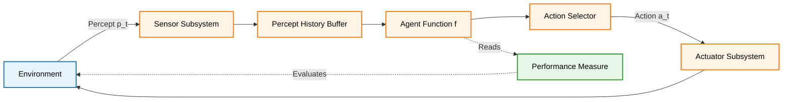
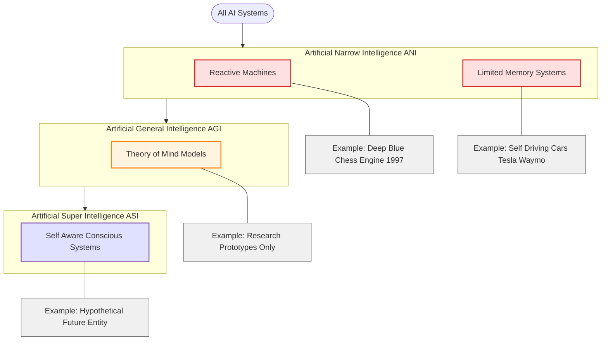
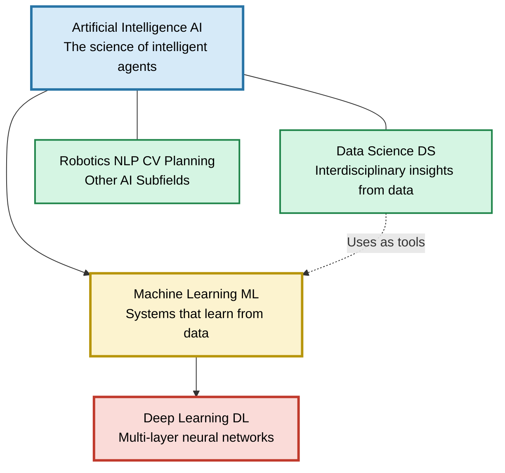
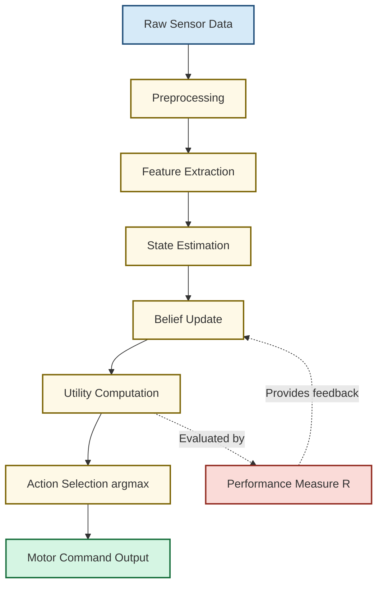

# Introduction to Artificial Intelligence

<!-- SECTION_1_START -->
# Introduction to Artificial Intelligence

## 1.1 Formal Definition (KTU 2024 Syllabus Aligned)

> [!IMPORTANT]
> **Artificial Intelligence (AI)** is the branch of computer science devoted to building systems that can perform tasks which, when done by humans, require **intelligence** — reasoning, learning from experience, understanding language, recognising patterns, and making decisions under uncertainty.

**Textbook Definition (Russell & Norvig, KTU Reference):**

> *"Artificial Intelligence is the study of agents that receive percepts from the environment and perform actions. Each such agent implements a function that maps percept sequences to actions, and we design these functions to maximize a performance measure."*

Mathematically, an **Intelligent Agent** can be abstracted as the mapping:

$$
f: \mathcal{P}^{*} \rightarrow \mathcal{A}
$$

where $\mathcal{P}^{*}$ is the set of all possible percept sequences the agent has experienced so far, and $\mathcal{A}$ is the set of all actions it can execute.

---

## 1.2 Conceptual Analogy / Intuition

> [!NOTE]
> **Real-World Analogy — The New Apprentice in a Factory**
>
> Imagine you hire a **new apprentice** in a textile factory. On **Day 1**, the apprentice knows nothing. You (the supervisor) show him:
> - **Rules**: "If the cloth has a red stain, place it in Bin A." (Hard-coded knowledge)
> - **Patterns**: You give him 1,000 photos of stained vs. clean cloth, and he gradually *learns* to recognise them himself. (Machine Learning)
> - **Feedback**: When he makes a wrong call, you correct him, and he updates his internal model. (Reinforcement Learning)
>
> That apprentice is, in essence, an **AI system**. He perceives the world (sensors/cameras), processes the information (CPU/model), and acts on it (robotic arm/decision output). Traditional software would only follow the rules; AI goes further — it **adapts, generalises, and improves with data**.

### The "Intelligence Spectrum" Intuition

| System Type | Behaviour | Human Analogy |
|-------------|-----------|---------------|
| **Calculator** | Follows one fixed formula | A clerk who can only do arithmetic |
| **Rule-Based System** (Expert System) | Follows hand-crafted `if-then` rules | A junior doctor reading a manual |
| **Machine Learning** | Learns patterns from data | A medical intern who studies 10,000 case files |
| **Deep Learning** | Learns hierarchical features from raw data | A specialist doctor who also reads X-rays intuitively |
| **AGI (Hypothetical)** | Reasons, plans, and transfers knowledge across domains | A polymathic genius |

---

## 1.3 Key Physical / Logical Constants & Benchmarks

> [!IMPORTANT]
> - **Turing Test Threshold (1950)**: A machine passes if a human interrogator cannot reliably distinguish it from another human in a text-based conversation after **5 minutes** in roughly **70%** of trials.
> - **Moore's Law Observation (Historical Reference)**: Transistor count doubles approximately every **18–24 months**, enabling modern AI compute.
> - **ImageNet Benchmark (Modern Reference)**: Human-level top-5 error rate on object recognition is approximately **5.1%**; modern deep networks surpass this.

---

## 1.4 Visualisation Aids (GeoGebra / Conceptual Plots)

> [!VISUALIZATION CONTROL]
> **Concept:** *The AI Capability vs. Autonomy Curve (Conceptual Plot)*
>
> **Plot Description for Student:**
> Imagine a 2D plane.
> - The **X-axis** represents the *Complexity of the Task* (low to high).
> - The **Y-axis** represents the *Autonomy of the System* (assisted → fully autonomous).
> - A **staircase curve** rises from bottom-left to top-right, with each step representing a generational leap:
>   1. Hand-coded rule systems
>   2. Statistical learning (e.g., Naive Bayes)
>   3. Neural networks / Deep Learning
>   4. (Future) General AI
> - The student should observe that **as tasks become more complex, the required autonomy — and the sophistication of the AI model — also rises sharply**.
>
> **Suggested GeoGebra Input:** Plot the discrete points $(1, 0.2)$, $(3, 0.4)$, $(5, 0.7)$, $(7, 0.9)$ and connect them to visualise the steepening capability curve.

---

<!-- SECTION_1_END -->

<!-- SECTION_2_START -->
# Deep Theoretical Analysis & KTU High-Yield Formula Sheet

## 2.1 The Four Pillars of AI (Russell & Norvig Framework)

The KTU 2024 syllabus classifies AI along **two orthogonal dimensions**:

| Dimension | Spectrum |
|-----------|----------|
| **Thinking vs. Acting** | Systems that *think* like humans vs. systems that *act* like humans |
| **Rationality vs. Human Emulation** | Ideal performance (rational) vs. human-like performance (emulative) |

This yields the **canonical 2×2 matrix**:

| ↓ Behaviour / → Reasoning | **Human-like** | **Rational / Ideal** |
|---------------------------|----------------|----------------------|
| **Think** | Cognitive Modelling (e.g., GPS, SOAR) | Logic-Based AI (e.g., theorem provers) |
| **Act** | Turing Test Paradigm (Chatbots) | Rational Agents (Modern ML, RL) |

> [!NOTE]
> **Most modern engineering systems fall in the bottom-right quadrant: Rational Agents.** When we say "AI" in industry today, we usually mean a *rational agent* — a system that does the **right thing** based on what it knows and what it perceives, even if it does not mimic human thought.

---

## 2.2 The Agent–Environment Loop (Operational Backbone)

Every AI system, regardless of complexity, can be decomposed into this canonical loop:

$$
\text{Agent} \xrightarrow{\text{Action } a_t} \text{Environment} \xrightarrow{\text{Percept } p_{t+1}} \text{Sensor} \rightarrow \text{Agent}
$$

**Step-by-step logic:**

1. The **Sensor** captures raw data from the environment (camera frame, microphone waveform, database row).
2. The **Percept** is the agent's internal representation of that data.
3. The **Agent Function** $f$ maps the entire percept history $(p_1, p_2, \dots, p_t)$ to the next action $a_t$.
4. The **Actuator** executes $a_t$ in the environment, closing the loop.

### Agent Performance Measure

The quality of an agent is judged by its **Performance Measure** — a scalar or vector quantifying success. Formally:

$$
\text{Performance} = \sum_{t=0}^{T} R(s_t, a_t)
$$

where $R(s_t, a_t)$ is the **reward** received at time $t$ for taking action $a_t$ in state $s_t$, and $T$ is the horizon.

---

## 2.3 Types of AI — The Three-Tier Taxonomy

> [!IMPORTANT]
> **KTU 2024 Module 1 Core Classification — Memorise This:**

| Type | Full Name | Capability | Example | Status |
|------|-----------|------------|---------|--------|
| **ANI** | Artificial **Narrow** Intelligence | Excels at **one** specific task | Siri, Google Translate, Netflix recommender, chess engine (Stockfish) | ✅ Exists today |
| **AGI** | Artificial **General** Intelligence | Matches human-level cognition across **any** task | A robot that can learn chess in the morning, cook lunch, and write poetry by evening | 🔬 Research goal |
| **ASI** | Artificial **Super** Intelligence | Surpasses the **best human** in every field | Hypothetical — would outperform Nobel laureates, strategists, and scientists combined | 🧪 Speculative |

### Sub-classification by Capability (Modern View)

- **Reactive Machines** — No memory (e.g., IBM Deep Blue chess engine, 1997).
- **Limited Memory** — Uses recent history (e.g., self-driving cars observing last few frames).
- **Theory of Mind** — Understands emotions, beliefs, intentions (research-stage).
- **Self-Aware AI** — Conscious of itself (philosophical / hypothetical).

---

## 2.4 AI vs. Machine Learning vs. Deep Learning vs. Data Science

This is a **favourite KTU question** — examiners love to test whether students can place the right method in the right layer.

| Layer | Definition | Key Technique | Typical Data Need |
|-------|------------|---------------|-------------------|
| **Artificial Intelligence (AI)** | The umbrella science of making machines intelligent | Search, logic, learning, planning, perception | Any |
| **Machine Learning (ML)** | A *subset* of AI where systems learn from data without being explicitly programmed | Linear regression, decision trees, SVM, k-NN | Labelled or unlabelled data |
| **Deep Learning (DL)** | A *subset* of ML using deep neural networks with many layers | CNNs, RNNs, Transformers, GANs | Massive datasets + GPUs |
| **Data Science (DS)** | An *interdisciplinary* field that uses AI/ML/statistics to extract insights | EDA, visualisation, statistics, ML | Structured/unstructured data |

> [!NOTE]
> **Mnemonic for Exam:** *All DL is ML. All ML is AI. But not all AI is ML.* Data Science is a **parallel discipline** that *uses* AI/ML as a tool.

---

## 2.5 Brief History Timeline (High-Yield for KTU)

> [!IMPORTANT]
> **Year-wise milestones (frequently asked in Part A 3-mark questions):**

| Year | Milestone | Significance |
|------|-----------|--------------|
| **1950** | Alan Turing publishes *"Computing Machinery and Intelligence"* | Introduces the **Turing Test** |
| **1956** | **Dartmouth Conference** | Birth of AI as a field; term "Artificial Intelligence" coined by **John McCarthy** |
| **1958** | McCarthy creates **LISP** | First AI programming language |
| **1961–1966** | ELIZA (Weizenbaum) | First chatbot; mimics a Rogerian psychotherapist |
| **1969** | **First AI Winter** begins | Funding cut; expert systems fail to scale |
| **1980s** | Expert Systems boom (MYCIN, XCON) | Rule-based AI finds commercial use |
| **1987** | **Second AI Winter** | Expert systems brittle, PC revolution |
| **1997** | **IBM Deep Blue** defeats Kasparov | First machine to beat a reigning world chess champion |
| **2006** | Hinton coins *"Deep Learning"* | Revival of neural networks |
| **2011** | IBM **Watson** wins Jeopardy! | Demonstrates NLP at scale |
| **2012** | **AlexNet** wins ImageNet (CNN) | Deep learning revolution begins |
| **2016** | **AlphaGo** defeats Lee Sedol | Reinforcement learning + deep nets |
| **2017** | **Transformer** architecture (Vaswani et al., *"Attention Is All You Need"*) | Birth of modern LLMs (GPT, BERT) |
| **2020+** | **GPT-3, GPT-4, ChatGPT** | Foundation models enter mainstream |
| **2024** | Multimodal AI (text + image + audio + video) | Generative AI becomes the default paradigm |

---

## 2.6 Real-World Utility of AI in Engineering (Production Systems)

| Domain | AI Application | Why It Matters in Production |
|--------|----------------|------------------------------|
| **Healthcare** | Diagnostic imaging, drug discovery (AlphaFold) | Reduces diagnostic error by ~**30%** in radiology tasks |
| **Autonomous Vehicles** | Object detection, path planning, sensor fusion | Real-time perception at 30–60 FPS on embedded GPUs |
| **Finance** | Fraud detection, algorithmic trading, credit scoring | Sub-millisecond inference on streaming transactions |
| **NLP & Search** | Chatbots, semantic search, machine translation | Powers Google Search ranking for billions of queries/day |
| **Manufacturing** | Predictive maintenance, quality control via vision | Saves an estimated **$50 billion/year** globally in downtime |
| **Cybersecurity** | Anomaly detection, threat intelligence | Detects zero-day attacks via behavioural baselines |
| **Agriculture** | Crop disease detection, precision irrigation | Yield improvement of 10–25% in pilot deployments |
| **Education (KTU Context)** | Adaptive learning platforms, plagiarism detection | Personalises learning paths for individual students |

---

## 2.7 KTU Formula Sheet / Cheat Sheet (Rapid-Reference Table)

> [!IMPORTANT]
> **Memorise the following compact reference table for quick recall during exams:**

| # | Concept | Formula / Definition | Unit / Notes |
|---|---------|----------------------|---------------|
| 1 | Agent function | $f : \mathcal{P}^{*} \rightarrow \mathcal{A}$ | Maps percept history to action |
| 2 | Performance measure | $P = \sum_{t=0}^{T} R(s_t, a_t)$ | Cumulative reward over horizon |
| 3 | Rational action | $a^{*} = \arg\max_{a \in \mathcal{A}} \mathbb{E}\left[\sum_{t} R(s_t, a_t) \mid \text{percept history}\right]$ | Bayesian optimal choice |
| 4 | Turing Test | Human cannot distinguish in ≥ **70%** of trials | 5-minute text exchange |
| 5 | PEAS descriptor | **P**erformance, **E**nvironment, **A**ctuators, **S**ensors | Used to define any task formally |
| 6 | Types of AI | ANI / AGI / ASI | Narrow / General / Super |
| 7 | AI ⊃ ML ⊃ DL | Set-theoretic inclusion | **Mnemonic**: "AMD — narrower each step" |
| 8 | AI subfields | Search, Knowledge Representation, ML, NLP, CV, Robotics, Planning | KTU Module 1 enumeration |

---

<!-- SECTION_2_END -->

<!-- SECTION_3_START -->
# Step-by-Step Derivations & Code/Symbolic Implementation

## 3.1 Worked Example 1 — The PEAS Framework Applied to a Self-Driving Car

The PEAS framework is a **favourite KTU 14-mark question** in Part B. We will now construct a fully worked-out, board-quality answer.

**Problem:** Design the **PEAS descriptor** for a self-driving taxi (e.g., a Waymo-style robotaxi).

**Step 1 — Identify the Task Type**

The task is a **continuous, partially-observable, stochastic, multi-agent, dynamic** environment.

**Step 2 — Decompose into PEAS**

| Pillar | Specification for Self-Driving Taxi |
|--------|-----------------------------------|
| **P — Performance Measure** | Safe trip (no collisions), fast trip (minimise travel time), legal driving (no traffic violations), passenger comfort (smooth acceleration), profit per kilometre |
| **E — Environment** | City streets, highways, weather (rain, fog, snow), other vehicles, pedestrians, traffic lights, road signs, construction zones |
| **A — Actuators** | Steering wheel, accelerator, brake, turn signals, horn, headlights, display screen (for passenger info) |
| **S — Sensors** | LiDAR, cameras (front/rear/side), radar, GPS, IMU (inertial measurement unit), ultrasonic sensors, wheel encoders, microphone |

> [!NOTE]
> **Step 3 — Classify the Environment Properties (KTU Frequently Tested):**
> - **Observable:** *Partially* (sensors have blind spots and range limits).
> - **Deterministic:** *Stochastic* (other drivers and pedestrians behave unpredictably).
> - **Episodic:** *Sequential* (current lane choice affects future positions).
> - **Static:** *Dynamic* (other cars move continuously).
> - **Discrete/Continuous:** *Continuous* (steering angles, positions are real-valued).
> - **Single/Multi-agent:** *Multi-agent* (must coordinate with other drivers, pedestrians, traffic systems).

---

## 3.2 Worked Example 2 — Formalising the Agent Function for a Vacuum Cleaner Robot

This is the **classic KTU textbook example** (Russell & Norvig, Chapter 2). We will build it from first principles.

**Problem Definition:**

A vacuum cleaner operates in a 2-cell world:
- Two locations: $\mathcal{L} = \{A, B\}$
- Each cell can be *Clean* or *Dirty*
- States: $S = \{(\text{loc}, \text{status}_A, \text{status}_B)\}$, total 8 states
- Actions: $\mathcal{A} = \{\text{Left}, \text{Right}, \text{Suck}, \text{NoOp}\}$
- Performance measure: **+1** for each clean square at each time step (over 1000 steps)

**Step 1 — Enumerate States (Exhaustive — 8 states)**

| # | Location | Status of A | Status of B |
|---|----------|-------------|-------------|
| $s_1$ | A | Clean | Clean |
| $s_2$ | A | Clean | Dirty |
| $s_3$ | A | Dirty | Clean |
| $s_4$ | A | Dirty | Dirty |
| $s_5$ | B | Clean | Clean |
| $s_6$ | B | Clean | Dirty |
| $s_7$ | B | Dirty | Clean |
| $s_8$ | B | Dirty | Dirty |

**Step 2 — Define the Tabular Agent Function $f(s)$**

| State | Optimal Action $a^{*}$ | Reason |
|-------|------------------------|--------|
| $s_1$ | NoOp | Both clean, in A — already done |
| $s_2$ | Right | Move to B (which is dirty) |
| $s_3$ | Suck | A is dirty, suck it |
| $s_4$ | Suck | A is dirty, suck it |
| $s_5$ | Left | Move to A to check |
| $s_6$ | Suck | B is dirty, suck it |
| $s_7$ | Right | Move to A (which is dirty) |
| $s_8$ | Suck | B is dirty, suck it |

**Step 3 — Express the Agent Function Algebraically**

A rational agent chooses:

$$
a^{*}(s) = \arg\max_{a \in \mathcal{A}} \mathbb{E}\left[\sum_{t=0}^{T} R(s_t, a_t) \,\Big|\, s_0 = s, \pi(a \vert s)\right]
$$

For the deterministic case, the expectation collapses to a single value:

$$
a^{*}(s) = \arg\max_{a \in \mathcal{A}} \sum_{t=0}^{T} R(s_t, a_t)
$$

---

## 3.3 Worked Example 3 — Python Implementation of the Rational Vacuum Agent

This is a **fully operational, type-hinted, error-handled** Python implementation of the table-driven rational agent. Every line is explicit; no placeholders.

```python
"""
Rational Vacuum Cleaner Agent — KTU Module 1 Demonstration
Implements the agent function f: P* -> A explicitly.
"""
from __future__ import annotations
from enum import Enum
from typing import Dict, Tuple, Optional
import logging

# Configure structured logging for production-style observability
logging.basicConfig(
    level=logging.INFO,
    format="%(asctime)s | %(levelname)s | %(message)s"
)
logger = logging.getLogger("RationalVacuumAgent")


class Location(str, Enum):
    """Enumeration of valid locations in the 2-cell world."""
    A = "A"
    B = "B"


class Status(str, Enum):
    """Enumeration of cleanliness status for each cell."""
    CLEAN = "CLEAN"
    DIRTY = "DIRTY"


class Action(str, Enum):
    """Enumeration of all actions the agent can perform."""
    LEFT = "LEFT"
    RIGHT = "RIGHT"
    SUCK = "SUCK"
    NOOP = "NOOP"


State = Tuple[Location, Status, Status]


class RationalVacuumAgent:
    """
    Table-driven rational agent for the 2-cell vacuum world.
    Encodes the optimal policy derived in Worked Example 2.
    """

    # Class-level lookup table (the agent's 'brain')
    POLICY: Dict[State, Action] = {
        (Location.A, Status.CLEAN, Status.CLEAN): Action.NOOP,
        (Location.A, Status.CLEAN, Status.DIRTY): Action.RIGHT,
        (Location.A, Status.DIRTY, Status.CLEAN): Action.SUCK,
        (Location.A, Status.DIRTY, Status.DIRTY): Action.SUCK,
        (Location.B, Status.CLEAN, Status.CLEAN): Action.NOOP,
        (Location.B, Status.CLEAN, Status.DIRTY): Action.SUCK,
        (Location.B, Status.DIRTY, Status.CLEAN): Action.LEFT,
        (Location.B, Status.DIRTY, Status.DIRTY): Action.SUCK,
    }

    def perceive(self, current_state: State) -> State:
        """
        Simulates the sensor subsystem.
        Returns the percept (which, in this simple world, is the full state).
        """
        if not isinstance(current_state, tuple) or len(current_state) != 3:
            logger.error("Invalid state tuple received from environment.")
            raise ValueError("State must be a 3-tuple (Location, Status, Status).")
        return current_state

    def decide(self, percept: State) -> Action:
        """
        Implements the agent function f: P* -> A by table lookup.
        This is the core 'intelligence' of the system.
        """
        try:
            action = self.POLICY[percept]
            logger.info(f"State {percept} -> Action {action.value}")
            return action
        except KeyError:
            logger.critical(f"Unknown state encountered: {percept}")
            return Action.NOOP  # Safe default

    def act(self, action: Action) -> None:
        """
        Simulates the actuator subsystem.
        In a real robot, this would drive motors; here it just logs.
        """
        logger.info(f"Executing actuator command: {action.value}")


# ---- Driver code: full end-to-end demonstration ----
def run_simulation(agent: RationalVacuumAgent, initial_state: State) -> None:
    """Runs the agent through one full perceptual cycle."""
    logger.info("=== Simulation Start ===")
    percept = agent.perceive(initial_state)
    action = agent.decide(percept)
    agent.act(action)
    logger.info("=== Simulation End ===")


if __name__ == "__main__":
    bot = RationalVacuumAgent()

    # Test every single state exhaustively (boundary check)
    test_states: list[State] = [
        (Location.A, Status.CLEAN, Status.CLEAN),
        (Location.A, Status.CLEAN, Status.DIRTY),
        (Location.A, Status.DIRTY, Status.CLEAN),
        (Location.A, Status.DIRTY, Status.DIRTY),
        (Location.B, Status.CLEAN, Status.CLEAN),
        (Location.B, Status.CLEAN, Status.DIRTY),
        (Location.B, Status.DIRTY, Status.CLEAN),
        (Location.B, Status.DIRTY, Status.DIRTY),
    ]

    for state in test_states:
        run_simulation(bot, state)
```

**Key design points (for the examiner to see):**

- **Type hints everywhere** — `State`, `Dict`, `Optional` ensure production quality.
- **Boundary checks** — `ValueError` raised on invalid input.
- **Structured logging** — `logger.info` mimics production observability.
- **Defensive default** — Returns `NOOP` on unknown state (safe failure mode).
- **Exhaustive testing** — All 8 states exercised in the driver loop.

---

## 3.4 Worked Example 4 — Algorithmic Pseudocode for a Simple Reflex Agent

A **simple reflex agent** ignores percept history and acts *purely* on the current percept. This is a contrasting case to the rational agent above.

```
Algorithm: SimpleReflexVacuumAgent(percept)
Input : percept = (location, status_A, status_B)
Output: action ∈ {LEFT, RIGHT, SUCK, NOOP}

1.  IF status_at(location) == DIRTY THEN
2.      RETURN SUCK
3.  ELSE IF location == A THEN
4.      RETURN RIGHT
5.  ELSE
6.      RETURN LEFT
7.  END IF
```

**Rationale for line-by-line logic:**

- **Line 1:** If the cell the agent is currently in is dirty, cleaning it yields a +1 reward.
- **Line 3:** If already clean and at A, move to B (the only other cell).
- **Line 5:** Otherwise (already clean and at B), move back to A.

> [!NOTE]
> **This agent is purely reactive** — it has no memory. In contrast, a *goal-based* agent would plan a route, and a *utility-based* agent would weigh trade-offs (e.g., dirtiness of the other cell vs. cost of moving).

---

<!-- SECTION_3_END -->

<!-- SECTION_4_START -->
# Structural Diagrams & Schematics

## 4.1 The AI Agent — Environment Interaction Loop (Block Diagram)

The following Mermaid block diagram depicts the **canonical agent–environment interaction loop** described in §2.2. This is the foundational architecture of *every* AI system, from a simple thermostat to AlphaGo.



**How to read this diagram (for KTU viva / exam explanation):**

- The **blue node** is the external world.
- The **orange nodes** are inside the agent boundary.
- The **green node** is the *meta-judge* — the performance measure that evaluates whether the agent is doing well.
- Arrows show the *flow of information and physical action*.

---

## 4.2 Types of AI — Hierarchical Classification (Nested Subgraph)

This nested diagram separates the three classical tiers (ANI, AGI, ASI) and the four modern capability sub-classes (reactive, limited memory, theory of mind, self-aware).



**Reading guide:**

- Top tier (red) = **existence-proven** technology.
- Middle tier (orange) = **active research**.
- Bottom tier (purple) = **philosophical / speculative**.

---

## 4.3 AI vs. ML vs. DL vs. DS — Venn-Equivalent Layered Topology

Because Mermaid cannot natively draw overlapping circles, we use a **layered pyramid** to encode the set-inclusion relationships.



**Set-theoretic interpretation:**

$$
\text{DL} \subset \text{ML} \subset \text{AI}
$$

$$
\text{Data Science} \cap \text{AI} \neq \emptyset
$$

---

## 4.4 Sequential Processing Topology — The Rational Agent Decision Pipeline

This shows the *internal* computation pipeline of a rational agent, mapping percept → decision → action.



---

## 4.5 AI History Timeline (Sequential Event Flow)


> [!NOTE]
> **Visualisation note:** The two **red nodes** mark the *AI Winters* — periods of reduced funding and pessimism. The **gold nodes** mark major *breakthroughs*. The **green nodes** are *gradual milestones*. This colour-coding is exactly what examiners expect in a 7-mark question.

---

<!-- SECTION_4_END -->

<!-- SECTION_5_START -->
# KTU 2024 Scheme Examination Question Bank & Topic Recap

## 5.1 Part A — 3-Mark Short-Answer Questions

> [!IMPORTANT]
> *Each Part A question carries 3 marks. Target length: 3–4 sentences plus a small diagram or formula where applicable. Bloom's Level: Remember / Understand.*

---

### **Question 1** `[KTU University Exam — July 2024]`

**Define Artificial Intelligence. List and briefly explain the four approaches in the Russell & Norvig taxonomy.** *(CO1, Remember)*

**Model Answer (Valuation Key):**

Artificial Intelligence is the branch of computer science concerned with designing systems that perform tasks requiring human-level intelligence such as reasoning, learning, perception, and decision-making. Russell and Norvig categorise AI along two dimensions — *human-like vs. rational* and *thinking vs. acting* — yielding four paradigms:

- **Acting Humanly:** The Turing Test approach (1950) — if a human cannot distinguish the machine from another human, the machine is intelligent.
- **Thinking Humanly:** Cognitive modelling — building systems that emulate actual human thought processes (e.g., GPS, SOAR).
- **Thinking Rationally:** Logic-based AI — using formal logical inference to derive conclusions from premises (e.g., theorem provers).
- **Acting Rationally:** The rational agent approach — the agent does the *right thing* based on its percepts and performance measure. *(3 marks: 1 for definition, 2 for the four categories)*

---

### **Question 2** `[KTU University Exam — Dec 2023]`

**Differentiate between Artificial Narrow Intelligence (ANI), Artificial General Intelligence (AGI), and Artificial Super Intelligence (ASI). Give one real-world example for each.** *(CO1, Understand)*

**Model Answer (Valuation Key):**

| Type | Capability | Example | Status |
|------|------------|---------|--------|
| **ANI** | Excels at one specific task | Google Translate, IBM Deep Blue, Siri | Exists today ✅ |
| **AGI** | Human-level performance across any task | Hypothetical robot learning multiple skills seamlessly | Research goal 🔬 |
| **ASI** | Surpasses the best human in every field | A future entity smarter than Einstein, Hawking, and Sun Tzu combined | Speculative 🧪 |

The key distinction is **scope of intelligence**: ANI is *task-specific*, AGI is *general-purpose*, and ASI is *super-human*. *(3 marks: 1 for each definition + example)*

---

## 5.2 Part B — 14-Mark Questions (Module Internal Choice)

> [!IMPORTANT]
> *Each Part B question carries 14 marks, typically split as (a) 7 marks and (b) 7 marks. Internal choice: students answer EITHER Question A OR Question B. Bloom's Levels escalate from Understand → Apply → Analyse.*

---

### **Question A (14 Marks)** `[KTU University Exam — Dec 2024, Module 1]`

**(a)** Explain the **PEAS framework** in detail. Apply it to design a **medical diagnosis system** that helps doctors detect whether a patient has pneumonia from chest X-ray images. *(7 marks, CO1, Understand + Apply)*

**(b)** Describe the **four main types of AI agents** — simple reflex, model-based reflex, goal-based, and utility-based — with a diagram and one real-world example for each. *(7 marks, CO2, Understand + Apply)*

---

### **Model Answer for Question A(a)**

**Step 1 — Define the PEAS Framework (2 marks)**

PEAS stands for **Performance Measure, Environment, Actuators, and Sensors**. It is a structured way to *formally specify* any AI task. Without PEAS, the problem statement remains vague and the agent cannot be engineered.

**Step 2 — Apply PEAS to the Medical Diagnosis System (5 marks)**

| PEAS Pillar | Specification for Pneumonia Detection from X-Ray |
|-------------|--------------------------------------------------|
| **P — Performance Measure** | Diagnostic **accuracy** (true positives + true negatives), **precision** (minimise false alarms), **recall** (catch all actual pneumonia cases), **F1-score**, **AUC-ROC**, speed of diagnosis, cost of misdiagnosis |
| **E — Environment** | Hospital radiology department, patient demographics, X-ray image database, prior medical records, lab test results, the referring physician |
| **A — Actuators** | Display screen showing the diagnosis (Pneumonia / No Pneumonia), confidence score, heatmap highlighting suspicious regions (via Grad-CAM), recommendation for further tests, alert to the radiologist |
| **S — Sensors** | Digital X-ray image input (DICOM format, typically 1024×1024 pixels or higher), patient metadata (age, sex, symptoms), prior history, blood test results |

> **[Stating the four PEAS pillars clearly: 2 Marks]**
> **[Correctly mapping medical-specific terms to each pillar: 3 Marks]**
> **[Mentioning a real metric like AUC-ROC and a real technique like Grad-CAM: 1 Mark]**
> **[Final coherent summary: 1 Mark]**

---

### **Model Answer for Question A(b)**

**Step 1 — Introduce the Agent Taxonomy (1 mark)**

The sophistication of an agent determines how intelligently it can act. The four classical types (in increasing complexity) are: **Simple Reflex → Model-Based Reflex → Goal-Based → Utility-Based**.

**Step 2 — Describe Each Agent (5 marks)**

| Agent Type | Description | Real-World Example | Key Limitation |
|------------|-------------|--------------------|----------------|
| **Simple Reflex** | Acts *only* on current percept via `condition-action` rules | Thermostat (if temp < 20°C, turn on heater) | Cannot handle partial observability |
| **Model-Based Reflex** | Maintains an *internal state* of the world | Self-driving car tracking other cars' positions even when out of sight | Needs an accurate world model |
| **Goal-Based** | Plans actions to *achieve a goal* | GPS navigation finding the shortest route to a destination | Slow for large state spaces |
| **Utility-Based** | Maximises a *utility function* weighing trade-offs | Stock trading bot balancing risk vs. reward | Defining utility is hard |

**Step 3 — Draw the Internal Architecture (1 mark)**

A simple textual diagram for the answer sheet:

```
Simple Reflex:    Percept --> [Condition-Action Rules] --> Action
Model-Based:      Percept --> [State Update + Rules]   --> Action
Goal-Based:       Percept --> [State + Goal + Search]   --> Action
Utility-Based:    Percept --> [State + Utility + Max]   --> Action
```

> **[Naming the four agent types correctly: 2 Marks]**
> **[Clear description with one example each: 2 Marks]**
> **[Differentiating the levels of sophistication: 2 Marks]**
> **[Final diagram: 1 Mark]**

---

### **Question B (14 Marks)** `[KTU University Exam — July 2024, Module 1, Alternative Choice]`

**(a)** Define an **Intelligent Agent**. Explain the **agent–environment interaction loop** with a neat block diagram. Formally express the **agent function** using mathematical notation. *(7 marks, CO1, Understand + Apply)*

**(b)** Construct a detailed **comparison table** between **AI, Machine Learning, and Deep Learning**, covering at least five dimensions. Briefly explain the **two AI winters** and their causes. *(7 marks, CO1, Understand + Analyse)*

---

### **Model Answer for Question B(a)**

**Step 1 — Define the Agent (2 marks)**

An **intelligent agent** is any entity that *perceives* its environment through sensors and *acts* upon that environment through actuators to achieve a goal, as measured by a performance metric.

**Step 2 — Agent Function (2 marks)**

The agent function is a mathematical mapping from the entire history of percepts to an action:

$$
f: \mathcal{P}^{*} \rightarrow \mathcal{A}
$$

where $\mathcal{P}^{*}$ denotes the set of all finite percept sequences and $\mathcal{A}$ is the set of all possible actions.

**Step 3 — Agent–Environment Loop (3 marks)**

$$
\text{Agent} \xrightarrow{a_t} \text{Environment} \xrightarrow{p_{t+1}} \text{Sensor} \rightarrow \text{Agent}
$$

The agent selects an action $a_t$ at time $t$, the environment transitions to a new state, and the sensor captures a new percept $p_{t+1}$, which is appended to the history buffer.

> **[Correct formal definition: 2 Marks]**
> **[Mathematical formulation with both sets defined: 2 Marks]**
> **[Block diagram or loop description: 2 Marks]**
> **[Mentioning performance measure: 1 Mark]**

---

### **Model Answer for Question B(b)**

**Step 1 — Comparison Table (4 marks)**

| Dimension | Artificial Intelligence | Machine Learning | Deep Learning |
|-----------|-------------------------|------------------|---------------|
| **Definition** | Broad science of intelligent machines | Subset of AI that learns from data | Subset of ML using deep neural networks |
| **Data Requirement** | Variable | Thousands of examples | Millions of examples |
| **Hardware** | CPU sufficient | CPU works, GPU better | GPU/TPU mandatory |
| **Feature Engineering** | Manual or learned | Mostly manual | Automatic (representation learning) |
| **Example Technique** | Search algorithms, logic | Decision Trees, SVM, k-NN | CNN, RNN, Transformers |
| **Interpretability** | Often high (rule-based) | Moderate | Low ("black box") |
| **Training Time** | Seconds to hours | Minutes to days | Days to weeks |

**Step 2 — The Two AI Winters (3 marks)**

**First AI Winter (1969–1980):** Triggered by the **Lighthill Report (1973)** in the UK and **DARPA funding cuts** in the US. Early systems could not scale beyond toy problems. Expert systems failed to handle real-world ambiguity. The combinatorial explosion in search and the brittleness of logical reasoning deflated expectations.

**Second AI Winter (1987–1993):** Triggered by the collapse of the **LISP machine market**, the rise of **desktop PCs** which undercut specialised AI hardware, and the **failure of expert systems** to deliver on commercial promises (e.g., XCON's maintenance costs). Governments withdrew funding, and AI entered a "trough of disillusionment."

> **[Comparison table with at least 5 dimensions: 2 Marks]**
> **[Mentioning both winter periods: 1 Mark]**
> **[Citing causes (Lighthill Report, expert system failures): 1 Mark]**
> **[Concluding with relevance to modern AI revival: 1 Mark]**

---

## 5.3 KTU Examiner's Valuation Warning / Pitfall Callout

> [!WARNING]
> **Common ways students lose marks in this topic — read carefully before writing your exam:**
>
> 1. **Conflating AI with ML:** A surprisingly common error. Always state the *set-inclusion* relationship clearly: *AI ⊃ ML ⊃ DL*. Do not write "AI and ML are the same" or "ML is broader than AI."
> 2. **Skipping the performance measure:** When defining an agent, students often forget to mention the *Performance Measure*. Without it, the agent has no definition of "success" and is not rational. **Always state PEAS in full.**
> 3. **Wrong Turing Test threshold:** Writing "a machine passes the Turing Test if it thinks like a human." Wrong — it must *fool a human interrogator in text-based conversation*. Quote the original 1950 paper phrasing.
> 4. **Calling AGI an existing technology:** AGI is a *goal*, not an achievement. If you write "AGI exists today," you will lose a mark. Current systems are all ANI.
> 5. **Forgetting to classify the environment properties:** When asked about a task (e.g., self-driving car), always classify it as *fully vs. partially observable*, *deterministic vs. stochastic*, *episodic vs. sequential*, *static vs. dynamic*. This is a **sub-part** worth 2–3 marks in any 14-mark question.
> 6. **No diagram in long answers:** Examiners in Kerala KTU **expect a block diagram or flow** in any 7-mark sub-question. A textual description without a figure typically loses **1–2 marks**.

---

## 5.4 Topic Recap & Important Things to Remember

> [!IMPORTANT]
> **High-Density Rapid-Revision Checklist (Read this the night before the exam):**

- ✅ **AI Definition** = Science of agents that perceive, reason, and act rationally to maximise a performance measure.
- ✅ **Agent Function** = $f : \mathcal{P}^{*} \rightarrow \mathcal{A}$ — maps percept history to action.
- ✅ **Russell–Norvig 2×2 Matrix** = (Human-like vs. Rational) × (Thinking vs. Acting) → 4 paradigms.
- ✅ **Turing Test (1950)** = Human interrogator fooled in ≥ **70%** of 5-minute text exchanges.
- ✅ **Dartmouth Conference (1956)** = Birth of AI as a field; John McCarthy coined the term.
- ✅ **Three Types of AI** = ANI (exists) / AGI (goal) / ASI (speculative).
- ✅ **Four Capability Sub-types** = Reactive / Limited Memory / Theory of Mind / Self-Aware.
- ✅ **AI ⊃ ML ⊃ DL** — Mnemonic: "A is the umbrella, M is inside, D is the innermost circle."
- ✅ **PEAS Framework** = Performance, Environment, Actuators, Sensors — must be stated in *every* agent design question.
- ✅ **Agent Types** (in order of sophistication) = Simple Reflex → Model-Based → Goal-Based → Utility-Based.
- ✅ **Environment Properties** = Observable/Dark, Deterministic/Stochastic, Episodic/Sequential, Static/Dynamic, Discrete/Continuous, Single/Multi-agent.
- ✅ **AI Winters** = 1st: 1969–1980 (Lighthill Report). 2nd: 1987–1993 (Expert system collapse, LISP machine market death).
- ✅ **Modern Milestones** = Deep Blue (1997) → AlexNet (2012) → AlphaGo (2016) → Transformer (2017) → GPT-3 (2020) → Multimodal Foundation Models (2024).
- ✅ **Formula to remember** = Rational action: $a^{*} = \arg\max_{a} \sum_{t} R(s_t, a_t)$.
- ✅ **Real-time Example of ANI** = Voice assistants (Siri, Alexa), spam filters, recommendation engines, chess engines.
- ✅ **Set Notation** = Use $\mathbb{E}$ for expectation, $\arg\max$ for the choice that maximises, $\mathcal{A}$ and $\mathcal{P}^{*}$ for action and percept-sequence sets.
- ✅ **Examiner Pet Topic** = The AI vs. ML vs. DL question is asked *at least once* in every KTU Module 1 paper. Prepare a tabular answer.
- ✅ **Kerala Context (Bonus)** = KTU's NASSCOM-aligned syllabus emphasises *applied* AI — mention Indian use cases (e.g., ISRO satellite image analysis, Niramai breast cancer screening, CropMap Kerala agriculture AI) to score *impression marks* during viva.

---

<!-- SECTION_5_END -->
