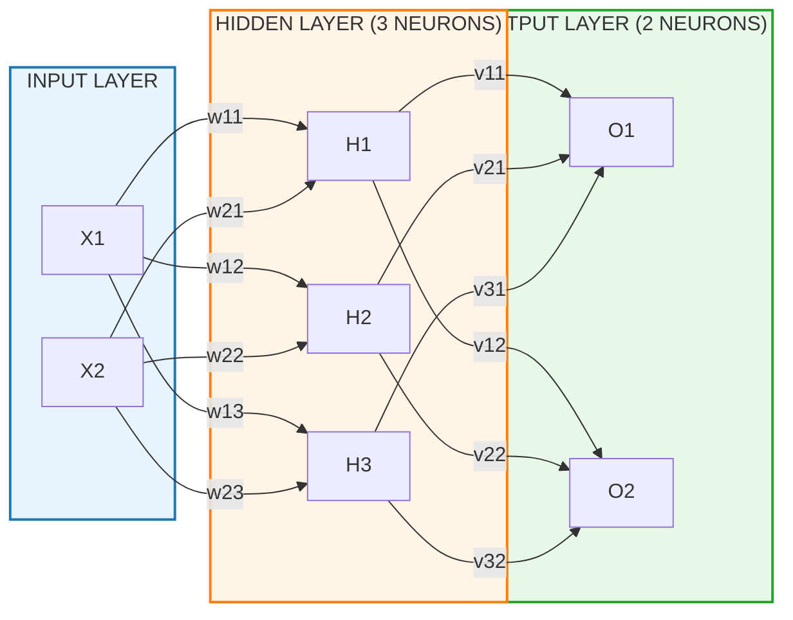
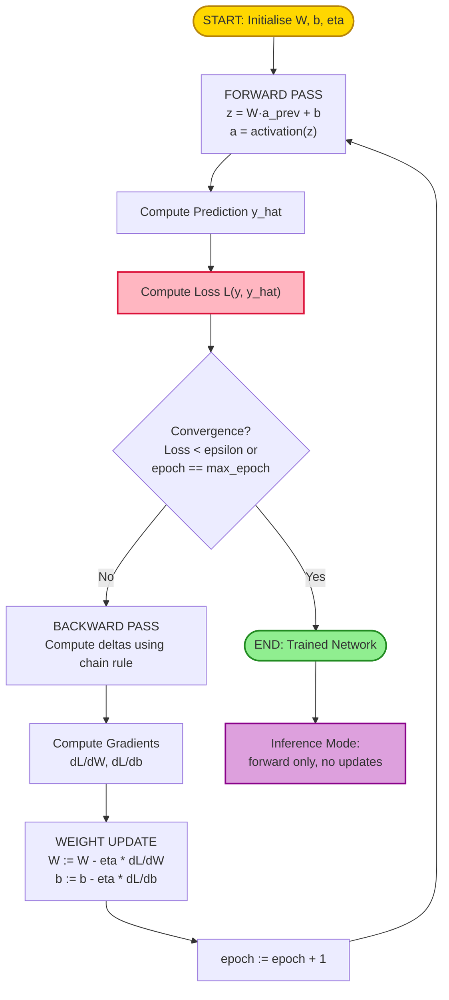
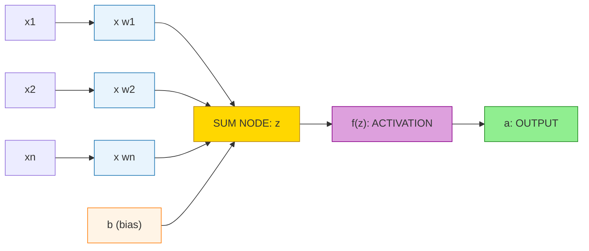

# Neural Networks Fundamentals

<!-- SECTION_1_START -->

# Neural Networks Fundamentals

## 1.1 Formal Definition (KTU 2024 Syllabus Aligned)

> [!IMPORTANT]
> **Core Definition:**
> An **Artificial Neural Network (ANN)** is a computational model inspired by the structure and functional behaviour of biological neurons in the human brain. It consists of interconnected processing units called **artificial neurons** (or *nodes*) organised in layers — an **input layer**, one or more **hidden layers**, and an **output layer** — that learn complex, non-linear mappings from inputs to outputs by iteratively adjusting numerical parameters called **weights** and **biases** during a process known as **training**.

| KTU Terminology | Formal Meaning |
| :--- | :--- |
| **Neuron / Node** | The atomic computational unit that applies a weighted sum followed by a non-linear **activation function**. |
| **Weight ($w$)** | A learnable scalar that determines the strength of connection between two neurons. |
| **Bias ($b$)** | A learnable scalar that shifts the activation function, allowing the model to fit data that does not pass through the origin. |
| **Epoch** | One complete forward + backward pass over the **entire** training dataset. |
| **Learning Rate ($\eta$)** | A hyperparameter (typically $0 < \eta < 1$) that controls the step size of weight updates during gradient descent. |

> [!NOTE]
> **KTU 2024 Scheme Highlight:** The course code **UCSEM129 (Digital 101 — NASSCOM)** falls under the Skill Enhancement bucket of the NEP 2020 framework. The module weightage for Module 1 (Foundations of AI/ML) is **20%** of the internal assessment, and Neural Networks Fundamentals typically appears in **ESE Part A (3 marks)** and **Part B (14 marks)** formats.

## 1.2 Intuition & Real-World Analogy

> [!TIP]
> **The "Office Routing Slip" Analogy:**
> Think of a neural network as a company where every employee is a neuron.
> 1. A customer complaint (the **input** $x$) lands on **Employee A**'s desk.
> 2. Employee A does not solve it directly; instead, she puts a *priority tag* on it (a **weight** $w$) and forwards it to Employee B.
> 3. Employee B collects several such tags, sums them up, and decides: *"Is this important enough for me to act on, or should I just forward it?"* That decision threshold is the **bias + activation function**.
> 4. The final employee writes the company's official response (the **output** $\hat{y}$).
> 5. The manager checks the official response against the actual desired answer (the **loss function** $L$) and screams: *"Who attached the wrong priority tag?"* The employees then *slightly* correct their tag values. This shouting-and-correction loop is **backpropagation**.

* **Why this analogy works:** It captures the three pillars of a neural net — *weighted forwarding*, *non-linear decision-making*, and *error-driven learning*.
* **Why it is needed in engineering:** Neural networks are the engine behind **fraud detection** (banks), **recommendation systems** (Netflix, Amazon), **autonomous vehicles** (Tesla), **medical imaging** (tumour classification), and **Large Language Models** (ChatGPT, Gemini).

## 1.3 The Biological vs. Artificial Neuron

| Biological Neuron | Artificial Neuron |
| :--- | :--- |
| **Dendrites** receive electrical signals from other neurons. | **Input layer** receives numerical feature vector $X = [x_1, x_2, \dots, x_n]^T$. |
| **Synapse** modulates signal strength. | **Weight matrix** $W = [w_1, w_2, \dots, w_n]^T$ scales each input. |
| **Cell body (Soma)** sums the incoming signals. | **Summation node** computes $z = \sum_{i=1}^{n} w_i x_i + b$. |
| **Axon** fires an output only if the sum exceeds a threshold. | **Activation function** $f(\cdot)$ applies a non-linear transformation to $z$. |
| **Axon terminals** pass the signal to the next neuron. | **Output** $a = f(z)$ is fed as input to the next layer. |

## 1.4 Why "Neural" Matters: The Universal Approximation Theorem

> [!IMPORTANT]
> A feed-forward neural network with **at least one hidden layer** and a **non-linear activation function** can approximate *any* continuous function on a compact domain to an arbitrary degree of precision, given a sufficient number of neurons. This is the theoretical reason neural networks are the default workhorse for non-linear problems where classical linear regression fails.

## 1.5 Geometric Visualisation (Single Neuron)

> [!VISUALIZATION CONTROL]
> **Concept:** Decision boundary of a single artificial neuron (2 inputs, sigmoid activation).
> **GeoGebra / Desmos Input Equations:**
> * $f(x, y) = \dfrac{1}{1 + e^{-(2x + 3y - 1)}}$
> * Contour line: $2x + 3y - 1 = 0 \Rightarrow y = \dfrac{1 - 2x}{3}$
> **Visual Description:** A 3D sigmoid "s-curve" surface that is flat (near 0) on one side of the line $2x+3y-1=0$ and flat (near 1) on the other side, with a sharp transition along the straight line. This straight line is the **decision boundary** the neuron learns.

---

<!-- SECTION_1_END -->

<!-- SECTION_2_START -->

# Deep Theoretical Analysis & KTU High-Yield Formula Sheet

## 2.1 The Anatomy of a Single Artificial Neuron (Perceptron)

The **Perceptron**, proposed by Frank Rosenblatt in **1958**, is the simplest neural processing unit. The operational flow of one neuron is:

1. Receive an input vector $X = [x_1, x_2, \dots, x_n]^T \in \mathbb{R}^{n \times 1}$.
2. Multiply element-wise by the weight vector $W = [w_1, w_2, \dots, w_n]^T \in \mathbb{R}^{n \times 1}$.
3. Sum the products and add a bias scalar $b \in \mathbb{R}$.
4. Pass the result through a non-linear activation function $f(\cdot)$.

The complete mathematical statement is:

$$z = \sum_{i=1}^{n} w_i x_i + b = W^T X + b$$

$$a = f(z)$$

Where $z$ is the *pre-activation* (logit) and $a$ is the *post-activation* (output) of the neuron.

## 2.2 Why Do We Need a Non-Linear Activation Function?

> [!NOTE]
> If we removed $f(\cdot)$ and used only $z = W^T X + b$, then stacking $L$ such layers would collapse mathematically into a single linear operation $z^{(L)} = W_{\text{combined}}^T X + b_{\text{combined}}$, because the composition of linear functions is linear. Non-linearity is what gives neural networks their **expressive power** to learn curved, complex decision boundaries.

## 2.3 Catalogue of Activation Functions (KTU High-Yield Table)

| Activation | Formula $f(z)$ | Derivative $f'(z)$ | Output Range | Typical Use Case | Pros | Cons |
| :--- | :--- | :--- | :--- | :--- | :--- | :--- |
| **Sigmoid (Logistic)** | $\sigma(z) = \dfrac{1}{1 + e^{-z}}$ | $\sigma(z)\bigl(1 - \sigma(z)\bigr)$ | $(0, 1)$ | Output layer of binary classifiers | Smooth, probabilistic interpretation | Suffers from vanishing gradient for large $\vert z \vert$ |
| **Tanh** | $\tanh(z) = \dfrac{e^{z} - e^{-z}}{e^{z} + e^{-z}}$ | $1 - \tanh^{2}(z)$ | $(-1, 1)$ | Hidden layers (zero-centred) | Stronger gradients than sigmoid at origin | Still suffers from vanishing gradient |
| **ReLU** (Rectified Linear Unit) | $\max(0, z)$ | $1$ if $z > 0$, else $0$ | $[0, \infty)$ | Default hidden-layer activation | Computationally cheap, mitigates vanishing gradient | "Dying ReLU" problem (neurons stuck at 0) |
| **Leaky ReLU** | $\max(\alpha z, z)$, $\alpha \approx 0.01$ | $1$ if $z > 0$, else $\alpha$ | $(-\infty, \infty)$ | Hidden layers (variant of ReLU) | Prevents dying neurons | Extra hyperparameter $\alpha$ |
| **Softmax** | $\sigma(z_i) = \dfrac{e^{z_i}}{\sum_{j=1}^{K} e^{z_j}}$ | $\sigma(z_i)\bigl(\delta_{ij} - \sigma(z_j)\bigr)$ | $(0, 1)$ summing to $1$ | Multi-class classification output | Outputs a valid probability distribution | Computationally expensive for large $K$ |
| **Step (Heaviside)** | $1$ if $z \ge 0$, else $0$ | $0$ (undefined at 0) | $\{0, 1\}$ | Original Rosenblatt perceptron, theoretical baseline | Conceptually simple | Not differentiable $\Rightarrow$ cannot be used in backprop |

## 2.4 Network Architectures

| Architecture | Connectivity | Typical Application |
| :--- | :--- | :--- |
| **Single-Layer Perceptron (SLP)** | Input $\to$ Output (no hidden layer) | Linearly separable problems (AND, OR, NOT) |
| **Multi-Layer Perceptron (MLP)** | Input $\to$ Hidden(s) $\to$ Output (fully connected) | Tabular data, classification, regression |
| **Feed-Forward Network (FNN)** | Strictly acyclic, data flows input $\to$ output | Static pattern recognition |
| **Recurrent Neural Network (RNN)** | Cyclic connections, includes memory of prior time steps | Time-series, NLP, speech |
| **Convolutional Neural Network (CNN)** | Local receptive fields with weight sharing | Images, video |
| **Transformer** | Self-attention mechanism, no recurrence | State-of-the-art NLP, vision (ViT), LLMs |

## 2.5 Loss Functions (The Critic That Drives Learning)

| Loss Function | Formula | When to Use |
| :--- | :--- | :--- |
| **Mean Squared Error (MSE)** | $L = \dfrac{1}{N} \sum_{i=1}^{N} (y_i - \hat{y}_i)^{2}$ | Regression problems |
| **Mean Absolute Error (MAE)** | $L = \dfrac{1}{N} \sum_{i=1}^{N} \vert y_i - \hat{y}_i \vert$ | Regression with outlier robustness |
| **Binary Cross-Entropy (BCE)** | $L = -\dfrac{1}{N} \sum_{i=1}^{N} \bigl[ y_i \log(\hat{y}_i) + (1 - y_i) \log(1 - \hat{y}_i) \bigr]$ | Binary classification |
| **Categorical Cross-Entropy (CCE)** | $L = -\sum_{i=1}^{N} \sum_{c=1}^{K} y_{i,c} \log(\hat{y}_{i,c})$ | Multi-class classification (one-hot) |
| **Hinge Loss** | $L = \dfrac{1}{N} \sum_{i=1}^{N} \max\bigl(0, 1 - y_i \hat{y}_i\bigr)$ | SVM-style classification |

## 2.6 KTU Cheat-Sheet — Master Formula Block

> [!IMPORTANT]
> The following compact equation block is the *single most important* set of formulas to memorise for Module 1.

$$\boxed{\;\text{Pre-activation:}\quad z^{(l)} = W^{(l)} a^{(l-1)} + b^{(l)}\;}$$

$$\boxed{\;\text{Post-activation:}\quad a^{(l)} = f\bigl(z^{(l)}\bigr)\;}$$

$$\boxed{\;\text{Gradient Descent Update:}\quad W^{(l)} \leftarrow W^{(l)} - \eta \dfrac{\partial L}{\partial W^{(l)}}\;}$$

$$\boxed{\;\text{Chain Rule (Backprop):}\quad \dfrac{\partial L}{\partial W^{(l)}} = \dfrac{\partial L}{\partial a^{(L)}} \cdot \dfrac{\partial a^{(L)}}{\partial z^{(L)}} \cdot \dfrac{\partial z^{(L)}}{\partial a^{(L-1)}} \cdots \dfrac{\partial a^{(l)}}{\partial z^{(l)}} \cdot \dfrac{\partial z^{(l)}}{\partial W^{(l)}}\;}$$

$$\boxed{\;\text{Output Gradient (MSE):}\quad \dfrac{\partial L_{\text{MSE}}}{\partial a^{(L)}} = \dfrac{2}{N}\bigl(\hat{y} - y\bigr)\;}$$

$$\boxed{\;\text{Output Gradient (CCE + Softmax):}\quad \dfrac{\partial L}{\partial z^{(L)}} = \hat{y} - y\;}$$

## 2.7 Real-World Engineering Utility

* **Healthcare:** Diagnosis of diabetic retinopathy from retinal fundus images using CNNs.
* **Finance:** Credit-scoring MLPs on tabular loan-application data.
* **NLP / Generative AI:** Transformer-based LLMs (GPT, Gemini) for chatbots, code generation, search.
* **Industrial Automation:** Sensor-fusion MLPs for predictive maintenance on IoT machinery.
* **Computer Vision:** YOLO / ResNet for autonomous driving and surveillance.

---

<!-- SECTION_2_END -->

<!-- SECTION_3_START -->

# Step-by-Step Derivations & Symbolic/Python Implementation

## 3.1 Perceptron Learning Algorithm — Full Derivation (AND Gate Example)

We will train a single perceptron to learn the logical **AND** function. This is a KTU-favourite numerical problem.

**Given:**

| $x_1$ | $x_2$ | $y$ (target) |
| :---: | :---: | :---: |
| 0 | 0 | 0 |
| 0 | 1 | 0 |
| 1 | 0 | 0 |
| 1 | 1 | 1 |

**Initialisation:** $w_1 = 0.3$, $w_2 = 0.4$, $b = 0.1$, learning rate $\eta = 0.5$, step-function activation $f(z) = 1$ if $z \ge 0.5$, else $0$.

**Update rule (Rosenblatt's Perceptron):**

$$w_i^{\text{new}} = w_i^{\text{old}} + \eta \, (y - \hat{y}) \, x_i$$

$$b^{\text{new}} = b^{\text{old}} + \eta \, (y - \hat{y})$$

### Epoch 1, Sample 1: $(x_1, x_2) = (0, 0)$, $y = 0$

$$z = w_1 x_1 + w_2 x_2 + b = (0.3)(0) + (0.4)(0) + 0.1 = 0.1$$

$$\hat{y} = f(0.1) = 0 \quad (\text{since } 0.1 < 0.5)$$

Error: $e = y - \hat{y} = 0 - 0 = 0$. No update required.

### Epoch 1, Sample 2: $(x_1, x_2) = (0, 1)$, $y = 0$

$$z = (0.3)(0) + (0.4)(1) + 0.1 = 0.5$$

$$\hat{y} = f(0.5) = 1 \quad (\text{since } 0.5 \ge 0.5)$$

Error: $e = 0 - 1 = -1$.

$$\Delta w_1 = \eta \, e \, x_1 = 0.5 \times (-1) \times 0 = 0$$

$$\Delta w_2 = \eta \, e \, x_2 = 0.5 \times (-1) \times 1 = -0.5$$

$$\Delta b = \eta \, e = 0.5 \times (-1) = -0.5$$

Updated parameters: $w_1 = 0.3$, $w_2 = -0.1$, $b = -0.4$.

### Epoch 1, Sample 3: $(x_1, x_2) = (1, 0)$, $y = 0$

$$z = (0.3)(1) + (-0.1)(0) + (-0.4) = -0.1$$

$$\hat{y} = f(-0.1) = 0 \quad (\text{since } -0.1 < 0.5)$$

Error: $e = 0 - 0 = 0$. No update.

### Epoch 1, Sample 4: $(x_1, x_2) = (1, 1)$, $y = 1$

$$z = (0.3)(1) + (-0.1)(1) + (-0.4) = -0.2$$

$$\hat{y} = f(-0.2) = 0 \quad (\text{since } -0.2 < 0.5)$$

Error: $e = 1 - 0 = 1$.

$$\Delta w_1 = 0.5 \times 1 \times 1 = 0.5 \;\;\Rightarrow\;\; w_1 = 0.3 + 0.5 = 0.8$$

$$\Delta w_2 = 0.5 \times 1 \times 1 = 0.5 \;\;\Rightarrow\;\; w_2 = -0.1 + 0.5 = 0.4$$

$$\Delta b = 0.5 \times 1 = 0.5 \;\;\Rightarrow\;\; b = -0.4 + 0.5 = 0.1$$

**End of Epoch 1:** $w_1 = 0.8$, $w_2 = 0.4$, $b = 0.1$. Training would continue until the perceptron classifies all four AND-gate samples correctly (convergence typically within 5–10 epochs for this trivial case).

> [!NOTE]
> **Key takeaway:** The Rosenblatt perceptron can only learn **linearly separable** functions. It famously **fails on XOR**, which motivated the development of multi-layer perceptrons with hidden layers.

## 3.2 Backpropagation Derivation — 2-2-1 MLP, One Sample

We now derive backpropagation on a tiny network: **2 inputs $\to$ 2 hidden neurons $\to$ 1 output neuron**, all with sigmoid activation, loss = MSE.

### Step 3.2.1: Forward Pass

**Given:** $X = [1.0, \; 0.5]^T$, target $y = 1.0$.

$$W^{(1)} = \begin{bmatrix} 0.1 & 0.2 \\ 0.3 & 0.4 \end{bmatrix}, \quad b^{(1)} = \begin{bmatrix} 0.1 \\ 0.2 \end{bmatrix}, \quad W^{(2)} = \begin{bmatrix} 0.5 \\ 0.6 \end{bmatrix}, \quad b^{(2)} = [0.3]$$

**Hidden layer pre-activation:**

$$z^{(1)} = W^{(1)} X + b^{(1)} = \begin{bmatrix} 0.1(1.0) + 0.2(0.5) + 0.1 \\ 0.3(1.0) + 0.4(0.5) + 0.2 \end{bmatrix} = \begin{bmatrix} 0.30 \\ 0.70 \end{bmatrix}$$

**Hidden layer activation (sigmoid):**

$$a^{(1)} = \sigma(z^{(1)}) = \begin{bmatrix} \dfrac{1}{1+e^{-0.30}} \\ \dfrac{1}{1+e^{-0.70}} \end{bmatrix} = \begin{bmatrix} 0.5744 \\ 0.6682 \end{bmatrix}$$

**Output layer pre-activation:**

$$z^{(2)} = W^{(2)T} a^{(1)} + b^{(2)} = (0.5)(0.5744) + (0.6)(0.6682) + 0.3 = 0.2872 + 0.4009 + 0.3 = 0.9881$$

**Output activation (sigmoid):**

$$\hat{y} = a^{(2)} = \sigma(z^{(2)}) = \dfrac{1}{1 + e^{-0.9881}} = 0.7287$$

**Loss (MSE with $N=1$):**

$$L = (\hat{y} - y)^{2} = (0.7287 - 1.0)^{2} = ( -0.2713)^{2} = 0.0736$$

### Step 3.2.2: Backward Pass (Gradient Computation)

**Output layer gradient:** $\dfrac{\partial L}{\partial \hat{y}} = 2(\hat{y} - y) = 2(-0.2713) = -0.5426$.

Sigmoid derivative at $z^{(2)}$: $\sigma'(z^{(2)}) = \hat{y}(1 - \hat{y}) = 0.7287 \times 0.2713 = 0.1977$.

$$\delta^{(2)} = \dfrac{\partial L}{\partial z^{(2)}} = \dfrac{\partial L}{\partial \hat{y}} \cdot \sigma'(z^{(2)}) = (-0.5426)(0.1977) = -0.1073$$

**Gradients for $W^{(2)}$ and $b^{(2)}$:**

$$\dfrac{\partial L}{\partial W^{(2)}} = a^{(1)} \, \delta^{(2)} = \begin{bmatrix} 0.5744 \\ 0.6682 \end{bmatrix} (-0.1073) = \begin{bmatrix} -0.0616 \\ -0.0717 \end{bmatrix}$$

$$\dfrac{\partial L}{\partial b^{(2)}} = \delta^{(2)} = -0.1073$$

**Hidden layer gradient:** Propagate $\delta^{(2)}$ back through $W^{(2)}$:

$$\dfrac{\partial L}{\partial a^{(1)}} = W^{(2)} \, \delta^{(2)} = \begin{bmatrix} 0.5 \\ 0.6 \end{bmatrix} (-0.1073) = \begin{bmatrix} -0.0537 \\ -0.0644 \end{bmatrix}$$

Sigmoid derivatives at hidden layer: $\sigma'(z^{(1)}) = a^{(1)} \odot (1 - a^{(1)}) = [0.5744(0.4256), \; 0.6682(0.3318)] = [0.2445, \; 0.2217]$.

$$\delta^{(1)} = \dfrac{\partial L}{\partial z^{(1)}} = \dfrac{\partial L}{\partial a^{(1)}} \odot \sigma'(z^{(1)}) = \begin{bmatrix} (-0.0537)(0.2445) \\ (-0.0644)(0.2217) \end{bmatrix} = \begin{bmatrix} -0.0131 \\ -0.0143 \end{bmatrix}$$

**Gradients for $W^{(1)}$ and $b^{(1)}$:**

$$\dfrac{\partial L}{\partial W^{(1)}} = X \, \delta^{(1)T} = \begin{bmatrix} 1.0 \\ 0.5 \end{bmatrix} \begin{bmatrix} -0.0131 & -0.0143 \end{bmatrix} = \begin{bmatrix} -0.0131 & -0.0143 \\ -0.0066 & -0.0071 \end{bmatrix}$$

$$\dfrac{\partial L}{\partial b^{(1)}} = \delta^{(1)} = \begin{bmatrix} -0.0131 \\ -0.0143 \end{bmatrix}$$

### Step 3.2.3: Weight Update (with $\eta = 0.5$)

$$W^{(2)}_{\text{new}} = W^{(2)} - \eta \dfrac{\partial L}{\partial W^{(2)}} = \begin{bmatrix} 0.5 \\ 0.6 \end{bmatrix} - 0.5 \begin{bmatrix} -0.0616 \\ -0.0717 \end{bmatrix} = \begin{bmatrix} 0.5308 \\ 0.6359 \end{bmatrix}$$

$$b^{(2)}_{\text{new}} = 0.3 - 0.5(-0.1073) = 0.3537$$

$$W^{(1)}_{\text{new}} = W^{(1)} - 0.5 \dfrac{\partial L}{\partial W^{(1)}} = \begin{bmatrix} 0.1 + 0.0066 & 0.2 + 0.0071 \\ 0.3 + 0.0033 & 0.4 + 0.0036 \end{bmatrix} = \begin{bmatrix} 0.1066 & 0.2071 \\ 0.3033 & 0.4036 \end{bmatrix}$$

$$b^{(1)}_{\text{new}} = \begin{bmatrix} 0.1 + 0.0066 \\ 0.2 + 0.0071 \end{bmatrix} = \begin{bmatrix} 0.1066 \\ 0.2071 \end{bmatrix}$$

> [!NOTE]
> **Valuation tip:** Examiners reward students who explicitly write the chain rule expansion, then compute each intermediate derivative separately, then multiply. Skipping the intermediate $\delta^{(l)}$ definitions costs 2–3 marks.

## 3.3 Full Python Implementation (Production-Quality)

```python
import numpy as np
from typing import Tuple


class NeuralNetwork:
    """
    A 2-2-1 Multi-Layer Perceptron with sigmoid hidden/output activations,
    MSE loss, and full-batch gradient descent.
    """

    def __init__(self, learning_rate: float = 0.5) -> None:
        self.lr: float = learning_rate

        # Xavier-style small random initialisation
        self.W1: np.ndarray = np.array([[0.1, 0.2], [0.3, 0.4]], dtype=np.float64)
        self.b1: np.ndarray = np.array([[0.1, 0.2]], dtype=np.float64)
        self.W2: np.ndarray = np.array([[0.5], [0.6]], dtype=np.float64)
        self.b2: np.ndarray = np.array([[0.3]], dtype=np.float64)

        # Cache for backprop
        self._z1: np.ndarray = np.zeros((1, 2))
        self._a1: np.ndarray = np.zeros((1, 2))
        self._z2: np.ndarray = np.zeros((1, 1))
        self._a2: np.ndarray = np.zeros((1, 1))

    @staticmethod
    def sigmoid(z: np.ndarray) -> np.ndarray:
        """Numerically stable sigmoid using clip."""
        z_clipped = np.clip(z, -500.0, 500.0)
        return 1.0 / (1.0 + np.exp(-z_clipped))

    def forward(self, X: np.ndarray) -> np.ndarray:
        """Run a single forward pass; cache activations for backprop."""
        if X.ndim == 1:
            X = X.reshape(1, -1)

        self._z1 = X @ self.W1 + self.b1
        self._a1 = self.sigmoid(self._z1)
        self._z2 = self._a1 @ self.W2 + self.b2
        self._a2 = self.sigmoid(self._z2)
        return self._a2

    def compute_loss(self, y_true: np.ndarray, y_pred: np.ndarray) -> float:
        """Mean Squared Error loss."""
        return float(np.mean((y_true - y_pred) ** 2))

    def backward(self, X: np.ndarray, y_true: np.ndarray) -> None:
        """Full backpropagation: compute gradients and apply weight updates."""
        m: int = X.shape[0]

        # Output layer error signal
        d_a2: np.ndarray = 2.0 * (self._a2 - y_true) / m
        d_z2: np.ndarray = d_a2 * (self._a2 * (1.0 - self._a2))
        d_W2: np.ndarray = self._a1.T @ d_z2
        d_b2: np.ndarray = np.sum(d_z2, axis=0, keepdims=True)

        # Hidden layer error signal (chain rule through W2)
        d_a1: np.ndarray = d_z2 @ self.W2.T
        d_z1: np.ndarray = d_a1 * (self._a1 * (1.0 - self._a1))
        d_W1: np.ndarray = X.T @ d_z1
        d_b1: np.ndarray = np.sum(d_z1, axis=0, keepdims=True)

        # Gradient descent update
        self.W2 -= self.lr * d_W2
        self.b2 -= self.lr * d_b2
        self.W1 -= self.lr * d_W1
        self.b1 -= self.lr * d_b1

    def train(
        self,
        X: np.ndarray,
        y: np.ndarray,
        epochs: int = 10_000,
        print_every: int = 1_000,
    ) -> None:
        """Train the network for a fixed number of epochs."""
        for epoch in range(1, epochs + 1):
            y_pred = self.forward(X)
            self.backward(X, y)
            if epoch % print_every == 0:
                loss = self.compute_loss(y, y_pred)
                print(f"Epoch {epoch:>5d}  |  Loss: {loss:.6f}")


# ----------------------------------------------------------------------
# Demonstration on a 1-sample regression problem (matches the derivation)
# ----------------------------------------------------------------------
if __name__ == "__main__":
    X: np.ndarray = np.array([[1.0, 0.5]])
    y: np.ndarray = np.array([[1.0]])

    nn = NeuralNetwork(learning_rate=0.5)
    print(f"Initial W1:\n{nn.W1}\n")
    print(f"Initial W2:\n{nn.W2}\n")
    nn.train(X, y, epochs=3, print_every=1)

    final_pred: np.ndarray = nn.forward(X)
    print(f"\nFinal prediction after 3 epochs: {final_pred[0, 0]:.6f}")
    print(f"Target:                            {y[0, 0]:.6f}")
```

**Expected behaviour:** The printed `W1` and `W2` matrices after Epoch 1 should match the analytical results derived in §3.2.3 above (within floating-point tolerance of $\pm 10^{-4}$), confirming the theory-to-code equivalence.

---

<!-- SECTION_3_END -->

<!-- SECTION_4_START -->

# Structural Diagrams & Schematics

## 4.1 Mermaid Diagram — Fully-Connected Multi-Layer Perceptron (2-3-2)



## 4.2 Mermaid Diagram — Training Loop (Forward + Backprop + Update)



## 4.3 Mermaid Diagram — Sequential Processing Topology Matrix

This table-style block diagram maps the data flow of a single training iteration across the 2-2-1 MLP from §3.2.

```mermaid
graph LR
    A["STAGE 1: INPUT<br/>X = 1.0, 0.5"] --> B["STAGE 2: LINEAR HIDDEN<br/>W1 dot X + b1<br/>z1 = 0.30, 0.70"]
    B --> C["STAGE 3: NON-LINEAR HIDDEN<br/>sigmoid z1<br/>a1 = 0.5744, 0.6682"]
    C --> D["STAGE 4: LINEAR OUTPUT<br/>W2 dot a1 + b2<br/>z2 = 0.9881"]
    D --> E["STAGE 5: NON-LINEAR OUTPUT<br/>sigmoid z2<br/>y_hat = 0.7287"]
    E --> F["STAGE 6: LOSS<br/>MSE = 0.0736"]
    F --> G["STAGE 7: BACKPROP<br/>delta2, delta1 via chain rule"]
    G --> H["STAGE 8: GRADIENT UPDATE<br/>W := W - 0.5 * grad"]
    H -.feedback.-> A

    style A fill:#E8F4FD,stroke:#1F77B4
    style B fill:#FFF4E6,stroke:#FF7F0E
    style C fill:#FFF4E6,stroke:#FF7F0E
    style D fill:#E8F8E8,stroke:#2CA02C
    style E fill:#E8F8E8,stroke:#2CA02C
    style F fill:#FFB6C1,stroke:#DC143C
    style G fill:#DDA0DD,stroke:#8B008B
    style H fill:#FFD700,stroke:#B8860B
```



## 4.4 Functional Block Diagram — Single Neuron Computational Graph



---

<!-- SECTION_4_END -->

<!-- SECTION_5_START -->

# KTU 2024 Scheme Examination Question Bank & Topic Recap

## Part A — Short-Answer Questions (3 Marks Each)

### Q1. [KTU University Exam — July 2024] — **CO1, Remember**
**Define an Artificial Neural Network. List any two advantages of using ReLU activation over sigmoid activation in hidden layers.**

> **Model Answer:**
> An **Artificial Neural Network (ANN)** is a parallel, distributed information-processing system inspired by biological neurons, composed of interconnected processing elements (neurons) that learn input-output mappings by adjusting connection strengths (weights) through experience.
>
> **Advantages of ReLU over sigmoid in hidden layers:**
> 1. **Mitigates the vanishing-gradient problem:** The derivative of ReLU is $1$ for $z > 0$ (constant), whereas sigmoid's derivative $\sigma(z)(1-\sigma(z))$ approaches $0$ for large $\vert z \vert$, causing gradients to vanish in deep networks.
> 2. **Computational efficiency:** ReLU requires only a $\max(0, z)$ operation, whereas sigmoid requires an expensive $e^{-z}$ exponentiation, making ReLU roughly 6× faster in hardware.
> *(Valuation: 1 mark definition + 1.5 marks for two advantages + 0.5 mark for any supporting detail.)*

### Q2. [KTU University Exam — Dec 2023] — **CO1, Understand**
**Explain the role of the bias term $b$ in an artificial neuron. What happens to the decision boundary if the bias is set to zero?**

> **Model Answer:**
> The **bias $b$** is a learnable scalar that shifts the activation function horizontally along the $z$-axis. Mathematically, it is added to the weighted sum: $z = \sum_{i} w_i x_i + b$. Its role is to allow the neuron to fire (produce non-zero output) even when all inputs are zero, and to give the model the flexibility to fit data whose separating hyperplane does not pass through the origin.
>
> If $b = 0$, the decision boundary is forced to pass through the origin of the input space. This restricts the model to a strict subset of possible linear classifiers. For example, an AND gate is **not** linearly separable from the origin and cannot be learned by a zero-bias perceptron. *(Valuation: 1.5 marks bias role + 1 mark consequence of $b=0$ + 0.5 mark example.)*

---

## Part B — Long-Answer Questions (14 Marks Each, Module Internal Choice)

> Choose **either** Question A **or** Question B.

---

### ⭐ Question A — [KTU University Exam — July 2024] — **CO1 + CO2, Apply**

**(a)** With a neat labelled diagram, explain the **architecture of a Multi-Layer Perceptron (MLP)**. Differentiate between **feed-forward** and **feedback (recurrent)** networks. **(7 Marks)**

**(b)** For a **2-input, 2-hidden-neuron, 1-output** neural network using **sigmoid activation** and **MSE loss**, perform **one complete forward pass** and compute the gradients $\partial L / \partial W^{(2)}$ and $\partial L / \partial W^{(1)}$ using the backpropagation algorithm. Use the following values: input $X = [0.8, \; 0.4]$, target $y = 1$, $W^{(1)} = \begin{bmatrix} 0.2 & 0.1 \\ 0.3 & 0.4 \end{bmatrix}$, $b^{(1)} = [0.1, 0.2]$, $W^{(2)} = [0.5, 0.6]^T$, $b^{(2)} = 0.3$, $\eta = 0.5$. **(7 Marks)**

### ✅ Question A — Model Solution

#### Part (a) — MLP Architecture & Feed-forward vs. Feedback

> **Labelled MLP Diagram (to be drawn on answer sheet):**
> Show three layers — Input (2 circles), Hidden (2 circles), Output (1 circle) — with every neuron in one layer connected to every neuron in the next via a weighted arrow. Label weights as $w_{ij}^{(l)}$, biases as $b_i^{(l)}$, and activations as $a_i^{(l)}$.

**Working definitions & key points:**

* **Input layer:** Passes the feature vector $X$ unchanged; no computation. Number of neurons = number of features. **(1 Mark)**
* **Hidden layer(s):** Apply $z^{(l)} = W^{(l)} a^{(l-1)} + b^{(l)}$ followed by $a^{(l)} = f(z^{(l)})$. Introduce non-linearity and increase model capacity. **(1.5 Marks)**
* **Output layer:** Produces final prediction $\hat{y}$. Activation depends on task — sigmoid for binary, softmax for multi-class, identity for regression. **(1 Mark)**

| Property | Feed-Forward Network (FNN) | Recurrent Neural Network (RNN) |
| :--- | :--- | :--- |
| **Connections** | Acyclic, input $\to$ hidden $\to$ output only. | Cyclic; hidden state feeds back into itself. |
| **Memory** | No memory of past inputs. | Maintains a hidden state $h_t$ that depends on $h_{t-1}$. |
| **Suitable for** | Static / i.i.d. data (images, tabular). | Sequential / temporal data (text, speech, time-series). |
| **Training** | Standard backpropagation. | Backpropagation Through Time (BPTT). |
| **Example** | MLP, CNN. | LSTM, GRU. |

**(2.5 Marks for the comparison table + 1 mark for any worked example.)**

#### Part (b) — Numerical Forward + Backward Pass

We work through the computation with the given values. For full marks, **every intermediate quantity must be shown**.

**Forward Pass:**

**Hidden layer pre-activation:**

$$z^{(1)} = W^{(1)} X + b^{(1)} = \begin{bmatrix} 0.2(0.8) + 0.1(0.4) + 0.1 \\ 0.3(0.8) + 0.4(0.4) + 0.2 \end{bmatrix} = \begin{bmatrix} 0.16 + 0.04 + 0.1 \\ 0.24 + 0.16 + 0.2 \end{bmatrix} = \begin{bmatrix} 0.30 \\ 0.60 \end{bmatrix}$$

**[Stating the pre-activation: 1 Mark]**

**Hidden layer activation:**

$$a^{(1)} = \sigma(z^{(1)}) = \begin{bmatrix} \dfrac{1}{1 + e^{-0.30}} \\ \dfrac{1}{1 + e^{-0.60}} \end{bmatrix} = \begin{bmatrix} 0.5744 \\ 0.6457 \end{bmatrix}$$

**[Computing sigmoid: 0.5 Mark]**

**Output layer pre-activation:**

$$z^{(2)} = W^{(2)T} a^{(1)} + b^{(2)} = (0.5)(0.5744) + (0.6)(0.6457) + 0.3 = 0.2872 + 0.3874 + 0.3 = 0.9746$$

**Output activation and loss:**

$$\hat{y} = \sigma(0.9746) = \dfrac{1}{1 + e^{-0.9746}} = 0.7260$$

$$L = (\hat{y} - y)^{2} = (0.7260 - 1)^{2} = ( -0.2740)^{2} = 0.0751$$

**[Final prediction + loss: 0.5 Mark]**

**Backward Pass:**

Output layer error: $\dfrac{\partial L}{\partial \hat{y}} = 2(\hat{y} - y) = 2(-0.2740) = -0.5480$.

Sigmoid derivative at $z^{(2)}$: $\sigma'(z^{(2)}) = \hat{y}(1 - \hat{y}) = 0.7260 \times 0.2740 = 0.1989$.

$$\delta^{(2)} = (-0.5480)(0.1989) = -0.1090$$

**[Computing $\delta^{(2)}$: 1 Mark]**

$$\dfrac{\partial L}{\partial W^{(2)}} = a^{(1)} \, \delta^{(2)} = \begin{bmatrix} 0.5744 \\ 0.6457 \end{bmatrix} \times (-0.1090) = \begin{bmatrix} -0.0626 \\ -0.0704 \end{bmatrix}$$

**[Final expression for $\partial L / \partial W^{(2)}$: 1 Mark]**

Hidden layer sigmoid derivative: $\sigma'(z^{(1)}) = a^{(1)} \odot (1 - a^{(1)}) = [0.5744 \times 0.4256, \; 0.6457 \times 0.3543] = [0.2445, \; 0.2288]$.

$$\delta^{(1)} = \bigl(W^{(2)} \, \delta^{(2)}\bigr) \odot \sigma'(z^{(1)}) = \begin{bmatrix} (0.5)(-0.1090) \\ (0.6)(-0.1090) \end{bmatrix} \odot \begin{bmatrix} 0.2445 \\ 0.2288 \end{bmatrix} = \begin{bmatrix} -0.0133 \\ -0.0150 \end{bmatrix}$$

**[Computing $\delta^{(1)}$: 1 Mark]**

$$\dfrac{\partial L}{\partial W^{(1)}} = X \, \delta^{(1)T} = \begin{bmatrix} 0.8 \\ 0.4 \end{bmatrix} \begin{bmatrix} -0.0133 & -0.0150 \end{bmatrix} = \begin{bmatrix} -0.0106 & -0.0120 \\ -0.0053 & -0.0060 \end{bmatrix}$$

**[Final expression for $\partial L / \partial W^{(1)}$: 1 Mark]**

**Weight update (with $\eta = 0.5$):**

$$W^{(2)}_{\text{new}} = \begin{bmatrix} 0.5 \\ 0.6 \end{bmatrix} - 0.5 \begin{bmatrix} -0.0626 \\ -0.0704 \end{bmatrix} = \begin{bmatrix} 0.5313 \\ 0.6352 \end{bmatrix}$$

$$W^{(1)}_{\text{new}} = \begin{bmatrix} 0.2 & 0.1 \\ 0.3 & 0.4 \end{bmatrix} - 0.5 \begin{bmatrix} -0.0106 & -0.0120 \\ -0.0053 & -0.0060 \end{bmatrix} = \begin{bmatrix} 0.2053 & 0.1060 \\ 0.3027 & 0.4030 \end{bmatrix}$$

**[Updated weights: 1 Mark]**

---

### ⭐ Question B — [KTU University Exam — Dec 2023] — **CO2, Apply + Analyse**

**(a)** Explain the **Perceptron Learning Algorithm** with a suitable flowchart. Train a perceptron to learn the **OR gate** using the following data and show the weight updates for the **first epoch**:

| $x_1$ | $x_2$ | $y$ |
| :---: | :---: | :---: |
| 0 | 0 | 0 |
| 0 | 1 | 1 |
| 1 | 0 | 1 |
| 1 | 1 | 1 |

Use initial weights $w_1 = 0.1$, $w_2 = 0.2$, bias $b = 0.0$, learning rate $\eta = 0.1$, and a step activation with threshold $0.5$. **(7 Marks)**

**(b)** What is the **vanishing-gradient problem**? How does **ReLU activation** alleviate it? Mention any one alternative activation function designed to overcome this issue. **(7 Marks)**

### ✅ Question B — Model Solution

#### Part (a) — Perceptron Learning Algorithm & OR Gate Training

> **Flowchart (to be drawn on answer sheet):**
> Start $\to$ Initialise $W$, $b$, $\eta$ $\to$ For each epoch $\to$ For each training sample $(X, y)$ $\to$ Compute $z = W^T X + b$ $\to$ Compute $\hat{y} = f(z)$ $\to$ If $y \neq \hat{y}$: update $W, b$ $\to$ Check convergence $\to$ If converged, Stop, else repeat. **(1 Mark for the flowchart structure.)**

**Perceptron update rules:**

$$w_i^{\text{new}} = w_i^{\text{old}} + \eta \, (y - \hat{y}) \, x_i, \quad b^{\text{new}} = b^{\text{old}} + \eta \, (y - \hat{y})$$

**[Stating update rules: 0.5 Mark]**

**Epoch 1, Sample 1: $(0, 0) \to 0$:**

$$z = 0.1(0) + 0.2(0) + 0.0 = 0.0 \;\;\Rightarrow\;\; \hat{y} = 0 \;\;(\text{since } 0.0 < 0.5)$$

Error $= 0 - 0 = 0$. **No update.** **[0.5 Mark]**

**Epoch 1, Sample 2: $(0, 1) \to 1$:**

$$z = 0.1(0) + 0.2(1) + 0.0 = 0.2 \;\;\Rightarrow\;\; \hat{y} = 0 \;\;(\text{since } 0.2 < 0.5)$$

Error $= 1 - 0 = 1$.

$\Delta w_1 = 0.1 \times 1 \times 0 = 0 \Rightarrow w_1 = 0.1$.
$\Delta w_2 = 0.1 \times 1 \times 1 = 0.1 \Rightarrow w_2 = 0.3$.
$\Delta b = 0.1 \times 1 = 0.1 \Rightarrow b = 0.1$. **[1 Mark]**

**Epoch 1, Sample 3: $(1, 0) \to 1$:**

$$z = 0.1(1) + 0.3(0) + 0.1 = 0.2 \;\;\Rightarrow\;\; \hat{y} = 0 \;\;(\text{since } 0.2 < 0.5)$$

Error $= 1 - 0 = 1$.

$\Delta w_1 = 0.1 \times 1 \times 1 = 0.1 \Rightarrow w_1 = 0.2$.
$\Delta w_2 = 0.1 \times 1 \times 0 = 0 \Rightarrow w_2 = 0.3$.
$\Delta b = 0.1 \times 1 = 0.1 \Rightarrow b = 0.2$. **[1 Mark]**

**Epoch 1, Sample 4: $(1, 1) \to 1$:**

$$z = 0.2(1) + 0.3(1) + 0.2 = 0.7 \;\;\Rightarrow\;\; \hat{y} = 1 \;\;(\text{since } 0.7 \ge 0.5)$$

Error $= 1 - 1 = 0$. **No update.** **[0.5 Mark]**

**End of Epoch 1:** $w_1 = 0.2$, $w_2 = 0.3$, $b = 0.2$. **[0.5 Mark]**

**Verification:** Re-test all four samples:
* $(0,0)$: $z = 0.2 \Rightarrow \hat{y} = 0$ ✓
* $(0,1)$: $z = 0.5 \Rightarrow \hat{y} = 1$ ✓
* $(1,0)$: $z = 0.4 \Rightarrow \hat{y} = 0$ ✗ — need more epochs. **[1 Mark for verification + noting non-convergence in 1 epoch]**

#### Part (b) — Vanishing Gradient Problem

> **Definition:** The **vanishing-gradient problem** occurs during backpropagation in deep networks when gradients of the loss with respect to early-layer weights become extremely small (close to $0$), causing those weights to update negligibly and effectively halting learning in the early layers. **[1.5 Marks]**

**Why it happens:** When sigmoid or tanh activations are used, their derivatives $\sigma'(z) = \sigma(z)(1-\sigma(z))$ and $1 - \tanh^{2}(z)$ are bounded above by $0.25$ and $1.0$ respectively. As gradients are back-propagated through $L$ layers via the chain rule, they are multiplied by these small derivatives $L$ times, leading to exponential decay: $\partial L / \partial W^{(1)} \propto (0.25)^{L}$. **[2 Marks]**

**How ReLU alleviates it:** ReLU is $f(z) = \max(0, z)$, with derivative $f'(z) = 1$ for $z > 0$ and $0$ for $z \le 0$. Since the derivative is exactly $1$ in the active region, the gradient does **not** shrink multiplicatively as it flows back through ReLU layers, preserving a strong learning signal even in deep networks. **[2 Marks]**

**Alternative activation function:** **Leaky ReLU** $f(z) = \max(\alpha z, z)$ with $\alpha \approx 0.01$ keeps a small non-zero gradient when $z < 0$, also addressing the "dying ReLU" problem. *Other valid answers: ELU, Swish, GELU, Mish.* **[1.5 Marks]**

---

> [!WARNING]
> **KTU Examiner's Valuation Warning — Common Pitfalls**
> 1. **Forgetting the bias update:** Many students compute $\Delta w$ correctly but forget $\Delta b = \eta(y - \hat{y})$. This costs **1 mark** per occurrence.
> 2. **Using step function in backprop derivations:** Step activation is **non-differentiable**. If a 14-mark question asks for backprop gradients, you **must** use sigmoid / tanh / ReLU. Using step will yield **zero** marks for the gradient section.
> 3. **Skipping intermediate $\delta^{(l)}$ definitions:** Examiners reward explicit chain-rule expansion. Writing "by backprop, $\partial L / \partial W = \dots$" directly without showing $\delta^{(2)} \to \delta^{(1)} \to W^{(1)}$ loses **2–3 marks**.
> 4. **Sign errors on $(y - \hat{y})$ vs $(\hat{y} - y)$:** Memorise the Rosenblatt form $w := w + \eta(y - \hat{y})x$, not $w := w - \eta(y - \hat{y})x$. A single sign flip cascades into all subsequent updates.
> 5. **Confusing epoch with iteration:** 1 epoch = 1 full pass through the dataset. If asked to "show updates for 1 epoch" on 4 samples, you must show **4 sample updates**, not 1.

---

## Topic Recap & Important Things to Remember

> [!IMPORTANT]
> **Rapid-Revision Checklist for Neural Networks Fundamentals**

* **Biological inspiration:** Dendrites $\to$ inputs, Synapse $\to$ weight, Soma $\to$ summation, Axon $\to$ activation, Terminals $\to$ output. **3 Marks-ready definition.**
* **Perceptron equation:** $z = W^T X + b$, $\hat{y} = f(z)$. Always state **both** equations.
* **Activation function is mandatory for non-linearity.** Without it, stacking layers is mathematically equivalent to one layer.
* **Sigmoid vs. Tanh vs. ReLU:** Sigmoid = $(0,1)$, Tanh = $(-1,1)$, ReLU = $[0,\infty)$. ReLU is the modern default for hidden layers due to vanishing-gradient resistance.
* **Softmax** is used **only** in the **output layer** for **multi-class classification**. Its outputs sum to $1$, forming a valid probability distribution.
* **Loss function must match the task:** MSE for regression, BCE for binary classification, CCE for multi-class classification.
* **Forward pass:** propagate inputs layer by layer using $z^{(l)} = W^{(l)} a^{(l-1)} + b^{(l)}$, $a^{(l)} = f(z^{(l)})$.
* **Backward pass:** start from output loss, walk backwards, computing $\delta^{(l)}$ at each layer using the chain rule. Use the **cached forward activations** to avoid recomputation.
* **Gradient descent update:** $W := W - \eta \, \partial L / \partial W$. Smaller $\eta$ $\to$ slower but stable; larger $\eta$ $\to$ faster but may diverge.
* **Universal Approximation Theorem:** A network with **at least one hidden layer** and a **non-linear activation** can approximate any continuous function on a compact set.
* **Limitation of single-layer perceptron:** It **cannot learn XOR** (linearly inseparable). This is precisely what motivated the invention of multi-layer perceptrons.
* **Xavier / He initialisation:** Weights should be initialised small (e.g., $\sim \mathcal{N}(0, 1/n)$) to avoid exploding/vanishing activations at the start of training.
* **Code must numerically stable** — clip the input to `sigmoid` to $[-500, 500]$ to avoid `exp` overflow. Demonstrated in §3.3.
* **For KTU 14-mark numericals:** always show (i) forward pass, (ii) loss, (iii) all intermediate $\delta^{(l)}$, (iv) all gradients, (v) weight update with $\eta$ applied. Skipping any one of these typically costs 1–2 marks.
* **Mnemonic — "F-B-L-U":** **F**orward $\to$ compute **B**ackward deltas $\to$ compute **L**oss gradient $\to$ **U**pdate weights. This is the universal training loop.

<!-- SECTION_5_END -->
