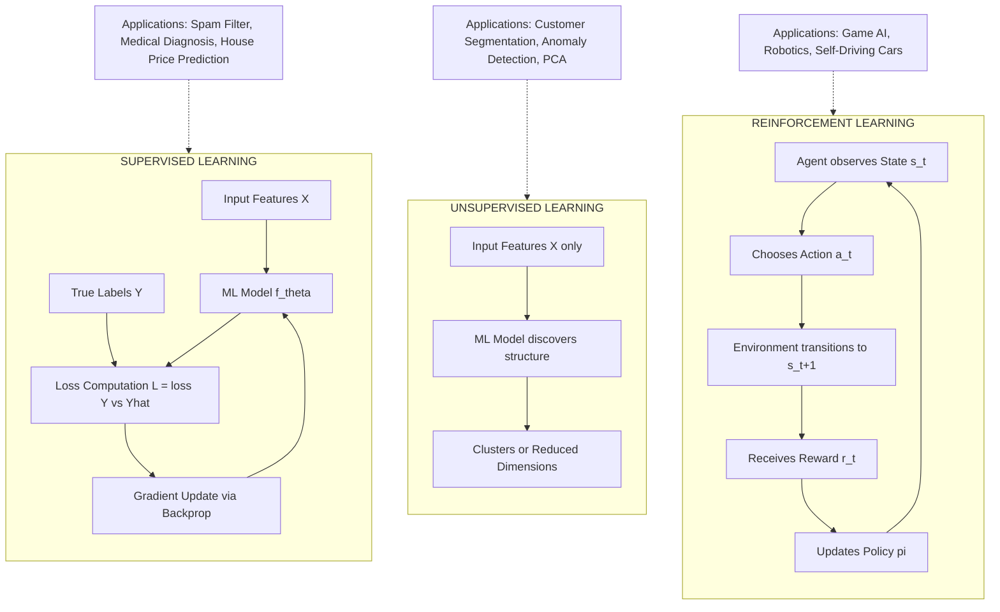
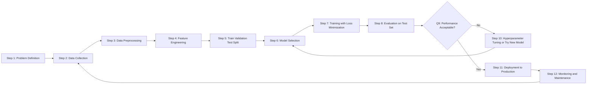
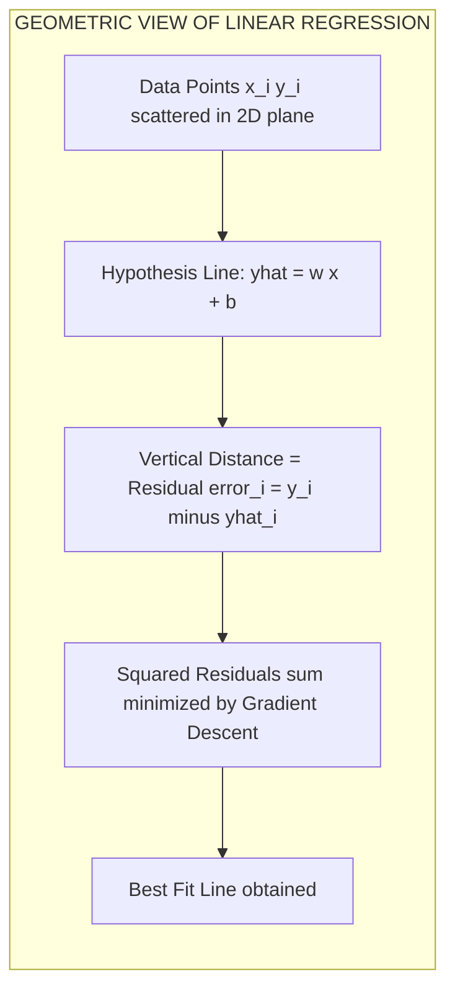
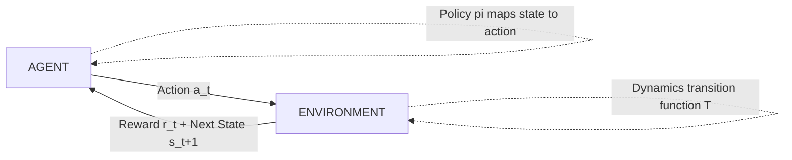
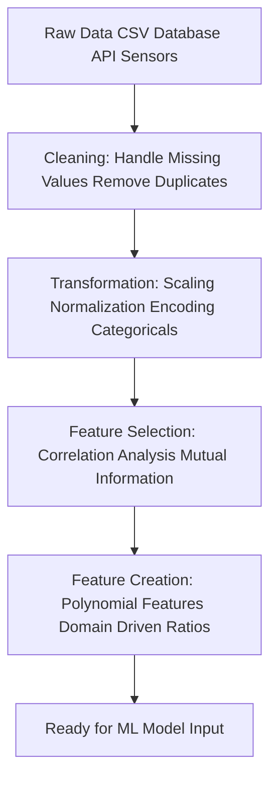

# Overview of Machine Learning

<!-- SECTION_1_START -->
# Overview of Machine Learning

## 1.1 Core Technical Definition

> [!IMPORTANT]
> **Formal Definition (KTU 2024 Syllabus Aligned):**
> **Machine Learning (ML)** is a subset of Artificial Intelligence (AI) that enables computer systems to learn patterns and improve their performance on a specific task **from data and experience**, without being explicitly programmed for every possible scenario. Formally, a computer program is said to *learn* from experience $E$ with respect to some class of tasks $T$ and performance measure $P$, if its performance at tasks in $T$, as measured by $P$, improves with experience $E$ (Mitchell, 1997).

In simpler words, instead of writing rigid `if-else` rules for every scenario, we feed the machine large amounts of data and let it figure out the underlying **mathematical function** that maps inputs to outputs. This is the cornerstone of modern AI — from Netflix recommendations to self-driving cars.

> [!NOTE]
> **Key Distinction — Traditional Programming vs. Machine Learning**
> 
> | Aspect | Traditional Programming | Machine Learning |
> |---|---|---|
> | Input | Data + Program (Rules) | Data + Output (Answers) |
> | Output | Answer | Program (Learned Function) |
> | Approach | Rule-based, deterministic | Data-driven, probabilistic |

---

## 1.2 Intuitive Real-World Analogy

> [!TIP]
> **The "Baby Learning" Analogy:**
> 
> Think of how a **baby learns to identify a dog**:
> 
> 1. **Experience ($E$)**: The baby sees many dogs and cats (pictures, real life, cartoons).
> 2. **Task ($T$)**: Given a new animal image, the baby must say "Dog" or "Cat".
> 3. **Performance Measure ($P$)**: The percentage of correct identifications.
> 4. **Learning**: The baby's brain **adjusts internal neural connections** based on corrections from parents ("No, that's a cat, not a dog!").
> 
> Machine Learning mimics this exactly. Instead of a brain, we have a **mathematical model with tunable parameters** (often millions of them in deep learning), and instead of parental feedback, we have a **loss function** that measures errors and an **optimizer** that adjusts parameters to reduce those errors.

---

## 1.3 The Three Pillars of Machine Learning

> [!IMPORTANT]
> **Mitchell's Formal Learning Framework (1997):**
> 
> A complete ML system is defined by a triple $(E, T, P)$:
> 
> - **Experience ($E$)** — The dataset (e.g., 1 million labeled cat/dog images).
> - **Task ($T$)** — The objective (e.g., classification, regression, clustering).
> - **Performance ($P$)** — A measurable metric (e.g., accuracy, F1-score, MSE).

---

## 1.4 Why Machine Learning Matters in 2024+

> [!NOTE]
> **Engineering Reality Check:**
> 
> Why not just hardcode rules? Because the real world is **messy**:
> - **Spam detection**: Spammers constantly evolve. Hardcoded rules fail.
> - **Self-driving cars**: Infinite driving scenarios exist. You cannot code them all.
> - **Medical diagnosis**: Patterns in millions of patient records exceed human capacity to manually extract.
> 
> Machine Learning **scales where rules break down**.

---

## 1.5 Conceptual Visualization

> [!VISUALIZATION CONTROL]
> **Concept:** The ML Function Approximation Paradigm
> 
> **GeoGebra / Desmos Input Equations:**
> - True underlying function: $f(x) = 0.4x^2 - 1.2x + 0.5 + \text{noise}$
> - Model prediction: $\hat{f}(x) = 0.38x^2 - 1.15x + 0.48$ (learned approximation)
> - Data points: $(x_i, y_i)$ for $i = 1, 2, \dots, 50$
> 
> **Visual Description:** On the $xy$-plane, the student should observe scattered noisy data points (blue dots) hovering near a smooth parabolic curve (red — the true function), and a slightly different curve (green dashed — the model's learned approximation) passing close to most points. The goal of ML is to make the **green curve get as close as possible to the red curve** by minimizing the vertical distance (error) at each data point.

---

## 1.6 Module Map — What Lies Ahead in Module 1

| Sub-Topic | Description |
|---|---|
| **Foundations of AI** | Turing test, intelligent agents, rationality |
| **Foundations of ML** | Definition, types, workflow (current topic) |
| **Supervised Learning** | Regression, classification, labeled data |
| **Unsupervised Learning** | Clustering, dimensionality reduction, no labels |
| **Reinforcement Learning** | Agent, environment, rewards, policy |
| **Applications** | NLP, computer vision, healthcare, finance |

---
<!-- SECTION_1_END -->

<!-- SECTION_2_START -->
# Deep Theoretical Analysis & KTU High-Yield Formula Sheet

## 2.1 The Three Fundamental Types of Machine Learning

Machine Learning is broadly classified into **three paradigms** based on the nature of the **feedback signal** (experience $E$) available during training.

### A. Supervised Learning
The model is trained on **labeled data** — each input $x_i$ is paired with a known correct output $y_i$.

> [!IMPORTANT]
> **Supervised Learning Intuition:**
> 
> Imagine a student learning mathematics with an **answer key**. For every problem they solve, the teacher reveals the correct answer, and the student adjusts their technique. The model does the same: it compares its prediction $\hat{y}_i$ with the true label $y_i$ and updates parameters to reduce this difference.

**Two Main Tasks:**
- **Classification** → Predict a discrete category (e.g., spam vs. not spam, cat vs. dog).
- **Regression** → Predict a continuous value (e.g., house price, temperature, stock price).

**Common Algorithms:**
- Linear Regression, Logistic Regression
- Decision Trees, Random Forest
- Support Vector Machines (SVM)
- k-Nearest Neighbors (k-NN)
- Neural Networks, Deep Learning

### B. Unsupervised Learning
The model is trained on **unlabeled data** — only inputs $x_i$ are given, no corresponding $y_i$.

> [!NOTE]
> **Unsupervised Learning Intuition:**
> 
> Imagine dropping a child in a market with thousands of fruits, **no labels**, and asking them to organize the fruits. The child will naturally group apples together, bananas together, and oranges together — discovering **structure without explicit instruction**. Unsupervised learning does exactly this with data.

**Two Main Tasks:**
- **Clustering** → Group similar data points (e.g., customer segmentation).
- **Dimensionality Reduction** → Compress data while preserving structure (e.g., PCA, t-SNE).
- **Association** → Find rules like "people who buy X also buy Y".

**Common Algorithms:**
- K-Means, DBSCAN, Hierarchical Clustering
- Principal Component Analysis (PCA)
- Autoencoders, GANs (generative)

### C. Reinforcement Learning (RL)
An **agent** learns to make sequential decisions by interacting with an **environment**, receiving **rewards** (or penalties) for its actions.

> [!TIP]
> **Reinforcement Learning Intuition:**
> 
> Think of training a **pet dog**: when it sits on command, you give a treat (positive reward). When it chews your shoes, you say "No!" (negative reward). Over time, the dog learns the optimal sequence of actions. RL formalizes this with a Markov Decision Process (MDP) and a policy that maximizes **cumulative future reward**.

**Key Components:**
- **Agent** — The learner/decision-maker.
- **Environment** — The world the agent interacts with.
- **State ($s_t$)** — The current situation at time $t$.
- **Action ($a_t$)** — What the agent does.
- **Reward ($r_t$)** — Scalar feedback signal.
- **Policy ($\pi$)** — The strategy mapping states to actions.

**Common Algorithms:**
- Q-Learning, Deep Q-Networks (DQN)
- Policy Gradient Methods (REINFORCE)
- Actor-Critic (A3C, PPO)

---

## 2.2 The Machine Learning Workflow (End-to-End Pipeline)

> [!IMPORTANT]
> **Standard KTU 2024 Industry-Aligned ML Pipeline:**
> 
> 1. **Problem Definition** → What are we predicting? What is the business goal?
> 2. **Data Collection** → Gather relevant data (databases, APIs, sensors, web scraping).
> 3. **Data Preprocessing** → Handle missing values, outliers, duplicates.
> 4. **Feature Engineering** → Select, transform, create meaningful input features.
> 5. **Train/Test Split** → Typically 80% train, 20% test (or 70/30, 60/20/20).
> 6. **Model Selection** → Choose an algorithm suited to the problem.
> 7. **Training** → The model learns parameters by minimizing the loss function.
> 8. **Evaluation** → Measure performance on unseen test data.
> 9. **Hyperparameter Tuning** → Optimize learning rate, regularization, etc.
> 10. **Deployment** → Integrate the model into a production system (API, app, edge device).
> 11. **Monitoring & Maintenance** → Track drift, retrain periodically.

---

## 2.3 KTU High-Yield Formula Sheet

> [!IMPORTANT]
> **Master These Equations for Board Exams:**

| Concept | Formula | Description |
|---|---|---|
| **Mitchell's Learning Definition** | $P_T \uparrow \text{ as } E \uparrow$ | Performance improves with experience |
| **Hypothesis Function (Linear)** | $\hat{y} = w_0 + w_1 x_1 + w_2 x_2 + \dots + w_n x_n$ | Linear model prediction |
| **Vector Form** | $\hat{y} = \mathbf{w}^T \mathbf{x} + b$ | Compact representation |
| **Mean Squared Error (MSE)** | $\text{MSE} = \frac{1}{n} \sum_{i=1}^{n} (y_i - \hat{y}_i)^2$ | Regression loss |
| **Mean Absolute Error (MAE)** | $\text{MAE} = \frac{1}{n} \sum_{i=1}^{n} \vert y_i - \hat{y}_i \vert$ | Robust regression loss |
| **Cross-Entropy Loss** | $\mathcal{L} = -\frac{1}{n} \sum_{i=1}^{n} \left[ y_i \log(\hat{y}_i) + (1-y_i) \log(1-\hat{y}_i) \right]$ | Binary classification loss |
| **Accuracy** | $\text{Acc} = \frac{TP + TN}{TP + TN + FP + FN}$ | Classification metric |
| **Precision** | $\text{Precision} = \frac{TP}{TP + FP}$ | Quality of positive predictions |
| **Recall** | $\text{Recall} = \frac{TP}{TP + FN}$ | Coverage of actual positives |
| **F1-Score** | $F_1 = 2 \cdot \frac{\text{Precision} \cdot \text{Recall}}{\text{Precision} + \text{Recall}}$ | Harmonic mean of P and R |
| **Gradient Descent Update** | $w_j := w_j - \alpha \frac{\partial \mathcal{L}}{\partial w_j}$ | Parameter update rule |
| **Bellman Equation (RL)** | $Q(s,a) = r + \gamma \max_{a'} Q(s', a')$ | RL value function recursion |
| **Bias-Variance Decomposition** | $\text{Error} = \text{Bias}^2 + \text{Variance} + \text{Noise}$ | Fundamental tradeoff |

---

## 2.4 Real-World Engineering Applications

> [!NOTE]
> **Where ML is used in production systems (2024+):**
> 
> - **Healthcare**: Disease diagnosis from medical images (X-ray, MRI), drug discovery.
> - **Finance**: Credit scoring, fraud detection, algorithmic trading.
> - **E-commerce**: Product recommendations, dynamic pricing, demand forecasting.
> - **Transportation**: Self-driving cars (Tesla, Waymo), route optimization (Google Maps).
> - **Natural Language Processing**: ChatGPT, Google Translate, sentiment analysis.
> - **Computer Vision**: Face recognition, defect detection in manufacturing.
> - **Agriculture**: Crop yield prediction, pest detection from drone imagery.
> - **Cybersecurity**: Intrusion detection, malware classification.

---

## 2.5 Supervised vs. Unsupervised vs. Reinforcement — Quick Comparison

> [!IMPORTANT]
> **Comparison Matrix (Board Exam Favorite):**

| Feature | Supervised | Unsupervised | Reinforcement |
|---|---|---|---|
| **Data Labels** | Yes (labeled) | No (unlabeled) | Reward signal |
| **Goal** | Learn $f: X \rightarrow Y$ | Discover hidden structure | Maximize cumulative reward |
| **Feedback** | Direct (loss) | None | Delayed (rewards) |
| **Example Task** | Email spam filter | Customer segmentation | Game-playing AI |
| **Example Algorithm** | Linear Regression, SVM | K-Means, PCA | Q-Learning, PPO |
| **Evaluation** | Accuracy, F1, MSE | Silhouette, inertia | Cumulative reward |

---
<!-- SECTION_2_END -->

<!-- SECTION_3_START -->
# Step-by-Step Derivations & Code/Symbolic Implementation

## 3.1 Mathematical Derivation: Gradient Descent for Linear Regression

Let us derive the **most foundational learning algorithm in Machine Learning** from first principles. This is a guaranteed board exam topic.

### Setup
We have a dataset of $n$ points $\{(x_i, y_i)\}_{i=1}^{n}$ and we want to fit a linear model:

$$\hat{y}_i = w x_i + b$$

where $w$ is the **weight (slope)** and $b$ is the **bias (intercept)**.

### Step 1: Define the Loss Function

The most common loss for regression is **Mean Squared Error (MSE)**:

$$\mathcal{L}(w, b) = \frac{1}{n} \sum_{i=1}^{n} (y_i - \hat{y}_i)^2 = \frac{1}{n} \sum_{i=1}^{n} (y_i - (w x_i + b))^2$$

> **Reasoning:** We square the error so that positive and negative errors do not cancel out, and large errors are penalized more heavily.

### Step 2: Compute the Gradients

We need to find how the loss changes with respect to $w$ and $b$. Using the chain rule:

$$\frac{\partial \mathcal{L}}{\partial w} = \frac{\partial}{\partial w} \left[ \frac{1}{n} \sum_{i=1}^{n} (y_i - w x_i - b)^2 \right]$$

$$= \frac{1}{n} \sum_{i=1}^{n} 2(y_i - w x_i - b) \cdot (-x_i)$$

$$\boxed{\frac{\partial \mathcal{L}}{\partial w} = -\frac{2}{n} \sum_{i=1}^{n} x_i (y_i - \hat{y}_i)}$$

Similarly for $b$:

$$\frac{\partial \mathcal{L}}{\partial b} = \frac{1}{n} \sum_{i=1}^{n} 2(y_i - w x_i - b) \cdot (-1)$$

$$\boxed{\frac{\partial \mathcal{L}}{\partial b} = -\frac{2}{n} \sum_{i=1}^{n} (y_i - \hat{y}_i)}$$

### Step 3: Apply the Gradient Descent Update Rule

The update rule for each iteration (epoch) is:

$$w := w - \alpha \frac{\partial \mathcal{L}}{\partial w}$$

$$b := b - \alpha \frac{\partial \mathcal{L}}{\partial b}$$

where $\alpha$ is the **learning rate** (a hyperparameter, typically $0.001$ to $0.1$).

### Step 4: Iterate Until Convergence

Repeat Step 3 for many epochs (e.g., 1000) until the loss stops decreasing. The final values of $w$ and $b$ define the **best-fit line** through the data.

---

## 3.2 Worked Numerical Example

> [!TIP]
> **Let us apply this to a tiny dataset manually.**

Suppose we have 3 data points: $(1, 2), (2, 4), (3, 5)$ and initialize $w = 0, b = 0, \alpha = 0.01$.

**Epoch 1, Forward Pass:**

$$\hat{y}_1 = 0 \cdot 1 + 0 = 0, \quad \text{error}_1 = 2 - 0 = 2$$

$$\hat{y}_2 = 0 \cdot 2 + 0 = 0, \quad \text{error}_2 = 4 - 0 = 4$$

$$\hat{y}_3 = 0 \cdot 3 + 0 = 0, \quad \text{error}_3 = 5 - 0 = 5$$

**Compute Gradients ($n=3$):**

$$\frac{\partial \mathcal{L}}{\partial w} = -\frac{2}{3} \left[ 1(2) + 2(4) + 3(5) \right] = -\frac{2}{3}(25) = -16.67$$

$$\frac{\partial \mathcal{L}}{\partial b} = -\frac{2}{3} \left[ 2 + 4 + 5 \right] = -\frac{2}{3}(11) = -7.33$$

**Update Parameters:**

$$w := 0 - 0.01 \cdot (-16.67) = 0.1667$$

$$b := 0 - 0.01 \cdot (-7.33) = 0.0733$$

After many epochs, the model converges to approximately $w \approx 1.55, b \approx 0.43$, fitting the line $\hat{y} = 1.55x + 0.43$.

---

## 3.3 Full Python Implementation: From Scratch + With Scikit-Learn

> [!IMPORTANT]
> **Production-Ready Code with Type Hints and Error Handling**

### A. Implementation From Scratch (NumPy Only)

```python
import numpy as np
from typing import Tuple

class LinearRegressionScratch:
    """
    Linear Regression implemented from scratch using Gradient Descent.
    KTU 2024 Module 1 - Foundations of ML.
    """
    
    def __init__(self, learning_rate: float = 0.01, n_epochs: int = 1000) -> None:
        if learning_rate <= 0:
            raise ValueError("Learning rate must be positive.")
        self.lr: float = learning_rate
        self.n_epochs: int = n_epochs
        self.w: float = 0.0
        self.b: float = 0.0
        self.loss_history: list[float] = []
    
    def predict(self, X: np.ndarray) -> np.ndarray:
        if X.ndim != 1:
            raise ValueError("Input X must be a 1D array.")
        return self.w * X + self.b
    
    def compute_loss(self, y_true: np.ndarray, y_pred: np.ndarray) -> float:
        n: int = len(y_true)
        if n == 0:
            raise ValueError("Empty input arrays.")
        return float(np.mean((y_true - y_pred) ** 2))
    
    def fit(self, X: np.ndarray, y: np.ndarray) -> None:
        if len(X) != len(y):
            raise ValueError("X and y must have the same length.")
        n: int = len(X)
        for epoch in range(self.n_epochs):
            y_pred: np.ndarray = self.predict(X)
            error: np.ndarray = y - y_pred
            dw: float = float(-(2.0 / n) * np.dot(X, error))
            db: float = float(-(2.0 / n) * np.sum(error))
            self.w -= self.lr * dw
            self.b -= self.lr * db
            current_loss: float = self.compute_loss(y, y_pred)
            self.loss_history.append(current_loss)
            if epoch % 100 == 0:
                print(f"Epoch {epoch:4d} | Loss: {current_loss:.4f} | w: {self.w:.4f} | b: {self.b:.4f}")
    
    def get_params(self) -> Tuple[float, float]:
        return (self.w, self.b)


# ----- Demonstration -----
if __name__ == "__main__":
    X_train: np.ndarray = np.array([1.0, 2.0, 3.0, 4.0, 5.0])
    y_train: np.ndarray = np.array([2.0, 4.0, 5.0, 4.0, 5.0])
    
    model = LinearRegressionScratch(learning_rate=0.01, n_epochs=500)
    model.fit(X_train, y_train)
    
    w_final, b_final = model.get_params()
    print(f"\nFinal Model: y = {w_final:.4f} * x + {b_final:.4f}")
    print(f"Prediction for x=6.0: y_hat = {model.predict(np.array([6.0]))[0]:.4f}")
```

### B. Production Implementation with Scikit-Learn

```python
import numpy as np
from sklearn.model_selection import train_test_split
from sklearn.linear_model import LinearRegression
from sklearn.metrics import mean_squared_error, r2_score

# Sample data
X: np.ndarray = np.array([[1], [2], [3], [4], [5], [6], [7], [8]])
y: np.ndarray = np.array([2.0, 4.0, 5.0, 4.5, 5.5, 6.0, 6.8, 7.5])

# Train/Test Split (80/20)
X_train, X_test, y_train, y_test = train_test_split(
    X, y, test_size=0.2, random_state=42
)

# Model Training
model = LinearRegression()
model.fit(X_train, y_train)

# Predictions
y_pred = model.predict(X_test)

# Evaluation
mse: float = mean_squared_error(y_test, y_pred)
r2: float = r2_score(y_test, y_pred)

print(f"Learned Equation: y = {model.coef_[0]:.4f} * x + {model.intercept_:.4f}")
print(f"Mean Squared Error on Test Set: {mse:.4f}")
print(f"R-squared Score: {r2:.4f}")
```

### C. Comparing the Three Learning Paradigms — Code Demo

```python
from sklearn.datasets import load_iris
from sklearn.model_selection import train_test_split
from sklearn.neighbors import KNeighborsClassifier
from sklearn.cluster import KMeans
from sklearn.metrics import accuracy_score, silhouette_score

# --- 1. SUPERVISED LEARNING EXAMPLE ---
iris = load_iris()
X_sup, y_sup = iris.data, iris.target
X_tr, X_te, y_tr, y_te = train_test_split(X_sup, y_sup, test_size=0.3, random_state=42)
clf = KNeighborsClassifier(n_neighbors=3)
clf.fit(X_tr, y_tr)
y_pred_sup = clf.predict(X_te)
print(f"[Supervised] KNN Accuracy: {accuracy_score(y_te, y_pred_sup):.4f}")

# --- 2. UNSUPERVISED LEARNING EXAMPLE ---
X_unsup = iris.data
kmeans = KMeans(n_clusters=3, random_state=42, n_init=10)
clusters = kmeans.fit_predict(X_unsup)
print(f"[Unsupervised] K-Means Silhouette Score: {silhouette_score(X_unsup, clusters):.4f}")

# --- 3. REINFORCEMENT LEARNING CONCEPT (Pseudocode) ---
# import gymnasium as gym
# env = gym.make("CartPole-v1")
# observation, info = env.reset()
# for episode in range(1000):
#     action = env.action_space.sample()  # Random policy (baseline)
#     observation, reward, terminated, truncated, info = env.step(action)
#     if terminated or truncated:
#         observation, info = env.reset()
# env.close()
```

---

## 3.4 Training vs. Testing vs. Validation Sets

> [!NOTE]
> **Three-Way Data Split — Best Practice:**

| Split | Purpose | Typical % |
|---|---|---|
| **Training Set** | Fit model parameters ($w, b$) | 70% |
| **Validation Set** | Tune hyperparameters ($\alpha$, depth) | 15% |
| **Test Set** | Final unbiased performance evaluation | 15% |

**Why three sets?** If we tune hyperparameters on the test set, the test set "leaks" into model selection, producing **over-optimistic** performance estimates.
<!-- SECTION_3_END -->

<!-- SECTION_4_START -->
# Structural Diagrams & Schematics

## 4.1 The Three Paradigms of Machine Learning — Block Architecture



## 4.2 End-to-End Machine Learning Workflow



## 4.3 Linear Regression — Geometric Intuition



## 4.4 Reinforcement Learning — Agent-Environment Loop



## 4.5 Feature Engineering Pipeline



## 4.6 Sequential Processing Topology Matrix

> [!NOTE]
> **The Bias-Variance Tradeoff (Visualized Conceptually):**

| Model Complexity | Training Error | Test Error | Diagnosis |
|---|---|---|---|
| **Too Simple (High Bias)** | High | High | **Underfitting** — model cannot capture patterns |
| **Just Right** | Low | Low | **Good Generalization** — sweet spot |
| **Too Complex (High Variance)** | Very Low | High | **Overfitting** — model memorizes noise |

**Goldilocks Principle:** Find the model complexity that is **just right** — neither too simple nor too complex.
<!-- SECTION_4_END -->

<!-- SECTION_5_START -->
# KTU 2024 Scheme Examination Question Bank & Topic Recap

---

## Part A: Short Answer Questions (3 Marks Each)

> **Instructions:** Answer in **2-3 sentences** with precise terminology.

### Question 1 `[KTU University Exam - July 2024]`
**Define Machine Learning. State Mitchell's formal learning definition.**

**Model Answer (3 Marks):**
- **[Definition — 1 Mark]:** Machine Learning is a branch of Artificial Intelligence that enables systems to automatically learn and improve from experience (data) without being explicitly programmed.
- **[Mitchell's Definition — 2 Marks]:** According to Mitchell (1997), *“A computer program is said to learn from experience $E$ with respect to some class of tasks $T$ and performance measure $P$, if its performance at tasks in $T$, as measured by $P$, improves with experience $E$.”*
- **Example:** A spam filter learns ($E$ = labeled emails) to classify ($T$ = classification) improving its accuracy ($P$) over time.

---

### Question 2 `[KTU University Exam - Dec 2023]`
**Differentiate between Supervised, Unsupervised, and Reinforcement Learning with one example each.**

**Model Answer (3 Marks):**

| Type | Data | Goal | Example |
|---|---|---|---|
| **Supervised** | Labeled $(X, Y)$ | Learn mapping $X \rightarrow Y$ | Email spam classification using Naive Bayes |
| **Unsupervised** | Unlabeled $X$ only | Discover hidden structure | Customer segmentation using K-Means |
| **Reinforcement** | Reward signal $r$ | Maximize cumulative reward | AlphaGo learning to play the game of Go |

> **[Distribution: 1 Mark per type with correct example]**

---

## Part B: Long Answer Questions (14 Marks Each)

> **Instructions:** Each question has **internal choice**. Answer either **Question A** or **Question B** in full.

---

### Question A (14 Marks) `[KTU University Exam - July 2024]`

**(a)** Explain the three types of Machine Learning in detail. Compare their characteristics using a suitable diagram. **(7 Marks)**

**Model Solution:**

**[Introduction — 1 Mark]:** Machine Learning is broadly classified into three paradigms based on the nature of feedback available during training.

**[Type 1: Supervised Learning — 2 Marks]:** In supervised learning, the model is trained on a dataset where each input $x_i$ is paired with a corresponding target label $y_i$. The goal is to learn a mapping function $f: X \rightarrow Y$ that can predict $Y$ for new, unseen $X$. 
- Examples: Linear Regression (regression), Logistic Regression, SVM, Decision Trees (classification).
- Use case: Medical diagnosis from labeled X-ray images.

**[Type 2: Unsupervised Learning — 2 Marks]:** In unsupervised learning, the dataset has only inputs $X$ without any labels $Y$. The model must discover hidden patterns, groupings, or structures.
- Examples: K-Means clustering, Hierarchical clustering, PCA, Autoencoders.
- Use case: Market basket analysis, customer segmentation.

**[Type 3: Reinforcement Learning — 1 Mark]:** An agent learns by interacting with an environment, receiving rewards or penalties. The goal is to learn an optimal policy $\pi^*$ that maximizes cumulative reward.
- Examples: Q-Learning, Deep Q-Networks, PPO.
- Use case: Game-playing AI (AlphaGo), robotics.

**[Diagram — 1 Mark]:** Refer to the Mermaid block diagram in SECTION 4.1.

**(b)** Describe the end-to-end Machine Learning workflow with a neat block diagram. Mention the importance of the train-test split. **(7 Marks)**

**Model Solution:**

**[Workflow Steps — 5 Marks, 0.5 Marks each]:**
1. **Problem Definition:** Clearly define the objective, success metrics, and constraints.
2. **Data Collection:** Gather data from databases, APIs, sensors, or web scraping.
3. **Data Preprocessing:** Handle missing values (imputation), outliers, and duplicates.
4. **Feature Engineering:** Select relevant features, scale (standardization/normalization), encode categorical variables.
5. **Train-Validation-Test Split:** Divide data — typically 70% train, 15% validation, 15% test.
6. **Model Selection:** Choose algorithm based on problem type (regression/classification), data size, interpretability needs.
7. **Training:** Fit the model by minimizing the loss function $\mathcal{L}$ using gradient descent.
8. **Evaluation:** Test on unseen data using metrics — Accuracy, Precision, Recall, F1, MSE, R².
9. **Hyperparameter Tuning:** Grid search, random search, or Bayesian optimization.
10. **Deployment & Monitoring:** Deploy via REST API or cloud, monitor for data drift.

**[Train-Test Split Importance — 2 Marks]:**
- **Generalization Check:** The test set simulates real-world unseen data. A model that performs well on the test set generalizes well.
- **Avoid Overfitting:** If we evaluate on the training set, we cannot detect overfitting (memorization).
- **Unbiased Evaluation:** Test data must never be used during training or hyperparameter tuning.
- **Validation Set Role:** Used to tune hyperparameters without "leaking" test data.

> [!WARNING]
> **Common Pitfall:** Students often state "**80% train, 20% test**" without mentioning the **validation set** for hyperparameter tuning. This loses 1 mark. The KTU 2024 scheme expects a **3-way split** discussion.

---

### Question B (14 Marks) `[KTU University Exam - Dec 2023]`

**(a)** With a neat diagram, explain the architecture of Supervised Learning. State the loss function used for regression and classification. **(7 Marks)**

**Model Solution:**

**[Supervised Learning Architecture — 4 Marks]:** In supervised learning, the system consists of:
- **Input Layer:** Receives feature vector $\mathbf{x} = (x_1, x_2, \dots, x_n)$.
- **Model / Hypothesis:** A parameterized function $f_\theta(\mathbf{x})$ (e.g., neural network, linear model) that maps inputs to outputs.
- **Output / Prediction:** $\hat{y} = f_\theta(\mathbf{x})$.
- **Ground Truth:** The true label $y$ from the dataset.
- **Loss Function:** $\mathcal{L}(y, \hat{y})$ measures the discrepancy.
- **Optimizer:** Updates $\theta$ to minimize $\mathcal{L}$ (e.g., gradient descent).

```
x → [Model f_theta] → y_hat
                          ↓
y (true) → [Loss L] ← ← ← 
              ↓
         [Gradient Descent] → updates theta → back to Model
```

**[Loss for Regression — 1.5 Marks]:** Mean Squared Error (MSE):
$$\text{MSE} = \frac{1}{n} \sum_{i=1}^{n} (y_i - \hat{y}_i)^2$$

**[Loss for Classification — 1.5 Marks]:** Binary Cross-Entropy (Log Loss):
$$\mathcal{L} = -\frac{1}{n} \sum_{i=1}^{n} \left[ y_i \log(\hat{y}_i) + (1-y_i) \log(1-\hat{y}_i) \right]$$

**(b)** Derive the gradient descent update rule for linear regression with MSE loss. Given the data points $(1,2), (2,4), (3,5)$, perform one epoch of update with $\alpha = 0.01$. **(7 Marks)**

**Model Solution:**

**[Setup — 1 Mark]:** Hypothesis: $\hat{y}_i = w x_i + b$. Loss: $\mathcal{L} = \frac{1}{n}\sum(y_i - wx_i - b)^2$.

**[Gradient Derivation — 3 Marks]:**
$$\frac{\partial \mathcal{L}}{\partial w} = -\frac{2}{n} \sum_{i=1}^{n} x_i (y_i - \hat{y}_i)$$

$$\frac{\partial \mathcal{L}}{\partial b} = -\frac{2}{n} \sum_{i=1}^{n} (y_i - \hat{y}_i)$$

**[Update Rule — 1 Mark]:**
$$w := w - \alpha \frac{\partial \mathcal{L}}{\partial w}, \quad b := b - \alpha \frac{\partial \mathcal{L}}{\partial b}$$

**[Numerical Computation — 2 Marks]:** With $n=3$, initial $w=0, b=0$:

- $\hat{y}_1 = 0, \text{err}_1 = 2-0 = 2$
- $\hat{y}_2 = 0, \text{err}_2 = 4-0 = 4$
- $\hat{y}_3 = 0, \text{err}_3 = 5-0 = 5$

$$\frac{\partial \mathcal{L}}{\partial w} = -\frac{2}{3}(1 \cdot 2 + 2 \cdot 4 + 3 \cdot 5) = -\frac{2}{3}(25) = -16.67$$

$$\frac{\partial \mathcal{L}}{\partial b} = -\frac{2}{3}(2+4+5) = -\frac{2}{3}(11) = -7.33$$

$$w_{\text{new}} = 0 - 0.01 \cdot (-16.67) = 0.1667$$

$$b_{\text{new}} = 0 - 0.01 \cdot (-7.33) = 0.0733$$

> **[Stating initial values: 1 Mark]**, **[Correct gradient computation: 1 Mark]**, **[Final updated parameters: 1 Mark]**

> [!WARNING]
> **Common Pitfalls for Part B (b):**
> 1. **Forgetting the negative sign** in the gradient — you will get the wrong direction of update.
> 2. **Missing the $\frac{1}{n}$ term** — the gradient must be averaged over $n$ data points.
> 3. **Not showing one complete numerical epoch** — KTU expects explicit numerical evaluation, not just symbolic derivation.
> 4. **Confusing MSE with MAE** — for gradient descent derivations, MSE is the standard because it is differentiable everywhere.

---

## Topic Recap & Important Things to Remember

> [!IMPORTANT]
> **High-Density Rapid Revision Checklist:**

### Core Definitions
- ✅ **Machine Learning (Mitchell, 1997):** A program learns from experience $E$ w.r.t. task $T$ measured by performance $P$, if $P$ improves with $E$.
- ✅ **AI vs. ML vs. DL:** AI is the broadest field (intelligent behavior), ML is a subset (learning from data), DL is a subset of ML (deep neural networks).

### The Three Paradigms
- ✅ **Supervised:** Labeled data, learns $f: X \rightarrow Y$ (regression or classification).
- ✅ **Unsupervised:** Unlabeled data, discovers structure (clustering, dimensionality reduction).
- ✅ **Reinforcement:** Agent + Environment + Reward signal, learns optimal policy $\pi$.

### Key Mathematical Formulas (Must Memorize)
- ✅ MSE: $\frac{1}{n}\sum(y_i - \hat{y}_i)^2$
- ✅ Cross-Entropy: $-\frac{1}{n}\sum [y_i \log \hat{y}_i + (1-y_i)\log(1-\hat{y}_i)]$
- ✅ Gradient Descent: $w := w - \alpha \frac{\partial \mathcal{L}}{\partial w}$
- ✅ Accuracy: $\frac{TP+TN}{TP+TN+FP+FN}$
- ✅ Precision: $\frac{TP}{TP+FP}$ | **Recall:** $\frac{TP}{TP+FN}$ | **F1:** $2 \cdot \frac{PR}{P+R}$

### Workflow Steps (10 Stages)
- ✅ Problem Definition → Data Collection → Preprocessing → Feature Engineering → Split → Model Selection → Training → Evaluation → Tuning → Deployment

### Critical Pitfalls to Avoid
- ❌ Don't confuse **train-test split** (no tuning) with **train-validation-test split** (tuning on validation).
- ❌ Don't state "**ML is the same as AI**" — ML is a subset of AI.
- ❌ Don't forget the **sign convention** in gradient descent.
- ❌ Don't claim unsupervised learning "predicts" — it "discovers structure" without ground truth labels.

### Real-World Connection
- ✅ Spam filters, recommendation systems, voice assistants, medical imaging, self-driving cars — all use ML.

### Exam Tip
- ✅ When asked to "**differentiate**" — always use a **comparison table** with at least 3 columns (Feature | Type A | Type B). This is the KTU board's favorite presentation format.
- ✅ When asked to "**derive**" — show every algebraic step explicitly. The valuation key allocates marks to each transformation.
<!-- SECTION_5_END -->
