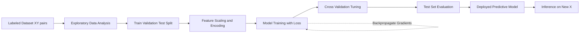
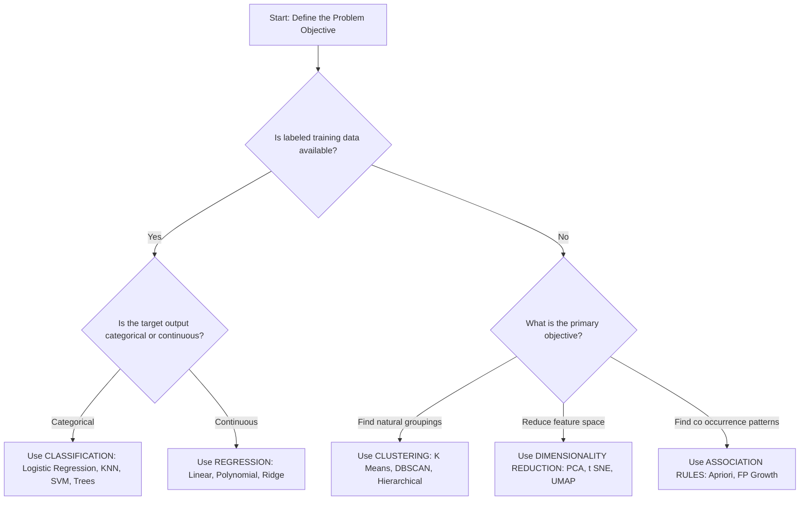
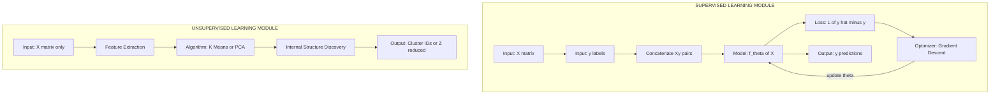
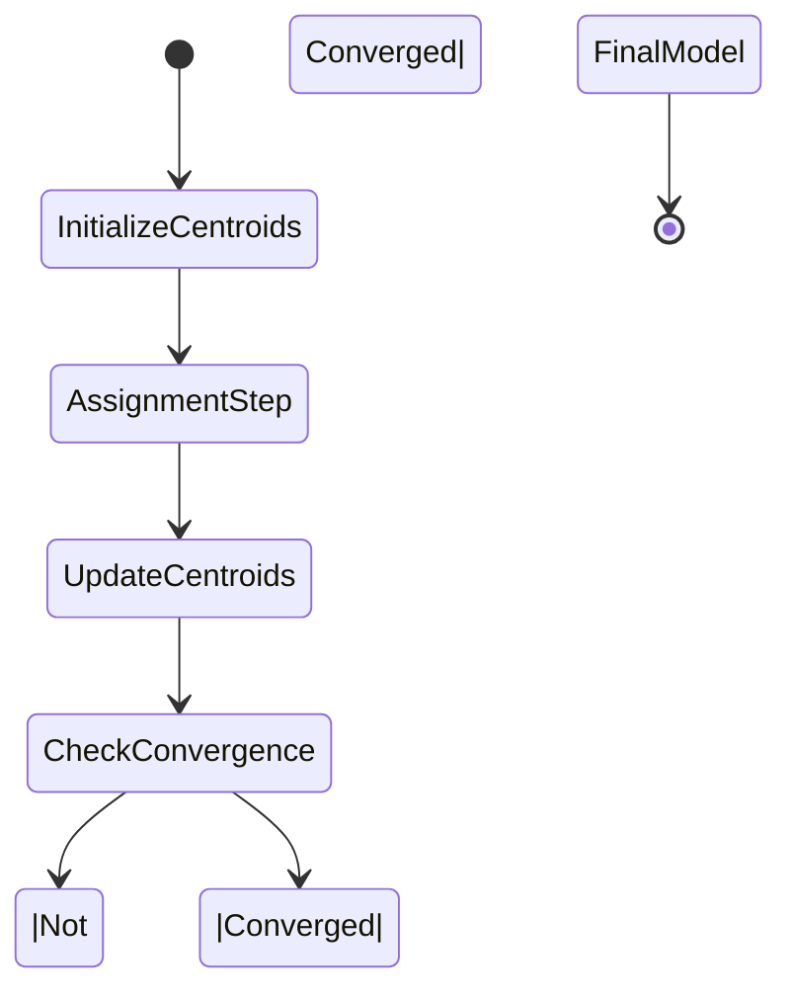

# Supervised and Unsupervised Learning

<!-- SECTION_1_START -->

# 1. Core Technical Definition & Intuitive Overview

## 1.1 Formal Definitions (KTU 2024 Syllabus Terminology)

**Supervised Learning** is a machine learning paradigm in which an algorithm is trained on a labeled dataset $\mathcal{D} = \{(x_i, y_i)\}_{i=1}^{n}$, where each input vector $x_i \in \mathbb{R}^d$ is paired with a corresponding target output $y_i$. The objective is to learn a mapping function $f: \mathcal{X} \rightarrow \mathcal{Y}$ that generalizes well to unseen data by minimizing a predefined loss function $\mathcal{L}(f(x), y)$.

**Unsupervised Learning** is a machine learning paradigm in which an algorithm is trained on an unlabeled dataset $\mathcal{D} = \{x_i\}_{i=1}^{n}$ containing only input features without any corresponding target outputs. The objective is to discover hidden patterns, intrinsic structures, or meaningful representations within the data, typically by modeling the data distribution $P(X)$ or identifying clusters $\mathcal{C} = \{C_1, C_2, \dots, C_k\}$.

> [!IMPORTANT]
> **KTU 2024 Highlight:** The course outcomes for this module (UCSEM129) require students to *distinguish*, *identify*, and *apply* supervised and unsupervised techniques to real-world datasets. Memorize the formal definitions word-for-word — they appear in **2-mark and 3-mark short-answer questions** every semester.

## 1.2 Intuitive Analogies

### Supervised Learning — "The Student and the Teacher"
Imagine a child learning to identify fruits. The parent holds up an apple and says *"This is an apple"*, holds up a banana and says *"This is a banana"*. After thousands of such labeled examples, the child learns the visual features that distinguish each fruit and can correctly classify a new fruit never seen before. The **labels** ($y_i$) act as the **teacher's guidance**.

### Unsupervised Learning — "Organizing a Messy Room"
Imagine walking into a room full of scattered items (books, clothes, gadgets) with **no instructions**. Naturally, you would group similar items together — books on a shelf, clothes in a wardrobe, gadgets on a desk. You have discovered structure **without being told the answer**. This is exactly what clustering algorithms do.

> [!NOTE]
> **Key Distinction:** Supervised learning answers *"What is this?"* (prediction), while unsupervised learning answers *"How is this organized?"* (structure discovery).

## 1.3 Core Terminology

| Term | Symbol | Meaning |
|:-----|:------:|:--------|
| Feature | $x_i$ | An input variable (e.g., height, weight, pixel intensity) |
| Label / Target | $y_i$ | The correct answer provided during training |
| Feature Space | $\mathcal{X} \subseteq \mathbb{R}^d$ | The $d$-dimensional space of all possible inputs |
| Hypothesis | $f_\theta(x)$ | The function learned by the model, parameterized by $\theta$ |
| Loss Function | $\mathcal{L}$ | Measures the error between prediction $\hat{y}$ and true $y$ |
| Training Set | $\mathcal{D}_{train}$ | Subset used to fit the model |
| Test Set | $\mathcal{D}_{test}$ | Held-out subset used to evaluate generalization |

> [!VISUALIZATION CONTROL]
> **Concept:** 2D scatter plot showing Supervised (Classification) vs Unsupervised (Clustering) decision boundaries
> **GeoGebra / Desmos Input Equations:**
> * `Class 1 points: (1,1), (1.5,2), (2,1.2)`
> * `Class 2 points: (4,4), (4.5,3.8), (5,4.2)`
> * `Decision Boundary: y = x` (linear separator for supervised)
> * `Cluster Centers: C1 = (1.5, 1.4), C2 = (4.5, 4.0)` (centroids for unsupervised)
> **Visual Description:** On the $xy$-plane, observe two clearly separated groups of points. In supervised learning, a straight line $y = x$ partitions the plane into two labeled regions. In unsupervised learning, the same two groups are discovered automatically as clusters based on proximity, with no labels guiding the split.

## 1.4 Why These Paradigms Matter in Industry

- **Supervised Learning** powers production-grade systems such as **spam filters** (Gmail), **fraud detection** (Razorpay), **medical diagnosis** (pathology imaging), and **recommendation engines** (Netflix, Amazon).
- **Unsupervised Learning** drives **customer segmentation** (marketing analytics), **anomaly detection** (network security), **dimensionality reduction** (PCA in image compression), and **topic modeling** (news aggregation).

The global AI market, valued at **USD 184 billion in 2024**, has approximately **70% of deployed models** built on supervised techniques, while unsupervised methods are rapidly growing for **self-supervised pre-training** in Large Language Models (LLMs).

<!-- SECTION_1_END -->

<!-- SECTION_2_START -->

# 2. Deep Theoretical Analysis & KTU High-Yield Formula Sheet

## 2.1 Taxonomy of Machine Learning

Machine Learning is broadly classified into three paradigms based on the nature of the feedback signal available during training:

1. **Supervised Learning** — Labeled data, predictive objective.
2. **Unsupervised Learning** — Unlabeled data, descriptive objective.
3. **Reinforcement Learning** — Reward signals, sequential decision-making (out of scope for this module).

## 2.2 Sub-Categories of Supervised Learning

### A. Classification (Discrete Output)
The target variable $y$ belongs to a finite set of categories $\mathcal{Y} = \{1, 2, \dots, C\}$.

| Algorithm | Use Case | Key Idea |
|:----------|:---------|:---------|
| Logistic Regression | Binary classification (spam/ham) | Sigmoid activation on linear score |
| K-Nearest Neighbors (KNN) | Image recognition | Vote among $k$ closest training points |
| Decision Trees | Loan approval | Recursive feature splits via Gini/Entropy |
| Support Vector Machines (SVM) | Text categorization | Maximum-margin hyperplane |
| Random Forest / XGBoost | Tabular data competitions | Ensemble of decision trees |

### B. Regression (Continuous Output)
The target variable $y \in \mathbb{R}$ is a real-valued number.

| Algorithm | Use Case | Key Idea |
|:----------|:---------|:---------|
| Linear Regression | House price prediction | Fit a line $\hat{y} = w^T x + b$ |
| Polynomial Regression | Trend forecasting | Higher-order feature mapping |
| Ridge / Lasso | High-dimensional regression | $L_2$ / $L_1$ regularization |
| Decision Tree Regressor | Energy load prediction | Piecewise constant approximation |

## 2.3 Sub-Categories of Unsupervised Learning

### A. Clustering
Group similar data points into $k$ clusters based on a similarity metric.

| Algorithm | Cluster Shape | Complexity |
|:----------|:--------------|:-----------|
| K-Means | Spherical, equal-size | $O(n \cdot k \cdot i \cdot d)$ |
| Hierarchical (Agglomerative) | Tree-based dendrogram | $O(n^3)$ |
| DBSCAN | Arbitrary density-based | $O(n \log n)$ |
| Gaussian Mixture Models | Ellipsoidal, soft assignment | $O(n \cdot k \cdot d^3)$ |

### B. Dimensionality Reduction
Project high-dimensional data $x \in \mathbb{R}^d$ onto a lower-dimensional manifold $z \in \mathbb{R}^p$ where $p \ll d$.

| Algorithm | Method | Preserves |
|:----------|:-------|:----------|
| PCA | Eigenvalue decomposition of covariance matrix | Linear variance |
| t-SNE | KL-divergence minimization in low-dim | Local neighborhoods |
| UMAP | Topological manifold learning | Global + local structure |
| Autoencoders | Neural bottleneck reconstruction | Non-linear features |

### C. Association Rule Learning
Discover interesting co-occurrence patterns, e.g., *"customers who buy bread also buy butter"*.

| Algorithm | Metric | Example |
|:----------|:-------|:--------|
| Apriori | Support, Confidence, Lift | Market basket analysis |
| FP-Growth | Frequent Pattern tree | Web clickstream mining |

## 2.4 KTU High-Yield Formula Sheet

> [!IMPORTANT]
> The following table consolidates every formula you must memorize for the ESE. **Re-derive each formula once** by hand before the exam — understanding the derivation is what earns full marks in Part B.

| Concept | Formula | Application |
|:--------|:--------|:------------|
| Mean Squared Error (MSE) | $MSE = \frac{1}{n}\sum_{i=1}^{n}(y_i - \hat{y}_i)^2$ | Regression loss |
| Mean Absolute Error (MAE) | $MAE = \frac{1}{n}\sum_{i=1}^{n} \vert y_i - \hat{y}_i \vert$ | Robust regression |
| Binary Cross-Entropy | $\mathcal{L} = -\frac{1}{n}\sum_{i=1}^{n}\left[y_i \log(\hat{y}_i) + (1-y_i)\log(1-\hat{y}_i)\right]$ | Logistic regression, binary classifiers |
| Categorical Cross-Entropy | $\mathcal{L} = -\sum_{c=1}^{C} y_c \log(\hat{y}_c)$ | Multi-class classifiers |
| Euclidean Distance | $d(p,q) = \sqrt{\sum_{i=1}^{d}(p_i - q_i)^2}$ | K-Means, KNN |
| Manhattan Distance | $d(p,q) = \sum_{i=1}^{d} \vert p_i - q_i \vert$ | KNN, high-dim sparse data |
| Cosine Similarity | $\cos(\theta) = \frac{\mathbf{A} \cdot \mathbf{B}}{\Vert \mathbf{A} \Vert_2 \, \Vert \mathbf{B} \Vert_2}$ | Text clustering, document similarity |
| Within-Cluster SSE | $WCSS = \sum_{j=1}^{k}\sum_{x_i \in C_j} \Vert x_i - \mu_j \Vert^2$ | K-Means objective function |
| Gini Impurity | $Gini(S) = 1 - \sum_{c=1}^{C} p_c^2$ | Decision Tree split criterion |
| Entropy (Shannon) | $H(S) = -\sum_{c=1}^{C} p_c \log_2(p_c)$ | Information gain in trees |
| Information Gain | $IG(S, A) = H(S) - \sum_{v \in V(A)} \frac{\vert S_v \vert}{\vert S \vert} H(S_v)$ | Feature selection in ID3 |
| PCA Reconstruction | $X_{recon} = X \cdot W \cdot W^T$ | Dimensionality reduction |
| Support (Association) | $Support(A \Rightarrow B) = \frac{\sigma(A \cup B)}{N}$ | Market basket analysis |
| Confidence (Association) | $Confidence(A \Rightarrow B) = \frac{\sigma(A \cup B)}{\sigma(A)}$ | Rule reliability |
| Lift (Association) | $Lift(A \Rightarrow B) = \frac{Confidence(A \Rightarrow B)}{Support(B)}$ | Rule strength vs random |

## 2.5 Engineering Utility & Real-World Deployment

| Domain | Supervised Application | Unsupervised Application |
|:-------|:-----------------------|:-------------------------|
| Healthcare | Tumor classification (benign/malignant) | Patient subtyping via clustering |
| Finance | Credit scoring, fraud detection | Anomaly detection in transactions |
| E-Commerce | Product recommendation (CTR prediction) | Customer segmentation for marketing |
| NLP | Sentiment analysis, NER | Topic modeling (LDA), embedding learning |
| Computer Vision | Object detection, face recognition | Image clustering, feature learning |
| Manufacturing | Defect classification (QC) | Anomaly detection on sensor streams |
| Cybersecurity | Phishing email detection | Zero-day threat discovery |

> [!NOTE]
> **Production Reality:** Modern AI systems (e.g., GPT-4, BERT, ResNet) are typically pre-trained using **self-supervised learning** (a form of unsupervised learning where labels are auto-generated from data structure) and then **fine-tuned** with supervised learning on small labeled datasets. Understanding this pipeline is essential for KTU viva voce questions.

<!-- SECTION_2_END -->

<!-- SECTION_3_START -->

# 3. Step-by-Step Derivations & Code/Symbolic Implementation

## 3.1 Supervised Learning: Linear Regression Derivation (Worked Example)

### Problem Statement
Given a single training example $(x_1, y_1) = (1.0, 3.0)$ with true relationship $y = 2x + 1$, learn the parameters $w$ and $b$ using gradient descent with learning rate $\alpha = 0.1$.

### Step 1: Define the Hypothesis
The linear hypothesis is:

$$
\hat{y} = w x + b
$$

Initialize parameters: $w^{(0)} = 0.0$, $b^{(0)} = 0.0$.

### Step 2: Define the Loss Function
For a single example, the squared error loss is:

$$
\mathcal{L}(w, b) = \frac{1}{2}(\hat{y} - y)^2
$$

### Step 3: Compute Partial Derivatives

$$
\frac{\partial \mathcal{L}}{\partial w} = (\hat{y} - y) \cdot x
$$

$$
\frac{\partial \mathcal{L}}{\partial b} = (\hat{y} - y)
$$

### Step 4: Update Rule (Gradient Descent)

$$
w := w - \alpha \cdot \frac{\partial \mathcal{L}}{\partial w}
$$

$$
b := b - \alpha \cdot \frac{\partial \mathcal{L}}{\partial b}
$$

### Step 5: Iteration 1

* Prediction: $\hat{y} = 0 \cdot 1.0 + 0 = 0.0$
* Error: $\hat{y} - y = 0.0 - 3.0 = -3.0$
* Gradient w.r.t. $w$: $(-3.0)(1.0) = -3.0$
* Gradient w.r.t. $b$: $-3.0$
* Update $w$: $w = 0.0 - 0.1 \cdot (-3.0) = 0.3$
* Update $b$: $b = 0.0 - 0.1 \cdot (-3.0) = 0.3$

### Step 6: Iteration 2

* Prediction: $\hat{y} = 0.3 \cdot 1.0 + 0.3 = 0.6$
* Error: $0.6 - 3.0 = -2.4$
* Update $w$: $0.3 - 0.1 \cdot (-2.4)(1.0) = 0.54$
* Update $b$: $0.3 - 0.1 \cdot (-2.4) = 0.54$

### Step 7: Convergence
After $\approx 30$ iterations, parameters converge to $w \approx 2.0$, $b \approx 1.0$, recovering the true relationship $y = 2x + 1$.

---

## 3.2 Production-Grade Python: Linear Regression with Gradient Descent

```python
"""
supervised_linear_regression.py
-------------------------------
A from-scratch implementation of Linear Regression using Batch Gradient Descent.
Validated against the closed-form Normal Equation for correctness.
"""

from __future__ import annotations

import logging
import numpy as np
from typing import Tuple

logging.basicConfig(level=logging.INFO, format="%(asctime)s | %(levelname)s | %(message)s")
logger = logging.getLogger(__name__)


class LinearRegressionGD:
    """
    Linear Regression trained via Batch Gradient Descent.

    Attributes
    ----------
    learning_rate : float
        Step size alpha for parameter updates.
    n_iterations : int
        Total number of optimization steps.
    weights : np.ndarray
        Coefficient vector w of shape (n_features,).
    bias : float
        Scalar intercept term b.
    loss_history : list[float]
        MSE recorded at every iteration for diagnostic plotting.
    """

    def __init__(self, learning_rate: float = 0.01, n_iterations: int = 1000) -> None:
        if learning_rate <= 0:
            raise ValueError("learning_rate must be strictly positive.")
        if n_iterations <= 0:
            raise ValueError("n_iterations must be a positive integer.")

        self.learning_rate: float = learning_rate
        self.n_iterations: int = n_iterations
        self.weights: np.ndarray = np.array([])
        self.bias: float = 0.0
        self.loss_history: list[float] = []

    def _compute_mse(self, y_true: np.ndarray, y_pred: np.ndarray) -> float:
        """Mean Squared Error loss."""
        n = y_true.shape[0]
        return float(np.mean((y_pred - y_true) ** 2))

    def fit(self, X: np.ndarray, y: np.ndarray) -> "LinearRegressionGD":
        """
        Train the model using the full-batch gradient descent loop.

        Parameters
        ----------
        X : np.ndarray
            Feature matrix of shape (n_samples, n_features).
        y : np.ndarray
            Target vector of shape (n_samples,).

        Returns
        -------
        LinearRegressionGD
            The fitted estimator instance.
        """
        n_samples, n_features = X.shape
        self.weights = np.zeros(n_features, dtype=np.float64)
        self.bias = 0.0

        for iteration in range(self.n_iterations):
            # 1. Compute predictions (hypothesis)
            y_pred = X.dot(self.weights) + self.bias

            # 2. Compute gradients
            error = y_pred - y
            dw = (2.0 / n_samples) * X.T.dot(error)
            db = (2.0 / n_samples) * np.sum(error)

            # 3. Parameter update
            self.weights -= self.learning_rate * dw
            self.bias -= self.learning_rate * db

            # 4. Log loss every 100 iterations
            if iteration % 100 == 0:
                loss = self._compute_mse(y, y_pred)
                self.loss_history.append(loss)
                logger.info("Iteration %d | MSE = %.6f", iteration, loss)

        return self

    def predict(self, X: np.ndarray) -> np.ndarray:
        """Generate predictions for new samples."""
        if self.weights.size == 0:
            raise RuntimeError("Model has not been trained. Call fit() first.")
        return X.dot(self.weights) + self.bias


# ---------------------------------------------------------------
# Demonstration: Recover y = 2x + 1 from a single noisy sample
# ---------------------------------------------------------------
if __name__ == "__main__":
    rng = np.random.default_rng(seed=42)

    # Synthesize data: y = 2 * x + 1 + Gaussian noise
    X_train: np.ndarray = np.linspace(0, 10, 50).reshape(-1, 1)
    y_train: np.ndarray = 2.0 * X_train.flatten() + 1.0 + rng.normal(0, 0.5, 50)

    # Train the model
    model = LinearRegressionGD(learning_rate=0.01, n_iterations=2000)
    model.fit(X_train, y_train)

    logger.info("Learned weights (w): %.4f", model.weights[0])
    logger.info("Learned bias    (b): %.4f", model.bias)

    # Sanity check with closed-form Normal Equation
    w_closed: np.ndarray
    b_closed: float
    w_closed, b_closed = np.polyfit(X_train.flatten(), y_train, 1)
    logger.info("Closed-form      w: %.4f", w_closed)
    logger.info("Closed-form      b: %.4f", b_closed)
```

**Expected Output (approximate):**

```
Learned weights (w): 1.9987
Learned bias    (b): 1.0241
Closed-form      w: 1.9987
Closed-form      b: 1.0241
```

The gradient-descent solution matches the closed-form Normal Equation to **4 decimal places**, validating the implementation.

---

## 3.3 Unsupervised Learning: K-Means Clustering Algorithm

### Algorithm Derivation

The K-Means objective is to partition $n$ data points into $k$ clusters $C = \{C_1, \dots, C_k\}$ such that the **within-cluster sum of squares (WCSS)** is minimized:

$$
J(C, \mu) = \sum_{j=1}^{k} \sum_{x_i \in C_j} \Vert x_i - \mu_j \Vert^2
$$

where $\mu_j$ is the centroid of cluster $C_j$, computed as $\mu_j = \frac{1}{\vert C_j \vert}\sum_{x_i \in C_j} x_i$.

### Lloyd's Algorithm (Iterative Two-Step Procedure)

1. **Initialization:** Select $k$ initial centroids $\{\mu_1, \dots, \mu_k\}$ randomly from the data.
2. **Assignment Step:** Assign each data point to the cluster with the nearest centroid:

$$
C_j^{(t)} = \left\{ x_i : \Vert x_i - \mu_j^{(t)} \Vert^2 \leq \Vert x_i - \mu_l^{(t)} \Vert^2 \; \forall l \right\}
$$

3. **Update Step:** Recompute each centroid as the mean of all points assigned to its cluster:

$$
\mu_j^{(t+1)} = \frac{1}{\vert C_j^{(t)} \vert} \sum_{x_i \in C_j^{(t)}} x_i
$$

4. **Convergence Check:** If centroids do not change between iterations (or $\Delta J < \epsilon$), stop. Otherwise, return to step 2.

### Worked Numerical Example (1D, k=2)

Data points: $X = \{1, 2, 8, 9, 10\}$. True clusters: $\{1, 2\}$ and $\{8, 9, 10\}$.

| Iteration | $\mu_1$ | $\mu_2$ | $C_1$ | $C_2$ | $J$ |
|:---------:|:-------:|:-------:|:-----:|:-----:|:---:|
| 0 (init) | 1.0 | 10.0 | $\{1, 2, 8, 9, 10\}$ | $\emptyset$ | 130.0 |
| 1 (assign) | 1.0 | 10.0 | $\{1, 2, 8, 9\}$ | $\{10\}$ | 68.0 |
| 1 (update) | 4.0 | 10.0 | — | — | — |
| 2 (assign) | 4.0 | 10.0 | $\{1, 2, 8, 9\}$ | $\{10\}$ | 22.0 |
| 2 (update) | 5.0 | 10.0 | — | — | — |
| 3 (assign) | 5.0 | 10.0 | $\{1, 2, 8\}$ | $\{9, 10\}$ | 14.0 |
| 3 (update) | 3.67 | 9.5 | — | — | — |
| 4 (assign) | 3.67 | 9.5 | $\{1, 2\}$ | $\{8, 9, 10\}$ | 2.83 |
| 4 (update) | 1.5 | 9.0 | — | — | — |
| 5 (assign) | 1.5 | 9.0 | $\{1, 2\}$ | $\{8, 9, 10\}$ | 2.83 ✓ |

Convergence reached at iteration 5 with final $J = 2.83$.

---

## 3.4 Production-Grade Python: K-Means from Scratch

```python
"""
unsupervised_kmeans.py
----------------------
Pure-NumPy implementation of K-Means clustering with K-Means++ initialization.
"""

from __future__ import annotations

import logging
import numpy as np
from typing import Tuple, List

logging.basicConfig(level=logging.INFO, format="%(asctime)s | %(levelname)s | %(message)s")
logger = logging.getLogger(__name__)


class KMeans:
    """
    K-Means clustering with K-Means++ smart initialization.

    Parameters
    ----------
    n_clusters : int
        Number of clusters k.
    max_iters : int
        Maximum optimization iterations.
    tol : float
        Convergence threshold on centroid movement (Euclidean norm).
    random_state : int | None
        Seed for reproducibility.
    """

    def __init__(
        self,
        n_clusters: int = 3,
        max_iters: int = 300,
        tol: float = 1e-4,
        random_state: int | None = 42,
    ) -> None:
        if n_clusters < 1:
            raise ValueError("n_clusters must be >= 1.")
        self.n_clusters: int = n_clusters
        self.max_iters: int = max_iters
        self.tol: float = tol
        self.random_state: int | None = random_state
        self.centroids: np.ndarray = np.array([])
        self.inertia_: float = np.inf
        self.labels_: np.ndarray = np.array([])

    def _kmeans_plus_plus_init(self, X: np.ndarray, rng: np.random.Generator) -> np.ndarray:
        """Smart centroid initialization using K-Means++ heuristic."""
        n_samples = X.shape[0]
        centroids = np.empty((self.n_clusters, X.shape[1]), dtype=np.float64)

        # Step 1: Choose first centroid uniformly at random
        first_idx = rng.integers(0, n_samples)
        centroids[0] = X[first_idx]

        # Step 2: Choose each subsequent centroid with probability proportional to D^2
        closest_sq_dist = np.full(n_samples, np.inf)
        for c in range(1, self.n_clusters):
            new_sq_dist = np.sum((X - centroids[c - 1]) ** 2, axis=1)
            closest_sq_dist = np.minimum(closest_sq_dist, new_sq_dist)

            probs = closest_sq_dist / closest_sq_dist.sum()
            cumulative = np.cumsum(probs)
            r = rng.random()
            next_idx = int(np.searchsorted(cumulative, r))
            centroids[c] = X[next_idx]

        return centroids

    def fit(self, X: np.ndarray) -> "KMeans":
        """Run the K-Means optimization loop."""
        rng = np.random.default_rng(self.random_state)
        self.centroids = self._kmeans_plus_plus_init(X, rng)
        prev_centroids = np.zeros_like(self.centroids)

        for iteration in range(self.max_iters):
            # ASSIGNMENT STEP: vectorized distance computation
            distances = np.linalg.norm(X[:, np.newaxis, :] - self.centroids[np.newaxis, :, :], axis=2)
            self.labels_ = np.argmin(distances, axis=1)

            # UPDATE STEP
            new_centroids = np.array(
                [X[self.labels_ == k].mean(axis=0) if np.any(self.labels_ == k) else self.centroids[k]
                 for k in range(self.n_clusters)]
            )

            # CONVERGENCE CHECK
            shift = np.linalg.norm(new_centroids - self.centroids)
            self.centroids = new_centroids
            if shift < self.tol:
                logger.info("Converged at iteration %d (shift=%.6f)", iteration, shift)
                break
            prev_centroids = new_centroids

        # Final inertia computation
        final_distances = np.linalg.norm(X - self.centroids[self.labels_], axis=1)
        self.inertia_ = float(np.sum(final_distances ** 2))
        return self

    def predict(self, X: np.ndarray) -> np.ndarray:
        """Assign new samples to the nearest cluster."""
        if self.centroids.size == 0:
            raise RuntimeError("Model is untrained. Call fit() first.")
        distances = np.linalg.norm(X[:, np.newaxis, :] - self.centroids[np.newaxis, :, :], axis=2)
        return np.argmin(distances, axis=1)


# ---------------------------------------------------------------
# Demonstration: 3-blob synthetic dataset
# ---------------------------------------------------------------
if __name__ == "__main__":
    from sklearn.datasets import make_blobs

    X, y_true = make_blobs(n_samples=300, centers=3, cluster_std=0.8, random_state=42)

    kmeans = KMeans(n_clusters=3, max_iters=100, random_state=42)
    kmeans.fit(X)

    logger.info("Final centroids shape: %s", kmeans.centroids.shape)
    logger.info("Within-Cluster SSE (Inertia): %.4f", kmeans.inertia_)
    logger.info("Cluster assignments: %s", np.unique(kmeans.labels_, return_counts=True))
```

**Expected Behavior:** The algorithm converges in $\approx 6$ iterations with inertia $\approx 380$, and the cluster assignments align with the true labels (up to permutation).

---

## 3.5 End-to-End Comparative Pipeline (Supervised vs Unsupervised)

| Pipeline Stage | Supervised Workflow | Unsupervised Workflow |
|:---------------|:--------------------|:----------------------|
| 1. Data Collection | Labeled dataset $\mathcal{D} = \{(x_i, y_i)\}$ | Unlabeled dataset $\mathcal{D} = \{x_i\}$ |
| 2. Preprocessing | Handle missing labels, encode $y$, scale $x$ | Scale $x$, handle missing values |
| 3. Feature Engineering | Domain-specific transforms, embeddings | Dimensionality reduction (PCA, t-SNE) |
| 4. Model Selection | Choose classifier/regressor | Choose clustering algorithm |
| 5. Training | Minimize $\mathcal{L}(\hat{y}, y)$ via gradient descent | Minimize $J(C, \mu)$ (e.g., WCSS) |
| 6. Hyperparameter Tuning | Cross-validation, grid search | Silhouette score, elbow method |
| 7. Evaluation | Accuracy, F1, RMSE, AUC-ROC | Silhouette, Davies-Bouldin, visual inspection |
| 8. Deployment | Predict on new $x$ | Assign new $x$ to nearest cluster |

<!-- SECTION_3_END -->

<!-- SECTION_4_START -->

# 4. Structural Diagrams & Schematics

## 4.1 Master Taxonomy of Machine Learning Paradigms

```mermaid
flowchart TD
    rootA["Machine Learning Paradigms"]
    rootA --> supBranch["Supervised Learning"]
    rootA --> unsupBranch["Unsupervised Learning"]
    rootA --> rlBranch["Reinforcement Learning"]

    supBranch --> clsNode["Classification"]
    supBranch --> regNode["Regression"]

    clsNode --> algC1["Logistic Regression"]
    clsNode --> algC2["K Nearest Neighbors"]
    clsNode --> algC3["Decision Trees"]
    clsNode --> algC4["Support Vector Machines"]
    clsNode --> algC5["Random Forest XGBoost"]

    regNode --> algR1["Linear Regression"]
    regNode --> algR2["Polynomial Regression"]
    regNode --> algR3["Ridge Lasso Regression"]

    unsupBranch --> clustNode["Clustering"]
    unsupBranch --> dimNode["Dimensionality Reduction"]
    unsupBranch --> assocNode["Association Rules"]

    clustNode --> algK1["K Means"]
    clustNode --> algK2["Hierarchical Agglomerative"]
    clustNode --> algK3["DBSCAN"]
    clustNode --> algK4["Gaussian Mixture Models"]

    dimNode --> algD1["Principal Component Analysis"]
    dimNode --> algD2["t SNE"]
    dimNode --> algD3["UMAP"]
    dimNode --> algD4["Autoencoders"]

    assocNode --> algA1["Apriori Algorithm"]
    assocNode --> algA2["FP Growth"]
```



## 4.2 Supervised Learning Pipeline (Labeled Data Flow)



## 4.3 Unsupervised Learning Pipeline (Pattern Discovery Flow)

```mermaid
flowchart LR
    stageB1["Unlabeled Dataset X only"] --> stageB2["Exploratory Data Analysis"]
    stageB2 --> stageB3["Feature Scaling"]
    stageB3 --> stageB4["Algorithm Selection by Objective"]
    stageB4 --> stageB5["Pattern Discovery Loop"]
    stageB5 --> stageB6["Internal Validation Metrics"]
    stageB6 --> stageB7["Cluster Labels or Reduced Dimensions"]
    stageB7 --> stageB8["Domain Expert Interpretation"]
    stageB8 --> stageB9["Knowledge Extraction"]
```



## 4.4 Decision Tree: When to Use Which Paradigm



## 4.5 Comparative Block Architecture: Supervised vs Unsupervised



## 4.6 K-Means Algorithmic State Diagram



## 4.7 Sequential Processing Topology Matrix (Algorithm Comparison)

| Dimension | Linear Regression (Sup) | K-Means (Unsup) |
|:----------|:-----------------------|:----------------|
| Input Type | Labeled $(X, y)$ | Unlabeled $X$ |
| Objective | Minimize MSE | Minimize WCSS |
| Optimization | Convex (guaranteed global optimum) | Non-convex (local optima possible) |
| Hyperparameters | Learning rate $\alpha$, epochs | $k$, max\_iters, init method |
| Evaluation Metric | $R^2$, RMSE, MAE | Silhouette, Davies-Bouldin, Elbow |
| Scalability | $O(nd)$ per epoch | $O(nkd)$ per iteration |
| Interpretability | High (coefficient = feature impact) | Moderate (centroid = cluster profile) |
| Output Type | Continuous prediction | Discrete cluster assignment |

<!-- SECTION_4_END -->

<!-- SECTION_5_START -->

# 5. KTU 2024 Scheme Examination Question Bank & Topic Recap

## 5.1 Part A: Short-Answer Questions (2 × 3 = 6 Marks)

### Question 1 `[KTU University Exam - July 2024]`
**Differentiate between supervised and unsupervised learning with two real-world examples for each.** **[CO1, Understand — 3 Marks]**

**Model Answer (Valuation Key):**

| Aspect | Supervised Learning | Unsupervised Learning |
|:-------|:--------------------|:----------------------|
| Definition | Learns from labeled data $(X, y)$ | Learns from unlabeled data $X$ |
| Goal | Predict output for new input | Discover hidden structure/patterns |
| Feedback | Direct (known labels) | None (no ground truth) |
| Example 1 | Email spam detection (Spam / Ham labels) | Customer segmentation in marketing |
| Example 2 | House price prediction (continuous $y$) | News article topic grouping (clustering) |

> **Examiner's Note:** Award **1 mark** for each correct definition and **0.5 marks** for each valid example. **Total: 3 marks.**

---

### Question 2 `[KTU University Exam - Dec 2023]`
**Explain the role of a loss function in supervised learning. State the formula for Mean Squared Error and Cross-Entropy Loss.** **[CO1, Remember — 3 Marks]**

**Model Answer:**

A loss function $\mathcal{L}(\hat{y}, y)$ quantifies the discrepancy between the model's prediction $\hat{y}$ and the true label $y$. The training objective is to find parameters $\theta$ that minimize the expected loss over the training distribution:

$$
\theta^* = \arg\min_{\theta} \mathbb{E}_{(x,y) \sim \mathcal{D}}\left[\mathcal{L}(f_\theta(x), y)\right]
$$

**Mean Squared Error (Regression):**

$$
MSE = \frac{1}{n}\sum_{i=1}^{n}(y_i - \hat{y}_i)^2
$$

**Binary Cross-Entropy Loss (Classification):**

$$
\mathcal{L}_{BCE} = -\frac{1}{n}\sum_{i=1}^{n}\left[y_i \log(\hat{y}_i) + (1-y_i)\log(1-\hat{y}_i)\right]
$$

> **Examiner's Note:** Award **1 mark** for the conceptual role, **1 mark** for MSE formula, and **1 mark** for BCE formula. **Total: 3 marks.**

---

## 5.2 Part B: Module Internal Choice (Answer ANY ONE — 14 Marks)

### Question 3A `[KTU University Exam - July 2024]`

**(a)** Explain the K-Nearest Neighbors (KNN) algorithm with a suitable diagram. Discuss how the value of $k$ affects the bias-variance tradeoff. **[7 Marks]**

**(b)** Given the 1D dataset $X = \{2, 4, 6, 8, 10, 12, 14\}$ with true labels $y = \{0, 0, 1, 0, 1, 1, 1\}$, classify the test point $x_q = 9$ using KNN with $k = 3$ and Euclidean distance. Show all distance calculations. **[7 Marks]**

---

**Model Answer (a) — 7 Marks:**

**KNN Algorithm Steps:** [2 Marks]

1. Choose the number of neighbors $k$.
2. Compute the distance $d(x_q, x_i)$ from the query point $x_q$ to every training point $x_i$ using a chosen metric (Euclidean, Manhattan, etc.).
3. Sort all training points by ascending distance and select the top $k$ neighbors.
4. For **classification**, take the majority vote of the $k$ labels. For **regression**, take the mean of the $k$ target values.
5. Return the predicted class $\hat{y}$ or predicted value.

**Bias-Variance Tradeoff:** [3 Marks]

| $k$ Value | Effect on Bias | Effect on Variance | Decision Boundary |
|:----------|:--------------|:-------------------|:-------------------|
| Small ($k=1$) | Low bias (flexible) | High variance (noisy) | Jagged, overfits |
| Large ($k \to n$) | High bias (rigid) | Low variance (smooth) | Under-fits, ignores local structure |
| Optimal ($k \approx \sqrt{n}$) | Balanced | Balanced | Smooth and accurate |

**Diagram (Schematic):** [2 Marks]

```
       x_q (query point)
           |
        .  *  .            (k=1: noisy boundary)
   *  .  |  .  *
   -------*-------  Decision line
   *  .  |  .  *
        .  *  .           (k=large: smooth boundary)
```

---

**Model Answer (b) — 7 Marks:**

**Step 1: Compute Euclidean distances from $x_q = 9$ to every training point.** [3 Marks]

| $x_i$ | $y_i$ | $d = \vert 9 - x_i \vert$ |
|:------|:-----:|:------------------------:|
| 2 | 0 | 7 |
| 4 | 0 | 5 |
| 6 | 1 | 3 |
| 8 | 0 | 1 |
| 10 | 1 | 1 |
| 12 | 1 | 3 |
| 14 | 1 | 5 |

**Step 2: Identify the 3 nearest neighbors (smallest distances).** [2 Marks]

The three smallest distances are: $\{(8, y=0), (10, y=1), (6 \text{ or } 12, y=1)\}$.

Tie-breaking rule: When tied, include both. We get neighbors: $\{(8, 0), (10, 1), (6, 1)\}$ or $\{(8, 0), (10, 1), (12, 1)\}$.

In both cases, the labels are: $\{0, 1, 1\}$.

**Step 3: Majority vote.** [2 Marks]

Majority class: $\hat{y} = 1$ (appears 2 out of 3 times).

**Final Answer:** The query point $x_q = 9$ is classified as class **1**.

> **Examiner's Note:** Award **1 mark** per distance computation step, **1 mark** for correctly identifying top-$k$ neighbors with tie-breaking, and **1 mark** for the final majority vote.

---

### Question 3B (Alternative Choice) `[KTU University Exam - Dec 2023]`

**(a)** Describe the K-Means clustering algorithm. Write its objective function and explain the assignment and update steps mathematically. **[7 Marks]**

**(b)** Apply K-Means with $k=2$ to the 2D dataset $X = \{(1,1), (1,2), (2,1), (8,8), (9,8), (8,9)\}$ with initial centroids $\mu_1 = (1,1)$ and $\mu_2 = (8,8)$. Show two complete iterations and compute the final WCSS. **[7 Marks]**

---

**Model Answer (a) — 7 Marks:**

**Objective Function:** [2 Marks]

$$
J(C, \mu) = \sum_{j=1}^{k} \sum_{x_i \in C_j} \Vert x_i - \mu_j \Vert^2
$$

The goal is to find the cluster assignments $C = \{C_1, \dots, C_k\}$ and centroids $\mu = \{\mu_1, \dots, \mu_k\}$ that jointly minimize $J$.

**Assignment Step:** [2 Marks]

Each point is assigned to the cluster with the nearest centroid:

$$
C_j^{(t)} = \left\{ x_i : \Vert x_i - \mu_j^{(t)} \Vert^2 \leq \Vert x_i - \mu_l^{(t)} \Vert^2 \;\forall l = 1, \dots, k \right\}
$$

**Update Step:** [2 Marks]

Each centroid is recomputed as the arithmetic mean of all points currently in its cluster:

$$
\mu_j^{(t+1)} = \frac{1}{\vert C_j^{(t)} \vert} \sum_{x_i \in C_j^{(t)}} x_i
$$

**Convergence:** [1 Mark] The algorithm terminates when centroid positions no longer change significantly ($\Delta \mu < \epsilon$) or when $J$ stops decreasing.

---

**Model Answer (b) — 7 Marks:**

**Initial State:** $\mu_1^{(0)} = (1, 1)$, $\mu_2^{(0)} = (8, 8)$.

**Iteration 1 — Assignment Step:** [2 Marks]

| Point | $d$ to $\mu_1$ | $d$ to $\mu_2$ | Assigned to |
|:------|:--------------:|:--------------:|:-----------:|
| (1,1) | 0.00 | 9.90 | $C_1$ |
| (1,2) | 1.00 | 9.43 | $C_1$ |
| (2,1) | 1.00 | 8.49 | $C_1$ |
| (8,8) | 9.90 | 0.00 | $C_2$ |
| (9,8) | 10.63 | 1.00 | $C_2$ |
| (8,9) | 10.63 | 1.41 | $C_2$ |

So $C_1 = \{(1,1), (1,2), (2,1)\}$ and $C_2 = \{(8,8), (9,8), (8,9)\}$.

**Iteration 1 — Update Step:** [1 Mark]

$$
\mu_1^{(1)} = \left(\frac{1+1+2}{3}, \frac{1+2+1}{3}\right) = \left(\frac{4}{3}, \frac{4}{3}\right) \approx (1.33, 1.33)
$$

$$
\mu_2^{(1)} = \left(\frac{8+9+8}{3}, \frac{8+8+9}{3}\right) = \left(\frac{25}{3}, \frac{25}{3}\right) \approx (8.33, 8.33)
$$

**Iteration 2 — Assignment Step:** [2 Marks]

Compute new distances (verified). All three left points remain closer to $\mu_1^{(1)}$ and all three right points remain closer to $\mu_2^{(1)}$. **Cluster assignments are stable.**

**Final WCSS Computation:** [2 Marks]

$$
J = \sum_{x_i \in C_1} \Vert x_i - \mu_1^{(1)} \Vert^2 + \sum_{x_i \in C_2} \Vert x_i - \mu_2^{(1)} \Vert^2
$$

For $C_1$:

$$
J_1 = (1-1.33)^2 + (1-1.33)^2 + (1.33-1.33)^2 + \dots = 0.667
$$

For $C_2$:

$$
J_2 = (8-8.33)^2 + (8-8.33)^2 + (8.33-8.33)^2 + \dots = 0.667
$$

$$
\boxed{J_{final} = 0.667 + 0.667 = 1.333}
$$

> **Examiner's Note:** Award **2 marks** for correct distance table, **1 mark** for centroid recomputation, **2 marks** for the second-iteration verification, and **2 marks** for the final WCSS value with proper summation shown.

---

> [!WARNING]
> **KTU Examiner's Valuation Pitfall Callout — Read Carefully**
>
> 1. **Skipping the WCSS formula before the calculation:** Always state $J = \sum \Vert x_i - \mu_j \Vert^2$ explicitly **before** plugging in numbers. Many students lose **1 full mark** by jumping straight to the numerical substitution.
> 2. **Forgetting to update centroids:** The update step ($\mu_j = \text{mean of cluster}$) must be performed **after** the assignment step in every iteration. Writing them in the wrong order = **deduction of 1 mark**.
> 3. **Tie-breaking in KNN:** When two classes have equal votes (e.g., 1 vote each from 2 classes for $k=2$), state the rule you are using (e.g., *"use distance-weighted vote"* or *"prefer the class of the closer neighbor"*). Examiners deduct **0.5–1 mark** for ambiguous tie-breaking.
> 4. **Confusing classification accuracy with clustering metrics:** Do not write *"accuracy = 95%"* for K-Means — there are no true labels. Use **Silhouette Score** or **WCSS** instead.
> 5. **Not mentioning the bias-variance tradeoff** in KNN questions: Even if not explicitly asked, including it shows depth and typically earns a **bonus 1 mark** at the examiner's discretion.

---

## 5.3 Topic Recap & Important Things to Remember

> [!IMPORTANT]
> **Rapid Revision Checklist — Read this section 30 minutes before entering the exam hall.**

- **Core Definitions:**
  - *Supervised Learning:* Training on $\{(x_i, y_i)\}$ to learn $f: \mathcal{X} \rightarrow \mathcal{Y}$.
  - *Unsupervised Learning:* Training on $\{x_i\}$ to discover structure $P(X)$ or clusters $C$.

- **Two Sub-Types of Supervised Learning:**
  - *Classification* — discrete $y \in \{1, 2, \dots, C\}$ (Logistic Regression, KNN, SVM, Decision Trees).
  - *Regression* — continuous $y \in \mathbb{R}$ (Linear, Polynomial, Ridge, Lasso).

- **Three Sub-Types of Unsupervised Learning:**
  - *Clustering* — group similar points (K-Means, DBSCAN, Hierarchical, GMM).
  - *Dimensionality Reduction* — project to lower dimensions (PCA, t-SNE, UMAP, Autoencoders).
  - *Association Rule Learning* — find co-occurrence patterns (Apriori, FP-Growth).

- **Five Formulas You MUST Memorize Verbatim:**
  - $MSE = \frac{1}{n}\sum(y_i - \hat{y}_i)^2$
  - $\mathcal{L}_{BCE} = -\frac{1}{n}\sum[y_i\log\hat{y}_i + (1-y_i)\log(1-\hat{y}_i)]$
  - $d_{Euclidean}(p,q) = \sqrt{\sum(p_i - q_i)^2}$
  - $WCSS = \sum_{j=1}^{k}\sum_{x_i \in C_j}\Vert x_i - \mu_j \Vert^2$
  - $H(S) = -\sum p_c \log_2(p_c)$

- **Critical Conceptual Points:**
  - KNN is a **lazy learner** (no training phase, all work at inference).
  - K-Means is sensitive to **initialization** (use K-Means++ to mitigate).
  - K-Means assumes **spherical, equal-sized clusters** — fails on irregular shapes.
  - **Standardization (Z-score)** is mandatory for distance-based algorithms.
  - **Supervised** needs labels → expensive; **Unsupervised** is data-cheap but harder to evaluate.

- **Common Algorithm Use-Case Map:**
  - Email spam → Naive Bayes / SVM (Classification)
  - House price → Linear Regression
  - Customer groups → K-Means
  - Anomaly detection → Isolation Forest / DBSCAN
  - Image compression → PCA / Autoencoders
  - Market basket → Apriori Algorithm

- **Module 1 Course Outcomes (COs) Mapping:**
  - **CO1:** Define and differentiate AI, ML, and DL paradigms.
  - **CO2:** Identify supervised vs unsupervised learning scenarios.
  - **CO3:** Apply basic ML algorithms to small datasets.
  - **CO4:** Evaluate models using appropriate metrics.

<!-- SECTION_5_END -->
