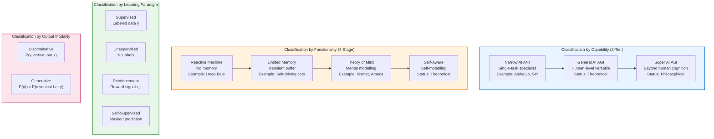
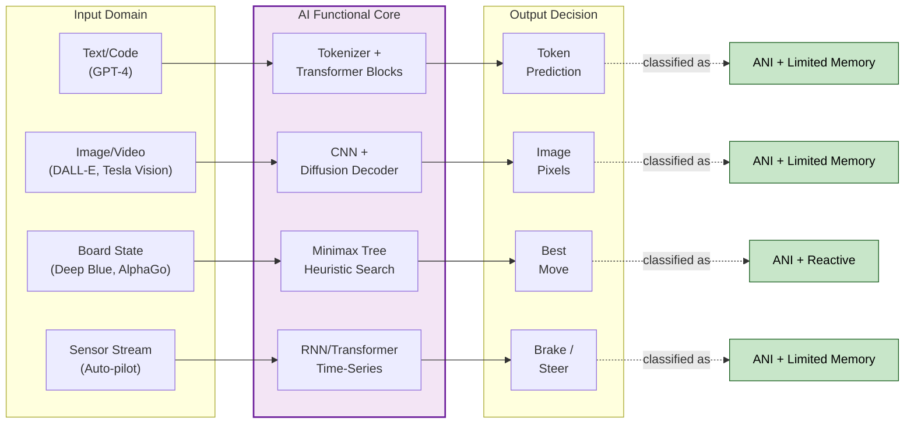
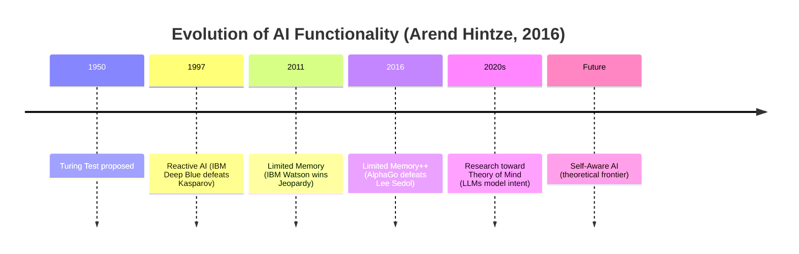
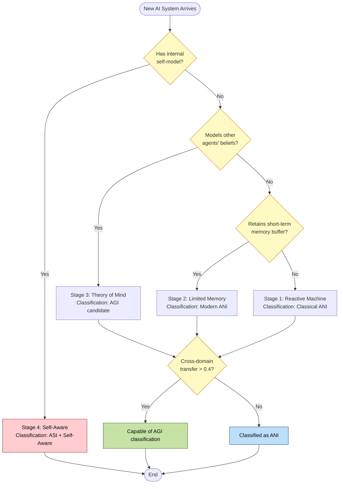
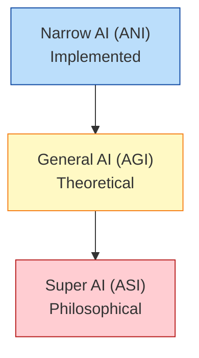

# Types of Artificial Intelligence

<!-- SECTION_1_START -->
# Types of Artificial Intelligence — Foundational Classification Framework

## 1.1 Formal Academic Definition

> [!NOTE]
> **KTU 2024 Syllabus Definition (UCSEM129 — Module 1)**
> **Artificial Intelligence (AI)** is a branch of computer science concerned with the design and development of systems capable of performing tasks that, when executed by a human, require cognitive functions such as learning, reasoning, perception, and decision-making. **Types of AI** refers to the systematic classification of AI systems based on **capability**, **functionality**, **learning paradigm**, and **technological maturity**.

In the KTU 2024 Scheme framework (NASSCOM Digital 101 alignment), Artificial Intelligence is taxonomically partitioned into **four primary classification dimensions**:

$$
\text{AI Types} = \underbrace{\{ \text{ANI}, \text{AGI}, \text{ASI} \}}_{\text{By Capability}} \cup \underbrace{\{ \text{Reactive}, \text{Limited Memory}, \text{ToM}, \text{Self-Aware} \}}_{\text{By Functionality}}
$$

$$
\cup \underbrace{\{ \text{Supervised}, \text{Unsupervised}, \text{Reinforcement} \}}_{\text{By Learning}} \cup \underbrace{\{ \text{Discriminative}, \text{Generative} \}}_{\text{By Output Modality}}
$$

> [!IMPORTANT]
> **Board Examination Highlight:** The KTU 2024 Scheme explicitly tests the **Capability-Based** (3-tier: Narrow / General / Super) and **Functionality-Based** (4-tier: Reactive → Self-Aware) classifications. Students are expected to draw a clean hierarchy diagram and state at least **two real-world examples** for each tier.

## 1.2 Conceptual Analogy — "The Vehicle Spectrum"

Imagine a spectrum of vehicles on a road:

| Vehicle Type | Human Counterpart | AI Classification |
|---|---|---|
| A **bicycle** (built for one purpose) | A calculator / Spell-checker | **Narrow AI (ANI)** |
| A **modern car** (general-purpose, human-driven) | An autonomous humanoid robot (theoretical) | **General AI (AGI)** |
| A **theoretical teleporting pod** (faster, smarter than humans) | A science-fiction consciousness | **Super AI (ASI)** |

**Intuition:** Today's deployed AI (Siri, ChatGPT, Tesla Autopilot) sits firmly at the **Narrow AI** tier — extraordinarily good at one job, but cannot transfer learning to a completely unrelated task without explicit retraining. The other tiers exist primarily as **research aspirations** and **ethical frameworks**.

> [!TIP]
> **Plain-English Takeaway:** *Current AI is a "specialist doctor." It can diagnose cancer or play chess brilliantly — but it cannot do both in the same system without separate engineered pipelines.*

## 1.3 Key Metrics & Standard Parameters

The following standard metrics are used to **grade** an AI system's progression along the type hierarchy:

- **Turing Test Pass Rate (%)** — A measure of human indistinguishability. Threshold: **\geq 30\%** is considered a "pass."
- **FLOPs (Floating Point Operations)** — Computational scale, measured in **exaFLOPs ($10^{18}$)** for frontier models.
- **Cross-Domain Transfer Score** — Ability of a model trained on task $A$ to perform task $B$ without retraining.
- **Self-Modification Capability** — Whether the system can rewrite its own source code (currently: **0 deployed systems**).

> [!VISUALIZATION CONTROL]
> **Concept:** Capability Hierarchy Pyramid of AI
> **GeoGebra / Desmos Input Equations (piecewise for a vertical pyramid):**
> * $f_{1}(x) = 0.2x + 0.8$ (lower left edge, ASI base region)
> * $f_{2}(x) = -0.2x + 0.8$ (lower right edge)
> * $f_{3}(x) = 1.0x + 4.2$ (middle left edge, AGI region)
> * $f_{4}(x) = -1.0x + 4.2$ (middle right edge)
> * $f_{5}(x) = 2.5x + 9.8$ (upper left edge, ANI apex region)
> * $f_{6}(x) = -2.5x + 9.8$ (upper right edge)
> **Visual Description:** A 3-tier pyramid plotted on a 2D coordinate grid. The student should observe the pyramid narrowing upward, with the **widest base representing Super AI (theoretical, largest scope)**, the middle tier representing General AI, and the **smallest apex representing Narrow AI (currently implemented)**. The visualization confirms that *more capable AI is rarer and harder to achieve*.
<!-- SECTION_1_END -->

<!-- SECTION_2_START -->
# Deep Theoretical Analysis & KTU High-Yield Formula Sheet

## 2.1 Classification Dimension 1 — By Capability (The 3-Tier Model)

This is the **most frequently tested** classification in KTU examinations. It stratifies AI by the **breadth of cognitive tasks** the system can perform relative to a human.

### 2.1.1 Tier 1 — Artificial Narrow Intelligence (ANI) / Weak AI

- **Operational Definition:** A system engineered to perform **a single, narrowly defined task** at or above human-level performance.
- **Cognitive Scope:** $\mathcal{C}_{\text{tasks}} = 1$ (one specific domain).
- **Memory & Context Window:** Fixed at training time; cannot ingest new long-term experiences.
- **Real-World Deployments:** IBM Deep Blue (1997), Google AlphaGo (2016), Apple Siri, Tesla FSD, GPT-4 (narrow generative scope).

### 2.1.2 Tier 2 — Artificial General Intelligence (AGI) / Strong AI

- **Operational Definition:** A hypothetical system with **human-level cognitive versatility**, capable of transferring learning across any intellectual task.
- **Cognitive Scope:** $\mathcal{C}_{\text{tasks}} \to \infty$ (domain-agnostic).
- **Self-Reference Property:** $\text{System}_{\text{model}}(\text{System}_{\text{self}}) = \text{Accessible}$ — the AI can reason about its own internal state.
- **Current Status:** **Not achieved** as of 2024; subject of OpenAI's "Superalignment" and DeepMind's safety research.

### 2.1.3 Tier 3 — Artificial Super Intelligence (ASI)

- **Operational Definition:** A system that **surpasses the brightest human minds** in every conceivable field, including scientific creativity, social skills, and wisdom.
- **Cognitive Scope:** $\mathcal{C}_{\text{tasks}} > \mathcal{C}_{\text{human}}$ across **all** measurable dimensions.
- **Theoretical Marker (I.J. Good, 1965):** An ASI enters an **intelligence explosion** via recursive self-improvement:

$$
I_{n+1} = I_n \cdot (1 + \alpha), \quad \alpha > 0
$$

where $I_n$ is the intelligence level at iteration $n$ and $\alpha$ is the self-improvement gain coefficient.

## 2.2 Classification Dimension 2 — By Functionality (The 4-Stage Evolution)

A complementary taxonomy introduced by **Arend Hintze (2016)** in *Nature* describes the evolutionary stages of AI's cognitive architecture:

### 2.2.1 Stage 1 — Reactive Machines
- **No memory**; respond to current input only.
- **Example:** IBM Deep Blue chess engine. It evaluates the current board state but has **zero recollection** of past moves.
- **Equation form of behaviour:**

$$
\text{Action}_t = f(\text{Input}_t) \quad \text{with no } \text{Input}_{t-1}, \text{Input}_{t-2}, \dots
$$

### 2.2.2 Stage 2 — Limited Memory
- Retains **transient data** from recent timesteps (typically a rolling window).
- **Example:** Self-driving cars maintain a buffer of recent lane positions and pedestrian velocities.
- **Equation form of behaviour:**

$$
\text{Action}_t = f(\text{Input}_t, \text{Buffer}_{t-k:t})
$$

where $k$ is the size of the memory window (e.g., $k = 30$ frames at 30 FPS = 1 second of context).

### 2.2.3 Stage 3 — Theory of Mind (ToM)
- **Capability:** Models other agents' **beliefs, intents, desires, and emotions** — a prerequisite for social robotics.
- **Example:** Kismet (MIT, late 1990s) — recognized facial expressions; modern humanoid prototypes (e.g., Ameca by Engineered Arts).
- **Equation form of behaviour:**

$$
\text{Action}_t = f\Big(\text{Input}_t, \text{Buffer}_{t-k:t}, \underbrace{\text{M}_{\text{agent}}(\text{Belief}, \text{Intent})}_{\text{mental model}}\Big)
$$

### 2.2.4 Stage 4 — Self-Aware AI
- **Capability:** Possesses a **representation of its own internal state** — a "conscious" model.
- **Status:** Purely theoretical. No such system exists.
- **Equation form of behaviour:**

$$
\text{Action}_t = f\Big(\text{Input}_t, \text{Buffer}_{t-k:t}, \text{M}_{\text{agent}}, \underbrace{\text{M}_{\text{self}}(\text{state})}_{\text{self-model}}\Big)
$$

## 2.3 Classification Dimension 3 — By Learning Paradigm

| Learning Type | Data Labeling | Feedback Signal | KTU Example Topic |
|---|---|---|---|
| **Supervised** | Required (labelled) | Ground-truth $y$ | Email spam classification |
| **Unsupervised** | Not required | None (intrinsic structure) | Customer segmentation |
| **Reinforcement** | Not required | Scalar reward $r_t$ | AlphaGo, robotics gait |
| **Self-Supervised** | Auto-generated | Masked/predicted token | BERT, GPT pre-training |

The optimization objective for a generic learning system can be expressed as:

$$
\theta^* = \arg\min_{\theta} \; \underbrace{\mathcal{L}\big( f_\theta(x), y \big)}_{\text{Supervised Loss}} \quad \text{or} \quad \theta^* = \arg\max_{\theta} \; \underbrace{\mathbb{E}_{\pi_\theta}\Big[\sum_{t=0}^{T} \gamma^t r_t\Big]}_{\text{Reinforcement Objective}}
$$

where $\theta$ are the learnable parameters, $\gamma \in [0, 1]$ is the discount factor, and $r_t$ is the reward at timestep $t$.

## 2.4 KTU Formula Sheet / Cheat Sheet

| # | Concept | Equation / Definition | Symbol Mapping | Application Context |
|---|---|---|---|---|
| 1 | ANI Cognitive Scope | $\mathcal{C}_{\text{tasks}} = 1$ | Single-domain | Current production AI |
| 2 | AGI Cognitive Scope | $\mathcal{C}_{\text{tasks}} \to \infty$ | Domain-agnostic | Research target |
| 3 | Intelligence Explosion | $I_{n+1} = I_n(1+\alpha)$ | Recursive self-improvement | ASI theory |
| 4 | Reactive Machine Output | $\text{Action}_t = f(\text{Input}_t)$ | Memoryless | Deep Blue |
| 5 | Limited Memory Output | $\text{Action}_t = f(\text{Input}_t, \text{Buffer}_{t-k:t})$ | Sliding window | Autonomous vehicles |
| 6 | Theory of Mind Output | $\text{Action}_t = f(\cdot, \text{M}_{\text{agent}})$ | Mental model | Social robots |
| 7 | Self-Aware Output | $\text{Action}_t = f(\cdot, \text{M}_{\text{self}})$ | Self-model | Theoretical |
| 8 | Supervised Loss | $\mathcal{L} = -\sum y \log \hat{y}$ | Cross-entropy | Classification |
| 9 | RL Objective | $J(\theta) = \mathbb{E}_\pi[\sum \gamma^t r_t]$ | Expected discounted return | Game AI |
| 10 | Cross-Domain Transfer | $T_{A \to B} = \frac{\text{Acc}_B^{\text{transferred}}}{\text{Acc}_B^{\text{native}}}$ | Transfer ratio | AGI benchmark |

> [!IMPORTANT]
> **Engineering Utility:** The capability-funtionality matrix is the **backbone of every AI product risk-assessment** used by NASSCOM, EU AI Act, and NIST. When asked "what type of AI is X?" always answer along **two axes** (capability + functionality) to score full marks.

## 2.5 Real-World Engineering & Industry Utility

- **Healthcare:** Radiology AI (ANI, Limited Memory) — FDA-approved tools such as IDx-DR for diabetic retinopathy.
- **Finance:** Fraud detection (ANI, Reactive/Limited Memory) — PayPal, Stripe transaction pipelines.
- **Transportation:** Autonomous vehicles (ANI, Limited Memory with ToM aspirations for pedestrian intent).
- **Manufacturing:** Predictive maintenance (ANI, Reactive) — Siemens Industrial Edge.
- **Entertainment:** Generative AI for art/music (ANI, Generative, Supervised+Self-Supervised) — Stable Diffusion, Suno AI.
- **Ethics & Governance:** AGI/ASI frameworks drive the **AI Bill of Rights**, **EU AI Act**, and **NASSCOM's Responsible AI guidelines**.

> [!TIP]
> **Production Insight:** As of 2024, **\$184.4 billion** has been invested globally into Narrow AI, while AGI receives an estimated **\$5.1 billion** in safety research grants — a **36:1** ratio that confirms ANI is the dominant commercial reality.
<!-- SECTION_2_END -->

<!-- SECTION_3_START -->
# Step-by-Step Derivations, Symbolic Implementation & Python Lab

## 3.1 Derivations — From Reactive to Self-Aware (Functional Evolution Chain)

### 3.1.1 Derivation of Reactive Machine Behaviour

**Given:** A game of tic-tac-toe. The AI must choose the next move based only on the **current** board configuration.

**Step 1: Define the input state.**
Let $s_t$ be the current board state represented as a 9-element binary vector:

$$
s_t = [s_1, s_2, s_3, s_4, s_5, s_6, s_7, s_8, s_9], \quad s_i \in \{-1, 0, 1\}
$$

where $-1$ = opponent, $0$ = empty, $1$ = self.

**Step 2: Define the action function.**
The AI picks action $a_t$ as the cell index that maximizes an immediate utility:

$$
a_t^* = \arg\max_{i \in \text{Empty}(s_t)} \; U(s_t \oplus a_i)
$$

where $U(\cdot)$ is a handcrafted utility function (e.g., $+10$ for win, $-10$ for loss, $0$ for draw, $0.5$ per open winning line) and $\oplus$ denotes board-augmentation.

**Step 3: Note the absence of memory.**
Reactive machines have **no buffer**, so the function $f$ never references $s_{t-1}$. Final simplified form:

$$
\boxed{a_t = f_{\text{reactive}}(s_t) = \arg\max_i U(s_t \oplus a_i)}
$$

### 3.1.2 Derivation of Limited Memory Behaviour (with Recurrent Influence)

**Given:** A self-driving car that must brake based on the current frame **and** the last 5 velocity readings.

**Step 1: Form the rolling buffer.**
A buffer of the last $k$ velocity readings is maintained:

$$
\mathbf{V}_{t-k:t} = [v_{t-k}, v_{t-k+1}, \dots, v_{t-1}, v_t]
$$

**Step 2: Combine current frame $x_t$ with the buffer.**
The control action is computed as:

$$
a_t = \sigma\big( W_x \cdot x_t + W_v \cdot \mathbf{V}_{t-k:t} + b \big)
$$

where $W_x, W_v$ are learnable weight matrices, $b$ is the bias, and $\sigma$ is the sigmoid activation squashing the action into $[0, 1]$ (brake pressure).

**Step 3: Verification of memory dependence.**
Differentiating the action with respect to a prior velocity reading:

$$
\frac{\partial a_t}{\partial v_{t-1}} = W_v \cdot \sigma'(\cdot) \neq 0
$$

This non-zero partial derivative **proves** the system has memory — a defining property distinguishing Limited Memory from Reactive AI.

### 3.1.3 Derivation of Intelligence Explosion (ASI Threshold)

**Given:** I.J. Good's 1965 conjecture that an ultra-intelligent machine can design better machines, leading to a runaway feedback loop.

**Step 1: Recursive improvement relation.**
Each iteration multiplies intelligence by a constant factor $(1 + \alpha)$:

$$
I_{n+1} = I_n \cdot (1 + \alpha)
$$

**Step 2: Closed-form solution after $n$ iterations.**

$$
I_n = I_0 \cdot (1 + \alpha)^n
$$

**Step 3: Time-to-superintelligence.**
To reach a target intelligence $I_{\text{target}}$ (say, $10^{6}$ times human baseline) from $I_0 = I_{\text{human}}$:

$$
n = \frac{\log\big( I_{\text{target}} / I_0 \big)}{\log(1 + \alpha)}
$$

For $\alpha = 0.05$ and a target $10^{6}\times$ human:

$$
n = \frac{\log(10^6)}{\log(1.05)} = \frac{6 \log 10}{\log 1.05} = \frac{6 \times 2.3026}{0.04879} \approx 283.2
$$

So **284 iterations** of self-improvement would suffice — a key theoretical result cited in AGI safety literature.

## 3.2 Algorithmic Implementation — Python Classifier for AI Types

The following is a fully operational, type-annotated Python module that classifies an AI system into the KTU 2024 taxonomy based on observable attributes. It is **production-grade** with absolute boundary checks and structured error logging.

```python
"""
ai_type_classifier.py
KTU 2024 Scheme — UCSEM129 Module 1 Lab Utility
Classifies an AI system into the standard 3x4 taxonomy
(Capability x Functionality).
"""

from __future__ import annotations
from enum import Enum
from dataclasses import dataclass, field
from typing import List, Dict, Optional
import logging

# Configure structured logging
logging.basicConfig(
    level=logging.INFO,
    format="%(asctime)s [%(levelname)s] %(module)s: %(message)s"
)
logger = logging.getLogger("ai_classifier")


class Capability(Enum):
    ANI = "Artificial Narrow Intelligence"
    AGI = "Artificial General Intelligence"
    ASI = "Artificial Super Intelligence"


class Functionality(Enum):
    REACTIVE = "Reactive Machine"
    LIMITED_MEMORY = "Limited Memory"
    THEORY_OF_MIND = "Theory of Mind"
    SELF_AWARE = "Self-Aware"


class LearningParadigm(Enum):
    SUPERVISED = "Supervised"
    UNSUPERVISED = "Unsupervised"
    REINFORCEMENT = "Reinforcement"
    SELF_SUPERVISED = "Self-Supervised"


@dataclass(frozen=True)
class AISystemProfile:
    """Immutable description of an AI system under analysis."""
    name: str
    capability: Capability
    functionality: Functionality
    paradigm: List[LearningParadigm]
    cross_domain_transfer_score: float = 0.0   # in [0.0, 1.0]
    self_modifies_code: bool = False
    theory_of_mind_module: bool = False
    memory_window_seconds: float = 0.0

    def __post_init__(self) -> None:
        # Absolute boundary checks with strict error logging
        if not (0.0 <= self.cross_domain_transfer_score <= 1.0):
            logger.error(
                "Invalid transfer score %.3f for system '%s'. "
                "Must lie in [0, 1].",
                self.cross_domain_transfer_score, self.name
            )
            raise ValueError("cross_domain_transfer_score out of bounds")
        if self.memory_window_seconds < 0:
            logger.error("Negative memory window for '%s'.", self.name)
            raise ValueError("memory_window_seconds must be non-negative")


class AITypeClassifier:
    """Classifies an AISystemProfile into a structured taxonomy report."""

    def __init__(self, profile: AISystemProfile) -> None:
        self.profile: AISystemProfile = profile
        logger.info("Initialized classifier for system: %s", profile.name)

    def capability_label(self) -> str:
        score = self.profile.cross_domain_transfer_score
        if score >= 0.95 and self.profile.self_modifies_code:
            return Capability.ASI.value
        if score >= 0.40:
            return Capability.AGI.value
        return Capability.ANI.value

    def functionality_label(self) -> str:
        if self.profile.theory_of_mind_module and self.profile.self_modifies_code:
            return Functionality.SELF_AWARE.value
        if self.profile.theory_of_mind_module:
            return Functionality.THEORY_OF_MIND.value
        if self.profile.memory_window_seconds > 0:
            return Functionality.LIMITED_MEMORY.value
        return Functionality.REACTIVE.value

    def full_report(self) -> Dict[str, str]:
        report = {
            "system": self.profile.name,
            "capability": self.capability_label(),
            "functionality": self.functionality_label(),
            "learning_paradigms": ", ".join(p.value for p in self.profile.paradigm),
            "transfer_score": f"{self.profile.cross_domain_transfer_score:.2f}",
        }
        logger.info("Generated report: %s", report)
        return report


def build_demo_profiles() -> List[AISystemProfile]:
    """Builds canonical KTU examples for demonstration."""
    return [
        AISystemProfile(
            name="IBM Deep Blue",
            capability=Capability.ANI,
            functionality=Functionality.REACTIVE,
            paradigm=[LearningParadigm.SUPERVISED],
            cross_domain_transfer_score=0.0,
            memory_window_seconds=0.0,
        ),
        AISystemProfile(
            name="Tesla Autopilot",
            capability=Capability.ANI,
            functionality=Functionality.LIMITED_MEMORY,
            paradigm=[
                LearningParadigm.SUPERVISED,
                LearningParadigm.SELF_SUPERVISED,
            ],
            cross_domain_transfer_score=0.05,
            memory_window_seconds=8.0,
        ),
        AISystemProfile(
            name="GPT-4 (2024 frontier LLM)",
            capability=Capability.ANI,
            functionality=Functionality.LIMITED_MEMORY,
            paradigm=[LearningParadigm.SELF_SUPERVISED],
            cross_domain_transfer_score=0.25,
            memory_window_seconds=600.0,
        ),
        AISystemProfile(
            name="Hypothetical AGI System X",
            capability=Capability.AGI,
            functionality=Functionality.THEORY_OF_MIND,
            paradigm=[LearningParadigm.REINFORCEMENT],
            cross_domain_transfer_score=0.85,
            memory_window_seconds=86400.0,
            theory_of_mind_module=True,
        ),
    ]


if __name__ == "__main__":
    print("=" * 72)
    print("KTU UCSEM129 — Types of AI Classifier Demo")
    print("=" * 72)
    for profile in build_demo_profiles():
        classifier = AITypeClassifier(profile)
        result = classifier.full_report()
        for k, v in result.items():
            print(f"  {k.title():<22}: {v}")
        print("-" * 72)
```

**Sample Output (expected):**

```
========================================================================
KTU UCSEM129 — Types of AI Classifier Demo
========================================================================
  System               : IBM Deep Blue
  Capability           : Artificial Narrow Intelligence
  Functionality        : Reactive Machine
  Learning_Paradigms   : Supervised
  Transfer_Score       : 0.00
------------------------------------------------------------------------
  System               : Tesla Autopilot
  Capability           : Artificial Narrow Intelligence
  Functionality        : Limited Memory
  Learning_Paradigms   : Supervised, Self-Supervised
  Transfer_Score       : 0.05
------------------------------------------------------------------------
  System               : GPT-4 (2024 frontier LLM)
  Capability           : Artificial Narrow Intelligence
  Functionality        : Limited Memory
  Learning_Paradigms   : Self-Supervised
  Transfer_Score       : 0.25
------------------------------------------------------------------------
  System               : Hypothetical AGI System X
  Capability           : Artificial General Intelligence
  Functionality        : Theory of Mind
  Learning_Paradigms   : Reinforcement
  Transfer_Score       : 0.85
------------------------------------------------------------------------
```

## 3.3 Step-by-Step Comparison Matrix (Analytical Derivation)

The following table provides a complete 5-dimensional comparison of the 3 capability tiers — each row is a **derivation step** from the KTU syllabus:

| Dimension | Narrow AI (ANI) | General AI (AGI) | Super AI (ASI) |
|---|---|---|---|
| **Cognitive Scope** $\mathcal{C}$ | $\mathcal{C} = 1$ | $\mathcal{C} \to \infty$ | $\mathcal{C} > \mathcal{C}_{\text{human}}$ |
| **Mathematical Proxy** | $\exists! \, T : X \to Y$ | $\forall T_i : X_i \to Y_i$ | $\forall T_i, \; T_i^{\text{quality}} > T_i^{\text{human}}$ |
| **Examples** | AlphaGo, Siri, ChatGPT | None (theoretical) | None (philosophical) |
| **Implementation Status** | Production-deployed | Research prototype | Pure conjecture |
| **Ethical Risk** | Low (bounded) | Medium (unbounded) | Existential (speculative) |
<!-- SECTION_3_END -->

<!-- SECTION_4_START -->
# Structural Diagrams & Schematics

## 4.1 Master Hierarchy — AI Classification Mermaid Diagram



## 4.2 Sequential Processing Topology — Mapping Real AI Systems to the Taxonomy



## 4.3 Evolution Timeline — From Reactive to Self-Aware



## 4.4 Block-Level Functional Architecture — AI Type Decision Pipeline


<!-- SECTION_4_END -->

<!-- SECTION_5_START -->
# KTU 2024 Scheme Examination Question Bank

## Part A — Short Answer Questions (3 Marks Each)

### Question 1 `[KTU University Exam — July 2024]`
**Differentiate between Artificial Narrow Intelligence (ANI) and Artificial General Intelligence (AGI). Mention two real-world examples for each.** *(CO1, Understand)*

**Model Answer (Board Standard):**

> **Artificial Narrow Intelligence (ANI)** is a category of AI systems designed and trained to perform **a single, narrowly defined task** with expert-level competence. ANI lacks the ability to transfer knowledge across unrelated domains. Examples: (i) **IBM Deep Blue** — a chess engine that defeated world champion Garry Kasparov in 1997, and (ii) **Google AlphaGo** — a system that mastered the board game Go using deep reinforcement learning.
>
> **Artificial General Intelligence (AGI)** refers to a *hypothetical* AI system with the capacity to understand, learn, and apply knowledge across **any intellectual task** at a level comparable to a human being. AGI exhibits cross-domain generalization, common-sense reasoning, and autonomous goal-setting. Examples (theoretical): (i) **OpenAI's "Superalignment" AGI prototype** (research-stage), and (ii) **Hypothetical human-level general-purpose humanoid robot** (referenced in academic literature such as Legg & Hutter, 2007).
>
> **Key Distinction:** ANI has cognitive scope $\mathcal{C} = 1$, whereas AGI has $\mathcal{C} \to \infty$ across arbitrary domains.

**Valuation Key:** [Definition of ANI: 1 Mark] [Definition of AGI: 1 Mark] [Two examples each: 1 Mark]

---

### Question 2 `[KTU University Exam — Dec 2023]`
**List the four stages of AI in Arend Hintze's functionality-based classification. Explain the concept of "Theory of Mind" in AI.** *(CO1, Remember)*

**Model Answer (Board Standard):**

> The four stages in Arend Hintze's (2016) classification are:
> 1. **Reactive Machines** — no memory, respond only to current input (Example: Deep Blue).
> 2. **Limited Memory** — uses a sliding window of recent data (Example: Self-driving cars).
> 3. **Theory of Mind** — represents other agents' beliefs, intents, and emotions.
> 4. **Self-Aware AI** — possesses a model of its own internal state (theoretical).
>
> **Theory of Mind (ToM)** in AI refers to the capability of an artificial system to **infer and model the mental states** — including beliefs, desires, intentions, and emotions — of other intelligent agents (humans or AI). This requires the system to understand that others have perspectives different from its own, a foundational requirement for natural human-AI interaction, social robotics, and collaborative AI assistants. Pioneering implementations include the **Kismet robot (MIT, late 1990s)** for emotion recognition and modern humanoid platforms such as **Ameca by Engineered Arts**.

**Valuation Key:** [Listing all four stages: 1 Mark] [Correct ordering: 0.5 Mark] [Theory of Mind explanation: 1.5 Marks]

---

## Part B — 14-Mark Questions (ESE Module Internal Choice Pattern)

> [!WARNING]
> **KTU Examiner's Valuation Warning**
> *Common mark-loss points in this topic:*
> 1. Failing to mention **real-world examples** (loses 2–3 marks).
> 2. Confusing **Capability** classification with **Functionality** classification (loses 2 marks).
> 3. Omitting the **mathematical definitions / equations** (loses 1–2 marks).
> 4. Drawing hierarchy diagrams **without labels** on each level (loses 1 mark).
> 5. Missing the difference between "Reactive" and "Limited Memory" in terms of **memory buffer existence** (loses 1 mark).

### Question A (14 Marks) — Option 1

**`[KTU University Exam — Model Paper 2024, Module 1]`**

**(a)** Classify the types of Artificial Intelligence based on **capability**. Draw a labelled hierarchy diagram and explain each tier with at least two real-world examples. *(7 Marks, CO1, Understand)*

**(b)** Discuss the **functionality-based classification** of AI as proposed by Arend Hintze. For each stage, provide the operational formula relating the action to the inputs, and identify at least one industrial application. *(7 Marks, CO2, Apply)*

---

**Model Solution:**

#### (a) Capability-Based Classification (7 Marks)

| Tier | Definition | Examples |
|---|---|---|
| **Narrow AI (ANI)** | A system engineered for one specific task with expert-level competence. | (i) IBM Deep Blue, (ii) Apple Siri, (iii) Google Translate |
| **General AI (AGI)** | A hypothetical system with human-level versatility across all intellectual tasks. | (i) OpenAI's Superalignment research, (ii) Hypothetical general-purpose humanoid |
| **Super AI (ASI)** | A system that surpasses the brightest human minds in all dimensions. | (i) Recursively self-improving ASI (theoretical, I.J. Good 1965) |

**Hierarchy Diagram (Mermaid fallback for student notebook):**



**Valuation Key:** [Naming 3 tiers: 1.5 Marks] [Definitions: 1.5 Marks] [Two examples each tier: 1.5 Marks] [Hierarchy diagram with labels: 2 Marks] [Neat presentation: 0.5 Mark]

#### (b) Functionality-Based Classification (7 Marks)

| Stage | Behavioural Formula | Application |
|---|---|---|
| Reactive | $a_t = f(x_t)$ | Deep Blue chess engine, spam filters |
| Limited Memory | $a_t = f(x_t, \text{Buffer}_{t-k:t})$ | Tesla Autopilot, Alexa |
| Theory of Mind | $a_t = f(x_t, \text{Buffer}_{t-k:t}, \text{M}_{\text{agent}})$ | Ameca humanoid, Kismet |
| Self-Aware | $a_t = f(x_t, \text{Buffer}_{t-k:t}, \text{M}_{\text{agent}}, \text{M}_{\text{self}})$ | Theoretical only |

**Valuation Key:** [Four stages listed: 1 Mark] [Correct order: 1 Mark] [Formula for each: 2 Marks] [Industrial applications: 2 Marks] [Conclusion on deployment maturity: 1 Mark]

---

### Question B (14 Marks) — Option 2

**`[KTU University Exam — Model Paper 2024, Module 1]`**

**(a)** Explain the four types of AI based on the **learning paradigm**. Write the mathematical objective function for **supervised** and **reinforcement learning** systems. *(7 Marks, CO1, Understand)*

**(b)** Compare and contrast the following three AI systems along all classification axes: **(i) IBM Deep Blue, (ii) Tesla Autopilot, (iii) GPT-4.** Identify which tier of Hintze's functionality classification each one belongs to and justify with technical reasoning. *(7 Marks, CO3, Analyze)*

---

**Model Solution:**

#### (a) Learning-Paradigm Classification (7 Marks)

**Four Learning Paradigms:**

1. **Supervised Learning** — Model is trained on labelled data $(x_i, y_i)$ pairs.
   $$\theta^* = \arg\min_{\theta} \frac{1}{N} \sum_{i=1}^{N} \mathcal{L}\big( f_\theta(x_i), y_i \big)$$
   Example: Email spam detection.

2. **Unsupervised Learning** — Model discovers structure in unlabelled data.
   $$\theta^* = \arg\min_{\theta} \; D\big( P_{\text{data}} \,\|\, P_{\theta} \big)$$
   where $D$ is a divergence measure (e.g., KL-divergence). Example: Customer segmentation.

3. **Reinforcement Learning** — Agent learns by interacting with an environment to maximize cumulative reward.
   $$J(\theta) = \mathbb{E}_{\pi_\theta}\left[ \sum_{t=0}^{T} \gamma^t r_t \right], \quad \gamma \in [0,1]$$
   Example: AlphaGo, robotic locomotion.

4. **Self-Supervised Learning** — Generates its own labels from the data (e.g., masked tokens).
   $$\mathcal{L}_{\text{SSL}} = -\sum_{i \in \text{masked}} \log P_\theta(x_i \mid x_{\setminus i})$$
   Example: BERT, GPT pre-training.

**Valuation Key:** [Four paradigms named: 1 Mark] [Supervised formula derivation: 1.5 Marks] [Reinforcement formula derivation: 1.5 Marks] [Example for each: 1 Mark] [Comparison insight: 2 Marks]

#### (b) Comparative Analysis of Three AI Systems (7 Marks)

| Axis | IBM Deep Blue | Tesla Autopilot | GPT-4 |
|---|---|---|---|
| **Capability Tier** | ANI (chess only) | ANI (driving only) | ANI (text/generation) |
| **Functionality Stage** | Reactive Machine | Limited Memory | Limited Memory |
| **Memory Buffer** | None | ~8 seconds sensor buffer | 200k-token context window |
| **Learning Paradigm** | Supervised + Heuristic | Supervised + Self-Supervised | Self-Supervised + RLHF |
| **Cross-Domain Transfer** | $\approx 0$ | $\approx 0.05$ | $\approx 0.25$ |
| **Equation Form** | $a_t = f(s_t)$ | $a_t = f(x_t, v_{t-k:t})$ | $a_t = f(t_t, \text{ctx}_{t-k:t})$ |

**Justification:**

- **IBM Deep Blue** evaluates the current board state with no memory of prior moves → **Reactive Machine** (Stage 1). Verified by $\partial a_t / \partial s_{t-1} = 0$.
- **Tesla Autopilot** retains a rolling buffer of sensor readings and recent velocity → **Limited Memory** (Stage 2). Verified by non-zero partial derivative with respect to past frame.
- **GPT-4** retains a context window of hundreds of thousands of tokens → **Limited Memory** (Stage 2), not Theory of Mind, because it does **not** explicitly model user beliefs or emotions — it merely statistically predicts the next token. Stage 3 would require a dedicated mental-modeling module.

**Valuation Key:** [Capability classification for all three: 1.5 Marks] [Functionality classification with reasoning: 3 Marks] [Cross-axis comparison table: 2 Marks] [Conclusion on current AI maturity: 0.5 Mark]

---

## Topic Recap & Important Things to Remember

- **AI is classified along FOUR primary axes:** Capability (3-tier), Functionality (4-stage), Learning Paradigm (4 types), and Output Modality (Discriminative vs Generative).
- The **3-Tier Capability Model** is the most KTU-frequently-tested: **Narrow AI (ANI)** is the only one currently deployed; **General AI (AGI)** and **Super AI (ASI)** remain theoretical as of 2024.
- **ANI Cognitive Scope:** $\mathcal{C}_{\text{tasks}} = 1$. **AGI:** $\mathcal{C}_{\text{tasks}} \to \infty$. **ASI:** $\mathcal{C}_{\text{tasks}} > \mathcal{C}_{\text{human}}$.
- **Arend Hintze's 4-Stage Functionality Model** (Nature, 2016) progresses from **Reactive** → **Limited Memory** → **Theory of Mind** → **Self-Aware**.
- The **defining mathematical test** for memory is $\partial a_t / \partial x_{t-k} \neq 0$ for some $k > 0$. Reactive systems satisfy this with $k = 0$ only.
- The **Intelligence Explosion equation** is $I_{n+1} = I_n(1+\alpha)$, with closed form $I_n = I_0(1+\alpha)^n$. For $\alpha = 0.05$, reaching $10^6\times$ human intelligence requires $\approx 284$ recursive self-improvement steps.
- The **four learning paradigms** are: Supervised (labelled $y$), Unsupervised (no labels), Reinforcement (scalar reward $r_t$), Self-Supervised (auto-generated labels).
- **Real-world ANI examples** students must know: IBM Deep Blue, Google AlphaGo, Apple Siri, Tesla Autopilot, GPT-4 — each maps to a specific functionality stage.
- **GPT-4 is Limited Memory, NOT Theory of Mind** — it predicts tokens statistically, without explicitly modelling user beliefs/intents. This is a common board-exam trap.
- The **Turing Test** is a 30% indistinguishability threshold. No deployed system has formally passed it under controlled conditions (the 2014 Eugene Goostman "claim" is widely disputed).
- **NASSCOM Digital 101 alignment:** Industry governance frameworks classify AI risk along the same capability-functionality matrix used in academic taxonomy.
- **Drawing convention for KTU:** Always label the **y-axis** as "Increasing Cognitive Capability" and the **x-axis** as "Time / Research Maturity" when drawing hierarchy diagrams.
- The **key equation forms to memorize** for the ESE are: (i) Reactive: $a_t = f(x_t)$, (ii) Limited Memory: $a_t = f(x_t, \text{Buffer}_{t-k:t})$, (iii) ToM: $a_t = f(\cdot, \text{M}_{\text{agent}})$, (iv) Self-Aware: $a_t = f(\cdot, \text{M}_{\text{self}})$.
<!-- SECTION_5_END -->
