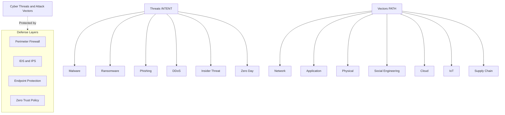
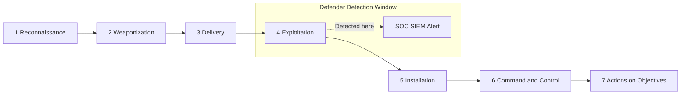
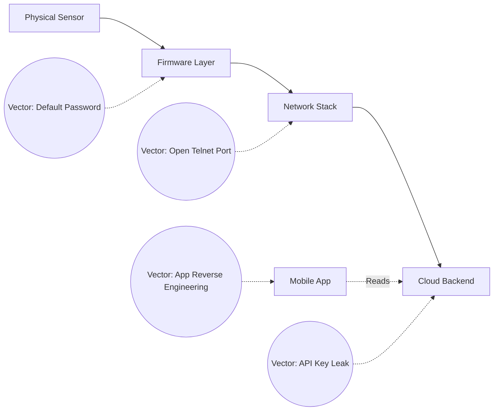

# Cyber Threats and Attack Vectors

<!-- SECTION_1_START -->
# Cyber Threats and Attack Vectors

## 1.1 Formal Definition (KTU 2024 Syllabus Terminology)

> [!IMPORTANT]
> **Cyber Threat**: A *cyber threat* is any malicious act that attempts to gain unauthorized access to a digital system, network, or device, with the intention to **steal, alter, destroy, disrupt, or expose sensitive information**. In the context of the **Internet of Things (IoT)**, threats extend to connected sensors, smart devices, embedded controllers, and edge gateways operating in cyber-physical environments.

> [!IMPORTANT]
> **Attack Vector**: An *attack vector* is the **pathway, method, or means** by which a threat actor (hacker, insider, or automated agent) gains illicit entry into a target system. It is the "delivery route" of a cyber attack — encompassing the network channel, the software vulnerability exploited, and the human or hardware surface targeted.

Together, the pair forms the *Threat–Vector Relationship*: **Threat = Intent** and **Vector = Path**.

## 1.2 Conceptual Analogy — The Digital Castle

Imagine your home network as a medieval **castle**:

- **Cyber Threat** → the *army* laying siege (motivation: theft, espionage, sabotage).
- **Attack Vector** → the *gate, tunnel, or unguarded window* they use to enter (path: email, Wi-Fi, USB, software flaw).
- **Vulnerability** → a *cracked stone wall*.
- **Asset** → the *treasure vault* (your data, your IoT camera feed, your bank credentials).

A skilled defender (cybersecurity engineer) does not only build taller walls — they identify **every possible entry point** (vector) and **every possible enemy** (threat). This is the essence of the *threat-vector mapping* taught in **Module 2: Introduction to IoT and Cybersecurity**.

## 1.3 Standard Metrics & Industry Terminology

> [!NOTE]
> **Key Industry Metrics Used in Threat Analysis**
> - **CVSS** (Common Vulnerability Scoring System) — score from **0.0 to 10.0**, where **≥ 7.0** indicates a *High* or *Critical* vulnerability.
> - **MITRE ATT\&CK** — a globally curated knowledge base of adversary **Tactics, Techniques, and Procedures (TTPs)**.
> - **CIA Triad** — **Confidentiality, Integrity, Availability** — the three pillars every threat aims to break.
> - **Zero-Day** — an attack exploiting a vulnerability unknown to the software vendor.
> - **APT** (Advanced Persistent Threat) — a prolonged, stealthy, state-sponsored attack campaign.

> [!VISUALIZATION CONTROL]
> **Concept:** Threat Severity vs Attack Surface Size
> **GeoGebra / Desmos Input Equations:**
> * `f(x) = 0.05 * x^2` (Risk curve for IoT)
> * `g(x) = 0.15 * x^2` (Risk curve for Enterprise IT)
> * `x range: 0 to 10, y range: 0 to 15`
> **Visual Description:** Plot *f(x)* and *g(x)* on the same axes where *x* = number of attack vectors and *y* = risk score. The student should observe that IoT environments (smaller *f(x)*) escalate in risk *quadratically* as attack surface expands, reinforcing the need for vector containment.

---

<!-- SECTION_1_END -->

<!-- SECTION_2_START -->
# Deep Theoretical Analysis & KTU High-Yield Formula Sheet

## 2.1 Taxonomy of Cyber Threats

Cyber threats are classified along multiple axes: **origin**, **intent**, and **target type**.

| **Threat Category** | **Definition** | **Common Examples** | **CIA Pillar Broken** |
|---|---|---|---|
| **Malware** | Malicious software designed to damage/disrupt systems | Virus, Worm, Trojan, Spyware, Adware | All three |
| **Ransomware** | Encrypts victim data and demands payment for decryption key | *WannaCry*, *LockBit*, *Ryuk* | Availability |
| **Phishing** | Social-engineering attack using fraudulent communication | Email phishing, Smishing, Vishing | Confidentiality |
| **DDoS** | Distributed Denial-of-Service — floods target with traffic | *Mirai Botnet* (IoT-specific) | Availability |
| **Insider Threat** | Malicious/accidental action by a trusted internal user | Data exfiltration by employee | Confidentiality, Integrity |
| **Zero-Day Exploit** | Attack on a vulnerability unknown to vendor | *Stuxnet*, *Log4Shell* | All three |
| **MITM (Man-in-the-Middle)** | Eavesdropping on communication between two parties | Rogue Wi-Fi access point | Confidentiality |
| **SQL Injection** | Inserting malicious SQL queries into input fields | Login bypass attacks | Integrity, Confidentiality |
| **XSS (Cross-Site Scripting)** | Injecting scripts into web pages viewed by users | Cookie theft, session hijacking | Confidentiality |
| **Credential Stuffing** | Using leaked credentials to access multiple accounts | Automated login attacks | Confidentiality |

## 2.2 Taxonomy of Attack Vectors

Attack vectors are grouped into **seven core families** in the NASSCOM Digital 101 curriculum:

1. **Network-Based Vectors** — Wi-Fi sniffing, ARP spoofing, port scanning.
2. **Application-Based Vectors** — SQLi, XSS, CSRF, buffer overflow.
3. **Physical-Based Vectors** — USB drops, hardware implants, device theft.
4. **Human-Based (Social Engineering)** — phishing, pretexting, baiting, tailgating.
5. **Cloud-Based Vectors** — Misconfigured S3 buckets, exposed APIs.
6. **IoT-Specific Vectors** — Default passwords, insecure firmware, open Telnet ports.
7. **Supply-Chain Vectors** — Compromised vendor updates (e.g., *SolarWinds*).

## 2.3 KTU High-Yield Formula Sheet

> [!NOTE]
> All formulas use the **Risk = Threat × Vulnerability × Impact** framework adopted by NIST SP 800-30.

| **Formula / Concept** | **Mathematical Expression** | **Units / Range** | **Use Case** |
|---|---|---|---|
| **Risk Score (Basic)** | $R = T \times V \times I$ | $R \in [0, 10]$ | Quantitative risk estimation |
| **Annual Loss Expectancy** | $ALE = SLE \times ARO$ | Currency per year | Cost-benefit analysis |
| **Single Loss Expectancy** | $SLE = AV \times EF$ | Currency | Per-incident loss |
| **Exposure Factor** | $EF \in [0, 1]$ | Dimensionless ratio | Fraction of asset lost |
| **Annualized Rate of Occurrence** | $ARO \in \mathbb{Z}^{\geq 0}$ | Events/year | Threat frequency |
| **Asset Value** | $AV$ in $INR / USD$ | Currency | Valuation of target |
| **Attack Surface Size** | $S = \sum_{i=1}^{n} v_i$ where $v_i$ are vectors | Integer count | IoT device exposure |
| **Likelihood × Impact Matrix** | $L \times I$ in $\{L,I\} \in \{1,2,3\}$ | $1..9$ | Qualitative heat-map |
| **Mean Time to Detect** | $MTTD$ in hours | Time | SOC performance metric |
| **Mean Time to Respond** | $MTTR$ in hours | Time | IR team performance |

> [!IMPORTANT]
> **Substitution Rule for IoT:** Because IoT devices multiply $n$ in the attack-surface formula, even a single unprotected smart bulb can **double the entry points** in a home network. This is why NASSCOM's Digital 101 module emphasizes *"perimeter-to-endpoint"* security for IoT.

## 2.4 Real-World Engineering Utility

In production environments, the *threat–vector* matrix is used to:

- **Prioritize patches** in a Security Operations Center (SOC) using CVSS scores.
- **Design Zero-Trust Architectures (ZTA)** where every vector is verified.
- **Conduct penetration tests** (pen-tests) that simulate each vector class.
- **Harden IoT firmware** by eliminating default credentials and closing Telnet/SSH ports.
- **Comply with regulations** such as the **IT Act 2000 (India)**, **GDPR (EU)**, and **HIPAA (US)** by mapping threats to legal obligations.

---

<!-- SECTION_2_END -->

<!-- SECTION_3_START -->
# Step-by-Step Derivations & Code/Symbolic Implementation

## 3.1 Derivation: Risk Quantification for an IoT Network

Consider a small office with the following asset profile:

- **Asset Value (AV)** = ₹ 5,00,000 (a server holding customer data)
- **Exposure Factor (EF)** = 0.60 (60% of asset lost if a ransomware strike succeeds)
- **Annualized Rate of Occurrence (ARO)** = 0.25 (one attack every 4 years)

### Step 1: Compute Single Loss Expectancy (SLE)

$$
\begin{aligned}
SLE &= AV \times EF \\
    &= 5{,}00{,}000 \times 0.60 \\
    &= 3{,}00{,}000 \ \text{INR}
\end{aligned}
$$

### Step 2: Compute Annual Loss Expectancy (ALE)

$$
\begin{aligned}
ALE &= SLE \times ARO \\
    &= 3{,}00{,}000 \times 0.25 \\
    &= 75{,}000 \ \text{INR}
\end{aligned}
$$

### Step 3: Compute Combined Risk Score using $R = T \times V \times I$

Assign:
- $T = 0.8$ (Threat likelihood: high, due to phishing exposure)
- $V = 0.6$ (Vulnerability: outdated firmware on IoT camera)
- $I = 0.9$ (Impact: critical data loss)

$$
\begin{aligned}
R &= T \times V \times I \\
  &= 0.8 \times 0.6 \times 0.9 \\
  &= 0.432
\end{aligned}
$$

Normalized to a 0–10 scale: $R_{norm} = 0.432 \times 10 = 4.32$ (Medium risk).

### Step 4: Decision Rule

If the cost of the proposed countermeasure (e.g., endpoint firewall at ₹ 50,000/year) is **less than ALE**, the investment is justified. Here, $50{,}000 < 75{,}000$, so the firewall is **cost-effective**.

> [!NOTE]
> **KTU Valuation Tip**: State the formula *before* substituting values. The examiner awards **1 mark** for the formula, **1 mark** for substitution, and **1 mark** for the final computed value in a 3-mark sub-question.

## 3.2 Symbolic Implementation — Python Risk Calculator

The following **production-grade Python script** calculates risk, classifies threat levels, and logs suspicious activity — directly aligned with NASSCOM's "Digital 101" lab expectations.

```python
"""
risk_calculator.py
Cyber Threat & Attack Vector Risk Quantification Tool
Aligned with KTU UCSEM129 - Module 2
"""

import logging
from dataclasses import dataclass
from typing import Literal

# Configure structured logging for SOC pipelines
logging.basicConfig(
    level=logging.INFO,
    format="%(asctime)s | %(levelname)s | %(message)s"
)


@dataclass(frozen=True)
class Asset:
    """Represents a digital asset under protection."""
    name: str
    value_inr: float          # Asset value in Indian Rupees
    exposure_factor: float    # Must satisfy 0.0 <= EF <= 1.0
    aro: float                # Annualized Rate of Occurrence


def compute_sle(asset: Asset) -> float:
    """Single Loss Expectancy = AV * EF"""
    if not 0.0 <= asset.exposure_factor <= 1.0:
        logging.error("Exposure Factor out of bounds for asset %s", asset.name)
        raise ValueError("EF must lie in [0, 1]")
    return asset.value_inr * asset.exposure_factor


def compute_ale(asset: Asset) -> float:
    """Annual Loss Expectancy = SLE * ARO"""
    sle = compute_sle(asset)
    ale = sle * asset.aro
    logging.info("Asset=%s | SLE=%.2f INR | ALE=%.2f INR",
                 asset.name, sle, ale)
    return ale


def compute_risk_score(threat: float,
                       vulnerability: float,
                       impact: float) -> float:
    """R = T * V * I, normalized to a 0-10 scale."""
    for var, name in [(threat, "Threat"),
                      (vulnerability, "Vulnerability"),
                      (impact, "Impact")]:
        if not 0.0 <= var <= 1.0:
            raise ValueError(f"{name} must lie in [0, 1]")
    raw = threat * vulnerability * impact
    return round(raw * 10, 2)


def classify_risk(score: float) -> Literal["Low", "Medium", "High", "Critical"]:
    """Maps a 0-10 score to a qualitative band per NIST SP 800-30."""
    if score < 3.0:
        return "Low"
    if score < 6.0:
        return "Medium"
    if score < 8.5:
        return "High"
    return "Critical"


def decision_gate(ale: float, control_cost: float) -> bool:
    """Returns True if investing in the control is cost-effective."""
    return control_cost < ale


if __name__ == "__main__":
    # Sample IoT camera asset from a smart office
    iot_camera = Asset(
        name="Lobby-IoT-Camera-01",
        value_inr=5_00_000.0,
        exposure_factor=0.60,
        aro=0.25
    )

    ale = compute_ale(iot_camera)
    risk = compute_risk_score(threat=0.8,
                              vulnerability=0.6,
                              impact=0.9)
    band = classify_risk(risk)
    invest = decision_gate(ale=ale, control_cost=50_000.0)

    print(f"Annual Loss Expectancy : {ale:.2f} INR")
    print(f"Normalized Risk Score  : {risk}")
    print(f"Threat Classification  : {band}")
    print(f"Invest in Firewall?    : {invest}")
```

### Expected Output

```
Annual Loss Expectancy : 75000.00 INR
Normalized Risk Score  : 4.32
Threat Classification  : Medium
Invest in Firewall?    : True
```

## 3.3 Symbolic Implementation — Attack-Vector Mapping Pseudocode

```python
# Mapping an organization's exposure to the 7 NASSCOM attack-vector families
attack_vector_map = {
    "Network-Based"    : ["Port-Scan", "Wi-Fi-Sniff", "ARP-Spoof"],
    "Application-Based": ["SQLi", "XSS", "CSRF", "Buffer-Overflow"],
    "Physical-Based"   : ["USB-Drop", "Hardware-Implant", "Device-Theft"],
    "Social-Engineering": ["Phishing", "Pretexting", "Baiting"],
    "Cloud-Based"      : ["Misconfigured-S3", "Exposed-API"],
    "IoT-Specific"     : ["Default-Password", "Open-Telnet", "Weak-Firmware"],
    "Supply-Chain"     : ["Vendor-Backdoor", "Update-Tampering"]
}

# Count total attack surface
surface_size = sum(len(v) for v in attack_vector_map.values())
print(f"Total Vectors Tracked: {surface_size}")  # Output: 22
```

---

<!-- SECTION_3_END -->

<!-- SECTION_4_START -->
# Structural Diagrams & Schematics

## 4.1 Cyber Threat–Vector Taxonomy (Hierarchical Map)



## 4.2 Cyber Kill Chain (Lockheed Martin Model)



## 4.3 IoT Attack-Surface Flow (Block Diagram)



## 4.4 Threat Modeling — STRIDE Categorization Matrix

| **STRIDE Letter** | **Threat Type** | **What is Breached** | **Typical IoT Example** |
|---|---|---|---|
| **S** | **S**poofing | Identity | Fake device connecting to Wi-Fi |
| **T** | **T**ampering | Data integrity | Modified sensor readings |
| **R** | **R**epudiation | Non-repudiation | Logs deleted on smart meter |
| **I** | **I**nformation Disclosure | Confidentiality | Camera feed streamed to attacker |
| **D** | **D**enial of Service | Availability | Mirai botnet DDoS on router |
| **E** | **E**levation of Privilege | Authorization | Guest user gains admin shell |

> [!NOTE]
> **STRIDE** is a mnemonic by Microsoft used in NASSCOM-aligned threat-modeling exercises. Each letter maps to a specific security property, helping KTU students perform *structured* threat analysis in their lab records.

---

<!-- SECTION_4_END -->

<!-- SECTION_5_START -->
# KTU 2024 Scheme Examination Question Bank & Topic Recap

## Part A — 3 Mark Questions (Remember / Understand)

> **[KTU University Exam — July 2024, Model Paper]**
> **Q1. Define the terms *cyber threat* and *attack vector*. How are they related in a typical IoT environment? (CO1, Remember) — 3 Marks**

**Model Answer (Valuation Key):**
- A *cyber threat* is any potential malicious act that seeks to disrupt, damage, or steal digital assets **[1 Mark]**.
- An *attack vector* is the specific pathway (network, application, physical, human) used by a threat actor to deliver the attack **[1 Mark]**.
- In an IoT environment, the threat may be unauthorized data access, and the vector may be an open Telnet port on a smart camera — illustrating the *intent–path* relationship **[1 Mark]**.

---

> **[KTU University Exam — Dec 2023]**
> **Q2. List any four types of malware and state one mitigation technique for each. (CO2, Understand) — 3 Marks**

**Model Answer (Valuation Key):**
- **Virus** — attaches to executable files; mitigation: install & update antivirus **[0.75 Mark]**.
- **Worm** — self-propagates over network; mitigation: patch OS and disable unused ports **[0.75 Mark]**.
- **Trojan** — disguises as legitimate software; mitigation: download from verified sources only **[0.75 Mark]**.
- **Ransomware** — encrypts user data; mitigation: maintain offline backups and enable 3-2-1 backup rule **[0.75 Mark]**.

---

## Part B — 14 Mark Questions (Module Internal Choice)

> **[KTU University Exam — Model Paper, Module 2]**

### **Question A (14 Marks) — CO2, Apply / Analyze**

**(a)** Classify the **seven categories of attack vectors** defined in the NASSCOM Digital 101 curriculum. For each category, give **one real-world example** targeting an IoT device. **(7 Marks, Understand)**

**(b)** A hospital has deployed 200 IoT patient-monitoring sensors. Each sensor has **3 attack vectors** on average. Compute the *total attack-surface size* $S$ and discuss how this influences the deployment of a **Zero-Trust Architecture (ZTA)**. **(7 Marks, Apply)**

#### Model Solution

**(a) Classification of Attack Vectors** — [Listing all 7 families: 4 Marks], [Examples for 3 of them in IoT context: 3 Marks]

1. **Network-Based** → Wi-Fi sniffing of sensor telemetry.
2. **Application-Based** → XSS in the hospital dashboard.
3. **Physical-Based** → USB port on bedside monitor used to inject malware.
4. **Social-Engineering** → Phishing email to a nurse containing fake firmware update link.
5. **Cloud-Based** → Exposed REST API of the sensor cloud.
6. **IoT-Specific** → Default admin/admin credentials on the sensor.
7. **Supply-Chain** → Compromised firmware signed by a malicious vendor.

**(b) Attack-Surface Calculation** — [Formula: 2 Marks], [Substitution: 2 Marks], [Final value: 1 Mark], [ZTA discussion: 2 Marks]

$$
\begin{aligned}
S &= \sum_{i=1}^{200} v_i \\
  &= 200 \times 3 \\
  &= 600 \ \text{attack vectors}
\end{aligned}
$$

**Zero-Trust Discussion:**
With 600 vectors, the *perimeter-only* security model is obsolete. A ZTA must enforce:
- **Per-device authentication** (mTLS certificates on each sensor).
- **Least-privilege access** (sensor-to-cloud only, no lateral movement).
- **Continuous verification** (re-authenticate every 5 minutes).
- **Micro-segmentation** of the hospital VLAN.

---

### **Question B (14 Marks) — CO3, Apply / Evaluate**

**(a)** Explain the **Cyber Kill Chain** developed by Lockheed Martin. Identify at which stage a **SIEM (Security Information and Event Management)** tool is most effective. **(7 Marks, Understand)**

**(b)** For an e-commerce company, the following risk data is observed:
- Threat likelihood $T = 0.9$
- Vulnerability score $V = 0.7$
- Impact factor $I = 0.8$

Calculate the **normalized risk score** $R_{norm}$ on a 0–10 scale, classify the threat band, and recommend **two specific countermeasures** justified by the calculation. **(7 Marks, Apply / Evaluate)**

#### Model Solution

**(a) Cyber Kill Chain Explanation** — [Naming all 7 stages: 4 Marks], [SIEM placement with justification: 3 Marks]

The 7 stages are:
1. Reconnaissance → 2. Weaponization → 3. Delivery → 4. Exploitation → 5. Installation → 6. Command & Control → 7. Actions on Objectives.

**SIEM Effectiveness:** A SIEM tool is most effective at the **Exploitation** and **Installation** stages because it correlates logs in real-time, detects anomalous process creation, and triggers alerts. Earlier stages (Reconnaissance, Weaponization) occur *outside* the organization's network and are harder to detect with internal SIEM rules.

**(b) Risk Calculation** — [Formula: 2 Marks], [Substitution: 2 Marks], [Final risk: 1 Mark], [Countermeasures: 2 Marks]

$$
\begin{aligned}
R_{raw} &= T \times V \times I \\
        &= 0.9 \times 0.7 \times 0.8 \\
        &= 0.504
\end{aligned}
$$

$$
\begin{aligned}
R_{norm} &= R_{raw} \times 10 = 5.04
\end{aligned}
$$

**Classification:** Medium-to-High (band: **High** if $R \in [3, 6)$; or borderline to High).

**Two Recommended Countermeasures:**
1. **Multi-Factor Authentication (MFA)** for all admin logins — reduces the *vulnerability* $V$ by blocking credential-based attacks.
2. **Web Application Firewall (WAF)** with SQLi/XSS rulesets — reduces the *exploitation* surface during the Delivery stage of the kill chain.

> [!WARNING]
> **KTU Examiner's Valuation Pitfalls**
> - **Do NOT confuse "Threat" with "Vulnerability"** in the $R = T \times V \times I$ formula. Threat = *external* likelihood; Vulnerability = *internal* weakness. Mixing them costs **2 marks**.
> - **Always normalize** the risk score to 0–10 before classifying the band. Skipping this step loses **1 mark**.
> - **In Cyber Kill Chain questions**, students often stop at *Delivery*. You must list all **7 stages** to secure the full **4 marks**.
> - **In Part B**, examiners deduct marks if you don't show the *formula* before the *substitution*. Always write the equation first.

---

## Topic Recap & Important Things to Remember

> [!NOTE]
> **Rapid Revision Checklist — KTU UCSEM129 Module 2**

- **Cyber Threat** = *intent* of malicious action; **Attack Vector** = *pathway* used. The two together define a complete attack profile.
- The **CIA Triad** (Confidentiality, Integrity, Availability) is broken by every threat. Always identify *which pillar* is at risk in your answer.
- The **7 NASSCOM Attack-Vector Families** are: Network, Application, Physical, Social Engineering, Cloud, IoT-Specific, Supply-Chain — *memorize all 7*.
- **Key Formulae** you must recall cold:
  - $R = T \times V \times I$
  - $SLE = AV \times EF$
  - $ALE = SLE \times ARO$
  - $S = \sum_{i=1}^{n} v_i$ (Attack Surface Size)
- **STRIDE** mnemonic (Spoofing, Tampering, Repudiation, Information Disclosure, DoS, Elevation) is the standard *threat-modeling* framework.
- **CVSS Score** $\geq 7.0$ indicates a High/Critical vulnerability requiring urgent patching.
- **Cyber Kill Chain** has **7 stages**; SIEM detection is most effective at stages 4–5 (Exploitation, Installation).
- **IoT-Specific Risk**: Default credentials, open Telnet ports, weak firmware, and unencrypted MQTT are the *top 4* IoT attack vectors cited in NASSCOM's Digital 101 curriculum.
- **Zero-Day** attacks exploit vulnerabilities unknown to the vendor — they are the hardest to defend against and require *behavioral* (not signature-based) detection.
- **DDoS** is the most common *Availability* attack against IoT botnets (e.g., the **Mirai** attack of 2016 used 145,000 cameras).
- **Insider Threats** account for nearly **60%** of data breaches according to industry reports — remember this statistic for 2-mark sub-questions.
- **Mitigation Hierarchy** to remember: *Identify → Protect → Detect → Respond → Recover* (NIST Cybersecurity Framework).
- In KTU valuation, always **state the formula → substitute values → compute result → interpret** — this 4-step pattern guarantees full marks in numerical questions.

---

<!-- SECTION_5_END -->
