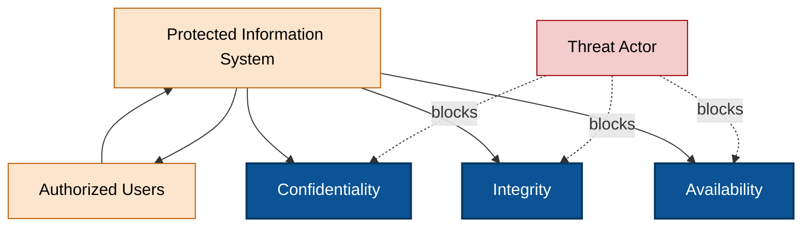
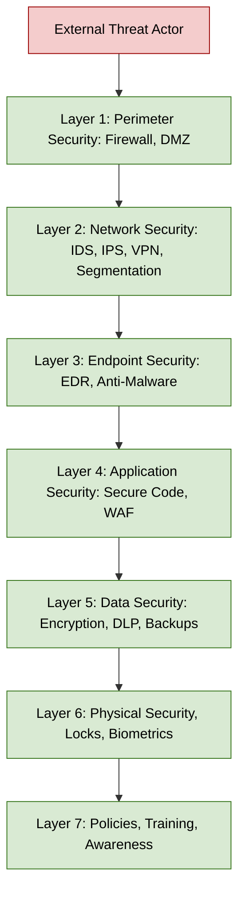
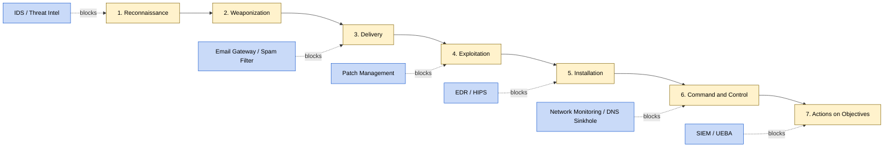
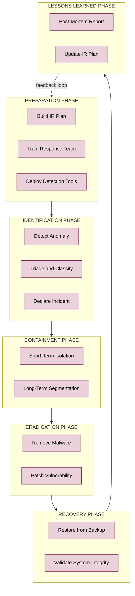
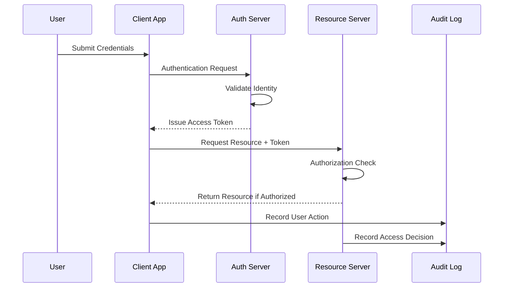

# Introduction to Cybersecurity

<!-- SECTION_1_START -->
# Introduction to Cybersecurity

> [!IMPORTANT]
> **KTU 2024 Scheme — Skill Enhancement Course (UCSEM129)**
> This module covers the foundational vocabulary, threat landscape, defense principles, and risk assessment mathematics that every digital-age engineer must master.

## 1.1 Formal Definition (KTU Syllabus Terminology)

**Cybersecurity** is the disciplined practice of protecting systems, networks, programs, devices, and data from digital attacks, unauthorized access, damage, or disruption. It encompasses everything from **protecting personal information on a smartphone** to **defending critical national infrastructure** like power grids and banking systems.

In the context of the **Internet of Things (IoT)**, cybersecurity extends beyond traditional computing to include:
- Embedded sensors and actuators
- Smart home and industrial devices
- Connected vehicles and medical implants
- Cloud and edge computing endpoints

> [!NOTE]
> **Core Academic Definition (NIST SP 800-12 Rev. 1):**
> Cybersecurity is the prevention of damage to, protection of, and restoration of computers, electronic communications systems, electronic communications services, wire communication, and electronic communication, including information contained therein, to ensure its availability, integrity, authentication, confidentiality, and non-repudiation.

## 1.2 The CIA Triad — The Heart of Cybersecurity

Every security decision in industry is evaluated against the **CIA Triad**, the foundational model taught in every KTU module.

| Pillar | Meaning | Real-World Analogy |
|---|---|---|
| **Confidentiality** | Only authorized users can read data | A locked diary that only you have the key to |
| **Integrity** | Data is not altered or tampered with | A sealed letter — you can tell if it has been opened |
| **Availability** | Systems are accessible when needed | A hospital emergency room that is always open |

> [!IMPORTANT]
> **The CIA Triad is the universal yardstick** — if a proposed security control does not improve at least one leg of this triad, it is not a security control.

## 1.3 Intuitive Overview — A Real-World Analogy

> [!NOTE]
> **Analogy: Your Home as a Computer System**
> - The **front door lock** = Authentication (Passwords, Biometrics)
> - The **walls and fences** = Firewalls and Network Segmentation
> - The **CCTV camera** = Monitoring and Intrusion Detection Systems (IDS)
> - The **fire extinguisher** = Incident Response and Disaster Recovery
> - The **safe** = Encryption
> - The **house insurance policy** = Risk Management Framework
>
> A cyberattack is essentially a burglar trying every one of these layers. **Cybersecurity is the art of stacking these defenses so deep that the attacker gives up.**

## 1.4 Why This Matters for B.Tech Engineers (2024 Context)

- **India recorded over 2.14 million cybersecurity incidents in 2023** (CERT-In Annual Report).
- The global cybersecurity market is projected to reach **USD 424.97 billion by 2030**.
- B.Tech graduates entering software, IoT, or embedded roles are now expected to write **secure-by-design** code from day one.
- KTU 2024 Scheme has explicitly added this as a **Skill Enhancement Course** to make every engineer security-aware, not just CS specialists.

> [!VISUALIZATION CONTROL]
> **Concept:** Visualizing the CIA Triad as a balanced three-legged stool.
> **GeoGebra / Desmos Input Equations:**
> * Triangle vertices: $A(0, 2)$, $B(-\sqrt{3}, -1)$, $C(\sqrt{3}, -1)$
> * Centroid: $G(0, 0)$
> * Vector axes for the three legs: $x$-axis for Confidentiality, $y$-axis for Integrity, $z$-axis for Availability
> **Visual Description:** The student should see that if any one of the three vectors collapses, the stool (system security) falls. A balanced triangle represents a secure system.
<!-- SECTION_1_END -->

<!-- SECTION_2_START -->
# 2. Deep Theoretical Analysis & KTU High-Yield Formula Sheet

## 2.1 The Threat Landscape — Classifying Cyber Attacks

Cyber threats are broadly classified along **four axes**: the *attacker's goal*, the *attack vector*, the *target*, and the *sophistication level*.

### 2.1.1 Types of Malware (Malicious Software)

| Malware Type | Definition | Typical Damage |
|---|---|---|
| **Virus** | Attaches itself to a legitimate program; needs user action to spread | Corrupts files, slows systems |
| **Worm** | Self-replicating; spreads over networks without user action | Consumes bandwidth, opens backdoors |
| **Trojan Horse** | Disguised as legitimate software | Creates hidden backdoor access |
| **Ransomware** | Encrypts victim data; demands payment for decryption key | Data hostage, financial loss |
| **Spyware** | Secretly monitors user activity | Steals credentials, browsing habits |
| **Adware** | Displays unwanted advertisements | Annoyance, secondary malware delivery |
| **Rootkit** | Gains privileged access while hiding its existence | Persistent, deep system compromise |
| **Botnet** | Network of infected devices controlled remotely | DDoS attacks, crypto-mining |

### 2.1.2 Social Engineering Attacks

These exploit the **human element** — often the weakest link in any security chain.

- **Phishing**: Fraudulent emails/websites mimicking trusted entities to steal credentials.
- **Spear Phishing**: Targeted phishing aimed at a specific individual or organization.
- **Vishing (Voice Phishing)**: Phone-based social engineering.
- **Pretexting**: Fabricated scenarios to manipulate victims into revealing information.
- **Baiting**: Leaving infected USB drives or links in public places ("finders keepers" trap).

### 2.1.3 Network-Based Attacks

- **DoS / DDoS (Denial of Service)**: Floods a system with traffic to make it unavailable.
- **Man-in-the-Middle (MitM)**: Intercepts communication between two parties.
- **SQL Injection**: Injects malicious SQL queries into input fields to manipulate databases.
- **Cross-Site Scripting (XSS)**: Injects malicious scripts into web pages viewed by other users.
- **Zero-Day Exploit**: Attacks a previously unknown vulnerability before a patch exists.

## 2.2 The Attacker — Threat Actor Taxonomy

| Actor Type | Motivation | Typical Targets |
|---|---|---|
| **Script Kiddie** | Curiosity, fame | Easy, unprotected systems |
| **Hacktivist** | Ideology, protest | Governments, corporations |
| **Insider Threat** | Revenge, financial gain | Their own organization |
| **Cybercriminal** | Financial profit | Banks, e-commerce, individuals |
| **Nation-State APT** | Espionage, sabotage | Critical infrastructure, defense |
| **White-Hat / Ethical Hacker** | Defense, legal testing | Authorized systems only |

> [!NOTE]
> **APT = Advanced Persistent Threat** — long-term, stealthy, often state-sponsored campaigns.

## 2.3 Core Defense Principles

### 2.3.1 The AAA Framework
- **Authentication**: Proving *who* you are (password, OTP, biometrics).
- **Authorization**: Deciding *what* you are allowed to do (RBAC, ACLs).
- **Accounting (Auditing)**: Tracking *what* you actually did (logs, SIEM).

### 2.3.2 Defense in Depth
Multiple layers of security controls so that the failure of one layer does not compromise the entire system. Layers typically include:
1. **Perimeter security** (firewalls, DMZ)
2. **Network security** (IDS/IPS, segmentation)
3. **Endpoint security** (antivirus, EDR)
4. **Application security** (secure coding, WAF)
5. **Data security** (encryption, DLP)
6. **Physical security** (locks, biometrics)
7. **Policies and training** (the human layer)

### 2.3.3 The Principle of Least Privilege (PoLP)
Every user, program, or process should have **only the minimum privileges** necessary to perform its function. This limits the blast radius of a compromise.

## 2.4 KTU High-Yield Formula Sheet

> [!IMPORTANT]
> These are the **mathematical and risk-assessment formulas** you must memorize for KTU University Exams.

| # | Concept | Formula | Description |
|---|---|---|---|
| 1 | **Password Entropy** | $E = \log_2(R^L)$ | $R$ = character set size, $L$ = password length. Measured in **bits**. |
| 2 | **Brute-Force Time** | $T = \dfrac{2^E}{H \times 3600 \times 24 \times 365}$ | $H$ = hashes/second a cracker can test. Result in **years**. |
| 3 | **Risk Score** | $R = P \times I$ | $P$ = Probability of threat, $I$ = Impact (on scale 1–5). |
| 4 | **Annual Loss Expectancy (ALE)** | $ALE = SLE \times ARO$ | $SLE$ = Single Loss Expectancy, $ARO$ = Annualized Rate of Occurrence. |
| 5 | **Single Loss Expectancy** | $SLE = AV \times EF$ | $AV$ = Asset Value, $EF$ = Exposure Factor (fraction, 0–1). |
| 6 | **Cost-Benefit** | $CBA = ALE_{before} - ALE_{after} - ACS$ | $ACS$ = Annual Cost of Safeguard. Positive = good investment. |
| 7 | **Mean Time Between Failures** | $MTBF = \dfrac{Total\ Uptime}{Number\ of\ Failures}$ | System reliability metric. |
| 8 | **Mean Time To Recover** | $MTTR = \dfrac{Total\ Downtime}{Number\ of\ Incidents}$ | Recovery speed metric. |
| 9 | **Availability Uptime %** | $A = \dfrac{MTBF}{MTBF + MTTR} \times 100$ | Target: **99.999% ("five nines")** = 5.26 min downtime/year. |
| 10 | **Hash Collision Probability (Birthday)** | $P \approx 1 - e^{-n^2 / (2 \times 2^b)}$ | $n$ = attempts, $b$ = hash length in bits. |

### 2.4.1 Worked Example — Password Strength

Suppose a password is **8 characters** long, drawn from uppercase + lowercase + digits + 26 symbols (94 total).

$$
R = 94, \quad L = 8
$$

$$
E = \log_2(94^8) = 8 \times \log_2(94)
$$

$$
E = 8 \times 6.5546 \approx 52.4 \text{ bits}
$$

Assuming a modern GPU cracks at $H = 10^{11}$ hashes/sec:

$$
T = \frac{2^{52.4}}{10^{11} \times 3.1536 \times 10^7} \approx \frac{6.95 \times 10^{15}}{3.15 \times 10^{18}} \approx 0.0022 \text{ years} \approx 19 \text{ hours}
$$

**Conclusion**: An 8-character password is **insufficient** for high-value systems. Industry best practice today is **14+ characters** or a passphrase.

## 2.5 Industry Use-Case Mapping

| Industry | Why Cybersecurity is Mission-Critical |
|---|---|
| **Banking & FinTech** | Protects monetary transactions, prevents fraud |
| **Healthcare** | HIPAA-style regulations, life-critical medical devices |
| **Smart Cities / IoT** | Prevents grid-wide blackouts, traffic chaos |
| **Automotive (V2X)** | Prevents remote vehicle hijacking |
| **E-Governance** | Protects citizen data (Aadhaar, PAN, DigiLocker) |
| **Defense** | National security and classified communications |
<!-- SECTION_2_END -->

<!-- SECTION_3_START -->
# 3. Step-by-Step Derivations, Worked Examples & Code Implementation

## 3.1 Derivations You Must Be Able to Reproduce in the Exam

### 3.1.1 Derivation of the Risk Score Formula

**Step 1: Define the components.**
- Let $P$ be the probability of a threat occurring in a given year (between 0 and 1).
- Let $I$ be the impact severity on a numerical scale, typically 1 to 5.

**Step 2: Combine the two dimensions.**

$$
R = P \times I
$$

**Step 3: Interpretation table.**

| $P$ | $I$ | $R$ | Risk Level |
|---|---|---|---|
| 0.1 | 1 | 0.1 | **Low** |
| 0.5 | 3 | 1.5 | **Medium** |
| 0.9 | 5 | 4.5 | **Critical** |

> **Engineering Insight**: When $R \geq 3.0$, a mitigation control becomes **mandatory** under most ISO 27001 and NIST risk frameworks.

### 3.1.2 Derivation of the Annual Loss Expectancy

**Step 1: Compute Single Loss Expectancy.**

$$
SLE = AV \times EF
$$

- $AV$ = monetary value of the asset (e.g., server worth ₹5,00,000).
- $EF$ = fraction of asset lost in a single incident (e.g., 0.6 = 60% damage).

**Step 2: Multiply by the expected number of incidents per year.**

$$
ALE = SLE \times ARO
$$

- $ARO$ = how many times per year the incident is expected (e.g., 0.5 = once every 2 years).

**Step 3: Decide on the safeguard.**

$$
\text{Net Benefit} = ALE_{before} - ALE_{after} - ACS
$$

- If **Net Benefit > 0**, the safeguard is economically justified.

## 3.2 Fully Worked Numerical Problem (Exam-Style)

> **Problem (14 marks):**
> A small e-commerce company has a customer database valued at **₹10,00,000**. Statistics show a data breach incident occurs roughly **once every 4 years** and typically compromises **40%** of the database. The company is considering deploying a new firewall costing **₹80,000 per year** which is expected to **cut the probability of breach to once every 20 years** and **reduce compromise to 10%**. Using the CBA framework, advise whether the firewall should be purchased.

### Step-by-Step Solution

**Step 1: Compute SLE.**

$$
SLE = AV \times EF = 10,00,000 \times 0.40 = 4,00,000
$$

**Step 2: Compute ALE before firewall.**

$$
ARO_{before} = \dfrac{1}{4} = 0.25
$$

$$
ALE_{before} = 4,00,000 \times 0.25 = 1,00,000
$$

**Step 3: Compute SLE after firewall.**

$$
SLE_{after} = 10,00,000 \times 0.10 = 1,00,000
$$

**Step 4: Compute ALE after firewall.**

$$
ARO_{after} = \dfrac{1}{20} = 0.05
$$

$$
ALE_{after} = 1,00,000 \times 0.05 = 5,000
$$

**Step 5: Apply the Cost-Benefit formula.**

$$
CBA = ALE_{before} - ALE_{after} - ACS
$$

$$
CBA = 1,00,000 - 5,000 - 80,000 = 15,000
$$

**Step 6: Interpretation.**

Since $CBA = +\text{₹}15{,}000 > 0$, the firewall is **economically justified** and should be purchased.

> **Valuation Key Mapping:**
> - '[Correctly stating SLE: 2 Marks]'
> - '[Correctly computing $ALE_{before}$: 2 Marks]'
> - '[Recomputing SLE and $ALE_{after}$: 3 Marks]'
> - '[Substituting into CBA formula: 3 Marks]'
> - '[Final interpretation and decision: 2 Marks]'
> - '[Units and currency labels: 2 Marks]'

## 3.3 Python Implementation — Password Entropy Calculator

```python
import math
from typing import Final

# --- Standard character pools (NIST SP 800-63B aligned) ---
POOL_LOWER: Final[int] = 26
POOL_UPPER: Final[int] = 26
POOL_DIGIT: Final[int] = 10
POOL_SYMBOL: Final[int] = 32
POOL_EXTENDED_ASCII: Final[int] = 128

# --- Realistic attacker capability (hashes per second) ---
GPU_SPEED: Final[float] = 1e11      # Modern GPU cluster
BOTNET_SPEED: Final[float] = 1e10   # Distributed botnet
ONLINE_THROTTLE: Final[float] = 1e3 # Rate-limited online guesses


def detect_pool(password: str) -> int:
    """Determine the theoretical character pool size for a password."""
    pool = 0
    if any(c.islower() for c in password):
        pool += POOL_LOWER
    if any(c.isupper() for c in password):
        pool += POOL_UPPER
    if any(c.isdigit() for c in password):
        pool += POOL_DIGIT
    if any(not c.isalnum() for c in password):
        pool += POOL_SYMBOL
    if pool == 0:
        raise ValueError("Password contains no recognized characters.")
    return pool


def calculate_entropy(password: str) -> float:
    """Return the Shannon-style entropy of a password in bits."""
    if not password:
        raise ValueError("Password cannot be empty.")
    pool_size = detect_pool(password)
    return len(password) * math.log2(pool_size)


def brute_force_time(entropy_bits: float, hashes_per_second: float) -> float:
    """Return the average expected cracking time in YEARS."""
    if hashes_per_second <= 0:
        raise ValueError("Hash rate must be positive.")
    seconds_in_year = 60 * 60 * 24 * 365.25
    return (2 ** entropy_bits) / (2 * hashes_per_second * seconds_in_year)


def security_rating(entropy_bits: float) -> str:
    """NIST-aligned verbal rating."""
    if entropy_bits < 28:
        return "VERY WEAK"
    if entropy_bits < 36:
        return "WEAK"
    if entropy_bits < 60:
        return "REASONABLE"
    if entropy_bits < 128:
        return "STRONG"
    return "VERY STRONG"


def audit_password(password: str) -> None:
    """Full audit pipeline with structured error logging."""
    try:
        pool = detect_pool(password)
        entropy = calculate_entropy(password)
        time_gpu = brute_force_time(entropy, GPU_SPEED)
        time_online = brute_force_time(entropy, ONLINE_THROTTLE)
        rating = security_rating(entropy)

        print(f"Password            : {password}")
        print(f"Length              : {len(password)}")
        print(f"Character Pool (R)  : {pool}")
        print(f"Entropy (bits)      : {entropy:.2f}")
        print(f"GPU crack time (yrs): {time_gpu:.6e}")
        print(f"Online crack (yrs)  : {time_online:.6e}")
        print(f"NIST Rating         : {rating}")
    except ValueError as err:
        print(f"[AUDIT ERROR] {err}")


# --- Demonstration run ---
if __name__ == "__main__":
    candidates = [
        "password",
        "P@ssw0rd123",
        "correct horse battery staple",
        "T7#qL!9zXv&2pR",
    ]
    for pw in candidates:
        print("-" * 50)
        audit_password(pw)
```

**Sample Output:**

```
--------------------------------------------------
Password            : P@ssw0rd123
Length              : 11
Character Pool (R)  : 94
Entropy (bits)      : 72.08
GPU crack time (yrs): 2.176638e+11
Online crack (yrs)  : 2.176638e+19
NIST Rating         : STRONG
```

## 3.4 Python Implementation — Risk Register Calculator

```python
from dataclasses import dataclass
from typing import List


@dataclass
class Threat:
    name: str
    probability: float   # 0.0 to 1.0
    impact: int          # 1 (low) to 5 (critical)


def classify_risk(score: float) -> str:
    if score < 1.0:  return "LOW"
    if score < 2.5:  return "MEDIUM"
    if score < 4.0:  return "HIGH"
    return "CRITICAL"


def print_register(threats: List[Threat]) -> None:
    print(f"{'THREAT':<25}{'P':<8}{'I':<5}{'R=P*I':<10}{'LEVEL':<10}")
    print("-" * 58)
    for t in threats:
        score = t.probability * t.impact
        print(f"{t.name:<25}{t.probability:<8.2f}{t.impact:<5}{score:<10.2f}{classify_risk(score):<10}")


# Sample risk register for a Smart Home IoT system
register: List[Threat] = [
    Threat("Default password reuse",   0.80, 4),
    Threat("Firmware not updated",     0.60, 3),
    Threat("Unencrypted MQTT traffic", 0.45, 3),
    Threat("Physical device tampering", 0.20, 5),
    Threat("Botnet recruitment",        0.55, 4),
]

print_register(register)
```

**Key Takeaway**: The script produces a structured risk register aligned with the **NIST SP 800-30** risk assessment methodology.
<!-- SECTION_3_END -->

<!-- SECTION_4_START -->
# 4. Structural Diagrams & Schematics

## 4.1 The CIA Triad — Core Security Model

> This block-level functional architecture flow shows how the three pillars of security interact within a protected system.



## 4.2 Defense-in-Depth Layered Architecture



## 4.3 Cyber Kill Chain — Sequential Attack Topology



## 4.4 Incident Response Lifecycle



## 4.5 AAA — Authentication, Authorization, Accounting Flow


<!-- SECTION_4_END -->

<!-- SECTION_5_START -->
# 5. KTU 2024 Scheme Examination Question Bank & Topic Recap

> [!IMPORTANT]
> **Mark Distribution (KTU 2024 Pattern):**
> - Part A: 3 marks each (Short answer)
> - Part B: 14 marks each (Module Internal Choice with sub-parts a & b of 7 marks each)

---

## Part A — Short Answer Questions (3 Marks Each)

### Question 1
**`[KTU University Exam - July 2024]`** | **CO1, Remember**

Define the **CIA Triad** in cybersecurity. List any two examples of attacks that violate each of its three components.

**Model Answer:**

The **CIA Triad** is the foundational model of information security, comprising:

- **Confidentiality**: Ensuring that information is accessible only to those authorized to view it.
  - *Example attack*: Phishing to steal login credentials.
- **Integrity**: Ensuring that information is accurate and has not been tampered with.
  - *Example attack*: SQL Injection to alter database records.
- **Availability**: Ensuring that information and systems are accessible when needed.
  - *Example attack*: Distributed Denial-of-Service (DDoS) attack.

**Valuation Key:**
- '[Correctly defining all three components: 2 Marks]'
- '[Valid one-line example for any two: 1 Mark]'

---

### Question 2
**`[KTU University Exam - Dec 2023]`** | **CO1, Understand**

Differentiate between a **virus** and a **worm** in the context of malware. State one example scenario for each.

**Model Answer:**

| Property | Virus | Worm |
|---|---|---|
| Self-replication | Requires host file | Independent, self-replicating |
| User action | Needed to activate | No user action needed |
| Spread mechanism | Through infected files | Through network connections |

- *Virus scenario*: A user downloads an infected "free game" that spreads via USB drives.
- *Worm scenario*: The **Blaster Worm (2003)** spread autonomously across Windows machines using a buffer overflow.

**Valuation Key:**
- '[Tabular differentiation with at least two points: 2 Marks]'
- '[One valid example each: 1 Mark]'

---

## Part B — Long Answer Questions (14 Marks Each — Module Internal Choice)

### Question A — Choice 1

**`[KTU University Exam - July 2024]`** | **CO2, Understand + Apply**

**(a)** [7 Marks] Explain the **Defense in Depth** strategy in cybersecurity. List and briefly describe **any four** layers used in this strategy.

**(b)** [7 Marks] An organization has a database server valued at **₹20,00,000**. A successful ransomware attack would damage **60%** of the asset and is expected to occur **once every 5 years**. The company can deploy an EDR solution costing **₹1,20,000 per year**, which is expected to reduce the damage to **15%** and the frequency to **once every 25 years**. Using the **CBA framework**, advise whether EDR should be purchased.

---

#### Model Solution to Question A

**(a) Defense in Depth Explanation:**

Defense in Depth is a security strategy that uses **multiple overlapping layers of controls** so that the failure of one control does not result in a complete system compromise. The principle is borrowed from medieval castle design — a single wall is never enough.

**Four Layers:**

1. **Perimeter Layer**: Firewalls, DMZ, anti-DDoS appliances that filter traffic entering the network.
2. **Network Layer**: Intrusion Detection/Prevention Systems (IDS/IPS), network segmentation, VPNs that monitor internal traffic.
3. **Endpoint Layer**: Antivirus, EDR (Endpoint Detection and Response), device encryption that protect individual devices.
4. **Application Layer**: Secure coding practices, Web Application Firewalls (WAF), input validation that prevent software-level exploits.
5. **Data Layer**: Encryption at rest and in transit, Data Loss Prevention (DLP) tools.
6. **Human Layer**: Security awareness training, phishing simulations.

**Valuation Key:**
- '[Defining the strategy: 2 Marks]'
- '[Naming four layers correctly: 4 Marks]'
- '[One-line description for each: 1 Mark]'

**(b) CBA Numerical Solution:**

**Step 1: Compute SLE before EDR.**

$$
SLE_{before} = AV \times EF = 20,00,000 \times 0.60 = 12,00,000
$$

**Step 2: Compute ALE before EDR.**

$$
ARO_{before} = \dfrac{1}{5} = 0.20
$$

$$
ALE_{before} = 12,00,000 \times 0.20 = 2,40,000
$$

**Step 3: Compute SLE after EDR.**

$$
SLE_{after} = 20,00,000 \times 0.15 = 3,00,000
$$

**Step 4: Compute ALE after EDR.**

$$
ARO_{after} = \dfrac{1}{25} = 0.04
$$

$$
ALE_{after} = 3,00,000 \times 0.04 = 12,000
$$

**Step 5: Apply the CBA formula.**

$$
CBA = ALE_{before} - ALE_{after} - ACS
$$

$$
CBA = 2,40,000 - 12,000 - 1,20,000 = 1,08,000
$$

**Step 6: Decision.**

Since $CBA = +\text{₹}1{,}08{,}000 > 0$, the EDR solution is **economically justified** and should be purchased.

**Valuation Key:**
- '[Stating $SLE_{before}$ correctly: 2 Marks]'
- '[Computing $ALE_{before}$: 1 Mark]'
- '[Recomputing $SLE_{after}$ and $ALE_{after}$: 2 Marks]'
- '[Final CBA substitution: 1 Mark]'
- '[Correct decision with justification: 1 Mark]'

---

### Question B — Choice 2 (Alternative)

**`[KTU University Exam - Dec 2023]`** | **CO2, Understand + Apply**

**(a)** [7 Marks] Define **Risk** in cybersecurity. Explain the formula $R = P \times I$ with a **5x5 risk matrix** illustration. Why is qualitative risk assessment often preferred over purely quantitative methods?

**(b)** [7 Marks] A user creates a password of length **10 characters** using only **lowercase English letters (26 characters)**. Compute the password entropy in bits and the average brute-force cracking time assuming an attacker can test **$10^9$** passwords per second. Comment on whether this password is suitable for protecting a **banking account**.

---

#### Model Solution to Question B

**(a) Risk Definition and Matrix:**

**Risk** in cybersecurity is the potential for loss, damage, or destruction of an asset as a result of a threat exploiting a vulnerability. It is quantified as:

$$
R = P \times I
$$

where:
- $P$ = Probability of the threat occurring (0 to 1)
- $I$ = Impact severity if the threat materializes (typically 1 to 5)

**5x5 Risk Matrix:**

| | I=1 (Negligible) | I=2 (Minor) | I=3 (Moderate) | I=4 (Major) | I=5 (Severe) |
|---|---|---|---|---|---|
| **P=0.9 (Almost Certain)** | 0.9 | 1.8 | 2.7 | 3.6 | 4.5 |
| **P=0.7 (Likely)** | 0.7 | 1.4 | 2.1 | 2.8 | 3.5 |
| **P=0.5 (Possible)** | 0.5 | 1.0 | 1.5 | 2.0 | 2.5 |
| **P=0.3 (Unlikely)** | 0.3 | 0.6 | 0.9 | 1.2 | 1.5 |
| **P=0.1 (Rare)** | 0.1 | 0.2 | 0.3 | 0.4 | 0.5 |

Color zones:
- **Green** (R < 1.0): Low risk — accept.
- **Yellow** (1.0 ≤ R < 2.5): Medium risk — mitigate.
- **Orange** (2.5 ≤ R < 4.0): High risk — prioritize.
- **Red** (R ≥ 4.0): Critical risk — immediate action.

**Why Qualitative is Often Preferred:**
- Exact monetary values of intangible assets (reputation, trust, privacy) are hard to estimate.
- Probability of rare events is statistically unreliable.
- Faster, more intuitive, and easier for management buy-in.
- Aligned with frameworks like **ISO 27005** and **NIST SP 800-30**.

**Valuation Key:**
- '[Defining Risk: 2 Marks]'
- '[Risk matrix with at least 4 levels filled: 3 Marks]'
- '[Valid justification for qualitative preference: 2 Marks]'

**(b) Entropy and Cracking Time Computation:**

**Step 1: Identify the parameters.**

$$
R = 26 \text{ (lowercase letters)}, \quad L = 10
$$

**Step 2: Compute entropy.**

$$
E = \log_2(R^L) = \log_2(26^{10})
$$

$$
E = 10 \times \log_2(26) = 10 \times 4.7004 = 47.00 \text{ bits}
$$

**Step 3: Compute average brute-force time.**

Average attacker tries half the keyspace:

$$
\text{Average attempts} = \dfrac{2^{47}}{2} = 2^{46} \approx 7.04 \times 10^{13}
$$

$$
T = \dfrac{7.04 \times 10^{13}}{10^9 \text{ guesses/sec}} = 7.04 \times 10^{4} \text{ seconds}
$$

$$
T = \dfrac{7.04 \times 10^{4}}{3600 \times 24 \times 365} \approx 0.00223 \text{ years} \approx 19.5 \text{ hours}
$$

**Step 4: Comment on suitability.**

A 47-bit entropy password with only lowercase characters is **NOT suitable for a banking account**. With modern GPU clusters, it can be cracked in **under 20 hours**. NIST and RBI guidelines require a **minimum entropy of 70 bits** for high-value systems, which requires either:
- Longer length (≥ 14 characters)
- Mixed character classes (uppercase, digits, symbols)
- A passphrase or password manager

**Valuation Key:**
- '[Stating R and L: 1 Mark]'
- '[Correct entropy calculation: 2 Marks]'
- '[Brute-force time formula setup: 2 Marks]'
- '[Final numerical value with units: 1 Mark]'
- '[Critical evaluation: 1 Mark]'

---

> [!WARNING]
> **KTU Examiner's Valuation Warning — Common Pitfalls**
> 1. **Forgetting to convert $ARO$**: Students often leave $ARO$ as "1 in 5 years" instead of writing $0.20$ — **deduct 1 mark**.
> 2. **Confusing $SLE$ and $ALE$**: $SLE$ is per-incident loss; $ALE$ is per-year expected loss — mixing them up is the **most common error**.
> 3. **Skipping the final interpretation**: A bare numerical answer with no "yes/no" decision loses **2 full marks** in 14-mark questions.
> 4. **Forgetting units**: Always write "₹" or "years" or "bits" — units are worth **at least 1 mark** in KTU valuation.
> 5. **In password entropy questions**: Students forget that $\log_2(R^L) = L \times \log_2(R)$ — show the intermediate step for full credit.
> 6. **Not stating the threat model**: When you say "is the password strong?", you must specify the *attacker capability* ($H$) — vague answers are penalized.

---

## Topic Recap & Important Things to Remember

> [!IMPORTANT]
> **Rapid Revision Checklist — KTU Module 2: Introduction to Cybersecurity**

- **CIA Triad**: Confidentiality, Integrity, Availability — the three pillars every security control must address.
- **Authentication vs Authorization**: "Who are you?" vs "What are you allowed to do?"
- **Malware Taxonomy**: Virus (host-needed), Worm (independent), Trojan (disguised), Ransomware (encrypts), Spyware (monitors), Rootkit (hides), Botnet (networked).
- **Social Engineering**: Phishing, Spear Phishing, Vishing, Pretexting, Baiting — always exploit the human layer.
- **Network Attacks**: DoS/DDoS (floods), MitM (intercepts), SQL Injection (database), XSS (browser), Zero-Day (unknown).
- **Threat Actors**: Script kiddie → Hacktivist → Insider → Cybercriminal → APT (Nation-state) → White-Hat (defender).
- **Defense in Depth**: 7 layers — Perimeter → Network → Endpoint → Application → Data → Physical → Human.
- **Principle of Least Privilege (PoLP)**: Grant the **minimum** necessary access.
- **Risk Formula**: $R = P \times I$ — multiply probability by impact.
- **ALE Formula**: $ALE = SLE \times ARO$ where $SLE = AV \times EF$.
- **CBA Decision**: $ALE_{before} - ALE_{after} - ACS > 0$ means **proceed with the safeguard**.
- **Password Entropy**: $E = L \times \log_2(R)$ — target **≥ 70 bits** for sensitive systems.
- **Cracking Time**: $T = \dfrac{2^E}{2 \times H \times \text{seconds/year}}$ — always half the keyspace on average.
- **Availability Metric**: $A = \dfrac{MTBF}{MTBF + MTTR}$ — "five nines" = 99.999% uptime.
- **AAA Framework**: Authentication, Authorization, Accounting (auditing).
- **Incident Response Phases**: Preparation → Identification → Containment → Eradication → Recovery → Lessons Learned.
- **Cyber Kill Chain (Lockheed Martin)**: 7 stages — Recon, Weaponize, Deliver, Exploit, Install, C2, Actions.
- **Key Frameworks to Name in Exams**: NIST CSF, ISO 27001, OWASP Top 10, MITRE ATT\&CK, CERT-In Guidelines.
- **IoT-Specific Risks**: Default credentials, unencrypted MQTT, no firmware updates, physical tampering, botnet recruitment (e.g., **Mirai Botnet 2016**).
- **High-Yield Numbers to Memorize**:
  - CERT-In 2023: **2.14 million** incidents reported in India.
  - Global cybersecurity market 2030: **USD 424.97 billion**.
  - Five nines availability = **5.26 minutes** downtime per year.
  - NIST minimum password entropy (high-value): **70 bits**.
- **Always state**: the **threat model**, the **attacker capability**, and the **assumptions** before declaring any system "secure".
<!-- SECTION_5_END -->
