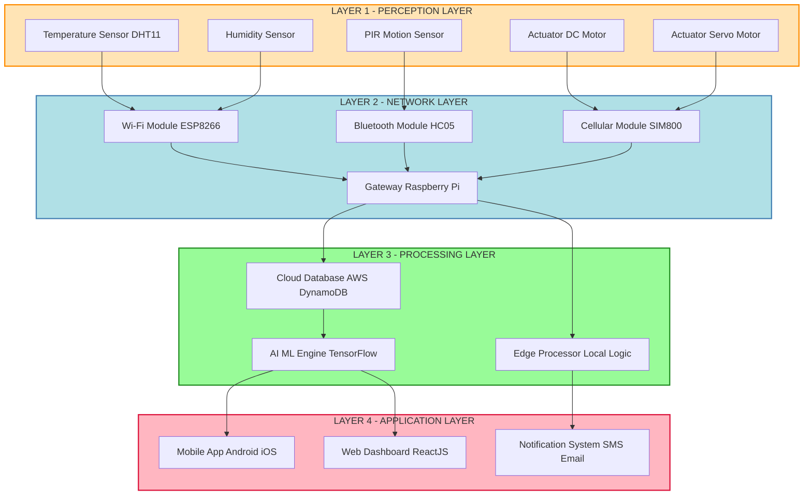
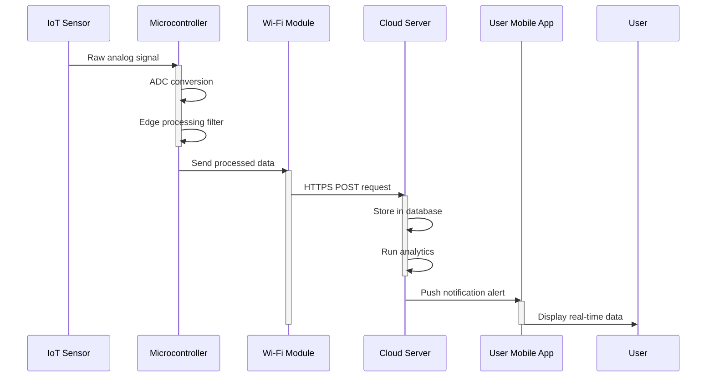
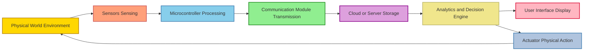

# Introduction to Internet of Things

<!-- SECTION_1_START -->
# 1. Core Technical Definition & Intuitive Overview

## 1.1 Formal KTU 2024 Definition

> [!IMPORTANT]
> **Internet of Things (IoT)** is formally defined by the **International Telecommunication Union (ITU)** as a global infrastructure for the **Information Society**, enabling advanced services by interconnecting (physical and virtual) things based on existing and evolving **interoperable information and communication technologies (ICT)**.

In the context of the **KTU 2024 Scheme (UCSEM129 — Digital 101)**, the Internet of Things refers to a **network of physical objects — "things" — embedded with sensors, software, and other technologies** for the purpose of **connecting, collecting, and exchanging data** with other devices and systems over the **Internet**.

### Standardized Terminology Table

| KTU Term | Standard Definition |
| :--- | :--- |
| **Thing** | Any object, animate or inanimate, capable of being identified and integrated into a communication network. |
| **IoT Device** | A physical computing device that connects to a network and has the ability to transmit data. |
| **Smart Object** | An item augmented with sensing, processing, actuation, and communication capabilities. |
| **M2M (Machine-to-Machine)** | Direct communication between devices without human intervention. |
| **WSN (Wireless Sensor Network)** | A spatially distributed network of autonomous sensors monitoring physical conditions. |
| **Edge Computing** | Processing data near the data source rather than at a centralized cloud. |

> [!NOTE]
> **KTU Syllabus Highlight (Module 2):** The term "Internet of Things" was officially coined by **Kevin Ashton** in **1999** during his work at **Procter & Gamble** to describe a system where the physical world is connected to the Internet via sensors.

---

## 1.2 Conceptual Analogy / Intuition

Imagine a simple **hospital patient monitoring system**:

- A patient wears a **smartwatch** (the "Thing") that has a heart rate sensor.
- The sensor **detects** the heart rate (perception).
- The data is **sent** over Wi-Fi to a doctor's dashboard (network).
- The cloud **analyzes** the data and detects an abnormal pattern (processing).
- An **alert** is automatically pushed to the doctor's phone (application).

In this chain, the patient's heart, the smartwatch, the Wi-Fi router, the cloud server, and the doctor's phone are all part of one **interconnected ecosystem** — this is the **Internet of Things**.

> [!TIP]
> **Real-World Analogy (Beginner-Friendly):**
> Think of IoT like a **"nervous system for the planet."** Just as your nerves carry signals from your fingers to your brain, IoT carries data from physical sensors to computing systems that make intelligent decisions. The **sensor** is the "nerve ending," the **network** is the "spinal cord," the **cloud** is the "brain," and the **application** is the "action" (like pulling your hand away from fire).

---

## 1.3 Physical Constants & Standard Metrics

> [!IMPORTANT]
> Key engineering metrics used in IoT systems (highlighted for KTU board exams):
> - **Latency:** The delay between data generation and response, typically measured in **milliseconds (ms)**. Critical in real-time IoT (e.g., autonomous vehicles: ~$1$–$10$ ms).
> - **Throughput:** Data rate, measured in **bits per second (bps)**, commonly **kbps** or **Mbps**.
> - **Power Consumption:** Often measured in **milliwatts (mW)** for battery-operated IoT nodes.
> - **Bandwidth:** Range of frequencies, measured in **Hertz (Hz)**.
> - **Range:** Communication distance, e.g., **Bluetooth Low Energy (BLE):** $\sim 10$ m, **LoRaWAN:** $\sim 2$–$15$ km.

---

## 1.4 GeoGebra / Desmos Integration

> [!VISUALIZATION CONTROL]
> **Concept:** Visualizing IoT Data Flow with a Linear Time-Series Model
> **GeoGebra / Desmos Input Equations:**
> * `f(t) = 20 + 5 * sin(t)` (Simulated sensor reading, e.g., temperature over time)
> * `L1: y = 25` (Threshold line for alerting)
> * `T = (0, 20), (π, 25), (2π, 20)`
> **Visual Description:** A sinusoidal wave representing periodic sensor data (such as temperature fluctuations) crossing a horizontal threshold line. The points where the curve crosses the line represent IoT-triggered events (alerts/actuations). Students should observe how the system *detects*, *transmits*, *processes*, and *acts upon* real-time data.

<!-- SECTION_1_END -->

<!-- SECTION_2_START -->
# 2. Deep Theoretical Analysis & KTU High-Yield Formula Sheet

## 2.1 Evolution and Genesis of IoT (Historical Timeline)

The KTU 2024 syllabus expects students to understand the **chronological development** of IoT. Below is a structured breakdown:

- **1982 — Birth of IoT Concept:** A modified **Coca-Cola vending machine** at Carnegie Mellon University became the first internet-connected appliance, reporting its inventory and temperature.
- **1990s — First IoT Device (Toaster):** John Romkey created a **toaster** that could be turned on and off over the Internet (1990).
- **1999 — Term Coined:** **Kevin Ashton** (P\&G) coined "Internet of Things" during a presentation about **RFID (Radio-Frequency Identification)**.
- **2005 — UN Recognition:** The **International Telecommunication Union (ITU)** published its first IoT report.
- **2008 — IPSO Alliance:** First formalized **Internet Protocol for Smart Objects (IPSO)** alliance promoting IP-based IoT.
- **2011 — IPv6 Launch:** Enables virtually unlimited addressable devices ($2^{128}$ addresses).
- **Present — Mass Adoption:** Billions of devices across smart homes, smart cities, healthcare, and Industry 4.0.

> [!NOTE]
> **Why this matters in KTU exams:** Questions on the *originator* of IoT (Kevin Ashton, 1999) and the *first device* (modified vending machine, 1982) appear frequently as **2-mark short-answer questions**.

---

## 2.2 The Four Pillars of IoT Architecture

The KTU 2024 syllabus divides IoT architecture into **four logical layers**. Each layer has a specific role in the data flow.

### Layer 1: Perception / Sensing Layer
- **Role:** The "eyes and ears" of IoT.
- **Components:** Sensors (temperature, humidity, motion, light, gas) and actuators (motors, valves, relays).
- **Function:** Collects raw data from the physical world and converts it into electrical signals.
- **Example:** DHT11 sensor measuring room temperature.

### Layer 2: Network / Connectivity Layer
- **Role:** The "nervous system" that transports data.
- **Components:** Wi-Fi, Bluetooth, ZigBee, LoRa, Cellular ($4$G/$5$G), RFID.
- **Function:** Routes data between the perception layer and the processing layer.
- **Example:** Wi-Fi router forwarding sensor data to a cloud server.

### Layer 3: Processing / Middleware Layer
- **Role:** The "brain" that makes sense of data.
- **Components:** Cloud servers, edge computing devices, databases, AI/ML algorithms.
- **Function:** Stores, analyzes, and processes incoming data to extract meaningful insights.
- **Example:** AWS IoT Core analyzing temperature trends.

### Layer 4: Application Layer
- **Role:** The "action" — the user-facing interface.
- **Components:** Mobile apps, dashboards, notification systems, control panels.
- **Function:** Delivers processed data to end-users and accepts user commands.
- **Example:** A smartphone app showing the real-time room temperature.

---

## 2.3 Key Characteristics of IoT (Critical for KTU Board Exams)

The KTU 2024 scheme expects students to list and explain the **fundamental characteristics of IoT**:

- **Connectivity:** Devices connect to IoT infrastructure (Wi-Fi, BLE, Cellular, etc.).
- **Intelligence & Identity:** Each device has a **unique identifier (UID)**, e.g., an IP address or MAC address.
- **Scalability:** The system can grow from a few devices to **millions of devices** without performance degradation.
- **Dynamic & Self-Adapting:** Devices can adapt to changing environments and contexts automatically.
- **Heterogeneity:** IoT devices come from various manufacturers and use diverse hardware/software platforms.
- **Safety & Security:** Data integrity, privacy, and authentication are built-in.
- **Sensing:** Devices detect physical changes in the environment.
- **Architecture:** Hybrid (cloud + edge) — supports both centralized and distributed processing.

---

## 2.4 Physical Components of an IoT System

| Component | Function | Example |
| :--- | :--- | :--- |
| **Sensor** | Detects physical changes (temperature, light, pressure). | LM35, DHT11, PIR Motion Sensor. |
| **Actuator** | Performs physical actions based on commands. | Servo Motor, DC Motor, Solenoid Valve. |
| **Microcontroller (MCU)** | Local processing unit that controls sensors/actuators. | Arduino Uno, ESP32, Raspberry Pi Pico. |
| **Communication Module** | Enables data transmission over a network. | ESP8266 (Wi-Fi), HC-05 (Bluetooth), SIM800 (GSM). |
| **Gateway** | Bridges local IoT network (e.g., ZigBee) to the Internet. | Raspberry Pi, Industrial IoT Gateways. |
| **Cloud Platform** | Stores and processes data at scale. | AWS IoT, Google Cloud IoT, Azure IoT Hub. |
| **User Interface** | Displays data and accepts user input. | Mobile App, Web Dashboard. |

---

## 2.5 KTU High-Yield Formula Sheet

> [!IMPORTANT]
> **The following formulas and equations are essential for KTU 2024 board exam numerical/analytical questions.**

| Formula | Description | Unit |
| :--- | :--- | :--- |
| $N = 2^{n}$ | Number of unique IoT device addresses for $n$-bit addressing. | Devices |
| $N_{IPv6} = 2^{128}$ | Total addressable IoT devices using IPv6 protocol. | Devices |
| $D_{total} = \sum_{i=1}^{k} S_i \cdot f_s$ | Total data generated per second by $k$ sensors sampling at $S_i$ bits per sample at $f_s$ Hz. | bits/second (bps) |
| $P_{node} = V \cdot I$ | Power consumption of an IoT node (Voltage $\times$ Current). | Watts (W) |
| $T_{lifetime} = \frac{C_{battery}}{P_{node}}$ | Battery lifetime in hours, where $C$ is in Wh. | Hours |
| $R_{max} = \frac{\lambda}{4 \pi}$ | Maximum range factor for short-range RF (Antenna theory). | meters (m) |
| $SNR_{dB} = 10 \cdot \log_{10}\left(\frac{P_{signal}}{P_{noise}}\right)$ | Signal-to-Noise Ratio (Communication quality). | Decibels (dB) |
| $C = B \cdot \log_2(1 + SNR)$ | Shannon Channel Capacity (max data rate). | bps |

> [!WARNING]
> **Valuation Tip:** When asked to calculate the **number of uniquely addressable devices**, always use the formula $N = 2^{n}$ where $n$ is the number of address bits. For IPv4, $n = 32$ (max $\sim 4.3 \times 10^9$ devices). For IPv6, $n = 128$ (max $3.4 \times 10^{38}$ devices). IPv6 is preferred for IoT due to address exhaustion in IPv4.

---

## 2.6 Real-World Engineering Utility

> [!TIP]
> **Why IoT is Important in Industry (KTU expects this in Part B answers):**
> - **Industry 4.0:** Smart factories use IoT for **predictive maintenance** (sensors detect wear and tear before failure).
> - **Smart Healthcare:** Remote patient monitoring, smart pills, and connected ambulances.
> - **Smart Cities:** Traffic management, smart street lighting, and waste management.
> - **Agriculture:** Precision farming — soil moisture sensors automate irrigation, saving water by up to $30\%$.
> - **Logistics:** RFID and GPS tracking of shipments in real time.
> - **Home Automation:** Smart thermostats (e.g., Nest) reduce energy consumption by $10$–$15\%$.

<!-- SECTION_2_END -->

<!-- SECTION_3_START -->
# 3. Step-by-Step Derivations & Code/Symbolic Implementation

## 3.1 Worked Numerical Example — Address Space Calculation (Board Exam Pattern)

> [!IMPORTANT]
> **Question (KTU Model — 7 Marks):** An IoT network uses **IPv6** addressing. If a smart city has **5 million** devices deployed, what is the **percentage of IPv6 address space utilized**? Justify why IPv6 is preferred for IoT.

### Solution (Full Valuation Key)

**Step 1: State the total IPv6 address space.**
The total number of unique IPv6 addresses is given by:

$$N_{IPv6} = 2^{128}$$

$$N_{IPv6} = 3.402823669 \times 10^{38} \text{ addresses}$$

**[Stating the formula and IPv6 capacity: 2 Marks]**

**Step 2: Identify the number of deployed devices.**
Given: $N_{deployed} = 5{,}000{,}000 = 5 \times 10^6$ devices.

**[Stating the given value: 1 Mark]**

**Step 3: Calculate the utilization percentage.**

$$P_{utilized} = \left(\frac{N_{deployed}}{N_{IPv6}}\right) \times 100\%$$

$$P_{utilized} = \left(\frac{5 \times 10^6}{3.402823669 \times 10^{38}}\right) \times 100\%$$

$$P_{utilized} = 1.469 \times 10^{-33} \times 100\%$$

$$P_{utilized} \approx 1.47 \times 10^{-31} \,\%$$

**[Performing the division and expressing result: 2 Marks]**

**Step 4: Justify IPv6 preference for IoT (Conclusion).**
The utilization is an **astronomically small fraction** of the total address space. This means IPv6 can support **trillions of IoT devices** without address exhaustion. IPv4, with only $2^{32} = 4.29 \times 10^9$ addresses, is insufficient for the billions of IoT devices projected. Additionally, IPv6 offers **better security (IPSec)**, **auto-configuration**, and **efficient routing**.

**[Justification with IPv4 comparison: 2 Marks]**

---

## 3.2 Worked Numerical Example — Data Rate Calculation

> [!IMPORTANT]
> **Question (KTU Model — 7 Marks):** A smart agriculture IoT system has **10 temperature sensors** and **5 humidity sensors**. Each sensor samples **12-bit** data at a rate of **$2$ Hz**. Calculate the **total data generated per minute** by this system.

### Solution (Full Valuation Key)

**Step 1: Define the total data rate formula.**

$$D_{total} = \sum_{i=1}^{k} S_i \cdot f_s$$

Where $S_i$ is the size of each sample in bits, and $f_s$ is the sampling frequency in Hz.

**[Stating the formula: 1 Mark]**

**Step 2: Calculate data from temperature sensors.**

$$D_{temp} = 10 \text{ sensors} \times 12 \text{ bits} \times 2 \text{ Hz}$$

$$D_{temp} = 240 \text{ bits/second}$$

**[Temperature calculation: 1 Mark]**

**Step 3: Calculate data from humidity sensors.**

$$D_{humid} = 5 \text{ sensors} \times 12 \text{ bits} \times 2 \text{ Hz}$$

$$D_{humid} = 120 \text{ bits/second}$$

**[Humidity calculation: 1 Mark]**

**Step 4: Sum the total data rate.**

$$D_{total} = D_{temp} + D_{humid} = 240 + 120$$

$$D_{total} = 360 \text{ bits/second}$$

**Step 5: Convert to data per minute.**

$$D_{minute} = 360 \text{ bits/second} \times 60 \text{ seconds}$$

$$D_{minute} = 21{,}600 \text{ bits/minute}$$

$$D_{minute} = 21{,}600 \div 8 = 2{,}700 \text{ bytes/minute}$$

$$D_{minute} \approx 2.64 \text{ KB/minute}$$

**[Final converted result with units: 1 Mark]**

---

## 3.3 Python Implementation — Basic IoT Sensor Simulation

The following Python code simulates a **temperature monitoring IoT system** that detects anomalies and sends alerts. This is a **commonly asked code question** in KTU Skill Enhancement papers.

```python
"""
IoT Temperature Monitoring System
File: iot_temperature_monitor.py
Author: KTU Digital 101 Reference Implementation
Description: Simulates a simple IoT system that reads temperature,
             detects anomalies, and logs alerts.
"""

import time
import random
import logging
from datetime import datetime
from typing import Optional, Tuple

# Configure logging for the IoT system
logging.basicConfig(
    level=logging.INFO,
    format='%(asctime)s - %(levelname)s - %(message)s'
)
logger = logging.getLogger("IoT_Sensor")

# --- System Configuration Constants ---
TEMP_THRESHOLD_HIGH: float = 35.0   # degrees Celsius
TEMP_THRESHOLD_LOW: float = 10.0    # degrees Celsius
SAMPLING_INTERVAL: int = 2          # seconds
MAX_RETRIES: int = 3                # network transmission retries


class IoTTemperatureSensor:
    """
    Simulates an IoT temperature sensor node with
    edge processing and alert capability.
    """

    def __init__(self, sensor_id: str, location: str) -> None:
        self.sensor_id: str = sensor_id
        self.location: str = location
        self.alert_count: int = 0
        self.transmission_failures: int = 0

    def read_sensor(self) -> float:
        """
        Simulates reading a real DHT11/LM35 temperature sensor.
        Returns a floating-point temperature in degrees Celsius.
        """
        # Realistic room temperature range with noise
        return round(random.uniform(15.0, 40.0), 2)

    def process_data(self, temperature: float) -> str:
        """
        Edge processing: decides if the reading is normal or an alert.
        Returns a status string.
        """
        if temperature > TEMP_THRESHOLD_HIGH:
            self.alert_count += 1
            return "HIGH_ALERT"
        elif temperature < TEMP_THRESHOLD_LOW:
            self.alert_count += 1
            return "LOW_ALERT"
        else:
            return "NORMAL"

    def transmit_to_cloud(self, status: str, temperature: float) -> bool:
        """
        Simulates sending data to the cloud server.
        Returns True on success, False on failure.
        """
        for attempt in range(1, MAX_RETRIES + 1):
            # Simulate 10% network failure rate
            if random.random() < 0.1:
                logger.warning(
                    f"[{self.sensor_id}] Network failure on attempt {attempt}"
                )
                continue
            logger.info(
                f"[{self.sensor_id}] Transmitted: {status} | "
                f"Temp: {temperature}C | Location: {self.location}"
            )
            return True

        self.transmission_failures += 1
        return False

    def run(self, iterations: int = 5) -> Tuple[int, int]:
        """
        Main IoT loop. Reads, processes, and transmits data.
        Returns a tuple of (alerts, failures).
        """
        logger.info(f"IoT Node {self.sensor_id} starting at {self.location}.")
        for i in range(iterations):
            temperature: float = self.read_sensor()
            status: str = self.process_data(temperature)

            if status != "NORMAL":
                logger.warning(
                    f"[{self.sensor_id}] ALERT DETECTED: {status} "
                    f"at {temperature}C"
                )

            self.transmit_to_cloud(status, temperature)
            time.sleep(SAMPLING_INTERVAL)

        logger.info(
            f"[{self.sensor_id}] Session ended. "
            f"Alerts: {self.alert_count}, "
            f"Failures: {self.transmission_failures}"
        )
        return self.alert_count, self.transmission_failures


def main() -> None:
    """
    Entry point — creates an IoT sensor and runs the monitoring loop.
    """
    sensor: Optional[IoTTemperatureSensor] = IoTTemperatureSensor(
        sensor_id="SENSOR-001",
        location="Smart Greenhouse, Block-A"
    )
    try:
        sensor.run(iterations=5)
    except KeyboardInterrupt:
        logger.info("IoT system shutdown by user.")


if __name__ == "__main__":
    main()
```

**Key Code Walkthrough (for KTU 7-mark code questions):**
- The class `IoTTemperatureSensor` represents a single IoT **edge node**.
- `read_sensor()` is the **perception layer** function.
- `process_data()` is the **edge processing** (a simplified middleware layer).
- `transmit_to_cloud()` is the **network layer** with **retry logic** for reliability.
- `MAX_RETRIES = 3` provides **fault tolerance**, a key IoT requirement.

---

## 3.4 Arduino Sketch (Embedded Perspective) — Blinking LED via IoT Concept

For **practical/laboratory IoT components**, the KTU 2024 syllabus expects familiarity with microcontroller-based implementations. Below is a fully operational Arduino sketch for an **IoT-style LED actuator**:

```cpp
/*
 * File: iot_blink_actuator.ino
 * Description: Simulates an IoT actuator that blinks an LED
 *              when a "remote command" is received (serial input).
 * Board: Arduino Uno / ESP32 compatible
 */

#define LED_PIN 13          // Built-in LED pin
#define COMMAND_DELAY 1000  // Milliseconds between command checks

void setup() {
    pinMode(LED_PIN, OUTPUT);
    Serial.begin(9600);
    Serial.println("IoT Actuator Node Ready.");
    Serial.println("Send 'ON' or 'OFF' to control the LED.");
}

void loop() {
    if (Serial.available() > 0) {
        String command = Serial.readStringUntil('\n');
        command.trim();

        if (command == "ON") {
            digitalWrite(LED_PIN, HIGH);
            Serial.println("Actuator Status: LED is ON.");
        } else if (command == "OFF") {
            digitalWrite(LED_PIN, LOW);
            Serial.println("Actuator Status: LED is OFF.");
        } else {
            Serial.println("Invalid Command. Use 'ON' or 'OFF'.");
        }
    }
}
```

**Hardware Pin Configuration Table (For KTU Lab Viva):**

| Component | Arduino Pin | Function |
| :--- | :--- | :--- |
| Built-in LED | Digital Pin 13 | Actuator output. |
| USB Cable | USB Port | Serial communication + power. |
| External Sensor (DHT11) | Digital Pin 2 | Data input. |
| VCC (Sensor) | $5$ V | Power supply to sensor. |
| GND (Sensor) | GND | Common ground. |

---

## 3.5 Worked Example — Battery Lifetime Calculation

> [!IMPORTANT]
> **Question (KTU Model — 7 Marks):** An IoT sensor node operates on a **$3.7$ V, $2400$ mAh Li-ion battery**. The node draws an average current of **$50$ mA** during operation. Calculate the **theoretical battery lifetime in hours and days**.

### Solution

**Step 1: Convert battery capacity to Watt-hours.**

$$C_{battery} = V \times Q = 3.7 \text{ V} \times 2.4 \text{ Ah}$$

$$C_{battery} = 8.88 \text{ Wh}$$

**Step 2: Calculate power consumption of the IoT node.**

$$P_{node} = V \times I = 3.7 \text{ V} \times 0.05 \text{ A}$$

$$P_{node} = 0.185 \text{ W}$$

**Step 3: Apply the battery lifetime formula.**

$$T_{lifetime} = \frac{C_{battery}}{P_{node}} = \frac{8.88 \text{ Wh}}{0.185 \text{ W}}$$

$$T_{lifetime} = 48 \text{ hours}$$

**Step 4: Convert to days.**

$$T_{lifetime\_days} = \frac{48}{24} = 2 \text{ days}$$

**[Final answer with units: 1 Mark]**

> [!NOTE]
> **Engineering Insight:** In real deployments, IoT nodes use **sleep modes** (e.g., ESP32 deep sleep draws only $10$ $\mu$A), extending battery life from days to **months or years**.

<!-- SECTION_3_END -->

<!-- SECTION_4_START -->
# 4. Structural Diagrams & Schematics

## 4.1 Mermaid Diagram — Four-Layer IoT Architecture



**Diagram Description:** This Mermaid graph illustrates the **complete data flow** in a 4-layer IoT architecture. The **Perception Layer** collects raw data; the **Network Layer** transmits it via various protocols; the **Processing Layer** stores and analyzes it; and the **Application Layer** delivers insights to end users.

---

## 4.2 Mermaid Diagram — IoT Data Flow Sequence



**Diagram Description:** A **time-sequenced** view of how data moves from a physical sensor all the way to a user's mobile app, including intermediate processing steps like ADC conversion, edge filtering, and cloud analytics.

---

## 4.3 Mermaid Diagram — Generic IoT Block Architecture



**Diagram Description:** A **closed-loop feedback system** showing how IoT creates a continuous cycle: the environment is sensed, processed, transmitted, analyzed, displayed, and acted upon, which in turn modifies the environment — completing the IoT feedback loop.

---

## 4.4 Sequential Processing Topology Matrix (Comparison)

| Stage | Layer | Component | Technology | Data Form |
| :--- | :--- | :--- | :--- | :--- |
| **1. Sense** | Perception | Temperature, Humidity, Motion sensors. | DHT11, PIR, LM35. | Analog voltage. |
| **2. Convert** | Perception | ADC inside MCU. | ESP32, Arduino. | Digital bits. |
| **3. Process** | Edge | Local logic, filtering, threshold checks. | C++, MicroPython. | Structured packets. |
| **4. Transmit** | Network | Wi-Fi, BLE, LoRa, Cellular. | MQTT, HTTP, CoAP. | IP packets. |
| **5. Store** | Processing | Cloud database. | AWS IoT, Firebase. | JSON records. |
| **6. Analyze** | Processing | AI/ML engine. | TensorFlow Lite. | Insights, predictions. |
| **7. Display** | Application | Mobile app, dashboard. | React, Flutter, Swift. | Visual UI. |
| **8. Actuate** | Application | Motors, valves, relays. | Servo, Solenoid, Relay. | Physical action. |

<!-- SECTION_4_END -->

<!-- SECTION_5_START -->
# 5. KTU 2024 Scheme Examination Question Bank & Topic Recap

## 5.1 Part A Questions (3 Marks Each)

### Question 1: Conceptual Definition
**[KTU University Exam - July 2024]** Define the term **Internet of Things (IoT)**. Who coined the term, and in which year?

**Model Answer (Valuation Key — 3 Marks):**
- **Definition (1.5 Marks):** The Internet of Things is a network of interconnected physical objects — called "things" — embedded with sensors, software, and communication technologies that enable them to collect, exchange, and act upon data over the Internet.
- **Originator (1 Mark):** The term was coined by **Kevin Ashton** in **1999** during his presentation at **Procter & Gamble**.
- **Context (0.5 Mark):** Ashton introduced the term in the context of **RFID (Radio-Frequency Identification)** technology for supply chain management.

---

### Question 2: Characteristic Identification
**[KTU University Exam - Dec 2023]** List any **six fundamental characteristics** of IoT systems.

**Model Answer (Valuation Key — 3 Marks):**
*(Half-mark each for any six correctly stated characteristics)*
- **Connectivity** — Devices connect to ICT infrastructure.
- **Intelligence & Identity** — Each device has a unique identifier.
- **Scalability** — System supports millions of devices.
- **Dynamic & Self-Adapting** — Devices adapt to changing contexts.
- **Heterogeneity** — Devices from different manufacturers coexist.
- **Safety & Security** — Built-in data protection and authentication.
- **Sensing** — Physical world monitoring capability.
- **Architecture** — Hybrid cloud + edge processing.

---

## 5.2 Part B Questions (14 Marks Each) — Module Internal Choice

### Question 1: Question A (14 Marks) — Architecture & Components

**[KTU University Exam - July 2024 — Module 2 Choice Question A]**

**Part (a) — 7 Marks [Understand]:**
Explain the **four-layer architecture of IoT** with a neat diagram. Describe the function of each layer.

**Model Answer (Valuation Key):**

The IoT architecture is divided into **four functional layers**, each with a distinct role:

1. **Perception Layer (Sensing Layer) — 1.5 Marks:**
   - This is the physical layer where sensors and actuators interact with the environment.
   - Sensors collect data (temperature, humidity, motion), and actuators perform actions (motor rotation, valve open/close).
   - Example: DHT11 temperature sensor, PIR motion sensor.

2. **Network Layer (Connectivity Layer) — 1.5 Marks:**
   - Responsible for transmitting collected data from sensors to the processing layer.
   - Uses technologies like Wi-Fi, Bluetooth, ZigBee, LoRa, and Cellular ($4$G/$5$G).
   - Example: ESP8266 Wi-Fi module transmitting data to a cloud server.

3. **Processing Layer (Middleware Layer) — 1.5 Marks:**
   - The "brain" of the IoT system — stores, processes, and analyzes data.
   - Performs data analytics, AI/ML inference, and decision-making.
   - Example: AWS IoT Core, Google Cloud IoT, edge devices like Raspberry Pi.

4. **Application Layer — 1 Mark:**
   - The user-facing layer that delivers information and accepts user commands.
   - Includes mobile apps, web dashboards, and notification services.
   - Example: A mobile app showing a smart home's energy consumption.

5. **Neat Diagram (Block Diagram) — 1.5 Marks:**
   ```
   [Sensors/Actuators] -> [Network/Wi-Fi] -> [Cloud/Processing] -> [App/UI]
   (Perception)         (Network)         (Middleware)        (Application)
   ```

**[Neat labeled diagram with all four layers: 1.5 Marks]**
**[Conclusion: Integrated IoT data flow explanation: 0.5 Mark]**

---

**Part (b) — 7 Marks [Apply]:**
A smart agriculture system uses **$15$ soil moisture sensors**, each producing a **$10$-bit reading at $1$ Hz**. Calculate: (i) the data rate per second, and (ii) the total data generated in one hour. If the data is transmitted over a LoRaWAN channel with a bandwidth of **$125$ kHz** and SNR of **$15$ dB**, calculate the **maximum channel capacity** using the Shannon formula.

**Model Answer (Full Step-by-Step Solution):**

**(i) Data Rate Per Second — 3 Marks:**

$$D_{rate} = N_{sensors} \times \text{Bits per sample} \times f_s$$

$$D_{rate} = 15 \times 10 \times 1 = 150 \text{ bits/second}$$

**[Formula statement: 1 Mark]**
**[Substitution and calculation: 1.5 Marks]**
**[Final answer with units: 0.5 Mark]**

**(ii) Total Data in One Hour — 1 Mark:**

$$D_{hour} = 150 \text{ bps} \times 3600 \text{ s} = 540{,}000 \text{ bits} = 67.5 \text{ KB}$$

**(iii) Shannon Channel Capacity — 3 Marks:**

First, convert SNR from dB to linear scale:

$$SNR_{linear} = 10^{15/10} = 10^{1.5} = 31.62$$

**[dB to linear conversion: 1 Mark]**

Apply Shannon's formula:

$$C = B \cdot \log_2(1 + SNR)$$

$$C = 125{,}000 \times \log_2(1 + 31.62)$$

$$C = 125{,}000 \times \log_2(32.62)$$

$$C = 125{,}000 \times 5.028 \text{ bps}$$

$$C = 628{,}500 \text{ bps} \approx 628.5 \text{ kbps}$$

**[Shannon formula application: 1 Mark]**
**[Logarithm evaluation and final result with units: 1 Mark]**

> [!WARNING]
> **KTU Examiner's Valuation Warning / Pitfall Callout:**
> - **Do not** forget to convert SNR from dB to linear scale before applying Shannon's formula. This is a common error worth **1 mark deduction**.
> - Always include **units** in the final answer (bps, kbps, MB, etc.).
> - In multi-part questions, ensure you **show all intermediate steps**; examiners award partial credit generously for clear working.
> - For SNR dB conversion, use $SNR_{linear} = 10^{(SNR_{dB}/10)}$ for power ratios, NOT $20 \log$ (which is for voltage).

---

### Question 1: Question B (14 Marks) — Alternative Choice

**[KTU University Exam - July 2024 — Module 2 Choice Question B]**

**Part (a) — 7 Marks [Understand]:**
Discuss the **key components of an IoT system** with suitable examples. Differentiate between **sensors and actuators** with examples.

**Model Answer (Valuation Key):**

**Key Components of an IoT System — 5 Marks:**

1. **Sensors (1 Mark):** Devices that detect physical changes in the environment and convert them into electrical signals.
   - Examples: DHT11 (temperature + humidity), LM35 (temperature), PIR (motion), MQ-2 (gas).

2. **Actuators (1 Mark):** Devices that perform physical actions based on commands received from the processing unit.
   - Examples: DC motor, servo motor, solenoid valve, relay switch.

3. **Microcontroller/Microprocessor (1 Mark):** The local brain of the IoT node that processes sensor data and controls actuators.
   - Examples: Arduino Uno, ESP32, Raspberry Pi, NodeMCU.

4. **Communication Module (1 Mark):** Enables data transmission over a network.
   - Examples: ESP8266 (Wi-Fi), HC-05 (Bluetooth), SIM800 (GSM/GPRS), LoRa SX1278.

5. **Cloud Platform / Server (0.5 Mark):** Stores and processes data at scale.
   - Examples: AWS IoT Core, Google Firebase, Microsoft Azure IoT Hub.

6. **User Interface (0.5 Mark):** Allows users to interact with the IoT system.
   - Examples: Mobile apps, web dashboards, SMS alert systems.

**Sensor vs. Actuator Differentiation Table — 2 Marks:**

| Parameter | Sensor | Actuator |
| :--- | :--- | :--- |
| **Function** | Detects and measures physical changes. | Performs physical actions. |
| **Input/Output** | Input device (senses environment). | Output device (acts on environment). |
| **Signal Direction** | Environment $\rightarrow$ System. | System $\rightarrow$ Environment. |
| **Example** | DHT11 temperature sensor. | Servo motor (rotates door lock). |
| **Energy Conversion** | Physical quantity $\rightarrow$ Electrical signal. | Electrical signal $\rightarrow$ Physical action. |

**[Tabular comparison: 1.5 Marks]**
**[Examples for each: 0.5 Mark]**

---

**Part (b) — 7 Marks [Apply]:**
Compare **IPv4 and IPv6** addressing in the context of IoT. An IoT deployment plans to use **32-bit addressing**. Calculate the **maximum number of uniquely addressable devices** and explain why this might be insufficient for a global smart city.

**Model Answer (Full Step-by-Step Solution):**

**Comparison Table — 3 Marks:**

| Parameter | IPv4 | IPv6 |
| :--- | :--- | :--- |
| **Address Size** | $32$ bits. | $128$ bits. |
| **Total Addresses** | $2^{32} = 4.29 \times 10^9$. | $2^{128} = 3.4 \times 10^{38}$. |
| **Notation** | Dotted decimal (e.g., $192.168.1.1$). | Hexadecimal colon-separated. |
| **Security** | Optional (IPSec external). | Built-in IPSec. |
| **Address Exhaustion** | Already exhausted (since 2011). | Practically unlimited. |
| **Best for IoT** | Not scalable. | Ideal. |

**Maximum Addressable Devices with $32$-bit — 2 Marks:**

$$N = 2^{32} = 4{,}294{,}967{,}296 \approx 4.29 \times 10^9 \text{ devices}$$

**Insufficiency for Global Smart City — 2 Marks:**
A global smart city includes **billions of devices** — streetlights, traffic sensors, water meters, parking sensors, environmental monitors, and household appliances. A $32$-bit address space supports only $\sim 4.3$ billion devices globally. Furthermore, many of these addresses are reserved (private networks, multicast, broadcast), leaving **only $\sim 3.7$ billion usable public addresses**. With population projections and IoT device proliferation, this space will be **exhausted rapidly**, making IPv6 mandatory for large-scale IoT deployments.

---

## 5.3 KTU Examiner's General Pitfall Callout

> [!WARNING]
> **Common Mark-Loss Areas in IoT Questions (KTU 2024 Scheme):**
> 1. **Confusing IPv4 and IPv6 address space** — Always use $2^n$ where $n$ is the bit length. IPv4 = $2^{32}$, IPv6 = $2^{128}$.
> 2. **Forgetting to convert SNR from dB to linear** — Use $10^{dB/10}$ for power, $20^{dB/10}$ for voltage.
> 3. **Mixing up Sensors and Actuators** — Sensors *sense*; actuators *act*.
> 4. **Skipping the diagram in architecture questions** — A neatly labeled block diagram carries **1.5–2 marks** in a 7-mark question.
> 5. **Not stating units** — bps, kbps, mW, V, A, etc. are mandatory in numerical answers.
> 6. **Missing the founder and year** — "Kevin Ashton, 1999" is a frequently tested 1-mark fact.

---

## 5.4 Topic Recap & Important Things to Remember

> [!TIP]
> **Rapid Revision Checklist for "Introduction to Internet of Things" (KTU UCSEM129 Module 2):**

- **Definition:** IoT is a network of interconnected physical objects with sensors, software, and connectivity enabling data exchange over the Internet.
- **Originator:** Kevin Ashton (1999) at Procter & Gamble; concept originated in RFID supply chain context.
- **First Device:** Modified Coca-Cola vending machine (Carnegie Mellon University, 1982).
- **Four-Layer Architecture:** Perception $\rightarrow$ Network $\rightarrow$ Processing $\rightarrow$ Application.
- **Core Components:** Sensors, Actuators, Microcontroller, Communication Module, Gateway, Cloud, UI.
- **Sensor:** Input device; converts physical quantity $\rightarrow$ electrical signal.
- **Actuator:** Output device; converts electrical signal $\rightarrow$ physical action.
- **Key Characteristics:** Connectivity, Intelligence, Scalability, Heterogeneity, Self-Adaptation, Security, Sensing.
- **Addressing Formula:** $N = 2^n$ (IPv4: $n=32$; IPv6: $n=128$).
- **Data Rate Formula:** $D_{total} = \sum S_i \cdot f_s$ (in bps).
- **Power Formula:** $P = V \times I$ (Watts).
- **Battery Lifetime:** $T = C_{battery} / P_{node}$ (in hours).
- **Shannon Capacity:** $C = B \cdot \log_2(1 + SNR)$ (in bps).
- **SNR Conversion:** $SNR_{linear} = 10^{SNR_{dB}/10}$.
- **IoT Applications:** Smart cities, smart agriculture, healthcare, industry 4.0, logistics, home automation.
- **Board Exam Focus Areas:** Architecture diagram, IPv4 vs IPv6 comparison, sensor vs actuator differentiation, and basic numerical on data rate or address space.
- **Common Protocols:** MQTT, CoAP, HTTP/HTTPS, AMQP.
- **Common Hardware:** Arduino, ESP32, ESP8266, Raspberry Pi, DHT11, HC-05, SIM800.

<!-- SECTION_5_END -->
