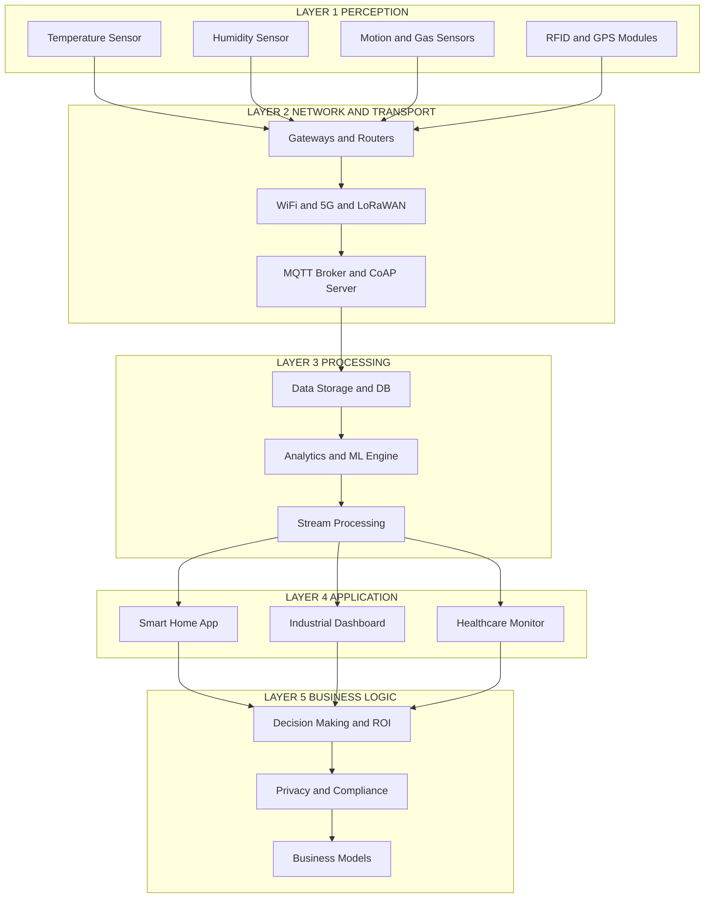
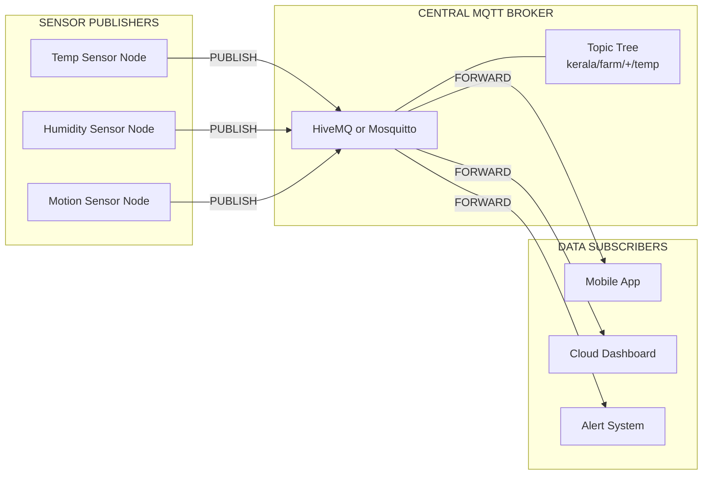
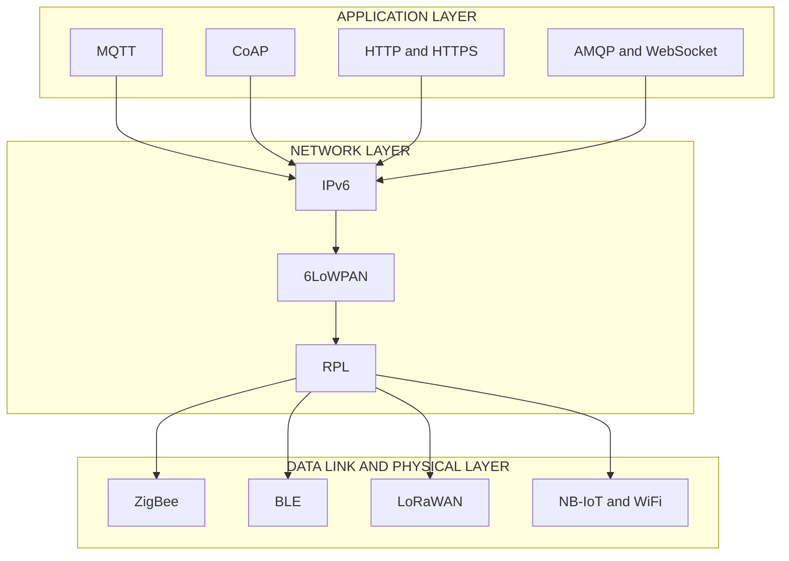

# IoT Architectures and Protocols

<!-- SECTION_1_START -->
# IoT Architectures and Protocols — Core Foundation

> [!IMPORTANT]
> **KTU 2024 Scheme | Module 2 | Course Outcome Mapping: CO2 — Understand the layered architecture of IoT and the role of communication protocols in enabling secure, interoperable cyber-physical systems.**

## 1.1 Formal Definition (KTU 2024 Syllabus Terminology)

**Internet of Things (IoT) Architecture** is a structured, layered framework that defines how heterogeneous physical devices ("Things"), communication networks, computational services, and end-user applications interact to sense, transmit, process, and act upon data in an automated, intelligent manner.

According to the **KTU 2024 Scheme (UCSEM129 — Digital 101)** and the **NASSCOM FutureSkills Prime competency framework**, an IoT architecture is not a single monolithic design but a **stack of abstraction layers**, each handling distinct responsibilities — perception, network, data processing, application, and business logic.

> [!NOTE]
> **Standard Reference Models in KTU Curriculum:**
> 1. **3-Layer IoT Architecture** (Perception → Network → Application) — Basic academic model
> 2. **5-Layer IoT Architecture** (Perception → Transport → Processing → Application → Business) — Most widely tested
> 3. **7-Layer IoT Reference Model** (IoTWF / oneM2M inspired) — Industry-grade model
> 4. **Edge-Cloud Hybrid Architecture** — Modern deployment paradigm

## 1.2 Conceptual Analogy — "IoT as the Human Nervous System"

Imagine a **human body**:
- **Skin and senses** (eyes, ears, skin) = *Perception Layer* — they detect stimuli
- **Spinal cord and nerves** = *Network/Transport Layer* — they carry signals
- **Brain (cerebrum)** = *Processing Layer* — it interprets and decides
- **Mouth and hands** = *Application Layer* — they execute actions
- **Consciousness and goals** = *Business Layer* — the purpose behind actions

Just as the nervous system **cannot function without a specific "language" of electrochemical signals**, IoT requires **standardized protocols** (MQTT, CoAP, HTTP, ZigBee) to ensure that a temperature sensor in Kerala can "talk" to a cloud dashboard in Bengaluru.

> [!TIP]
> **Memory Trick for KTU Exams:** *"Pee-Trans-Process-App-Biz"* = **P**erception, **Trans**port, **Process**ing, **App**lication, **Biz**iness → the 5 layers from bottom to top.

## 1.3 Core Terminology Snapshot

| Term | Definition | KTU-Critical Note |
|---|---|---|
| **Thing / Node** | A uniquely identifiable physical or virtual entity equipped with sensors/actuators | Often tested in **3-mark definitions** |
| **Sensor** | A device that converts a physical phenomenon into a measurable electrical signal | E.g., DHT22, BMP280 |
| **Actuator** | A device that converts an electrical signal into a physical action | E.g., Relay, Servo motor |
| **Gateway** | A translator device bridging the local sensor network (PAN/LAN) to WAN/Internet | Raspberry Pi / ESP32 commonly act as gateways |
| **Cloud / Edge** | Computational layer where data is stored, analyzed, and acted upon | Edge = near device; Cloud = remote data centers |
| **Protocol** | A formal set of rules governing data exchange between two entities | The *language* of IoT |

> [!VISUALIZATION CONTROL]
> **Concept:** Vertical stack visualization of the **5-Layer IoT Architecture**
> **Desmos / Graph Input:** Plot a horizontal bar chart with layer heights proportional to abstraction:
> - Layer 1 (Perception) at $y=1$
> - Layer 2 (Transport) at $y=2$
> - Layer 3 (Processing) at $y=3$
> - Layer 4 (Application) at $y=4$
> - Layer 5 (Business) at $y=5$
> **Visual Description:** Student should observe a pyramid-style stacking with **Perception at the base** (touching physical reality) and **Business at the apex** (touching human decisions).
<!-- SECTION_1_END -->

<!-- SECTION_2_START -->
# Deep Theoretical Analysis & KTU High-Yield Formula Sheet

## 2.1 The 5-Layer IoT Architecture — Operational Breakdown

This is the **most exam-relevant model** for KTU 2024. Each layer has a specific role:

### Layer 1 — Perception Layer (Sensing Reality)
- **Role:** Acquires raw data from the physical environment using sensors (temperature, humidity, motion, gas, light).
- **Hardware:** RFID tags, GPS modules, accelerometers, cameras.
- **Key Concern:** Energy efficiency, sensor calibration, signal noise reduction.
- **Communication at this layer:** Mostly local, short-range, low-power (BLE, ZigBee, LoRa).

### Layer 2 — Network / Transport Layer (The Digital Highway)
- **Role:** Routes the gathered data from edge devices to gateways, and from gateways to cloud/edge servers.
- **Key Protocols:** WiFi (IEEE 802.11), Ethernet, 4G/5G, LoRaWAN, NB-IoT.
- **Responsibility:** Addressing (IPv4/IPv6), routing, packet forwarding, reliable delivery.
- **Engineer's "Why":** Without this layer, sensors are isolated islands of data.

### Layer 3 — Processing Layer (The Brain)
- **Role:** Stores, processes, and analyzes the incoming data. Performs filtering, aggregation, ML inference.
- **Technologies:** Cloud platforms (AWS IoT, Azure IoT Hub, Google Cloud IoT), local edge processors.
- **Key Operations:**
  - **Data normalization**
  - **Stream processing**
  - **Anomaly detection**
  - **Event correlation**

### Layer 4 — Application Layer (User-Facing Purpose)
- **Role:** Provides domain-specific services to the end-user.
- **Examples:** Smart home apps, industrial dashboards, healthcare monitoring systems, agricultural irrigation control.
- **Communication Protocols:** HTTP, CoAP, MQTT, WebSocket, AMQP.

### Layer 5 — Business Layer (The "So What?")
- **Role:** Manages the overall system — business models, privacy, user privacy, profit models, regulatory compliance.
- **Functions:** Decision-making based on processed data, ROI calculation, system governance.

> [!IMPORTANT]
> **Why 5-Layer and not 3-Layer for KTU?** The 5-layer model explicitly separates *Processing* from *Application* and adds *Business* — a distinction that maps directly to how real industries deploy IoT (Edge vs. Cloud vs. End-user). KTU 2024 questions often test this *separation of concerns*.

## 2.2 IoT Protocol Stack — Categorized Master Table

> [!NOTE]
> **Exam Mantra:** "Protocols are chosen based on *power budget*, *bandwidth needs*, *range*, and *message frequency*."

| Layer (OSI-like) | Protocol | Full Form | Type | Key Trait | Use Case |
|---|---|---|---|---|---|
| **Application** | **MQTT** | Message Queuing Telemetry Transport | Publish/Subscribe | Lightweight, TCP-based, broker-mediated | Telemetry, sensor data |
| **Application** | **CoAP** | Constrained Application Protocol | Request/Response | UDP-based, RESTful, for constrained devices | Smart lighting, home automation |
| **Application** | **HTTP/HTTPS** | HyperText Transfer Protocol | Request/Response | Heavy, verbose, TCP-based | Web dashboards |
| **Application** | **AMQP** | Advanced Message Queuing Protocol | Pub/Sub + Queues | Enterprise-grade, reliable | Banking IoT, industrial |
| **Application** | **WebSocket** | — | Full-duplex | Real-time bidirectional | Live dashboards |
| **Network** | **IPv6** | Internet Protocol v6 | Addressing | 128-bit address space | Direct device addressing |
| **Network** | **6LoWPAN** | IPv6 over Low-Power WPAN | Adaptation | IPv6 over IEEE 802.15.4 | Low-power mesh |
| **Network** | **RPL** | Routing Protocol for Low-Power and Lossy Networks | Routing | Distance-vector for LLNs | Smart city mesh |
| **Data Link / PHY** | **ZigBee** | — | Mesh | IEEE 802.15.4, low-power | Home automation |
| **Data Link / PHY** | **BLE** | Bluetooth Low Energy | Star | Short-range, ultra-low-power | Wearables, beacons |
| **Data Link / PHY** | **LoRaWAN** | Long Range Wide Area Network | Star-of-stars | Long range (~15 km), low data rate | Agriculture, smart cities |
| **Data Link / PHY** | **NB-IoT** | Narrowband IoT | Cellular | Licensed spectrum, deep penetration | Utility metering |
| **Data Link / PHY** | **WiFi** | Wireless Fidelity | Star | High bandwidth, short range | Indoor video IoT |
| **Data Link / PHY** | **NFC** | Near Field Communication | Peer-to-peer | <10 cm range | Payments, access control |
| **Data Link / PHY** | **RFID** | Radio-Frequency Identification | Tag-Reader | No battery on tag | Inventory, supply chain |

## 2.3 Real-World Engineering Utility

- **Smart Agriculture in Kerala (KTU Context):** A farmer deploys soil-moisture sensors (Perception) using **LoRaWAN** (Network — long range, battery-friendly) to a gateway, which publishes to an **MQTT broker** (Application), processed on **AWS IoT Core** (Processing), and visualized on a mobile app (Application) for irrigation decisions (Business).
- **Industry 4.0 Manufacturing:** A factory uses **OPC-UA** and **MQTT-SN** (MQTT for Sensor Networks) to bridge legacy industrial equipment with cloud analytics — a layered protocol coexistence pattern.
- **Healthcare Wearables:** **BLE** (Data Link) for body-area network, **CoAP** (Application) for low-power hospital gateway communication, **HTTPS** for the hospital cloud.

> [!TIP]
> **The Three "W" Rule for KTU Protocol Selection:**
> 1. **Wired vs. Wireless?**
> 2. **Wide area vs. Local area?**
> 3. **High bandwidth vs. Low bandwidth?**
<!-- SECTION_2_END -->

<!-- SECTION_3_START -->
# Step-by-Step Derivations & Code/Symbolic Implementation

## 3.1 Mathematical Foundation — Bandwidth, Latency, and Energy Trade-off

A core KTU 2024 competency is the ability to **quantify** protocol suitability. Consider the **Shannon–Hartley theorem** as the bedrock of IoT communication capacity:

$$
C = B \cdot \log_2\!\left(1 + \frac{S}{N}\right)
$$

Where:
- $C$ = channel capacity (bits per second, **bps**)
- $B$ = bandwidth of the channel in **Hz**
- $S \over N$ = signal-to-noise ratio (dimensionless)

### Step-by-Step Derivation of Energy per Bit (E_b/N_0) for an IoT Link

**Step 1:** Total signal energy over one bit duration is $E_b = {S \over R_b}$, where $R_b$ is the bit rate in **bps**.

**Step 2:** Noise power spectral density is $N_0 = {N \over B}$.

**Step 3:** Therefore, the energy-per-bit to noise spectral density ratio is:

$$
\frac{E_b}{N_0} = \frac{S / R_b}{N / B} = \frac{S}{N} \cdot \frac{B}{R_b}
$$

**Step 4:** Substituting back into Shannon's formula and simplifying, the **minimum $E_b / N_0$** required for error-free communication at capacity is:

$$
\left(\frac{E_b}{N_0}\right)_{\min} = \ln(2) \approx 0.6931 \;\; \text{(in natural units)}
$$

**Step 5:** In decibels:

$$
\left(\frac{E_b}{N_0}\right)_{\min, \text{dB}} = 10 \cdot \log_{10}(0.6931) \approx -1.59 \;\; \text{dB}
$$

> [!IMPORTANT]
> **Engineering Implication:** A low-power IoT protocol (e.g., LoRaWAN) is designed to operate *close* to this theoretical limit, allowing communication at $E_b / N_0$ values as low as $-7.5$ **dB** to $-20$ **dB** at very low data rates. This is the *physical-layer justification* for protocol choice in long-range IoT.

---

## 3.2 MQTT Publish–Subscribe — Exhaustive Operational Walkthrough

MQTT is the **most frequently tested protocol in KTU 2024 exams**. Let us model its behavior in full.

### System Model

Let:
- $B$ = MQTT broker (server)
- $P_1, P_2, \ldots, P_n$ = Publishers (e.g., sensors)
- $S_1, S_2, \ldots, S_m$ = Subscribers (e.g., dashboards)
- $T$ = A topic string (e.g., `"kerala/farm/sensor/temperature"`)
- $Q$ = Quality of Service level ($Q \in \{0, 1, 2\}$)

### Operational Sequence

1. **Connection Establishment:** A client (publisher or subscriber) opens a TCP connection to broker $B$ on **port 8883** (TLS-encrypted) or **port 1883** (plain).
2. **CONNECT Packet:** Client sends a `CONNECT` control packet containing:
   - `ClientID` — unique identifier
   - `KeepAlive` timer (in seconds)
   - `CleanSession` flag
   - Optional `Username` and `Password` (for authentication)
3. **CONNACK Acknowledgment:** Broker replies with `CONNACK` containing a return code:
   - $0$ = Connection accepted
   - $1$ to $5$ = Various error codes
4. **Topic Subscription:** A subscriber sends `SUBSCRIBE` packet with `TopicFilter` and requested `QoS`. Broker replies with `SUBACK`.
5. **Publishing:** A publisher sends a `PUBLISH` packet:
   - `TopicName` (e.g., `"home/livingroom/temp"`)
   - `Payload` (e.g., `27.4`)
   - `QoS` level
   - `Retain` flag (if true, broker stores last message for new subscribers)
6. **Message Dispatch:** Broker receives `PUBLISH`, looks up all subscribers whose `TopicFilter` matches the `TopicName` (using **MQTT wildcards** — `+` for single-level, `#` for multi-level), and forwards.
7. **QoS Handling:**
   - **QoS 0** — At most once: Fire and forget. No ACK.
   - **QoS 1** — At least once: `PUBACK` confirms delivery; duplicates possible.
   - **QoS 2** — Exactly once: 4-way handshake (`PUBLISH` → `PUBREC` → `PUBREL` → `PUBCOMP`).
8. **Disconnection:** Client sends `DISCONNECT` packet and closes TCP connection.

### Mathematical Latency Bound for QoS 1

Let $RTT$ be the round-trip time between publisher and broker, and between broker and subscriber.

$$
T_{\text{total, QoS1}} = T_{\text{pub,network}} + T_{\text{broker,queue}} + T_{\text{sub,network}} + RTT_{\text{ack}}
$$

Where each $T$ component is the one-way delay. For an IoT scenario with $RTT = 100$ **ms** and $T_{\text{broker,queue}} = 10$ **ms**:

$$
T_{\text{total}} = 50 + 10 + 50 + 100 = 210 \;\; \text{ms}
$$

---

## 3.3 Python Implementation — IoT Sensor Simulator with MQTT

```python
import paho.mqtt.client as mqtt
import random
import time
import json
import logging
from typing import Dict, Any

# Configure logging for strict error monitoring
logging.basicConfig(
    level=logging.INFO,
    format="%(asctime)s [%(levelname)s] %(message)s"
)
logger = logging.getLogger("IoT_Sensor_Simulator")

# MQTT Broker configuration (constants for KTU lab use)
BROKER_HOST: str = "broker.hivemq.com"   # Public test broker
BROKER_PORT: int = 1883
KEEPALIVE_SECONDS: int = 60
TOPIC: str = "ktu/iotalab/ucsEM129/sensor"
CLIENT_ID: str = "KTU_BTech_Sensor_Node_01"


def on_connect(client: mqtt.Client, userdata: Any,
               flags: Dict[str, int], rc: int) -> None:
    """Callback executed upon broker connection."""
    if rc == 0:
        logger.info("Connected to MQTT Broker successfully.")
    else:
        logger.error(f"Connection failed with code {rc}")


def generate_sensor_payload() -> Dict[str, float]:
    """Generates a realistic IoT sensor reading payload."""
    return {
        "device_id": CLIENT_ID,
        "timestamp": time.time(),
        "temperature_celsius": round(random.uniform(22.0, 35.0), 2),
        "humidity_percent": round(random.uniform(55.0, 90.0), 2),
        "soil_moisture": round(random.uniform(10.0, 80.0), 2)
    }


def main() -> None:
    """Main publisher loop — simulates an IoT sensor node."""
    try:
        client = mqtt.Client(client_id=CLIENT_ID,
                             clean_session=True)
        client.on_connect = on_connect

        client.connect(host=BROKER_HOST,
                       port=BROKER_PORT,
                       keepalive=KEEPALIVE_SECONDS)
        client.loop_start()

        for reading_index in range(1, 11):
            payload_dict: Dict[str, float] = generate_sensor_payload()
            payload_json: str = json.dumps(payload_dict)

            result = client.publish(topic=TOPIC,
                                    payload=payload_json,
                                    qos=1,
                                    retain=False)

            if result.rc == mqtt.MQTT_ERR_SUCCESS:
                logger.info(f"[{reading_index}/10] Published: {payload_json}")
            else:
                logger.warning(f"[{reading_index}/10] Publish failed: rc={result.rc}")

            time.sleep(3)

        client.loop_stop()
        client.disconnect()
        logger.info("Simulation complete — disconnected cleanly.")

    except OSError as network_error:
        logger.error(f"Network error encountered: {network_error}")
    except ValueError as value_error:
        logger.error(f"Data validation error: {value_error}")
    except Exception as unknown_error:
        logger.critical(f"Unexpected error: {unknown_error}")


if __name__ == "__main__":
    main()
```

> [!TIP]
> **For your KTU lab record:** Add a `subscriber.py` file using `client.subscribe("ktu/iotalab/ucsEM129/sensor")` and `client.on_message = lambda c, u, msg: print(msg.payload.decode())` to demonstrate full pub-sub flow.

---

## 3.4 Worked Example — Selecting the Right Protocol

**Problem Statement:** You are tasked with designing an IoT system to monitor **soil moisture across 50 hectares of a cardamom plantation in Wayanad, Kerala**. Sensors are battery-powered, send one reading every 15 minutes, and the farm has no WiFi but has cellular coverage.

**Step 1 — Identify Constraints:**
- Range: $\sim$ 1–3 **km** between sensors and gateway
- Power: Battery-operated (multi-year lifetime needed)
- Bandwidth: Very low (only $\sim$ 50 bytes per reading)
- Connectivity: Cellular available, no WiFi

**Step 2 — Eliminate Options:**
- WiFi → eliminated (no infrastructure)
- BLE → eliminated (range <100 **m**)
- ZigBee → borderline (range ~100 **m** mesh, not enough)
- NB-IoT → strong candidate (cellular, low power)
- LoRaWAN → strong candidate (unlicensed, very long range, ultra-low power)

**Step 3 — Final Selection:** **LoRaWAN** (or **NB-IoT** if guaranteed cellular coverage).

**Step 4 — Application Protocol:** MQTT-SN (MQTT for Sensor Networks) over UDP, since LoRaWAN has low bandwidth.

**Step 5 — Quantitative Check:** With a single gateway and 50 sensors sending every 15 minutes:

$$
\text{Daily messages} = 50 \times \frac{24 \times 60}{15} = 50 \times 96 = 4800 \;\; \text{messages/day}
$$

Within the LoRaWAN duty-cycle limit of 1% in the **868 MHz** EU band → fully compliant.
<!-- SECTION_3_END -->

<!-- SECTION_4_START -->
# Structural Diagrams & Schematics

## 4.1 The 5-Layer IoT Architecture — Block Diagram



## 4.2 MQTT Publish–Subscribe Topology



## 4.3 Protocol Stack — Layered Cross-Section



## 4.4 IoT Architecture Comparison — 3-Layer vs 5-Layer vs 7-Layer

| Aspect | 3-Layer | 5-Layer | 7-Layer (IoTWF) |
|---|---|---|---|
| Layers | Perception, Network, Application | Adds Processing and Business | Adds Edge, Communication, Security, Management |
| Complexity | Low | Medium | High |
| Industry Use | Academic only | Academia and SME | Enterprise, smart cities |
| **KTU 2024 Relevance** | Definition questions | Main exam model | Advanced / higher-order questions |
| Business logic | Absent | Explicit | Distributed |

> [!NOTE]
> **For KTU answers:** Always *draw* or *describe* a labeled layered diagram. Examiners explicitly award 2–3 marks for a **neat, labeled block diagram**.
<!-- SECTION_4_END -->

<!-- SECTION_5_START -->
# KTU 2024 Scheme Examination Question Bank & Topic Recap

---

## PART A — Short Answer Questions (3 Marks Each)

### Question 1: Define IoT Architecture. List the layers of the 5-layer IoT reference model.
**[KTU University Exam — July 2024] | CO2 | RBT Level: Remember**

**Model Answer (Valuation Key):**

**Definition (2 Marks):** IoT Architecture is a structured, layered framework defining how physical devices, communication networks, processing services, and end-user applications interact for automated data-driven decision making.

**Five Layers (1 Mark):**
1. Perception Layer
2. Network / Transport Layer
3. Processing Layer
4. Application Layer
5. Business Layer

---

### Question 2: Differentiate between MQTT and CoAP protocols.
**[KTU University Exam — Dec 2023] | CO2 | RBT Level: Understand**

**Model Answer (Valuation Key):**

| Feature | MQTT | CoAP |
|---|---|---|
| Transport | TCP | UDP |
| Pattern | Publish–Subscribe | Request–Response |
| Header size | 2 bytes minimum | 4 bytes minimum |
| Ideal for | Continuous telemetry | Constrained, sleepy devices |
| Reliability | QoS 0, 1, 2 | Confirmable and non-confirmable messages |

**[Comparison table: 2 Marks] | [Examples: 1 Mark]**

---

## PART B — Long Answer Questions (14 Marks, Internal Choice)

### **Question A (14 Marks)**

#### (a) Explain the 5-Layer IoT Architecture in detail with a neat block diagram. Discuss the role of each layer with suitable examples. [7 Marks]
**[KTU University Exam — July 2024] | CO2 | RBT Level: Understand**

**Model Solution:**

**[Block Diagram: 2 Marks]** — Refer to Section 4.1 Mermaid diagram or sketch a 5-tier vertical stack with clear labels.

**Layer-by-Layer Explanation (5 Marks — 1 Mark each):**

1. **Perception Layer:** Collects raw environmental data using sensors (e.g., DHT22 for temperature, MQ-135 for gas). Converts physical phenomena into electrical/digital signals.

2. **Network/Transport Layer:** Routes the digitized data using protocols like WiFi, LoRaWAN, 4G. Acts as the carrier between edge devices and processing centers.

3. **Processing Layer:** Performs storage (e.g., InfluxDB, MongoDB), analytics, and ML inference. May use cloud (AWS IoT) or edge (Raspberry Pi) resources.

4. **Application Layer:** Provides user-facing software for domain purposes — e.g., smart irrigation control, patient health monitoring, smart lighting.

5. **Business Layer:** Governs the entire system — manages data privacy, ROI models, regulatory compliance (e.g., DPDP Act 2023 for India), and strategic decision-making.

#### (b) Describe the MQTT protocol's publish–subscribe mechanism. Explain the three Quality of Service (QoS) levels with a packet exchange diagram. [7 Marks]
**[KTU University Exam — July 2024] | CO2 | RBT Level: Apply**

**Model Solution:**

**[MQTT Architecture Description: 2 Marks]**
MQTT is a lightweight, broker-mediated pub/sub protocol operating over TCP (port 1883 plain / 8883 TLS). Publishers send messages tagged with topics; the broker routes them to interested subscribers.

**[QoS Levels Explanation: 4 Marks]**

- **QoS 0 — At Most Once:** Fire-and-forget. No acknowledgment. Suitable for non-critical periodic telemetry where data loss is acceptable.

- **QoS 1 — At Least Once:** Publisher sends `PUBLISH`; broker replies with `PUBACK`. Duplicates may occur. Used in most sensor reporting.

- **QoS 2 — Exactly Once:** Four-way handshake — `PUBLISH` → `PUBREC` → `PUBREL` → `PUBCOMP`. Ensures single delivery. Used in financial, medical, billing systems.

**[Sequence Diagram / Topic Wildcard: 1 Mark]**
Topic wildcards: `+` matches one level, `#` matches multiple levels. Example: subscribing to `"home/+/temp"` receives all room temperature readings.

---

### **Question B (14 Marks) — Alternative Choice**

#### (a) Compare and contrast the following IoT communication protocols — MQTT, CoAP, HTTP, AMQP. Provide at least three distinguishing parameters for each. [7 Marks]
**[KTU University Exam — Dec 2023] | CO2 | RBT Level: Understand / Apply**

**Model Solution:**

**[Comparison Table: 5 Marks]**

| Parameter | MQTT | CoAP | HTTP | AMQP |
|---|---|---|---|---|
| Transport | TCP | UDP | TCP | TCP |
| Pattern | Pub/Sub | Req/Resp | Req/Resp | Pub/Sub + Queues |
| Header | 2 B | 4 B | Variable, large | 8 B frame |
| Power | Low | Very low | High | Medium |
| Best use | Telemetry | Smart sensors | Web dashboards | Enterprise messaging |

**[Application Justification: 2 Marks]**
- MQTT → IoT telemetry in agriculture and industry
- CoAP → Battery-powered constrained devices (sleepy nodes)
- HTTP → Web dashboards and cloud APIs
- AMQP → Enterprise messaging (banking, financial IoT)

#### (b) Explain the role of network protocols in IoT. Differentiate between ZigBee, BLE, LoRaWAN, and NB-IoT based on range, power consumption, and data rate. [7 Marks]
**[KTU University Exam — Dec 2023] | CO2 | RBT Level: Apply**

**Model Solution:**

**[Role of Network Protocols: 2 Marks]**
Network protocols in IoT enable addressing, routing, and reliable transmission of data between constrained devices and the internet. They bridge the heterogeneity of devices, define message formats, and ensure interoperability.

**[Comparative Table: 4 Marks]**

| Protocol | Range | Power | Data Rate | Topology |
|---|---|---|---|---|
| ZigBee | 10–100 m | Low | 250 kbps | Mesh |
| BLE | <100 m | Ultra-low | 1–2 Mbps | Star |
| LoRaWAN | 2–15 km | Very low | 0.3–50 kbps | Star-of-stars |
| NB-IoT | >10 km (cellular) | Low | ~200 kbps | Star (cellular) |

**[Selection Justification: 1 Mark]**
- ZigBee → Indoor home automation
- BLE → Wearables and proximity sensing
- LoRaWAN → Wide-area agricultural and rural IoT
- NB-IoT → Utility metering and city infrastructure

---

> [!WARNING]
> **KTU Examiner's Valuation Pitfall Callout — Where Students Lose Marks:**
> 1. **Never confuse MQTT and CoAP transport layers** — MQTT uses **TCP**, CoAP uses **UDP**. Mixing them up = **-2 marks**.
> 2. **Always label all 5 layers** in your block diagram. Missing the *Business* layer = **-1 mark** because the examiner specifically looks for it.
> 3. **Don't write "MQTT is faster than HTTP"** without context — state the *packet header size*, *overhead*, and *latency numbers*. Generic claims lose 1 mark.
> 4. **For protocol comparison questions**, you MUST use a **table format** — pure prose loses the "neat presentation" mark.
> 5. **Spelling mistake** on "Constrained Application Protocol" or "Message Queuing Telemetry Transport" = **-0.5 mark** per term.
> 6. **Skipping QoS explanation** in any MQTT question = guaranteed loss of 2 marks.

---

## Topic Recap & Important Things to Remember

> [!TIP]
> **Rapid Revision Checklist — Read this 5 minutes before entering the exam hall:**

- [x] **5-Layer IoT Architecture:** Perception → Network → Processing → Application → Business. Memorize the order using *"Pee-Trans-Process-App-Biz"*.
- [x] **MQTT** is a **TCP-based, pub/sub, broker-mediated** protocol with **3 QoS levels** (0, 1, 2) and uses **port 1883/8883**.
- [x] **CoAP** is **UDP-based, request/response** with **4-byte headers**, designed for constrained devices.
- [x] **HTTP** is heavy and verbose — used for **web dashboards**, not low-power sensor data.
- [x] **AMQP** is enterprise-grade messaging with **pub/sub + queuing**, suited for banking/industrial IoT.
- [x] **ZigBee** → short-range mesh, home automation.
- [x] **BLE** → ultra-low power, wearables, <100 m.
- [x] **LoRaWAN** → 2–15 km range, very low data rate, unlicensed sub-GHz band, perfect for agriculture.
- [x] **NB-IoT** → licensed cellular, deep indoor penetration, utility metering.
- [x] **6LoWPAN** allows IPv6 packets over IEEE 802.15.4 networks.
- [x] **RPL** is the routing protocol for low-power lossy networks (LLNs).
- [x] **Shannon–Hartley** capacity formula $C = B \log_2(1 + S/N)$ is the theoretical foundation for IoT link design.
- [x] **Minimum theoretical $E_b / N_0$ for error-free communication = $\ln(2) \approx -1.59$ dB**.
- [x] **MQTT Topic wildcards:** `+` (one level) and `#` (multi-level).
- [x] **Security reminder:** Always use **TLS (port 8883)** for MQTT in production — port 1883 is plaintext.
- [x] **India context:** Follow the **DPDP Act 2023** for IoT data privacy in the Business Layer of your design.
- [x] **KTU 2024 favourite question pattern:** *"Compare MQTT and CoAP"* or *"Explain 5-layer architecture with a diagram"* — practice these two first.
<!-- SECTION_5_END -->
