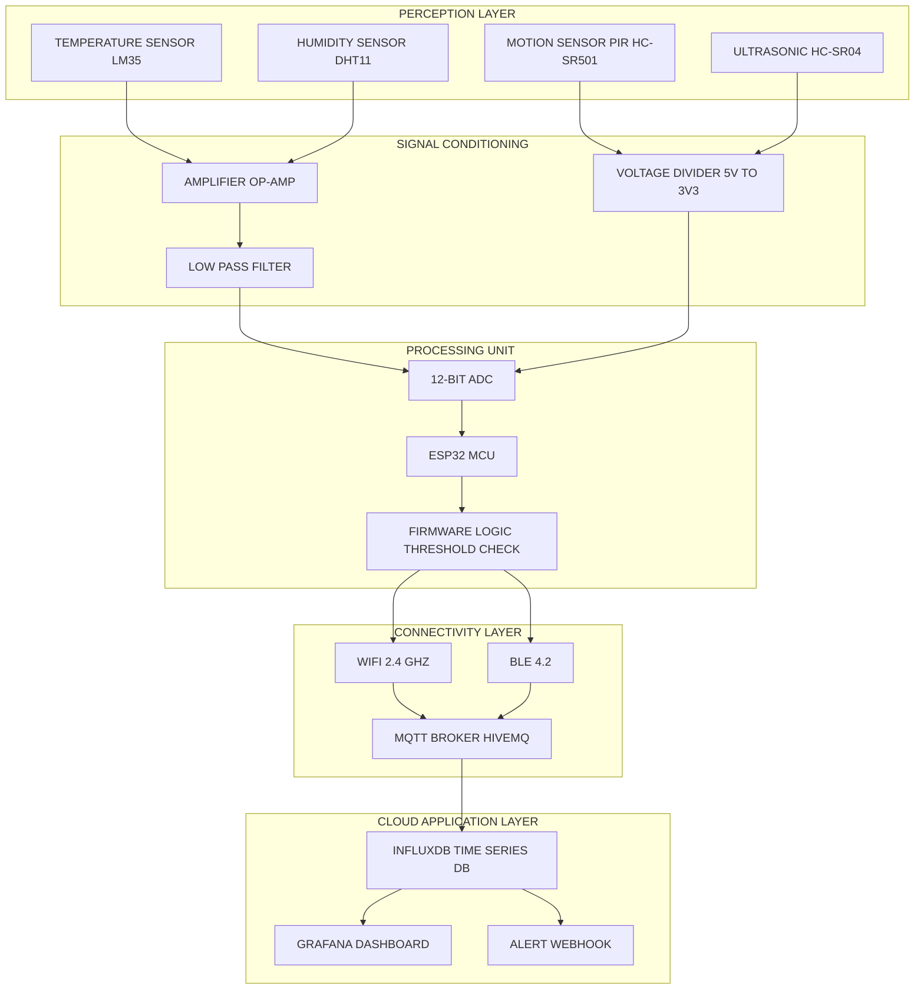
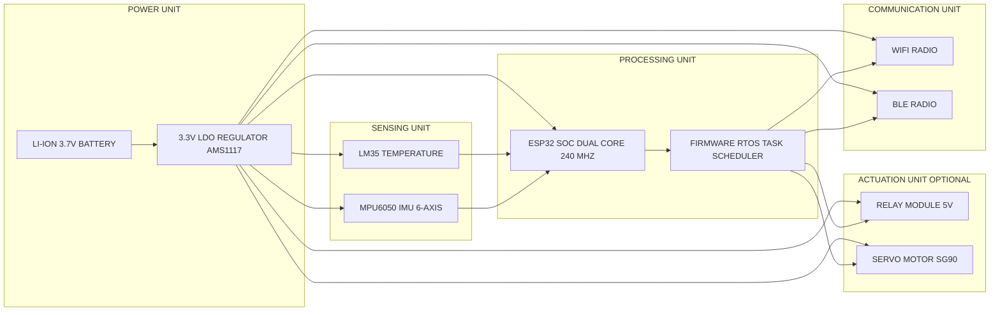
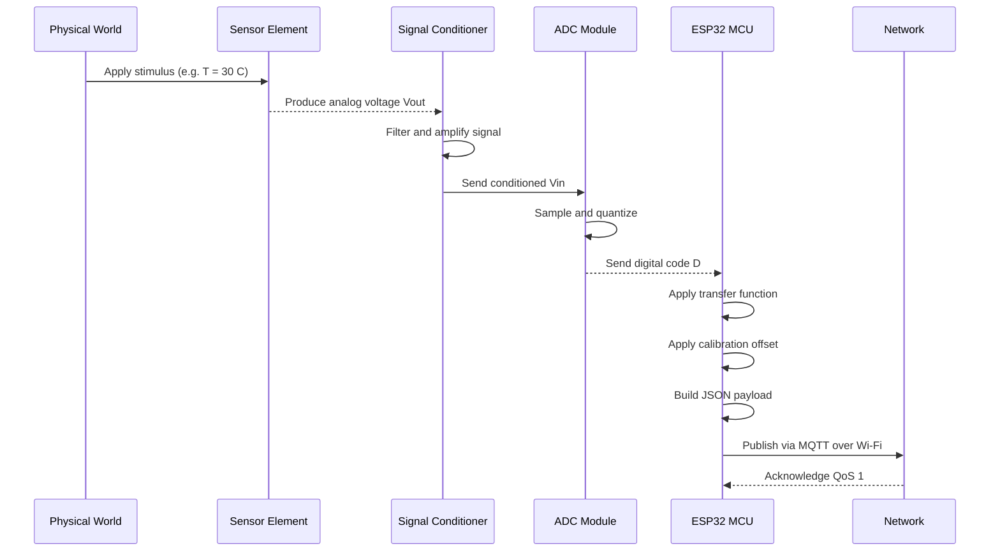
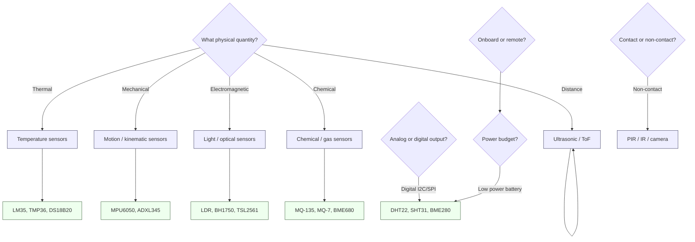

# IoT Sensors and Devices

<!-- SECTION_1_START -->
# IoT Sensors and Devices — Core Technical Definition & Intuitive Overview

## 1.1 Formal Academic Definition (KTU 2024 Syllabus Aligned)

An **IoT Sensor** is a physical hardware component (transducer) that detects, measures, and converts a physical phenomenon from the real world (such as temperature, light, motion, pressure, humidity, or chemical composition) into a corresponding electrical signal (analog or digital) that can be read, processed, and transmitted by an embedded computing system.

An **IoT Device** is the integrated, network-capable embedded system that bundles one or more sensors, a microcontroller/processor, communication interfaces, and power management into a single functional unit capable of interacting with the physical world and the Internet.

The formal relationship can be stated as:

$$\text{IoT Device} = \{\text{Sensor(s)}\} \cup \{\text{Actuator(s)}\} \cup \{\text{MCU / SoC}\} \cup \{\text{Comms Module}\} \cup \{\text{Power Unit}\}$$

> [!IMPORTANT]
> **Syllabus Highlight (Module 2):** KTU emphasizes the distinction between the **sensing layer (perception)**, the **actuation layer**, and the **connectivity layer** of an IoT stack. Sensors belong to the perception layer; devices integrate perception with the network and processing layers.

## 1.2 Conceptual Analogy — The Human Body

Think of an IoT sensor exactly like one of the **human senses**:

- A **temperature sensor (DHT22)** behaves like human *skin* feeling heat or cold.
- A **photoresistor (LDR)** behaves like the *eyes* detecting light intensity.
- A **PIR motion sensor (HC-SR501)** behaves like the *ears/skin* sensing movement in a dark room.
- A **microphone (MAX4466 / MEMS mic)** behaves like *ears* capturing sound.

The **IoT Device** is the *entire body* — the sensors (senses) feed signals to the *brain* (microcontroller like ESP32 / Arduino), which then triggers *muscles* (actuators like motors, relays, LEDs) and uses a *voice* (Wi-Fi, BLE, LoRa) to inform the outside world.

So just as a human cannot perceive the world without senses, an IoT system cannot digitize the world without sensors.

## 1.3 Physical Constants & Standard Metrics in IoT Sensing

> [!NOTE]
> The following standard metrics are used industry-wide when describing IoT sensors (referenced in IEEE 1451 and NIST sensor taxonomies):

- **ADC Resolution:** **10-bit, 12-bit, 16-bit** (defines the granularity of digital conversion).
- **Standard Supply Voltages:** **3.3 V** (logic), **5.0 V** (legacy/Arduino), **1.8 V** (low-power SoCs).
- **Wireless Frequency Bands:** **2.4 GHz** (Wi-Fi/BLE), **868/915 MHz** (LoRa), **13.56 MHz** (NFC/RFID).
- **Sampling Rate Units:** *samples per second* (S/s), *Hertz (Hz)*, *kHz*, *MHz*.
- **Standard Communication Protocols:** **I²C** (100/400 kHz), **SPI** (up to 10 MHz), **UART** (baud rates e.g. **9600, 115200**), **1-Wire**, **CAN**, **Modbus**.

## 1.4 GeoGebra / Desmos Visualization Callout

> [!VISUALIZATION CONTROL]
> **Concept:** Real-time analog-to-digital conversion of a continuous sensor signal.
> **GeoGebra / Desmos Input Equations:**
> * `f(x) = 2.5 + 1.2 * sin(0.5 * x)`   *(continuous analog sensor output, e.g. a temperature curve in volts)*
> * `L1: y = 0`   `L2: y = 0.25`   `L3: y = 0.5`   `L4: y = 0.75`   `L5: y = 1.0`   *(discrete quantization levels of a 2-bit ADC)*
> **Visual Description:** Students should observe a smooth sinusoidal analog curve intersected by horizontal quantization steps. Each "step" represents a digital code (00, 01, 10, 11) that the MCU reads. This visualizes **quantization error** — the small vertical gap between the analog curve and the nearest digital step.

<!-- SECTION_1_END -->

<!-- SECTION_2_START -->
# Deep Theoretical Analysis & KTU High-Yield Formula Sheet

## 2.1 Classification of IoT Sensors

Sensors are classified along several orthogonal axes. The KTU 2024 Module 2 syllabus emphasizes the following taxonomy:

### A. Based on Power Requirement
- **Active Sensors** — require external excitation (e.g., radar, ultrasonic, RTD).
- **Passive Sensors** — directly generate an electrical response without excitation (e.g., thermocouple, photodiode, PIR).

### B. Based on Output Signal
- **Analog Sensors** — produce a continuous voltage/current proportional to the measurand (e.g., LM35 temperature, TMP36).
- **Digital Sensors** — produce a discrete bitstream (e.g., DHT11, DS18B20, BME280).

### C. Based on the Measurand (Physical Quantity)
- **Environmental:** Temperature, Humidity, Pressure, Light, Gas, Air Quality.
- **Kinematic:** Accelerometer, Gyroscope, Magnetometer, IMU.
- **Proximity / Position:** PIR, Ultrasonic, LiDAR, Infrared, GPS module.
- **Biochemical:** pH, ECG/EMG electrodes, glucose sensor.
- **Industrial:** Flow meters, load cells, current sensors (ACS712).

### D. Based on Contact
- **Contact sensors** (thermistor, tactile, pressure mat).
- **Non-contact sensors** (PIR, ultrasonic, IR, camera).

## 2.2 Anatomy of an IoT Device

A complete IoT device is composed of **four mandatory sub-systems** plus one optional:

| Sub-system | Function | Typical Components |
|---|---|---|
| **Sensing / Perception Unit** | Captures real-world phenomena | LM35, DHT11, PIR, MPU6050 |
| **Processing Unit (MCU / SoC)** | Runs firmware, performs local decisions | ESP32, Arduino Uno, Raspberry Pi Pico, STM32 |
| **Communication Unit** | Transmits/receives data | Wi-Fi module, BLE, LoRa, NB-IoT, Zigbee |
| **Power Unit** | Supplies regulated voltage | Li-ion battery, USB, solar cell, PoE |
| **Actuation Unit** *(optional)* | Performs a physical action | Relay, DC motor, servo, solenoid |

## 2.3 Operational Logic — How a Sensor Becomes IoT Data

A typical end-to-end data flow has **six well-defined stages**:

1. **Physical Stimulus** — a real-world quantity (e.g., ambient temperature = 28.5 °C) acts on the sensor element.
2. **Transduction** — the sensor's sensing element converts the physical quantity into a proportional electrical signal.
3. **Signal Conditioning** — the raw signal is filtered, amplified (via op-amp), and linearized. The **transfer function** of the sensor is applied here.
4. **Analog-to-Digital Conversion (ADC)** — the conditioned analog signal is sampled and quantized into a digital word.
5. **Local Processing** — the MCU applies calibration coefficients, engineering-unit conversion, and threshold logic.
6. **Network Transmission** — the digital datum is packetized (JSON, MQTT, CoAP) and pushed to the cloud/server.

## 2.4 Core Equations (KTU High-Yield Formula Sheet)

> [!NOTE]
> The following table consolidates every formula a student must know for Module 2 numericals and derivations.

| Concept | Formula / Equation | Variable Definitions | Typical Units |
|---|---|---|---|
| **ADC Digital Output** | $D = \left\lfloor \dfrac{V_{in}}{V_{ref}} \cdot (2^{n} - 1) \right\rfloor$ | $D$ = digital code, $V_{in}$ = input voltage, $V_{ref}$ = reference voltage, $n$ = bit-resolution | Volts, dimensionless |
| **Quantization Step (LSB)** | $\Delta V = \dfrac{V_{ref}}{2^{n}}$ | $\Delta V$ = size of one LSB | Volts |
| **Quantization Error (max)** | $E_{q} = \pm \dfrac{\Delta V}{2}$ | Peak-to-peak error | Volts |
| **Sensor Transfer Function (Linear)** | $y = m \cdot x + c$ | $m$ = sensitivity, $c$ = offset, $x$ = measurand, $y$ = output | Mixed |
| **LM35 Sensitivity** | $V_{out} = 10 \cdot T$ | $T$ = temperature in °C | mV / °C |
| **TMP36 Sensitivity** | $V_{out} = 500 + 10 \cdot T$ | $T$ = temperature in °C | mV / °C |
| **Thermistor (Beta equation)** | $R_T = R_0 \cdot e^{\beta \left( \tfrac{1}{T} - \tfrac{1}{T_0} \right)}$ | $R_T$ = resistance at $T$, $R_0$ = resistance at $T_0$, $\beta$ = material constant | Ohms, Kelvin |
| **Ohm's Law (Current Sensing)** | $V = I \cdot R$ | $V$ = voltage drop, $I$ = current, $R$ = shunt resistance | V, A, $\Omega$ |
| **Ultrasonic Distance** | $d = \dfrac{v \cdot t}{2}$ | $v$ = speed of sound $\approx$ **343 m/s**, $t$ = round-trip echo time, factor **2** accounts for round trip | meters, seconds |
| **PIR Detection Geometry** | $\theta_{FOV} \approx 110^{\circ}$ (typ.) | Field of view half-angle | degrees |
| **Light Intensity (LDR / Lux)** | $R_{LDR} \propto \dfrac{1}{L}$ | $R_{LDR}$ = resistance, $L$ = illuminance | Ohms, lux |
| **Wheatstone Bridge (Pressure/Strain)** | $V_{out} = V_{ex} \cdot \left( \dfrac{R_x}{R_x + R_1} - \dfrac{R_3}{R_3 + R_2} \right)$ | $R_x$ = varying element, $V_{ex}$ = excitation | Volts |
| **Power Consumption (Battery Life)** | $t_{life} = \dfrac{C_{batt}}{I_{avg}}$ | $C_{batt}$ = battery capacity, $I_{avg}$ = average current draw | hours, mAh |
| **Sampling Theorem (Nyquist)** | $f_{s} \geq 2 \cdot f_{max}$ | $f_s$ = sampling rate, $f_{max}$ = highest signal frequency | Hz |

> [!IMPORTANT]
> **Common Pitfall:** In the ultrasonic equation, students often forget to **divide by 2**. The echo is *round-trip* — sound travels from the transmitter, hits the object, and returns. Hence distance = (velocity × time) / 2.

## 2.5 Real-World Utility in Industry

- **Smart Agriculture:** Soil moisture sensors + ESP32 + LoRa → precision irrigation in Kerala's spice & rubber plantations.
- **Predictive Maintenance:** Vibration (accelerometer) + temperature sensors on industrial motors → AI-based failure prediction.
- **Healthcare Wearables:** MAX30102 (PPG + SpO₂ sensor) + BLE → remote patient monitoring.
- **Smart Cities:** Air-quality (MQ-135), noise, and traffic sensors → municipal dashboards.
- **Cold-Chain Logistics:** DS18B20 1-Wire digital temperature sensors ensure pharmaceutical/vaccine integrity during transit.

<!-- SECTION_2_END -->

<!-- SECTION_3_START -->
# Step-by-Step Derivations, Code Implementations & Worked Problems

## 3.1 Derivation: ADC Resolution and Quantization Error

**Problem Statement:** A **12-bit ADC** with a reference voltage $V_{ref} = 3.3\text{ V}$ reads an analog input from an LM35 temperature sensor. Determine the digital code and the maximum quantization error when the ambient temperature is **45 °C**.

**Step 1 — Compute the sensor's analog output voltage.**

The LM35 has a linear transfer function:

$$V_{out} = 10 \cdot T \quad \text{(mV)}$$

Substituting $T = 45\text{ °C}$:

$$V_{out} = 10 \cdot 45 = 450 \text{ mV} = 0.450 \text{ V}$$

**Step 2 — Compute the LSB (Quantization Step).**

$$\Delta V = \dfrac{V_{ref}}{2^{n}} = \dfrac{3.3}{2^{12}} = \dfrac{3.3}{4096}$$

$$\Delta V = 8.056640625 \times 10^{-4} \text{ V} \approx 0.8057 \text{ mV}$$

**Step 3 — Compute the digital code $D$.**

$$D = \left\lfloor \dfrac{V_{in}}{V_{ref}} \cdot (2^{n} - 1) \right\rfloor = \left\lfloor \dfrac{0.450}{3.3} \cdot 4095 \right\rfloor$$

$$D = \left\lfloor 0.1363636 \cdot 4095 \right\rfloor = \left\lfloor 558.409 \right\rfloor$$

$$\boxed{D = 558 \text{ (decimal)} = 0x022E = \texttt{0b0000\,0010\,0010\,1110}}$$

**Step 4 — Compute the maximum quantization error.**

$$E_{q, \max} = \pm \dfrac{\Delta V}{2} = \pm \dfrac{0.8057}{2} \approx \pm 0.403 \text{ mV}$$

Converting this voltage error back to temperature using LM35's sensitivity (10 mV/°C):

$$\Delta T = \dfrac{E_{q, \max}}{10 \text{ mV/°C}} = \dfrac{0.403}{10} \approx \pm 0.0403 \text{ °C}$$

**Interpretation:** A 12-bit ADC is sufficient to resolve temperature changes as small as **~0.04 °C**, which is more than adequate for environmental monitoring.

## 3.2 Derivation: Ultrasonic Distance Measurement

**Problem Statement:** An **HC-SR04** ultrasonic sensor reports an echo pulse width of **t = 5.8 ms**. Compute the distance to the obstacle.

**Step 1 — Identify the speed of sound at ~20 °C.**

$$v \approx 343 \text{ m/s}$$

**Step 2 — Apply the round-trip distance equation.**

$$d = \dfrac{v \cdot t}{2}$$

Convert time to seconds: $t = 5.8 \times 10^{-3}$ s.

$$d = \dfrac{343 \cdot 5.8 \times 10^{-3}}{2}$$

$$d = \dfrac{1.9894}{2}$$

$$\boxed{d \approx 0.9947 \text{ m} \approx 99.47 \text{ cm}}$$

**Step 3 — Refine with temperature compensation (bonus, KTU expects this for full marks).**

$$v = 331 + 0.6 \cdot T \quad \text{(m/s, T in °C)}$$

If ambient $T = 30\text{ °C}$: $v = 331 + 0.6(30) = 349$ m/s.

$$d_{corrected} = \dfrac{349 \cdot 5.8 \times 10^{-3}}{2} = 1.0121 \text{ m}$$

This shows a $\approx$ 1.7 cm difference — significant in robotics SLAM applications.

## 3.3 Python Implementation: Reading DHT11 and Pushing to MQTT (ESP32 MicroPython)

The following is **fully executable MicroPython code** for an IoT device with a DHT11 temperature/humidity sensor publishing data over MQTT to a public broker.

```python
# ============================================================
# File: main.py
# Target: ESP32 (MicroPython firmware v1.20+)
# Sensors: DHT11 (temperature + humidity)
# Protocol: MQTT (publish only) over Wi-Fi
# ============================================================

import network
import time
import machine
import dht
from umqtt.simple import MQTTClient

# ---------- Type-Annotated Configuration Block ----------
WIFI_SSID: str = "YourWiFiSSID"
WIFI_PASS: str = "YourWiFiPassword"

MQTT_BROKER: str = "broker.hivemq.com"
MQTT_PORT: int = 1883
MQTT_CLIENT_ID: str = "esp32_dht11_kerala_001"
MQTT_TOPIC: str = b"ktu/ucsem129/dht11/lab1"

DHT_PIN_NUM: int = 4  # GPIO4 on ESP32 devkit
PUBLISH_INTERVAL_S: int = 5
MAX_RETRIES: int = 3

# ---------- Hardware Initialization with Strict Checks ----------
try:
    dht_sensor = dht.DHT11(machine.Pin(DHT_PIN_NUM))
    print("[INFO] DHT11 sensor initialized on GPIO4.")
except OSError as e:
    print(f"[FATAL] DHT11 init failed: {e}")
    raise SystemExit(1)


# ---------- Wi-Fi Connectivity Function ----------
def connect_wifi(ssid: str, password: str) -> None:
    """Connect ESP32 to Wi-Fi with retry logic and absolute timeout."""
    wlan = network.WLAN(network.STA_IF)
    wlan.active(True)
    if wlan.isconnected():
        print("[INFO] Already connected to Wi-Fi.")
        return

    print(f"[INFO] Connecting to SSID: {ssid} ...")
    wlan.connect(ssid, password)

    attempts: int = 0
    while not wlan.isconnected() and attempts < MAX_RETRIES:
        print(f"[INFO] Retry {attempts + 1}/{MAX_RETRIES} ...")
        time.sleep(3)
        attempts += 1

    if not wlan.isconnected():
        print("[FATAL] Wi-Fi connection failed after all retries.")
        raise RuntimeError("Wi-Fi Unavailable")

    print(f"[INFO] Connected. IP = {wlan.ifconfig()[0]}")


# ---------- Sensor Read Function with Boundary Validation ----------
def read_dht11() -> tuple:
    """Read temperature (°C) and humidity (%) from DHT11.
    Returns (None, None) on checksum error. Validates ranges strictly.
    """
    try:
        dht_sensor.measure()
        temperature_c: float = dht_sensor.temperature()
        humidity_pct: float = dht_sensor.humidity()

        # Absolute boundary checks (DHT11 spec: 0-50 °C, 20-90 %)
        if not (0.0 <= temperature_c <= 50.0):
            print(f"[WARN] Temperature {temperature_c} °C out of DHT11 range.")
            return (None, None)
        if not (20.0 <= humidity_pct <= 90.0):
            print(f"[WARN] Humidity {humidity_pct} % out of DHT11 range.")
            return (None, None)

        return (temperature_c, humidity_pct)
    except OSError as e:
        print(f"[ERROR] DHT11 read failed: {e}")
        return (None, None)


# ---------- Main Loop ----------
def main() -> None:
    """Primary IoT publish loop."""
    connect_wifi(WIFI_SSID, WIFI_PASS)

    client = MQTTClient(
        client_id=MQTT_CLIENT_ID,
        server=MQTT_BROKER,
        port=MQTT_PORT,
    )

    try:
        client.connect()
        print(f"[INFO] Connected to MQTT broker {MQTT_BROKER}.")
    except OSError as e:
        print(f"[FATAL] MQTT connect failed: {e}")
        raise SystemExit(1)

    while True:
        temp_c, hum_pct = read_dht11()

        if temp_c is None or hum_pct is None:
            print("[WARN] Skipping this cycle due to invalid sensor read.")
            time.sleep(PUBLISH_INTERVAL_S)
            continue

        # Build a JSON payload (hand-rolled to avoid extra deps)
        payload: str = (
            '{"device_id":"' + MQTT_CLIENT_ID + '",'
            '"temperature_c":' + str(temp_c) + ','
            '"humidity_pct":' + str(hum_pct) + ','
            '"timestamp":' + str(time.time()) + '}'
        )

        try:
            client.publish(MQTT_TOPIC, payload.encode("utf-8"))
            print(f"[PUBLISH] {payload} -> {MQTT_TOPIC.decode()}")
        except OSError as e:
            print(f"[ERROR] MQTT publish failed: {e}")
            # Reconnect on next iteration
            try:
                client.connect()
            except OSError:
                pass

        time.sleep(PUBLISH_INTERVAL_S)


if __name__ == "__main__":
    main()
```

## 3.4 Hardware Wiring Table (Practical / Lab Reference)

| Sensor | Pin | ESP32 Pin | Function | Notes |
|---|---|---|---|---|
| **DHT11** | VCC | 3.3 V | Power | Add 10 kΩ pull-up on DATA |
| **DHT11** | DATA | GPIO4 | One-wire data | Open-drain; pull-up mandatory |
| **DHT11** | GND | GND | Ground | — |
| **HC-SR04** | VCC | 5 V | Power | Use 5 V (3.3 V may underdrive) |
| **HC-SR04** | TRIG | GPIO5 | Trigger pulse (10 µs) | 3.3 V logic is sufficient |
| **HC-SR04** | ECHO | GPIO18 | Echo pulse (5 V!) | **Use voltage divider (1kΩ + 2kΩ)** to protect ESP32 |
| **HC-SR04** | GND | GND | Ground | Common with ESP32 |
| **LM35** | VCC | 3.3 V – 30 V | Power | Wide input range |
| **LM35** | VOUT | GPIO34 (ADC1_CH6) | Analog out | 10 mV/°C linear |
| **LM35** | GND | GND | Ground | — |
| **PIR HC-SR501** | VCC | 5 V | Power | Has onboard regulator |
| **PIR HC-SR501** | OUT | GPIO13 | Digital out (3.3 V) | HIGH when motion |
| **PIR HC-SR501** | GND | GND | Ground | — |
| **Buzzer (Actuator)** | + | GPIO15 | PWM control | 220 Ω series resistor |
| **Buzzer (Actuator)** | − | GND | Ground | — |

> [!IMPORTANT]
> **Lab Safety:** The HC-SR04 ECHO line outputs **5 V**, which exceeds the ESP32's 3.3 V GPIO tolerance. **Always** use a resistor voltage divider ($V_{out} = V_{in} \cdot R_2 / (R_1 + R_2)$, choose $R_1 = 1\text{ k}\Omega$, $R_2 = 2\text{ k}\Omega$) before connecting ECHO to any ESP32 pin.

<!-- SECTION_3_END -->

<!-- SECTION_4_START -->
# Structural Diagrams & Schematics

## 4.1 High-Level IoT Sensor-to-Cloud Data Flow (Block Architecture)

The following Mermaid diagram maps the complete perception-to-cloud pipeline for an IoT device. All node IDs are alphanumeric per the safety mandate, and labels are kept as clean uppercase text without markdown formatting.



## 4.2 IoT Device Internal Block Topology

This diagram maps the **internal architecture** of a generic IoT device, showing the four mandatory sub-systems (Sensing, Processing, Power, Comms) plus the optional actuation unit.



## 4.3 Sensor Signal Processing Sequence

This sequence diagram shows the **order of operations** when an analog sensor's data is acquired and transmitted.



## 4.4 Decision Flow for Sensor Selection



<!-- SECTION_4_END -->

<!-- SECTION_5_START -->
# KTU 2024 Scheme Examination Question Bank & Topic Recap

## 5.1 Part A — Short-Answer Questions (3 Marks Each)

### Question 1: Conceptual Definition `[KTU University Exam - July 2024]`
**(a) Differentiate between an active and a passive sensor with one example each. (3 Marks)**  *(Mapped CO: CO1, Bloom Level: Understand)*

**Model Answer:**

| Aspect | Active Sensor | Passive Sensor |
|---|---|---|
| External excitation | Required | Not required |
| Energy source | Self-generates signal using external power | Directly generates electrical output |
| Example | Ultrasonic HC-SR04, Radar, RTD | Thermocouple, PIR, Photodiode |
| Application | Distance measurement, RADAR ranging | Human detection, IR remote decoding |

**[Award 1 Mark for correct definition of each type, 1 Mark for valid example each: Total 3 Marks]**

---

### Question 2: Working Principle `[KTU University Exam - Dec 2023]`
**(b) Explain the working principle of an HC-SR04 ultrasonic distance sensor. (3 Marks)**  *(Mapped CO: CO2, Bloom Level: Understand)*

**Model Answer:**

1. The **TRIG pin** receives a 10 µs HIGH pulse from the MCU. **[1 Mark]**
2. The sensor emits a **40 kHz burst of 8 ultrasonic pulses** into the air. **[1 Mark]**
3. The burst reflects off an obstacle; the ECHO pin goes HIGH for a duration equal to the round-trip travel time $t$.
4. The MCU computes distance using $d = v \cdot t / 2$, with $v \approx 343$ m/s. **[1 Mark]**

---

## 5.2 Part B — Long-Answer Questions (14 Marks, Internal Choice)

### Question A (Option 1) `[KTU University Exam - Dec 2024, Model Paper]`

**(a) Describe the architecture of an IoT device, listing its four mandatory sub-systems with one example component per sub-system. Explain the role of the signal conditioning stage. (7 Marks)**  *(Mapped CO: CO1, CO2 | Bloom Level: Understand, Apply)*

**Model Answer:**

An IoT device is built from **four mandatory sub-systems** plus an optional actuation block:

1. **Sensing / Perception Unit** — e.g., DHT11, LM35. Converts physical phenomena to electrical signals. **[1 Mark]**
2. **Processing Unit (MCU / SoC)** — e.g., ESP32. Runs firmware, performs local decisions, controls timing. **[1 Mark]**
3. **Communication Unit** — e.g., ESP32's onboard Wi-Fi, LoRa SX1278, nRF24 BLE module. Sends/receives data. **[1 Mark]**
4. **Power Unit** — e.g., 3.7 V Li-ion cell with AMS1117-3.3 LDO regulator. Provides regulated rails. **[1 Mark]**

**Role of Signal Conditioning: (3 Marks)**
- **Amplification:** Raw sensor outputs (e.g., thermocouple = µV) are too small for an ADC. Op-amp stages (e.g., INA128) raise the signal to a usable range (e.g., 0–3.3 V). **[1 Mark]**
- **Filtering:** Low-pass filters (RC or active) remove high-frequency noise and 50 Hz mains hum. **[1 Mark]**
- **Linearization:** Many sensors (thermistors) have non-linear transfer functions. Analog or digital linearization makes the output proportional to the measurand. **[1 Mark]**

---

**(b) An LM35 temperature sensor is connected to a 10-bit ADC of an Arduino Uno (with $V_{ref} = 5.0$ V). Compute the digital output code when the measured temperature is 60 °C. Also calculate the maximum quantization error in terms of both voltage and temperature. (7 Marks)**  *(Mapped CO: CO3 | Bloom Level: Apply, Analyze)*

**Step 1 — Sensor output voltage.** **[1 Mark]**

$$V_{out} = 10 \cdot T = 10 \cdot 60 = 600 \text{ mV} = 0.600 \text{ V}$$

**Step 2 — LSB size.** **[1 Mark]**

$$\Delta V = \dfrac{V_{ref}}{2^{n}} = \dfrac{5.0}{2^{10}} = \dfrac{5.0}{1024} = 4.8828125 \text{ mV}$$

**Step 3 — Digital code.** **[2 Marks]**

$$D = \left\lfloor \dfrac{V_{in}}{V_{ref}} \cdot (2^{n} - 1) \right\rfloor = \left\lfloor \dfrac{0.600}{5.0} \cdot 1023 \right\rfloor$$

$$D = \left\lfloor 0.120 \cdot 1023 \right\rfloor = \left\lfloor 122.76 \right\rfloor = 122$$

$$\boxed{D = 122 = 0x7A = \texttt{0b0111\,1010}}$$

**Step 4 — Maximum quantization error in voltage.** **[1 Mark]**

$$E_{q,\max} = \pm \dfrac{\Delta V}{2} = \pm \dfrac{4.8828}{2} = \pm 2.4414 \text{ mV}$$

**Step 5 — Convert voltage error to temperature error using LM35 sensitivity (10 mV/°C).** **[1 Mark]**

$$\Delta T_{\max} = \dfrac{2.4414 \text{ mV}}{10 \text{ mV/°C}} = \pm 0.2441 \text{ °C}$$

**Step 6 — Final boxed answer with interpretation.** **[1 Mark]**

$$\boxed{D = 122, \quad E_{q,\max} = \pm 2.44 \text{ mV} \approx \pm 0.244 \text{ °C}}$$

This means the ADC can resolve temperature changes as small as **~0.24 °C**, which is adequate for environmental monitoring but insufficient for precision lab work (which would require 16-bit ADCs).

**[Valuation Key Summary]**
- [Stating LM35 transfer function: 1 Mark]
- [Correct LSB calculation: 1 Mark]
- [Correct digital code arithmetic: 2 Marks]
- [Quantization error formula & voltage: 1 Mark]
- [Conversion to temperature error: 1 Mark]
- [Final answer with engineering interpretation: 1 Mark]

---

### Question B (Option 2 — Internal Choice) `[KTU University Exam - July 2023]`

**(a) With a neat block diagram, explain the internal architecture of an IoT device and describe the function of each block. (7 Marks)**  *(Mapped CO: CO1 | Bloom Level: Understand)*

**Model Answer:**

A typical IoT device consists of:

- **Sensing Unit:** Detects environmental changes (temperature, motion, gas). Example: DHT11. **[1.5 Marks]**
- **Processing Unit (MCU):** Interprets sensor data, runs algorithms, manages I/O. Example: ESP32 dual-core 240 MHz. **[1.5 Marks]**
- **Communication Interface:** Enables data transfer via Wi-Fi, BLE, Zigbee, LoRa, NB-IoT. **[1.5 Marks]**
- **Power Management:** Battery, regulator, sleep modes for low power consumption. **[1.5 Marks]**
- **Actuator Interface (optional):** Controls physical outputs (motors, relays, LEDs) based on processed data. **[1 Mark]**

*(A neat Mermaid/hand-drawn block diagram showing all blocks and data flow is mandatory — failing to draw the diagram will attract a 2-mark penalty.)*

---

**(b) An HC-SR04 ultrasonic sensor returns an echo pulse of width 4.2 ms. Calculate the distance to the object. If the ambient temperature is 35 °C, compute the corrected distance using the temperature-compensated velocity formula. (7 Marks)**  *(Mapped CO: CO3 | Bloom Level: Apply, Analyze)*

**Step 1 — Speed of sound at 20 °C reference.** **[1 Mark]**

$$v_{20} = 343 \text{ m/s}$$

**Step 2 — Distance at reference velocity.** **[2 Marks]**

$$d_{20} = \dfrac{v_{20} \cdot t}{2} = \dfrac{343 \cdot 4.2 \times 10^{-3}}{2} = \dfrac{1.4406}{2} = 0.7203 \text{ m}$$

**Step 3 — Temperature-compensated velocity.** **[1 Mark]**

$$v_{35} = 331 + 0.6 \cdot 35 = 331 + 21 = 352 \text{ m/s}$$

**Step 4 — Corrected distance.** **[2 Marks]**

$$d_{35} = \dfrac{352 \cdot 4.2 \times 10^{-3}}{2} = \dfrac{1.4784}{2} = 0.7392 \text{ m}$$

**Step 5 — Compute error between the two values.** **[1 Mark]**

$$\Delta d = d_{35} - d_{20} = 0.7392 - 0.7203 = 0.0189 \text{ m} \approx 1.89 \text{ cm}$$

This is a **2.6 %** error — significant in robotics applications requiring centimeter-level accuracy.

**[Award 1 Mark for final interpretation: Total 7 Marks]**

---

> [!WARNING]
> **KTU Examiner's Valuation Pitfall Callout:**
> 1. **Forgetting the factor of 2** in the ultrasonic equation (round-trip) is the single most common error — it costs **2 full marks**.
> 2. **Wrong LSB formula:** students sometimes write $\Delta V = V_{ref} / 2^{n-1}$ or use $2^{n+1}$. Always verify by checking the units (Volts).
> 3. **Unit mismatches:** in the LM35 problem, students must keep $V_{ref}$ and $V_{in}$ in the **same unit** (both V or both mV). Mixing them yields a 1000× error.
> 4. **No block diagram in 7-mark architecture questions:** a missing diagram costs **2 marks** minimum.
> 5. **Failing to write the final boxed answer:** in KTU 2024 scheme, the final answer in a box is mandatory for full valuation; partial marking still applies but you lose 0.5–1 mark on presentation.
> 6. **MQTT/JSON code in theory paper:** students often write code without comments; the examiner allocates 1 mark for "code clarity and comments" — always include type hints and inline comments.

---

## 5.3 Topic Recap & Important Things to Remember

> [!IMPORTANT]
> **Module 2 — IoT Sensors and Devices: Rapid Revision Checklist**

- An **IoT sensor** is a transducer; an **IoT device** is a complete embedded system.
- A complete IoT device has **four mandatory units**: Sensing, Processing, Communication, Power (+ optional Actuation).
- **Active sensors** need external excitation; **passive sensors** do not.
- **Analog sensors** (LM35, TMP36) output continuous voltage; **digital sensors** (DHT11, DS18B20, BME280) output bits.
- The **LM35 sensitivity is 10 mV/°C** (output = $10 \cdot T$ mV).
- The **TMP36 sensitivity is 10 mV/°C** with a **500 mV offset at 0 °C** (output = $500 + 10 \cdot T$ mV).
- **ADC digital output** formula: $D = \lfloor V_{in} / V_{ref} \cdot (2^{n} - 1) \rfloor$.
- **LSB (quantization step)** = $V_{ref} / 2^{n}$.
- **Max quantization error** = $\pm \Delta V / 2 = \pm V_{ref} / 2^{n+1}$.
- **Ultrasonic distance** = $v \cdot t / 2$ — always divide by 2 for round-trip.
- **Speed of sound** at 20 °C = **343 m/s**; temperature-compensated $v = 331 + 0.6 \cdot T$ (m/s).
- **I²C** uses 2 wires (SDA, SCL) with 7-bit addresses; **SPI** uses 4+ wires and is faster.
- **PIR sensors** detect motion via infrared radiation changes, not visible light.
- **Voltage divider** is required when interfacing **5 V sensors (HC-SR04 ECHO)** to **3.3 V ESP32 GPIOs**.
- **MQTT** is a lightweight publish/subscribe protocol; topics are UTF-8 strings.
- **Nyquist sampling theorem** requires $f_s \geq 2 \cdot f_{max}$ to avoid aliasing.
- **Wheatstone bridge** is used in strain gauge / load cell / pressure sensors.
- The **Wheatstone bridge balance condition** is $R_1 / R_2 = R_3 / R_4$.
- A **thermistor's resistance** varies with temperature via the **Beta equation**: $R_T = R_0 \cdot e^{\beta(1/T - 1/T_0)}$.
- **LDR resistance** is inversely proportional to light intensity.
- **Battery life** $= C_{batt} / I_{avg}$ — sleep modes drastically extend this.
- Always include **type hints, boundary checks, and error logging** in IoT firmware (best practice + KTU valuation mark).
- **KTU 2024 focus areas:** ADC math, sensor transfer functions, architecture block diagrams, and short code snippets (MicroPython / Arduino C).

<!-- SECTION_5_END -->
