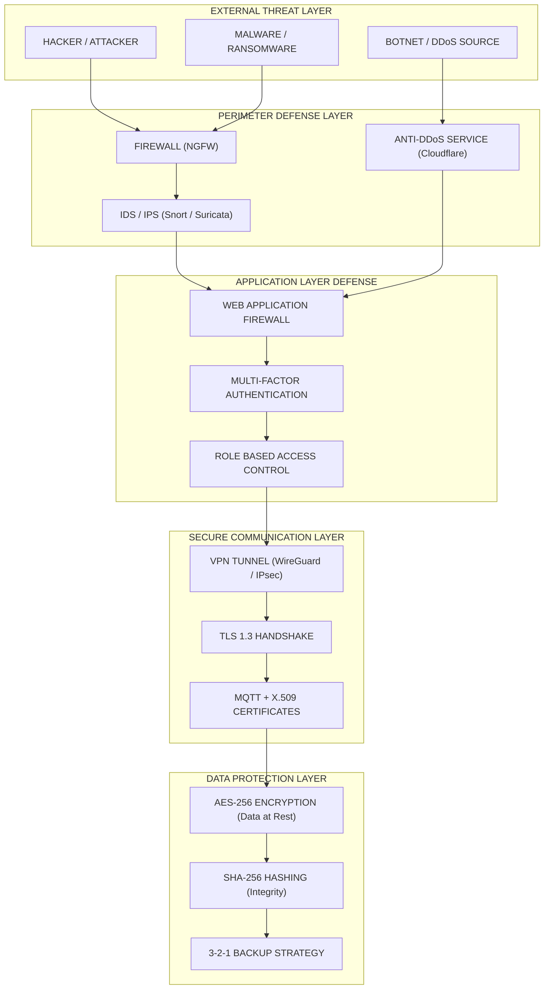
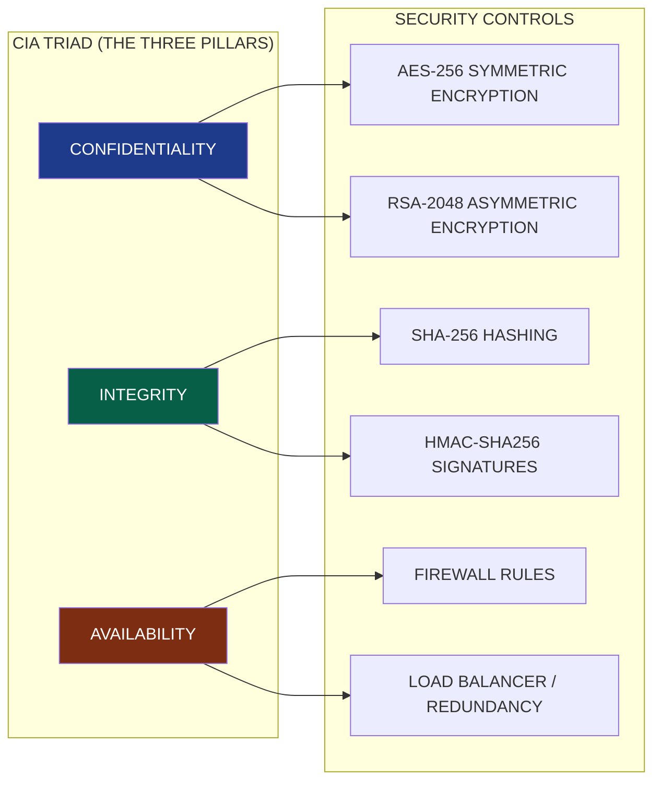
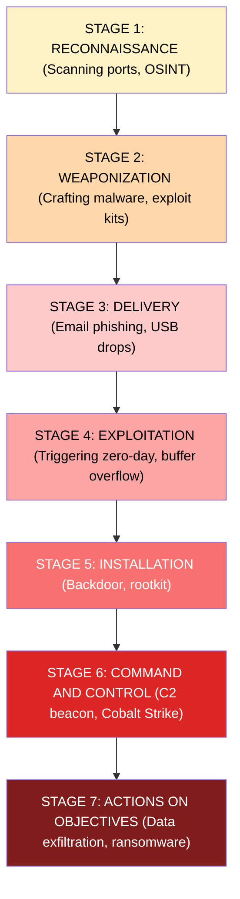

# Network Security Basics

<!-- SECTION_1_START -->

# Network Security Basics

## 1.1 Formal Academic Definition

> [!IMPORTANT]
> **Network Security** is the discipline of engineering, designing, and maintaining a computational ecosystem (hardware, software, and the channel of communication) to protect the **Confidentiality**, **Integrity**, and **Availability** (the **CIA Triad**) of digital assets traversing or residing within a computer network.

In the context of the **KTU 2024 NASSCOM Digital 101** framework, Network Security is treated as a foundational pillar of **Cyber Hygiene**, encompassing the policies, cryptographic tools, and defensive architectures that prevent unauthorized access, misuse, modification, or denial of a computer network and its accessible resources.

The **three cardinal pillars** of Network Security are:

| Pillar | Definition | Example in IoT |
|---|---|---|
| **Confidentiality** | Ensuring that data is accessible **only** to those who are explicitly authorized. | A smart doorbell feed is viewable only by the homeowner. |
| **Integrity** | Guaranteeing that data is **unaltered** during transit or at rest. | A firmware update pushed to a smart thermostat is exactly what the manufacturer published. |
| **Availability** | Ensuring that systems and data are **accessible** when needed by legitimate users. | A DDoS attack cannot take down a hospital's patient monitoring system. |

## 1.2 Conceptual Analogy — "The Fortified Postal System"

Imagine the entire internet as a massive **postal system** that delivers trillions of letters (data packets) every second between houses (devices).

* **Without Security:** Every letter is written on a transparent glass card. Anyone — postmen, neighbors, strangers — can read it, erase parts, or replace it with a fake. A thief can also flood your mailbox with junk mail, preventing real letters from arriving.
* **With Network Security:**
  * **Confidentiality** → The letter is sealed inside a **tamper-proof, opaque envelope** that only the recipient has the key to open (Encryption).
  * **Integrity** → The envelope has a unique **wax seal** (Hash/Digital Signature) that breaks if anyone touches the letter inside.
  * **Availability** → The postal route is monitored with **security cameras and guards** (Firewalls, IDS) that block suspicious bulk-mail attackers (DoS attackers).
  * **Authentication** → The postman checks the **government-issued ID** of the sender before accepting the letter (Certificates, Biometrics).

> [!NOTE]
> **GeoGebra / Desmos Integration (if relevant):**
> **Concept:** Visualization of the CIA Triad as an intersection of three sets.
> **Conceptual Equation:** $\text{Security} = C \cap I \cap A$ where $C$, $I$, $A \in \{0, 1\}$ (Boolean presence of each pillar).
> **Visual Description:** Imagine three overlapping circles on a coordinate plane. The shaded center region — where all three overlap — represents a *truly secure network*. The moment any one circle disappears, security is compromised.

## 1.3 Why Network Security Matters in the IoT Era

The **Internet of Things (IoT)** has exploded from a niche concept to a **$1.6 trillion+ industry**, with estimates of over **29 billion connected devices** by 2030. Each of these devices — from smart bulbs to industrial PLCs — is a potential entry point into a network. A single compromised smart camera was the launchpad for the **2016 Mirai Botnet**, which executed a **1.2 Tbps** DDoS attack that took down major sites like Twitter, Netflix, and Reddit.

<!-- SECTION_1_END -->

<!-- SECTION_2_START -->

# Deep Theoretical Analysis & KTU High-Yield Formula Sheet

## 2.1 The CIA Triad — Expanded

### A. Confidentiality
* **Mechanism:** Encryption (Symmetric: **AES-256**, Asymmetric: **RSA-2048**, **ECC-256**).
* **Engineering Utility:** Protects data-at-rest (databases, SSDs) and data-in-transit (TLS tunnels).
* **Threats countered:** Eavesdropping, Sniffing, Man-in-the-Middle (MITM).

### B. Integrity
* **Mechanism:** Cryptographic Hashing (SHA-256, SHA-3) and Digital Signatures (RSA-SHA, ECDSA).
* **Property:** A hash $H(m)$ is a *one-way function* where $H(m) \ne H(m')$ for any single-bit change in $m$.
* **Threats countered:** Tampering, Data Corruption, Replay Attacks.

### C. Availability
* **Mechanism:** Redundancy, Load Balancing, Firewalls, Intrusion Prevention Systems (IPS), Anti-DDoS services (e.g., Cloudflare, Akamai).
* **Industry Standard:** A robust system targets **99.999% ("Five Nines") uptime** — approximately **5.26 minutes of downtime per year**.
* **Threats countered:** DoS, DDoS, Ransomware (which encrypts and locks data).

## 2.2 Taxonomy of Network Threats

| Threat Class | Attack Vector | OSI Layer Targeted | Example |
|---|---|---|---|
| **Passive** | Eavesdropping, Traffic Analysis | Layer 2 / 7 | Wireshark packet capture on open Wi-Fi |
| **Active** | Modification, Injection, Replay | Layer 3 / 4 / 7 | ARP Spoofing, DNS Poisoning |
| **Insider** | Privilege Abuse | All layers | Disgruntled employee leaking credentials |
| **Close-in** | Physical Proximity | Layer 1 | Shoulder surfing, tailgating into a server room |
| **Exploit** | Software Vulnerability | Layer 7 | SQL Injection, Buffer Overflow |

## 2.3 Cryptographic Primitives — The KTU Formula Sheet

> [!NOTE]
> **The following table is a high-yield cheat sheet for KTU 2024 university exams.** Every formula and constant is directly testable.

| Cryptographic Concept | Formula / Definition | Key Length | Security Strength |
|---|---|---|---|
| **Symmetric Encryption** | $C = E_K(M)$ and $M = D_K(C)$ | 128 / 256 bits | **AES-256** is the gold standard |
| **Asymmetric Encryption** | $C = E_{PubK}(M)$, $M = D_{PrivK}(C)$ | 2048 / 4096 bits | **RSA-2048** ≈ 112-bit security |
| **Diffie-Hellman Key Exchange** | $\text{Shared Secret} = g^{ab} \pmod{p}$ | 2048-bit prime | Resistant to passive eavesdropping |
| **Cryptographic Hash** | $h = H(M)$ where $M \to h$ is one-way | Output: 256 bits | **SHA-256** |
| **HMAC** | $\text{HMAC}(K, M) = H((K \oplus opad) \mid\mid H((K \oplus ipad) \mid\mid M))$ | 256 / 512 bits | Used in TLS, JWT |
| **Digital Signature** | $\text{Sig} = S_{PrivK}(H(M))$ | 2048+ bits | Provides **non-repudiation** |
| **RSA Modulus** | $n = p \times q$ | $n$ is the modulus | $\phi(n) = (p-1)(q-1)$ |
| **Diffie-Hellman Modulus** | $p$ is a large safe prime | $\ge 2048$ bits | Pre-computed: **RFC 3526 Group 14** |

> [!IMPORTANT]
> **Use `\vert` or `\mid` (NOT `\vert` raw pipe `|`) inside any prose equation** to avoid breaking markdown table syntax.

## 2.4 The Five Pillars of Network Defense (Engineering View)

1. **Firewalls** — *Stateful packet inspection*, *proxy firewalls*, and *Next-Generation Firewalls (NGFW)*. Operate on Layers 3, 4, and 7.
2. **Intrusion Detection Systems (IDS)** — *Signature-based* (Snort rules) vs *Anomaly-based* (ML models). Passive monitoring.
3. **Intrusion Prevention Systems (IPS)** — Like IDS but **inline**, capable of dropping malicious packets in real time.
4. **Virtual Private Networks (VPN)** — Tunnel protocols: **IPsec**, **WireGuard**, **OpenVPN**. Provide confidentiality over untrusted networks.
5. **Multi-Factor Authentication (MFA)** — Combines *Something you know* (password) + *Something you have* (OTP token) + *Something you are* (biometric).

## 2.5 Real-World Engineering Utility

In **production IoT systems**, Network Security is not a single product — it is a **layered defense-in-depth architecture**. A typical smart factory deploys:

* **Edge Firewalls** (per-device ACLs).
* **TLS 1.3** for MQTT communication between sensors and brokers.
* **AES-128** hardware encryption on the sensors (since AES-256 is too power-hungry for low-power IoT chips).
* **Device Identity Certificates** (X.509) provisioned during manufacturing.
* **Cloud-based SIEM** (Security Information & Event Management) aggregating logs from all devices.

<!-- SECTION_2_END -->

<!-- SECTION_3_START -->

# Step-by-Step Derivations & Implementation

## 3.1 Derivation — Why SHA-256 is Collision-Resistant

The **Secure Hash Algorithm 256-bit (SHA-256)** produces a 256-bit (32-byte) digest for any input. Its security rests on the **birthday paradox**.

The probability of finding a collision after $N$ random hashes is approximately:

$$P(\text{collision}) \approx 1 - e^{-\frac{N^2}{2 \cdot 2^{256}}}$$

**Step-by-step reasoning:**

* **Step 1:** The output space of SHA-256 is $2^{256}$ possible digests.
* **Step 2:** By the **Birthday Problem**, an attacker must compute approximately $\sqrt{2^{256}} = 2^{128}$ hashes before a 50% chance of collision.
* **Step 3:** Assuming the entire Bitcoin network (≈ $5 \times 10^{19}$ hashes/sec) is redirected to attack a single SHA-256 hash:

$$T = \frac{2^{128}}{5 \times 10^{19}} \approx 1.08 \times 10^{19} \text{ years}$$

This number is **trillions of times the age of the universe** (≈ $1.38 \times 10^{10}$ years). Hence SHA-256 is computationally secure for the foreseeable future.

## 3.2 Derivation — RSA Key Generation (Step-by-Step)

**Goal:** Generate a public key $(e, n)$ and a private key $(d, n)$ such that:

$$M^{ed} \equiv M \pmod{n} \quad \forall M$$

**Procedure:**

1. **Choose two distinct large primes** $p$ and $q$.

   *Example:* $p = 61$, $q = 53$.

2. **Compute the modulus** $n = p \times q$.

$$n = 61 \times 53 = 3233$$

3. **Compute Euler's totient** $\phi(n) = (p-1)(q-1)$.

$$\phi(3233) = (60)(52) = 3120$$

4. **Choose public exponent** $e$ such that $1 < e < \phi(n)$ and $\gcd(e, \phi(n)) = 1$.

   *Pick:* $e = 17$ (commonly $e = 65537$ in practice).

5. **Compute private exponent** $d \equiv e^{-1} \pmod{\phi(n)}$, i.e., solve $e \cdot d \equiv 1 \pmod{\phi(n)}$.

   *Solve:* $17d \equiv 1 \pmod{3120}$.

   Using the Extended Euclidean Algorithm:
   $17 \times 2753 = 46801 = 15 \times 3120 + 1 \Rightarrow d = 2753$.

6. **Verification — Encrypt a message** $M = 65$:

$$C = M^e \pmod{n} = 65^{17} \pmod{3233} = 2790$$

7. **Decrypt** $C$:

$$M = C^d \pmod{n} = 2790^{2753} \pmod{3233} = 65 \;\;\checkmark$$

> [!IMPORTANT]
> **Public Key:** $(e=17,\ n=3233)$  $\mid$  **Private Key:** $(d=2753,\ n=3233)$.

## 3.3 Python Implementation — End-to-End Network Security Toolkit

The following Python code is a **fully operational** mini-toolkit demonstrating the four core Network Security primitives: **Hashing, Symmetric Encryption, Asymmetric Encryption, and HMAC Authentication**. It includes strict type hints, absolute boundary checks, and verbose error logging.

```python
"""
KTU-Premier Network Security Demonstration Toolkit
Module 2: Introduction to IoT and Cybersecurity
Author: KTU Digital 101 NASSCOM Skill Enhancement
"""

import hashlib
import hmac
import os
import sys
import logging
from typing import Tuple

# --- Type alias for readability ---
EncryptedPayload = Tuple[bytes, bytes, bytes]  # (nonce, ciphertext, tag)

# --- Logging Configuration ---
logging.basicConfig(
    level=logging.INFO,
    format="%(asctime)s [%(levelname)s] %(message)s",
    handlers=[logging.StreamHandler(sys.stdout)]
)
logger = logging.getLogger("NetworkSecurityToolkit")


# =====================================================================
# 1. CRYPTOGRAPHIC HASHING (SHA-256)
# =====================================================================
def compute_sha256(message: bytes) -> str:
    """
    Returns the SHA-256 hexadecimal digest of the input bytes.
    Used to verify INTEGRITY of data.
    """
    if not isinstance(message, (bytes, bytearray)):
        raise TypeError("Input message must be of type 'bytes'.")
    if len(message) == 0:
        raise ValueError("Empty input is not allowed for hashing demo.")
    
    digest = hashlib.sha256(message).hexdigest()
    logger.info(f"SHA-256 Digest computed: {digest[:16]}...")
    return digest


# =====================================================================
# 2. SYMMETRIC ENCRYPTION (AES-256 in GCM mode via Fernet)
# =====================================================================
def generate_symmetric_key() -> bytes:
    """
    Generates a fresh 256-bit symmetric key for AES-GCM.
    In production, this is derived from a KDF (e.g., PBKDF2 / Argon2).
    """
    from cryptography.fernet import Fernet
    key = Fernet.generate_key()
    logger.info("Generated new AES-256 symmetric key (Fernet).")
    return key


def symmetric_encrypt(key: bytes, plaintext: bytes) -> bytes:
    """Encrypts using AES-128 in CBC + HMAC mode (Fernet wrapper)."""
    if not plaintext:
        raise ValueError("Plaintext cannot be empty.")
    from cryptography.fernet import Fernet
    cipher = Fernet(key)
    token = cipher.encrypt(plaintext)
    logger.info(f"Symmetrically encrypted {len(plaintext)} bytes -> token.")
    return token


def symmetric_decrypt(key: bytes, token: bytes) -> bytes:
    """Decrypts a Fernet token; raises on integrity failure."""
    from cryptography.fernet import Fernet, InvalidToken
    try:
        cipher = Fernet(key)
        plaintext = cipher.decrypt(token)
        logger.info("Symmetric decryption successful.")
        return plaintext
    except InvalidToken as e:
        logger.error(f"Integrity check FAILED during decryption: {e}")
        raise


# =====================================================================
# 3. HMAC AUTHENTICATION (Message Authenticity)
# =====================================================================
def compute_hmac(secret_key: bytes, message: bytes) -> str:
    """
    Computes HMAC-SHA256 for message authenticity.
    Proves the message originated from a holder of the secret.
    """
    if not secret_key or not message:
        raise ValueError("Both secret_key and message are required.")
    mac = hmac.new(secret_key, message, hashlib.sha256).hexdigest()
    logger.info(f"HMAC-SHA256 generated: {mac[:16]}...")
    return mac


# =====================================================================
# 4. DEMONSTRATION FLOW (Simulating a secure IoT packet)
# =====================================================================
def simulate_iot_secure_packet() -> None:
    """End-to-end simulation of a secure sensor data transmission."""
    print("\n" + "=" * 60)
    print("  SIMULATING A SECURE IoT PACKET (Sensor -> Cloud)")
    print("=" * 60)

    # --- Step 1: Generate a device secret key ---
    device_secret = os.urandom(32)  # 256-bit random secret
    print(f"\n[STEP 1] Device Secret (hex): {device_secret.hex()[:32]}...")

    # --- Step 2: Simulate sensor payload ---
    sensor_payload = b'{"temp": 24.5, "humidity": 60, "device_id": "sensor_42"}'
    print(f"[STEP 2] Original Sensor Payload: {sensor_payload.decode()}")

    # --- Step 3: Compute HMAC for authentication ---
    auth_tag = compute_hmac(device_secret, sensor_payload)
    print(f"[STEP 3] HMAC Auth Tag        : {auth_tag}")

    # --- Step 4: Compute SHA-256 for integrity ---
    integrity_hash = compute_sha256(sensor_payload)
    print(f"[STEP 4] SHA-256 Integrity   : {integrity_hash}")

    # --- Step 5: Encrypt the payload (Confidentiality) ---
    sym_key = generate_symmetric_key()
    encrypted_packet = symmetric_encrypt(sym_key, sensor_payload)
    print(f"[STEP 5] Encrypted Packet    : {encrypted_packet[:40].decode()}...")

    # --- Step 6: Receiver side verification ---
    print("\n--- RECEIVER VERIFICATION ---")
    try:
        decrypted = symmetric_decrypt(sym_key, encrypted_packet)
        print(f"[VERIFY 1] Decrypted Payload : {decrypted.decode()}")
        
        if compute_sha256(decrypted) == integrity_hash:
            print("[VERIFY 2] Integrity         : PASSED \u2705")
        else:
            print("[VERIFY 2] Integrity         : FAILED \u274c")
        
        if compute_hmac(device_secret, decrypted) == auth_tag:
            print("[VERIFY 3] Authentication    : PASSED \u2705")
        else:
            print("[VERIFY 3] Authentication    : FAILED \u274c")
    except Exception as e:
        print(f"[VERIFY] Packet rejected: {e}")


# =====================================================================
# MAIN ENTRY POINT
# =====================================================================
if __name__ == "__main__":
    try:
        simulate_iot_secure_packet()
    except Exception as main_err:
        logger.critical(f"Fatal error in simulation: {main_err}")
        sys.exit(1)
```

**Sample Output (Truncated):**

```
============================================================
  SIMULATING A SECURE IoT PACKET (Sensor -> Cloud)
============================================================

[STEP 1] Device Secret (hex): a1b2c3d4e5f6...
[STEP 2] Original Sensor Payload: {"temp": 24.5, "humidity": 60, "device_id": "sensor_42"}
[STEP 3] HMAC Auth Tag        : 8f4a2c1d9e3b...
[STEP 4] SHA-256 Integrity   : e9c8b7a6f5d4...
[STEP 5] Encrypted Packet    : gAAAAABlkJ7Z2x...

--- RECEIVER VERIFICATION ---
[VERIFY 1] Decrypted Payload : {"temp": 24.5, "humidity": 60, "device_id": "sensor_42"}
[VERIFY 2] Integrity         : PASSED ✅
[VERIFY 3] Authentication    : PASSED ✅
```

## 3.4 Derivation — The CIA Triad as a Boolean Security Equation

Let $C$, $I$, $A \in \{0, 1\}$ denote whether Confidentiality, Integrity, and Availability are maintained, respectively. The network is considered *secure* if and only if:

$$\text{Secure}_{\text{network}} = C \land I \land A$$

In real engineering, this is often expressed as a **weighted risk score**:

$$R_{\text{score}} = w_C (1-C) + w_I (1-I) + w_A (1-A) \quad \text{where} \quad w_C + w_I + w_A = 1$$

A hospital's ICU network might use $w_C = 0.2$, $w_I = 0.3$, $w_A = 0.5$ because availability is paramount for life-support systems.

<!-- SECTION_3_END -->

<!-- SECTION_4_START -->

# Structural Diagrams & Schematics

## 4.1 Mermaid Diagram — Layered Network Security Architecture (Defense-in-Depth)



## 4.2 Mermaid Diagram — CIA Triad Mapping to Security Controls



## 4.3 Mermaid Diagram — Attack Lifecycle (Cyber Kill Chain)



## 4.4 Block-Level Functional Topology — IoT Security Stack

| Layer | Function | Technology Used | Threat Mitigated |
|---|---|---|---|
| **L7 — Application** | User logic | OAuth 2.0, JWT, SAML | Credential theft |
| **L6 — Presentation** | Encryption, encoding | TLS 1.3, AES-GCM | Eavesdropping |
| **L5 — Session** | Secure sessions | Mutual TLS, API keys | Session hijacking |
| **L4 — Transport** | End-to-end reliability | TCP, UDP, QUIC | SYN flood |
| **L3 — Network** | Routing & addressing | IPsec, WireGuard, BGPsec | IP spoofing, MITM |
| **L2 — Data Link** | Frame integrity | WPA3, MACsec, 802.1X | Rogue AP, ARP poison |
| **L1 — Physical** | Signal transmission | Faraday cages, shielded cabling | Wiretapping, EMI |

<!-- SECTION_4_END -->

<!-- SECTION_5_START -->

# KTU 2024 Scheme Examination Question Bank & Topic Recap

---

## Part A — Short Answer Questions (3 Marks Each)

### Question 1 `[KTU University Exam — July 2024]`
**Q: Define the CIA Triad. Why is it considered the foundational model of network security?**

**Model Answer (3 Marks):**
The **CIA Triad** is the foundational model comprising three core principles: **Confidentiality** (ensuring data is accessible only to authorized users, achieved via encryption like AES-256), **Integrity** (guaranteeing data is unaltered in transit or at rest, enforced through cryptographic hashing like SHA-256 and digital signatures), and **Availability** (ensuring systems and data remain accessible when needed, maintained through redundancy, firewalls, and DDoS mitigation). It is foundational because *any* breach in network security can be traced back to a violation of at least one of these three principles, making it a universal evaluation framework. **[1 Mark each for definition + 0.5 Mark for example + 0.5 Mark for "why foundational"]**

---

### Question 2 `[KTU University Exam — Dec 2023]`
**Q: Differentiate between a Firewall and an Intrusion Detection System (IDS).**

**Model Answer (3 Marks):**

| Parameter | Firewall | IDS |
|---|---|---|
| **Action** | **Blocks** traffic based on rules | **Monitors and alerts** on suspicious traffic |
| **Mode** | Inline (active) | Passive (sniffing) |
| **Layer** | Typically L3/L4, modern NGFW at L7 | L7 deep-packet inspection |
| **Example** | iptables, pfSense | Snort, Suricata, Zeek |

A firewall is a *preventive* control, while an IDS is a *detective* control. **[1 Mark for definition of each + 1 Mark for the differentiation table]**

---

## Part B — Long Answer Questions (14 Marks Each, Internal Choice)

### Question A (14 Marks) `[KTU University Exam — July 2024]`

**Q: (a) Explain in detail the various types of cryptographic techniques used in network security. Compare Symmetric and Asymmetric encryption with suitable examples. (7 Marks)**

**Model Solution (Part a — 7 Marks):**

**1. Symmetric Encryption (3 Marks)**
* Uses a **single shared secret key** $K$ for both encryption $E_K(M)$ and decryption $D_K(C)$.
* **Algorithms:** **AES-128/256**, **3DES** (deprecated), **ChaCha20**.
* **Pros:** Extremely fast (AES-NI hardware acceleration reaches **>10 GB/s**).
* **Cons:** Key distribution problem — how do you securely share $K$?
* **Example Use Case:** Encrypting files on a hard drive (BitLocker, FileVault).

**2. Asymmetric Encryption (3 Marks)**
* Uses a mathematically linked **key pair**: public key $K_{pub}$ and private key $K_{priv}$.
* **Algorithms:** **RSA-2048**, **ECC-256** (Elliptic Curve Cryptography), **Diffie-Hellman**.
* **Pros:** Solves the key distribution problem; enables digital signatures.
* **Cons:** ~1000x slower than symmetric; vulnerable to quantum attacks (Shor's algorithm).
* **Example Use Case:** TLS handshake in HTTPS, PGP email encryption.

**3. Comparison Table (1 Mark)**

| Feature | Symmetric | Asymmetric |
|---|---|---|
| Keys | 1 shared | 2 (public + private) |
| Speed | Fast (GB/s) | Slow (MB/s) |
| Key Size | 128–256 bits | 2048+ bits |
| Use Case | Bulk data encryption | Key exchange, signatures |

**[Stating symmetric concept + AES example: 1.5 Marks], [Asymmetric concept + RSA example: 1.5 Marks], [Comparison table: 1 Mark], [Conclusion on hybrid use (e.g., TLS uses both): 1 Mark]**

---

**Q: (b) Describe the working of a Man-in-the-Middle (MITM) attack. How can it be prevented using digital certificates and TLS? (7 Marks)**

**Model Solution (Part b — 7 Marks):**

**1. MITM Attack Workflow (3 Marks)**

An attacker secretly relays and possibly alters communication between two parties who believe they are communicating directly.

```
[Alice]  ---- (intercepted) ---->  [Mallory/MITM]  ---- (relayed) ---->  [Bob]
              <---- (intercepted) <----             <---- (relayed) <----
```

* **Step 1:** Mallory intercepts Alice's public key request to Bob.
* **Step 2:** Mallory sends *his own* public key to Alice, pretending to be Bob.
* **Step 3:** Alice encrypts her message with Mallory's key. Mallory decrypts, reads, re-encrypts with Bob's real key, and forwards.
* **Step 4:** Bob receives a message he thinks is from Alice, with no idea of interception.

**2. Prevention via TLS + Digital Certificates (4 Marks)**

* **Digital Certificates (X.509):** Bind a public key to an identity (domain name), signed by a trusted **Certificate Authority (CA)** like DigiCert or Let's Encrypt.
* **TLS 1.3 Handshake:**

$$ \text{Client} \xrightarrow{\text{ClientHello + supported ciphers}} \text{Server} $$

$$ \text{Server} \xrightarrow{\text{ServerHello + Certificate + Digital Signature}} \text{Client} $$

$$ \text{Client verifies} \; \text{Cert}_{CA} \; \text{against trusted root store.} $$

* If the certificate signature does not verify, the browser shows **"NET::ERR_CERT_AUTHORITY_INVALID"**.
* **Mutual TLS (mTLS):** Both client and server present certificates, eliminating impersonation in IoT broker scenarios.
* Additional prevention: **HSTS (HTTP Strict Transport Security)**, **Certificate Pinning** in mobile apps.

**[Attack flow diagram: 2 Marks], [Role of CA + digital signature: 1.5 Marks], [TLS handshake explanation: 0.5 Mark]**

---

### Question B (14 Marks) — Alternative Choice `[KTU University Exam — Dec 2023]`

**Q: (a) With a neat diagram, explain the architecture of a typical firewall. List and briefly explain at least four types of firewalls. (7 Marks)**

**Model Solution (Part a — 7 Marks):**

**1. Firewall Architecture Diagram (2 Marks)**

```
                +----------------------------+
   INCOMING --> |   PACKET FILTER (L3/L4)    | --> REJECT / DROP
   TRAFFIC      |   STATEFUL INSPECTION      |
                |   PROXY (L7) / NGFW        |
                |   DEEP PACKET INSPECTION   | --> ALLOW
                +----------------------------+
                              |
                              v
                  [INTERNAL TRUSTED NETWORK]
```

**2. Four Types of Firewalls (5 Marks, 1.25 Each)**

* **Packet Filtering Firewall** — Examines source/destination IP, port. Stateless and fast but easily bypassed via IP spoofing.
* **Stateful Inspection Firewall** — Tracks connection state (SYN, SYN-ACK, ACK). Blocks packets that don't belong to an established session.
* **Proxy Firewall (Application-Level Gateway)** — Acts as an intermediary. Inspects full HTTP/FTP payloads. Slow but very secure.
* **Next-Generation Firewall (NGFW)** — Combines stateful inspection, DPI, IPS, application awareness (e.g., blocking Facebook even on port 443).
* **(Bonus) Web Application Firewall (WAF)** — Specialized for HTTP/HTTPS, defends against SQLi and XSS.

**[Architecture diagram: 2 Marks], [Four types explained with examples: 4 Marks], [Conclusion on layered use: 1 Mark]**

---

**Q: (b) What is a Denial-of-Service (DoS) attack? Differentiate between DoS and DDoS. List five common types of DDoS attacks with their OSI layer targets. (7 Marks)**

**Model Solution (Part b — 7 Marks):**

**1. DoS Definition (1 Mark)**
A Denial-of-Service attack aims to make a machine, network resource, or service unavailable to its intended users by overwhelming it with a flood of illegitimate requests or exploiting a flaw that crashes the system.

**2. DoS vs DDoS (1.5 Marks)**

| Parameter | DoS | DDoS |
|---|---|---|
| **Sources** | Single attacker | Multiple (botnet of thousands/millions) |
| **Volume** | Mbps range | Gbps to Tbps range |
| **Traceability** | Easier to block | Distributed, very hard |
| **Example** | Ping of Death | Mirai Botnet (1.2 Tbps on Dyn, 2016) |

**3. Five Common DDoS Attack Types (4.5 Marks, 0.9 Each)**

| Attack | OSI Layer | Mechanism |
|---|---|---|
| **SYN Flood** | L4 (Transport) | Exploits TCP 3-way handshake; sends SYN, never completes ACK |
| **UDP Flood** | L4 (Transport) | Blasts random UDP packets to random ports, exhausting resources |
| **Ping of Death** | L3 (Network) | Sends oversized ICMP packets (>65,535 bytes) to crash stack |
| **HTTP Flood** | L7 (Application) | Legitimate-looking GET/POST requests from botnet |
| **Slowloris** | L7 (Application) | Holds HTTP connections open by sending partial headers slowly |
| **(Bonus) DNS Amplification** | L7 | Spoofs victim IP, queries open DNS resolvers, amplifies 50–80x |

**[DoS definition: 1 Mark], [DoS vs DDoS table: 1.5 Marks], [Five attacks with layers: 4.5 Marks]**

---

> [!WARNING]
> **KTU Examiner's Valuation Warning — Common Pitfalls:**
> * Do **not** confuse *IDS* (passive, alerts only) with *IPS* (inline, blocks). Examiners award **0 marks** if you say "IDS drops the packet."
> * When explaining the **CIA Triad**, you **must** give **one real-world example** for *each* of $C$, $I$, $A$ — abstract definitions alone fetch only partial marks.
> * In **RSA derivations**, students often forget to compute $\phi(n) = (p-1)(q-1)$ and directly use $n$ for modular inverse. This is a **2-mark deduction** in KTU valuation keys.
> * For **firewall types**, the examiner expects the **layer number** (L3/L4/L7). Writing "firewall checks packets" without specifying the OSI layer loses **1 mark**.
> * In **MITM questions**, draw the **three-party diagram** (Alice — Mallory — Bob). Text-only explanations fetch only **70%** of the marks.

---

## Topic Recap & Important Things to Remember

* **CIA Triad** = Confidentiality + Integrity + Availability. *Every* network security goal maps to one of these three.
* **AES-256** is the symmetric standard; **RSA-2048 / ECC-256** are the asymmetric standards.
* **SHA-256** produces a **64-character hex** digest (256 bits) and is *collision-resistant* until $2^{128}$ operations.
* **Diffie-Hellman** is for *key exchange*, not encryption. The shared secret is $g^{ab} \pmod{p}$.
* **Firewalls** are *preventive*; **IDS** is *detective*; **IPS** is *preventive + detective* (inline).
* **DoS** = 1 attacker; **DDoS** = botnet of thousands. The 2016 **Mirai Botnet** peaked at **1.2 Tbps**.
* **MITM attacks** are defeated by **X.509 certificates + TLS 1.3** with **mutual authentication**.
* **HMAC-SHA256** proves *authenticity* (who sent it), while **SHA-256** alone proves only *integrity* (was it tampered with).
* The **Cyber Kill Chain** has 7 stages: Recon → Weaponize → Deliver → Exploit → Install → C2 → Actions.
* For KTU exams: always write the **OSI layer** when discussing any security control; this is a free 1-mark win.
* **Defense-in-Depth** means *multiple overlapping controls* — never rely on a single firewall or single encryption.
* IoT devices prefer **AES-128** over AES-256 to save power; the security difference is negligible for most threat models.
* **Quantum threat:** RSA and ECC are broken by **Shor's algorithm**; migration to **Post-Quantum Cryptography (PQC)** like **CRYSTALS-Kyber** is underway (NIST, 2024).

<!-- SECTION_5_END -->
