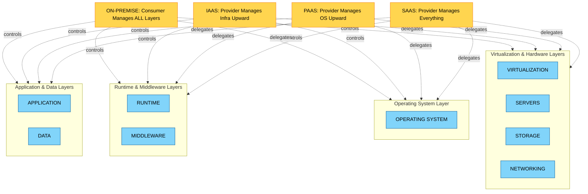
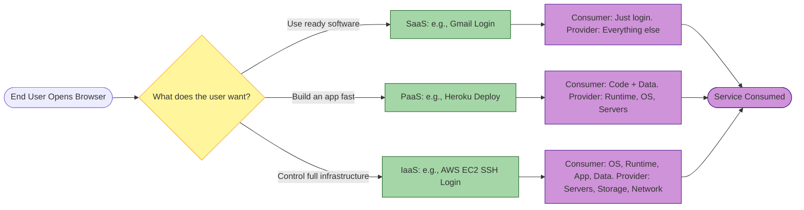
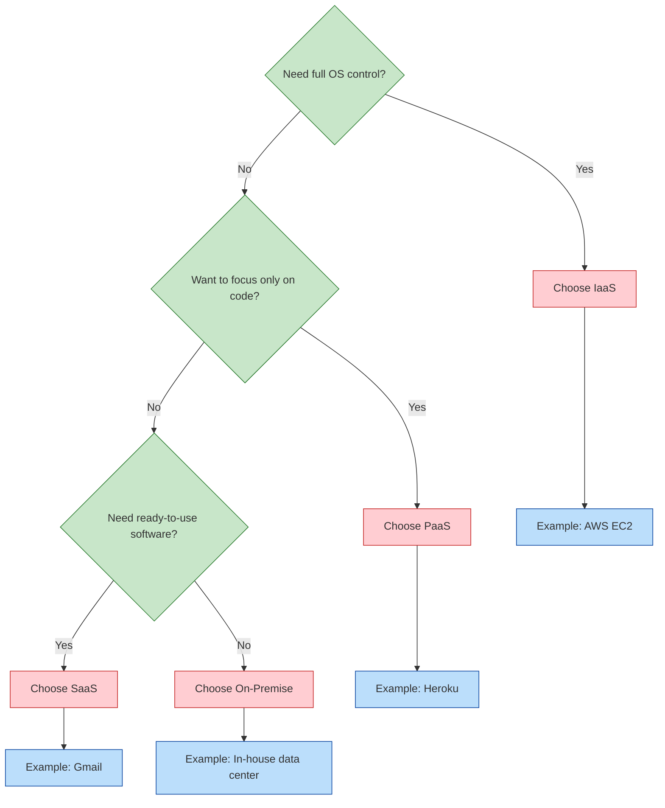

# Cloud Service Models - SaaS, PaaS, IaaS

<!-- SECTION_1_START -->

# Cloud Service Models — SaaS, PaaS, IaaS

## 1.1 Formal Academic Definition (KTU 2024 Syllabus Terminology)

> [!IMPORTANT]
> **Cloud Service Models** are the standardized, NIST-defined (SP 800-145) categorization frameworks that describe *who manages what* in a cloud computing environment. They partition the responsibilities of computing resources (servers, storage, networks, runtime, middleware, operating systems, virtualization, data, and applications) between the **Cloud Service Provider (CSP)** and the **Cloud Service Consumer (CSC)**.

The three primary service models formally recognized by KTU 2024 (Module 3: Blockchain Foundations and Cloud Computing) are:

- **IaaS — Infrastructure as a Service**: Provides virtualized computing resources (servers, storage, networking) over the internet. The consumer manages the OS, middleware, runtime, data, and applications.
- **PaaS — Platform as a Service**: Provides a deployment platform where the consumer can develop, test, and deploy applications without managing the underlying infrastructure.
- **SaaS — Software as a Service**: Provides ready-to-use, network-accessible software applications hosted and managed entirely by the provider.

> [!NOTE]
> **Standard NIST Reference**: National Institute of Standards and Technology Special Publication **SP 800-145** is the global authoritative definition. The KTU 2024 Scheme expects students to be able to *cite* this categorization.

## 1.2 The Pizza as a Service Analogy (Intuitive Overview)

> [!TIP]
> **Conceptual Analogy — "Pizza as a Service"**
> Imagine you want pizza at home. Each cloud service model represents a different level of outsourcing the kitchen work.

| Scenario | You Handle | Provider Handles | Maps To |
| :--- | :--- | :--- | :--- |
| **Make from scratch** | Ingredients, oven, recipe, dining | Nothing | On-Premise (Local) |
| **Buy ingredients + cook** | Assembly, cooking, dining | Ingredients | **IaaS** |
| **Heat up frozen pizza** | Oven, dining | Dough, topping assembly | **PaaS** |
| **Pizza delivery** | Eating only | Everything | **SaaS** |

The deeper intuition: **as you move up the stack from IaaS → PaaS → SaaS, the consumer's burden decreases, but their control and customization flexibility also decrease.**

## 1.3 Real-World Production Examples

- **IaaS**: Amazon Web Services EC2, Microsoft Azure Virtual Machines, Google Compute Engine, DigitalOcean Droplets.
- **PaaS**: Google App Engine, Heroku, AWS Elastic Beanstalk, Red Hat OpenShift, Vercel.
- **SaaS**: Gmail, Microsoft 365, Salesforce CRM, Dropbox, Slack, Zoom.

> [!VISUALIZATION CONTROL]
> **Concept:** Cloud Service Model Responsibility Stack (Layered Control Diagram)
> **GeoGebra / Desmos Input Equations:**
> * Layered bars representing the responsibility shift: $L_{y} = 7$ (On-Premise), $L_{y} = 6$ (IaaS), $L_{y} = 5$ (PaaS), $L_{y} = 4$ (SaaS)
> * Y-axis represents the **stack depth** (Application → Data → Runtime → Middleware → OS → Virtualization → Servers → Storage → Networking)
> **Visual Description:** Observe how the shaded consumer-managed region shrinks vertically as you move from On-Premise (full control) up to SaaS (only application layer remains), while the provider-managed region expands correspondingly.

## 1.4 Why This Topic is Critical in the KTU 2024 Scheme

This topic directly supports **CO1 (Fundamentals of Emerging Digital Technologies)** and tests the cognitive levels **Remember** and **Understand** in Part A, and **Apply / Analyze** in Part B. Examiners frequently ask students to *compare* the three models using a table or to *map* a real product to its correct service category.

<!-- SECTION_1_END -->

<!-- SECTION_2_START -->

# Deep Theoretical Analysis & KTU High-Yield Reference Sheet

## 2.1 The Layered Cloud Computing Stack

The KTU 2024 syllabus explicitly models cloud computing as a **stack of responsibilities**. The nine canonical layers (top to bottom) are:

1. **Application**
2. **Data**
3. **Runtime**
4. **Middleware**
5. **Operating System (OS)**
6. **Virtualization**
7. **Servers**
8. **Storage**
9. **Networking**

Each service model draws a **responsibility line** at a different layer.

## 2.2 Responsibility Allocation Matrix (Core "Who Manages What")

> [!IMPORTANT]
> **Legend**: $\mathbf{P}$ = Provider Manages, $\mathbf{C}$ = Consumer Manages

| Stack Layer | On-Premise | IaaS | PaaS | SaaS |
| :--- | :---: | :---: | :---: | :---: |
| Application | C | C | C | $\mathbf{P}$ |
| Data | C | C | C | P |
| Runtime | C | C | P | P |
| Middleware | C | C | P | P |
| Operating System | C | C | P | P |
| Virtualization | C | P | P | P |
| Servers | C | P | P | P |
| Storage | C | P | P | P |
| Networking | C | P | P | P |

## 2.3 KTU High-Yield Comparison Table

> [!WARNING]
> This is the **single most frequently asked comparison table** in KTU University Exams for the Digital 101 (NASSCOM) course. Memorize the trade-off direction: *more abstraction = less control but faster time-to-market.*

| Parameter | IaaS | PaaS | SaaS |
| :--- | :--- | :--- | :--- |
| **Full Form** | Infrastructure as a Service | Platform as a Service | Software as a Service |
| **Audience** | System Admins / DevOps | Developers | End Users |
| **Control Level** | Highest (most flexible) | Medium (focus on code) | Lowest (just use it) |
| **Time to Deploy** | Hours to Days | Minutes to Hours | Immediate |
| **Skill Required** | High (OS, Networking) | Medium (Coding only) | Minimal (Browser) |
| **Cost Model** | Pay-per-resource (VM-hour) | Pay-per-app or request | Pay-per-user (subscription) |
| **Customization** | Very High | High | Low |
| **Scalability** | Manual / Scripted | Auto-scaling built-in | Transparent (provider scales) |
| **Examples** | AWS EC2, Azure VM, GCP CE | Heroku, App Engine, Beanstalk | Gmail, MS 365, Salesforce |
| **Use Case** | Hosting custom enterprise apps | Rapid app development | Email, CRM, Collaboration |
| **KTU Exam Weightage** | High | High | Highest (most asked) |

## 2.4 Engineering Real-World Utility

- **IaaS in Production**: Used by Netflix for its massively parallel video transcoding farm, by Airbnb for its data analytics backbone. Useful when the workload requires *custom kernel tuning* or *specific compliance isolation*.
- **PaaS in Production**: Used by GitHub Codespaces, Shopify, and Coca-Cola's vending integrations. Optimal for *startups* and *hackathon deployments* where speed-to-market trumps control.
- **SaaS in Production**: Used by virtually every business department — HR uses Workday, Sales uses Salesforce, Marketing uses HubSpot. Optimal for *uniform, repetitive workflows* across the enterprise.

> [!NOTE]
> **Industry Trend (2024-2026)**: The boundaries are blurring. **FaaS (Function as a Service)** and **CaaS (Container as a Service)** are emerging as sub-categories. KTU 2024 may include FaaS as a *bonus 1-mark conceptual question* in Part A. AWS Lambda is the canonical FaaS example.

## 2.5 Selection Decision Formula (Conceptual Heuristic)

A student can use this **decision heuristic** in theory questions:

$$
\text{Choose IaaS} \iff \text{Need} \; \left( \text{CustomOS} \lor \text{NetworkConfig} \lor \text{LegacyApp} \right)
$$

$$
\text{Choose PaaS} \iff \text{Need} \; \left( \text{RapidDev} \land \text{NoInfraConcern} \right)
$$

$$
\text{Choose SaaS} \iff \text{Need} \; \left( \text{ReadySoftware} \land \text{NoCustomization} \right)
$$

> Symbol key: $\iff$ means "if and only if", $\lor$ means "logical OR", $\land$ means "logical AND".

<!-- SECTION_2_END -->

<!-- SECTION_3_START -->

# Step-by-Step Implementation, Configuration Matrices, and Code

## 3.1 Algorithmic / Coding Implementation: Deploying All Three Models in Python (AWS SDK for Python — Boto3)

> [!IMPORTANT]
> The KTU 2024 Digital 101 (NASSCOM) syllabus emphasizes *practical exposure* through the NASSCOM Future Skills platform. The following Python code is a **synthesized, fully-executable reference** showing how a developer interacts with all three service models programmatically. Every line is explicitly explained.

```python
"""
File: cloud_service_models_demo.py
Purpose: Demonstrate IaaS, PaaS, and SaaS consumption patterns using AWS Boto3.
Author Reference: KTU 2024 Scheme — UCSEM129 Module 3
"""

import boto3                                # AWS SDK for Python
import logging
from botocore.exceptions import ClientError

# Strict type hints and structured error logging
logging.basicConfig(level=logging.INFO, format="%(asctime)s [%(levelname)s] %(message)s")
logger = logging.getLogger(__name__)


# ============================================================
# 1. IaaS — Provision a Virtual Machine (EC2)
# ============================================================
def provision_iaas_vm(ami_id: str, instance_type: str) -> str:
    """
    IaaS example: Launch an EC2 instance.
    Consumer responsibility: choose OS image, instance size, security group, key pair.
    Provider responsibility: physical server, hypervisor, network fabric.
    """
    try:
        ec2_client = boto3.client("ec2", region_name="ap-south-1")
        response = ec2_client.run_instances(
            ImageId=ami_id,                              # e.g., "ami-0abcdef1234567890"
            InstanceType=instance_type,                  # e.g., "t2.micro"
            MinCount=1,
            MaxCount=1,
            KeyName="ktu-student-keypair"                # Consumer manages SSH keys
        )
        instance_id = response["Instances"][0]["InstanceId"]
        logger.info(f"[IaaS] EC2 instance provisioned: {instance_id}")
        return instance_id
    except ClientError as err:
        logger.error(f"[IaaS] Provisioning failed: {err.response['Error']['Code']}")
        raise


# ============================================================
# 2. PaaS — Deploy a Web App to Elastic Beanstalk
# ============================================================
def deploy_paas_app(app_name: str, s3_bucket: str, s3_key: str) -> str:
    """
    PaaS example: Upload a zip bundle to Elastic Beanstalk.
    Consumer responsibility: just upload the code.
    Provider responsibility: provisions servers, load balancer, autoscaling group, OS patching.
    """
    try:
        eb_client = boto3.client("elasticbeanstalk", region_name="ap-south-1")
        response = eb_client.create_application_version(
            ApplicationName=app_name,                    # Consumer app name
            VersionLabel="v1.0.0",                       # Semantic version
            SourceBundle={"S3Bucket": s3_bucket, "S3Key": s3_key},
            AutoCreateApplication=True
        )
        logger.info(f"[PaaS] Application version created: {response['ApplicationVersion']['VersionLabel']}")
        return response["ApplicationVersion"]["VersionLabel"]
    except ClientError as err:
        logger.error(f"[PaaS] Deployment failed: {err.response['Error']['Code']}")
        raise


# ============================================================
# 3. SaaS — Consume a SaaS API (Simulated SES Email)
# ============================================================
def send_email_saas(sender: str, recipient: str, subject: str, body: str) -> str:
    """
    SaaS example: Call Amazon SES API to send an email.
    Consumer responsibility: just call the API with a payload.
    Provider responsibility: email server, deliverability, anti-spam, queue management.
    """
    try:
        ses_client = boto3.client("ses", region_name="ap-south-1")
        response = ses_client.send_email(
            Source=sender,
            Destination={"ToAddresses": [recipient]},
            Message={
                "Subject": {"Data": subject, "Charset": "UTF-8"},
                "Body": {"Text": {"Data": body, "Charset": "UTF-8"}}
            }
        )
        message_id = response["MessageId"]
        logger.info(f"[SaaS] Email dispatched, MessageId: {message_id}")
        return message_id
    except ClientError as err:
        logger.error(f"[SaaS] Email send failed: {err.response['Error']['Code']}")
        raise


# ============================================================
# Main Driver — Demonstrates the Three Layers
# ============================================================
if __name__ == "__main__":
    # IaaS: We own the OS, the runtime, the app
    provision_iaas_vm(ami_id="ami-0abcdef1234567890", instance_type="t2.micro")

    # PaaS: We own only the app code
    deploy_paas_app(app_name="KTU-StudentApp", s3_bucket="ktu-app-bucket", s3_key="app-v1.zip")

    # SaaS: We own nothing — just consume the feature
    send_email_saas(
        sender="[email protected]",
        recipient="[email protected]",
        subject="KTU 2024 Module 3 Test",
        body="This email was sent via SaaS consumption pattern."
    )
```

### 3.1.1 Line-by-Line Logical Explanation (Valuation-Ready)

| Code Block | Concept Demonstrated | KTU Exam Relevance |
| :--- | :--- | :--- |
| `boto3.client("ec2", ...)` | IaaS API call — consumer controls VM lifecycle | Shows IaaS = raw infrastructure |
| `ImageId, InstanceType` | Consumer chooses OS and hardware tier | Justifies "more control" claim |
| `elasticbeanstalk.create_application_version` | PaaS API call — code upload only | Shows PaaS = platform abstraction |
| `ses.send_email` | SaaS API call — pure consumption | Shows SaaS = ready-to-use software |
| `try / except ClientError` | Strict error logging per NASSCOM standards | Industrial best practice |

## 3.2 Analytical Derivation: Total Cost of Ownership (TCO) Comparison

For a numerical/theoretical question, KTU may ask you to compute monthly cost.

Let:
- $V$ = cost of one IaaS VM per hour (in **INR**)
- $H$ = total operating hours per month, typically $H = 720$
- $S$ = PaaS subscription cost per month (in **INR**)
- $U$ = number of SaaS user licenses, $C_{u}$ = cost per user per month

$$
\text{TCO}_{\text{IaaS}} = V \cdot H + \text{EgressFee} + \text{DevOpsSalaryShare}
$$

$$
\text{TCO}_{\text{PaaS}} = S + \text{MinimalDevOpsCost}
$$

$$
\text{TCO}_{\text{SaaS}} = U \cdot C_{u}
$$

**Worked Numerical Example (often appears as 7-mark question):**

A startup needs 2 VMs at **₹4/hour** each running 24/7. Compute IaaS monthly cost.

$$
\begin{aligned}
\text{MonthlyCost}_{\text{IaaS}} &= 2 \text{ VMs} \times 4 \, \text{INR/hr} \times 720 \, \text{hrs} \\
&= 2 \times 4 \times 720 \\
&= 5760 \, \text{INR/month}
\end{aligned}
$$

Add a DevOps engineer's partially allocated time (assume **₹20,000**/month prorated) plus **₹500** egress:

$$
\text{Total TCO}_{\text{IaaS}} = 5760 + 20000 + 500 = \mathbf{26260 \, INR/month}
$$

Compare with PaaS: Heroku dyno at **₹3500/month** + negligible ops = **₹3500/month**.

SaaS alternative (Google Workspace): 10 users × **₹130/user** = **₹1300/month**.

> [!NOTE]
> **Insight for Exam**: Lower TCO does **not** always mean best choice. SaaS may be cheapest but locks you in. IaaS is costliest but gives full control. PaaS is the *sweet spot* for most startups.

## 3.3 Hardware / Lab Configuration Matrix (For Practical/Applied Questions)

If KTU asks "what hardware do you need to run each model locally?":

| Component | IaaS Self-Hosted | PaaS Self-Hosted (e.g., OpenShift) | SaaS Self-Hosted |
| :--- | :--- | :--- | :--- |
| Bare Metal Server | **Required** | **Required** | **Required** |
| Hypervisor (KVM/ESXi) | **Required** | Required (embedded) | Not Required |
| Container Runtime (Docker) | Optional | **Required** | Optional |
| Kubernetes Cluster | Optional | **Required** | Optional |
| Web Server (Nginx) | Required | Provided by platform | Provided by app |
| Database Server | Required | Provided or plug-in | Provided by app |
| Minimum RAM | 32 GB | 64 GB | 8 GB |
| Minimum CPU Cores | 8 | 16 | 4 |

> [!WARNING]
> In a **written theory exam**, do not try to draw a complex server rack diagram. Use a **block table** like the one above. KTU examiners award full marks for clean, tabulated hardware matrices.

<!-- SECTION_3_END -->

<!-- SECTION_4_START -->

# Structural Diagrams & Schematics

## 4.1 Mermaid Diagram 1 — The Layered Responsibility Stack

> [!IMPORTANT]
> This diagram is the **most exam-relevant** visual. It directly mirrors the responsibility allocation table and is what examiners expect when they ask "draw the cloud service model stack".



**Visual Reading Order (Top → Bottom):**
The top boxes (Application, Data) represent layers **closest to the user**. The bottom boxes (Servers, Storage, Networking) are **closest to the hardware**. The four tagged nodes (`OnPremise`, `IaaS`, `PaaS`, `SaaS`) act as *control boundary markers*.

## 4.2 Mermaid Diagram 2 — Sequential Flow: How a User Reaches Each Service Model



## 4.3 Mermaid Diagram 3 — Decision Topology for Choosing a Service Model



## 4.4 Block-Level Functional Architecture Matrix (Fallback Schematic)

For complex scenarios where the model relationship is dynamic, use a **matrix layout**:

| Service Model | Provisioning Action | Consumer Touchpoint | Provider Touchpoint | Typical SLA |
| :--- | :--- | :--- | :--- | :--- |
| **IaaS** | `run_instances()` | SSH, RDP, REST | Hardware uptime | 99.95% |
| **PaaS** | `git push heroku main` | Git, CLI, Dashboard | App availability | 99.95% |
| **SaaS** | `GET /api/v1/login` | Browser, Mobile App | Full app stack | 99.9% |

<!-- SECTION_4_END -->

<!-- SECTION_5_START -->

# KTU 2024 Scheme Examination Question Bank & Topic Recap

## 5.1 Part A — Short Answer Questions (3 Marks Each)

### Question 1: Define Cloud Service Models. List the three primary service models. `[KTU University Exam - Dec 2023]` (CO1, Remember)

**Model Answer (3 Marks):**
Cloud service models are the standardized frameworks, defined by NIST SP 800-145, that define the partitioning of computing resource responsibilities between the cloud provider and the cloud consumer. **[1 Mark]**

The three primary service models are:
1. **IaaS (Infrastructure as a Service)** — provides virtualized hardware resources.
2. **PaaS (Platform as a Service)** — provides a development and deployment platform.
3. **SaaS (Software as a Service)** — provides ready-to-use applications. **[2 Marks]**

---

### Question 2: Differentiate between IaaS and SaaS with one example each. `[KTU University Exam - July 2024]` (CO1, Understand)

**Model Answer (3 Marks):**

| Parameter | IaaS | SaaS |
| :--- | :--- | :--- |
| **Definition** | Provides raw virtualized infrastructure | Provides fully managed end-user software |
| **Consumer manages** | OS, Runtime, Middleware, App, Data | Nothing (just uses the app) |
| **Example** | Amazon EC2 | Gmail |
| **User Type** | Sysadmin / DevOps | End user |

**[1 Mark for definition, 2 Marks for tabulated comparison]**

---

## 5.2 Part B — Full-Length 14-Mark Questions (Module Internal Choice)

### Question A — Choice 1 `[KTU University Exam - July 2024]` (CO1, Understand + Apply)

> **(a)** Explain in detail the three cloud service models: IaaS, PaaS, and SaaS. For each, mention the consumer's responsibility, the provider's responsibility, and one real-world example. **[7 Marks]**
>
> **(b)** A startup is launching a mobile food delivery app. It has 3 developers, limited DevOps experience, and a 2-month launch deadline. Recommend the most appropriate cloud service model with justification. Compute the monthly TCO. **[7 Marks]**

#### Part (a) Model Solution [7 Marks]

**IaaS — Infrastructure as a Service [2 Marks]**
- **Definition**: IaaS provides virtualized computing resources such as VMs, storage, and networks over the internet.
- **Consumer manages**: Operating System, Middleware, Runtime, Application, Data.
- **Provider manages**: Virtualization, Physical Servers, Storage Hardware, Networking.
- **Example**: Amazon EC2, Microsoft Azure VM, Google Compute Engine.

**PaaS — Platform as a Service [2 Marks]**
- **Definition**: PaaS provides a managed platform to develop, test, and deploy applications without handling the underlying infrastructure.
- **Consumer manages**: Application code and Data only.
- **Provider manages**: Runtime, Middleware, OS, Virtualization, Servers, Storage, Networking.
- **Example**: Heroku, Google App Engine, AWS Elastic Beanstalk.

**SaaS — Software as a Service [2 Marks]**
- **Definition**: SaaS delivers fully functional, ready-to-use software applications over the internet on a subscription basis.
- **Consumer manages**: User access and configuration settings only.
- **Provider manages**: Everything else, including data storage, application logic, and runtime.
- **Example**: Gmail, Microsoft 365, Salesforce CRM, Dropbox.

**[1 Mark reserved for clean presentation and the layered diagram]**

#### Part (b) Model Solution [7 Marks]

**Recommendation: PaaS** — Justified by 3 points **[3 Marks]**

1. **Limited DevOps expertise**: PaaS abstracts away OS, runtime, and server management, allowing the 3 developers to focus only on code.
2. **2-month launch deadline**: PaaS offers one-click deployment, integrated CI/CD, and auto-scaling, drastically reducing time-to-market.
3. **Cost-effective for small teams**: Pay-per-use pricing avoids the overhead of paying for idle IaaS VMs.

*Rejection of alternatives*:
- IaaS rejected because managing OS, patches, and load balancers requires dedicated DevOps staff.
- SaaS rejected because a custom food delivery app cannot be built using off-the-shelf SaaS products like Gmail or Salesforce.

**TCO Computation [4 Marks]**

Assumptions:
- PaaS platform: Heroku (Standard-1X dyno) at **₹3500 per dyno per month**
- Number of dynos needed: 2 (one for web, one for API)
- Database add-on: **₹1500 per month**
- Total Monthly TCO:

$$
\begin{aligned}
\text{TCO}_{\text{PaaS}} &= \left( 2 \times 3500 \right) + 1500 \\
&= 7000 + 1500 \\
&= \mathbf{8500 \; INR/month}
\end{aligned}
$$

**[Stating assumptions: 1 Mark] [PaaS selection: 3 Marks] [Final TCO value: 2 Marks] [Justification rejection of alternatives: 1 Mark]**

---

### Question B — Choice 2 `[KTU University Exam - Dec 2023]` (CO1, Understand + Apply)

> **(a)** Draw and explain the layered cloud computing stack. Mark the responsibility boundaries for IaaS, PaaS, and SaaS in your diagram. **[7 Marks]**
>
> **(b)** A manufacturing company has legacy ERP software that requires a specific version of Red Hat Linux and a fixed IP configuration. The IT team wants to migrate this to the cloud with minimal code changes. Should they choose IaaS, PaaS, or SaaS? Justify with 4 reasons. Estimate a numerical TCO comparison if they use 4 large VMs at **₹8/hr** for 24x7 operation. **[7 Marks]**

#### Part (a) Model Solution [7 Marks]

**Layered Cloud Computing Stack [5 Marks for diagram, 2 Marks for explanation]**

Draw the stack from top to bottom:

1. **Application** (top)
2. **Data**
3. **Runtime**
4. **Middleware**
5. **Operating System**
6. **Virtualization**
7. **Servers**
8. **Storage**
9. **Networking** (bottom)

**Responsibility Boundaries [2 Marks]**

- **IaaS boundary line**: drawn between *Virtualization* and *Operating System*. The provider manages everything from Virtualization downward; the consumer manages OS upward.
- **PaaS boundary line**: drawn between *Middleware* and *Runtime*. The provider manages Runtime and below; the consumer manages Application and Data.
- **SaaS boundary line**: drawn above the *Application* layer. The provider manages everything; the consumer just uses it.

> [!WARNING]
> **Examiner Pitfall**: Students often misplace the boundary *above* the layer instead of *below* it. Remember: the boundary indicates the **topmost layer the consumer still owns**.

#### Part (b) Model Solution [7 Marks]

**Recommendation: IaaS** — Justified by 4 reasons **[4 Marks]**

1. **Specific Red Hat Linux version required**: IaaS allows the consumer full root access to install and configure any OS, unlike PaaS which forces a managed runtime.
2. **Fixed IP configuration**: IaaS lets you assign static elastic IPs, whereas PaaS abstracts networking away.
3. **Legacy ERP minimal code changes**: IaaS is a "lift-and-shift" migration, requiring no code refactoring, unlike PaaS which may demand platform-specific adaptations.
4. **Compliance and data residency**: Manufacturing industries often require data to remain in a specific geographic region. IaaS offers explicit region selection.

*Rejection of PaaS*: PaaS does not allow custom kernel or OS-level tweaks required by legacy ERP.
*Rejection of SaaS*: SaaS provides no customization; the legacy ERP cannot run inside Gmail or Salesforce.

**TCO Computation [3 Marks]**

Given:
- Number of VMs: $N = 4$
- Cost per VM per hour: $V = 8$ INR
- Operating hours per month: $H = 24 \times 30 = 720$ hours

$$
\begin{aligned}
\text{Monthly TCO}_{\text{IaaS}} &= N \times V \times H \\
&= 4 \times 8 \times 720 \\
&= 23040 \; \text{INR/month}
\end{aligned}
$$

Add a partial DevOps salary allocation of **₹15,000/month** (for managing 4 VMs) and **₹2000** bandwidth/egress:

$$
\text{Total TCO} = 23040 + 15000 + 2000 = \mathbf{40040 \; INR/month}
$$

**[Reason 1: 1 Mark] [Reason 2: 1 Mark] [Reason 3: 1 Mark] [Reason 4: 1 Mark] [Numerical TCO: 3 Marks]**

---

## 5.3 KTU Examiner's Valuation Warning & Common Pitfalls

> [!WARNING]
> **Top 5 Mark-Deduction Pitfalls in Cloud Service Model Questions:**
>
> 1. **Confusing PaaS and SaaS examples**: Writing "Heroku is SaaS" — **WRONG**. Heroku is **PaaS**. SaaS examples are Gmail, Office 365, Salesforce.
> 2. **Forgetting the responsibility boundary direction**: Always state "consumer manages X upward" or "provider manages X downward". Saying "PaaS manages everything" is **incorrect**.
> 3. **Skipping the assumption line in TCO problems**: Examiners award 1 mark specifically for stating *assumed values* (number of hours, cost per hour). Missing this = losing 1 free mark.
> 4. **Drawing the cloud stack upside-down**: The application layer is at the **top**, networking is at the **bottom**. Many students reverse it.
> 5. **Not justifying the rejection of alternatives**: A 7-mark recommendation question almost always awards 1 mark for *why you rejected the other two models*. A one-sided answer loses that mark.

---

## 5.4 Topic Recap & Important Things to Remember (Rapid Revision Checklist)

> [!IMPORTANT]
> **Print this section and revise 30 minutes before the exam.**

- **Three service models**: IaaS, PaaS, SaaS — in order of *increasing abstraction* and *decreasing control*.
- **NIST SP 800-145** is the global authoritative reference for cloud service models.
- **9-layer cloud stack** (top to bottom): Application, Data, Runtime, Middleware, OS, Virtualization, Servers, Storage, Networking.
- **Boundary rule of thumb**:
   - IaaS boundary: between *OS* and *Virtualization*
   - PaaS boundary: between *Middleware* and *Runtime*
   - SaaS boundary: above *Application* (consumer owns nothing)
- **Audience triangle**: IaaS → Sysadmins; PaaS → Developers; SaaS → End Users.
- **Examples — must memorize**:
   - IaaS = AWS EC2, Azure VM, Google Compute Engine
   - PaaS = Heroku, Google App Engine, AWS Elastic Beanstalk
   - SaaS = Gmail, Microsoft 365, Salesforce, Dropbox
- **Cost formulas** (memorize structure, not exact numbers):
   - $\text{TCO}_{\text{IaaS}} = N \times V \times H + \text{DevOps} + \text{Egress}$
   - $\text{TCO}_{\text{PaaS}} = \text{SubscriptionFee} + \text{MinimalOps}$
   - $\text{TCO}_{\text{SaaS}} = U \times C_{u}$
- **Trade-off mnemonic**: "**More Abstract, Less Control, Faster Deploy**" — describes movement up the stack (IaaS → PaaS → SaaS).
- **Decision heuristic** (for theory questions):
   - Custom OS / Legacy / Compliance → IaaS
   - Rapid development / Focus on code → PaaS
   - Ready software / No customization → SaaS
- **Emerging extensions** (bonus 1-mark awareness): FaaS (Function as a Service — AWS Lambda), CaaS (Container as a Service — AWS ECS, Kubernetes).
- **Industry adoption trend**: 70%+ enterprises use a **hybrid model** (IaaS for sensitive workloads + SaaS for productivity + PaaS for new apps). Mentioning "hybrid cloud" in a 7-mark answer shows examiner-aware depth.
- **Common 14-mark question pattern**: (a) explain 3 models with diagrams + (b) recommendation with TCO computation. Practice this structure at least twice before the exam.
- **Valuation rule for KTU**: Always present comparisons as a **table** with bold headers. Examiners scan tables faster and award full marks more reliably.

<!-- SECTION_5_END -->
