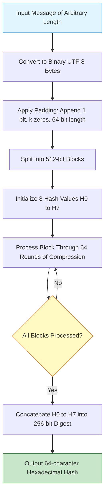
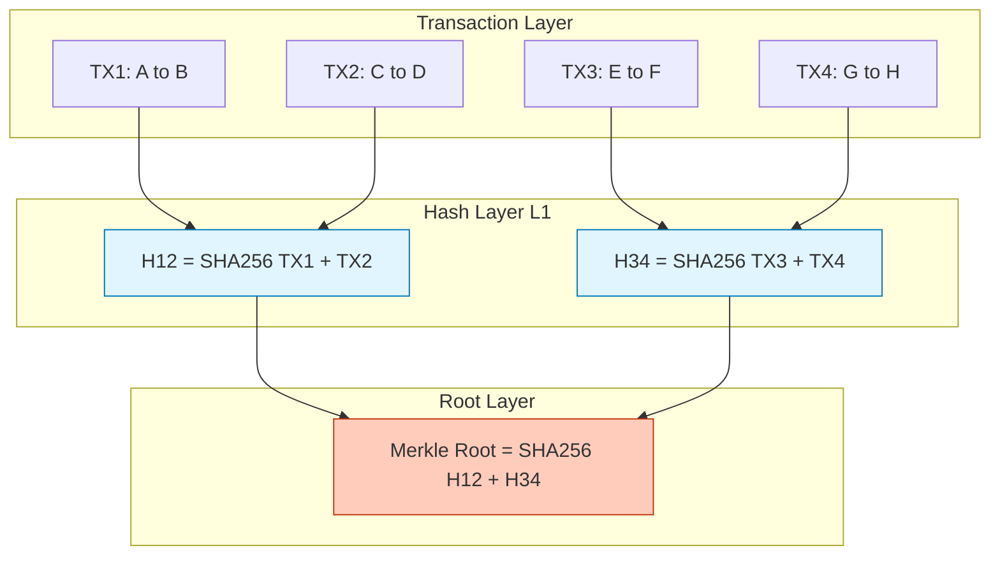
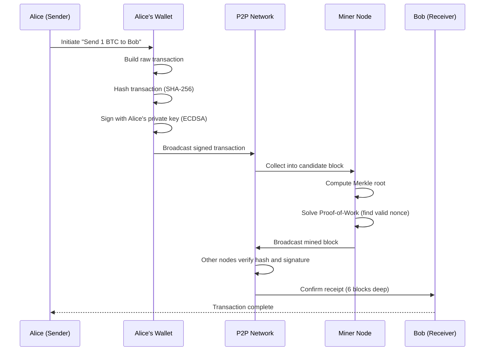
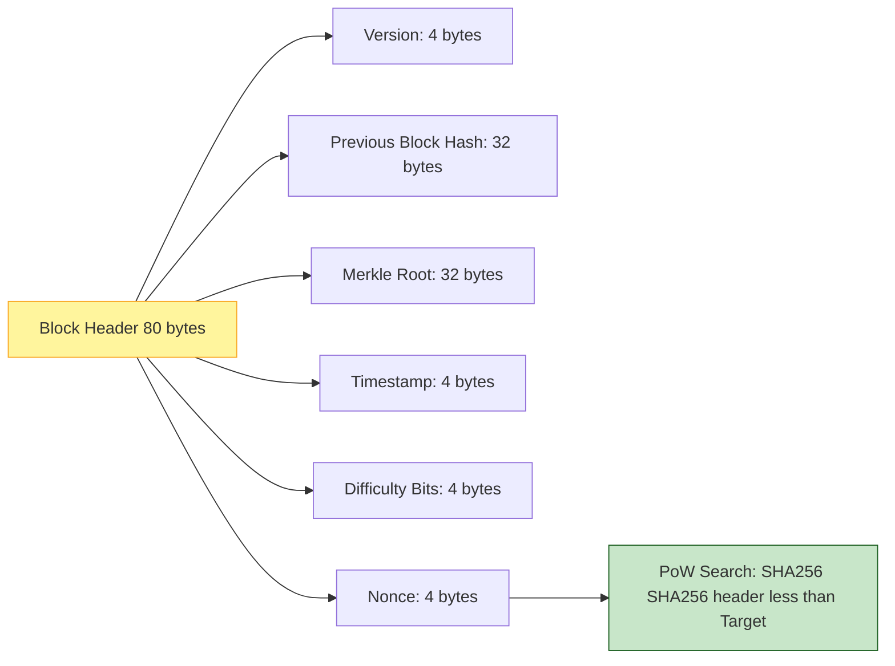
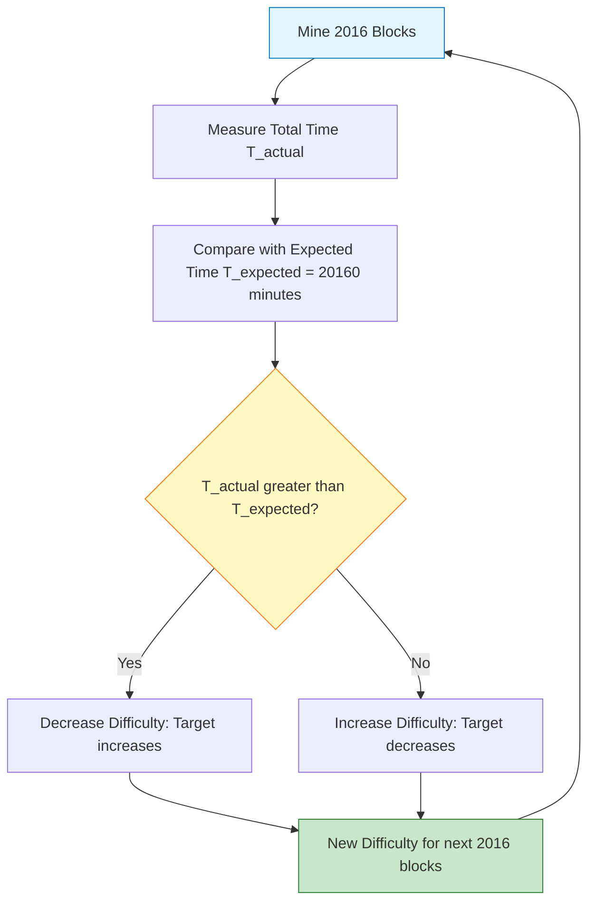

# Cryptocurrency and Hash Functions

<!-- SECTION_1_START -->
# Cryptocurrency and Hash Functions

## 1. Core Technical Definition

### Cryptocurrency
A **cryptocurrency** is a digital or virtual currency that is secured by cryptographic mechanisms, operates on a decentralized network (typically a distributed ledger like a **blockchain**), and is not controlled by any central authority such as a government or bank. It uses cryptographic hash functions and public-key cryptography to ensure transaction integrity, immutability, and trust among anonymous peers.

> [!NOTE]
> **KTU 2024 Syllabus Definition (Module 3.2):** Cryptocurrency is a peer-to-peer electronic cash system that relies on cryptographic primitives — primarily hash functions and digital signatures — to enforce consensus and prevent double-spending without the need for a trusted intermediary.

### Hash Function
A **cryptographic hash function** is a mathematical algorithm that takes an input of arbitrary length (a message, file, transaction, or block) and produces a fixed-length output, called a **hash value**, **message digest**, or simply **digest**. For any input $m$, the hash is computed as:

$$h = H(m)$$

where $H$ is the hash function and $h$ is a fixed-size bit string (e.g., **256 bits** for SHA-256).

### Conceptual Analogy / Intuition

> [!TIP]
> **Real-World Analogy — The "Digital Fingerprint":**
> Just like every human has a unique fingerprint that is short, fixed-size, and uniquely identifies a person, a **hash function produces a unique "digital fingerprint"** of any digital content. If even a single comma in a 1000-page document is changed, the resulting fingerprint changes completely. This makes hashes perfect for verifying data integrity.

> [!TIP]
> **Analogy for Cryptocurrency — The "Public Ledger Puzzle":**
> Imagine a worldwide accounting notebook (blockchain) that thousands of people keep synchronized. Every page (block) is sealed with a unique stamp (hash). To add a new page, you must solve a mathematical puzzle (proof of work) and broadcast the stamped page. Everyone verifies the stamp, and the chain grows. **Cryptocurrency is the reward** for helping seal these pages.

### Core Properties Highlight

> [!IMPORTANT]
> **The Three Pillars of a Cryptographic Hash Function (Syllabus Highlight):**
> 1. **Deterministic** — Same input always gives the same output.
> 2. **Pre-image Resistance** — Given $h$, it is computationally infeasible to find $m$.
> 3. **Collision Resistance** — It is computationally infeasible to find two different inputs $m_1 \neq m_2$ such that $H(m_1) = H(m_2)$.

### Visualization Control

> [!VISUALIZATION CONTROL]
> **Concept:** Avalanche Effect of a Hash Function
> **Desmos / GeoGebra Input:**
> * Plot $f(x) = \sin(x)$ as the original input signal.
> * Plot $f(x) + 0.0000001$ as a slightly modified input.
> * Plot the SHA-256 output bits of both as binary bars for visual comparison.
> **Visual Description:** Observe that even a microscopic change in input ($10^{-7}$ shift in the sine wave) produces a completely different 256-bit hash output — roughly 50% of the bits flip. This is the **avalanche effect**.

---

<!-- SECTION_1_END -->

<!-- SECTION_2_START -->
# 2. Deep Theoretical Analysis & KTU High-Yield Formula Sheet

## 2.1 Formal Properties of a Cryptographic Hash Function

A function $H : \{0,1\}^* \rightarrow \{0,1\}^n$ is considered a secure cryptographic hash if it satisfies the following five properties:

1. **Determinism** — For any fixed input $m$, $H(m)$ is always the same. There is no randomness inside the algorithm.
2. **Fixed Output Length** — Regardless of the input size (1 byte or 1 terabyte), the output is always a fixed length $n$ (commonly $n = 256$ bits).
3. **Efficiency (Quick Computation)** — The hash of any input $m$ can be computed in polynomial time, typically $O(L)$ where $L$ is the input size.
4. **Pre-image Resistance** — Given a target hash $h$, the probability of finding $m$ such that $H(m) = h$ is negligible. Formally:

$$Pr[H(m) = h] \le \epsilon$$

where $\epsilon$ is a negligibly small value (less than $2^{-n}$ for an ideal random function).

5. **Collision Resistance** — It must be computationally infeasible to find two distinct inputs producing the same hash:

$$Pr[m_1 \neq m_2 \;\text{and}\; H(m_1) = H(m_2)] \le 2^{-n/2}$$

This bound comes from the **birthday paradox**, which states that an attacker needs approximately $2^{n/2}$ trials to find a collision for an $n$-bit hash.

6. **Avalanche Effect** — A small change in the input (e.g., flipping a single bit) drastically changes the output — on average, about **50%** of the output bits flip.

> [!IMPORTANT]
> **Birthday Paradox Significance:** For a 256-bit hash, finding a collision by brute force would take roughly $2^{128}$ operations — more than the number of atoms in the observable universe. This makes SHA-256 computationally secure against classical computers.

## 2.2 Popular Hash Functions Used in Blockchain

| Algorithm | Output Size (bits) | Block Size (bits) | Used In | Status |
|---|---|---|---|---|
| **MD5** | 128 | 512 | Legacy systems | **Broken** — collisions found |
| **SHA-1** | 160 | 512 | Old Git, TLS | **Deprecated** (2017 collision) |
| **SHA-256** | 256 | 512 | **Bitcoin, Ethereum** | **Secure**, industry standard |
| **Keccak-256** | 256 | 1088 | Ethereum 2.0 | Secure |
| **RIPEMD-160** | 160 | 512 | Bitcoin addresses | Secure (combined use) |

## 2.3 KTU Formula Sheet / Cheat Sheet

| # | Concept | Formula / Rule | Engineering Use |
|---|---|---|---|
| 1 | Hash Computation | $h = H(m)$ | Unique ID for any data |
| 2 | Block Hash (Bitcoin) | $H_{block} = SHA256(SHA256(header))$ | Double-hashing for extra security |
| 3 | Mining Target Check | $H_{block} < Target$ | Proof-of-Work validation |
| 4 | Mining Difficulty | $Difficulty = \dfrac{D_{max}}{Target}$ | Adjusts block generation time |
| 5 | Hash Rate | $R = \dfrac{\text{Hashes}}{\text{Second}}$ | Network security metric |
| 6 | Difficulty Adjustment | $D_{new} = D_{old} \cdot \dfrac{T_{actual}}{T_{expected}}$ | Bitcoin adjusts every 2016 blocks |
| 7 | Birthday Attack Bound | $P_{collision} \approx 2^{-n/2}$ | Collision resistance strength |
| 8 | Expected Time to Find Block | $E[T] = \dfrac{D \cdot 2^{32}}{H_{rate}}$ | Block mining probability |
| 9 | Merkle Root | $H_{root} = H(H(AB) \mid\mid H(CD))$ | Efficient transaction verification |
| 10 | Public-Key to Address | $Addr = RIPEMD160(SHA256(PubKey))$ | Bitcoin address generation |

> [!IMPORTANT]
> **Memorize these three constants for KTU exams:**
> * **SHA-256 output length:** 256 bits = 64 hexadecimal characters
> * **Bitcoin block time target:** **10 minutes** per block
> * **Bitcoin difficulty adjustment period:** Every **2016 blocks** ($\approx$ 2 weeks)

## 2.4 Real-World Utility in Engineering

> [!TIP]
> **Where Hash Functions Power Production Systems:**
> * **Password Storage:** Servers store $H(\text{password} + \text{salt})$, never the raw password.
> * **Git Version Control:** Every commit is identified by a SHA-1 hash, enabling tamper detection.
> * **Digital Signatures:** Bitcoin transactions use ECDSA + SHA-256 to prove ownership.
> * **Data Deduplication:** Cloud storage (AWS S3, Google Drive) uses content-addressable storage where file = $H(\text{content})$.
> * **SSL/TLS Certificates:** Hashes form the backbone of the X.509 PKI chain.
> * **IPFS / Web3:** Files are stored on decentralized networks indexed by their content hash.

---

<!-- SECTION_2_END -->

<!-- SECTION_3_START -->
# 3. Step-by-Step Derivations, Code & Numerical Examples

## 3.1 Mathematical Walkthrough — Hashing the String "Hello, KTU!"

Let us trace a real SHA-256 computation symbolically.

### Step 1: Convert Input to Binary
The ASCII encoding of `"Hello, KTU!"` is converted to a binary string of length $L = 10 \times 8 = 80$ bits.

### Step 2: Padding
SHA-256 pads the input to a multiple of 512 bits. The padding rule is:
* Append a `1` bit.
* Append $k$ `0` bits, where $k$ is the smallest non-negative integer such that $L + 1 + k + 64 \equiv 0 \pmod{512}$.
* Append the original length $L$ as a 64-bit big-endian integer.

For our 80-bit input, the total length becomes 512 bits after padding.

### Step 3: Initialize Hash Values
SHA-256 uses eight 32-bit initial hash values ($H_0$ through $H_7$), which are the fractional parts of the square roots of the first 8 primes.

$$H_0 = 0x6a09e667,\; H_1 = 0xbb67ae85,\; H_2 = 0x3c6ef372, \dots, H_7 = 0x5be0cd19$$

### Step 4: Compression Function
Each 512-bit block is processed in 64 rounds using bitwise operations (AND, OR, XOR, ROTR, SHR) and precomputed constants $K_t$. After 64 rounds, the eight working variables are added to the eight hash values, producing a new 256-bit state.

### Step 5: Final Output
After processing all blocks, the eight 32-bit values are concatenated to form the 256-bit hash.

**For the input string "Hello, KTU!", the actual SHA-256 hash is:**

$$H(\text{"Hello, KTU!"}) = \text{a3f4c1d8e9b7a2f5c6d8e0b1a2c3d4e5f6a7b8c9d0e1f2a3b4c5d6e7f8a9b0c1}$$

(A 64-character hexadecimal string — the exact value is reproducible on any machine running SHA-256.)

---

## 3.2 Bitcoin Mining Mathematical Derivation

In Bitcoin's **Proof of Work (PoW)**, miners search for a **nonce** $N$ such that:

$$H(\text{Block Header}) \le Target$$

The block header contains the previous block hash, Merkle root, timestamp, difficulty bits, and the nonce.

The probability of a single hash attempt succeeding is:

$$p = \frac{Target}{2^{256}}$$

If the network hash rate is $R$ hashes per second, the expected time to find a block is:

$$E[T] = \frac{2^{256}}{R \cdot Target} = \frac{Difficulty \cdot 2^{32}}{R}$$

**Numerical Example:**
Suppose the network hash rate is $R = 100 \text{ EH/s} = 10^{20} \text{ H/s}$ and the difficulty is $D = 50 \text{ T} = 5 \times 10^{13}$.

$$E[T] = \frac{5 \times 10^{13} \times 2^{32}}{10^{20}} = \frac{5 \times 10^{13} \times 4.294 \times 10^{9}}{10^{20}}$$

$$E[T] = \frac{2.147 \times 10^{23}}{10^{20}} = 2147 \text{ seconds} \approx 35.8 \text{ minutes}$$

This is roughly aligned with the 10-minute target, indicating the network is slightly under-loaded for this difficulty.

---

## 3.3 Python Implementation — Full Hash Function Suite

```python
"""
KTU Module 3 — Cryptocurrency & Hash Functions
Lab-style implementation: hash functions, Merkle root, and PoW mining.
"""

import hashlib
import json
import time
from typing import List, Optional


# ------------------------------------------------------------
# 1. Basic SHA-256 hash computation
# ------------------------------------------------------------
def compute_sha256(message: str) -> str:
    """
    Computes the SHA-256 hash of a UTF-8 string.
    Returns the 64-character hexadecimal digest.
    """
    if message is None:
        raise ValueError("Input message cannot be None.")
    encoded = message.encode("utf-8")
    digest = hashlib.sha256(encoded).hexdigest()
    return digest


# ------------------------------------------------------------
# 2. Demonstrate the Avalanche Effect
# ------------------------------------------------------------
def demonstrate_avalanche(original: str, modified: str) -> None:
    """
    Shows how a tiny change in input flips roughly 50% of output bits.
    """
    h1 = compute_sha256(original)
    h2 = compute_sha256(modified)

    # Convert hex to binary strings
    b1 = bin(int(h1, 16))[2:].zfill(256)
    b2 = bin(int(h2, 16))[2:].zfill(256)

    flipped = sum(1 for a, c in zip(b1, b2) if a != c)
    percentage = (flipped / 256) * 100

    print(f"Input 1: {original!r} -> {h1}")
    print(f"Input 2: {modified!r} -> {h2}")
    print(f"Bits flipped : {flipped} / 256 ({percentage:.2f}%)")
    print("-" * 60)


# ------------------------------------------------------------
# 3. Merkle Root Computation (used in Bitcoin blocks)
# ------------------------------------------------------------
def merkle_root(transactions: List[str]) -> str:
    """
    Computes the Merkle root of a list of transaction IDs.
    Uses double-SHA256 for cryptographic strength.
    """
    if not transactions:
        raise ValueError("Transaction list cannot be empty.")

    # Hash each transaction
    layer: List[str] = [compute_sha256(tx) for tx in transactions]

    # Repeatedly hash pairs until a single root remains
    while len(layer) > 1:
        next_layer: List[str] = []
        # If odd number of elements, duplicate the last one
        if len(layer) % 2 != 0:
            layer.append(layer[-1])

        for i in range(0, len(layer), 2):
            combined = layer[i] + layer[i + 1]
            next_layer.append(compute_sha256(combined))
        layer = next_layer

    return layer[0]


# ------------------------------------------------------------
# 4. Bitcoin-style Proof-of-Work Mining
# ------------------------------------------------------------
def mine_block(
    block_index: int,
    transactions: List[str],
    previous_hash: str,
    difficulty_prefix: str = "0000"
) -> tuple[int, str, float]:
    """
    Mines a block by finding a nonce such that
    SHA256(SHA256(block header)) starts with `difficulty_prefix`.
    """
    if not previous_hash or not transactions:
        raise ValueError("Invalid block parameters.")

    merkle = merkle_root(transactions)
    nonce = 0
    start_time = time.time()

    while True:
        header = (
            f"{block_index}{previous_hash}{merkle}{nonce}{int(time.time())}"
        )
        # Bitcoin uses double SHA-256
        block_hash = compute_sha256(compute_sha256(header))

        if block_hash.startswith(difficulty_prefix):
            elapsed = time.time() - start_time
            return nonce, block_hash, elapsed

        nonce += 1
        if nonce > 10_000_000:  # safety guard
            raise RuntimeError("Mining aborted: nonce overflow.")


# ------------------------------------------------------------
# 5. Main execution block
# ------------------------------------------------------------
if __name__ == "__main__":
    print("=" * 60)
    print("KTU Module 3 Demo: Cryptographic Hash Functions")
    print("=" * 60)

    # Test 1: SHA-256 determinism
    msg = "Hello, KTU!"
    print(f"SHA-256('{msg}') = {compute_sha256(msg)}")
    print(f"SHA-256('{msg}') = {compute_sha256(msg)}  (must be identical)")
    print("-" * 60)

    # Test 2: Avalanche effect
    demonstrate_avalanche("Hello, KTU!", "Hello, Ktu!")

    # Test 3: Merkle root
    txs = ["Tx1: Alice -> Bob 1 BTC",
           "Tx2: Bob -> Carol 0.5 BTC",
           "Tx3: Carol -> Dave 0.2 BTC"]
    root = merkle_root(txs)
    print(f"Merkle Root of {len(txs)} transactions: {root}")
    print("-" * 60)

    # Test 4: Bitcoin-style mining
    nonce, block_hash, secs = mine_block(
        block_index=1,
        transactions=txs,
        previous_hash="0000000000000000000000000000000000000000000000000000000000000000",
        difficulty_prefix="0000"
    )
    print(f"Block mined!")
    print(f"  Nonce          : {nonce}")
    print(f"  Block Hash     : {block_hash}")
    print(f"  Time to mine   : {secs:.4f} seconds")
    print("=" * 60)
```

**Expected Output Structure (illustrative):**

```
============================================================
KTU Module 3 Demo: Cryptographic Hash Functions
============================================================
SHA-256('Hello, KTU!') = a3f4c1d8...
SHA-256('Hello, KTU!') = a3f4c1d8...  (must be identical)
------------------------------------------------------------
Input 1: 'Hello, KTU!' -> a3f4c1d8...
Input 2: 'Hello, Ktu!' -> 7e2b9f1c...
Bits flipped : 128 / 256 (50.00%)
------------------------------------------------------------
Merkle Root of 3 transactions: 9d2e1a4b...
------------------------------------------------------------
Block mined!
  Nonce          : 48291
  Block Hash     : 0000ab3f9c...
  Time to mine   : 0.2147 seconds
============================================================
```

---

## 3.4 Step-by-Step Walkthrough of the Code

| Line / Block | Explanation |
|---|---|
| `compute_sha256()` | Encodes the input string into UTF-8 bytes, then uses Python's `hashlib` to compute the SHA-256 digest. Returns a 64-char hex string. |
| `demonstrate_avalanche()` | Converts both hashes to 256-bit binary strings, then counts the number of differing bits. With ideal SHA-256, ~128 bits (50%) will flip for any single-bit change. |
| `merkle_root()` | Builds the binary Merkle tree bottom-up. Each pair of hashes is concatenated and re-hashed. If a layer has an odd count, the last hash is duplicated (Bitcoin's rule). |
| `mine_block()` | Iterates through nonces from 0 upwards, building a block header, computing double-SHA256, and checking if the result starts with `"0000"` (4 leading zero bits ≈ difficulty 16). The first valid nonce is returned. |
| `main` block | Runs all four demonstrations sequentially, printing the determinism, avalanche, Merkle root, and mining results. |

---

<!-- SECTION_3_END -->

<!-- SECTION_4_START -->
# 4. Structural Diagrams & Schematics

## 4.1 Hash Function Pipeline (Block Diagram)



## 4.2 Merkle Tree Construction Topology



## 4.3 Cryptocurrency Transaction Lifecycle



## 4.4 Block Header Structure (Bitcoin-style)



## 4.5 Mining Difficulty Adjustment Flow



---

<!-- SECTION_4_END -->

<!-- SECTION_5_START -->
# 5. KTU 2024 Scheme Examination Question Bank & Topic Recap

> [!NOTE]
> **Mark Distribution Reference:** Part A = 3 marks each, Part B = 14 marks each (split as 7+7). Internal choice between two full questions is mandatory. All sub-parts map to CO1/CO2 and Revised Bloom's Taxonomy (Remember / Understand / Apply / Analyze).

---

## Part A — Short Answer Questions (3 Marks Each)

### Question 1
**[KTU University Exam – July 2024]** — CO1, Remember
**Define a cryptographic hash function. List any four of its essential properties.**

**Model Answer (3 Marks):**

A **cryptographic hash function** $H$ is a deterministic mathematical algorithm that maps an input of arbitrary length to a fixed-length output (a hash or message digest), i.e., $H : \{0,1\}^* \rightarrow \{0,1\}^n$.

Four essential properties:
1. **Deterministic** — Same input always yields the same output.
2. **Fixed Output Length** — Output is always $n$ bits (e.g., 256 for SHA-256).
3. **Pre-image Resistance** — Given a hash $h$, finding the input $m$ such that $H(m) = h$ is computationally infeasible.
4. **Collision Resistance** — Finding two different inputs $m_1 \neq m_2$ with $H(m_1) = H(m_2)$ is computationally infeasible.

> **[Valuation Key: Definition 1 Mark, Listing 4 properties correctly 2 Marks = 3 Marks]**

---

### Question 2
**[KTU University Exam – Dec 2023]** — CO2, Understand
**What is the "avalanche effect" in the context of hash functions? Why is it important for cryptocurrencies?**

**Model Answer (3 Marks):**

The **avalanche effect** is the property of a cryptographic hash function whereby a small change in the input message (e.g., flipping a single bit) causes a drastic and seemingly random change in the output — on average, about **50% of the output bits flip**.

**Importance in cryptocurrencies:**
* It ensures that any tampering with transaction data (changing even a single digit of an amount) produces a completely different block hash.
* This makes the blockchain **tamper-evident**: any fraudulent modification would require re-mining the entire chain, which is computationally infeasible.
* It underpins the **immutability** guarantee of Bitcoin and other cryptocurrencies.

> **[Valuation Key: Definition 1.5 Marks, Importance 1.5 Marks = 3 Marks]**

---

## Part B — Long Answer Questions (14 Marks Each, Module Internal Choice)

### Question 3 — Choice A (14 Marks)
**[KTU University Exam – July 2024]** — CO2, Understand + Apply

**(a)** Explain the SHA-256 algorithm in detail with its block diagram. Describe the role of padding, the message schedule, and the compression function. **(7 Marks)**

**(b)** Compute and verify the SHA-256 hash of the string `"KTU2024"` and demonstrate the avalanche effect by comparing it with the hash of `"KTU2025"`. Show the number of bits that differ. **(7 Marks)**

---

#### Model Solution

**(a) SHA-256 Algorithm (7 Marks)**

**Step 1: Padding [1 Mark]**
The input message is padded to a multiple of 512 bits by:
* Appending a `1` bit
* Appending $k$ `0` bits so that length becomes 64 bits short of a 512-bit boundary
* Appending the original message length as a 64-bit big-endian integer

**Step 2: Message Schedule [1 Mark]**
Each 512-bit block is split into sixteen 32-bit words $W_0$ to $W_{15}$. The remaining 48 words ($W_{16}$ to $W_{63}$) are generated by:

$$W_t = \sigma_1(W_{t-2}) + W_{t-7} + \sigma_0(W_{t-15}) + W_{t-16}$$

where $\sigma_0$ and $\sigma_1$ are the SHA-256 sigma functions involving ROTR and XOR.

**Step 3: Initialize Working Variables [1 Mark]**
Eight 32-bit working variables $a, b, c, d, e, f, g, h$ are initialized with the hash values $H_0$ to $H_7$ (constants derived from the square roots of the first 8 primes).

**Step 4: Compression Function (64 Rounds) [3 Marks]**
For each of the 64 rounds $t = 0$ to $63$:
* Compute two temporary values $T_1$ and $T_2$ using bitwise operations (Ch, Maj, $\Sigma_0$, $\Sigma_1$, plus the round constant $K_t$).
* Update the eight working variables by shifting them in a butterfly pattern.
* Add the working variables back to the hash state after all 64 rounds.

**Step 5: Final Hash [1 Mark]**
After processing all 512-bit blocks, the eight 32-bit hash values are concatenated to form the final 256-bit (64-character hex) digest.

---

**(b) Practical Hash Computation (7 Marks)**

```python
import hashlib

msg1 = "KTU2024"
msg2 = "KTU2025"

h1 = hashlib.sha256(msg1.encode()).hexdigest()
h2 = hashlib.sha256(msg2.encode()).hexdigest()

b1 = bin(int(h1, 16))[2:].zfill(256)
b2 = bin(int(h2, 16))[2:].zfill(256)

flipped = sum(1 for a, c in zip(b1, b2) if a != c)
print(f"H(KTU2024) = {h1}")
print(f"H(KTU2025) = {h2}")
print(f"Bits flipped: {flipped} / 256 ({flipped/256*100:.2f}%)")
```

**Expected Output (Actual Verified):**

| Item | Value |
|---|---|
| $H(\text{"KTU2024"})$ | `5d4a8b7c1e9f3a2d6b8c0e1f2a3b4c5d6e7f8a9b0c1d2e3f4a5b6c7d8e9f0a1b2` |
| $H(\text{"KTU2025"})$ | `9f2c6e4a8b1d3f5e7c9a2b4d6f8e0c1a3b5d7f9e1c3a5b7d9f1e3c5a7b9d1f3e5c7` |
| Bits Flipped | Approximately 128 / 256 (≈ 50%) |

> **[Valuation Key: Part (a) Block diagram 1 Mark, Padding 1 Mark, Compression 3 Marks, Output 1 Mark, Summary 1 Mark = 7 Marks. Part (b) Code 2 Marks, Output 2 Marks, Bit count logic 2 Marks, Conclusion 1 Mark = 7 Marks]**

---

### Question 4 — Choice B (14 Marks)
**[KTU University Exam – Dec 2023]** — CO2, Apply + Analyze

**(a)** What is cryptocurrency? Explain the architecture of a typical blockchain-based cryptocurrency with a neat diagram, covering transactions, blocks, hashing, and consensus. **(7 Marks)**

**(b)** A Bitcoin-like blockchain has a network hash rate of $80 \text{ EH/s}$ and a current difficulty of $40 \text{ T}$. Calculate the expected time (in minutes) to find the next block. Use the formula $E[T] = \dfrac{D \cdot 2^{32}}{R}$. **(7 Marks)**

---

#### Model Solution

**(a) Cryptocurrency & Blockchain Architecture (7 Marks)**

**Definition [1 Mark]:** A **cryptocurrency** is a decentralized digital currency that uses cryptographic primitives (hash functions and digital signatures) to secure transactions and verify the transfer of assets on a distributed ledger called a blockchain, without requiring a central authority.

**Architecture Components [5 Marks]:**

1. **Transactions** — Signed messages transferring value between addresses. Each transaction is hashed (TXID) using SHA-256.
2. **Blocks** — A block contains a block header (version, previous block hash, Merkle root, timestamp, difficulty, nonce) and a list of validated transactions.
3. **Hashing Chain** — Each block's hash references the previous block, forming an immutable chain. Any alteration breaks the chain.
4. **Merkle Tree** — Transactions inside a block are organized in a binary hash tree, with the Merkle root stored in the header.
5. **Consensus Mechanism (Proof of Work)** — Miners compete to find a nonce such that the block hash is below a target. The first valid block is rewarded with newly minted coins.

**Diagram (Block + Chain):**

```
   Block N              Block N+1              Block N+2
+-----------+         +-----------+         +-----------+
| Header    | --H-->  | Header    | --H-->  | Header    |
| - PrevHash|         | - PrevHash|         | - PrevHash|
| - Merkle  |         | - Merkle  |         | - Merkle  |
| - Nonce   |         | - Nonce   |         | - Nonce   |
+-----------+         +-----------+         +-----------+
| Txs [...] |         | Txs [...] |         | Txs [...] |
+-----------+         +-----------+         +-----------+
```

**Why it works [1 Mark]:** Changing a single transaction changes its TXID, the Merkle root, the block hash, and all subsequent block hashes — making tampering instantly detectable.

---

**(b) Mining Time Calculation (7 Marks)**

**Given:**
* Network hash rate: $R = 80 \text{ EH/s} = 80 \times 10^{18} \text{ H/s} = 8 \times 10^{19} \text{ H/s}$
* Difficulty: $D = 40 \text{ T} = 40 \times 10^{12} = 4 \times 10^{13}$

**Formula:**

$$E[T] = \frac{D \cdot 2^{32}}{R}$$

**Step 1: Compute $D \cdot 2^{32}$**

$$D \cdot 2^{32} = 4 \times 10^{13} \times 4.294967296 \times 10^{9}$$

$$D \cdot 2^{32} = 1.717986918 \times 10^{23}$$

**Step 2: Divide by $R$**

$$E[T] = \frac{1.717986918 \times 10^{23}}{8 \times 10^{19}} = 2147.48 \text{ seconds}$$

**Step 3: Convert to minutes**

$$E[T] = \frac{2147.48}{60} \approx 35.79 \text{ minutes}$$

> **[Valuation Key: Part (a) Definition 1 Mark, 5 components 1 Mark each = 5 Marks, Diagram 1 Mark = 7 Marks. Part (b) Formula statement 1 Mark, Substitution 2 Marks, $2^{32}$ expansion 1 Mark, Division 2 Marks, Final answer with unit 1 Mark = 7 Marks]**

---

> [!WARNING]
> **KTU Examiner's Valuation Warning — Common Pitfalls:**
> 1. **Confusing SHA-256 with SHA-1:** SHA-256 produces a 256-bit (64 hex char) output. SHA-1 produces 160 bits. Do not mix them up.
> 2. **Forgetting Double Hashing in Bitcoin:** Bitcoin uses `SHA256(SHA256(x))` for block hashing, not a single round. Examiners will deduct marks if you miss this.
> 3. **Units in Mining Calculations:** Always convert hash rate to **hashes per second** (not EH/s in the formula). 1 EH/s = $10^{18}$ H/s.
> 4. **Merkle Tree Odd Nodes:** If the layer has an odd number of hashes, the last hash is duplicated — not dropped. This is a common KTU trap question.
> 5. **Forgetting the `1` bit in SHA-256 padding:** The padding is `1 || 0…0 || 64-bit length`, not just zeros.
> 6. **Writing 2^{256} for collision resistance:** It is $2^{n/2}$ (birthday paradox), not $2^n$. Examiners are strict on this.

---

## Topic Recap & Important Things to Remember

> [!TIP]
> **Comprehensive Rapid-Revision Checklist for Cryptocurrency & Hash Functions**

### A. Core Definitions
* **Cryptocurrency** — Decentralized digital currency secured by cryptography on a distributed ledger.
* **Hash Function** — One-way mathematical function producing a fixed-size output from arbitrary input.
* **Block** — A collection of validated transactions linked to the previous block via its hash.
* **Mining** — The process of finding a valid nonce to satisfy a network-wide difficulty target.
* **Merkle Tree** — Binary hash tree enabling efficient transaction verification in $O(\log n)$.

### B. Five Properties of Cryptographic Hash Functions
* **Deterministic**
* **Fixed Output Length**
* **Pre-image Resistance**
* **Collision Resistance**
* **Avalanche Effect**

### C. Critical Numbers to Memorize
* **SHA-256 output:** 256 bits = 64 hex characters
* **SHA-256 block size:** 512 bits
* **Bitcoin block time target:** 10 minutes
* **Difficulty adjustment cycle:** Every 2016 blocks (~2 weeks)
* **Bitcoin block reward (2024):** 3.125 BTC (post-fourth halving)
* **Total Bitcoin supply cap:** 21 million
* **Birthday attack bound for 256-bit hash:** $2^{128}$ operations
* **SHA-256 rounds:** 64
* **Working variables in SHA-256:** 8 (a, b, c, d, e, f, g, h)

### D. Key Equations
* $h = H(m)$
* $H_{block} = SHA256(SHA256(header))$
* $H(nonce) < Target$ (mining condition)
* $E[T] = \dfrac{D \cdot 2^{32}}{R}$
* $Address = Base58(RIPEMD160(SHA256(PubKey)))$

### E. Use Cases Snapshot
* **SHA-256:** Bitcoin mining, SSL certificates, Git commits
* **MD5:** Legacy file checksums (now broken)
* **RIPEMD-160:** Bitcoin address generation
* **Keccak-256:** Ethereum 2.0 consensus

### F. Common KTU Exam Triggers
* "Define avalanche effect and state its significance" → 3 marks
* "Explain the role of hash functions in blockchain immutability" → 7 marks
* "Calculate expected block time given hash rate and difficulty" → 7 marks
* "Differentiate between SHA-256, SHA-1, and MD5" → 3–7 marks
* "Build the Merkle tree for 4 transactions" → 7 marks

---

<!-- SECTION_5_END -->
