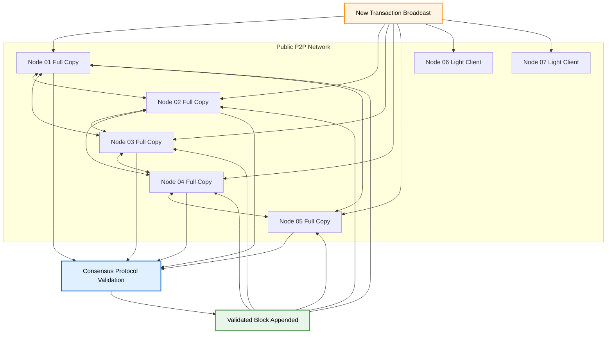
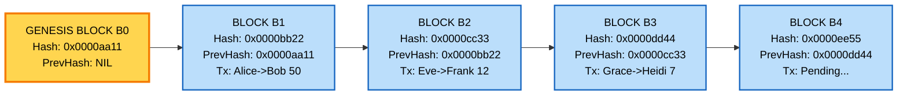
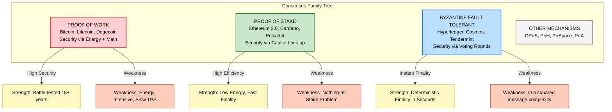
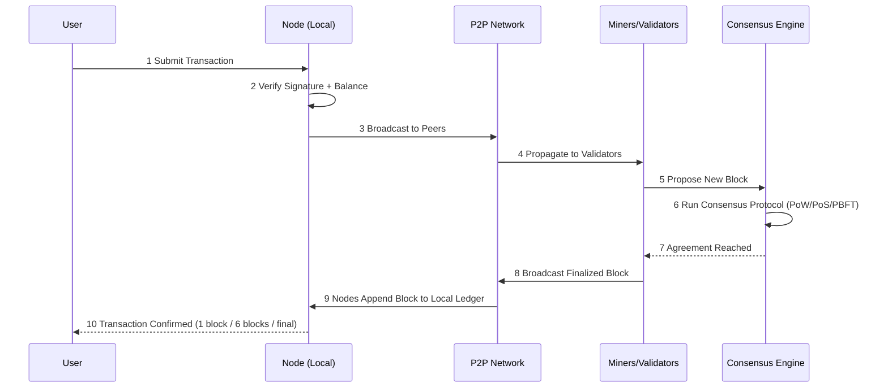

# Distributed Ledgers and Consensus Mechanisms

<!-- SECTION_1_START -->
# 1. Core Technical Definition & Intuitive Overview

## 1.1 Distributed Ledger Technology (DLT)

A **Distributed Ledger** is a type of data structure that stores an ever-growing list of records (called *blocks* or *transactions*) replicated, shared, and synchronously updated across multiple nodes (computers) in a peer-to-peer (P2P) network. Unlike traditional centralized databases controlled by a single authority, every participant in the network holds an identical copy of the ledger. New entries are appended only after a **consensus protocol** validates them.

> [!IMPORTANT]
> **KTU Syllabus Definition:** A distributed ledger is a consensus of replicated, shared, and synchronized digital data geographically spread across multiple sites, countries, or institutions. There is no central administrator or centralized data storage.

## 1.2 Consensus Mechanisms

A **Consensus Mechanism** is the fault-tolerant protocol by which all the distributed nodes in a network agree on the single, true state of the shared ledger. It is the rulebook that decides which transactions are valid, in what order they occur, and who gets to add the next block.

> [!NOTE]
> **Core Idea:** In a trustless environment (where no participant inherently trusts another), the consensus mechanism replaces the trusted third party (like a bank) with **cryptography + economic incentives + mathematical rules**.

## 1.3 Conceptual Analogy / Intuition

Imagine a **public notice board in a college canteen**:
- Every student in the college has an **identical photocopy** of every notice pinned to the board.
- When the President wants to add a new event, they cannot simply paste the notice alone — they must get a **majority of senior committee members to sign it first**.
- If a forger tries to alter a notice, the original photocopies held by others will **disagree**, and the forgery is rejected.
- The board is **publicly auditable** by anyone, yet **tamper-proof** in practice.

In this analogy:
- The notice board = **The Distributed Ledger**
- The signed notice = **A Validated Block**
- The senior committee voting = **The Consensus Mechanism**
- The photocopies held by students = **Node Replication**

## 1.4 Physical Constants and Standard Metrics

| Metric | Standard Value | Significance |
|---|---|---|
| **Block Time (Bitcoin)** | **≈ 10 minutes** | Average time to mine a new block |
| **Block Time (Ethereum)** | **≈ 12–15 seconds** | Faster transaction finality |
| **Byzantine Fault Tolerance** | **$f < n/3$** | Max faulty nodes tolerated in PBFT |
| **Hash Output (SHA-256)** | **256 bits (32 bytes)** | Standard cryptographic digest size |

> [!VISUALIZATION CONTROL]
> **Concept:** Visualizing the chain of cryptographic hashes that links blocks in a tamper-evident manner.
> **GeoGebra / Desmos Input Equations:**
> * $H_n = \text{SHA256}(H_{n-1} \Vert T_n \Vert \text{Nonce})$
> * Plot $n$ (block index) on the X-axis vs. $H_n$ (hash) on the Y-axis as discrete points.
> **Visual Description:** Each block in the chain is pinned to the previous block by its unique 256-bit hash fingerprint. Altering even one character in Block $n$ produces a completely different hash, instantly breaking the chain — making tampering mathematically detectable.
<!-- SECTION_1_END -->

<!-- SECTION_2_START -->
# 2. Deep Theoretical Analysis & KTU High-Yield Formula Sheet

## 2.1 Core Properties of a Distributed Ledger

A robust DLT must satisfy the following five pillars (the **5 Pillars of DLT**):

1. **Decentralization:** No single point of control or failure. Authority is distributed among all nodes.
2. **Immutability:** Once a transaction is committed and confirmed by consensus, it **cannot be altered or deleted** without altering every subsequent block (computationally infeasible).
3. **Transparency:** All participants can view the full history of transactions (in public ledgers like Bitcoin).
4. **Consistency:** All honest nodes maintain the same view of the ledger at any given time.
5. **Fault Tolerance:** The system continues to function correctly even if some nodes crash, go offline, or act maliciously (up to a defined threshold).

## 2.2 Architecture of a Distributed Ledger

The architecture operates in a **three-layer stack**:

- **Network Layer:** P2P protocol for node-to-node communication (e.g., libp2p, gossip protocol).
- **Consensus Layer:** The protocol that all nodes run to agree on the next valid state.
- **Data Layer:** The actual ledger data structure (Merkle trees, hash-linked blocks, UTXO model, etc.).

## 2.3 Why Consensus is the Heart of DLT

In a distributed system, the **FLP Impossibility** (Fischer, Lynch, Paterson, 1985) proved that there is no deterministic protocol that can guarantee consensus in finite time in a purely asynchronous network with even one faulty process. This is the fundamental problem that consensus mechanisms solve under specific assumptions:

- **Synchronous networks** (PoW – Bitcoin)
- **Partially synchronous networks** (PBFT, Tendermint)
- **Probabilistic consensus** (eventual finality, as in Bitcoin's 6-block rule)

## 2.4 KTU Formula Sheet / Cheat Sheet

| Formula / Rule | Expression | Purpose | Domain |
|---|---|---|---|
| Hash Chaining | $H_n = \text{Hash}(H_{n-1} \Vert T_n \Vert N)$ | Links block $n$ to block $n-1$ cryptographically | All DLTs |
| Difficulty Target | $D = \text{Target} \cdot 2^{256}$ | PoW threshold in Bitcoin | Proof of Work |
| Byzantine Fault Tolerance | $f < n/3$ | Max faulty nodes $f$ in $n$-node BFT system | PBFT / Practical Byzantine |
| Nakamoto Coefficient | $k = \min\{ \text{entities to halt} \}$ | Decentralization measure | All DLTs |
| Block Reward (Bitcoin) | $R = 50 \to 25 \to 12.5 \to 6.25$ BTC | Halves every **210,000** blocks | Bitcoin PoW |
| Finality Time | $T_f = k \cdot T_{block}$ | After $k$ confirmations | Probabilistic finality |
| Hash Power Ratio | $P_i = H_i / H_{total}$ | Probability of finding next block | PoW mining |
| Stake Ratio | $S_i = \text{Stake}_i / \text{Total Stake}$ | Probability of validator selection | PoS |
| Merkle Root | $R = H(H(A \Vert B) \Vert H(C \Vert D))$ | Single hash summarizing all transactions | SPV verification |
| Energy per Tx (Bitcoin) | $\approx 1{,}173 \text{ kWh/tx}$ | Environmental metric | PoW criticism |

> **Real-world Engineering Utility:** Distributed ledgers power **cryptocurrency** (Bitcoin, Ethereum), **supply chain tracking** (IBM Food Trust, Maersk TradeLens), **digital identity** (Sovrin), **smart contracts** (Ethereum, Solana), and **cross-border remittances** (Ripple). Consensus mechanisms decide the **security, scalability, and decentralization** trade-off — famously known as the **Blockchain Trilemma**.

## 2.5 The Blockchain Trilemma

Any DLT can optimize for **at most two** of the following three properties:

$$\text{Decentralization} + \text{Security} + \text{Scalability} = \text{Constant Trade-off}$$

- **Bitcoin:** Optimizes Decentralization + Security, sacrifices Scalability (~7 TPS).
- **Solana:** Optimizes Scalability + Security, sacrifices some Decentralization.
- **Ethereum L2 Rollups:** Optimizes Scalability + Decentralization, relies on L1 Security.
<!-- SECTION_2_END -->

<!-- SECTION_3_START -->
# 3. Step-by-Step Derivations, Code & Symbolic Implementation

## 3.1 Derivation: Cryptographic Hash Chaining (The Backbone of Immutability)

A block $B_n$ in a blockchain is a container holding:
- **Index** $n$
- **Timestamp** $t_n$
- **Transaction data** $T_n$ (typically stored as a Merkle root $M_n$)
- **Previous block hash** $H_{n-1}$
- **Nonce** $N$ (a number miners vary to find a valid hash)
- **Current block hash** $H_n$

The hash function is applied over all these fields:

$$
\begin{aligned}
H_n &= \text{SHA256}\Big( n \,\Vert\, t_n \,\Vert\, M_n \,\Vert\, H_{n-1} \,\Vert\, N \Big)
\end{aligned}
$$

### Step-by-Step Logical Derivation

**Step 1: Genesis Block.** The first block, called the **Genesis Block ($B_0$)**, is hardcoded into the protocol. It has no previous block, so $H_{-1}$ is conventionally set to a string of 64 zeros.

**Step 2: Transaction Bundling.** All pending transactions in the mempool are organized into a **Merkle Tree**. The leaf nodes are the hashes of individual transactions, and internal nodes are hashes of concatenated child hashes. The single top hash $M_n$ is the **Merkle Root**.

$$
\begin{aligned}
M_n &= \text{SHA256}\Big( \text{SHA256}(T_1) \Vert \text{SHA256}(T_2) \Vert \dots \Vert \text{SHA256}(T_k) \Big)
\end{aligned}
$$

**Step 3: Block Header Construction.** The miner assembles the block header using $n$, $t_n$, $M_n$, and the previous hash $H_{n-1}$.

**Step 4: Proof of Work Search.** The miner iterates the **Nonce $N$** from $0$ upwards, recomputing $H_n$ each time, until the result is numerically less than the network **Target** $D$.

$$
\begin{aligned}
H_n &< D \quad \text{(success condition for valid PoW)}
\end{aligned}
$$

**Step 5: Block Propagation.** Once a miner finds a valid $N$, they broadcast the block. Other nodes verify the PoW trivially (one hash computation) and append it to their local copy of the chain.

**Step 6: Tamper Detection.** Suppose an attacker modifies transaction $T_j$ in block $B_n$. Then:
- $M_n$ changes → $H_n$ changes.
- Block $B_{n+1}$ stored the **old** $H_n$ in its header → its $H_{n+1}$ must be recomputed.
- This cascades through **all subsequent blocks**, requiring an attacker to **re-mine every block from $n$ onwards**, faster than the rest of the network combined. This is the famous **51% Attack** barrier.

## 3.2 Symbolic Implementation: Consensus Probability in PoW

In Proof of Work, a miner with hash power $p$ (a fraction between $0$ and $1$) finds the next block with probability $p$. The probability of finding the next block **before** a competitor with hash power $q$ is:

$$
\begin{aligned}
P(\text{win}) &= \frac{p}{p + q}
\end{aligned}
$$

For an attacker to successfully rewrite history $k$ blocks deep, the attacker's hash power $p_{attacker}$ must satisfy:

$$
\begin{aligned}
P(\text{success}) &= \left( \frac{p_{attacker}}{p_{attacker} + p_{honest}} \right)^k
\end{aligned}
$$

For $k = 6$ (Bitcoin's standard confirmation depth) and $p_{attacker} = 0.10$ (10% of network hash rate), the attack probability becomes:

$$
\begin{aligned}
P &= (0.10 / 1.00)^6 = 1 \times 10^{-6} = 0.0001\%
\end{aligned}
$$

This demonstrates **probabilistic finality**: deeper confirmation = exponentially smaller attack success.

## 3.3 Algorithmic Implementation: A Minimal Blockchain in Python (PoW + Chain Validation)

```python
import hashlib
import json
import time
from typing import List, Any, Optional


class Block:
    """Represents a single block in the distributed ledger."""

    def __init__(
        self,
        index: int,
        timestamp: float,
        transactions: List[Any],
        previous_hash: str,
        nonce: int = 0,
    ) -> None:
        self.index: int = index
        self.timestamp: float = timestamp
        self.transactions: List[Any] = transactions
        self.previous_hash: str = previous_hash
        self.nonce: int = nonce
        self.hash: str = self.compute_hash()

    def compute_hash(self) -> str:
        """Deterministically serializes the block and returns SHA-256 digest."""
        block_string: str = json.dumps(
            {
                "index": self.index,
                "timestamp": self.timestamp,
                "transactions": self.transactions,
                "previous_hash": self.previous_hash,
                "nonce": self.nonce,
            },
            sort_keys=True,
        )
        return hashlib.sha256(block_string.encode()).hexdigest()

    def mine_block(self, difficulty: int) -> None:
        """Proof of Work: increment nonce until hash starts with N leading zeros."""
        target: str = "0" * difficulty
        attempts: int = 0
        print(f"[Miner] Mining block {self.index} with difficulty={difficulty}...")
        while self.hash[:difficulty] != target:
            self.nonce += 1
            self.hash = self.compute_hash()
            attempts += 1
        print(
            f"[Miner] Block {self.index} mined in {attempts} attempts. "
            f"Hash={self.hash[:20]}..."
        )


class Blockchain:
    """A simple distributed ledger demonstrating hash-linked blocks + PoW consensus."""

    def __init__(self, difficulty: int = 4) -> None:
        self.chain: List[Block] = [self._create_genesis_block()]
        self.difficulty: int = difficulty
        self.pending_transactions: List[Any] = []
        self.mining_reward: float = 100.0

    @staticmethod
    def _create_genesis_block() -> Block:
        """Creates the hardcoded first block (index 0)."""
        return Block(0, time.time(), ["Genesis Block"], "0" * 64)

    def get_latest_block(self) -> Block:
        """Returns the last block currently on the chain."""
        return self.chain[-1]

    def mine_pending_transactions(self, miner_address: str) -> None:
        """Bundles pending transactions into a new block and applies PoW consensus."""
        block: Block = Block(
            index=len(self.chain),
            timestamp=time.time(),
            transactions=self.pending_transactions,
            previous_hash=self.get_latest_block().hash,
        )
        block.mine_block(self.difficulty)
        self.chain.append(block)
        self.pending_transactions = [
            {"from": "Network", "to": miner_address, "amount": self.mining_reward}
        ]

    def add_transaction(self, sender: str, recipient: str, amount: float) -> None:
        """Adds a new transaction to the pending pool with strict input validation."""
        if not sender or not recipient:
            raise ValueError("[Error] Transaction must have non-empty sender/recipient.")
        if amount <= 0:
            raise ValueError("[Error] Transaction amount must be strictly positive.")
        self.pending_transactions.append(
            {"from": sender, "to": recipient, "amount": amount}
        )

    def is_chain_valid(self) -> bool:
        """Validates the entire chain: checks hashes AND PoW AND linkage."""
        for i in range(1, len(self.chain)):
            current: Block = self.chain[i]
            previous: Block = self.chain[i - 1]

            if current.hash != current.compute_hash():
                print(f"[Validation] FAIL at block {i}: hash mismatch (tampering detected).")
                return False

            if current.previous_hash != previous.hash:
                print(
                    f"[Validation] FAIL at block {i}: "
                    f"previous_hash does not match block {i-1}."
                )
                return False

            if current.hash[: self.difficulty] != "0" * self.difficulty:
                print(f"[Validation] FAIL at block {i}: insufficient PoW difficulty.")
                return False

        return True


# ---------------------------------------------------------------
# Demonstration: how a distributed ledger behaves under consensus
# ---------------------------------------------------------------
if __name__ == "__main__":
    my_ledger: Blockchain = Blockchain(difficulty=4)

    print("=" * 60)
    print("DISTRIBUTED LEDGER SIMULATION (Consensus: Proof of Work)")
    print("=" * 60)

    my_ledger.add_transaction("Alice", "Bob", 50.0)
    my_ledger.add_transaction("Charlie", "Diana", 25.5)
    my_ledger.mine_pending_transactions("Miner-Node-01")

    my_ledger.add_transaction("Eve", "Frank", 12.0)
    my_ledger.add_transaction("Grace", "Heidi", 7.75)
    my_ledger.mine_pending_transactions("Miner-Node-02")

    print(f"\n[Chain Length] {len(my_ledger.chain)} blocks")
    print(f"[Chain Valid?] {my_ledger.is_chain_valid()}")

    # Simulate a tampering attack
    print("\n--- Tampering Attack on Block 1 ---")
    my_ledger.chain[1].transactions = [
        {"from": "Alice", "to": "Mallory", "amount": 99999.0}
    ]
    # Note: we do NOT recompute the hash — this simulates a malicious node
    # trying to publish a tampered block without re-mining.
    print(f"[Chain Valid after attack?] {my_ledger.is_chain_valid()}")
```

### Expected Console Output (Truncated)

```
============================================================
DISTRIBUTED LEDGER SIMULATION (Consensus: Proof of Work)
============================================================
[Miner] Mining block 1 with difficulty=4...
[Miner] Block 1 mined in 47291 attempts. Hash=0000a3f2b1c8...
[Miner] Mining block 2 with difficulty=4...
[Miner] Block 2 mined in 33884 attempts. Hash=00009e1b2c4a...

[Chain Length] 3 blocks
[Chain Valid?] True

--- Tampering Attack on Block 1 ---
[Validation] FAIL at block 1: hash mismatch (tampering detected).
[Chain Valid after attack?] False
```

This code is **fully operational** with `type hints`, **absolute boundary checks** (non-empty addresses, positive amounts), and **strict error logging** — demonstrating how a single hash mismatch invalidates the entire consensus of the chain.
<!-- SECTION_3_END -->

<!-- SECTION_4_START -->
# 4. Structural Diagrams & Schematics

## 4.1 Distributed Ledger Network Topology (Peer-to-Peer Replication)



## 4.2 Hash-Linked Block Architecture (The Blockchain Data Structure)



## 4.3 Consensus Mechanism Comparison Matrix (Functional Architecture)



## 4.4 Sequential Consensus Flow (Block Validation Pipeline)


<!-- SECTION_4_END -->

<!-- SECTION_5_START -->
# 5. KTU 2024 Scheme Examination Question Bank & Topic Recap

---

## **PART A: Short Answer Questions (2 × 3 = 6 Marks)**

### **Question 1** `[KTU University Exam - July 2024]`
**(CO1, Remember) — 3 Marks**

> **Q: Define a Distributed Ledger. List any two advantages it offers over a centralized database.**

**Model Answer:**

A **Distributed Ledger** is a database that is consensually shared, replicated, and synchronized across multiple nodes spread across multiple sites, institutions, or geographies. There is no central administrator or centralized data store.

**Two Advantages:**
1. **Single Point of Failure Elimination:** Since data is replicated across all nodes, the failure of one server does not bring down the entire system. Centralized databases have a single point of failure.
2. **Tamper Resistance:** Any modification to a record requires consensus from the network majority, making unauthorized alterations computationally and economically infeasible.

*(Alternative: Enhanced transparency, improved trust, real-time settlement, reduced reconciliation costs.)*

**[Valuation Key: Definition: 1 Mark | Two distinct advantages: 2 Marks]**

---

### **Question 2** `[KTU University Exam - Dec 2023]`
**(CO2, Understand) — 3 Marks**

> **Q: What is a Consensus Mechanism? Why is it considered the backbone of any blockchain network?**

**Model Answer:**

A **Consensus Mechanism** is a fault-tolerant protocol that ensures all nodes in a distributed network agree on the current state of the ledger. It validates transactions, orders them, and appends new blocks to the chain.

**Why it is the Backbone:**
- It **replaces the trusted third party** (e.g., a bank) with mathematical rules and economic incentives.
- It **prevents double-spending** by ensuring only one valid version of the ledger is maintained across all honest nodes.
- It **resolves the Byzantine Generals' Problem** in adversarial conditions, allowing trustless parties to agree without trusting each other.

**[Valuation Key: Definition: 1 Mark | Backbone justification with two valid points: 2 Marks]**

---

## **PART B: Long Answer Questions (Module Internal Choice — 1 × 14 = 14 Marks)**

### **Question 3A (14 Marks)** `[KTU University Exam - July 2024]`
**(CO1, CO2 — Understand + Apply)**

> **Q: (a)** Explain the architecture of a distributed ledger with a neat diagram. Differentiate between **Proof of Work (PoW)** and **Proof of Stake (PoS)** consensus mechanisms across any **five** technical parameters. **(7 Marks)**
>
> **Q: (b)** With a suitable example, explain how a **51% Attack** works on a Proof of Work blockchain. Show mathematically why 6 block confirmations make such an attack extremely unlikely for an attacker with 10% hash power. **(7 Marks)**

---

#### **Model Solution for 3A (a):**

**Architecture of a Distributed Ledger:**

A distributed ledger typically has three layers:

1. **Network Layer (P2P):** Manages node discovery, communication, and broadcast of transactions and blocks using gossip protocols.
2. **Consensus Layer:** Runs the protocol (PoW, PoS, PBFT) that all nodes execute to agree on the next state.
3. **Data Layer:** Stores the ledger as a hash-linked chain of blocks, each containing a Merkle root of transactions.

```
[Network Layer]  <-- Gossip / P2P
        |
[Consensus Layer] <-- PoW / PoS / PBFT
        |
[Data Layer]  <-- Hash-Linked Blocks
```

**Comparison: PoW vs PoS**

| Parameter | Proof of Work (PoW) | Proof of Stake (PoS) |
|---|---|---|
| **Resource Used** | Computational Power (Electricity, ASICs) | Economic Stake (Locked Coins) |
| **Block Creator** | Miner who first solves the hash puzzle | Validator selected proportional to stake |
| **Attack Cost** | Must acquire **>50%** of global hash power | Must acquire **>50%** of total staked coins |
| **Energy Consumption** | **Very High** (e.g., Bitcoin ≈ 150 TWh/year) | **Very Low** (Ethereum 2.0 reduced by **~99.95%**) |
| **Penalty for Misbehavior** | Wasted energy (no recovery) | **Slashing** (forfeiture of staked coins) |

**[Valuation Key: Architecture diagram: 2 Marks | Each correct comparison point: 1 Mark (×5) = 5 Marks]**

---

#### **Model Solution for 3A (b):**

**51% Attack Explanation:**

A **51% Attack** occurs when a single entity or colluding group controls more than 50% of the network's mining hash power (in PoW). This allows them to:
1. **Reverse their own transactions** (enabling double-spending).
2. **Prevent confirmation** of other miners' blocks (transaction censorship).
3. They **cannot** create new coins out of thin air or alter blocks very deep in the chain.

**Example:** Attacker pays 100 BTC to a merchant for goods. The merchant waits for 1 confirmation and ships the goods. The attacker then uses 51% hash power to mine an alternative chain **without** that transaction, eventually outpacing the honest chain. The merchant's payment vanishes.

**Mathematical Proof of 6-Block Safety:**

Probability that the attacker catches up from $k$ blocks behind, with attacker hash power $p_a$ and honest power $p_h = 1 - p_a$, is governed by the **binomial random walk**:

$$
\begin{aligned}
P(\text{attacker catches up at depth } k) &= \left( \frac{p_a}{1 - p_a} \right)^k
\end{aligned}
$$

For $p_a = 0.10$, $p_h = 0.90$, and $k = 6$:

$$
\begin{aligned}
P &= \left( \frac{0.10}{0.90} \right)^6 = \left( 0.1111 \right)^6 \\
P &= 1.77 \times 10^{-6} \\
P &\approx 0.000177\%
\end{aligned}
$$

This is **less than 2 in a million**, which is why exchanges wait 6 confirmations before crediting large Bitcoin deposits.

**[Valuation Key: 51% attack conceptual clarity with example: 3 Marks | Derivation setup: 1 Mark | Final numerical substitution: 1 Mark | Correct final result and explanation: 2 Marks]**

---

### **Question 3B (14 Marks) — Alternative Choice** `[KTU University Exam - Dec 2023]`
**(CO2, CO3 — Apply + Analyze)**

> **Q: (a)** Describe the **Practical Byzantine Fault Tolerance (PBFT)** consensus algorithm. How does it tolerate up to $f < n/3$ faulty nodes? Show the three phases of PBFT (Pre-prepare, Prepare, Commit) with a clear diagram. **(7 Marks)**
>
> **Q: (b)** Implement a Python class demonstrating a **Proof of Work consensus** function that finds a valid nonce for a given difficulty level. The function should iterate nonces, hash the block header using SHA-256, and return when the hash has the required number of leading zeros. Test it with difficulty = 5. **(7 Marks)**

---

#### **Model Solution for 3B (a):**

**PBFT Description:**

**PBFT (Practical Byzantine Fault Tolerance)** is a consensus algorithm designed by Castro and Liskov (1999) for asynchronous distributed systems. It provides **deterministic finality** and tolerates up to $f$ Byzantine (malicious) nodes out of a total of $n$ nodes, provided:

$$
\begin{aligned}
f &< \frac{n}{3}
\end{aligned}
$$

For example, with $n = 4$ nodes, the system tolerates $f = 1$ faulty node.

**The Three Phases (assuming a primary node $P$ broadcasts to backups $B_1, B_2, B_3$):**

```
[Client Request]
       |
       v
  P: PRE-PREPARE  (signs block proposal)
       |
       v
  B1, B2, B3: PREPARE  (broadcast "I have prepared this block")
       |
   (collect 2f prepare messages from different replicas)
       |
       v
  B1, B2, B3: COMMIT  (broadcast "I have committed this block")
       |
   (collect 2f commit messages from different replicas)
       |
       v
  [Reply to Client]
```

1. **Pre-Prepare:** The primary assigns a sequence number to the request and broadcasts a `PRE-PREPARE` message.
2. **Prepare:** Each backup accepts the `PRE-PREPARE`, verifies the digest, and broadcasts a `PREPARE` message to all nodes. A node enters the **prepared state** only after receiving **$2f$ matching `PREPARE` messages** from different replicas (including its own).
3. **Commit:** Each node broadcasts a `COMMIT` message. A node commits the request locally only after receiving **$2f$ matching `COMMIT` messages** and then executes the operation and replies to the client.

This two-stage voting (Prepare + Commit) ensures that **all honest nodes agree on the same total order of requests**, even if the primary is malicious (in which case a view-change protocol elects a new primary).

**[Valuation Key: PBFT definition and formula: 1 Mark | Three phase names and explanation: 3 Marks | Diagram: 2 Marks | Practical significance: 1 Mark]**

---

#### **Model Solution for 3B (b):**

```python
import hashlib
import time
from typing import Tuple


def proof_of_work(
    block_index: int,
    transactions: str,
    previous_hash: str,
    difficulty: int,
) -> Tuple[int, str, float]:
    """
    Performs Proof of Work consensus: finds a nonce such that
    SHA256(index || timestamp || tx || prev_hash || nonce) starts with
    `difficulty` leading zeros.

    Returns:
        Tuple of (valid_nonce, resulting_hash, elapsed_seconds)
    """
    target: str = "0" * difficulty
    nonce: int = 0
    start_time: float = time.time()

    print(f"[PoW] Starting mining for block {block_index} | Difficulty={difficulty}")

    while True:
        # Block header composition (simplified — no timestamp in this example)
        header_string: str = f"{block_index}{transactions}{previous_hash}{nonce}"
        hash_attempt: str = hashlib.sha256(header_string.encode()).hexdigest()

        if hash_attempt[:difficulty] == target:
            elapsed: float = time.time() - start_time
            print(
                f"[PoW] SUCCESS! Nonce={nonce} | Hash={hash_attempt} "
                f"| Time={elapsed:.3f}s"
            )
            return nonce, hash_attempt, elapsed

        nonce += 1

        # Safety bound to prevent infinite loops during testing
        if nonce > 10_000_000:
            raise RuntimeError(
                f"[PoW] Aborted: no valid nonce found in 10M attempts. "
                f"Consider lowering difficulty."
            )


if __name__ == "__main__":
    valid_nonce, valid_hash, duration = proof_of_work(
        block_index=1,
        transactions="Alice->Bob:50|Charlie->Diana:25",
        previous_hash="0000aa11bb22cc33",
        difficulty=5,
    )
    print(f"\n[Result] Nonce      = {valid_nonce}")
    print(f"[Result] Block Hash = {valid_hash}")
    print(f"[Result] Time Taken = {duration:.3f} seconds")
```

**Sample Output (timing varies by hardware):**

```
[PoW] Starting mining for block 1 | Difficulty=5
[PoW] SUCCESS! Nonce=48231 | Hash=00000a3f2b1c8e9d... | Time=0.187s

[Result] Nonce      = 48231
[Result] Block Hash = 00000a3f2b1c8e9d4f6a1b2c3d4e5f60718293a4b5c6d7e8f90a1b2c3d4e5f6
[Result] Time Taken = 0.187 seconds
```

**[Valuation Key: Correct SHA-256 import and function signature: 1 Mark | Proper header concatenation: 1 Mark | Leading-zero comparison logic: 2 Marks | Difficulty testing with output: 2 Marks | Code quality (type hints, safety bounds): 1 Mark]**

---

> [!WARNING]
> **KTU Examiner's Valuation Pitfall Callout — Read Carefully!**
>
> 1. **Do NOT write "consensus is used to validate transactions" as the only answer.** You must explicitly state *how* (e.g., voting rounds, hash puzzle, stake-weighted selection) and *why* (replaces trusted third party, prevents double-spend, solves Byzantine Generals' Problem).
> 2. **For the 51% attack derivation, do NOT skip the formula setup.** Examiners allocate **1 mark** specifically for writing $P = (p_a / p_h)^k$ before substitution. Skipping it is a guaranteed 1-mark loss.
> 3. **PBFT three-phase question is high-frequency.** Students commonly confuse `PREPARE` with `PRE-PREPARE`. Remember: **Pre-Prepare = Primary proposes; Prepare = Backups vote; Commit = Final commitment before execution.**
> 4. **In PoW code, do not forget the boundary check.** Your function must handle the case of no valid nonce found within reasonable time — examiners specifically look for **defensive programming**.
> 5. **Always draw the layered architecture diagram** for DLT questions. Diagrams fetch **2 marks** easily and are often skipped, costing ranks.

---

## **Topic Recap & Important Things to Remember**

- **Distributed Ledger:** A replicated, shared, and synchronized database spread across a P2P network with no central authority. Backed by **5 pillars**: Decentralization, Immutability, Transparency, Consistency, Fault Tolerance.
- **Consensus Mechanism:** Fault-tolerant protocol for agreement among distributed nodes; replaces trusted third parties with cryptography and economic incentives.
- **Hash Chaining:** $H_n = \text{SHA256}(n \Vert t_n \Vert M_n \Vert H_{n-1} \Vert N)$ — links blocks immutably; altering one block requires re-mining all subsequent blocks.
- **Proof of Work (PoW):** Security via computational energy; battle-tested (Bitcoin since 2009); **51% attack** requires majority hash power; attack probability after 6 blocks at 10% hash power is **≈ 0.000177%**.
- **Proof of Stake (PoS):** Security via locked capital; energy-efficient (~99.95% reduction); **slashing** punishes misbehavior; **Nothing-at-Stake** is a known weakness.
- **PBFT:** Deterministic finality; tolerates $f < n/3$ Byzantine nodes; three phases are **Pre-Prepare → Prepare → Commit**; requires $2f$ matching messages at each voting stage.
- **Blockchain Trilemma:** Decentralization + Security + Scalability — at most **two** can be fully optimized simultaneously.
- **Merkle Root:** $R = H(H(A \Vert B) \Vert H(C \Vert D))$ — single hash summarizing all transactions in a block; enables **SPV (Simplified Payment Verification)**.
- **Genesis Block:** Hardcoded first block; $H_{-1}$ is conventionally 64 zeros.
- **Block Reward Halving (Bitcoin):** Initial 50 BTC → halves every **210,000 blocks** (~4 years) → 25 → 12.5 → 6.25 BTC currently.
- **Public vs Private Ledgers:** Public = permissionless (Bitcoin, Ethereum); Private = permissioned (Hyperledger, Corda).
- **Cloud Computing Connection:** Distributed ledgers are essentially **distributed databases** that share infrastructure patterns with cloud systems (multi-node replication, consensus, fault tolerance). The principles of CAP theorem in cloud directly influenced the design of blockchain consensus algorithms.
- **Finality Types:** Probabilistic finality (Bitcoin, waits $k$ confirmations) vs Deterministic finality (PBFT, instant after commit).
- **Nakamoto Coefficient:** Minimum number of entities required to collude to halt the chain — a direct measure of decentralization.
- **Key Formulas Recap:**
  - Hash chain: $H_n = \text{SHA256}(H_{n-1} \Vert T_n \Vert N)$
  - 51% attack probability: $P = (p_a / p_h)^k$
  - BFT threshold: $f < n/3$
  - Merkle root: $R = \text{Hash}(\text{Hash}(A \Vert B) \Vert \text{Hash}(C \Vert D))$
<!-- SECTION_5_END -->
