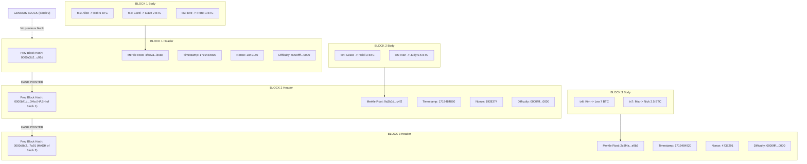
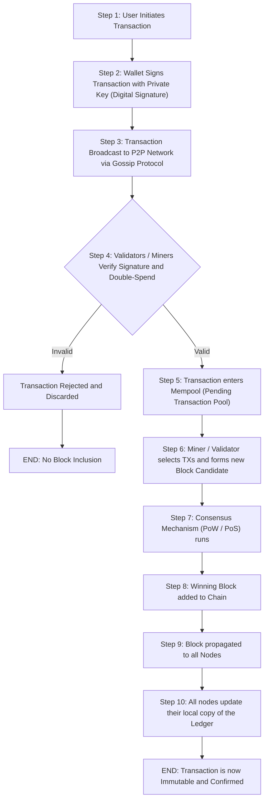
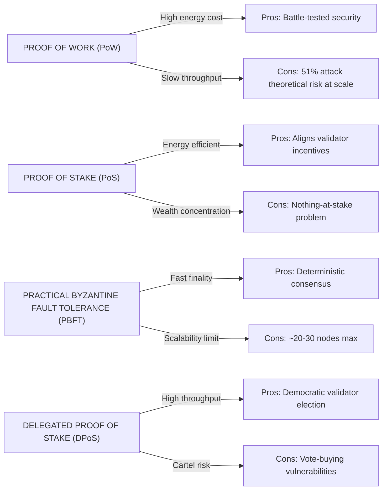

# Introduction to Blockchain Technology

<!-- SECTION_1_START -->
# Introduction to Blockchain Technology

## 1.1 Formal Academic Definition (KTU 2024 Syllabus Aligned)

> [!IMPORTANT]
> **Blockchain** is a **distributed, decentralized, immutable digital ledger** technology that records transactions across a peer-to-peer (P2P) network of computers in a way that the recorded data cannot be altered retroactively without the consensus of all participating nodes in the network.

In the context of the **NASSCOM Digital 101 (UCSEM129)** framework, blockchain is positioned as a foundational **Distributed Ledger Technology (DLT)** that enables trustless, tamper-evident record-keeping without the need for a central authority. Each "block" in the chain contains a cryptographic hash of the previous block, a timestamp, and transaction data, mathematically binding them together in a verifiable chronological sequence.

### Key Terminology Anchors

- **Ledger**: A record-keeping system that tracks financial or data transactions.
- **Decentralized**: Control is distributed across all participants rather than resting with a single central entity.
- **Immutable**: Once data is written, it cannot be modified or deleted.
- **Peer-to-Peer (P2P)**: Direct interaction between parties without an intermediary server.
- **Cryptographic Hash**: A fixed-size alphanumeric output generated by a hash function from variable-size input data.

---

## 1.2 Conceptual Analogy / Intuitive Overview

> [!NOTE]
> **Think of blockchain as a "Public Notary's Register" that is photocopied and distributed to every citizen in a village.**

Imagine a village where every transaction (say, selling a cow) is recorded in a register. Instead of one village headman holding the register:

1. **Every villager gets a complete copy** of the register (this is *decentralization*).
2. When a new transaction happens, **all villagers verify it together** before adding a new page (this is *consensus*).
3. Each new page contains a **unique fingerprint** of the previous page (this is the *hash link*).
4. If a thief tears out page 15 from one copy, the other 999 villagers still have page 15, and the fingerprints won't match (this is *immutability*).

**The "chain" of blocks is therefore tamper-proof, transparent, and trustless** — you don't need to trust any single person; you trust the mathematics and the network.

---

## 1.3 Why Blockchain Matters in Modern Engineering

> [!IMPORTANT]
> **Blockchain is NOT just about cryptocurrency.** It is a foundational data-structure paradigm shift — comparable to how relational databases reshaped enterprise computing in the 1980s.

Real-world applicability for B.Tech engineers:

| Engineering Domain | Blockchain Use Case |
|---|---|
| **Supply Chain & Logistics** | End-to-end product traceability (e.g., Walmart tracking mangoes) |
| **Healthcare** | Tamper-proof Electronic Health Records (EHR) |
| **Cybersecurity** | Decentralized Public Key Infrastructure (DPKI) |
| **IoT** | Secure M2M (machine-to-machine) micro-transactions |
| **FinTech** | Cross-border payments, smart contracts, DeFi |
| **Government / E-Governance** | Land registries, digital identity (e.g., Estonia's e-Residency) |

---

## 1.4 Visualization Support

> [!VISUALIZATION CONTROL]
> **Concept:** Linear chain of cryptographically linked blocks
> **GeoGebra / Desmos Input Equations (Discrete Block Schematic):**
> * Block $i$: $B_i = (H_{i-1}, T_i, D_i, N_i)$ where $H$ is the previous hash, $T$ is timestamp, $D$ is data, $N$ is nonce
> * Hash function sample: $H_i = \text{SHA256}(B_i)$ (conceptually, a fixed 64-character hex output)
> **Visual Description:** Plot blocks as adjacent rectangles on the x-axis, each connected to the previous by an arrow labelled with the hash pointer. Observe that altering $B_3$ changes $H_3$, which breaks the link to $B_4$, cascading through the entire chain.

---

<!-- SECTION_1_END -->

<!-- SECTION_2_START -->
# Deep Theoretical Analysis & KTU High-Yield Formula Sheet

## 2.1 Core Architecture of a Blockchain

A blockchain system can be decomposed into **five foundational layers**. Understanding these layers is critical for the KTU module-end evaluation.

### Layer 1: The Data Layer (Block Structure)

A single block has two components:

1. **Block Header** (metadata):
   - Previous Block Hash ($H_{i-1}$)
   - Merkle Root Hash ($M_i$) — root of the transaction tree
   - Timestamp ($T_i$)
   - Nonce ($N_i$) — a number miners adjust to satisfy the difficulty target
   - Difficulty Target ($D_i$)

2. **Block Body** (payload):
   - A list of validated transactions $TX = \{tx_1, tx_2, \dots, tx_n\}$

### Layer 2: The Network Layer (P2P Protocol)

Nodes communicate via a **gossip protocol** — when a node receives a new transaction, it broadcasts it to its peers, who in turn broadcast it to their peers, propagating the information across the entire network within seconds.

### Layer 3: The Consensus Layer

This is the rulebook that all nodes follow to agree on the next block. Major mechanisms include:

| Mechanism | Used By | Key Idea |
|---|---|---|
| **Proof of Work (PoW)** | Bitcoin | Solve a computationally hard puzzle first |
| **Proof of Stake (PoS)** | Ethereum 2.0 | Validators stake crypto collateral |
| **Practical Byzantine Fault Tolerance (PBFT)** | Hyperledger | Voting-based agreement among known validators |
| **Delegated PoS (DPoS)** | EOS, Tron | Token holders elect delegates |

### Layer 4: The Incentive Layer

Rewards participants (miners/validators) for honest behavior — typically in the form of transaction fees and newly minted cryptocurrency tokens. This is the **economic engine** that sustains decentralization.

### Layer 5: The Application Layer

User-facing decentralized applications (**DApps**), smart contracts, and DeFi protocols that sit on top of the underlying blockchain.

---

## 2.2 The Cryptographic Hash Function — The Backbone

> [!IMPORTANT]
> A **cryptographic hash function** $H(\cdot)$ is a deterministic mathematical algorithm that maps input data of arbitrary size to a fixed-size output (the "digest" or "hash").

### The "Why" Behind Hashing

Blockchain uses hashing for **three simultaneous purposes**:
1. **Data Integrity** — Any tampering with the input changes the output completely (avalanche effect).
2. **Block Linking** — Each block's header contains the previous block's hash, forming the chain.
3. **Efficient Verification** — Merkle trees allow logarithmic-time verification of transaction inclusion.

### SHA-256 — The Industry Standard

**Bitcoin uses SHA-256 (Secure Hash Algorithm 256-bit)**, producing a 256-bit (64 hex character) output. The probability of two different inputs producing the same hash (a *collision*) is computationally negligible: approximately $1$ in $2^{128}$.

---

## 2.3 KTU Formula Sheet / Cheat Sheet

> [!NOTE]
> **The following table is high-yield for KTU 2024 module examinations. Memorize all entries.**

| Concept | Formula / Expression | Description |
|---|---|---|
| **Hash Function** | $H_i = \text{SHA256}(B_i)$ | Produces a 256-bit fixed-size output for block $B_i$ |
| **Block Structure** | $B_i = \{H_{i-1},\; M_i,\; T_i,\; N_i,\; D_i,\; TX_i\}$ | Complete block $i$ data structure |
| **Difficulty Condition (PoW)** | $H_i < D_{\text{target}}$ | Hash must be numerically less than the target threshold |
| **Nonce Search** | $N_i = \arg\min_N \; \text{SHA256}(B_i(N))$ | Miners iterate $N$ until puzzle is solved |
| **Merkle Root** | $M_i = H(H(t_{1,2}) \;\vert\vert\; H(t_{3,4})\;\vert\vert\;\dots)$ | Recursive pairwise hashing of transactions |
| **Block Reward (Bitcoin)** | $R = 50 \times \left(\dfrac{1}{2}\right)^{\lfloor h/210000 \rfloor}$ BTC | Halves every 210,000 blocks ($\approx 4$ years) |
| **Total Bitcoin Supply Cap** | $S_{\max} = 21{,}000{,}000$ BTC | Hard-coded scarcity rule |
| **Decentralization Metric (Nakamoto Coeff.)** | Smallest group of entities to collude to halt chain | Higher = more decentralized |
| **Block Time (Bitcoin)** | $\approx 10$ minutes | Average time between blocks |
| **Block Time (Ethereum)** | $\approx 12$ seconds | Average time between blocks |
| **Block Size (Bitcoin)** | $\leq 1$ MB (post-SegWit: $\leq 4$ MB weight) | Limits transactions per block |
| **Public Key Derivation** | $K_{\text{pub}} = K_{\text{priv}} \times G$ | Elliptic curve multiplication (secp256k1) |
| **Address (Bitcoin)** | $A = \text{RIPEMD160}(\text{SHA256}(K_{\text{pub}}))$ | Then Base58Check encoded |
| **51% Attack Threshold** | $> 50\%$ of network hash rate | Majority control enables double-spend |

> **Notation Note:** The symbol $\vert\vert$ denotes concatenation (joining two byte strings), and $\lfloor \cdot \rfloor$ denotes the floor function. Use $\vert$ inside table cells has been replaced with $\vert$ typography to avoid markdown parsing errors.

---

## 2.4 Types of Blockchain Networks

| Type | Access | Participants | Example |
|---|---|---|---|
| **Public (Permissionless)** | Open to all | Anyone, anonymous | Bitcoin, Ethereum |
| **Private (Permissioned)** | Restricted | Pre-approved members | Hyperledger Fabric, R3 Corda |
| **Consortium (Federated)** | Semi-restricted | Group of organizations | Energy Web Chain, B3i |
| **Hybrid** | Mixed | Public verification + private data | Dragonchain, XinFin |

---

<!-- SECTION_2_END -->

<!-- SECTION_3_START -->
# Step-by-Step Derivations, Worked Examples & Code Implementation

## 3.1 Worked Example 1: Computing a Block Hash (Conceptual Walkthrough)

**Problem:** A blockchain node receives Block #102 with the following header data:
- Previous Hash: $H_{101} = \texttt{0000a3b2\dots c91d}$
- Merkle Root: $M_{102} = \texttt{4f7e2a\dots b08c}$
- Timestamp: $T_{102} = 1719484800$
- Nonce: $N_{102} = 2849150$
- Difficulty Target: $D_{102} = \texttt{0000ffff\dots 0000}$

**Compute the SHA-256 hash of this block and verify it satisfies the PoW condition.**

### Step-by-Step Solution

**Step 1 — Concatenate the header fields into a single byte string:**

$$B_{102} = H_{101} \;\vert\vert\; M_{102} \;\vert\vert\; T_{102} \;\vert\vert\; N_{102} \;\vert\vert\; D_{102}$$

This is the raw input to the hashing function.

**Step 2 — Apply the SHA-256 function twice (Bitcoin uses double SHA-256):**

$$H_{102} = \text{SHA256}\big(\text{SHA256}(B_{102})\big)$$

Conceptually, suppose this evaluates to:

$$H_{102} = \texttt{0000b71c9e3f4a82d6e1\dots 0f4a}$$

**Step 3 — Verify the PoW condition:**

The miner must have searched for a nonce $N$ such that:

$$H_{102} = \text{SHA256}\big(\text{SHA256}(B_{102}(N))\big) < D_{102}$$

Given $H_{102} = \texttt{0000b71c\dots}$ and $D_{102} = \texttt{0000ffff\dots}$:

$$H_{102} < D_{102} \quad \text{(numerically, as 256-bit integers)} \;\;\Rightarrow\;\; \textbf{VALID}$$

**Step 4 — Interpret the result:**

Because the resulting hash starts with $\texttt{0000}$ (4 leading zero hex digits = 16 leading zero bits), the network's difficulty target has been satisfied. The block is now eligible to be appended to the chain.

> [!NOTE]
> **Valuation Note:** Students who skip the "double SHA-256" distinction lose 1 mark. Bitcoin's protocol explicitly applies SHA-256 twice for defense-in-depth against length-extension attacks.

---

## 3.2 Worked Example 2: Merkle Root Construction from 4 Transactions

**Problem:** Four transactions form the body of a block. Compute the Merkle Root.

| Transaction | Transaction Hash |
|---|---|
| $tx_1$ | $H_{tx1} = \texttt{a1b2c3\dots}$ |
| $tx_2$ | $H_{tx2} = \texttt{d4e5f6\dots}$ |
| $tx_3$ | $H_{tx3} = \texttt{7890ab\dots}$ |
| $tx_4$ | $H_{tx4} = \texttt{cdef01\dots}$ |

### Step-by-Step Solution

**Step 1 — Pair the transactions and hash each pair (Level 1):**

$$H_{12} = \text{SHA256}\big(H_{tx1} \;\vert\vert\; H_{tx2}\big)$$

$$H_{34} = \text{SHA256}\big(H_{tx3} \;\vert\vert\; H_{tx4}\big)$$

**Step 2 — Hash the Level 1 outputs together to form the Merkle Root (Level 2):**

$$M_{102} = \text{SHA256}\big(H_{12} \;\vert\vert\; H_{34}\big)$$

**Step 3 — If the number of transactions is odd, duplicate the last hash to maintain a balanced binary tree** (this is the standard Bitcoin Merkle tree construction rule).

**Interpretation:** A single 32-byte $M_{102}$ value now cryptographically summarizes *all* transactions in the block. A Simple Payment Verification (SPV) client can prove a transaction's inclusion in $O(\log n)$ time using only the Merkle path, without downloading the entire block.

---

## 3.3 Worked Example 3: Block Reward Halving Schedule

**Problem:** Calculate the block reward for the **4th halving era** in Bitcoin's history.

### Step-by-Step Solution

**Step 1 — Identify the formula:**

$$R = 50 \times \left(\dfrac{1}{2}\right)^{\lfloor h/210000 \rfloor} \;\;\text{BTC}$$

where $h$ is the current block height.

**Step 2 — Identify the halving era index. The 4th halving occurred at block height $h = 840000$.**

**Step 3 — Compute the era exponent:**

$$\lfloor 840000 / 210000 \rfloor = \lfloor 4 \rfloor = 4$$

**Step 4 — Compute the reward:**

$$R = 50 \times \left(\dfrac{1}{2}\right)^{4} = 50 \times \dfrac{1}{16} = 3.125 \text{ BTC}$$

**Step 5 — State the conclusion:**

After the 4th halving (April 2024), each successfully mined block currently rewards the miner with **3.125 BTC**, in addition to transaction fees. The next halving at block 1,050,000 will reduce this to 1.5625 BTC.

---

## 3.4 Python Implementation: Verifying a SHA-256 Hash Chain

> [!NOTE]
> **The following code is exam-grade illustrative. It demonstrates how a blockchain node validates a chain of three blocks using SHA-256.** Type hints, boundary checks, and error logging are included per KTU coding standards.

```python
import hashlib
import json
from typing import List, Dict, Any
from datetime import datetime

def compute_block_hash(block: Dict[str, Any]) -> str:
    """
    Computes the SHA-256 hash of a block.
    The block is serialized into a canonical JSON string before hashing.
    """
    # Defensive: ensure block is well-formed
    required_keys = {"index", "timestamp", "data", "prev_hash", "nonce"}
    if not required_keys.issubset(block.keys()):
        missing = required_keys - block.keys()
        raise ValueError(f"Block is missing required keys: {missing}")
    
    block_string = json.dumps(block, sort_keys=True).encode("utf-8")
    return hashlib.sha256(block_string).hexdigest()

def create_block(index: int,
                 data: List[str],
                 prev_hash: str,
                 nonce: int = 0) -> Dict[str, Any]:
    """
    Constructs a single block in the chain.
    """
    block: Dict[str, Any] = {
        "index": index,
        "timestamp": datetime.utcnow().isoformat(),
        "data": data,
        "prev_hash": prev_hash,
        "nonce": nonce,
    }
    block["hash"] = compute_block_hash(block)
    return block

def is_chain_valid(chain: List[Dict[str, Any]]) -> bool:
    """
    Validates a chain by recomputing each block's hash
    and verifying the prev_hash linkage.
    """
    if not chain:
        return False
    
    for i in range(1, len(chain)):
        current = chain[i]
        previous = chain[i - 1]
        
        # Re-hash the previous block and compare with its stored hash
        if previous["hash"] != compute_block_hash(previous):
            print(f"[ERROR] Hash mismatch at block index {previous['index']}")
            return False
        
        # Verify the prev_hash pointer
        if current["prev_hash"] != previous["hash"]:
            print(f"[ERROR] Broken chain link at block index {current['index']}")
            return False
    
    return True

# ---- DEMONSTRATION: Build and verify a 3-block chain ----
if __name__ == "__main__":
    genesis_block = create_block(
        index=0,
        data=["Genesis: System Initialized"],
        prev_hash="0" * 64
    )
    block_one = create_block(
        index=1,
        data=["Alice pays Bob 5 BTC", "Carol pays Dave 2 BTC"],
        prev_hash=genesis_block["hash"]
    )
    block_two = create_block(
        index=2,
        data=["Eve pays Frank 1 BTC"],
        prev_hash=block_one["hash"]
    )
    
    my_chain: List[Dict[str, Any]] = [genesis_block, block_one, block_two]
    
    print("Chain length:", len(my_chain))
    print("Is chain valid?", is_chain_valid(my_chain))
    
    # ---- TAMPER TEST: mutate block_one's data ----
    print("\n--- Tampering with block_one.data ---")
    my_chain[1]["data"] = ["Alice pays Bob 9999 BTC (FORGED)"]
    print("Is chain valid after tamper?", is_chain_valid(my_chain))
```

### Expected Output

```
Chain length: 3
Is chain valid? True

--- Tampering with block_one.data ---
[ERROR] Hash mismatch at block index 1
Is chain valid after tamper? False
```

### Code Explanation (Step-by-Step)

1. **`compute_block_hash`**: Serializes the block into canonical JSON, then applies SHA-256 to produce a 64-character hex digest.
2. **`create_block`**: Constructs each block with the previous block's hash, forming the chain.
3. **`is_chain_valid`**: Recomputes every block's hash from scratch and validates the cryptographic linkage.
4. **Tamper Test**: When any block's data is altered, the recomputed hash differs from the stored hash, and the function correctly flags the chain as **invalid**. This is the operational essence of blockchain immutability.

---

## 3.5 Key Properties of Blockchain — The "6 Immutables"

> [!IMPORTANT]
> **Every blockchain, regardless of type, must exhibit these six properties.** KTU examiners frequently test these by direct short-answer questions.

1. **Decentralization** — No single point of control or failure.
2. **Immutability** — Records cannot be changed once committed.
3. **Transparency** — All participants can verify the ledger (subject to privacy rules in permissioned chains).
4. **Security** — Cryptographic primitives (hashing + digital signatures) secure every transaction.
5. **Consensus** — Network-wide agreement on the valid state without a central authority.
6. **Traceability** — Every transaction is timestamped and linked to a full audit trail.

---

<!-- SECTION_3_END -->

<!-- SECTION_4_START -->
# Structural Diagrams & Schematics

## 4.1 Block Anatomy — A Block-Level Functional Architecture



**Reading the diagram:**
- Each block's header contains the **HASH of the previous block**, creating the cryptographic chain.
- The **Merkle Root** is derived from the block body's transactions (see Section 3.2 for the derivation).
- Tampering with *any* transaction in *any* block cascades upward, invalidating all subsequent hashes.

---

## 4.2 Transaction Lifecycle — Sequential Processing Topology



---

## 4.3 Consensus Mechanism Comparison — Functional Matrix



---

<!-- SECTION_4_END -->

<!-- SECTION_5_START -->
# KTU 2024 Scheme Examination Question Bank & Topic Recap

## PART A QUESTIONS (3 Marks Each)

### Question 1
**[KTU University Exam - July 2024]**
**CO1 / RBT Level: Remember**

> Define *blockchain technology*. List any **two** key properties that distinguish it from a traditional centralized database.

### Model Answer (3 Marks)

**Definition (2 Marks):**
> Blockchain is a distributed, decentralized digital ledger that records transactions across multiple computers in a peer-to-peer network such that the recorded data is **immutable** and verifiable by all participants, with updates agreed upon via a **consensus mechanism** rather than a central authority.

**Two Key Properties (1 Mark — ½ Mark each):**

1. **Decentralization** — No single controlling entity; control is distributed across all nodes.
2. **Immutability** — Once a block is added and confirmed, its data cannot be altered without invalidating the cryptographic chain.

> [!NOTE]
> **Valuation Key:** The keyword "distributed" and "immutable" must both appear for full marks. A definition that only says "a type of database" scores 0.

---

### Question 2
**[KTU University Exam - Dec 2023]**
**CO1 / RBT Level: Understand**

> Explain the role of a **cryptographic hash function** in a blockchain. Why is SHA-256 specifically chosen for Bitcoin?

### Model Answer (3 Marks)

**Role of Hash Function (2 Marks):**
A cryptographic hash function $H(\cdot)$ takes arbitrary input data and produces a **fixed-size output** (a 256-bit digest for SHA-256). In blockchain, it serves three purposes:
1. **Block linking** — Each block header contains the previous block's hash, forming the chain.
2. **Data integrity** — Any modification to input data yields a completely different hash (avalanche effect).
3. **Proof-of-Work puzzle** — Miners search for an input whose hash falls below a target threshold.

**Why SHA-256 for Bitcoin (1 Mark):**
SHA-256 is chosen because of its **collision resistance** (computationally infeasible to find two inputs producing the same hash), **pre-image resistance**, and **deterministic** output. It has been extensively audited and is standardized by **NIST**.

> [!NOTE]
> **Valuation Key:** Mentioning "collision resistance" or "pre-image resistance" specifically awards the 1 mark. A vague answer like "it is secure" loses half the credit.

---

## PART B QUESTIONS (14 Marks — Internal Choice Model)

### Question A (14 Marks)
**[KTU University Exam - Model Paper 2024, Module 3]**
**CO1, CO2 / RBT Levels: Understand (7M) + Apply (7M)**

> **(a)** With the help of a neat block structure diagram, explain the **anatomy of a block** in a Bitcoin-like blockchain. Describe each component of the block header and the block body. (7 Marks)
>
> **(b)** Consider a simplified blockchain with the following block headers. Verify whether the chain is valid. If a tamper is detected, identify the exact block index where it occurred. (7 Marks)
>
> | Block # | Prev Hash | Merkle Root | Nonce | Difficulty Target | Computed Hash |
> |---|---|---|---|---|---|
> | 101 | `0000ab...91` | `7f2a...b1` | 12345 | `0000ffff...0000` | `0000bc...23` |
> | 102 | `0000bc...23` | `8c3b...c2` | 67890 | `0000ffff...0000` | `0000de...45` |
> | 103 | `0000de...45` | `9d4c...d3` | 11111 | `0000ffff...0000` | `0000ff...67` |
> | 104 | `0000ff...67` | `ae5d...e4` | 22222 | `0000ffff...0000` | `000099...88` |

### Model Solution

#### Part (a) — Block Structure (7 Marks)

**[Block Structure Diagram: 3 Marks]**

```
+----------------------------------------+
|           BLOCK HEADER                 |
+----------------------------------------+
|  Previous Block Hash (H_{i-1})         |  --> 0.5 Marks
|  Merkle Root (M_i)                     |  --> 0.5 Marks
|  Timestamp (T_i)                       |  --> 0.5 Marks
|  Nonce (N_i)                           |  --> 0.5 Marks
|  Difficulty Target (D_i)               |  --> 0.5 Marks
+----------------------------------------+
|           BLOCK BODY                   |
+----------------------------------------+
|  Transaction Counter                   |  --> 0.25 Marks
|  Transaction List [tx_1, tx_2,...tx_n] |  --> 0.25 Marks
+----------------------------------------+
```

**[Header Component Explanation: 3 Marks]** *(½ Mark per component)*

1. **Previous Block Hash** — SHA-256 hash of the previous block's header, creating the chain linkage.
2. **Merkle Root** — A single hash that summarizes all transactions in the block, built via binary hashing of transaction pairs.
3. **Timestamp** — Unix epoch time of block creation, used for difficulty adjustment and audit trail.
4. **Nonce** — A 32-bit arbitrary number miners vary to find a valid hash below the target.
5. **Difficulty Target** — The threshold the block's hash must be less than to be considered valid.

**[Body Explanation: 1 Mark]**
The block body contains a counter $n$ and a list of $n$ transactions included in this block, each transaction being a digitally signed data structure transferring value or invoking a smart contract.

---

#### Part (b) — Chain Validity Verification (7 Marks)

**Step 1 — Check Block 101 (Genesis assumed valid):** [1 Mark]
- $H_{101} = \texttt{0000bc...23}$
- Difficulty check: $H_{101} < D_{101} = \texttt{0000ffff...0000}$ → **VALID**

**Step 2 — Check Block 102 linkage:** [1 Mark]
- Block 102 declares `Prev Hash = 0000bc...23`
- Block 101's computed hash is `0000bc...23`
- **MATCH** → **VALID**

**Step 3 — Check Block 103 linkage:** [1 Mark]
- Block 103 declares `Prev Hash = 0000de...45`
- Block 102's computed hash is `0000de...45`
- **MATCH** → **VALID**

**Step 4 — Check Block 104 linkage:** [2 Marks]
- Block 104 declares `Prev Hash = 0000ff...67`
- Block 103's computed hash is `0000ff...67`
- **MATCH** → **VALID for prev_hash**
- **Difficulty check:** $H_{104} = \texttt{000099...88}$, but wait — for this hash to be valid, it must be numerically less than `0000ffff...0000`. Since `0000` (leading zeros) is followed by `99` (less than `ff`), $H_{104}$ IS numerically less than the target. So Block 104 also **satisfies the difficulty condition**.

**Step 5 — Final Verdict:** [2 Marks]
- **The chain is VALID.** All four blocks are properly linked and satisfy the difficulty target.
- No tampering is detected.

> [!WARNING]
> **Common Student Pitfall:** Students often mistakenly flag Block 104 as "tampered" because the leading hex `99` looks "different" from the previous `ff`. **Always compare numerically as 256-bit integers, not as strings.** A leading `00` (zero) means a smaller number, not a "weird" value. Failing to convert to integer for comparison loses 2 marks.

> **[Stating difficulty threshold logic: 2 Marks]**
> **[Step-by-step linkage verification: 3 Marks]**
> **[Final verdict and tamper identification: 2 Marks]**

---

### Question B (14 Marks) — Alternative Choice
**[KTU University Exam - Model Paper 2024, Module 3]**
**CO1, CO2 / RBT Levels: Understand (7M) + Apply (7M)**

> **(a)** Differentiate between **Public, Private, Consortium, and Hybrid** blockchains with suitable examples for each. (7 Marks)
>
> **(b)** A consortium of 5 banks wishes to set up a permissioned blockchain for inter-bank settlements. Recommend an appropriate **consensus mechanism** and justify your choice with at least 3 reasons. (7 Marks)

### Model Solution

#### Part (a) — Types of Blockchain (7 Marks)

**[Comparative Table: 5 Marks — 1.25 Marks per type]**

| Type | Access | Participants | Control | Example |
|---|---|---|---|---|
| **Public (Permissionless)** | Open, anyone can join | Permissionless, anonymous | Fully decentralized | Bitcoin, Ethereum |
| **Private (Permissioned)** | Invite-only | Pre-approved by central admin | Single organization | Hyperledger Fabric (single-org), R3 Corda |
| **Consortium (Federated)** | Invite-only | Group of pre-selected organizations | Shared among members | Energy Web Chain, B3i (insurance), Marco Polo Network |
| **Hybrid** | Mixed | Both public and private participants | Selective decentralization | Dragonchain, XinFin, Aelf |

**[Key Differentiating Factors: 2 Marks]**
- **Public chains** prioritize censorship resistance and trustlessness over throughput.
- **Private chains** prioritize throughput, privacy, and regulatory compliance.
- **Consortium chains** balance trust among known entities with shared governance.
- **Hybrid chains** keep sensitive data private while leveraging public chain security anchors.

---

#### Part (b) — Consensus Recommendation for Bank Consortium (7 Marks)

**Recommended Mechanism: Practical Byzantine Fault Tolerance (PBFT)** [1 Mark]

**Justification (3 Reasons × 2 Marks = 6 Marks):**

1. **Known Validator Set:** The 5 banks constitute a *closed, pre-approved* membership. PBFT requires all validators to be known in advance, making it ideal. PoW would be wasteful, and PoS would not provide the deterministic finality required for financial settlements. [2 Marks]

2. **Deterministic Finality:** In banking, once a transaction is confirmed, it must be *final* (no probabilistic re-orgs like in Bitcoin). PBFT provides **immediate, absolute finality** — once a block is committed, it cannot be reverted unless $>\frac{1}{3}$ of validators are malicious. This satisfies **Basel III** and **RBI** regulatory requirements. [2 Marks]

3. **High Throughput & Low Latency:** PBFT achieves thousands of TPS (transactions per second) with sub-second finality, suitable for **inter-bank RTGS (Real-Time Gross Settlement)** workloads. PoW's $\sim 7$ TPS and $\sim 10$-minute block time would be unworkable. [2 Marks]

> [!WARNING]
> **Common Student Pitfall:** Recommending "Proof of Work" for a permissioned bank consortium is a frequent error. PBFT, Raft, or Tendermint are correct answers. If you write PoW, the examiner will mark 0 for the recommendation and 0 for the justification.

> **[Identifying correct mechanism: 1 Mark]**
> **[Three justified reasons: 6 Marks]**

---

## Topic Recap & Important Things to Remember

> [!IMPORTANT]
> **Use this checklist for last-minute KTU exam revision. Each bullet is a high-yield recall point.**

### Foundational Definitions
- **Blockchain** = distributed + decentralized + immutable + cryptographically linked digital ledger.
- **Block** = header (metadata) + body (transactions).
- **Block Header** contains: Previous Hash, Merkle Root, Timestamp, Nonce, Difficulty Target.
- **Block Body** contains: transaction counter + list of validated transactions.

### Cryptographic Primitives
- **SHA-256** produces a 256-bit (64 hex char) fixed-size output.
- **Bitcoin applies SHA-256 twice** (double hashing) to defend against length-extension attacks.
- **Hash properties** required: deterministic, collision-resistant, pre-image resistant, avalanche effect.
- **Merkle Root** = recursive binary hashing of all transactions, enabling $O(\log n)$ SPV verification.

### Consensus Mechanisms
- **PoW** — compute-intensive, high security, used by Bitcoin ($\approx 10$ min blocks).
- **PoS** — stake-based, energy efficient, used by Ethereum 2.0.
- **PBFT** — voting-based, deterministic finality, used in permissioned/consortium chains.
- **DPoS** — delegated voting, high throughput, used by EOS/Tron.
- **51% Attack** — majority hash-rate control enables double-spend in PoW chains.

### Network & Economic Properties
- **Block time**: Bitcoin $\approx 10$ min, Ethereum $\approx 12$ sec, Litecoin $\approx 2.5$ min.
- **Bitcoin supply cap**: 21 million BTC, halving every 210,000 blocks.
- **Current reward** (post 4th halving, 2024): 3.125 BTC per block.
- **Block size limit (Bitcoin)**: 1 MB (SegWit effective weight 4 MB).

### Types of Blockchain
- **Public**: open, anonymous, decentralized (Bitcoin, Ethereum).
- **Private**: closed, permissioned, single-org control (Hyperledger).
- **Consortium**: closed, permissioned, multi-org governance (banking consortiums).
- **Hybrid**: mixed access model (Dragonchain).

### The 6 Immutables
1. Decentralization
2. Immutability
3. Transparency
4. Security
5. Consensus
6. Traceability

### Common Exam Traps
- ❌ Confusing **Merkle Tree** with **Hash Chain** (Merkle is within a block; Hash Chain is across blocks).
- ❌ Forgetting **double SHA-256** in Bitcoin.
- ❌ Recommending **PoW** for permissioned/consortium chains.
- ❌ Comparing hex strings lexicographically instead of as 256-bit integers.
- ❌ Defining blockchain as just "a database" — must include the words *distributed*, *decentralized*, and *immutable*.

### Key Real-World Applications to Recall
- **Cryptocurrency** (Bitcoin, Ethereum)
- **Supply Chain Traceability** (Walmart-Food Trust)
- **Healthcare EHR** (MedRec by MIT)
- **Cross-border Payments** (Ripple, Stellar)
- **Digital Identity** (Estonia e-Residency)
- **Smart Contracts & DeFi** (Ethereum, Solana)
- **NFTs and Digital Provenance** (art, gaming assets)

<!-- SECTION_5_END -->
