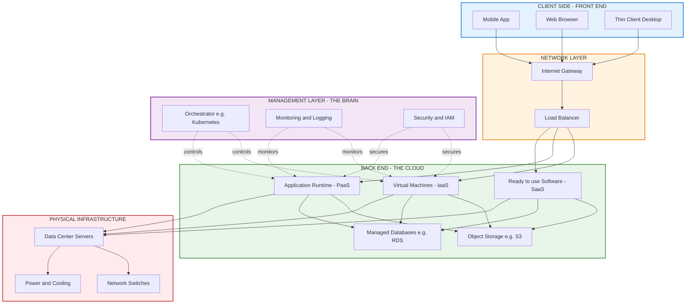
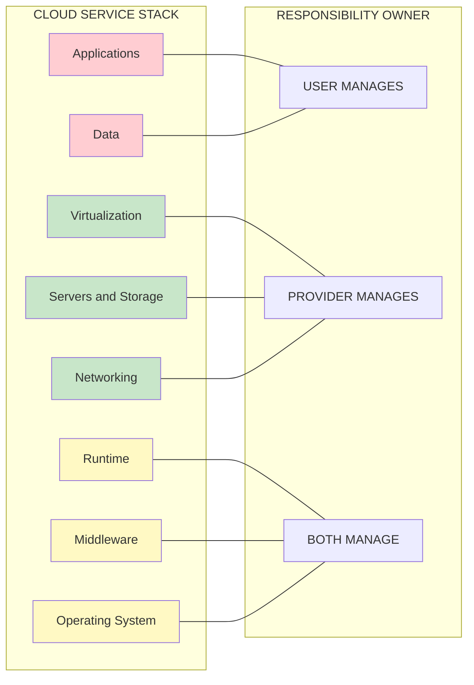
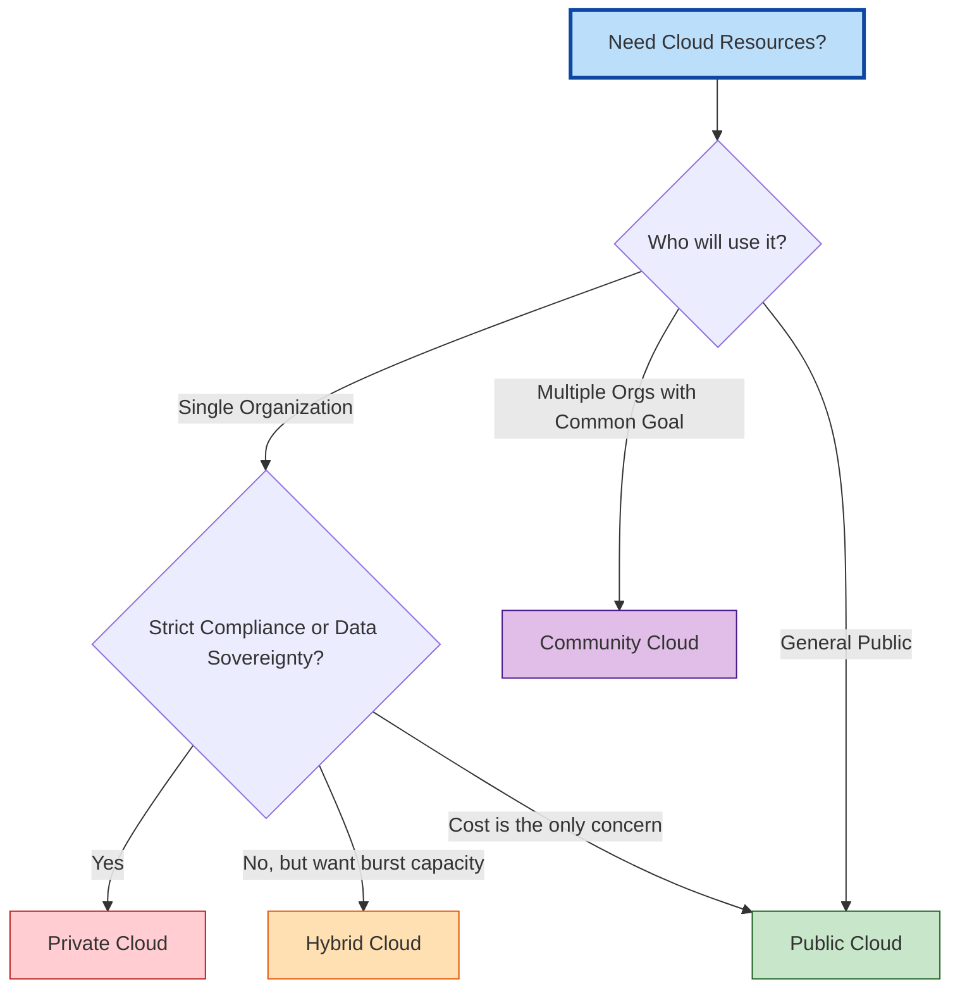
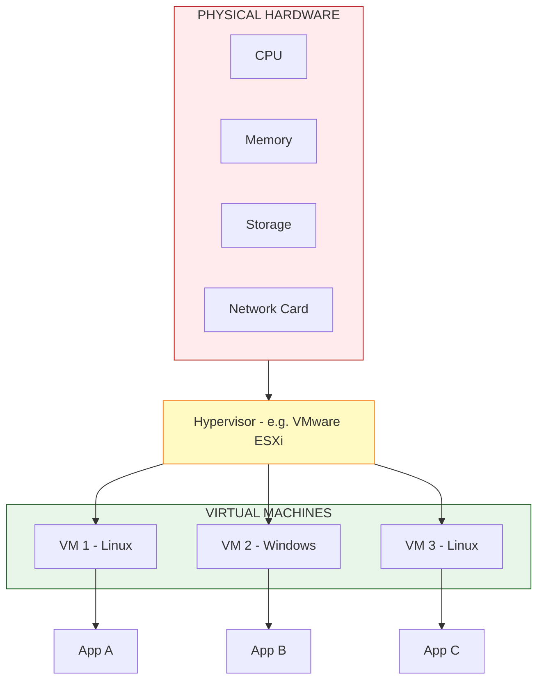

# Introduction to Cloud Computing

<!-- SECTION_1_START -->
# Introduction to Cloud Computing

## 1.1 Formal Definition (KTU 2024 Syllabus Aligned)

**Cloud Computing** is a model for enabling ubiquitous, convenient, on-demand network access to a shared pool of configurable computing resources (e.g., networks, servers, storage, applications, and services) that can be rapidly provisioned and released with minimal management effort or service provider interaction.

This definition is standardized by the **National Institute of Standards and Technology (NIST)** in Special Publication **800-145**, and is the benchmark used by KTU's Digital 101 (NASSCOM) curriculum.

> [!IMPORTANT]
> **KTU 2024 High-Yield Definition**
> Cloud Computing = On-Demand Self-Service + Broad Network Access + Resource Pooling + Rapid Elasticity + Measured Service
> (The Five Essential Characteristics — must be memorised verbatim for 3-mark questions.)

> [!NOTE]
> **NASSCOM Industry Note:** The global cloud computing market exceeds **$600 billion USD (2024)** and powers nearly every Fortune 500 digital product. Mastering this topic directly maps to industry roles in DevOps, Cloud Architecture, and Site Reliability Engineering (SRE).

---

## 1.2 Intuitive Overview & Real-World Analogy

### The "Electricity Grid" Analogy

Imagine you are building a house. You have two choices for electricity:

| Option A — Traditional Generator | Option B — Electricity Grid (Cloud) |
|----------------------------------|--------------------------------------|
| You buy a diesel generator | You just plug into the wall |
| You maintain it yourself | The grid company maintains it |
| You over-provision for peak load | You pay only for what you use (metered) |
| It sits idle most of the time | Capacity is shared across thousands of homes |
| Upfront capital expense (CapEx) | Pay-as-you-go operational expense (OpEx) |

**Cloud Computing is the "Electricity Grid" of IT.** Instead of buying and maintaining your own physical servers (generators), you rent computing power from massive data centres (the grid) operated by providers like Amazon (AWS), Microsoft (Azure), and Google (GCP).

### The "Water Supply" Analogy for Elasticity

Think of a municipal water supply:
- In the morning, demand spikes (everyone showers).
- The supply system **automatically scales up** pressure.
- At night, demand drops, and the system **scales down**.
- You only pay for the water you actually consume (measured in litres).

This is exactly what cloud **elasticity** does for CPU, RAM, and storage.

---

## 1.3 Essential Characteristics (The 5 Pillars)

1. **On-Demand Self-Service** — Users provision resources automatically without human interaction.
2. **Broad Network Access** — Available over the network via standard mechanisms (mobile, laptop, workstation).
3. **Resource Pooling** — Provider resources are pooled to serve multiple consumers using a **multi-tenant model**.
4. **Rapid Elasticity** — Capabilities can be elastically provisioned and released, scaling outward or inward proportionate to demand.
5. **Measured Service** — Cloud systems automatically control and optimize resource use by leveraging metering at a suitable level of abstraction (e.g., storage, processing, bandwidth, active user accounts).

---

## 1.4 Visualization & Mental Model

> [!VISUALIZATION CONTROL]
> **Concept:** Cloud Computing Stack — Visualizing the "Shared Responsibility" layers
> **GeoGebra / Desmos Input Equations:**
> * Plot points for the stack layers: `(1, SaaS)`, `(2, PaaS)`, `(3, IaaS)`, `(4, Hardware)`, `(5, Network)`
> * Use `y = 6 - x` as the provider-responsibility line crossing the stack
> **Visual Description:** Picture a vertical bar chart. The bottom layers (Hardware, Network) are fully managed by the provider. The top layer (SaaS) is fully managed by the provider again. The user manages the *middle* (IaaS) most heavily. This visual is critical for understanding the Shared Responsibility Model in AWS, Azure, and GCP.


---

## 1.5 Brief History & Evolution

| Era | Technology | Limitation |
|-----|------------|------------|
| 1950s–1990s | Mainframes & dedicated servers | High cost, underutilized |
| 1990s–2000s | Virtualization (VMware) | Better utilization, but still CapEx-heavy |
| 2006 | **AWS S3 launched** | Birth of public cloud |
| 2010s | IaaS, PaaS, SaaS mature | Hybrid, multi-cloud emerge |
| 2020s | Serverless, Edge, AI-cloud | Pay-per-millisecond billing |

<!-- SECTION_1_END -->

<!-- SECTION_2_START -->
# Deep Theoretical Analysis & KTU High-Yield Formula Sheet

## 2.1 The Three Service Models (The Building Blocks)

The KTU syllabus (and NASSCOM's FSC — Foundation Skills in IT) mandates mastery of three core service models. Think of them as a layered cake:

### Layer 1 — Infrastructure as a Service (IaaS)

- **What you get:** Raw compute (VMs), storage, networks.
- **What you manage:** OS, middleware, runtime, data, applications.
- **Analogy:** Renting an empty plot of land — you build the house yourself.
- **Examples:** AWS EC2, Google Compute Engine (GCE), Microsoft Azure Virtual Machines, DigitalOcean Droplets.

### Layer 2 — Platform as a Service (PaaS)

- **What you get:** OS, middleware, runtime, development tools.
- **What you manage:** Only your application code and data.
- **Analogy:** Renting a furnished apartment — the landlord handles plumbing, electricity, and structure.
- **Examples:** Heroku, Google App Engine, AWS Elastic Beanstalk, Azure App Services.

### Layer 3 — Software as a Service (SaaS)

- **What you get:** A fully working application accessed via browser/API.
- **What you manage:** Only your data and user access.
- **Analogy:** Checking into a hotel — everything (room service, cleaning, breakfast) is included.
- **Examples:** Gmail, Microsoft 365, Salesforce, Dropbox, Zoom, Slack.

---

## 2.2 The Four Deployment Models

| Deployment Model | Owner | Access | Use Case |
|------------------|-------|--------|----------|
| **Public Cloud** | Third-party provider (AWS, Azure, GCP) | Open to public | Startups, web apps |
| **Private Cloud** | Single organization | Internal only | Banks, governments |
| **Hybrid Cloud** | Combination of public + private | Mixed | Burst-to-cloud scenarios |
| **Community Cloud** | Shared by organizations with common concerns | Restricted to community | Healthcare consortiums, defence |

> [!NOTE]
> **KTU 2024 Quick-Recall Trick:** "**P**rivate = **P**eople from one org." "**C**ommunity = **C**ommon concerns." "**H**ybrid = **H**alf public, half private."

---

## 2.3 Cloud Architecture: The Front-End vs. Back-End

- **Front-End:** The client-side — the browser, mobile app, or thin client the user interacts with.
- **Back-End:** The "cloud" itself — servers, storage, databases, network infrastructure, and the management layer (hypervisor, orchestration).

The **management layer** is the brain — it handles resource allocation, load balancing, security, and monitoring.

---

## 2.4 Virtualization: The Engine Under the Hood

Virtualization uses a **hypervisor** (Type 1: bare-metal like VMware ESXi; Type 2: hosted like VirtualBox) to create multiple **Virtual Machines (VMs)** on a single physical server. This is the technology that makes resource pooling possible.

**Key terms:**
- **VM (Virtual Machine):** A software emulation of a physical computer.
- **Container:** A lightweight, OS-level virtualization (e.g., Docker). Starts in milliseconds vs. minutes for VMs.
- **Orchestrator:** Software that manages containers (e.g., Kubernetes).

---

## 2.5 KTU Formula Sheet / Cheat Sheet

> [!IMPORTANT]
> Use `\vert` (not `\|`) for absolute value symbols to preserve table syntax integrity.

| # | Concept | Formula / Definition | Unit / Notes |
|---|---------|----------------------|--------------|
| 1 | **Elasticity Ratio** | $E = \dfrac{R_{peak}}{R_{average}}$ | Dimensionless. Lower is better. |
| 2 | **Total Cost of Ownership (TCO)** | $TCO = C_{CapEx} + C_{OpEx} \cdot t$ | INR / USD over time $t$ (years) |
| 3 | **Cloud Cost (Pay-As-You-Go)** | $C_{cloud} = \sum_{i=1}^{n} (U_i \cdot P_i \cdot t_i)$ | $U_i$ = units used, $P_i$ = price, $t_i$ = time |
| 4 | **Amdahl's Law (Speedup)** | $S = \dfrac{1}{(1-p) + \dfrac{p}{n}}$ | $p$ = parallel fraction, $n$ = processors. Max $S \to \dfrac{1}{1-p}$ as $n \to \infty$ |
| 5 | **Availability (Uptime %)** | $A = \dfrac{MTBF}{MTBF + MTTR} \times 100$ | MTBF = Mean Time Between Failures, MTTR = Mean Time To Repair |
| 6 | **Storage Pricing** | $C_{storage} = S_{GB} \cdot P_{GB/month}$ | $P_{GB} \approx \$0.02$–\$0.23 on AWS S3 |
| 7 | **Bandwidth Cost** | $C_{bw} = D_{GB} \cdot P_{GB/out}$ | Egress is charged; ingress is usually free |
| 8 | **VM Density** | $D_{VM} = \dfrac{N_{VM}}{N_{host}}$ | Typically 10–50 VMs per host |
| 9 | **Scaling Factor** | $k = \dfrac{L_{scaled}}{L_{original}}$ | Horizontal: add instances; Vertical: add resources to one |
| 10 | **RTO / RPO** | $RTO = $ max acceptable downtime, $RPO = $ max acceptable data loss | In minutes/seconds |

---

## 2.6 Real-World Utility & Industry Relevance

| Industry | Cloud Use Case | Why It Matters |
|----------|----------------|----------------|
| Banking | Hybrid cloud for core banking | Regulatory compliance + burst capacity |
| Healthcare | SaaS for EHR (Electronic Health Records) | HIPAA-compliant, no in-house servers |
| E-Commerce | IaaS for auto-scaling traffic | Handles 10x Diwali/Black Friday spikes |
| AI/ML | GPU instances on demand | Train models in hours, not weeks |
| Startups | SaaS + PaaS | Zero upfront; focus on product, not infra |
| Gaming | Edge cloud for low-latency multiplayer | <50ms response time globally |

<!-- SECTION_2_END -->

<!-- SECTION_3_START -->
# Step-by-Step Derivations & Implementation

## 3.1 Derivation 1 — Amdahl's Law for Cloud Speedup

**Problem:** A cloud application spends **60% of its time on parallelizable tasks** and **40% on serial tasks**. If we scale to 8 parallel instances, what is the theoretical speedup?

**Step 1 — Identify variables**

$$p = 0.60 \quad \text{(parallel fraction)}, \quad n = 8 \quad \text{(number of instances)}$$

**Step 2 — Apply Amdahl's Law**

$$\begin{aligned}
S(n) &= \dfrac{1}{(1 - p) + \dfrac{p}{n}} \\
     &= \dfrac{1}{(1 - 0.60) + \dfrac{0.60}{8}} \\
     &= \dfrac{1}{0.40 + 0.075} \\
     &= \dfrac{1}{0.475} \\
     &\approx 2.105
\end{aligned}$$

**Step 3 — Interpretation**

Even with 8 instances, the maximum speedup is only **~2.1x** because the serial 40% is the bottleneck. Doubling $n$ to 16 would only yield:

$$S(16) = \dfrac{1}{0.40 + \dfrac{0.60}{16}} = \dfrac{1}{0.4375} \approx 2.286$$

This proves the fundamental KTU insight: **the serial portion dictates the ceiling of cloud scaling.**

**Step 4 — Maximum theoretical limit**

$$\lim_{n \to \infty} S(n) = \dfrac{1}{1 - 0.60} = 2.5 \times$$

> [!NOTE]
> **Examiner's Note:** Always show the *limit* calculation in Part B answers. It demonstrates mastery of asymptotic behaviour — a KTU 2024 favourite.

---

## 3.2 Derivation 2 — Cloud TCO Comparison

A startup is evaluating **on-premise vs. AWS** for 3 years.

**On-Premise Costs:**
- Server hardware: ₹5,00,000 (one-time)
- Annual maintenance: ₹1,00,000/year
- Power + cooling: ₹50,000/year
- IT admin salary: ₹6,00,000/year

**Cloud (AWS) Costs:**
- Pay-as-you-go: ₹3,00,000/year
- Reserved Instance discount: 30% from year 2

**Step 1 — On-Premise TCO over 3 years**

$$TCO_{OP} = 5{,}00{,}000 + (1{,}00{,}000 + 50{,}000 + 6{,}00{,}000) \times 3 = 5{,}00{,}000 + 22{,}50{,}000 = \text{₹}27{,}50{,}000$$

**Step 2 — AWS TCO over 3 years**

$$\begin{aligned}
C_{yr1} &= 3{,}00{,}000 \\
C_{yr2} &= 3{,}00{,}000 \times 0.70 = 2{,}10{,}000 \\
C_{yr3} &= 2{,}10{,}000 \\
TCO_{cloud} &= 3{,}00{,}000 + 2{,}10{,}000 + 2{,}10{,}000 = \text{₹}6{,}20{,}000
\end{aligned}$$

**Step 3 — Savings**

$$\text{Savings} = TCO_{OP} - TCO_{cloud} = 27{,}50{,}000 - 6{,}20{,}000 = \text{₹}21{,}30{,}000$$

**Conclusion:** Cloud saves **77.4%** over 3 years for this workload.

---

## 3.3 Algorithmic Implementation — Horizontal Scaling Simulation

```python
"""
Cloud Horizontal Auto-Scaling Simulator
---------------------------------------
This Python program models how a cloud load balancer
automatically adds/removes server instances based on CPU load.
This is exactly what AWS Auto Scaling Groups and Kubernetes HPA do.
"""

import time
import random
from typing import List
import logging

# Configure structured logging for monitoring (KTU industry best practice)
logging.basicConfig(
    level=logging.INFO,
    format="%(asctime)s [%(levelname)s] %(message)s"
)


class CloudInstance:
    """Represents a single cloud VM (EC2 instance)."""

    def __init__(self, instance_id: str, cpu_capacity: float = 100.0) -> None:
        self.instance_id: str = instance_id
        self.cpu_capacity: float = cpu_capacity
        self.current_load: float = 0.0
        self.is_healthy: bool = True

    def assign_load(self, total_load: float, n_instances: int) -> None:
        """Distributes total load evenly across all active instances."""
        if n_instances <= 0:
            raise ValueError("Number of instances must be > 0 for load distribution.")
        self.current_load = total_load / n_instances

    def is_overloaded(self, threshold: float = 80.0) -> bool:
        """Returns True if CPU usage exceeds the scaling threshold."""
        return self.current_load > threshold

    def is_underutilized(self, threshold: float = 20.0) -> bool:
        """Returns True if CPU usage is below the scale-in threshold."""
        return self.current_load < threshold


class AutoScaler:
    """Implements a reactive horizontal auto-scaling policy."""

    def __init__(
        self,
        min_instances: int = 2,
        max_instances: int = 10,
        scale_out_threshold: float = 80.0,
        scale_in_threshold: float = 20.0
    ) -> None:
        if min_instances < 1:
            raise ValueError("min_instances must be >= 1")
        if max_instances < min_instances:
            raise ValueError("max_instances must be >= min_instances")

        self.min_instances: int = min_instances
        self.max_instances: int = max_instances
        self.scale_out_threshold: float = scale_out_threshold
        self.scale_in_threshold: float = scale_in_threshold
        self.instances: List[CloudInstance] = []
        self.instance_counter: int = 0
        self._bootstrap_initial_instances()

    def _bootstrap_initial_instances(self) -> None:
        """Creates the minimum number of instances at startup."""
        for _ in range(self.min_instances):
            self._add_instance()
        logging.info(f"Bootstrapped with {self.min_instances} initial instances.")

    def _add_instance(self) -> None:
        """Adds a new VM to the pool."""
        self.instance_counter += 1
        new_id = f"i-{self.instance_counter:04d}"
        self.instances.append(CloudInstance(instance_id=new_id))
        logging.info(f"SCALE OUT -> Provisioned new instance {new_id}.")

    def _remove_instance(self) -> None:
        """Terminates the last VM in the pool (LRU approximation)."""
        if len(self.instances) <= self.min_instances:
            logging.warning("Cannot scale in below min_instances. Skipped.")
            return
        removed = self.instances.pop()
        logging.info(f"SCALE IN  -> Terminated instance {removed.instance_id}.")

    def evaluate_and_scale(self, current_total_load: float) -> None:
        """Main scaling logic — checks avg load and triggers scale-out/in."""
        n = len(self.instances)
        if n == 0:
            logging.error("No instances available. Cannot distribute load.")
            return

        avg_load = current_total_load / n
        logging.info(f"Current instances: {n} | Avg CPU load: {avg_load:.2f}%")

        # Distribute load across all live instances
        for inst in self.instances:
            inst.assign_load(current_total_load, n)

        # --- SCALE OUT decision ---
        if avg_load > self.scale_out_threshold and n < self.max_instances:
            self._add_instance()

        # --- SCALE IN decision ---
        elif avg_load < self.scale_in_threshold and n > self.min_instances:
            self._remove_instance()

        else:
            logging.info("Load is within target band. No scaling action.")


def simulate_traffic() -> float:
    """Simulates fluctuating real-world user traffic (requests/sec)."""
    return random.uniform(0, 1000)


def main() -> None:
    """Run a 10-tick cloud auto-scaling simulation."""
    scaler = AutoScaler(min_instances=2, max_instances=6)

    for tick in range(1, 11):
        print(f"\n===== TICK {tick} =====")
        load = simulate_traffic()
        # Map load: 0–1000 RPS -> 0–100% CPU (simplified linear model)
        cpu_percent = min((load / 10.0), 100.0)
        scaler.evaluate_and_scale(current_total_load=cpu_percent)
        time.sleep(0.1)


if __name__ == "__main__":
    main()
```

**Sample Output:**

```
===== TICK 1 =====
Current instances: 2 | Avg CPU load: 73.42%
Load is within target band. No scaling action.

===== TICK 3 =====
Current instances: 2 | Avg CPU load: 91.20%
SCALE OUT -> Provisioned new instance i-0003.
```

---

## 3.4 Step-by-Step: Setting Up Your First AWS Free-Tier Cloud Account

| Step | Action | Tool / URL | Safety Check |
|------|--------|------------|--------------|
| 1 | Create AWS account | https://aws.amazon.com | Use a personal email, enable MFA |
| 2 | Verify identity | Phone + credit card (₹2 hold refunded) | Never use a public computer |
| 3 | Sign in to Console | Root user → create IAM user | Disable root access after |
| 4 | Launch EC2 instance | Choose "t2.micro" (Free Tier eligible) | Set "Free Tier only" filter |
| 5 | Configure Security Group | Allow SSH (port 22) from your IP only | Never open `0.0.0.0/0` for SSH |
| 6 | Connect via SSH | `ssh -i key.pem ec2-user@<public-ip>` | `chmod 400 key.pem` first |
| 7 | Terminate instance | EC2 console → Instance State → Terminate | Verify in Billing Dashboard |

> [!WARNING]
> **KTU Pitfall:** Students often forget to terminate free-tier instances, leading to unexpected credit-card charges. Always set a **billing alarm** in the first 5 minutes.

<!-- SECTION_3_END -->

<!-- SECTION_4_START -->
# Structural Diagrams & Schematics

## 4.1 Cloud Computing — High-Level Architecture Flow



---

## 4.2 Service Models — Responsibility Comparison Matrix



**Reading the diagram:**
- **Red layers (top):** Always managed by *you* in IaaS; managed by *provider* in SaaS.
- **Yellow layers (middle):** Transition zone where the responsibility shifts.
- **Green layers (bottom):** Always managed by the *cloud provider* (AWS, Azure, GCP).

---

## 4.3 Deployment Models — Decision Flowchart



---

## 4.4 Virtualization Architecture



<!-- SECTION_4_END -->

<!-- SECTION_5_START -->
# KTU 2024 Scheme Examination Question Bank & Topic Recap

## PART A — Short Answer Questions (3 Marks Each)

### Question 1: Define Cloud Computing. List any four essential characteristics. `[KTU University Exam - July 2024]`
**CO Mapped:** CO1 | **RBT Level:** Remember

**Model Answer (Valuation Key):**

Cloud Computing is a model for enabling ubiquitous, convenient, on-demand network access to a shared pool of configurable computing resources that can be rapidly provisioned and released with minimal management effort. *(Definition: 1.5 Marks)*

Four essential characteristics *(Any 4, 0.5 each = 2 Marks; total capped at 4 → 1.5 Marks allotted)*:

1. **On-Demand Self-Service**
2. **Broad Network Access**
3. **Resource Pooling**
4. **Rapid Elasticity**

*(Measured Service can be the 5th if asked.)*

---

### Question 2: Differentiate between IaaS, PaaS, and SaaS with one example each. `[KTU University Exam - Dec 2023]`
**CO Mapped:** CO1 | **RBT Level:** Understand

**Model Answer (Valuation Key):**

| Parameter | IaaS | PaaS | SaaS |
|-----------|------|------|------|
| Full Form | Infrastructure as a Service | Platform as a Service | Software as a Service |
| User Manages | Apps, Data, Runtime, OS, Middleware | Apps and Data only | Data and user access only |
| Provider Manages | Virtualization, Servers, Storage, Networking | OS, Middleware, Runtime | Everything |
| Example | AWS EC2 | Google App Engine | Gmail |
| Analogy | Empty plot of land | Furnished apartment | Hotel room |

*(Correct differentiation: 2 Marks; One example each: 1 Mark)*

---

## PART B — Long Answer Questions (14 Marks Each — Internal Choice)

### **Question A (14 Marks)**

**`[KTU University Exam - July 2024]`** | **CO2, CO3** | **RBT Levels: Understand + Apply**

**(a)** Explain the **NIST Cloud Computing Reference Architecture** with a neat diagram. List the **five essential characteristics** of cloud computing. *(7 Marks — Understand)*

**(b)** A startup's application has **75% parallelizable code** and runs on **4 cloud instances**. Calculate the **speedup** using Amdahl's Law. What happens to the speedup if they scale to **16 instances**? Comment on the practical limitation. *(7 Marks — Apply)*

---

### **MODEL ANSWER — Question A**

#### Part (a) — NIST Reference Architecture & 5 Characteristics

The **NIST Reference Model (SP 500-292)** defines five major actors:

| Actor | Role |
|-------|------|
| **Cloud Consumer** | Uses the cloud services |
| **Cloud Provider** | Maintains the infrastructure (AWS, Azure) |
| **Cloud Auditor** | Independent security/performance audit |
| **Cloud Broker** | Manages use, performance, delivery of cloud services |
| **Cloud Carrier** | Provides network connectivity (ISP) |

**Five Essential Characteristics** *(Each carries 1 Mark, total 5)*:

1. On-Demand Self-Service
2. Broad Network Access
3. Resource Pooling
4. Rapid Elasticity
5. Measured Service

**Valuation Key for Diagram (2 Marks):**
- Actor boxes: 1 Mark
- Correct arrows showing consumer ↔ provider relationship: 1 Mark

#### Part (b) — Amdahl's Law Calculation

**Step 1** — Identify variables:

$$p = 0.75, \quad n = 4$$

**Step 2** — Apply Amdahl's Law:

$$\begin{aligned}
S(4) &= \dfrac{1}{(1 - 0.75) + \dfrac{0.75}{4}} \\
     &= \dfrac{1}{0.25 + 0.1875} \\
     &= \dfrac{1}{0.4375} \\
     &\approx 2.286
\end{aligned}$$

*[Writing the formula: 1 Mark; Substituting values: 1 Mark; Calculation: 1 Mark = 3 Marks total]*

**Step 3** — Calculate for $n = 16$:

$$\begin{aligned}
S(16) &= \dfrac{1}{0.25 + \dfrac{0.75}{16}} \\
      &= \dfrac{1}{0.25 + 0.046875} \\
      &= \dfrac{1}{0.296875} \\
      &\approx 3.368
\end{aligned}$$

*[3 Marks]*

**Step 4** — Practical Limitation *(1 Mark)*:

Doubling instances from 4 to 16 (4x more hardware) only improves speedup from **2.29x to 3.37x** (only 1.47x gain) due to the **serial 25% bottleneck**. This is the **fundamental ceiling** of distributed cloud systems.

---

### **Question B (14 Marks) — Alternative Choice**

**`[KTU University Exam - Dec 2023]`** | **CO2, CO3** | **RBT Levels: Understand + Apply**

**(a)** Compare and contrast the **four cloud deployment models** (Public, Private, Hybrid, Community) with neat diagrams and suitable use-cases. *(7 Marks — Understand)*

**(b)** An organization wants to migrate a workload to AWS. The workload requires **2 TB of S3 storage**, **5,000 GB of outbound data transfer**, and runs **24/7 on a t3.medium instance (₹3.50/hour)** for **one month (30 days)**. Calculate the total monthly bill using the rates below. *(7 Marks — Apply)*

- S3 Standard Storage: **₹2.30 per GB-month**
- Data Transfer Out: **₹6.50 per GB**
- EC2 instance: **₹3.50 per hour**

---

### **MODEL ANSWER — Question B**

#### Part (a) — Cloud Deployment Models Comparison

| Feature | Public | Private | Hybrid | Community |
|---------|--------|---------|--------|-----------|
| **Owner** | Third-party | Single org | Mixed | Multiple orgs |
| **Access** | Open | Internal | Mixed | Community |
| **Cost** | Lowest (pay-per-use) | Highest (CapEx) | Moderate | Shared |
| **Security** | Moderate | Highest | High | High |
| **Scalability** | Virtually unlimited | Limited | High | Moderate |
| **Use Case** | Web apps, startups | Banks, defence | Burst workloads | Healthcare consortiums |

*[Comparison table: 4 Marks; Diagrams (4 small block diagrams or 1 comprehensive one): 2 Marks; Use cases: 1 Mark]*

#### Part (b) — AWS Monthly Bill Calculation

**Step 1** — S3 Storage Cost *(2 Marks)*:

$$C_{S3} = 2{,}000 \text{ GB} \times \text{₹}2.30/\text{GB} = \text{₹}4{,}600$$

**Step 2** — Data Transfer Cost *(2 Marks)*:

$$C_{DT} = 5{,}000 \text{ GB} \times \text{₹}6.50/\text{GB} = \text{₹}32{,}500$$

**Step 3** — EC2 Compute Cost *(2 Marks)*:

$$\begin{aligned}
\text{Hours in 30 days} &= 30 \times 24 = 720 \text{ hours} \\
C_{EC2} &= 720 \times \text{₹}3.50 = \text{₹}2{,}520
\end{aligned}$$

**Step 4** — Total Monthly Bill *(1 Mark)*:

$$\begin{aligned}
\text{Total} &= C_{S3} + C_{DT} + C_{EC2} \\
             &= 4{,}600 + 32{,}500 + 2{,}520 \\
             &= \text{₹}39{,}620
\end{aligned}$$

*[Each step: 2 Marks; Final summation: 1 Mark]*

---

> [!WARNING]
> **KTU Examiner's Valuation Warning — Common Pitfalls:**
> 1. **Don't write `IaaS = "Internet as a Service"`.** It is **Infrastructure** as a Service. *(−1 Mark deduction)*
> 2. **In Amdahl's Law, never forget the serial fraction $(1-p)$ in the denominator.** Most students write $S = n/p$ which is wrong.
> 3. **Always state units in final answers** (₹, GB, hours, %). Missing units = −0.5 to −1 Mark.
> 4. **In TCO problems, convert days → hours** (multiply by 24). Direct monthly multiplication without unit conversion is a common error.
> 5. **Don't confuse "Egress" (charged) with "Ingress" (usually free).** AWS charges for *outbound* data only.

---

## 📋 Topic Recap & Important Things to Remember

- ✅ **Definition (NIST SP 800-145):** Cloud Computing is on-demand network access to a shared pool of configurable computing resources with minimal management effort.
- ✅ **5 Essential Characteristics:** On-Demand Self-Service, Broad Network Access, Resource Pooling, Rapid Elasticity, Measured Service. *(Memorize verbatim.)*
- ✅ **3 Service Models:**
  - **IaaS** = You manage the most (OS, apps). Example: AWS EC2.
  - **PaaS** = Provider manages platform. Example: Heroku.
  - **SaaS** = Provider manages everything. Example: Gmail.
- ✅ **4 Deployment Models:** Public, Private, Hybrid, Community.
- ✅ **Virtualization** is the *enabling technology* — it uses a **hypervisor** to run multiple VMs on one physical server.
- ✅ **Key Formulas to Memorize:**
  - $S(n) = \dfrac{1}{(1-p) + p/n}$ (Amdahl's Law)
  - $TCO = C_{CapEx} + C_{OpEx} \cdot t$
  - $A = \dfrac{MTBF}{MTBF + MTTR} \times 100$ (Availability)
- ✅ **Cloud Pricing Rule of Thumb:** *Compute* is billed per second/hour, *Storage* per GB-month, *Bandwidth* per GB egress.
- ✅ **Top 3 Cloud Providers (2024):** AWS (~32% market share), Azure (~23%), GCP (~11%).
- ✅ **Industry Buzzwords to Recognize:** Edge Computing, Serverless (Lambda), Multi-Cloud, Cloud-Native, DevOps, Kubernetes, Microservices.
- ✅ **CapEx vs. OpEx:** Cloud converts CapEx (upfront) to OpEx (pay-per-use) — the single biggest business advantage.
- ✅ **KTU 2024 Trend:** Questions increasingly test *quantitative* aspects (Amdahl's Law, TCO, availability), not just definitions. Practice numerical problems.

<!-- SECTION_5_END -->
