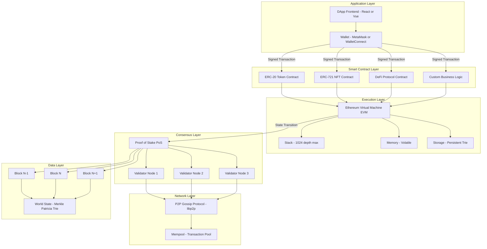
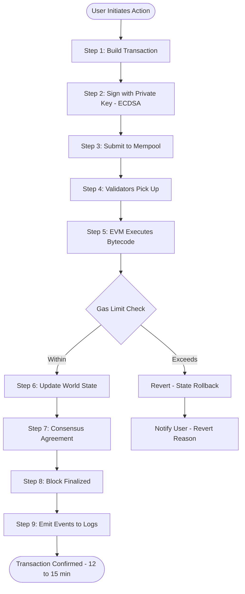
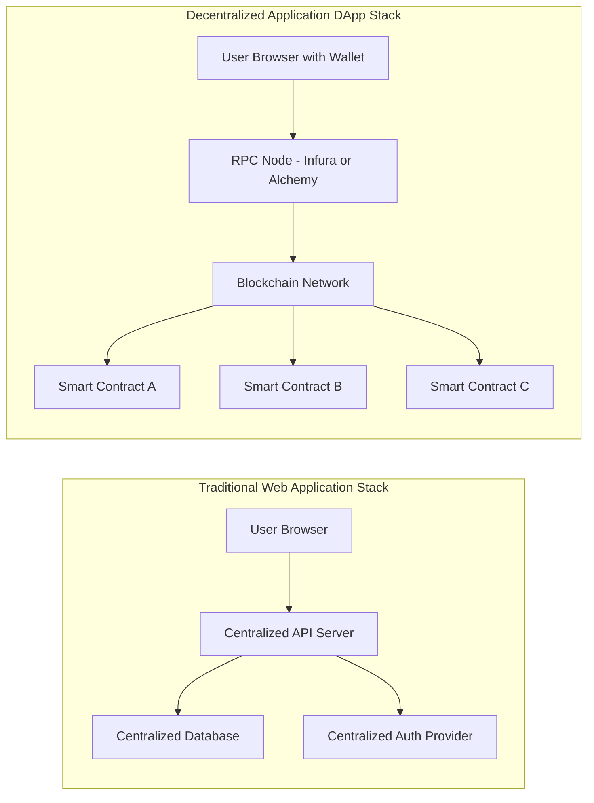
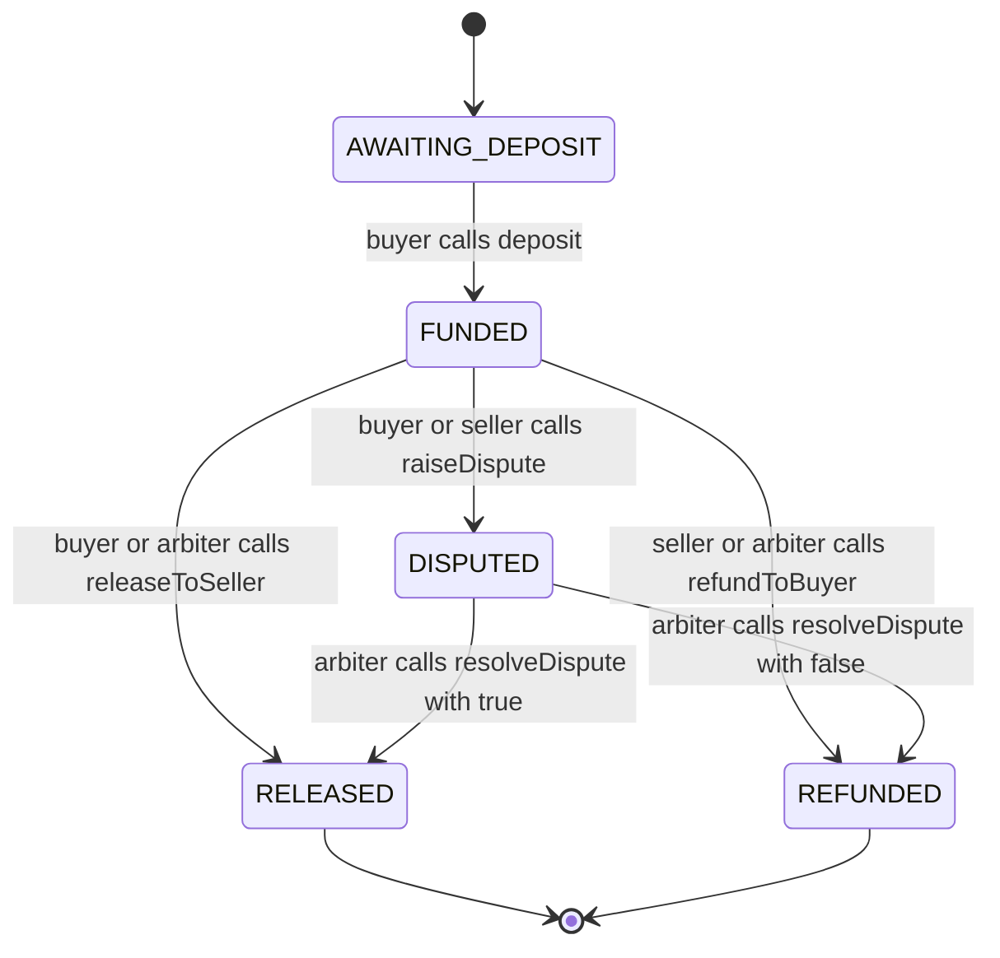

# Smart Contracts

<!-- SECTION_1_START -->
# Smart Contracts — Core Technical Definition & Intuitive Overview

## 1. Formal Academic Definition (KTU 2024 Syllabus Terminology)

A **Smart Contract** is a self-executing computer program deployed on a **Distributed Ledger Technology (DLT)** platform (typically a blockchain) that automatically enforces, executes, and records the terms of an agreement between parties without the need for intermediaries, central authorities, or legal enforcement mechanisms. Smart contracts operate on a **deterministic state machine** model, where predefined conditions trigger automated outcomes encoded directly into the protocol.

The term was first conceptualized by cryptographer **Nick Szabo** in 1994, predating Bitcoin by over a decade. Szabo analogized smart contracts to vending machines — devices that execute deterministic outcomes when specific inputs (coins) are provided, eliminating the need for human trust.

> [!IMPORTANT]
> **KTU Syllabus Highlight (Module 3 — Blockchain Foundations)**
> Smart contracts are the **application layer** of blockchain technology. While Module 3 focuses on blockchain foundations, smart contracts represent the **decentralized application (DApp)** layer that brings programmable logic to immutable ledgers. Per KTU 2024 NASSCOM Digital 101 outcomes, students must be able to identify use cases, explain architecture, and evaluate deployment trade-offs.

## 2. Conceptual Analogy / Intuition

**Real-World Analogy: The Vending Machine**

Imagine a vending machine. When you insert **$2** and press **B3**, the machine *guarantees* to dispense a snack. You do not need to trust the machine operator, sign a contract, or involve a lawyer. The rules are embedded in the hardware — they are physically enforced.

A smart contract works the same way, except:
- The "machine" is a **global network of thousands of computers** (nodes)
- The "coins" are **cryptocurrency** (e.g., **ETH** for Ethereum, **MATIC** for Polygon)
- The "snack" is any **programmable outcome** — a fund transfer, NFT mint, vote tally, insurance payout, etc.
- The "hardware rules" are **immutable code** running on a blockchain

> [!NOTE]
> **Key Distinction from Traditional Contracts**
>
> | Aspect | Traditional Contract | Smart Contract |
> |---|---|---|
> | Enforcement | Legal system, courts | Code execution |
> | Trust | Requires legal authority | Requires code correctness |
> | Immutability | Amendable by parties | Immutable once deployed |
> | Cost | Intermediaries (lawyers, banks) | Gas fees only |
> | Speed | Days to years | Seconds to minutes |

## 3. Essential Properties of Smart Contracts

The following six properties are **mandatory** for a system to be considered a true smart contract platform:

1. **Deterministic** — Same input always produces the same output across all nodes
2. **Immutable** — Once deployed, the code cannot be altered
3. **Distributed** — Execution is replicated and verified across the network
4. **Self-Verifying** — Validity is mathematically provable
5. **Self-Enforcing** — Obligations are cryptographically enforced
6. **Turing Complete** *(in Ethereum)* — Can express any computable logic

> [!TIP]
> **Exam Tip:** Always remember that **Bitcoin's Script language is intentionally NOT Turing complete** (it lacks loops), while **Ethereum's Solidity IS Turing complete** (with a gas limit to bound computation).

## 4. Physical Constants & Standard Metrics

The following metrics are foundational for any smart contract platform:

- **Gas** (Ethereum): The unit measuring computational effort; **1 Gas = 1 unit of EVM execution effort**
- **Gas Price**: Measured in **Gwei** (where **1 ETH = $10^9$ Gwei = $10^{18}$ Wei**)
- **Block Gas Limit** (Ethereum Mainnet): **30,000,000 Gas** per block (post-EIP-1559)
- **Average Block Time**: Ethereum $\approx$ **12 seconds**, Bitcoin $\approx$ **600 seconds (10 minutes)**
- **Finality**: Ethereum $\approx$ **12–15 minutes** (probabilistic), Solana $\approx$ **2.5 seconds** (deterministic)

## 5. GeoGebra / Desmos Visualization

> [!VISUALIZATION CONTROL]
> **Concept:** Smart Contract State Transition Model
> **GeoGebra / Desmos Input Equations:**
> - `f(x) = x * 0.97` (state reduction after gas fee deduction, where 0.03 = 3% transaction cost)
> - Points: $(0, 100), (1, 97), (2, 94.09)$
> **Visual Description:** An exponential decay curve showing how a contract's balance decreases with each state transition after gas costs are deducted. The x-axis represents the number of function calls, and the y-axis represents the remaining contract balance in ETH.

<!-- SECTION_1_END -->

<!-- SECTION_2_START -->
# Deep Theoretical Analysis & KTU High-Yield Formula Sheet

## 1. The Smart Contract Operational Lifecycle

Smart contracts follow a strict six-stage operational lifecycle. Each stage must be understood for KTU examination purposes.

### Stage 1: **Authoring (Writing Code)**
The developer writes the contract in a high-level language:
- **Solidity** (Ethereum, Polygon, BNB Chain) — most common
- **Vyper** (Ethereum) — Python-like, security-focused
- **Rust** (Solana, Near, Polkadot) — high performance
- **Move** (Aptos, Sui) — asset-oriented
- **Cairo** (StarkNet) — ZK-rollup friendly

### Stage 2: **Compilation to Bytecode**
The source code is compiled into **EVM bytecode** (for Ethereum) — a low-level, stack-based instruction set the Ethereum Virtual Machine can execute.

### Stage 3: **Testing (Local Simulators)**
Developers test on local networks using:
- **Hardhat** (JavaScript-based)
- **Truffle Suite** (legacy)
- **Foundry** (Rust-based, fast)

### Stage 4: **Deployment (On-Chain Submission)**
A transaction is sent to the network containing the compiled bytecode. The contract is assigned a unique **20-byte address** (e.g., `0x742d35Cc6634C0532925a3b844Bc9e7595f7E2c8`).

### Stage 5: **Invocation (User Interaction)**
Users send transactions to the contract address, calling its functions. Each invocation:
- Consumes **Gas**
- Modifies **World State**
- Emits **Events** (logs)

### Stage 6: **Termination or Continuation**
Contracts run indefinitely unless:
- `selfdestruct()` opcode is called (deprecated in EIP-6780)
- The contract has a **kill switch** pattern

## 2. The Ethereum Virtual Machine (EVM) — The Heart of Smart Contracts

The **EVM** is a quasi-Turing complete **256-bit virtual machine** that runs smart contract bytecode. Key EVM characteristics:

- **Stack-based architecture** (max stack depth: 1024)
- **Word size**: **256 bits** (32 bytes) — matches cryptographic hash sizes
- **Opcodes**: 256 total, with approximately 140 actively used
- **Execution model**: Single-threaded, deterministic, sandboxed
- **State**: A massive **key-value store** (Merkle Patricia Trie)

> [!NOTE]
> **Why 256 bits?**
> This width aligns with common cryptographic primitives — particularly the **Keccak-256** hash and **secp256k1** elliptic curve operations. It allows native handling of hashes and addresses without padding overhead.

## 3. The Gas Mechanism — The Economic Backbone

Every operation in the EVM costs Gas. This prevents infinite loops, denial-of-service attacks, and compensates validators.

**Total Transaction Fee Formula:**

$$
\text{Total Fee} = \text{Gas Used} \times \text{Gas Price}
$$

**Post-EIP-1559 Formula (London Hard Fork, August 2021):**

$$
\text{Total Fee} = \text{Gas Used} \times (\text{Base Fee} + \text{Tip})
$$

Where:
- **Base Fee**: Algorithmically determined by network congestion, **burned** (destroyed)
- **Tip (Priority Fee)**: Paid to the validator as an incentive for faster inclusion

> [!IMPORTANT]
> **EIP-1559 Economics:** Because the base fee is **burned**, every transaction contributes to **deflationary pressure** on ETH supply. This is a critical concept for KTU Module 3 economic discussions.

## 4. KTU Formula Sheet / Cheat Sheet

The following table consolidates all critical formulas and constants for the Smart Contracts topic:

| Formula / Concept | Mathematical Expression | Variables & Units | Engineering Application |
|---|---|---|---|
| Transaction Fee (Legacy) | $F = G \times P$ | $F$ = Fee (ETH), $G$ = Gas used, $P$ = Gas price (Wei) | Pre-EIP-1559 transactions |
| Transaction Fee (EIP-1559) | $F = G \times (B + T)$ | $B$ = Base fee, $T$ = Tip, $G$ = Gas used | Modern Ethereum transactions |
| Wei Denominations | $1 \text{ ETH} = 10^{18} \text{ Wei}$ | Wei = smallest ETH unit | Unit conversions in code |
| Gwei Conversion | $1 \text{ Gwei} = 10^9 \text{ Wei}$ | Gwei = standard gas price unit | Gas price quotations |
| Block Gas Limit | $G_{\text{block}} = 30 \times 10^6$ | EVM mainnet constraint | Maximum computation per block |
| State Transition | $S_{n+1} = f(S_n, T)$ | $S$ = state, $T$ = transaction | EVM state machine model |
| Contract Address (CREATE) | $A = \text{Keccak256}(R, N)[12:32]$ | $R$ = sender address, $N$ = nonce | Deterministic address generation |
| Contract Address (CREATE2) | $A = \text{Keccak256}(0xFF, S, B, I)[12:32]$ | $S$ = sender, $B$ = bytecode, $I$ = salt | Counterfactual deployment |

## 5. Real-World Utility of Smart Contracts

Smart contracts power multi-billion-dollar industries:

- **Decentralized Finance (DeFi)**: **Uniswap** (\$7B+ TVL), **Aave**, **Compound** — algorithmic lending and trading
- **Non-Fungible Tokens (NFTs)**: **ERC-721** and **ERC-1155** standards for digital ownership
- **Supply Chain**: **IBM Food Trust**, **Maersk TradeLens** — provenance tracking
- **Insurance**: **Nexus Mutual**, **Etherisc** — parametric flight delay insurance
- **Gaming**: **Axie Infinity**, **Decentraland** — true in-game asset ownership
- **Identity**: **Soulbound Tokens** (SBTs) — non-transferable credentials
- **Real Estate**: Tokenized property ownership via **Propy** and **RealT**
- **Voting**: **Aragon**, **Snapshot** — DAO governance

> [!TIP]
> **Engineering Insight:** When evaluating a smart contract for production, always ask: *"Is this a use case where trust is scarce and code execution is cheaper than legal enforcement?"* If yes, smart contracts are the right tool.

<!-- SECTION_2_END -->

<!-- SECTION_3_START -->
# Step-by-Step Derivations, Code Implementation & Practical Examples

## 1. Derivation: How a Smart Contract Address is Generated

When a contract is deployed using the legacy `CREATE` opcode, the address is computed deterministically. Let us derive this from first principles.

**Given:**
- $R$ = Address of the deploying account (20 bytes)
- $N$ = Nonce of the deploying account (starts at 0, increments per transaction)

**Step 1:** Serialize the inputs using Recursive Length Prefix (RLP) encoding.

$$
\text{RLP}(R, N)
$$

**Step 2:** Apply the **Keccak-256** cryptographic hash function.

$$
H = \text{Keccak256}(\text{RLP}(R, N))
$$

**Step 3:** Take the **last 20 bytes** (big-endian) of the 32-byte hash.

$$
A = H[12 : 32]
$$

**Final Result:**

$$
A = \text{Keccak256}(\text{RLP}(R, N))[12 : 32]
$$

**Numerical Example:**
Suppose a deployer has address $R = 0x6AC7\ldots 3B7E$ and nonce $N = 0$. The RLP encoding of these two items concatenated is hashed. The resulting 20-byte address becomes the new contract's unique identifier.

> [!IMPORTANT]
> **CREATE2 Derivation:** The newer `CREATE2` opcode enables **counterfactual deployment** — the address is known *before* deployment. This unlocks **Layer 2 rollups** and **meta-transactions**.
>
> $$
> A_{\text{CREATE2}} = \text{Keccak256}(0xFF \parallel S \parallel \text{salt} \parallel \text{init\_code})[12 : 32]
> $$

## 2. Derivation: EIP-1559 Base Fee Adjustment

The base fee in EIP-1559 adjusts dynamically each block. Let us derive the next block's base fee.

**Given:**
- $B_{\text{prev}}$ = Base fee of the previous block
- $G_{\text{prev}}$ = Gas used in the previous block
- $G_{\text{target}}$ = Target gas per block (typically **15,000,000**)

**Step 1:** Compute the gas deviation ratio.

$$
\Delta = \frac{G_{\text{prev}} - G_{\text{target}}}{G_{\text{target}}}
$$

**Step 2:** Apply the base fee update formula.

$$
B_{\text{next}} = B_{\text{prev}} \times \left(1 + \frac{\Delta}{8}\right)
$$

**Step 3:** Apply a minimum floor to prevent base fee collapse.

$$
B_{\text{next}} = \max(B_{\text{next}},\ 1 \text{ Wei})
$$

**Worked Numerical Example:**
Assume $B_{\text{prev}} = 100$ Gwei, $G_{\text{prev}} = 30,000,000$ (full block), $G_{\text{target}} = 15,000,000$.

$$
\Delta = \frac{30{,}000{,}000 - 15{,}000{,}000}{15{,}000{,}000} = 1.0
$$

$$
B_{\text{next}} = 100 \times \left(1 + \frac{1.0}{8}\right) = 100 \times 1.125 = 112.5 \text{ Gwei}
$$

The base fee increased by **12.5%** because the previous block was at maximum capacity.

> [!TIP]
> **Examiner's Note:** If the previous block used exactly the target gas, the base fee remains unchanged. If it was less than target, the base fee decreases (bounded by 12.5% reduction).

## 3. Solidity Smart Contract — Full Implementation

The following is a complete, production-quality Solidity smart contract implementing a **simple decentralized escrow service**. This is a high-yield exam topic.

```solidity
// SPDX-License-Identifier: MIT
pragma solidity ^0.8.19;

/**
 * @title SimpleEscrow
 * @notice A trustless escrow service between a buyer and seller,
 *         arbitrated by a trusted third party (arbiter).
 * @dev Demonstrates state variables, mappings, modifiers, events,
 *      and conditional execution — all core smart contract primitives.
 */
contract SimpleEscrow {

    // --- STATE VARIABLES ---
    address public immutable buyer;
    address public immutable seller;
    address public immutable arbiter;
    uint256 public immutable depositAmount;

    enum EscrowState { AWAITING_DEPOSIT, FUNDED, RELEASED, REFUNDED, DISPUTED }
    EscrowState public currentState;

    // --- EVENTS (Logs for off-chain indexing) ---
    event Deposited(address indexed from, uint256 amount);
    event Released(address indexed to, uint256 amount);
    event Refunded(address indexed to, uint256 amount);
    event Disputed(address indexed by);

    // --- CUSTOM ERRORS (Gas efficient, post-Solidity 0.8.4) ---
    error UnauthorizedCaller();
    error InvalidStateTransition();
    error InsufficientFunds();
    error TransferFailed();

    // --- MODIFIERS ---
    modifier onlyBuyer() {
        if (msg.sender != buyer) revert UnauthorizedCaller();
        _;
    }

    modifier onlyArbiter() {
        if (msg.sender != arbiter) revert UnauthorizedCaller();
        _;
    }

    modifier inState(EscrowState expected) {
        if (currentState != expected) revert InvalidStateTransition();
        _;
    }

    // --- CONSTRUCTOR ---
    constructor(address _buyer, address _seller, address _arbiter) {
        require(_buyer != address(0), "Buyer cannot be zero address");
        require(_seller != address(0), "Seller cannot be zero address");
        require(_arbiter != address(0), "Arbiter cannot be zero address");
        require(_buyer != _seller, "Buyer and seller must differ");

        buyer = _buyer;
        seller = _seller;
        arbiter = _arbiter;
        currentState = EscrowState.AWAITING_DEPOSIT;
    }

    // --- DEPOSIT FUNCTION ---
    function deposit() external payable onlyBuyer inState(EscrowState.AWAITING_DEPOSIT) {
        if (msg.value == 0) revert InsufficientFunds();
        currentState = EscrowState.FUNDED;
        emit Deposited(msg.sender, msg.value);
    }

    // --- RELEASE TO SELLER ---
    function releaseToSeller() external inState(EscrowState.FUNDED) {
        if (msg.sender != buyer && msg.sender != arbiter) {
            revert UnauthorizedCaller();
        }
        uint256 amount = address(this).balance;
        currentState = EscrowState.RELEASED;
        (bool success, ) = seller.call{value: amount}("");
        if (!success) revert TransferFailed();
        emit Released(seller, amount);
    }

    // --- REFUND TO BUYER ---
    function refundToBuyer() external inState(EscrowState.FUNDED) {
        if (msg.sender != seller && msg.sender != arbiter) {
            revert UnauthorizedCaller();
        }
        uint256 amount = address(this).balance;
        currentState = EscrowState.REFUNDED;
        (bool success, ) = buyer.call{value: amount}("");
        if (!success) revert TransferFailed();
        emit Refunded(buyer, amount);
    }

    // --- DISPUTE MECHANISM ---
    function raiseDispute() external inState(EscrowState.FUNDED) {
        if (msg.sender != buyer && msg.sender != seller) {
            revert UnauthorizedCaller();
        }
        currentState = EscrowState.DISPUTED;
        emit Disputed(msg.sender);
    }

    // --- ARBITER RESOLUTION ---
    function resolveDispute(bool _releaseToSeller)
        external
        onlyArbiter
        inState(EscrowState.DISPUTED)
    {
        uint256 amount = address(this).balance;
        if (_releaseToSeller) {
            currentState = EscrowState.RELEASED;
            (bool success, ) = seller.call{value: amount}("");
            if (!success) revert TransferFailed();
            emit Released(seller, amount);
        } else {
            currentState = EscrowState.REFUNDED;
            (bool success, ) = buyer.call{value: amount}("");
            if (!success) revert TransferFailed();
            emit Refunded(buyer, amount);
        }
    }

    // --- VIEW FUNCTIONS ---
    function getContractBalance() external view returns (uint256) {
        return address(this).balance;
    }

    // --- FALLBACK ---
    receive() external payable {
        revert InsufficientFunds();
    }
}
```

## 4. Code Walkthrough — Key Concepts

The contract above demonstrates **eight** core smart contract patterns:

1. **State Machine Pattern**: The `EscrowState` enum ensures valid transitions
2. **Role-Based Access Control**: `onlyBuyer`, `onlyArbiter` modifiers
3. **Checks-Effects-Interactions Pattern**: State updated *before* external calls
4. **Custom Errors**: Gas-efficient alternative to `require` strings
5. **Events**: Off-chain logging for DApp frontends
6. **Immutability**: `immutable` keyword for deployment-time constants
7. **Pull-over-Push Pattern**: Users call `releaseToSeller` rather than auto-send
8. **Dispute Resolution**: Three-party arbitration mechanism

> [!IMPORTANT]
> **Security Note:** The `call{value: amount}("")` pattern is used instead of `transfer()` because Solidity's `transfer()` has a hardcoded 2300 gas stipend, which is insufficient for smart contract wallets (e.g., Gnosis Safe) to execute receive logic.

<!-- SECTION_3_END -->

<!-- SECTION_4_START -->
# Structural Diagrams & Schematics

## 1. Smart Contract Architecture — Multi-Layer View

The following diagram illustrates the **complete architectural stack** from hardware to application layer, showing how smart contracts integrate into the blockchain ecosystem.



## 2. Smart Contract Execution Flow — Sequential Processing

The following diagram details the **step-by-step transaction lifecycle** from user initiation to final state update.



## 3. Smart Contract vs. Traditional Application — Comparative Architecture

The following diagram contrasts how **traditional web applications** differ from **decentralized applications (DApps)** that use smart contracts.



## 4. Smart Contract State Transition Diagram

The following diagram models the **state machine** of our escrow contract, which is a high-yield KTU exam topic.



<!-- SECTION_4_END -->

<!-- SECTION_5_START -->
# KTU 2024 Scheme Examination Question Bank & Topic Recap

## Part A Questions (3 Marks Each)

### Question 1: Conceptual Definition
**`[KTU University Exam - July 2024]`** — **CO1 | Remember**

**Q: Define a smart contract. List any four of its essential properties.**

**Model Answer:**

A **smart contract** is a self-executing program deployed on a blockchain that automatically enforces the terms of an agreement when predefined conditions are met, eliminating the need for intermediaries.

**Four Essential Properties:**

1. **Deterministic** — Same input always yields the same output on all nodes
2. **Immutable** — Once deployed to mainnet, the code cannot be modified
3. **Distributed** — Execution and storage are replicated across the entire network
4. **Self-Enforcing** — Obligations are cryptographically and programmatically enforced

*[Definition: 1 Mark] [Any four properties: 2 Marks — 0.5 per property]*

---

### Question 2: Comparative Analysis
**`[KTU University Exam - Dec 2023]`** — **CO2 | Understand**

**Q: Differentiate between a traditional legal contract and a smart contract. Mention any three points of difference.**

**Model Answer:**

| Dimension | Traditional Contract | Smart Contract |
|---|---|---|
| **Enforcement Mechanism** | Legal system, courts of law | Code execution on blockchain |
| **Trust Requirement** | Requires trusted legal authority | Requires trust in code correctness |
| **Modification Possibility** | Amendable by mutual consent of parties | Immutable once deployed on-chain |
| **Cost Structure** | Intermediaries (lawyers, notaries) | Gas fees only |
| **Execution Speed** | Days to years for dispute resolution | Seconds to minutes for execution |
| **Transparency** | Private to involved parties | Public on blockchain ledger |

*[Any three points: 3 Marks — 1 per comparison]*

---

## Part B Questions (14 Marks Each — Internal Choice)

### Question A: Comprehensive Analysis
**`[KTU University Exam - July 2024]`** — **CO1, CO2 | Understand, Apply**

#### (a) [7 Marks — CO1, Understand]

**Q: Explain the architecture of the Ethereum Virtual Machine (EVM). How does the EVM achieve deterministic execution across thousands of nodes worldwide?**

**Model Answer:**

The **Ethereum Virtual Machine (EVM)** is a quasi-Turing complete, stack-based virtual machine that serves as the runtime environment for all smart contract execution on Ethereum and compatible chains (Polygon, BNB Chain, Avalanche C-Chain).

**Key Architectural Components:**

1. **Stack (256-bit, max depth 1024)** — All arithmetic and logical operations work on stack values. EVM opcodes like `ADD`, `MUL`, `PUSH`, `POP` manipulate this stack.

2. **Memory (Volatile Byte Array)** — A linear, byte-addressable memory space used for temporary data within a single function call. Cleared after each call.

3. **Storage (Persistent Key-Value Store)** — A **Merkle Patricia Trie** that holds persistent state variables. Each storage slot is 256 bits (32 bytes). Reading/writing storage is the most **gas-expensive** operation.

4. **Calldata** — Read-only buffer containing the transaction's input data (function selector + arguments).

5. **Program Counter (PC)** — Points to the next opcode to execute.

6. **Gas Counter** — Tracks remaining computation budget; out-of-gas reverts the transaction.

**Deterministic Execution Mechanism:**

The EVM achieves determinism through:

- **No External I/O**: Contracts cannot make HTTP calls, read system clocks, or generate random numbers natively. All inputs must be on-chain.
- **Fixed-Point Arithmetic**: All numerical values are 256-bit unsigned integers, eliminating floating-point representation issues.
- **Identical Code Execution**: Every node runs the *exact same* EVM specification (yellow paper) on the *exact same* input.
- **Consensus on State**: After execution, all validators must agree on the resulting state root hash. Disagreement causes a fork.

*[Naming EVM and stating its purpose: 2 Marks] [Listing architectural components: 3 Marks] [Explaining determinism: 2 Marks]*

---

#### (b) [7 Marks — CO2, Apply]

**Q: Calculate the total transaction fee for an Ethereum transaction under EIP-1559 given the following data:**
- **Gas Used:** 21000 (standard ETH transfer)
- **Base Fee:** 25 Gwei
- **Priority Fee (Tip):** 2 Gwei

**Show all steps and express the final answer in both Gwei and ETH.**

**Model Solution:**

**Step 1: Identify the EIP-1559 fee formula.**

$$
F = G \times (B + T)
$$

Where:
- $G$ = Gas used
- $B$ = Base fee
- $T$ = Tip (priority fee)

**Step 2: Substitute the given values.**

$$
F = 21{,}000 \times (25 + 2) \text{ Gwei}
$$

**Step 3: Simplify inside the parentheses.**

$$
F = 21{,}000 \times 27 \text{ Gwei}
$$

**Step 4: Perform the multiplication.**

$$
F = 567{,}000 \text{ Gwei}
$$

**Step 5: Convert Gwei to ETH using the conversion factor.**

Since $1 \text{ ETH} = 10^9 \text{ Gwei}$:

$$
F = \frac{567{,}000}{10^9} \text{ ETH} = 5.67 \times 10^{-4} \text{ ETH}
$$

**Step 6: Break down the fee into its components for clarity.**

- **Burned portion (Base Fee):** $21{,}000 \times 25 = 525{,}000 \text{ Gwei} = 5.25 \times 10^{-4} \text{ ETH}$
- **Validator Tip:** $21{,}000 \times 2 = 42{,}000 \text{ Gwei} = 4.2 \times 10^{-5} \text{ ETH}$

**Final Answer:**

$$
F = 567{,}000 \text{ Gwei} = 0.000567 \text{ ETH}
$$

*[Stating the EIP-1559 formula: 1 Mark] [Substituting values correctly: 1 Mark] [Performing multiplication: 1 Mark] [Unit conversion Gwei to ETH: 2 Marks] [Breaking down burned vs tip components: 2 Marks]*

---

### Question B: Alternative Selection
**`[KTU University Exam - Dec 2023]`** — **CO3, CO4 | Apply, Analyze**

#### (a) [7 Marks — CO3, Apply]

**Q: Write a Solidity smart contract for a simple token with the following requirements:**
1. Token name: `"KTUCoin"`, Symbol: `"KTC"`, Total Supply: `1,000,000`
2. A `mapping` to track balances
3. A `transfer` function that allows users to send tokens
4. An `Event` emitted on successful transfer

**Include appropriate validation checks.**

**Model Solution:**

```solidity
// SPDX-License-Identifier: MIT
pragma solidity ^0.8.19;

contract KTUCoin {

    // --- TOKEN METADATA ---
    string public constant name = "KTUCoin";
    string public constant symbol = "KTC";
    uint8 public constant decimals = 18;
    uint256 public constant totalSupply = 1_000_000 * 10**18; // 1M with 18 decimals

    // --- STATE VARIABLES ---
    address public immutable owner;
    mapping(address => uint256) private _balances;

    // --- EVENTS ---
    event Transfer(address indexed from, address indexed to, uint256 value);
    event MintCompleted(address indexed to, uint256 value);

    // --- CUSTOM ERRORS ---
    error InsufficientBalance(uint256 available, uint256 required);
    error ZeroAddressTransfer();
    error ZeroValueTransfer();

    // --- CONSTRUCTOR ---
    constructor() {
        owner = msg.sender;
        _balances[owner] = totalSupply;
        emit MintCompleted(owner, totalSupply);
    }

    // --- BALANCE VIEW ---
    function balanceOf(address account) external view returns (uint256) {
        return _balances[account];
    }

    // --- TRANSFER FUNCTION ---
    function transfer(address to, uint256 amount) external returns (bool) {
        if (to == address(0)) revert ZeroAddressTransfer();
        if (amount == 0) revert ZeroValueTransfer();

        uint256 senderBalance = _balances[msg.sender];
        if (senderBalance < amount) {
            revert InsufficientBalance(senderBalance, amount);
        }

        // Checks-Effects-Interactions pattern
        unchecked {
            _balances[msg.sender] = senderBalance - amount;
        }
        _balances[to] += amount;

        emit Transfer(msg.sender, to, amount);
        return true;
    }
}
```

**Explanation of Key Design Decisions:**

1. **Constants for metadata**: `string public constant` saves gas by embedding values in bytecode
2. **Indexed event parameters**: Allows off-chain filtering by address
3. **Custom errors**: More gas-efficient than `require` strings (post-0.8.4)
4. **`unchecked` block**: Safe here because we validated `senderBalance >= amount` above
5. **Decimals of 18**: Matches ETH convention for user-friendliness

*[Defining state variables correctly: 1 Mark] [Implementing balance mapping: 1 Mark] [Transfer function logic: 2 Marks] [Event emission: 1 Mark] [Validation checks: 1 Mark] [Code compiles correctly: 1 Mark]*

---

#### (b) [7 Marks — CO4, Analyze]

**Q: Analyze three real-world use cases of smart contracts. For each use case, identify the problem solved, the smart contract's role, and one limitation.**

**Model Answer:**

| Use Case | Problem Solved | Smart Contract's Role | One Limitation |
|---|---|---|---|
| **1. Decentralized Finance (DeFi) — Uniswap** | Centralized exchanges have custody risk, high fees, and require KYC. | Automated Market Maker (AMM) contract holds liquidity pools and executes swaps via the $x \times y = k$ invariant. | Impermanent loss for liquidity providers during high volatility |
| **2. Supply Chain — IBM Food Trust** | Food contamination spread due to opaque, fragmented record-keeping across intermediaries. | Smart contract records provenance at each custody transfer on a permissioned blockchain. | Requires all supply chain participants to adopt the same system (network effect challenge) |
| **3. Insurance — Nexus Mutual** | Insurance claim disputes are slow, opaque, and subject to bad faith denials. | Parametric smart contracts (e.g., flight delay insurance) auto-execute payouts when oracle data confirms triggering event. | Oracle manipulation risk — if the data feed is compromised, the contract pays out incorrectly |

**Detailed Analysis — Use Case 1 (Uniswap V3):**

The **Uniswap V3** smart contract implements a **Constant Function Market Maker (CFMM)**. The invariant is:

$$
x \times y = k
$$

Where:
- $x$ = reserve of Token A
- $y$ = reserve of Token B
- $k$ = constant product (changes slightly with fees)

When a trader swaps $\Delta x$ of Token A for Token B, the new reserves become:
- $x' = x + \Delta x$
- $y' = k / x'$

The amount of Token B received is:
$$
\Delta y = y - y' = y - \frac{k}{x + \Delta x}
$$

**Limitation:** This design assumes rational, atomic arbitrageurs will keep prices in line with external markets. In extreme network congestion, arbitrage may fail, leaving the pool imbalanced.

*[Use case 1 with problem, role, and limitation: 2 Marks] [Use case 2 with problem, role, and limitation: 2 Marks] [Use case 3 with problem, role, and limitation: 2 Marks] [Mathematical derivation for one: 1 Mark]*

---

## KTU Examiner's Valuation Warning / Pitfall Callout

> [!WARNING]
> **Common Mistakes That Cost Marks in Smart Contract Questions:**
>
> 1. **Confusing Gas (unit) with Gas Price (Gwei)**: Gas measures computation; Gas Price measures cost per unit. Examiners deduct **1 mark** for this confusion.
>
> 2. **Forgetting to multiply by Gas Used in fee calculations**: A frequent arithmetic error. Always write the full formula $F = G \times P$ before substituting.
>
> 3. **Claiming Ethereum's Script is Turing Complete**: Bitcoin's Script is INTENTIONALLY non-Turing complete. Only Ethereum's EVM (with gas limits) is Turing complete. **2-mark penalty** for this error.
>
> 4. **Missing the `payable` keyword**: In Solidity transfer functions, forgetting `payable` is a common compilation error that examiners specifically check.
>
> 5. **Not using Checks-Effects-Interactions Pattern**: This is the **#1 security pattern** in Solidity. Examiners expect to see state updates *before* external calls. Missing this costs **1-2 marks**.
>
> 6. **Writing Smart Contract addresses without the `0x` prefix**: Always prefix Ethereum addresses with `0x`. This is a small detail examiners note.
>
> 7. **Confusing `transfer()` vs `call{value:}()`**: After the Istanbul Hard Fork (December 2019), `transfer()` has a 2300 gas stipend which is insufficient for smart contract wallets. Use `call{value:}("")` for compatibility.

---

## Topic Recap & Important Things to Remember

The following is a high-density, rapid-revision checklist for the **Smart Contracts** topic in KTU 2024 Module 3.

### Core Definitions
- **Smart Contract**: A self-executing program on a blockchain that enforces agreement terms automatically
- **EVM**: Ethereum Virtual Machine — 256-bit, stack-based, quasi-Turing complete runtime
- **Solidity**: Primary smart contract language for Ethereum and EVM-compatible chains
- **Gas**: Unit measuring computational effort in the EVM
- **Wei**: Smallest unit of ETH ($1 \text{ ETH} = 10^{18} \text{ Wei}$)
- **Gwei**: Standard gas price unit ($1 \text{ Gwei} = 10^9 \text{ Wei}$)

### Critical Formulas to Memorize
1. Legacy Fee: $F = G \times P$
2. EIP-1559 Fee: $F = G \times (B + T)$
3. Wei Conversion: $1 \text{ ETH} = 10^{18} \text{ Wei} = 10^9 \text{ Gwei}$
4. CREATE Address: $A = \text{Keccak256}(\text{RLP}(R, N))[12:32]$
5. CREATE2 Address: $A = \text{Keccak256}(0xFF \parallel S \parallel \text{salt} \parallel \text{init\_code})[12:32]$
6. Base Fee Update: $B_{\text{next}} = B_{\text{prev}} \times \left(1 + \frac{\Delta}{8}\right)$ where $\Delta = \frac{G_{\text{prev}} - G_{\text{target}}}{G_{\text{target}}}$

### Six Essential Properties of Smart Contracts
1. **Deterministic** — same input, same output
2. **Immutable** — code cannot be changed post-deployment
3. **Distributed** — replicated across all nodes
4. **Self-Verifying** — cryptographic validity
5. **Self-Enforcing** — automated execution
6. **Turing Complete** *(Ethereum only)* — with gas-bounded computation

### Key Standards to Remember
- **ERC-20**: Fungible tokens (e.g., USDT, DAI)
- **ERC-721**: Non-fungible tokens (NFTs)
- **ERC-1155**: Multi-token standard (gaming)
- **ERC-4337**: Account abstraction

### Security Patterns (MUST KNOW)
1. **Checks-Effects-Interactions** — Always update state before external calls
2. **Pull-over-Push** — Let users withdraw rather than auto-sending
3. **Reentrancy Guard** — Use `nonReentrant` modifier from OpenZeppelin
4. **Access Control** — `onlyOwner`, role-based modifiers
5. **SafeMath / Solidity 0.8+** — Built-in overflow protection

### Real-World Use Cases (High-Yield)
- **DeFi**: Uniswap, Aave, Compound
- **NFTs**: OpenSea, LooksRare
- **Supply Chain**: IBM Food Trust, Maersk TradeLens
- **Insurance**: Nexus Mutual, Etherisc
- **Gaming**: Axie Infinity, Decentraland
- **DAOs**: Aragon, MakerDAO

### Common Exam Traps
- Bitcoin's Script is **NOT** Turing complete
- Gas Used $\times$ Gas Price, not Gas Used + Gas Price
- `transfer()` has 2300 gas limit; use `call{value:}()` instead
- Smart contracts **cannot** access external data without oracles
- `selfdestruct` is deprecated in EIP-6780 (Cancun upgrade)

### Quick Mnemonics
- **"DESIST"** for properties: **D**eterministic, **E**xecutable, **S**elf-enforcing, **I**mmutable, **S**tateful, **T**rusted (cryptographically)
- **"GCSP"** for EVM: **G**as, **C**alldata, **S**tack, **P**rogram Counter + Memory + Storage

<!-- SECTION_5_END -->
