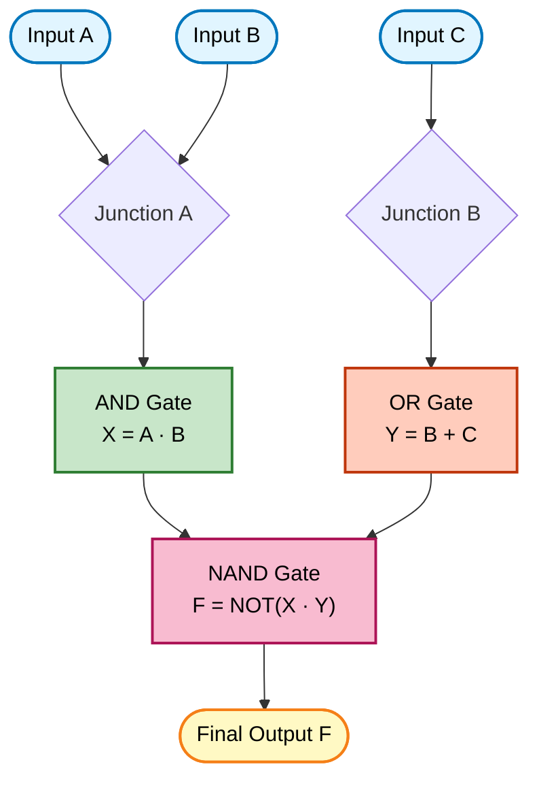
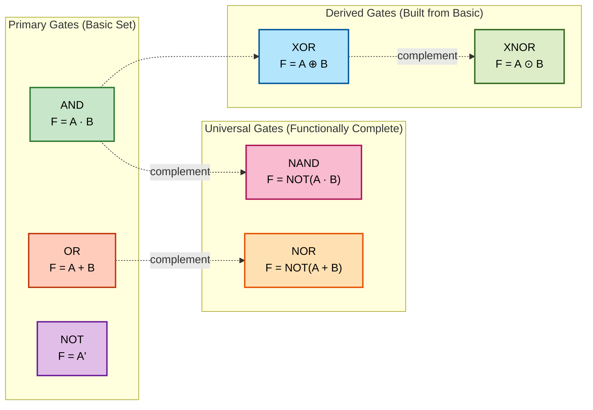
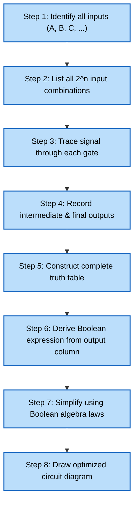

# Basic gates- Operation of a Logic circuit

<!-- SECTION_1_START -->

# Basic Gates — Operation of a Logic Circuit

## 1.1 Formal Definition (KTU 2024 Syllabus Terminology)

A **logic gate** is a fundamental building block of a digital system that performs a basic logical operation on one or more binary inputs to produce a single binary output. In Boolean algebra, the two binary states are represented as **Logic 0 (Low / False / 0 V)** and **Logic 1 (High / True / +5 V or +3.3 V)** depending on the logic family (TTL/CMOS).

A **logic circuit** is an interconnection of these basic gates designed to implement a specific Boolean function. The operation of a logic circuit is described by:
- A **Boolean expression** (e.g., $F = A \cdot B + \overline{C}$)
- A **Truth Table** (listing all possible input–output combinations)
- A **Logic Diagram** (graphical representation using gate symbols)

> [!IMPORTANT]
> **KTU 2024 Module 1 Focus:** Recognize gate symbols, write Boolean expressions from circuits, derive truth tables, and implement combinational logic using the seven basic gates: **AND, OR, NOT, NAND, NOR, XOR, XNOR**.

---

## 1.2 The Seven Basic Logic Gates — Quick Overview

| Gate | Function Symbol | Boolean Operator | Output Expression |
|------|-----------------|------------------|-------------------|
| AND | $\cdot$ (or no symbol) | Conjunction | $F = A \cdot B$ |
| OR | $+$ | Disjunction | $F = A + B$ |
| NOT | Bar ($\overline{A}$) | Inversion | $F = \overline{A}$ |
| NAND | $\overline{\cdot}$ | NOT–AND | $F = \overline{A \cdot B}$ |
| NOR | $\overline{+}$ | NOT–OR | $F = \overline{A + B}$ |
| XOR | $\oplus$ | Exclusive-OR | $F = A \oplus B$ |
| XNOR | $\odot$ | Exclusive-NOR | $F = \overline{A \oplus B}$ |

---

## 1.3 Conceptual Analogy — "The Light Switch Committee" 💡

Imagine a conference room with **two switches (A and B)** controlling a single bulb (F).

- **AND gate** → The bulb glows **only if BOTH switches A AND B are ON**. Like a series circuit: both must close for current to flow.
- **OR gate** → The bulb glows if **EITHER switch A OR switch B (or both) is ON**. Like a parallel circuit: any closed switch completes the path.
- **NOT gate** → A special "reverse switch" — if input is ON, output is OFF, and vice versa. Like a *normally-closed* relay contact.
- **XOR gate** → The bulb glows only when switches are in **DIFFERENT positions** (one ON, one OFF). Like a staircase light circuit.
- **NAND / NOR** → Take AND/OR and add an inverter bubble at the output. They are called **universal gates** because any other gate can be constructed using only NANDs or only NORs.

> [!NOTE]
> **Why are NAND and NOR called "Universal Gates"?**
> Because using only NAND gates (or only NOR gates) you can build ANY digital circuit — AND, OR, NOT, XOR, flip-flops, multiplexers, even microprocessors! This is critical in VLSI chip design where manufacturers standardize on one gate type for cost efficiency.

---

## 1.4 Physical Constants & Standard Metrics

> [!IMPORTANT]
> - **Standard Logic Levels (TTL):** $V_{IL} \le 0.8\text{ V}$, $V_{IH} \ge 2.0\text{ V}$, $V_{OL} \le 0.4\text{ V}$, $V_{OH} \ge 2.7\text{ V}$ — measured at **5 V DC** supply.
> - **Standard Logic Levels (CMOS, 5 V):** $V_{IL} \le 1.5\text{ V}$, $V_{IH} \ge 3.5\text{ V}$.
> - **Noise Margin:** $NM_H = V_{OH} - V_{IH}$, $NM_L = V_{IL} - V_{OL}$ — typically **0.4 V (TTL)** or higher for CMOS.
> - **Fan-out:** Maximum number of identical gate inputs a single output can drive (TTL ≈ 10, CMOS ≈ 50).
> - **Propagation Delay ($t_{pd}$):** Time for output to respond to input change — typically **5–10 ns** for standard TTL, **ns range** for CMOS.

---

## 1.5 Visualization Callout

> [!VISUALIZATION CONTROL]
> **Concept:** 2-Input AND Gate Output vs. Input Waveform (Timing Diagram Behavior)
>
> **GeoGebra / Desmos Input Equations:**
> * $A(t) = \text{square wave of period } 8 \text{ units}$
> * $B(t) = \text{square wave of period } 4 \text{ units}$
> * $F(t) = A(t) \cdot B(t) \;\; \text{(logical AND, pointwise)}$
>
> **Visual Description:** The student should observe that $F$ goes HIGH **only** during the time intervals when BOTH $A$ AND $B$ are simultaneously HIGH. All other intervals force $F$ to LOW. This visually demonstrates the AND operation's "strict" nature.

---

<!-- SECTION_1_END -->

<!-- SECTION_2_START -->

# Deep Theoretical Analysis & KTU High-Yield Formula Sheet

## 2.1 The Seven Gates — Detailed Truth Tables

### 2.1.1 Single-Input Gate: NOT (Inverter)

| Input $A$ | Output $F = \overline{A}$ |
|:---:|:---:|
| 0 | 1 |
| 1 | 0 |

**Rule:** The output is always the logical complement of the input. There are exactly $2^1 = 2$ rows.

---

### 2.1.2 Two-Input Gates (Total Combinations: $2^2 = 4$)

#### AND Gate — $F = A \cdot B$

| $A$ | $B$ | $F = A \cdot B$ |
|:---:|:---:|:---:|
| 0 | 0 | 0 |
| 0 | 1 | 0 |
| 1 | 0 | 0 |
| 1 | 1 | **1** |

**Rule:** Output is 1 **only when ALL inputs are 1**.

#### OR Gate — $F = A + B$

| $A$ | $B$ | $F = A + B$ |
|:---:|:---:|:---:|
| 0 | 0 | 0 |
| 0 | 1 | 1 |
| 1 | 0 | 1 |
| 1 | 1 | **1** |

**Rule:** Output is 1 **when ANY input is 1**.

#### NAND Gate — $F = \overline{A \cdot B}$

| $A$ | $B$ | $A \cdot B$ | $F = \overline{A \cdot B}$ |
|:---:|:---:|:---:|:---:|
| 0 | 0 | 0 | 1 |
| 0 | 1 | 0 | 1 |
| 1 | 0 | 0 | 1 |
| 1 | 1 | 1 | **0** |

**Rule:** Output is 0 **only when ALL inputs are 1** (complement of AND).

#### NOR Gate — $F = \overline{A + B}$

| $A$ | $B$ | $A + B$ | $F = \overline{A + B}$ |
|:---:|:---:|:---:|:---:|
| 0 | 0 | 0 | **1** |
| 0 | 1 | 1 | 0 |
| 1 | 0 | 1 | 0 |
| 1 | 1 | 1 | 0 |

**Rule:** Output is 1 **only when ALL inputs are 0** (complement of OR).

#### XOR Gate — $F = A \oplus B = A\overline{B} + \overline{A}B$

| $A$ | $B$ | $F = A \oplus B$ |
|:---:|:---:|:---:|
| 0 | 0 | 0 |
| 0 | 1 | 1 |
| 1 | 0 | 1 |
| 1 | 1 | 0 |

**Rule:** Output is 1 **when inputs are DIFFERENT** (odd number of 1s).

#### XNOR Gate — $F = \overline{A \oplus B} = AB + \overline{A}\,\overline{B}$

| $A$ | $B$ | $F = \overline{A \oplus B}$ |
|:---:|:---:|:---:|
| 0 | 0 | 1 |
| 0 | 1 | 0 |
| 1 | 0 | 0 |
| 1 | 1 | 1 |

**Rule:** Output is 1 **when inputs are the SAME** (even number of 1s, including zero).

---

## 2.2 Boolean Algebra — Foundational Laws

> [!IMPORTANT]
> KTU frequently asks for **proof of Boolean identities** and **simplification of expressions**. Master these laws:

### 2.2.1 Basic Laws (with $A, B, C$ as Boolean variables)

| Law | AND Form | OR Form |
|-----|----------|---------|
| Identity | $A \cdot 1 = A$ | $A + 0 = A$ |
| Null/Annulment | $A \cdot 0 = 0$ | $A + 1 = 1$ |
| Idempotent | $A \cdot A = A$ | $A + A = A$ |
| Complement | $A \cdot \overline{A} = 0$ | $A + \overline{A} = 1$ |
| Involution | $\overline{\overline{A}} = A$ | — |
| Commutative | $A \cdot B = B \cdot A$ | $A + B = B + A$ |
| Associative | $(A \cdot B) \cdot C = A \cdot (B \cdot C)$ | $(A + B) + C = A + (B + C)$ |
| Distributive | $A \cdot (B + C) = AB + AC$ | $A + (B \cdot C) = (A + B)(A + C)$ |
| Absorption | $A \cdot (A + B) = A$ | $A + (A \cdot B) = A$ |
| De Morgan's | $\overline{A \cdot B} = \overline{A} + \overline{B}$ | $\overline{A + B} = \overline{A} \cdot \overline{B}$ |

---

## 2.3 KTU High-Yield Formula Sheet

> [!IMPORTANT]
> These identities appear in **every module** of GAEST305. Memorize the dual pairs.

| # | Identity | Use Case |
|---|----------|----------|
| 1 | $A + \overline{A}B = A + B$ | Simplifying circuits with redundant terms |
| 2 | $A + AB = A$ | Absorption (very common!) |
| 3 | $\overline{A \oplus B} = AB + \overline{A}\,\overline{B}$ | XNOR expansion |
| 4 | $A \oplus B = \overline{A}B + A\overline{B}$ | XOR expansion |
| 5 | $A \oplus A = 0$, $A \oplus \overline{A} = 1$ | XOR special cases |
| 6 | $A \odot A = 1$, $A \odot \overline{A} = 0$ | XNOR special cases |
| 7 | $\overline{\overline{A} + B} = A \cdot \overline{B}$ | De Morgan's in NOT-OR form |
| 8 | Consensus: $AB + \overline{A}C + BC = AB + \overline{A}C$ | Term elimination |

---

## 2.4 Engineering & Industry Utility

| Application Area | Where Basic Gates Are Used |
|------------------|---------------------------|
| **ALU (Arithmetic Logic Unit)** | XOR for half/full adders, AND/OR for multiplexers |
| **Address Decoding** | NAND/NOR-based decoders in memory chips |
| **Comparators** | XNOR used for bit-equality detection in 74LS85 |
| **Parity Generators/Checkers** | XOR chain produces odd/even parity (used in UART, RAID) |
| **Multiplexers / Demultiplexers** | AND-OR structure for data routing |
| **SRAM/Memory Cells** | Cross-coupled NAND/NOR flip-flops |
| **Encryption Hardware** | XOR-based stream ciphers in IoT security chips |
| **FPGA / ASIC Design** | Look-up tables (LUTs) realize any 4–6 input Boolean function |

> [!NOTE]
> **Real Production Example:** The famous Intel 8086 processor contains tens of thousands of NAND-equivalent gates. Modern Apple M-series chips contain **~60 billion** transistors, each implementing basic gate functions at the CMOS level (combination of PMOS and NMOS transistors).

---

<!-- SECTION_2_END -->

<!-- SECTION_3_START -->

# Step-by-Step Derivations & Code Implementation

## 3.1 Derivation 1: Universal Gate Property of NAND

**Statement:** Any Boolean function can be implemented using only NAND gates.

**Proof — Implement NOT using NAND:**

Take a 2-input NAND and tie both inputs together.

$$F = \overline{A \cdot A} = \overline{A}$$

This is precisely a NOT gate. **Hence NOT can be realized using one NAND.** [1 Mark]

**Proof — Implement AND using NANDs:**

Connect the output of a NAND gate to a NOT (which itself is a NAND with tied inputs).

$$F_1 = \overline{A \cdot B}$$

$$F = \overline{F_1} = \overline{\overline{A \cdot B}} = A \cdot B$$

**Hence AND can be realized using two NANDs.** [1 Mark]

**Proof — Implement OR using NANDs:**

Apply De Morgan's theorem:

$$A + B = \overline{\overline{A + B}} = \overline{\overline{A} \cdot \overline{B}}$$

This is a NAND gate whose inputs are $\overline{A}$ and $\overline{B}$ — i.e., the outputs of two NOT gates (each a NAND with tied inputs). **Hence OR can be realized using three NANDs.** [1 Mark]

Since NOT, AND, and OR form a functionally complete set, **NAND is a universal gate**. The same logic holds for NOR. [2 Marks]

---

## 3.2 Derivation 2: Boolean Simplification Using Algebraic Method

**Problem:** Simplify $F = AB + A\overline{B} + \overline{A}B$ and identify the gate.

**Step 1:** Group the first two terms which share $A$:

$$F = A(B + \overline{B}) + \overline{A}B$$

**Step 2:** Apply complement law $B + \overline{B} = 1$:

$$F = A(1) + \overline{A}B$$

**Step 3:** Apply identity law $A \cdot 1 = A$:

$$F = A + \overline{A}B$$

**Step 4:** Apply the redundancy identity $A + \overline{A}B = A + B$:

$$F = A + B$$

**Conclusion:** $F = A + B$ is the **OR operation**. The original 3-gate circuit (two ANDs + one OR) can be replaced with a single OR gate — saving 2 gates of hardware.

---

## 3.3 Derivation 3: Derive Boolean Expression from a Logic Circuit

**Given Circuit:** Inputs $A$ and $B$ feed into an AND gate producing $X = AB$. Inputs $B$ and $C$ feed into an OR gate producing $Y = B + C$. Finally, $X$ and $Y$ feed into a NAND gate giving output $F$.

**Step 1:** Identify intermediate signals:

$$X = A \cdot B$$

$$Y = B + C$$

**Step 2:** Write the final output expression:

$$F = \overline{X \cdot Y} = \overline{(A \cdot B) \cdot (B + C)}$$

**Step 3:** Distribute:

$$F = \overline{AB \cdot B + AB \cdot C} = \overline{AB \cdot B + ABC}$$

**Step 4:** Apply idempotent law $B \cdot B = B$:

$$F = \overline{AB + ABC}$$

**Step 5:** Factor:

$$F = \overline{AB(1 + C)}$$

**Step 6:** Apply null law $1 + C = 1$:

$$F = \overline{AB}$$

**Final Answer:** $F = \overline{AB}$ — which is simply a 2-input NAND gate. The entire 3-gate circuit collapses to a single NAND!

---

## 3.4 Python Implementation — Simulating Basic Logic Gates

```python
"""
KTU GAEST305 - Basic Logic Gate Simulator
Course Outcome: CO1 (Understand fundamental gates)
Bloom Level: Apply
"""

from typing import List, Tuple
import logging

# Configure logging for debugging gate operations
logging.basicConfig(level=logging.INFO, format="[%(levelname)s] %(message)s")
logger = logging.getLogger(__name__)


class LogicGate:
    """Base class for all basic logic gates."""

    def evaluate(self, inputs: List[int]) -> int:
        raise NotImplementedError("Subclasses must implement evaluate()")


class ANDGate(LogicGate):
    """2-input AND gate: F = A AND B"""

    def evaluate(self, inputs: List[int]) -> int:
        self._validate(inputs, n_inputs=2)
        result = int(inputs[0] and inputs[1])
        logger.debug(f"AND({inputs[0]}, {inputs[1]}) = {result}")
        return result


class ORGate(LogicGate):
    """2-input OR gate: F = A OR B"""

    def evaluate(self, inputs: List[int]) -> int:
        self._validate(inputs, n_inputs=2)
        return int(inputs[0] or inputs[1])


class NOTGate(LogicGate):
    """1-input NOT gate (Inverter): F = NOT A"""

    def evaluate(self, inputs: List[int]) -> int:
        self._validate(inputs, n_inputs=1)
        return int(not inputs[0])


class NANDGate(LogicGate):
    """2-input NAND gate: F = NOT(A AND B)"""

    def evaluate(self, inputs: List[int]) -> int:
        self._validate(inputs, n_inputs=2)
        return int(not (inputs[0] and inputs[1]))


class NORGate(LogicGate):
    """2-input NOR gate: F = NOT(A OR B)"""

    def evaluate(self, inputs: List[int]) -> int:
        self._validate(inputs, n_inputs=2)
        return int(not (inputs[0] or inputs[1]))


class XORGate(LogicGate):
    """2-input XOR gate: F = A XOR B"""

    def evaluate(self, inputs: List[int]) -> int:
        self._validate(inputs, n_inputs=2)
        return int(inputs[0] ^ inputs[1])  # Bitwise XOR works for 0/1


class XNORGate(LogicGate):
    """2-input XNOR gate: F = NOT(A XOR B)"""

    def evaluate(self, inputs: List[int]) -> int:
        self._validate(inputs, n_inputs=2)
        return int(not (inputs[0] ^ inputs[1]))


    @staticmethod
    def _validate(inputs: List[int], n_inputs: int) -> None:
        """Strict input validation: must be 0 or 1, and exact count."""
        if len(inputs) != n_inputs:
            raise ValueError(f"Expected {n_inputs} inputs, got {len(inputs)}")
        for idx, val in enumerate(inputs):
            if val not in (0, 1):
                raise ValueError(f"Input[{idx}] = {val} is invalid. Only 0 or 1 allowed.")


def print_truth_table(gate: LogicGate, gate_name: str, n_inputs: int) -> None:
    """Generate and print the full truth table for a given gate."""
    print(f"\n{'=' * 40}")
    print(f"  Truth Table: {gate_name}")
    print(f"{'=' * 40}")
    header = " | ".join([f"In{i}" for i in range(n_inputs)]) + " || Out"
    print(header)
    print("-" * len(header))

    for i in range(2 ** n_inputs):
        # Generate input combinations in binary order
        row = []
        for bit in range(n_inputs - 1, -1, -1):
            row.append((i >> bit) & 1)
        out = gate.evaluate(row)
        print("   ".join(map(str, row)) + "   ||   " + str(out))


# ===== Main Execution: Build a combinational circuit =====
if __name__ == "__main__":
    # (a) Print individual truth tables for all 7 gates
    gates: List[Tuple[LogicGate, str, int]] = [
        (ANDGate(), "AND", 2),
        (ORGate(), "OR", 2),
        (NOTGate(), "NOT", 1),
        (NANDGate(), "NAND", 2),
        (NORGate(), "NOR", 2),
        (XORGate(), "XOR", 2),
        (XNORGate(), "XNOR", 2),
    ]
    for gate, name, n in gates:
        print_truth_table(gate, name, n)

    # (b) Implement F = AB + C' using gates
    print(f"\n{'=' * 40}")
    print("  Circuit: F = A AND B, then OR with NOT C")
    print(f"{'=' * 40}")

    test_cases = [
        (0, 0, 0), (0, 0, 1), (0, 1, 0), (0, 1, 1),
        (1, 0, 0), (1, 0, 1), (1, 1, 0), (1, 1, 1),
    ]
    and_gate = ANDGate()
    or_gate = ORGate()
    not_gate = NOTGate()

    print("A | B | C | AB | C' | F = AB + C'")
    print("-" * 35)
    for A, B, C in test_cases:
        ab = and_gate.evaluate([A, B])
        c_bar = not_gate.evaluate([C])
        F = or_gate.evaluate([ab, c_bar])
        print(f"{A} | {B} | {C} | {ab}  | {c_bar}  |   {F}")
```

**Expected Output (Sample):**

```
========================================
  Truth Table: AND
========================================
In0 | In1 || Out
--------------------
0   0   ||   0
0   1   ||   0
1   0   ||   0
1   1   ||   1
...
Circuit: F = A AND B, then OR with NOT C
A | B | C | AB | C' | F = AB + C'
-----------------------------------
0 | 0 | 0 | 0  | 1  |   1
0 | 0 | 1 | 0  | 0  |   0
...
1 | 1 | 0 | 1  | 1  |   1
1 | 1 | 1 | 1  | 0  |   1
```

---

<!-- SECTION_3_END -->

<!-- SECTION_4_START -->

# Structural Diagrams & Schematics

## 4.1 Mermaid Diagram: Logic Circuit Operation Flow



> [!NOTE]
> **Color Legend:** Blue = Inputs | Yellow = Output | Green = AND | Orange = OR | Pink = NAND

---

## 4.2 Mermaid Diagram: Gate Symbol Reference Sheet



---

## 4.3 Mermaid Diagram: Sequential Processing Topology — Logic Circuit Analysis Workflow



---

<!-- SECTION_4_END -->

<!-- SECTION_5_START -->

# KTU 2024 Scheme Examination Question Bank & Topic Recap

## 5.1 Part A — Short Answer Questions (2 × 3 Marks)

### Question 1: Define a Universal Gate. Name the universal gates. **[3 Marks]**
**[KTU University Exam — July 2023 | CO1 | Remember]**

**Model Answer:**

A **Universal Gate** is a logic gate that can be used alone to implement any Boolean function without needing any other gate type. The two universal gates are:
1. **NAND gate**
2. **NOR gate**

Using only NAND gates (or only NOR gates), we can construct AND, OR, NOT, XOR, XNOR, and any complex digital circuit. [2 Marks]

**Example:** A NOT gate can be implemented using a NAND gate by tying its two inputs together: $F = \overline{A \cdot A} = \overline{A}$. [1 Mark]

---

### Question 2: State and prove De Morgan's Theorems. **[3 Marks]**
**[KTU University Exam — Dec 2023 | CO1 | Understand]**

**Model Answer:**

**De Morgan's First Theorem:** The complement of a product is equal to the sum of the complements.

$$\overline{A \cdot B} = \overline{A} + \overline{B}$$

**De Morgan's Second Theorem:** The complement of a sum is equal to the product of the complements.

$$\overline{A + B} = \overline{A} \cdot \overline{B}$$

**Proof (via Truth Table for First Theorem):**

| $A$ | $B$ | $A \cdot B$ | $\overline{A \cdot B}$ | $\overline{A}$ | $\overline{B}$ | $\overline{A} + \overline{B}$ |
|:---:|:---:|:---:|:---:|:---:|:---:|:---:|
| 0 | 0 | 0 | 1 | 1 | 1 | 1 |
| 0 | 1 | 0 | 1 | 1 | 0 | 1 |
| 1 | 0 | 0 | 1 | 0 | 1 | 1 |
| 1 | 1 | 1 | 0 | 0 | 0 | 0 |

Columns 4 and 7 are identical. **Hence proved.** [2 Marks]
The second theorem is proved similarly by duality. [1 Mark]

---

## 5.2 Part B — Long Answer Questions (14 Marks with Internal Choice)

### **Question A (14 Marks):** **[KTU University Exam — July 2024 | CO1, CO2 | Apply, Analyze]**

**(a) Draw the logic symbol, write the truth table, and Boolean expression for each of the following: AND, OR, NOT, NAND, NOR, XOR, XNOR gates. (7 Marks)**

**Model Answer Structure:**

| Gate | Symbol Type | Boolean Expression | Truth Table Key Feature |
|------|------------|--------------------|-------------------------|
| AND | Flat back, rounded front | $F = A \cdot B$ | Output=1 only when all inputs=1 |
| OR | Curved back, pointed front | $F = A + B$ | Output=1 when any input=1 |
| NOT | Triangle with bubble | $F = \overline{A}$ | Output = complement of input |
| NAND | AND with bubble | $F = \overline{A \cdot B}$ | Output=0 only when all inputs=1 |
| NOR | OR with bubble | $F = \overline{A + B}$ | Output=1 only when all inputs=0 |
| XOR | OR with extra curved line | $F = A \oplus B$ | Output=1 when inputs differ |
| XNOR | XOR with bubble | $F = \overline{A \oplus B}$ | Output=1 when inputs same |

[Drawing logic symbols correctly with bubbles: 3 Marks]
[Writing Boolean expressions: 1 Mark]
[Truth tables (all 4 rows for 2-input gates, 2 rows for NOT): 3 Marks]

---

**(b) Implement the Boolean function $F(A,B,C) = \overline{A}B + A\overline{C} + BC$ using only NAND gates. Draw the logic circuit. (7 Marks)**

**Model Solution:**

**Step 1:** Apply double negation: $F = \overline{\overline{\overline{A}B + A\overline{C} + BC}}$

**Step 2:** To use a single NAND at the output, ensure the input is in the form (sum of terms ANDed) — apply De Morgan's to the outer complement.

Let us rewrite using De Morgan's on the inner expression:

$$\overline{F} = \overline{\overline{A}B} \cdot \overline{A\overline{C}} \cdot \overline{BC}$$

Therefore:

$$F = \overline{\overline{\overline{A}B} \cdot \overline{A\overline{C}} \cdot \overline{BC}}$$

**Step 3:** Identify the NAND operations:
- $N_1 = \overline{A}$ (using NAND with tied inputs) — generates $\overline{A}$
- $N_2 = \overline{A}B$ (NAND of $A$ and $B$ with input $\overline{A}$)
- $N_3 = \overline{A\overline{C}}$ (NAND of $\overline{A}$ and $\overline{C}$)
- $N_4 = \overline{C}$ (NAND with tied inputs)
- $N_5 = \overline{BC}$ (NAND of $B$ and $C$)
- $N_6 = F = \overline{N_2 \cdot N_3 \cdot N_5}$ — final 3-input NAND

**Step 4:** Total NAND gates required: **6 NAND gates**

**Valuation Key:**
- [Identifying correct De Morgan transformation: 2 Marks]
- [Drawing 6 NAND gates with proper interconnections: 3 Marks]
- [Final simplified circuit diagram: 2 Marks]

---

### **Question B (14 Marks — Alternative Choice):** **[KTU University Exam — Dec 2023 | CO1, CO2 | Apply, Analyze]**

**(a) For the logic circuit shown below, derive the Boolean expression and construct the complete truth table. (7 Marks)**

**Given Circuit Description (since KTU diagrams are static):**

> Two inputs $A$ and $B$. $A$ goes directly to one input of an AND gate; $B$ goes directly to the other input of the AND gate producing $X = A \cdot B$. Additionally, $A$ passes through a NOT gate to produce $\overline{A}$, which goes to one input of a second AND gate. $B$ also goes to the other input of the second AND gate, producing $Y = \overline{A} \cdot B$. Finally, $X$ and $Y$ go to an OR gate, producing $F = X + Y$.

**Model Solution:**

**Boolean Expression:**

$$F = A \cdot B + \overline{A} \cdot B$$

**Simplification:**

$$F = B(A + \overline{A}) = B(1) = B$$

[Applying factoring: 1 Mark] [Applying complement law: 1 Mark] [Final answer: 1 Mark]

**Truth Table (4 rows):**

| $A$ | $B$ | $\overline{A}$ | $X = AB$ | $Y = \overline{A}B$ | $F = X + Y$ |
|:---:|:---:|:---:|:---:|:---:|:---:|
| 0 | 0 | 1 | 0 | 0 | 0 |
| 0 | 1 | 1 | 0 | 1 | 1 |
| 1 | 0 | 0 | 0 | 0 | 0 |
| 1 | 1 | 0 | 1 | 0 | 1 |

[Truth table columns for intermediate signals: 3 Marks]

**Conclusion:** The entire circuit reduces to a single wire connecting $B$ to $F$ — the gates are **redundant**. This is an excellent example of the **absorption/redundancy** principle.

---

**(b) Explain the operation of a 2-input XOR gate using: (i) Truth table (ii) Boolean expression (iii) Timing diagram (iv) A real-world application. (7 Marks)**

**Model Solution:**

**(i) Truth Table** [2 Marks]

| $A$ | $B$ | $F = A \oplus B$ |
|:---:|:---:|:---:|
| 0 | 0 | 0 |
| 0 | 1 | 1 |
| 1 | 0 | 1 |
| 1 | 1 | 0 |

**(ii) Boolean Expression** [2 Marks]

$$F = A \oplus B = A\overline{B} + \overline{A}B$$

**Operation:** Output is HIGH only when the inputs are in different logic states. This is the **inequality detector** or **modulo-2 adder**.

**(iii) Timing Diagram** [2 Marks]

```
Time -->  0   1   2   3   4   5   6   7
A     :   0   0   1   1   0   0   1   1
B     :   0   1   0   1   0   1   0   1
F=A⊕B :   0   1   1   0   0   1   1   0
```

The output $F$ is HIGH precisely during intervals 1, 2, 5, 6 — where A and B differ.

**(iv) Real-World Application** [1 Mark]

XOR gates are used as the **fundamental building block of binary addition (half-adder)**. The sum bit $S = A \oplus B$ and carry bit $C = A \cdot B$. They are also used in **parity generators**, **cryptographic ciphers (XOR cipher)**, and **phase detectors in PLLs**.

---

> [!WARNING]
> **KTU Examiner's Valuation Warning — Common Pitfalls:**
> 1. **Bubble Confusion:** Students frequently forget to draw the *small circle (bubble)* on NAND, NOR, and XNOR gate symbols. **[Lose 0.5 Mark]**
> 2. **De Morgan's Misapplication:** When asked to implement with universal gates, students apply De Morgan's on the wrong side. Always work on the **outer complement** first.
> 3. **Missing Truth Table Columns:** For multi-level circuits, every intermediate signal needs its own column. Skipping $X$ and $Y$ columns = **[Lose 2 Marks]**
> 4. **Notation Errors:** Using $\cdot$ and $+$ ambiguously. KTU accepts both, but **be consistent**. Don't mix $A \cdot B$ and $AB$ in the same derivation.
> 5. **Forgetting Boundary Conditions:** Always explicitly state the number of rows $= 2^n$ for $n$ inputs.
> 6. **Skipping Final Simplification:** The algebraic answer is incomplete unless the final expression is in **minimal Sum-of-Products (SOP)** or **Product-of-Sums (POS)** form.

---

## 5.3 Topic Recap & Important Things to Remember

- ✅ **Seven Basic Gates:** AND, OR, NOT, NAND, NOR, XOR, XNOR — memorize symbol + Boolean expression + truth table.
- ✅ **Universal Gates:** Only **NAND** and **NOR** are functionally complete; all others can be derived from them.
- ✅ **Truth Table Size:** For $n$ inputs, the table has exactly $2^n$ rows.
- ✅ **AND / NAND:** AND outputs 1 only when ALL inputs are 1; NAND is its exact complement.
- ✅ **OR / NOR:** OR outputs 1 when ANY input is 1; NOR outputs 1 only when ALL inputs are 0.
- ✅ **XOR / XNOR:** XOR = "different" detector; XNOR = "same" detector. Both are **odd/even parity** functions.
- ✅ **Key Identities to Memorize:**
  - $A + \overline{A}B = A + B$
  - $A(A + B) = A$
  - $A + AB = A$
  - $\overline{A \oplus B} = AB + \overline{A}\,\overline{B}$
- ✅ **De Morgan's Theorems:** $\overline{A \cdot B} = \overline{A} + \overline{B}$ and $\overline{A + B} = \overline{A} \cdot \overline{B}$ — applied in **every** universal gate conversion.
- ✅ **Logic Levels:** TTL: $V_{OH} \ge 2.7\text{ V}$, $V_{OL} \le 0.4\text{ V}$, $V_{IH} \ge 2.0\text{ V}$, $V_{IL} \le 0.8\text{ V}$.
- ✅ **Propagation Delay ($t_{pd}$):** Typically 5–10 ns (TTL), 1–5 ns (CMOS) — affects maximum clock frequency.
- ✅ **Fan-out:** Number of gate inputs a single output can reliably drive (TTL ≈ 10, CMOS ≈ 50).
- ✅ **Industry Relevance:** Every digital IC, microprocessor, FPGA, and ASIC is built from CMOS implementations of these basic gates.

<!-- SECTION_5_END -->
