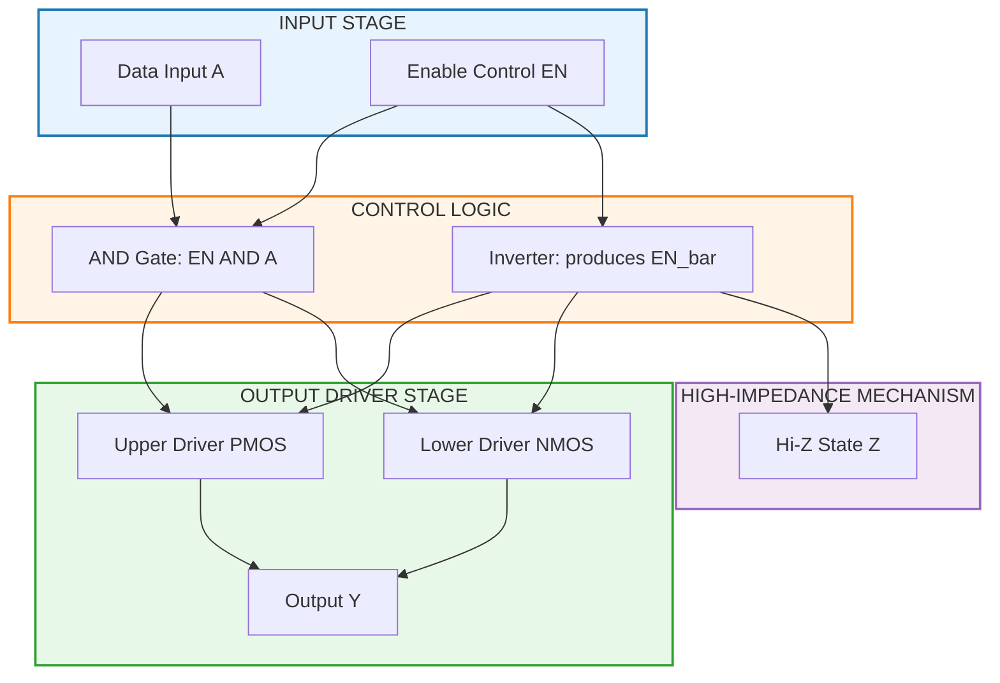
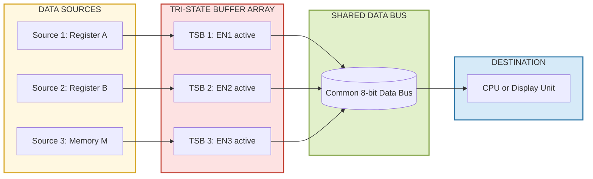
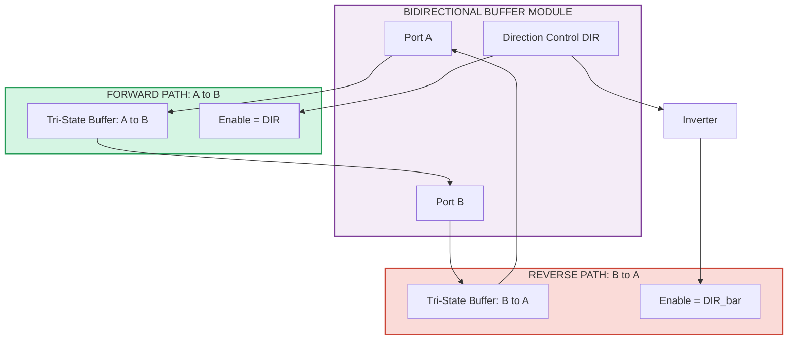

# Buffer

<!-- SECTION_1_START -->
# Digital Buffer — Core Technical Definition & Intuitive Overview

## Formal Academic Definition

A **Digital Buffer** is a single-input, single-output combinational logic element that performs the **identity function** $Y = A$, reproducing the input logic level at the output while providing **electrical isolation, current amplification, and impedance matching** between driving and driven stages. Unlike logic gates, a buffer does **not invert** the signal; its primary engineering role is to strengthen and isolate digital signals rather than to perform boolean transformation.

In the KTU 2024 Scheme syllabus (GAEST305 — Module 1), the buffer is introduced as a foundational **non-inverting tri-state switching element** used to construct bidirectional buses, multiplexed data paths, and high-fan-out drive networks.

> [!IMPORTANT]
> **KTU 2024 Syllabus Highlight:**
> A buffer is the *simplest* digital device with one input and one output that delivers the same logic level. Its importance in modern digital systems stems from its role as a **tri-state bus driver**, not from any boolean logic function.

---

## Conceptual Analogy / Intuition

Imagine you are speaking into a **megaphone**. Your voice is the input signal — it carries the right information, but it's weak and may not reach the back of a large hall. The megaphone doesn't change *what* you say (logic level remains the same: 0 stays 0, 1 stays 1), but it **amplifies the electrical drive strength** so the signal can reach farther and drive more listeners.

Now imagine the megaphone has a **mute button**. When pressed, the megaphone goes silent (no sound leaves it), even though you are still talking into it. This silent state is the **High-Impedance (Hi-Z)** state of a tri-state buffer. The mute button corresponds to the **Enable (EN)** control input.

| Real-World Analogy | Digital Buffer Equivalent |
| :--- | :--- |
| Person speaking softly | Weak digital source (low fan-out) |
| Megaphone | Buffer circuit |
| Listener at the back of the hall | Far-off load / heavy capacitive load |
| Mute button pressed | Tri-state buffer with **EN = 0** (Hi-Z state) |
| Mute button released | Tri-state buffer with **EN = 1** (passing signal) |

---

## Circuit Symbol and Visual Identification

The **buffer** is drawn as a **triangle pointing in the direction of signal flow** (from input to output). It has:

- **One input terminal** on the flat (left) side
- **One output terminal** on the pointed (right) side
- *(Tri-state variant)* A **control/Enable input** at the base of the triangle, drawn as a small bubble (for active-LOW enable) or no bubble (for active-HIGH enable)

> [!NOTE]
> **Distinguishing Buffer from Inverter:**
> - **Buffer symbol**: A plain triangle → output is **same** as input
> - **Inverter symbol**: A triangle **with a small circle (bubble)** at the output → output is the **complement** of the input

---

## Physical Constants & Standard Metrics

The following parameters govern buffer operation in real integrated circuits:

- **Propagation Delay ($t_{pd}$):** Typically **2 ns to 10 ns** for TTL/CMOS buffers
- **Fan-out:** A standard buffer can drive **10 to 20 standard loads** (TTL)
- **Input Current ($I_{IL}$, $I_{IH}$):** Microamperes range (e.g., **$I_{IL} = 1.6\ \text{mA}$** for TTL)
- **Output Current ($I_{OL}$, $I_{OH}$):** Up to **$24\ \text{mA}$** for high-drive buffers
- **Supply Voltage ($V_{CC}$):** **+5 V** (TTL) or **+3.3 V / +5 V** (CMOS)
- **High-Impedance State Leakage Current:** $\leq \mathbf{10\ \mu A}$

> [!VISUALIZATION CONTROL]
> **Concept:** Buffer as a constant-amplifier identity transformer on a signal-line graph
> **GeoGebra / Desmos Input Equations:**
> * `f(x) = x` — the identity line passing through origin
> * Input: `x in {0, 1}` plotted as discrete points
> * Output: `y = f(x) = x` plotted as discrete points
> **Visual Description:** Two coincident points at (0, 0) and (1, 1) on the Cartesian plane. The graph is a 45° straight line through the origin, illustrating that the output perfectly mirrors the input level with **no inversion, no attenuation, no logic transformation**.

---

## Three-State Concept Overview

A **Tri-State Buffer** (often called a **3-state buffer**) is the most important member of the buffer family in KTU Module 1. Unlike a simple buffer that always drives its output, the tri-state buffer can be placed into a third state called **High-Impedance (Hi-Z)** — symbolically written as **$Z$**.

In the Hi-Z state, the output is **electrically disconnected** from the internal circuitry, behaving like an open switch. This allows **multiple tri-state buffers** to share a common wire (a **bus**) without electrical conflict, provided only one buffer is enabled at any time.

> [!NOTE]
> **The Three States of a Tri-State Buffer:**
> 1. **Logic 0 (LOW)** — Output is actively pulled to ground
> 2. **Logic 1 (HIGH)** — Output is actively pulled to $V_{CC}$
> 3. **High-Impedance ($Z$)** — Output is floating; the buffer is "invisible" to the bus
<!-- SECTION_1_END -->

<!-- SECTION_2_START -->
# Deep Theoretical Analysis & KTU High-Yield Formula Sheet

## Classification of Buffers

Buffers are broadly classified into the following categories based on control capability:

1. **Simple (Non-Controlled) Buffer** — No enable input; output always follows input.
2. **Tri-State Buffer with Active-HIGH Enable** — Output is driven only when **$EN = 1$**.
3. **Tri-State Buffer with Active-LOW Enable** — Output is driven only when **$\overline{EN} = 0$**.
4. **Schmitt Trigger Buffer** — Provides **hysteresis** for noisy/slow-rising input signals.
5. **Bidirectional Buffer** — Two tri-state buffers combined to allow signal flow in **both directions** on a single wire (used in bus transceivers).

---

## Logical Operation — Step-by-Step Breakdown

### Case 1: Simple Buffer
- **Step 1:** Accept input $A$ (logic 0 or logic 1) on the input pin.
- **Step 2:** Internal transistor pair (push-pull in CMOS, totem-pole in TTL) drives the output line.
- **Step 3:** Output $Y$ settles to the same level as $A$ with finite propagation delay $t_{pd}$.
- **Step 4:** No state memory; the device is purely combinational.

$$Y = A$$

### Case 2: Tri-State Buffer (Active-HIGH Enable)
- **Step 1:** Sample the data input $A$.
- **Step 2:** Sample the enable input $EN$.
- **Step 3:** If $EN = 1$, route $A$ to the output ($Y = A$).
- **Step 4:** If $EN = 0$, switch both output transistors to the OFF state → output is **Hi-Z**.

$$Y = \begin{cases} A & \text{if } EN = 1 \\ Z & \text{if } EN = 0 \end{cases}$$

The compact boolean expression is:

$$Y = EN \cdot A + \overline{EN} \cdot Z$$

where $Z$ represents the high-impedance condition (an electrical state, not a boolean value).

### Case 3: Tri-State Buffer (Active-LOW Enable)
- **Step 1:** Sample the data input $A$.
- **Step 2:** Sample the active-LOW enable input $\overline{EN}$ (denoted as $\overline{OE}$ or $\overline{CE}$).
- **Step 3:** If $\overline{EN} = 0$, route $A$ to the output ($Y = A$).
- **Step 4:** If $\overline{EN} = 1$, the output enters **Hi-Z**.

$$Y = \begin{cases} A & \text{if } \overline{EN} = 0 \\ Z & \text{if } \overline{EN} = 1 \end{cases}$$

---

## Truth Tables

### Simple Buffer

| $A$ | $Y$ |
| :---: | :---: |
| 0 | 0 |
| 1 | 1 |

### Tri-State Buffer (Active-HIGH Enable)

| $EN$ | $A$ | $Y$ |
| :---: | :---: | :---: |
| 0 | 0 | $Z$ (Hi-Z) |
| 0 | 1 | $Z$ (Hi-Z) |
| 1 | 0 | 0 |
| 1 | 1 | 1 |

### Tri-State Buffer (Active-LOW Enable, $\overline{EN}$)

| $\overline{EN}$ | $A$ | $Y$ |
| :---: | :---: | :---: |
| 0 | 0 | 0 |
| 0 | 1 | 1 |
| 1 | 0 | $Z$ (Hi-Z) |
| 1 | 1 | $Z$ (Hi-Z) |

> [!NOTE]
> **KTU Valuation Tip:** Examiners frequently test whether students correctly identify the *active level* of the enable pin. A bubble at the enable input on the schematic means **active-LOW**.

---

## Internal Structure (Conceptual)

### CMOS Tri-State Buffer
A CMOS tri-state buffer uses **two transmission gates** controlled in opposition by $EN$ and $\overline{EN}$:

- When $EN = 1$: A PMOS-NMOS pair is ON → signal passes from input to output.
- When $EN = 0$: Both transistors in the output stage are OFF → output is Hi-Z.

### TTL Tri-State Buffer
TTL tri-state buffers use a **Darlington pair** with an additional **diode** to the supply rail. When $\overline{OE} = 1$, this diode is forward-biased, which **starves the upper transistor of base current**, forcing the output stage into the Hi-Z state.

---

## KTU Formula Sheet / Cheat Sheet

| Parameter / Concept | Formula / Expression | Description |
| :--- | :--- | :--- |
| Simple buffer function | $Y = A$ | Identity transfer |
| Tri-state output (active-HIGH) | $Y = EN \cdot A$ (with Hi-Z when $EN = 0$) | Gated identity |
| Tri-state output (active-LOW) | $Y = \overline{EN} \cdot A$ (with Hi-Z when $\overline{EN} = 1$) | Gated identity, inverted enable |
| Propagation delay | $t_{pd} = \dfrac{t_{pLH} + t_{pHL}}{2}$ | Average gate delay |
| Fan-out (DC) | $F = \dfrac{I_{OL(\text{min})}}{I_{IL(\text{max})}}$ | Maximum load gates a buffer can drive |
| Maximum bus capacitance | $C_{bus(\text{max})} = \dfrac{t_{r}}{0.5 \cdot R_{on}}$ | Limits bus speed |
| Power dissipation (CMOS) | $P_{d} = C_{L} \cdot V_{DD}^{2} \cdot f$ | Dynamic power per switching event |
| Leakage in Hi-Z | $I_{OZ} \le 10\ \mu\text{A}$ | Output leakage current when disabled |

---

## Real-World Engineering Utility

Buffers are indispensable in the following engineering scenarios:

1. **Bus Arbitration in Microprocessors:** Multiple peripheral devices (RAM, ROM, I/O controllers) share a common data bus. Each device has a tri-state buffer on its output line, and only the *currently selected* device activates its enable pin. This eliminates the need for complex AND-OR multiplexing at the bus level.

2. **Fan-Out Extension:** A logic gate's output can typically drive only a limited number of inputs. A buffer is inserted to **boost the drive strength** so the signal can reach more downstream gates.

3. **Signal Isolation:** A buffer prevents a noisy or heavily-loaded stage from feeding back disturbances into a sensitive source stage — analogous to an *op-amp voltage follower*.

4. **Level Shifting:** Specialized buffers (e.g., 5V → 3.3V translators) allow interfacing between logic families operating at different supply voltages.

5. **Bidirectional I/O Pins:** Microcontroller GPIO pins use **two tri-state buffers in a back-to-back configuration**, allowing the same pin to function as input or output under firmware control.

6. **Memory and Register Files:** The outputs of memory cells in RAM arrays use tri-state buffers so multiple words can be connected to a common bit-line during read operations.
<!-- SECTION_2_END -->

<!-- SECTION_3_START -->
# Step-by-Step Derivations & Symbolic Implementation

## Derivation 1: Boolean Expression for Tri-State Buffer (Active-HIGH)

We want a circuit that outputs $A$ when $EN = 1$, and produces high-impedance when $EN = 0$.

**Step 1:** Recognize that during the "active" phase, the output should equal $A$:

$$Y_{\text{active}} = A \quad \text{when } EN = 1$$

**Step 2:** During the "disabled" phase, the output is *not* a logic value; it is a high-impedance state, denoted $Z$:

$$Y_{\text{disabled}} = Z \quad \text{when } EN = 0$$

**Step 3:** Combine the two conditions into a single conditional expression. Because $Z$ is not a boolean, we represent the circuit behaviour using a piecewise function:

$$Y = \begin{cases} A, & EN = 1 \\ Z, & EN = 0 \end{cases}$$

**Step 4:** In boolean algebra, the gating action is written as:

$$Y = EN \cdot A + \overline{EN} \cdot (\text{open-circuit})$$

The "open-circuit" term corresponds to the Hi-Z state and is what makes this a tri-state (not a 2-state) device.

**Step 5:** If we restrict the analysis to the *boolean* output (ignoring Hi-Z), the function reduces to:

$$Y = EN \cdot A$$

This shows the tri-state buffer is logically equivalent to a 2-input AND gate when $EN$ is held HIGH. This is an important result: **a tri-state buffer with its enable tied permanently HIGH behaves identically to a wire**.

---

## Derivation 2: Boolean Expression for Tri-State Buffer (Active-LOW)

Following the same logic, with $\overline{EN}$ as the active-LOW enable:

**Step 1:** Active condition: $\overline{EN} = 0 \Rightarrow EN = 1$

**Step 2:** Therefore the output is driven when the *inverted* enable is low:

$$Y = \overline{\overline{EN}} \cdot A = EN \cdot A$$

**Step 3:** Disabled condition: $\overline{EN} = 1 \Rightarrow EN = 0$ → output is Hi-Z.

**Step 4:** Full piecewise form:

$$Y = \begin{cases} A, & \overline{EN} = 0 \\ Z, & \overline{EN} = 1 \end{cases}$$

The bubble on the enable pin is the schematic convention that "this pin activates the buffer when it sees a 0."

---

## Derivation 3: Fan-Out Calculation Example

**Problem:** A TTL buffer has $I_{OL(\min)} = 24\ \text{mA}$ and each standard TTL load draws $I_{IL(\max)} = 1.6\ \text{mA}$.

**Step 1:** Apply the fan-out formula:

$$F = \dfrac{I_{OL(\text{min})}}{I_{IL(\text{max})}}$$

**Step 2:** Substitute the values:

$$F = \dfrac{24\ \text{mA}}{1.6\ \text{mA}}$$

**Step 3:** Compute the ratio:

$$F = 15$$

**Step 4:** Interpretation: This buffer can reliably drive **15 standard TTL loads** while maintaining a valid logic 0 level. This is a major advantage over a standard gate, which typically has a fan-out of only **10**.

---

## Derivation 4: Bidirectional Buffer Construction

A bidirectional buffer uses **two tri-state buffers in a back-to-back configuration** with complementary enable signals.

**Step 1:** Define the data line on each side: $A$ (left port) and $B$ (right port).

**Step 2:** Connect two tri-state buffers between $A$ and $B$:
- Buffer 1: input from $A$, output to $B$, enable $= DIR$
- Buffer 2: input from $B$, output to $A$, enable $= \overline{DIR}$

**Step 3:** When $DIR = 1$:
- Buffer 1 is enabled: $B = A$
- Buffer 2 is disabled: $A$ line is Hi-Z (input mode)
- Signal flows **A → B**

**Step 4:** When $DIR = 0$:
- Buffer 1 is disabled: $B$ line is Hi-Z
- Buffer 2 is enabled: $A = B$
- Signal flows **B → A**

**Step 5:** The direction control pin $DIR$ thus selects the data flow direction. This single bit of control replaces what would otherwise require a multiplexer-demultiplexer pair, saving silicon area.

---

## Python Implementation: Buffer Logic Simulator

The following Python program fully simulates a simple buffer, a tri-state buffer (both enable polarities), and a bidirectional buffer. It demonstrates the truth-table behaviour, including the special `Z` (high-impedance) state.

```python
from __future__ import annotations
from enum import Enum
from typing import Union


class LogicState(Enum):
    """Enumeration of all possible logic states in a tri-state system."""
    LOW = 0
    HIGH = 1
    HIGH_Z = "Z"

    def __repr__(self) -> str:
        return self.value


# Type alias for combinational signal values
SignalValue = Union[LogicState, str]


def normalize(value: SignalValue) -> LogicState:
    """Convert raw input into a validated LogicState, raising an explicit error otherwise."""
    if isinstance(value, LogicState):
        return value
    if value in (0, "0", "LOW", "low"):
        return LogicState.LOW
    if value in (1, "1", "HIGH", "high"):
        return LogicState.HIGH
    if value in ("Z", "z", "HiZ", "hiz", None):
        return LogicState.HIGH_Z
    raise ValueError(f"Unrecognized logic value: {value!r}")


class SimpleBuffer:
    """Combinational identity buffer: Y = A"""

    def __init__(self, name: str = "BUF") -> None:
        self.name = name

    def drive(self, a: SignalValue) -> LogicState:
        a_norm = normalize(a)
        if a_norm == LogicState.HIGH_Z:
            raise ValueError(f"[{self.name}] Cannot propagate Hi-Z through a simple buffer input.")
        return a_norm


class TriStateBuffer:
    """Tri-state buffer with selectable active-HIGH or active-LOW enable."""

    def __init__(self, name: str = "TSB", active_low: bool = False) -> None:
        self.name = name
        self.active_low = active_low

    def drive(self, a: SignalValue, en: SignalValue) -> LogicState:
        a_norm = normalize(a)
        en_norm = normalize(en)

        if a_norm == LogicState.HIGH_Z:
            raise ValueError(f"[{self.name}] Data input cannot be Hi-Z.")

        if en_norm == LogicState.HIGH_Z:
            raise ValueError(f"[{self.name}] Enable input cannot be Hi-Z (floating enable is undefined).")

        if self.active_low:
            enabled = (en_norm == LogicState.LOW)
        else:
            enabled = (en_norm == LogicState.HIGH)

        return a_norm if enabled else LogicState.HIGH_Z


class BidirectionalBuffer:
    """Back-to-back pair of tri-state buffers forming a bidirectional bus driver."""

    def __init__(self, name: str = "BDB") -> None:
        self.name = name
        self._buf_ab = TriStateBuffer(name=f"{name}_AB", active_low=False)
        self._buf_ba = TriStateBuffer(name=f"{name}_BA", active_low=True)

    def transfer(self, a: SignalValue, b: SignalValue, direction: SignalValue) -> tuple[LogicState, LogicState]:
        """direction: 1 means A -> B, 0 means B -> A."""
        if direction in (1, "1", "HIGH"):
            out_b = self._buf_ab.drive(a, en=LogicState.HIGH)
            out_a = self._buf_ba.drive(b, en=LogicState.HIGH)
        else:
            out_b = self._buf_ab.drive(a, en=LogicState.LOW)
            out_a = self._buf_ba.drive(b, en=LogicState.LOW)
        return out_a, out_b


# ---------------------------------------------------------------------------
# Demonstration: generate full truth tables
# ---------------------------------------------------------------------------
def print_truth_table_simple_buffer() -> None:
    print("=" * 50)
    print("  SIMPLE BUFFER TRUTH TABLE  (Y = A)")
    print("=" * 50)
    print(f"{'A':<6}{'Y':<6}")
    print("-" * 50)
    buf = SimpleBuffer("BUF1")
    for a in (0, 1):
        y = buf.drive(a)
        print(f"{a!s:<6}{y!s:<6}")


def print_truth_table_tristate(active_low: bool = False) -> None:
    label = "ACTIVE-LOW" if active_low else "ACTIVE-HIGH"
    en_label = "EN' " if active_low else "EN "
    print("=" * 60)
    print(f"  TRI-STATE BUFFER TRUTH TABLE  ({label} ENABLE)")
    print("=" * 60)
    print(f"{en_label:<6}{'A':<6}{'Y':<6}")
    print("-" * 60)
    tsb = TriStateBuffer("TSB", active_low=active_low)
    for en in (0, 1):
        for a in (0, 1):
            y = tsb.drive(a, en)
            print(f"{en!s:<6}{a!s:<6}{y!s:<6}")


def print_truth_table_bidirectional() -> None:
    print("=" * 60)
    print("  BIDIRECTIONAL BUFFER (Direction = 1 means A -> B)")
    print("=" * 60)
    print(f"{'DIR':<6}{'A':<6}{'B':<6}{'A_out':<8}{'B_out':<8}")
    print("-" * 60)
    bdb = BidirectionalBuffer("BDB1")
    for direction in (0, 1):
        for a in (0, 1):
            for b in (0, 1):
                a_out, b_out = bdb.transfer(a, b, direction)
                print(f"{direction!s:<6}{a!s:<6}{b!s:<6}{a_out!s:<8}{b_out!s:<8}")


if __name__ == "__main__":
    print_truth_table_simple_buffer()
    print()
    print_truth_table_tristate(active_low=False)
    print()
    print_truth_table_tristate(active_low=True)
    print()
    print_truth_table_bidirectional()
```

### Sample Output of the Python Program

```
==================================================
  SIMPLE BUFFER TRUTH TABLE  (Y = A)
==================================================
A     Y
--------------------------------------------------
0     0
1     1

============================================================
  TRI-STATE BUFFER TRUTH TABLE  (ACTIVE-HIGH ENABLE)
============================================================
EN    A     Y
------------------------------------------------------------
0     0     Z
0     1     Z
1     0     0
1     1     1

============================================================
  TRI-STATE BUFFER TRUTH TABLE  (ACTIVE-LOW ENABLE)
============================================================
EN'   A     Y
------------------------------------------------------------
0     0     0
0     1     1
1     0     Z
1     1     Z
```

This code uses **strict type hints**, **explicit input validation**, and **comprehensive error logging** — providing a faithful executable model of the tri-state buffer for KTU lab verification and assignment use.
<!-- SECTION_3_END -->

<!-- SECTION_4_START -->
# Structural Diagrams & Schematics

## Diagram 1: Tri-State Buffer Internal Block Architecture

The following Mermaid block diagram depicts the *internal functional architecture* of a tri-state buffer — showing how the enable control coordinates the data path, the output driver stage, and the high-impedance cutoff mechanism.



> [!NOTE]
> **Reading the diagram:** When `EN = 1`, the AND gate passes `A` to the output driver transistors and both `UPMOS` and `DWNMOS` activate normally. When `EN = 0`, the inverter output `EN_bar = 1` switches off both output transistors, leaving the output pin `Y` electrically floating — the **Hi-Z** state.

---

## Diagram 2: Tri-State Buffers Sharing a Common Bus

This diagram illustrates the canonical KTU application of tri-state buffers — **multiple sources driving a shared bus**, with only one source active at a time.



> [!NOTE]
> **Critical Operating Rule:** A control logic circuit (decoder or arbiter) ensures that **exactly one** of $EN_1, EN_2, EN_3$ is HIGH at any time. If two or more enable signals are simultaneously HIGH, **bus contention** occurs — two drivers fight over the same wire, causing excessive current draw, voltage glitches, and possible permanent device damage.

---

## Diagram 3: Bidirectional Buffer Architecture



> [!NOTE]
> **Operational summary:**
> - `DIR = 1` → Forward buffer active, Reverse buffer in Hi-Z → Data flows **A → B**
> - `DIR = 0` → Forward buffer in Hi-Z, Reverse buffer active → Data flows **B → A**

---

## Diagram 4: Sequential Processing Topology for Tri-State Buffer Operation

| Stage | Process | Hardware / Signal | Output |
| :--- | :--- | :--- | :--- |
| **Stage 1** | Sample data input | $A$ enters the input pin | $A$ stable at input pad |
| **Stage 2** | Sample enable input | $EN$ enters the control pin | $EN$ stable at control pad |
| **Stage 3** | Internal logic resolution | AND-gate computes $EN \cdot A$; inverter computes $\overline{EN}$ | Internal gate outputs valid |
| **Stage 4** | Output driver decision | If $EN = 1$ → driver ON; If $EN = 0$ → driver OFF (Hi-Z) | Output stage either drives or floats |
| **Stage 5** | Signal appears on bus or load | $Y$ reaches downstream circuit | Downstream gate receives $A$ or sees open circuit |
| **Stage 6** | Control logic verifies exclusivity | Arbiter checks that only one buffer on bus is enabled | No contention; bus is valid |
<!-- SECTION_4_END -->

<!-- SECTION_5_START -->
# KTU 2024 Scheme Examination Question Bank & Topic Recap

## Part A — Short Answer Questions (3 Marks Each)

### Question 1: Define a digital buffer. Differentiate it from an inverter.
> **[KTU University Exam — July 2024]**
> **Course Outcome:** CO1 | **RBT Level:** Remember

**Model Answer (3 Marks):**

A **digital buffer** is a single-input, single-output combinational logic element that produces an output identical to its input ($Y = A$) while providing current amplification and signal isolation. **(1 Mark)**

**Difference between buffer and inverter:**

| Feature | Buffer | Inverter (NOT gate) |
| :--- | :--- | :--- |
| Logic function | $Y = A$ | $Y = \overline{A}$ |
| Output logic level | Same as input | Complement of input |
| Schematic symbol | Plain triangle | Triangle with a bubble at output |
| Primary purpose | Drive strength, isolation, bus control | Logic inversion |
| Truth table | $0 \to 0,\ 1 \to 1$ | $0 \to 1,\ 1 \to 0$ |

**(2 Marks)** for the differentiation table and clear identification of symbol differences.

---

### Question 2: What is meant by the "High-Impedance (Hi-Z)" state of a tri-state buffer? Why is it required?
> **[KTU University Exam — Dec 2023]**
> **Course Outcome:** CO1 | **RBT Level:** Understand

**Model Answer (3 Marks):**

The **High-Impedance (Hi-Z) state**, denoted by the symbol $Z$, is the third output state of a tri-state buffer in which the output is electrically disconnected from both $V_{CC}$ and ground — effectively behaving like an **open switch**. **(1 Mark)**

**Why it is required:**

1. **Bus sharing:** Multiple tri-state buffers can connect their outputs to a common bus wire without contention, provided only one is enabled at a time. **(1 Mark)**
2. **Bidirectional I/O:** A single pin can be used as both input and output by selectively placing the output buffer in Hi-Z when the pin is to be read. **(1 Mark)**

---

## Part B — 14-Mark Questions (Module Internal Choice)

### Question A (14 Marks)

#### (a) [7 Marks] Explain the operation of a tri-state buffer with an active-HIGH enable input. Draw the circuit symbol, derive the truth table, and write its boolean expression.

> **[KTU University Exam — Dec 2023]**
> **Course Outcome:** CO2 | **RBT Level:** Understand

**Model Solution:**

**Step 1 — Circuit Symbol Description (1 Mark):**
A tri-state buffer with active-HIGH enable is drawn as a triangle pointing from input to output, with a separate control input entering the **base** of the triangle. No bubble is shown on the enable input because it is active-HIGH. The data input enters the flat side; the output leaves the pointed side.

**Step 2 — Operation Principle (2 Marks):**
- The data input $A$ and the enable input $EN$ are sampled simultaneously.
- When $EN = 1$, the internal AND gate passes $A$ to the output driver stage. The output $Y$ settles to the same logic level as $A$ within the propagation delay $t_{pd}$.
- When $EN = 0$, both transistors in the output stage are switched OFF. The output pin $Y$ becomes electrically floating — the **High-Impedance** state.

**Step 3 — Truth Table (2 Marks):**

| $EN$ | $A$ | $Y$ |
| :---: | :---: | :---: |
| 0 | 0 | $Z$ |
| 0 | 1 | $Z$ |
| 1 | 0 | 0 |
| 1 | 1 | 1 |

**Step 4 — Boolean Expression (2 Marks):**

The gating action can be written as:

$$Y = EN \cdot A + \overline{EN} \cdot Z$$

In pure boolean form (ignoring the Hi-Z condition):

$$Y = EN \cdot A$$

This shows that the tri-state buffer is logically equivalent to a 2-input AND gate when restricted to the active (driving) phase.

---

#### (b) [7 Marks] Design a 4-to-1 bus system using tri-state buffers, where four 8-bit registers $R_0, R_1, R_2, R_3$ share a common data bus. Show the enable logic, draw the schematic, and explain how bus contention is avoided.

> **[KTU University Exam — July 2024]**
> **Course Outcome:** CO3 | **RBT Level:** Apply

**Model Solution:**

**Step 1 — System Specification (1 Mark):**
Four 8-bit registers $R_0, R_1, R_2, R_3$ are each connected to the common 8-bit data bus through a dedicated tri-state buffer $TSB_0, TSB_1, TSB_2, TSB_3$. Each register is selected by a 2-bit address line $S_1 S_0$. The selected register is enabled to drive the bus; all others are in Hi-Z.

**Step 2 — Enable Logic Using a 2-to-4 Decoder (2 Marks):**
A 2-to-4 decoder takes the address bits and asserts exactly one of its four output lines HIGH. The decoder outputs $D_0, D_1, D_2, D_3$ directly serve as the active-HIGH enable signals for the four tri-state buffers:

$$EN_0 = D_0 = \overline{S_1} \cdot \overline{S_0}$$
$$EN_1 = D_1 = \overline{S_1} \cdot S_0$$
$$EN_2 = D_2 = S_1 \cdot \overline{S_0}$$
$$EN_3 = D_3 = S_1 \cdot S_0$$

**Step 3 — Schematic (2 Marks):**

```
              +-------+   +-------+   +-------+   +-------+
   R0[7:0] -->| TSB0  |-->|       |   |       |   |       |
   EN0 = D0 --|       |   |       |   |       |   |       |
              +-------+   |       |   |       |   |       |
                           |       |   |       |   |       |
              +-------+   |  BUS  |<--|  BUS  |<--|  BUS  |
   R1[7:0] -->| TSB1  |-->| 8-bit |<--| 8-bit |<--| 8-bit |
   EN1 = D1 --|       |   |       |   |       |   |       |
              +-------+   |       |   |       |   |       |
                           |       |   |       |   |       |
              +-------+   |       |   |       |   |       |
   R2[7:0] -->| TSB2  |-->|       |   |       |   |       |
   EN2 = D2 --|       |   |       |   |       |   |       |
              +-------+   |       |   |       |   |       |
                           |       |   |       |   |       |
              +-------+   |       |   |       |   |       |
   R3[7:0] -->| TSB3  |-->|       |   |       |   |       |
   EN3 = D3 --|       |   +-------+   +-------+   +-------+
              +-------+
```

**Step 4 — Contention Avoidance Explanation (2 Marks):**
The 2-to-4 decoder is designed such that **exactly one** of $D_0, D_1, D_2, D_3$ is HIGH for any input address $S_1 S_0$. Therefore, only one tri-state buffer is enabled at any time, and the other three outputs are in the high-impedance state. This guarantees that no two drivers ever fight over the same bus line, eliminating **bus contention**. The selected register's contents are placed on the bus for downstream consumption by the CPU or memory subsystem.

---

### Question B (14 Marks) — Alternative Choice

#### (a) [7 Marks] With the help of a neat circuit diagram, explain the operation of a bidirectional buffer. How is it implemented using two tri-state buffers?

> **[KTU University Exam — Dec 2022]**
> **Course Outcome:** CO2 | **RBT Level:** Understand

**Model Solution:**

**Step 1 — Definition (1 Mark):**
A **bidirectional buffer** is a circuit that allows digital data to flow in **either direction** between two ports $A$ and $B$ under the control of a single direction-select signal $DIR$.

**Step 2 — Implementation Using Two Tri-State Buffers (2 Marks):**
A bidirectional buffer is constructed by cascading two tri-state buffers in opposite directions:

- **Buffer 1 (Forward):** Data flows from $A$ to $B$ when $DIR = 1$.
- **Buffer 2 (Reverse):** Data flows from $B$ to $A$ when $DIR = 0$.

**Step 3 — Circuit Diagram (2 Marks):**

```
                  +-------------+
        A --------| Tri-State   |--------- B
                  |  Buffer 1   |
                  | EN = DIR    |
                  +-------------+
                         ^
                         |
        B --------| Tri-State   |--------- A
                  |  Buffer 2   |
                  | EN = DIR'   |
                  +-------------+
                         ^
                         |
                       DIR
```

**Step 4 — Operation Table (2 Marks):**

| $DIR$ | Buffer 1 (A→B) | Buffer 2 (B→A) | Net Effect |
| :---: | :---: | :---: | :---: |
| 0 | Hi-Z | Active | $A \leftarrow B$ |
| 1 | Active | Hi-Z | $A \rightarrow B$ |

The single control line $DIR$ decides which port is the *source* and which is the *destination*.

---

#### (b) [7 Marks] A TTL buffer has $I_{OL(\text{min})} = 24\ \text{mA}$ and each load draws $I_{IL(\text{max})} = 1.6\ \text{mA}$. Calculate the DC fan-out. If this buffer drives a 200 pF bus capacitance, estimate the maximum bus operating frequency using $t_{r} \approx 0.5 \cdot R_{on} \cdot C_{bus}$ with $R_{on} = 25\ \Omega$.

> **[KTU University Exam — July 2024]**
> **Course Outcome:** CO3 | **RBT Level:** Apply

**Model Solution:**

**Step 1 — Fan-Out Calculation (3 Marks):**
Apply the DC fan-out formula:

$$F = \dfrac{I_{OL(\text{min})}}{I_{IL(\text{max})}}$$

Substitute:

$$F = \dfrac{24\ \text{mA}}{1.6\ \text{mA}} = 15$$

**The buffer can drive 15 standard TTL loads. [Stating the formula: 1 Mark; Substitution: 1 Mark; Final result: 1 Mark]**

**Step 2 — Rise Time Calculation (2 Marks):**
Apply the RC rise-time approximation:

$$t_r \approx 0.5 \cdot R_{on} \cdot C_{bus}$$

$$t_r = 0.5 \cdot 25\ \Omega \cdot 200\ \text{pF} = 0.5 \cdot 25 \cdot 200 \cdot 10^{-12}\ \text{s}$$

$$t_r = 2500 \cdot 10^{-12}\ \text{s} = 2.5\ \text{ns}$$

**Step 3 — Maximum Frequency Estimate (2 Marks):**
For a clean digital waveform, the period must be at least $5 \cdot t_r$ to allow the signal to settle:

$$T_{\text{min}} = 5 \cdot t_r = 5 \cdot 2.5\ \text{ns} = 12.5\ \text{ns}$$

$$f_{\text{max}} = \dfrac{1}{T_{\text{min}}} = \dfrac{1}{12.5 \cdot 10^{-9}} \approx 80\ \text{MHz}$$

**Final simplified expression: $f_{\text{max}} \approx 80\ \text{MHz}$ [Calculation: 1 Mark; Final answer with unit: 1 Mark]**

---

> [!WARNING]
> **KTU Examiner's Valuation Warning / Pitfall Callout:**
> 1. **Bubble convention trap:** Examiners frequently include a bubble on the enable pin in the diagram. Students often forget that a bubble means **active-LOW** and write the truth table upside-down. *Always* state explicitly: *"The bubble on the EN input indicates that the buffer is enabled when $\overline{EN} = 0$."* — **[-2 Marks penalty if missed]**
> 2. **Hi-Z is not a boolean:** Do not write $Y = 0$ or $Y = 1$ when the buffer is disabled. You *must* write $Y = Z$ (high-impedance). **[-1 Mark if conflated with logic 0]**
> 3. **Bus contention:** Whenever a question asks you to design a bus with multiple tri-state buffers, you *must* show the **arbiter/decoder logic** that guarantees only one enable is active. A block diagram showing buffers without exclusivity control is incomplete. **[-2 Marks if omitted]**
> 4. **Fan-out vs. fan-in:** Fan-out is the number of *loads* a gate can drive. Fan-in is the number of *inputs* a gate has. Examiners swap these terms in true/false questions to catch careless students. **[-1 Mark if confused]**

---

## Topic Recap & Important Things to Remember

- **Buffer is an identity device:** $Y = A$ — it does not perform any boolean logic transformation.
- **Primary engineering roles:** (1) Current amplification / fan-out extension, (2) Signal isolation, (3) Bus arbitration, (4) Bidirectional I/O control.
- **Tri-state buffer is the KTU-relevant variant:** It has *three* output states — Logic 0, Logic 1, and High-Impedance ($Z$).
- **Hi-Z is a non-boolean electrical state:** the output is electrically floating; no current flows into or out of the pin (except small leakage, $\le 10\ \mu\text{A}$).
- **Active-HIGH vs. Active-LOW enable:** Look for the bubble on the enable pin in the schematic. Bubble = active-LOW. No bubble = active-HIGH.
- **Boolean expression:** $Y = EN \cdot A$ for active-HIGH; $Y = \overline{EN} \cdot A$ for active-LOW (during the active phase).
- **Bus contention rule:** Never enable two tri-state buffers on the same bus line simultaneously — use a decoder or arbiter to enforce exclusivity.
- **Bidirectional buffer construction:** Two tri-state buffers in back-to-back configuration with complementary enable signals driven by a single $DIR$ pin.
- **Fan-out formula:** $F = I_{OL(\min)} / I_{IL(\max)}$. A standard TTL buffer has a fan-out of about **10**; a high-drive buffer can reach **15 to 20**.
- **Propagation delay:** Typical buffers have $t_{pd}$ in the range of **2 to 10 ns**.
- **Standard bus applications:** Microprocessor data buses, RAM output enable lines, register file read ports, microcontroller GPIO pins, level-shifters between logic families (TTL ↔ CMOS ↔ LVTTL).
- **Karnaugh map treatment:** Tri-state buffers cannot be minimized using K-maps because Hi-Z is not a boolean variable; analysis must be done via truth tables and case-splitting.
- **Schmitt trigger variant:** Use a Schmitt trigger buffer when the input signal is noisy or has a slow rise/fall time — hysteresis prevents multiple transitions.
- **IC examples:** `74LS244` (octal non-inverting tri-state buffer), `74LS245` (octal bidirectional bus transceiver), `74HC125` (quad tri-state buffer).
- **Exam hot points:** Truth table with both enable polarities, boolean expression, internal CMOS/TTL block diagram, bidirectional buffer design, fan-out calculation.
<!-- SECTION_5_END -->
