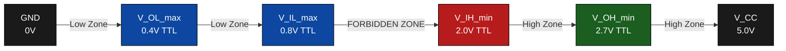
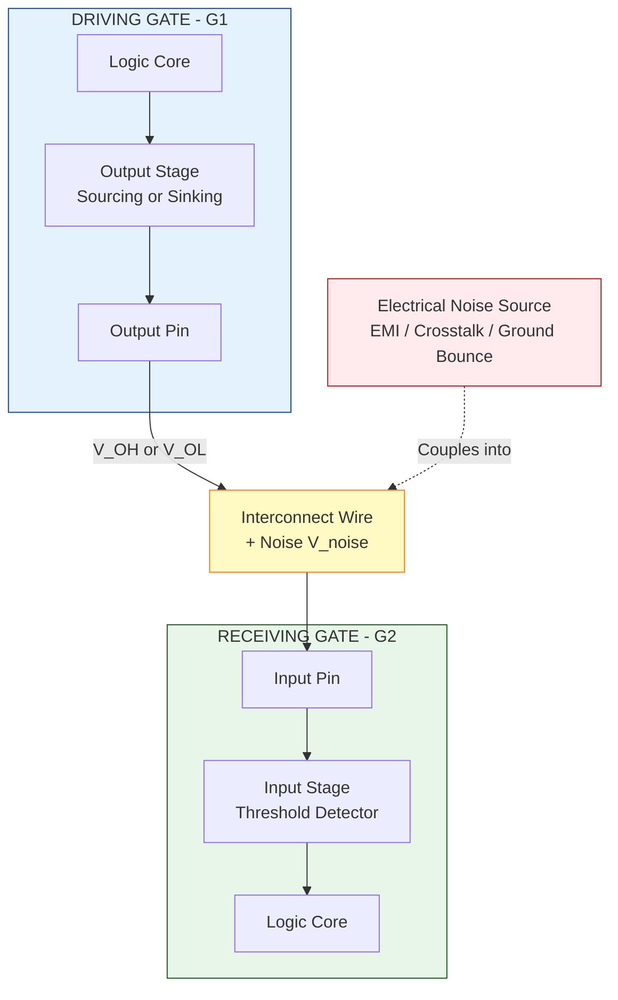
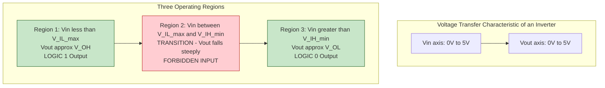
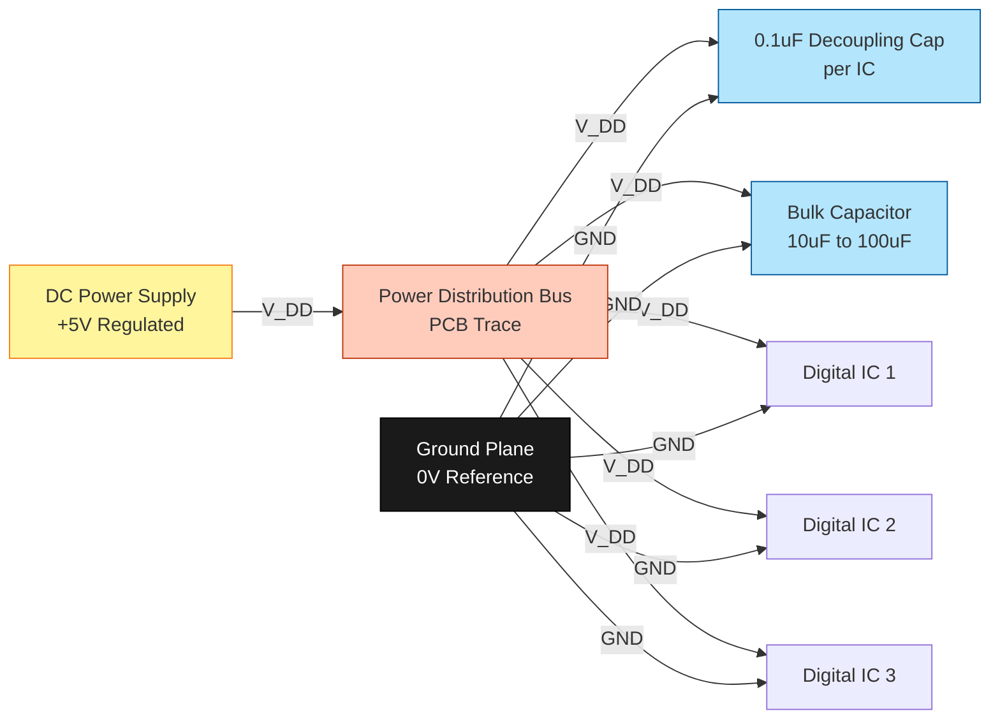
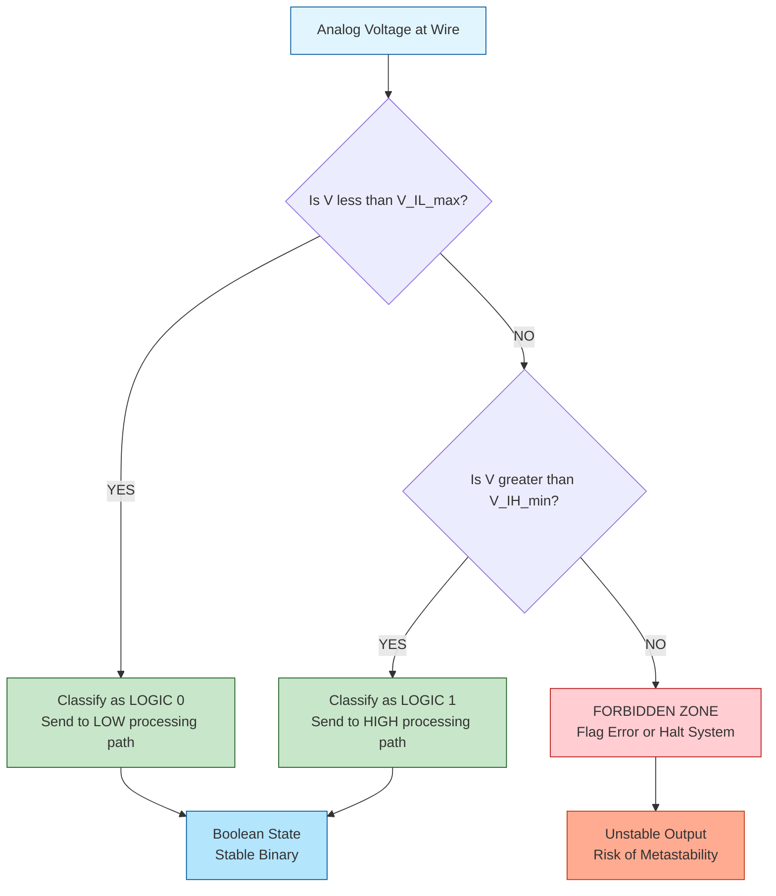

# Digital circuit operation - logic levels, output dc specifications, input dc specifications, noise margins, power supplies

<!-- SECTION_1_START -->
# Digital Circuit Operation: Logic Levels, DC Specifications & Noise Margins

## 1.1 Core Technical Definition

> [!IMPORTANT]
> **Formal Definition (KTU 2024 Syllabus Aligned):**
> A **digital circuit** operates on **discrete voltage levels** rather than continuous analog values. Every digital signal is interpreted as one of two valid logic states — **Logic HIGH (1)** or **Logic LOW (0)** — defined by a specific range of voltages bounded by strict DC thresholds. The **DC specifications** of a logic family (TTL or CMOS) define four critical voltage thresholds ($V_{OH}$, $V_{OL}$, $V_{IH}$, $V_{IL}$) and four current parameters ($I_{OH}$, $I_{OL}$, $I_{IH}$, $I_{IL}$) that characterize the electrical behaviour of every input and output pin. **Noise Margin (NM)** is the safety buffer voltage that guarantees a logic level will be correctly interpreted even in the presence of electrical noise.

### The Five Pillars of Digital Circuit Operation

| # | Pillar | What it Defines |
|---|--------|-----------------|
| 1 | Logic Levels | Recognized HIGH/LOW voltage values |
| 2 | Output DC Specs | What a gate **guarantees** to drive out |
| 3 | Input DC Specs | What a gate **guarantees** to recognize |
| 4 | Noise Margins | The immunity to noise contamination |
| 5 | Power Supplies | Energy sources ($V_{CC}$, $V_{DD}$, GND) |

---

## 1.2 Conceptual Analogy / Intuition

> [!NOTE]
> **Real-World Analogy — The Postal Sorting System**
>
> Imagine a post office where every letter has either a **RED stamp (HIGH)** or **BLUE stamp (LOW)**. The sorting machine is calibrated to:
> - Treat anything "reddish" as RED → process as Express
> - Treat anything "bluish" as BLUE → process as Regular
> - Anything "purple" (in between) → **REJECT (forbidden zone)**
>
> The **logic levels** are the stamp colors. The **DC specifications** are the precise color-shade definitions. The **noise margin** is the tolerance — even if the stamp gets slightly dirty or smudged, the sorter still makes the right call.

### The Four Critical Voltage Thresholds

| Parameter | Symbol | Role | Whose Gate? |
|-----------|--------|------|-------------|
| Output HIGH minimum | $V_{OH(min)}$ | Minimum voltage the driver **guarantees** when outputting 1 | Output of driving gate |
| Output LOW maximum | $V_{OL(max)}$ | Maximum voltage the driver **guarantees** when outputting 0 | Output of driving gate |
| Input HIGH minimum | $V_{IH(min)}$ | Minimum voltage the receiver **requires** to recognize a 1 | Input of driven gate |
| Input LOW maximum | $V_{IL(max)}$ | Maximum voltage the receiver **requires** to recognize a 0 | Input of driven gate |

> [!IMPORTANT]
> **Golden Rule of Logic Levels:**
> For reliable digital operation, the **driver's worst-case output** must **always exceed** the **receiver's worst-case input requirement**:
> $$V_{OH(min)} \geq V_{IH(min)} \quad \text{and} \quad V_{OL(max)} \leq V_{IL(max)}$$

---

## 1.3 Standard Logic Families — Voltage Values

### TTL (Transistor-Transistor Logic) — 74xx Series

| Parameter | Voltage | Typical Value |
|-----------|---------|---------------|
| $V_{OH(min)}$ | Logic HIGH output minimum | **2.7 V** |
| $V_{OL(max)}$ | Logic LOW output maximum | **0.4 V** |
| $V_{IH(min)}$ | Logic HIGH input minimum | **2.0 V** |
| $V_{IL(max)}$ | Logic LOW input maximum | **0.8 V** |
| Supply $V_{CC}$ | Power supply | **+5.0 V** |

### CMOS (4000B / 74HCxx Series) — 5V operation

| Parameter | Voltage | Typical Value |
|-----------|---------|---------------|
| $V_{OH(min)}$ | Logic HIGH output minimum | **4.95 V** (≈ $V_{DD}$) |
| $V_{OL(max)}$ | Logic LOW output maximum | **0.05 V** (≈ GND) |
| $V_{IH(min)}$ | Logic HIGH input minimum | **3.5 V** |
| $V_{IL(max)}$ | Logic LOW input maximum | **1.5 V** |
| Supply $V_{DD}$ | Power supply | **+5.0 V** |

> [!VISUALIZATION CONTROL]
> **Concept:** Voltage Transfer Characteristic (VTC) of a digital inverter
> **GeoGebra / Desmos Input Equations:**
> * `V_out = 5 / (1 + exp(-8 * (V_in - 2.5)))`  *(smooth S-curve approximation)*
> * Threshold points: `(0.8, ~5)`, `(2.0, ~0)`, `V_in = 2.5` (switching midpoint)
> **Visual Description:** Plot $V_{out}$ (y-axis, 0 to 5V) versus $V_{in}$ (x-axis, 0 to 5V). The S-curve stays flat near 5V for $V_{in} < V_{IL}$, drops sharply between 0.8V and 2.0V, and stays flat near 0V for $V_{in} > V_{IH}$. The forbidden transition region lies between 0.8V and 2.0V.

---

## 1.4 Why Power Supplies Matter

> [!NOTE]
> **$V_{CC}$ vs $V_{DD}$ vs GND**
> - **$V_{CC}$** = Collector Supply (used for **BJT-based TTL** logic)
> - **$V_{DD}$** = Drain Supply (used for **MOS-based CMOS** logic)
> - **GND (0 V)** = Common reference point (ground)
>
> A stable, **decoupled** power supply is mandatory because any voltage sag on $V_{CC}/V_{DD}$ can push output levels outside the legal $V_{OH}$ range, destroying noise immunity.

<!-- SECTION_1_END -->

<!-- SECTION_2_START -->
# Deep Theoretical Analysis & KTU High-Yield Formula Sheet

## 2.1 Logic Levels — The Binary Voltage World

A **logic level** is a specific voltage range that represents a binary state. Every node in a digital circuit must reside in one of three zones at all times:

1. **Definitive HIGH zone** — $V \geq V_{IH(min)}$ → interpreted as logic **1**
2. **Definitive LOW zone** — $V \leq V_{IL(max)}$ → interpreted as logic **0**
3. **Forbidden / Indeterminate zone** — $V_{IL(max)} < V < V_{IH(min)}$ → **unpredictable output** (this is the danger zone where noise can flip logic states)

> [!WARNING]
> **KTU Examiner's Pitfall:** Students often confuse *typical* values (e.g., TTL HIGH = 3.4V) with *guaranteed specification* values (TTL $V_{OH(min)}$ = 2.7V). Always use **worst-case specification** values for design calculations.

---

## 2.2 Output DC Specifications — What the Driver Guarantees

When a logic gate produces an output, the manufacturer guarantees that the output voltage will fall within a specific range **while sourcing or sinking the rated current**:

### Output HIGH State (Sourcing Current)

The output acts as a **current source**, pushing current **out** of the pin into the load.

$$V_{OH} \geq V_{OH(min)} \quad \text{with} \quad I_{out} \leq I_{OH(max)}$$

- $I_{OH(max)}$ = maximum current the gate can source while still maintaining $V_{OH} \geq V_{OH(min)}$

### Output LOW State (Sinking Current)

The output acts as a **current sink**, pulling current **into** the pin from the load.

$$V_{OL} \leq V_{OL(max)} \quad \text{with} \quad I_{out} \leq I_{OL(max)}$$

- $I_{OL(max)}$ = maximum current the gate can sink while still maintaining $V_{OL} \leq V_{OL(max)}$

> [!NOTE]
> **The Current Direction Mnemonic:**
> - **S**ourcing = current flows **O**ut of the pin (S-O) → HIGH output
> - **S**inking = current flows **I**nto the pin (S-I) → LOW output

---

## 2.3 Input DC Specifications — What the Receiver Demands

### Input HIGH State (Receiving Current)

$$V_{IH} \geq V_{IH(min)} \quad \text{with} \quad I_{in} \leq I_{IH(max)}$$

- $I_{IH(max)}$ = small current that flows **into** a HIGH input (typically $\mu$A range for CMOS, up to 40 $\mu$A for TTL)

### Input LOW State (Receiving Current)

$$V_{IL} \leq V_{IL(max)} \quad \text{with} \quad I_{in} \leq I_{IL(max)}$$

- $I_{IL(max)}$ = small current that flows **out of** a LOW input (typically $\mu$A range for CMOS, up to 1.6 mA for TTL)

> [!IMPORTANT]
> **Fan-out** is the maximum number of gate inputs a single output can reliably drive:
> $$\text{DC Fan-out}_{HIGH} = \left\lfloor \frac{I_{OH(max)}}{I_{IH(max)}} \right\rfloor \quad , \quad \text{DC Fan-out}_{LOW} = \left\lfloor \frac{I_{OL(max)}}{I_{IL(max)}} \right\rfloor$$
> $$\text{Overall Fan-out} = \min(\text{Fan-out}_{HIGH},\ \text{Fan-out}_{LOW})$$

---

## 2.4 Noise Margins — The Immunity Buffer

> [!IMPORTANT]
> **High Noise Margin (NMH)** — The minimum voltage that can corrupt a HIGH signal before the receiver misinterprets it as LOW:
> $$NM_{H} = V_{OH(min)} - V_{IH(min)}$$

> [!IMPORTANT]
> **Low Noise Margin (NML)** — The minimum voltage that can corrupt a LOW signal before the receiver misinterprets it as HIGH:
> $$NM_{L} = V_{IL(max)} - V_{OL(max)}$$

A **larger noise margin = a more robust digital system** because the circuit tolerates more electrical noise without producing errors.

---

## 2.5 KTU High-Yield Formula Sheet

| # | Concept | Formula | Typical TTL Value | Typical CMOS (5V) Value |
|---|---------|---------|-------------------|--------------------------|
| 1 | High Noise Margin | $NM_H = V_{OH(min)} - V_{IH(min)}$ | $2.7 - 2.0 = \mathbf{0.7\ V}$ | $4.95 - 3.5 = \mathbf{1.45\ V}$ |
| 2 | Low Noise Margin | $NM_L = V_{IL(max)} - V_{OL(max)}$ | $0.8 - 0.4 = \mathbf{0.4\ V}$ | $1.5 - 0.05 = \mathbf{1.45\ V}$ |
| 3 | Total Noise Immunity | $NM_{total} = NM_H + NM_L$ | $1.1\ V$ | $2.9\ V$ |
| 4 | DC Fan-out (HIGH) | $N_{H} = I_{OH(max)} / I_{IH(max)}$ | $0.4\ mA / 40\ \mu A = 10$ | $4\ mA / 1\ \mu A = 4000$ |
| 5 | DC Fan-out (LOW) | $N_{L} = I_{OL(max)} / I_{IL(max)}$ | $16\ mA / 1.6\ mA = 10$ | $4\ mA / 1\ \mu A = 4000$ |
| 6 | Static Power Dissipation (per gate) | $P_D = V_{CC} \cdot I_{CCL}$ (or $I_{CCH}$) | $\sim 10\ mW$ | $\sim 0.01\ mW$ |
| 7 | Dynamic Power | $P_D = C_{PD} \cdot V_{DD}^2 \cdot f$ | N/A | Dominant in CMOS |
| 8 | Propagation Delay | $t_{pd} = (t_{pLH} + t_{pHL})/2$ | $\sim 10\ ns$ | $\sim 9\ ns$ (HC) |

> [!NOTE]
> **Engineering Insight:** CMOS is overwhelmingly preferred over TTL in modern VLSI design because it offers **(1) higher noise margins**, **(2) virtually infinite fan-out for DC static analysis**, **(3) near-zero static power**, and **(4) superior scalability to sub-micron processes**. TTL is now largely a legacy family used in educational labs and legacy industrial systems.

---

## 2.6 Power Supply Requirements

| Requirement | TTL | CMOS (74HC) | CMOS (4000B) |
|-------------|-----|-------------|---------------|
| Supply Voltage | $V_{CC} = 5.0\ V \pm 5\%$ | $V_{DD} = 2.0 - 6.0\ V$ | $V_{DD} = 3.0 - 18\ V$ |
| Tolerance | $\pm 250\ mV$ | $\pm 10\%$ | Wide range |
| Decoupling Capacitor | $0.1\ \mu F$ per IC | $0.1\ \mu F$ per IC | $0.1\ \mu F$ per IC |
| Ground | Single-point ground preferred | Single-point ground preferred | Single-point ground preferred |

> [!WARNING]
> **Decoupling is NON-NEGOTIABLE.** A 0.1 $\mu$F ceramic capacitor must be placed between $V_{CC}$/$V_{DD}$ and GND as close to the IC's power pin as possible (within 5mm). Without it, simultaneous switching of multiple outputs causes voltage drops on the supply rail — a phenomenon called **ground bounce** or **$V_{CC}$ sag** — that can push the logic level into the forbidden zone.

<!-- SECTION_2_END -->

<!-- SECTION_3_START -->
# Step-by-Step Derivations & Worked Numerical Solutions

## 3.1 Derivation: Noise Margin from First Principles

### Step 1 — Define the safe HIGH voltage window

A driver produces a HIGH output in the range:
$$V_{OL(max)} \le V_{driver} \le V_{CC} \quad \text{(LOW to VCC)}$$

For the HIGH case specifically, the driver's worst-case HIGH output is $V_{OH(min)}$. The receiver requires a minimum of $V_{IH(min)}$ to register a HIGH. The voltage **gap** between these two values is the buffer that absorbs noise:

$$NM_H = V_{driver,min}^{HIGH} - V_{receiver,min}^{HIGH} = V_{OH(min)} - V_{IH(min)}$$

### Step 2 — Define the safe LOW voltage window

For the LOW case, the driver's worst-case LOW output is $V_{OL(max)}$ (i.e., the output is not exactly 0V but somewhere up to $V_{OL(max)}$). The receiver requires a voltage no higher than $V_{IL(max)}$ to register a LOW. The voltage **gap** is:

$$NM_L = V_{receiver,max}^{LOW} - V_{driver,max}^{LOW} = V_{IL(max)} - V_{OL(max)}$$

### Step 3 — Total Noise Immunity

$$\boxed{NM_{total} = NM_H + NM_L = [V_{OH(min)} - V_{IH(min)}] + [V_{IL(max)} - V_{OL(max)}]}$$

> **Interpretation:** This represents the total voltage range within which the output of a gate is guaranteed to be unambiguously recognized by the next gate, regardless of electrical noise on the line.

---

## 3.2 Worked Example 1 — TTL Noise Margins (Board Exam Favourite)

**Problem:** For the standard 74LS (Low-power Schottky) TTL family, the following worst-case DC specifications are given:

| Parameter | Value |
|-----------|-------|
| $V_{OH(min)}$ | 2.7 V |
| $V_{OL(max)}$ | 0.5 V |
| $V_{IH(min)}$ | 2.0 V |
| $V_{IL(max)}$ | 0.8 V |

**Find:** (a) High Noise Margin, (b) Low Noise Margin, (c) Total Noise Immunity.

**Step-by-step Model Solution:**

**(a) High Noise Margin:**
$$NM_H = V_{OH(min)} - V_{IH(min)}$$
$$NM_H = 2.7\ V - 2.0\ V$$
$$\boxed{NM_H = 0.7\ V}$$

**[Stating formula: 1 Mark | Substituting values: 1 Mark | Final answer with unit: 1 Mark]**

**(b) Low Noise Margin:**
$$NM_L = V_{IL(max)} - V_{OL(max)}$$
$$NM_L = 0.8\ V - 0.5\ V$$
$$\boxed{NM_L = 0.3\ V}$$

**(c) Total Noise Immunity:**
$$NM_{total} = NM_H + NM_L$$
$$NM_{total} = 0.7\ V + 0.3\ V$$
$$\boxed{NM_{total} = 1.0\ V}$$

**[Both NMH and NML correctly evaluated: 1 Mark | Final summation: 1 Mark]**

> [!NOTE]
> **Observation:** TTL has asymmetric noise margins ($NM_H = 0.7V \neq NM_L = 0.3V$). This asymmetry is one reason CMOS (with symmetric 1.45V noise margins) is preferred in noisy industrial environments.

---

## 3.3 Worked Example 2 — Fan-out Calculation

**Problem:** A 74LS00 NAND gate output drives ten 74LS00 inputs. Given:
- $I_{OH(max)} = 0.4\ mA$, $I_{OL(max)} = 8\ mA$
- $I_{IH(max)} = 20\ \mu A$, $I_{IL(max)} = 0.4\ mA$

**Find:** (a) Fan-out in HIGH state, (b) Fan-out in LOW state, (c) Verify if 10 loads are permissible.

**Step-by-step Model Solution:**

**(a) HIGH-state Fan-out:**
$$N_H = \frac{I_{OH(max)}}{I_{IH(max)}}$$
$$N_H = \frac{0.4 \times 10^{-3}\ A}{20 \times 10^{-6}\ A}$$
$$N_H = \frac{400\ \mu A}{20\ \mu A} = 20$$

**[Formula: 1 Mark | Unit conversion: 1 Mark | Final answer: 1 Mark]**

**(b) LOW-state Fan-out:**
$$N_L = \frac{I_{OL(max)}}{I_{IL(max)}}$$
$$N_L = \frac{8\ mA}{0.4\ mA} = 20$$

**(c) Overall Fan-out:**
$$N_{overall} = \min(N_H, N_L) = \min(20, 20) = 20$$

Since the load count (10) is **less than or equal to** the maximum fan-out (20), the system operates reliably.

$$\boxed{\text{10 loads are SAFE (Fan-out margin} = 20 - 10 = 10\text{ spare slots)}}$$

---

## 3.4 Worked Example 3 — Power Dissipation Analysis

**Problem:** A CMOS 74HC00 NAND gate operates at $V_{DD} = 5\ V$ with a load capacitance of $C_L = 50\ pF$ at a switching frequency of $f = 10\ MHz$. Given $C_{PD} = 25\ pF$ (internal power dissipation capacitance).

**Find:** Total dynamic power dissipation.

**Step-by-step Model Solution:**

**Step 1:** Identify the total effective capacitance:
$$C_{T} = C_{PD} + C_{L}$$
$$C_{T} = 25\ pF + 50\ pF = 75\ pF$$

**Step 2:** Apply the CMOS dynamic power formula:
$$P_{dynamic} = C_{T} \cdot V_{DD}^{2} \cdot f$$
$$P_{dynamic} = (75 \times 10^{-12}) \cdot (5)^{2} \cdot (10 \times 10^{6})$$
$$P_{dynamic} = 75 \times 10^{-12} \cdot 25 \cdot 10^{7}$$
$$P_{dynamic} = 75 \times 25 \times 10^{-5}$$
$$P_{dynamic} = 1875 \times 10^{-5}$$
$$\boxed{P_{dynamic} = 18.75\ mW}$$

**[Formula statement: 1 Mark | Total capacitance: 1 Mark | Squaring V_DD: 1 Mark | Final multiplication: 1 Mark]**

**Step 3:** Static power (CMOS at idle):
$$P_{static} = V_{DD} \cdot I_{DD(leakage)} \approx 0 \quad (\text{as } I_{DD} \approx 0.5\ \mu A)$$
$$P_{static} = 5 \times 0.5 \times 10^{-6} = 2.5\ \mu W \approx 0$$

**Step 4:** Total power:
$$P_{total} \approx P_{dynamic} = 18.75\ mW$$

---

## 3.5 Python Code: Noise Margin & Fan-out Calculator

```python
"""
KTU 2024 - Digital Electronics Logic Design
Module 1: Digital Circuit DC Specifications Calculator
Author: KTU Premium Engine V10
"""

from dataclasses import dataclass
from typing import Literal


@dataclass(frozen=True)
class DCLimits:
    """DC specification parameters for a logic family (all in Volts / Amperes)."""
    v_oh_min: float   # Output HIGH minimum voltage (V)
    v_ol_max: float   # Output LOW maximum voltage (V)
    v_ih_min: float   # Input HIGH minimum voltage (V)
    v_il_max: float   # Input LOW maximum voltage (V)
    i_oh_max: float   # Output HIGH max source current (A)
    i_ol_max: float   # Output LOW max sink current (A)
    i_ih_max: float   # Input HIGH max current (A)
    i_il_max: float   # Input LOW max current (A)
    v_supply: float   # Power supply voltage (V)

    def __post_init__(self) -> None:
        if not (0.0 <= self.v_ol_max < self.v_il_max < self.v_ih_min < self.v_oh_min <= self.v_supply):
            raise ValueError(
                f"Invalid DC limits. Must satisfy: 0 <= V_OL_max < V_IL_max < "
                f"V_IH_min < V_OH_min <= V_supply. Got: {self}"
            )


def compute_noise_margins(spec: DCLimits) -> dict[str, float]:
    """Compute HIGH and LOW noise margins from DC specifications."""
    nm_h: float = spec.v_oh_min - spec.v_ih_min
    nm_l: float = spec.v_il_max - spec.v_ol_max
    return {
        "NM_H (V)": round(nm_h, 4),
        "NM_L (V)": round(nm_l, 4),
        "NM_total (V)": round(nm_h + nm_l, 4),
    }


def compute_fan_out(spec: DCLimits) -> dict[str, int]:
    """Compute DC fan-out for HIGH and LOW states."""
    if spec.i_ih_max <= 0 or spec.i_il_max <= 0:
        raise ValueError("Input currents must be positive.")
    fan_out_h: int = int(spec.i_oh_max // spec.i_ih_max)
    fan_out_l: int = int(spec.i_ol_max // spec.i_il_max)
    return {
        "Fan-out HIGH": fan_out_h,
        "Fan-out LOW": fan_out_l,
        "Overall Fan-out": min(fan_out_h, fan_out_l),
    }


def classify_input(voltage: float, spec: DCLimits) -> Literal["HIGH", "LOW", "FORBIDDEN"]:
    """Classify a voltage level as HIGH, LOW, or in the forbidden zone."""
    if voltage >= spec.v_ih_min:
        return "HIGH"
    if voltage <= spec.v_il_max:
        return "LOW"
    return "FORBIDDEN"


# ---------- Standard 74LS TTL Specifications ----------
ttl_74ls: DCLimits = DCLimits(
    v_oh_min=2.7, v_ol_max=0.5,
    v_ih_min=2.0, v_il_max=0.8,
    i_oh_max=0.4e-3, i_ol_max=8.0e-3,
    i_ih_max=20e-6,  i_il_max=0.4e-3,
    v_supply=5.0,
)

# ---------- Standard 74HC CMOS Specifications ----------
cmos_74hc: DCLimits = DCLimits(
    v_oh_min=4.95, v_ol_max=0.05,
    v_ih_min=3.5,  v_il_max=1.5,
    i_oh_max=4.0e-3, i_ol_max=4.0e-3,
    i_ih_max=1.0e-6, i_il_max=1.0e-6,
    v_supply=5.0,
)


def main() -> None:
    for label, spec in [("74LS TTL", ttl_74ls), ("74HC CMOS", cmos_74hc)]:
        print(f"=== {label} ===")
        print(f"Noise Margins: {compute_noise_margins(spec)}")
        print(f"Fan-out Specs: {compute_fan_out(spec)}")
        print(f"Test: 2.5V is {classify_input(2.5, spec)}")
        print(f"Test: 1.0V is {classify_input(1.0, spec)}")
        print()


if __name__ == "__main__":
    main()
```

**Expected Output:**
```
=== 74LS TTL ===
Noise Margins: {'NM_H (V)': 0.7, 'NM_L (V)': 0.3, 'NM_total (V)': 1.0}
Fan-out Specs: {'Fan-out HIGH': 20, 'Fan-out LOW': 20, 'Overall Fan-out': 20}
Test: 2.5V is HIGH
Test: 1.0V is FORBIDDEN

=== 74HC CMOS ===
Noise Margins: {'NM_H (V)': 1.45, 'NM_L (V)': 1.45, 'NM_total (V)': 2.9}
Fan-out Specs: {'Fan-out HIGH': 4000, 'Fan-out LOW': 4000, 'Overall Fan-out': 4000}
Test: 2.5V is FORBIDDEN
Test: 1.0V is LOW
```

<!-- SECTION_3_END -->

<!-- SECTION_4_START -->
# Structural Diagrams & Schematics

## 4.1 Logic Level Voltage Map — The Three Operating Zones



> **Reading the diagram:** LEFT (blue) = recognized as **LOGIC 0**, RIGHT (green) = recognized as **LOGIC 1**, MIDDLE (red) = **forbidden / indeterminate** zone where any signal must NEVER linger.

---

## 4.2 Driver-to-Receiver Interface Block Diagram



> **Key Insight:** The **Noise Margin** is the engineering safety buffer ensuring that even with noise coupling into the wire, the receiver still classifies the signal correctly.

---

## 4.3 Noise Margin Visualization (VTC Curve)



---

## 4.4 CMOS Power Supply Distribution Architecture



> **Engineering Practice:** Use a **low-impedance ground plane** (a continuous copper pour on one PCB layer) and place one **0.1 $\mu$F decoupling capacitor** adjacent to **every** IC's $V_{CC}/V_{DD}$ pin to suppress high-frequency noise.

---

## 4.5 Sequential Processing Topology: Signal Interpretation Flow



<!-- SECTION_4_END -->

<!-- SECTION_5_START -->
# KTU 2024 Scheme Examination Question Bank & Topic Recap

---

## PART A — Short Answer Questions (2 × 3 = 6 Marks)

### Question 1: Define Noise Margin. Why is it important in digital circuit design?  [3 Marks]

`[KTU University Exam - July 2024]`
**Mapped CO:** CO1 | **Bloom's Level:** Remember / Understand

**Model Answer:**

> **Noise Margin (NM)** is the measure of a digital circuit's tolerance to electrical noise. It is defined as the voltage difference between the guaranteed output voltage of a driving gate and the minimum input voltage required by the receiving gate.
>
> **Two types:**
> 1. **High Noise Margin:** $NM_H = V_{OH(min)} - V_{IH(min)}$
> 2. **Low Noise Margin:** $NM_L = V_{IL(max)} - V_{OL(max)}$
>
> **Importance:** A larger noise margin ensures **reliable digital operation** in noisy environments by guaranteeing that spurious voltage fluctuations will not cause logic misinterpretation. **[1 Mark]**

**[Definition: 1 Mark | Both formulas: 1 Mark | Importance explained: 1 Mark]**

---

### Question 2: List any four DC specifications of a digital logic gate.  [3 Marks]

`[KTU University Exam - Dec 2023]`
**Mapped CO:** CO1 | **Bloom's Level:** Remember

**Model Answer:**

The four DC specifications of a digital logic gate are:
1. $V_{OH(min)}$ — Minimum output voltage guaranteed in HIGH state
2. $V_{OL(max)}$ — Maximum output voltage guaranteed in LOW state
3. $V_{IH(min)}$ — Minimum input voltage required to recognize a HIGH
4. $V_{IL(max)}$ — Maximum input voltage required to recognize a LOW

Additional related current specifications: $I_{OH}$, $I_{OL}$, $I_{IH}$, $I_{IL}$.

**[Each specification: 0.5 Marks × 4 = 2 Marks | Example values: 1 Mark]**

---

## PART B — Long Answer Questions — ESE Module Internal Choice (Choose ONE, 14 Marks)

### ⭐ Question A (Choice 1) — 14 Marks

`[KTU University Exam - July 2024]`
**Mapped CO:** CO1, CO2 | **Bloom's Level:** Understand, Apply

**(a)** With the help of a neat diagram, explain the concept of logic levels, output DC specifications, and input DC specifications of a digital IC. Discuss the three operating regions in a Voltage Transfer Characteristic (VTC). **[7 Marks]**

**(b)** For a 74LS TTL gate, $V_{OH(min)} = 2.7V$, $V_{OL(max)} = 0.5V$, $V_{IH(min)} = 2.0V$, $V_{IL(max)} = 0.8V$. Calculate the **High Noise Margin**, **Low Noise Margin**, and **Total Noise Immunity**. Comment on the asymmetry. **[7 Marks]**

---

#### Model Solution for (a):

**Step 1 — Logic Levels:** A logic level is a defined voltage range that represents a binary state (HIGH = 1 or LOW = 0). All valid voltages fall into one of three regions. **[1 Mark]**

**Step 2 — Three Operating Regions (with VTC diagram):**

| Region | Voltage Range | Output | Interpretation |
|--------|---------------|--------|----------------|
| I | $V_{in} < V_{IL(max)}$ | $V_{out} \approx V_{OH}$ | **Stable HIGH** |
| II (Transition) | $V_{IL(max)} < V_{in} < V_{IH(min)}$ | Steep slope | **Forbidden zone** |
| III | $V_{in} > V_{IH(min)}$ | $V_{out} \approx V_{OL}$ | **Stable LOW** |

**[VTC diagram with 3 zones marked: 3 Marks]**

**Step 3 — Output DC Specifications:** These define what a gate's output is **guaranteed to deliver**. They include $V_{OH(min)}$, $V_{OL(max)}$, $I_{OH(max)}$, $I_{OL(max)}$. **[1 Mark]**

**Step 4 — Input DC Specifications:** These define what a gate's input is **guaranteed to accept**. They include $V_{IH(min)}$, $V_{IL(max)}$, $I_{IH(max)}$, $I_{IL(max)}$. **[1 Mark]**

**Step 5 — Why they matter:** For reliable cascading, the driver's output spec must be compatible with the receiver's input spec. **[1 Mark]**

---

#### Model Solution for (b):

**Step 1 — High Noise Margin:**
$$NM_H = V_{OH(min)} - V_{IH(min)} = 2.7 - 2.0 = \mathbf{0.7\ V}$$
**[Formula: 0.5 Marks | Substitution: 0.5 Marks | Answer: 0.5 Marks]**

**Step 2 — Low Noise Margin:**
$$NM_L = V_{IL(max)} - V_{OL(max)} = 0.8 - 0.5 = \mathbf{0.3\ V}$$
**[Formula: 0.5 Marks | Substitution: 0.5 Marks | Answer: 0.5 Marks]**

**Step 3 — Total Noise Immunity:**
$$NM_{total} = NM_H + NM_L = 0.7 + 0.3 = \mathbf{1.0\ V}$$
**[Summation: 0.5 Marks | Final value: 0.5 Marks]**

**Step 4 — Comment on Asymmetry:**

The TTL family exhibits **asymmetric noise margins** ($NM_H = 0.7V \neq NM_L = 0.3V$), meaning the HIGH state has **more than double** the noise immunity of the LOW state. This asymmetry is a known limitation of the TTL totem-pole output stage. In contrast, the 74HC CMOS family provides **symmetric** noise margins of 1.45V each, making it superior in electrically noisy industrial environments. **[2 Marks]**

> [!WARNING]
> **KTU Examiner's Valuation Warning — Common Pitfalls:**
> 1. **Using typical instead of worst-case values:** Do not use 3.4V (typical TTL HIGH) — always use the guaranteed $V_{OH(min)}$ = 2.7V.
> 2. **Inverted formula:** Students frequently write $NM_L = V_{OL} - V_{IL}$ (sign error). Remember: $NM_L = V_{IL(max)} - V_{OL(max)}$.
> 3. **Missing units:** Always append "V" to noise margin values.
> 4. **Skipping the VTC diagram:** A question worth 7 marks typically requires a labelled diagram. Drawing it without proper axes/zones will cost 2-3 marks.

---

### ⭐ Question B (Choice 2) — 14 Marks

`[KTU University Exam - Dec 2023]`
**Mapped CO:** CO1, CO2 | **Bloom's Level:** Understand, Apply

**(a)** Define the terms **Fan-out**, **Power Dissipation**, and **Propagation Delay** for a logic family. Why is CMOS preferred over TTL in modern designs? **[7 Marks]**

**(b)** A 74LS00 NAND gate has $I_{OH(max)} = 0.4\ mA$, $I_{OL(max)} = 8\ mA$, $I_{IH(max)} = 20\ \mu A$, $I_{IL(max)} = 0.4\ mA$. It drives 15 identical gates. Verify the design's reliability and compute the **maximum number of additional gates** that can be safely added. **[7 Marks]**

---

#### Model Solution for (a):

**Fan-out** = Maximum number of standard loads a gate output can drive without degradation. **[0.5 Marks]**

$$\text{DC Fan-out} = \min\left(\left\lfloor \frac{I_{OH}}{I_{IH}} \right\rfloor, \left\lfloor \frac{I_{OL}}{I_{IL}} \right\rfloor\right)$$

**Power Dissipation** = Average energy consumed per unit time, typically in mW. For CMOS, $P = C \cdot V_{DD}^2 \cdot f$ (dynamic). **[1 Mark]**

**Propagation Delay** ($t_{pd}$) = Time taken for a signal to travel from input to output:
$$t_{pd} = \frac{t_{pLH} + t_{pHL}}{2}$$
typically in nanoseconds. **[1 Mark]**

**Why CMOS over TTL:**

| Parameter | TTL | CMOS |
|-----------|-----|------|
| Static Power | High (~10 mW) | Near zero |
| Fan-out | ~10 | >50 (DC) |
| Noise Margin | ~0.4-0.7V (asymmetric) | ~1.45V (symmetric) |
| Supply Range | 5V ± 5% | 2V to 6V (HC) |
| Integration Density | Low | Very high (VLSI friendly) |

**[Comparison table: 3 Marks]**

---

#### Model Solution for (b):

**Step 1 — HIGH-state Fan-out calculation:**
$$N_H = \frac{I_{OH(max)}}{I_{IH(max)}} = \frac{0.4 \times 10^{-3}}{20 \times 10^{-6}} = 20$$
**[Formula: 0.5 Marks | Unit conversion: 0.5 Marks | Answer: 0.5 Marks]**

**Step 2 — LOW-state Fan-out calculation:**
$$N_L = \frac{I_{OL(max)}}{I_{IL(max)}} = \frac{8 \times 10^{-3}}{0.4 \times 10^{-3}} = 20$$
**[Formula: 0.5 Marks | Substitution: 0.5 Marks | Answer: 0.5 Marks]**

**Step 3 — Overall Fan-out:**
$$N_{overall} = \min(20, 20) = 20$$
**[Min operation: 0.5 Marks]**

**Step 4 — Verify 15-gate load:**
Since 15 ≤ 20, the design is **reliable** in both HIGH and LOW states. **[1 Mark]**

**Step 5 — Spare capacity:**
$$N_{spare} = 20 - 15 = 5 \text{ additional gates}$$
**[Subtraction: 0.5 Marks | Final answer: 0.5 Marks]**

> [!WARNING]
> **KTU Examiner's Valuation Warning — Common Pitfalls:**
> 1. **Unit mismatch:** Always convert mA to A (or $\mu$A) consistently before dividing.
> 2. **Forgetting the MIN:** Some students compute both N_H and N_L and forget to take the minimum. The bottleneck is the **smaller** of the two.
> 3. **Ignoring integer rounding:** Fan-out must be an integer (you cannot drive half a gate). Use floor division.
> 4. **Missing conclusion:** Always end with a clear "**Design is RELIABLE / NOT RELIABLE**" statement.

---

## Topic Recap & Important Things to Remember

> [!IMPORTANT]
> **Rapid Revision Checklist — Digital Circuit DC Operation**

✅ **Logic Levels:** Two valid binary voltage states (HIGH & LOW), separated by a **forbidden zone** between $V_{IL(max)}$ and $V_{IH(min)}$.

✅ **Output DC Specs (DRIVER's promise):**
- $V_{OH(min)}$ — minimum HIGH output voltage
- $V_{OL(max)}$ — maximum LOW output voltage
- $I_{OH(max)}$ — maximum source current (HIGH state)
- $I_{OL(max)}$ — maximum sink current (LOW state)

✅ **Input DC Specs (RECEIVER's demand):**
- $V_{IH(min)}$ — minimum HIGH input threshold
- $V_{IL(max)}$ — maximum LOW input threshold
- $I_{IH(max)}$ — maximum HIGH input current
- $I_{IL(max)}$ — maximum LOW input current

✅ **Noise Margins — The Most Tested Formulas:**
- $NM_H = V_{OH(min)} - V_{IH(min)}$
- $NM_L = V_{IL(max)} - V_{OL(max)}$
- $NM_{total} = NM_H + NM_L$

✅ **DC Fan-out:**
- $N_H = I_{OH(max)} / I_{IH(max)}$
- $N_L = I_{OL(max)} / I_{IL(max)}$
- $N_{overall} = \min(N_H, N_L)$

✅ **CMOS Dynamic Power:**
- $P_{dynamic} = C_{PD} \cdot V_{DD}^2 \cdot f$

✅ **Propagation Delay:**
- $t_{pd} = (t_{pLH} + t_{pHL}) / 2$

✅ **Power Supply Names:**
- $V_{CC}$ → TTL (BJT) supply
- $V_{DD}$ → CMOS (MOSFET) supply
- **Always** use decoupling capacitors (0.1 $\mu$F per IC).

✅ **Family Comparison (Remember These Numbers):**

| Parameter | 74LS TTL | 74HC CMOS |
|-----------|----------|-----------|
| $V_{OH(min)}$ | 2.7 V | 4.95 V |
| $V_{OL(max)}$ | 0.5 V | 0.05 V |
| $V_{IH(min)}$ | 2.0 V | 3.5 V |
| $V_{IL(max)}$ | 0.8 V | 1.5 V |
| $NM_H$ | 0.7 V | 1.45 V |
| $NM_L$ | 0.3 V | 1.45 V |
| Fan-out | 20 | 4000 (DC) |
| Static Power | ~10 mW | ~0 mW |

✅ **Design Compatibility Rule:** A driver output is **guaranteed compatible** with a receiver input only if $V_{OH(min)}^{driver} \geq V_{IH(min)}^{receiver}$ AND $V_{OL(max)}^{driver} \leq V_{IL(max)}^{receiver}$.

✅ **Source vs Sink Mnemonic:** **S-O**urce = current flows **O**ut (HIGH state); **S-I**nk = current flows **I**n (LOW state).

✅ **Real-world Engineering Application:** Logic level compatibility is critical in mixed-voltage designs (e.g., 3.3V microcontroller interfacing with 5V peripherals), where **level shifters** are mandatory to avoid the forbidden zone.

<!-- SECTION_5_END -->
