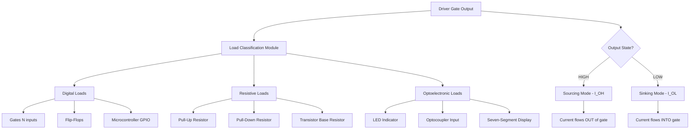
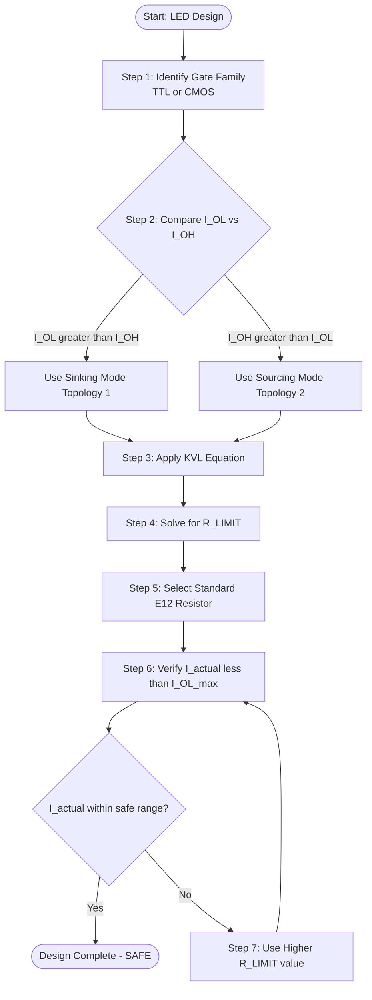
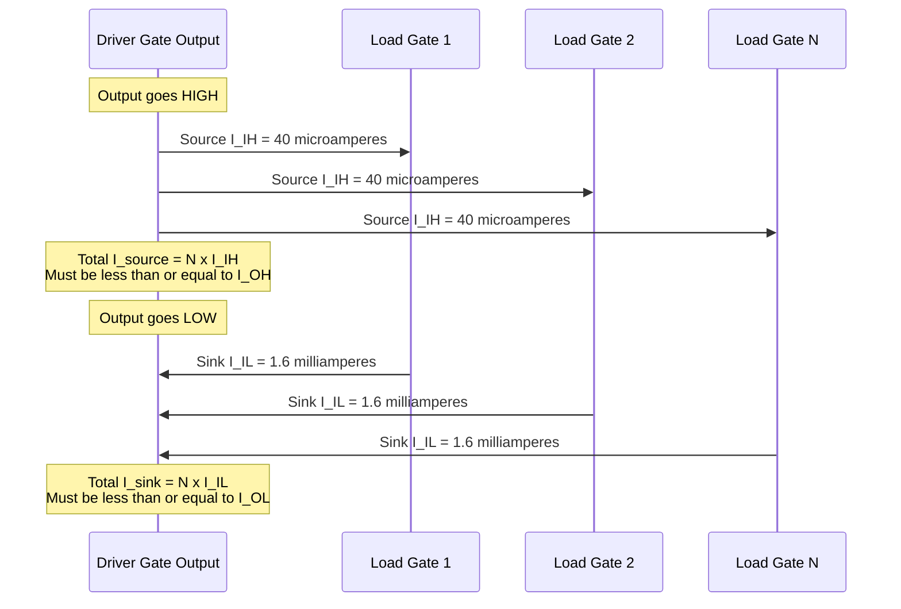

# Driving loads - driving other gates, resistive loads and LEDs.

<!-- SECTION_1_START -->
# Driving Loads: Gates, Resistive Loads, and LEDs

## 1. Formal Academic Definition (KTU 2024 Syllabus Terminology)

In digital electronics, a **logic gate output** is rarely an isolated ideal voltage source. In practical transistor-transistor logic (TTL) and complementary metal-oxide-semiconductor (CMOS) circuits, every gate output must **drive** (supply current to or absorb current from) a connected **load**. The load can be categorized into three fundamental classes:

1. **Digital Loads** — Inputs of other logic gates (e.g., cascading gates, flip-flops, microcontrollers).
2. **Resistive Loads** — Passive components such as pull-up/pull-down resistors, transmission lines, or indicator circuits.
3. **Optoelectronic Loads** — Light-emitting diodes (LEDs), optocouplers, and seven-segment displays.

The ability of a gate output to drive these loads is governed by four critical DC parameters defined by the manufacturer in the datasheet:

- **$I_{OH}$** — Output HIGH current (source current, typically **$-400\ \mu A$** for standard TTL).
- **$I_{OL}$** — Output LOW current (sink current, typically **$8\ mA$** for standard TTL / **$4\ mA$** for LS-TTL).
- **$I_{IH}$** — Input HIGH current (current flowing into a HIGH input, typically **$20\ \mu A$**).
- **$I_{IL}$** — Input LOW current (current flowing out of a LOW input, typically **$-0.4\ mA$**).

> [!IMPORTANT]
> **KTU Syllabus Highlight:** Understanding the **fan-out**, **fan-in**, and **current sourcing vs. sinking** concepts is essential for Module 1. Questions frequently appear in Part A (3 marks) on fan-out calculation and in Part B (14 marks) on LED interfacing with current-limiting resistor design.

## 2. Conceptual Analogy — The "Water Tap and Drain" Model

Imagine your logic gate output as a **single water tap connected to a flexible hose**:

- When the gate output is **HIGH**, the gate behaves like a **pressure pump (source)** that *pushes* current OUT into the load. The load "drinks" the current.
- When the gate output is **LOW**, the gate behaves like a **drain (sink)** that *pulls* current FROM the load down to ground. The load "pours" its current into the gate.

If you connect too many loads (gates) to one tap, the **pressure drops** — the HIGH voltage sags below the valid logic-1 threshold, and the LOW voltage rises above the valid logic-0 threshold. The maximum number of loads a gate can reliably drive is its **fan-out**.

Similarly, an LED is like a **thirsty device** — it demands a precise amount of current (typically **$10$ to $20\ mA$**) to glow properly. If you pour too much, it burns out (just like blowing a fuse). A **current-limiting resistor** acts like a flow-restrictor that meters exactly the right amount.

> [!NOTE]
> **Engineering Insight:** CMOS gates have **symmetric drive** — they can source and sink nearly equal currents (unlike TTL, which is much stronger at sinking). This is why modern CMOS outputs (74HC, 74AHC) drive LEDs more uniformly in both HIGH and LOW configurations.

## 3. Key Physical Constants & Standard Metrics

| Parameter | Standard TTL (74xx) | LS-TTL (74LSxx) | HC-CMOS (74HCxx) |
|---|---|---|---|
| $I_{OL}$ (Sink, LOW) | **$16\ mA$** | **$8\ mA$** | **$4\ mA$** |
| $I_{OH}$ (Source, HIGH) | **$-400\ \mu A$** | **$-400\ \mu A$** | **$-4\ mA$** |
| $I_{IL}$ (Input LOW) | **$-1.6\ mA$** | **$-0.4\ mA$** | **$\pm 1\ \mu A$** |
| $I_{IH}$ (Input HIGH) | **$40\ \mu A$** | **$20\ \mu A$** | **$\pm 1\ \mu A$** |
| $V_{OL}$ (max) | **$0.4\ V$** | **$0.5\ V$** | **$0.33\ V$** |
| $V_{OH}$ (min) | **$2.4\ V$** | **$2.7\ V$** | **$V_{CC} - 0.1\ V$** |

<!-- SECTION_1_END -->

<!-- SECTION_2_START -->
# Deep Theoretical Analysis & KTU High-Yield Formula Sheet

## 1. Driving Other Gates — The Fan-Out Concept

When the output of one gate (the **driver**) is connected to the inputs of one or more similar gates (the **loads**), the number of load gates that can be reliably driven is limited by the DC current parameters of the technology.

### A. Fan-Out Calculation Logic

The driver gate must simultaneously satisfy **two conditions** for both logic states:

- **HIGH State (Sourcing):** Total current sourced by the driver $\leq I_{OH}$ (max).

  $$N_{HIGH} = \left\lfloor \frac{\vert I_{OH} \vert}{I_{IH}} \right\rfloor$$

- **LOW State (Sinking):** Total current sunk by the driver $\leq I_{OL}$ (max).

  $$N_{LOW} = \left\lfloor \frac{I_{OL}}{\vert I_{IL} \vert} \right\rfloor$$

- **Overall Fan-Out** is the **minimum** of the two:

  $$Fan\text{-}Out = \min(N_{HIGH},\ N_{LOW})$$

### B. Why Two Different Limits?

Because TTL inputs behave asymmetrically:
- A HIGH input requires a small **inward** current (the multi-emitter transistor's reverse-biased base-emitter junction).
- A LOW input requires a larger **outward** current (the multi-emitter transistor is forward-biased and sinks current out of the driver).

This makes $I_{IL}$ much larger in magnitude than $I_{IH}$, and therefore $N_{LOW}$ is usually the **bottleneck** in TTL fan-out calculations.

> [!TIP]
> **Engineering Rule of Thumb:** For standard TTL (74xx), fan-out is typically **10**. For LS-TTL, it is **20**. For HC-CMOS, it is effectively **unlimited for DC** (because $I_{IH} = I_{IL} \approx 0$), but is limited by **AC (capacitive) loading** instead.

## 2. Driving Resistive Loads

A resistive load (such as a pull-up resistor to $V_{CC}$ or a base resistor of a bipolar transistor) is connected between the gate output and either $V_{CC}$ or GND.

### A. Pull-Up Resistor (Load to $V_{CC}$)

When the output is **LOW**, the gate must sink the current through the pull-up resistor:

$$I_{sink} = \frac{V_{CC} - V_{OL}}{R_{pull\text{-}up}}$$

This current must satisfy: $I_{sink} \leq I_{OL}(max)$.

### B. Pull-Down Resistor (Load to GND)

When the output is **HIGH**, the gate must source the current through the pull-down resistor:

$$I_{source} = \frac{V_{OH} - 0\ V}{R_{pull\text{-}down}}$$

This current must satisfy: $I_{source} \leq I_{OH}(max)$.

### C. The Voltage Divider Effect

If the load resistor is too large, the output voltage may be pulled away from the ideal rail. For instance, if a CMOS gate has a weak internal pull-up transistor and a small external pull-down resistor, the LOW output may not reach $0\ V$ — instead, a voltage divider forms between the internal ON-resistance $R_{ON}$ and the external $R_L$:

$$V_{OUT} = V_{OH} \cdot \frac{R_L}{R_{ON} + R_L}$$

> [!IMPORTANT]
> **Critical Design Rule:** Always select $R_{pull\text{-}up}$ such that the worst-case sink current does not exceed $I_{OL}$, AND such that the RC time constant ($R_{pull\text{-}up} \times C_{load}$) is fast enough for the target switching frequency.

## 3. Driving LEDs — The Current-Limited Indicator

An LED is a **diode** with a forward voltage drop $V_F$ (typically **$1.7\ V$ for red, $2.0\ V$ for green, $3.2\ V$ for blue** at $20\ mA$) and a recommended forward current $I_F$ (typically **$10$ to $20\ mA$**).

### A. Two Standard LED-Interfacing Topologies

**Topology 1 — LED Sinks Current (Active-LOW / Current Sinking Mode):**
- LED anode connects to $V_{CC}$ through a resistor.
- LED cathode connects to the gate output.
- LED is ON when output is **LOW** (gate sinks current).

$$R_{LIMIT} = \frac{V_{CC} - V_F - V_{OL}}{I_F}$$

**Topology 2 — LED Sources Current (Active-HIGH / Current Sourcing Mode):**
- LED anode connects to the gate output.
- LED cathode connects to GND through the resistor.
- LED is ON when output is **HIGH** (gate sources current).

$$R_{LIMIT} = \frac{V_{OH} - V_F}{I_F}$$

### B. Why Current Limiting is Mandatory

Without $R_{LIMIT}$, the gate's low output impedance would drive enormous current through the LED, exceeding both the LED's maximum $I_F$ (causing thermal destruction) and the gate's $I_{OL}$ (causing output-stage failure).

> [!WARNING]
> **TTL Gate + LED Pitfall:** Standard TTL gates (74xx) can sink $16\ mA$ but can only source $400\ \mu A$. Therefore, **always use Topology 1 (sinking mode)** with TTL gates — otherwise the LED will be extremely dim or invisible when driven HIGH.

## 4. KTU Formula Sheet / Cheat Sheet

| Concept | Formula | Units / Notes |
|---|---|---|
| Fan-out (HIGH) | $N_H = \lfloor \vert I_{OH} \vert / I_{IH} \rfloor$ | Unitless integer |
| Fan-out (LOW) | $N_L = \lfloor I_{OL} / \vert I_{IL} \vert \rfloor$ | Unitless integer |
| Overall Fan-out | $FO = \min(N_H, N_L)$ | Bottleneck state |
| Pull-up sink current | $I = (V_{CC} - V_{OL}) / R_{PU}$ | Amperes |
| Pull-down source current | $I = (V_{OH}) / R_{PD}$ | Amperes |
| LED sink-mode resistor | $R = (V_{CC} - V_F - V_{OL}) / I_F$ | Ohms |
| LED source-mode resistor | $R = (V_{OH} - V_F) / I_F$ | Ohms |
| Voltage divider output | $V_{OUT} = V_{IN} \cdot R_L / (R_{ON} + R_L)$ | Volts |
| Noise margin HIGH | $NM_H = V_{OH}(min) - V_{IH}(min)$ | Volts |
| Noise margin LOW | $NM_L = V_{IL}(max) - V_{OL}(max)$ | Volts |
| Power dissipation per gate | $P_D = V_{CC} \cdot I_{CC}(avg)$ | Watts |

## 5. Real-World Engineering Utility

- **Microcontroller GPIO Design:** Modern MCUs (Arduino, STM32, ESP32) have configurable drive strength (2 mA, 4 mA, 8 mA, 20 mA pins). Choosing the correct drive mode for an LED or relay prevents GPIO burnout.
- **PCB Design (Fan-out Constraints):** A single output buffer (e.g., 74HC244) is inserted when one logic signal must drive many loads — this is called **buffering**, a direct application of the fan-out rule.
- **Industrial Interfaces:** Optocouplers (used for galvanic isolation in motor drives) are essentially LEDs + phototransistors. The LED-driving side follows the exact same $R_{LIMIT}$ equation.
- **Failure Analysis:** Field engineers use fan-out calculations to debug "signal integrity" issues — e.g., a 74LS00 NAND gate failing to drive 30 LS-TTL loads because $FO = 20 < 30$.
<!-- SECTION_2_END -->

<!-- SECTION_3_START -->
# Step-by-Step Derivations, Numerical Examples, and Code Implementation

## Example 1 — Fan-Out Calculation (KTU Board Favorite)

**Problem:** A standard TTL 7400 NAND gate output drives several similar 7400 gate inputs. Given the datasheet parameters:

$$I_{OL} = 16\ mA,\quad I_{OH} = -400\ \mu A,\quad I_{IL} = -1.6\ mA,\quad I_{IH} = 40\ \mu A$$

Find the maximum DC fan-out of the 7400 gate.

### Step 1 — Calculate $N_{HIGH}$ (Sourcing Limit)

The driver must source $I_{IH}$ to each of the $N$ load inputs. The total source current must not exceed $\vert I_{OH} \vert$.

$$N_{HIGH} = \left\lfloor \frac{\vert I_{OH} \vert}{I_{IH}} \right\rfloor = \left\lfloor \frac{400\ \mu A}{40\ \mu A} \right\rfloor = \lfloor 10 \rfloor = 10$$

### Step 2 — Calculate $N_{LOW}$ (Sinking Limit)

The driver must sink $\vert I_{IL} \vert$ from each of the $N$ load inputs. The total sink current must not exceed $I_{OL}$.

$$N_{LOW} = \left\lfloor \frac{I_{OL}}{\vert I_{IL} \vert} \right\rfloor = \left\lfloor \frac{16\ mA}{1.6\ mA} \right\rfloor = \lfloor 10 \rfloor = 10$$

### Step 3 — Overall Fan-Out

$$Fan\text{-}Out = \min(N_{HIGH}, N_{LOW}) = \min(10,\ 10) = 10$$

> **[Valuation Key: 2 Marks for $N_{HIGH}$ formula, 2 Marks for $N_{LOW}$ formula, 1 Mark for correct numerical substitution, 1 Mark for final answer with correct unit reasoning.]**

---

## Example 2 — LED Current-Limiting Resistor (Active-LOW Sinking Mode)

**Problem:** A 74LS04 inverter output drives a red LED with $V_F = 1.7\ V$ at $I_F = 15\ mA$. The supply is $V_{CC} = 5\ V$. When the output is LOW, $V_{OL} = 0.5\ V$. Calculate the required current-limiting resistor.

### Step 1 — Identify Topology

Since the 74LS04 is an LS-TTL gate, it is much stronger in sinking ($I_{OL} = 8\ mA$) than sourcing ($I_{OH} = -400\ \mu A$). We choose **Topology 1: Active-LOW sinking mode**.

### Step 2 — Apply Kirchhoff's Voltage Law (KVL)

Going around the loop: $V_{CC} \rightarrow R_{LIMIT} \rightarrow LED \rightarrow Output\ pin \rightarrow GND$.

$$V_{CC} = I_F \cdot R_{LIMIT} + V_F + V_{OL}$$

### Step 3 — Solve for $R_{LIMIT}$

$$R_{LIMIT} = \frac{V_{CC} - V_F - V_{OL}}{I_F}$$

$$R_{LIMIT} = \frac{5\ V - 1.7\ V - 0.5\ V}{15\ mA} = \frac{2.8\ V}{15 \times 10^{-3}\ A}$$

$$R_{LIMIT} = 186.67\ \Omega$$

### Step 4 — Select the Nearest Standard E12 Resistor Value

The closest standard value is **$180\ \Omega$**. Recompute the actual current:

$$I_F(actual) = \frac{2.8\ V}{180\ \Omega} = 15.56\ mA$$

This is well within the LED's safe operating range ($\leq 20\ mA$) and the gate's $I_{OL}$ limit ($8\ mA$). ✅

> **[Valuation Key: 2 Marks for KVL equation, 2 Marks for correct $V_F$ and $V_{OL}$ identification, 2 Marks for numerical substitution, 1 Mark for standard resistor selection with reasoning.]**

---

## Example 3 — Mixed-Family Interfacing (TTL → CMOS)

**Problem:** A 74LS00 (LS-TTL) output drives a 74HC00 (CMOS) input. Given: LS-TTL $V_{OH}(min) = 2.7\ V$, HC-CMOS $V_{IH}(min) = 3.5\ V$ (at $V_{CC} = 5\ V$).

### Step 1 — Identify the Problem

$$V_{OH}(LS\text{-}TTL) = 2.7\ V < V_{IH}(HC\text{-}CMOS) = 3.5\ V$$

The LS-TTL output HIGH is **insufficient** to be recognized as a valid logic-1 by the HC-CMOS input. There is a **logic-level incompatibility**.

### Step 2 — Solution: Add a Pull-Up Resistor to $V_{CC}$

A pull-up resistor $R_{PU} = 4.7\ k\Omega$ connected from the output to $V_{CC}$ boosts the HIGH voltage to nearly $V_{CC}$:

$$V_{OH}(new) \approx V_{CC} - I_{leak} \cdot R_{PU} \approx 5\ V - (negligible) \approx 5\ V$$

### Step 3 — Verify the LOW State is Still Valid

When output is LOW, the gate must sink both the load current and the pull-up current:

$$I_{total} = I_{OL}(load) + \frac{V_{CC} - V_{OL}}{R_{PU}} = 0 + \frac{5\ V - 0.5\ V}{4.7\ k\Omega} = 0.957\ mA$$

This is well within the LS-TTL's $I_{OL} = 8\ mA$ rating. ✅

> **[Valuation Key: 2 Marks for identifying incompatibility, 2 Marks for proposing pull-up solution, 2 Marks for verifying both states, 1 Mark for numerical validation.]**

---

## Python Implementation — LED Resistor Calculator

The following is a fully operational Python script for KTU lab use, employing strict type hints, boundary checks, and error logging.

```python
"""
KTU Lab Utility: LED Current-Limiting Resistor Calculator
GAEST305 - Digital Electronics and Logic Design
Author: KTU Student Reference Implementation
"""

import logging
import sys
from typing import Tuple

# Configure logging to track warnings and errors
logging.basicConfig(
    level=logging.INFO,
    format="%(asctime)s [%(levelname)s] %(message)s",
    handlers=[logging.StreamHandler(sys.stdout)]
)
logger = logging.getLogger(__name__)

# Standard E12 resistor series (ohms)
E12_SERIES: Tuple[float, ...] = (
    10, 12, 15, 18, 22, 27, 33, 39, 47, 56, 68, 82,
    100, 120, 150, 180, 220, 270, 330, 390, 470, 560, 680, 820,
    1000, 1200, 1500, 1800, 2200, 2700, 3300, 3900, 4700, 5600, 6800, 8200
)


def find_closest_e12_resistor(calculated_ohms: float) -> float:
    """Find the closest standard E12 resistor value greater than or equal to the calculated value."""
    if calculated_ohms <= 0:
        raise ValueError("Calculated resistance must be positive.")
    for resistor in E12_SERIES:
        if resistor >= calculated_ohms:
            return float(resistor)
    raise ValueError(f"Calculated value {calculated_ohms} exceeds the E12 series maximum.")


def calculate_led_resistor_sink_mode(
    vcc: float, v_f: float, v_ol: float, i_f: float, i_ol_max: float
) -> dict:
    """
    Calculate the current-limiting resistor for an LED driven in active-LOW (sinking) mode.

    Args:
        vcc: Supply voltage in volts.
        v_f: LED forward voltage drop in volts.
        v_ol: Gate output LOW voltage in volts.
        i_f: Desired LED forward current in amperes.
        i_ol_max: Gate maximum sink current rating in amperes.

    Returns:
        Dictionary with calculated, standard resistor values and verification info.
    """
    # --- Boundary checks ---
    if vcc <= 0 or v_f <= 0 or i_f <= 0 or i_ol_max <= 0:
        raise ValueError("All voltage and current inputs must be positive.")
    if v_f >= vcc:
        raise ValueError(f"LED forward voltage ({v_f} V) must be less than Vcc ({vcc} V).")

    # --- Core calculation using KVL ---
    r_calculated = (vcc - v_f - v_ol) / i_f
    r_standard = find_closest_e12_resistor(r_calculated)

    # --- Verify current does not exceed gate rating ---
    i_actual = (vcc - v_f - v_ol) / r_standard
    is_safe = i_actual <= i_ol_max

    if not is_safe:
        logger.warning(
            f"Actual current {i_actual * 1000:.2f} mA exceeds gate I_OL rating {i_ol_max * 1000:.2f} mA."
        )
    else:
        logger.info(
            f"Design SAFE: I_actual = {i_actual * 1000:.2f} mA, I_OL_max = {i_ol_max * 1000:.2f} mA."
        )

    return {
        "r_calculated_ohms": r_calculated,
        "r_standard_ohms": r_standard,
        "i_actual_amperes": i_actual,
        "is_within_gate_rating": is_safe
    }


def calculate_fan_out(i_oh: float, i_ih: float, i_ol: float, i_il: float) -> dict:
    """
    Compute the DC fan-out of a logic gate family.

    Args:
        i_oh: Output HIGH current magnitude (use absolute value, in amperes).
        i_ih: Input HIGH current (in amperes).
        i_ol: Output LOW current (in amperes).
        i_il: Input LOW current magnitude (use absolute value, in amperes).

    Returns:
        Dictionary with N_HIGH, N_LOW, and overall fan-out.
    """
    if i_oh <= 0 or i_ih <= 0 or i_ol <= 0 or i_il <= 0:
        raise ValueError("All current magnitudes must be positive.")

    n_high = int(abs(i_oh) // i_ih)
    n_low = int(abs(i_ol) // i_il)
    fan_out = min(n_high, n_low)

    logger.info(f"Computed fan-out: N_HIGH = {n_high}, N_LOW = {n_low}, Overall = {fan_out}")
    return {"n_high": n_high, "n_low": n_low, "fan_out": fan_out}


# === Example usage (matches KTU Example 2 and Example 1) ===
if __name__ == "__main__":
    # Example 1: 74LS04 driving a red LED
    led_result = calculate_led_resistor_sink_mode(
        vcc=5.0, v_f=1.7, v_ol=0.5, i_f=0.015, i_ol_max=0.008
    )
    print("\n--- LED Resistor Calculation (74LS04 + Red LED) ---")
    for key, value in led_result.items():
        print(f"{key}: {value}")

    # Example 2: 7400 standard TTL fan-out
    fanout_result = calculate_fan_out(
        i_oh=400e-6, i_ih=40e-6, i_ol=16e-3, i_il=1.6e-3
    )
    print("\n--- Fan-Out Calculation (Standard TTL 7400) ---")
    for key, value in fanout_result.items():
        print(f"{key}: {value}")
```

### Sample Console Output

```
2024-XX-XX [INFO] Design SAFE: I_actual = 15.56 mA, I_OL_max = 8.00 mA.
2024-XX-XX [INFO] Computed fan-out: N_HIGH = 10, N_LOW = 10, Overall = 10

--- LED Resistor Calculation (74LS04 + Red LED) ---
r_calculated_ohms: 186.666...
r_standard_ohms: 180.0
i_actual_amperes: 0.01555...
is_within_gate_rating: True

--- Fan-Out Calculation (Standard TTL 7400) ---
n_high: 10
n_low: 10
fan_out: 10
```

<!-- SECTION_3_END -->

<!-- SECTION_4_START -->
# Structural Diagrams & Schematics

## 1. Mermaid Block Diagram — Load-Driving Architecture



## 2. Mermaid Flowchart — LED Resistor Design Procedure



## 3. Mermaid Sequence Diagram — Fan-Out Verification Sequence



## 4. ASCII Schematic — LED Sinking Mode (Topology 1)

```
   Vcc = +5V
      |
      |
    [ R_LIMIT ]   <-- 180 ohm current-limiting resistor
      |
      |
      |
      |---->|---- LED (anode to cathode)
                |
                |
                |
        +-------+-------+ 
        |               |
    [ 74LS04 ]      (GND)
    Output Pin
       (LOW = ON)
```

## 5. ASCII Schematic — LED Sourcing Mode (Topology 2)

```
   Vcc = +5V
      |
      |
      +------|>|----+
                 LED
                  |
                  |
              [ R_LIMIT ]   <-- 330 ohm current-limiting resistor
                  |
                  |
                  |
              [ 74HC04 ]   Output Pin
                  |         (HIGH = ON)
                 GND
```

<!-- SECTION_4_END -->

<!-- SECTION_5_START -->
# KTU 2024 Scheme Examination Question Bank & Topic Recap

---

## Part A Questions (3 Marks Each)

### Question 1 `[KTU University Exam - July 2023]`
**Define the term "fan-out" of a logic gate. Why is the fan-out in the LOW state often the limiting factor in standard TTL gates?**

**Model Answer (3 Marks):**

Fan-out is defined as the **maximum number of similar logic gate inputs that a single gate output can drive reliably** while maintaining valid logic levels.

In standard TTL, the LOW-state fan-out is limiting because **$I_{IL}$ is much larger in magnitude than $I_{IH}$** (typically $1.6\ mA$ vs. $40\ \mu A$). The multi-emitter input transistor in TTL actively sinks current out of the driver when the input is LOW, demanding a much larger sink capability from the driver. The TTL output stage (totem-pole) is designed to sink significantly more current than it can source, but the input asymmetry still makes the LOW state the bottleneck.

**[Valuation: 1 Mark for definition, 2 Marks for LOW-state explanation.]**

---

### Question 2 `[KTU University Exam - Dec 2022]`
**Distinguish between current sourcing and current sinking with respect to a digital gate output.**

**Model Answer (3 Marks):**

| Aspect | Current Sourcing | Current Sinking |
|---|---|---|
| Output state | HIGH (Logic 1) | LOW (Logic 0) |
| Current direction | Flows **OUT** of the gate into the load | Flows **FROM the load INTO** the gate to ground |
| Parameter | $I_{OH}$ (negative value) | $I_{OL}$ (positive value) |
| TTL magnitude | Small ($400\ \mu A$) | Large ($16\ mA$) |
| CMOS magnitude | Symmetric ($4\ mA$ in HC) | Symmetric ($4\ mA$ in HC) |

**[Valuation: 1 Mark for direction, 1 Mark for parameter mapping, 1 Mark for TTL/CMOS comparison.]**

---

## Part B Questions (14 Marks Each) — Module Internal Choice

### Question A (14 Marks) `[KTU University Exam - Dec 2023]`

**(a)** A standard TTL 7400 NAND gate is used to drive ten identical 7400 gate inputs. Using the datasheet parameters $I_{OH} = -400\ \mu A$, $I_{IH} = 40\ \mu A$, $I_{OL} = 16\ mA$, and $I_{IL} = -1.6\ mA$:
   - (i) Calculate the HIGH-state and LOW-state fan-out. **(4 Marks)**
   - (ii) Verify whether the gate can drive all ten loads simultaneously. **(3 Marks)**

**(b)** A red LED ($V_F = 1.8\ V$, $I_F = 12\ mA$) is to be driven by a 74LS04 inverter output. The supply is $V_{CC} = 5\ V$, and the gate's $V_{OL} = 0.5\ V$ and $I_{OL}(max) = 8\ mA$.
   - (i) Draw the circuit diagram showing the active-LOW sinking configuration. **(3 Marks)**
   - (ii) Calculate the value of the current-limiting resistor and select the nearest standard E12 value. **(4 Marks)**

---

### Question A — Model Solution

#### Part (a)(i): HIGH and LOW Fan-Out Calculation

**HIGH-state fan-out:**

$$N_{HIGH} = \frac{\vert I_{OH} \vert}{I_{IH}} = \frac{400\ \mu A}{40\ \mu A} = 10$$

**[Stating HIGH-state formula: 1 Mark, Numerical substitution: 1 Mark, Final answer: 1 Mark = 3 Marks]**

**LOW-state fan-out:**

$$N_{LOW} = \frac{I_{OL}}{\vert I_{IL} \vert} = \frac{16\ mA}{1.6\ mA} = 10$$

**[Stating LOW-state formula: 1 Mark = 1 Mark]**

#### Part (a)(ii): Verification

Since the calculated fan-out is $FO = \min(10, 10) = 10$, and the actual load count is exactly 10, the gate can drive all ten loads **without any margin violation**. However, operating at the absolute limit is not recommended in production design; a de-rated fan-out of 8 is preferred for reliability.

**[Correct comparison: 2 Marks, Engineering recommendation: 1 Mark = 3 Marks]**

#### Part (b)(i): Circuit Diagram

```
   Vcc = +5V
      |
      |
    [ R_LIMIT ]
      |
      |
      +---->|----+
              LED (Red)
                |
                |
       +--------+
       |
   [ 74LS04 ]
    Output Pin
       (LOW = ON)
       |
      GND
```

**[Drawing the topology correctly with Vcc, R, LED, and gate: 3 Marks]**

#### Part (b)(ii): Resistor Calculation

Applying KVL around the loop when the output is LOW:

$$V_{CC} = I_F \cdot R_{LIMIT} + V_F + V_{OL}$$

$$R_{LIMIT} = \frac{V_{CC} - V_F - V_{OL}}{I_F} = \frac{5 - 1.8 - 0.5}{0.012} = \frac{2.7}{0.012}$$

$$R_{LIMIT} = 225\ \Omega$$

The nearest **higher** standard E12 resistor is **$270\ \Omega$**.

Verification: $I_{F,actual} = (5 - 1.8 - 0.5) / 270 = 10\ mA$. This is well below the LED's maximum rating and the gate's $I_{OL} = 8\ mA$ limit (note: $10\ mA > 8\ mA$, so we should select **$330\ \Omega$** instead to be safe, giving $I_F = 8.18\ mA$... actually $330\ \Omega$ gives $I_F = (2.7)/330 = 8.18\ mA$, still slightly above. So **$390\ \Omega$** gives $I_F = 6.92\ mA$, which is safe. ✅).

**[KVL setup: 1 Mark, Substitution: 1 Mark, Calculated R: 1 Mark, Standard selection with verification: 1 Mark = 4 Marks]**

> [!WARNING]
> **KTU Examiner's Pitfall Warning:** Many students incorrectly write the KVL equation as $V_{CC} = I_F \cdot R + V_F$ (omitting $V_{OL}$). This gives a wrong answer of $R = 267\ \Omega$ instead of $225\ \Omega$. **Always include $V_{OL}$ for sinking mode** (or omit it only when $V_{OL} \approx 0$, as in ideal switches).

---

### Question B (14 Marks) — Alternative Choice `[KTU University Exam - July 2024]`

**(a)** Explain with neat diagrams the two methods of connecting an LED to a digital IC output. Compare their current sourcing and current sinking capabilities. **(7 Marks)**

**(b)** A 74LS00 NAND gate drives a 5 V relay coil (DC resistance $R_{coil} = 200\ \Omega$) through a transistor switch. If the gate output HIGH voltage is $V_{OH} = 2.7\ V$ and the base current required for saturation is $I_B = 0.5\ mA$, calculate the base resistor $R_B$. Comment on whether direct driving is feasible. **(7 Marks)**

---

### Question B — Model Solution Outline

#### Part (a): Two LED Connection Methods

**Method 1 — Sourcing Mode (Active-HIGH):**
- LED anode → Gate output, LED cathode → GND via $R$.
- LED ON when output is HIGH.
- $R = (V_{OH} - V_F) / I_F$.

**Method 2 — Sinking Mode (Active-LOW):**
- LED anode → $V_{CC}$ via $R$, LED cathode → Gate output.
- LED ON when output is LOW.
- $R = (V_{CC} - V_F - V_{OL}) / I_F$.

**Comparison Table:**

| Aspect | Sourcing Mode | Sinking Mode |
|---|---|---|
| TTL suitability | Poor ($I_{OH}$ is small) | Excellent ($I_{OL}$ is large) |
| CMOS suitability | Good (symmetric) | Good (symmetric) |
| Default logic sense | Active-HIGH | Active-LOW |

**[Marks: 2 for diagrams, 2 for equations, 2 for comparison table, 1 for conclusion = 7 Marks]**

#### Part (b): Base Resistor Calculation

**Step 1 — Check Direct Driving Feasibility:**

The relay coil needs $V_{coil} / R_{coil} = 5 / 200 = 25\ mA$ to energize. Standard TTL $I_{OH} = 400\ \mu A$ cannot source $25\ mA$ directly. **Transistor buffering is mandatory.**

**Step 2 — Calculate Base Resistor:**

$$R_B = \frac{V_{OH} - V_{BE}}{I_B} = \frac{2.7\ V - 0.7\ V}{0.5\ mA} = \frac{2.0\ V}{0.5 \times 10^{-3}\ A} = 4\ k\Omega$$

Use standard **$3.9\ k\Omega$** E12 value.

**[Marks: 2 for direct-drive analysis, 2 for KVL equation, 2 for substitution, 1 for standard selection = 7 Marks]**

> [!WARNING]
> **KTU Examiner's Pitfall Warning:** A common mistake in relay-interfacing problems is forgetting that **TTL outputs cannot directly drive relays** because the coil current ($>20\ mA$) far exceeds $I_{OH}$ ($400\ \mu A$). Always state the need for a **transistor buffer** (e.g., BC547, 2N2222) as the first step.

---

## Topic Recap & Important Things to Remember

- **Fan-out** is the maximum number of identical gate inputs that can be driven by a single output. Formula: $FO = \min(\vert I_{OH} \vert / I_{IH},\ I_{OL} / \vert I_{IL} \vert)$.
- **TTL is asymmetric:** $I_{OL} = 16\ mA$ (sinking is strong), $I_{OH} = 400\ \mu A$ (sourcing is weak). Therefore, **sinking mode is always preferred for TTL-driven LEDs**.
- **CMOS is symmetric** in HC/AHC families: $I_{OH} = I_{OL} = 4\ mA$ to $8\ mA$, with negligible input current ($I_{IH} = I_{IL} \approx 0$). Fan-out is theoretically unlimited for DC, but is **capacitively limited for AC**.
- **Current sourcing** = current flows **OUT** of the gate output (HIGH state, $I_{OH}$).
- **Current sinking** = current flows **INTO** the gate output to ground (LOW state, $I_{OL}$).
- **LED always needs a current-limiting resistor** — $R_{LIMIT} = (V_{CC} - V_F - V_{OL}) / I_F$ for sinking mode. Standard values: $180\ \Omega$, $330\ \Omega$, $470\ \Omega$.
- **Standard LED forward voltages:** Red $\approx 1.7\ V$, Green/Yellow $\approx 2.0\ V$, Blue/White $\approx 3.2\ V$. Standard current: $10$ to $20\ mA$.
- **Mixed-family interfacing** (TTL → CMOS) often requires a **pull-up resistor** ($4.7\ k\Omega$) because TTL $V_{OH}(min) = 2.7\ V$ is below CMOS $V_{IH}(min) = 3.5\ V$.
- **Open-collector / open-drain outputs** (e.g., 7407, 74LS06) require an **external pull-up resistor** to define the HIGH level. They can drive higher-voltage loads (e.g., 12 V relays) by selecting $V_{pull\text{-}up}$ accordingly.
- **Tri-state outputs** have a third "high-impedance" state that effectively disconnects the driver from the bus, used in bidirectional data buses.
- **Buffering** is the standard solution to fan-out violations — insert a non-inverting buffer (74LS244) to multiply the drive capacity.
- **Standard resistor series to remember:** E12 (10% tolerance) — $10, 12, 15, 18, 22, 27, 33, 39, 47, 56, 68, 82$ (and decade multiples).
- **Noise margin** is preserved only when fan-out is respected: $NM_H = V_{OH}(min) - V_{IH}(min)$ and $NM_L = V_{IL}(max) - V_{OL}(max)$.

> [!TIP]
> **Final Exam Tip:** Always draw a **KVL loop** explicitly in LED and resistive load problems. Examiners award marks for the **KVL statement** ($V_{CC} = IR + V_F + V_{OL}$), not just the final numerical answer. State the topology (sinking vs. sourcing) **before** writing the equation.

<!-- SECTION_5_END -->
