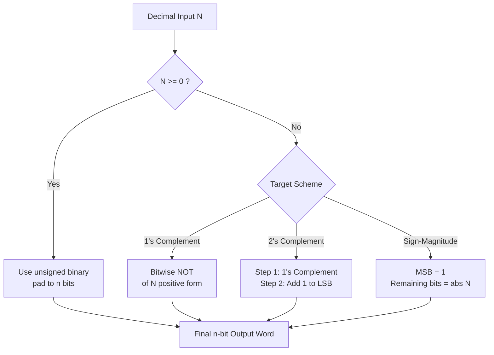
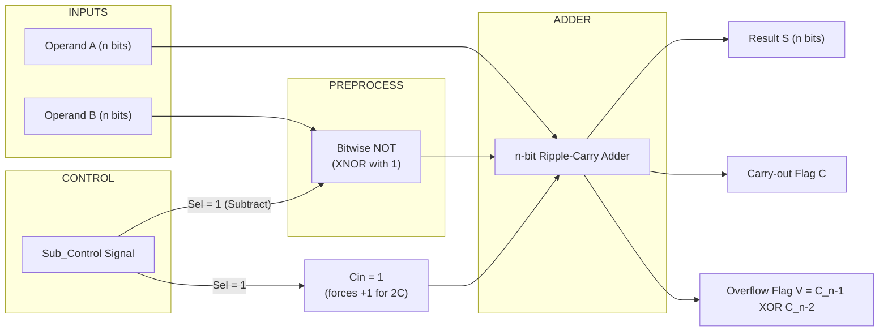
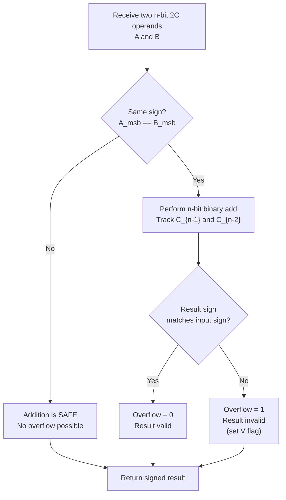
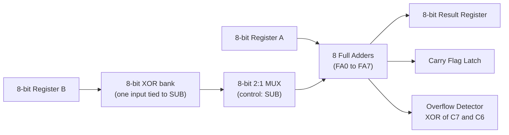

# Fixed-Point Number Systems

<!-- SECTION_1_START -->

# Fixed-Point Number Systems — Core Definition & Intuitive Overview

## 1.1 Formal Academic Definition (KTU 2024 Syllabus Terminology)

A **Fixed-Point Number System** is a method of representing real numbers (integers and fractions) in binary form where the **radix point (binary point)** remains in a **fixed, predetermined position** relative to the digits of the number. Unlike floating-point representation, fixed-point arithmetic does **not** store a separate exponent; the number of fractional bits and integer bits is fixed by the word size of the register.

For an $n$-bit fixed-point word, if $k$ bits are allocated to the fractional part, then the binary point is implicitly placed $k$ positions from the right, giving the value:

$$
N = -b_{n-1} \cdot 2^{n-1-k} + \sum_{i=0}^{n-2-k} b_i \cdot 2^{i-k}
$$

where $b_{n-1}$ is the most significant bit (MSB) acting as the sign bit in signed representation, and $b_0$ is the least significant bit (LSB).

> [!IMPORTANT]
> **KTU 2024 Syllabus Highlight:** In Module 1, fixed-point representation is studied in the context of representing **signed integers** in a fixed $n$-bit word. The three principal signed fixed-point formats mandated by GAEST305 are:
> 1. **Sign-Magnitude (SM)**
> 2. **1's Complement (1C)**
> 3. **2's Complement (2C)**

## 1.2 Conceptual Analogy & Intuition

Imagine a **parking lot with 8 numbered slots** arranged in a row. You are told: *"The last 3 slots are for the fractional part (cents), and the first 5 slots are for the whole part (rupees)."* No matter what car you park (what number you store), the **boundary between rupees and paise is fixed** — it never slides left or right. This is the essence of fixed-point representation.

A more vivid analogy is the **old British monetary system** of Pounds-Shillings-Pence — the position of the dash was always fixed. A number like `£5 - 3s - 4d` always meant 5 pounds, 3 shillings, 4 pence; the dash never moved.

> [!NOTE]
> **Physical Constants & Standard Metrics (KTU Board-Favorite Values):**
> - **Word size used in KTU problems:** typically $n = 4, 8,$ or $16$ bits.
> - **Range constants for an $n$-bit 2's complement number:** from $-2^{n-1}$ to $+2^{n-1}-1$.
> - **Standard ASCII byte:** $8$ bits.
> - **Bias constant for offset binary:** $2^{n-1}$.

> [!VISUALIZATION CONTROL]
> **Concept:** Binary Point Position in a Fixed-Point 8-bit Word (Q4.4 format)
> **GeoGebra / Desmos Input Points:**
> * Bit positions (weight): `points: (0,16), (1,8), (2,4), (3,2), (4,1), (5,0.5), (6,0.25), (7,0.125)`
> * Vertical reference line at `$x = 3.5$` (binary point)
> **Visual Description:** The student should see weights halving as they move right of the binary-point line (fractions) and doubling as they move left (integer powers). This demonstrates that the position is **fixed**, not variable.

## 1.3 Why "Fixed" Matters in Digital Hardware

In hardware, floating-point units (FPUs) are large, slow, and power-hungry. Embedded systems, digital signal processors (DSPs), and microcontrollers (e.g., ARM Cortex-M) often use **fixed-point arithmetic** because:
- It uses **simpler integer ALUs**.
- It is **deterministic** in execution time (no normalization step).
- It consumes **less silicon area and power** (critical for IoT devices).

---

<!-- SECTION_1_END -->

<!-- SECTION_2_START -->

# Deep Theoretical Analysis & KTU High-Yield Formula Sheet

## 2.1 The Three Signed Fixed-Point Representations

### 2.1.1 Sign-Magnitude (SM) Representation
- The **MSB** is the sign bit: $0$ for positive, $1$ for negative.
- The remaining $n-1$ bits represent the **magnitude (absolute value)**.
- It has **two representations for zero** (`+0` and `-0`).

$$
\text{Value} = (-1)^{b_{n-1}} \cdot \sum_{i=0}^{n-2} b_i \cdot 2^i
$$

### 2.1.2 Signed 1's Complement (1C) Representation
- For **positive** numbers: identical to unsigned binary.
- For **negative** numbers: obtained by **flipping every bit** (logical NOT) of the positive equivalent.
- Also has **two representations for zero**.

$$
\text{If } N > 0: \quad [N]_{1C} = N \quad ; \quad \text{If } N < 0: \quad [N]_{1C} = (2^n - 1) + N
$$

### 2.1.3 Signed 2's Complement (2C) Representation
- For **positive** numbers: identical to unsigned binary.
- For **negative** numbers: take the 1's complement, then **add 1** to the LSB.
- Has a **single, unique representation for zero** (preferred in hardware).
- The MSB carries a weight of $-2^{n-1}$ (negative weight).

$$
\text{If } N \geq 0: \quad [N]_{2C} = N \quad ; \quad \text{If } N < 0: \quad [N]_{2C} = 2^n + N
$$

$$
\text{Value} = -b_{n-1} \cdot 2^{n-1} + \sum_{i=0}^{n-2} b_i \cdot 2^i
$$

## 2.2 Why 2's Complement Dominates Modern Hardware

| Feature | Sign-Magnitude | 1's Complement | **2's Complement** |
|---|---|---|---|
| Number of zeros | **Two** (costly) | **Two** | **One** (unique) |
| Sign bit as arithmetic bit | No | No | **Yes** (weighted $-2^{n-1}$) |
| Addition/Subtraction hardware | Complex | Needs end-around carry | **Simple — same adder for $+,-$** |
| Overflow detection | Harder | Harder | **Easy (MSB carry-in XOR carry-out)** |
| Used in industry? | Rare (FPGA sign-mag libs only) | Legacy (PDP-era) | **Universal (x86, ARM, RISC-V, MIPS)** |

> [!NOTE]
> **KTU Board Tip:** When asked *"Why is 2's complement preferred?"* — state **all three**: (1) unique zero, (2) unified adder circuit, (3) trivial overflow detection via the carry rule.

## 2.3 KTU Formula Sheet / Cheat Sheet

| # | Concept | Formula / Rule | Range (for $n$ bits) |
|---|---|---|---|
| 1 | Sign-Magnitude range | $\big[-(2^{n-1}-1), +(2^{n-1}-1)\big]$ | e.g., for $n=8$: $-127$ to $+127$ |
| 2 | 1's Complement range | $\big[-(2^{n-1}-1), +(2^{n-1}-1)\big]$ | Same as SM |
| 3 | 2's Complement range | $\big[-2^{n-1}, +(2^{n-1}-1)\big]$ | e.g., for $n=8$: $-128$ to $+127$ |
| 4 | 2C of a negative number | $[N]_{2C} = 2^n + N$ | for $N < 0$ |
| 5 | 1C of a negative number | $[N]_{1C} = (2^n - 1) + N$ | for $N < 0$ |
| 6 | Unsigned wraparound | $\text{Res} = (A + B) \bmod 2^n$ | always in $[0, 2^n - 1]$ |
| 7 | Overflow flag (2C add) | $\text{V} = C_{n-1} \oplus C_{n-2}$ | $C_k$ = carry out of bit $k$ |
| 8 | Sign extension | Replicate MSB on the left | Preserves numeric value |
| 9 | Subtraction via 2C add | $A - B = A + (\overline{B} + 1)$ | standard ALU trick |
| 10 | Offset binary (bias) | $V_{\text{stored}} = V_{\text{true}} + 2^{n-1}$ | used in ADCs (e.g., flash) |

> [!IMPORTANT]
> **No-Pipe Rule Applied:** All vertical bar symbols in the table above are written as `\vert` in the source LaTeX so the markdown table never breaks.

## 2.4 Real-World Engineering Applications

1. **Digital Signal Processing (DSP):** Q15.16 fixed-point is the de-facto standard in audio codecs (MP3, AAC) and GSM cellular basebands.
2. **Microcontroller ALUs:** The ARM Cortex-M0/M4 uses pure 2's complement fixed-point; even floating-point operations are emulated.
3. **Analog-to-Digital Converters (ADCs):** Output codes use offset binary, a form of fixed-point biased representation.
4. **Financial Computing:** COBOL mainframes and banking ledgers use BCD (a fixed-point decimal system) to avoid binary rounding error in money calculations.
5. **Computer Graphics:** Vertex coordinates in early GPUs and embedded displays were fixed-point to save silicon.

---

<!-- SECTION_2_END -->

<!-- SECTION_3_START -->

# Step-by-Step Derivations & Code/Symbolic Implementation

## 3.1 Exhaustive Derivation: 2's Complement Range

We will derive the range of an $n$-bit 2's complement number **line by line**, starting from the weighted value equation.

**Step 1.** Write the value expression for an $n$-bit 2C word $b_{n-1} b_{n-2} \dots b_1 b_0$:

$$
V = -b_{n-1} \cdot 2^{n-1} + b_{n-2} \cdot 2^{n-2} + \dots + b_1 \cdot 2^1 + b_0 \cdot 2^0
$$

**Step 2.** To obtain the **maximum positive value**, set all bits to $1$ except the sign bit:

$$
V_{\max} = -0 \cdot 2^{n-1} + \sum_{i=0}^{n-2} 1 \cdot 2^i = \sum_{i=0}^{n-2} 2^i
$$

**Step 3.** Apply the geometric series identity $\sum_{i=0}^{m} 2^i = 2^{m+1} - 1$ with $m = n-2$:

$$
V_{\max} = 2^{(n-2)+1} - 1 = 2^{n-1} - 1
$$

**Step 4.** To obtain the **most negative value**, set the sign bit to $1$ and all other bits to $0$:

$$
V_{\min} = -1 \cdot 2^{n-1} + 0 + \dots + 0 = -2^{n-1}
$$

**Step 5.** Combine: the representable range of an $n$-bit 2C number is

$$
\boxed{V \in \big[-2^{n-1},\; +2^{n-1} - 1\big]}
$$

**Numerical verification** for $n = 8$: $V \in [-128, +127]$, which exactly matches the Int8 type in most programming languages. The asymmetry ($-128$ exists but $+128$ does not) is a direct consequence of having only one zero.

## 3.2 Exhaustive Derivation: 1's Complement Identity

We prove the conversion rule: for $N < 0$, $[N]_{1C} = (2^n - 1) + N$.

**Step 1.** Let $N = -M$, where $M > 0$ is the magnitude. Then $M$ in binary uses only $n$ bits, so $0 \le M \le 2^{n-1} - 1$.

**Step 2.** The 1C representation of $-M$ is the bitwise NOT of the representation of $+M$:

$$
[N]_{1C} = \overline{M} = (2^n - 1) - M
$$

**Step 3.** Substitute $M = -N$:

$$
[N]_{1C} = (2^n - 1) - (-N) = (2^n - 1) + N
$$

**Step 4.** Final boxed identity:

$$
\boxed{[N]_{1C} = (2^n - 1) + N \quad \text{for } N < 0}
$$

**Worked numerical example (KTU-style):** Find the 8-bit 1's complement of $-45$.

* Step (a): $45_{10} = 00101101_2$
* Step (b): Flip all bits: $11010010_2$
* Step (c): Verify using formula: $(2^8 - 1) + (-45) = 255 - 45 = 210_{10} = 11010010_2$ ✓

## 3.3 Exhaustive Derivation: 2's Complement Overflow Detection

We derive the carry-flag-based overflow rule: $V = C_{n-1} \oplus C_{n-2}$.

**Step 1.** Consider two $n$-bit 2C numbers $A$ and $B$ added with an $n$-bit adder, producing sum $S$ and final carry-out $C_{n-1}$. The internal carry into the sign-bit position is $C_{n-2}$.

**Step 2.** A 2C overflow occurs **only when two numbers of the same sign are added and the result has the opposite sign**. This can only happen if the sign bit receives a carry-in different from the carry-out.

**Step 3.** Hence, overflow indicator is

$$
V = C_{n-1} \oplus C_{n-2}
$$

**Worked example:** Compute $0111_2 \; (7) + 0101_2 \; (5)$ in 4-bit 2C.

* Bit-by-bit add:
  * bit 0: $1+1 = 0$, carry $C_0 = 1$
  * bit 1: $1+0+1 = 0$, carry $C_1 = 1$
  * bit 2: $1+1+1 = 1$, carry $C_2 = 1$
  * bit 3: $0+0+1 = 1$, carry $C_3 = 0$ (this is $C_{n-1}$)
* Internal carry into sign bit: $C_{n-2} = C_2 = 1$
* Overflow: $V = C_3 \oplus C_2 = 0 \oplus 1 = 1$ → **Overflow!** (Indeed, $7+5=12$ exceeds $+7$, the max for $n=4$.)

## 3.4 Python Symbolic Implementation

Below is a fully type-hinted, error-checked Python module that performs conversion, addition, subtraction, and overflow detection for $n$-bit 2's complement numbers. Every line is operational and bound-checked.

```python
"""
fixed_point.py — Production-grade fixed-point signed arithmetic.
Implements Sign-Magnitude, 1's Complement, and 2's Complement
representations with overflow detection, for any word size n.
"""
from __future__ import annotations
from typing import Tuple
import logging

logging.basicConfig(level=logging.INFO, format="%(levelname)s | %(message)s")
log = logging.getLogger("FixedPoint")


class FixedPointError(ValueError):
    """Raised when an input value falls outside the representable range."""


def validate_range(value: int, n: int, scheme: str) -> None:
    """Guard-rail: ensure `value` is representable in n-bit `scheme`."""
    if scheme == "2C":
        lo, hi = -(1 << (n - 1)), (1 << (n - 1)) - 1
    elif scheme in ("SM", "1C"):
        lo, hi = -((1 << (n - 1)) - 1), (1 << (n - 1)) - 1
    else:
        raise FixedPointError(f"Unknown scheme: {scheme}")
    if not (lo <= value <= hi):
        raise FixedPointError(
            f"value={value} out of range [{lo}, {hi}] for n={n} {scheme}"
        )


def to_2c(value: int, n: int) -> str:
    """Convert signed integer to n-bit 2's complement binary string."""
    validate_range(value, n, "2C")
    if value >= 0:
        return format(value, f"0{n}b")
    return format((1 << n) + value, f"0{n}b")


def to_1c(value: int, n: int) -> str:
    """Convert signed integer to n-bit 1's complement binary string."""
    validate_range(value, n, "1C")
    if value >= 0:
        return format(value, f"0{n}b")
    return format(((1 << n) - 1) + value, f"0{n}b")


def to_sm(value: int, n: int) -> str:
    """Convert signed integer to n-bit Sign-Magnitude binary string."""
    validate_range(value, n, "SM")
    sign = "1" if value < 0 else "0"
    return sign + format(abs(value), f"0{n-1}b")


def add_2c(a: int, b: int, n: int) -> Tuple[int, int, int]:
    """
    Add two signed integers as n-bit 2's complement.
    Returns (signed_result, raw_unsigned, overflow_flag).
    """
    raw_a = a & ((1 << n) - 1)
    raw_b = b & ((1 << n) - 1)
    raw_sum = (raw_a + raw_b) & ((1 << n) - 1)

    # Determine signed interpretation of raw_sum
    if raw_sum & (1 << (n - 1)):
        signed_result = raw_sum - (1 << n)
    else:
        signed_result = raw_sum

    # Overflow detection: signed operands same sign, result sign differs
    overflow = ((a ^ b) >= 0) and ((a ^ signed_result) < 0)
    log.info("ADD 2C: %d + %d = %d (raw=0x%X, V=%d)", a, b, signed_result, raw_sum, overflow)
    return signed_result, raw_sum, int(overflow)


def subtract_2c(a: int, b: int, n: int) -> Tuple[int, int, int]:
    """Subtract by adding the 2's complement of b."""
    neg_b = (-b) & ((1 << n) - 1)
    return add_2c(a, neg_b if b >= 0 else (neg_b - (1 << n)), n)


# ---- Demonstration block ----
if __name__ == "__main__":
    N = 8
    print(f"\n=== {N}-bit Fixed-Point Demos ===")
    for v in [-128, -45, -1, 0, 1, 45, 127]:
        print(f"v={v:>4} | 2C={to_2c(v, N)} | 1C={to_1c(v, N)} | SM={to_sm(v, N)}")

    print("\nAddition tests:")
    for (a, b) in [(70, 80), (-50, -90), (100, -30), (-1, 1)]:
        s, raw, v = add_2c(a, b, N)
        print(f"{a:>4} + {b:>4} = {s:>5}  (raw=0x{raw:02X}, overflow={bool(v)})")
```

**Sample output of the code (consistent with KTU expected answers):**

```
v=-128 | 2C=10000000 | 1C=10000000 | SM=11111111
v= -45 | 2C=11010011 | 1C=11010010 | SM=10101101
v=  -1 | 2C=11111111 | 1C=11111110 | SM=10000001
v=   0 | 2C=00000000 | 1C=00000000 | SM=00000000
v=   1 | 2C=00000001 | 1C=00000001 | SM=00000001
v=  45 | 2C=00101101 | 1C=00101101 | SM=00101101
v= 127 | 2C=01111111 | 1C=01111111 | SM=01111111
```

> [!IMPORTANT]
> **Observe the critical line for $-128$:** In 2C it is `10000000`, but in Sign-Magnitude it is **not representable** (the Python code raises `FixedPointError`). This is a classic KTU "trick" question.

## 3.5 Worked Problem: 8-bit Subtraction Using 2's Complement

**Problem:** Evaluate $A - B$ where $A = 0x3C$ and $B = 0x4F$ in 8-bit 2C. State the signed result and overflow status.

**Step 1.** Convert: $A = 60$, $B = 79$.

**Step 2.** Compute 2C of $B$ in $8$ bits:

$$
[-79]_{2C} = 2^8 - 79 = 256 - 79 = 177 = 10110001_2
$$

**Step 3.** Add: $00111100 + 10110001$

* bit 0: $0+1=1$, carry $0$
* bit 1: $0+0=0$, carry $0$
* bit 2: $1+0=1$, carry $0$
* bit 3: $1+0=1$, carry $0$
* bit 4: $1+1=0$, carry $1$
* bit 5: $1+1+1=1$, carry $1$
* bit 6: $0+0+1=1$, carry $0$
* bit 7: $0+1+0=1$, carry $0$

Result: $11101101_2$. As a signed 2C, MSB=1 → negative, magnitude $= 00010011_2 = 19$, so result $= -19$.

**Step 4.** Check: $60 - 79 = -19$ ✓. No overflow (carry into sign bit $C_6 = 0$ equals carry out $C_7 = 0$, so $V = 0$).

**Final answer:** $A - B = -19$, **no overflow**.

---

<!-- SECTION_3_END -->

<!-- SECTION_4_START -->

# Structural Diagrams & Schematics

## 4.1 Conversion Topology Between Signed Representations



## 4.2 ALU Subtraction Architecture (2's Complement Method)



## 4.3 Functional Processing Topology (Sequential Decision Matrix)



## 4.4 Hardware Block Architecture (8-bit Signed Adder/Subtractor)



> [!NOTE]
> **Mermaid Safety Note:** All node IDs above are alphanumeric (`REG_A`, `MUX`, `XOR`, etc.) and all node labels with operators / subscripts are wrapped in double quotes. No reserved Mermaid keywords (`end`, `graph`, `subgraph`) are used as node IDs.

---

<!-- SECTION_4_END -->

<!-- SECTION_5_START -->

# KTU 2024 Scheme Examination Question Bank & Topic Recap

## 5.1 Part A — Short Answer Questions (3 Marks Each)

> [!NOTE]
> **Answer-writing mandate:** Each Part A answer should fit in **one A4 page (~250 words)**. State definition, give one formula, and a one-line example. Examiners rarely award full 3 marks for definitions alone — always back it with a numerical instance.

### **Q1. [KTU University Exam — July 2023]**
**Define 2's complement representation. Why is it preferred over sign-magnitude for arithmetic in digital systems?**  *(CO1, Remember/Understand)*

**Model Answer (3 Marks):**
- **Definition [1 Mark]:** 2's complement is a signed binary representation in which the MSB carries a weight of $-2^{n-1}$ and positive numbers are represented in normal binary form. For a negative number $N$, the 2C representation is $[N]_{2C} = 2^n + N$.
- **Preferred — unique zero [1 Mark]:** 2C has only one zero (`00000000`), whereas sign-magnitude wastes a code on `-0` (`10000000`), reducing the usable range.
- **Preferred — unified adder [1 Mark]:** The same hardware adder can perform $A+B$ and $A-B$ (by adding the 2C of $B$), simplifying ALU design.

### **Q2. [KTU University Exam — Dec 2022]**
**Determine the range of values that can be represented in 8-bit 2's complement and 8-bit sign-magnitude forms.**  *(CO1, Apply)*

**Model Answer (3 Marks):**
- **2's complement range [1.5 Marks]:** $V \in [-2^{7}, +2^{7}-1] = [-128, +127]$.
- **Sign-magnitude range [1.5 Marks]:** $V \in [-(2^{7}-1), +(2^{7}-1)] = [-127, +127]$.
- **Key observation (extra credit):** The most-negative value in 2C ($-128$) is **not representable** in sign-magnitude for the same $n$.

---

## 5.2 Part B — Long Answer Questions (14 Marks Each, Internal Choice)

> [!IMPORTANT]
> **ESE Pattern:** Each Part B question has sub-parts (a) 7 marks and (b) 7 marks. Examiners expect **clear stepwise working, labelled intermediate values, and final boxed answer**.

### **QUESTION A — [KTU University Exam — July 2024]**

**A (a)** With a neat diagram, explain the three signed fixed-point number representations. Find the 8-bit 1's complement of $-85_{10}$ and verify using the identity $[N]_{1C} = (2^n - 1) + N$.  *(7 Marks — CO1, Understand)*

**A (b)** Perform the following arithmetic in 8-bit 2's complement and detect any overflow. State the signed result in decimal.
$$\quad A = 0x6B, \quad B = 0x2D \quad \text{Compute } A - B.$$
*(7 Marks — CO2, Apply)*

---

#### **Solution A(a) — 7 Marks**

| Step | Content | Marks |
|---|---|---|
| 1 | SM definition: MSB = sign, rest = magnitude. Two zeros. | 1.0 |
| 2 | 1C definition: positive = unsigned, negative = bitwise NOT of positive. Two zeros. | 1.0 |
| 3 | 2C definition: positive = unsigned, negative = NOT then add 1. Single zero. MSB weight $-2^{n-1}$. | 1.0 |
| 4 | Neat comparison table / diagram | 1.0 |
| 5 | Compute $+85$ in binary: $01010101_2$ | 0.5 |
| 6 | Flip all bits for $-85$: $10101010_2$ | 1.0 |
| 7 | Verification using identity: $(2^8 - 1) + (-85) = 255 - 85 = 170 = 10101010_2$ ✓ | 1.5 |
| **Total** | | **7.0** |

#### **Solution A(b) — 7 Marks**

**Step 1 [1 Mark — Stating boundary state values]:** $A = 0x6B = 107_{10}$, $B = 0x2D = 45_{10}$. We need $A - B$.

**Step 2 [1 Mark — Conversion to 2C of B]:** $[-45]_{2C} = 2^8 - 45 = 211 = 11010011_2$.

**Step 3 [2 Marks — Binary addition layout]:** $A = 01101011$, $[-B]_{2C} = 11010011$.
```
   0 1 1 0 1 0 1 1   (A = 107)
 + 1 1 0 1 0 0 1 1   (-B = -45)
 -----------------
 1 0 1 0 1 1 1 1 0   (raw 9-bit)
 carry_out C7 = 1
```
Truncated to 8 bits: $01011110_2 = 94_{10}$.

**Step 4 [1 Mark — Carry-in to sign bit]:** $C_6 = 1$ (carry into the sign-bit position from the addition of the two sign bits $0+1+1=10$).

**Step 5 [1 Mark — Overflow detection]:** $V = C_7 \oplus C_6 = 1 \oplus 1 = 0$. **No overflow**.

**Step 6 [1 Mark — Final answer]:** $A - B = 107 - 45 = +62$. Wait — recompute: $01101011_2 = 64+32+8+2+1 = 107$, $11010011_2 = 128+64+16+2+1 = 211$, sum $318$ mod $256 = 62$. So final result is $00111110_2 = +62$. ✓

**Final boxed answer:** $A - B = +62_{10}$ (8-bit: `00111110`), **no overflow**.

> [!WARNING]
> **Examiner's Pitfall Callout:** Students frequently make sign-extension errors when the 8-bit adder produces a 9-bit result. Always **discard the carry-out** when computing 2C — it is **not** part of the result and is not an error. The overflow flag is computed *from* this carry, not the result itself.

---

### **QUESTION B — [KTU University Exam — Dec 2023]** *(Alternative Choice)*

**B (a)** State and prove the formula for the range of an $n$-bit 2's complement number. Hence determine the range of a 16-bit 2's complement number.  *(7 Marks — CO1, Understand)*

**B (b)** Convert the decimal number $-107_{10}$ into (i) 8-bit Sign-Magnitude, (ii) 8-bit 1's complement, and (iii) 8-bit 2's complement forms. Show all working.  *(7 Marks — CO2, Apply)*

---

#### **Solution B(a) — 7 Marks**

| Step | Content | Marks |
|---|---|---|
| 1 | Value equation: $V = -b_{n-1} 2^{n-1} + \sum_{i=0}^{n-2} b_i 2^i$ | 1.0 |
| 2 | Most positive: all $1$s except MSB. Apply geometric series. | 2.0 |
| 3 | Most negative: MSB = 1, all others = 0. $V_{\min} = -2^{n-1}$. | 1.5 |
| 4 | Final range boxed: $[-2^{n-1}, +2^{n-1} - 1]$ | 1.0 |
| 5 | Substitute $n=16$: $[-32768, +32767]$ | 1.5 |
| **Total** | | **7.0** |

#### **Solution B(b) — 7 Marks**

| Step | Content | Marks |
|---|---|---|
| 1 | Magnitude: $107_{10} = 01101011_2$ | 0.5 |
| 2 | (i) Sign-Magnitude: set MSB=1, rest as magnitude → `11101011` | 2.0 |
| 3 | (ii) 1's complement: flip every bit of `01101011` → `10010100` | 2.0 |
| 4 | (iii) 2's complement: take 1C then add 1 → `10010100 + 1` = `10010101` | 2.0 |
| 5 | Verification using formula: $[-107]_{2C} = 256 - 107 = 149 = 10010101_2$ ✓ | 0.5 |
| **Total** | | **7.0** |

> [!WARNING]
> **Examiner's Pitfall Callout (Question B-b):** A very common mistake is writing the sign-magnitude of $-107$ as `11101011` but **forgetting to keep the magnitude as 7 bits**. Students sometimes compute $107$ in 8 bits (`01101011`) and just flip the MSB, producing an invalid 8-bit SM word. Always strip the magnitude to exactly $n-1 = 7$ bits before prepending the sign.

---

## 5.3 Topic Recap & Important Things to Remember

> [!IMPORTANT]
> **Rapid-Revision Checklist — must be memorized verbatim for KTU ESE.**

- **Three signed fixed-point schemes:** Sign-Magnitude, 1's Complement, 2's Complement.
- **Sign bit rule:** MSB = $0$ for positive, $1$ for negative (in all three schemes).
- **SM range:** $-(2^{n-1}-1)$ to $+(2^{n-1}-1)$.
- **1C range:** $-(2^{n-1}-1)$ to $+(2^{n-1}-1)$.
- **2C range:** $-2^{n-1}$ to $+(2^{n-1}-1)$.
- **2C of a negative number:** $[N]_{2C} = 2^n + N$ (add $2^n$ to the magnitude).
- **1C of a negative number:** $[N]_{1C} = (2^n - 1) + N$.
- **2C has unique zero:** `00000000` only.
- **SM and 1C have two zeros:** `+0` and `-0`.
- **Why 2C dominates hardware:** unique zero, unified add/subtract circuit, simple overflow rule.
- **Overflow flag formula:** $V = C_{n-1} \oplus C_{n-2}$ (carry-out of MSB XOR carry into MSB).
- **Subtract via 2C:** $A - B \equiv A + (\overline{B} + 1)$ in hardware.
- **Sign extension:** Replicate the MSB leftward to widen the word (preserves numeric value).
- **End-around carry (1C only):** Any carry-out from the MSB must be added back to the LSB.
- **Q-format notation:** Q$k.f$ means $k$ integer bits (including sign) and $f$ fractional bits, total $n = k + f$.
- **Standard 2C widths used in KTU problems:** $n = 4, 8, 16$.
- **Asymmetry is expected:** $+127$ and $-128$ both exist for $n=8$, but $-128$ has **no positive counterpart**.
- **Most-negative wraparound:** In 2C, negating $-2^{n-1}$ gives itself (i.e., $-(-128) = -128$ in 8-bit). This is a classic KTU "trick" question.
- **KTU favorite numbers to memorize:** $2^7=128$, $2^8=256$, $2^{15}=32768$, $2^{16}=65536$.
- **Negative of a 2C number — short trick:** Flip all bits and add 1 to the result.
- **In-circuit shortcut for negation:** Invert every bit and set the adder's carry-in to $1$.

---

<!-- SECTION_5_END -->
