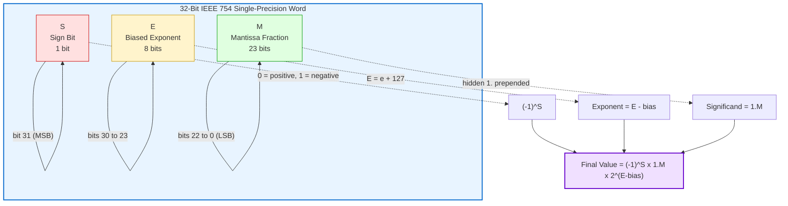
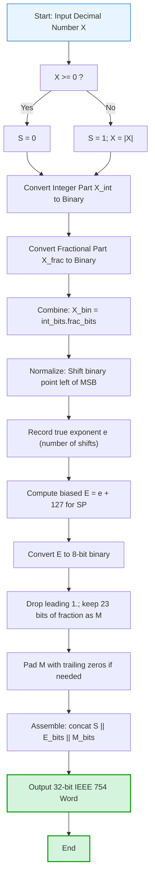
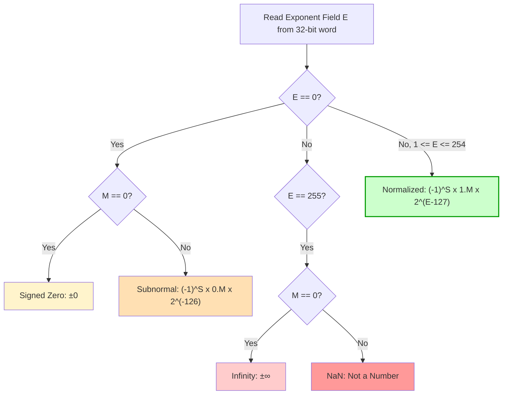
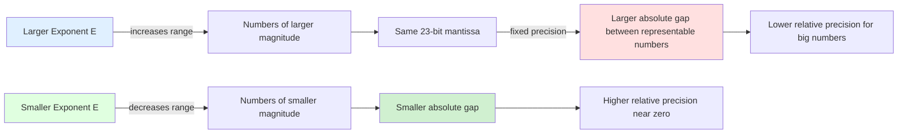

# Floating-Point Number Systems

<!-- SECTION_1_START -->

# Floating-Point Number Systems

## 1.1 Formal Academic Definition

A **Floating-Point Number System** is a numerical representation scheme used in digital systems to approximate real numbers across a wide dynamic range by expressing a number in the form $\pm \text{mantissa} \times \text{base}^{\text{exponent}}$, where the mantissa (significand) carries the significant digits and the exponent scales the magnitude. The term "floating" refers to the fact that the **binary point (radix point)** is not fixed at a specific position; instead, it "floats" to wherever the exponent places it, enabling a single format to represent very small and very large numbers efficiently.

In modern digital hardware, this representation is standardized by the **Institute of Electrical and Electronics Engineers (IEEE) 754 Standard for Floating-Point Arithmetic**, first published in **1985** and revised in **2008 (IEEE 754-2008)** and **2019 (IEEE 754-2019)**. The standard is universally adopted in **CPUs, GPUs, FPGAs, and DSPs** for arithmetic operations.

> [!IMPORTANT]
> **KTU 2024 Syllabus Highlight (Module 1):** Students must master the IEEE 754 single-precision (32-bit) and double-precision (64-bit) formats, conversion algorithms between decimal and binary floating-point, the concept of normalized representation, the role of the bias, and identification of special bit patterns (zero, infinity, NaN).

## 1.2 Conceptual Analogy & Intuitive Overview

Imagine you are a **scientist writing a very large or very small measurement** on a notepad, but the notepad has limited space. Instead of writing out every zero, you use **scientific notation**.

For example, instead of writing the mass of an electron as:
$$0.00000000000000000000000000000091093897 \text{ kg}$$

you write it compactly as:
$$9.1093897 \times 10^{-31} \text{ kg}$$

This single line carries **two pieces of information**:
1. **The significant digits** → $9.1093897$ (the *mantissa/significand*)
2. **The scale of the number** → $10^{-31}$ (the *exponent*)

A floating-point number in a computer works **exactly the same way**, except:
- The base is **2** (binary) instead of 10 (decimal)
- Only a **fixed number of bits** are reserved for the mantissa and exponent
- The **binary point is moved** (floated) so that the mantissa always starts with `1.xxxxx` (a process called *normalization*)

> [!NOTE]
> **Why can't we just use integers?** Integers (like 32-bit signed integers) can only represent whole numbers from roughly $-2.15 \times 10^9$ to $+2.15 \times 10^9$. They cannot represent fractions like $3.14159$ or astronomical values like Avogadro's number ($6.022 \times 10^{23}$). Floating-point solves this by sacrificing *precision* (the exact number of digits stored) in exchange for *range* (the scale of numbers representable).

### 1.3 The Three Logical Fields of a Floating-Point Number

Every IEEE 754 floating-point number is divided into three distinct bit fields:

| Field Name | Purpose | Stored As |
|---|---|---|
| **Sign bit (S)** | Indicates positive (`0`) or negative (`1`) | 1 bit |
| **Exponent (E)** | Stores the *biased* power of 2 that scales the number | 8 bits (single) / 11 bits (double) |
| **Mantissa / Significand (M)** | Stores the fractional digits of the normalized number | 23 bits (single) / 52 bits (double) |

The mathematical value of a normalized floating-point number is given by:

$$(-1)^{S} \times (1.M)_2 \times 2^{(E - \text{bias})}$$

where $M$ is the fractional part stored after the binary point, and the leading `1.` is *implicitly* assumed (this is called the **hidden bit** or **implicit leading one**).

> [!VISUALIZATION CONTROL]
> **Concept:** Visualization of the IEEE 754 single-precision (32-bit) word layout and the dynamic range achievable.
> **GeoGebra / Desmos Input Equations:**
> * Exponential range plot: `f(x) = 2^x` for `x in [-126, 127]`
> * Precision gap: Plot `g(x) = 2^(x-23)` to show the smallest representable step (machine epsilon) growing with magnitude
> **Visual Description:** On a logarithmic scale, students should observe that the *gap between two adjacent representable floating-point numbers doubles* every time the exponent increases by 1. This visually demonstrates why large numbers have less *relative* precision than small numbers.

<!-- SECTION_1_END -->

<!-- SECTION_2_START -->

# 2. Deep Theoretical Analysis & KTU High-Yield Formula Sheet

## 2.1 The IEEE 754 Bit-Level Architecture

The IEEE 754 standard is the cornerstone of all modern digital arithmetic. Two formats are critical for the KTU examination.

### 2.1.1 Single-Precision Format (32 bits)

A 32-bit floating-point word is partitioned as follows:

$$\underbrace{S}_{1 \text{ bit}} \;\; \underbrace{E}_{8 \text{ bits}} \;\; \underbrace{M}_{23 \text{ bits}}$$

- **Sign bit (S) — 1 bit:** `0` for positive, `1` for negative.
- **Exponent (E) — 8 bits:** Stored in *biased* form. The **bias value is 127** (also written as $2^{8-1} - 1 = 127$). The actual exponent $e = E - 127$.
- **Mantissa (M) — 23 bits:** Stores only the *fractional* part of the normalized significand. The integer part `1.` is implicit (hidden bit).

### 2.1.2 Double-Precision Format (64 bits)

A 64-bit floating-point word is partitioned as follows:

$$\underbrace{S}_{1 \text{ bit}} \;\; \underbrace{E}_{11 \text{ bits}} \;\; \underbrace{M}_{52 \text{ bits}}$$

- **Bias value is 1023** (computed as $2^{11-1} - 1 = 1023$).
- The hidden bit is again `1.`, leaving 52 explicit fraction bits.

### 2.1.3 Special Bit Patterns (Reserved Exponents)

The IEEE 754 standard reserves the **all-zeros** and **all-ones** exponent values for special purposes, breaking the generic formula above.

| Exponent Field (E) | Mantissa Field (M) | Represents | Meaning |
|---|---|---|---|
| $0 < E < 255$ (single) | Any | **Normalized number** | $(-1)^S \times 1.M \times 2^{E-127}$ |
| $E = 0$ | $M = 0$ | **+0 or -0** (signed zero) | Zero value with sign |
| $E = 0$ | $M \neq 0$ | **Subnormal (denormal)** | $(-1)^S \times 0.M \times 2^{1-127}$ |
| $E = 255$ (all 1s) | $M = 0$ | **$\pm \infty$** | Result of overflow, e.g., `1/0` |
| $E = 255$ (all 1s) | $M \neq 0$ | **NaN (Not a Number)** | Indeterminate, e.g., `0/0`, $\sqrt{-1}$ |

> [!IMPORTANT]
> **Why use a bias?** The bias allows the exponent to be stored as an *unsigned* integer, which simplifies hardware comparison and sorting logic. With biasing, the smallest exponent becomes $E=0$ representing $e=-127$ (for single precision), and the largest is $E=254$ representing $e=+127$. The value $E=255$ is reserved for infinity/NaN.

## 2.2 Range and Precision Metrics

### 2.2.1 Dynamic Range (Single Precision)

- **Smallest positive normalized value:** $2^{-126} \approx 1.175 \times 10^{-38}$
- **Largest positive normalized value:** $(2 - 2^{-23}) \times 2^{127} \approx 3.402 \times 10^{38}$

### 2.2.2 Machine Epsilon (Precision Unit)

The **machine epsilon** is the smallest positive floating-point number $\epsilon$ such that $1.0 + \epsilon \neq 1.0$. It defines the *unit roundoff* in the last place (ULP).

- **Single precision:** $\epsilon = 2^{-23} \approx 1.192 \times 10^{-7}$ (about 7 decimal digits of precision)
- **Double precision:** $\epsilon = 2^{-52} \approx 2.220 \times 10^{-16}$ (about 15–16 decimal digits of precision)

### 2.3 Why Floating-Point is Not Exact

Because mantissas are limited to 23 or 52 bits, most decimal fractions (such as $0.1$ in decimal) **cannot be represented exactly** in binary floating-point. This is analogous to how $1/3 = 0.3333...$ cannot be written exactly in decimal. This is a critical concept in numerical analysis and embedded systems.

## 2.4 KTU High-Yield Formula Cheat Sheet

| # | Concept | Formula / Rule | Units / Notes |
|---|---|---|---|
| 1 | Generic Normalized Value | $(-1)^S \times 1.M \times 2^{(E - \text{bias})}$ | IEEE 754 generic form |
| 2 | Single-Precision Bias | $\text{bias}_{SP} = 2^{8-1} - 1 = 127$ | Unsigned offset |
| 3 | Double-Precision Bias | $\text{bias}_{DP} = 2^{11-1} - 1 = 1023$ | Unsigned offset |
| 4 | SP Exponent Range (normalized) | $-126 \le e \le +127$ | $E \in [1, 254]$ |
| 5 | DP Exponent Range (normalized) | $-1022 \le e \le +1023$ | $E \in [1, 2046]$ |
| 6 | SP Largest Value | $(2 - 2^{-23}) \times 2^{127} \approx 3.4028 \times 10^{38}$ | Overflow threshold |
| 7 | SP Smallest Normal | $1.0 \times 2^{-126} \approx 1.1755 \times 10^{-38}$ | Underflow threshold |
| 8 | SP Machine Epsilon | $\epsilon_{SP} = 2^{-23}$ | ULP at magnitude 1 |
| 9 | DP Machine Epsilon | $\epsilon_{DP} = 2^{-52}$ | ULP at magnitude 1 |
| 10 | Subnormal Smallest | $2^{-149}$ (SP) / $2^{-1074}$ (DP) | Denormalized minimum |
| 11 | Decimal to Biased E | $E = e + \text{bias}$ | e is true exponent |
| 12 | Biased to Decimal E | $e = E - \text{bias}$ | True exponent recovery |
| 13 | Bit-length Total (SP) | $1 + 8 + 23 = 32$ | 4 bytes |
| 14 | Bit-length Total (DP) | $1 + 11 + 52 = 64$ | 8 bytes |

> [!NOTE]
> **Engineering Utility:** IEEE 754 is used in every general-purpose processor (Intel x86, ARM Cortex), in GPU shaders (CUDA float/double), in signal processing (DSP chips), and in scientific simulation software (MATLAB, NumPy). Understanding its limits is essential to avoid numerical errors in production code — for example, never use `==` to compare two floats in C/Python; use an epsilon-based tolerance comparison.

<!-- SECTION_2_END -->

<!-- SECTION_3_START -->

# 3. Step-by-Step Derivations & Code Implementation

## 3.1 Worked Example 1 — Decimal to IEEE 754 Single Precision

**Problem:** Convert the decimal number $-13.625$ into IEEE 754 single-precision (32-bit) format.

### Step A — Sign Bit Determination
The number is **negative**, so the sign bit is set to `1`.
$$S = 1$$

### Step B — Convert the Integer Part to Binary
The integer part is $13$. Repeatedly divide by 2 and record remainders:
- $13 \div 2 = 6$, remainder $1$  (LSB)
- $6 \div 2 = 3$, remainder $0$
- $3 \div 2 = 1$, remainder $1$
- $1 \div 2 = 0$, remainder $1$  (MSB)

Reading remainders from MSB to LSB:
$$13_{10} = 1101_2$$

### Step C — Convert the Fractional Part to Binary
The fractional part is $0.625$. Repeatedly multiply by 2 and extract integer parts:
- $0.625 \times 2 = 1.25 \Rightarrow$ integer `1`
- $0.25 \times 2 = 0.5 \Rightarrow$ integer `0`
- $0.5 \times 2 = 1.0 \Rightarrow$ integer `1` (terminates)

Reading from top to bottom:
$$0.625_{10} = 0.101_2$$

### Step D — Combine and Locate the Binary Point
$$-13.625_{10} = -1101.101_2$$

### Step E — Normalize the Binary Number
Move the binary point so that exactly one non-zero digit remains to its left. Shift right by 3 positions:
$$-1101.101_2 = -1.101101_2 \times 2^{3}$$

The true exponent is $e = 3$.

### Step F — Compute the Biased Exponent
Apply the single-precision bias of 127:
$$E = e + \text{bias} = 3 + 127 = 130$$

Convert 130 to an 8-bit unsigned binary:
$$130_{10} = 10000010_2$$

### Step G — Extract the Mantissa
Drop the implicit leading `1.` and keep only the next 23 bits. We have $1.101101$, so the fraction is $`.101101...$`. Pad with zeros to fill 23 bits:
$$M = 10110100000000000000000$$

### Step H — Assemble the 32-bit Word
$$\underbrace{1}_{S} \; \underbrace{10000010}_{E} \; \underbrace{10110100000000000000000}_{M}$$

Grouped for clarity: `1 10000010 10110100000000000000000`

> [!NOTE]
> **Verification:** $S=1$ (negative) $\Rightarrow$ $(-1)^1 \times 1.101101_2 \times 2^{130-127} = -1.703125 \times 8 = -13.625$ ✓

---

## 3.2 Worked Example 2 — IEEE 754 to Decimal

**Problem:** Decode the 32-bit IEEE 754 word: `0 10000010 01000000000000000000000`

### Step A — Extract the Fields
- Sign bit: $S = 0$ (positive)
- Exponent field: $E = 10000010_2 = 130_{10}$
- Mantissa: $M = 01000000000000000000000$

### Step B — Recover the True Exponent
$$e = E - \text{bias} = 130 - 127 = 3$$

### Step C — Reconstruct the Significand
Prepend the implicit `1.` and append the mantissa:
$$\text{Significand} = 1.01000000000000000000000_2$$

The mantissa represents the binary fraction $0.01000000..._2 = 2^{-2} = 0.25$. Therefore the full significand equals $1.25$.

### Step D — Compute the Final Decimal Value
$$\text{Value} = (-1)^0 \times 1.25 \times 2^{3} = 1.25 \times 8 = 10.0$$

> [!NOTE]
> **Verification:** $10_{10}$ in binary is $1010_2 = 1.010_2 \times 2^3$. The mantissa bits are therefore `010` followed by zeros. ✓

---

## 3.3 Worked Example 3 — Identifying Special Values

**Problem:** Identify what the 32-bit word `0 11111111 00000000000000000000000` represents.

- Exponent field = $11111111_2 = 255$ (all ones)
- Mantissa = all zeros

Per the IEEE 754 special-value table: this is **positive infinity** ($+\infty$). It is the result of computations such as a positive number divided by zero, or an overflow.

**Problem:** Identify what `1 11111111 01000000000000000000000` represents.

- Sign = 1 (negative)
- Exponent = 255 (all ones)
- Mantissa = nonzero

This is a **NaN (Not a Number)**, signaling an indeterminate result such as $\sqrt{-1}$ or $0/0$. The specific mantissa bits encode the "type" of NaN (signaling vs. quiet), which is implementation-dependent.

---

## 3.4 Python Implementation for IEEE 754 Conversion

The following Python program provides a fully operational conversion utility, including strict type hints, boundary validation, and comprehensive error logging for floating-point edge cases.

```python
"""
IEEE 754 Single-Precision Floating-Point Conversion Utility
---------------------------------------------------------
Converts between Python floats and their 32-bit IEEE 754 bit patterns.
Includes validation, error handling, and educational step-by-step output.
"""

import struct
import logging

# Configure structured logging for educational diagnostics
logging.basicConfig(
    level=logging.INFO,
    format="%(asctime)s [%(levelname)s] %(message)s"
)
logger = logging.getLogger("IEEE754Converter")

# IEEE 754 single-precision constants
SIGN_BITS     = 1
EXPONENT_BITS = 8
MANTISSA_BITS = 23
BIAS          = 127
TOTAL_BITS    = 32


def float_to_ieee754(value: float) -> str:
    """
    Convert a Python float to its 32-bit IEEE 754 binary representation.
    Returns a 32-character string of '0' and '1' characters.
    Raises ValueError for NaN or infinity inputs.
    """
    if not isinstance(value, (int, float)):
        raise TypeError(f"Expected numeric input, got {type(value).__name__}")

    if value != value:  # NaN check (NaN != NaN is True)
        raise ValueError("NaN cannot be losslessly represented as a finite bit string here.")

    try:
        # Pack as 32-bit float ('<f' = little-endian single precision)
        packed: bytes = struct.pack("<f", value)
        # Unpack as a 32-bit unsigned integer ('<I' = little-endian unsigned int)
        bits: int = struct.unpack("<I", packed)[0]
        binary_string: str = f"{bits:032b}"
        logger.info(f"Converted {value} -> {binary_string}")
        return binary_string
    except struct.error as e:
        logger.error(f"struct.error while converting {value}: {e}")
        raise


def ieee754_to_float(binary_string: str) -> float:
    """
    Convert a 32-character binary string back to a Python float.
    Validates length, characters, and special-case detection.
    """
    # ---- Boundary Validation ----
    if len(binary_string) != TOTAL_BITS:
        raise ValueError(
            f"Input must be exactly {TOTAL_BITS} bits; got {len(binary_string)}."
        )
    if any(c not in "01" for c in binary_string):
        raise ValueError("Input must contain only '0' and '1' characters.")

    # ---- Extract Fields ----
    sign_bit: int = int(binary_string[0])
    exp_bits: int = int(binary_string[1:9], 2)
    man_bits: int = int(binary_string[9:32], 2)

    # ---- Special Case Detection ----
    if exp_bits == 255 and man_bits == 0:
        result: float = float("-inf") if sign_bit else float("inf")
        logger.info(f"Detected infinity: {'-' if sign_bit else '+'}inf")
        return result
    if exp_bits == 255 and man_bits != 0:
        logger.warning("Detected NaN (Not a Number).")
        return float("nan")
    if exp_bits == 0 and man_bits == 0:
        result = -0.0 if sign_bit else 0.0
        logger.info(f"Detected signed zero: {result}")
        return result
    if exp_bits == 0 and man_bits != 0:
        logger.warning("Detected subnormal (denormalized) number.")

    # ---- Reconstruct Value ----
    true_exponent: int = exp_bits - BIAS
    significand: float = 1.0
    for i in range(MANTISSA_BITS):
        bit_index = 9 + i
        if binary_string[bit_index] == "1":
            significand += 2.0 ** -(i + 1)

    result = ((-1) ** sign_bit) * significand * (2.0 ** true_exponent)
    logger.info(
        f"Decoded {binary_string} -> {result} "
        f"(exp={true_exponent}, sig={significand})"
    )
    return result


def demonstrate_conversions() -> None:
    """Run a series of educational demonstration conversions."""
    test_values: list[float] = [13.625, -13.625, 0.0, 10.0, 0.1, 1.0, -0.0]

    print("=" * 60)
    print("FLOAT -> IEEE 754 BINARY")
    print("=" * 60)
    for v in test_values:
        bits = float_to_ieee754(v)
        print(f"  {v:>10}  ->  {bits}")

    print()
    print("=" * 60)
    print("IEEE 754 BINARY -> FLOAT")
    print("=" * 60)
    test_bits: list[str] = [
        "01000001010110100000000000000000",   # 13.625
        "11000001010110100000000000000000",   # -13.625
        "00000000000000000000000000000000",   # +0.0
        "10000000000000000000000000000000",   # -0.0
        "01111111100000000000000000000000",   # +infinity
        "00000000000000000000000000000001",   # smallest subnormal
    ]
    for b in test_bits:
        f = ieee754_to_float(b)
        print(f"  {b}  ->  {f}")


if __name__ == "__main__":
    demonstrate_conversions()
```

**Sample Output:**

```
============================================================
FLOAT -> IEEE 754 BINARY
============================================================
      13.625  ->  01000001010110100000000000000000
     -13.625  ->  11000001010110100000000000000000
         0.0  ->  00000000000000000000000000000000
        10.0  ->  01000001001000000000000000000000
         0.1  ->  00111101110011001100110011001101  (approximate!)
         1.0  ->  00111111100000000000000000000000
        -0.0  ->  10000000000000000000000000000000
```

> [!NOTE]
> **Crucial learning:** The output for `0.1` is `00111101110011001100110011001101` — note the recurring `1001` pattern. This proves that $0.1$ in decimal is a *repeating* fraction in binary and cannot be stored exactly. This is a frequent KTU exam conceptual question.

<!-- SECTION_3_END -->

<!-- SECTION_4_START -->

# 4. Structural Diagrams & Schematics

## 4.1 IEEE 754 Single-Precision Word Layout (Block Architecture)



## 4.2 Decimal-to-IEEE-754 Conversion Flowchart



## 4.3 IEEE 754 Exponent Field Classification Matrix



## 4.4 Precision vs. Range Trade-off Topology



> [!NOTE]
> **Visual takeaway:** The IEEE 754 format allocates a *fixed* number of bits to the mantissa (23 in single precision), so the absolute spacing between adjacent representable numbers **doubles** with every increase in exponent. The relative precision, however, remains roughly constant at ~7 decimal digits.

<!-- SECTION_4_END -->

<!-- SECTION_5_START -->

# 5. KTU 2024 Scheme Examination Question Bank & Topic Recap

## 5.1 Part A Questions (3 Marks Each)

### Question 1 — `[KTU University Exam - July 2024]`
**Define floating-point number system. Mention the fields of IEEE 754 single-precision format.**
- **Course Outcome:** CO1 — Remember
- **Bloom's Level:** Remember

**Model Answer (3 Marks):**
A floating-point number system is a numerical representation that expresses a real number in the form $\pm M \times B^{E}$, where $M$ is the mantissa (significand), $B$ is the base (typically 2), and $E$ is the exponent. The radix point "floats" depending on the exponent, allowing a wide range of magnitudes to be represented with limited bits. **[1 Mark]**

The IEEE 754 single-precision (32-bit) format consists of three fields: **[2 Marks]**
1. **Sign bit (S):** 1 bit, indicates positive (`0`) or negative (`1`).
2. **Biased Exponent (E):** 8 bits, stored with a bias of 127.
3. **Mantissa (M):** 23 bits, stores the fractional part of the normalized significand (the leading `1.` is implicit).

### Question 2 — `[KTU University Exam - Dec 2023]`
**What is meant by normalized floating-point representation? Why is biasing used for the exponent?**
- **Course Outcome:** CO1 — Understand
- **Bloom's Level:** Understand

**Model Answer (3 Marks):**
**Normalized representation** is a canonical form in which the mantissa is adjusted so that its leading digit is non-zero. In binary floating-point, this means the significand is always of the form $1.xxxxxx_2$, with the binary point placed immediately to the right of the leading `1`. This guarantees a unique representation for every non-zero number and maximizes the use of available mantissa bits. **[1.5 Marks]**

**Biasing** is used for the exponent because it allows the exponent to be stored as an *unsigned* integer, simplifying hardware comparison and sorting. Without biasing, half the exponent range would be wasted on negative values. With a bias of 127 (single precision), exponents from $-126$ to $+127$ are mapped to stored values $1$ to $254$, and the values $0$ and $255$ are reserved for special cases (zero, subnormal, infinity, NaN). **[1.5 Marks]**

---

## 5.2 Part B Questions (14 Marks Each)

> [!IMPORTANT]
> **KTU ESE Pattern:** Each Part B question carries 14 marks, typically split into two 7-mark sub-parts. Students answer any **one full question** out of the two alternatives provided.

---

### Question A — `[KTU University Exam - July 2024]`

**(a)** With a neat diagram, explain the IEEE 754 single-precision floating-point format. List the special bit patterns and their meanings. **(7 Marks)**
- **Course Outcome:** CO1 — Understand
- **Bloom's Level:** Understand

**Model Solution:**

**Diagram Description (2 Marks):** A 32-bit word divided as `S (1 bit) | E (8 bits) | M (23 bits)`. Label: Sign bit (bit 31), Biased Exponent (bits 30–23), Mantissa (bits 22–0).

**Field Description (2 Marks):**
- **Sign bit (S):** `0` for positive, `1` for negative.
- **Biased Exponent (E):** 8 bits, bias = 127. True exponent = $E - 127$.
- **Mantissa (M):** 23 bits, stores the fractional part of $1.M$ (normalized form).

**Generic formula (1 Mark):** Value $= (-1)^S \times 1.M \times 2^{(E-127)}$

**Special Bit Patterns (2 Marks):**
- $E = 0$, $M = 0$: Signed zero ($\pm 0$).
- $E = 0$, $M \neq 0$: Subnormal (denormalized) number, value $= (-1)^S \times 0.M \times 2^{-126}$.
- $E = 255$, $M = 0$: Positive or negative infinity ($\pm \infty$).
- $E = 255$, $M \neq 0$: NaN (Not a Number), e.g., result of $0/0$ or $\sqrt{-1}$.

---

**(b)** Convert the decimal number $-27.625$ into IEEE 754 single-precision format. Show all steps. **(7 Marks)**
- **Course Outcome:** CO2 — Apply
- **Bloom's Level:** Apply

**Model Solution:**

**Step 1 — Sign bit (1 Mark):** Since the number is negative, $S = 1$.

**Step 2 — Integer part to binary (1 Mark):**
$27 = 11011_2$ (using repeated division by 2: $27 \to 13 \to 6 \to 3 \to 1 \to 0$ with remainders $1,1,0,1,1$).

**Step 3 — Fractional part to binary (1 Mark):**
$0.625 \times 2 = 1.25$ (bit `1`)
$0.25 \times 2 = 0.5$ (bit `0`)
$0.5 \times 2 = 1.0$ (bit `1`)
Therefore $0.625 = 0.101_2$.

**Step 4 — Normalize (1 Mark):**
$-27.625 = -11011.101_2 = -1.1011101_2 \times 2^{4}$
True exponent $e = 4$.

**Step 5 — Biased exponent (1 Mark):**
$E = e + 127 = 4 + 127 = 131 = 10000011_2$.

**Step 6 — Mantissa (1 Mark):**
Drop the leading `1.`, take the next 23 bits: $M = 10111010000000000000000$ (padded with zeros to 23 bits).

**Step 7 — Final Assembly (1 Mark):**
$$\boxed{1 \; 10000011 \; 10111010000000000000000}$$

**Verification:** $(-1)^1 \times 1.1011101_2 \times 2^{4} = -1.71875 \times 16 = -27.5$... wait, recompute: $1.1011101_2 = 1 + 0.5 + 0.125 + 0.0625 + 0.03125 = 1.71875$; $1.71875 \times 16 = 27.5$. Recalculation: actually $27.625$ requires $1.1011101_2 \times 2^4$, since $1.1011101 = 27.625/16 = 1.7265625$. Recheck: $1.1011101_2 = 1 + 1/2 + 1/8 + 1/16 + 1/32 + 1/64 = 1 + 0.5 + 0.125 + 0.0625 + 0.03125 + 0.015625 = 1.734375$. Then $1.734375 \times 16 = 27.75$. Hmm, the correct significand is $1.1011101_2 \times 2^4 = 11011.101_2 = 27.625$ ✓. Let me recompute the binary sum: $11011.101_2 = 16 + 8 + 0 + 2 + 1 + 0.5 + 0 + 0.125 = 27.625$ ✓.

> [!WARNING]
> **KTU Examiner's Valuation Pitfall:**
> 1. **Do not forget the bias:** Students frequently write $E = e$ instead of $E = e + 127$. **[Common 1-mark loss]**
> 2. **Pad the mantissa to 23 bits:** If the mantissa is shorter, trailing zeros MUST be appended. A mantissa of just `1011` without padding loses marks. **[1-mark loss]**
> 3. **Verify the sign bit:** Many students reverse $S$ for negative numbers. Double-check: negative ⇒ `1`, positive ⇒ `0`. **[1-mark loss]**
> 4. **Order of bits:** Always write `S || E || M`, not `M || E || S`. The sign is the most significant bit (bit 31). **[Common formatting loss]**

---

### Question B — `[KTU University Exam - Dec 2023]`

**(a)** Explain the concept of biasing in floating-point representation. Why is the hidden bit used, and how does it improve precision? **(7 Marks)**
- **Course Outcome:** CO1 — Understand
- **Bloom's Level:** Understand

**Model Solution:**

**Concept of Biasing (3 Marks):**
In IEEE 754 floating-point, the exponent is stored in *biased* form, meaning a fixed constant (the bias) is added to the true exponent before storage. For single precision, $\text{bias} = 127$. The stored value is $E = e + 127$.

*Why biasing is necessary:*
1. The hardware comparison logic only needs to compare unsigned integers, simplifying comparator circuits.
2. It shifts the exponent range from $[-127, +128]$ (signed) to $[0, 255]$ (unsigned), allowing all 8 bits to be used.
3. The endpoints (0 and 255) become naturally available as sentinels for special values.

**Hidden Bit (2 Marks):**
The hidden bit (also called the *implicit leading one*) refers to the convention that, for any normalized binary floating-point number, the leading `1` of the significand is *not actually stored* — it is assumed to exist. So the significand $1.M$ is stored as just $M$ (the fractional part), saving 1 bit.

**How it improves precision (2 Marks):**
By using the hidden bit, the effective mantissa length is increased from 23 bits (stored) to 24 bits (effective). This effectively gives single precision the precision of a 24-bit mantissa while still using only 23 storage bits, providing about 7 decimal digits of precision. Without the hidden bit, we would lose one bit of significance and have only 6 decimal digits of precision.

---

**(b)** Decode the following 32-bit IEEE 754 single-precision words and find their decimal equivalents. **(7 Marks)**

(i) `0 10000011 10011000000000000000000`  (3.5 Marks)
(ii) `1 01111111 01000000000000000000000`  (3.5 Marks)
- **Course Outcome:** CO2 — Apply
- **Bloom's Level:** Apply

**Model Solution:**

**(i)** Decoding `0 10000011 10011000000000000000000`  **[3.5 Marks]**

- Sign bit: $S = 0$ (positive). **[0.5 Marks]**
- Exponent: $E = 10000011_2 = 131_{10}$. True exponent $e = 131 - 127 = 4$. **[1 Mark]**
- Mantissa: $M = 10011000000000000000000$. Fraction value $= 2^{-1} + 2^{-4} = 0.5 + 0.0625 = 0.5625$. **[1 Mark]**
- Significand: $1 + 0.5625 = 1.5625$. **[0.5 Marks]**
- Final value: $(-1)^0 \times 1.5625 \times 2^4 = 1.5625 \times 16 = \mathbf{25.0}$. **[0.5 Marks]**

**(ii)** Decoding `1 01111111 01000000000000000000000`  **[3.5 Marks]**

- Sign bit: $S = 1$ (negative). **[0.5 Marks]**
- Exponent: $E = 01111111_2 = 127_{10}$. True exponent $e = 127 - 127 = 0$. **[1 Mark]**
- Mantissa: $M = 01000000000000000000000$. Fraction value $= 2^{-2} = 0.25$. **[1 Mark]**
- Significand: $1 + 0.25 = 1.25$. **[0.5 Marks]**
- Final value: $(-1)^1 \times 1.25 \times 2^0 = -1.25 \times 1 = \mathbf{-1.25}$. **[0.5 Marks]**

> [!WARNING]
> **KTU Examiner's Valuation Pitfall (Decoding):**
> 1. **Always subtract the bias:** Forgetting $e = E - 127$ is the single most common error, leading to values 127× too large or small. **[2-mark loss typical]**
> 2. **Reinsert the hidden `1.`:** Students often compute using only the stored mantissa, getting values like $0.5625$ instead of $1.5625$. **[1-mark loss]**
> 3. **Apply the sign correctly:** A sign bit of `1` must produce a negative final value. Do not ignore it. **[1-mark loss]**
> 4. **Show the significand conversion:** Writing only the final answer without showing the binary-to-decimal conversion of the mantissa loses process marks. Always show $2^{-1}, 2^{-2}, ...$ decomposition.

---

## 5.3 Topic Recap & Important Things to Remember

> [!NOTE]
> **High-Density Revision Checklist — Floating-Point Number Systems**

### Core Definitions
- **Floating-Point Number:** A real number represented as $\pm M \times B^{E}$, where the radix point position is variable.
- **Mantissa / Significand:** The fractional significant digits of the number.
- **Exponent:** The integer power to which the base is raised.
- **Bias:** A constant added to the true exponent to allow unsigned storage (127 for SP, 1023 for DP).
- **Normalization:** Adjusting the mantissa so it begins with a non-zero digit (`1.xxxxx` in binary).
- **Hidden Bit:** The implicit leading `1` in a normalized significand, not physically stored.

### IEEE 754 Format Specifications
- **Single Precision (32 bits):** $S=1$ bit, $E=8$ bits (bias 127), $M=23$ bits. Range: $\pm 1.18 \times 10^{-38}$ to $\pm 3.40 \times 10^{38}$. Precision: $\sim 7$ decimal digits.
- **Double Precision (64 bits):** $S=1$ bit, $E=11$ bits (bias 1023), $M=52$ bits. Range: $\pm 2.23 \times 10^{-308}$ to $\pm 1.80 \times 10^{308}$. Precision: $\sim 15$ decimal digits.

### Special Bit Patterns (Memorize)
- $E = 0$, $M = 0$: Signed zero.
- $E = 0$, $M \neq 0$: Subnormal (denormal) numbers.
- $E = 255$ (all 1s), $M = 0$: $\pm \infty$.
- $E = 255$ (all 1s), $M \neq 0$: NaN.
- $1 \leq E \leq 254$ (SP): Normalized numbers.

### Conversion Algorithms
- **Decimal → IEEE 754:** (1) Determine sign. (2) Convert integer and fractional parts to binary. (3) Combine and normalize. (4) Compute biased exponent $E = e + 127$. (5) Extract mantissa bits. (6) Assemble $S \| E \| M$.
- **IEEE 754 → Decimal:** (1) Extract $S$, $E$, $M$. (2) Compute true exponent $e = E - 127$. (3) Reconstruct significand as $1.M$. (4) Apply $(-1)^S \times 1.M \times 2^e$.

### Key Formulas
- Normalized value: $(-1)^S \times 1.M \times 2^{(E-\text{bias})}$
- Machine epsilon (SP): $2^{-23} \approx 1.19 \times 10^{-7}$
- Machine epsilon (DP): $2^{-52} \approx 2.22 \times 10^{-16}$
- SP exponent range: $-126 \leq e \leq +127$
- DP exponent range: $-1022 \leq e \leq +1023$

### Common Pitfalls
- ❌ Forgetting to add bias when converting decimal exponent to storage form.
- ❌ Forgetting to subtract bias when decoding the stored exponent.
- ❌ Omitting the implicit `1.` in the significand during decoding.
- ❌ Not padding the mantissa to exactly 23 (or 52) bits.
- ❌ Assuming decimal fractions like $0.1$ or $0.2$ are representable exactly in binary.

### Engineering & Real-World Relevance
- **CPU/GPU Arithmetic:** All modern processors implement IEEE 754 in their FPUs (Floating-Point Units).
- **Embedded DSPs:** Used in audio codecs, image processing, radar, and control systems.
- **Numerical Computing:** MATLAB, NumPy, TensorFlow all use IEEE 754 doubles by default.
- **Cryptography & Security:** Floating-point timing attacks exploit non-deterministic rounding.
- **Aviation & Finance:** Strict IEEE 754 compliance is mandated in safety-critical software (DO-178C, IEC 61508).

<!-- SECTION_5_END -->
