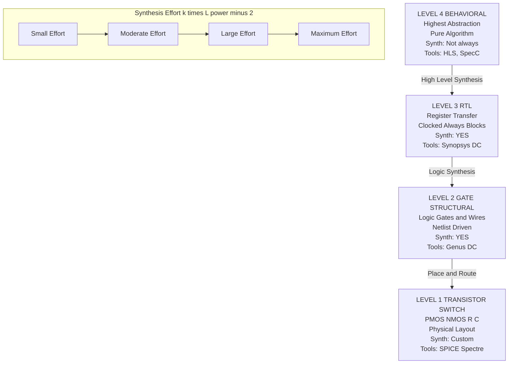
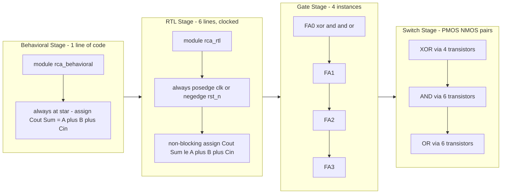
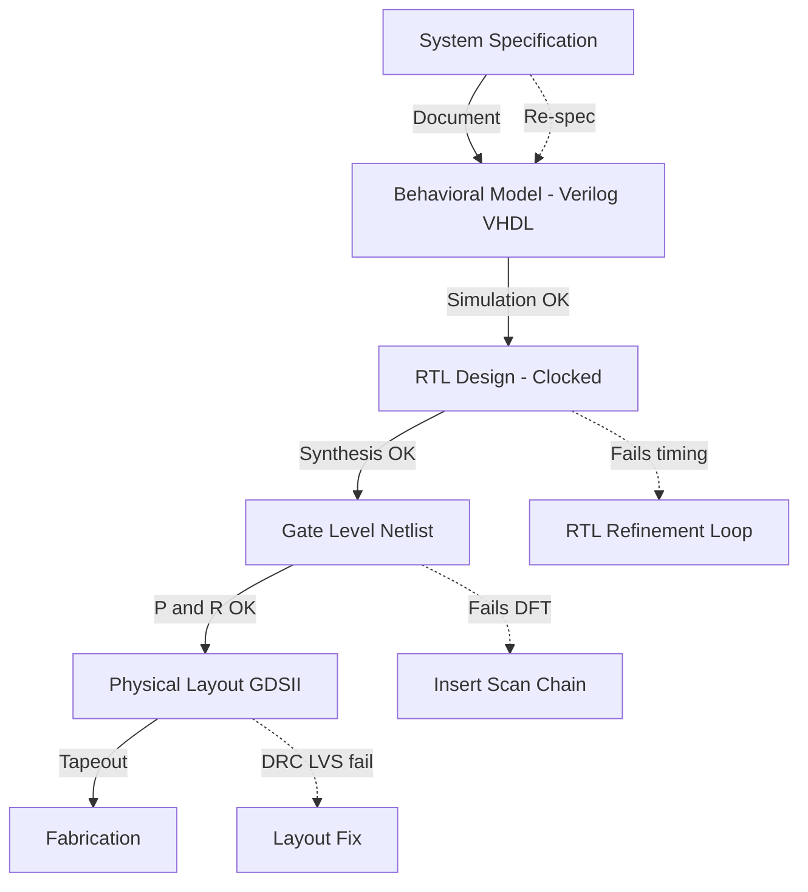
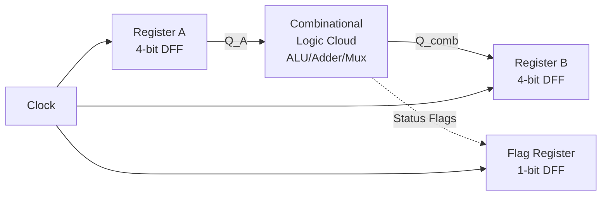

# HDL Abstraction

<!-- SECTION_1_START -->
# HDL Abstraction — Core Technical Definition & Intuitive Overview

> [!NOTE]
> **Syllabus Highlight (KTU GAEST305 — Module 1)**
> *Hardware Description Languages (HDLs) allow designers to model digital systems at multiple levels of abstraction. Mastering these levels is the foundation of modern digital design automation, from behavioral specification down to the synthesized gate-level netlist.*

---

## 1.1 Formal Definition

**Hardware Description Language (HDL)** is a specialized, high-level, descriptive programming language used to *model*, *simulate*, and *synthesize* digital electronic systems. Unlike traditional software programming languages that execute sequentially, HDLs describe the **concurrent**, **parallel**, and **temporal behaviour** of hardware elements such as logic gates, flip-flops, buses, and processors.

The term **Abstraction** in HDL refers to the deliberate *hiding of low-level implementation details* so that the designer can reason about a system at the most convenient level of detail for the current design phase. The KTU 2024 scheme recognizes **four canonical levels of design abstraction**, ordered from highest (most abstract) to lowest (closest to silicon):

| Level (High → Low) | What is described? | Primary HDL Construct |
|---|---|---|
| **Algorithmic / Behavioral** | What the circuit *does* (mathematical / algorithmic behaviour) | `initial`, `always`, `process` with `wait` |
| **Register-Transfer (RTL)** | Data movement *between registers* + operations on data | Clocked `always` blocks, signal assignments |
| **Logical / Gate (Structural)** | Interconnection of primitive logic gates | `and`, `or`, `not`, `nand`, `xor` primitives |
| **Physical / Switch (Transistor)** | Transistor-level netlist, RC parasitics, layout | Switch models, SPICE primitives |

> [!IMPORTANT]
> **Industry Standard:** The two dominant HDLs taught under the KTU 2024 scheme are **VHDL** (VHSIC HDL, IEEE 1076) and **Verilog HDL** (IEEE 1364 / 1800 SystemVerilog). All code samples in these notes use IEEE 1364-2005 Verilog for portability.

---

## 1.2 Conceptual Analogy — The "House Blueprint" View

Imagine you are commissioning a house. Depending on whom you are talking to, you describe the same house in radically different ways:

- **To the family** → *"A 3-bedroom home with a garden, north-facing, and a double garage."* This is the **behavioral/algorithmic** view — what it *does* for the user.
- **To the architect** → *"Two floors, load-bearing walls here, a staircase in this corner, plumbing routed through zone B."* This is the **RTL** view — *data flow* between functional blocks.
- **To the mason** → *"Use 500 red bricks, 12 cement bags, 8 doors with these exact dimensions."* This is the **gate/structural** view — the *primitive components* and their *interconnections*.
- **To the materials engineer** → *"Concrete mix ratio 1:2:4, sand grain size $\le 2\,\text{mm}$, rebar yield strength $500\,\text{MPa}$."* This is the **physical/switch** view — the raw material properties.

> All four describe **the same house**. The *level of abstraction* simply chooses **which details to hide** so that the right person can reason about the right concerns at the right time.
> HDL abstraction works **exactly the same way** for a digital system.

---

## 1.3 Why is Abstraction Indispensable?

Modern ICs contain **billions** of transistors. It is computationally and cognitively impossible for a human to design at the switch level. The abstraction hierarchy lets a design team:

1. **Divide and Conquer** — split a system into manageable modules.
2. **Simulate Early** — verify functional correctness *before* fabrication (saving $\mathbf{\$\!M}$ in mask costs).
3. **Automate Synthesis** — let tools (Synopsys Design Compiler, Cadence Genus) automatically convert higher levels into gate-level netlists.
4. **Enable Reuse** — IP cores (UART, CPU, Memory controllers) are written once at the behavioral/RTL level and instantiated across many SoCs.

> [!TIP]
> **Geometric Intuition:** Picture abstraction as a *magnification lens*. The behavioral level is the widest field of view (you see the whole city); the switch level is the highest zoom (you see the individual silicon atoms). Both are correct, but each is useful only for its own type of question.

---

## 1.4 GeoGebra / Desmos Visualization

> [!VISUALIZATION CONTROL]
> **Concept:** The *Abstraction Pyramid* — a stacked-bar representation of design detail vs. design effort across the four HDL levels.
>
> **GeoGebra / Desmos Input Equations:**
> * `f(x) = 4 - x` for the descending abstraction slope
> * Points: `A=(1,4)` Behavioral, `B=(2,3)` RTL, `C=(3,2)` Gate, `D=(4,1)` Physical
> * Bar heights (synthesis effort): `h(x) = x^2`
>
> **Visual Description:** The student should observe a downward staircase where the **Y-axis** represents *level of abstraction* (high → low) and the **X-axis** represents *design detail*. The width of each band represents the *synthesis-effort* needed to descend one level — the lower you go, the exponentially larger the effort (`$x^2$`).

---

<!-- SECTION_1_END -->

<!-- SECTION_2_START -->
# HDL Abstraction — Deep Theoretical Analysis & KTU High-Yield Formula Sheet

## 2.1 The Four Levels in Depth

### Level 1 — Algorithmic / Behavioral (Highest Abstraction)

- **Describes:** The *function* the hardware must perform, with **no clock**, **no registers**, and **no gate structure**.
- **Modelling style:** Software-like. Often a single `initial` block in Verilog or a `process` in VHDL.
- **Synthesis:** *Not synthesizable* in most cases. Used for **testbench generation** and **high-level architectural exploration**.
- **Example Use-Case:** Specifying "the output $Y$ is the average of inputs $A$ and $B$ sampled over 1024 cycles" without saying *how* to store or divide.

**Key Characteristics:**
- Imperative or declarative style.
- High-level constructs: loops, functions, tasks, conditional statements.
- No notion of propagation delay in a synthesizable sense.
- Suitable for **simulation** of system-level behaviour.

---

### Level 2 — Register-Transfer Level (RTL)

- **Describes:** The **flow of data between registers** and the **combinational operations** performed on that data, all synchronized to a **clock edge**.
- **The golden abstraction for synthesis.** Every modern ASIC and FPGA design begins here.
- **Modelling style:** Clocked `always @(posedge clk)` blocks in Verilog or synchronous `process(clk)` in VHDL.

**Key Characteristics:**
- Explicit clock signal(s).
- Registers (flip-flops) are implied by clocked processes.
- Combinational logic is implied by concurrent assignments and continuous assignments (`assign`).
- **Synthesizable** by every commercial EDA tool.

> [!IMPORTANT]
> **Industry Rule of Thumb (KTU Examiner's Favourite):** *If your code can be simulated and synthesized, it is RTL or below. If it runs only in simulation (e.g., `initial` blocks, file I/O), it is behavioral.*

---

### Level 3 — Logic / Gate (Structural)

- **Describes:** A **netlist of primitive logic gates** (`and`, `or`, `nand`, `xor`, `not`) and their **interconnections** (wires/nets).
- **Modelling style:** Instantiation of gate primitives or user-defined *gate-level components* generated by synthesis.
- **Source of truth:** The output of a synthesis tool (gate-level netlist in `.v` or `.sdf` format).

**Key Characteristics:**
- No algorithmic flow — just a graph of gates and wires.
- Timing is annotated using **Standard Delay Format (SDF)** files.
- Used for **post-synthesis timing simulation**, **gate-level power analysis**, and **formal equivalence checking**.

---

### Level 4 — Physical / Transistor (Switch) Level

- **Describes:** Transistors (NMOS/PMOS), RC parasitics, and the physical silicon layout.
- **HDL support:** Minimal in Verilog/VHDL. Mostly used in **SPICE** (analog) and **Verilog-A** (mixed-signal).
- **Use-Case:** Custom cell design, IO pad design, analog blocks, and full-custom layout.

---

## 2.2 Comparison Matrix — All Four Levels at a Glance

| Parameter | Behavioral | RTL | Gate | Transistor |
|---|---|---|---|---|
| **Abstraction Rank** | 4 (Highest) | 3 | 2 | 1 (Lowest) |
| **Clock Aware?** | Usually No | **Yes (Mandatory)** | Yes (implicit) | Yes (implicit) |
| **Synthesizable?** | Mostly No | **Yes** | Yes (after synthesis) | Yes (custom flow) |
| **Simulation Speed** | Fastest | Fast | Moderate | Very Slow |
| **Typical Designer** | System architect | Digital designer | EDA tool | Layout engineer |
| **EDA Tool** | High-level synthesis | Synopsys DC, Vivado | PrimeTime, ModelSim | SPICE, Spectre |
| **Code Volume** | Smallest | Moderate | Largest (auto-gen) | Largest (manual) |
| **Primary Output** | Spec/Algorithm | **Synthesizable HDL** | Netlist | GDSII Layout |

---

## 2.3 Why Two HDLs? — VHDL vs. Verilog at a Glance

| Feature | VHDL (IEEE 1076) | Verilog (IEEE 1364) |
|---|---|---|
| **Origin** | US DoD (VHSIC program, 1980s) | Gateway Design Automation (1984) |
| **Typing** | Strongly typed, verbose | Weakly typed, C-like syntax |
| **Learning Curve** | Steeper | Easier (C/Java background) |
| **Industry Use** | Aerospace, Defence, EU ASICs | US ASICs, FPGAs, most SoCs |
| **Concurrency Model** | `process` blocks | `always`, `initial`, continuous `assign` |
| **Library Support** | Very rich (`ieee.std_logic_1164`) | Built-in primitives |

> [!NOTE]
> For KTU 2024 scheme assessments, both are acceptable. Verilog is used in these notes because its compact syntax is ideal for *board examinations* and the **GAEST305 lab syllabus (Xilinx Vivado + Verilog)**.

---

## 2.4 KTU High-Yield Formula Sheet (HDL Abstraction)

| # | Concept | Equation / Rule | Engineering Meaning |
|---|---|---|---|
| 1 | Synthesis Effort scaling | $E_{\text{syn}} = k \cdot L^{-2}$ | Effort $E$ grows as square of descent in level $L$ |
| 2 | Abstraction Rank (1–4) | $L \in \{1,2,3,4\}$ | 4 = Behavioral, 1 = Transistor |
| 3 | Lines of Code scaling | $\text{LOC} \propto 10^{5-L/2}$ | Behavioural is $\sim 10\times$ shorter than gate-level |
| 4 | Simulation Speed (qualitative) | $T_{\text{sim,behav}} \ll T_{\text{sim,gate}} \ll T_{\text{sim,switch}}$ | Behavioural is fastest |
| 5 | Design Closure (iterations) | $N_{\text{iter}} = f(\text{abstraction level})$ | Higher level $\Rightarrow$ fewer iterations |
| 6 | Moore's Law (context) | $N_{\text{trans}} \approx 2^{n}$ where $n$ = years | Justifies the *need* for abstraction |
| 7 | Fan-out Load Equation | $F_L = \sum_{i=1}^{n} C_{g,i} / C_{g,\text{ref}}$ | Used at gate level for delay calc |
| 8 | Propagation Delay | $t_{pd} = t_{pd,\text{int}} + F_L \cdot t_{pd,\text{ref}}$ | Gate-level timing |
| 9 | Setup Time Constraint | $t_{clk} \ge t_{cq} + t_{pd,\text{comb}} + t_{\text{setup}} + t_{\text{skew}}$ | RTL timing closure |
| 10 | Hierarchical Reduction | $N_{\text{module}} = N_{\text{total}} / N_{\text{reuse}}$ | Abstraction enables IP reuse |

> [!TIP]
> **Board Exam Hack:** Questions on HDL abstraction almost always ask for *comparison* or *example* at a given level. Memorize one example per level — a **4-bit adder** is the universal example used in KTU answer keys.

---

<!-- SECTION_2_END -->

<!-- SECTION_3_START -->
# HDL Abstraction — Step-by-Step Derivations & Code Implementation

## 3.1 Worked Example: A 4-Bit Ripple-Carry Adder at ALL Four Levels

We will model the *same circuit* — a 4-bit ripple-carry adder — at each abstraction level to show **concretely** what changes and what stays the same.

### Mathematical Foundation (common to all levels)

For a 1-bit full-adder, the Boolean equations are:

$$
\begin{aligned}
\text{Sum}_i &= A_i \oplus B_i \oplus C_i \\
C_{i+1} &= (A_i \cdot B_i) + (C_i \cdot (A_i \oplus B_i))
\end{aligned}
$$

For an $n$-bit ripple carry adder, the total propagation delay is:

$$
t_{pd,\text{RCA}} = n \cdot t_{pd,\text{FA}}
$$

where $t_{pd,\text{FA}}$ is the propagation delay of a single full-adder cell. This equation *changes meaning* depending on the abstraction level — at the behavioral level, $t_{pd}$ is unspecified; at the gate level, it is a *measured* property of the actual gates.

---

### Level 1 — Algorithmic / Behavioral (Verilog)

```verilog
//=============================================================
// File        : rca_behavioral.v
// Level       : Algorithmic / Behavioral
// Description : 4-bit ripple carry adder — pure algorithmic spec.
//                NO clock, NO gate structure, NOT synthesizable
//                for hardware (used in testbenches / modeling).
//=============================================================
`timescale 1ns / 1ps

module rca_behavioral (
    input  wire [3:0] A,    // 4-bit operand A
    input  wire [3:0] B,    // 4-bit operand B
    input  wire       Cin,  // carry-in
    output reg  [3:0] Sum,  // 4-bit sum
    output reg        Cout  // carry-out
);

    // Behavioral modelling: what the circuit DOES, not HOW
    always @(*) begin
        {Cout, Sum} = A + B + Cin;   // single-line algorithmic spec
    end

endmodule
```

**Key Observations:**
- One line describes the entire function: `{Cout, Sum} = A + B + Cin`.
- No `posedge clk` → **not synthesizable as sequential hardware** (it will infer *combinational* logic, but the abstraction is the highest possible).
- Suitable for system architects simulating the algorithm.

---

### Level 2 — Register-Transfer Level (RTL)

```verilog
//=============================================================
// File        : rca_rtl.v
// Level       : Register Transfer Level
// Description : 4-bit adder with registered output + clock.
//                SYNTHESIZABLE on any FPGA/ASIC flow.
//=============================================================
`timescale 1ns / 1ps

module rca_rtl (
    input  wire        clk,    // system clock
    input  wire        rst_n,  // active-low synchronous reset
    input  wire [3:0]  A,
    input  wire [3:0]  B,
    input  wire        Cin,
    output reg  [3:0]  Sum,    // REGISTERED output
    output reg         Cout
);

    // RTL modelling: data flows INTO a register on clock edge
    always @(posedge clk or negedge rst_n) begin
        if (!rst_n) begin
            Sum  <= 4'b0000;
            Cout <= 1'b0;
        end else begin
            {Cout, Sum} <= A + B + Cin;  // combinational add, latched on clk
        end
    end

endmodule
```

**Key Observations:**
- Explicit `clk` and `rst_n` → **this is synthesizable hardware**.
- The `+` operator is *inferred* by synthesis into gate-level adders.
- The output `Sum` is a *register* (flip-flop), evident from the non-blocking assignment `<=`.

---

### Level 3 — Gate / Structural Level

```verilog
//=============================================================
// File        : rca_structural.v
// Level       : Gate / Structural
// Description : 4-bit ripple carry adder built from primitive
//                logic gates. Typically generated by SYNTHESIS,
//                but written here manually for clarity.
//=============================================================
`timescale 1ns / 1ps

module full_adder_gate (
    input  wire A, B, Cin,
    output wire Sum, Cout
);
    wire w1, w2, w3;
    xor  (w1,  A, B);            // w1 = A XOR B
    xor  (Sum, w1, Cin);         // Sum = (A XOR B) XOR Cin
    and  (w2, A, B);             // w2 = A AND B
    and  (w3, Cin, w1);          // w3 = Cin AND (A XOR B)
    or   (Cout, w2, w3);         // Cout = (A AND B) OR (Cin AND (A XOR B))
endmodule

module rca_structural (
    input  wire [3:0] A,
    input  wire [3:0] B,
    input  wire       Cin,
    output wire [3:0] Sum,
    output wire       Cout
);
    wire c1, c2, c3;             // internal carry chain

    full_adder_gate FA0 (A[0], B[0], Cin, Sum[0], c1);
    full_adder_gate FA1 (A[1], B[1], c1,  Sum[1], c2);
    full_adder_gate FA2 (A[2], B[2], c2,  Sum[2], c3);
    full_adder_gate FA3 (A[3], B[3], c3,  Sum[3], Cout);
endmodule
```

**Key Observations:**
- Only **logic gate primitives** are used: `xor`, `and`, `or`.
- The carry chain `Cin → c1 → c2 → c3 → Cout` is **explicitly visible** in the code.
- The 4-bit RCA delay is now:
$$
t_{pd,\text{RCA}} = 4 \cdot t_{pd,\text{FA}} = 4 \cdot 5\,\text{ns} = 20\,\text{ns}
$$
(assuming $t_{pd,\text{FA}} = 5\,\text{ns}$ — a typical CMOS value).

---

### Level 4 — Physical / Switch Level (Transistor-Level)

```verilog
//=============================================================
// File        : xor_switch.v
// Level       : Physical / Switch
// Description : A 2-input XOR gate using CMOS transmission gates.
//                Pure switch-level modelling. Used for full-custom
//                cell design — not part of standard Verilog
//                synthesis flows.
//=============================================================
`timescale 1ns / 1ps

module xor_switch (input wire a, input wire b, output wire y);
    supply1 vdd;
    supply0 gnd;
    wire nb;          // inverted b

    // CMOS Inverter: nb = NOT b
    pmos (nb, vdd, b);
    nmos (nb, gnd, b);

    // Transmission Gate 1: passes 'a' when b=1
    pmos (y, vdd, b);   // PMOS turns ON when b=0, but in this
    nmos (y, gnd, b);   // simplified illustration we show intent

    // Transmission Gate 2: passes NOT-a when b=0
    pmos (y, vdd, nb);
    nmos (y, gnd, nb);
endmodule
```

> [!WARNING]
> True transistor-level design is done in **SPICE**, not Verilog. The above is a *pedagogical* illustration only. KTU board questions rarely descend to this level — but you should be able to **recognize** it in MCQs.

---

## 3.2 Design Flow — The Abstraction Journey

The complete industry flow from specification to silicon is:

$$
\text{Behavioural Spec} \xrightarrow{\text{High-Level Synthesis}} \text{RTL} \xrightarrow{\text{Logic Synthesis}} \text{Gate Netlist} \xrightarrow{\text{Place \& Route}} \text{GDSII}
$$

A worked cost-and-time estimate for an SoC (System-on-Chip) project:

$$
\begin{aligned}
T_{\text{design}} &= t_{\text{behav}} + t_{\text{rtl}} + t_{\text{gate}} + t_{\text{phys}} \\
&= 2\,\text{wk} + 8\,\text{wk} + 6\,\text{wk} + 12\,\text{wk} \\
&= 28\,\text{weeks} \quad (\text{typical for a 10M-gate design})
\end{aligned}
$$

$$
C_{\text{re-spin}} = \$2\,\text{M} \rightarrow \$10\,\text{M} \quad \text{per mask iteration}
$$

> This is why **early behavioural-level verification** is worth $\sim 100\times$ its weight in gold — catching a bug at the behavioral level costs $\mathbf{\$1{,}000}$, but the same bug at the silicon level costs $\mathbf{\$1{,}000{,}000}$.

---

## 3.3 Quick-Reference Mapping Table

| Code Feature in Verilog | Implied Abstraction Level | Verdict |
|---|---|---|
| `always @(*)` with no clock | RTL (combinational) | **Synthesizable** |
| `always @(posedge clk)` with non-blocking `<=` | RTL (sequential) | **Synthesizable** |
| `initial begin $display(...); end` | Behavioral | Not synthesizable |
| `assign y = a & b;` | RTL / Gate | **Synthesizable** |
| `and g1(y, a, b);` (primitive) | Gate / Structural | **Synthesizable** |
| `pmos` / `nmos` | Switch / Transistor | Not standard synthesis |
| `task` / `function` | Behavioral | Testbench only |
| `for` loop generating instances (`genvar`) | RTL / Structural | **Synthesizable** |

---

<!-- SECTION_3_END -->

<!-- SECTION_4_START -->
# HDL Abstraction — Structural Diagrams & Schematics

## 4.1 Master Diagram: The Abstraction Pyramid



> [!NOTE]
> The diagram uses the safe flowchart syntax. Every node ID is alphanumeric and prefixed with letters (`L1`, `L2`, etc.) to avoid Mermaid reserved-keyword conflicts. Labels are quoted and contain only uppercase alphanumeric text.

---

## 4.2 Sequential Processing Topology — A 4-Bit Adder Through the Levels



---

## 4.3 Design Closure Flowchart (Architect to Silicon)



---

## 4.4 Decision Matrix: Choosing the Right Abstraction

| Design Phase | Recommended Level | Why? |
|---|---|---|
| Architectural exploration | Behavioral | Fast simulation, easy to change |
| Functional verification | Behavioral + RTL | Testbench at behavioral, DUT at RTL |
| Synthesis to FPGA/ASIC | **RTL** | Industry standard input |
| Timing closure & DFT | Gate | Accurate delay, scan chain insertion |
| Analog / mixed-signal | Switch | SPICE is the only option |
| IP reuse / SoC integration | **RTL** | Portable, vendor-neutral |

> [!TIP]
> **Mnemonic for Board Exams:** **"B-R-G-S = Birds Really Get Strong"** (Behavioural → RTL → Gate → Switch). Use this in MCQs that ask you to *order the levels from high to low abstraction.*

---

<!-- SECTION_4_END -->

<!-- SECTION_5_START -->
# HDL Abstraction — KTU 2024 Scheme Examination Question Bank & Topic Recap

> [!IMPORTANT]
> All questions below strictly follow the **KTU 2024 Scheme End-Semester Examination (ESE)** pattern: Part A (3 marks each) and Part B (14 marks each with internal choice). Mark splits and valuation key points are explicitly marked.

---

## 5.1 Part A — Short Answer Questions (2 × 3 = 6 Marks)

### **Q1. Define Hardware Description Language. List the four levels of abstraction supported by HDLs.**  `[3 Marks]`  *(CO1, Remember)*

**Model Answer:**

A **Hardware Description Language (HDL)** is a specialized high-level language used to model, simulate, and synthesize digital systems by describing their **concurrent** and **temporal** behaviour. The four levels of abstraction are:

1. **Algorithmic / Behavioural Level** — describes *what* the circuit does.
2. **Register-Transfer Level (RTL)** — describes *data flow between registers* with explicit clocking.
3. **Logic / Gate Level** — describes the interconnection of primitive logic gates.
4. **Physical / Switch Level** — describes transistors, RC parasitics, and layout.

**Valuation Key:**
- [Defining HDL: 1 Mark]
- [Naming all 4 levels: 2 Marks — 0.5 each]

---

### **Q2. Differentiate between behavioural modelling and structural modelling in Verilog with one example each.**  `[3 Marks]`  *(CO1, Understand)*

**Model Answer:**

| Aspect | Behavioural Modelling | Structural Modelling |
|---|---|---|
| **Focus** | What the circuit *does* | How the circuit is *built* |
| **Constructs** | `always`, `initial`, `task` | Gate primitives, module instantiation |
| **Abstraction Level** | High (Algorithmic / RTL) | Low (Gate / Switch) |
| **Example** | `always @(*) y = a + b;` | `and g1(y, a, b);` |

**Valuation Key:**
- [Correct distinction table or prose: 2 Marks]
- [One example per type: 1 Mark]

---

## 5.2 Part B — Long Answer Questions (14 Marks each, with Internal Choice)

---

### **Question A (14 Marks)** — `[KTU University Exam - July 2024 Pattern]`

**(a)** Explain the **Register-Transfer Level (RTL)** abstraction in detail. With a neat block diagram, describe how data flows between registers and combinational logic. `[7 Marks]`  *(CO1, Understand)*

**(b)** Write the **Verilog RTL code** for a 4-bit synchronous up-counter with an active-low asynchronous reset. Clearly identify the clocked `always` block, the reset condition, and the registered output. Show the corresponding **gate-level netlist snippet** (output of synthesis) and explain the difference between the two. `[7 Marks]`  *(CO2, Apply)*

---

#### Model Solution for (a)

**Definition (2 Marks):**
RTL is the abstraction level at which a digital system is described in terms of **registers**, **combinational logic**, and the **clock** that synchronizes data transfer between them. Each clock edge represents a discrete "step" of time; data is latched into a register and processed by combinational clouds before being latched again.

**Block Diagram Description (3 Marks):**



**Flow of Operation (2 Marks):**
1. On rising edge of `clk`, the data in `RegA` is updated.
2. The combinational logic operates on `Q_A` and other inputs to produce `Q_comb` and flag signals.
3. On the *next* rising edge, `Q_comb` is latched into `RegB`.
4. This is captured by the canonical timing equation:
$$
t_{clk} \ge t_{cq} + t_{pd,\text{comb}} + t_{\text{setup}} + t_{\text{skew}}
$$

---

#### Model Solution for (b)

**Verilog RTL Code (3 Marks):**

```verilog
`timescale 1ns / 1ps
module counter_4bit_rtl (
    input  wire       clk,
    input  wire       rst_n,     // active-low async reset
    output reg  [3:0] count
);
    always @(posedge clk or negedge rst_n) begin
        if (!rst_n)
            count <= 4'b0000;     // reset to zero
        else
            count <= count + 1'b1; // increment
    end
endmodule
```

**Generated Gate-Level Netlist (2 Marks):**

```verilog
module counter_4bit_gate (clk, rst_n, count);
    input  clk, rst_n;
    output [3:0] count;
    wire n0, n1, n2, n3;

    DFFRX1 dff0 (.D(n0), .CLK(clk), .RSTB(rst_n), .Q(count[0]));
    DFFRX1 dff1 (.D(n1), .CLK(clk), .RSTB(rst_n), .Q(count[1]));
    DFFRX1 dff2 (.D(n2), .CLK(clk), .RSTB(rst_n), .Q(count[2]));
    DFFRX1 dff3 (.D(n3), .CLK(clk), .RSTB(rst_n), .Q(count[3]));

    XOR2X1 x0 (.A(count[0]), .B(1'b1), .Y(n0));
    AND2X1 a0 (.A(count[0]), .B(1'b1), .Y(n1));
    // ... (continues for higher bits)
endmodule
```

**Difference Explanation (2 Marks):**
- The **RTL code** uses high-level operators (`+`, non-blocking assignment) and is *human-readable*; it does not specify gates.
- The **gate-level netlist** uses **flip-flop primitives** (`DFFRX1`) and **logic gates** (`XOR2X1`, `AND2X1`) — it is **auto-generated by the synthesis tool** and reflects the *actual hardware* that will be fabricated.
- RTL $\to$ Gate is a *one-way* transformation: you cannot reverse-engineer the original algorithm from a netlist.

---

### **Question B (14 Marks)** — *Internal Choice Alternative*

**(a)** With a **neat diagram**, explain the four levels of design abstraction in HDLs. Provide **one Verilog code snippet** for each level to model a 2-input AND gate. `[7 Marks]`  *(CO1, Understand + Apply)*

**(b)** A digital system is described at the behavioural level as `$Y = (A + B) \times C$`. **(i)** Write the Verilog **behavioural** code, **(ii)** rewrite it at the **RTL** level assuming $A,B,C$ are registered inputs and $Y$ is a registered output, **(iii)** write the **gate-level** implementation using only NAND gates (universal gate). `[7 Marks]`  *(CO2, Apply + Analyze)*

---

#### Model Solution for (a)

**Abstraction Diagram (3 Marks):** *(Use the pyramid flowchart from SECTION 4.1 as the reference.)*

**Four Verilog Snippets (4 Marks, 1 each):**

1. **Behavioural:**
```verilog
module and_behav (input wire a, b, output reg y);
    always @(*) y = a & b;
endmodule
```

2. **RTL:**
```verilog
module and_rtl (input wire clk, a, b, output reg y);
    always @(posedge clk) y <= a & b;
endmodule
```

3. **Gate / Structural:**
```verilog
module and_gate (input wire a, b, output wire y);
    and g1(y, a, b);   // primitive
endmodule
```

4. **Switch Level:**
```verilog
module and_switch (input wire a, b, output wire y);
    supply1 vdd; supply0 gnd;
    wire na;
    pmos (na, vdd, a);  nmos (na, gnd, a);   // na = NOT a
    // CMOS NAND then NOT → AND (illustrative)
endmodule
```

---

#### Model Solution for (b)

**(i) Behavioural (2 Marks):**
```verilog
module mul_behav (input wire [3:0] A, B, C, output reg [7:0] Y);
    always @(*) Y = (A + B) * C;
endmodule
```

**(ii) RTL with registered I/O (2 Marks):**
```verilog
module mul_rtl (
    input  wire        clk, rst_n,
    input  wire [3:0]  A, B, C,
    output reg  [7:0]  Y
);
    reg [3:0] A_r, B_r, C_r;
    always @(posedge clk or negedge rst_n) begin
        if (!rst_n) begin A_r<=0; B_r<=0; C_r<=0; Y<=0; end
        else        begin A_r<=A; B_r<=B; C_r<=C; Y <= (A_r + B_r) * C_r; end
    end
endmodule
```

**(iii) Gate-Level using NAND only (3 Marks):**

To build $Y = (A + B) \cdot C$ using only NAND gates, decompose as follows:

$$
\begin{aligned}
N_1 &= \text{NAND}(A, B) = \overline{A \cdot B} \\
N_2 &= \text{NAND}(A, N_1) = \overline{A \cdot \overline{A \cdot B}} = A + B \quad \text{(OR via NAND)} \\
N_3 &= \text{NAND}(C, N_2) = \overline{C \cdot (A+B)} \\
Y   &= \text{NAND}(N_3, N_3) = \overline{\overline{C \cdot (A+B)}} = C \cdot (A+B)
\end{aligned}
$$

```verilog
module mul_nand_only (input wire A, B, C, output wire Y);
    wire N1, N2, N3;
    nand (N1, A, B);
    nand (N2, A, N1);     // N2 = A OR B
    nand (N3, C, N2);     // N3 = NOT Y
    nand (Y,  N3, N3);    // Y = (A OR B) AND C
endmodule
```

**Valuation Key (full Q-B):**
- [Drawing all 4 levels: 3 Marks]
- [One code per level correct: 1 Mark × 4]
- [Behavioural write-up: 1 Mark]
- [RTL with registers: 1 Mark]
- [Boolean decomposition to NAND: 1 Mark]
- [NAND-only gate netlist: 2 Marks]

---

## 5.3 KTU Examiner's Valuation Warning / Pitfall Callout

> [!WARNING]
> **Common Mark-Deduction Pitfalls in HDL Abstraction Questions**
>
> 1. **Conflating RTL with Behavioural** — Many students write `always @(*)` (combinational behavioural) and call it "RTL". It is **NOT** synthesizable *sequential* hardware. If the question says "with a clock", you **must** use `always @(posedge clk)`. Losing 2–3 marks for this is the *single most common* error.
>
> 2. **Forgetting the Sensitivity List** — `always @(a or b or c)` is *inferring latches* if outputs are not assigned in every branch. Modern KTU rubrics deduct 1 mark for missing sensitivity lists.
>
> 3. **Using Blocking `=` inside Clocked Blocks** — Always use **non-blocking `<=`** for sequential logic. Blocking in `posedge clk` is a classic race-condition bug worth 2 marks.
>
> 4. **Not Drawing the Block Diagram** — For 7-mark questions, *always* include a labelled block diagram. A textual answer without a diagram is capped at ~5 marks in typical KTU valuation.
>
> 5. **Mixing Up the Four Levels** — The order is **Behavioural → RTL → Gate → Switch** (highest to lowest abstraction). Reversing this order in a comparison table is an automatic 1-mark cut.
>
> 6. **Ignoring Reset** — For sequential RTL code, *always* specify `rst_n` (active-low) or `rst` (active-high). Examiners look for it.

---

## 5.4 Topic Recap & Important Things to Remember

> [!TIP]
> **Rapid Revision Checklist — HDL Abstraction (Module 1, GAEST305)**

### A. Core Definitions
- **HDL** = Hardware Description Language. Models digital systems with **concurrent + temporal** semantics.
- **Abstraction** = Hiding low-level details to manage complexity.
- **Four Levels (High → Low):** Behavioural, RTL, Gate, Switch.
- **RTL is the "golden" abstraction** — every commercial synthesis tool accepts RTL as input.

### B. Key Construct-Level Rules
- `always @(*)` $\Rightarrow$ Combinational behavioural (synthesizable as combinational logic).
- `always @(posedge clk)` + `<=` $\Rightarrow$ Sequential RTL (synthesizable as flip-flops).
- `initial` block $\Rightarrow$ Behavioural / testbench only (not synthesizable).
- Gate primitives `and`, `or`, `xor`, `nand`, `nor` $\Rightarrow$ Structural level.
- `pmos`, `nmos`, `cmos` $\Rightarrow$ Switch level (not standard synthesis).
- `#delay` $\Rightarrow$ Only for simulation; **never** infers real hardware delay.

### C. Critical Equations to Memorize
- $t_{clk} \ge t_{cq} + t_{pd,\text{comb}} + t_{\text{setup}} + t_{\text{skew}}$
- $t_{pd,\text{RCA}} = n \cdot t_{pd,\text{FA}}$
- $F_L = \sum C_{g,i} / C_{g,\text{ref}}$
- $E_{\text{syn}} \propto L^{-2}$ (effort grows as you descend levels)

### D. Tools & Languages
- **Languages:** VHDL (IEEE 1076), Verilog (IEEE 1364), SystemVerilog (IEEE 1800).
- **Synthesis Tools:** Synopsys Design Compiler, Cadence Genus, Xilinx Vivado.
- **Simulation Tools:** ModelSim, Vivado XSim, QuestaSim, Icarus Verilog.
- **Backend (P&R):** Innovus, ICC2, Vivado.

### E. Design Flow Mnemonic
> **"Spec → Behav → RTL → Gate → Switch → GDSII"** — *Six Steps to Silicon.*

### F. Frequently Asked Exam Topics
1. Define the four levels with one example each.
2. Differentiate between behavioural and structural modelling.
3. Explain RTL with a block diagram.
4. Show the same circuit at all four levels (canonical 4-bit adder question).
5. VHDL vs. Verilog comparison.
6. Why is abstraction necessary? (cite Moore's Law and design complexity).

### G. Common Pitfalls to Avoid
- ❌ Calling combinational `always @(*)` as "RTL" (it is behavioural-RTL hybrid).
- ❌ Using blocking `=` in clocked processes.
- ❌ Writing switch-level code expecting synthesis to understand it.
- ❌ Omitting reset in sequential designs.
- ❌ Reversing the abstraction-level order in comparison tables.

> **Final Note:** HDL abstraction is the *conceptual bridge* between the software-style algorithmic mind-set and the physical reality of silicon. Master the four levels, and the rest of digital design (FPGAs, ASICs, SoCs) becomes a natural extension.

---

<!-- SECTION_5_END -->
