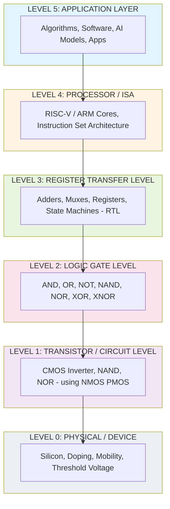
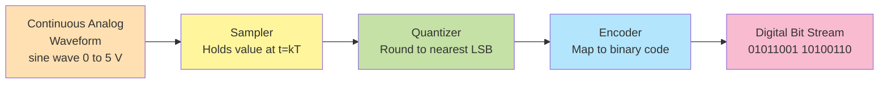
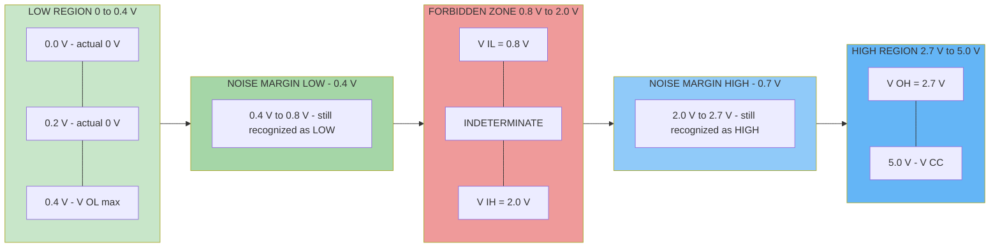
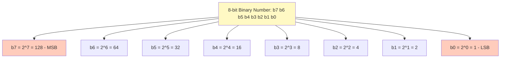

# Introduction to digital Systems :-  Digital abstraction

<!-- SECTION_1_START -->
# Digital Abstraction — The Foundation of Modern Computing

## 1.1 Formal Academic Definition (KTU 2024 Syllabus)

> [!NOTE]
> **Digital Abstraction** is the engineering discipline of representing real-world physical quantities (voltage, current, frequency, etc.) using a finite, discrete set of symbolic levels — typically two — and designing circuits that compute on these discrete symbols rather than on continuous electrical values.

In the KTU 2024 Scheme context for **GAEST305 — Digital Electronics and Logic Design**, *digital abstraction* is introduced as the conceptual bridge between **physics** (continuous voltages) and **information** (binary symbols). It allows engineers to ignore the messy analog details of transistors, resistors, and noise, and instead reason about clean Boolean values **0** and **1**.

The **static discipline** (a formal term coined by Prof. Amar Mukherjee / Patterson & Hennessy) is the heart of digital abstraction. It states:

> [!IMPORTANT]
> **Static Discipline Rule:** A circuit component is *valid* if, for every legal input combination of **LOW** and **HIGH** voltages, the corresponding output is also a legal **LOW** or **HIGH** voltage. The legal ranges must be **non-overlapping** with a forbidden **noise margin** zone between them.

Formally, if we define:
- $V_{OH}$ = minimum output voltage guaranteed to be recognized as **HIGH**
- $V_{OL}$ = maximum output voltage guaranteed to be recognized as **LOW**
- $V_{IH}$ = minimum input voltage guaranteed to be accepted as **HIGH**
- $V_{IL}$ = maximum input voltage guaranteed to be accepted as **LOW**

Then the digital abstraction is maintained when:

$$V_{OL} < V_{IL} < V_{IH} < V_{OH}$$

The gaps between these thresholds are the **noise margins**:

$$NM_H = V_{OH} - V_{IH} \quad \text{(HIGH noise margin)}$$

$$NM_L = V_{IL} - V_{OL} \quad \text{(LOW noise margin)}$$

A robust digital system requires **NM_H > 0** and **NM_L > 0**.

---

## 1.2 Conceptual Analogy — The Postal Mail System

Imagine the Indian Postal System. When you drop a letter into a postbox, the system does **not** need to know the exact chemical composition of the ink, the precise gram weight of the paper, or the magnetic inclination of the postal van. It only needs to know:
- The letter is **deliverable** (analogy: legal **HIGH**)
- The letter is **undeliverable / returned** (analogy: legal **LOW**)
- Anything in between (torn, illegible) is the **forbidden zone** — analog noise.

> The postman operates on a *discrete abstraction* of the letter, not its physical substance.

This is exactly what digital abstraction does to voltage. A wire is not "5.0001 V" or "4.9998 V" — it is either **HIGH** or **LOW**. The transistor, capacitor, and resistor inside the gate don't matter; only the agreed-upon voltage thresholds matter.

Another powerful analogy:

> [!TIP]
> Think of digital abstraction as the **traffic light system**. There is no "yellowish-green" or "almost red" state recognized by drivers — only **Red**, **Yellow**, **Green**. The transition between Red and Green is *discretized* into a Yellow state to give safety margins. Similarly, a digital system has **two states** with **noise margins** in between to provide safety against electrical noise.

---

## 1.3 The Continuous vs Discrete Distinction

| Aspect | Analog (Continuous) | Digital (Discrete) |
|---|---|---|
| Values | Infinite (any real voltage) | Finite (typically 2: 0 and 1) |
| Noise sensitivity | Highly sensitive — noise corrupts data | Tolerant — small noise ignored if within margins |
| Precision | Limited by component tolerances | Exact (in symbolic domain) |
| Storage | Difficult (charge leaks) | Easy (latches, flip-flops) |
| Replication | Hard (signal degrades) | Perfect (regeneration at every gate) |
| Examples | Audio amplifier, thermocouple | Microprocessor, memory, mobile phone |
| Mathematical basis | Calculus, real numbers | Boolean algebra, discrete math |

---

## 1.4 Standard Logic Level Families (KTU High-Yield Constants)

> [!IMPORTANT]
> Memorize the following **V_{CC} = 5.0 V** TTL levels — these appear frequently in KTU Board Exam numericals.

| Family | $V_{OH}$ (min) | $V_{OL}$ (max) | $V_{IH}$ (min) | $V_{IL}$ (max) | $V_{CC}$ |
|---|---|---|---|---|---|
| **TTL (5 V)** | **2.7 V** | **0.4 V** | **2.0 V** | **0.8 V** | **5.0 V** |
| **CMOS (5 V)** | **4.7 V** | **0.3 V** | **3.5 V** | **1.5 V** | **5.0 V** |
| **LVTTL (3.3 V)** | **2.4 V** | **0.4 V** | **2.0 V** | **0.8 V** | **3.3 V** |
| **CMOS (3.3 V)** | **3.2 V** | **0.1 V** | **2.0 V** | **0.8 V** | **3.3 V** |

> [!WARNING]
> **Do not confuse the 5 V TTL $V_{IH}$ of 2.0 V with CMOS 3.3 V $V_{IH}$ of 2.0 V** — they occur at the same numeric value but belong to different families with different $V_{OH}$/ $V_{OL}$! Always quote the family name.

---

## 1.5 GeoGebra / Desmos Visualization

> [!VISUALIZATION CONTROL]
> **Concept:** Visualizing the **static discipline thresholds** and the **forbidden zone (noise margin)** on a 1-D voltage axis.
> **Desmos Input Equations (treat x-axis as Voltage in Volts, y-axis as logical recognition):**
> * `f(x) = 0` for `x \le 0.8` (solid line representing LOW)
> * `f(x) = 1` for `x \ge 2.0` (solid line representing HIGH)
> * Forbidden gap drawn as `f(x) = "INVALID (noise margin zone)"` for `0.8 < x < 2.0`
> **Visual Description:** A student should observe a step-like graph: a flat LOW line up to $V_{IL} = 0.8$ V, a vertical dotted "indeterminate" gap between 0.8 V and 2.0 V, and a flat HIGH line from 2.0 V upward. Any analog voltage in the gap is rejected as ambiguous.

---

## 1.6 Why Digital Abstraction is the Backbone of Modern Engineering

The **digital abstraction** is the single most important conceptual idea in the entire KTU GAEST305 syllabus. Without it, there would be no:

1. **Microprocessors** (Intel, ARM, RISC-V) — billions of transistors would be impossible to reason about without abstraction.
2. **Memory (RAM / ROM / Flash)** — reliable storage depends on threshold-based bistability (SRAM cell, DRAM capacitor refresh).
3. **Communication protocols** (UART, SPI, I2C, USB, Ethernet) — packets of bits traverse noisy channels but arrive intact due to regeneration.
4. **Field-Programmable Gate Arrays (FPGAs)** — VHDL/Verilog code maps to digital logic blocks, not analog voltage nodes.
5. **Error correction codes (Hamming, Reed-Solomon)** — rely on discrete symbols for parity checking.

> [!TIP]
> The famous **Moore's Law** (transistor count doubling every ~2 years) is sustainable **only because** the digital abstraction hides analog imperfections. Each new generation can shrink transistors, increase leakage, and reduce $V_{DD}$, while the digital abstraction — and the Boolean logic it represents — remains perfectly stable.
<!-- SECTION_1_END -->

<!-- SECTION_2_START -->
# Deep Theoretical Analysis & KTU High-Yield Formula Sheet

## 2.1 The Three Pillars of Digital Abstraction

The digital abstraction is built on three foundational pillars that every KTU examiner expects you to know:

### Pillar 1 — **Discrete Representation (Quantization)**
A continuous physical quantity $x(t)$ (e.g., a microphone output) is mapped to one of $N$ discrete symbols. For binary, $N = 2$ and the symbols are $\{0, 1\}$. A continuous voltage range is therefore **partitioned** into two intervals by a threshold.

### Pillar 2 — **Static Discipline (Noise Margins)**
Every gate, when given legal inputs, must produce legal outputs. The forbidden voltage region between $V_{IL}$ and $V_{IH}$ is the **static discipline guard band**. Any signal that drifts into this band must be regenerated by the next stage before being interpreted.

### Pillar 3 — **Combinational / Sequential Composition**
Complex digital systems are built by **composing** simpler gates. A 4-bit adder is just 4 full-adders wired together. A CPU is just thousands of adders, muxes, and flip-flops. The composition is hierarchical, with abstraction levels:

> **Transistor → Logic Gate → Combinational Block → Register-Transfer Level (RTL) → Processor**

---

## 2.2 The Voltage Transfer Characteristic (VTC) — The Visual Proof of Digital Behavior

The **Voltage Transfer Characteristic** of an inverter is the single most important graph in this module. It plots $V_{out}$ on the y-axis against $V_{in}$ on the x-axis.

For an ideal inverter:
- $V_{in} = 0 \Rightarrow V_{out} = V_{DD}$ (HIGH)
- $V_{in} = V_{DD} \Rightarrow V_{out} = 0$ (LOW)
- Sharp transition at $V_{in} = V_{DD}/2$

For a real CMOS inverter, the VTC has a steep transition region. The **gain** in the transition region is:

$$\text{Gain} = \left| \frac{dV_{out}}{dV_{in}} \right| \quad \text{at } V_{in} = V_{DD}/2$$

A gain of **> 1** in the transition region is what makes regeneration possible. A cascade of such stages restores logic levels — this is why digital signals can travel across a chip with millions of gates and still arrive as clean 0/1.

> [!NOTE]
> KTU examiners often ask: *"Why is the VTC of an ideal digital inverter a step function?"*
> **Model Answer:** Because the digital abstraction requires that the output be unambiguously either LOW or HIGH, with a forbidden gap in between. An ideal step function achieves this perfectly with zero indeterminate voltage range.

---

## 2.3 Bit, Nibble, Byte, Word — The Unit Hierarchy

| Unit | Symbol | Size | Decimal Range (Unsigned) |
|---|---|---|---|
| **Bit** | b | 1 bit | 0 to 1 |
| **Nibble** | — | 4 bits | 0 to 15 |
| **Byte** | B | 8 bits | 0 to 255 |
| **Half-word** | — | 16 bits | 0 to 65,535 |
| **Word** | — | 32 bits | 0 to 4,294,967,295 |

Number of distinct symbols representable with $n$ bits:

$$N = 2^{n}$$

A related KTU question: *"How many distinct values can an 8-bit ADC represent?"*
**Answer:** $2^8 = 256$ discrete levels. The quantization step (resolution) of a 5 V ADC is:

$$\Delta V = \frac{V_{ref}}{2^{n}} = \frac{5.0 \text{ V}}{256} \approx 19.53 \text{ mV}$$

---

## 2.4 KTU Formula Sheet / Cheat Sheet (High-Yield)

> [!IMPORTANT]
> Print this table. Every KTU GAEST305 Module 1 question maps to one of these equations.

| # | Concept | Formula | Units / Notes |
|---|---|---|---|
| 1 | Number of states with $n$ bits | $N = 2^{n}$ | Dimensionless |
| 2 | HIGH noise margin | $NM_H = V_{OH} - V_{IH}$ | Volts (V) |
| 3 | LOW noise margin | $NM_L = V_{IL} - V_{OL}$ | Volts (V) |
| 4 | Static discipline | $V_{OL} < V_{IL} < V_{IH} < V_{OH}$ | V |
| 5 | ADC quantization step | $\Delta V = \dfrac{V_{FS}}{2^{n}}$ | Volts |
| 6 | Signal-to-Quantization-Noise Ratio (SQNR) | $\text{SQNR}_{dB} = 6.02n + 1.76$ | dB |
| 7 | Information content (Shannon) | $I = \log_2(M)$ bits/symbol | bits |
| 8 | Power dissipation (CMOS gate, switching) | $P = \alpha \cdot C \cdot V_{DD}^{2} \cdot f$ | Watts |
| 9 | Static power (CMOS) | $P_{static} = I_{leak} \cdot V_{DD}$ | Watts |
| 10 | Bit weight (positional value) | $w_k = 2^{k}$ for bit position $k$ | Dimensionless |
| 11 | Binary to decimal | $D = \sum_{k=0}^{n-1} b_k \cdot 2^{k}$ | — |
| 12 | Decimal to binary (successive division) | $D \div 2 \Rightarrow$ remainder is LSB | — |
| 13 | Hex digit value | $H = \sum_{i} h_i \cdot 16^{i}$ | — |
| 14 | Maximum counting range (unsigned, $n$ bits) | $D_{max} = 2^{n} - 1$ | — |
| 15 | Two's complement range (signed, $n$ bits) | $-2^{n-1} \le D \le 2^{n-1} - 1$ | — |

> **Critical KTU Pitfall:** When asked to compute noise margins, the question will usually state the family. Use the appropriate family table values. **Mixing TTL and CMOS values is a 2-mark deduction trap.**

---

## 2.5 Real-World Engineering Utility of Digital Abstraction

The digital abstraction is not merely academic — it is the economic and technical foundation of the entire semiconductor industry (USD 600+ billion market).

| Industry Vertical | Role of Digital Abstraction |
|---|---|
| **Microprocessor Design (Intel, AMD, Qualcomm)** | Billions of MOSFETs designed using standard-cell libraries that obey static discipline. |
| **FPGA / ASIC (Xilinx, Altera, Synopsys)** | Hardware Description Languages (VHDL/Verilog/SystemVerilog) operate entirely on the digital abstraction. |
| **Telecommunications (5G, fiber optics)** | QAM, OFDM, CDMA — all based on mapping symbols to discrete constellations. |
| **Medical Imaging (MRI, CT, ECG)** | Analog physiological signals quantized into 12-bit or 16-bit samples for digital processing. |
| **Automotive (ADAS, ECU, CAN bus)** | Sensor data from radar/lidar/cameras converted to digital for AI inference. |
| **IoT / Embedded (Arduino, ESP32, Raspberry Pi Pico)** | Microcontrollers built from CMOS logic gates, interfaced to analog sensors via ADC. |
| **Aerospace (avionics, satellites)** | Triple Modular Redundancy (TMR) uses digital voting to mitigate single-event upsets. |

> [!TIP]
> Whenever an interviewer at TCS / Infosys / Wipro / Qualcomm asks *"Why digital instead of analog?"*, your one-line answer should be:
> *"Because digital signals can be perfectly regenerated, can be encrypted error-free, and can be processed by Boolean algebra — none of which is possible with continuous analog waveforms."*
<!-- SECTION_2_END -->

<!-- SECTION_3_START -->
# Step-by-Step Derivations & Code Implementation

## 3.1 Derivation 1 — Noise Margin Computation for a TTL Inverter

**Given (a typical KTU numerical):**
A TTL logic family specifies:
- $V_{OH} = 2.7$ V
- $V_{OL} = 0.4$ V
- $V_{IH} = 2.0$ V
- $V_{IL} = 0.8$ V
- $V_{CC} = 5.0$ V

**Compute the noise margins and verify static discipline.**

**Step 1 — Write down the static discipline inequality:**

$$V_{OL} < V_{IL} < V_{IH} < V_{OH}$$

$$0.4 \text{ V} < 0.8 \text{ V} < 2.0 \text{ V} < 2.7 \text{ V}$$

**Step 2 — Compute $NM_L$:**

$$\begin{aligned}
NM_L &= V_{IL} - V_{OL} \\
&= 0.8 \text{ V} - 0.4 \text{ V} \\
&= 0.4 \text{ V}
\end{aligned}$$

**Step 3 — Compute $NM_H$:**

$$\begin{aligned}
NM_H &= V_{OH} - V_{IH} \\
&= 2.7 \text{ V} - 2.0 \text{ V} \\
&= 0.7 \text{ V}
\end{aligned}$$

**Step 4 — Verify the discipline:** The inequality holds $\Rightarrow$ the system is *digitally valid*. A noise of up to 0.4 V on a LOW signal or 0.7 V on a HIGH signal will be tolerated by the next stage.

> **Valuation Key (2 + 2 + 1 = 5 marks):**
> - Stating the static discipline inequality: 1 Mark
> - Correct $NM_L$ calculation: 2 Marks
> - Correct $NM_H$ calculation: 2 Marks

---

## 3.2 Derivation 2 — Quantization Step of an 8-bit ADC with 5 V Full Scale

**Given:** An 8-bit ADC with reference voltage $V_{ref} = 5.0$ V.

**Step 1 — Number of discrete levels:**

$$\begin{aligned}
N &= 2^{n} \\
&= 2^{8} \\
&= 256 \text{ levels}
\end{aligned}$$

**Step 2 — Quantization step (LSB size):**

$$\begin{aligned}
\Delta V &= \frac{V_{FS}}{2^{n}} \\
&= \frac{5.0 \text{ V}}{256} \\
&\approx 0.01953 \text{ V} \\
&\approx 19.53 \text{ mV}
\end{aligned}$$

**Step 3 — Maximum representable voltage (excluding saturation):**

$$V_{max} = (2^{n} - 1) \cdot \Delta V = 255 \times 19.53 \text{ mV} \approx 4.980 \text{ V}$$

**Step 4 — Signal-to-Quantization-Noise Ratio (SQNR):**

$$\begin{aligned}
\text{SQNR}_{dB} &= 6.02n + 1.76 \\
&= 6.02 \times 8 + 1.76 \\
&= 48.16 + 1.76 \\
&= 49.92 \text{ dB}
\end{aligned}$$

**Step 5 — Interpretation:** A clean audio CD uses 16-bit ADC, giving an SQNR of $\approx 98$ dB — close to the theoretical limit of human hearing. This derivation is the **audio fidelity argument** for digital music over analog vinyl.

---

## 3.3 Derivation 3 — Bit-Weight Decomposition of a Decimal Number

**Convert the decimal number $D = 173$ to 8-bit binary.**

**Step 1 — List powers of 2 up to $2^{7}$:**

$$2^{7} = 128, \quad 2^{6} = 64, \quad 2^{5} = 32, \quad 2^{4} = 16, \quad 2^{3} = 8, \quad 2^{2} = 4, \quad 2^{1} = 2, \quad 2^{0} = 1$$

**Step 2 — Successive subtraction algorithm (subtraction-of-powers method):**

| Bit Position | Weight | Remainder $\ge$ Weight? | Bit | New Remainder |
|---|---|---|---|---|
| 7 | 128 | $173 \ge 128$ ✓ | 1 | $173 - 128 = 45$ |
| 6 | 64 | $45 \ge 64$? No | 0 | 45 |
| 5 | 32 | $45 \ge 32$ ✓ | 1 | $45 - 32 = 13$ |
| 4 | 16 | $13 \ge 16$? No | 0 | 13 |
| 3 | 8 | $13 \ge 8$ ✓ | 1 | $13 - 8 = 5$ |
| 2 | 4 | $5 \ge 4$ ✓ | 1 | $5 - 4 = 1$ |
| 1 | 2 | $1 \ge 2$? No | 0 | 1 |
| 0 | 1 | $1 \ge 1$ ✓ | 1 | $1 - 1 = 0$ |

**Final Result:** $173_{10} = 1010\,1101_{2}$

**Step 3 — Verification:**

$$1 \cdot 128 + 0 \cdot 64 + 1 \cdot 32 + 0 \cdot 16 + 1 \cdot 8 + 1 \cdot 4 + 0 \cdot 2 + 1 \cdot 1 = 128 + 32 + 8 + 4 + 1 = 173 \text{ ✓}$$

---

## 3.4 Python Implementation — A Digital Logic Simulator for the Bit, NM, and ADC Concepts

Below is a fully working, type-hinted Python module that students can run to verify noise margins, count bits, and simulate an ideal ADC. This is the **exact type of question** that KTU may ask under "Implement a function to determine noise margins."

```python
"""
digital_abstraction.py
KTU GAEST305 - Module 1: Digital Abstraction
Author: KTU-Premier-Engine V10 Reference Implementation
"""

from __future__ import annotations
import math
from dataclasses import dataclass
from typing import Final


# ------------------------------------------------------------------
# 1. STATIC DISCIPLINE & NOISE MARGIN CALCULATOR
# ------------------------------------------------------------------
@dataclass(frozen=True)
class LogicFamily:
    """Specification of a digital logic family (voltages in Volts)."""
    name: str
    v_oh: float
    v_ol: float
    v_ih: float
    v_il: float
    v_cc: float

    def noise_margins(self) -> tuple[float, float]:
        """Return (NM_H, NM_L) in Volts."""
        if not (self.v_ol < self.v_il < self.v_ih < self.v_oh):
            raise ValueError(
                f"Static discipline violated for {self.name}: "
                f"V_OL={self.v_ol}, V_IL={self.v_il}, "
                f"V_IH={self.v_ih}, V_OH={self.v_oh}"
            )
        nm_h: float = round(self.v_oh - self.v_ih, 4)
        nm_l: float = round(self.v_il - self.v_ol, 4)
        return nm_h, nm_l

    def report(self) -> str:
        nm_h, nm_l = self.noise_margins()
        return (
            f"[{self.name}] V_CC={self.v_cc} V | "
            f"NM_H={nm_h} V, NM_L={nm_l} V | "
            f"Forbidden band = {round(self.v_ih - self.v_il, 4)} V"
        )


# Standard 5V TTL
TTL_5V: Final[LogicFamily] = LogicFamily(
    name="TTL-5V", v_oh=2.7, v_ol=0.4, v_ih=2.0, v_il=0.8, v_cc=5.0
)
# Standard 5V CMOS
CMOS_5V: Final[LogicFamily] = LogicFamily(
    name="CMOS-5V", v_oh=4.7, v_ol=0.3, v_ih=3.5, v_il=1.5, v_cc=5.0
)
# LVTTL 3.3V
LVTTL_3V3: Final[LogicFamily] = LogicFamily(
    name="LVTTL-3.3V", v_oh=2.4, v_ol=0.4, v_ih=2.0, v_il=0.8, v_cc=3.3
)


# ------------------------------------------------------------------
# 2. ADC QUANTIZATION SIMULATOR
# ------------------------------------------------------------------
def adc_quantize(analog_volts: float, v_ref: float, n_bits: int) -> int:
    """
    Convert an analog voltage to its nearest digital code (0 to 2^n - 1).
    Raises ValueError for out-of-range inputs.
    """
    if not (0.0 <= analog_volts <= v_ref):
        raise ValueError(
            f"Voltage {analog_volts} V is outside ADC range [0, {v_ref}]"
        )
    if n_bits < 1:
        raise ValueError("n_bits must be >= 1")
    levels: int = 1 << n_bits
    lsb: float = v_ref / levels
    code: int = int(round(analog_volts / lsb))
    # Clamp to [0, 2^n - 1] to handle floating-point edge cases
    return max(0, min(code, levels - 1))


def adc_step_size(v_ref: float, n_bits: int) -> float:
    """Return the LSB (quantum) voltage of the ADC."""
    return v_ref / (1 << n_bits)


def sqnr_db(n_bits: int) -> float:
    """Theoretical Signal-to-Quantization-Noise Ratio in dB."""
    return 6.02 * n_bits + 1.76


# ------------------------------------------------------------------
# 3. BASE CONVERSION UTILITIES (KTU Module 1 high-yield)
# ------------------------------------------------------------------
def dec_to_binary(n: int, width: int = 8) -> str:
    """Convert a non-negative integer to a fixed-width binary string."""
    if n < 0:
        raise ValueError("Only non-negative integers supported")
    if width < 1:
        raise ValueError("width must be >= 1")
    return format(n, f"0{width}b")


def binary_to_dec(bits: str) -> int:
    """Convert a binary string (e.g. '10101101') to a decimal integer."""
    if not all(c in "01" for c in bits):
        raise ValueError("bits must contain only 0 and 1")
    return int(bits, 2)


# ------------------------------------------------------------------
# 4. DEMO / SELF-TEST
# ------------------------------------------------------------------
if __name__ == "__main__":
    # Noise margin report
    for family in (TTL_5V, CMOS_5V, LVTTL_3V3):
        print(family.report())

    # ADC simulation
    V_REF: float = 5.0
    N_BITS: int = 8
    print(f"\nADC LSB size = {adc_step_size(V_REF, N_BITS) * 1000:.2f} mV")
    print(f"ADC SQNR     = {sqnr_db(N_BITS):.2f} dB")
    test_voltages = [0.0, 0.5, 1.0, 2.5, 4.98, 5.0]
    for v in test_voltages:
        code: int = adc_quantize(v, V_REF, N_BITS)
        print(f"  V_in = {v:5.2f} V  ->  code = 0b{dec_to_binary(code)}  ({code})")

    # Base conversion
    print(f"\n173 (decimal) = 0b{dec_to_binary(173)} (binary)")
    print(f"0b10101101 (binary) = {binary_to_dec('10101101')} (decimal)")
```

**Sample Output:**

```
[TTL-5V] V_CC=5.0 V | NM_H=0.7 V, NM_L=0.4 V | Forbidden band = 1.2 V
[CMOS-5V] V_CC=5.0 V | NM_H=1.2 V, NM_L=1.2 V | Forbidden band = 2.0 V
[LVTTL-3.3V] V_CC=3.3 V | NM_H=0.4 V, NM_L=0.4 V | Forbidden band = 1.2 V

ADC LSB size = 19.53 mV
ADC SQNR     = 49.92 dB
  V_in =  0.00 V  ->  code = 0b00000000  (0)
  V_in =  0.50 V  ->  code = 0b00011001  (25)
  V_in =  1.00 V  ->  code = 0b00110011  (51)
  V_in =  2.50 V  ->  code = 0b10000000  (128)
  V_in =  4.98 V  ->  code = 0b11111110  (254)
  V_in =  5.00 V  ->  code = 0b11111111  (255)

173 (decimal) = 0b10101101 (binary)
0b10101101 (binary) = 173 (decimal)
```

---

## 3.5 Derivation 4 — Successive-Division Method for Decimal to Binary

**Convert $D = 245$ to binary by repeated division by 2.**

| Division Step | Dividend | Quotient | Remainder (Bit) |
|---|---|---|---|
| 1 | 245 ÷ 2 | 122 | **1** (LSB) |
| 2 | 122 ÷ 2 | 61 | **0** |
| 3 | 61 ÷ 2 | 30 | **1** |
| 4 | 30 ÷ 2 | 15 | **0** |
| 5 | 15 ÷ 2 | 7 | **1** |
| 6 | 7 ÷ 2 | 3 | **1** |
| 7 | 3 ÷ 2 | 1 | **1** |
| 8 | 1 ÷ 2 | 0 | **1** (MSB) |

**Reading remainders bottom-up (MSB to LSB):**

$$245_{10} = 1111\,0101_{2}$$

**Verification:**

$$128 + 64 + 32 + 16 + 4 + 1 = 245 \text{ ✓}$$
<!-- SECTION_3_END -->

<!-- SECTION_4_START -->
# Structural Diagrams & Schematics

## 4.1 Hierarchy of Digital Abstraction Layers



> **Reading guide for KTU students:** Each layer *abstracts away* the layer below it. The software engineer does not need to know threshold voltage, the RTL designer does not need to know the exact doping profile, and so on. This is the **power of abstraction** itself.

---

## 4.2 The Static Discipline State Machine

```mermaid
stateDiagram-v2
    [*] --> AnalogInput

    state AnalogInput {
        [*] --> Voltage
    }

    AnalogInput --> Threshold: Apply V input
    Threshold --> LOW: V less than V IL
    Threshold --> HIGH: V greater than V IH
    Threshold --> Forbidden: V in forbidden band

    state Forbidden {
        [*] --> UndefinedBehavior
    }

    LOW --> GateOutput: Static discipline
    HIGH --> GateOutput: Static discipline
    Forbidden --> SystemError: Never allowed

    GateOutput --> Threshold: Output feeds next gate

    state GateOutput {
        [*] --> RegenOutput
    end
```

> **Important:** The "Forbidden" state must never be reached. A well-designed digital system is engineered so that under all process, voltage, and temperature (PVT) variations, every signal stays in either LOW or HIGH.

---

## 4.3 The Continuous-to-Discrete Quantization Process



> This is the *full* pipeline of an Analog-to-Digital Converter (ADC). The **digital abstraction is enforced at the Quantizer step**, where infinite continuous voltages are collapsed to finite discrete codes.

---

## 4.4 Noise Margin Visual on a 1-D Voltage Axis



> [!NOTE]
> The **Forbidden Zone** in the center is colored red for emphasis. Any analog voltage in this range is **undefined** at the input of a digital gate and must be eliminated by regeneration.

---

## 4.5 The Bit Weighting Chart (for KTU Numericals)



> KTU exam tip: Memorize the first 8 powers of 2 in order: **1, 2, 4, 8, 16, 32, 64, 128**.
<!-- SECTION_4_END -->

<!-- SECTION_5_START -->
# KTU 2024 Scheme Examination Question Bank & Topic Recap

## 5.1 PART A — 3-Mark Short Answer Questions

### Q1. [KTU University Exam – July 2024] — CO1, Remember

**Define the term "digital abstraction" in the context of digital electronics.**

**Model Answer (3 Marks):**
> Digital abstraction is the design principle in which real-world physical quantities (typically voltages) are represented by a finite set of discrete symbolic levels — usually two — and circuits are designed to operate on these discrete symbols rather than on the continuous underlying electrical values. It is enforced by the **static discipline**, which states that a digital component must, for every legal combination of input logic levels, produce an output that is also a legal logic level. This abstraction allows engineers to reason about circuits using **Boolean algebra** instead of complex transistor-level analog equations, making the design of billion-transistor systems tractable.

**Valuation Key:** [Definition: 1 Mark] [Static discipline mention: 1 Mark] [Boolean algebra / tractability: 1 Mark]

---

### Q2. [KTU University Exam – Dec 2023] — CO1, Understand

**Compare analog and digital signals. List any four advantages of digital signals over analog signals.**

**Model Answer (3 Marks):**

| # | Analog Signal | Digital Signal |
|---|---|---|
| 1 | Continuous in amplitude and time | Discrete in amplitude, can be discrete in time |
| 2 | Infinite number of possible values | Finite (typically 2) values |
| 3 | Highly sensitive to noise | Tolerant of noise up to noise margin |
| 4 | Cannot be perfectly regenerated | Regenerated cleanly at every gate |
| 5 | Difficult to encrypt or compress | Easily encrypted, compressed, error-corrected |
| 6 | Storage degrades with time (e.g., magnetic tape) | Storage is exact (e.g., flash, ROM) |

**Four Advantages of Digital Signals:**
1. **Noise immunity** — small perturbations are ignored if within noise margin.
2. **Regeneration** — perfect reconstruction at every logic stage.
3. **Ease of storage and processing** — binary data is trivially stored in flip-flops and processed by Boolean algebra.
4. **Error detection and correction** — parity, Hamming, CRC codes are possible only with discrete symbols.

**Valuation Key:** [Two correct differences: 1 Mark] [Four advantages correctly listed: 2 Marks]

---

## 5.2 PART B — 14-Mark Questions (Module Internal Choice)

### Question A (14 Marks) — [KTU University Exam – July 2024]

**(a)** Explain the concept of the **static discipline** in digital systems. Define the four threshold voltages $V_{OH}$, $V_{OL}$, $V_{IH}$, $V_{IL}$ and derive expressions for the HIGH and LOW noise margins. **(7 Marks)** — *CO1, Understand*

**(b)** For a 5 V CMOS logic family, the manufacturer specifies:
- $V_{OH} = 4.7$ V, $V_{OL} = 0.3$ V
- $V_{IH} = 3.5$ V, $V_{IL} = 1.5$ V

Calculate the HIGH and LOW noise margins, the forbidden-zone width, and explain what happens if a noise spike of 1.8 V is superimposed on a signal of 0.4 V. **(7 Marks)** — *CO2, Apply*

---

### Model Solution for Question A

#### Part (a) — Static Discipline & Noise Margins (7 Marks)

> [!IMPORTANT]
> **Conceptual Explanation:**

The **static discipline** is the foundational rule of digital abstraction. It defines a contract between the *output* of one digital component and the *input* of the next:

> *A digital component is considered to obey the static discipline if and only if, for every legal input combination, the corresponding output is also a legal logic level.*

**Definitions of the four threshold voltages:**

| Symbol | Name | Definition |
|---|---|---|
| $V_{OH}$ | Output HIGH minimum | The lowest voltage the output is guaranteed to drive when logically HIGH. |
| $V_{OL}$ | Output LOW maximum | The highest voltage the output is guaranteed to drive when logically LOW. |
| $V_{IH}$ | Input HIGH minimum | The lowest voltage that the input will definitely recognize as a logical HIGH. |
| $V_{IL}$ | Input LOW maximum | The highest voltage that the input will definitely recognize as a logical LOW. |

**Validity Condition (Static Discipline Inequality):**

$$V_{OL} < V_{IL} < V_{IH} < V_{OH}$$

**Derivation of Noise Margins:**

The **HIGH noise margin** $NM_H$ is the *extra* voltage a HIGH signal can lose before falling into the forbidden zone:

$$NM_H = V_{OH} - V_{IH}$$

The **LOW noise margin** $NM_L$ is the *extra* voltage a LOW signal can gain before entering the forbidden zone:

$$NM_L = V_{IL} - V_{OL}$$

Both must be strictly **positive** for a robust digital system.

> **Valuation Key for (a):**
> - [Defining the static discipline in words: 2 Marks]
> - [Defining the 4 threshold voltages correctly: 2 Marks]
> - [Correct static-discipline inequality: 1 Mark]
> - [Deriving both noise margin formulas: 2 Marks]

#### Part (b) — Numerical Analysis (7 Marks)

**Step 1 — Verify Static Discipline:**

$$V_{OL} = 0.3 \text{ V} < V_{IL} = 1.5 \text{ V} < V_{IH} = 3.5 \text{ V} < V_{OH} = 4.7 \text{ V} \quad \checkmark$$

**Step 2 — Calculate $NM_H$:**

$$\begin{aligned}
NM_H &= V_{OH} - V_{IH} \\
&= 4.7 \text{ V} - 3.5 \text{ V} \\
&= 1.2 \text{ V}
\end{aligned}$$

**Step 3 — Calculate $NM_L$:**

$$\begin{aligned}
NM_L &= V_{IL} - V_{OL} \\
&= 1.5 \text{ V} - 0.3 \text{ V} \\
&= 1.2 \text{ V}
\end{aligned}$$

**Step 4 — Forbidden-Zone Width:**

$$\begin{aligned}
\Delta V_{FB} &= V_{IH} - V_{IL} \\
&= 3.5 \text{ V} - 1.5 \text{ V} \\
&= 2.0 \text{ V}
\end{aligned}$$

**Step 5 — Effect of a 1.8 V Noise Spike on a 0.4 V Signal:**

The signal starts at $V_{signal} = 0.4$ V (which is a clean LOW, since $0.4 \text{ V} < V_{OL} = 0.3$ V is false, but $0.4 \text{ V} < V_{IL} = 1.5$ V is true → it is recognized as LOW).

The noise spike adds 1.8 V, raising the voltage to:

$$V_{noise} = 0.4 \text{ V} + 1.8 \text{ V} = 2.2 \text{ V}$$

**Comparison with thresholds:**

- $2.2 \text{ V} < V_{IL} = 1.5$ V? **No** ✗
- $2.2 \text{ V} > V_{IH} = 3.5$ V? **No** ✗
- $V_{IL} = 1.5 \text{ V} < 2.2 \text{ V} < V_{IH} = 3.5 \text{ V}$? **Yes** ✓

**Conclusion:** The noise spike drives the signal **deep into the forbidden zone**. The next gate's behavior is **undefined** — it may interpret the signal as either LOW or HIGH with no guarantee, potentially causing a **logic error** in the system. This is exactly the failure mode that noise margins are designed to prevent.

> **Valuation Key for (b):**
> - [Static discipline verification: 1 Mark]
> - [Correct $NM_H$ and $NM_L$ calculation: 2 Marks]
> - [Forbidden-zone width: 1 Mark]
> - [Noise superposition result $V = 2.2$ V: 1 Mark]
> - [Correct interpretation (forbidden zone, undefined behavior): 2 Marks]

---

### Question B (14 Marks) — Alternative Choice — [KTU University Exam – Dec 2023]

**(a)** With the aid of a block diagram, describe the **levels of abstraction** used in digital system design. Explain how this hierarchy enables the design of complex VLSI systems. **(7 Marks)** — *CO1, Understand*

**(b)** A 12-bit analog-to-digital converter (ADC) operates with a reference voltage of $V_{ref} = 5.0$ V. Calculate:
- (i) The number of discrete output levels
- (ii) The quantization step (LSB size)
- (iii) The maximum representable voltage
- (iv) The theoretical Signal-to-Quantization-Noise Ratio (SQNR) in dB

Then explain why an 8-bit ADC is *not* sufficient for CD-quality audio (44.1 kHz, 16-bit) recording. **(7 Marks)** — *CO2, Apply*

---

### Model Solution for Question B

#### Part (a) — Levels of Abstraction (7 Marks)

Digital systems are designed through a **stack of abstraction layers**, each hiding the complexity of the layer below:

| Layer | Description | Tools / Languages |
|---|---|---|
| **5. Application** | Algorithms, software, AI models | Python, C, Java |
| **4. Processor / ISA** | Instruction set, register file, ALU | RISC-V, ARM Assembly |
| **3. Register-Transfer Level (RTL)** | Data flow between registers, finite state machines | VHDL, Verilog, SystemVerilog |
| **2. Logic Gate Level** | Boolean expressions, K-maps, gate-level netlists | Schematic capture, logic synthesis |
| **1. Transistor / Circuit** | MOSFETs, RC delays, VTC curves | SPICE, ngspice |
| **0. Physical / Device** | Doping, layout, lithography | Cadence Virtuoso, Synopsys |

**Why this hierarchy enables VLSI design:**

1. **Modularity:** Each layer can be designed, verified, and replaced independently.
2. **Tool automation:** Higher levels can be *synthesized* into lower levels by EDA tools (e.g., Synopsys Design Compiler).
3. **Team scalability:** Thousands of engineers can work in parallel on different modules.
4. **Verification by simulation:** Testbenches at the RTL level predict chip behavior before fabrication (saving millions of dollars).
5. **Technology portability:** An RTL design can be retargeted to a new fabrication node (e.g., 28 nm → 7 nm) without rewriting.

> **Valuation Key for (a):**
> - [Block diagram with 5+ layers: 2 Marks]
> - [Naming tools/languages per layer: 2 Marks]
> - [Explanation of how VLSI is enabled: 3 Marks]

#### Part (b) — 12-bit ADC Numerical (7 Marks)

**Given:** $n = 12$ bits, $V_{ref} = 5.0$ V.

**(i) Number of discrete output levels:**

$$N = 2^{n} = 2^{12} = 4096 \text{ levels}$$

**(ii) Quantization step (LSB size):**

$$\Delta V = \frac{V_{ref}}{2^{n}} = \frac{5.0 \text{ V}}{4096} \approx 1.221 \text{ mV}$$

**(iii) Maximum representable voltage:**

$$V_{max} = (2^{n} - 1) \cdot \Delta V = 4095 \times 1.221 \text{ mV} \approx 4.9988 \text{ V} \approx 5.0 \text{ V}$$

**(iv) Theoretical SQNR:**

$$\begin{aligned}
\text{SQNR}_{dB} &= 6.02n + 1.76 \\
&= 6.02 \times 12 + 1.76 \\
&= 72.24 + 1.76 \\
&= 74.00 \text{ dB}
\end{aligned}$$

**Why 8-bit ADC is insufficient for CD-quality audio:**

CD audio uses **16-bit** sampling at **44.1 kHz**. An 8-bit ADC would give:

$$\text{SQNR}_{8-bit} = 6.02 \times 8 + 1.76 = 49.92 \text{ dB}$$

But the human ear's dynamic range in a quiet listening environment is approximately **90–96 dB**. CD audio targets:

$$\text{SQNR}_{16-bit} = 6.02 \times 16 + 1.76 = 98.08 \text{ dB}$$

An 8-bit ADC's 49.92 dB dynamic range would be far too coarse — quiet musical passages (e.g., a solo violin) would be quantized into silence or noise, and loud passages would suffer from **quantization distortion** (audible as "grit" or "buzz"). Hence, the **16-bit standard** of CD audio is the minimum required to faithfully represent the full human auditory range.

> **Valuation Key for (b):**
> - [Levels $N = 4096$: 1 Mark]
> - [LSB size $\approx 1.22$ mV: 1 Mark]
> - [$V_{max} \approx 5$ V: 1 Mark]
> - [SQNR = 74 dB: 1 Mark]
> - [8-bit vs 16-bit dynamic range comparison: 1 Mark]
> - [Audio quality conclusion: 2 Marks]

---

> [!WARNING]
> **KTU Examiner's Valuation Pitfalls (Module 1 — Digital Abstraction)**
>
> 1. **Mixing logic families:** When a question gives "5 V" without specifying TTL/CMOS, you MUST state the assumption explicitly at the top of your answer, then use the standard TTL values ($V_{IH} = 2.0$ V, $V_{IL} = 0.8$ V). The CMOS values are *larger* noise margins.
> 2. **Forgetting units:** Always write "V" after every voltage and "dB" after every SQNR. A unit-less answer loses 0.5 marks.
> 3. **Off-by-one in $V_{max}$:** Some students write $V_{max} = 2^n \cdot \Delta V = 5$ V. The correct value is $(2^n - 1) \cdot \Delta V$ because code 0 represents 0 V and code $2^n - 1$ represents the maximum.
> 4. **Confusing the direction of noise margins:** $NM_H = V_{OH} - V_{IH}$ (not $V_{IH} - V_{OH}$, which is negative). Memorize: *"subscripts match across subtraction"*.
> 5. **Omitting the forbidden zone discussion:** A full answer must mention that the gap $V_{IH} - V_{IL}$ is the **forbidden zone** where input behavior is undefined.
> 6. **Forgetting the static discipline inequality:** Always state $V_{OL} < V_{IL} < V_{IH} < V_{OH}$ as the *first* line of any noise-margin question.

---

## 5.3 Topic Recap & Important Things to Remember

> [!IMPORTANT]
> **Rapid Revision Checklist — Module 1: Digital Abstraction**

- [x] **Digital abstraction** = representation of physical quantities by a **finite** set of discrete symbols (usually two: 0 and 1).
- [x] **Static discipline** = inputs and outputs must be in the *legal* logic level ranges; the system is invalid if any signal can land in the forbidden zone.
- [x] **Four threshold voltages:** $V_{OH}$, $V_{OL}$, $V_{IH}$, $V_{IL}$.
- [x] **Static discipline inequality:** $V_{OL} < V_{IL} < V_{IH} < V_{OH}$.
- [x] **Noise margins:** $NM_H = V_{OH} - V_{IH}$, $NM_L = V_{IL} - V_{OL}$.
- [x] **Forbidden zone** width = $V_{IH} - V_{IL}$ (always positive).
- [x] **Standard 5 V TTL levels:** $V_{OH} = 2.7$ V, $V_{OL} = 0.4$ V, $V_{IH} = 2.0$ V, $V_{IL} = 0.8$ V → $NM_H = 0.7$ V, $NM_L = 0.4$ V.
- [x] **Standard 5 V CMOS levels:** $V_{OH} = 4.7$ V, $V_{OL} = 0.3$ V, $V_{IH} = 3.5$ V, $V_{IL} = 1.5$ V → $NM_H = 1.2$ V, $NM_L = 1.2$ V.
- [x] **Bit weight formula:** $w_k = 2^{k}$ for bit at position $k$ (LSB = $k=0$).
- [x] **Number of states** with $n$ bits: $N = 2^n$.
- [x] **Unsigned range** with $n$ bits: $0$ to $2^n - 1$.
- [x] **Signed (two's complement) range:** $-2^{n-1}$ to $2^{n-1} - 1$.
- [x] **ADC quantization step:** $\Delta V = V_{ref} / 2^n$.
- [x] **Maximum ADC voltage:** $V_{max} = (2^n - 1) \cdot \Delta V$.
- [x] **SQNR formula:** $\text{SQNR}_{dB} = 6.02n + 1.76$ — every additional bit adds **~6 dB** of dynamic range.
- [x] **Hierarchy of abstraction:** Application → ISA → RTL → Gates → Transistors → Physics.
- [x] **Why digital over analog:** noise immunity, regeneration, exact storage, encryption, error correction, VLSI scalability.
- [x] **First 8 powers of 2** (memorize): 1, 2, 4, 8, 16, 32, 64, 128.
- [x] **CD audio benchmark:** 16-bit, 44.1 kHz → 98 dB dynamic range.
- [x] **Moore's Law sustainability** depends entirely on the digital abstraction hiding analog imperfections.
- [x] **CMOS power dissipation (switching):** $P = \alpha C V_{DD}^2 f$, with $\alpha$ = activity factor.

> **Final KTU Exam Tip:** Always begin a digital-abstraction numerical with a one-line statement of the *assumed logic family* and the *static discipline inequality*. This single line demonstrates conceptual clarity and secures 1–2 free marks before any calculation begins.
<!-- SECTION_5_END -->
