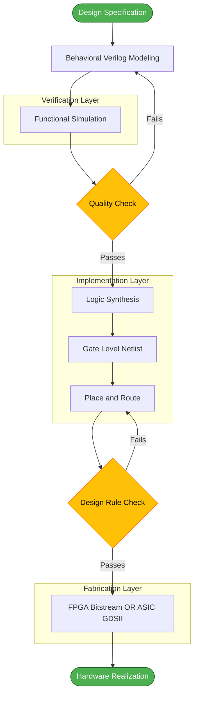
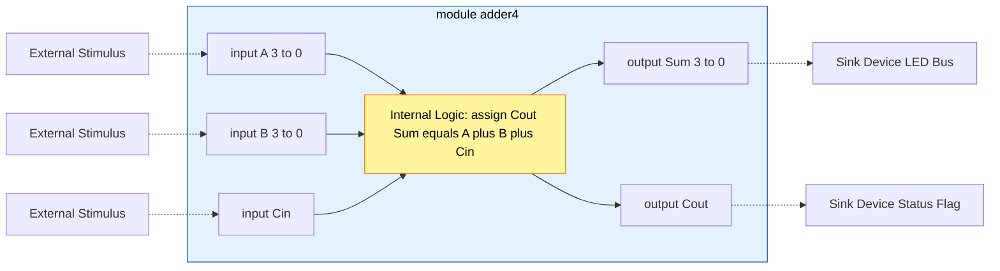
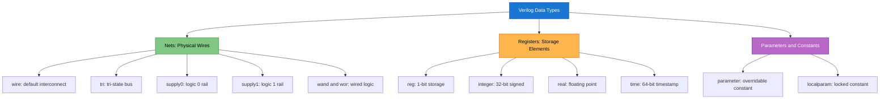
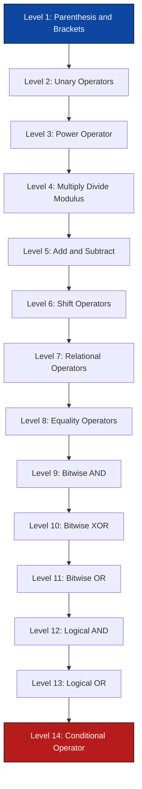

# Modern digital design flow - Verilog constructs: data types, the module, Verilog operators.

<!-- SECTION_1_START -->
# Digital Electronics & Logic Design — Module 1
## Topic: Modern Digital Design Flow & Verilog HDL Constructs

> [!IMPORTANT]
> **KTU 2024 Scheme Focus (GAEST305)**
> This topic bridges the gap between **classical Boolean design** and **modern Hardware Description Language (HDL) based design**. It is the foundation for Modules 2, 3, and 4 of the syllabus, where Verilog is used to model combinational and sequential circuits.

---

### 1.1 Modern Digital Design Flow — Formal Definition

The **Modern Digital Design Flow** is a structured, computer-aided engineering methodology that automates the specification, simulation, synthesis, and physical realization of digital integrated circuits using Hardware Description Languages (HDLs) such as **Verilog HDL** and **VHDL**.

> [!NOTE]
> **Academic Definition (KTU Syllabus Aligned)**
> A *design flow* is a sequence of well-defined stages — **Specification → HDL Modeling → Functional Simulation → Logic Synthesis → Place & Route → Timing Analysis → Fabrication/FPGA Implementation** — that transforms an abstract behavioral idea into a gate-level hardware realization.

### 1.2 Intuitive Analogy — "The Architectural Blueprint"

Think of designing a digital chip like **constructing a skyscraper**:

| Design Stage | Real-World Analogy | Engineering Output |
|--------------|--------------------|--------------------|
| **Specification** | Client brief ("I need a 10-floor building") | Natural language + block diagram |
| **HDL Modeling** | Architect's drawing (Verilog code) | `.v` source file |
| **Functional Simulation** | 3D walkthrough on computer | Waveform (`.vcd`) file |
| **Logic Synthesis** | Final structural blueprint | Gate-level netlist (`.net`) |
| **Place & Route** | Construction layout on plot | Layout (`.gdsii`) |
| **Fabrication / FPGA** | Actual building | Working silicon / FPGA bitstream |

> [!IMPORTANT]
> The student must remember that **Verilog is NOT a programming language** — it is a *hardware description language*. Every `always` or `assign` block describes **hardware that exists in parallel**, not sequential software instructions.

### 1.3 Why Verilog? The Industry Standard

Verilog (originally **Verilog HDL**, standardized as **IEEE 1364-2001 / 2005**) is the dominant HDL used in:

* **ASIC Design** — Synopsys, Cadence toolchains
* **FPGA Design** — Xilinx Vivado, Intel Quartus
* **Verification** — Universal Verification Methodology (UVM)

> [!VISUALIZATION CONTROL]
> **Concept:** Hardware vs Software Mental Model
> **Visualization:** A `C` program runs **one line at a time** on a CPU. A Verilog `module` describes **all gates running simultaneously** on silicon. The student should imagine thousands of transistors switching in parallel, not a sequential fetch-decode-execute loop.
> **Key Insight:** Concurrency in Verilog = Concurrency in real hardware.

---

<!-- SECTION_1_END -->

<!-- SECTION_2_START -->
# 2. Deep Theoretical Analysis — Verilog Constructs

## 2.1 Anatomy of a Verilog Module

Every Verilog design file is built around the `module` keyword. The skeleton is:

```verilog
module <module_name> (<port_list>);
    // Declarations
    // Body
endmodule
```

### 2.1.1 Port Directions

| Direction | Keyword | Meaning | Hardware Equivalent |
|-----------|---------|---------|---------------------|
| **Input**  | `input`  | Data flows **into** the module | Driver pin (e.g., switch) |
| **Output** | `output` | Data flows **out** of the module | LED pin, output pad |
| **Inout**  | `inout`  | **Bidirectional** data flow | Bus pin (e.g., $I^2C$ SDA line) |

> [!NOTE]
> **Port Width Declaration** — Ports can be single-bit (`input a;`) or multi-bit vectors (`input [3:0] a;`). The bit-ordering `[3:0]` means bit 3 is the **MSB** (Most Significant Bit) and bit 0 is the **LSB**.

## 2.2 Lexical Conventions — The Building Blocks

A Verilog file contains four primary lexical tokens:

1. **White space** — spaces, tabs, newlines (ignored by compiler)
2. **Comments** — `// single line` and `/* multi-line */`
3. **Operators** — symbols such as `+`, `&`, `<<`, `?:`
4. **Numbers** — `<size>'<base><value>`

> [!IMPORTANT]
> **Number Format:** A Verilog literal is written as `8'b1010_0101`, which means:
> * `8` → **8 bits** wide
> * `'b` → **binary** base
> * `1010_0101` → value (underscore is for readability only)
> Allowed bases: `'b` (binary), `'o` (octal), `'d` (decimal), `'h` (hexadecimal).
> Example: `12'hFA3` = 12-bit hexadecimal value $FA3_{16}$.

## 2.3 Verilog Data Types — The Core Taxonomy

### 2.3.1 Nets (Physical Connections)

**Nets** represent **physical wires** connecting hardware elements. They must be driven continuously (cannot store a value).

| Net Type | Function | Default Value |
|----------|----------|---------------|
| `wire`   | Standard interconnection wire | `z` (high-impedance) |
| `tri`    | Tri-state wire (same as `wire`, used in bus logic) | `z` |
| `supply0`| Models **logic 0** power rail (VSS/GND) | `0` |
| `supply1`| Models **logic 1** power rail (VDD) | `1` |
| `wand`   | Wired-AND (open-collector bus) | `x` |
| `wor`    | Wired-OR (open-collector bus) | `x` |

> [!NOTE]
> **Four-Valued Logic System:** Every Verilog variable carries one of four values: `0`, `1`, `x` (**unknown**), or `z` (**high-impedance**). The `x` and `z` values are **essential for simulation** but are mapped to either `0` or `1` during real silicon synthesis.

### 2.3.2 Registers (Storage Elements)

**Registers** retain their value until explicitly reassigned. They are used in `always` blocks, `initial` blocks, functions, and tasks.

| Register Type | Default Width | Purpose |
|---------------|---------------|---------|
| `reg`         | 1 bit         | Single storage element (a flip-flop or latch in hardware) |
| `integer`     | 32 bits       | Signed whole numbers (loop counters) |
| `real`        | 64 bits       | Floating-point (simulation only) |
| `time`        | 64 bits       | Simulation time tracking |
| `realtime`    | 64 bits       | Real-time (real number) for delays |

> [!WARNING]
> **Common Misconception:** A `reg` in Verilog does **NOT always synthesize to a flip-flop**. If used inside a **combinational `always @(*)`** block, it becomes **combinational logic**. It only becomes a **flip-flop** when used inside a **clocked `always @(posedge clk)`** block.

### 2.3.3 Parameters & Localparams

* **`parameter`** — compile-time constant that can be **overridden** during module instantiation.
* **`localparam`** — compile-time constant that **cannot be overridden** (used for state encoding).

```verilog
parameter WIDTH = 8;     // Can be overridden
localparam STATES = 4;   // Cannot be overridden
```

### 2.3.4 Vectors and Memories

* **Vector** — Multi-bit signal: `reg [7:0] data_bus;`
* **Memory (Array of registers)** — Indexed collection: `reg [7:0] rom_mem [0:255];` (256 bytes of 8-bit memory).

## 2.4 Verilog Operators — Complete Reference

### 2.4.1 Arithmetic Operators

| Operator | Operation | Example |
|----------|-----------|---------|
| `+` | Addition | $A + B$ |
| `-` | Subtraction | $A - B$ |
| `*` | Multiplication | $A \times B$ |
| `/` | Division (integer) | $A \div B$ |
| `%` | Modulus | $A \bmod B$ |

### 2.4.2 Bitwise vs Reduction — The Critical Distinction

* **Bitwise** operators operate on **corresponding bits** of two operands:
  `A & B` → ANDs bit 0 of A with bit 0 of B, bit 1 with bit 1, etc.
* **Reduction** operators operate on **all bits of a single operand**, producing a 1-bit result:
  `&A` → ANDs **all bits of A together** into a single bit.

| Operator | Bitwise (2 operands) | Reduction (1 operand) |
|----------|----------------------|------------------------|
| AND      | `&`                  | `&` (unary)            |
| OR       | $\vert$              | `~&`, `~` pipe reduction |
| XOR      | `^`                  | `^` (unary)            |

### 2.4.3 Shift Operators

| Operator | Type | Vacated Bit Position |
|----------|------|----------------------|
| `<<`  | Logical Left Shift  | Filled with `0` |
| `>>`  | Logical Right Shift | Filled with `0` |
| `<<<` | Arithmetic Left Shift | Filled with `0` |
| `>>>` | Arithmetic Right Shift | Filled with sign bit |

### 2.4.4 Equality Operators — Four vs Two Valued

| Operator | Operation | `x` and `z` Handling |
|----------|-----------|----------------------|
| `==`  | Logical equality | `x` and `z` cause result to be `x` |
| `!=`  | Logical inequality | `x` and `z` cause result to be `x` |
| `===` | Case equality | **Bit-by-bit compare including `x` and `z`** |
| `!==` | Case inequality | **Bit-by-bit compare including `x` and `z`** |

> [!NOTE]
> **Synthesis Restriction:** The `===` and `!==` operators are **non-synthesizable** and used **only in simulation testbenches**. The `==` and `!=` operators are the ones used in real RTL design.

## 2.5 KTU Formula Sheet — Operator Precedence

| Precedence | Operators | Associativity |
|------------|-----------|---------------|
| 1 (Highest) | `()` `[]` `.` | Left to Right |
| 2 | Unary `+ - ! ~ & ~& ~\| ^ ~^` | Right to Left |
| 3 | Power `**` | Left to Right |
| 4 | `* / %` | Left to Right |
| 5 | `+ -` | Left to Right |
| 6 | `<< >> <<< >>>` | Left to Right |
| 7 | `< <= > >=` | Left to Right |
| 8 | `== != === !==` | Left to Right |
| 9 | `& ~&` | Left to Right |
| 10 | `^ ~^ ^~` | Left to Right |
| 11 | $\vert$ `~|` | Left to Right |
| 12 | `&&` | Left to Right |
| 13 | `||` | Left to Right |
| 14 (Lowest) | `?:` | Right to Left |

> [!IMPORTANT]
> **Engineering Utility:** In ASIC design, operators like `**` (power) are **non-synthesizable** in most tools. Designers replace them with explicit multiplication or pre-computed constants. Operator precedence directly affects synthesis optimization — incorrect grouping leads to **larger area** and **slower timing**.

---

<!-- SECTION_2_END -->

<!-- SECTION_3_START -->
# 3. Step-by-Step Derivations, Code & Worked Examples

## 3.1 Worked Example 1 — Building a 4-Bit Adder Module (Full Code)

The objective is to model a 4-bit ripple carry adder using Verilog **dataflow** style.

```verilog
// File: adder4.v
// Description: 4-bit ripple carry adder using dataflow modeling
// Course: GAEST305 - KTU 2024 Scheme
module adder4 (
    input  [3:0] A,        // 4-bit input A
    input  [3:0] B,        // 4-bit input B
    input        Cin,      // 1-bit carry-in
    output [3:0] Sum,      // 4-bit sum output
    output       Cout      // 1-bit carry-out
);
    // Dataflow modeling using continuous assignment
    assign {Cout, Sum} = A + B + Cin;

endmodule
```

> [!IMPORTANT]
> **Line-by-Line Explanation:**
> * `module adder4 (...)` — Module declaration with port list.
> * `input [3:0] A` — Declares A as a 4-bit **input vector** (data type defaults to `wire` for input).
> * `output [3:0] Sum` — Declares Sum as a 4-bit **output vector**.
> * `assign {Cout, Sum} = A + B + Cin;` — **Continuous assignment**: the RHS expression is continuously evaluated and the LHS is driven. The `{Cout, Sum}` is a **concatenation operator** that joins a 1-bit and a 4-bit signal into a 5-bit result to capture overflow.

## 3.2 Worked Example 2 — Tracing the Reduction Operator

**Problem:** Evaluate `& 4'b1010` step by step.

The reduction AND `&` is a **unary operator** that ANDs all 4 bits together:

$$\begin{aligned}
\text{Expression: } &\verb|& 4'b1010| \\
\text{Bit 0 AND Bit 1 AND Bit 2 AND Bit 3} &= 1 \;\&\; 0 \;\&\; 1 \;\&\; 0 \\
\text{Step 1: } 1 \;\&\; 0 &= 0 \\
\text{Step 2: } 0 \;\&\; 1 &= 0 \\
\text{Step 3: } 0 \;\&\; 0 &= 0 \\
\text{Final Result: } &\verb|1'b0|
\end{aligned}$$

**Engineering Insight:** The reduction AND `&` is widely used to check **parity** and to verify if **all bits of a bus are zero** (used in FIFO empty logic).

## 3.3 Worked Example 3 — Shift Operator Application

**Problem:** Evaluate `8'b1100_0011 >> 2` step by step.

$$\begin{aligned}
\text{Original value: } &\verb|8'b1100_0011| \\
\text{Shift right by 2: } &\text{Each bit moves 2 positions to the right} \\
\text{Vacated MSB positions: } &\text{Filled with } \verb|0| \text{ (logical shift)} \\
\text{Result: } &\verb|8'b0011_0000| \\
\text{Decimal equivalent: } &192 \div 4 = 48
\end{aligned}$$

> [!NOTE]
> **Application:** A right shift by $n$ is equivalent to integer division by $2^n$. Synthesis tools automatically optimize `>> 2` into a **rewiring of bit positions**, which is free in hardware (no gate delay).

## 3.4 Worked Example 4 — Complete Testbench (Simulation)

```verilog
// File: tb_adder4.v
// Description: Testbench for the 4-bit adder
`timescale 1ns/1ps

module tb_adder4;
    reg  [3:0] A, B;
    reg        Cin;
    wire [3:0] Sum;
    wire       Cout;

    // Module instantiation
    adder4 uut (
        .A(A),
        .B(B),
        .Cin(Cin),
        .Sum(Sum),
        .Cout(Cout)
    );

    initial begin
        $dumpfile("adder4.vcd");
        $dumpvars(0, tb_adder4);

        // Test 1: 5 + 7 = 12 (no carry)
        A = 4'd5;  B = 4'd7;  Cin = 1'b0;
        #10;
        $display("Time=%0t  A=%d B=%d Cin=%b  Sum=%d Cout=%b",
                 $time, A, B, Cin, Sum, Cout);

        // Test 2: 9 + 8 = 17 (Sum=0001, Cout=1)
        A = 4'd9;  B = 4'd8;  Cin = 1'b0;
        #10;
        $display("Time=%0t  A=%d B=%d Cin=%b  Sum=%d Cout=%b",
                 $time, A, B, Cin, Sum, Cout);

        // Test 3: 15 + 15 + 1 = 31 (Full overflow, Cout=1, Sum=1111)
        A = 4'd15; B = 4'd15; Cin = 1'b1;
        #10;
        $display("Time=%0t  A=%d B=%d Cin=%b  Sum=%d Cout=%b",
                 $time, A, B, Cin, Sum, Cout);

        $finish;
    end
endmodule
```

> [!IMPORTANT]
> **Note on the Testbench:**
> * The testbench is a **non-synthesizable** module — it has **no ports** and contains an `initial` block.
> * `reg` is used for **stimulus** (driven by procedural assignment).
> * `wire` is used for **observation** (driven by the DUT — Device Under Test).
> * The `#10` introduces a **10 ns delay**, allowing the simulator to advance time.

## 3.5 Worked Example 5 — Verifying Operator Precedence

**Problem:** Evaluate `4'b1000 & 4'b0011 + 4'b0001` step by step.

According to the precedence table, `+` (precedence 5) is **higher** than `&` (precedence 9). So the expression is parsed as:

$$\begin{aligned}
\text{Original: } &\verb|4'b1000 & 4'b0011 + 4'b0001| \\
\text{Step 1 (Apply higher precedence first): } &\verb|4'b1000 & (4'b0011 + 4'b0001)| \\
\text{Step 2 (Evaluate addition): } &\verb|4'b0011 + 4'b0001 = 4'b0100| \\
\text{Step 3 (Evaluate bitwise AND): } &\verb|4'b1000 & 4'b0100| \\
\text{Step 4 (Bit-by-bit AND): } & \begin{array}{cccc} 1 & 0 & 0 & 0 \\ \& & \& & \& & \& \\ 0 & 1 & 0 & 0 \end{array} \\
\text{Final Result: } &\verb|4'b0000|
\end{aligned}$$

> [!WARNING]
> **Common Pitfall:** Students frequently forget that **`+` binds tighter than `&`**. Without parentheses, the synthesis tool will silently produce the wrong circuit. **Always use parentheses** to make intent explicit.

## 3.6 Worked Example 6 — Python Equivalent (For Concept Clarity)

To help students who are familiar with Python, here is the **exact logical equivalent** of a Verilog reduction OR operation:

```python
def reduction_or(bits: list[int]) -> int:
    """
    Mimics Verilog's unary '|' (reduction OR) operator.
    Returns 1 if ANY bit is 1, else 0.
    """
    if not bits:
        raise ValueError("Input bit-vector cannot be empty")
    result = 0
    for b in bits:
        if b not in (0, 1):
            raise ValueError(f"Invalid bit value: {b} (must be 0 or 1)")
        result |= b
    return result


# Test case matching 4'b1010
test_vector = [1, 0, 1, 0]
output_bit = reduction_or(test_vector)
print(f"|4'b{''.join(map(str, test_vector))} = 1'b{output_bit}")
# Output: |4'b1010 = 1'b1
```

> [!NOTE]
> **Why this matters:** In Python, the loop runs **sequentially**. In Verilog, the reduction OR is a **single combinational gate** that computes the result in one logic level (typically 1 gate delay). This contrast highlights the **parallel hardware nature** of HDLs.

---

<!-- SECTION_3_END -->

<!-- SECTION_4_START -->
# 4. Structural Diagrams & Schematics

## 4.1 Modern Digital Design Flow — End-to-End Pipeline

> [!IMPORTANT]
> **Mermaid Safety Note:** All node IDs are alphanumeric (e.g., `step1`, `step2`) and labels are double-quoted plain text. No markdown formatting is used inside labels.



## 4.2 Verilog Module Structure — Architectural Block Diagram



## 4.3 Verilog Data Type Classification — Topological Matrix



## 4.4 Operator Precedence Pyramid — Sequential Processing Topology



---

<!-- SECTION_4_END -->

<!-- SECTION_5_START -->
# 5. KTU 2024 Scheme Examination Question Bank & Topic Recap

## 5.1 Part A Questions (3 Marks Each)

> **Q1.** `[KTU University Exam — Dec 2023]` — **CO1, Remember**
> **Differentiate between `wire` and `reg` data types in Verilog with an example.**

**Model Answer:**

| Feature | `wire` | `reg` |
|---------|--------|-------|
| **Storage** | Does NOT store a value (must be driven) | Stores a value until reassigned |
| **Driver** | Driven by `assign`, gate output, or port | Driven inside `always`/`initial` blocks |
| **Default** | Default for ports and nets | Default for variables inside procedural blocks |
| **Hardware** | Represents a physical wire | Represents a flip-flop (clocked) or combinational logic |

```verilog
wire  a;          // Physical wire connection
reg   q;          // Storage element (flip-flop in clocked always)
```

> **Q2.** `[KTU University Exam — July 2024]` — **CO1, Understand**
> **Explain the difference between the bitwise AND (`&`) and the reduction AND (`&`) operators in Verilog. Give one example of each.**

**Model Answer:**
The **bitwise AND** `&` operates on **two operands** and performs AND on each pair of corresponding bits. The **reduction AND** `&` operates on a **single operand** and ANDs all its bits together, producing a 1-bit result.

| Operator | Syntax | Example | Result |
|----------|--------|---------|--------|
| Bitwise AND | `A & B` | `4'b1010 & 4'b1100` | `4'b1000` |
| Reduction AND | `&A` | `&4'b1010` | `1'b0` (since not all bits are 1) |

The reduction AND is commonly used to **check if all bits of a bus are high** (e.g., in a parity checker).

---

## 5.2 Part B Questions (14 Marks) — Module Internal Choice

> **Q3A.** `[KTU University Exam — June 2024]` — **CO1, Apply (7M) + Analyze (7M)**
> **(a)** [7 Marks — Understand/Apply] Write a Verilog **dataflow model** for a **2-to-4 decoder** with active-HIGH outputs. The module should have inputs `A`, `B` (select lines) and an active-LOW enable `En_n`. Use `assign` statements and the conditional `?:` operator.

### Model Solution (Q3A Part a)

The truth table of a 2-to-4 decoder with active-LOW enable is:

| En_n | A | B | Y0 | Y1 | Y2 | Y3 |
|------|---|---|----|----|----|----|
| 0    | 0 | 0 | 1  | 0  | 0  | 0  |
| 0    | 0 | 1 | 0  | 1  | 0  | 0  |
| 0    | 1 | 0 | 0  | 0  | 1  | 0  |
| 0    | 1 | 1 | 0  | 0  | 0  | 1  |
| 1    | X | X | 0  | 0  | 0  | 0  |

**Verilog Code:**

```verilog
module decoder2to4 (
    input  A, B,
    input  En_n,
    output Y0, Y1, Y2, Y3
);
    assign Y0 = (!En_n) ? ((!A && !B) ? 1'b1 : 1'b0) : 1'b0;
    assign Y1 = (!En_n) ? ((!A &&  B) ? 1'b1 : 1'b0) : 1'b0;
    assign Y2 = (!En_n) ? (( A && !B) ? 1'b1 : 1'b0) : 1'b0;
    assign Y3 = (!En_n) ? (( A &&  B) ? 1'b1 : 1'b0) : 1'b0;
endmodule
```

**[Valuation Key Points]**
* [Correct module declaration with port list: 1 Mark]
* [Correct use of conditional operator `?:`: 2 Marks]
* [Logic expressions matching truth table for all 4 outputs: 2 Marks]
* [Active-LOW enable logic implemented: 1 Mark]
* [Verilog syntax correctness: 1 Mark]

### Model Solution (Q3A Part b)

> **(b)** [7 Marks — Apply/Analyze] Write a Verilog **testbench** to verify the decoder. Generate all 8 combinations of `En_n`, `A`, `B` using a `$monitor` statement. Show the expected output for the first 2 input combinations.

**Testbench Code:**

```verilog
`timescale 1ns/1ps

module tb_decoder2to4;
    reg  A, B, En_n;
    wire Y0, Y1, Y2, Y3;

    // Instantiate the DUT
    decoder2to4 uut (
        .A(A), .B(B), .En_n(En_n),
        .Y0(Y0), .Y1(Y1), .Y2(Y2), .Y3(Y3)
    );

    initial begin
        $monitor("Time=%0t  En_n=%b A=%b B=%b | Y0=%b Y1=%b Y2=%b Y3=%b",
                 $time, En_n, A, B, Y0, Y1, Y2, Y3);

        // Combination 1: En_n=0, A=0, B=0 → Y0 should be 1
        En_n = 1'b0; A = 1'b0; B = 1'b0;
        #10;

        // Combination 2: En_n=0, A=0, B=1 → Y1 should be 1
        En_n = 1'b0; A = 1'b0; B = 1'b1;
        #10;

        $finish;
    end
endmodule
```

**Expected Output:**
```
Time=0  En_n=0 A=0 B=0 | Y0=1 Y1=0 Y2=0 Y3=0
Time=10 En_n=0 A=0 B=1 | Y0=0 Y1=1 Y2=0 Y3=0
```

**[Valuation Key Points]**
* [Correct testbench module with no ports: 1 Mark]
* [Correct instantiation of DUT using named ports: 2 Marks]
* [`$monitor` or `$display` correctly placed: 2 Marks]
* [Correct stimulus generation and expected output: 2 Marks]

---

> **Q3B.** `[KTU University Exam — June 2024]` — **CO1, Apply (7M) + Analyze (7M)** — **Internal Choice**
> **(a)** [7 Marks — Understand/Apply] Explain the **four-valued logic system** of Verilog with a truth table. How does the `===` (case equality) operator differ from the `==` (logical equality) operator in handling `x` and `z`?

### Model Solution (Q3B Part a)

**The Four-Valued Logic System:**

| Value | Symbol | Meaning |
|-------|--------|---------|
| **Logic 0** | `0` | Low voltage (GND) |
| **Logic 1** | `1` | High voltage (VDD) |
| **Unknown** | `x` | Conflict between 0 and 1, or uninitialized |
| **High-Impedance** | `z` | Disconnected (no driver) |

**Comparison Table for `==` vs `===`:**

| Operand A | Operand B | `A == B` | `A === B` |
|-----------|-----------|----------|-----------|
| `1`       | `1`       | `1`      | `1`       |
| `1`       | `0`       | `0`      | `0`       |
| `1`       | `x`       | `x`      | `0`       |
| `1`       | `z`       | `x`      | `0`       |
| `x`       | `x`       | `x`      | `1`       |
| `z`       | `z`       | `x`      | `1`       |

**Conclusion:** The `===` operator performs **exact bit-by-bit comparison** and is therefore the only way to compare for `x` and `z`. The `==` operator returns `x` whenever any operand bit is `x` or `z`, making it **non-deterministic** in such cases. The `===` is **non-synthesizable** and used only in testbenches.

**[Valuation Key Points]**
* [Correct four-valued logic symbols: 2 Marks]
* [Truth table for `==` with 6 rows: 2 Marks]
* [Truth table for `===` with 6 rows: 2 Marks]
* [Conclusion on synthesis: 1 Mark]

### Model Solution (Q3B Part b)

> **(b)** [7 Marks — Apply/Analyze] Write a Verilog module that uses the **reduction XOR (`^`)** operator to compute the **even parity bit** of an 8-bit data input `D[7:0]`. Provide the complete RTL code with a brief explanation of how the parity bit is generated.

**Verilog Code:**

```verilog
// File: parity_gen.v
// Description: 8-bit even parity generator using reduction XOR
module parity_gen (
    input  [7:0] D,        // 8-bit data input
    output       P         // Even parity bit
);
    // Reduction XOR: XORs all 8 bits of D
    // Result is 0 when even number of 1s (even parity)
    // Result is 1 when odd number of 1s
    // We invert for even parity generation
    assign P = ^D;
endmodule
```

**Explanation of Logic:**

The **reduction XOR (`^`)** operator XORs all 8 bits of `D` together:
* If the number of `1`s in `D` is **even**, the reduction XOR result is `0`.
* If the number of `1`s in `D` is **odd**, the reduction XOR result is `1`.

**Truth Table Example:**

| $D_7 D_6 D_5 D_4 D_3 D_2 D_1 D_0$ | Number of 1s | `^D` (Parity P) |
|-----------------------------------|--------------|------------------|
| `0000_0000` | 0 (even) | `0` |
| `0000_0001` | 1 (odd)  | `1` |
| `1010_1010` | 4 (even) | `0` |
| `1111_1111` | 8 (even) | `0` |

**Engineering Application:** This is the **core circuit of UART transmitters and serial communication protocols** where parity bits are appended to data bytes for **error detection**.

**[Valuation Key Points]**
* [Correct module declaration: 1 Mark]
* [Correct use of reduction XOR `^D`: 3 Marks]
* [Brief explanation of even parity logic: 2 Marks]
* [Verilog syntax correctness: 1 Mark]

---

> [!WARNING]
> **KTU Examiner's Valuation Warning — Common Pitfalls**
> 1. **Forgetting `reg` for stimulus in testbench:** Stimulus signals must be declared `reg`, not `wire`. Failing this is an instant **-1 Mark** deduction.
> 2. **Confusing `=` (blocking) and `<=` (non-blocking) in `always` blocks:** Use `<=` for sequential logic and `=` for combinational logic. Mixing them is a **frequent 2-Mark deduction**.
> 3. **Using `===` inside synthesizable RTL code:** This is **not supported by synthesis tools** and the student will lose marks. Use `===` only in testbenches.
> 4. **Omitting `endmodule`:** A very common error. Always verify the module is closed.
> 5. **Wrong bit-ordering:** Writing `input [0:3]` instead of `input [3:0]` reverses the MSB/LSB. The bit on the **left is always the MSB**.

---

## 5.3 Topic Recap & Important Things to Remember

* **Verilog = Hardware Description Language**, not a programming language. Every `always`/`assign` block represents **real, parallel hardware**.
* The **four-valued logic** system uses `0`, `1`, `x` (unknown), and `z` (high-impedance).
* **`wire`** is a **net** (no storage); **`reg`** is a **storage element** (used in procedural blocks).
* A `reg` only becomes a **flip-flop** when assigned inside a **clocked `always @(posedge clk)`** block; otherwise, it is combinational logic.
* **Port directions:** `input` (into module), `output` (out of module), `inout` (bidirectional bus).
* **Module skeleton:** `module name(port_list); ... endmodule`.
* **Numbers** are written as `<size>'<base><value>`, e.g., `8'b1010_0101`.
* **Operators** are grouped by precedence — `+` binds **tighter** than `&` and `|`.
* **Bitwise** operators compare corresponding bits of **two** operands; **Reduction** operators collapse **one** operand into a single bit.
* **Equality operators:** `==` (logical, returns `x` on unknowns) vs `===` (case, compares `x`/`z` exactly, **non-synthesizable**).
* **Shift operators:** `<<` (logical left), `>>` (logical right), `<<<` (arithmetic left), `>>>` (arithmetic right, sign-extended).
* **Concatenation `{ }`** joins signals; **Replication `{n{ }}`** repeats a signal $n$ times.
* **`parameter`** is overridable during instantiation; **`localparam`** is locked.
* **Design flow stages:** Specification → HDL Modeling → Functional Simulation → Synthesis → Place & Route → FPGA/ASIC.
* **Synthesis restriction:** `**` (power), `/` and `%` (with variable divisors), and `===`/`!==` are typically **non-synthesizable**.
* **Testbench signals:** Stimulus = `reg`; Observation = `wire`. Use `$monitor`, `$display`, `$dumpfile`, `$dumpvars` for waveform generation.

<!-- SECTION_5_END -->
