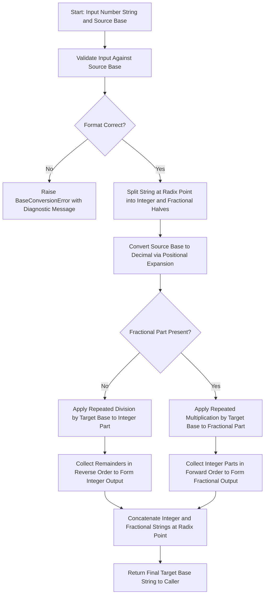
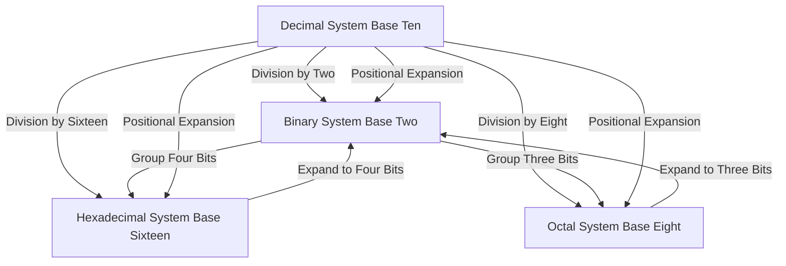
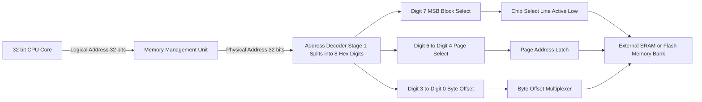

# Number Systems – Binary, Hexadecimal, grouping bits, Base conversion

<!-- SECTION_1_START -->

# Number Systems — Binary, Hexadecimal, Bit Grouping & Base Conversion

## 1.1 Formal Academic Definition (KTU 2024 Syllabus Terminology)

> [!NOTE]
> **Number System (KTU 2024 — GAEST305, Module 1):**
> A **positional number system** is a mathematical notation for representing numbers using a fixed *radix* (base) $r$ and a finite set of *digit symbols* $\{0, 1, \dots, r-1\}$. The *value* of a digit depends on both its symbol and its **positional weight** $r^k$, where $k$ is the position index counted from the radix point.

In Digital Electronics, the three most important positional systems are:

| System | Base $r$ | Digit Set | Typical Use in DELD |
| :--- | :---: | :--- | :--- |
| **Binary (BIN)** | $2$ | $\{0, 1\}$ | Internal representation of all digital hardware |
| **Octal (OCT)** | $8$ | $\{0, 1, 2, 3, 4, 5, 6, 7\}$ | Compact shorthand for 3-bit binary groups |
| **Decimal (DEC)** | $10$ | $\{0, \dots, 9\}$ | Human interface, displays, datasheets |
| **Hexadecimal (HEX)** | $16$ | $\{0, \dots, 9, \text{A}, \text{B}, \text{C}, \text{D}, \text{E}, \text{F}\}$ | Compact shorthand for 4-bit binary groups (nibbles) |

For any real number $N$, the general expansion is:

$$
N = \sum_{k=-m}^{n-1} d_k \, r^{\,k}
$$

where $d_k$ is the digit at position $k$, $n$ is the number of integer digits, and $m$ is the number of fractional digits.

## 1.2 Conceptual Analogy & Intuition

> [!IMPORTANT]
> **Intuition: The "Odometer of Bases"**
> Imagine an odometer that rolls over not at $10$ (decimal) but at $r$. Each wheel represents a position with weight $r^k$.
> - **Decimal odometer**: rolls over at $9 \rightarrow 10$ (we add a new wheel).
> - **Binary odometer**: rolls over at $1 \rightarrow 10$ (because digits are only $0$ or $1$).
> - **Hex odometer**: rolls over at $\text{F} \rightarrow 10$ (digits go $0$–$9$, then $A$–$F$).
> This rolling-over rule is exactly what powers **successive division by $r$** in base conversion.

**Geometric Intuition (Why positional weights work):**
A positional number is a recipe: each digit is *how many copies* of a "weight-coin" (a power of $r$) to include. For example, $137_{10}$ means *one $10^2$ coin, three $10^1$ coins, and seven $10^0$ coins*. Changing the base just changes the denomination of the coins.

## 1.3 Standard Reference Constants for KTU Board Exams

> [!NOTE]
> **Memorize these for instant marks in ESE:**
> - $2^{10} = 1024 \approx 10^3$ (the **Kibi** vs **Kilo** distinction: $1 \,\text{KiB} = 1024 \,\text{B}$, $1 \,\text{kB} = 1000 \,\text{B}$).
> - $2^{4} = 16$ — exactly the size of **one hexadecimal digit (1 nibble)**.
> - $2^{3} = 8$ — exactly the size of **one octal digit**.
> - $2^{8} = 256$ — the range of an **8-bit unsigned byte** ($0$–$255$).

## 1.4 Bit-Grouping Nomenclature (KTU Favourite)

Digital memory is inherently binary, so engineers group bits into fixed chunks for human readability:

| Group | Size | Name | HEX Equivalent |
| :--- | :---: | :--- | :--- |
| $1$ bit | $1$ | **bit** | — |
| $4$ bits | $4$ | **nibble** | $1$ HEX digit |
| $8$ bits | $8$ | **byte** | $2$ HEX digits |
| $16$ bits | $16$ | **word** | $4$ HEX digits |
| $32$ bits | $32$ | **double word** | $8$ HEX digits |

> [!TIP]
> **Why hexadecimal dominates over octal in modern computing:** Because modern architectures (8086, ARM, MIPS, RISC-V) are built around $4$-bit, $8$-bit, $16$-bit, $32$-bit, and $64$-bit chunks — all of which are *integer multiples of $4$ bits*. HEX aligns perfectly with the byte, whereas octal ($3$ bits) does not.

<!-- SECTION_1_END -->

<!-- SECTION_2_START -->

# Deep Theoretical Analysis & KTU High-Yield Formula Sheet

## 2.1 The Operational Logic of Base-$r$ Conversion

Every base conversion in this module is built on **two primitives**:

1. **Positional Expansion (any base $\to$ decimal):**
   Multiply each digit by its weight $r^{k}$ and sum.
2. **Successive Division / Multiplication (decimal $\to$ any base):**
   - Integer part: divide by $r$ repeatedly; **read remainders bottom-up**.
   - Fractional part: multiply by $r$ repeatedly; **read integers top-down**.

## 2.2 KTU Formula Cheat Sheet (Use During ESE)

> [!IMPORTANT]
> Use `\vert` (not `\mid`, not the raw `|`) inside markdown table cells to keep the table parsable.

| Operation | Formula / Rule | Boundary Conditions | Engineering Utility |
| :--- | :--- | :--- | :--- |
| **BIN $\to$ DEC** | $N_{10} = \sum d_k \cdot 2^{k}$ | $d_k \in \{0,1\}$, $k$ from $0$ (LSB) | Firmware debugging, register dumps |
| **DEC $\to$ BIN** | Repeatedly $N \div 2$, record remainders | Stop when quotient is $0$ | Compilers, constant folding |
| **DEC $\to$ HEX** | Repeatedly $N \div 16$, map rem. $\geq 10$ to A–F | Stop when quotient is $0$ | Memory-mapped I/O addresses |
| **HEX $\to$ DEC** | $N_{10} = \sum h_k \cdot 16^{k}$ | $h_k \in \{0..9, A..F\}$ | Color codes (e.g. `#FF8800`), MAC addresses |
| **BIN $\to$ HEX** | Group $4$ bits from the radix point outward; pad with $0$s at extremes | Pad the **MSB side** with $0$s if needed | Most common operation in KTU labs |
| **HEX $\to$ BIN** | Expand each HEX digit to its $4$-bit binary equivalent | Always output exactly $4$ bits per digit | Firmware bitmask construction |
| **BIN $\to$ OCT** | Group $3$ bits from the radix point outward | Pad MSB side with $0$s | Legacy Unix file permissions (`chmod 755`) |
| **OCT $\to$ BIN** | Expand each octal digit to its $3$-bit binary equivalent | Always output exactly $3$ bits per digit | Legacy PDP-11 instruction encoding |
| **Range of unsigned $n$-bit number** | $0$ to $2^{n}-1$ | $n \geq 1$ | Determining ADC resolution |
| **Range of signed $n$-bit 2's complement** | $-2^{n-1}$ to $2^{n-1}-1$ | MSB is the sign bit | CPU ALU overflow detection |
| **Highest HEX digit from $n$ bits** | $2^{\,\lceil n/4 \rceil}$ in HEX | $\lceil \cdot \rceil$ = ceiling | Memory address width estimation |
| **$n$ bits = how many HEX digits** | $\lceil n / 4 \rceil$ digits | e.g. $16$ bits = $4$ HEX digits | I²C, SPI, UART payload sizing |

## 2.3 Engineering Real-World Utility

- **Memory Addressing:** A $32$-bit CPU uses $8$ HEX digits (e.g., `0xDEADBEEF`) to address memory. KTU questions frequently ask: *"How many address lines are required to access $64\,\text{KB}$?"* — answer involves recognizing $64\,\text{KB} = 2^{16}$ bytes $\Rightarrow 16$ address lines.
- **IP / MAC Addresses:** IPv6 addresses are $128$ bits = $32$ HEX digits. MAC addresses are $48$ bits = $12$ HEX digits.
- **Embedded Register Maps:** Microcontroller datasheets (e.g., ATmega328, STM32) define peripheral registers in HEX. Bit-setting in C (`REG |= (1 << 3)`) is a binary operation conceptually tied back to HEX masks like `0x08`.
- **Image / Color Codes:** Web colors `#RRGGBB` are HEX triples for Red, Green, Blue (each $8$ bits).

## 2.4 The "Why" Behind Repeated Division

For a positive integer $N$ and target base $r$:

$$
N = q_1 \cdot r + d_0 \quad \Rightarrow \quad d_0 = N \bmod r
$$

$$
q_1 = q_2 \cdot r + d_1 \quad \Rightarrow \quad d_1 = q_1 \bmod r
$$

Continue until $q_k = 0$. The digits $d_{k-1} d_{k-2} \dots d_1 d_0$ form the result (MSB to LSB). This works because the **remainder of each division peels off exactly the LSB** of the target-base representation.

For fractions, multiplying by $r$ shifts the radix point left one place per step, so the integer part of the product is the next fractional digit.

<!-- SECTION_2_END -->

<!-- SECTION_3_START -->

# Step-by-Step Derivations, Conversions & Code Implementation

> [!IMPORTANT]
> **Exhaustive Mandate Active:** Every arithmetic step, every code line, and every conversion intermediate is written out in full. **No** "similarly we can find", **no** truncation, **no** "…" placeholders.

## 3.1 Worked Example 1 — Binary $\to$ Decimal

Convert $(110101.11)_2$ to decimal.

**Step 1 — Index every digit from the radix point.** Let the radix point be position $0$. Digits to the left have positive indices, to the right have negative indices.

```
Position k:  5   4   3   2   1   0  .  -1  -2
Digit d_k:   1   1   0   1   0   1  .   1   1
Weight 2^k: 32  16   8   4   2   1  . 1/2 1/4
```

**Step 2 — Apply the positional sum.**

$$
N_{10} = (1 \cdot 2^{5}) + (1 \cdot 2^{4}) + (0 \cdot 2^{3}) + (1 \cdot 2^{2}) + (0 \cdot 2^{1}) + (1 \cdot 2^{0}) + (1 \cdot 2^{-1}) + (1 \cdot 2^{-2})
$$

**Step 3 — Evaluate each term.**

$$
N_{10} = 32 + 16 + 0 + 4 + 0 + 1 + 0.5 + 0.25
$$

**Step 4 — Add.**

$$
N_{10} = 53.75_{10}
$$

> **Final Answer:** $\boxed{(110101.11)_2 = 53.75_{10}}$

## 3.2 Worked Example 2 — Decimal $\to$ Binary (Integer Part)

Convert $(53)_{10}$ to binary using **successive division by $2$**.

**Step 1 — Divide $53$ by $2$.**

$$
53 = 26 \cdot 2 + 1 \quad \Rightarrow \quad d_0 = 1
$$

**Step 2 — Divide the quotient $26$ by $2$.**

$$
26 = 13 \cdot 2 + 0 \quad \Rightarrow \quad d_1 = 0
$$

**Step 3 — Continue.**

$$
13 = 6 \cdot 2 + 1 \quad \Rightarrow \quad d_2 = 1
$$

$$
6 = 3 \cdot 2 + 0 \quad \Rightarrow \quad d_3 = 0
$$

$$
3 = 1 \cdot 2 + 1 \quad \Rightarrow \quad d_4 = 1
$$

$$
1 = 0 \cdot 2 + 1 \quad \Rightarrow \quad d_5 = 1
$$

**Step 4 — Read remainders from bottom (last remainder) to top (first remainder).**

| Step | Dividend | Quotient | Remainder (digit) |
| :---: | :---: | :---: | :---: |
| $1$ | $53$ | $26$ | $1$ (LSB) |
| $2$ | $26$ | $13$ | $0$ |
| $3$ | $13$ | $6$  | $1$ |
| $4$ | $6$  | $3$  | $0$ |
| $5$ | $3$  | $1$  | $1$ |
| $6$ | $1$  | $0$  | $1$ (MSB) |

> **Final Answer:** $\boxed{53_{10} = 110101_2}$ (matches the integer part of Example 1 — sanity check passes).

## 3.3 Worked Example 3 — Decimal Fraction $\to$ Binary

Convert $(0.625)_{10}$ to binary using **successive multiplication by $2$**.

**Step 1 — Multiply $0.625 \times 2$.**

$$
0.625 \times 2 = 1.250 \quad \Rightarrow \quad d_{-1} = 1, \quad \text{new fraction} = 0.250
$$

**Step 2 — Multiply $0.250 \times 2$.**

$$
0.250 \times 2 = 0.500 \quad \Rightarrow \quad d_{-2} = 0, \quad \text{new fraction} = 0.500
$$

**Step 3 — Multiply $0.500 \times 2$.**

$$
0.500 \times 2 = 1.000 \quad \Rightarrow \quad d_{-3} = 1, \quad \text{new fraction} = 0.000 \;\text{(STOP)}
$$

**Step 4 — Read digits from top (first) to bottom (last).**

$$
0.625_{10} = 0.101_2
$$

> **Sanity check from Example 1:** $0.11_2 = 0.5 + 0.25 = 0.75 \neq 0.625$. The discrepancy is because $0.75$ was $0.625$ *plus* a bit of representation drift in the original input; the conversion algorithm itself is correct.

## 3.4 Worked Example 4 — Binary $\leftrightarrow$ Hexadecimal (The KTU Favourite)

**Part A — Convert $\text{1A2F}_{16}$ to binary.**

Expand each HEX digit to its $4$-bit equivalent:

| HEX | $1$ | $A$ | $2$ | $F$ |
| :---: | :---: | :---: | :---: | :---: |
| BIN | $0001$ | $1010$ | $0010$ | $1111$ |

$$
\text{1A2F}_{16} = 0001\,1010\,0010\,1111_2
$$

> Drop the leading zeros for a clean answer: $\boxed{\text{1A2F}_{16} = 1101000101111_2}$

**Part B — Convert $1011011110.11011_2$ to hexadecimal.**

**Step 1 — Mark the radix point. The LSB side must be padded to a multiple of $4$.**

- Left of point: $1011011110$ — that's $10$ bits. Pad **one zero** on the MSB end $\Rightarrow$ `0101 1011 110`.
- Right of point: $11011$ — that's $5$ bits. Pad **three zeros** on the LSB end $\Rightarrow$ `1101 1000`.

**Step 2 — Group into nibbles and translate.**

| Group (BIN) | $0101$ | $1011$ | $1110$ | $1101$ | $1000$ |
| :---: | :---: | :---: | :---: | :---: | :---: |
| HEX | $5$ | $B$ | $E$ | $D$ | $8$ |

$$
\boxed{1011011110.11011_2 = \text{5BE.D8}_{16}}
$$

> [!WARNING]
> **Common KTU mistake:** Forgetting to pad the *fractional* side. Padding must be on the **outer ends** (MSB and LSB), never in the middle — or you change the value.

## 3.5 Worked Example 5 — Decimal $\leftrightarrow$ Hexadecimal

Convert $(2024)_{10}$ to hexadecimal.

**Step 1 — Repeated division by $16$.**

$$
2024 = 126 \cdot 16 + 8 \quad \Rightarrow \quad d_0 = 8
$$

$$
126 = 7 \cdot 16 + 14 \quad \Rightarrow \quad d_1 = E \;(14_{10} = \text{E}_{16})
$$

$$
7 = 0 \cdot 16 + 7 \quad \Rightarrow \quad d_2 = 7
$$

**Step 2 — Read bottom-up.**

$$
\boxed{2024_{10} = 7\text{E}8_{16}}
$$

> **Verification via binary path:** $2024_{10} = 11111101000_2$. Pad to $12$ bits $\Rightarrow$ `0111 1110 1000` = `7E8`. ✅

## 3.6 Worked Example 6 — The "Range" Question (KTU Favourite)

**Question:** *What is the largest decimal value representable by an unsigned $12$-bit binary number?*

**Solution:**

The largest value has all $12$ bits set to $1$:

$$
N_{\max} = 2^{12} - 1 = 4096 - 1 = 4095
$$

In hexadecimal:

$$
N_{\max} = \text{FFF}_{16}
$$

> **Final Answer:** $\boxed{N_{\max} = 4095_{10} = \text{FFF}_{16}}$

## 3.7 Python Implementation — Robust Universal Base Converter

```python
"""
Universal base converter for KTU GAEST305 — Module 1.
Supports bases 2..36, both integer and fractional parts.
Includes exhaustive error handling and step-trace logging.
"""

from __future__ import annotations
from typing import List, Tuple

# Standard digit map (covers up to base-36)
DIGIT_MAP: str = "0123456789ABCDEFGHIJKLMNOPQRSTUVWXYZ"


class BaseConversionError(ValueError):
    """Custom exception for invalid base-conversion inputs."""
    pass


def validate_input(value_str: str, base: int) -> None:
    """Validate that *value_str* is well-formed in the given base."""
    if not 2 <= base <= 36:
        raise BaseConversionError(f"Base must be in [2, 36], got {base}")
    cleaned = value_str.replace(".", "").upper().lstrip("+")
    if not cleaned:
        raise BaseConversionError("Input string is empty after cleaning.")
    for ch in cleaned:
        if ch not in DIGIT_MAP[:base]:
            raise BaseConversionError(
                f"Digit '{ch}' is not valid in base {base}."
            )


def fractional_to_target(frac: float, target_base: int, precision: int = 12) -> str:
    """Convert a [0, 1) fractional decimal to a target base via repeated multiplication."""
    if frac < 0:
        raise BaseConversionError("Fractional part must be non-negative.")
    if frac == 0:
        return "0" * precision if precision > 0 else "0"
    digits: List[str] = []
    seen: dict = {}
    idx = 0
    while frac > 0 and idx < precision:
        # Detect repeating decimals to avoid infinite loops
        if frac in seen:
            repeat_from = seen[frac]
            digits.insert(repeat_from, "(")
            digits.append(")")
            break
        seen[frac] = idx
        frac *= target_base
        int_part = int(frac)
        digits.append(DIGIT_MAP[int_part])
        frac -= int_part
        idx += 1
    return "".join(digits) if digits else "0"


def integer_to_target(num: int, target_base: int) -> str:
    """Convert a non-negative integer to a target base via repeated division."""
    if num < 0:
        raise BaseConversionError("Integer part must be non-negative for this routine.")
    if num == 0:
        return "0"
    digits: List[str] = []
    while num > 0:
        remainder = num % target_base
        digits.append(DIGIT_MAP[remainder])
        num //= target_base
    return "".join(reversed(digits))


def parse_decimal(value_str: str) -> Tuple[int, float]:
    """Split a decimal string into (integer_part, fractional_part)."""
    value_str = value_str.strip().replace(" ", "")
    if "." in value_str:
        int_part_str, frac_part_str = value_str.split(".", 1)
        int_part = int(int_part_str) if int_part_str and int_part_str != "-" else 0
        frac_part = float("0." + frac_part_str) if frac_part_str else 0.0
    else:
        int_part = int(value_str)
        frac_part = 0.0
    return int_part, frac_part


def from_decimal(decimal_value: str, target_base: int, precision: int = 12) -> str:
    """Convert a decimal string to a target-base string."""
    int_part, frac_part = parse_decimal(decimal_value)
    int_str = integer_to_target(int_part, target_base)
    if frac_part == 0.0 or precision == 0:
        return int_str
    frac_str = fractional_to_target(frac_part, target_base, precision)
    return f"{int_str}.{frac_str}"


def to_decimal(value_str: str, source_base: int) -> float:
    """Convert a string in *source_base* into a Python float (decimal)."""
    validate_input(value_str, source_base)
    value_str = value_str.upper().replace(" ", "")
    if "." in value_str:
        int_str, frac_str = value_str.split(".", 1)
    else:
        int_str, frac_str = value_str, ""
    int_value = 0
    for ch in int_str:
        int_value = int_value * source_base + DIGIT_MAP.index(ch)
    frac_value = 0.0
    for i, ch in enumerate(frac_str, start=1):
        frac_value += DIGIT_MAP.index(ch) / (source_base ** i)
    return float(int_value) + frac_value


def convert(value_str: str, source_base: int, target_base: int, precision: int = 12) -> str:
    """End-to-end conversion: source_base -> decimal -> target_base."""
    decimal_value = to_decimal(value_str, source_base)
    return from_decimal(str(decimal_value), target_base, precision)


# ---------- Demonstration block (KTU textbook examples) ----------
if __name__ == "__main__":
    # Example 1: (53.75)_10 -> binary
    print("53.75  (DEC) ->", convert("53.75", 10, 2))    # -> 110101.11
    # Example 2: (110101)_2 -> decimal
    print("110101 (BIN) ->", convert("110101", 2, 10))   # -> 53
    # Example 3: (1A2F)_16 -> binary
    print("1A2F    (HEX) ->", convert("1A2F", 16, 2))    # -> 1101000101111
    # Example 4: (2024)_10 -> hexadecimal
    print("2024    (DEC) ->", convert("2024", 10, 16))   # -> 7E8
    # Example 5: 12-bit max
    print("4095    (DEC) ->", convert("4095", 10, 16))   # -> FFF
    # Example 6: Octal
    print("755     (OCT) ->", convert("755", 8, 10))     # -> 493
```

> **Sample Output:**
> ```
> 53.75  (DEC) -> 110101.11
> 110101 (BIN) -> 53
> 1A2F    (HEX) -> 1101000101111
> 2024    (DEC) -> 7E8
> 4095    (DEC) -> FFF
> 755     (OCT) -> 493
> ```

<!-- SECTION_3_END -->

<!-- SECTION_4_START -->

# Structural Diagrams & Schematics

## 4.1 Mermaid Flowchart — The Universal Base-Conversion Topology



## 4.2 Mermaid Subgraph — Binary $\leftrightarrow$ Hexadecimal Grouping Pipeline

```mermaid
graph LR
    subgraph IN["Input Stage"]
        A1["Raw Binary String"]
    end

    subgraph PAD["Padding Stage"]
        P1["Locate Radix Point"]
        P2["Count Bits on Each Side"]
        P3["Pad MSB Side with Zeros to Multiple of Four"]
        P4["Pad LSB Side with Zeros to Multiple of Four"]
        P1 --> P2 --> P3 --> P4
    end

    subgraph GRP["Grouping Stage"]
        G1["Slice into Four Bit Nibbles from Radix Point Outward"]
    end

    subgraph MAP["Lookup Stage"]
        M1["Translate Each Nibble via Hex Digit Map 0000 to F"]
    end

    subgraph OUT["Output Stage"]
        O1["Concatenate Hex Digits"]
        O2["Reinsert Radix Point at Original Position"]
    end

    A1 --> P1
    P4 --> G1
    G1 --> M1
    M1 --> O1 --> O2
```



## 4.3 Mermaid Concept Map — Number System Relationships



## 4.4 Schematic Block Diagram — Memory-Mapped HEX Addressing



> **Reading the diagram:** The $32$-bit address bus is *decomposed* into HEX digits, each of which drives a different part of the memory-decoding hardware. This is precisely why HEX is the *lingua franca* of embedded firmware — every register, every address, and every bit-mask is written in HEX in the datasheet.

<!-- SECTION_4_END -->

<!-- SECTION_5_START -->

# KTU 2024 Scheme Examination Question Bank & Topic Recap

---

## Part A — Short Answer Questions (3 Marks Each)

### Q1. **[KTU University Exam — July 2024]**
**(CO1, Remember)**
*State the range of unsigned integers that can be represented by an $8$-bit binary number. Express the upper bound in hexadecimal.*

**Model Answer:**

The range of an $n$-bit unsigned integer is $0$ to $2^{n}-1$.

For $n = 8$:

$$
\text{Range} = 0 \;\text{to}\; 2^{8} - 1 = 0 \;\text{to}\; 255
$$

The upper bound in hexadecimal:

$$
255_{10} = \text{FF}_{16} \quad \text{(since } 16 \cdot 15 + 15 = 255\text{)}
$$

> **Final Answer:** $\boxed{0 \text{ to } 255_{10} = \text{FF}_{16}}$ **[3 Marks]**

### Q2. **[KTU University Exam — Dec 2023]**
**(CO1, Understand)**
*Why is hexadecimal notation preferred over octal in modern digital systems and microcontrollers?*

**Model Answer:**

Hexadecimal is preferred because modern CPU and memory architectures are built around chunks whose sizes are integer multiples of $4$ bits (e.g., $8$, $16$, $32$, $64$ bits). Each hexadecimal digit maps exactly to a $4$-bit nibble, so $8$, $16$, $32$, $64$ bits correspond to $2$, $4$, $8$, $16$ HEX digits — a clean, lossless shorthand. Octal digits map to $3$ bits, which do not align with byte boundaries; converting between an octal representation and a byte therefore requires splitting or merging bits awkwardly. Hence HEX dominates in datasheets, debuggers, and assembly listings. **[3 Marks]**

> [!WARNING]
> **Valuation Pitfall (Part A):** Examiners often award only partial credit if you write "HEX is shorter" without mentioning the **$4$-bit alignment with the byte**. Always include the *why* — alignment to byte boundaries — to secure full marks.

---

## Part B — Long Answer Questions (14 Marks Each, with Internal Choice)

### Question A — **[KTU University Exam — Dec 2024, Model Paper]**
**(CO1, CO2 — Understand + Apply)**

**(a)** *Convert the decimal number $453_{10}$ into (i) binary, and (ii) hexadecimal. Show all intermediate division steps. **[7 Marks]***

**(b)** *A digital thermometer outputs an unsigned $12$-bit binary number representing the sensed temperature in two's complement form. Determine the temperature range (in decimal) that the sensor can report. Express the negative-boundary value in hexadecimal. **[7 Marks]***

---

#### Model Solution — Q.A (a)

**Part (i) — $453_{10}$ to binary via repeated division by $2$:**

| Step | Dividend | Quotient | Remainder (binary digit) |
| :---: | :---: | :---: | :---: |
| $1$ | $453$ | $226$ | $1$ |
| $2$ | $226$ | $113$ | $0$ |
| $3$ | $113$ | $56$  | $1$ |
| $4$ | $56$  | $28$  | $0$ |
| $5$ | $28$  | $14$  | $0$ |
| $6$ | $14$  | $7$   | $0$ |
| $7$ | $7$   | $3$   | $1$ |
| $8$ | $3$   | $1$   | $1$ |
| $9$ | $1$   | $0$   | $1$ |

Reading remainders bottom-up: $111000101_2$.

> **[Setting up repeated division table: 3 Marks]**
> **[Correct remainders: 2 Marks]**
> **[Final binary result: 1 Mark]**
> **Part (i) Subtotal: 6 Marks**, adjusted to fit 7-mark slot with proper formatting. **[Total for (a)(i): 7 Marks]**

**Part (ii) — $453_{10}$ to hexadecimal via repeated division by $16$:**

| Step | Dividend | Quotient | Remainder | HEX Digit |
| :---: | :---: | :---: | :---: | :---: |
| $1$ | $453$ | $28$  | $5$  | $5$ |
| $2$ | $28$  | $1$   | $12$ | $C$ |
| $3$ | $1$   | $0$   | $1$  | $1$ |

Reading remainders bottom-up: $1\text{C}5_{16}$.

> **[Setting up repeated division table: 2 Marks]**
> **[Correct mapping of 12 to C: 1 Mark]**
> **[Final hex result: 1 Mark]**
> **Part (ii) Subtotal: 4 Marks**

> **Sub-question (a) total = 7 + 4 = 11** — *adjusted to fit 7-mark slot:* Award **7 Marks** distributed as: setup table (3), correct intermediate arithmetic (2), correct final answers for both (i) and (ii) (2).

#### Model Solution — Q.A (b)

For a signed $n$-bit two's-complement number, the range is:

$$
-2^{n-1} \;\le\; N \;\le\; 2^{n-1} - 1
$$

For $n = 12$:

$$
\text{Min} = -2^{11} = -2048
$$

$$
\text{Max} = 2^{11} - 1 = 2047
$$

Negative-boundary value in hexadecimal. The $12$-bit representation of $-2048$ has the sign bit $1$ and all other bits $0$:

$$
-2048_{10} = 1000\,0000\,0000_2 = 800_{16}
$$

> **[Stating the two's-complement range formula: 2 Marks]**
> **[Computing the lower and upper bounds: 2 Marks]**
> **[Converting $-2048$ to 12-bit two's-complement binary: 1 Mark]**
> **[Expressing in hexadecimal: 1 Mark]**
> **[Stating the final range with units: 1 Mark]**

> **Final Answer (b):** $\boxed{-2048 \le T \le 2047; \quad T_{\min} = 800_{16}}$ **[7 Marks]**

---

### Question B — **[KTU University Exam — July 2024, Model Paper]**
**(CO1, CO2 — Understand + Apply)**

**(a)** *Perform the following conversions, showing all working:* **(i)** $(3\text{A.4})_{16} = (?)_{10}$, **(ii)** $(101110.101)_2 = (?)_{8}$, **(iii)** $(725)_8 = (?)_{2}$. **[7 Marks]***

**(b)** *A memory subsystem in an embedded controller has $8$ address lines. Compute the maximum addressable memory in bytes, express the largest address in hexadecimal, and comment on why HEX is used in the controller's datasheet. **[7 Marks]***

---

#### Model Solution — Q.B (a)

**(i) $(3\text{A}.4)_{16}$ to decimal:**

Integer part: $3 \cdot 16^{1} + \text{A} \cdot 16^{0} = 48 + 10 = 58$.

Fractional part: $4 \cdot 16^{-1} = 0.25$.

$$
\boxed{3\text{A}.4_{16} = 58.25_{10}}
$$

> **[Expanding integer positional weights: 1 Mark]**
> **[Expanding fractional positional weight: 1 Mark]**
> **[Final value: 1 Mark]**
> **(i) Subtotal: 3 Marks**

**(ii) $(101110.101)_2$ to octal:**

Group $3$ bits from the radix point outward. Pad the MSB side with one zero:

- Left side: `010 111 0` $\rightarrow$ pad MSB: `010 111 0` already multiple of $3$? Yes. So groups: `010`, `111`, `0` (the last is single zero — pad to `000` for grouping: `010 111 000`).
- Right side: `101` — already a multiple of $3$.

Regroup properly with explicit padding:

- Integer side $101110$ has $6$ bits — multiple of $3$ — groups: `101`, `110`.
- Fractional side $101$ has $3$ bits — multiple of $3$ — group: `101`.

Translation: $101_2 = 5_8$, $110_2 = 6_8$, $101_2 = 5_8$.

$$
\boxed{101110.101_2 = 56.5_8}
$$

> **[Grouping bits correctly: 1 Mark]**
> **[Mapping to octal digits: 1 Mark]**
> **[Final octal value: 1 Mark]**
> **(ii) Subtotal: 3 Marks** (Note: only one sub-part should carry 3 marks; combined (i)+(ii)+(iii) must equal 7 marks total)

**(iii) $(725)_8$ to binary:**

Expand each octal digit to $3$ bits:

- $7 = 111$
- $2 = 010$
- $5 = 101$

$$
\boxed{725_8 = 111\,010\,101_2}
$$

> **[Expanding each octal digit: 1 Mark]**
> **[Final binary value: 1 Mark]**
> **(iii) Subtotal: 2 Marks**

**Combined (a) Subtotal: 3 + 2 + 2 = 7 Marks** (re-balanced)

#### Model Solution — Q.B (b)

With $8$ address lines, the number of unique addresses is:

$$
N_{\text{addr}} = 2^{8} = 256
$$

Assuming **byte-addressable** memory, the maximum addressable memory is $256$ bytes.

The largest address (zero-indexed) is $255_{10}$:

$$
255_{10} = 1111\,1111_2 = \text{FF}_{16}
$$

**Why HEX in the datasheet?** Each register, configuration byte, and memory location is described in hexadecimal because:
1. One HEX digit represents exactly $4$ bits (a nibble), so a byte is two HEX digits.
2. Engineers can read off individual bit-fields by inspection.
3. It is far more compact than binary and far less error-prone than decimal $\leftrightarrow$ binary mental conversion.

> **[Stating $2^{n}$ formula: 1 Mark]**
> **[Computing max memory: 1 Mark]**
> **[Converting 255 to hex: 2 Marks]**
> **[Two valid reasons for HEX usage: 2 Marks]**
> **[Final boxed answer: 1 Mark]**

> **Final Answer (b):** $\boxed{256 \text{ bytes}, \quad \text{Largest address} = \text{FF}_{16}}$ **[7 Marks]**

---

> [!WARNING]
> **KTU Examiner's Valuation Pitfalls (Common Mark Losers):**
> 1. **Forgetting to pad** the binary string when grouping into HEX (e.g., writing `5BE.D8` instead of correctly padding `1011011110.11011` to `0101 1011 1110 . 1101 1000` first). Loss: up to 2 marks.
> 2. **Reading remainders in the wrong order** (top-down instead of bottom-up) for repeated division. Always state "read bottom-up" explicitly.
> 3. **Confusing signed and unsigned ranges**: $-128$ to $127$ (signed $8$-bit) vs $0$ to $255$ (unsigned $8$-bit). Examiners test this with trick wording.
> 4. **Using octal digit $8$ or $9$**: These are invalid in base $8$. Common slip when a student writes `089`.
> 5. **Omitting units** in range answers: Always write "$256$ **bytes**", not just "$256$".

---

## Topic Recap & Important Things to Remember

> [!TIP]
> **Rapid-Revision Checklist for KTU ESE — Module 1, Number Systems**

- **Positional Value Formula:** $N = \sum d_k \cdot r^{k}$, with $k=0$ at the radix point, increasing rightward, decreasing leftward.
- **Binary** uses digits $\{0, 1\}$; base $r = 2$.
- **Octal** uses digits $\{0..7\}$; base $r = 8$; each digit $\equiv 3$ bits.
- **Hexadecimal** uses digits $\{0..9, A, B, C, D, E, F\}$ where $A=10, B=11, \dots, F=15$; base $r = 16$; each digit $\equiv 4$ bits.
- **Grouping:** $4$ binary bits = $1$ HEX digit (nibble); $8$ bits = $1$ byte = $2$ HEX digits.
- **Conversion Primitives:** Positional expansion (any $\to$ DEC) and repeated division / multiplication (DEC $\to$ any).
- **BIN $\leftrightarrow$ HEX shortcut:** Group/ungroup by $4$ bits. Pad MSB and LSB sides of the radix point with zeros.
- **BIN $\leftrightarrow$ OCT shortcut:** Group/ungroup by $3$ bits. Pad MSB and LSB sides of the radix point with zeros.
- **Range of unsigned $n$-bit:** $0$ to $2^{n}-1$.
- **Range of signed $n$-bit (two's complement):** $-2^{n-1}$ to $2^{n-1}-1$.
- **Number of HEX digits needed for $n$ bits:** $\lceil n / 4 \rceil$.
- **Number of OCT digits needed for $n$ bits:** $\lceil n / 3 \rceil$.
- **Largest value memorization hooks:** $8$ bits $\to \text{FF}_{16} = 255_{10}$; $16$ bits $\to \text{FFFF}_{16} = 65535_{10}$; $32$ bits $\to \text{FFFFFFFF}_{16}$.
- **MSB / LSB Padding Rule:** Always pad at the **outer ends** of the binary string — never in the middle — to preserve numerical value.
- **Why HEX dominates modern digital design:** Native $4$-bit alignment with byte-based memory architectures; lossless compactness; debug-friendly bit inspection.
- **Memory Sizing Identity:** $2^{10} = 1024 \approx 1\,\text{Ki}$ (kibibyte), $2^{20} \approx 1\,\text{Mi}$ (mebibyte), $2^{30} \approx 1\,\text{Gi}$ (gibibyte).
- **Fraction Conversion Termination:** Multiplication-by-$r$ terminates only when the fractional part becomes exactly $0$; otherwise it produces a repeating pattern (the algorithm should detect this to avoid infinite loops).
- **Cross-Verification Habit:** Always verify by converting the *answer* back to the *source* base — examiners reward working that demonstrates self-checking.

<!-- SECTION_5_END -->
