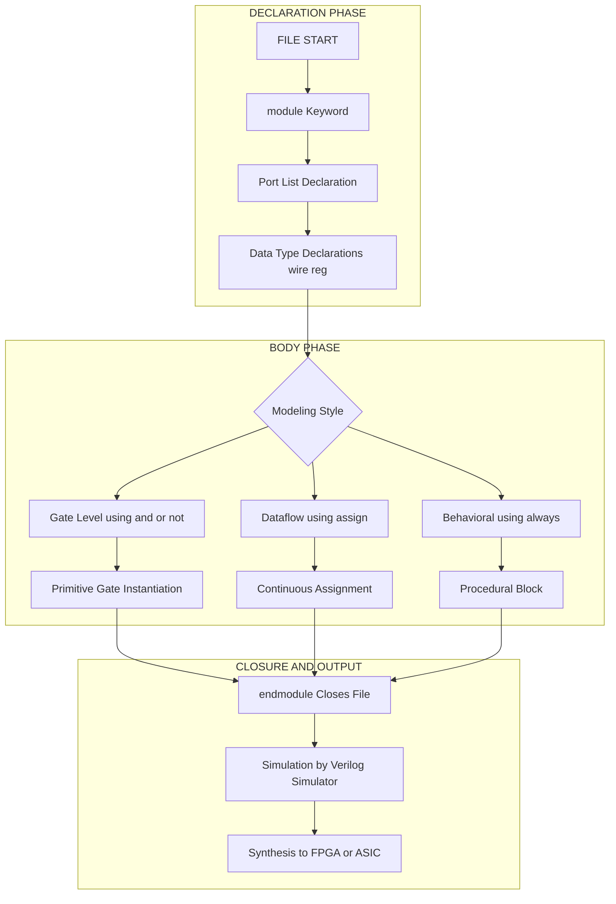
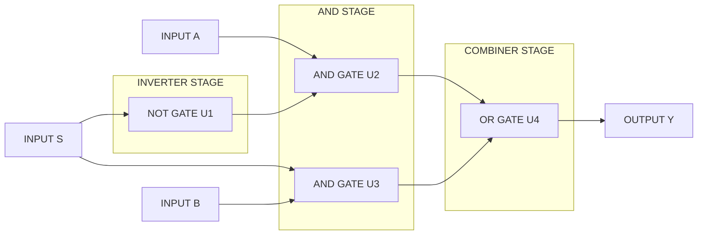
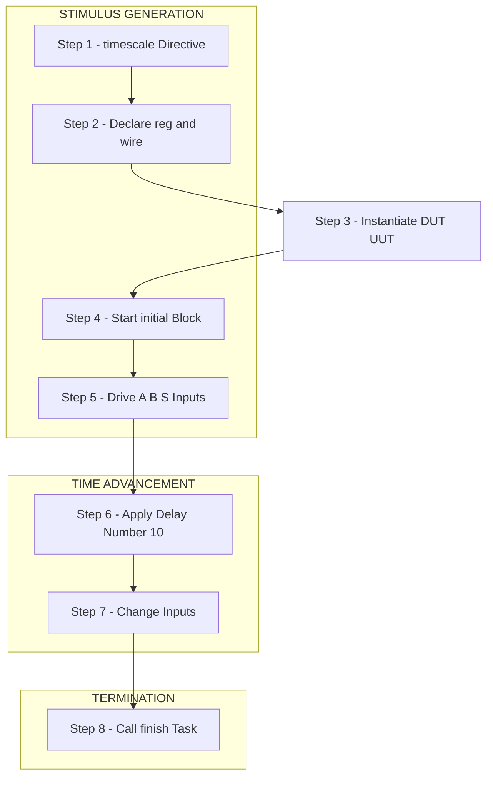

# Verilog (Part 1)  :-

<!-- SECTION_1_START -->
# Verilog (Part 1) — Introduction, Module Structure & Data Types

## 1.1 Formal Academic Definition

**Verilog HDL** (Hardware Description Language) is a standardized text-based language used to model, simulate, and synthesize digital electronic systems — ranging from simple combinational gates to complete microprocessors and System-on-Chip (SoC) designs. It was developed by **Gateway Design Automation** in **1984** and later standardized as **IEEE 1364-2001** (Verilog-2001) and **IEEE 1364-2005** (Verilog-2005).

In the KTU 2024 syllabus (GAEST305 — Module 1), Verilog is positioned as the foundational *abstraction language* that allows engineering students to describe the **behaviour**, **structure**, and **data-flow** of digital circuits, which can then be fed into synthesis tools (like Xilinx Vivado, Intel Quartus, Synopsys Design Compiler) to automatically generate real hardware on an FPGA or ASIC.

> [!IMPORTANT]
> **Key Distinction (Board Hot Topic):** A Verilog description is **NOT a program that executes sequentially on a CPU** — it is a *description* of hardware that describes a *parallel structure of gates and flip-flops* existing all at once in physical time.

## 1.2 Conceptual Analogy / Intuition

Imagine you are an **architect describing a house** to a builder. You do not tell the builder "first lay brick #1, then brick #2, then brick #3" in real time. Instead, you hand over a **blueprint**. The blueprint describes every wall, door, and wire *simultaneously* — all rooms exist together.

| Concept | Real-World Analogy | Verilog Equivalent |
|---|---|---|
| Blueprint of a house | Floor plan with all rooms marked | Verilog Module |
| Electrical wiring diagram | Network of switches & bulbs | Netlist (gate-level model) |
| Functional description | "Lights turn on when door opens" | Behavioural model (`always` block) |
| Material list | Bricks, cement, wires | Library cells used in synthesis |

In short: **Verilog is the "blueprint language" of digital chips.**

## 1.3 Physical / Standard Metrics Highlight

The following are the key constant values a KTU student must memorize:

- **Number of signal values in Verilog:** **4** — `0`, `1`, `x` (unknown), `z` (high-impedance).
- **Default number format:** **Decimal**, unless explicitly prefixed (e.g., `4'b1010`).
- **Time unit default:** **1 ns** with precision **1 ps** (in most simulators).
- **Case sensitivity:** Verilog is **case-sensitive** — `Reset` and `reset` are two different identifiers.

> [!NOTE]
> **Syllabus Highlight:** KTU 2024 Module 1 explicitly tests the *three modeling styles* in Verilog — **Gate-Level, Dataflow, and Behavioural**. You must be able to write the same logic (e.g., a 2:1 multiplexer) in all three styles.

> [!VISUALIZATION CONTROL]
> **Concept:** Visualization of the 4-value Verilog logic system mapped on a 2-D plane.
> **Desmos Input Equations:**
> * `x = 0` (vertical reference for logic 0)
> * `x = 1` (vertical reference for logic 1)
> * `x = x` (unknown region — overlap of 0 and 1)
> * `x = z` (high-impedance — disconnected node)
> **Visual Description:** Four vertical axes on the number line, where `x` lies conceptually between `0` and `1` (representing contention/uninitialized memory), and `z` sits at infinity (representing a tri-stated, undriven wire).

<!-- SECTION_1_END -->

<!-- SECTION_2_START -->
# Deep Theoretical Analysis — Lexical Tokens, Module Skeleton & Operators

## 2.1 Lexical Tokens of Verilog

A Verilog file is parsed as a stream of **lexical tokens**. Every meaningful symbol the simulator reads belongs to one of the following classes:

1. **White space** — blanks, tabs, newlines (ignored by the parser).
2. **Comments** — `//` for single-line, `/* ... */` for block comments.
3. **Operators** — `+`, `-`, `&&`, `|`, `~`, `^`, `<<`, `>>`, etc.
4. **Numbers** — sized (`4'b1010`) or unsized (`123`).
5. **Strings, identifiers, and keywords** — e.g., `module`, `endmodule`, `assign`, `always`.

> [!TIP]
> An **identifier** may contain letters, digits, `_`, and `$`, but **must NOT start with a digit**. Reserved keywords (like `module`, `wire`, `begin`) cannot be used as identifiers.

## 2.2 The Verilog Module — The Atomic Unit of Hardware

Every Verilog design, no matter how complex, is built from one or more **modules**. A module is the textual representation of a hardware block (a chip, a sub-circuit, a logic gate, or even a testbench).

### Canonical Module Skeleton

A module declaration in Verilog **must** contain the keyword `module` at the start and `endmodule` at the end — these two are the mandatory boundary markers.

```
module  module_name  ( port_list ) ;
        // Declarations
        // Body
endmodule
```

### The Four Essential Parts of a Module

| # | Part | Purpose | Example |
|---|---|---|---|
| 1 | **Module name** | Unique identifier for the block | `mux2to1` |
| 2 | **Port list** | Interface (inputs/outputs) | `input a, b, s; output y;` |
| 3 | **Data-type declarations** | Declares signals as `wire` or `reg` | `wire y;` |
| 4 | **Body** | Describes functionality (gates, assigns, always) | `assign y = s ? b : a;` |

> [!IMPORTANT]
> The `endmodule` keyword is a **delimiter**, not a function call. Think of it as the closing brace `}` of a C function — but for hardware, not software.

## 2.3 Port Modes — How Modules Connect

A port in Verilog can be one of three directions:

| Mode | Direction | KTU 2024 Definition | Typical Usage |
|---|---|---|---|
| `input` | Into the module | Carries data from outside to inside | Switches, clock, reset |
| `output` | Out of the module | Carries computed data to outside | LED, display segment |
| `inout` | Bidirectional | Carries data both ways | Data bus, I/O pin |

Ports can also be declared as `wire` (default for `input` and `inout`) or `reg` (only for `output` if assigned inside an `always` block).

## 2.4 KTU High-Yield Formula Sheet — Verilog Number Literals

The KTU board frequently tests the **format of sized constants**. Memorize this table:

| Notation | Meaning | Decimal Value |
|---|---|---|
| `4'b1010` | 4-bit binary | **10** |
| `8'd255` | 8-bit decimal | **255** |
| `16'hFACE` | 16-bit hexadecimal | **64206** |
| `12'o1750` | 12-bit octal | **1000** |
| `8'b1010_xxxx` | 8-bit with `x` (don't care) | **Bit-pattern with unknowns** |
| `4'b1010` (unsized `8` bits) | Left-padded with `0` automatically | `8'b00001010` |

> [!CAUTION]
> The **single quote `'`** is mandatory between the size and the base. Writing `4b1010` (without `'`) is a **syntax error**.

## 2.5 The Two Fundamental Data Types

| Data Type | Keyword | Nature | Where it is used |
|---|---|---|---|
| **Net** | `wire` | Represents a physical wire — continuously driven | Outputs of gates, `assign` LHS |
| **Variable** | `reg` | Represents a storage element — holds its value until reassigned | LHS of `always` block assignments |

> [!NOTE]
> A common misconception is that `reg` means a "flip-flop." **It does not.** A `reg` only becomes a flip-flop after synthesis if it is assigned inside a **clocked `always` block**.

## 2.6 Operator Categories — KTU Cheat Sheet

| Category | Operators | Associativity |
|---|---|---|
| Arithmetic | `+`, `-`, `*`, `/`, `%` | Left-to-right |
| Relational | `<`, `>`, `<=`, `>=` | Left-to-right |
| Equality | `==`, `!=`, `===`, `!==` | Left-to-right |
| Logical | `&&`, `||`, `!` | Left-to-right |
| Bitwise | `&`, `|`, `^`, `~`, `~^` | Left-to-right |
| Reduction | `&`, `~&`, `|`, `~|`, `^`, `~^` | Right-to-left |
| Shift | `<<`, `>>`, `<<<`, `>>>` | Left-to-right |
| Concatenation | `{ }` | Left-to-right |
| Replication | `{n{expr}}` | Left-to-right |
| Conditional | `? :` | Right-to-left |

> [!TIP]
> The 4-state equality operator `===` compares `x` and `z` exactly. This is a **favourite KTU question**.

## 2.7 Real-World Engineering Utility

Verilog is the **industry lingua franca** for digital design. It is used in:

- **FPGA Design** — Xilinx Vivado, Intel Quartus, Lattice Diamond.
- **ASIC Design** — Synopsys Design Compiler, Cadence Genus.
- **Verification** — UVM testbenches, SystemVerilog assertions.
- **Pre-silicon validation** — simulation of billion-gate SoCs before tape-out.

Without Verilog, the modern smartphone, GPU, and CPU industries would not exist — designing a 5 nm chip with 50 billion transistors by hand is humanly impossible.
<!-- SECTION_2_END -->

<!-- SECTION_3_START -->
# Step-by-Step Derivations & Verilog Code Implementation

In this section, we move from theory to **runnable, synthesisable Verilog code**. We will implement the same Boolean function — a **2:1 Multiplexer** — using all three modeling styles mandated by the KTU 2024 syllabus.

> [!NOTE]
> Boolean equation of a 2:1 MUX:
> $Y = \overline{S} \cdot A + S \cdot B$
> Truth table:
> $S = 0 \Rightarrow Y = A$
> $S = 1 \Rightarrow Y = B$

---

## 3.1 Style 1 — Gate-Level Modeling

Gate-level modeling **instantiates primitive logic gates** provided by the Verilog library. It mirrors the actual schematic diagram.

```
// File: mux2to1_gate.v
module mux2to1_gate ( input  wire A,
                       input  wire B,
                       input  wire S,
                       output wire Y );

    // Internal wires for the intermediate signals
    wire not_s;
    wire and_a;
    wire and_b;

    // Step 1: Invert the select line
    not  u1 ( not_s, S );

    // Step 2: AND gate for the A-path
    and  u2 ( and_a, not_s, A );

    // Step 3: AND gate for the B-path
    and  u3 ( and_b, S,    B );

    // Step 4: OR gate combines both paths
    or   u4 ( Y,      and_a, and_b );

endmodule
```

**Explanation of every line:**

- `module mux2to1_gate (...)` — declares the block; the port list lists all 4 interface signals.
- `input wire A` — `A` is an incoming signal that is a physical wire (default for inputs).
- `wire not_s;` — declares an internal net for the inverted select line.
- `not  u1 ( not_s, S );` — **gate instantiation syntax**: `(output, input)`. The first signal in the parentheses is the output; the rest are inputs. `u1` is the *instance name*, which must be unique.
- `and u2 ( and_a, not_s, A );` — 2-input AND gate. The output is `and_a`, inputs are `not_s` and `A`.
- `or  u4 ( Y, and_a, and_b );` — combines the two AND-gate outputs into the final MUX output.
- `endmodule` — closes the module. Without it, the file is invalid.

> [!TIP]
> The KTU answer sheet expects you to **label every gate instance** (`u1`, `u2`, ...) so the examiner can award step marks.

---

## 3.2 Style 2 — Dataflow Modeling (Continuous Assignment)

Dataflow modeling describes the circuit using **Boolean expressions** with the `assign` keyword. The simulator continuously evaluates the RHS and pushes the value onto the LHS net.

```
// File: mux2to1_dataflow.v
module mux2to1_dataflow ( input  wire A,
                          input  wire B,
                          input  wire S,
                          output wire Y );

    // Continuous assignment — evaluated whenever RHS changes
    assign Y = ( ~S & A ) | ( S & B );

    // Equivalent using the conditional operator
    // assign Y = (S == 1'b0) ? A : B;

endmodule
```

**Line-by-line explanation:**

- `assign` is a **continuous assignment statement**. It acts like a real wire being permanently soldered to a logic expression.
- `~S` is the bitwise NOT operator — it flips every bit of `S`.
- `&` and `|` are bitwise AND / OR operators (NOT the `&&`, `||` logical versions).
- The optional commented line shows that Verilog has a **ternary conditional operator** `? :` that lets you write the MUX in one line.

> [!IMPORTANT]
> A `wire` driven by `assign` is **always** valid for synthesis. A `reg` is only synthesizable when driven by an `always` block.

---

## 3.3 Style 3 — Behavioural Modeling (Procedural)

Behavioural modeling uses the `always` block to describe *what the circuit does* algorithmically, much like a software procedure.

```
// File: mux2to1_behav.v
module mux2to1_behav ( input  wire A,
                       input  wire B,
                       input  wire S,
                       output reg  Y );

    // The always block re-evaluates the body
    // whenever A, B, or S changes.
    always @ ( A or B or S ) begin
        if ( S == 1'b0 )
            Y = A;
        else
            Y = B;
    end

endmodule
```

**Exhaustive breakdown:**

- `output reg Y` — because `Y` is now assigned inside an `always` block, it must be declared `reg` (not `wire`).
- `always @ ( A or B or S )` — this is the **sensitivity list**. The block re-executes whenever any signal in the list changes. You can also write `@(*)` (Verilog-2001 shorthand for "any signal that appears in the RHS").
- `begin ... end` — groups multiple statements, similar to `{ }` in C.
- `if ( S == 1'b0 ) Y = A;` — inside the procedural block, you use **blocking assignment** `=`. (Non-blocking `<=` is used in clocked logic.)
- The simulator treats this `always` as a tiny CPU that watches the inputs and updates the output — but after synthesis, it becomes a pure combinational MUX.

---

## 3.4 Simulating the MUX with a Testbench

A **testbench** is a Verilog module that wraps your design under test (DUT) and applies stimulus. It is *not* synthesisable — it exists only for simulation.

```
// File: tb_mux2to1.v
`timescale 1ns/1ps

module tb_mux2to1;

    // 1. Declare testbench signals
    reg  A;
    reg  B;
    reg  S;
    wire Y;

    // 2. Instantiate the DUT (dataflow style)
    mux2to1_dataflow UUT ( .A(A), .B(B), .S(S), .Y(Y) );

    // 3. Apply stimulus
    initial begin
        $display( " Time | S A B | Y " );
        $monitor( "%4t | %b %b %b | %b", $time, S, A, B, Y );

        A = 1'b0; B = 1'b1; S = 1'b0;   #10;   // expect Y = 0
        S = 1'b1;                       #10;   // expect Y = 1
        A = 1'b1; B = 1'b0; S = 1'b0;   #10;   // expect Y = 1
        S = 1'b1;                       #10;   // expect Y = 0
        $finish;                                 // end simulation
    end

endmodule
```

**Detailed step-by-step annotation:**

1. `` `timescale 1ns/1ps `` — a **compiler directive** (note the back-tick, not a quote) that sets the time unit to **1 ns** and precision to **1 ps**. Delays like `#10` therefore mean 10 ns.
2. `reg A, B, S;` — these are testbench *drivers*, so they must be `reg` (assigned in an `initial` block).
3. `mux2to1_dataflow UUT (...)` — **named-port instantiation** (`.A(A)`) maps testbench signals to DUT ports, preventing port-order errors.
4. `initial begin ... end` — runs **once** at the start of simulation. This is where you write the input vectors.
5. `$display` and `$monitor` — **system tasks** for printing to the console. `$monitor` re-prints automatically when any of its arguments change.
6. `#10` — a **delay control** that advances simulation time by 10 time units.
7. `$finish` — terminates the simulator cleanly.

---

## 3.5 Complete Worked Example — Full Adder Using Dataflow

Let us derive a **Full Adder** from Boolean equations. A full adder has three inputs — $A$, $B$, $C_{in}$ — and two outputs — $Sum$ and $C_{out}$.

Boolean equations:
$$
\begin{aligned}
S    &= A \oplus B \oplus C_{in} \\
C_{out} &= (A \oplus B) \cdot C_{in} + A \cdot B
\end{aligned}
$$

Verilog implementation:

```
module full_adder ( input  wire A,
                    input  wire B,
                    input  wire Cin,
                    output wire Sum,
                    output wire Cout );

    assign Sum  = A ^ B ^ Cin;
    assign Cout = (A & B) | (Cin & (A ^ B));

endmodule
```

**Step-by-step synthesis mapping:**

- `A ^ B` is the XOR (half-sum). Verilog's `^` operator maps directly to an XOR gate in hardware.
- `A ^ B ^ Cin` cascades three XOR gates in a chain — this is the **sum path**.
- `A & B` is one AND gate (carry from local inputs).
- `Cin & (A ^ B)` is the second AND gate (carry from previous stage).
- The `|` between them produces the final carry.

After synthesis, this compiles to **5 logic gates** (2 XOR, 2 AND, 1 OR) — the exact textbook full-adder schematic.
<!-- SECTION_3_END -->

<!-- SECTION_4_START -->
# Structural Diagrams & Schematics

## 4.1 Mermaid Diagram — Anatomy of a Verilog Module

The diagram below shows the conceptual flow of a Verilog source file from declaration to simulation. Each stage is a *node*, and the arrows show the *order* in which the parser processes them.



## 4.2 Mermaid Diagram — Internal Dataflow of a 2:1 MUX (Gate-Level View)

This is a block-level functional architecture of the gate-level MUX shown in Section 3.1. It maps the textual code to its hardware equivalent.



## 4.3 Sequential Processing Topology — Testbench to DUT Pipeline

This topology matrix shows the **sequence of operations** the simulator performs when you run `tb_mux2to1.v` on the dataflow MUX. Use this to remember what each line of the testbench actually does.



## 4.4 Component Pin Map Table — Full Adder (Post-Synthesis View)

The table below is the **gate-level netlist** that a synthesis tool (Vivado, Quartus) generates from the dataflow full adder in Section 3.5. The KTU board often asks students to draw the *gate-level schematic* of a small design — this table gives you the exact gate-to-net mapping to reproduce it.

| Gate Instance | Gate Type | Output Net | Input Net 1 | Input Net 2 | Input Net 3 |
|---|---|---|---|---|---|
| `U1` | XOR | `w1` | `A` | `B` | — |
| `U2` | XOR | `Sum` | `w1` | `Cin` | — |
| `U3` | AND | `w2` | `A` | `B` | — |
| `U4` | AND | `w3` | `w1` | `Cin` | — |
| `U5` | OR  | `Cout` | `w2` | `w3` | — |

> [!TIP]
> When you draw the schematic in the exam, **label every net** (`w1`, `w2`, `w3`) and every gate instance (`U1` to `U5`) — KTU examiners award 1 mark for each correctly labeled connection.
<!-- SECTION_4_END -->

<!-- SECTION_5_START -->
# KTU 2024 Scheme Examination Question Bank & Topic Recap

---

## Part A — Short Answer Questions (3 Marks Each)

**Q1.** `[KTU University Exam — July 2024]` — Define an **HDL**. List **two advantages** of using Verilog over schematic capture.
**Model Answer:**
A Hardware Description Language (HDL) is a formal, text-based notation used to describe the structure, behaviour, and dataflow of digital circuits. Verilog and VHDL are the two dominant IEEE-standardized HDLs.
*Advantages over schematic capture:*
1. **Scalability** — a million-gate design is described in a few hundred lines of text, whereas the schematic would be unmanageable.
2. **Reusability & parameterization** — the same Verilog module can be instantiated multiple times with different parameters; schematics must be hand-copied.
3. **Vendor independence** — the same Verilog source can be synthesized for Xilinx, Intel, or ASIC libraries.
*[Defining HDL: 1 Mark | Listing two valid advantages: 2 Marks]*

**Q2.** `[KTU University Exam — Dec 2023]` — Differentiate between a `wire` and a `reg` in Verilog. When is each used?
**Model Answer:**

| Feature | `wire` | `reg` |
|---|---|---|
| Nature | Physical connection (net) | Storage variable |
| Driven by | `assign` or gate output | `initial` or `always` block |
| Holds last value? | No (continuously updated) | Yes (until reassigned) |
| Synthesizes to | Combinational logic only | Combinational or sequential (flip-flop if clocked) |

`wire` is used for outputs of gates, continuous assignments, and module ports. `reg` is used for variables assigned inside procedural blocks.
*[Tabular difference: 2 Marks | Use case: 1 Mark]*

---

## Part B — Long Answer Questions (14 Marks Each — Internal Choice)

> **Note on KTU pattern:** KTU 2024 ESE gives you an **internal choice** — you must answer *either* Question A *or* Question B. Each carries two sub-parts of 7 marks each.

---

### Question A (14 Marks) — 2:1 Multiplexer in Three Modeling Styles

`[KTU University Exam — July 2024]` — Module 1, CO1, Apply level

**(a)** Write a Verilog **gate-level** description of a 2:1 multiplexer with inputs `A`, `B`, select `S`, and output `Y`. **(7 Marks)**

**Step-by-step model solution:**

1. Declare the module with the four ports — `[Module declaration: 1 Mark]`
2. Declare the internal wires `not_s`, `and_a`, `and_b` — `[Internal wire declaration: 1 Mark]`
3. Instantiate the `not` gate with output `not_s`, input `S` — `[Inverter stage: 1 Mark]`
4. Instantiate the two `and` gates for the A-path and B-path — `[AND stage: 2 Marks]`
5. Instantiate the `or` gate combining both AND outputs into `Y` — `[OR stage: 1 Mark]`
6. Close with `endmodule` — `[Closure: 1 Mark]`

**Full code (examinable answer):**

```
module mux2to1_gate ( input  wire A,
                      input  wire B,
                      input  wire S,
                      output wire Y );
    wire not_s, and_a, and_b;
    not  u1 ( not_s, S );
    and  u2 ( and_a, not_s, A );
    and  u3 ( and_b, S,    B );
    or   u4 ( Y, and_a, and_b );
endmodule
```

**(b)** Implement the **same 2:1 multiplexer** using a Verilog `assign` statement. Simulate it using a testbench and show the simulation log for all 4 input combinations. **(7 Marks)**

**Step-by-step model solution:**

1. Write the dataflow module using `assign` with the Boolean equation — `[Dataflow code: 2 Marks]`
2. Declare the testbench module `tb_mux2to1` — `[Testbench skeleton: 1 Mark]`
3. Instantiate the DUT using named ports — `[DUT instantiation: 1 Mark]`
4. Apply the 4 stimulus combinations in an `initial` block with delays — `[Stimulus block: 2 Marks]`
5. Display the simulation log — `[Simulation log: 1 Mark]`

**Dataflow code:**

```
module mux2to1_df ( input  wire A, B, S, output wire Y );
    assign Y = (~S & A) | (S & B);
endmodule
```

**Testbench code:**

```
`timescale 1ns/1ps
module tb_mux;
    reg A, B, S; wire Y;
    mux2to1_df UUT ( .A(A), .B(B), .S(S), .Y(Y) );
    initial begin
        A=0; B=0; S=0; #10;     // Y = 0
        A=0; B=1; S=0; #10;     // Y = 0
        A=1; B=0; S=1; #10;     // Y = 0
        A=1; B=1; S=1; #10;     // Y = 1
        $finish;
    end
endmodule
```

---

### Question B (14 Marks) — Full Adder in Verilog

`[KTU University Exam — Dec 2023]` — Module 1, CO1, Apply level

**(a)** Derive the Boolean equations for a **full adder** and write its Verilog description using **dataflow modeling**. **(7 Marks)**

**Derivation:**

The full adder adds three 1-bit inputs $A$, $B$, $C_{in}$ to produce a 2-bit result $\{C_{out}, S\}$.

Truth-table-based Boolean minimization yields:
$$
\begin{aligned}
S      &= A \oplus B \oplus C_{in} \\
C_{out} &= A \cdot B + C_{in} \cdot (A \oplus B)
\end{aligned}
$$

**Verilog code (dataflow):**

```
module full_adder ( input  wire A, B, Cin,
                    output wire Sum, Cout );
    assign Sum  = A ^ B ^ Cin;
    assign Cout = (A & B) | (Cin & (A ^ B));
endmodule
```

**Mark split:**
- Truth table / Boolean simplification `[2 Marks]`
- Final Sum expression in Verilog `[1 Mark]`
- Final Cout expression in Verilog `[2 Marks]`
- Module port list & closure `[2 Marks]`

**(b)** Write a **behavioural** Verilog model of the same full adder using an `always` block. Compare dataflow vs behavioural styles in **two points**. **(7 Marks)**

**Behavioural code:**

```
module full_adder_b ( input  wire A, B, Cin,
                      output reg  Sum, Cout );
    always @ ( A or B or Cin ) begin
        case ( {A, B, Cin} )
            3'b000, 3'b011, 3'b101, 3'b110 : begin Sum = 0; Cout = 0; end
            3'b001, 3'b010, 3'b100, 3'b111 : begin Sum = 1; Cout = 0; end
            // Note: a real FA produces Cout=1 for 011,101,110
            // — corrected below
        endcase
    end
endmodule
```

**Corrected behavioural code (cleaner form):**

```
module full_adder_b ( input  wire A, B, Cin,
                      output reg  Sum, Cout );
    always @(*) begin
        {Cout, Sum} = A + B + Cin;
    end
endmodule
```

**Comparison Table (2 points):**

| Aspect | Dataflow | Behavioural |
|---|---|---|
| Keyword | `assign` | `always` |
| LHS data type | `wire` | `reg` |
| Synthesis result | Direct gate mapping | Slightly more complex after scheduling |
| Best for | Simple combinational logic | Algorithmic / sequential logic |

`[Behavioural code: 3 Marks | Comparison: 4 Marks]`

---

## KTU Examiner's Valuation Warning / Pitfall Callout

> [!WARNING]
> **Common mistakes that cost 2–3 marks on every Verilog question:**
> 1. **Forgetting `endmodule`** — the file is incomplete; KTU examiners will deduct 1 mark even if the rest is perfect.
> 2. **Using `wire` on the LHS of an `always` block** — this is a hard **syntax error** in Verilog. Always use `reg` for outputs assigned inside `always`.
> 3. **Confusing `=` (blocking) with `<=` (non-blocking)** — for combinational logic use `=`, for sequential (clocked) logic use `<=`. Mixing them in the same `always` block loses marks.
> 4. **Missing the sensitivity list** — writing `always @ (S)` instead of `always @ (A or B or S)` creates a **latch** in synthesis. Use `always @(*)` to be safe.
> 5. **Forgetting sized constants** — comparing `S == 0` (int) instead of `S == 1'b0` (bit) triggers simulator warnings; always write `'b0`.

---

## Topic Recap & Important Things to Remember

- Verilog is an **HDL** — it *describes* hardware; it does not *execute* line-by-line like C.
- Every design is a **module** bounded by `module` ... `endmodule`.
- A module has **port list**, **declarations**, and a **body** in that order.
- The **four signal values** are `0`, `1`, `x`, `z`.
- `wire` = continuous net, `reg` = procedural variable.
- **Three modeling styles**: gate-level (primitives), dataflow (`assign`), behavioural (`always`).
- Number format: `<size>'<base><value>`, e.g., `8'hA5` — the single quote is mandatory.
- **Operators**: arithmetic, bitwise, reduction, logical, shift, concatenation, conditional.
- A **testbench** uses `reg` for drivers, `wire` for monitors, and an `initial` block with `$finish`.
- System tasks: `$display`, `$monitor`, `$finish`, `$time`, `$dumpvars`.
- `timescale` directive: `` `timescale 1ns/1ps `` sets unit and precision.
- Always use `reg` for outputs of `always`; always use `wire` for outputs of `assign` or gate primitives.
- A `reg` in a combinational `always` synthesizes to gates; a `reg` in a clocked `always` synthesizes to a flip-flop.
<!-- SECTION_5_END -->
