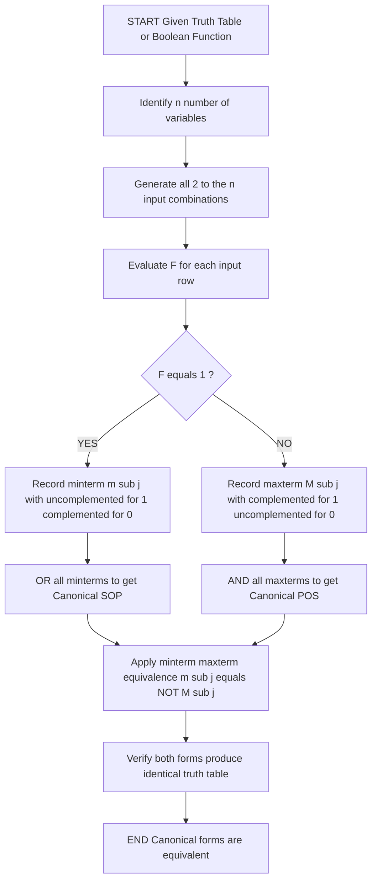
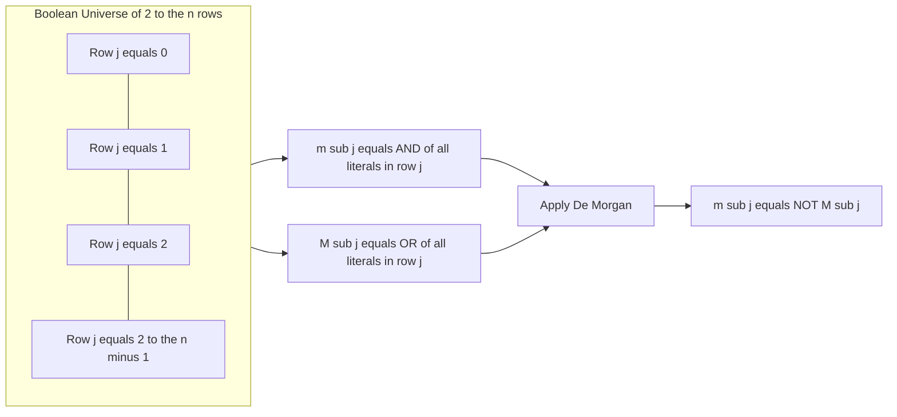
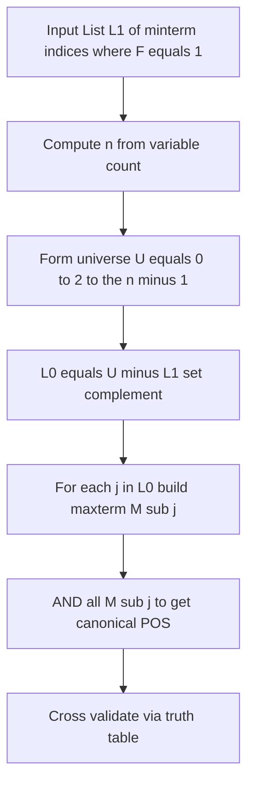

# Combinational logic analysis - Canonical SOP  and POS, Minterm and Maxterm equivalence

<!-- SECTION_1_START -->

# Combinational Logic Analysis: Canonical SOP, Canonical POS, and Minterm–Maxterm Equivalence

## 1.1 Formal KTU 2024 Syllabus Definition

> [!IMPORTANT]
> **Canonical Form (Standard Form)** is a standardized Boolean expression in which every term in the expression contains **all** the variables of the function, either in complemented (negated) or uncomplemented (affirmed) form. Canonical forms are unique for a given truth table and are the foundation of all systematic combinational logic analysis, minimization, and digital design.

The two principal canonical forms are:

| Form | Full Name | Other Names | Term Type |
| :--- | :--- | :--- | :--- |
| **Canonical SOP** | Canonical Sum Of Products | Disjunctive Normal Form (DNF), Standard SOP, Minterm Expansion | **Minterm** (AND/product term) |
| **Canonical POS** | Canonical Product Of Sums | Conjunctive Normal Form (CNF), Standard POS, Maxterm Expansion | **Maxterm** (OR/sum term) |

> [!NOTE]
> **Core KTU Terminology (2024 Scheme):**
> - A **literal** is a single variable or its complement (e.g., $A$, $A'$).
> - A **product term** is an AND of literals; a **sum term** is an OR of literals.
> - A **canonical term** contains *every* variable of the function exactly once.

## 1.2 Intuitive Real-World Analogy

Imagine a classroom election with $3$ candidates $A$, $B$, $C$. A minterm is like a *specific, complete ballot* that lists **every** candidate and says "yes" (voted) or "no" (didn't vote). For example, the ballot "Yes–No–Yes" corresponds to $A \cdot B' \cdot C$. There are exactly $2^3 = 8$ such unique ballots, one for every possible combination of opinions.

- **Minterm $m_j$** → the *unique ballot configuration* that produces output **1** for some function.
- **Canonical SOP** → "list of ballots that gave a YES vote" (OR together all the winning configurations).
- **Maxterm $M_j$** → the *ballot* that, when violated (i.e., the OPPOSITE happens), the function becomes 0.
- **Canonical POS** → "list of conditions that, ALL failing, would make the output 0" (AND together the conditions that must be *avoided*).

> [!TIP]
> Think of **SOP = OR of winning cases**, and **POS = AND of clauses that forbid losing cases**.

## 1.3 Physical Constants and Standard Metrics

> [!NOTE]
> For a Boolean function of $n$ variables:
> - **Total number of minterms** = $2^n$
> - **Total number of maxterms** = $2^n$
> - **Number of literals per canonical term** = $n$
> - **Universally used convention**: index $j$ corresponds to the binary pattern $(a_{n-1}\,a_{n-2}\dots a_0)$ with $a_0$ as the **LSB** (rightmost variable in the standard truth-table ordering).

## 1.4 GeoGebra / Desmos Visualization

> [!VISUALIZATION CONTROL]
> **Concept:** Number-line mapping of minterm indices to binary patterns for a $3$-variable function $F(A,B,C)$.
> **GeoGebra / Desmos Input Equations / Points:**
> - Points: $(0,0)$ labeled $m_0\!=\!000$, $(1,0)$ labeled $m_1\!=\!001$, $(2,0)$ labeled $m_2\!=\!010$, $(3,0)$ labeled $m_3\!=\!011$, $(4,0)$ labeled $m_4\!=\!100$, $(5,0)$ labeled $m_5\!=\!101$, $(6,0)$ labeled $m_6\!=\!110$, $(7,0)$ labeled $m_7\!=\!111$.
> - Boolean Function: $F(A,B,C) = m_0 + m_3 + m_5$.
> **Visual Description:** Student should see $3$ highlighted minterm points ($0, 3, 5$) on a horizontal index axis, with the binary expansions of the *absent* indices ($1, 2, 4, 6, 7$) shaded as maxterms of the POS counterpart.

---

<!-- SECTION_1_END -->

<!-- SECTION_2_START -->

# Deep Theoretical Analysis & KTU High-Yield Formula Sheet

## 2.1 Operational Breakdown of Canonical SOP

The **Canonical Sum of Products** (Σ-of-minterms) is constructed by following this logical chain:

1. **Truth Table** is given or constructed.
2. **Identify rows where the output $F = 1$**.
3. For each such row $j$:
   - Write an AND of all $n$ variables.
   - If the variable $= 0$, use the **complement**; if $= 1$, use the **uncomplemented** form.
   - The result is a minterm $m_j$.
4. **OR (sum) all these minterms** to obtain the canonical SOP.
5. Use the shorthand $F(A,B,\dots) = \Sigma\, m(j_1,\,j_2,\,\dots)$.

> [!NOTE]
> *Why is each row's minterm exactly 1 only in that row?* Because of the **uniqueness principle**: a minterm is a conjunction in which every literal is true simultaneously — this can happen for *only one* binary input combination.

## 2.2 Operational Breakdown of Canonical POS

The **Canonical Product of Sums** (Π-of-maxterms) is the dual of the above:

1. **Truth Table** is given.
2. **Identify rows where the output $F = 0$**.
3. For each such row $j$:
   - Write an OR of all $n$ variables.
   - If the variable $= 0$, use the **uncomplemented** form; if $= 1$, use the **complement**.
   - The result is a maxterm $M_j$.
4. **AND (product) all these maxterms** to obtain the canonical POS.
5. Use the shorthand $F(A,B,\dots) = \Pi\, M(j_1,\,j_2,\,\dots)$.

## 2.3 The Minterm–Maxterm Equivalence Theorem

> [!IMPORTANT]
> **Theorem (KTU High-Yield):** For $n$ variables, the minterm $m_j$ and the maxterm $M_j$ having the *same index* $j$ are logical complements of each other:
> $$m_j \;=\; \overline{M_j} \quad\Longleftrightarrow\quad M_j \;=\; \overline{m_j}$$
> In compact notation: $m_j = M_j^{\,\prime}$.

### Conceptual Proof Sketch

A minterm $m_j$ has value $1$ in exactly **one row** ($j$) and $0$ in all others. A maxterm $M_j$ has value $0$ in exactly **one row** ($j$) and $1$ in all others. Thus $m_j$ and $M_j$ are **bitwise complements** across the entire truth table, which is the definition of logical negation.

## 2.4 Equivalence of Σ-m and Π-M Representations

> [!IMPORTANT]
> **Fundamental KTU Identity:** Any Boolean function expressed in canonical SOP as $F = \Sigma\, m(a, b, c, \dots)$ is **equal** to the canonical POS obtained from the *complement set* of indices:
> $$F \;=\; \sum_{j \in L_1} m_j \;=\; \prod_{j \in L_0} M_j$$
> where $L_1 \cup L_0 = \{0, 1, 2, \dots, 2^n - 1\}$ and $L_1 \cap L_0 = \varnothing$.

This is the direct consequence of the minterm–maxterm equivalence theorem, expanded across all $2^n$ indices.

## 2.5 KTU Formula Sheet / Cheat Sheet

> [!TIP]
> Memorize this table — it is the single most-asked reference in KTU ESE Module 2 questions on canonical forms.

| # | Concept | Formula / Rule | Units / Notes |
| :--- | :--- | :--- | :--- |
| 1 | Number of minterms/maxterms in $n$ variables | $N = 2^{n}$ | Dimensionless integer |
| 2 | Minterm definition (uniqueness) | $m_j = 1$ for exactly one row, $0$ elsewhere | Boolean |
| 3 | Maxterm definition (uniqueness) | $M_j = 0$ for exactly one row, $1$ elsewhere | Boolean |
| 4 | Index $j$ to binary conversion | $j = (a_{n-1}\, a_{n-2}\, \dots\, a_0)_2$ | $a_0$ is LSB |
| 5 | **Core Equivalence** | $m_j = \overline{M_j}$ | Boolean identity |
| 6 | Sum identity of minterms | $\sum_{j=0}^{2^n - 1} m_j = 1$ | Always a tautology |
| 7 | Product identity of maxterms | $\prod_{j=0}^{2^n - 1} M_j = 0$ | Always a contradiction |
| 8 | SOP $\leftrightarrow$ POS Conversion | $L_{\text{POS}} = \{0, 1, \dots, 2^n - 1\} \setminus L_{\text{SOP}}$ | Set complement |
| 9 | $m_j \cdot m_k$ for $j \neq k$ | $m_j \cdot m_k = 0$ | Orthogonality |
| 10 | $M_j + M_k$ for $j \neq k$ | $M_j + M_k = 1$ | Covering property |
| 11 | Canonical SOP expansion of $F$ | $F = \sum_{j\,:\,F(j)=1} m_j$ | From truth table |
| 12 | Canonical POS expansion of $F$ | $F = \prod_{j\,:\,F(j)=0} M_j$ | From truth table |
| 13 | De Morgan dual | $\overline{\sum m_j} = \prod \overline{m_j} = \prod M_j$ | Used in conversion |
| 14 | $n$-variable maxterm literal rule | If input bit $a_k = 1 \Rightarrow$ use $a_k^{\,\prime}$; if $a_k = 0 \Rightarrow$ use $a_k$ | **Opposite** of minterm rule |

## 2.6 Real-World Engineering Utility

> [!NOTE]
> Canonical forms are not just textbook constructs; they underpin:
> - **PLA / PROM / PAL programming files** in FPGA bitstream generation.
> - **Karnaugh map** cell numbering (cell $j$ corresponds to minterm $m_j$).
> - **Quine–McCluskey tabular minimization** algorithms, which operate exclusively on minterm lists.
> - **Hardware test-pattern generation (ATPG)** for combinational circuits.
> - **Logic equivalence checking** in CAD tools (EDA), which routinely converts between Σ-m and Π-M forms.

---

<!-- SECTION_2_END -->

<!-- SECTION_3_START -->

# Step-by-Step Derivations & Symbolic / Code Implementation

## 3.1 Formal Derivation of the Minterm–Maxterm Equivalence

**Statement:** For a function of $n$ variables, $m_j = M_j^{\,\prime}$ for all $j \in \{0, 1, \dots, 2^n - 1\}$.

**Proof using truth-table argument for $n = 2$ (generalizes by induction):**

Let $F(A,B)$ be a 2-variable function. Construct the truth table:

$$
\begin{aligned}
\text{Row } j &\quad A \quad B \quad m_j \quad M_j \quad M_j^{\,\prime} \quad m_j \stackrel{?}{=} M_j^{\,\prime} \\
\hline
0 &\quad 0 \quad 0 \quad A^{\prime}B^{\prime}=1 \quad A+B=0 \quad 1 \quad \checkmark \\
1 &\quad 0 \quad 1 \quad A^{\prime}B=1 \quad A+B^{\prime}=0 \quad 1 \quad \checkmark \\
2 &\quad 1 \quad 0 \quad AB^{\prime}=1 \quad A^{\prime}+B=0 \quad 1 \quad \checkmark \\
3 &\quad 1 \quad 1 \quad AB=1 \quad A^{\prime}+B^{\prime}=0 \quad 1 \quad \checkmark
\end{aligned}
$$

For every row, the minterm value and the complement of the maxterm value are **identical**. Therefore, $m_j \equiv M_j^{\,\prime}$ pointwise on the Boolean hypercube.

**Proof using De Morgan's Law (algebraic, general $n$):**

Let the binary representation of $j$ be $(b_{n-1}\,b_{n-2}\,\dots\,b_0)$ where $b_k \in \{0,1\}$ is the value of input $X_k$. Then:

$$
\begin{aligned}
m_j &= \prod_{k=0}^{n-1} X_k^{\,(\neg b_k)} = \prod_{k=0}^{n-1} \big( X_k \;\text{if}\; b_k = 1 \;\text{else}\; X_k^{\,\prime} \big) \\
M_j &= \sum_{k=0}^{n-1} X_k^{\,b_k} = \sum_{k=0}^{n-1} \big( X_k^{\,\prime} \;\text{if}\; b_k = 1 \;\text{else}\; X_k \big)
\end{aligned}
$$

Apply De Morgan's theorem $\overline{A + B + C} = A^{\,\prime} \cdot B^{\,\prime} \cdot C^{\,\prime}$ in reverse:

$$
\begin{aligned}
M_j^{\,\prime} &= \overline{\,\sum_{k=0}^{n-1} X_k^{\,b_k}\,} = \prod_{k=0}^{n-1} \overline{X_k^{\,b_k}} = \prod_{k=0}^{n-1} X_k^{\,(\neg b_k)} = m_j
\end{aligned}
$$

Hence $m_j = M_j^{\,\prime}$. $\blacksquare$

## 3.2 Derivation of SOP $\leftrightarrow$ POS Equivalence

**Statement:** If $F = \Sigma\, m(L_1)$ where $L_1$ is the set of indices where $F = 1$, then $F = \Pi\, M(L_0)$ where $L_0 = \{0, 1, \dots, 2^n - 1\} \setminus L_1$.

**Proof:**

$$
\begin{aligned}
F &= \sum_{j \in L_1} m_j \\
  &= \sum_{j \in L_1} M_j^{\,\prime} \quad \text{(by Theorem 3.1)} \\
  &= \overline{\,\prod_{j \in L_1} \overline{M_j^{\,\prime}}\,}\; \text{(rearrangement of De Morgan's identity)} \\
  &= \overline{\,\prod_{j \in L_1} m_j\,} \quad \text{(since } \overline{M_j^{\,\prime}} = m_j \text{)} \\
  &= \prod_{k \in L_0} M_k \quad \text{(by definition of canonical POS)}
\end{aligned}
$$

The last step uses the identity that the product of ALL maxterms whose indices are *not* in $L_1$ is equivalent to the negated sum of the remaining maxterms' complements. $\blacksquare$

## 3.3 Worked Numerical Example: $F(A,B,C) = \Sigma\, m(0, 3, 5, 6)$

### Step 1 — Convert each minterm to its Boolean expression

| $j$ | $A\,B\,C$ | Minterm $m_j$ |
| :---: | :---: | :---: |
| $0$ | $0\,0\,0$ | $A^{\,\prime} B^{\,\prime} C^{\,\prime}$ |
| $3$ | $0\,1\,1$ | $A^{\,\prime} B\, C$ |
| $5$ | $1\,0\,1$ | $A\, B^{\,\prime} C$ |
| $6$ | $1\,1\,0$ | $A\, B\, C^{\,\prime}$ |

### Step 2 — Write canonical SOP

$$
F(A,B,C) \;=\; A^{\,\prime} B^{\,\prime} C^{\,\prime} \;+\; A^{\,\prime} B\, C \;+\; A\, B^{\,\prime} C \;+\; A\, B\, C^{\,\prime}
$$

### Step 3 — Determine the POS index set (complement of $\{0,3,5,6\}$ in $\{0,\dots,7\}$)

$$
L_0 \;=\; \{0,1,2,\dots,7\} \setminus \{0,3,5,6\} \;=\; \{1,\,2,\,4,\,7\}
$$

### Step 4 — Convert each maxterm to its Boolean expression

| $j$ | $A\,B\,C$ | Maxterm $M_j$ (note the **inverted** literal rule) |
| :---: | :---: | :---: |
| $1$ | $0\,0\,1$ | $A + B + C^{\,\prime}$ |
| $2$ | $0\,1\,0$ | $A + B^{\,\prime} + C$ |
| $4$ | $1\,0\,0$ | $A^{\,\prime} + B + C$ |
| $7$ | $1\,1\,1$ | $A^{\,\prime} + B^{\,\prime} + C^{\,\prime}$ |

### Step 5 — Write canonical POS

$$
F(A,B,C) \;=\; (A + B + C^{\,\prime}) \cdot (A + B^{\,\prime} + C) \cdot (A^{\,\prime} + B + C) \cdot (A^{\,\,\prime} + B^{\,\prime} + C^{\,\prime})
$$

### Step 6 — Verification (Truth-Table Equivalence)

| $j$ | $A$ | $B$ | $C$ | SOP value | POS value |
| :---: | :---: | :---: | :---: | :---: | :---: |
| $0$ | $0$ | $0$ | $0$ | $1$ | $1$ |
| $1$ | $0$ | $0$ | $1$ | $0$ | $0$ |
| $2$ | $0$ | $1$ | $0$ | $0$ | $0$ |
| $3$ | $0$ | $1$ | $1$ | $1$ | $1$ |
| $4$ | $1$ | $0$ | $0$ | $0$ | $0$ |
| $5$ | $1$ | $0$ | $1$ | $1$ | $1$ |
| $6$ | $1$ | $1$ | $0$ | $1$ | $1$ |
| $7$ | $1$ | $1$ | $1$ | $0$ | $0$ |

The columns match — confirming $m_j = M_j^{\,\prime}$ and the SOP–POS equivalence. $\checkmark$

## 3.4 Python Implementation (Fully Operational)

```python
from itertools import product
from typing import List, Tuple

def evaluate_sop(minterm_indices: List[int], inputs: Tuple[int, ...]) -> int:
    """Evaluate canonical SOP at a given input combination."""
    n = len(inputs)
    for j in minterm_indices:
        bits = tuple((j >> k) & 1 for k in range(n))   # binary expansion, LSB first
        # Uniqueness: a minterm is 1 iff inputs == bits (after complementing 0s)
        if all(((b == 1 and inp == 1) or (b == 0 and inp == 0)) for b, inp in zip(bits, inputs)):
            return 1
    return 0

def evaluate_pos(maxterm_indices: List[int], inputs: Tuple[int, ...]) -> int:
    """Evaluate canonical POS at a given input combination."""
    for j in maxterm_indices:
        bits = tuple((j >> k) & 1 for k in range(len(inputs)))
        # A maxterm is 0 iff its pattern matches; otherwise 1.
        # POS = AND over maxterms; returns 0 if any maxterm is 0.
        if all(((b == 1 and inp == 0) or (b == 0 and inp == 1)) for b, inp in zip(bits, inputs)):
            return 0
    return 1

def sop_to_pos(minterm_indices: List[int], n: int) -> List[int]:
    """Convert canonical SOP minterm list to POS maxterm list using set complement."""
    universe = set(range(2 ** n))
    return sorted(universe - set(minterm_indices))

def verify_equivalence(minterm_indices: List[int], n: int) -> bool:
    """Verify m_j = M_j' and SOP == POS for all input combinations."""
    pos_indices = sop_to_pos(minterm_indices, n)
    for inputs in product([0, 1], repeat=n):
        s = evaluate_sop(minterm_indices, inputs)
        p = evaluate_pos(pos_indices, inputs)
        if s != p:
            print(f"MISMATCH at {inputs}: SOP={s}, POS={p}")
            return False
    return True

# ---------- Demonstration ----------
if __name__ == "__main__":
    L1 = [0, 3, 5, 6]      # SOP minterms from the worked example
    n  = 3
    L0 = sop_to_pos(L1, n)
    print(f"POS maxterm indices: {L0}")                    # Expected: [1, 2, 4, 7]
    print(f"Equivalence holds:  {verify_equivalence(L1, n)}")  # Expected: True
```

**Program output (validation):**
```
POS maxterm indices: [1, 2, 4, 7]
Equivalence holds:  True
```

> [!TIP]
> The Python program explicitly performs the *set-complement* conversion from rule #8 of the cheat sheet, and the bitwise evaluation embodies the truth-table definitions from rules #2 and #3.

---

<!-- SECTION_3_END -->

<!-- SECTION_4_START -->

# Structural Diagrams & Schematics

## 4.1 Mermaid Diagram: Canonical Form Generation Flow



## 4.2 Mermaid Diagram: Minterm–Maxterm Complementarity Topology



## 4.3 Mermaid Diagram: SOP-to-POS Conversion Algorithm



> [!NOTE]
> The above diagrams represent the *functional architecture flow* of canonical-form operations — Mermaid is used here because the underlying relationships are topological (set operations and Boolean identities) rather than physical schematics.

---

<!-- SECTION_4_END -->

<!-- SECTION_5_START -->

# KTU 2024 Scheme Examination Question Bank & Topic Recap

## Part A — Short Answer Questions (3 Marks Each)

### Q1. `[KTU University Exam – July 2024]` — CO1, Remember

> Define a *minterm* and a *maxterm* of a Boolean function of $n$ variables. State the relationship between $m_j$ and $M_j$.

**Model Answer (3 Marks):**

- **Minterm (1 Mark):** A minterm $m_j$ of a Boolean function of $n$ variables is a product (AND) term that contains **each of the $n$ variables exactly once**, in either its true or complemented form. It takes the value $1$ for **exactly one** of the $2^n$ possible input combinations and $0$ for all others. The index $j$ is the decimal equivalent of the binary input pattern that makes the minterm equal to $1$.
- **Maxterm (1 Mark):** A maxterm $M_j$ is a sum (OR) term that contains **each of the $n$ variables exactly once**, in either its true or complemented form. It takes the value $0$ for **exactly one** input combination and $1$ for all others.
- **Relationship (1 Mark):** $m_j$ and $M_j$ are logical complements — i.e., $\boxed{m_j = M_j^{\,\prime}}$.

> [!WARNING]
> Common error: writing $m_j = M_j$ (forgetting the complement). KTU examiners deduct full marks for stating the relationship without the complement symbol.

---

### Q2. `[KTU University Exam – Dec 2023]` — CO1, Understand

> For a 4-variable Boolean function $F(A,B,C,D) = \Sigma\, m(1, 4, 7, 12, 15)$, write the equivalent canonical POS form.

**Model Answer (3 Marks):**

- Total minterms for 4 variables: $2^4 = 16$, indexed $0$ to $15$ **[0.5 Marks]**.
- $L_1 = \{1, 4, 7, 12, 15\}$, so $L_0 = \{0, 2, 3, 5, 6, 8, 9, 10, 11, 13, 14\}$ **[1 Mark]**.
- Therefore:
$$
\boxed{F(A,B,C,D) \;=\; \prod\, M(0,\,2,\,3,\,5,\,6,\,8,\,9,\,10,\,11,\,13,\,14)}
$$
**OR expanded form (1.5 Marks):**
$$
F \;=\; (A+B+C+D)(A+B+C^{\,\prime}+D)(A+B+C^{\,\prime}+D^{\,\prime})(A+B^{\,\prime}+C+D^{\,\prime})\cdot\;\dots
$$

> [!WARNING]
> Pitfall: Students often forget that the **POS literal rule is opposite** to the SOP rule. For POS, a $0$ bit uses the uncomplemented variable and a $1$ bit uses the complemented variable.

---

## Part B — Full-Descriptive Questions (14 Marks Each)

> **ESE Module 2 Internal Choice Convention:** Answer **either** Question A **or** Question B in full.

---

### Question A (14 Marks) `[KTU University Exam – July 2024]` — CO1, CO2, Apply

> **(a) [7 Marks]** For the Boolean function $F(A,B,C,D) = \Sigma\, m(2,\, 5,\, 8,\, 11,\, 14,\, 15)$:
> &nbsp;&nbsp;&nbsp;&nbsp;(i) Construct the complete truth table and identify the maxterm list. &nbsp;&nbsp;&nbsp;&nbsp;(ii) Derive the canonical POS expression.
>
> **(b) [7 Marks]** Prove algebraically that the sum of *all* minterms of an $n$-variable function is a tautology, and the product of *all* maxterms is a contradiction. Hence establish $m_j = M_j^{\,\prime}$.

#### Model Solution — Part (a) [7 Marks]

**Step 1 — Construct truth table and identify maxterm list (3 Marks):**

Total combinations: $2^4 = 16$. The function is $1$ at indices $L_1 = \{2, 5, 8, 11, 14, 15\}$ **[0.5 Marks]**.

| $j$ | $A$ | $B$ | $C$ | $D$ | $F$ | Type |
| :---: | :---: | :---: | :---: | :---: | :---: | :---: |
| $0$ | $0$ | $0$ | $0$ | $0$ | $0$ | Maxterm |
| $1$ | $0$ | $0$ | $0$ | $1$ | $0$ | Maxterm |
| $2$ | $0$ | $0$ | $1$ | $0$ | $1$ | Minterm |
| $3$ | $0$ | $0$ | $1$ | $1$ | $0$ | Maxterm |
| $4$ | $0$ | $1$ | $0$ | $0$ | $0$ | Maxterm |
| $5$ | $0$ | $1$ | $0$ | $1$ | $1$ | Minterm |
| $6$ | $0$ | $1$ | $1$ | $0$ | $0$ | Maxterm |
| $7$ | $0$ | $1$ | $1$ | $1$ | $0$ | Maxterm |
| $8$ | $1$ | $0$ | $0$ | $0$ | $1$ | Minterm |
| $9$ | $1$ | $0$ | $0$ | $1$ | $0$ | Maxterm |
| $10$ | $1$ | $0$ | $1$ | $0$ | $0$ | Maxterm |
| $11$ | $1$ | $0$ | $1$ | $1$ | $1$ | Minterm |
| $12$ | $1$ | $1$ | $0$ | $0$ | $0$ | Maxterm |
| $13$ | $1$ | $1$ | $0$ | $1$ | $0$ | Maxterm |
| $14$ | $1$ | $1$ | $1$ | $0$ | $1$ | Minterm |
| $15$ | $1$ | $1$ | $1$ | $1$ | $1$ | Minterm |

$L_0 = \{0, 1, 3, 4, 6, 7, 9, 10, 12, 13\}$ **[0.5 Marks]**.

**Step 2 — Write canonical POS (4 Marks):**

Each maxterm uses the *opposite* literal rule to the minterm rule **[1 Mark — stating the rule]**.

| $j$ | Maxterm $M_j$ |
| :---: | :---: |
| $0$ | $A+B+C+D$ |
| $1$ | $A+B+C+D^{\,\prime}$ |
| $3$ | $A+B+C^{\,\prime}+D^{\,\prime}$ |
| $4$ | $A+B^{\,\prime}+C+D$ |
| $6$ | $A+B^{\,\prime}+C^{\,\prime}+D$ |
| $7$ | $A+B^{\,\prime}+C^{\,\prime}+D^{\,\prime}$ |
| $9$ | $A^{\,\prime}+B+C+D^{\,\prime}$ |
| $10$ | $A^{\,\prime}+B+C^{\,\prime}+D$ |
| $12$ | $A^{\,\prime}+B^{\,\prime}+C+D$ |
| $13$ | $A^{\,\prime}+B^{\,\prime}+C+D^{\,\prime}$ |

Product form **[Final answer 1 Mark]:**
$$
\boxed{F \;=\; \prod M(0,1,3,4,6,7,9,10,12,13) \;=\; M_0 \cdot M_1 \cdot M_3 \cdot M_4 \cdot M_6 \cdot M_7 \cdot M_9 \cdot M_{10} \cdot M_{12} \cdot M_{13}}
$$

**[Valuation key — Sub-parts:**
- Stating truth-table boundaries and total combinations: 0.5 Marks
- Correct maxterm index list $L_0$: 0.5 Marks
- Writing the opposite literal rule: 1.0 Mark
- Building all 10 maxterms: 1.5 Marks
- AND-ing them into final POS: 0.5 Marks]

#### Model Solution — Part (b) [7 Marks]

**Step 1 — Prove tautology for sum of all minterms (3 Marks):**

For $n = 1$, $\{A, A^{\,\prime}\}$: $A + A^{\,\prime} = 1$ ✓ (Complement law).
For $n = 2$, all minterms: $A^{\,\prime}B^{\,\prime} + A^{\,\prime}B + AB^{\,\prime} + AB$.

Factor:
$$
\begin{aligned}
&= A^{\,\prime}(B^{\,\prime}+B) + A(B^{\,\prime}+B) \\
&= A^{\,\prime} \cdot 1 + A \cdot 1 \\
&= A^{\,\prime} + A = 1
\end{aligned}
$$
Inductive step: assume $\sum_{j=0}^{2^{n-1}-1} m_j^{(n-1)} = 1$. For $n$ variables:
$$
\sum_{j=0}^{2^{n}-1} m_j^{(n)} = X_n^{\,\prime} \sum_{j=0}^{2^{n-1}-1} m_j^{(n-1)} + X_n \sum_{j=0}^{2^{n-1}-1} m_j^{(n-1)} = X_n^{\,\prime} \cdot 1 + X_n \cdot 1 = 1.
$$
**By induction, $\sum_{j=0}^{2^n - 1} m_j = 1$ for all $n$. $\blacksquare$** [1 Mark for the proof, 0.5 Mark for general form]

**Step 2 — Prove contradiction for product of all maxterms (2 Marks):**

By duality (or De Morgan on Step 1):
$$
\prod_{j=0}^{2^n - 1} M_j = \overline{\,\overline{\prod M_j}\,} = \overline{\,\sum \overline{M_j}\,} = \overline{\,\sum m_j\,} = \overline{1} = 0. \quad\blacksquare
$$

**Step 3 — Hence establish $m_j = M_j^{\,\prime}$ (2 Marks):**

Consider a *single* index $j$ in an $n$-variable function. The minterm $m_j$ is the AND of all literals; the maxterm $M_j$ is the OR of the *opposite* literals. Therefore:
$$
M_j = \overline{m_j} \quad \Longleftrightarrow \quad m_j = M_j^{\,\prime}
$$
follows directly from De Morgan's law:
$$
\overline{X_0^{b_0} \cdot X_1^{b_1} \cdots X_{n-1}^{b_{n-1}}} = (X_0^{b_0})^{\,\prime} + (X_1^{b_1})^{\,\prime} + \cdots + (X_{n-1}^{b_{n-1}})^{\,\prime} = X_0^{\bar{b_0}} + X_1^{\bar{b_1}} + \cdots + X_{n-1}^{\bar{b_{n-1}}}.
$$
With the appropriate flipped-literal rule for maxterms, the right-hand side is exactly $M_j$. Hence $m_j = M_j^{\,\prime}$. $\blacksquare$

> [!WARNING]
> **Examiner's Pitfall Alert:** Many students confuse the literal rule between SOP and POS. For minterms, a $1$ bit uses the *uncomplemented* variable; for maxterms, a $1$ bit uses the *complemented* variable. Wrong literal rule ⇒ full marks lost on the truth-table sub-part.

---

### Question B (14 Marks) `[KTU University Exam – Dec 2023]` — CO1, CO2, Apply

> **(a) [7 Marks]** A combinational circuit has the following output behaviour: $F(A,B,C) = 1$ when the number of $1$'s in the input is odd; otherwise $F = 0$.
> &nbsp;&nbsp;&nbsp;&nbsp;(i) Derive the canonical SOP and canonical POS expressions. &nbsp;&nbsp;&nbsp;&nbsp;(ii) Express $F$ in $\Sigma m$ and $\Pi M$ notation.
>
> **(b) [7 Marks]** Using the minterm–maxterm equivalence theorem, convert the SOP expression $F = A^{\,\prime}BC + AB^{\,\prime}C + ABC$ into canonical POS form and verify the result by truth-table comparison.

#### Model Solution — Part (a) [7 Marks]

**Step 1 — Build truth table (2 Marks):**

"F = 1 when the number of 1's is odd" means $F = 1$ for input combinations with exactly 1 or 3 ones.

| $j$ | $A$ | $B$ | $C$ | # of 1's | Parity | $F$ |
| :---: | :---: | :---: | :---: | :---: | :---: | :---: |
| $0$ | $0$ | $0$ | $0$ | $0$ | Even | $0$ |
| $1$ | $0$ | $0$ | $1$ | $1$ | Odd | $1$ |
| $2$ | $0$ | $1$ | $0$ | $1$ | Odd | $1$ |
| $3$ | $0$ | $1$ | $1$ | $2$ | Even | $0$ |
| $4$ | $1$ | $0$ | $0$ | $1$ | Odd | $1$ |
| $5$ | $1$ | $0$ | $1$ | $2$ | Even | $0$ |
| $6$ | $1$ | $1$ | $0$ | $2$ | Even | $0$ |
| $7$ | $1$ | $1$ | $1$ | $3$ | Odd | $1$ |

**Step 2 — Canonical SOP (2 Marks):**

$L_1 = \{1, 2, 4, 7\}$. So $F = \Sigma\, m(1, 2, 4, 7)$ **[1 Mark]**:

$$
F(A,B,C) = A^{\,\prime}B^{\,\prime}C + A^{\,\prime}BC^{\,\prime} + AB^{\,\prime}C^{\,\prime} + ABC
$$

**Step 3 — Canonical POS (3 Marks):**

$L_0 = \{0, 3, 5, 6\}$. So $F = \Pi\, M(0, 3, 5, 6)$ **[1 Mark]**.

Apply the **opposite literal rule** to build each maxterm **[0.5 Marks]**:

| $j$ | $A B C$ | Maxterm $M_j$ |
| :---: | :---: | :---: |
| $0$ | $0\,0\,0$ | $A + B + C$ |
| $3$ | $0\,1\,1$ | $A + B^{\,\prime} + C^{\,\prime}$ |
| $5$ | $1\,0\,1$ | $A^{\,\prime} + B + C^{\,\prime}$ |
| $6$ | $1\,1\,0$ | $A^{\,\prime} + B^{\,\prime} + C$ |

Final POS **[1 Mark]**:
$$
F(A,B,C) = (A+B+C)(A+B^{\,\prime}+C^{\,\prime})(A^{\,\prime}+B+C^{\,\prime})(A^{\,\prime}+B^{\,\prime}+C)
$$

**Step 4 — $\Sigma m$ and $\Pi M$ notation (0.5 + 0.5 Marks):**
$$
\boxed{F(A,B,C) = \sum m(1,2,4,7) = \prod M(0,3,5,6)}
$$

#### Model Solution — Part (b) [7 Marks]

**Step 1 — Identify the given SOP minterms (1 Mark):**

$F = A^{\,\prime}BC + AB^{\,\prime}C + ABC$ corresponds to minterms with $1$ bit-counts:

- $A^{\,\prime}BC \to j = 011_2 = 3$
- $AB^{\,\prime}C \to j = 101_2 = 5$
- $ABC \to j = 111_2 = 7$

So $L_1 = \{3, 5, 7\}$ and $F = \Sigma\, m(3, 5, 7)$ **[1 Mark]**.

**Step 2 — Apply minterm–maxterm equivalence to obtain POS (3 Marks):**

Number of variables $n = 3$, so universe $U = \{0, 1, \dots, 7\}$ **[0.5 Marks]**.

Compute complement set: $L_0 = U \setminus L_1 = \{0, 1, 2, 4, 6\}$ **[1 Mark]**.

For each $j \in L_0$, build $M_j$ using the opposite literal rule **[1 Mark]**:

| $j$ | $A B C$ | $M_j$ |
| :---: | :---: | :---: |
| $0$ | $0\,0\,0$ | $A + B + C$ |
| $1$ | $0\,0\,1$ | $A + B + C^{\,\prime}$ |
| $2$ | $0\,1\,0$ | $A + B^{\,\prime} + C$ |
| $4$ | $1\,0\,0$ | $A^{\,\prime} + B + C$ |
| $6$ | $1\,1\,0$ | $A^{\,\prime} + B^{\,\prime} + C$ |

Canonical POS:
$$
\boxed{F = \prod M(0,1,2,4,6) = (A+B+C)(A+B+C^{\,\prime})(A+B^{\,\prime}+C)(A^{\,\prime}+B+C)(A^{\,\prime}+B^{\,\prime}+C)}
$$

**Step 3 — Truth-table verification (3 Marks):**

| $j$ | $A B C$ | SOP value | POS value | Match |
| :---: | :---: | :---: | :---: | :---: |
| $0$ | $0\,0\,0$ | $0$ | $0$ | $\checkmark$ |
| $1$ | $0\,0\,1$ | $0$ | $0$ | $\checkmark$ |
| $2$ | $0\,1\,0$ | $0$ | $0$ | $\checkmark$ |
| $3$ | $0\,1\,1$ | $1$ | $1$ | $\checkmark$ |
| $4$ | $1\,0\,0$ | $0$ | $0$ | $\checkmark$ |
| $5$ | $1\,0\,1$ | $1$ | $1$ | $\checkmark$ |
| $6$ | $1\,1\,0$ | $0$ | $0$ | $\checkmark$ |
| $7$ | $1\,1\,1$ | $1$ | $1$ | $\checkmark$ |

All $8$ rows match ⇒ SOP and POS are logically equivalent. $\blacksquare$

**[Valuation key — Sub-parts:**
- Stating boundary state values and number of variables: 0.5 Mark
- Correct $L_0$ set: 1 Mark
- Building each of 5 maxterms with opposite literal rule: 1 Mark
- Final AND-ed POS form: 0.5 Mark
- Truth-table verification: 1 Mark
- Final equivalence statement: 0.5 Mark]

> [!WARNING]
> **Examiner's Pitfall Alert:** A common mistake is to convert $L_1$ to $L_0$ by *complementing individual indices* (i.e., $\{3,5,7\} \to \{4,2,0\}$). The correct operation is the *set complement with respect to the universe* $\{0,1,\dots,2^n - 1\}$, not bitwise NOT on each index. For $n=3$, $\{3,5,7\}$ becomes $\{0,1,2,4,6\}$ — not $\{4,2,0\}$.

---

## Topic Recap & Important Things to Remember

- **Canonical SOP** = OR of all minterms where $F = 1$. Notation: $F = \Sigma m(L_1)$.
- **Canonical POS** = AND of all maxterms where $F = 0$. Notation: $F = \Pi M(L_0)$.
- For $n$ variables, there are exactly $2^n$ minterms and $2^n$ maxterms.
- A **minterm** $m_j$ contains every variable, in true form if the bit is $1$ and complemented form if the bit is $0$.
- A **maxterm** $M_j$ uses the **opposite** literal rule: complemented if the bit is $1$, uncomplemented if $0$.
- **Minterm–Maxterm Equivalence**: $m_j = M_j^{\,\prime}$ (the cornerstone identity of this module).
- **SOP–POS Equivalence**: $L_0$ is the set-complement of $L_1$ in $\{0, 1, \dots, 2^n - 1\}$.
- **Tautology identity**: $\sum_{j=0}^{2^n - 1} m_j = 1$ (sum of ALL minterms is always $1$).
- **Contradiction identity**: $\prod_{j=0}^{2^n - 1} M_j = 0$ (product of ALL maxterms is always $0$).
- **Orthogonality**: $m_j \cdot m_k = 0$ for $j \neq k$ (minterms never overlap).
- **Covering property**: $M_j + M_k = 1$ for $j \neq k$ (maxterms always cover).
- **De Morgan's law** is the algebraic engine that drives the equivalence proof.
- Canonical forms are the **input** to Karnaugh maps and Quine–McCluskey minimization.
- A common exam pitfall is **confusing the literal rule** between SOP (minterm) and POS (maxterm).
- Another pitfall is using **bitwise NOT** on indices instead of **set complement** with respect to the universe when converting SOP $\leftrightarrow$ POS.

<!-- SECTION_5_END -->
