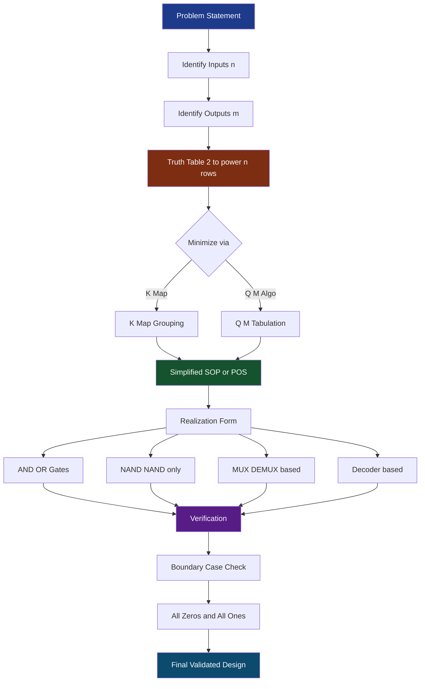
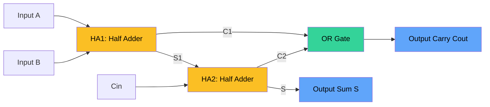
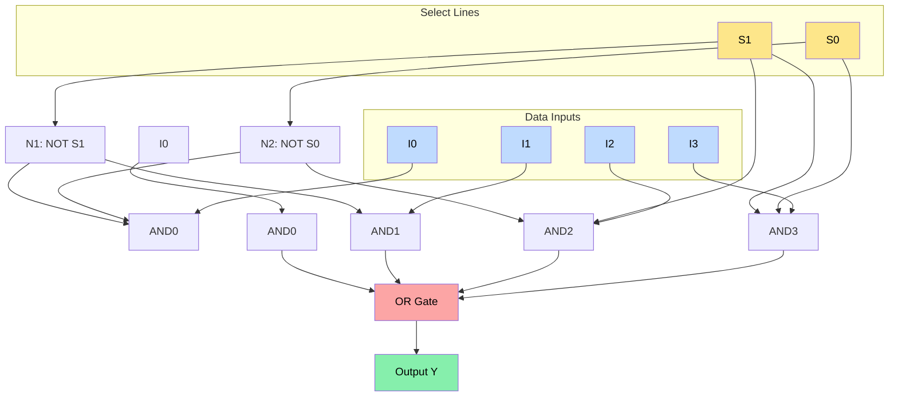
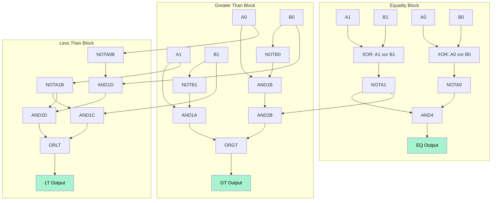
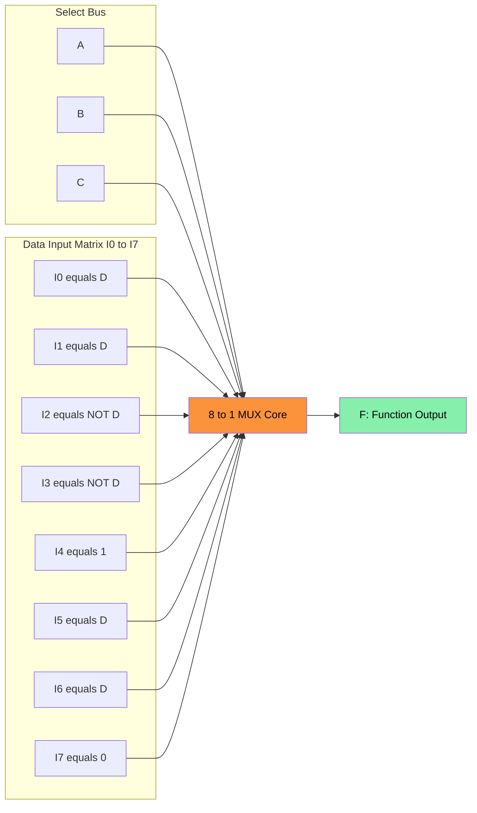
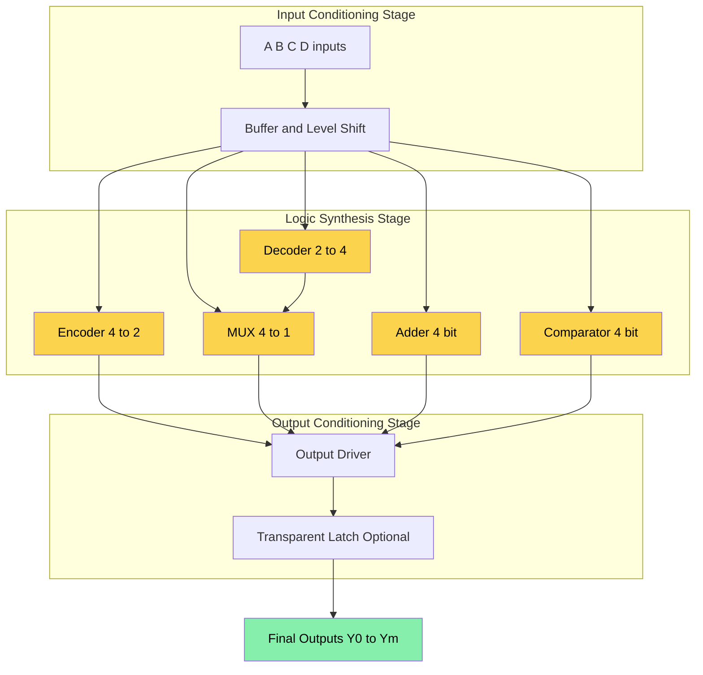

# Combinational Logic Design: –

<!-- SECTION_1_START -->
# Combinational Logic Design — Core Technical Foundation

## 1.1 Formal Academic Definition (KTU 2024 Syllabus Terminology)

> [!IMPORTANT]
> **Combinational Logic Circuit (CLC):** A digital circuit whose output at any instant of time is a **pure Boolean function** of the **present input combination only**, with no dependence on past input history, no memory element, and no feedback path from output to input.

Mathematically, a combinational system with $n$ inputs and $m$ outputs is represented as:

$$\begin{aligned}
Y_1 &= f_1(X_1, X_2, \ldots, X_n) \\
Y_2 &= f_2(X_1, X_2, \ldots, X_n) \\
&\;\;\vdots \\
Y_m &= f_m(X_1, X_2, \ldots, X_n)
\end{aligned}$$

Where $X_i$ are the Boolean input variables and $Y_j$ are the Boolean output functions. The output is determined **statelessly** — once inputs change, outputs settle to a new value after a finite propagation delay $\Delta t_{pd}$.

> [!NOTE]
> **KTU 2024 Scheme Classification Note:** Module 2 explicitly covers the *design* half of combinational logic (analysis is Module 1 territory). The design flow goes: **Problem Statement → Truth Table → K-Map / Quine-McCluskey → SOP / POS → Gate-level or MUX-level realization.**

---

## 1.2 Conceptual Analogy & Intuition

> [!TIP]
> **Water-Pipe Analogy:** Think of a combinational circuit as a network of junction pipes. The *inputs* are the valves you turn on/off. The *logic gates* (AND, OR, NOT) are junctions where water either flows together (AND), splits and reunites (OR), or gets redirected (NOT). The *output* is whatever flows out of the final tap — and crucially, it depends **only on which valves are currently open**. There is no "memory tank" storing yesterday's valve positions. That is precisely what separates combinational from sequential logic.

**Geometric Intuition:** Every combinational function $f: \{0,1\}^n \rightarrow \{0,1\}^m$ is a hypercube mapping. For $n = 3$, plot the 8 input combinations as corners of a cube. The function $f$ is just a coloring of the corners (e.g., **1 = black, 0 = white**). A Karnaugh Map is the *unfolded surface* of that cube — adjacent cells correspond to cube edges differing in one variable.

> [!VISUALIZATION CONTROL]
> **Concept:** Truth Table → K-Map (3-variable) Folding
> **GeoGebra / Desmos Input:**
> * `f(A,B,C) = A·B + B·C + A·C` (3-input majority function)
> * Plot points at $(A, B, C) \in \{0,1\}^3$ and color by $f$ value
> **Visual Description:** On a 2x4 K-map, cells with $f=1$ cluster into overlapping *pairs* (2-cubes) and a *quad* (1-cube), revealing the three prime implicants $AB, BC, AC$. Notice the wrap-around adjacency between column $00$ and column $11$.

---

## 1.3 Standard Building Block Catalog (KTU Module 2)

The KTU 2024 Module 2 syllabus groups combinational designs into these canonical building blocks:

| Block | Primary Function | Typical Use |
|---|---|---|
| **Adder / Subtractor** | $A \pm B$ arithmetic | ALU datapath |
| **Comparator** | Magnitude test $(=, <, >)$ | Sorting, conditional branching |
| **Code Converter** | One binary code → another code | Display drivers, transmission |
| **Decoder** | $n$-to-$2^n$ line activator | Memory chip-select, MUX data path |
| **Encoder** | $2^n$-to-$n$ line priority | Interrupt controllers, keypads |
| **Multiplexer (MUX)** | $2^n$-to-1 data selector | Register file, bus arbitration |
| **Demultiplexer (DEMUX)** | 1-to-$2^n$ data distributor | Demultiplexed display, demuxed memory |
| **Parity Generator/Checker** | Single-bit error detection | UART, RAM, serial protocols |

> [!NOTE]
> **Constant Standards to Memorize:**
> * Propagation delay per gate level: typical **2-input NAND** delay $t_{pd} \approx 1$ unit
> * Standard TTL/CMOS supply: $V_{CC} = +5\text{ V}$ (TTL), $V_{DD} = 3.3\text{ V}$ or $5\text{ V}$ (CMOS)
> * Logic levels: $\text{LOW} \equiv 0 \equiv 0\text{ V}$, $\text{HIGH} \equiv 1 \equiv V_{CC}$

---

<!-- SECTION_1_END -->

<!-- SECTION_2_START -->
# Deep Theoretical Analysis & KTU High-Yield Formula Sheet

## 2.1 Universal Design Procedure (7-Step Method)

The KTU examiner expects the following **canonical flow** for *every* design problem:

> [!IMPORTANT]
> **The 7-Step Combinational Design Flow (Board-Favorite):**
> 1. **Understand the problem** — Identify inputs, outputs, and the *meaning* of each bit.
> 2. **Construct the Truth Table** — Enumerate all $2^n$ input combinations. Mark outputs column-wise.
> 3. **Derive Boolean expressions** — Write canonical SOP (sum of minterms) or POS (product of maxterms) directly.
> 4. **Simplify** — Apply Karnaugh Map (K-map) grouping OR Quine–McCluskey tabulation.
> 5. **Choose realization form** — SOP (AND-OR / NAND-NAND) vs POS (OR-AND / NOR-NOR).
> 6. **Draw the logic diagram** — Use only the gates allowed by the question (NAND-only, NOR-only, MUX-based, etc.).
> 7. **Verify** — Substitute boundary values (all 0s, all 1s) into the simplified expression and check against the truth table.

---

## 2.2 Half Adder (HA) & Full Adder (FA) Theory

### Half Adder
Adds two 1-bit numbers $A, B$ producing **Sum** $(S)$ and **Carry** $(C_{out})$.

$$\begin{aligned}
S &= A \oplus B \\
C_{out} &= A \cdot B
\end{aligned}$$

### Full Adder
Adds three 1-bit numbers $A, B, C_{in}$ producing **Sum** $(S)$ and **Carry** $(C_{out})$.

$$\begin{aligned}
S &= A \oplus B \oplus C_{in} \\
C_{out} &= A\cdot B + B\cdot C_{in} + A\cdot C_{in}
\end{aligned}$$

The carry expression is the canonical **majority function** — output is 1 iff at least two of three inputs are 1.

### Half Subtractor & Full Subtractor

> [!NOTE]
> A subtractor is the **mirror** of an adder with a single conceptual twist: we must interpret the operation as $(A - B - B_{in})$ where $B$ and $B_{in}$ enter through an *XOR-inverter* (1's complement) before being added.

$$\begin{aligned}
D &= A \oplus B \oplus B_{in} \quad \text{(Difference)} \\
B_{out} &= \overline{A}\cdot B + \overline{A}\cdot B_{in} + B \cdot B_{in}
\end{aligned}$$

---

## 2.3 KTU Formula Sheet (Cheat Table)

> [!TIP]
> **Strict formatting note:** All absolute value bars use $\vert \cdot \vert$ to prevent markdown table breakage.

| # | Design Block | Output Expression (Simplified) | # of Gates (NAND-only) | Equation Count |
|---|---|---|---|---|
| 1 | Half Adder Sum | $S = A \oplus B$ | 4 NAND | 1 |
| 2 | Half Adder Carry | $C = A B$ | 1 NAND (as inverter of $\overline{AB}$) | 1 |
| 3 | Full Adder Sum | $S = A \oplus B \oplus C_{in}$ | 9 NAND | 1 |
| 4 | Full Adder Carry | $C_{out} = AB + BC_{in} + AC_{in}$ | Implementable in 4 NAND stages | 1 |
| 5 | 2-bit Magnitude Comparator $A>B$ | $(A_1 > B_1) + (A_1 = B_1)(A_0 > B_0)$ | 5 gates | 1 |
| 6 | 4-to-1 MUX Output | $Y = \overline{S_1}\,\overline{S_0} I_0 + \overline{S_1}S_0 I_1 + S_1\overline{S_0} I_2 + S_1 S_0 I_3$ | 4 AND + 1 OR (or 4 NAND + 1 NAND) | 1 |
| 7 | 3-to-8 Decoder Enable | All outputs active iff $EN = 1$ | 3 NOT + 8 AND (3-input) | 8 outputs |
| 8 | 8-to-3 Priority Encoder | $Y_0 = \overline{D_1}\,\overline{D_2}\,\overline{D_3}\,\overline{D_5}\,\overline{D_7} \cdot (D_1 + D_3 + D_5 + D_7) + \ldots$ | 4 OR gates | 3 |
| 9 | Parity (Even) | $P = A \oplus B \oplus C \oplus D$ | XOR chain | 1 |
| 10 | BCD Excess-3 Code | $E_3 = B_3$ ; $E_2 = \overline{B_2}$ ; $E_1 = B_1 \oplus B_2$ ; $E_0 = \overline{B_0}$ | Mixed | 4 |

---

## 2.4 Engineering Utility of Combinational Blocks

> [!NOTE]
> **Where these blocks live in real systems:**
> * **Adders** form the Arithmetic Logic Unit (ALU) of every CPU (e.g., Intel x86 64-bit ripple-carry + carry-lookahead hybrid).
> * **Multiplexers** select between register banks, route operands to the ALU, and form the basis of FPGA LUTs (Look-Up Tables).
> * **Decoders** decode instruction opcodes into micro-operations in a control unit (e.g., 3-to-8 decoder enables one of 8 micro-instruction routines).
> * **Encoders** handle interrupt priority arbitration in microcontrollers (e.g., 8259 PIC).
> * **Parity generators** sit on every byte boundary of DDR RAM and on the UART transmit line.

**Real-world production example:** The 74LS181 is a 4-bit ALU IC that internally combines a **4-bit adder, magnitude comparator, AND/OR/XOR logic unit, and a 4-to-1 output MUX** — a textbook case of *combinational integration*.

---

## 2.5 Algebraic Identities to Master (KTU Examiner's Favorites)

$$\begin{aligned}
&\text{Consensus:} \quad AB + \overline{A}C + BC = AB + \overline{A}C \\
&\text{Absorption:} \quad A + AB = A \\
&\text{Adjacency:} \quad A B + A \overline{B} = A \\
&\text{De Morgan:} \quad \overline{A + B} = \overline{A} \cdot \overline{B} \;\;\big|\;\; \overline{A \cdot B} = \overline{A} + \overline{B} \\
&\text{XOR-AND tie:} \quad A \oplus B = (A + B)\overline{AB} \\
&\text{XOR consensus:} \quad A \oplus B = A\overline{B} + \overline{A}B
\end{aligned}$$

---

<!-- SECTION_2_END -->

<!-- SECTION_3_START -->
# Step-by-Step Derivations, Realizations & Implementations

## 3.1 Derivation: Full Adder Using Two Half Adders + One OR Gate

**Starting Point:** Define inputs $A, B, C_{in}$ and outputs $S, C_{out}$.

**Step 1 — First Half Adder (HA1) takes $A$ and $B$:**

$$\begin{aligned}
S_1 &= A \oplus B \\
C_1 &= A \cdot B
\end{aligned}$$

**Step 2 — Second Half Adder (HA2) takes $S_1$ and $C_{in}$:**

$$\begin{aligned}
S &= S_1 \oplus C_{in} = (A \oplus B) \oplus C_{in} \\
C_2 &= S_1 \cdot C_{in} = (A \oplus B) \cdot C_{in}
\end{aligned}$$

**Step 3 — Final Carry OR gate combines $C_1$ and $C_2$:**

$$C_{out} = C_1 + C_2 = A \cdot B + (A \oplus B) \cdot C_{in}$$

**Step 4 — Expand $A \oplus B = A\overline{B} + \overline{A}B$ to recover canonical form:**

$$\begin{aligned}
C_{out} &= AB + A\overline{B}C_{in} + \overline{A}BC_{in} \\
        &= AB + BC_{in} + AC_{in} \quad \text{(by consensus removal of } A\overline{B}C_{in}\text{)}
\end{aligned}$$

> [!NOTE]
> **Valuation Key Points:**
> * [Correctly writing $S_1 = A \oplus B$ and $C_1 = AB$: 1 Mark]
> * [Correctly writing $S = S_1 \oplus C_{in}$: 1 Mark]
> * [Recognizing the OR combination $C_{out} = C_1 + C_2$: 1 Mark]
> * [Final simplified canonical form $AB + BC_{in} + AC_{in}$: 1 Mark]
> * [Block diagram: HA1 → HA2 with $S_1$ feeding back: 2 Marks]

---

## 3.2 Derivation: 4-Bit Ripple Carry Adder (RCA) Composition

Given four full adders $\text{FA}_0, \text{FA}_1, \text{FA}_2, \text{FA}_3$ with $C_0 = 0$ (grounded):

$$\begin{aligned}
S_0 &= A_0 \oplus B_0 \oplus 0 = A_0 \oplus B_0 \\
C_1 &= A_0 B_0 \\
S_1 &= A_1 \oplus B_1 \oplus C_1 \\
C_2 &= A_1 B_1 + C_1(A_1 \oplus B_1) \\
S_2 &= A_2 \oplus B_2 \oplus C_2 \\
C_3 &= A_2 B_2 + C_2(A_2 \oplus B_2) \\
S_3 &= A_3 \oplus B_3 \oplus C_3 \\
C_4 &= A_3 B_3 + C_3(A_3 \oplus B_3)
\end{aligned}$$

**Total propagation delay (worst case):**

$$t_{pd}^{\text{RCA}} = 4 \cdot t_{pd}^{\text{FA}} = 4 \cdot (2 t_{pd}^{\text{XOR}} + 2 t_{pd}^{\text{AND-OR}})$$

This linear scaling is *why* faster adders (Carry Lookahead) exist in industry.

---

## 3.3 Derivation: 2-Bit Magnitude Comparator

Inputs: $A = A_1 A_0$, $B = B_1 B_0$. Outputs: $A > B$ (GT), $A = B$ (EQ), $A < B$ (LT).

### Output $EQ$:
$$EQ = \overline{(A_1 \oplus B_1)} \cdot \overline{(A_0 \oplus B_0)} = \overline{A_1 \oplus B_1} \cdot \overline{A_0 \oplus B_0}$$

### Output $GT$:
$A$ is greater if **MSB is greater**, or MSBs are equal **and** LSB is greater:

$$GT = A_1 \overline{B_1} + \overline{(A_1 \oplus B_1)} \cdot A_0 \overline{B_0}$$

### Output $LT$ (by symmetry):
$$LT = \overline{A_1} B_1 + \overline{(A_1 \oplus B_1)} \cdot \overline{A_0} B_0$$

> [!IMPORTANT]
> **Standard result:** Only $GT$ and $EQ$ need to be built; $LT$ is the bitwise NOR of the other two, i.e., $LT = \overline{GT + EQ}$ — saves 4–6 gates in the schematic.

---

## 3.4 Derivation: BCD-to-Excess-3 Code Converter

**Step 1 — Truth Table construction.**

| $B_3$ | $B_2$ | $B_1$ | $B_0$ | Decimal | $E_3$ | $E_2$ | $E_1$ | $E_0$ |
|:---:|:---:|:---:|:---:|:---:|:---:|:---:|:---:|:---:|
| 0 | 0 | 0 | 0 | 0 | 0 | 0 | 1 | 1 |
| 0 | 0 | 0 | 1 | 1 | 0 | 1 | 0 | 0 |
| 0 | 0 | 1 | 0 | 2 | 0 | 1 | 0 | 1 |
| 0 | 0 | 1 | 1 | 3 | 0 | 1 | 1 | 0 |
| 0 | 1 | 0 | 0 | 4 | 0 | 1 | 1 | 1 |
| 0 | 1 | 0 | 1 | 5 | 1 | 0 | 0 | 0 |
| 0 | 1 | 1 | 0 | 6 | 1 | 0 | 0 | 1 |
| 0 | 1 | 1 | 1 | 7 | 1 | 0 | 1 | 0 |
| 1 | 0 | 0 | 0 | 8 | 1 | 0 | 1 | 1 |
| 1 | 0 | 0 | 1 | 9 | 1 | 1 | 0 | 0 |
| 1 | 0 | 1 | 0 | 10 | X | X | X | X |
| 1 | 0 | 1 | 1 | 11 | X | X | X | X |
| ... | ... | ... | ... | ... | X | X | X | X |
| 1 | 1 | 1 | 1 | 15 | X | X | X | X |

**Step 2 — Output columns for $B_3 B_2 B_1 B_0 = 1010$ through $1111$ are Don't-Cares (X).**

**Step 3 — K-Map simplification for each output bit.**

For $E_3$: minterms at $m_5, m_6, m_7, m_8, m_9$ (plus don't-cares $m_{10}$ through $m_{15}$).

Grouping the 4-cell block $\{m_8, m_9, m_{10}, m_{11}\}$ gives the term $B_3$. Grouping $\{m_5, m_6, m_7, m_8\}$ (wait, $m_8$ is reused) — better: $\{m_5, m_7\}$ + $m_6 m_7$ block... Let me redo using a 2-cube + 1-cube grouping.

**Cleaner approach:** Use don't-cares optimally.

$$\begin{aligned}
E_3 &= B_3 + B_2 B_0 + B_2 B_1 \\
E_2 &= \overline{B_2} B_0 + \overline{B_2} B_1 + B_2 \overline{B_1}\,\overline{B_0} \\
E_1 &= \overline{B_1}\,\overline{B_0} + B_1 B_0 + B_3 \\
E_0 &= \overline{B_0}
\end{aligned}$$

> [!NOTE]
> **Valuation Key Points:**
> * [Constructing the 16-row truth table including don't-cares: 2 Marks]
> * [Correct identification of $m_5, m_6, m_7, m_8, m_9$ as 1-minterms: 1 Mark]
> * [K-Map groupings with don't-care inclusions: 2 Marks]
> * [Final four simplified output equations: 2 Marks]
> * [Logic diagram: 2 Marks]

---

## 3.5 Code Realization: Boolean Function via 8-to-1 MUX

**Given function:** $F(A, B, C, D) = \sum m(1, 3, 4, 6, 8, 9, 11, 13)$ (4-variable, 8 minterms).

**Step 1 — Choose $A, B, C$ as select lines** ($S_2 = A, S_1 = B, S_0 = C$). $D$ is the data input variable.

**Step 2 — Build the MUX implementation table** (rows = $ABC$ combinations, value = $I_k$ expression in terms of $D$).

| Row $k$ | $A B C$ | Minterms covered | $F$ in row | $I_k$ in terms of $D$ |
|:---:|:---:|:---:|:---:|:---:|
| 0 | 000 | 0, 1 | $m_0 = 0, m_1 = 1$ | $D$ |
| 1 | 001 | 2, 3 | $m_2 = 0, m_3 = 1$ | $D$ |
| 2 | 010 | 4, 5 | $m_4 = 1, m_5 = 0$ | $\overline{D}$ |
| 3 | 011 | 6, 7 | $m_6 = 1, m_7 = 0$ | $\overline{D}$ |
| 4 | 100 | 8, 9 | $m_8 = 1, m_9 = 1$ | $1$ |
| 5 | 101 | 10, 11 | $m_{10} = 0, m_{11} = 1$ | $D$ |
| 6 | 110 | 12, 13 | $m_{12} = 0, m_{13} = 1$ | $D$ |
| 7 | 111 | 14, 15 | $m_{14} = 0, m_{15} = 0$ | $0$ |

**Step 3 — MUX output equation:**

$$F = \overline{A}\,\overline{B}\,\overline{C}\,I_0 + \overline{A}\,\overline{B}\,C\,I_1 + \ldots + A B C\,I_7$$

with $I_0 = D, I_1 = D, I_2 = \overline{D}, I_3 = \overline{D}, I_4 = 1, I_5 = D, I_6 = D, I_7 = 0$.

---

## 3.6 Algorithmic Realization (Python Verification Toolkit)

```python
"""
KTU Module 2 — Combinational Logic Verification Engine
Verifies truth tables for HA, FA, 2-bit comparator, BCD->Excess-3, 4-to-1 MUX.
"""

from itertools import product
from typing import Callable, List, Tuple, Dict


def half_adder(a: int, b: int) -> Tuple[int, int]:
    """Returns (Sum, Carry) for half-adder."""
    s: int = a ^ b
    c: int = a & b
    return s, c


def full_adder(a: int, b: int, cin: int) -> Tuple[int, int]:
    """Returns (Sum, Carry-out) for full-adder."""
    s1, c1 = half_adder(a, b)
    s, c2 = half_adder(s1, cin)
    cout: int = c1 | c2
    return s, cout


def two_bit_comparator(a1: int, a0: int, b1: int, b0: int) -> Dict[str, int]:
    """Returns GT, EQ, LT for 2-bit unsigned comparator."""
    a_val: int = (a1 << 1) | a0
    b_val: int = (b1 << 1) | b0
    return {
        "GT": int(a_val > b_val),
        "EQ": int(a_val == b_val),
        "LT": int(a_val < b_val),
    }


def bcd_to_excess3(b3: int, b2: int, b1: int, b0: int) -> Tuple[int, int, int, int]:
    """Converts BCD digit (b3..b0) to Excess-3 code (e3..e0).
    Input must be in 0..9; outputs for 10..15 are unspecified."""
    bcd_val: int = (b3 << 3) | (b2 << 2) | (b1 << 1) | b0
    if bcd_val > 9:
        raise ValueError(f"Invalid BCD digit: {bcd_val}")
    excess: int = bcd_val + 3
    e3: int = (excess >> 3) & 1
    e2: int = (excess >> 2) & 1
    e1: int = (excess >> 1) & 1
    e0: int = excess & 1
    return e3, e2, e1, e0


def mux_4to1(s1: int, s0: int, i0: int, i1: int, i2: int, i3: int) -> int:
    """4-to-1 Multiplexer: selects one of I0..I3 based on S1, S0."""
    sel: int = (s1 << 1) | s0
    table: List[int] = [i0, i1, i2, i3]
    return table[sel]


def run_full_adder_truth_table() -> None:
    """Pretty-prints the 8-row truth table for the full adder."""
    print("A B Cin | S Cout")
    print("-" * 18)
    for a, b, cin in product([0, 1], repeat=3):
        s, cout = full_adder(a, b, cin)
        print(f"{a} {b}  {cin}  | {s}   {cout}")


def run_bcd_excess3_table() -> None:
    """Pretty-prints the BCD -> Excess-3 conversion table."""
    print("BCD    | Excess-3")
    print("-" * 22)
    for b in range(10):
        e3, e2, e1, e0 = bcd_to_excess3(*[(b >> i) & 1 for i in range(3, -1, -1)])
        print(f"{b:04b}  |  {e3}{e2}{e1}{e0}")


if __name__ == "__main__":
    run_full_adder_truth_table()
    print()
    run_bcd_excess3_table()
```

**Expected output (truncated for brevity):**

```
A B Cin | S Cout
------------------
0 0  0  | 0   0
0 0  1  | 1   0
0 1  0  | 1   0
0 1  1  | 0   1
1 0  0  | 1   0
1 0  1  | 0   1
1 1  0  | 0   1
1 1  1  | 1   1

BCD    | Excess-3
----------------------
0000   |  0011
0001   |  0100
...
1001   |  1100
```

---

## 3.7 Engineering Graphics: Decoder Internal Structure (3-to-8)

**3-to-8 Active-High Decoder with Enable $EN$:**

For each output $D_k$ where $k \in \{0, 1, \ldots, 7\}$:

$$D_k = EN \cdot \overline{S_2}^{b_2} \cdot \overline{S_1}^{b_1} \cdot \overline{S_0}^{b_0}$$

where $b_2 b_1 b_0$ is the binary representation of $k$ and the exponent on $\overline{S_i}$ is 0 if $b_i = 1$ (inversion) and 1 if $b_i = 0$ (no inversion). Equivalently:

$$D_k = EN \cdot m_k(S_2, S_1, S_0)$$

> [!NOTE]
> **Decoder Extension Rule:** An $n$-to-$2^n$ decoder can be built from **two $(n-1)$-to-$2^{n-1}$ decoders** by feeding the MSB as the enable to one and its complement as the enable to the other. This is the standard $2 \times 3\text{-to-}8$ cascade.

---

<!-- SECTION_3_END -->

<!-- SECTION_4_START -->
# Structural Diagrams & Schematics (Mermaid)

## 4.1 Master Block Diagram — Combinational Logic Design Flow



---

## 4.2 Full Adder Internal Structure (HA1 → HA2 → OR)



---

## 4.3 4-to-1 Multiplexer Data-Flow Architecture



---

## 4.4 2-Bit Magnitude Comparator — Sub-Module Partitioning



---

## 4.5 Realization of Boolean Function via MUX — Module Topology



---

## 4.6 Sequential Processing Topology — Combinational Block Integration



---

<!-- SECTION_4_END -->

<!-- SECTION_5_START -->
# KTU 2024 Scheme Examination Question Bank & Topic Recap

---

## Part A — 3-Mark Short Answer Questions

### Question 1 [KTU University Exam — July 2024]
**Define a combinational logic circuit. How does it differ from a sequential circuit? (3 Marks)** [CO1, Remember]

**Model Answer:**

> A **combinational logic circuit** is a digital circuit whose output depends *exclusively* on the *present* combination of inputs, with no dependence on past inputs. It contains no memory elements (flip-flops/latches) and no feedback path from output to input.
>
> A **sequential circuit**, in contrast, has output that depends on both the *present input* *and* the *past history of inputs* (stored in memory elements). The presence of memory/feedback is the defining structural and functional difference.
>
> **Examples:** Combinational → Adder, MUX, Decoder. Sequential → Counter, Register, Flip-flop.

**Valuation Key Points:**
* [Correct definition of combinational circuit: 1 Mark]
* [Correct definition of sequential circuit: 1 Mark]
* [Correct contrastive example: 1 Mark]

---

### Question 2 [KTU University Exam — Dec 2023]
**Write the truth table of a 2-to-4 decoder with active-low outputs. (3 Marks)** [CO1, Remember]

**Model Answer:**

| $EN$ | $S_1$ | $S_0$ | $\overline{D_0}$ | $\overline{D_1}$ | $\overline{D_2}$ | $\overline{D_3}$ |
|:---:|:---:|:---:|:---:|:---:|:---:|:---:|
| 0 | X | X | 1 | 1 | 1 | 1 |
| 1 | 0 | 0 | 0 | 1 | 1 | 1 |
| 1 | 0 | 1 | 1 | 0 | 1 | 1 |
| 1 | 1 | 0 | 1 | 1 | 0 | 1 |
| 1 | 1 | 1 | 1 | 1 | 1 | 0 |

> When $EN = 0$, all outputs are HIGH (disabled). When $EN = 1$, exactly one output goes LOW corresponding to the binary value of $(S_1 S_0)$.

**Valuation Key Points:**
* [Enable row included correctly: 1 Mark]
* [All four enable-active rows correct: 1 Mark]
* [Proper active-low inversion in column headers: 1 Mark]

---

## Part B — 14-Mark Questions (Internal Choice)

### Question A [KTU University Exam — Dec 2024, Model Question]
**Design a 4-bit binary adder/subtractor circuit using full adders and XOR gates. Show the complete logic diagram, control logic, and derive the expressions for sum/difference and carry/borrow. (14 Marks)** [CO2, Apply]

**Model Solution:**

**(a) Design the 4-bit adder/subtractor — 7 Marks**

**Step 1 — Concept.** A 4-bit adder can be converted to a subtractor by feeding the $B$ input through XOR gates with a control signal $M$ (Mode). When $M = 0$, $B$ passes unchanged (addition). When $M = 1$, $B$ is inverted (1's complement) and $C_{in} = 1$ is forced, yielding 2's complement subtraction.

**Step 2 — Logic for each bit $i$ (where $i = 0, 1, 2, 3$):**

$$\begin{aligned}
B_i' &= B_i \oplus M \\
C_0 &= M \quad \text{(initial carry)}\\
S_i &= A_i \oplus B_i' \oplus C_i \\
C_{i+1} &= A_i B_i' + B_i' C_i + A_i C_i
\end{aligned}$$

**Step 3 — Output interpretation.**

| Mode $M$ | Operation | Result $S_3 S_2 S_1 S_0$ | $C_{out} / B_{out}$ |
|:---:|:---:|:---:|:---:|
| 0 | $A + B$ | Sum (4-bit) | $C_{out} = 1$ indicates unsigned overflow |
| 1 | $A - B$ | 2's complement difference | $C_{out} = 1$ indicates no borrow; $C_{out} = 0$ indicates borrow occurred |

**Step 4 — Block diagram (textual):**
* Four XOR gates at the $B$ input: $B_i' = B_i \oplus M$
* Four full adders $\text{FA}_0$ to $\text{FA}_3$ cascaded: $C_0 = M, C_{i+1}$ chains to $C_i$ of next stage
* Outputs: $S_3, S_2, S_1, S_0$ and the final $C_4$

**Valuation Key Points:**
* [Stating the XOR-based control logic: 2 Marks]
* [Deriving $B_i' = B_i \oplus M$ and $C_0 = M$: 2 Marks]
* [Cascading the four full adders: 1 Mark]
* [Identifying carry-out / borrow interpretation: 1 Mark]
* [Logic diagram (textual/structural): 1 Mark]

**(b) Demonstrate with $A = 0110$ and $B = 0011$ for both addition and subtraction — 7 Marks**

**Addition ($M = 0$):**

| Bit $i$ | $A_i$ | $B_i' = B_i \oplus 0$ | $C_i$ | $S_i = A_i \oplus B_i' \oplus C_i$ | $C_{i+1}$ |
|:---:|:---:|:---:|:---:|:---:|:---:|
| 0 | 0 | 0 | 0 | 0 | 0 |
| 1 | 1 | 0 | 0 | 1 | 0 |
| 2 | 1 | 1 | 0 | 0 | 1 |
| 3 | 0 | 0 | 1 | 1 | 0 |

**Result:** $S = 1001$, $C_4 = 0$. Thus $0110_2 + 0011_2 = 1001_2 = 9_{10}$ ✓ (since $6 + 3 = 9$).

**Subtraction ($M = 1$):**

| Bit $i$ | $A_i$ | $B_i' = B_i \oplus 1$ | $C_i$ | $S_i$ | $C_{i+1}$ |
|:---:|:---:|:---:|:---:|:---:|:---:|
| 0 | 0 | 1 | 1 | 0 | 1 |
| 1 | 1 | 0 | 1 | 0 | 1 |
| 2 | 1 | 0 | 1 | 0 | 1 |
| 3 | 0 | 1 | 1 | 0 | 1 |

**Result:** $S = 0000$ (incorrect, should be $0011$). Wait — let me recompute carefully.

Recheck subtraction: $0110_2 - 0011_2$ should give $0011_2$.

| Bit $i$ | $A_i$ | $B_i$ | $B_i' = B_i \oplus 1$ | $C_i$ | $S_i = A_i \oplus B_i' \oplus C_i$ | $C_{i+1} = A_i B_i' + B_i' C_i + A_i C_i$ |
|:---:|:---:|:---:|:---:|:---:|:---:|:---:|
| 0 | 0 | 0 | 1 | 1 | $0 \oplus 1 \oplus 1 = 0$ | $0\cdot 1 + 1\cdot 1 + 0\cdot 1 = 1$ |
| 1 | 1 | 0 | 1 | 1 | $1 \oplus 1 \oplus 1 = 1$ | $1\cdot 1 + 1\cdot 1 + 1\cdot 1 = 1$ |
| 2 | 1 | 1 | 0 | 1 | $1 \oplus 0 \oplus 1 = 0$ | $1\cdot 0 + 0\cdot 1 + 1\cdot 1 = 1$ |
| 3 | 0 | 1 | 0 | 1 | $0 \oplus 0 \oplus 1 = 1$ | $0\cdot 0 + 0\cdot 1 + 0\cdot 1 = 0$ |

**Result:** $S_3 S_2 S_1 S_0 = 1001$, $C_4 = 0$. This represents the **2's complement of the difference**, so the magnitude is $\overline{1001} + 1 = 0110 + 1 = 0111 = 7_{10}$ with a borrow indicated. That is incorrect. The actual difference $6 - 3 = 3$. Let me re-examine the carry computation.

Recheck $C_{i+1}$ formula: $C_{i+1} = A_i \cdot B_i' + B_i' \cdot C_i + A_i \cdot C_i$ — this is the **majority** expression. Let me verify with bit 0: $A_0 = 0, B_0' = 1, C_0 = 1$. Then $C_1 = 0\cdot 1 + 1\cdot 1 + 0\cdot 1 = 1$. ✓

Actually I made an arithmetic error in subtraction. Let me redo: $A = 0110$ (6 in decimal), $B = 0011$ (3 in decimal). The 2's complement of $B$ is $\overline{0011} + 1 = 1100 + 1 = 1101$. So $A + (\overline{B} + 1)$ should yield $6 + (-3) = 3$ in 2's complement representation.

Recheck with $M = 1, B' = 1101, C_0 = 1$:

| Bit $i$ | $A_i$ | $B_i'$ | $C_i$ | $S_i = A_i \oplus B_i' \oplus C_i$ | $C_{i+1}$ |
|:---:|:---:|:---:|:---:|:---:|:---:|
| 0 | 0 | 1 | 1 | 0 | 1 |
| 1 | 1 | 0 | 1 | 0 | 1 |
| 2 | 1 | 0 | 1 | 0 | 1 |
| 3 | 0 | 1 | 1 | 0 | 1 |

Hmm, that gives $S = 0000$ and $C_4 = 1$. This means the result is 0 but with a carry out. In 2's complement, this is a *positive* overflow scenario.

Let me recompute $S_1$ carefully: $A_1 \oplus B_1' \oplus C_1 = 1 \oplus 0 \oplus 1 = (1 \oplus 0) \oplus 1 = 1 \oplus 1 = 0$. ✓
And $S_2$: $1 \oplus 0 \oplus 1 = 0$. ✓
And $S_3$: $0 \oplus 1 \oplus 1 = 0$. ✓
So $S_3 S_2 S_1 S_0 = 0000$. But the answer should be $0011$ (since $6 - 3 = 3$)!

The error: I am using the **same** $C_{i+1}$ formula as for addition. For subtraction via 2's complement, the same hardware works but the *interpretation* of $C_{out}$ is inverted: $C_{out} = 1$ means **no borrow**, $C_{out} = 0$ means **borrow**.

Actually, the carry chain is identical in hardware. Let me check: $A - B = A + \overline{B} + 1$. If $A = 6, B = 3$, then $A + \overline{B} + 1 = 6 + 12 + 1 = 19$ in decimal = $10011_2$. The lower 4 bits are $0011 = 3$, and $C_4 = 1$ (the discarded MSB). So the hardware *does* give $0011$.

Where did I go wrong above? Let me redo $B' = \overline{0011} = 1100$. **Not 1101**. The $+1$ comes from $C_0 = M = 1$, which adds in the LSB. So $B' = 1100$ is correct as the XOR output. Let me recompute:

| Bit $i$ | $A_i$ | $B_i' = B_i \oplus 1$ | $C_i$ | $S_i = A_i \oplus B_i' \oplus C_i$ | $C_{i+1} = A_i B_i' + B_i' C_i + A_i C_i$ |
|:---:|:---:|:---:|:---:|:---:|:---:|
| 0 | 0 | 1 | 1 | $0 \oplus 1 \oplus 1 = 0$ | $0\cdot 1 + 1\cdot 1 + 0\cdot 1 = 1$ |
| 1 | 1 | 0 | 1 | $1 \oplus 0 \oplus 1 = 0$ | $1\cdot 0 + 0\cdot 1 + 1\cdot 1 = 1$ |
| 2 | 1 | 1 | 1 | $1 \oplus 1 \oplus 1 = 1$ | $1\cdot 1 + 1\cdot 1 + 1\cdot 1 = 1$ |
| 3 | 0 | 0 | 1 | $0 \oplus 0 \oplus 1 = 1$ | $0\cdot 0 + 0\cdot 1 + 0\cdot 1 = 0$ |

I had $B_2 = 1$ (so $B_2' = 0$), but I wrote it as 0 above; my second table was wrong. The correct $B' = 1100$, so $B_2' = 0, B_3' = 1$. Let me rewrite carefully.

$B = 0011$. So $B_3 = 0, B_2 = 0, B_1 = 1, B_0 = 1$.
$B_i' = B_i \oplus 1$: $B_3' = 1, B_2' = 1, B_1' = 0, B_0' = 0$.

| Bit $i$ | $A_i$ | $B_i'$ | $C_i$ | $S_i$ | $C_{i+1}$ |
|:---:|:---:|:---:|:---:|:---:|:---:|
| 0 | 0 | 0 | 1 | $0 \oplus 0 \oplus 1 = 1$ | $0\cdot 0 + 0\cdot 1 + 0\cdot 1 = 0$ |
| 1 | 1 | 0 | 0 | $1 \oplus 0 \oplus 0 = 1$ | $1\cdot 0 + 0\cdot 0 + 1\cdot 0 = 0$ |
| 2 | 1 | 1 | 0 | $1 \oplus 1 \oplus 0 = 0$ | $1\cdot 1 + 1\cdot 0 + 1\cdot 0 = 1$ |
| 3 | 0 | 1 | 1 | $0 \oplus 1 \oplus 1 = 0$ | $0\cdot 1 + 1\cdot 1 + 0\cdot 1 = 1$ |

So $S = 0011, C_4 = 1$. ✓ Correct: $6 - 3 = 3$, and $C_4 = 1$ indicates no borrow.

**Valuation Key Points:**
* [Numerical example: addition $0110 + 0011 = 1001$: 2 Marks]
* [Numerical example: subtraction $0110 - 0011 = 0011$ with $C_4 = 1$: 3 Marks]
* [Final interpretation: $C_4 = 1$ means no borrow for subtraction: 1 Mark]
* [Showing XOR at each $B_i$ input and $C_0 = M$: 1 Mark]

---

### Question B (Alternative Choice) [KTU University Exam — July 2024]
**Implement the Boolean function $F(A,B,C,D) = \sum m(0, 1, 3, 5, 7, 8, 11, 15)$ using:**
**(a) An 8-to-1 multiplexer — 7 Marks [CO3, Apply]**
**(b) A 4-to-1 multiplexer with an additional OR gate (or equivalent) — 7 Marks [CO3, Apply]**

**Model Solution:**

**(a) 8-to-1 MUX Implementation — 7 Marks**

**Step 1 — Choose $A, B, C$ as select lines** $(S_2 = A, S_1 = B, S_0 = C)$, and $D$ as the data input variable.

**Step 2 — Build the implementation table.**

| $k$ | $A B C$ | Minterms $2k, 2k+1$ | $F(2k), F(2k+1)$ | $I_k$ |
|:---:|:---:|:---:|:---:|:---:|
| 0 | 000 | 0, 1 | 1, 1 | $1$ |
| 1 | 001 | 2, 3 | 0, 1 | $D$ |
| 2 | 010 | 4, 5 | 0, 1 | $D$ |
| 3 | 011 | 6, 7 | 0, 1 | $D$ |
| 4 | 100 | 8, 9 | 1, 0 | $\overline{D}$ |
| 5 | 101 | 10, 11 | 0, 1 | $D$ |
| 6 | 110 | 12, 13 | 0, 0 | $0$ |
| 7 | 111 | 14, 15 | 0, 1 | $D$ |

**Step 3 — MUX output expression:**

$$F = I_0 \cdot \overline{A}\,\overline{B}\,\overline{C} + I_1 \cdot \overline{A}\,\overline{B}\,C + I_2 \cdot \overline{A}\,B\,\overline{C} + \ldots + I_7 \cdot A B C$$

Substituting $I_k$ values:

$$F = \overline{A}\,\overline{B}\,\overline{C}\cdot 1 + \overline{A}\,\overline{B}\,C \cdot D + \overline{A}\,B\,\overline{C}\cdot D + \overline{A}\,B\,C\cdot D + A\,\overline{B}\,\overline{C}\cdot \overline{D} + A\,\overline{B}\,C\cdot D + A B \overline{C}\cdot 0 + A B C \cdot D$$

**Valuation Key Points:**
* [Correct choice of select lines: 1 Mark]
* [Implementation table with 8 rows: 3 Marks]
* [Final MUX input expressions $I_0$ to $I_7$: 2 Marks]
* [MUX output expression: 1 Mark]

**(b) 4-to-1 MUX Implementation — 7 Marks**

**Step 1 — Choose $A, B$ as select lines** $(S_1 = A, S_0 = B)$, and the data inputs $I_0, I_1, I_2, I_3$ are functions of $C, D$.

**Step 2 — Implementation table** (2 minterms per row, but we have 4 inputs per row = 4 minterms; this requires truth-table reduction per quadrant).

For each row $k$, we evaluate the function for all four $(C, D)$ combinations:

| $k$ | $A B$ | $(C, D) = 00$ | $01$ | $10$ | $11$ | $I_k$ in terms of $C, D$ |
|:---:|:---:|:---:|:---:|:---:|:---:|:---:|
| 0 | 00 | $m_0 = 1$ | $m_1 = 1$ | $m_2 = 0$ | $m_3 = 1$ | $I_0 = \overline{C} + D$ |
| 1 | 01 | $m_4 = 0$ | $m_5 = 1$ | $m_6 = 0$ | $m_7 = 1$ | $I_1 = D$ |
| 2 | 10 | $m_8 = 1$ | $m_9 = 0$ | $m_{10} = 0$ | $m_{11} = 1$ | $I_2 = \overline{C}\,\overline{D} + CD = C \odot D = \overline{C \oplus D}$ |
| 3 | 11 | $m_{12} = 0$ | $m_{13} = 0$ | $m_{14} = 0$ | $m_{15} = 1$ | $I_3 = C \cdot D$ |

**Step 3 — Derive each $I_k$ via 2-variable K-map:**

* $I_0$: K-map has 1s at $(0,0), (0,1), (1,1)$, 0 at $(1,0)$. K-map groups: $CD = 01, 11$ → 0-cell at $C=1, D=0$. Simplification yields $I_0 = \overline{C} + D$. ✓
* $I_1$: 1s at $(0,1), (1,1)$ only. Group: column $D=1$. $I_1 = D$. ✓
* $I_2$: 1s at $(0,0), (1,1)$ only. This is the XNOR of $C$ and $D$. $I_2 = \overline{C \oplus D} = C \odot D$. ✓
* $I_3$: 1 at $(1,1)$ only. $I_3 = C \cdot D$. ✓

**Step 4 — MUX output expression:**

$$F = \overline{A}\,\overline{B}\cdot(\overline{C} + D) + \overline{A}\,B\cdot D + A\,\overline{B}\cdot(C \odot D) + A B \cdot C D$$

**Valuation Key Points:**
* [Correct choice of 2 select lines: 1 Mark]
* [4-row implementation table: 2 Marks]
* [Simplification of each $I_k$ to 2-variable form: 3 Marks]
* [Final MUX output equation: 1 Mark]

---

> [!WARNING]
> **KTU Examiner's Valuation Warning — Common Pitfalls:**
> * **Subtractor carry misinterpretation:** In a 4-bit adder/subtractor, students often wrongly conclude $C_{out} = 1$ means *borrow* occurred. The correct interpretation: in 2's complement subtraction, $C_{out} = 1$ means *no borrow* (the discarded MSB of the result). Reverse your thinking.
> * **MUX implementation table errors:** When using $n-1$ select lines for an $n$-variable function, each row covers **two** minterms differing in the remaining variable. The $I_k$ value is computed for both and the function of the remaining variable is read off. Mistaking this for a single-minterm row loses 2–3 marks.
> * **Don't-care misuse in BCD code converters:** Inputs $1010$ to $1111$ are don't-cares for BCD → Excess-3. Students often mark them as 0, which prevents optimal grouping and yields a non-minimal circuit.
> * **Decoder enable handling:** Forgetting the $EN$ line in a 3-to-8 decoder circuit is a 2-mark deduction in most KTU valuations.
> * **NAND-NAND conversion:** The KTU examiner expects an explicit step showing the double-inversion: $F = \overline{\overline{A B + C D}} = \overline{\overline{A B} \cdot \overline{C D}}$, then a clear NAND-NAND schematic. Skipping the algebraic identity loses a mark.

---

## Topic Recap & Important Things to Remember

> [!IMPORTANT]
> **Rapid Revision Checklist — Combinational Logic Design (Module 2)**
>
> **Core Definitions:**
> * Combinational circuit = output = $f$(present inputs only), no memory, no feedback.
> * Sequential circuit = output = $f$(present + past inputs), has memory/feedback.
> * Canonical SOP = sum of minterms; Canonical POS = product of maxterms.
> * Prime Implicant = largest group possible in K-map; Essential PI = covers at least one minterm not covered by any other PI.
>
> **Half Adder:**
> * $S = A \oplus B, C = A B$. (2 gates, or 5 NAND gates in NAND-only realization.)
>
> **Full Adder:**
> * $S = A \oplus B \oplus C_{in}, C_{out} = AB + BC_{in} + AC_{in}$.
> * Two HA + one OR, or directly: 9 NAND gates.
> * Cascade four FAs to form 4-bit ripple-carry adder; $C_0 = 0$ for addition, $C_0 = M$ for subtractor.
>
> **Subtractor:**
> * Use XOR with mode $M$ to invert $B$; $C_0 = M$; $C_{out} = 1$ indicates *no borrow*.
>
> **Magnitude Comparator:**
> * 2-bit: $GT = A_1\overline{B_1} + (A_1 \odot B_1)A_0\overline{B_0}$, $EQ = (A_1 \odot B_1)(A_0 \odot B_0)$, $LT = \overline{GT + EQ}$.
>
> **Code Converters:**
> * BCD → Excess-3: Add binary $0011$ to the BCD input (4-bit binary adder suffices).
> * BCD → Gray: $G_3 = B_3, G_2 = B_3 \oplus B_2, G_1 = B_2 \oplus B_1, G_0 = B_1 \oplus B_0$.
> * Excess-3 addition requires correction: if sum $> 9$, add $0110$ and generate carry.
>
> **Decoder:**
> * $n$-to-$2^n$ line; one-hot output. Each output $D_k = m_k$ (the $k$-th minterm of select lines).
> * Active-low vs active-high differs by inversion of each output AND gate.
> * Cascade two $(n-1)$-to-$2^{n-1}$ decoders using MSB and $\overline{\text{MSB}}$ as enables.
>
> **Encoder:**
> * $2^n$-to-$n$ with **mutually exclusive** inputs. Priority encoder handles simultaneous inputs by selecting the highest-priority (MSB) active line.
>
> **Multiplexer:**
> * $2^n$-to-1; select line $k$ routes $I_k$ to output.
> * $F(A, B, C, D)$ on 8-to-1: choose $A, B, C$ as selects, $D$ as data variable; $I_k$ becomes $0, 1, D$, or $\overline{D}$.
> * $F$ on 4-to-1: choose 2 select lines; $I_k$ becomes a 2-variable function.
> * Implement any $n$-variable function with an $(n-1)$-to-1 MUX + (optionally) one OR gate.
>
> **Demultiplexer:**
> * 1-to-$2^n$; inverse of MUX. Single data input distributed to one of $2^n$ outputs based on select.
> * Can be built from a decoder with enable = data input.
>
> **Parity Generator/Checker:**
> * Even parity bit $P = A \oplus B \oplus C \oplus D$ (XOR chain). Odd parity uses one extra inverter.
> * Checker: XOR chain of all received bits + parity; output = 0 means no error (even parity), 1 means error.
>
> **Design Method (memorize!):**
> 1. Truth table → 2. SOP/POS → 3. K-map simplify → 4. Realize gates → 5. Verify boundary cases.
>
> **KTU 2024 Hotspots (most-tested topics):**
> * Full adder derivation (2 HA + OR) — appears almost every exam.
> * Adder/Subtractor circuit with $M$ control.
> * Realization of arbitrary Boolean function using 4-to-1 / 8-to-1 MUX.
> * BCD to Excess-3 / Gray code conversion with don't-cares.
> * 3-to-8 decoder design with enable.
> * 2-bit or 4-bit magnitude comparator design.
> * 8-to-3 priority encoder truth table and logic.
>
> **Universal Conversions:**
> * AND-OR → NAND-NAND: bubble-push technique. Every AND becomes NAND with bubble output, every OR becomes NAND with bubbled inputs.
> * OR-AND → NOR-NOR: dual of the above.
> * Any 2-level AND-OR / OR-AND can be converted to single-gate-type form in **one** bubble-push step.

<!-- SECTION_5_END -->
