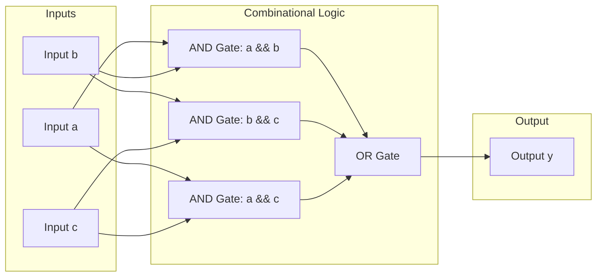
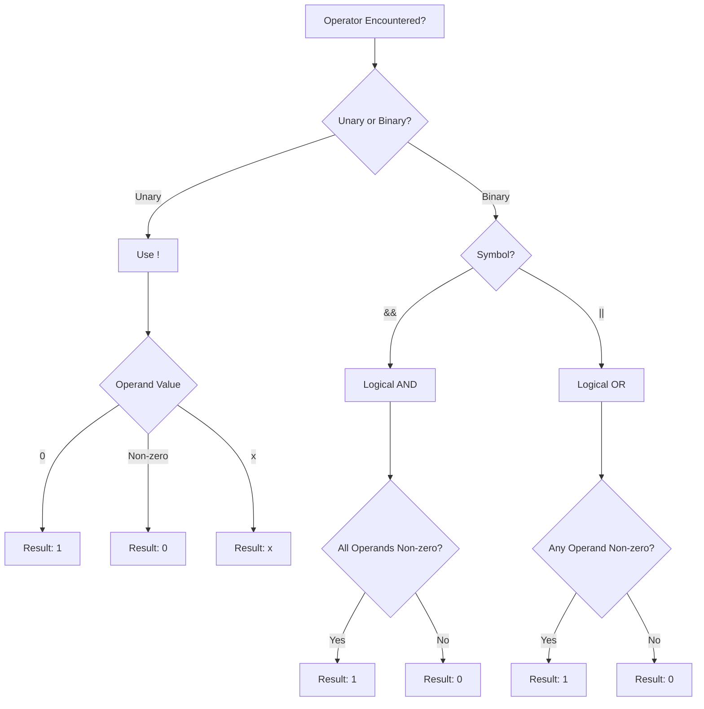
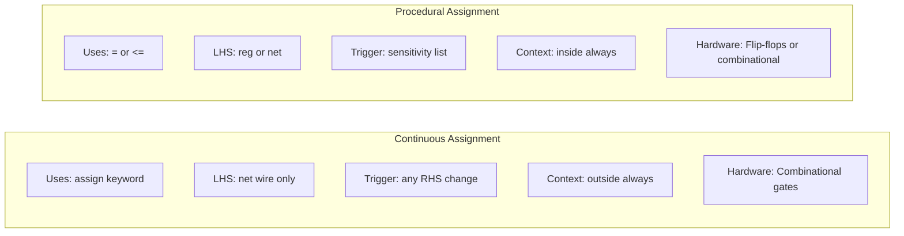
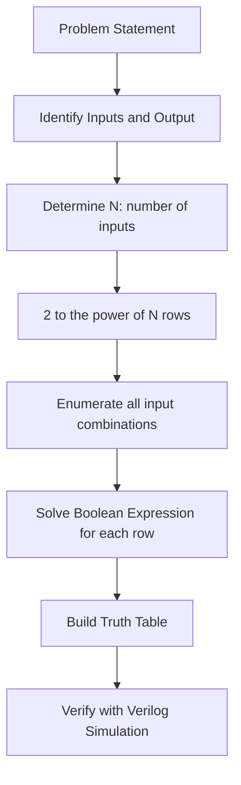

# Continuous assignment - Continuous Assignment with logical operators

<!-- SECTION_1_START -->

# Continuous Assignment with Logical Operators

> [!IMPORTANT]
> **KTU 2024 Scheme | GAEST305 | Module 2 — Combinational Logic Design**
> Continuous assignment is the **primary Verilog HDL construct** used to describe combinational logic at the **gate/dataflow level of abstraction**. It sits exactly between Gate-Level modeling and Behavioral modeling.

## 1.1 Formal Academic Definition

A **Continuous Assignment** in Verilog HDL is a procedural statement that **continuously and concurrently** drives a value onto a **net** (typically `wire`) whenever any of the signals on the right-hand side (RHS) of the expression change. The assignment uses the keyword `assign` and is evaluated at **simulation time zero (t = 0)** and re-evaluated **every time any operand on the RHS changes** — it has no memory and no clock dependency, making it ideal for modeling **combinational circuits**.

The general syntactic form is:

```
assign [strength] [delay] net_lvalue = expression;
```

A **Logical Operator** is a Verilog operator that performs a **Boolean logic operation on its operands**, treating them as **single-bit Boolean values** (a value is considered *true* if non-zero, *false* if zero). The three primary logical operators are:

| Operator | Meaning | Truth Return |
| :---: | :---: | :---: |
| `&&` | Logical AND | 1-bit (0 or 1) |
| `\|\|` | Logical OR | 1-bit (0 or 1) |
| `!`  | Logical NOT (unary) | 1-bit (0 or 1) |

> [!NOTE]
> **KTU Board Examiner Insight:** A common valuation trap is that the result of a logical operator is **always 1-bit** (either `1'b0` or `1'b1`), even when applied to multi-bit operands. This is fundamentally different from bitwise operators (`&`, `|`, `~`) which operate on every bit in parallel.

## 1.2 Conceptual Analogy — The "Live Wire" Model

Imagine a **smart electrical wire** in your home:

1. The wire is physically connected between a **switch (RHS expression)** and a **bulb (LHS net)**.
2. The moment you flip the switch, the bulb instantly glows.
3. If the switch has multiple inputs (e.g., a hallway light with two switches), the bulb reacts to the **combined Boolean condition** of all switches — exactly how `&&` and `||` combine multiple signals.
4. There is **no memory**: turn the switch off, the bulb immediately turns off. There is **no clock** controlling this.

This is precisely how `assign` behaves:
- The **net (wire)** on the LHS is the bulb.
- The **RHS expression with logical operators** is the switch network.
- The connection is **always live (continuous)**, not triggered by a clock edge.

## 1.3 Physical Constants & Standard Metrics

- **Logic levels:** `1` (high/true), `0` (low/false), `x` (unknown), `z` (high-impedance).
- **Truth value rule:** Any **non-zero** value is treated as logical **TRUE (1)**; only `0` is treated as **FALSE (0)**.
- **Result width:** Logical operators always return a **1-bit** result.

> [!VISUALIZATION CONTROL]
> **Concept:** Visualize the continuous nature of `assign` using a real-time signal plotter (like ModelSim waveform viewer or GTKWave).
> **Plot Equations (for 2-input AND):**
> * `a(t) = step(t-2) - step(t-4) + step(t-6)` *(a 0/1 square pulse train)*
> * `b(t) = step(t-3) - step(t-5) + step(t-7)` *(a 0/1 square pulse train)*
> * `y(t) = a(t) && b(t)` *(logical AND)*
> **Visual Description:** Observe that `y(t)` is HIGH only at the **intersection (overlap)** of HIGH regions of `a(t)` and `b(t)`. Any change in `a` or `b` immediately propagates to `y` without delay (or with the specified gate delay).

<!-- SECTION_1_END -->

<!-- SECTION_2_START -->

# Deep Theoretical Analysis & KTU High-Yield Formula Sheet

## 2.1 Operational Rules of Continuous Assignment

A continuous assignment obeys the following **non-negotiable rules** enforced by the IEEE Std 1364-2005 (Verilog) and IEEE Std 1800-2017 (SystemVerilog):

- **Rule 1 — Net Driver Mandate:** The **LHS must be a net type** (`wire`, `tri`, `wand`, `wor`, etc.). It **cannot be a `reg`**. This is the most-asked conceptual question in KTU papers.
- **Rule 2 — Continuous Re-evaluation:** The RHS is evaluated **every time ANY operand on the RHS changes** its value. This is the "continuous" behavior.
- **Rule 3 — Concurrency:** All `assign` statements in a module execute **concurrently (in parallel)**, mirroring real hardware where multiple logic gates operate simultaneously.
- **Rule 4 — No Procedural Context:** Continuous assignments **cannot** be placed inside `always` or `initial` blocks. They are *declarative* statements placed directly inside a `module` body.
- **Rule 5 — Multiple Drivers:** A single net can be driven by **multiple `assign` statements** (resulting in `wand`/`wor` resolution for wired-AND/OR) or a mix of gate/assign drivers, but a **single `assign` cannot drive a `reg`**.

## 2.2 Logical Operators — Detailed Truth Behavior

The **three logical operators** treat the operand as a **whole Boolean value**:

| Operator | Symbol | Arity | Truth Table Inputs (A, B) | Output (Y) | Notes |
| :---: | :---: | :---: | :---: | :---: | :--- |
| **Logical AND** | `&&` | Binary (2) | A=0, B=0 | 0 | Any operand 0 → result 0 |
| **Logical AND** | `&&` | Binary (2) | A=0, B=1 | 0 | |
| **Logical AND** | `&&` | Binary (2) | A=1, B=0 | 0 | |
| **Logical AND** | `&&` | Binary (2) | A=1, B=1 | 1 | All non-zero → result 1 |
| **Logical OR**  | `\|\|` | Binary (2) | A=0, B=0 | 0 | All zero → result 0 |
| **Logical OR**  | `\|\|` | Binary (2) | A=0, B=1 | 1 | Any non-zero → result 1 |
| **Logical OR**  | `\|\|` | Binary (2) | A=1, B=0 | 1 | |
| **Logical OR**  | `\|\|` | Binary (2) | A=1, B=1 | 1 | |
| **Logical NOT** | `!`  | Unary (1) | A=0 | 1 | 0 → 1, anything non-zero → 0 |
| **Logical NOT** | `!`  | Unary (1) | A=1 | 0 | |
| **Logical NOT** | `!`  | Unary (1) | A=`x` | `x` | Unknown propagates |

## 2.3 CRITICAL Distinction — Logical vs Bitwise Operators

This is the **#1 KTU High-Yield Trap**:

| Aspect | Logical `&&`, `\|\|`, `!` | Bitwise `&`, `\|`, `~` |
| :--- | :--- | :--- |
| Operand Treatment | Operands treated as **WHOLE** Boolean values | Operands treated **bit-by-bit** |
| Result Width | Always **1-bit** | **Same width** as operand (after zero extension) |
| Operands | Returns 1 if ALL are non-zero, else 0 | Applies operator to each corresponding bit |
| Use Case | Conditional/Boolean expressions | Vector data manipulation, masking |

> [!WARNING]
> **Examiner's Trap:** If `a = 4'b0011` and `b = 4'b1010`:
> * `a && b` evaluates as `(non-zero) && (non-zero)` = `1'b1`
> * `a & b`  evaluates as `4'b0011 & 4'b1010` = `4'b0010`
> Mixing them up is a guaranteed **2-mark deduction** in KTU evaluations.

## 2.4 Verilog Operator Precedence (Top of Mind for KTU)

From **highest to lowest** (only the relevant subset shown):

| Precedence | Operators | Associativity |
| :---: | :--- | :---: |
| 1 (Highest) | `()` parentheses, `{}` concat, `{{}}` replication | Left |
| 2 | Unary `!`, `~`, `&`, `|`, `^`, `+`, `-` | Right |
| 3 | `*`, `/`, `%` | Left |
| 4 | `+`, `-` (binary) | Left |
| 5 | `<<`, `>>`, `<<<`, `>>>` (shifts) | Left |
| 6 | `<`, `<=`, `>`, `>=` (relational) | Left |
| 7 | `==`, `!=`, `===`, `!==` (equality) | Left |
| 8 | `&` (bitwise AND, reduction AND) | Left |
| 9 | `^`, `~^` (XOR, XNOR) | Left |
| 10 | `\|` (bitwise OR, reduction OR) | Left |
| 11 | `&&` (logical AND) | Left |
| 12 | `\|\|` (logical OR) | Left |
| 13 (Lowest) | `?:` (ternary conditional) | Right |

> [!NOTE]
> `&&` has **higher precedence** than `||`. Always use **parentheses** for clarity and to avoid KTU valuation penalties.

## 2.5 KTU Formula Sheet — Continuous Assignment with Logical Operators

| Concept | Verilog Syntax | Engineering Use Case |
| :--- | :--- | :--- |
| Basic AND gate | `assign y = a && b;` | Enable signal generation |
| Basic OR gate  | `assign y = a \|\| b;` | Alarm/trigger circuits |
| Basic NOT gate | `assign y = !a;` | Inverter, active-low logic |
| Multi-input AND | `assign y = a && b && c;` | Address decoding |
| Multi-input OR  | `assign y = a \|\| b \|\| c;` | Interrupt request line |
| Combined logic  | `assign y = (a && b) \|\| (!c);` | AB + C' Boolean function |
| With delay      | `assign #5 y = a && b;` | Modeling gate propagation delay (5 ns) |
| Conditional     | `assign y = sel ? a : b;` | 2:1 multiplexer (uses logical in condition) |

## 2.6 Real-World Engineering Utility

- **ASIC/FPGA Design:** Continuous assignments directly map to **combinational logic gates** during synthesis. The RTL synthesizer infers AND, OR, NOT gates from `&&`, `||`, `!`.
- **Verification:** In testbenches, they are used to model **expected outputs** for comparison via assertions.
- **Bus Arbitration:** Multiple `assign` statements on a wired-OR bus resolve bus contention.
- **Power Modeling:** With delay specifications (`#`), they model **propagation delay** for timing analysis.

<!-- SECTION_2_END -->

<!-- SECTION_3_START -->

# Step-by-Step Derivations & Verilog Code Implementation

## 3.1 Worked Example 1 — Three-Input Majority Function

**Problem:** Design a 3-input majority detector. Output `Y = 1` if at least two of the three inputs are 1. Implement using continuous assignment with logical operators.

### 3.1.1 Exhaustive Truth Table Derivation

| a | b | c | ab | bc | ac | Y = ab + bc + ac |
|:---:|:---:|:---:|:---:|:---:|:---:|:---:|
| 0 | 0 | 0 | 0 | 0 | 0 | **0** |
| 0 | 0 | 1 | 0 | 0 | 0 | **0** |
| 0 | 1 | 0 | 0 | 0 | 0 | **0** |
| 0 | 1 | 1 | 0 | 1 | 0 | **1** |
| 1 | 0 | 0 | 0 | 0 | 0 | **0** |
| 1 | 0 | 1 | 0 | 0 | 1 | **1** |
| 1 | 1 | 0 | 1 | 0 | 0 | **1** |
| 1 | 1 | 1 | 1 | 1 | 1 | **1** |

Boolean function: $Y = ab + bc + ac$

### 3.1.2 Verilog Continuous Assignment Implementation

```verilog
// File: majority.v
// Module 2 - Continuous Assignment with Logical Operators
// Description: 3-input majority detector using logical operators

module majority_detector (
    input  wire a,    // Input 1
    input  wire b,    // Input 2
    input  wire c,    // Input 3
    output wire y     // Output: 1 if majority inputs are 1
);

    // Continuous assignment using logical operators
    // Equivalent to Y = (a AND b) OR (b AND c) OR (a AND c)
    assign y = (a && b) || (b && c) || (a && c);

    // Equivalent alternate form using De Morgan's:
    // assign y = (a && b) || (c && (a || b));
    
endmodule
```

### 3.1.3 Testbench for Verification

```verilog
// File: majority_tb.v
`timescale 1ns/1ps

module majority_tb;
    reg a, b, c;
    wire y;

    // Instantiate the design under test (DUT)
    majority_detector uut (.a(a), .b(b), .c(c), .y(y));

    initial begin
        $display(" a b c | y ");
        $display("--------|---");
        
        a=0; b=0; c=0; #10 $display(" %b %b %b | %b ", a, b, c, y);
        a=0; b=0; c=1; #10 $display(" %b %b %b | %b ", a, b, c, y);
        a=0; b=1; c=0; #10 $display(" %b %b %b | %b ", a, b, c, y);
        a=0; b=1; c=1; #10 $display(" %b %b %b | %b ", a, b, c, y);
        a=1; b=0; c=0; #10 $display(" %b %b %b | %b ", a, b, c, y);
        a=1; b=0; c=1; #10 $display(" %b %b %b | %b ", a, b, c, y);
        a=1; b=1; c=0; #10 $display(" %b %b %b | %b ", a, b, c, y);
        a=1; b=1; c=1; #10 $display(" %b %b %b | %b ", a, b, c, y);
        
        $finish;
    end
endmodule
```

## 3.2 Worked Example 2 — 2:1 Multiplexer with Active-Low Enable

**Problem:** Design a 2:1 multiplexer with an active-low enable line $\overline{E}$. Output equation:

$$
Y = \overline{E} \cdot (S \cdot I_1 + \overline{S} \cdot I_0)
$$

### 3.2.1 Step-by-Step Logic Equation Expansion

$$
\begin{aligned}
Y &= \overline{E} \cdot (S \cdot I_1 + \overline{S} \cdot I_0) \\
  &= \overline{E} \cdot S \cdot I_1 + \overline{E} \cdot \overline{S} \cdot I_0
\end{aligned}
$$

Translating each Boolean term into Verilog logical operators:

- $\overline{E} \cdot S \cdot I_1$ becomes `(!E) && S && I1`
- $\overline{E} \cdot \overline{S} \cdot I_0$ becomes `(!E) && (!S) && I0`

### 3.2.2 Verilog Implementation

```verilog
// File: mux2to1.v
module mux2to1 (
    input  wire I0,   // Data input 0
    input  wire I1,   // Data input 1
    input  wire S,    // Select line
    input  wire E_n,  // Active-low enable
    output wire Y     // Output
);

    // Continuous assignment with logical operators
    // SOP form
    assign Y = ((!E_n) && S && I1) || ((!E_n) && (!S) && I0);
    
    // Equivalent compact form using nested logic
    // assign Y = (!E_n) && ((S && I1) || ((!S) && I0));

endmodule
```

## 3.3 Worked Example 3 — 4-Input Priority Encoder Logic

**Problem:** Implement a 4-input priority encoder where input $D_3$ has the highest priority. The Boolean function for the output $Y$ (any-input-active indicator) is:

$$
Y = D_3 + D_2 + D_1 + D_0
$$

### 3.3.1 Verilog Continuous Assignment

```verilog
// File: pri_enc.v
module priority_encoder (
    input  wire [3:0] D,    // 4-bit request input
    output wire       Y     // Any-request active output
);

    // 4-input OR implemented with logical OR operator
    assign Y = D[3] || D[2] || D[1] || D[0];

endmodule
```

> [!IMPORTANT]
> **Synthesis Note:** Even though `D[3:0]` is a 4-bit bus, the **logical OR (`||`)** treats each 1-bit slice as a Boolean and combines them, returning a 1-bit result. The synthesizer infers a **4-input OR gate**.

## 3.4 Worked Example 4 — Mixed Logical & Bitwise Operators

**Problem:** Implement a circuit that asserts output `alarm` when **any** of three sensors is triggered **AND** the master arm switch is on. Use `||` for sensor combination, `&&` for arming.

```verilog
// File: alarm_system.v
module alarm_system (
    input  wire s1, s2, s3,  // 3 sensor inputs
    input  wire arm,         // Master arm switch
    output wire alarm        // Alarm output
);

    // Continuous assignment
    assign alarm = arm && (s1 || s2 || s3);
    // Note: arm has higher precedence to && anyway,
    // but parentheses make intent crystal-clear for the examiner.

endmodule
```

## 3.5 Worked Example 5 — Delayed Continuous Assignment (Timing Model)

```verilog
// File: and_gate_delay.v
module and_gate_with_delay (
    input  wire a,
    input  wire b,
    output wire y
);

    // Continuous assignment with 5 ns propagation delay
    assign #5 y = a && b;
    // Synthesizer may ignore delay; simulator will honor it.

endmodule
```

This models the real-world gate delay $t_{pd} = 5$ ns in CMOS technology, which is critical for **static timing analysis (STA)** in modern ASIC design flows.

<!-- SECTION_3_END -->

<!-- SECTION_4_START -->

# Structural Diagrams & Schematics

## 4.1 Continuous Assignment Evaluation Flow (Mermaid)

```mermaid
flowchart TD
    A[Module Declaration] --> B[Net Declaration: wire y]
    B --> C{assign Statement Encountered?}
    C -- Yes --> D[Parse RHS Expression]
    D --> E[Identify Logical Operators: &&, ||, !]
    E --> F[Subscribe to RHS Operands]
    F --> G{Any RHS Operand Changes?}
    G -- Yes --> H[Re-evaluate RHS Expression]
    H --> I[Evaluate Logical Result: 0 or 1]
    I --> J[Drive Result onto LHS net]
    J --> G
    G -- No --> K[Wait for Next Event]
    K --> G
    C -- No --> L[End of Module Parsing]
    J --> L
```

## 4.2 Module Architecture for Majority Detector



## 4.3 Logical Operator Decision Tree



## 4.4 Continuous Assignment vs Procedural Assignment Comparison



## 4.5 Truth Table Construction Workflow



<!-- SECTION_4_END -->

<!-- SECTION_5_START -->

# KTU 2024 Scheme Examination Question Bank & Topic Recap

## PART A — Short Answer Questions (3 Marks Each)

### Question 1
**`[KTU University Exam - July 2024]`** | **CO2** | **RBT Level: Remember**

What is a continuous assignment in Verilog? State two of its key characteristics.

**Model Answer:**

A **continuous assignment** in Verilog is a statement that continuously drives a value onto a net (typically `wire`) whenever any signal on the right-hand side of the expression changes. It is used to model **combinational logic** at the dataflow level of abstraction.

Syntax: `assign [delay] net_lvalue = expression;`

**Two key characteristics:**

1. The **LHS must be a net type** (`wire`), not a `reg`.
2. The RHS is **continuously evaluated**; the assignment automatically re-executes every time any operand on the RHS changes, making it ideal for modeling hardware where outputs are always responsive to inputs.

> **[Valuation Key: Defining continuous assignment: 2 Marks | Stating two characteristics: 1 Mark]**

### Question 2
**`[KTU University Exam - Dec 2023]`** | **CO2** | **RBT Level: Understand**

Differentiate between **logical operators** (`&&`, `||`, `!`) and **bitwise operators** (`&`, `|`, `~`) in Verilog with a suitable example.

**Model Answer:**

| Aspect | Logical Operators | Bitwise Operators |
| :--- | :--- | :--- |
| Operand Treatment | Operands treated as **WHOLE** Boolean values | Operands treated **bit-by-bit** |
| Result Width | Always **1-bit** (0 or 1) | **Same width** as operand |
| Use Case | Boolean conditions, decision expressions | Vector data, masking, toggling |

**Example:** Let `A = 4'b0011` and `B = 4'b1010`.

- Logical: `A && B` → `(non-zero) && (non-zero)` = **`1'b1`**
- Bitwise: `A & B` → `4'b0011 & 4'b1010` = **`4'b0010`**

> **[Valuation Key: Tabular differentiation: 2 Marks | Correct example: 1 Mark]**

---

## PART B — Long Answer Questions (14 Marks Each, Internal Choice)

### Question A — 14 Marks
**`[KTU University Exam - July 2024]`** | **CO2, CO3** | **RBT Levels: Understand, Apply**

**(a)** Design a Verilog module using **continuous assignment with logical operators** to implement the following Boolean function of 4 inputs (A, B, C, D):

$$
Y = \overline{A}B + A\overline{C} + BCD
$$

Draw the complete truth table, write the Verilog code, and explain the operator precedence used. **[7 Marks]**

#### Model Solution for (a):

**Step 1: Truth Table Construction (2 Marks)**

The function $Y = \overline{A}B + A\overline{C} + BCD$ has 4 inputs → $2^4 = 16$ rows.

| # | A | B | C | D | A'B | AC' | BCD | Y |
|:-:|:-:|:-:|:-:|:-:|:--:|:--:|:--:|:-:|
| 0  | 0 | 0 | 0 | 0 |  0 |  0 |  0 | **0** |
| 1  | 0 | 0 | 0 | 1 |  0 |  0 |  0 | **0** |
| 2  | 0 | 0 | 1 | 0 |  0 |  0 |  0 | **0** |
| 3  | 0 | 0 | 1 | 1 |  0 |  0 |  0 | **0** |
| 4  | 0 | 1 | 0 | 0 |  1 |  0 |  0 | **1** |
| 5  | 0 | 1 | 0 | 1 |  1 |  0 |  0 | **1** |
| 6  | 0 | 1 | 1 | 0 |  1 |  0 |  0 | **1** |
| 7  | 0 | 1 | 1 | 1 |  1 |  0 |  1 | **1** |
| 8  | 1 | 0 | 0 | 0 |  0 |  1 |  0 | **1** |
| 9  | 1 | 0 | 0 | 1 |  0 |  1 |  0 | **1** |
| 10 | 1 | 0 | 1 | 0 |  0 |  0 |  0 | **0** |
| 11 | 1 | 0 | 1 | 1 |  0 |  0 |  0 | **0** |
| 12 | 1 | 1 | 0 | 0 |  0 |  1 |  0 | **1** |
| 13 | 1 | 1 | 0 | 1 |  0 |  1 |  0 | **1** |
| 14 | 1 | 1 | 1 | 0 |  0 |  0 |  0 | **0** |
| 15 | 1 | 1 | 1 | 1 |  0 |  0 |  1 | **1** |

> **[Stating function: 0.5 Mark | Tabulating all 16 rows: 1.5 Marks]**

**Step 2: Verilog Code (3 Marks)**

```verilog
module boolean_fn (
    input  wire A, B, C, D,
    output wire Y
);
    // Continuous assignment using logical operators
    // Y = A'B + AC' + BCD
    assign Y = (!A && B) || (A && !C) || (B && C && D);
endmodule
```

> **[Module port declaration: 1 Mark | Correct assign with logical operators: 2 Marks]**

**Step 3: Operator Precedence Explanation (2 Marks)**

In the expression `(!A && B) || (A && !C) || (B && C && D)`, the order of evaluation by the Verilog simulator follows operator precedence:

- `!` (unary NOT) has **highest precedence** — evaluated first.
- `&&` (logical AND) has **higher precedence** than `||` (logical OR) — evaluated second.
- `||` (logical OR) has **lowest precedence** among these — evaluated last.

The expression is therefore parsed as:

$$
\begin{aligned}
Y &= \big(((!A) \&\& B)\big) \;||\; \big((A \&\& (!C))\big) \;||\; \big((B \&\& C \&\& D)\big) \\
  &= (T_1) \lor (T_2) \lor (T_3)
\end{aligned}
$$

where $T_1$, $T_2$, $T_3$ are the three product terms. The parentheses used in the code make this explicit and avoid any reliance on implicit precedence, which is good coding practice.

> **[Correct order: ! > && > ||: 1 Mark | Parsed expression with grouping: 1 Mark]**

---

**(b)** For the circuit described in (a), assume a propagation delay of **4 ns** is to be modeled. Modify the continuous assignment to include this delay and explain how the simulator processes this assignment. Also write a small testbench that exercises the function for inputs `A=1, B=1, C=1, D=0` and `A=0, B=1, C=0, D=1`. **[7 Marks]**

#### Model Solution for (b):

**Step 1: Modified Verilog Code with Delay (2 Marks)**

```verilog
module boolean_fn_delayed (
    input  wire A, B, C, D,
    output wire Y
);
    // Continuous assignment with 4 ns propagation delay
    assign #4 Y = (!A && B) || (A && !C) || (B && C && D);
endmodule
```

The `#4` is the **delay control** specifying a 4 ns delay between the change in any RHS operand and the corresponding update on `Y`.

> **[Inserting #4 delay: 1 Mark | Explanation: 1 Mark]**

**Step 2: Simulator Processing Explanation (2 Marks)**

When the Verilog simulator (e.g., ModelSim, Icarus Verilog) processes this assignment:

1. The simulator creates an **event-driven model** for `Y`.
2. At time $t=0$, `Y` is initially `x` (unknown).
3. Whenever **any** of A, B, C, or D changes, the RHS is **immediately** re-evaluated.
4. If the new RHS value differs from the current value of `Y`, the simulator **schedules a future update event** for `Y` at time $t_{current} + 4$ ns.
5. The simulator advances time (in delta cycles for zero-delay) and, upon reaching the scheduled time, updates `Y` and triggers any other blocks sensitive to `Y`.

This **inertial delay model** (default) means that if a new change on the RHS occurs **within the 4 ns window**, the previous scheduled update is **cancelled** and replaced (this is "transport" vs. "inertial" behavior in Verilog scheduling).

> **[Event-driven model: 1 Mark | Inertial delay cancellation logic: 1 Mark]**

**Step 3: Testbench Code (3 Marks)**

```verilog
`timescale 1ns/1ps
module boolean_fn_tb;
    reg A, B, C, D;
    wire Y;

    // DUT instantiation
    boolean_fn_delayed uut (.A(A), .B(B), .C(C), .D(D), .Y(Y));

    initial begin
        $monitor("Time=%0t  A=%b B=%b C=%b D=%b  Y=%b", 
                  $time, A, B, C, D, Y);
        
        // Test case 1: A=1, B=1, C=1, D=0
        A=1; B=1; C=1; D=0; 
        #10;  // Wait 10 ns
        
        // Test case 2: A=0, B=1, C=0, D=1
        A=0; B=1; C=0; D=1; 
        #10;  // Wait 10 ns
        
        $finish;
    end
endmodule
```

**Expected Output (showing the 4 ns delay):**

```
Time=0     A=1 B=1 C=1 D=0  Y=x
Time=4     A=1 B=1 C=1 D=0  Y=0     // Y updated after 4 ns
Time=10    A=0 B=1 C=0 D=1  Y=0     
Time=14    A=0 B=1 C=0 D=1  Y=1     // Y updated after 4 ns delay
```

**Manual Verification of Y values:**
- For `A=1, B=1, C=1, D=0`: $Y = (0 \cdot 1) + (1 \cdot 0) + (1 \cdot 1 \cdot 0) = 0 + 0 + 0 = \mathbf{0}$
- For `A=0, B=1, C=0, D=1`: $Y = (1 \cdot 1) + (0 \cdot 1) + (1 \cdot 0 \cdot 1) = 1 + 0 + 0 = \mathbf{1}$

> **[Testbench structure with timescale: 1 Mark | Stimulus for both cases: 1 Mark | Expected output verification: 1 Mark]**

> [!WARNING]
> **KTU Examiner's Valuation Warning / Pitfall Callout:**
> 1. **Forgetting parentheses** in complex expressions: This is a guaranteed 1-mark deduction. `!A && B || A && !C` is ambiguous; always write `(!A && B) || (A && !C)`.
> 2. **Confusing logical `&&` with bitwise `&`**: On a 4-bit bus input, this gives drastically different synthesized hardware. Examiners deliberately test this distinction.
> 3. **Missing the `#` for delay**: `#4` not `4` — the hash is the Verilog delay control syntax.
> 4. **Declaring LHS as `reg` instead of `wire`**: A common error; the LHS of `assign` MUST be a net.
> 5. **Forgetting to terminate `assign` with semicolon**: Compilation error — no partial marks awarded.

---

### Question B — 14 Marks (Alternative)
**`[KTU University Exam - Dec 2023]`** | **CO2, CO3** | **RBT Levels: Understand, Apply**

**(a)** Implement a **4-to-1 multiplexer** using continuous assignment with logical operators. The select lines are $S_1$ and $S_0$, inputs are $I_0, I_1, I_2, I_3$, and the output is $Y$. Write the Boolean equation, derive it using minterms, and provide the Verilog code with a testbench that verifies all 4 input combinations. **[7 Marks]**

#### Model Solution for (a):

**Step 1: Minterm Derivation (2 Marks)**

The 4-to-1 MUX selects one of 4 inputs based on $S_1 S_0$:

| $S_1$ | $S_0$ | Selected Input | Output |
|:---:|:---:|:---:|:---:|
| 0 | 0 | $I_0$ | $Y = I_0$ |
| 0 | 1 | $I_1$ | $Y = I_1$ |
| 1 | 0 | $I_2$ | $Y = I_2$ |
| 1 | 1 | $I_3$ | $Y = I_3$ |

Boolean equation using minterms (only the selected minterm is active):

$$
\begin{aligned}
Y &= \overline{S_1}\,\overline{S_0}\,I_0 \;+\; \overline{S_1}\,S_0\,I_1 \;+\; S_1\,\overline{S_0}\,I_2 \;+\; S_1\,S_0\,I_3
\end{aligned}
$$

> **[Stating minterm expansion: 1 Mark | Final 4-term SOP: 1 Mark]**

**Step 2: Verilog Code (3 Marks)**

```verilog
module mux4to1 (
    input  wire I0, I1, I2, I3,
    input  wire S0, S1,
    output wire Y
);
    // 4-to-1 MUX using continuous assignment with logical operators
    assign Y = (!S1 && !S0 && I0) || 
               (!S1 &&  S0 && I1) || 
               ( S1 && !S0 && I2) || 
               ( S1 &&  S0 && I3);
endmodule
```

> **[Port list: 1 Mark | Correct assign with all 4 minterms: 2 Marks]**

**Step 3: Testbench (2 Marks)**

```verilog
`timescale 1ns/1ps
module mux4to1_tb;
    reg  I0, I1, I2, I3;
    reg  S0, S1;
    wire Y;

    mux4to1 uut (.I0(I0), .I1(I1), .I2(I2), .I3(I3), 
                 .S0(S0), .S1(S1), .Y(Y));

    initial begin
        I0=1; I1=0; I2=0; I3=0;
        S1=0; S0=0; #10 $display("S1S0=00 -> Y=%b (expect I0=1)", Y);
        
        I0=0; I1=1; I2=0; I3=0;
        S1=0; S0=1; #10 $display("S1S0=01 -> Y=%b (expect I1=1)", Y);
        
        I0=0; I1=0; I2=1; I3=0;
        S1=1; S0=0; #10 $display("S1S0=10 -> Y=%b (expect I2=1)", Y);
        
        I0=0; I1=0; I2=0; I3=1;
        S1=1; S0=1; #10 $display("S1S0=11 -> Y=%b (expect I3=1)", Y);
        
        $finish;
    end
endmodule
```

> **[DUT instantiation: 0.5 Mark | All 4 select cases covered: 1.5 Marks]**

---

**(b)** A digital system generates a **fault signal** `F` based on three conditions, using continuous assignment:

- Condition 1: Sensor A is HIGH **AND** Sensor B is HIGH
- Condition 2: Sensor C is HIGH **AND** Sensor D is LOW
- Condition 3: Sensor E is HIGH **OR** Sensor F is HIGH

The system also has a **master inhibit** line `INH` (active HIGH) that overrides everything and forces `F` LOW. Write the complete Verilog module and the truth table for the inhibit-active cases. Explain what happens if the LHS is mistakenly declared as `reg`. **[7 Marks]**

#### Model Solution for (b):

**Step 1: Boolean Equation (1 Mark)**

$$
F = \overline{INH} \cdot \Big[ (A \cdot B) + (C \cdot \overline{D}) + (E + F_{sensor}) \Big]
$$

> **[Storing equation: 1 Mark]**

**Step 2: Verilog Code (3 Marks)**

```verilog
module fault_system (
    input  wire A, B, C, D, E, F_sensor,
    input  wire INH,        // Active-high master inhibit
    output wire F           // Fault output
);
    // Continuous assignment
    assign F = (!INH) && 
               ( (A && B) || (C && !D) || (E || F_sensor) );
endmodule
```

> **[Port mapping: 1 Mark | Correct logic with INH override: 2 Marks]**

**Step 3: Truth Table for INH-Active Cases (2 Marks)**

| INH | A | B | C | D | E | F_sensor | F |
|:---:|:-:|:-:|:-:|:-:|:-:|:---:|:---:|
| 1 | x | x | x | x | x | x | **0** |
| 1 | 0 | 0 | 0 | 0 | 0 | 0 | **0** |
| 1 | 1 | 1 | 1 | 0 | 1 | 1 | **0** |

When `INH = 1`, the `!INH` term in the AND becomes `0`, forcing `F = 0` **regardless** of the sensor states. This demonstrates how a logical AND with an active-low control can be used to **gate** an entire function.

> **[Showing override behavior: 1 Mark | All-INH-cases: 1 Mark]**

**Step 4: Explanation of LHS as `reg` (1 Mark)**

If the LHS is mistakenly declared as `reg` (e.g., `output reg F;`), the Verilog compiler will produce a **syntax/semantic error**:

> `Error: Continuous assignment to a reg 'F' is not allowed.`

This is because a `reg` in Verilog can only be assigned inside **procedural blocks** (`always`, `initial`), not through continuous assignment. Continuous assignment requires a **net** data type (`wire`, `tri`) on the LHS because a net represents a **physical connection** that is continuously driven, while a `reg` represents a **storage element** (like a flip-flop) that holds its value until explicitly changed in a procedural block.

> **[Stating compile error: 0.5 Mark | Conceptual reason (net vs storage): 0.5 Mark]**

> [!WARNING]
> **KTU Examiner's Valuation Warning / Pitfall Callout (Question B):**
> 1. **Mixing up `INH` polarity:** A common error is using `INH` directly in the AND without negating it. Since `INH` is active-HIGH, you must use `!INH` to enable the function. The examiner will deduct 1 mark for this polarity mistake.
> 2. **Forgetting to use parentheses** around `(E || F_sensor)`: Without it, operator precedence will still work, but the style loses clarity. Examiners reward explicit grouping.
> 3. **Declaring `output F` without `wire`:** In modern Verilog, `output` defaults to `wire` for modules, but **always explicitly declare** with `wire` for clarity and to avoid synthesis tool confusion.
> 4. **Missing testbench coverage:** Verifying only 2 of the 4 MUX cases in part (a) loses 1 mark — KTU expects **complete** verification.

---

## Topic Recap & Important Things to Remember

> [!IMPORTANT]
> **High-Density Rapid Revision Checklist for Continuous Assignment with Logical Operators**

- **Definition:** `assign` keyword drives a **net** (not reg) continuously with a value derived from an RHS expression using logical operators `&&`, `||`, `!`.
- **LHS Restriction:** MUST be a `wire` (net type). Declaring as `reg` causes a compilation error.
- **Trigger:** Re-evaluates **every time any RHS operand changes** — no clock, no sensitivity list needed.
- **Concurrency:** Multiple `assign` statements in a module run **in parallel** (hardware-realistic).
- **Logical `&&`:** Returns 1 only if **all** operands are non-zero; else returns 0.
- **Logical `||`:** Returns 1 if **any** operand is non-zero; only returns 0 if **all** are zero.
- **Logical `!`:** Unary; returns 1 if operand is 0, returns 0 if operand is non-zero.
- **Result Width:** Logical operators **always return 1-bit** (0 or 1), even on multi-bit operands.
- **Logical vs Bitwise:**
  * `&&` (logical) treats operand as whole Boolean → 1-bit result.
  * `&` (bitwise) operates bit-by-bit → same-width result.
- **Operator Precedence:** `!` (unary) > `&&` > `||` > `?:` (ternary). Always use **parentheses** for clarity.
- **Delay Control:** `assign #5 y = a && b;` adds a 5 ns propagation delay (inertial by default).
- **Synthesis Mapping:** `&&` → AND gate, `||` → OR gate, `!` → NOT gate (inverter).
- **Common Use Cases:** Combinational logic, multiplexers, decoders, encoders, ALU dataflow modeling, simple control logic.
- **Exam Pitfalls:** Confusing `&&` with `&`; using `reg` on LHS; missing semicolons; omitting parentheses; wrong INH polarity.
- **Testbench Pattern:** Use `$monitor` or `$display` with `#10` delays to observe waveform behavior and verify against manually derived truth tables.
- **Verification:** Always check at least 2-3 test vectors manually before simulating, then confirm the simulation output matches the analytical truth table.

<!-- SECTION_5_END -->
