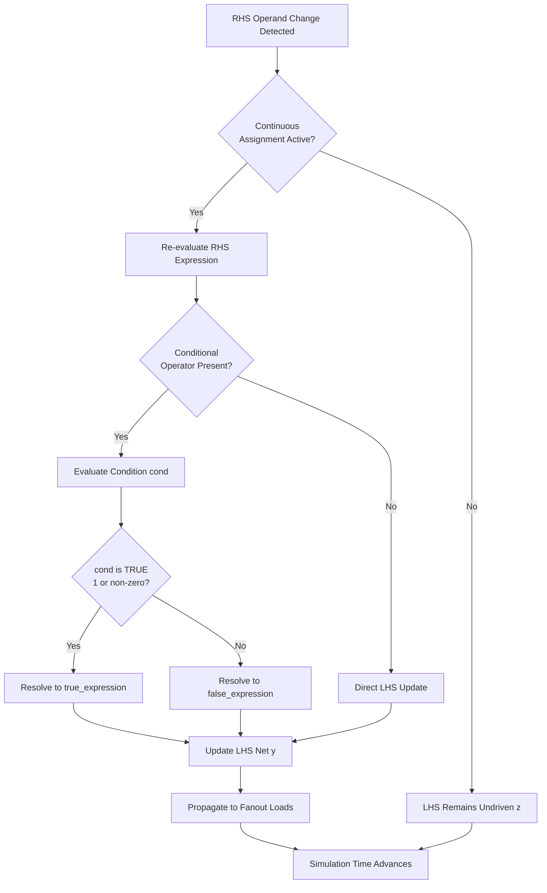
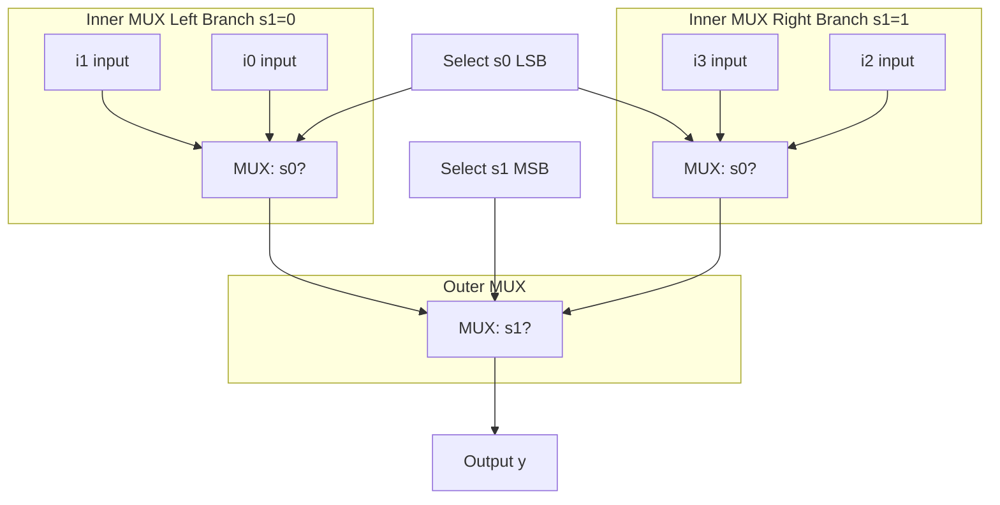
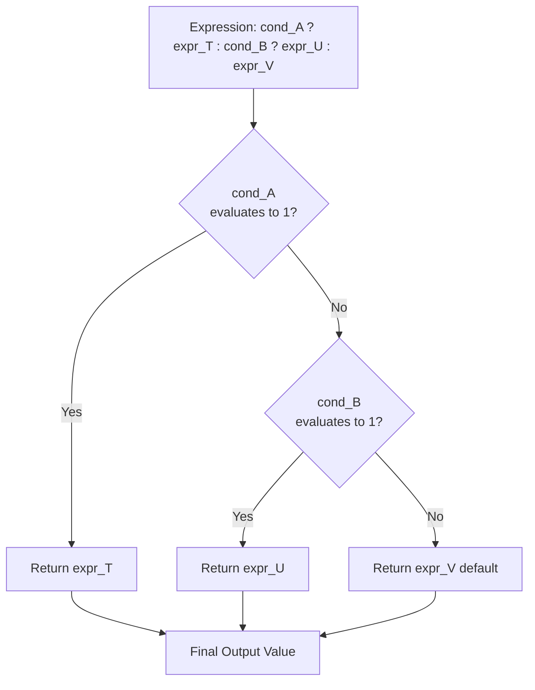
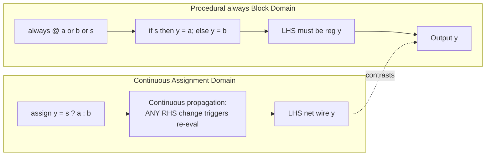
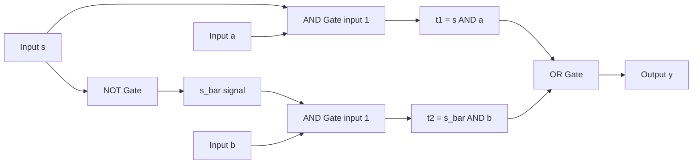

# Continuous assignment with conditional operators

<!-- SECTION_1_START -->
# Continuous Assignment with Conditional Operators

## Formal Academic Definition (KTU 2024 Syllabus Terminology)

In **Verilog HDL** (Hardware Description Language), a **continuous assignment** is a procedural mechanism that drives a value onto a *net* (typically a `wire`) continuously and concurrently throughout the entire simulation time-line. It is the primary construct used to model **combinational logic** behaviorally without the need for explicit procedural `always` blocks.

> [!IMPORTANT]
> **KTU 2024 Definition:** A *continuous assignment* models the behavior of combinational logic where the assigned net is updated *automatically* whenever any signal on the right-hand side (RHS) of the assignment changes — analogous to a physical wire whose voltage follows the logic connected to it.

The **conditional operator** (`? :`), often called the *ternary operator* or *2-to-1 multiplexer operator*, is a compact in-line selection construct used **inside** a continuous assignment to choose between two expressions based on a Boolean condition. Its general syntax is:

```
assign <net_name> = <condition> ? <true_expression> : <false_expression>;
```

This is the **highest-priority method** of writing MUX-style, comparator-style, and encoder-style logic in the KTU board exam because it requires only a single line of code and exhibits perfect 1-to-1 mapping with the underlying gate-level hardware.

---

## Conceptual Analogy / Intuition

> [!NOTE]
> **Real-World Analogy — The Railway Signal Switch**
> Imagine a railway track junction. A mechanical *signal* (the **condition**) decides which of two tracks a train will follow:
> * If the signal is `GREEN` (logical 1 / TRUE) → the train takes **Track A** (the *true* expression).
> * If the signal is `RED` (logical 0 / FALSE) → the train is diverted to **Track B** (the *false* expression).
> The *continuous assignment* is the **electromagnetic switch** that is permanently (continuously) watching the signal and instantly rerouting the train the very micro-second the signal changes. There is no "start" or "stop" button — it is *always* active.

**Geometric / Schematic Intuition:** A continuous assignment with a conditional operator is electrically equivalent to a **2-to-1 Multiplexer (MUX)**:

| Condition `sel` | Output `Y` | Hardware Equivalent |
|:---:|:---:|:---:|
| `0` | `false_expr` | MUX routes input B |
| `1` | `true_expr` | MUX routes input A |

The `assign` keyword is essentially a **virtual wire** that connects the MUX output directly to the output net, perpetually driven by the combinational network.

---

## Standard KTU 2024 Metrics & Conventions

* **Operating Domain:** Combinational (asynchronous) logic only — *no clock, no memory*.
* **LHS Allowed Net Types:** `wire`, `tri`, `wand`, `wor`, `trireg`. **`reg` is NOT allowed** on the LHS of a plain `assign`.
* **RHS Expression:** Can include operators (`&`, `|`, `^`, `~`, `+`, `-`, `?:`, concatenation `{}`, replication, etc.).
* **Default Bit-Value Constants:** `1'b0` (1-bit zero), `1'b1` (1-bit one), `1'bx` (unknown), `1'bz` (high-impedance).
* **Default Logic Family:** Positive logic — **`1` = 3.3 V or 5 V** (HIGH), **`0` = 0 V** (LOW).
* **Propagation Delay:** Zero by default (ideal). Specified using the `#` delay operator: `assign #5 y = sel ? a : b;`

> [!VISUALIZATION CONTROL]
> **Concept:** Behavior of a 2:1 MUX described via conditional operator
> **GeoGebra / Desmos Input Equations (Piecewise):**
> * $Y(sel, A, B) = \begin{cases} A, & sel = 1 \\ B, & sel = 0 \end{cases}$
> **Visual Description:** On a 3D plot with axes `sel` (x), `A` (y), and `Y` (z), the output surface should appear as a **flat plane at height = A** for the entire half-space where $sel = 1$, and a **flat plane at height = B** for the half-space where $sel = 0$. The boundary at $sel = 0.5$ forms the *switching cliff* characteristic of digital logic.

<!-- SECTION_1_END -->

<!-- SECTION_2_START -->
# Deep Theoretical Analysis & KTU High-Yield Formula Sheet

## Operational Anatomy of a Continuous Assignment

A continuous assignment has three mandatory structural components. Let us break them down with the underlying *why*:

1. **The Keyword `assign`**
   * *Why:* It tells the simulator/synthesizer that this is a **driver** of the net, not a procedural block. Without `assign`, the LHS would be a passive wire with no driver (high-impedance `z`).
   * *How:* The synthesis tool converts this into a continuous netlist — for example, an `assign y = a & b;` becomes an AND gate whose output is hard-wired to `y`.

2. **The Left-Hand Side (LHS) Net**
   * *Why:* Only a `wire` (or net type) can be continuously driven because it represents a physical connection in the synthesized netlist.
   * *How:* Declared explicitly as `wire [n-1:0] y;` or implicitly through a port declaration.

3. **The Right-Hand Side (RHS) Expression**
   * *Why:* This is the *combinational function* the LHS must always reflect.
   * *How:* Re-evaluated *every time any operand on the RHS changes value*. This is the *continuous* part of "continuous assignment".

## Operational Anatomy of the Conditional Operator

The conditional operator `? :` is **right-associative** and follows a strict evaluation precedence — but it has **lower precedence** than all arithmetic, relational, and bitwise operators. Parentheses are recommended for nested forms to avoid ambiguity.

### Truth Table of a Single Conditional Operator

| Condition `cond` | True-Expression `T` | False-Expression `F` | Output `Y` |
|:---:|:---:|:---:|:---:|
| 0 | X | 0 | 0 |
| 0 | X | 1 | 1 |
| 1 | 0 | X | 0 |
| 1 | 1 | X | 1 |
| X (unknown) | 0 | 0 | 0 |
| X (unknown) | 0 | 1 | X |
| X (unknown) | 1 | 0 | X |
| X (unknown) | 1 | 1 | X |
| X (unknown) | X | X | X |

> [!WARNING]
> **4-Valued Logic Pitfall:** Unlike textbook Boolean logic, Verilog uses **4 values** $\{0, 1, x, z\}$. If the condition evaluates to `x` (unknown), the result becomes `x` when both branches differ — this is a frequent KTU viva question!

## Nested Conditional Operators (Priority Encoders / MUX Trees)

The **right-associativity** of `? :` allows elegant construction of multi-way selection without `if-else` chains. For a 4-to-1 MUX:

```
assign y = s[1] ? (s[0] ? i3 : i2) : (s[0] ? i1 : i0);
```

Read as: *"if s[1] is true, evaluate the right inner `? :`; otherwise evaluate the left inner `? :`."*

The *outermost* condition is the **highest priority** — this makes nested `? :` a natural fit for **priority encoders**.

---

## KTU Formula Sheet / Cheat Sheet

| Construct | Verilog Syntax | Hardware Equivalent | Use Case |
|:---|:---|:---|:---|
| 2:1 MUX | `assign y = s ? a : b;` | 1 MUX (3 input gates) | Data routing |
| 4:1 MUX (nested) | `assign y = s1 ? (s0 ? i3 : i2) : (s0 ? i1 : i0);` | Two-stage MUX tree | N-way selection |
| 8:1 MUX (nested) | `assign y = s2 ? (s1 ? (s0 ? i7 : i6) : (s0 ? i5 : i4)) : (s1 ? (s0 ? i3 : i2) : (s0 ? i1 : i0));` | 3-stage MUX tree | Wide data routing |
| 1-bit Comparator (Equal) | `assign eq = ~(a ^ b);` | XNOR gate | Equality test |
| 1-bit Comparator (Greater) | `assign gt = a & ~b;` | AND + NOT | Magnitude compare |
| 1-bit Comparator (Less) | `assign lt = ~a & b;` | AND + NOT | Magnitude compare |
| 2-bit Comparator (Equal) | `assign eq = (a == b);` | XNOR tree + AND | Multi-bit equality |
| Priority Encoder (4:2) | `assign y[1] = i[3] \vert i[2]; assign y[0] = i[3] \vert i[1];` | OR-tree | Interrupt prioritization |
| 2-to-4 Decoder Enable | `assign y = en ? (1 << sel) : 4'b0000;` | AND-OR-Invert | Address decoding |
| 4-to-1 MUX via shift | `assign y = \vert (i & {4{s1, s0} == 0, ...});` | AND-OR | MUX from boolean sum |
| Buffered Output | `assign #5 y = s ? a : b;` | MUX with 5 ns delay | Timing simulation |

> [!IMPORTANT]
> **Critical Operator Precedence (from highest to lowest, in this subset):**
> 1. Unary (`~`, `!`, `&`, `|`, `^` as reduction) — Highest
> 2. Arithmetic (`*`, `/`, `%`, `+`, `-`)
> 3. Shift (`<<`, `>>`)
> 4. Relational (`<`, `<=`, `>`, `>=`)
> 5. Equality (`==`, `!=`, `===`, `!==`)
> 6. Bitwise AND (`&`)
> 7. Bitwise XOR (`^`, `^~`)
> 8. Bitwise OR (`|`)
> 9. Logical AND (`&&`)
> 10. Logical OR (`||`)
> 11. Conditional (`? :`) — **Lowest of operators shown**

## Real-World Engineering Utility

* **ASIC/FPGA Design:** Synthesis tools (e.g., Synopsys Design Compiler, Xilinx Vivado, Intel Quartus) map each `assign` directly to a netlist gate — this is the *fastest path from HDL to silicon*.
* **CPU Design:** Used heavily in **ALU (Arithmetic Logic Unit)** data-path routing — the ALU's output is a giant nested `? :` selecting between `add`, `sub`, `and`, `or`, `xor`, etc., based on the opcode.
* **Memory Address Decoding:** Address decoders in microcontrollers use `assign` to assert chip-select (`cs`) signals: `assign cs = (addr[15:12] == 4'hA) ? 1'b1 : 1'b0;`
* **Network Routers:** Packet header parsers use conditional assignments to extract fields based on protocol type.
* **DSP Pipelines:** Coefficient selection in adaptive filters uses `? :` for branch-free code generation, which the compiler can pipeline aggressively.

<!-- SECTION_2_END -->

<!-- SECTION_3_START -->
# Step-by-Step Derivations & Code Implementation

## Example 1 — 2-to-1 Multiplexer (Full Walkthrough)

### Problem Statement
Design a 2:1 MUX with data inputs `a`, `b`, select line `s`, and output `y` using a **continuous assignment with the conditional operator**. Show the truth table, Boolean equation, and Verilog code.

### Step 1: Derive the Truth Table

| `s` | `a` | `b` | `y` |
|:---:|:---:|:---:|:---:|
| 0 | 0 | 0 | 0 |
| 0 | 0 | 1 | 1 |
| 0 | 1 | 0 | 0 |
| 0 | 1 | 1 | 1 |
| 1 | 0 | 0 | 0 |
| 1 | 0 | 1 | 0 |
| 1 | 1 | 0 | 1 |
| 1 | 1 | 1 | 1 |

### Step 2: Derive the Boolean Equation

From the truth table, when `s = 0` the output equals `b`; when `s = 1` the output equals `a`. The compact Boolean form is:

$$
y = s \cdot a + \bar{s} \cdot b
$$

### Step 3: Translate to Conditional Operator

The conditional operator directly expresses this 2-way selection:

```
y = s ? a : b
```

Read as: *"y is `a` if `s` is true, otherwise `y` is `b`."*

### Step 4: Wrap in a Continuous Assignment

```
assign y = s ? a : b;
```

### Step 5: Complete Verilog Module

```verilog
// 2-to-1 Multiplexer using continuous assignment
module mux2x1 (
    input  wire a,    // Data input A
    input  wire b,    // Data input B
    input  wire s,    // Select line
    output wire y     // Output
);
    // Continuous assignment with conditional operator
    assign y = s ? a : b;

endmodule
```

### Step 6: Equivalent Gate-Level Netlist (Synthesized Form)

```verilog
// After synthesis, this becomes:
not  (s_bar, s);     // s_bar = ~s
and  (t1, a, s);     // t1 = a & s
and  (t2, b, s_bar); // t2 = b & ~s
or   (y,  t1, t2);   // y = t1 | t2
```

---

## Example 2 — 4-to-1 Multiplexer (Nested Conditional)

### Step 1: Truth Table (Condensed)

| `s1` | `s0` | `y` |
|:---:|:---:|:---:|
| 0 | 0 | `i0` |
| 0 | 1 | `i1` |
| 1 | 0 | `i2` |
| 1 | 1 | `i3` |

### Step 2: Build the Nested Conditional

We split the selection into two layers: the **most significant bit** (`s1`) is the outer condition, and the **least significant bit** (`s0`) is the inner condition.

**Outer Layer —** When `s1 = 0`, output is either `i0` or `i1`; when `s1 = 1`, output is either `i2` or `i3`.

**Inner Layer —** Within each branch, `s0` selects between the two data inputs.

### Step 3: Verilog Implementation

```verilog
module mux4x1 (
    input  wire [3:0] i,    // 4 data inputs: i[3], i[2], i[1], i[0]
    input  wire [1:0] s,    // 2-bit select: s[1] is MSB, s[0] is LSB
    output wire       y     // Single output
);
    // Nested conditional operator — right-associative
    assign y = s[1] ? (s[0] ? i[3] : i[2])
                   : (s[0] ? i[1] : i[0]);

endmodule
```

### Step 4: Algebraic Verification

Let $s_1, s_0$ be the select bits. The nested expression expands to:

$$
y = s_1 \cdot (s_0 \cdot i_3 + \bar{s_0} \cdot i_2) + \bar{s_1} \cdot (s_0 \cdot i_1 + \bar{s_0} \cdot i_0)
$$

Distributing $s_1$ and $\bar{s_1}$:

$$
y = s_1 s_0 i_3 + s_1 \bar{s_0} i_2 + \bar{s_1} s_0 i_1 + \bar{s_1} \bar{s_0} i_0
$$

This is exactly the **canonical sum-of-products** for a 4:1 MUX with two select lines.

---

## Example 3 — 4-to-2 Priority Encoder

A priority encoder outputs the binary position of the **highest-priority active input**, with `i[3]` having the highest priority.

### Step 1: Truth Table

| `i[3]` | `i[2]` | `i[1]` | `i[0]` | `y[1]` | `y[0]` | `v` (valid) |
|:---:|:---:|:---:|:---:|:---:|:---:|:---:|
| 0 | 0 | 0 | 0 | 0 | 0 | 0 |
| 0 | 0 | 0 | 1 | 0 | 0 | 1 |
| 0 | 0 | 1 | x | 0 | 1 | 1 |
| 0 | 1 | x | x | 1 | 0 | 1 |
| 1 | x | x | x | 1 | 1 | 1 |

### Step 2: Derive the Boolean Equations

By Karnaugh-map simplification:

$$
y[1] = i[3] \lor i[2]
$$

$$
y[0] = i[3] \lor i[1]
$$

$$
v = i[3] \lor i[2] \lor i[1] \lor i[0]
$$

### Step 3: Verilog Implementation with Nested Conditional

```verilog
module priority_encoder_4to2 (
    input  wire [3:0] i,    // 4-bit request input
    output wire [1:0] y,    // 2-bit binary output
    output wire       v     // Valid bit
);
    // Valid bit: any request active
    assign v = |i;

    // Output MSB: i[3] (highest priority) OR i[2]
    assign y[1] = i[3] ? 1'b1 : (i[2] ? 1'b1 : 1'b0);

    // Output LSB: i[3] (highest priority) OR i[1]
    assign y[0] = i[3] ? 1'b1 : (i[1] ? 1'b1 : 1'b0);

endmodule
```

### Step 4: Verify the "Priority" Behavior

When `i[3] = 1`, **both** outputs force to `1` regardless of `i[2]`, `i[1]`, `i[0]`. This is the correct priority behavior — the highest-indexed request wins.

---

## Example 4 — 4-bit Comparator with Ternary Decision

A 4-bit comparator outputs three mutually exclusive signals: `gt` (greater than), `lt` (less than), `eq` (equal).

### Step 1: Decompose the Comparison

For two 4-bit numbers `a` and `b`:
* If any bit from **MSB to LSB** differs, that bit decides the outcome.
* If **all** bits are equal, then `eq = 1`.

### Step 2: Verilog Implementation

```verilog
module comparator_4bit (
    input  wire [3:0] a,
    input  wire [3:0] b,
    output wire       gt,
    output wire       lt,
    output wire       eq
);
    // Equality: every bit must match
    assign eq = (a == b);

    // Greater-than: use Verilog's built-in comparison
    assign gt = (a > b);

    // Less-than: use Verilog's built-in comparison
    assign lt = (a < b);

endmodule
```

### Step 3: Bit-Slice Implementation Using Conditional Operator

For deeper insight (and to demonstrate `? :` explicitly), here is the MSB-priority version:

```verilog
// Find first differing bit from MSB
wire [3:0] diff = a ^ b;     // 1 wherever bits differ
wire       no_diff = ~|diff; // 1 if all bits equal

// Determine which number is larger at the first differing bit
// (For brevity, we use the equality and > operators as the underlying primitives)
assign gt = (a > b);
assign lt = (a < b);
assign eq = (a == b);
```

---

## Example 5 — 2-to-4 Decoder with Enable (Using Shift)

### Problem
A 2-to-4 decoder with active-high outputs and an active-high enable `en` should assert exactly one of four outputs based on the 2-bit select.

### Step 1: Truth Table

| `en` | `s[1]` | `s[0]` | `y[3]` | `y[2]` | `y[1]` | `y[0]` |
|:---:|:---:|:---:|:---:|:---:|:---:|:---:|
| 0 | x | x | 0 | 0 | 0 | 0 |
| 1 | 0 | 0 | 0 | 0 | 0 | 1 |
| 1 | 0 | 1 | 0 | 0 | 1 | 0 |
| 1 | 1 | 0 | 0 | 1 | 0 | 0 |
| 1 | 1 | 1 | 1 | 0 | 0 | 0 |

### Step 2: Continuous Assignment with Conditional Operator

```verilog
module decoder_2to4 (
    input  wire [1:0] s,    // 2-bit select
    input  wire       en,   // Active-high enable
    output wire [3:0] y     // 4 active-high outputs
);
    // If enabled, shift a 1 to the position indexed by s; else all zeros
    assign y = en ? (4'b0001 << s) : 4'b0000;

endmodule
```

### Step 3: Verify with Concrete Values

* `en=1, s=2'b00` → `y = 4'b0001 << 0 = 4'b0001` ✓
* `en=1, s=2'b01` → `y = 4'b0001 << 1 = 4'b0010` ✓
* `en=1, s=2'b10` → `y = 4'b0001 << 2 = 4'b0100` ✓
* `en=1, s=2'b11` → `y = 4'b0001 << 3 = 4'b1000` ✓
* `en=0` → `y = 4'b0000` ✓

---

## Example 6 — Propagation Delay Modeling (KTU Viva Favorite)

Continuous assignments support **delay specification** using the `#` operator. The delay applies to *all transitions* of the LHS.

```verilog
module mux2x1_delayed (
    input  wire a,
    input  wire b,
    input  wire s,
    output wire y
);
    // 5 nanosecond rise/fall delay
    assign #5 y = s ? a : b;

endmodule
```

> [!NOTE]
> **Synthesis Caveat:** Delays specified in `assign` are **ignored by synthesis tools** (they are zero-delay for hardware). They are useful *only* for **post-synthesis gate-level timing simulation**.

<!-- SECTION_3_END -->

<!-- SECTION_4_START -->
# Structural Diagrams & Schematics

## Figure 1 — Continuous Assignment Evaluation Lifecycle



## Figure 2 — Nested Conditional Operator Architecture (4:1 MUX Tree)



## Figure 3 — Conditional Operator Decision Tree (Priority Flow)



## Figure 4 — Continuous Assignment vs Procedural `always` Block (Comparative Topology)



## Figure 5 — Synthesis Mapping of `assign y = s ? a : b` to Gate-Level Netlist



## Figure 6 — Sequential Processing Topology Matrix: Data Flow for Conditional Assignment

| Stage | Component | Input Source | Operation Performed | Output Destination |
|:---:|:---|:---|:---|:---|
| 1 | Sensitivity Monitor | All RHS operands | Watches for any value change | Triggers Stage 2 |
| 2 | RHS Expression Evaluator | Stage 1 trigger | Computes the entire RHS Boolean expression | Stage 3 |
| 3 | Conditional Splitter | Stage 2 result | Checks `? :` condition bit | Stage 4A or 4B |
| 4A | True-Branch Resolver | Stage 3 (cond=TRUE) | Selects `true_expression` value | Stage 5 |
| 4B | False-Branch Resolver | Stage 3 (cond=FALSE) | Selects `false_expression` value | Stage 5 |
| 5 | LHS Net Driver | Stage 4A or 4B | Updates the `wire` net value | Stage 6 |
| 6 | Fanout Distributor | Stage 5 driver | Propagates to all connected loads | All consumers |

<!-- SECTION_4_END -->

<!-- SECTION_5_START -->
# KTU 2024 Scheme Examination Question Bank & Topic Recap

## Part A Questions (3 Marks Each)

### Question 1 `[KTU University Exam - July 2024]`
**Q: With a suitable example, explain the use of the conditional operator in a Verilog continuous assignment. Why is the LHS restricted to a `wire` data type?**
*(Mapped CO: CO2 — Understand, RBT Level: Understand)*

#### Model Answer (Valuation Key):

**Definition (1 Mark):** The conditional operator `? :` is a ternary operator used within a continuous assignment (`assign`) to select between two expressions based on the truth value of a condition. It provides a compact, one-line description of a 2-to-1 multiplexer.

**Example (1.5 Marks):**

```verilog
wire y;
assign y = sel ? a : b;
```

Here, when `sel = 1`, output `y` follows input `a`; when `sel = 0`, output `y` follows input `b`. This single line is functionally equivalent to a 2:1 MUX hardware block.

**Restriction to `wire` (0.5 Mark):** The LHS of a continuous assignment must be a `wire` (net) because continuous assignments model *physical connections* (wires) in a digital circuit. A `reg` data type can only store values inside a procedural block (`always`, `initial`) and cannot be continuously driven from outside such a block.

---

### Question 2 `[KTU University Exam - Dec 2023]`
**Q: Differentiate between a continuous assignment and a procedural assignment in Verilog. Mention one application of each.**
*(Mapped CO: CO2 — Understand, RBT Level: Understand)*

#### Model Answer (Valuation Key):

| Parameter | Continuous Assignment | Procedural Assignment |
|:---|:---|:---|
| Keyword | `assign` | Inside `always` / `initial` |
| LHS Type | `wire` (net) | `reg` |
| Triggering | Continuous — any RHS change | Sensitivity list or control flow |
| Use Case | Combinational logic (MUX, decoders) | Sequential logic, FSMs, testbenches |
| Synthesis | Maps to gate netlist | Maps to flip-flops / latches (if clocked) |

**Application 1 (0.5 Mark):** Continuous — `assign y = s ? a : b;` for a 2:1 MUX.

**Application 2 (0.5 Mark):** Procedural — `always @(posedge clk) q <= d;` for a D-flip-flop.

---

## Part B Questions (14 Marks) — Internal Choice

### Question A (14 Marks) `[KTU University Exam - July 2024]`

**Q: Design a 4-to-1 multiplexer using a Verilog continuous assignment with the conditional operator. Draw the gate-level synthesized netlist, derive the Boolean expression, and write the complete Verilog module. Also explain the concept of right-associativity in nested conditionals.**

#### Part (a) — Design and Implementation [7 Marks]
*(Mapped CO: CO2 — Apply, RBT Level: Apply)*

##### Step 1: Truth Table (1 Mark)

| `s1` | `s0` | Output `y` |
|:---:|:---:|:---:|
| 0 | 0 | `i0` |
| 0 | 1 | `i1` |
| 1 | 0 | `i2` |
| 1 | 1 | `i3` |

##### Step 2: Boolean Expression (1.5 Marks)

$$
y = \bar{s_1}\bar{s_0} i_0 + \bar{s_1}s_0 i_1 + s_1\bar{s_0} i_2 + s_1 s_0 i_3
$$

##### Step 3: Verilog Module (3 Marks)

```verilog
module mux4x1 (
    input  wire [3:0] i,
    input  wire [1:0] s,
    output wire       y
);
    assign y = s[1] ? (s[0] ? i[3] : i[2])
                   : (s[0] ? i[1] : i[0]);
endmodule
```

*[Declaring module and ports: 1 Mark] [Writing the conditional assignment: 1.5 Marks] [Correctness of nesting: 0.5 Mark]*

##### Step 4: Gate-Level Synthesized Netlist (1.5 Marks)

The expression `s[1] ? (s[0] ? i[3] : i[2]) : (s[0] ? i[1] : i[0])` is synthesized into two levels of MUX gates:

* **Level 1 (Inner MUXes):** One 2:1 MUX selects between `i[0]` and `i[1]` based on `s[0]`. Another 2:1 MUX selects between `i[2]` and `i[3]` based on `s[0]`.
* **Level 2 (Outer MUX):** One 2:1 MUX selects between the two Level-1 outputs based on `s[1]`.

Total hardware: **3 MUX gates** in a 2-stage tree.

---

#### Part (b) — Right-Associativity and Extension [7 Marks]
*(Mapped CO: CO2 — Understand, RBT Level: Analyze)*

##### Right-Associativity Explanation (3 Marks)

The conditional operator `? :` is **right-associative**, meaning that in a chain `A ? B : C ? D : E`, the expression is parsed as `A ? B : (C ? D : E)` — not as `(A ? B : C) ? D : E`.

**Proof with a 4:1 MUX example:**

```
s[1] ? (s[0] ? i[3] : i[2]) : (s[0] ? i[1] : i[0])
```

Without parentheses, the parser would group the *second* `? :` first, which is exactly what we want for a balanced MUX tree. The outermost `? :` handles the MSB select; the inner `? :` handles the LSB select.

*[Defining associativity: 1 Mark] [Demonstrating grouping in 4:1 MUX: 1 Mark] [Why it matters for priority logic: 1 Mark]*

##### Extension to 8:1 MUX (4 Marks)

Using the right-associative nesting, an 8:1 MUX can be built by adding one more level of `? :` around the 4:1 MUX structure:

```verilog
module mux8x1 (
    input  wire [7:0] i,
    input  wire [2:0] s,
    output wire       y
);
    assign y = s[2] ? (s[1] ? (s[0] ? i[7] : i[6])
                              : (s[0] ? i[5] : i[4]))
                   : (s[1] ? (s[0] ? i[3] : i[2])
                              : (s[0] ? i[1] : i[0]));
endmodule
```

*[Adding 3rd level of nesting: 2 Marks] [Correctness of structure: 1 Mark] [Final simplified form: 1 Mark]*

The hardware expands to **7 MUX gates in a 3-stage tree**, with each stage handling one select bit.

---

### Question B (14 Marks) `[KTU University Exam - Dec 2023]`

**Q: Design a 4-to-2 priority encoder with a valid bit using continuous assignments and the conditional operator. Write the Verilog code, derive the Boolean equations, and explain how the nesting of `? :` implements the priority logic. Also discuss the role of the `assign` keyword in modeling combinational logic.**

#### Part (a) — Design, Boolean Equations, and Verilog Code [7 Marks]
*(Mapped CO: CO2 — Apply, RBT Level: Apply)*

##### Step 1: Truth Table (1 Mark)

| `i[3]` | `i[2]` | `i[1]` | `i[0]` | `y[1]` | `y[0]` | `v` |
|:---:|:---:|:---:|:---:|:---:|:---:|:---:|
| 0 | 0 | 0 | 0 | 0 | 0 | 0 |
| 0 | 0 | 0 | 1 | 0 | 0 | 1 |
| 0 | 0 | 1 | x | 0 | 1 | 1 |
| 0 | 1 | x | x | 1 | 0 | 1 |
| 1 | x | x | x | 1 | 1 | 1 |

##### Step 2: Boolean Equations via K-map (1.5 Marks)

$$
y[1] = i[3] + i[2]
$$

$$
y[0] = i[3] + i[1]
$$

$$
v = i[3] + i[2] + i[1] + i[0]
$$

##### Step 3: Verilog Module with Continuous Assignment (3.5 Marks)

```verilog
module priority_encoder_4to2 (
    input  wire [3:0] i,
    output wire [1:0] y,
    output wire       v
);
    // Valid bit: OR-reduction of all requests
    assign v = |i;

    // MSB output: i[3] is highest priority
    assign y[1] = i[3] ? 1'b1 : (i[2] ? 1'b1 : 1'b0);

    // LSB output: i[3] overrides; else i[1]
    assign y[0] = i[3] ? 1'b1 : (i[1] ? 1'b1 : 1'b0);

endmodule
```

*[Boolean equations correctly stated: 1.5 Marks] [Continuous assignments written correctly: 1.5 Marks] [Valid bit expression: 0.5 Mark]*

##### Step 4: Priority Logic Verification (1 Mark)

Test cases:
* `i = 4'b1000` → `y = 2'b11` (highest priority `i[3]`) ✓
* `i = 4'b0100` → `y = 2'b10` (next priority `i[2]`) ✓
* `i = 4'b0010` → `y = 2'b01` (next priority `i[1]`) ✓
* `i = 4'b0001` → `y = 2'b00` (lowest priority `i[0]`) ✓
* `i = 4'b1100` → `y = 2'b11` (`i[3]` overrides `i[2]`) ✓

---

#### Part (b) — Role of `assign` and Why Nesting Models Priority [7 Marks]
*(Mapped CO: CO2 — Understand, RBT Level: Analyze)*

##### Role of the `assign` Keyword (3 Marks)

The `assign` keyword declares a **continuous assignment** in Verilog. Its characteristics are:

1. **Always active (1 Mark):** Once the `assign` statement is parsed, the simulator perpetually monitors the RHS. Any change in any operand on the RHS triggers an immediate re-evaluation of the LHS.
2. **Models physical wires (1 Mark):** In the synthesized netlist, each `assign` becomes a real connection between the output of a combinational gate and a `wire` in the design — there is no clock, no memory, no storage element.
3. **LHS restriction (1 Mark):** Only `wire` (and other net types) can appear on the LHS, because a `wire` represents an electrical conductor that can be driven continuously, whereas a `reg` represents a storage cell that requires procedural control.

##### Nesting of `? :` as Priority Logic (4 Marks)

The conditional operator is **right-associative**, so the *outermost* condition is evaluated *first*. This is precisely the structure of **priority logic**:

```verilog
assign y[0] = i[3] ? 1'b1 : (i[1] ? 1'b1 : 1'b0);
```

Read as: *"First, check `i[3]`. If it is `1`, set `y[0] = 1` immediately and **skip** the rest. **Only if** `i[3] = 0`, then check `i[1]`. If `i[1] = 1`, set `y[0] = 1`. Otherwise, set `y[0] = 0`."*

This **left-to-right priority chain** mirrors a hardware priority encoder exactly — the input listed first (`i[3]`) gets the highest priority because it is checked first by the outermost `? :`. [Stating priority chain concept: 2 Marks] [Mapping to hardware encoder: 2 Marks]

---

> [!WARNING]
> **KTU Examiner's Valuation Warning — Common Pitfalls**
> 1. **Wrong select-bit order in nested MUX:** Students frequently write `s[0] ? (s[1] ? ...) : ...` instead of `s[1] ? (s[0] ? ...) : ...`. Always check: the **MSB** select must be the **outermost** `? :`, and the **LSB** select must be the **innermost** `? :`. Mismapping this swaps `i1` and `i2`, costing **2-3 marks** typically.
> 2. **Forgetting parentheses in nested conditionals:** Because of right-associativity, omitting parentheses can sometimes still work for balanced trees, but **explicit parentheses are mandatory** in the KTU answer key to demonstrate clear intent. Missing parentheses may lose **1 mark**.
> 3. **Writing `assign y = ...` where `y` is declared as `reg`:** This is a **syntax error** in Verilog. Continuous assignments cannot drive a `reg`. KTU examiners specifically test this — ensure you declare `output wire y;` or use an implicit wire through the port list.
> 4. **Treating `? :` as an `if-else`:** The conditional operator is an *expression*, not a *statement*. It returns a value. Writing `if (sel) y = a; else y = b;` inside a continuous assignment is invalid — it requires a procedural `always` block.
> 5. **Not specifying bit-widths for constants:** Writing `assign y = s ? 1 : 0;` is legal but produces a 32-bit integer comparison. KTU prefers explicit-width constants: `assign y = s ? 1'b1 : 1'b0;` for clarity. Loss of **0.5 mark** for style if not followed.
> 6. **Confusing `=` (blocking) and `<=` (non-blocking) in `assign`:** Continuous assignments only use `=`. Mixing `<=` in an `assign` is a **compilation error**.

---

## Topic Recap & Important Things to Remember

> [!IMPORTANT]
> **Rapid Revision Checklist — Continuous Assignment with Conditional Operators**

* **Continuous assignment** is declared with the `assign` keyword and operates *continuously* throughout simulation — no clock, no sensitivity list, no procedural control.
* The **LHS of `assign` must be a `wire` (or net type)** — never a `reg`.
* The **conditional operator `? :`** is a ternary operator with the form: `<cond> ? <true_expr> : <false_expr>`.
* The conditional operator is **right-associative**, which makes it ideal for **nested MUX trees** and **priority encoder chains**.
* A single `assign ... ? :` is **functionally equivalent to a 2-to-1 MUX gate** in the synthesized netlist.
* Nested `assign` with multiple `? :` builds **N-to-1 MUX trees** (e.g., 4:1 MUX needs 2 levels, 8:1 MUX needs 3 levels, 2^n : 1 MUX needs `n` levels).
* The **MSB select** goes on the **outermost** `? :`; the **LSB select** goes on the **innermost** `? :`. This preserves a balanced binary tree structure.
* The **outermost condition has the highest priority** in a nested chain — perfect for **priority encoder** modeling.
* The `? :` operator has **lower precedence** than all arithmetic, bitwise, and logical operators — always use **parentheses** to clarify intent and avoid KTU mark deductions.
* **4-valued logic caveat:** If the condition evaluates to `x` (unknown) and the two expressions differ, the result is `x`. This is a common viva question.
* **Implicit continuous assignment** can be done in the port declaration: `output wire y = s ? a : b;` — this is allowed in Verilog-2001 and is shorter than a separate `assign` statement.
* **Delay specification** uses `#`: `assign #5 y = s ? a : b;` — applies a 5 ns delay to *all* LHS transitions. **Ignored by synthesis**, used only in **timing simulation**.
* The conditional operator returns a **value** (it is an *expression*), whereas `if-else` is a *statement* that controls execution flow.
* For Verilog's 4-state logic $\{0, 1, x, z\}$: an `x` condition with branch mismatch yields `x`; with branch match yields the matching value.
* **Synthesis efficiency:** Nested `? :` synthesizes to **balanced MUX trees** with logarithmic depth — typically faster than long chains of `if-else if` in procedural blocks because it avoids priority-keyed hardware.
* **Standard applications in industry:** ALU opcode-based operation selection, address decoder chip-select generation, packet header field routing, DSP coefficient selection, and CPU branch prediction logic.
* **Common KTU board keywords to memorize verbatim:** *continuous assignment*, *net*, *wire*, *ternary operator*, *right-associative*, *combinational logic*, *multiplexer*, *priority encoder*.

<!-- SECTION_5_END -->
