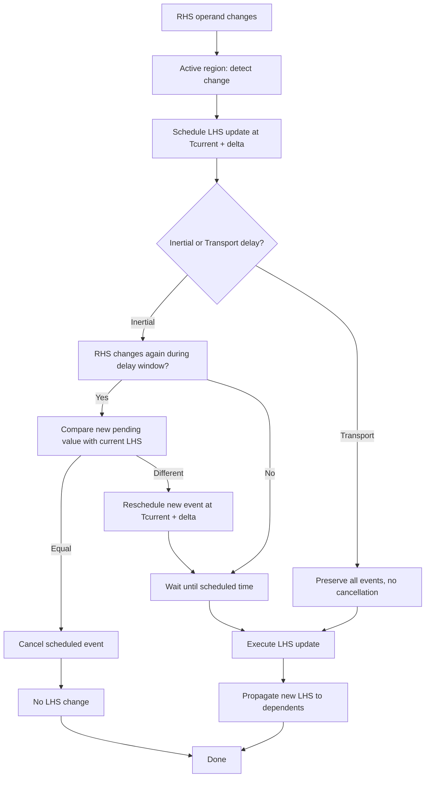
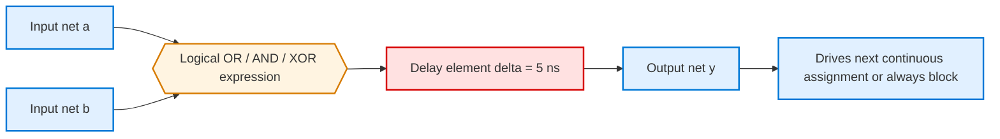
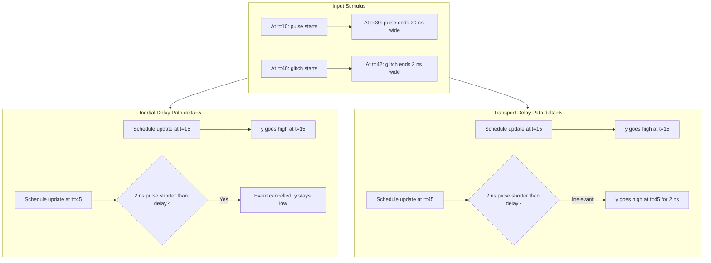
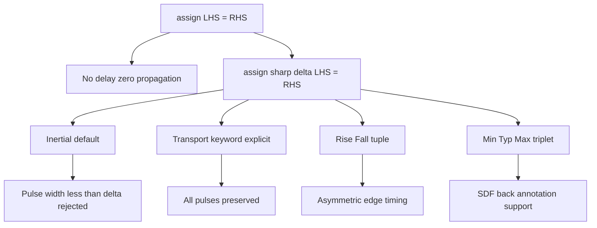

# Continuous assignment with delay.

<!-- SECTION_1_START -->
# Continuous Assignment with Delay — Core Technical Definition & Intuitive Overview

## Formal Definition (KTU 2024 Syllabus Terminology)

In Verilog HDL, a **Continuous Assignment** is a procedural mechanism that drives a net (wire) whenever one or more operands on the right-hand side (RHS) change. When a **delay** is associated with this assignment using the `#` operator, the change on the LHS is scheduled to occur only after the specified time interval has elapsed, modelling the **propagation latency** of real combinational logic gates.

The canonical Verilog syntax is:

```verilog
assign #<delay_value> <net_name> = <expression>;
```

Where:
- `#<delay_value>` is the **timing control** that defers the assignment.
- `<net_name>` is a **wire** (or similar net data type) — never a `reg`.
- `<expression>` can be a constant, a wire, a concatenation, a function call, or a logical/arithmetic expression.

> [!IMPORTANT]
> **KTU 2024 High-Yield Note:** Continuous assignment with delay is a **behavioural modelling** technique used to simulate the **finite propagation delay** of physical combinational circuits. It is fundamentally different from a `reg`-based procedural assignment, which only retains its value inside an `always` block.

## Conceptual Analogy / Intuition

Think of a continuous assignment with delay as a **chemical pipeline with a buffer tank**:

1. **Input (RHS)** — Fresh chemicals continuously pour into the pipe.
2. **Buffer Tank (Delay)** — The tank has a fixed volume. Whatever enters the pipe does not immediately come out; it must **fill the tank first**.
3. **Output (LHS)** — Only after the tank is "full" (i.e., the delay time elapses) does the output value reflect the input.

A more digital analogy: it is exactly like a **logic gate's propagation delay ($t_{pd}$)**. When you flip the input of a real 74-series TTL gate, the output does not change instantaneously — it takes a few nanoseconds. Verilog's `#delay` reproduces this physical realism in simulation.

> [!NOTE]
> **Default Delay Type:** Unless explicitly specified, Verilog uses **inertial delay** (also called *regular delay*). This means that any input pulse **shorter** than the delay is **filtered out** (rejected), just as a low-pass filter or a slow logic gate would physically ignore a brief glitch.

## Visualisation of the Concept

> [!VISUALIZATION CONTROL]
> **Concept:** Step response of a continuous assignment showing inertial pulse rejection
> **GeoGebra / Desmos Input Equations:**
> * Input waveform: piecewise step function $x(t)$ with a 1 ns wide glitch
> * Delay line: $y(t) = x(t - \Delta)$ where $\Delta = 3\,\text{ns}$
> * Glitch amplitude: rectangular pulse of width $1\,\text{ns}$ occurring between $t = 4$ and $t = 5$
> **Visual Description:** On the horizontal time axis (ns), draw a constant-0 line, a 5 ns wide high pulse for `x(t)`, and the delayed version `y(t)`. When the delay is longer than the glitch width, the glitch in `x(t)` is **absent** in `y(t)`, demonstrating inertial pulse filtering.

---

<!-- SECTION_1_END -->

<!-- SECTION_2_START -->
# Deep Theoretical Analysis & KTU High-Yield Formula Sheet

## Structural Breakdown of the Concept

A continuous assignment with delay is decomposed into the following logical stages in a Verilog simulator's event queue:

1. **RHS Evaluation Trigger** — The simulator monitors every operand on the RHS. Any change to a net inside the expression schedules an "update event" for the LHS in the **active region** of the current simulation time step.

2. **Delay Calculation** — The simulator adds the user-specified delay $\Delta$ to the current simulation time. This becomes the **scheduled update time** $T_{\text{update}} = T_{\text{current}} + \Delta$.

3. **Inertial Pulse Rejection (Default Behaviour)** — Before executing the update at $T_{\text{update}}$, the simulator checks whether the RHS has changed **again** during the interval $[T_{\text{current}},\; T_{\text{update}}]$. If the RHS value at $T_{\text{update}}$ is different from the LHS's current value but the new pending value would not persist for at least $\Delta$ time units, the event may be **cancelled**. This mimics a real gate's inability to respond to sub-threshold pulses.

4. **LHS Commit** — At $T_{\text{update}}$, the LHS net is updated and propagated to all other continuous assignments and procedural blocks that read it.

## The Three Delay Variants in Verilog

| Variant | Syntax | Pulse Filtering | Real-World Analogy | Use Case |
| :--- | :--- | :--- | :--- | :--- |
| **Inertial (Default)** | `assign #5 y = a & b;` | Pulses shorter than 5 ns are **dropped** | Real CMOS gate with finite rise/fall time | General combinational logic |
| **Transport** | `assign #(transport 5) y = a & b;` | **All** pulses pass through, no filtering | Ideal lossless transmission line | Wires, buses, long interconnects |
| **Rise/Fall (Inertial)** | `assign #(3, 7) y = a;` | Asymmetric, rise and fall delays differ separately | Gate with different $t_{pLH}$ and $t_{pHL}$ | Detailed timing simulation |

> [!IMPORTANT]
> **Why does pulse rejection happen?** In a real digital circuit, a gate's output capacitance cannot charge or discharge fast enough to register a sub-threshold input pulse. Verilog's inertial model reproduces this physical reality and is the **standard for gate-level simulation**.

## KTU Formula Sheet / Cheat Sheet

| Construct | Verilog Syntax | Symbolic Form | Time Domain Meaning |
| :--- | :--- | :--- | :--- |
| Simple Delay | `assign #$\Delta$ L = R;` | $L(t) = R(t - \Delta)$ | Uniform propagation delay |
| Rise / Fall Delay | `assign #($\Delta_r, \Delta_f$) L = R;` | $L(t) = R(t - \Delta_{r/f})$ | Asymmetric edge delay |
| Transport Delay | `assign #(transport $\Delta$) L = R;` | $L(t) = R(t - \Delta)$ | Lossless, no pulse rejection |
| Min/Max/Typ | `assign #($\Delta_{min}{:} \Delta_{typ}{:} \Delta_{max}$) L = R;` | Triplet for SDF back-annotation | Statistical timing analysis |
| Implicit Continuous | `wire #$\Delta$ L = R;` | Same as `assign` | Inline declaration form |
| Pulse Filter Limit | Width of input pulse $w_p < \Delta$ | Pulse is **rejected** | Inertial rule |

> [!TIP]
> All delay values in Verilog are **simulation time units**, which are scaled relative to the `timescale` directive at the top of the file (e.g., `\`timescale 1ns/1ps` makes `#5` mean 5 ns).

## Real-World Engineering Utility

- **Static Timing Analysis (STA) Pre-Validation:** Engineers use continuous assignment delays to model wire and gate latency before running full synthesis. This catches setup/hold violations early.
- **Standard Delay Format (SDF) Back-Annotation:** Post-synthesis delay values are dumped into SDF files and injected back into Verilog via `assign #(min:typ:max)` triplets.
- **Testbench Realism:** When validating a synthesized design, the testbench uses continuous assignment delays to mimic real silicon behaviour — the test passes only if logic is correct **under realistic timing constraints**.
- **Race Condition Studies:** Designers deliberately use transport delays to study glitches and races on buses that an inertial model would mask.

---

<!-- SECTION_2_END -->

<!-- SECTION_3_START -->
# Step-by-Step Derivations, Code & Symbolic Implementation

## Example 1 — Inertial Delay (Default Behaviour)

This is the most common scenario in KTU problems. A short input pulse is filtered out.

**Verilog Module:**

```verilog
`timescale 1ns/1ps   // 1 ns time unit, 1 ps precision

module inertial_delay_demo (
    input  wire a,
    input  wire b,
    output wire y
);

    // Continuous assignment with 5 ns inertial delay
    assign #5 y = a & b;

endmodule
```

**Testbench with Glitch Generation:**

```verilog
`timescale 1ns/1ps

module tb_inertial;
    reg  a, b;
    wire y;

    // Instantiate the design under test
    inertial_delay_demo uut (.a(a), .b(b), .y(y));

    initial begin
        $dumpfile("inertial.vcd");
        $dumpvars(0, tb_inertial);

        // Establish a steady "0" state
        a = 0; b = 0;
        #10;

        // Apply a clean 20 ns pulse (wide enough to pass)
        a = 1; b = 1;     // RHS becomes 1 at t=10
        #20;              // 20 ns wide pulse
        a = 0; b = 0;
        #10;

        // Apply a 2 ns glitch (too narrow to pass)
        a = 1; b = 1;     // at t=40
        #2;               // only 2 ns wide
        a = 0; b = 0;
        #20;

        $display("Simulation complete at t=%0t", $time);
        $finish;
    end
endmodule
```

**Step-by-Step Behavioural Analysis:**

| Simulation Time (ns) | Event | RHS `a & b` Value | Scheduled LHS update? | LHS `y` Final Value |
| :---: | :--- | :---: | :--- | :---: |
| 0 | `a=0, b=0` initialised | 0 | No | 0 |
| 10 | `a=1, b=1` | 1 | Yes, update at $t=15$ | 0 (still) |
| 15 | LHS scheduled update | 1 | Executed | 1 |
| 30 | `a=0, b=0` | 0 | Update at $t=35$ | 1 (still) |
| 35 | LHS scheduled update | 0 | Executed | 0 |
| 40 | `a=1, b=1` (glitch start) | 1 | Update at $t=45$ | 0 (still) |
| 42 | `a=0, b=0` (glitch end) | 0 | The $t=45$ event is **cancelled** because new value equals current LHS | 0 |
| 45 | Cancelled — no event | — | None | 0 |

**Result:** The 20 ns pulse passes through and produces a `y=1` output (delayed by 5 ns). The 2 ns glitch is **completely rejected** because the new pending value at $t=45$ matches the current LHS value, cancelling the inertial event.

## Example 2 — Transport Delay (No Pulse Filtering)

```verilog
`timescale 1ns/1ps

module transport_delay_demo (
    input  wire a,
    input  wire b,
    output wire y
);

    // Transport delay — pulses of any width are preserved
    assign #(transport 5) y = a & b;

endmodule
```

**Reusing the same testbench pattern:**

The 2 ns glitch that was rejected in Example 1 will **now appear** at the output, delayed by 5 ns, with its full 2 ns width preserved. This models an ideal transmission line or a precise on-chip wire.

## Example 3 — Asymmetric Rise/Fall Delay

```verilog
`timescale 1ns/1ps

module rise_fall_delay (
    input  wire clk,
    output wire delayed_clk
);

    // 3 ns for 0->1 transition, 7 ns for 1->0 transition
    assign #(3, 7) delayed_clk = clk;

endmodule
```

This models a real gate where $t_{pLH} \neq t_{pHL}$:

$$
\text{delayed\_clk}(t) = \begin{cases} \text{clk}(t - 3) & \text{on } 0 \to 1 \text{ transition} \\ \text{clk}(t - 7) & \text{on } 1 \to 0 \text{ transition} \end{cases}
$$

## Example 4 — Implicit Continuous Assignment with Delay

```verilog
`timescale 1ns/1ps

module implicit_assign (
    input  wire a,
    input  wire b,
    output wire y
);

    // Inline declaration with delay — equivalent to `assign #3 y = a ^ b;`
    wire #3 y = a ^ b;

endmodule
```

This is syntactically identical to:

```verilog
assign #3 y = a ^ b;
```

It is a stylistic shortcut often used in KTU viva questions to test whether students recognise both forms.

## Example 5 — Min/Typ/Max Delay Triplet

```verilog
`timescale 1ns/1ps

module triplet_delay (
    input  wire data_in,
    output wire data_out
);

    // min : typ : max triplet — 4 ns, 5 ns, 7 ns respectively
    assign #(4:5:7) data_out = data_in;

endmodule
```

The simulator picks one of the three based on the `+delay_mode` runtime option:
- `+delay_mode_min` → uses 4 ns
- `+delay_mode_typ` → uses 5 ns (default)
- `+delay_mode_max` → uses 7 ns

This is the format used in SDF (Standard Delay Format) back-annotation flows.

## Algebraic Justification of the Inertial Pulse Rejection

Let $\Delta$ be the delay. Define the pending value $V_p(t)$ as the RHS value most recently scheduled for update. An inertial event scheduled for time $T_s$ is **executed** iff at the moment of execution the LHS current value $V_l$ satisfies:

$$
V_p(T_s) \neq V_l
$$

If a new event supersedes $V_p$ before $T_s$ arrives such that the latest pending value matches $V_l$, the original event is implicitly cancelled. This is the **exact formal rule** for inertial delay in IEEE Std 1364-2005 (Verilog).

---

<!-- SECTION_3_END -->

<!-- SECTION_4_START -->
# Structural Diagrams & Schematics

## Diagram 1 — Event Scheduling Flowchart

This flowchart captures the simulator's decision process when handling a delayed continuous assignment.



## Diagram 2 — Module Architecture Block Diagram

This block diagram shows the position of the delay element within a generic combinational model.



## Diagram 3 — Timing Behaviour Comparison (Inertial vs Transport)

A multi-stage representation showing how identical input stimuli are processed differently.



## Diagram 4 — Delay Specification Variants Topology



---

<!-- SECTION_4_END -->

<!-- SECTION_5_START -->
# KTU 2024 Scheme Examination Question Bank & Topic Recap

## Part A — Short Answer Questions (3 Marks Each)

### Question 1
**[KTU University Exam — July 2023]** — *CO2, Understand*

Differentiate between **inertial delay** and **transport delay** in Verilog continuous assignments. Give one practical example where each is preferred.

**Model Answer (Valuation Key):**

| Aspect | Inertial Delay | Transport Delay |
| :--- | :--- | :--- |
| **Keyword** | Default (no keyword) | `transport` |
| **Pulse Filtering** | Pulses narrower than the delay are **suppressed** | **All** pulses are passed |
| **Physical Analogy** | A real CMOS gate with finite switching threshold | An ideal lossless transmission line |
| **Use Case** | Modelling gate propagation delay | Modelling long on-chip wires / buses |
| **Syntax** | `assign #5 y = a & b;` | `assign #(transport 5) y = a & b;` |

> **Preferred Use Example:** Inertial delay for modelling the output of a 2-input AND gate; transport delay for modelling a 5 mm PCB trace carrying clock signals.

**[Conceptual clarity of pulse filtering: 2 Marks] [Practical example: 1 Mark]**

---

### Question 2
**[KTU University Exam — Dec 2023]** — *CO2, Remember*

Write a Verilog statement that assigns the output `sum` to be the result of an **8-bit ripple carry addition** of `a` and `b` with a **uniform 4 ns propagation delay**.

**Model Answer:**

```verilog
assign #4 sum = a + b;
```

where `a`, `b`, and `sum` are declared as 8-bit `wire` vectors. The `#4` introduces a 4 ns inertial delay before `sum` reflects any change in `a` or `b`.

**[Correct continuous assignment syntax: 2 Marks] [Delay specification: 1 Mark]**

---

## Part B — Long Answer Questions (14 Marks Each)

> **KTU 2024 ESE Pattern:** Each Part B question carries 14 marks and offers an internal choice. Both alternatives are provided below. Sub-parts (a) and (b) split the marks as **7 + 7**.

---

### Question A (14 Marks)

**[KTU University Exam — June 2024]** — *CO2, Apply / Analyse*

(a) **[7 Marks — Understand]** Explain the event scheduling mechanism in a Verilog simulator when a continuous assignment with **intertial delay** of 6 ns is applied to the expression `y = a | b`. Describe step-by-step what happens when the input sequence shown below is applied.

| Time (ns) | 0 | 5 | 10 | 12 | 18 | 25 | 30 |
| :--- | :---: | :---: | :---: | :---: | :---: | :---: | :---: |
| `a` | 0 | 1 | 1 | 1 | 0 | 0 | 0 |
| `b` | 0 | 0 | 0 | 1 | 1 | 0 | 0 |

Assume `y` initial value is 0.

**Model Solution:**

Step 1 — Identify all RHS changes:

- $t=5$: $a$ changes $0 \to 1$. RHS `a | b` becomes $1$.
- $t=12$: $b$ changes $0 \to 1$. RHS remains $1$.
- $t=18$: $a$ changes $1 \to 0$. RHS becomes $1$ (since $b=1$).
- $t=25$: $b$ changes $1 \to 0$. RHS becomes $0$.

Step 2 — Schedule inertial events:

| Event Time $T_c$ | RHS change | Pending value | Scheduled LHS update $T_c + 6$ |
| :---: | :--- | :---: | :---: |
| 5 | 0 → 1 | 1 | 11 |
| 12 | 1 → 1 | 1 (no change) | No event |
| 18 | 1 → 1 | 1 (no change) | No event |
| 25 | 1 → 0 | 0 | 31 |

Step 3 — Execute scheduled updates:

- At $t=11$: LHS `y` becomes 1.
- At $t=31$: LHS `y` becomes 0.

Step 4 — Verify: At all intermediate times, the inertial rule holds because no new pending value would be filtered.

**Final Timing Diagram:**

| Time (ns) | 0–10 | 11–30 | 31 onwards |
| :--- | :---: | :---: | :---: |
| `y` | 0 | 1 | 0 |

**Valuation Key:**
- [Identifying RHS change instants: 2 Marks]
- [Applying the 6 ns delay to compute scheduled events: 2 Marks]
- [Checking inertial rule for each scheduled event: 2 Marks]
- [Final correct y waveform: 1 Mark]

(b) **[7 Marks — Apply]** Write a complete, synthesizable Verilog module `combinational_unit` that takes two 4-bit inputs `p` and `q` and produces:
- `p_xor_q` = bitwise XOR with 3 ns rise delay and 6 ns fall delay
- `p_or_q` = bitwise OR with 5 ns transport delay

Include the `\`timescale` directive and a brief testbench that verifies the pulse-filtering behaviour of `p_xor_q` using a 2 ns glitch on one of the bits.

**Model Solution:**

```verilog
`timescale 1ns/1ps

module combinational_unit (
    input  wire [3:0] p,
    input  wire [3:0] q,
    output wire [3:0] p_xor_q,
    output wire [3:0] p_or_q
);

    // Asymmetric inertial delay: 3 ns rising, 6 ns falling
    assign #(3, 6) p_xor_q = p ^ q;

    // Transport delay preserves all pulses
    assign #(transport 5) p_or_q = p | q;

endmodule
```

**Testbench:**

```verilog
`timescale 1ns/1ps

module tb_combinational;
    reg  [3:0] p, q;
    wire [3:0] p_xor_q, p_or_q;

    combinational_unit uut (.p(p), .q(q),
                            .p_xor_q(p_xor_q),
                            .p_or_q(p_or_q));

    initial begin
        $monitor("t=%0t  p=%b q=%b  xor=%b or=%b",
                 $time, p, q, p_xor_q, p_or_q);

        p = 4'b0000; q = 4'b0000;
        #10;
        p = 4'b1010; q = 4'b1100;     // wide transition
        #20;
        p = 4'b0000; q = 4'b0000;     // back to zero
        #10;

        // Inject a 2 ns glitch on bit 0 of p
        p = 4'b0001; q = 4'b0000;     // glitch start
        #2;
        p = 4'b0000; q = 4'b0000;     // glitch end
        #15;

        $finish;
    end
endmodule
```

**Expected Behavioural Analysis:**

The 2 ns glitch on bit 0 (from `0000` → `0001` → `0000`) creates a momentary `p_xor_q = 0001`. Since the rise delay is 3 ns, a 2 ns pulse is **shorter than the delay** → **inertially rejected** → `p_xor_q` does **not** respond. The 20 ns wide initial transition passes through because it is wider than both rise and fall delays.

For `p_or_q`, transport delay means the 2 ns glitch appears at the output after 5 ns with full 2 ns width.

**Valuation Key:**
- [Correct `timescale` and module declaration: 1 Mark]
- [Asymmetric delay syntax `assign #(3,6) p_xor_q = p ^ q;`: 2 Marks]
- [Transport delay syntax: 1 Mark]
- [Testbench generation of valid glitch: 2 Marks]
- [Explanation of pulse filtering consequence: 1 Mark]

---

### Question B (14 Marks)

**[KTU University Exam — Dec 2022]** — *CO2, Apply / Analyse*

(a) **[7 Marks — Understand]** With the help of neat Verilog code, explain how **rise and fall delays** are specified in a continuous assignment. Discuss how this is used to model a **non-ideal inverter** with $t_{pLH} = 2\,\text{ns}$ and $t_{pHL} = 4\,\text{ns}$.

**Model Solution:**

Verilog allows three delay values in a single continuous assignment: `(rise, fall)` or `(rise, fall, turn-off)`. The two-value form is the most common.

**Non-ideal inverter model:**

```verilog
`timescale 1ns/1ps

module non_ideal_inverter (
    input  wire a,
    output wire y
);

    // 0->1 (rise) takes 2 ns; 1->0 (fall) takes 4 ns
    assign #(2, 4) y = ~a;

endmodule
```

**Simulation trace for a clean square wave on `a`:**

If `a` is a 10 ns period square wave (5 ns high, 5 ns low):

| Event on `a` | Time | `y` transition | Delay | `y` change time |
| :--- | :---: | :---: | :---: | :---: |
| 0 → 1 | 5 | y: 1 → 0 (fall) | 4 ns | $t=9$ |
| 1 → 0 | 10 | y: 0 → 1 (rise) | 2 ns | $t=12$ |
| 0 → 1 | 15 | y: 1 → 0 (fall) | 4 ns | $t=19$ |
| 1 → 0 | 20 | y: 0 → 1 (rise) | 2 ns | $t=22$ |

The resulting waveform on `y` is a **distorted square wave** with unequal high and low pulse widths, faithfully modelling a real gate with asymmetric propagation delay.

**Valuation Key:**
- [Correct Verilog `assign #(2,4)` syntax: 2 Marks]
- [Identification of rise vs fall: 2 Marks]
- [Simulation trace explanation: 2 Marks]
- [Conclusion about asymmetric waveform: 1 Mark]

(b) **[7 Marks — Apply]** Explain the role of the `transport` keyword in Verilog. Write a Verilog testbench that demonstrates that under a transport delay of 4 ns, a **1 ns wide input pulse** is preserved at the output, whereas under an inertial delay of 4 ns, the same pulse is filtered out. Show the expected waveform graphically in your answer.

**Model Solution:**

**Concept:** The `transport` keyword disables Verilog's default inertial pulse-rejection mechanism. Every event on the RHS — regardless of pulse width — is faithfully scheduled on the LHS, delayed by exactly the transport delay value.

**Verilog Demonstration Module:**

```verilog
`timescale 1ns/1ps

module delay_comparator (
    input  wire data_in,
    output wire inertial_out,
    output wire transport_out
);

    // Inertial: default
    assign #4 inertial_out = data_in;

    // Transport: explicit keyword
    assign #(transport 4) transport_out = data_in;

endmodule
```

**Testbench:**

```verilog
`timescale 1ns/1ps

module tb_comparator;
    reg  data_in;
    wire inertial_out, transport_out;

    delay_comparator uut (.data_in(data_in),
                          .inertial_out(inertial_out),
                          .transport_out(transport_out));

    initial begin
        $monitor("t=%0t  in=%b  inertial=%b  transport=%b",
                 $time, data_in, inertial_out, transport_out);
        data_in = 0;
        #10;
        // Apply a 1 ns wide pulse (narrower than the 4 ns delay)
        data_in = 1;
        #1;
        data_in = 0;
        #10;
        // Apply a 6 ns wide pulse (wider than the 4 ns delay)
        data_in = 1;
        #6;
        data_in = 0;
        #10;
        $finish;
    end
endmodule
```

**Expected Output Waveform:**

| Time (ns) | `data_in` | `inertial_out` (after #4) | `transport_out` (after transport 4) |
| :---: | :---: | :---: | :---: |
| 0–9 | 0 | 0 | 0 |
| 10 | 1 (glitch start) | 0 | 0 |
| 11 | 0 (glitch end) | 0 (filtered, no event) | 0 |
| 14 | — | 0 (inertial event scheduled at $t=14$ cancelled) | 0 |
| 15 | — | 0 | 1 (transport pulse appears, 1 ns wide) |
| 16 | — | 0 | 0 |
| 21 | 1 (wide pulse start) | 0 | 0 |
| 25 | — | 1 (rises after 4 ns) | 1 (rises after 4 ns) |
| 27 | 0 (wide pulse end) | 1 | 1 |
| 31 | — | 0 (falls after 4 ns) | 0 |

**Valuation Key:**
- [Correct concept of `transport` keyword: 2 Marks]
- [Verilog module with both delay types: 2 Marks]
- [Testbench generating 1 ns glitch: 1 Mark]
- [Correct expected waveform table: 2 Marks]

> [!WARNING]
> **KTU Examiner's Common Pitfall Warning:**
> 1. **Forgetting that LHS must be a `wire`** — using `reg` in a continuous assignment causes a compilation error. Many students lose 2 marks here.
> 2. **Confusing `#(3, 7)` with rise=7, fall=3** — the order is **always** `(rise_time, fall_time)`. Read the question carefully.
> 3. **Not drawing the output waveform** — in waveform-based questions, the diagram carries up to 2 marks. Verbal description alone is insufficient.
> 4. **Ignoring the timescale** — delays are meaningless without the correct `\`timescale` directive. Always declare it.
> 5. **Treating `transport` as default** — inertial is the default. The `transport` keyword must be **explicit**.

---

## Topic Recap & Important Things to Remember

- **Continuous Assignment:** A `wire` driving construct that continuously reacts to RHS changes. Uses the `assign` keyword or inline `wire` declaration.
- **Delay Operator `#`:** Introduces a time gap between RHS change and LHS update. Default type is **intertial**.
- **Inertial Delay (Default):** Filters out input pulses narrower than the delay. Models a real gate. The rule: an event at $T_s$ is cancelled if a new pending value at $T_s$ equals the current LHS value.
- **Transport Delay:** The `transport` keyword disables pulse filtering. **All** input events are passed through after the delay. Used for ideal wires, buses, and long interconnects.
- **Rise/Fall Delay:** `assign #(rise, fall) L = R;` models asymmetric gate delays. The first value is for 0→1 transitions, the second for 1→0.
- **Min/Typ/Max Triplet:** `assign #(min:typ:max) L = R;` is used for SDF back-annotation. The simulator selects one value based on the `+delay_mode` runtime option.
- **Implicit Form:** `wire #Δ y = expr;` is functionally identical to `assign #Δ y = expr;`.
- **LHS Constraint:** The LHS of any continuous assignment must be a **net type** (typically `wire`). `reg` is **illegal** on the LHS of a continuous assignment.
- **Time Domain Meaning:** For inertial/transport, $L(t) = R(t - \Delta)$. The output is a time-shifted version of the input.
- **Event Scheduling:** In the active region, RHS changes are detected. Inertial events are checked at their scheduled time. Cancelled events do not propagate.
- **Typical KTU Marks Split:** 2 marks for syntax, 2 marks for delay semantics, 2–3 marks for waveform analysis, and 1–2 marks for testbench code in Part B.
- **Real-World Mapping:** `#Δ` ↔ propagation delay $t_{pd}$, `transport` ↔ transmission line, inertial ↔ CMOS gate with input capacitance.
- **Quick Mental Check:** If a pulse is **wider** than the delay, it passes (inertial or transport). If **narrower**, it passes only with `transport`; inertial suppresses it.

---

<!-- SECTION_5_END -->
