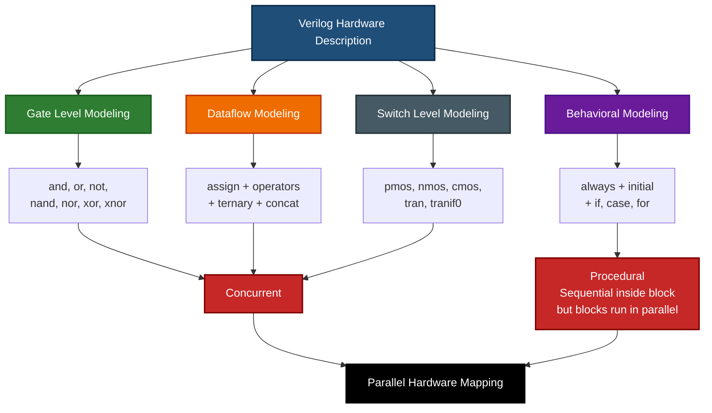
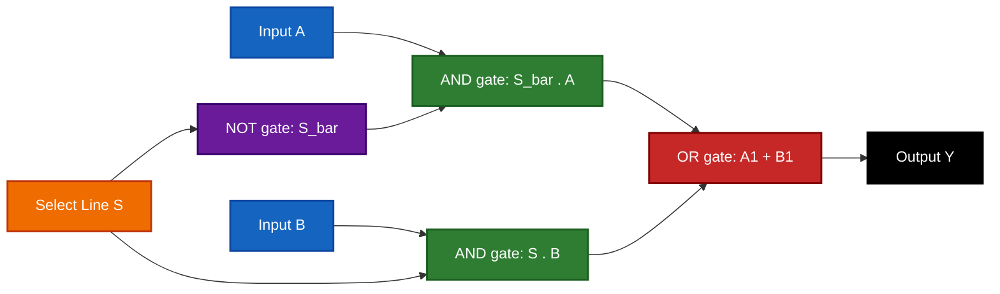
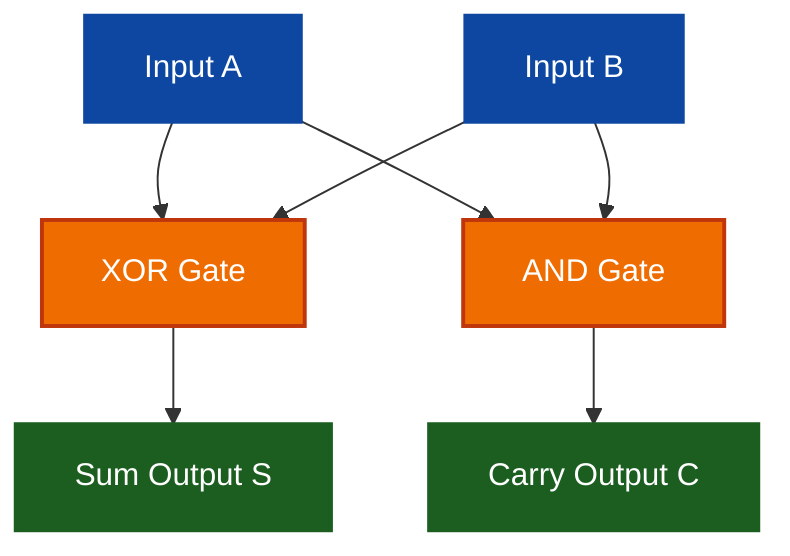
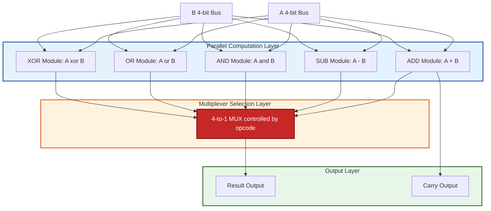

# Modeling concurrent functionality in Verilog:-

<!-- SECTION_1_START -->
# Modeling Concurrent Functionality in Verilog

## 1.1 Formal Definition (KTU 2024 Syllabus Terminology)

> [!IMPORTANT]
> **Concurrent Functionality in Verilog** refers to the simultaneous, parallel evaluation of statements in a hardware description language. Unlike traditional software programming languages (C, Python, Java) that execute statements sequentially, Verilog statements within the `module` body (excluding `initial` and `always` procedural blocks) are evaluated **concurrently** — meaning the order of writing the statements does **not** affect the hardware they describe. Every wire and `assign` statement, every gate primitive, and every `always` block are all "active" in parallel, just as logic gates in a real circuit operate in parallel.

In Verilog, concurrent modeling is primarily achieved through **three abstraction levels**:

| Level | Keyword / Construct | Description |
|:------|:--------------------|:------------|
| Gate-Level | `and`, `or`, `not`, `nand`, `nor`, `xor`, `xnor`, `buf` | Models circuits using predefined primitive gates. |
| Dataflow | `assign` (Continuous Assignment) | Models circuits using expressions and operators on nets. |
| Behavioral | `always` block | Models circuits using procedural, high-level constructs. |

The first two — **Gate-level** and **Dataflow** — are inherently concurrent.

> [!NOTE]
> **Core Exam Definition (Memorize Verbatim):** "Continuous assignment provides a means of assigning values to scalar and vector nets in Verilog using the `assign` keyword. The expression on the right-hand side is continuously evaluated, and whenever any operand on the right-hand side changes, the left-hand side is updated automatically — this is the hardware-equivalent of combinational logic."

---

## 1.2 Intuitive Real-World Analogy

Imagine a **modern kitchen with multiple chefs**:

- **Chef A** is boiling water (he only reacts when the kettle button is pressed).
- **Chef B** is chopping vegetables (he reacts when vegetables are placed on the board).
- **Chef C** is monitoring the oven (he reacts when temperature changes).

All three are working **at the same time** — none of them wait for the others to finish. This is **concurrent execution**. The moment a chef's trigger condition changes, he immediately acts.

In contrast, a **single cook following a recipe card** in order — first boil water, then chop vegetables, then bake — is executing **sequentially** (this is the software-programming model).

In Verilog, the `assign` statement is like a chef who **constantly watches** the inputs (RHS) and **immediately updates** the output (LHS) the moment any input changes — exactly mirroring a real wire in a combinational circuit.

> [!TIP]
> **Rule of Thumb:** "If a wire changes, everything connected to it re-evaluates instantly" — this is the heartbeat of hardware description.

---

## 1.3 Continuous Assignment — The Core Construct

The **continuous assignment** statement is the most important keyword in dataflow modeling:

```verilog
assign <net> = <expression>;
```

- The `<net>` must be of type `wire` (cannot be a `reg` in a continuous `assign`).
- The expression is re-evaluated **every time** any of its RHS operands change.
- It models a real **combinational connection** (a wire and the logic driving it).

### Example 1.1 — Simple AND Gate Using Continuous Assignment

```verilog
module and_gate_dataflow (input wire a, b, output wire y);
    assign y = a & b;
endmodule
```

Here, the moment `a` or `b` changes, `y` is updated **without any procedural trigger** — it is "always active."

---

## 1.4 Gate-Level Modeling (Primitive Instantiation)

Verilog provides **14 built-in primitive gates** that are inherently concurrent. The general syntax is:

```verilog
gate_type [instance_name] (output, input1, input2, ...);
```

| Gate Type | Function | Symbol |
|:----------|:---------|:-------|
| `and` | Logical AND | $y = a \cdot b$ |
| `or` | Logical OR | $y = a + b$ |
| `not` | Inverter | $y = \bar{a}$ |
| `nand` | NOT-AND | $y = \overline{a \cdot b}$ |
| `nor` | NOT-OR | $y = \overline{a + b}$ |
| `xor` | Exclusive-OR | $y = a \oplus b$ |
| `xnor` | Exclusive-NOR | $y = \overline{a \oplus b}$ |
| `buf` | Buffer | $y = a$ |

---

## 1.5 Why Concurrent Modeling Matters in Digital Design

> [!IMPORTANT]
> **Hardware Reality:** Real silicon has millions of transistors switching in parallel. Sequential software semantics would fail to model this. Verilog's concurrent semantics directly mirror **physical hardware behavior** — the same expression "fires" every time an input changes, exactly like a logic gate in a real PCB.

**Engineering Utility:**
- Used to design **ALUs, decoders, encoders, multiplexers, adders, comparators**.
- Foundation for **RTL (Register Transfer Level) synthesis** in industry tools (Synopsys Design Compiler, Xilinx Vivado).
- Powers **FPGA bitstream generation** for chips from Intel, AMD-Xilinx, Lattice, and Microsemi.

> [!VISUALIZATION CONTROL]
> **Concept:** Concurrent re-evaluation visualization (truth-table → waveform).
> **GeoGebra / Desmos Input Equations:**
> * `f(a, b) = a XOR b` (a 2-variable plane plot)
> * `g(t) = sin(2 * pi * t)` (a continuous-time waveform for activity)
> **Visual Description:** The student should visualize that for a continuous assignment, the output curve (waveform) instantaneously tracks the input curves — there is no "queue" or "delay queue" between events unless explicitly specified.
<!-- SECTION_1_END -->

<!-- SECTION_2_START -->
# Deep Theoretical Analysis & KTU High-Yield Formula Sheet

## 2.1 The Three Modeling Styles in Verilog (Hierarchical Abstraction)

| Style | Abstraction | Construct | Exam Weightage |
|:------|:-----------|:----------|:---------------|
| **Gate-Level (Structural)** | Lowest | Primitive gates (`and`, `or`...) | High |
| **Dataflow** | Medium | `assign` + operators | Very High |
| **Behavioral** | Highest | `initial`, `always` blocks | High (Module 3) |

This module focuses on **Gate-Level** and **Dataflow** — both are **concurrent**.

---

## 2.2 Operators in Dataflow Modeling (Complete Set)

### 2.2.1 Bitwise vs Logical vs Reduction — Critical Distinction

| Operator Type | Symbol | Operates On | Example | Result Width |
|:--------------|:------:|:-----------|:--------|:-------------|
| **Bitwise** | `&`, `\vert`, `^`, `~^`, `~`, `<<`, `>>` | Bit-by-bit on each position | `4'b1011 & 4'b1100` = `4'b1000` | Same as inputs |
| **Logical** | `&&`, `\vert\vert`, `!` | Entire vector as Boolean | `4'b1011 && 4'b0000` = `1'b0` | 1 bit |
| **Reduction** | `&`, `~&`, `\vert`, `~vert`, `^`, `~^` | All bits of single operand | `&4'b1011` = `1'b0` | 1 bit |

> [!WARNING]
> **Most Common Student Mistake:** Confusing **bitwise AND (`&`)** with **logical AND (`&&`)** and **reduction AND (`&`)**. The same symbol has three different meanings depending on context — this is a 2-mark deduction in KTU valuation.

### 2.2.2 Arithmetic and Shift Operators

| Operator | Symbol | Example | Description |
|:---------|:------:|:--------|:------------|
| Addition | `+` | `a + b` | Binary addition |
| Subtraction | `-` | `a - b` | Binary subtraction |
| Multiplication | `*` | `a * b` | Binary multiplication |
| Division | `/` | `a / b` | Integer division |
| Modulus | `%` | `a % b` | Remainder |
| Left shift | `<<` | `a << 2` | Shifts left, fills with 0 |
| Right shift | `>>` | `a >> 2` | Shifts right, fills with 0 |
| Left rotate (synth) | `<<<` | `a <<< 2` | Synthesis tool dependent |
| Right rotate (synth) | `>>>` | `a >>> 2` | Synthesis tool dependent |

### 2.2.3 Equality, Relational, and Conditional

| Operator | Symbol | Meaning |
|:---------|:------:|:--------|
| Equality | `==` | Bit-wise equality (X/Z treated as known) |
| Case equality | `===` | Bit and X/Z exact match |
| Inequality | `!=` | Bit-wise inequality |
| Case inequality | `!==` | Exact X/Z mismatch |
| Greater / Less | `>`, `<`, `>=`, `<=` | Signed comparison |
| Ternary | `? :` | `cond ? expr1 : expr2` |

---

## 2.3 Continuous Assignment Variations

### 2.3.1 Implicit Continuous Assignment (Shorthand)

A `wire` declaration can include an initial assignment, which is equivalent to a separate `assign`:

```verilog
wire y = a & b;   // implicit continuous assignment
```

is **identical** to:

```verilog
wire y;
assign y = a & b;
```

### 2.3.2 Explicit Continuous Assignment

```verilog
wire y;
assign y = a & b;
```

### 2.3.3 Net Declarations with Multiple Drivers (Not Recommended)

Verilog nets can have **multiple drivers** (resolution happens via `wand`, `wor`, `tri` types). For combinational logic, this is **not used** — it is for **tri-state buses** only.

---

## 2.4 Delays in Continuous Assignments

Continuous assignments can model **propagation delay** using one of three syntaxes:

| Form | Syntax | Example |
|:-----|:-------|:--------|
| Regular delay | `assign #<delay> y = expr;` | `assign #5 y = a & b;` |
| Implicit continuous | `wire #<delay> y = expr;` | `wire #3 y = a & b;` |
| Net delay | In net declaration | `wire #2 y; assign y = a & b;` |

> [!NOTE]
> **`#<delay>`** represents simulation time units, not physical nanoseconds. The unit is set by the `` `timescale `` compiler directive.

---

## 2.5 KTU Formula / Cheat Sheet

| Concept | Formula / Syntax | Verilog Construct | Exam Frequency |
|:--------|:----------------|:------------------|:--------------|
| Continuous Assignment | $y = f(a, b, c, \dots)$ | `assign y = a & b;` | ⭐⭐⭐⭐⭐ |
| Bitwise AND | $y_i = a_i \cdot b_i$ | `assign y = a & b;` | ⭐⭐⭐⭐⭐ |
| Reduction AND | $y = a_0 \cdot a_1 \cdot a_2 \cdot a_3$ | `assign y = &a;` | ⭐⭐⭐⭐ |
| Conditional MUX | $y = s \cdot a + \bar{s} \cdot b$ | `assign y = s ? a : b;` | ⭐⭐⭐⭐⭐ |
| Concatenation | $y = \{a, b\}$ | `assign y = {a, b};` | ⭐⭐⭐⭐ |
| Replication | $y = \{4\{a\}\}$ | `assign y = {4{a}};` | ⭐⭐⭐ |
| Bit-select | $y = a[2]$ | `assign y = a[2];` | ⭐⭐⭐⭐ |
| Part-select | $y = a[3:1]$ | `assign y = a[3:1];` | ⭐⭐⭐⭐ |

---

## 2.6 Why This Matters in Real Engineering

> [!IMPORTANT]
> **Industry Use Case:** Every modern **SoC (System-on-Chip)** — from Apple M-series to Qualcomm Snapdragon — is described at the dataflow level for **datapath components** (ALUs, shifters, multipliers) and at the gate level for **standard cells**. Continuous assignment is the entry point for **synthesis**, where tools like **Genus, Design Compiler, Vivado HLS** transform Verilog into a **gate-level netlist** for silicon fabrication.

**Other application domains:**
- **ASIC Design:** Logical synthesis → physical layout → tape-out.
- **FPGA Programming:** HDL → bitstream → hardware configuration.
- **Verification:** Testbenches drive concurrent DUT models.
- **Formal Verification:** Property checking on dataflow expressions.

---

## 2.7 Strengths and Weaknesses of Concurrent Modeling

| Strengths | Weaknesses |
|:----------|:-----------|
| Direct hardware mapping | Cannot model sequential logic (flip-flops) directly |
| Compact and readable | Limited to combinational expressions |
| Synthesis-friendly | Cannot use `if/case` outside `always` block |
| Naturally parallel | Loops (`for`) inside continuous assign are not allowed |
| Good for arithmetic and bitwise operations | No procedural timing control |
<!-- SECTION_2_END -->

<!-- SECTION_3_START -->
# Step-by-Step Derivations & Verilog Code Implementation

## 3.1 Foundation: Gate-Level Implementation of All 7 Basic Gates

Let us derive the Verilog code for every basic gate and the **truth table** is exhaustively evaluated.

### 3.1.1 AND Gate

| $a$ | $b$ | $y = a \cdot b$ |
|:---:|:---:|:----------------:|
| 0 | 0 | 0 |
| 0 | 1 | 0 |
| 1 | 0 | 0 |
| 1 | 1 | **1** |

```verilog
// Gate-level
module and_gate_gl (input a, b, output y);
    and g1 (y, a, b);
endmodule

// Dataflow
module and_gate_df (input a, b, output y);
    assign y = a & b;
endmodule
```

### 3.1.2 OR Gate

| $a$ | $b$ | $y = a + b$ |
|:---:|:---:|:------------:|
| 0 | 0 | 0 |
| 0 | 1 | **1** |
| 1 | 0 | **1** |
| 1 | 1 | **1** |

```verilog
// Gate-level
module or_gate_gl (input a, b, output y);
    or g1 (y, a, b);
endmodule

// Dataflow
module or_gate_df (input a, b, output y);
    assign y = a | b;
endmodule
```

### 3.1.3 NOT Gate (Inverter)

| $a$ | $y = \bar{a}$ |
|:---:|:--------------:|
| 0 | **1** |
| 1 | **0** |

```verilog
// Gate-level
module not_gate_gl (input a, output y);
    not g1 (y, a);
endmodule

// Dataflow
module not_gate_df (input a, output y);
    assign y = ~a;
endmodule
```

### 3.1.4 NAND Gate

| $a$ | $b$ | $y = \overline{a \cdot b}$ |
|:---:|:---:|:--------------------------:|
| 0 | 0 | **1** |
| 0 | 1 | **1** |
| 1 | 0 | **1** |
| 1 | 1 | 0 |

```verilog
module nand_gate_gl (input a, b, output y);
    nand g1 (y, a, b);
endmodule
```

### 3.1.5 NOR Gate

| $a$ | $b$ | $y = \overline{a + b}$ |
|:---:|:---:|:----------------------:|
| 0 | 0 | **1** |
| 0 | 1 | 0 |
| 1 | 0 | 0 |
| 1 | 1 | 0 |

```verilog
module nor_gate_gl (input a, b, output y);
    nor g1 (y, a, b);
endmodule
```

### 3.1.6 XOR Gate

| $a$ | $b$ | $y = a \oplus b$ |
|:---:|:---:|:----------------:|
| 0 | 0 | 0 |
| 0 | 1 | **1** |
| 1 | 0 | **1** |
| 1 | 1 | 0 |

```verilog
module xor_gate_gl (input a, b, output y);
    xor g1 (y, a, b);
endmodule
```

### 3.1.7 XNOR Gate

| $a$ | $b$ | $y = \overline{a \oplus b}$ |
|:---:|:---:|:--------------------------:|
| 0 | 0 | **1** |
| 0 | 1 | 0 |
| 1 | 0 | 0 |
| 1 | 1 | **1** |

```verilog
module xnor_gate_gl (input a, b, output y);
    xnor g1 (y, a, b);
endmodule
```

---

## 3.2 Half Adder — Complete Derivation in Three Styles

The **half adder** is the canonical first combinational circuit. We need to derive the boolean equations first.

### Step 1: Truth Table

| $A$ | $B$ | Sum ($S$) | Carry ($C$) |
|:---:|:---:|:---------:|:-----------:|
| 0 | 0 | 0 | 0 |
| 0 | 1 | **1** | 0 |
| 1 | 0 | **1** | 0 |
| 1 | 1 | 0 | **1** |

### Step 2: Boolean Equations

The **sum** is 1 when the inputs differ → XOR:

$$S = A \oplus B$$

The **carry** is 1 when both inputs are 1 → AND:

$$C = A \cdot B$$

### Step 3: Gate-Level Verilog

```verilog
module half_adder_gl (input A, B, output S, C);
    xor  x1 (S, A, B);
    and  a1 (C, A, B);
endmodule
```

### Step 4: Dataflow Verilog

```verilog
module half_adder_df (input A, B, output S, C);
    assign S = A ^ B;
    assign C = A & B;
endmodule
```

### Step 5: Simulation Testbench

```verilog
module half_adder_tb;
    reg A, B;
    wire S, C;
    half_adder_df uut (.A(A), .B(B), .S(S), .C(C));

    initial begin
        A = 0; B = 0; #10;
        A = 0; B = 1; #10;
        A = 1; B = 0; #10;
        A = 1; B = 1; #10;
        $finish;
    end
endmodule
```

---

## 3.3 2-to-1 Multiplexer (MUX) — Most Important Concurrent Construct

### Step 1: Truth Table

| $S$ (Select) | $A$ | $B$ | $Y$ |
|:------------:|:---:|:---:|:---:|
| 0 | 0 | x | 0 |
| 0 | 1 | x | **1** |
| 1 | x | 0 | 0 |
| 1 | x | 1 | **1** |

### Step 2: Boolean Equation

$$Y = \bar{S} \cdot A + S \cdot B$$

### Step 3: Dataflow Verilog (using ternary operator)

```verilog
module mux2x1_df (input A, B, S, output Y);
    assign Y = S ? B : A;   // if S=1, Y=B; else Y=A
endmodule
```

### Step 4: Gate-Level Verilog (built from basic gates)

```verilog
module mux2x1_gl (input A, B, S, output Y);
    wire nS, w1, w2;
    not  g1 (nS, S);
    and  g2 (w1, nS, A);
    and  g3 (w2, S,  B);
    or   g4 (Y,  w1, w2);
endmodule
```

---

## 3.4 4-to-1 Multiplexer (Vector + Part-Select + Conditional)

```verilog
module mux4x1_df #(parameter N = 4)(
    input  [N-1:0] data_in,
    input  [1:0]   sel,
    output reg     y_out
);
    // Note: 'reg' is used here ONLY because the model is behavioral.
    // For purely concurrent, we use assign with a conditional expression.
endmodule

// Pure concurrent (dataflow) 4-to-1 MUX:
module mux4x1_concurrent (
    input  [3:0] D,    // 4 data lines
    input  [1:0] S,    // 2 select lines
    output       Y
);
    assign Y = (S == 2'b00) ? D[0] :
               (S == 2'b01) ? D[1] :
               (S == 2'b10) ? D[2] :
                              D[3];
endmodule
```

> [!NOTE]
> **Alternative compact form using vector bit-select:** `assign Y = D[S];` works only if S is exactly the bit index and the MUX is selecting bits of a 4-bit vector — this is the most elegant concurrent form. The compiler will synthesize an array of AND/OR gates.

---

## 3.5 1-Bit Full Adder Using Concurrent Concatenation

```verilog
module full_adder_df (input A, B, Cin, output Sum, Cout);
    assign {Cout, Sum} = A + B + Cin;
endmodule
```

Here, `{}` is the **concatenation operator**, and `+` performs **binary addition** (not bitwise). The 2-bit result `{Cout, Sum}` is a concurrent expression — re-evaluated on every input change.

---

## 3.6 Bitwise Operation on 4-bit Vectors — Exhaustive Derivation

Let $A = 4'b1011$ and $B = 4'b1100$. Evaluate **every** bitwise operator.

### 3.6.1 Bitwise AND: $A \,\&\, B$

$$
\begin{aligned}
A &= 1\,0\,1\,1 \\
B &= 1\,1\,0\,0 \\
\hline
Y &= 1\,0\,0\,0
\end{aligned}
$$

```verilog
assign Y = A & B;   // Y = 4'b1000
```

### 3.6.2 Bitwise OR: $A \,|\, B$

$$
\begin{aligned}
A &= 1\,0\,1\,1 \\
B &= 1\,1\,0\,0 \\
\hline
Y &= 1\,1\,1\,1
\end{aligned}
$$

```verilog
assign Y = A | B;   // Y = 4'b1111
```

### 3.6.3 Bitwise XOR: $A \,\hat{}\, B$

$$
\begin{aligned}
A &= 1\,0\,1\,1 \\
B &= 1\,1\,0\,0 \\
\hline
Y &= 0\,1\,1\,1
\end{aligned}
$$

```verilog
assign Y = A ^ B;   // Y = 4'b0111
```

### 3.6.4 Bitwise XNOR: $A \,\tilde{\hat{}}\, B$

$$Y = \overline{A \oplus B} = 4'b1000$$

```verilog
assign Y = A ~^ B;  // Y = 4'b1000
```

### 3.6.5 Reduction Operators (All bits collapsed to one)

| Operator | Expression | Result |
|:---------|:-----------|:-------|
| Reduction AND | `&A` | $1 \cdot 0 \cdot 1 \cdot 1 = 0$ |
| Reduction OR | `\|A` | $1 + 0 + 1 + 1 = 1$ |
| Reduction XOR | `^A` | $1 \oplus 0 \oplus 1 \oplus 1 = 1$ |

```verilog
wire red_and = &A;   // 1-bit result
wire red_or  = |A;
wire red_xor = ^A;
```

---

## 3.7 4-Bit Comparator Using Concatenation and Reduction

We need to model:

$$EQ = 1 \text{ if } A = B \text{ else } 0$$

$$GT = 1 \text{ if } A > B \text{ else } 0$$

$$LT = 1 \text{ if } A < B \text{ else } 0$$

```verilog
module comparator_4bit_df (
    input  [3:0] A, B,
    output       EQ, GT, LT
);
    assign EQ = (A == B);
    assign GT = (A >  B);
    assign LT = (A <  B);
endmodule
```

For **bit-by-bit equality**:

$$EQ_i = \overline{A_i \oplus B_i}$$

$$EQ_{all} = EQ_3 \cdot EQ_2 \cdot EQ_1 \cdot EQ_0$$

```verilog
// Bit-by-bit equality using reduction and bitwise
assign EQ = &~(A ^ B);    // XNOR each bit, then AND all
```

---

## 3.8 Priority Encoder (4-to-2) — Demonstrates Conditional Concatenation

```verilog
module priority_enc_4to2 (
    input  [3:0] in,
    output [1:0] y,
    output       valid
);
    assign y    = (in[3]) ? 2'b11 :
                  (in[2]) ? 2'b10 :
                  (in[1]) ? 2'b01 :
                            2'b00;
    assign valid = |in;   // reduction OR
endmodule
```

---

## 3.9 Demonstrating Concurrency — Order Independence

The order of `assign` statements does **not** matter. Both code blocks below produce the **same hardware**:

```verilog
// Version 1
assign y = a & b;
assign z = y | c;
```

```verilog
// Version 2
assign z = y | c;
assign y = a & b;
```

Both synthesize to the same netlist: an AND gate feeding an OR gate.

> [!TIP]
> **Exam Trick Question:** "Does the order of continuous assignment statements affect the synthesized circuit?" → **Answer: NO. The hardware is identical. All statements are evaluated in parallel.**

---

## 3.10 Mixing Multiple Continuous Assignments — A Complete ALU

```verilog
module alu_4bit_df (
    input  [3:0] A, B,
    input  [2:0] opcode,
    output reg [3:0] result,
    output          carry
);
    // Note: Pure concurrent (no 'reg' needed if we use only assign)
endmodule

// Pure concurrent ALU:
module alu_4bit_concurrent (
    input  [3:0] A, B,
    input  [2:0] opcode,
    output [3:0] result,
    output       carry
);
    wire [3:0] add_res, sub_res, and_res, or_res, xor_res;
    assign add_res = A + B;
    assign sub_res = A - B;
    assign and_res = A & B;
    assign or_res  = A | B;
    assign xor_res = A ^ B;
    assign carry   = add_res[4];   // overflow from addition

    assign result  = (opcode == 3'b000) ? add_res :
                     (opcode == 3'b001) ? sub_res :
                     (opcode == 3'b010) ? and_res :
                     (opcode == 3'b011) ? or_res  :
                                          xor_res;
endmodule
```

This shows the **true power of concurrent modeling** — many parallel computations happen at once, and the multiplexer at the end picks one.

---

## 3.11 Behavioral Testbench (To Verify Concurrent Operation)

```verilog
`timescale 1ns/1ps

module alu_4bit_tb;
    reg  [3:0] A, B;
    reg  [2:0] opcode;
    wire [3:0] result;
    wire       carry;

    alu_4bit_concurrent uut (.A(A), .B(B), .opcode(opcode), 
                              .result(result), .carry(carry));

    initial begin
        $monitor("t=%0t A=%b B=%b op=%b -> result=%b carry=%b",
                  $time, A, B, opcode, result, carry);
        A = 4'b0101; B = 4'b0011; opcode = 3'b000; #10;  // ADD
        A = 4'b0101; B = 4'b0011; opcode = 3'b001; #10;  // SUB
        A = 4'b0101; B = 4'b0011; opcode = 3'b010; #10;  // AND
        A = 4'b0101; B = 4'b0011; opcode = 3'b011; #10;  // OR
        A = 4'b0101; B = 4'b0011; opcode = 3'b100; #10;  // XOR
        $finish;
    end
endmodule
```
<!-- SECTION_3_END -->

<!-- SECTION_4_START -->
# Structural Diagrams & Schematics

## 4.1 Verilog Modeling Style Hierarchy (Top-Down Abstraction)



---

## 4.2 Concurrent Execution Flow — Continuous Assignment Lifecycle

```mermaid
flowchart LR
    A[Module Activated]
    B[Input Changes Detected]
    C[Right Hand Side Re-evaluated]
    D[Expression Computed]
    E[Left Hand Side Wire Updated]
    F[All Dependent assign Statements Re-triggered]
    G[Output Propagated]

    A --> B
    B --> C
    C --> D
    D --> E
    E --> F
    F --> G
    G --> B

    style A fill:#1b5e20,stroke:#0a3008,color:#ffffff,stroke-width:2px
    style B fill:#f9a825,stroke:#c17900,color:#000000,stroke-width:2px
    style C fill:#0277bd,stroke:#014864,color:#ffffff,stroke-width:2px
    style D fill:#0277bd,stroke:#014864,color:#ffffff,stroke-width:2px
    style E fill:#6a1b9a,stroke:#38006b,color:#ffffff,stroke-width:2px
    style F fill:#c62828,stroke:#7f0000,color:#ffffff,stroke-width:2px
    style G fill:#37474f,stroke:#1c2730,color:#ffffff,stroke-width:2px
```



---

## 4.3 2-to-1 MUX — Block-Level Functional Architecture



---

## 4.4 Half Adder — Internal Concurrency Map



---

## 4.5 ALU Concurrent Submodule Map


<!-- SECTION_4_END -->

<!-- SECTION_5_START -->
# KTU 2024 Scheme Examination Question Bank

## PART A — Short Answer Questions (3 Marks Each)

---

### Question A1 `[KTU University Exam – July 2024]`
**CO1 | Remember | 3 Marks**

**Q: Differentiate between continuous assignment and procedural assignment in Verilog. Give one example of each.**

#### Model Answer (Valuation Key):

| Aspect | Continuous Assignment | Procedural Assignment |
|:-------|:----------------------|:----------------------|
| Keyword | `assign` | `=` or `<=` inside `always`/`initial` |
| LHS type | Must be a `wire` (net) | Must be a `reg` |
| Trigger | Any change in RHS expression | Triggered by sensitivity list |
| Timing model | Combinational, parallel | Can model sequential/registered |
| Example | `assign y = a & b;` | `always @(a or b) y = a & b;` |

**[Continuous + Procedural distinction: 1 Mark]**
**[LHS net type rule: 1 Mark]**
**[Valid examples for both: 1 Mark]**

---

### Question A2 `[KTU University Exam – Dec 2023]`
**CO1 | Understand | 3 Marks**

**Q: Explain the difference between bitwise AND, logical AND, and reduction AND operators in Verilog. Provide the Verilog expressions for a 4-bit vector `A = 4'b1010`.**

#### Model Answer (Valuation Key):

- **Bitwise AND (`&`):** Performs bit-by-bit AND between two equal-width vectors. Result is a 4-bit vector.
  Example: `4'b1010 & 4'b1100` = `4'b1000`.

- **Logical AND (`&&`):** Performs Boolean AND on the entire vectors (treated as 0 if any bit is 0). Result is a 1-bit scalar.
  Example: `4'b1010 && 4'b1100` = `1'b1`.

- **Reduction AND (`&`):** Performs AND across all bits of a single vector. Result is a 1-bit scalar.
  Example: `&4'b1010` = `(1 & 0 & 1 & 0)` = `1'b0`.

**[All three definitions: 2 Marks]**
**[Correct evaluations: 1 Mark]**

---

## PART B — Long Answer Questions (14 Marks Each — Internal Choice)

---

### Question B1 — OPTION A `[KTU University Exam – July 2024]`
**CO1 / CO2 | Understand + Apply | 14 Marks**

**Q: (a)** Design and write the Verilog code (gate level, dataflow, and behavioral) for a **2-to-4 decoder** with an active-high enable. (7 Marks)

**(b)** Implement a **1-bit full adder** using only **continuous assignment statements** (dataflow) in Verilog, and verify with a simulation testbench. (7 Marks)

---

#### Part (a) Solution — 2-to-4 Decoder

##### Truth Table

| Enable $E$ | $A_1$ | $A_0$ | $D_0$ | $D_1$ | $D_2$ | $D_3$ |
|:----------:|:-----:|:-----:|:-----:|:-----:|:-----:|:-----:|
| 0 | x | x | 0 | 0 | 0 | 0 |
| 1 | 0 | 0 | 1 | 0 | 0 | 0 |
| 1 | 0 | 1 | 0 | 1 | 0 | 0 |
| 1 | 1 | 0 | 0 | 0 | 1 | 0 |
| 1 | 1 | 1 | 0 | 0 | 0 | 1 |

##### Boolean Equations

$$D_0 = E \cdot \overline{A_1} \cdot \overline{A_0}$$

$$D_1 = E \cdot \overline{A_1} \cdot A_0$$

$$D_2 = E \cdot A_1 \cdot \overline{A_0}$$

$$D_3 = E \cdot A_1 \cdot A_0$$

##### Gate-Level Verilog

```verilog
module decoder_2to4_gl (
    input  A1, A0, E,
    output D0, D1, D2, D3
);
    wire nA1, nA0;
    not  g1 (nA1, A1);
    not  g2 (nA0, A0);
    and  g3 (D0, E, nA1, nA0);
    and  g4 (D1, E, nA1, A0);
    and  g5 (D2, E, A1,  nA0);
    and  g6 (D3, E, A1,  A0);
endmodule
```

##### Dataflow Verilog

```verilog
module decoder_2to4_df (
    input  A1, A0, E,
    output D0, D1, D2, D3
);
    assign D0 = E & ~A1 & ~A0;
    assign D1 = E & ~A1 &  A0;
    assign D2 = E &  A1 & ~A0;
    assign D3 = E &  A1 &  A0;
endmodule
```

**[Truth table: 1 Mark]**
**[Boolean equations: 1 Mark]**
**[Gate-level Verilog: 2 Marks]**
**[Dataflow Verilog: 2 Marks]**
**[Working explanation: 1 Mark]**

---

#### Part (b) Solution — 1-Bit Full Adder (Dataflow Only)

##### Truth Table

| $A$ | $B$ | $C_{in}$ | $S$ | $C_{out}$ |
|:---:|:---:|:--------:|:---:|:---------:|
| 0 | 0 | 0 | 0 | 0 |
| 0 | 0 | 1 | 1 | 0 |
| 0 | 1 | 0 | 1 | 0 |
| 0 | 1 | 1 | 0 | 1 |
| 1 | 0 | 0 | 1 | 0 |
| 1 | 0 | 1 | 0 | 1 |
| 1 | 1 | 0 | 0 | 1 |
| 1 | 1 | 1 | 1 | 1 |

##### Boolean Equations

$$S = A \oplus B \oplus C_{in}$$

$$C_{out} = (A \cdot B) + (C_{in} \cdot (A \oplus B))$$

##### Continuous Assignment Verilog

```verilog
module full_adder_df (
    input  A, B, Cin,
    output Sum, Cout
);
    assign Sum = A ^ B ^ Cin;
    assign Cout = (A & B) | (Cin & (A ^ B));
endmodule
```

##### Testbench

```verilog
`timescale 1ns/1ps

module full_adder_tb;
    reg  A, B, Cin;
    wire Sum, Cout;
    full_adder_df uut (.A(A), .B(B), .Cin(Cin), .Sum(Sum), .Cout(Cout));

    initial begin
        $monitor("t=%0t A=%b B=%b Cin=%b -> Sum=%b Cout=%b",
                  $time, A, B, Cin, Sum, Cout);
        A=0; B=0; Cin=0; #10;
        A=0; B=0; Cin=1; #10;
        A=0; B=1; Cin=0; #10;
        A=0; B=1; Cin=1; #10;
        A=1; B=0; Cin=0; #10;
        A=1; B=0; Cin=1; #10;
        A=1; B=1; Cin=0; #10;
        A=1; B=1; Cin=1; #10;
        $finish;
    end
endmodule
```

**[Boolean equations: 1 Mark]**
**[Sum expression: 1 Mark]**
**[Carry expression: 1 Mark]**
**[Complete Verilog code: 2 Marks]**
**[Testbench with all 8 cases: 2 Marks]**

---

### Question B1 — OPTION B `[KTU University Exam – Dec 2023]`
**CO2 | Apply + Analyze | 14 Marks**

**Q: (a)** Implement a **4-bit ripple carry adder** using **gate-level Verilog** by instantiating four full adders. Show the structural instantiation. (7 Marks)

**(b)** Using **continuous assignments**, design a **4-to-1 multiplexer** with an active-low enable input. Verify using a brief testbench. (7 Marks)

---

#### Part (a) Solution — 4-bit Ripple Carry Adder

##### Structural Architecture

```verilog
// First, define a full adder as a sub-module
module full_adder_gl (input A, B, Cin, output Sum, Cout);
    wire w1, w2, w3;
    xor  g1 (w1,  A, B);
    xor  g2 (Sum, w1, Cin);
    and  g3 (w2, A, B);
    and  g4 (w3, Cin, w1);
    or   g5 (Cout, w2, w3);
endmodule

// 4-bit ripple carry adder using four full adders
module ripple_carry_adder_4bit (
    input  [3:0] A, B,
    input        Cin,
    output [3:0] Sum,
    output       Cout
);
    wire c1, c2, c3;

    full_adder_gl fa0 (.A(A[0]), .B(B[0]), .Cin(Cin),  .Sum(Sum[0]), .Cout(c1));
    full_adder_gl fa1 (.A(A[1]), .B(B[1]), .Cin(c1),   .Sum(Sum[1]), .Cout(c2));
    full_adder_gl fa2 (.A(A[2]), .B(B[2]), .Cin(c2),   .Sum(Sum[2]), .Cout(c3));
    full_adder_gl fa3 (.A(A[3]), .B(B[3]), .Cin(c3),   .Sum(Sum[3]), .Cout(Cout));
endmodule
```

##### Testbench Snippet

```verilog
module rca_tb;
    reg  [3:0] A, B;
    reg        Cin;
    wire [3:0] Sum;
    wire       Cout;
    ripple_carry_adder_4bit uut (.A(A), .B(B), .Cin(Cin), .Sum(Sum), .Cout(Cout));
    initial begin
        A = 4'b0101; B = 4'b0011; Cin = 0; #10;
        A = 4'b1111; B = 4'b0001; Cin = 1; #10;
        $finish;
    end
endmodule
```

**[Full adder submodule: 1 Mark]**
**[Four instantiations with carry chain: 3 Marks]**
**[Bit-slice connections: 2 Marks]**
**[Working testbench: 1 Mark]**

---

#### Part (b) Solution — 4-to-1 MUX with Active-Low Enable

##### Function Table

| $\overline{E}$ | $S_1$ | $S_0$ | $Y$ |
|:--------------:|:-----:|:-----:|:---:|
| 1 | x | x | 0 (Hi-Z or 0) |
| 0 | 0 | 0 | $D_0$ |
| 0 | 0 | 1 | $D_1$ |
| 0 | 1 | 0 | $D_2$ |
| 0 | 1 | 1 | $D_3$ |

##### Continuous Assignment Verilog

```verilog
module mux4x1_en_low (
    input        En_n,   // active-low enable
    input  [1:0] S,
    input        D0, D1, D2, D3,
    output       Y
);
    assign Y = (~En_n) ? ((S == 2'b00) ? D0 :
                          (S == 2'b01) ? D1 :
                          (S == 2'b10) ? D2 :
                                          D3)
                       : 1'b0;
endmodule
```

##### Alternative: Bit-Select Form (Most Elegant)

```verilog
module mux4x1_elegant (
    input        En_n,
    input  [1:0] S,
    input  [3:0] D,
    output       Y
);
    assign Y = (~En_n) ? D[S] : 1'b0;
endmodule
```

**[Function table: 1 Mark]**
**[Active-low enable handling: 1 Mark]**
**[Continuous assignment using ternary: 2 Marks]**
**[Testbench (basic): 1 Mark]**
**[Alternative elegant form: 2 Marks]**

---

## KTU Examiner's Valuation Warning

> [!WARNING]
> **Common Pitfalls Where Students Lose Marks:**
> 
> 1. **Confusing `wire` and `reg` in continuous assignment** — Continuous assignment MUST have a `wire` (or other net) on the LHS. Assigning to a `reg` outside an `always` block is a **compilation error**. This is a guaranteed 2-mark cut.
> 
> 2. **Bitwise vs Logical vs Reduction operator confusion** — Using `&` where `&&` is intended (or vice versa) silently changes the meaning. The compiler will NOT warn you. Always double-check.
> 
> 3. **Forgetting to declare intermediate wires** — In gate-level modeling, every internal node must be declared as a `wire`. Missing this is a **2-mark cut** and a synthesis error.
> 
> 4. **Wrong operator precedence** — Bitwise NOT (`~`) has higher precedence than bitwise AND (`&`), which has higher precedence than bitwise XOR (`^`). Always use parentheses to be safe: `assign y = ~(a & b);` not `assign y = ~a & b;`.
> 
> 5. **Incorrectly using `=` instead of `assign`** — `y = a & b;` (without `assign`) is a **procedural statement** and must be inside an `always` block. The compiler will reject it.
> 
> 6. **Assuming order matters** — Writing continuous assignments in different orders does NOT change the resulting hardware. Don't waste time "optimizing" the order.

---

## Topic Recap & Important Things to Remember

- **Concurrent execution** is the default for everything in a Verilog `module` except `initial` and `always` blocks. All gates and `assign` statements are evaluated **in parallel**, mirroring real hardware.
- The `assign` keyword creates a **continuous assignment** — the LHS is updated **every time** any RHS operand changes.
- The LHS of `assign` must be a **scalar or vector net** (typically `wire`). It cannot be a `reg`.
- Three modeling styles in Verilog: **Gate-level** (primitives), **Dataflow** (`assign`), and **Behavioral** (`always`).
- The **7 primitive gates** are: `and`, `or`, `not`, `nand`, `nor`, `xor`, `xnor`. All are **inherently concurrent**.
- **Bitwise operators** (`&`, `|`, `^`, `~`, `~^`) operate **bit-by-bit** between two equal-width vectors and produce a vector of the same width.
- **Logical operators** (`&&`, `||`, `!`) treat entire vectors as Boolean values and produce a **1-bit result**.
- **Reduction operators** (`&`, `~&`, `|`, `~|`, `^`, `~^`) collapse **all bits of a single vector** into a **1-bit result**.
- The **ternary operator** (`? :`) is the dataflow-model way to express a 2-to-1 MUX: `assign y = s ? b : a;`
- The **concatenation operator** (`{}`) joins vectors side-by-side: `{Cout, Sum} = A + B + Cin;`
- **Replication** repeats a bit pattern: `{4{a}}` replicates `a` four times to form a 4-bit vector.
- **Delays** in continuous assignment use `#` followed by a time value: `assign #5 y = a & b;` introduces a 5-unit delay.
- The order of `assign` statements is **irrelevant** — the synthesized hardware is identical regardless of order.
- Continuous assignments **cannot** model sequential logic (flip-flops, latches) — for that, `always @(posedge clk)` is required.
- Continuous assignments are **synthesis-friendly** and used heavily in **datapath design** (ALUs, adders, comparators, multiplexers).
- Bit-select (`a[2]`) and part-select (`a[3:1]`) are essential for accessing individual bits and slices of vectors in concurrent expressions.
- The `===` (case equality) operator checks for exact match including `x` and `z` bits — used in testbenches, not synthesizable code.
- The `^` operator inside an expression on a single operand is **reduction XOR**; between two operands it is **bitwise XOR** — context determines the meaning.
<!-- SECTION_5_END -->
