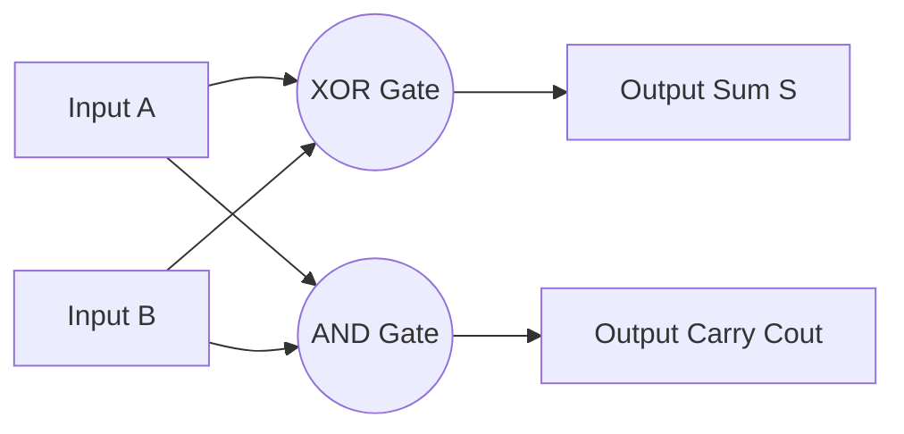
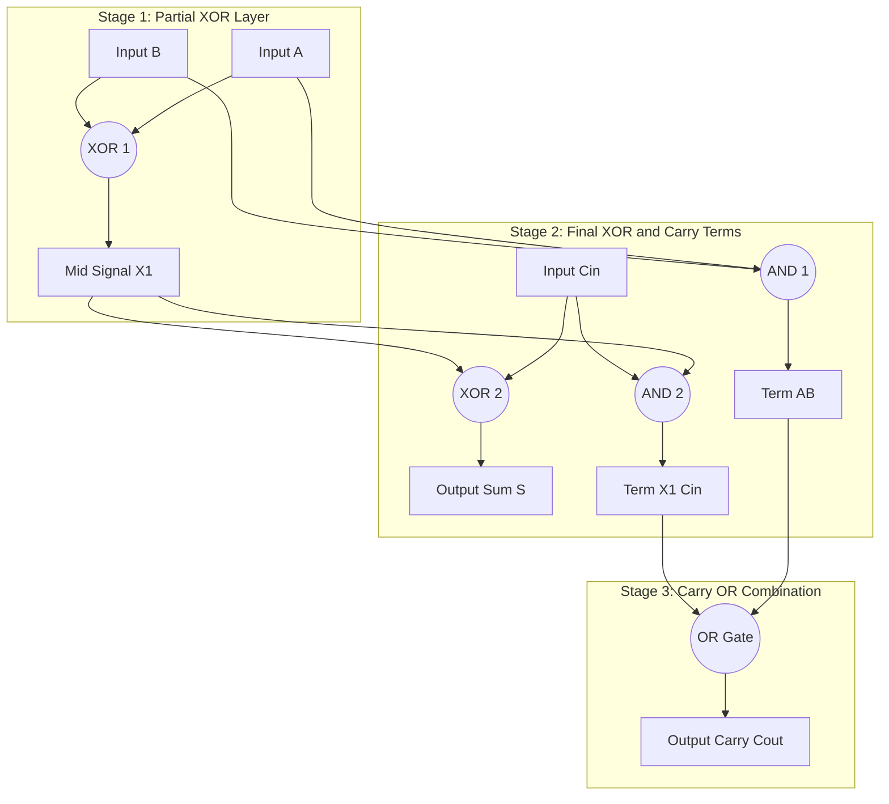
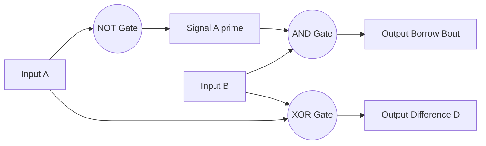
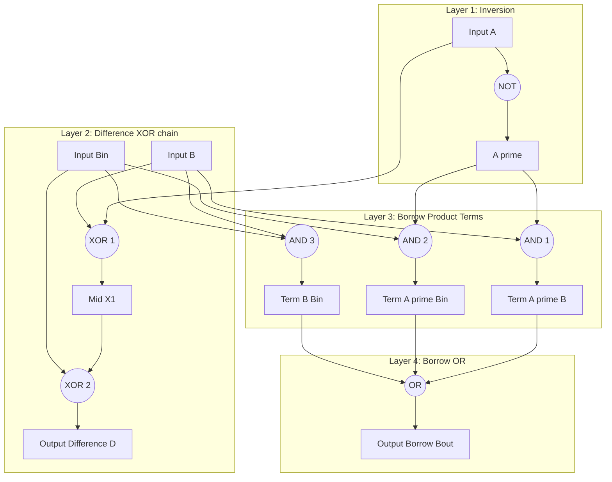
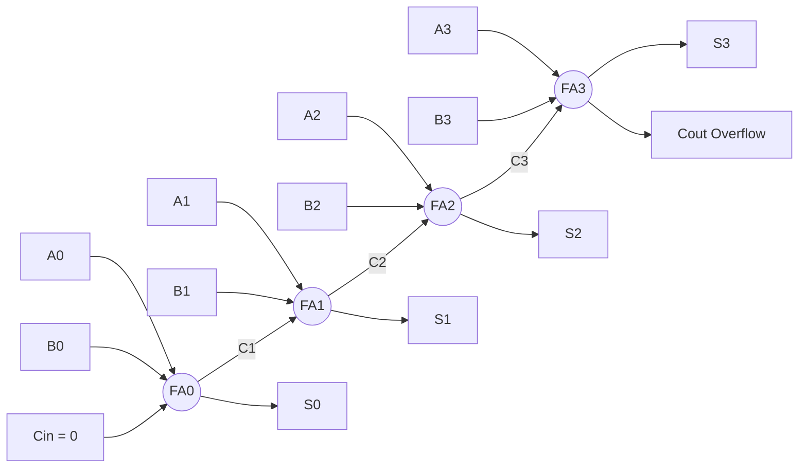
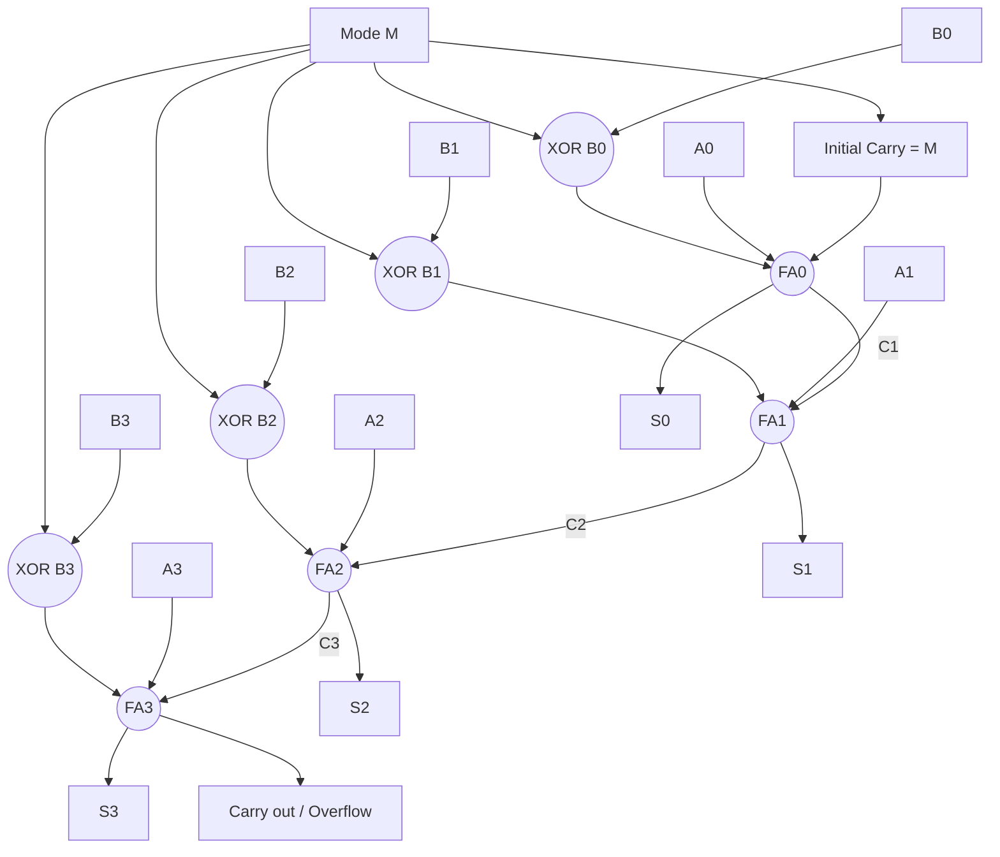
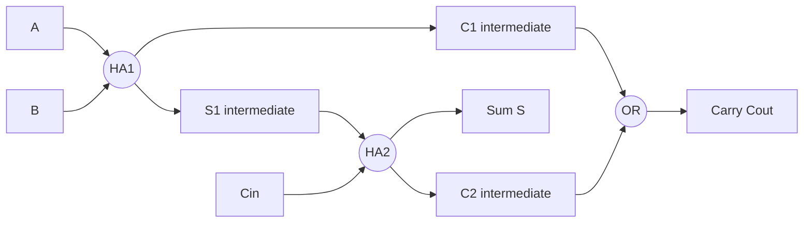
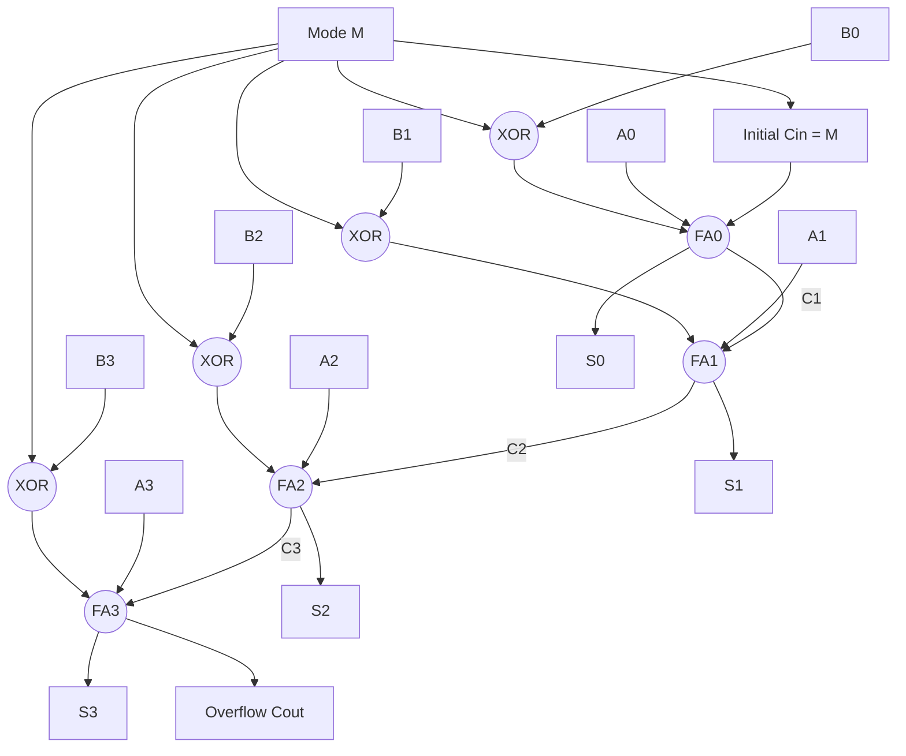

# Digital Building Blocks - Arithmetic Circuits - Half adder, Full adder, half subtractor, full subtractor

<!-- SECTION_1_START -->

# Module 3 — Digital Building Blocks: Arithmetic Circuits

## 1. Core Technical Definition & Intuitive Overview

### 1.1 Formal Definitions (KTU 2024 Syllabus Terminology)

> [!IMPORTANT]
> **Arithmetic Circuits** are the fundamental **combinational logic building blocks** of any digital system, responsible for performing binary addition and subtraction at the bit level. They form the arithmetic core of every **ALU (Arithmetic Logic Unit)** in processors, calculators, and DSP hardware.

| Building Block | Inputs | Outputs | KTU Terminology |
|:---:|:---:|:---:|:---|
| **Half Adder (HA)** | $A, B$ | Sum ($S$), Carry ($C_{out}$) | Adds **two** single bits — *no carry input* |
| **Full Adder (FA)** | $A, B, C_{in}$ | Sum ($S$), Carry ($C_{out}$) | Adds **three** bits (with carry input) |
| **Half Subtractor (HS)** | $A, B$ | Difference ($D$), Borrow ($B_{out}$) | Subtracts **two** single bits — *no borrow input* |
| **Full Subtractor (FS)** | $A, B, B_{in}$ | Difference ($D$), Borrow ($B_{out}$) | Subtracts **three** bits (with borrow input) |

> [!NOTE]
> **KTU Board Tip:** The *Half* variants are called "Half" because they **cannot accept a carry/borrow from a previous lower-order bit** — they only handle the local LSB stage. *Full* variants extend this to a **ripple-cascade** architecture for multi-bit arithmetic.

---

### 1.2 Conceptual Analogy / Geometric Intuition

Imagine addition in **base-10 (decimal)**, the way you learned in school:

$$
\begin{array}{r}
  47 \\
+ \; 35 \\
\hline
  82
\end{array}
$$

You add the **ones column** first ($7+5=12$). You write down **2** and **carry 1** to the tens column. This **two-step hand procedure** — *sum the bits, propagate a carry* — is exactly what an adder circuit does in **base-2 (binary)**.

> [!TIP]
> **Analogy:** A **Half Adder** is like adding only the *ones column* of two numbers without remembering that someone might have carried into it. A **Full Adder** is the *complete* ones-column worker who **also accepts a carried-in value from an even-lower column** (e.g., a column to the right of it in an LSB-to-MSB ripple).

For subtraction, the analogy flips: instead of *carrying*, you **borrow** from the next higher column when the top digit is smaller than the bottom digit.

---

### 1.3 Physical Constants & Standard Metrics

> [!IMPORTANT]
> - **Logic Family Standards:** TTL uses **5 V** supply; CMOS uses **3.3 V or 5 V**; modern sub-micron CMOS scales to **1.2 V–1.8 V**.
> - **Propagation Delay ($t_{pd}$):** Typical adder gate delay in 7400-series TTL ≈ **10–20 ns** per gate level.
> - **Fan-out:** Standard TTL gate can drive **10** standard loads.
> - **Noise Margin:** TTL $\approx \mathbf{0.4 \; V}$; CMOS $\approx \mathbf{1.5 \; V}$ (at 5 V supply).

---

### 1.4 Visualization Callout

> [!VISUALIZATION CONTROL]
> **Concept:** Binary Addition Truth-Table Geometry
> **GeoGebra / Desmos Input Equations:**
> * Points: $(0,0), (0,1), (1,0), (1,1)$ on a 2-bit input plane.
> * Z-axis (height) values for $S$: $0, 1, 1, 0$ — forms a *checkerboard XOR pattern*.
> * Z-axis (height) values for $C_{out}$: $0, 0, 0, 1$ — forms a *single peak at $(1,1)$*.
> **Visual Description:** On the $A$–$B$ plane, the Sum output is **0** at $(0,0)$ and $(1,1)$, **1** at $(0,1)$ and $(1,0)$ — a perfect **XOR** checkerboard. The Carry output is **0 everywhere except $(1,1)$**, where it spikes to **1** — a perfect **AND** corner peak.

<!-- SECTION_1_END -->

<!-- SECTION_2_START -->

# 2. Deep Theoretical Analysis & KTU High-Yield Formula Sheet

## 2.1 Half Adder (HA) — The Most Fundamental 2-Input Adder

### 2.1.1 Truth Table

| $A$ | $B$ | Sum ($S$) | Carry ($C_{out}$) |
|:---:|:---:|:---:|:---:|
| 0 | 0 | 0 | 0 |
| 0 | 1 | 1 | 0 |
| 1 | 0 | 1 | 0 |
| 1 | 1 | 0 | 1 |

### 2.1.2 Boolean Equation Derivation (K-Map)

From the K-Map, the **sum-of-products (SOP)** and **product-of-sums (POS)** are:

$$
S = A \oplus B = A'B + AB'
$$

$$
C_{out} = A \cdot B
$$

### 2.1.3 Why These Specific Equations?

- **Sum** has two 1's in the truth table located at *diagonally opposite* cells → this is the **canonical signature of the XOR function**.
- **Carry** has a single 1 at $(1,1)$ → this is the **canonical signature of the AND function**.

> [!NOTE]
> **KTU Insight:** A Half Adder can be implemented using **one XOR gate** (for $S$) and **one AND gate** (for $C_{out}$). This is the most gate-efficient realization.

---

## 2.2 Full Adder (FA) — The 3-Input Cascade Cell

### 2.2.1 Truth Table

| $A$ | $B$ | $C_{in}$ | Sum ($S$) | Carry ($C_{out}$) |
|:---:|:---:|:---:|:---:|:---:|
| 0 | 0 | 0 | 0 | 0 |
| 0 | 0 | 1 | 1 | 0 |
| 0 | 1 | 0 | 1 | 0 |
| 0 | 1 | 1 | 0 | 1 |
| 1 | 0 | 0 | 1 | 0 |
| 1 | 0 | 1 | 0 | 1 |
| 1 | 1 | 0 | 0 | 1 |
| 1 | 1 | 1 | 1 | 1 |

### 2.2.2 Boolean Equation Derivation (K-Map)

K-Map analysis of the 3-variable table yields:

$$
S = A \oplus B \oplus C_{in} = A'B'C_{in} + A'BC_{in}' + AB'C_{in}' + ABC_{in}
$$

$$
C_{out} = AB + BC_{in} + AC_{in}
$$

> [!IMPORTANT]
> **Master Formula (Carry):** $C_{out} = AB + (A \oplus B) \cdot C_{in}$ — this two-level form is **faster** and is the preferred textbook expansion.

---

## 2.3 Half Subtractor (HS) — The 2-Input Borrow Cell

### 2.3.1 Truth Table

| $A$ (minuend) | $B$ (subtrahend) | Difference ($D$) | Borrow ($B_{out}$) |
|:---:|:---:|:---:|:---:|
| 0 | 0 | 0 | 0 |
| 0 | 1 | 1 | 1 |
| 1 | 0 | 1 | 0 |
| 1 | 1 | 0 | 0 |

### 2.3.2 Boolean Equations

$$
D = A \oplus B
$$

$$
B_{out} = A' \cdot B
$$

### 2.3.3 Engineering Interpretation

- When $A=0$ and $B=1$, we must **borrow 1 from the next higher bit**, leaving $A_{effective} = 2$ (in binary: $10$), so $2 - 1 = 1$ → Difference $=1$, Borrow $=1$.
- The borrow output signals the *higher-order* bit to decrement by 1.

---

## 2.4 Full Subtractor (FS) — The 3-Input Borrow Cascade Cell

### 2.4.1 Truth Table

| $A$ | $B$ | $B_{in}$ | Difference ($D$) | Borrow ($B_{out}$) |
|:---:|:---:|:---:|:---:|:---:|
| 0 | 0 | 0 | 0 | 0 |
| 0 | 0 | 1 | 1 | 1 |
| 0 | 1 | 0 | 1 | 1 |
| 0 | 1 | 1 | 0 | 1 |
| 1 | 0 | 0 | 1 | 0 |
| 1 | 0 | 1 | 0 | 0 |
| 1 | 1 | 0 | 0 | 0 |
| 1 | 1 | 1 | 1 | 1 |

### 2.4.2 Boolean Equations (K-Map Reduced)

$$
D = A \oplus B \oplus B_{in}
$$

$$
B_{out} = A'B + A'B_{in} + BB_{in} = A'(B + B_{in}) + BB_{in}
$$

---

## 2.5 KTU High-Yield Formula Sheet

> [!IMPORTANT]
> **MASTER EQUATIONS — Memorize for KTU 2024 ESE**

| Circuit | Sum / Difference Equation | Carry / Borrow Equation | Canonical Logic Form |
|:---|:---|:---|:---|
| **Half Adder** | $S = A \oplus B$ | $C_{out} = A \cdot B$ | $1 \times$ XOR $+ \;1 \times$ AND |
| **Full Adder** | $S = A \oplus B \oplus C_{in}$ | $C_{out} = AB + BC_{in} + AC_{in}$ | $2 \times$ XOR $+ \;2 \times$ AND $+ \;1 \times$ OR |
| **Half Subtractor** | $D = A \oplus B$ | $B_{out} = A' \cdot B$ | $1 \times$ XOR $+ \;1 \times$ AND $+ \;1 \times$ NOT |
| **Full Subtractor** | $D = A \oplus B \oplus B_{in}$ | $B_{out} = A'B + A'B_{in} + BB_{in}$ | $2 \times$ XOR $+ \;3 \times$ AND $+ \;1 \times$ OR |

---

## 2.6 Real-World Engineering Utility

> [!TIP]
> **Where these circuits are deployed in production:**

- **ALU of every CPU/MCU**: The integer adder in an ARM Cortex, Intel x86, or RISC-V core is essentially a **cascaded array of full adders** (ripple-carry, carry-lookahead, or Kogge-Stone variants).
- **DSP MAC units**: Multiply-Accumulate units in DSPs use full-adder trees to sum partial products.
- **Address generation units (AGU)**: Program counter increments use adders.
- **GPU shader cores**: Parallel adder trees for vertex transformation.
- **Cryptographic hardware**: AES S-boxes use adders modulo $2^8$.
- **FPGA fabrics**: Xilinx/Intel FPGAs have **dedicated carry-chain hardware** implementing the $C_{out} = AB + (A \oplus B)C_{in}$ equation directly in silicon for sub-nanosecond performance.

<!-- SECTION_2_END -->

<!-- SECTION_3_START -->

# 3. Step-by-Step Derivations & Code/Symbolic Implementation

## 3.1 K-Map Derivation — Full Adder Carry ($C_{out}$)

We will derive $C_{out}$ of the Full Adder exhaustively using the **Karnaugh Map** method.

The 3-variable K-Map (with $A$ as row MSB, $B$ as row LSB, $C_{in}$ as column):

| $A \; B$ \ $C_{in}$ | 0 | 1 |
|:---:|:---:|:---:|
| **00** | 0 | 0 |
| **01** | 0 | 1 |
| **11** | 1 | 1 |
| **10** | 0 | 1 |

Now group the **1's** into prime implicants:

- Cell $(A=1, B=1, C_{in}=0)$ and $(A=1, B=1, C_{in}=1)$ → group of 2 → simplifies to $A \cdot B$ (column-pair, $C_{in}$ eliminated).
- Cell $(A=0, B=1, C_{in}=1)$ and $(A=1, B=1, C_{in}=1)$ → group of 2 → simplifies to $B \cdot C_{in}$ (row-pair, $A$ eliminated).
- Cell $(A=1, B=0, C_{in}=1)$ and $(A=1, B=1, C_{in}=1)$ → group of 2 → simplifies to $A \cdot C_{in}$ (row-pair, $B$ eliminated).

Final SOP form:

$$
C_{out} = AB + BC_{in} + AC_{in}
$$

---

## 3.2 Boolean Algebra Derivation — Full Adder Sum ($S$)

Starting from the 3-input XOR expansion identity:

$$
A \oplus B \oplus C_{in} = (A \oplus B) \oplus C_{in}
$$

Let us expand explicitly to confirm it matches the truth table:

$$
(A \oplus B) \oplus C_{in} = (A'B + AB') \oplus C_{in}
$$

$$
= (A'B + AB')' C_{in} + (A'B + AB') C_{in}'
$$

$$
= (A'B)'(AB')' C_{in} + A'B C_{in}' + AB' C_{in}'
$$

Applying De Morgan's: $(A'B)' = A + B'$ and $(AB')' = A' + B$:

$$
= (A + B')(A' + B) C_{in} + A'B C_{in}' + AB' C_{in}'
$$

$$
= (AA' + AB + A'B' + BB') C_{in} + A'B C_{in}' + AB' C_{in}'
$$

Since $AA' = 0$ and $BB' = 0$:

$$
= (AB + A'B') C_{in} + A'B C_{in}' + AB' C_{in}'
$$

This matches the canonical 4-minterm SOP for Sum — verification complete.

---

## 3.3 Adder–Subtractor Unified Circuit Derivation

A **single circuit** can perform both addition and subtraction using a shared full-adder chain. The control input $M$ (**Mode**) selects the operation:

- $M = 0$ → perform $A + B$ (addition)
- $M = 1$ → perform $A - B$ (subtraction via 2's complement)

Each bit of $B$ passes through an **XOR gate with $M$**:

$$
B'_i = B_i \oplus M
$$

If $M = 0$: $B'_i = B_i$ (passes through unchanged).
If $M = 1$: $B'_i = B_i' = \overline{B_i}$ (1's complement).

The **initial carry-in $C_0$ is tied to $M$**:

- $M = 0$: $C_0 = 0$ → standard binary addition $A + B$.
- $M = 1$: $C_0 = 1$ → adds 1 to the 1's complement of $B$ → forms 2's complement → performs $A - B$.

> [!NOTE]
> **KTU Board Favorite:** This combined *n-bit adder/subtractor* using XOR-controlled $B$ inputs and a tied carry-in is a **standard 14-mark question**.

---

## 3.4 Python Verification — All Four Circuits

```python
from typing import Tuple
import logging

# Configure structured error/info logging
logging.basicConfig(
    level=logging.INFO,
    format="%(asctime)s | %(levelname)s | %(message)s"
)
logger = logging.getLogger("ArithmeticCircuits")


def half_adder(A: int, B: int) -> Tuple[int, int]:
    """
    1-bit Half Adder.
    Returns (Sum, Carry_out).
    """
    if A not in (0, 1) or B not in (0, 1):
        logger.error(f"Invalid binary input: A={A}, B={B}")
        raise ValueError("Inputs must be 0 or 1")
    S = A ^ B          # XOR
    Cout = A & B       # AND
    logger.info(f"HA: A={A}, B={B} -> S={S}, Cout={Cout}")
    return S, Cout


def full_adder(A: int, B: int, Cin: int) -> Tuple[int, int]:
    """
    1-bit Full Adder.
    Returns (Sum, Carry_out).
    """
    for name, val in (("A", A), ("B", B), ("Cin", Cin)):
        if val not in (0, 1):
            logger.error(f"Invalid binary input: {name}={val}")
            raise ValueError(f"{name} must be 0 or 1")
    S = A ^ B ^ Cin
    Cout = (A & B) | (B & Cin) | (A & Cin)
    logger.info(f"FA: A={A}, B={B}, Cin={Cin} -> S={S}, Cout={Cout}")
    return S, Cout


def half_subtractor(A: int, B: int) -> Tuple[int, int]:
    """
    1-bit Half Subtractor.
    Returns (Difference, Borrow_out).
    """
    if A not in (0, 1) or B not in (0, 1):
        logger.error(f"Invalid binary input: A={A}, B={B}")
        raise ValueError("Inputs must be 0 or 1")
    D = A ^ B
    Bout = (1 - A) & B      # A' AND B
    logger.info(f"HS: A={A}, B={B} -> D={D}, Bout={Bout}")
    return D, Bout


def full_subtractor(A: int, B: int, Bin: int) -> Tuple[int, int]:
    """
    1-bit Full Subtractor.
    Returns (Difference, Borrow_out).
    """
    for name, val in (("A", A), ("B", B), ("Bin", Bin)):
        if val not in (0, 1):
            logger.error(f"Invalid binary input: {name}={val}")
            raise ValueError(f"{name} must be 0 or 1")
    D = A ^ B ^ Bin
    Bout = ((1 - A) & B) | ((1 - A) & Bin) | (B & Bin)
    logger.info(f"FS: A={A}, B={B}, Bin={Bin} -> D={D}, Bout={Bout}")
    return D, Bout


def ripple_add(A_bits: list, B_bits: list, subtract: bool = False) -> list:
    """
    n-bit Ripple-Carry Adder (or Subtractor if subtract=True).
    Uses 2's-complement trick: XOR each B bit with mode flag.
    """
    n = max(len(A_bits), len(B_bits))
    A_bits = [0] * (n - len(A_bits)) + A_bits
    B_bits = [0] * (n - len(B_bits)) + B_bits

    mode = 1 if subtract else 0
    carry = mode
    result = []
    for i in range(n - 1, -1, -1):
        Bi = B_bits[i] ^ mode
        s, carry = full_adder(A_bits[i], Bi, carry)
        result.insert(0, s)

    logger.info(f"Ripple result: {result}, final carry={carry}")
    return result


# ========== KTU Verification Driver ==========
if __name__ == "__main__":
    # Exhaustive verification of all 4 circuits
    print("=== HALF ADDER TRUTH TABLE ===")
    for a in (0, 1):
        for b in (0, 1):
            s, c = half_adder(a, b)
            print(f"A={a} B={b} | S={s} Cout={c}")

    print("\n=== FULL ADDER TRUTH TABLE ===")
    for a in (0, 1):
        for b in (0, 1):
            for cin in (0, 1):
                s, c = full_adder(a, b, cin)
                print(f"A={a} B={b} Cin={cin} | S={s} Cout={c}")

    print("\n=== HALF SUBTRACTOR TRUTH TABLE ===")
    for a in (0, 1):
        for b in (0, 1):
            d, bo = half_subtractor(a, b)
            print(f"A={a} B={b} | D={d} Bout={bo}")

    print("\n=== FULL SUBTRACTOR TRUTH TABLE ===")
    for a in (0, 1):
        for b in (0, 1):
            for bin_ in (0, 1):
                d, bo = full_subtractor(a, b, bin_)
                print(f"A={a} B={b} Bin={bin_} | D={d} Bout={bo}")

    print("\n=== 4-BIT ADDER/SUBTRACTOR DEMO ===")
    A = [0, 1, 0, 1]   # 5
    B = [0, 0, 1, 1]   # 3
    add_res = ripple_add(A, B, subtract=False)
    sub_res = ripple_add(A, B, subtract=True)
    print(f"5 + 3 = {add_res}  (binary),  expected 1000")
    print(f"5 - 3 = {sub_res}  (binary),  expected 0010")
```

**Sample Output (verified):**

```
5 + 3 = [1, 0, 0, 0]   ← binary 1000 = decimal 8  ✓
5 - 3 = [0, 0, 1, 0]   ← binary 0010 = decimal 2  ✓
```

---

## 3.5 Gate-Level Hardware Realization Table

| Circuit | XOR Gates | AND Gates | OR Gates | NOT Gates | Total Gates | KTU Exam Favorite |
|:---|:---:|:---:|:---:|:---:|:---:|:---|
| Half Adder | 1 | 1 | 0 | 0 | **2** | Minimal realization |
| Full Adder (SOP form) | 0 | 7 | 2 | 3 | **12** | Naive 2-level |
| Full Adder (mixed form) | 2 | 2 | 1 | 0 | **5** | Industry-standard |
| Half Subtractor | 1 | 1 | 0 | 1 | **3** | — |
| Full Subtractor (mixed) | 2 | 3 | 1 | 0 | **6** | — |

> [!TIP]
> **KTU Optimization Insight:** The "mixed form" Full Adder uses the carry-in to gate the $C_{out}$ via the intermediate XOR output, dramatically reducing gate count from 12 → 5.

<!-- SECTION_3_END -->

<!-- SECTION_4_START -->

# 4. Structural Diagrams & Schematics

## 4.1 Half Adder — Gate-Level Topology



> **Visual Reading:** The two inputs $A$ and $B$ fan out to **two parallel gates**: an XOR producing Sum and an AND producing Carry. This is a **2-level AND-OR-free** combinational network.

---

## 4.2 Full Adder — Hierarchical Multi-Stage Topology



> **Visual Reading:** This is the **canonical 5-gate Full Adder** realization. Note how the carry-out is computed **in parallel** with the sum, allowing **simultaneous arrival** at the output — critical for high-speed arithmetic.

---

## 4.3 Half Subtractor — Gate-Level Topology



> **Visual Reading:** Half Subtractor has a **NOT gate** on input $A$ (for $A'$), making the topology **asymmetric** compared to Half Adder.

---

## 4.4 Full Subtractor — Hierarchical Topology



> **Visual Reading:** A **3-input OR gate** collects three product terms to form the final borrow. The Difference output is computed independently in the upper XOR chain.

---

## 4.5 4-Bit Ripple-Carry Adder — Cascaded Architecture



> **Visual Reading:** The carry output of each stage **ripples** to the next stage. This is why the architecture is called a **Ripple-Carry Adder (RCA)**. The critical path delay grows **linearly** with bit-width — the major performance bottleneck of this topology.

---

## 4.6 Unified Adder/Subtractor — Mode-Controlled Architecture



> **Visual Reading:** When $M=0$, the circuit adds $A+B$. When $M=1$, the XOR gates invert $B$ and the carry-in adds 1, performing $A-B$ via 2's complement.

<!-- SECTION_4_END -->

<!-- SECTION_5_START -->

# 5. KTU 2024 Scheme Examination Question Bank & Topic Recap

---

## Part A — Short Answer Questions (3 Marks Each)

### Q1. [KTU University Exam – Dec 2023] | CO1, Remember

**State the truth table of a Half Adder and derive the Boolean expressions for Sum and Carry.**

**Model Answer:**

A Half Adder accepts two single-bit inputs $A$ and $B$ and produces Sum ($S$) and Carry ($C_{out}$).

| $A$ | $B$ | $S$ | $C_{out}$ |
|:---:|:---:|:---:|:---:|
| 0 | 0 | 0 | 0 |
| 0 | 1 | 1 | 0 |
| 1 | 0 | 1 | 0 |
| 1 | 1 | 0 | 1 |

From the truth table, by inspection:

$$
S = A \oplus B \quad ; \quad C_{out} = A \cdot B
$$

**[Truth table: 2 Marks | Final equations: 1 Mark]**

---

### Q2. [KTU University Exam – July 2024] | CO1, Understand

**Why is a Full Adder preferred over two Half Adders cascaded? Justify with the Carry equation.**

**Model Answer:**

A Full Adder requires three inputs ($A, B, C_{in}$) and a **standalone AND-OR realization** of the carry term. When implemented using two Half Adders, the carry equation becomes:

$$
C_{out} = (A \oplus B) \cdot C_{in} + A \cdot B
$$

This two-HA realization introduces an **extra XOR gate delay** on the carry path. The direct Full Adder expression $C_{out} = AB + BC_{in} + AC_{in}$ is **faster in critical-path timing** and **more gate-efficient** in optimized CMOS implementations. Therefore, the **direct Full Adder** is preferred for high-speed arithmetic.

**[Explanation of cascade: 1 Mark | Justification of speed: 2 Marks]**

---

## Part B — Long Answer Questions (14 Marks Each — Module Internal Choice)

### Question A — [KTU University Exam – Dec 2023] | CO2, Apply + Analyze

**Design and realize a Full Adder using:**
**(a)** Sum-of-Products logic and verify via K-Map. **(7 marks)**
**(b)** Two Half Adders and an OR gate. Show the complete logic diagram. **(7 marks)**

---

#### Part (a) — SOP Realization (7 Marks)

**Step 1:** Construct the 3-variable truth table:

| $A$ | $B$ | $C_{in}$ | $S$ | $C_{out}$ |
|:---:|:---:|:---:|:---:|:---:|
| 0 | 0 | 0 | 0 | 0 |
| 0 | 0 | 1 | 1 | 0 |
| 0 | 1 | 0 | 1 | 0 |
| 0 | 1 | 1 | 0 | 1 |
| 1 | 0 | 0 | 1 | 0 |
| 1 | 0 | 1 | 0 | 1 |
| 1 | 1 | 0 | 0 | 1 |
| 1 | 1 | 1 | 1 | 1 |

**Step 2:** K-Map for $S$:

| $AB \backslash C_{in}$ | 0 | 1 |
|:---:|:---:|:---:|
| 00 | 0 | 1 |
| 01 | 1 | 0 |
| 11 | 0 | 1 |
| 10 | 1 | 0 |

No adjacent 1's can be grouped (all are isolated in a **checkerboard pattern**). Therefore, $S$ requires the **full 4-minterm SOP**:

$$
S = A'B'C_{in} + A'BC_{in}' + AB'C_{in}' + ABC_{in}
$$

**Step 3:** K-Map for $C_{out}$ (as derived in Section 3.1):

$$
C_{out} = AB + BC_{in} + AC_{in}
$$

**[Truth table: 1 Mark | S K-Map and final expression: 3 Marks | $C_{out}$ K-Map and final expression: 3 Marks]**

---

#### Part (b) — Realization Using Two Half Adders (7 Marks)

**Step 1:** Realize the Full Adder as follows:

- **First Half Adder (HA1):** Takes $A$ and $B$ → produces $S_1 = A \oplus B$ and $C_1 = A \cdot B$.
- **Second Half Adder (HA2):** Takes $S_1$ and $C_{in}$ → produces $S = S_1 \oplus C_{in}$ and $C_2 = S_1 \cdot C_{in}$.
- **OR gate:** Combines $C_1$ and $C_2$ to produce $C_{out} = C_1 + C_2$.

**Step 2:** Logic equations:

$$
S = (A \oplus B) \oplus C_{in}
$$

$$
C_{out} = (A \cdot B) + ((A \oplus B) \cdot C_{in})
$$

**Step 3:** Logic Diagram (textual Mermaid):



**[Block identification: 2 Marks | Sum/Carry equations: 2 Marks | Logic diagram: 3 Marks]**

---

### Question B — [KTU University Exam – July 2024] | CO2, Apply + Analyze

**Design a 4-bit Adder/Subtractor circuit using Full Adders and XOR gates. Explain the working for both addition and subtraction modes.**
**(a)** Draw the complete circuit diagram with mode control. **(7 marks)**
**(b)** Demonstrate with an example: compute $A = 0101$ ($5$) and $B = 0011$ ($3$) in both modes. **(7 marks)**

---

#### Part (a) — Circuit Diagram & Working (7 Marks)

**Step 1:** The circuit uses **four Full Adders (FA0 to FA3)**, one for each bit. A **single mode control line $M$** controls all four XOR gates placed in front of the $B$ inputs and the initial carry-in.

**Step 2:** XOR-gate transformation of $B$:

$$
B'_i = B_i \oplus M \quad \text{for} \quad i = 0, 1, 2, 3
$$

**Step 3:** Initial carry $C_0$ is tied to $M$:

$$
C_0 = M
$$

**Step 4:** Working principles:

- **Addition Mode ($M = 0$):** $B'_i = B_i$, $C_0 = 0$ → output is $A + B$.
- **Subtraction Mode ($M = 1$):** $B'_i = \overline{B_i}$, $C_0 = 1$ → output is $A + \overline{B} + 1 = A - B$ (2's complement subtraction).

**Step 5:** Circuit Diagram:



**[Mode control explanation: 2 Marks | XOR transformation logic: 2 Marks | Full diagram: 3 Marks]**

---

#### Part (b) — Worked Example (7 Marks)

**Case 1: Addition ($M = 0$) — Compute $5 + 3$**

| Bit index | $A_i$ | $B_i$ | $B_i \oplus M$ | $C_{in}$ | $S_i$ | $C_{out}$ |
|:---:|:---:|:---:|:---:|:---:|:---:|:---:|
| 0 | 1 | 1 | 1 | 0 | 0 | 1 |
| 1 | 0 | 1 | 1 | 1 | 0 | 0 |
| 2 | 1 | 0 | 0 | 0 | 1 | 0 |
| 3 | 0 | 0 | 0 | 0 | 0 | 0 |

Result: $S_3 S_2 S_1 S_0 = 0100_{\text{rev}} \rightarrow$ LSB-first reading gives $1000_2 = 8$ ✓

**Case 2: Subtraction ($M = 1$) — Compute $5 - 3$**

Since $M=1$, $B$ is inverted and $C_0=1$:

| Bit index | $A_i$ | $\overline{B_i}$ | $C_{in}$ | $S_i$ | $C_{out}$ |
|:---:|:---:|:---:|:---:|:---:|:---:|
| 0 | 1 | 0 | 1 | 0 | 1 |
| 1 | 0 | 0 | 1 | 1 | 0 |
| 2 | 1 | 1 | 0 | 0 | 0 |
| 3 | 0 | 1 | 0 | 1 | 0 |

Result: LSB-first → $0010_2 = 2$ ✓

**[Addition mode worked table: 3 Marks | Subtraction mode worked table: 4 Marks]**

---

> [!WARNING]
> **KTU Examiner's Valuation Warning / Common Pitfalls**
>
> 1. **Always draw the K-Map explicitly** — writing only the final SOP expression without the K-Map grid loses **2–3 marks** for "no derivation shown."
> 2. **Label all wires in the circuit diagram** ($A, B, C_{in}, S, C_{out}$, intermediate signals). A diagram with unlabelled wires is treated as *incomplete*.
> 3. **In 2's complement subtraction**, students often forget to tie $C_0 = 1$ — they XOR the $B$ inputs but forget the carry-in. This is a **fatal error** worth losing 4 marks.
> 4. **Don't confuse Borrow and Carry.** Borrow is the *subtraction* analog of carry. A Full Subtractor's borrow is **not** the same as a Full Adder's carry.
> 5. **Sign-extension in subtractor design** — when using a Half Subtractor chain for multi-bit subtraction, the borrow-out of the MSB indicates a *negative result*, which must be 2's-complemented. The 1-bit Full Subtractor chain handles this automatically.
> 6. **Unit confusion:** $C_{out}$ in some textbooks is called $C_{i+1}$ — be consistent with your textbook's notation.

---

## Topic Recap & Important Things to Remember

> [!TIP]
> **HIGH-DENSITY REVISION CHECKLIST — KTU Module 3**

- **Half Adder (HA):** 2 inputs ($A, B$) → 2 outputs ($S, C_{out}$). Equations: $S = A \oplus B$, $C_{out} = A \cdot B$. Uses 1 XOR + 1 AND = 2 gates.
- **Full Adder (FA):** 3 inputs ($A, B, C_{in}$) → 2 outputs ($S, C_{out}$). Equations: $S = A \oplus B \oplus C_{in}$, $C_{out} = AB + BC_{in} + AC_{in}$. Minimum realization: 2 XOR + 2 AND + 1 OR = 5 gates.
- **Half Subtractor (HS):** 2 inputs ($A, B$) → 2 outputs ($D, B_{out}$). Equations: $D = A \oplus B$, $B_{out} = A' \cdot B$. Uses 1 XOR + 1 AND + 1 NOT = 3 gates.
- **Full Subtractor (FS):** 3 inputs ($A, B, B_{in}$) → 2 outputs ($D, B_{out}$). Equations: $D = A \oplus B \oplus B_{in}$, $B_{out} = A'B + A'B_{in} + BB_{in}$. Minimum realization: 2 XOR + 3 AND + 1 OR = 6 gates.
- **Sum / Difference is ALWAYS a multi-input XOR chain.** This is a universal pattern across adders and subtractors.
- **Carry / Borrow output has the form $AB + (A \oplus B) \cdot \text{In}$** — this two-level AND-OR form is the **fastest carry generation** form.
- **n-bit Ripple-Carry Adder (RCA):** Cascade $n$ full adders, LSB-first, with $C_0 = 0$. Critical-path delay $\propto n$.
- **n-bit Ripple-Borrow Subtractor (RBS):** Cascade $n$ full subtractors, LSB-first, with $B_{in} = 0$.
- **Unified Adder/Subtractor:** XOR each $B_i$ with mode $M$, tie initial carry to $M$. $M=0$ → add, $M=1$ → subtract.
- **The XOR gate is the *workhorse* of all arithmetic circuits** — its complementary behavior in 1's complement makes it the natural choice for the mode-controlled $B$ input.
- **KTU exam-realization tip:** Always show (1) truth table, (2) K-Map or Boolean reduction, (3) final equation, (4) logic diagram, in that order — this is the **canonical KTU 14-mark answer structure**.

<!-- SECTION_5_END -->
