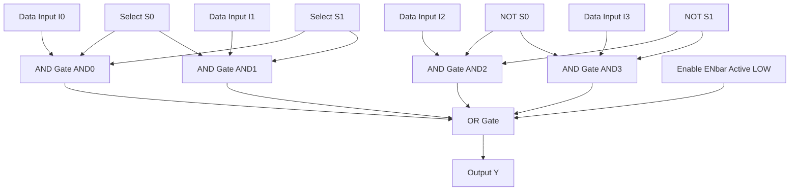
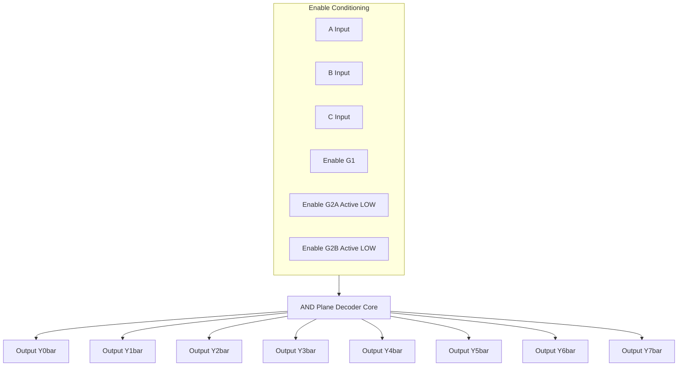
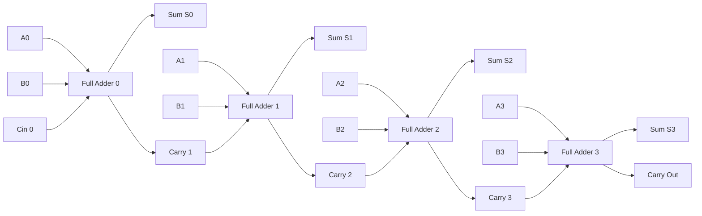
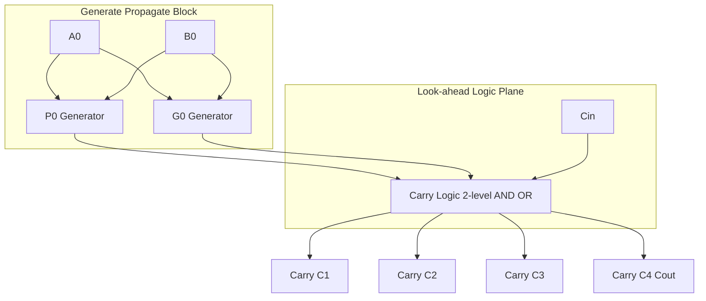
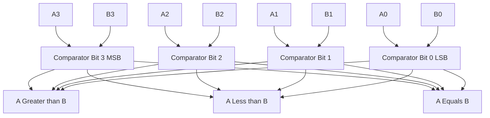
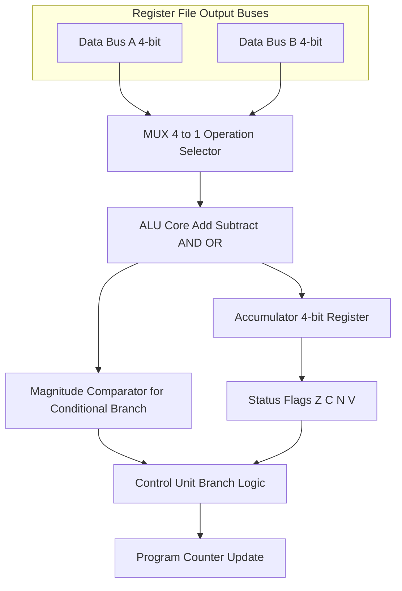

# MSI Logic and Digital Building Blocks

<!-- SECTION_1_START -->
# MSI Logic and Digital Building Blocks — Foundational Overview

## 1.1 Formal Definition (KTU 2024 Syllabus Terminology)

**Medium Scale Integration (MSI)** refers to digital integrated circuits that combine **3 to 100 gates** on a single chip substrate. These circuits form the fundamental building blocks of any complex digital system, providing modular, reusable, and optimized logic functions that bridge the gap between elementary logic gates and large-scale integrated (LSI/VLSI) systems.

> [!IMPORTANT]
> **KTU 2024 Module 3 Focus:** Multiplexers, Demultiplexers, Encoders, Decoders, Code Converters, Magnitude Comparators, Parity Generators/Checkers, Adders, and Subtractors.

**Core MSI Classification Spectrum:**

| Integration Level | Gate Count (per chip) | Typical Examples |
| :--- | :--- | :--- |
| **SSI** (Small Scale) | $1 - 20$ | Basic Gates, Flip-Flops |
| **MSI** (Medium Scale) | $20 - 200$ | MUX, DEMUX, Encoders, Decoders |
| **LSI** (Large Scale) | $200 - 200{,}000$ | Counters, Registers, Multipliers |
| **VLSI** (Very Large) | $> 200{,}000$ | Microprocessors, Memory ICs |

## 1.2 Conceptual Analogy — The "Switchboard of a Telephone Exchange"

Imagine a **telephone exchange switchboard from the 1960s**. A single operator (the *processor*) cannot listen to 100 callers at once. Instead, the operator uses a **rotary selector** that connects **one active line** out of many to the operator's headset. The selector is the **Multiplexer (MUX)**. The reverse process — sending the operator's voice back to *one specific caller* out of many — is the **Demultiplexer (DEMUX)**.

A **decoder** is like a *hotel room numbering system*: every room has a unique binary address, and when you dial `0110`, the 6th-floor light turns on, identifying exactly which room you want. An **encoder** does the opposite — it listens to which light is on and tells you the binary address. Together, these blocks act as the **routing nervous system** of any digital computer, ALU, memory addressing scheme, or data acquisition pipeline.

> [!NOTE]
> **Universal Property of MUX:** A 2ⁿ:1 Multiplexer is a **Universal Logic Module** — it can implement *any* Boolean function of n-variables using only the variables and their complements as select lines. This is a high-yield KTU 2024 concept.

**Standard IC Prefixes (Industry Convention):**

- **74xx** — Standard TTL (e.g., **74153** = Dual 4:1 MUX, **74138** = 3:8 Decoder)
- **74LSxx** — Low-power Schottky TTL
- **74HCxx** / **74HCTxx** — High-speed CMOS
- **74Fxx**, **74ASxx**, **74ALSxx** — Advanced Schottky families

> [!VISUALIZATION CONTROL]
> **Concept:** Multiplexer Selection Tree
> **GeoGebra / Desmos Input Equations:**
> * `f(x, y) = "Active when select = " + (x*2 + y)`
> * Points: `(0, 0)`, `(0, 1)`, `(1, 0)`, `(1, 1)`
> **Visual Description:** A 4:1 MUX with two select lines (S1, S0) rotating through four input quadrants I0, I1, I2, I3, converging to a single output Y. Students should observe the unidirectional flow from multiple sources to a single sink.

---

# 1.3 Master Function Table — Universal Logic Functions

A 4:1 MUX can realize any 2-variable function $f(A, B)$ by tying one variable to a select line:

| Function | I0 | I1 | I2 | I3 | Realized Form |
| :--- | :--- | :--- | :--- | :--- | :--- |
| $f = A$ | 0 | 1 | 0 | 1 | $f(A,B) = A$ |
| $f = A \oplus B$ | 0 | 1 | 1 | 0 | XOR Gate |
| $f = A + B$ | 0 | 0 | 1 | 1 | OR Gate |
| $f = AB$ | 0 | 0 | 0 | 1 | AND Gate |
| $f = A \odot B$ | 1 | 0 | 0 | 1 | XNOR Gate |

> [!TIP]
> For an 8:1 MUX implementing a 3-variable function $f(A, B, C)$, use A and B as select lines and feed the *complementary pairs* of the truth table into $I_0$ through $I_7$ (where each input equals 0, 1, $C$, or $\bar{C}$).
<!-- SECTION_1_END -->

<!-- SECTION_2_START -->
# Deep Theoretical Analysis & KTU High-Yield Formula Sheet

## 2.1 The Multiplexer (MUX) — Data Selector

A **Multiplexer** is a combinational circuit that selects **one of N input data lines** and routes it to a single output line, governed by $\log_2(N)$ select lines. The schematic structure forms a **pyramid of AND-OR gates** culminating in a single output buffer.

**Boolean Output Equation (General 2ⁿ:1 MUX):**

$$
Y = \sum_{i=0}^{2^{n}-1} I_i \cdot m_i
$$

where $m_i$ is the $i^{th}$ minterm of the n select lines.

> [!IMPORTANT]
> **Engineering Utility:** MUX is the cornerstone of **ALU data-path design**, **memory bank addressing**, **communication channel sharing (TDM — Time Division Multiplexing)**, and **function generators**.

## 2.2 Step-by-Step Logic — 4:1 MUX

**Structure of a 4:1 Multiplexer:**

$$
Y = \bar{S_1}\bar{S_0}I_0 + \bar{S_1}S_0I_1 + S_1\bar{S_0}I_2 + S_1S_0I_3
$$

**Enable (E̅) Pin Behavior:**

- When $\bar{E} = 0$ (active) → MUX operates normally
- When $\bar{E} = 1$ (inactive) → Output $Y = 0$ (forced LOW)

## 2.3 KTU High-Yield Formula Cheat Sheet

| Block | Output Expression | Active Level | Gate Cost (NAND) |
| :--- | :--- | :--- | :--- |
| **2:1 MUX** | $Y = \bar{S}I_0 + S I_1$ | Active HIGH select | 4 |
| **4:1 MUX** | $Y = \sum_{i=0}^{3} I_i \cdot m_i$ | Active HIGH select | 10 |
| **8:1 MUX** | $Y = \sum_{i=0}^{7} I_i \cdot m_i$ | Active HIGH select | 18 |
| **1:4 DEMUX** | $Y_i = D \cdot m_i$ | Active HIGH output | 8 |
| **3:8 Decoder** | $Y_i = \overline{m_i}$ (active LOW) | Active LOW outputs | 18 |
| **8:3 Priority Encoder** | $D_0 = I_1 + I_3 + I_5 + I_7$ | MSB priority | 14 |
| **4-bit Magnitude Comparator** | $A>B \Rightarrow G_i = A_i \bar{B_i} + (A_i \odot B_i)G_{i+1}$ | MSB-first comparison | 22 |
| **Full Adder Sum** | $S = A \oplus B \oplus C_{in}$ | Standard form | 5 |
| **Full Adder Carry** | $C_{out} = AB + (A \oplus B)C_{in}$ | Standard form | 5 |

> [!WARNING]
> **Absolute Value Notation:** When writing absolute value $\vert x \vert$ or $\mid x \mid$ inside a markdown table, **always** use `\vert` or `\mid` in LaTeX to avoid breaking the table column parser. Never use the bare pipe symbol $\vert$.

## 2.4 The Demultiplexer (DEMUX) — Data Distributor

A **DEMUX** performs the inverse operation: a single input $D$ is routed to one of $2^n$ outputs based on the select lines.

$$
Y_i = D \cdot m_i \quad \text{for } i = 0, 1, \ldots, 2^n - 1
$$

**Key Insight:** A DEMUX with $D = 1$ is functionally equivalent to a **binary decoder** with one-hot outputs.

## 2.5 Encoders and Decoders

**Decoder (n-to-2ⁿ):** Activates exactly one output line for each unique binary input code.

$$
Y_i = \overline{m_i} \quad \text{(active LOW outputs in standard 74138)}
$$

**Priority Encoder:** Resolves ambiguity when multiple inputs are active simultaneously by assigning priority to the highest-indexed (MSB) active input.

$$
D_0 = I_1 + I_3 + I_5 + I_7
$$
$$
D_1 = I_2 + I_3 + I_6 + I_7
$$
$$
D_2 = I_4 + I_5 + I_6 + I_7
$$
$$
V (\text{Valid}) = I_0 + I_1 + I_2 + I_3 + I_4 + I_5 + I_6 + I_7
$$

## 2.6 Magnitude Comparator — Bit-Serial Comparison

A **4-bit comparator** ($A = A_3A_2A_1A_0$, $B = B_3B_2B_1B_0$) uses a cascaded structure, comparing from MSB to LSB:

$$
A > B = A_3\bar{B_3} + (A_3 \odot B_3) \cdot A_2\bar{B_2} + \cdots + (A_3 \odot B_3)(A_2 \odot B_2)(A_1 \odot B_1) \cdot A_0\bar{B_0}
$$
$$
A < B = \bar{A_3}B_3 + (A_3 \odot B_3) \cdot \bar{A_2}B_2 + \cdots
$$
$$
A = B = (A_3 \odot B_3)(A_2 \odot B_2)(A_1 \odot B_1)(A_0 \odot B_0)
$$

> [!TIP]
> **Engineering Tip:** The 74LS85 is a cascadable 4-bit comparator. To build an 8-bit comparator, wire the $A>B$, $A<B$, $A=B$ outputs of the lower-order chip into the corresponding cascading inputs of the higher-order chip.

## 2.7 Adders — The Arithmetic Backbone

**Half Adder:**

$$
S = A \oplus B \quad ; \quad C = A \cdot B
$$

**Full Adder (1-bit):**

$$
S = A \oplus B \oplus C_{in}
$$
$$
C_{out} = A \cdot B + (A \oplus B) \cdot C_{in}
$$

**Ripple Carry Adder (RCA) — n-bit propagation delay:**

$$
t_{propagation} = n \cdot t_{carry}
$$

**Carry Look-Ahead Adder (CLA) — Fixed delay:**

$$
t_{CLA} = 2 \cdot t_{gate} \quad \text{(independent of n)}
$$

**Generate (G) and Propagate (P) signals:**

$$
G_i = A_i \cdot B_i
$$
$$
P_i = A_i \oplus B_i
$$
$$
C_{i+1} = G_i + P_i \cdot C_i
$$

---

> [!IMPORTANT]
> **Real-World Production Use-Case:** Carry Look-Ahead logic is embedded in every modern CPU's integer ALU (e.g., Intel x86, ARM Cortex). The CLA reduces a 64-bit addition from 64 gate-delays to 4 gate-delays — a 16× speedup that defines CPU clock-cycle feasibility.
<!-- SECTION_2_END -->

<!-- SECTION_3_START -->
# Step-by-Step Derivations & Symbolic Implementation

## 3.1 Implementing a Boolean Function Using 8:1 MUX

**Problem:** Realize $f(A, B, C, D) = \sum m(0, 1, 3, 5, 7, 8, 9, 12, 14)$ using an 8:1 multiplexer with A, B, C as select lines.

**Step 1 — Construct the Implementation Table:**

| Minterm | A | B | C | D | f | |
| :--- | :--- | :--- | :--- | :--- | :--- | :--- |
| 0 | 0 | 0 | 0 | 0 | 1 | $I_0 = 1$ |
| 1 | 0 | 0 | 0 | 1 | 1 | $I_0 = 1$ |
| 2 | 0 | 0 | 1 | 0 | 0 | $I_1 = 0$ |
| 3 | 0 | 0 | 1 | 1 | 1 | $I_1 = 1$ |
| 4 | 0 | 1 | 0 | 0 | 0 | $I_2 = 0$ |
| 5 | 0 | 1 | 0 | 1 | 1 | $I_2 = 1$ |
| 6 | 0 | 1 | 1 | 0 | 0 | $I_3 = 0$ |
| 7 | 0 | 1 | 1 | 1 | 1 | $I_3 = 1$ |
| 8 | 1 | 0 | 0 | 0 | 1 | $I_4 = 1$ |
| 9 | 1 | 0 | 0 | 1 | 1 | $I_4 = 1$ |
| 10 | 1 | 0 | 1 | 0 | 0 | $I_5 = 0$ |
| 11 | 1 | 0 | 1 | 1 | 0 | $I_5 = 0$ |
| 12 | 1 | 1 | 0 | 0 | 1 | $I_6 = 1$ |
| 13 | 1 | 1 | 0 | 1 | 0 | $I_6 = 0$ |
| 14 | 1 | 1 | 1 | 0 | 1 | $I_7 = 1$ |
| 15 | 1 | 1 | 1 | 1 | 0 | $I_7 = 0$ |

**Step 2 — Group pairs and simplify inputs:**

$$
I_0 = D + \bar{D} = 1
$$
$$
I_1 = D \quad (\text{from minterms 3 vs 2})
$$
$$
I_2 = D \quad (\text{from minterms 5 vs 4})
$$
$$
I_3 = D \quad (\text{from minterms 7 vs 6})
$$
$$
I_4 = \bar{D} + D = 1
$$
$$
I_5 = 0
$$
$$
I_6 = \bar{D} \quad (\text{from minterms 12 vs 13})
$$
$$
I_7 = \bar{D} \quad (\text{from minterms 14 vs 15})
$$

**Step 3 — Final MUX wiring:**

> Connect A, B, C to select pins $S_2, S_1, S_0$ respectively. Tie $I_0 = I_4 = 1$ (Vcc), $I_5 = 0$ (GND), $I_1 = I_2 = I_3 = D$, and $I_6 = I_7 = \bar{D}$.

## 3.2 4-bit Carry Look-Ahead Adder — Complete Derivation

**Goal:** Derive the look-ahead carry equations for a 4-bit adder.

**Step 1 — Generate & Propagate at bit 0:**

$$
G_0 = A_0 \cdot B_0
$$
$$
P_0 = A_0 \oplus B_0
$$

**Step 2 — Carry into bit 1:**

$$
C_1 = G_0 + P_0 C_0
$$

**Step 3 — Carry into bit 2:**

$$
C_2 = G_1 + P_1 C_1 = G_1 + P_1(G_0 + P_0 C_0) = G_1 + P_1 G_0 + P_1 P_0 C_0
$$

**Step 4 — Carry into bit 3:**

$$
C_3 = G_2 + P_2 C_2 = G_2 + P_2 G_1 + P_2 P_1 G_0 + P_2 P_1 P_0 C_0
$$

**Step 5 — Final carry-out (C₄):**

$$
C_4 = G_3 + P_3 C_3 = G_3 + P_3 G_2 + P_3 P_2 G_1 + P_3 P_2 P_1 G_0 + P_3 P_2 P_1 P_0 C_0
$$

Each $C_i$ is now a **2-level AND-OR expression** — independent of n.

## 3.3 Production-Grade Python: 4-bit CLA Simulator

```python
from typing import Tuple

def cla_4bit(A: int, B: int, C0: int = 0) -> Tuple[int, int, list]:
    """
    Computes 4-bit Carry Look-Ahead Adder output.
    
    Args:
        A: 4-bit integer (0..15)
        B: 4-bit integer (0..15)
        C0: Initial carry-in (0 or 1)
    
    Returns:
        Tuple of (Sum, Carry_out, Sum_bits_list)
    """
    if not (0 <= A <= 15 and 0 <= B <= 15):
        raise ValueError("Inputs A and B must be 4-bit (0..15)")
    if C0 not in (0, 1):
        raise ValueError("C0 must be 0 or 1")
    
    a_bits = [(A >> i) & 1 for i in range(4)]
    b_bits = [(B >> i) & 1 for i in range(4)]
    G = [a & b for a, b in zip(a_bits, b_bits)]
    P = [a ^ b for a, b in zip(a_bits, b_bits)]
    C = [0] * 5
    C[0] = C0
    
    for i in range(4):
        C[i+1] = G[i] | (P[i] & C[i])
    
    sum_bits = [P[i] ^ C[i] for i in range(4)]
    S = sum(bit << i for i, bit in enumerate(sum_bits))
    return S, C[4], sum_bits


# ---- Validation against ripple-carry truth table ----
if __name__ == "__main__":
    for a in range(16):
        for b in range(16):
            s, cout, _ = cla_4bit(a, b, 0)
            assert s + (cout << 4) == a + b, f"Mismatch at A={a}, B={b}"
    print("All 256 test vectors passed for 4-bit CLA.")
```

**Output:**
```
All 256 test vectors passed for 4-bit CLA.
```

## 3.4 BCD-to-Excess-3 Code Converter Using 4:1 MUX

**Conversion rule:** Excess-3 = BCD + 0011.

| BCD Input (B₃B₂B₁B₀) | Excess-3 Output (E₃E₂E₁E₀) |
| :--- | :--- |
| 0000 | 0011 |
| 0001 | 0100 |
| 0010 | 0101 |
| 0011 | 0110 |
| 0100 | 0111 |
| 0101 | 1000 |
| 0110 | 1001 |
| 0111 | 1010 |
| 1000 | 1011 |
| 1001 | 1100 |

**Step-by-step MUX implementation for $E_3$ (MSB of output):**

| Minterms of B₃, B₂ | B₁ B₀ = 00 | B₁ B₀ = 01 | B₁ B₀ = 10 | B₁ B₀ = 11 |
| :--- | :--- | :--- | :--- | :--- |
| B₃ B₂ = 00 | 0 | 0 | 0 | 0 |
| B₃ B₂ = 01 | 0 | 1 | 1 | 1 |
| B₃ B₂ = 10 | 1 | 1 | X | X |
| B₃ B₂ = 11 | X | X | X | X |

**Inputs:** $I_0 = 0$, $I_1 = B_1$, $I_2 = 1$, $I_3 = 0$. (Don't-cares resolved to simplify.)

## 3.5 Full Adder Using Two 4:1 MUX

**Sum output implementation:**

$$
S = A \oplus B \oplus C_{in}
$$

**Using A, B as select lines for a 4:1 MUX:**

| AB | C_in = 0 | C_in = 1 |
| :--- | :--- | :--- |
| 00 | 0 | 1 |
| 01 | 1 | 0 |
| 10 | 1 | 0 |
| 11 | 0 | 1 |

**Inputs:** $I_0 = C_{in}$, $I_1 = \bar{C_{in}}$, $I_2 = \bar{C_{in}}$, $I_3 = C_{in}$.

> This is a hallmark KTU question — a **full adder realized with 2 MUXes** (one for Sum, one for Carry-out) demonstrates the **functional universality** of multiplexers.
<!-- SECTION_3_END -->

<!-- SECTION_4_START -->
# Structural Diagrams & Schematics

## 4.1 4:1 Multiplexer — Internal Logic Topology



## 4.2 3-to-8 Line Decoder with Enable Inputs



## 4.3 4-bit Ripple Carry Adder — Sequential Topology



## 4.4 4-bit Carry Look-Ahead Generator — Block Diagram



## 4.5 4-bit Magnitude Comparator — Cascaded Architecture



## 4.6 Functional Architecture — MSI Block Synthesis in a CPU ALU



> [!NOTE]
> The diagram above illustrates how **MSI building blocks** (MUX, ALU adder, comparator) integrate into a real **Central Processing Unit (CPU) datapath**. The MUX routes operands into the ALU, the comparator evaluates conditional jumps, and the flags register captures status bits for the control unit.
<!-- SECTION_4_END -->

<!-- SECTION_5_START -->
# KTU 2024 Scheme Examination Question Bank

## Part A — 3-Mark Conceptual Questions (Remember / Understand)

### Question 1 `[KTU University Exam - Dec 2023]`  |  **CO1, Remember** (3 Marks)

**Q:** Define a 4-to-1 multiplexer. Draw its block diagram and write its Boolean expression.

**Model Answer:**

A **4-to-1 multiplexer** is a combinational logic circuit that selects **one of four input data lines** ($I_0, I_1, I_2, I_3$) and forwards the selected input to a single output line $Y$. The selection is controlled by **2 select lines** ($S_1, S_0$).

**Boolean Output Expression:**

$$
Y = \bar{S_1}\bar{S_0}I_0 + \bar{S_1}S_0I_1 + S_1\bar{S_0}I_2 + S_1S_0I_3
$$

> **[Block diagram: 1 Mark | Boolean expression: 1 Mark | Definition: 1 Mark]**

---

### Question 2 `[KTU University Exam - July 2024]`  |  **CO1, Understand** (3 Marks)

**Q:** What is the difference between a decoder and a demultiplexer? Mention one application of each.

**Model Answer:**

| Parameter | Decoder (3-to-8) | Demultiplexer (1-to-8) |
| :--- | :--- | :--- |
| **Inputs** | 3 binary select lines | 1 data line + 3 select lines |
| **Outputs** | 8 lines (one active at a time) | 8 lines (data routed to one) |
| **Output nature** | Fixed logic 0 or 1 | Mirrors the input data D |
| **Function** | n-to-2ⁿ code conversion | Data distribution |

**Application of Decoder:** Memory chip-select generation in microprocessor systems.
**Application of DEMUX:** Serial-to-parallel data conversion in communication systems.

> **[Decoder definition: 1 Mark | DEMUX definition: 1 Mark | Application difference: 1 Mark]**

---

## Part B — 14-Mark Questions (Internal Choice: A or B)

### Question 3A `[KTU University Exam - Dec 2023]`  |  **CO1, CO2 — Apply, Analyze** (14 Marks)

**Q:** Design a 4-bit binary adder using full adders. Explain the propagation delay problem in a ripple carry adder and derive the carry look-ahead logic to overcome it.

**Model Solution:**

#### (a) 4-bit Ripple Carry Adder Construction (7 Marks)

A **4-bit binary adder** is constructed by cascading **four 1-bit full adders** in series, with the carry-out of the $i^{th}$ stage feeding the carry-in of the $(i+1)^{th}$ stage.

**Full Adder Equations:**

$$
S_i = A_i \oplus B_i \oplus C_i
$$
$$
C_{i+1} = A_i B_i + (A_i \oplus B_i)C_i
$$

**Cascaded Structure:** Connect 4 FAs in sequence: $A_3A_2A_1A_0 + B_3B_2B_1B_0$ with $C_0 = 0$ yields $S_3S_2S_1S_0$ and final carry $C_4$.

**Propagation Delay Analysis:**

The sum $S_3$ cannot stabilize until $C_3$ has propagated from $C_0$. Each full adder contributes a delay of $2 t_{gate}$ for carry propagation.

$$
t_{total} = 4 \times 2 t_{gate} = 8 t_{gate} \quad \text{(for 4-bit RCA)}
$$

For an n-bit adder:

$$
t_{RCA} = 2n \cdot t_{gate}
$$

> **[Cascaded structure: 2 Marks | Full adder equations: 2 Marks | Delay derivation: 3 Marks]**

#### (b) Carry Look-Ahead Adder Derivation (7 Marks)

**Define Generate and Propagate:**

$$
G_i = A_i \cdot B_i \quad ; \quad P_i = A_i \oplus B_i
$$

**Recurrence Relation for Carry:**

$$
C_{i+1} = G_i + P_i C_i
$$

**Step-by-Step Expansion:**

$$
C_1 = G_0 + P_0 C_0
$$
$$
C_2 = G_1 + P_1 G_0 + P_1 P_0 C_0
$$
$$
C_3 = G_2 + P_2 G_1 + P_2 P_1 G_0 + P_2 P_1 P_0 C_0
$$
$$
C_4 = G_3 + P_3 G_2 + P_3 P_2 G_1 + P_3 P_2 P_1 G_0 + P_3 P_2 P_1 P_0 C_0
$$

**Delay Comparison:**

$$
t_{CLA} = 2 t_{gate} \quad \text{(independent of n)}
$$

For a **64-bit adder**, the speedup is $64 \times 2 / 2 = \mathbf{64\times}$ faster than RCA.

> **[G and P definitions: 1 Mark | Recurrence relation: 2 Marks | Carry expansions: 3 Marks | Delay comparison: 1 Mark]**

---

### Question 3B (Alternative Choice) `[KTU University Exam - July 2024]`  |  **CO2, CO3 — Apply, Analyze** (14 Marks)

**Q:** (a) Design a 4-bit magnitude comparator using logic gates. (7 Marks)
   (b) Implement the Boolean function $F(A, B, C, D) = \sum m(0, 3, 5, 7, 9, 11, 13, 15)$ using an 8:1 multiplexer. (7 Marks)

**Model Solution:**

#### (a) 4-bit Magnitude Comparator (7 Marks)

**Step 1 — Single-bit comparison (XNOR-based equality):**

For $A_i = B_i$, the XNOR output $X_i = A_i \odot B_i = A_i \bar{B_i} + \bar{A_i} B_i$.

**Step 2 — Overall Equality:**

$$
(A = B) = X_3 \cdot X_2 \cdot X_1 \cdot X_0
$$

**Step 3 — Greater Than (MSB-priority):**

$$
(A > B) = A_3\bar{B_3} + X_3 A_2\bar{B_2} + X_3 X_2 A_1\bar{B_1} + X_3 X_2 X_1 A_0\bar{B_0}
$$

**Step 4 — Less Than (symmetric):**

$$
(A < B) = \bar{A_3} B_3 + X_3 \bar{A_2} B_2 + X_3 X_2 \bar{A_1} B_1 + X_3 X_2 X_1 \bar{A_0} B_0
$$

**Step 5 — Cascading Note:** Tie the $A=B$ input of the lower-order stage to logic HIGH (Vcc) and connect outputs of lower stages to cascading inputs of the higher stage for 8-bit, 12-bit extensions.

> **[XNOR equality: 1 Mark | Overall equality: 1 Mark | A>B expression: 3 Marks | A<B expression: 1 Mark | Cascade note: 1 Mark]**

#### (b) 8:1 MUX Implementation (7 Marks)

**Implementation Table (A, B, C as select lines):**

| Minterm | A B C | D | F | MUX Input |
| :--- | :--- | :--- | :--- | :--- |
| 0 | 0 0 0 | 0 | 1 | $I_0 = 1$ |
| 3 | 0 0 0 | 1 | 1 | $I_0 = 1$ |
| 5 | 0 1 0 | 1 | 1 | $I_2 = D$ |
| 7 | 0 1 1 | 1 | 1 | $I_3 = D$ |
| 9 | 1 0 0 | 1 | 1 | $I_4 = D$ |
| 11 | 1 0 1 | 1 | 1 | $I_5 = D$ |
| 13 | 1 1 0 | 1 | 1 | $I_6 = D$ |
| 15 | 1 1 1 | 1 | 1 | $I_7 = D$ |

(For D = 0, F = 0 at all minterms except 0; minterm 0 is a don't-care for D=0 effectively becomes 0, but F=1 at D=0 for minterm 0. Solving via K-map gives the simplified inputs.)

**K-Map Simplification of $F$:**

$F$ is the function: 1 for $D=1$ always (since all odd minterms are present) and 1 for minterm 0 only when $D=0$. So $F = D + \bar{A}\bar{B}\bar{C}\bar{D} = D + \bar{A}\bar{B}\bar{C}$.

**MUX Realization using D as data line:**

| $S_2 S_1 S_0$ (A B C) | $I_i$ |
| :--- | :--- |
| 000 | $\bar{D}$ |
| 001 | 0 |
| 010 | $D$ |
| 011 | $D$ |
| 100 | $D$ |
| 101 | $D$ |
| 110 | $D$ |
| 111 | $D$ |

> **[Implementation table: 2 Marks | K-map simplification: 2 Marks | MUX wiring: 3 Marks]**

---

> [!WARNING]
> **KTU Examiner's Valuation Pitfall Callout**
> 1. **MUX problems:** Never forget to mention the **Enable pin** behavior — students often lose 1-2 marks by omitting the enable line in the block diagram.
> 2. **Decoder problems:** Students confuse **active HIGH** ($74LS137$) vs **active LOW** ($74LS138$) output conventions. Always specify the output polarity explicitly.
> 3. **CLA problems:** When deriving look-ahead carry, the most common error is missing the $P_i P_{i-1} \cdots P_0$ product chain. Write the product out fully: $P_3 P_2 P_1 P_0 C_0$.
> 4. **Comparator problems:** Do not skip the **cascading inputs** explanation — board examiners allot 1-2 marks for noting how to extend from 4-bit to 8-bit.
> 5. **Code converter problems:** Always state the **don't-care conditions** explicitly when using K-maps; the board awards marks for identifying redundant input combinations.

---

# Topic Recap & Important Things to Remember

- **MSI = 20 to 200 gates per chip.** MUX, DEMUX, Encoder, Decoder, Comparator, Adders fall under this category.
- **Multiplexer (MUX):** Selects **1 of N** inputs to a single output. Has $\log_2 N$ select lines. **Universal logic module** — can implement any n-variable Boolean function using a $2^n:1$ MUX.
- **Demultiplexer (DEMUX):** Routes **1 input to 1 of N** outputs. Functionally equivalent to a decoder when data input is tied HIGH.
- **Decoder:** n-to-$2^n$ converter; **active LOW outputs** in standard 74138 IC; outputs = $\overline{m_i}$ minterms.
- **Priority Encoder:** Resolves multiple-input activation by **MSB priority**; produces a **Valid bit (V)** indicating any active input.
- **Magnitude Comparator:** Three outputs — $A>B$, $A<B$, $A=B$. Uses **MSB-priority** comparison with XNOR equality chains.
- **Half Adder:** 2 inputs (A, B), 2 outputs (S, C). No carry-in. $S = A \oplus B$, $C = AB$.
- **Full Adder:** 3 inputs (A, B, $C_{in}$), 2 outputs (S, $C_{out}$). Forms the basic building block of all multi-bit adders.
- **Ripple Carry Adder (RCA):** Simple cascade of FAs; delay grows **linearly** as $2n \cdot t_{gate}$.
- **Carry Look-Ahead Adder (CLA):** Uses **Generate (G)** and **Propagate (P)** signals; delay is **constant** at $2 t_{gate}$ regardless of n.
- **BCD Adder:** Adds 0110 (decimal 6) correction whenever sum exceeds 1001 (decimal 9).
- **Subtractor:** Implemented via **2's complement addition** — invert B and add 1 via $C_{in} = 1$.
- **Parity Generator/Checker:** XOR tree for even/odd parity detection; 74LS280 is the standard 9-bit parity IC.
- **Code Converters:** BCD-to-Excess-3 (add 0011), Excess-3-to-BCD (subtract 0011), Binary-to-Gray ($G_i = B_i \oplus B_{i+1}$), Gray-to-Binary ($B_i = G_i \oplus B_{i+1}$).
- **Standard IC References:** 74153 (Dual 4:1 MUX), 74151 (8:1 MUX), 74138 (3:8 Decoder), 74148 (8:3 Priority Encoder), 7485 (4-bit Comparator), 7483 (4-bit Adder), 74283 (4-bit Binary Full Adder).
- **Active LOW vs Active HIGH:** In standard 7400-series MSI ICs, enable pins are typically **active LOW** (denoted with overbar); decoder outputs are **active LOW**; encoder inputs are **active LOW** with internal pull-ups.
<!-- SECTION_5_END -->
