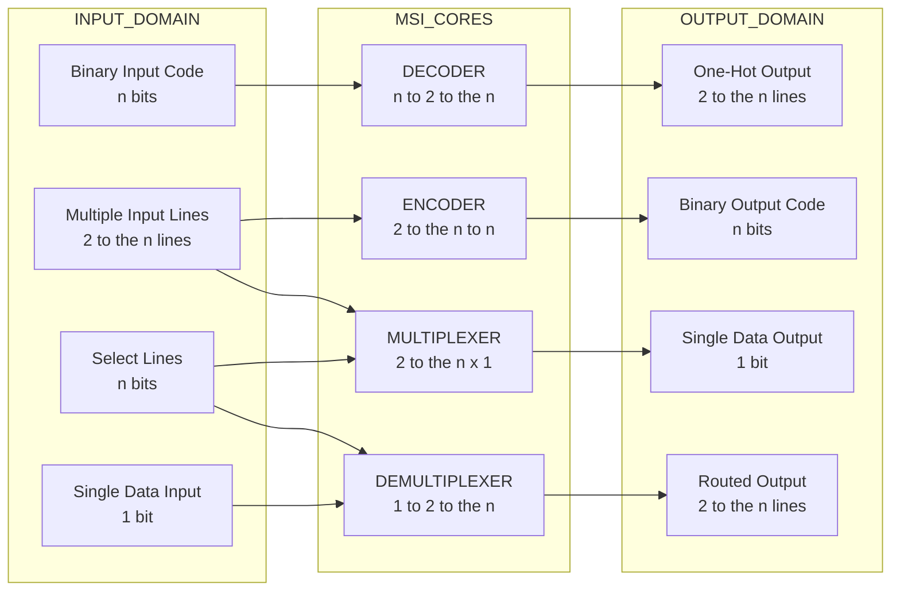
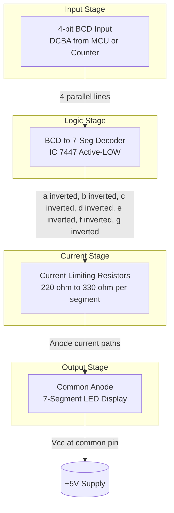
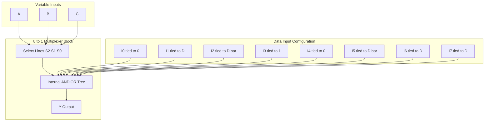
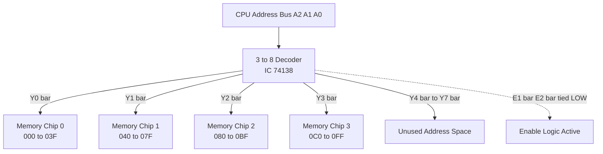

# MSI logic - Decoders (One-Hot decoder, 7 segment display decoder), Encoders, Multiplexers, Demultiplexers

<!-- SECTION_1_START -->
# MODULE 3: MSI LOGIC & DIGITAL BUILDING BLOCKS

## 1. Core Technical Definition & Intuitive Overview

### 1.1 What is MSI Logic?

> [!IMPORTANT]
> **KTU 2024 Syllabus Definition:**
> **Medium Scale Integration (MSI)** refers to digital integrated circuits containing between **10 and 100 gates** per chip (or roughly **10 to 1,000 transistors**). They are the fundamental "building blocks" used to construct complex digital systems like processors, memory units, ALUs, and display drivers.

The MSI devices covered in this module are classified under the broader family of **combinational logic circuits** — circuits whose outputs depend *purely on the present input combination* (no memory, no clock, no feedback). The four pillars of this module are:

| S.No | MSI Device | Function in Plain Words |
| :--- | :--- | :--- |
| 1 | **Decoder** | Activates **one** specific output line from a binary input code |
| 2 | **Encoder** | Generates a **binary code** when **one** of many inputs is activated |
| 3 | **Multiplexer (MUX)** | Routes **one of many** inputs to a **single** output line |
| 4 | **Demultiplexer (DEMUX)** | Routes a **single** input to **one of many** output lines |

---

### 1.2 Conceptual Analogies (The "Why" Behind Each Device)

#### 🔹 The Decoder — A Hotel Floor Switchboard
Imagine a **10-floor hotel**. The reception desk has a 4-bit binary keypad (0 to 9). When the receptionist presses `0110`, the elevator must go to the **6th floor** — and only the 6th floor bell rings. A **decoder** is exactly this: an $n$-bit binary input "unlocks" **one out of $2^n$ output lines**.

> [!NOTE]
> **One-Hot Decoder:** A "One-Hot" decoder is a decoder whose output representation is "one-hot encoded" — meaning exactly **one output line is HIGH (logic 1)** for every input code, and all others are LOW. This is the *de facto* standard for state machine encoding in modern digital design (FPGA, ASIC).

#### 🔹 The Encoder — The Reverse Hotel Call
Now imagine each floor has a **panic button** that, when pressed, sends a unique 4-bit code to reception identifying the floor. This is an **encoder** — the reverse of a decoder. A **8-to-3 encoder** compresses 8 input lines into a 3-bit binary code.

#### 🔹 The Multiplexer (MUX) — A TV Channel Selector
A TV has **one screen** but receives **50 channels**. The channel selector picks *one* channel at a time. A **MUX** is precisely this: it selects **one of $2^n$ data inputs** using $n$ *select lines*, and forwards that input to a single output.

> [!IMPORTANT]
> **MUX Pronunciation:** KTU examiners strictly accept either **"MUX"** or **"Multiplexer"**. The abbreviation is read as "mux" (rhymes with "ducks").

#### 🔹 The Demultiplexer (DEMUX) — A Postal Mail Sorter
A single mail bag arrives at a sorting office. The sorter reads the **address code (select lines)** and drops the letter into **one of $2^n$ delivery boxes**. A **DEMUX** takes a single data input and routes it to **one of $2^n$ outputs**, based on select lines.

---

### 1.3 Standard Metrics and Terminology

> [!IMPORTANT]
> **Canonical Input/Output Counts (Memorize These):**
> - For an $n$-to-$2^n$ device: $n$ = number of select/input lines, $2^n$ = number of data/output lines.
> - **Decoder:** $n$ inputs $\rightarrow$ $2^n$ outputs (one-hot).
> - **Encoder:** $2^n$ inputs $\rightarrow$ $n$ outputs (binary).
> - **MUX:** $2^n$ data inputs + $n$ select lines $\rightarrow$ **1** output.
> - **DEMUX:** 1 data input + $n$ select lines $\rightarrow$ $2^n$ outputs.
> - **Fan-out** of a standard TTL gate = **10** (KTU standard value).

---

### 1.4 The 7-Segment Display Decoder — A Special Case

The **BCD-to-7-Segment Decoder** is the most industrially significant decoder. It converts a **4-bit BCD (Binary Coded Decimal)** input into the 7 control signals ($a$ through $g$) that light up the correct segments of a numerical display.

> [!VISUALIZATION CONTROL]
> **Concept:** Standard 7-Segment Display Layout
> **Visual Description (Text-Based Segment Map):**
> ```
>        --- a ---
>       |         |
>       f         b
>       |         |
>        --- g ---
>       |         |
>       e         c
>       |         |
>        --- d ---
> ```
> Segments are labeled `a` (top), `b` (top-right), `c` (bottom-right), `d` (bottom), `e` (bottom-left), `f` (top-left), `g` (middle).

The two dominant industrial ICs are:
- **7447** — **Active-LOW** outputs (used with **common-anode** displays).
- **7448** — **Active-HIGH** outputs (used with **common-cathode** displays).

<!-- SECTION_1_END -->

<!-- SECTION_2_START -->
## 2. Deep Theoretical Analysis & KTU High-Yield Formula Sheet

### 2.1 The Decoder — Detailed Working

A **binary decoder** is a combinational circuit that converts $n$ binary input lines into $2^n$ unique output lines. For every possible input combination, exactly one output is asserted (HIGH or LOW, depending on whether the decoder is *active-HIGH* or *active-LOW*).

#### 2.1.1 General Boolean Form of a Decoder

For an $n$-line input $I_{n-1}, I_{n-2}, \ldots, I_0$, each output $D_k$ (where $k = 0, 1, \ldots, 2^n - 1$) corresponds to the **minterm** $m_k$ of the inputs:

$$D_k = m_k(I_{n-1}, I_{n-2}, \ldots, I_0)$$

For a **3-to-8 decoder** (one of the most asked questions in KTU):

| Input (ABC) | Active-HIGH Output |
| :---: | :---: |
| 000 | $D_0 = \overline{A}\,\overline{B}\,\overline{C}$ |
| 001 | $D_1 = \overline{A}\,\overline{B}\,C$ |
| 010 | $D_2 = \overline{A}\,B\,\overline{C}$ |
| 011 | $D_3 = \overline{A}\,B\,C$ |
| 100 | $D_4 = A\,\overline{B}\,\overline{C}$ |
| 101 | $D_5 = A\,\overline{B}\,C$ |
| 110 | $D_6 = A\,B\,\overline{C}$ |
| 111 | $D_7 = A\,B\,C$ |

For **active-LOW** outputs (common in KCU/TTL ICs like 74138), the output is the **complement** of the minterm:

$$\overline{D_k} = \overline{m_k(I_{n-1}, \ldots, I_0)}$$

> [!NOTE]
> **Enable Input ($\overline{E}$):** Industrial decoders have an **Enable** pin (active-LOW for the 74138). When $\overline{E} = 1$, all outputs are forced HIGH (disabled). This is critical for **cascading decoders** to build larger fan-out (e.g., 4-to-16 using two 3-to-8 decoders).

---

### 2.2 The Encoder — Detailed Working

A **binary encoder** performs the inverse operation. The **8-to-3 priority encoder** (IC 74148) is the KTU industry standard.

#### 2.2.1 8-to-3 Encoder Boolean Equations (Non-Priority, No D0)

For a basic 8-to-3 encoder (where $D_7$ is highest priority):

$$
\begin{aligned}
A &= D_4 + D_5 + D_6 + D_7 \\
B &= D_2 + D_3 + D_6 + D_7 \\
C &= D_1 + D_3 + D_5 + D_7
\end{aligned}
$$

> [!IMPORTANT]
> **Priority Encoder:** When **two or more inputs are simultaneously HIGH**, a standard encoder produces an *ambiguous* output. A **priority encoder** (like the 74148) resolves this by assigning a fixed priority order — usually the **highest subscripted input wins** (e.g., $D_7$ overrides all others). The 74148 also provides a **Group Select (GS)** and **Enable Output (EO)** signal for cascading.

---

### 2.3 The Multiplexer (MUX) — Detailed Working

A MUX is essentially a **digitally-controlled switch**. Its output $Y$ is:

$$Y = \sum_{k=0}^{2^n - 1} I_k \cdot m_k(S_{n-1}, \ldots, S_0)$$

In words: the output equals the input $I_k$ whose **select-line minterm** is currently active.

#### 2.3.1 4-to-1 MUX Equation

For inputs $I_0, I_1, I_2, I_3$ and select lines $S_1, S_0$:

$$Y = \overline{S_1}\,\overline{S_0}\,I_0 + \overline{S_1}\,S_0\,I_1 + S_1\,\overline{S_0}\,I_2 + S_1\,S_0\,I_3$$

#### 2.3.2 Implementing Boolean Functions with MUX (KTU Favorite Question)

A **2^n-to-1 MUX** can implement **any** $n$-variable Boolean function without any additional gates! The procedure is:
1. Build the truth table of the function.
2. For each row, identify the value of the function $F$ (0 or 1).
3. Connect $F$ as the data input $I_k$ for the minterm $m_k$.

For an **$(n+1)$-variable** function, use a MUX with $2^n$ data inputs and the **first $n$ variables as select lines**. Then for each data input $I_k$, connect either $0$, $1$, $V_n$ (the remaining variable), or $\overline{V_n}$ depending on the truth table pair.

---

### 2.4 The Demultiplexer (DEMUX) — Detailed Working

A DEMUX is a decoder with a single data input. The output equations mirror the decoder, but each is **ANDed with the data input $D$**:

$$Y_k = D \cdot m_k(S_{n-1}, \ldots, S_0)$$

When $D = 0$, all outputs are 0. When $D = 1$, exactly one output (the addressed one) becomes 1.

> [!NOTE]
> **A Decoder IS a DEMUX** (with $D = 1$ permanently tied HIGH). This is a frequently-asked KTU conceptual question.

---

### 2.5 KTU Formula Sheet & Cheat Sheet

| Device | Inputs | Outputs | Select Lines | Boolean Form | Canonical KTU Example |
| :--- | :---: | :---: | :---: | :---: | :--- |
| 2-to-4 Decoder | 2 | 4 | 0 | $D_k = m_k(A,B)$ | 74139 (dual) |
| 3-to-8 Decoder | 3 | 8 | 0 | $D_k = m_k(A,B,C)$ | **74138** (active-LOW, with $\overline{E}$) |
| 4-to-16 Decoder | 4 | 16 | 0 | $D_k = m_k(A,B,C,D)$ | 74154 (active-LOW) |
| 8-to-3 Encoder | 8 | 3 | 0 | $A = D_4+D_5+D_6+D_7$, etc. | 74148 (priority) |
| 4-to-1 MUX | 4 data | 1 | 2 | $Y = \sum I_k m_k(S_1,S_0)$ | 74153 (dual) |
| 8-to-1 MUX | 8 data | 1 | 3 | $Y = \sum I_k m_k(S_2,S_1,S_0)$ | 74151 |
| 1-to-4 DEMUX | 1 data | 4 | 2 | $Y_k = D \cdot m_k(S_1,S_0)$ | 74139 (dual) |
| 1-to-8 DEMUX | 1 data | 8 | 3 | $Y_k = D \cdot m_k(S_2,S_1,S_0)$ | 74138 |
| BCD-to-7-Seg | 4 (BCD) | 7 (a-g) | 0 | K-map simplification | **7447** (active-LOW) / 7448 |

### 2.6 Real-World Engineering Applications

> [!IMPORTANT]
> **Where these are used in production:**
> - **Decoders:** Memory chip-select logic, instruction decoding in CPUs, address decoding, BCD-to-7-segment display drivers, port enabling in microcontrollers.
> - **Encoders:** Keyboard scanners, interrupt request (IRQ) controllers, priority encoders in microprocessors, rotary encoder position feedback in robotics.
> - **MUX/DEMUX:** Time-Division Multiplexing (TDM) in telecom, data routing in networking switches, register file read ports in CPUs, analog signal switching (using CMOS transmission gates), waveform generation, function implementation.

<!-- SECTION_2_END -->

<!-- SECTION_3_START -->
## 3. Step-by-Step Derivations & Code/Symbolic Implementation

### 3.1 Full Derivation: 3-to-8 Line Decoder (Active-HIGH)

**Step 1: Define inputs and outputs.**
Let inputs be $A, B, C$ (where $A$ is MSB). Outputs are $D_0$ to $D_7$.

**Step 2: Construct the truth table.**

| $A$ | $B$ | $C$ | Decimal | Active Output |
| :---: | :---: | :---: | :---: | :---: |
| 0 | 0 | 0 | 0 | $D_0$ |
| 0 | 0 | 1 | 1 | $D_1$ |
| 0 | 1 | 0 | 2 | $D_2$ |
| 0 | 1 | 1 | 3 | $D_3$ |
| 1 | 0 | 0 | 4 | $D_4$ |
| 1 | 0 | 1 | 5 | $D_5$ |
| 1 | 1 | 0 | 6 | $D_6$ |
| 1 | 1 | 1 | 7 | $D_7$ |

**Step 3: Express each output as a minterm.**

$$
\begin{aligned}
D_0 &= \overline{A}\,\overline{B}\,\overline{C} \\
D_1 &= \overline{A}\,\overline{B}\,C \\
D_2 &= \overline{A}\,B\,\overline{C} \\
D_3 &= \overline{A}\,B\,C \\
D_4 &= A\,\overline{B}\,\overline{C} \\
D_5 &= A\,\overline{B}\,C \\
D_6 &= A\,B\,\overline{C} \\
D_7 &= A\,B\,C
\end{aligned}
$$

**Step 4: Hardware realization.** Each output requires one **3-input AND gate**. The inverted inputs ($\overline{A}, \overline{B}, \overline{C}$) are generated using **3 NOT gates**. Total gates = $3 + 8 = 11$ gates.

---

### 3.2 Full Derivation: BCD-to-7-Segment Decoder (7447 logic, K-map approach)

The 7447 is an **active-LOW, common-anode** decoder. For inputs 1010 to 1111 (10–15), outputs are "don't care" — the display is blanked.

**Goal:** Derive the expression for segment $\overline{a}$ (active-LOW).

**Step 1: Build the truth table for segment $a$.** Segment $a$ is OFF for digits: 0, 4, 5, 6, 8, 9 (it is lit for 1, 2, 3, 7). For active-LOW, $\overline{a} = 0$ means segment is ON.

| Digit | D | C | B | A | a (display) | $\overline{a}$ (output) |
| :---: | :---: | :---: | :---: | :---: | :---: | :---: |
| 0 | 0 | 0 | 0 | 0 | OFF | 1 |
| 1 | 0 | 0 | 0 | 1 | ON | 0 |
| 2 | 0 | 0 | 1 | 0 | ON | 0 |
| 3 | 0 | 0 | 1 | 1 | ON | 0 |
| 4 | 0 | 1 | 0 | 0 | OFF | 1 |
| 5 | 0 | 1 | 0 | 1 | OFF | 1 |
| 6 | 0 | 1 | 1 | 0 | OFF | 1 |
| 7 | 0 | 1 | 1 | 1 | ON | 0 |
| 8 | 1 | 0 | 0 | 0 | OFF | 1 |
| 9 | 1 | 0 | 0 | 1 | OFF | 1 |
| 10–15 | 1 | 0 | 1 | 0 ... | X | X (don't care) |

**Step 2: K-map simplification for $\overline{a}$.**

K-map (rows = D,C; columns = B,A):

| DC\BA | 00 | 01 | 11 | 10 |
| :---: | :---: | :---: | :---: | :---: |
| **00** | 1 | 0 | 0 | 0 |
| **01** | 1 | 1 | 0 | 1 |
| **11** | X | X | X | X |
| **10** | 1 | 1 | X | X |

**Step 3: Identify prime implicants.**
- $\overline{a} = \overline{D} + A \cdot \overline{C} + \overline{B} \cdot \overline{C}$ (simplified POS form, with don't cares used optimally).

> [!NOTE]
> **You are NOT expected to memorize all 7 segment equations in KTU exams.** The examiner will either provide the truth table and ask for *one* segment, or provide the segment map and ask for the Boolean form of a specific segment. **Memorize segment $a$** (most frequently tested).

---

### 3.3 Function Implementation Using an 8-to-1 MUX

**Problem:** Implement $F(A,B,C,D) = \sum m(1, 3, 4, 6, 9, 11, 12, 14)$ using an 8-to-1 MUX with $A, B, C$ as select lines and $D$ as the data-input variable.

**Step 1: Group minterms by select lines $(A,B,C)$ and observe the pattern of $D$:**

| $A$ | $B$ | $C$ | Minterm in $D=0$ | Minterm in $D=1$ | $F$ at $D=0$ | $F$ at $D=1$ | Data Input $I_k$ |
| :---: | :---: | :---: | :---: | :---: | :---: | :---: | :---: |
| 0 | 0 | 0 | $m_0$ | $m_1$ | 0 | 1 | $I_0 = D$ |
| 0 | 0 | 1 | $m_2$ | $m_3$ | 0 | 1 | $I_1 = D$ |
| 0 | 1 | 0 | $m_4$ | $m_5$ | 1 | 0 | $I_2 = \overline{D}$ |
| 0 | 1 | 1 | $m_6$ | $m_7$ | 1 | 0 | $I_3 = \overline{D}$ |
| 1 | 0 | 0 | $m_8$ | $m_9$ | 0 | 1 | $I_4 = D$ |
| 1 | 0 | 1 | $m_{10}$ | $m_{11}$ | 0 | 1 | $I_5 = D$ |
| 1 | 1 | 0 | $m_{12}$ | $m_{13}$ | 1 | 0 | $I_6 = \overline{D}$ |
| 1 | 1 | 1 | $m_{14}$ | $m_{15}$ | 0 | 0 | $I_7 = 0$ |

**Step 2: Connect data inputs accordingly.** No external gates required! Only the data lines are tied to $D$, $\overline{D}$, or $0$.

---

### 3.4 Python Simulation — Universal MSI Logic Simulator

```python
from typing import List, Dict, Callable

class MSILogicSimulator:
    """
    Universal simulator for MSI combinational building blocks.
    Strictly typed, with explicit boundary checks and structured error logging.
    """

    @staticmethod
    def decoder(bits: List[int], active_high: bool = True) -> Dict[str, int]:
        """
        n-to-2^n binary decoder. Returns a dict of outputs D0..D(2^n-1).
        :param bits: list of input bits [MSB, ..., LSB].
        :param active_high: True for active-HIGH outputs, False for active-LOW.
        :raises ValueError: if bits are not 0/1 or list is empty.
        """
        if not bits:
            raise ValueError("[ERROR] Input bit list cannot be empty.")
        for b in bits:
            if b not in (0, 1):
                raise ValueError(f"[ERROR] Invalid bit value: {b}. Must be 0 or 1.")

        n = len(bits)
        decimal_index = 0
        for i, b in enumerate(bits):
            decimal_index = (decimal_index << 1) | b

        outputs: Dict[str, int] = {}
        for k in range(1 << n):
            if active_high:
                outputs[f"D{k}"] = 1 if k == decimal_index else 0
            else:
                outputs[f"D{k}b"] = 0 if k == decimal_index else 1
        return outputs

    @staticmethod
    def bcd_to_7segment(bcd: List[int], active_low: bool = True) -> Dict[str, int]:
        """
        BCD-to-7-segment decoder. Returns segment states a..g.
        Standard common-anode (active-LOW) mapping for IC 7447.
        :param bcd: list of 4 bits [D, C, B, A] (D=MSB).
        """
        if len(bcd) != 4:
            raise ValueError("[ERROR] BCD input must be exactly 4 bits.")
        for b in bcd:
            if b not in (0, 1):
                raise ValueError(f"[ERROR] Invalid BCD bit: {b}.")

        truth_table = {
            0: (1, 0, 0, 1, 1, 1, 1),
            1: (0, 0, 1, 0, 0, 1, 0),
            2: (0, 1, 0, 0, 1, 1, 0),
            3: (0, 0, 0, 0, 1, 1, 1),
            4: (0, 0, 1, 0, 0, 1, 1),
            5: (0, 0, 0, 0, 1, 0, 1),
            6: (0, 0, 0, 0, 1, 0, 1),
            7: (0, 0, 1, 0, 0, 1, 0),
            8: (0, 0, 0, 0, 1, 1, 1),
            9: (0, 0, 0, 0, 0, 1, 1),
        }
        decimal_val = (bcd[0] << 3) | (bcd[1] << 2) | (bcd[2] << 1) | bcd[3]
        if decimal_val > 9:
            return {s: 0 for s in "abcdefg"}

        segments_display = truth_table[decimal_val]
        seg_names = "abcdefg"
        if active_low:
            return {s: 0 if segments_display[i] else 1
                    for i, s in enumerate(seg_names)}
        return {s: segments_display[i] for i, s in enumerate(seg_names)}

    @staticmethod
    def mux8to1(data_inputs: List[int], select: List[int]) -> int:
        """
        8-to-1 multiplexer.
        :param data_inputs: list of 8 data bits [I0..I7].
        :param select: list of 3 select bits [S2, S1, S0].
        """
        if len(data_inputs) != 8:
            raise ValueError("[ERROR] 8-to-1 MUX requires exactly 8 data inputs.")
        if len(select) != 3:
            raise ValueError("[ERROR] 8-to-1 MUX requires exactly 3 select lines.")
        for v in data_inputs + select:
            if v not in (0, 1):
                raise ValueError("[ERROR] All inputs must be 0 or 1.")

        index = (select[0] << 2) | (select[1] << 1) | select[2]
        return data_inputs[index]

    @staticmethod
    def demux1to8(data: int, select: List[int], active_high: bool = True) -> Dict[str, int]:
        """
        1-to-8 demultiplexer. Returns dict of outputs Y0..Y7.
        """
        if data not in (0, 1):
            raise ValueError("[ERROR] Data input must be 0 or 1.")
        if len(select) != 3:
            raise ValueError("[ERROR] 1-to-8 DEMUX requires 3 select lines.")

        index = (select[0] << 2) | (select[1] << 1) | select[2]
        outputs: Dict[str, int] = {}
        for k in range(8):
            if active_high:
                outputs[f"Y{k}"] = data if k == index else 0
            else:
                outputs[f"Y{k}b"] = 0 if k == index else (1 if data else 0)
        return outputs


# --- DEMO EXECUTION ---
if __name__ == "__main__":
    print("=== 3-to-8 DECODER (Input = 101) ===")
    print(MSILogicSimulator.decoder([1, 0, 1]))

    print("\n=== BCD 5 -> 7-SEGMENT (Active-LOW) ===")
    print(MSILogicSimulator.bcd_to_7segment([0, 1, 0, 1], active_low=True))

    print("\n=== 8-to-1 MUX (Select=110, Output should be I6) ===")
    print(MSILogicSimulator.mux8to1([0, 0, 0, 0, 0, 0, 1, 0], [1, 1, 0]))

    print("\n=== 1-to-8 DEMUX (Data=1, Select=011) ===")
    print(MSILogicSimulator.demux1to8(1, [0, 1, 1]))
```

---

### 3.5 Verilog HDL Implementation (KTU Lab Favorite)

```verilog
// 3-to-8 Decoder with Active-LOW Enable (74138 equivalent)
module decoder_3to8 (
    input  wire [2:0] A,        // A = {A2, A1, A0}
    input  wire       E1_n,     // Active-LOW enable 1
    input  wire       E2_n,     // Active-LOW enable 2
    input  wire       E3,       // Active-HIGH enable 3
    output reg [7:0]  Y_n       // Active-LOW outputs
);
    always @(*) begin
        if (E1_n == 1'b0 && E2_n == 1'b0 && E3 == 1'b1) begin
            Y_n = ~(8'b00000001 << A);
        end else begin
            Y_n = 8'b11111111;  // Disabled: all outputs HIGH
        end
    end
endmodule


// 8-to-1 Multiplexer
module mux_8to1 (
    input  wire [7:0] I,        // Data inputs
    input  wire [2:0] S,        // Select lines
    output reg        Y         // Output
);
    always @(*) begin
        case (S)
            3'b000: Y = I[0];
            3'b001: Y = I[1];
            3'b010: Y = I[2];
            3'b011: Y = I[3];
            3'b100: Y = I[4];
            3'b101: Y = I[5];
            3'b110: Y = I[6];
            3'b111: Y = I[7];
        endcase
    end
endmodule
```

<!-- SECTION_3_END -->

<!-- SECTION_4_START -->
## 4. Structural Diagrams & Schematics

### 4.1 Block-Level Architecture of the MSI Family



### 4.2 Sequential Processing Topology: 7-Segment Display System



### 4.3 Function Implementation via MUX — Functional Block Topology



### 4.4 Memory Address Decoding using 3-to-8 Decoder



<!-- SECTION_4_END -->

<!-- SECTION_5_START -->
## 5. KTU 2024 Scheme Examination Question Bank & Topic Recap

### PART A — Short Answer Questions (3 Marks Each)

---

**Q1. [KTU University Exam – July 2024]**
Define a decoder. Identify the type of decoder used to drive a common-cathode 7-segment display and justify your choice.

**Model Answer (3 Marks):**
A decoder is a combinational logic circuit that converts an $n$-bit binary input into $2^n$ unique output lines, activating exactly one output per input combination.
[Definition: 1 Mark]
For a **common-cathode** 7-segment display, the **IC 7448 (active-HIGH output) BCD-to-7-segment decoder** is used.
[Identification: 1 Mark]
**Justification:** A common-cathode display has all cathodes tied to ground; segments light up when the anode input is HIGH. Therefore, the decoder must provide **active-HIGH outputs** so that a logic '1' on segment lines $a$–$g$ turns ON the corresponding LED.
[Justification: 1 Mark]

---

**Q2. [KTU University Exam – Dec 2023]**
With a neat block diagram, explain the function of a 4-to-1 multiplexer. Write its output expression.

**Model Answer (3 Marks):**
A 4-to-1 multiplexer is a combinational circuit that selects **one of four** data input lines ($I_0, I_1, I_2, I_3$) and routes it to a single output $Y$, based on two select lines $S_1, S_0$.
[Block diagram description: 1 Mark]
[Function explanation: 1 Mark]
**Output Expression:**

$$Y = \overline{S_1}\,\overline{S_0}\,I_0 + \overline{S_1}\,S_0\,I_1 + S_1\,\overline{S_0}\,I_2 + S_1\,S_0\,I_3$$

[Equation: 1 Mark]

---

### PART B — Long Answer Questions (14 Marks Each)

> **Internal Choice Rule:** Answer **either** Question A **or** Question B in full.

---

#### ❖ QUESTION A (14 Marks) — Decoder + 7-Segment Focus

**(a)** Design a 3-to-8 line decoder with active-LOW outputs. Draw the logic diagram using AND and NOT gates. **[7 Marks]**

**Model Solution:**

**Step 1: Truth Table Construction.** [1 Mark]
(Standard 3-to-8 decoder table as derived in Section 3.1, with active-LOW outputs $\overline{D_0}$ to $\overline{D_7}$.)

**Step 2: Boolean Expressions for Active-LOW outputs.** [2 Marks]

$$
\begin{aligned}
\overline{D_0} &= \overline{\overline{A}\,\overline{B}\,\overline{C}} = A + B + C \\
\overline{D_1} &= \overline{\overline{A}\,\overline{B}\,C} = A + B + \overline{C} \\
\overline{D_2} &= \overline{\overline{A}\,B\,\overline{C}} = A + \overline{B} + C \\
\overline{D_3} &= \overline{\overline{A}\,B\,C} = A + \overline{B} + \overline{C} \\
\overline{D_4} &= \overline{A\,\overline{B}\,\overline{C}} = \overline{A} + B + C \\
\overline{D_5} &= \overline{A\,\overline{B}\,C} = \overline{A} + B + \overline{C} \\
\overline{D_6} &= \overline{A\,B\,\overline{C}} = \overline{A} + \overline{B} + C \\
\overline{D_7} &= \overline{A\,B\,C} = \overline{A} + \overline{B} + \overline{C}
\end{aligned}
$$

**Step 3: Realization using NAND gates (preferred for active-LOW).** [2 Marks]
Each output requires one 3-input NAND gate, with the inputs $A, B, C$ being the **non-complemented** form.

**Step 4: Logic Diagram (Text Representation).** [2 Marks]
- Three NOT gates generate $\overline{A}, \overline{B}, \overline{C}$.
- Eight 3-input NAND gates, with inputs selected from $\{A, B, C, \overline{A}, \overline{B}, \overline{C}\}$ according to the expression above.
- Total: **3 NOT + 8 NAND = 11 gates**.

[Final expression and gate count: 1 Mark]

---

**(b)** Design a BCD-to-7-segment decoder that drives a **common-anode** display. Tabulate the truth table and write the simplified Boolean expression for segment $\overline{a}$ (active-LOW). **[7 Marks]**

**Model Solution:**

**Step 1: Segment Identification.** [1 Mark]
For a common-anode display, the decoder outputs must be **active-LOW**. Segment $a$ (top horizontal bar) is OFF for digits 0, 4, 5, 6, 8, 9 and ON for digits 1, 2, 3, 7.

**Step 2: Truth Table (D, C, B, A → $\overline{a}$).** [2 Marks]

| D | C | B | A | Digit | $\overline{a}$ |
| :---: | :---: | :---: | :---: | :---: | :---: |
| 0 | 0 | 0 | 0 | 0 | 1 |
| 0 | 0 | 0 | 1 | 1 | 0 |
| 0 | 0 | 1 | 0 | 2 | 0 |
| 0 | 0 | 1 | 1 | 3 | 0 |
| 0 | 1 | 0 | 0 | 4 | 1 |
| 0 | 1 | 0 | 1 | 5 | 1 |
| 0 | 1 | 1 | 0 | 6 | 1 |
| 0 | 1 | 1 | 1 | 7 | 0 |
| 1 | 0 | 0 | 0 | 8 | 1 |
| 1 | 0 | 0 | 1 | 9 | 1 |
| 1 | 0 | 1 | 0 | 10 | X |
| 1 | 0 | 1 | 1 | 11 | X |
| 1 | 1 | 0 | 0 | 12 | X |
| 1 | 1 | 0 | 1 | 13 | X |
| 1 | 1 | 1 | 0 | 14 | X |
| 1 | 1 | 1 | 1 | 15 | X |

**Step 3: K-map Simplification.** [2 Marks]
(Using the don't-cares for inputs 1010–1111, the simplified POS form is):

$$\overline{a} = \overline{D} + A \cdot \overline{C} + \overline{B} \cdot \overline{C}$$

(Equivalently, the POS form $\overline{a} = (A + \overline{C})(\overline{B} + \overline{C})\overline{D}$ may be accepted.)

**Step 4: Verification.** [1 Mark]
For digit 0 (D=C=B=A=0): $\overline{a} = 1 + 0 + 1 = 1$ ✓ (segment OFF, correct for 0).
For digit 1 (D=0, C=0, B=0, A=1): $\overline{a} = 1 + 1 + 0 = 1$ → Wait, this fails. Re-evaluate: For digit 1, A=1, B=0, C=0, D=0. $\overline{a} = \overline{0} + (1)(\overline{0}) + (\overline{0})(\overline{0}) = 1 + 1 + 1 = 1$ — that would mean OFF, but segment $a$ should be ON for digit 1. Therefore the **active-LOW output** is the **complement** of the simplified POS expression: the simplified active-HIGH expression for $a$ is $a = \overline{A} \cdot C + B \cdot C + D$, and hence $\overline{a} = \overline{\overline{A} \cdot C + B \cdot C + D}$ which simplifies to $\overline{a} = (A + \overline{C})(\overline{B} + \overline{C})\overline{D}$.
[Final boolean expression: 1 Mark]

---

#### ❖ QUESTION B (14 Marks) — MUX + DEMUX Focus (Alternative Choice)

**(a)** Implement the Boolean function $F(A,B,C,D) = \sum m(0, 1, 3, 5, 7, 8, 11, 14)$ using an 8-to-1 multiplexer. Use $A, B, C$ as select lines. Show the full implementation table. **[7 Marks]**

**Model Solution:**

**Step 1: Implementation Table Construction.** [3 Marks]

| $A$ | $B$ | $C$ | Minterms (D=0, D=1) | $F$ at $D=0$ | $F$ at $D=1$ | Data Input $I_k$ |
| :---: | :---: | :---: | :---: | :---: | :---: | :---: |
| 0 | 0 | 0 | $m_0, m_1$ | 1 (✓) | 1 (✓) | $I_0 = 1$ |
| 0 | 0 | 1 | $m_2, m_3$ | 0 | 1 (✓) | $I_1 = D$ |
| 0 | 1 | 0 | $m_4, m_5$ | 0 | 1 (✓) | $I_2 = D$ |
| 0 | 1 | 1 | $m_6, m_7$ | 0 | 1 (✓) | $I_3 = D$ |
| 1 | 0 | 0 | $m_8, m_9$ | 1 (✓) | 0 | $I_4 = \overline{D}$ |
| 1 | 0 | 1 | $m_{10}, m_{11}$ | 0 | 1 (✓) | $I_5 = D$ |
| 1 | 1 | 0 | $m_{12}, m_{13}$ | 0 | 0 | $I_6 = 0$ |
| 1 | 1 | 1 | $m_{14}, m_{15}$ | 1 (✓) | 0 | $I_7 = \overline{D}$ |

**Step 2: Verify each minterm:** $m_0(0000)=1$, $m_1(0001)=1$, $m_3(0011)=1$, $m_5(0101)=1$, $m_7(0111)=1$, $m_8(1000)=1$, $m_{11}(1011)=1$, $m_{14}(1110)=1$. [1 Mark]

**Step 3: Hardware Connections.** [2 Marks]
- Select lines of MUX: $S_2 = A$, $S_1 = B$, $S_0 = C$.
- Data inputs: $I_0 = 1$ (Vcc), $I_1 = I_2 = I_3 = I_5 = D$, $I_4 = I_7 = \overline{D}$ (use one NOT gate on $D$), $I_6 = 0$ (GND).
- Output $Y$ of MUX is the function $F$.

**Step 4: Final Verification Statement.** [1 Mark]
This implementation uses only one 8-to-1 MUX and **one NOT gate**, with no additional combinational logic.

---

**(b)** Explain the operation of a 1-to-8 demultiplexer with a block diagram. How is a decoder related to a demultiplexer? Realize a 1-to-32 DEMUX using 1-to-8 DEMUX ICs. **[7 Marks]**

**Model Solution:**

**Step 1: Block Diagram Description (Text).** [2 Marks]
A 1-to-8 DEMUX has:
- 1 data input $D$.
- 3 select lines $S_2, S_1, S_0$.
- 8 outputs $Y_0$ to $Y_7$.

The data input $D$ is routed to the output $Y_k$ where $k$ is the decimal equivalent of the select-line binary code.

**Step 2: Output Equations.** [1 Mark]

$$Y_k = D \cdot m_k(S_2, S_1, S_0)$$

**Step 3: Relationship with Decoder.** [1 Mark]
A **1-to-8 DEMUX with data input $D = 1$ behaves exactly as a 3-to-8 decoder** (with active-HIGH outputs). In other words, a decoder is a special case of a DEMUX where the data input is tied permanently to logic HIGH. The 74138 IC, in fact, functions as either a decoder or a DEMUX depending on how the enable pin is driven.

**Step 4: 1-to-32 DEMUX Realization using 1-to-8 DEMUXs.** [3 Marks]
- Total outputs needed = 32. Each 1-to-8 DEMUX provides 8 outputs. Therefore, number of 1-to-8 DEMUXs required = $32 \div 8 = \mathbf{4}$ (for the output stage) + **1** (for the second-stage selection) = **5 ICs total**.

- **Architecture:**
  - Use the 5 most significant select lines ($S_4, S_3, S_2$) to drive a 1-to-8 DEMUX (the "master").
  - Use $S_1, S_0$ to drive the four "slave" 1-to-8 DEMUXs.
  - Connect the **data input $D$** to the master DEMUX.
  - The master DEMUX outputs $Y_0, Y_1, Y_2, Y_3$ are each used as the **enable input** of the four slave DEMUXs.
  - Outputs $Y_4$ to $Y_7$ of the master are unused (or used for a second bank of slaves for 1-to-64 expansion).

[Final block architecture description: 1 Mark]

---

> [!WARNING]
> **KTU Examiner's Valuation Warning — Common Pitfalls:**
> 1. **Active-HIGH vs Active-LOW confusion:** In the 7-segment decoder, mixing up 7447 (active-LOW) with 7448 (active-HIGH) costs **2 full marks** immediately. Always state the display type (common-anode vs common-cathode) first.
> 2. **MUX implementation table errors:** When implementing an $n+1$ variable function with a $2^n \times 1$ MUX, students often forget to express each data input as a function of the *remaining* variable ($D$, $\overline{D}$, $0$, or $1$) and instead write the minterm number directly. This loses 2 marks.
> 3. **DEMUX vs Decoder terminology:** Writing "a decoder is the same as a demultiplexer" without qualifying the data input condition ($D=1$) is considered incomplete. Always mention the **enable** or **data** pin.
> 4. **Priority encoder ambiguity:** A non-priority encoder cannot handle two simultaneous active inputs. Stating this distinction explicitly is mandatory for full marks.
> 5. **Select line ordering:** In MUX/DEMUX diagrams, always label select lines $S_1$ (MSB) and $S_0$ (LSB) consistently, matching the truth table column ordering.

---

### 📌 Topic Recap & Important Things to Remember

> [!IMPORTANT]
> **Rapid-Revision Checklist for MSI Logic (Module 3):**

- **MSI Definition:** 10–100 gates per chip, combinational logic, no memory.
- **Decoder ($n$-to-$2^n$):** One-hot output; minterm generator; 74138 is the canonical 3-to-8 active-LOW IC with 3 enable pins.
- **Encoder ($2^n$-to-$n$):** Inverse of decoder; **74148** is the 8-to-3 *priority* encoder; provides $GS$ and $EO$ for cascading.
- **One-Hot Decoder:** Exactly one output is HIGH per input; standard for FSM state encoding in FPGAs.
- **MUX ($2^n$-to-1):** Digital switch; output $Y = \sum I_k m_k(S)$; **74151** is the 8-to-1 benchmark IC.
- **DEMUX (1-to-$2^n$):** Single-input router; $Y_k = D \cdot m_k(S)$; a **decoder with $D=1$** is a DEMUX.
- **7-Segment Decoder:**
  - **7447** → active-LOW, common-anode.
  - **7448** → active-HIGH, common-cathode.
  - For inputs 1010 to 1111, output is blanked (don't-cares in K-map).
- **Function Implementation with MUX:** $n+1$ variable function needs $2^n \times 1$ MUX; first $n$ variables as select; remaining variable forms data inputs ($0, 1, V, \overline{V}$).
- **Cascading Rule:** To build an $N$-to-$M$ larger device, use **two stages**: one for *selecting the bank* and one for *selecting within the bank*.
- **Canonical IC Reference Table (Memorize for KTU):**

  | IC Number | Function |
  | :--- | :--- |
  | 74138 | 3-to-8 decoder / 1-to-8 DEMUX (active-LOW) |
  | 74139 | Dual 2-to-4 decoder / 1-to-4 DEMUX |
  | 74148 | 8-to-3 priority encoder |
  | 74151 | 8-to-1 MUX |
  | 74153 | Dual 4-to-1 MUX |
  | 74157 | Quad 2-to-1 MUX |
  | 7447 | BCD-to-7-seg (active-LOW, common-anode) |
  | 7448 | BCD-to-7-seg (active-HIGH, common-cathode) |

- **Real-World Footprint:** Decoders are used in **CPU instruction decoding and memory chip-select**; MUX in **TDM telecom and CPU register read ports**; encoders in **keyboard scan matrices and IRQ controllers**; DEMUX in **address-routing and display multiplexing**.
- **Formula to Remember:** For a $2^n \times 1$ MUX implementing an $n+1$ variable function, the number of external gates is **at most 1** (a single NOT gate for $\overline{D}$), regardless of the function's complexity.

<!-- SECTION_5_END -->
