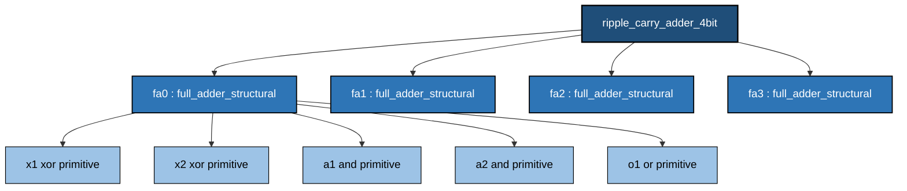
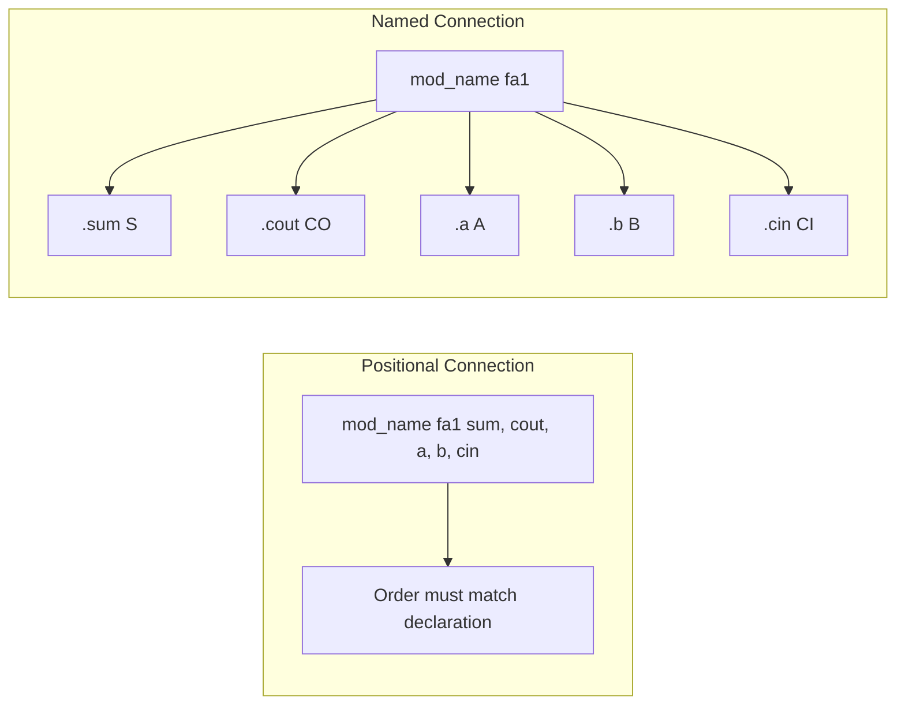
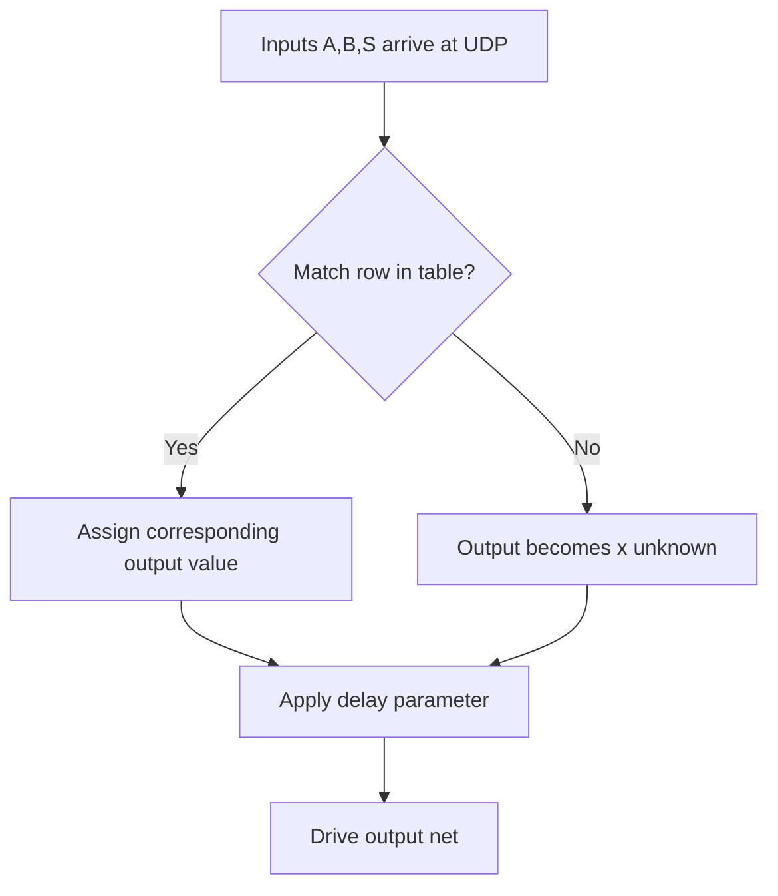
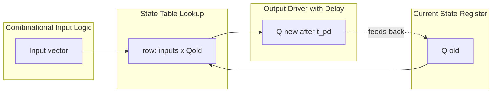
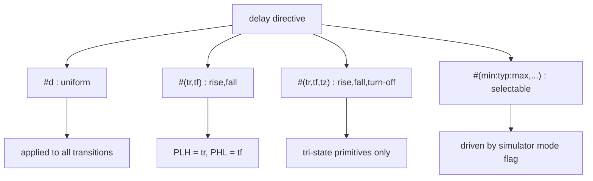
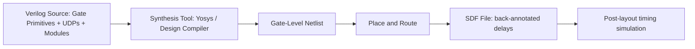

# Structural design and hierarchy - lower level module instantiation, gate level primitives, user defined primitives, adding delay to primitives.

<!-- SECTION_1_START -->

# 1. Core Technical Definition & Intuitive Overview

## 1.1 Formal Definitions (KTU 2024 Syllabus Terminology)

**Structural Modeling** is a design style in Verilog HDL that describes a digital circuit by explicitly instantiating **modules**, **gates**, and **primitives**, and connecting them with **nets (wires)**. It is the lowest-level HDL abstraction that maps one-to-one onto a real hardware schematic.

> [!IMPORTANT]
> **Structural Design** = A textual netlist. The Verilog code reads like a parts list (Bill of Materials) and a wiring diagram combined into one file.

**Hierarchy** refers to the design organization in which a top-level module contains one or more instances of lower-level sub-modules, which in turn may contain instances of even lower-level modules, and so on — forming a *tree of design decomposition*.

> [!NOTE]
> **Lower-Level Module Instantiation** is the act of placing a copy (an *instance*) of a pre-existing module inside another (parent) module and wiring it up. Every instance is a physically separate piece of hardware.

**Gate-Level Primitives** are the built-in, pre-defined logic gates supplied by the Verilog language (e.g., `and`, `or`, `not`, `nand`, `nor`, `xor`, `xnor`, `buf`). They are recognized by the simulator without any module declaration.

**User-Defined Primitives (UDPs)** are custom primitives authored by the designer that capture a specific input-output behavior in the form of a **truth table** (for combinational logic) or a **state table** (for sequential logic). They are functionally similar to library cells in an ASIC standard-cell library.

**Delay** is an optional, time-valued parameter that can be associated with any gate, primitive, or UDP output. It models the **propagation delay** — the elapsed time between an input transition and the resulting output transition in real silicon.

## 1.2 Real-World Analogy

Imagine you are assembling a **personal computer on a workbench**:

- The **motherboard schematic** lists every chip and every wire — this is **structural design**.
- The **CPU, RAM, and chipset** are each documented in their own datasheet — these are the **lower-level modules**.
- When you solder a RAM chip onto the motherboard, you are **instantiating** that module and connecting pins.
- The **basic AND/OR/NOT chips** in the 74-series TTL logic family are *gate-level primitives*.
- A custom ASIC designed by your company for proprietary encryption behaves like a **UDP** — defined once, used everywhere.
- The **propagation delay** (e.g., 5 ns for a 74LS00 NAND gate) is the real-world delay between applying an input and seeing the output — this is what the `#delay` parameter in Verilog models.

> [!TIP]
> **Mnemonic — "SWG-UD"**: **S**tructural = **W**ires + **G**ates + **U**ser **D**efined primitives.

## 1.3 Standard Metrics and Constants

| Parameter | Standard Value / Unit | Symbol |
|---|---|---|
| Logic levels | $0$ (Low), $1$ (High), $x$ (Unknown), $z$ (High-Impedance) | — |
| Default time unit | 1 ns (Verilog default unless overridden by `` `timescale ``) | $ns$ |
| Rise delay | Low-to-High propagation delay | $t_{PLH}$ |
| Fall delay | High-to-Low propagation delay | $t_{PHL}$ |
| Turn-off delay | Active-to-High-Z (for tri-state) | $t_{PZX}$ |
| Contamination delay | Minimum delay (fastest possible response) | $t_{cd}$ |

> [!VISUALIZATION CONTROL]
> **Concept:** Propagation delay waveform for a NOT gate
> **GeoGebra / Desmos Input Equations:**
> * Input: $f(t) = \text{step}(t-2) - \text{step}(t-8)$ (square pulse from $t=2$ to $t=8$)
> * Output: $g(t) = 1 - f(t - t_{pd})$ where $t_{pd} = 3$ (output shifts right by 3 ns)
> **Visual Description:** Two square waves on the same time axis. The output is identical to the input in shape but shifted to the right by $t_{pd}$ ns. Students should observe that the falling edge of the input produces the rising edge of the output after the delay, and vice versa.

---

<!-- SECTION_1_END -->

<!-- SECTION_2_START -->

# 2. Deep Theoretical Analysis & KTU High-Yield Formula Sheet

## 2.1 The Three Pillars of Structural Design

### 2.1.1 Lower-Level Module Instantiation

The general syntax is:

$$
\texttt{module\_name\ [\ instance\_array\_range ]\ instance\_name\ (\ port\_connections\ );}
$$

**Two Styles of Port Connection:**

**Positional Connection (Order-Based):**
```verilog
full_adder fa1 (sum, carry, a, b, cin);
```
Ports are wired in the exact order they were declared in the sub-module.

**Named Connection (Explicit — KTU Preferred):**
```verilog
full_adder fa1 (.sum(s), .cout(co), .a(a), .b(b), .cin(ci));
```
Each port is mapped by name. Safer, self-documenting, and order-independent.

> [!NOTE]
> Unconnected outputs must be left open. Unconnected inputs must be explicitly left open because Verilog defaults unconnected inputs to **high-impedance ($z$)** in primitives — a common source of simulation mismatches.

### 2.1.2 Gate-Level Primitives

Verilog provides 8 single-output and 4 tri-state gate primitives:

**Single-Output Gates:**

| Primitive | Function | Allowed Inputs |
|---|---|---|
| `and` | $Y = A \cdot B \cdot C \ldots$ | $\ge 2$ |
| `or` | $Y = A + B + C \ldots$ | $\ge 2$ |
| `nand` | $Y = \overline{A \cdot B \cdot C \ldots}$ | $\ge 2$ |
| `nor` | $Y = \overline{A + B + C \ldots}$ | $\ge 2$ |
| `xor` | $Y = A \oplus B \oplus C \ldots$ | $\ge 2$ |
| `xnor` | $Y = \overline{A \oplus B \oplus C \ldots}$ | $\ge 2$ |
| `buf` | $Y = A$ (buffer) | exactly 1 |
| `not` | $Y = \overline{A}$ (inverter) | exactly 1 |

**Three-State (Tri-State) Gates:**

| Primitive | Enable Active Level | Function |
|---|---|---|
| `bufif1` | $1$ | $Y = A$ when ctrl=$1$, else $z$ |
| `bufif0` | $0$ | $Y = A$ when ctrl=$0$, else $z$ |
| `notif1` | $1$ | $Y = \overline{A}$ when ctrl=$1$, else $z$ |
| `notif0` | $0$ | $Y = \overline{A}$ when ctrl=$0$, else $z$ |

**Universal Gate Primitive Syntax:**

$$
\texttt{[delay]}\ \texttt{gate\_type\ [instance\_name] (output, input\_1, input\_2, \ldots, input\_n);}
$$

The first terminal in the port list is **always the output**; the rest are inputs.

### 2.1.3 User-Defined Primitives (UDPs)

A UDP is a stand-alone design unit that lives between a gate-level primitive and a behavioral `always` block in abstraction. Two flavors exist:

**A. Combinational UDP** — output depends only on current inputs.

```verilog
primitive mux2x1 (Y, A, B, S);
    output Y;
    input  A, B, S;

    table
    //  A  B  S  :  Y
        0  ?  0  :  0  ;
        1  ?  0  :  1  ;
        ?  0  1  :  0  ;
        ?  1  1  :  1  ;
    endtable
endprimitive
```

> [!IMPORTANT]
> Wildcards: `?` = $0$ or $1$ (don't care), `-` = no change (sequential only). Each row must be a unique combination of *input* values.

**B. Sequential UDP** — output depends on current inputs **and** current state.

```verilog
primitive d_flipflop (Q, D, CLK);
    output reg Q;
    input  D, CLK;

    initial Q = 1'b0;          // mandatory initial state

    table
    //  D  CLK  :  Qold  :  Qnew
        1  (01) :  ?     :  1  ;
        0  (01) :  ?     :  0  ;
        ?  (0?) :  ?     :  -  ;   // hold
        ?  (1?) :  ?     :  -  ;   // hold
    endtable
endprimitive
```

**Edge Specification Symbols:**

| Symbol | Meaning |
|---|---|
| `(01)` | Rising edge ($0 \to 1$) |
| `(10)` | Falling edge ($1 \to 0$) |
| `(0x)` or `(x1)` | Potential rising edge |
| `(1x)` or `(x0)` | Potential falling edge |
| `(??)` | Any change |
| `?` | $0$, $1$, or $x$ |

### 2.1.4 Adding Delay to Primitives

Verilog supports four delay-specification styles:

**Style 1 — Single Delay (Uniform):**

```verilog
and #5 a1 (out, in1, in2);
```
Applies $5$ ns to **all** transitions. Effective mapping:
$$\text{rise} = \text{fall} = \text{turn-off} = 5\ \text{ns}$$

**Style 2 — Two-Value Delay (Rise, Fall):**

```verilog
not #(3, 5) inv1 (y, x);
$$
$$t_{PLH} = 3\ \text{ns},\quad t_{PHL} = 5\ \text{ns}$$

**Style 3 — Three-Value Delay (Rise, Fall, Turn-Off):**

```verilog
bufif1 #(4, 6, 8) buf1 (out, in, ctrl);
$$
$$t_{PLH} = 4\ \text{ns},\quad t_{PHL} = 6\ \text{ns},\quad t_{PZX} = 8\ \text{ns}$$

**Style 4 — Min:Typ:Max Triplet:**

```verilog
and #(2:3:5, 3:4:6) a1 (out, in1, in2);
$$
$$\text{rise} = (2{:}3{:}5)\ \text{ns},\quad \text{fall} = (3{:}4{:}6)\ \text{ns}$$

> [!NOTE]
> The simulator selects `min`, `typ`, or `max` based on the simulation mode flag (default = `typ`).

## 2.2 KTU High-Yield Formula Sheet

| Concept | Syntax Form | Key Rule |
|---|---|---|
| Module instantiation | `mod_name inst_name (.p(conn), …);` | Use named ports to avoid swap errors |
| Gate instantiation | `gate_type #delay inst (out, in1, in2, …);` | First terminal is **always** output |
| Output-only gate (buf/not) | `buf #d b1 (o1, o2, o3, in);` | Multiple outputs allowed for buf/not |
| Combinational UDP | `primitive name (out, i1, i2, …);` | No `initial` block needed |
| Sequential UDP | requires `reg` output and `initial` | Edge transitions in parentheses |
| Single delay | `#d` | $d \to$ all transitions |
| Rise,Fall delay | `#(tr, tf)` | $t_{PLH} = t_r$, $t_{PHL} = t_f$ |
| Rise,Fall,Turn-off | `#(tr, tf, tz)` | For tri-state primitives |
| Min:Typ:Max | `#(min:typ:max, …)` | Selectable per sim mode |
| Instantiation array | `mod_name [3:0] inst (…);` | Generates 4 instances |

## 2.3 Real-World Engineering Utility

- **ASIC/FPGA Design:** Structural Verilog is the entry point for *synthesis* tools. The synthesized netlist *is* a structural description — gates and flip-flops wired together.
- **Legacy IP Integration:** UDPs are widely used in industry to model *library cells* (custom-designed transistors) without exposing proprietary transistor-level schematics.
- **Static Timing Analysis (STA):** The `#delay` values map directly to the **cell delays** in the Standard Delay Format (SDF) file used by EDA tools.
- **Board-Level Design:** Gate-level modeling is used for back-annotation — feeding actual post-layout delays back into the simulation to verify timing closure.

---

<!-- SECTION_2_END -->

<!-- SECTION_3_START -->

# 3. Step-by-Step Derivations & Code Implementation

## 3.1 Derivation: Building a 1-Bit Full Adder Structurally

A 1-bit full adder is defined by the Boolean equations:

$$
S = A \oplus B \oplus C_{in}
$$
$$
C_{out} = (A \cdot B) + (C_{in} \cdot (A \oplus B))
$$

We will **derive the structural Verilog** step-by-step using gate-level primitives.

### Step 1 — Build the XOR for $A \oplus B$

```verilog
xor  #5  x1  (w1, a, b);          // w1 = a ^ b
```

### Step 2 — Build the sum output $S = w1 \oplus C_{in}$

```verilog
xor  #5  x2  (sum, w1, cin);      // sum = w1 ^ cin = a ^ b ^ cin
```

### Step 3 — Build the AND-1 term $A \cdot B$

```verilog
and  #3  a1  (w2, a, b);          // w2 = a & b
```

### Step 4 — Build the AND-2 term $C_{in} \cdot (A \oplus B)$

```verilog
and  #3  a2  (w3, cin, w1);       // w3 = cin & (a ^ b)
```

### Step 5 — OR the two AND terms to get $C_{out}$

```verilog
or   #3  o1  (cout, w2, w3);      // cout = w2 | w3
```

### Complete Structural Module

```verilog
//----------------------------------------------------------
// File: full_adder_structural.v
// Description: 1-bit Full Adder using gate-level primitives
//----------------------------------------------------------
`timescale 1ns / 1ps

module full_adder_structural (sum, cout, a, b, cin);
    output sum, cout;
    input  a, b, cin;
    wire   w1, w2, w3;

    // Gate-level primitives with explicit delay
    xor  #5  x1  (w1,   a,   b);
    xor  #5  x2  (sum,  w1,  cin);
    and  #3  a1  (w2,   a,   b);
    and  #3  a2  (w3,   cin, w1);
    or   #3  o1  (cout, w2,  w3);
endmodule
```

> [!NOTE]
> Every `wire` is mandatory. The simulator will not infer a connection automatically — you must explicitly declare the internal net.

## 3.2 Hierarchical Design: 4-Bit Ripple Carry Adder from 1-Bit Full Adders

We instantiate the 1-bit full adder module **four times** to construct a 4-bit adder.

```verilog
//----------------------------------------------------------
// File: ripple_carry_adder_4bit.v
// Description: 4-bit RCA built from 1-bit FA instances
//----------------------------------------------------------
`timescale 1ns / 1ps

module ripple_carry_adder_4bit (sum, cout, a, b, cin);
    output [3:0] sum;
    output       cout;
    input  [3:0] a, b;
    input        cin;

    wire c1, c2, c3;     // intermediate carries

    // Lower-level module instantiations using NAMED ports
    full_adder_structural fa0 (.sum(sum[0]), .cout(c1), .a(a[0]), .b(b[0]), .cin(cin));
    full_adder_structural fa1 (.sum(sum[1]), .cout(c2), .a(a[1]), .b(b[1]), .cin(c1));
    full_adder_structural fa2 (.sum(sum[2]), .cout(c3), .a(a[2]), .b(b[2]), .cin(c2));
    full_adder_structural fa3 (.sum(sum[3]), .cout(cout), .a(a[3]), .b(b[3]), .cin(c3));
endmodule
```

**Verification of Hierarchy:**

- **Top-level module:** `ripple_carry_adder_4bit`
- **Sub-module:** `full_adder_structural` (instantiated 4 times as `fa0`, `fa1`, `fa2`, `fa3`)
- **Carry chain:** $c_{in} \to c_1 \to c_2 \to c_3 \to c_{out}$

## 3.3 Complete Combinational UDP: 2-to-1 Multiplexer

A 2:1 MUX behavior table is:
$$Y = \overline{S} \cdot A + S \cdot B$$

Truth table:

| A | B | S | Y |
|---|---|---|---|
| 0 | $?$ | 0 | 0 |
| 1 | $?$ | 0 | 1 |
| $?$ | 0 | 1 | 0 |
| $?$ | 1 | 1 | 1 |

**Implementation:**

```verilog
//----------------------------------------------------------
// File: mux2x1_udp.v
// Description: 2-to-1 MUX as a User-Defined Primitive
//----------------------------------------------------------
`timescale 1ns / 1ps

primitive mux2x1_udp (Y, A, B, S);
    output Y;
    input  A, B, S;

    table
    //  A  B  S  :  Y
        0  ?  0  :  0  ;
        1  ?  0  :  1  ;
        ?  0  1  :  0  ;
        ?  1  1  :  1  ;
        0  0  x  :  0  ;
        1  1  x  :  1  ;
    endtable
endprimitive
```

**Instantiation of the UDP inside a parent module:**

```verilog
module mux4x1_using_udp (Y, A, B, C, D, S);
    output Y;
    input  A, B, C, D;
    input  [1:0] S;

    wire w0, w1;

    mux2x1_udp m0 (w0, A, B, S[0]);
    mux2x1_udp m1 (w1, C, D, S[0]);
    mux2x1_udp m2 (Y,  w0, w1, S[1]);
endmodule
```

> [!IMPORTANT]
> The default delay for a UDP is **0 ns**. To add delay, you may declare the UDP with a delay parameter at the primitive definition site, or apply a delay on the instantiation line (e.g., `mux2x1_udp #3 m0 (...)`).

## 3.4 Complete Sequential UDP: D Flip-Flop with Asynchronous Reset

```verilog
//----------------------------------------------------------
// File: dff_async_reset_udp.v
// Description: Positive-edge D-FF with active-low async reset
//----------------------------------------------------------
`timescale 1ns / 1ps

primitive dff_async_reset (Q, D, CLK, RST_n);
    output reg Q;
    input  D, CLK, RST_n;

    // Mandatory initial state
    initial Q = 1'b0;

    table
    //  D  CLK  RST_n  :  Qold  :  Qnew
        ?   ?     0    :   ?    :  0   ;   // async reset (highest priority)
        ?   (10)  ?    :   ?    :  -   ;   // falling edge -> hold
        0   (01)  1    :   ?    :  0   ;   // rising edge: latch 0
        1   (01)  1    :   ?    :  1   ;   // rising edge: latch 1
        ?   (0x)  1    :   ?    :  -   ;   // potential rising edge
        ?   (1x)  1    :   ?    :  -   ;   // potential falling edge
        ?   (??)  1    :   ?    :  -   ;   // no clock change -> hold
    endtable
endprimitive
```

**Adding Delay to the Sequential UDP:**

```verilog
// Instantiate with 2ns CLK-to-Q delay, 1ns reset recovery
dff_async_reset #2 dff0 (.Q(q_reg), .D(d_in), .CLK(clk), .RST_n(rst_n));
```

Here the `#2` means every output transition is delayed by $2$ ns.

## 3.5 Delay Derivation for a Multi-Stage Path

Consider a path: $\text{IN} \to \text{NAND} \to \text{BUF} \to \text{OUT}$

Gate delays:
- NAND: $\#(3, 4)$ → $t_{PLH}=3$ ns, $t_{PHL}=4$ ns
- BUF: $\#5$ → $5$ ns for all transitions

**Worst-case Low-to-High propagation:**

$$
t_{PLH}^{\text{path}} = t_{PLH}^{\text{NAND}} + t_{PLH}^{\text{BUF}} = 3 + 5 = 8\ \text{ns}
$$

**Worst-case High-to-Low propagation:**

$$
t_{PHL}^{\text{path}} = t_{PHL}^{\text{NAND}} + t_{PHL}^{\text{BUF}} = 4 + 5 = 9\ \text{ns}
$$

**Total worst-case path delay:**

$$
t_{pd}^{\text{max}} = \max(8, 9) = 9\ \text{ns}
$$

## 3.6 Comprehensive Testbench

```verilog
//----------------------------------------------------------
// File: tb_structural_design.v
//----------------------------------------------------------
`timescale 1ns / 1ps

module tb_structural_design;
    reg  [3:0] a, b;
    reg        cin;
    wire [3:0] sum;
    wire       cout;

    // DUT instantiation
    ripple_carry_adder_4bit dut (
        .sum(sum), .cout(cout),
        .a(a), .b(b), .cin(cin)
    );

    initial begin
        $dumpfile("structural.vcd");
        $dumpvars(0, tb_structural_design);
        $monitor("Time=%0t a=%b b=%b cin=%b -> sum=%b cout=%b",
                  $time, a, b, cin, sum, cout);

        a = 4'b0001; b = 4'b0010; cin = 1'b0;
        #10 a = 4'b1111; b = 4'b0001; cin = 1'b1;
        #10 a = 4'b1010; b = 4'b0101; cin = 1'b0;
        #10 $finish;
    end
endmodule
```

> [!TIP]
> Always declare a `timescale` directive at the top of every Verilog file. Without it, the simulator uses a default of 1 ns / 1 ps and you may get surprising results.

---

<!-- SECTION_3_END -->

<!-- SECTION_4_START -->

# 4. Structural Diagrams & Schematics

## 4.1 Hierarchy Tree of the Ripple Carry Adder



**Reading the tree:** `ripple_carry_adder_4bit` (root) contains four instances of `full_adder_structural`, each of which contains five gate-level primitives.

## 4.2 Two Styles of Port Connection



## 4.3 UDP Truth-Table Evaluation Flow



## 4.4 Sequential UDP — Block Architecture



## 4.5 Delay Specification Mapping



## 4.6 Block-Level Synthesis Flow Mapping



---

<!-- SECTION_4_END -->

<!-- SECTION_5_START -->

# 5. KTU 2024 Scheme Examination Question Bank & Topic Recap

## 5.1 Part A — Short Answer Questions (3 Marks Each)

### Q1. **[KTU University Exam – July 2023]** — CO2, Remember
Explain the difference between **gate-level primitives** and **user-defined primitives (UDPs)** in Verilog with one example each.

**Model Answer:**

- **Gate-level primitives** are pre-defined logic gates built into the Verilog language, such as `and`, `or`, `nand`, `nor`, `xor`, `xnor`, `buf`, and `not`. They are recognized by the simulator without any user declaration. Example: `and #5 a1 (out, in1, in2);`
- **User-Defined Primitives (UDPs)** are custom primitives authored by the designer using a truth table (combinational) or state table (sequential). They must be declared using the `primitive` … `endprimitive` keywords. Example: A custom 2:1 MUX defined as `primitive mux2x1(...) ... endprimitive`.

**Valuation Key:** [Defining each term: 1 Mark] [One example each: 1 Mark] [Point of difference: 1 Mark]

---

### Q2. **[KTU University Exam – Dec 2023]** — CO2, Understand
List the **four delay specification styles** in Verilog with one example each.

**Model Answer:**

1. **Single delay:** `and #5 g1 (y, a, b);` — applies 5 ns to all transitions.
2. **Two-value delay:** `not #(3, 5) g2 (y, a);` — rise = 3 ns, fall = 5 ns.
3. **Three-value delay:** `bufif1 #(4, 5, 6) g3 (y, a, ctrl);` — rise, fall, turn-off.
4. **Min:Typ:Max:** `and #(2:3:5, 3:4:6) g4 (y, a, b);` — selectable per simulation mode.

**Valuation Key:** [Each style: 0.75 Mark] = 3 Marks total.

---

## 5.2 Part B — Long Answer Questions (14 Marks)

### Question A (14 Marks)

#### (a) **[KTU University Exam – July 2024]** — CO2, Apply (7 Marks)

**Design a 4-bit ripple carry adder** using the structural modeling style by instantiating a **1-bit full adder module** four times. The 1-bit full adder must itself be written using **gate-level primitives** (`xor`, `and`, `or`) with appropriate delays. Show the complete Verilog code for both the 1-bit FA and the 4-bit RCA.

**Model Solution:**

**Step 1 — Write the 1-bit Full Adder using gate-level primitives:**

```verilog
`timescale 1ns / 1ps
module full_adder_1bit (sum, cout, a, b, cin);
    output sum, cout;
    input  a, b, cin;
    wire   w1, w2, w3;

    xor #5 x1 (w1,   a,   b);
    xor #5 x2 (sum,  w1,  cin);
    and #3 a1 (w2,   a,   b);
    and #3 a2 (w3,   cin, w1);
    or  #3 o1 (cout, w2,  w3);
endmodule
```
**[Writing the 1-bit FA module with 5 primitives and 3 internal wires: 3 Marks]**

**Step 2 — Instantiate it 4 times to build the 4-bit RCA:**

```verilog
module rca_4bit (sum, cout, a, b, cin);
    output [3:0] sum;
    output       cout;
    input  [3:0] a, b;
    input        cin;
    wire c1, c2, c3;

    full_adder_1bit fa0 (.sum(sum[0]), .cout(c1), .a(a[0]), .b(b[0]), .cin(cin));
    full_adder_1bit fa1 (.sum(sum[1]), .cout(c2), .a(a[1]), .b(b[1]), .cin(c1));
    full_adder_1bit fa2 (.sum(sum[2]), .cout(c3), .a(a[2]), .b(b[2]), .cin(c2));
    full_adder_1bit fa3 (.sum(sum[3]), .cout(cout), .a(a[3]), .b(b[3]), .cin(c3));
endmodule
```
**[4 named-port instantiations and carry chain wiring: 3 Marks]**

**Step 3 — Verifying carry propagation:** When A = 1111, B = 0001, the carry ripples LSB to MSB through $c_1$, $c_2$, $c_3$ in series, giving a worst-case delay equal to $4 \times t_{pd}^{\text{FA}}$. **[Explanation of carry chain: 1 Mark]**

---

#### (b) **[KTU University Exam – July 2024]** — CO2, Apply (7 Marks)

For the 4-bit ripple carry adder designed in part (a), the per-gate delays are $t_{PLH}=3$ ns, $t_{PHL}=4$ ns for XOR gates, and $t_{PLH}=2$ ns, $t_{PHL}=3$ ns for AND/OR gates. **Calculate the worst-case propagation delay** from any input ($a_0$, $b_0$, $c_{in}$) to the final carry output $c_{out}$.

**Model Solution:**

**Step 1 — Identify the critical path:** The longest path in an FA is $A,B \to \text{AND-1} \to \text{OR} \to C_{out}$ and $A,B \to \text{XOR-1} \to \text{AND-2} \to \text{OR} \to C_{out}$.

**Step 2 — Compute single FA worst-case delay:**

$$
t_{PHL}^{\text{FA,CO}} = t_{PHL}^{\text{AND}} + t_{PHL}^{\text{OR}} = 4 + 3 = 7\ \text{ns}
$$

$$
t_{PLH}^{\text{FA,CO}} = t_{PLH}^{\text{AND}} + t_{PLH}^{\text{OR}} = 3 + 2 = 5\ \text{ns}
$$

**[Single FA CO delay: 3 Marks]**

**Step 3 — Scale to 4-bit RCA (carry must propagate through 4 stages):**

$$
t_{PHL}^{\text{4-bit}} = 4 \times 7 = 28\ \text{ns}
$$

$$
t_{PLH}^{\text{4-bit}} = 4 \times 5 = 20\ \text{ns}
$$

**[4-bit RCA total delay: 3 Marks]**

**Step 4 — Worst-case delay:**

$$
t_{pd}^{\text{max}} = \max(20, 28) = 28\ \text{ns}
$$

**[Final answer: 1 Mark]**

> [!WARNING]
> **Examiner's Pitfall Alert:** Students often forget that the carry must ripple through **every** FA stage and simply multiply by 2 or 3. Always confirm: an N-bit RCA has N cascaded FAs.

---

### Question B (14 Marks) — Alternative Choice

#### (a) **[KTU University Exam – Dec 2022]** — CO2, Apply (7 Marks)

**Write a User-Defined Primitive (UDP) in Verilog** for a **positive-edge-triggered D flip-flop with active-low asynchronous reset**. Show its instantiation in a parent module that creates a 4-bit shift register.

**Model Solution:**

**Step 1 — UDP Definition:**

```verilog
primitive dff_async_rst (Q, D, CLK, RST_n);
    output reg Q;
    input  D, CLK, RST_n;

    initial Q = 1'b0;

    table
    //  D  CLK  RST_n  :  Qold  :  Qnew
        ?   ?     0    :   ?    :  0   ;
        0  (01)   1    :   ?    :  0   ;
        1  (01)   1    :   ?    :  1   ;
        ?  (??)   1    :   ?    :  -   ;
    endtable
endprimitive
```
**[UDP syntax and initial state: 2 Marks] [Truth table with edges: 3 Marks]**

**Step 2 — 4-bit Shift Register using the UDP:**

```verilog
module shift_reg_4bit (Q, D, CLK, RST_n);
    output [3:0] Q;
    input        D, CLK, RST_n;

    dff_async_rst #2 ff0 (.Q(Q[0]), .D(D),     .CLK(CLK), .RST_n(RST_n));
    dff_async_rst #2 ff1 (.Q(Q[1]), .D(Q[0]),  .CLK(CLK), .RST_n(RST_n));
    dff_async_rst #2 ff2 (.Q(Q[2]), .D(Q[1]),  .CLK(CLK), .RST_n(RST_n));
    dff_async_rst #2 ff3 (.Q(Q[3]), .D(Q[2]),  .CLK(CLK), .RST_n(RST_n));
endmodule
```
**[4 instantiations wired as shift register: 2 Marks]**

---

#### (b) **[KTU University Exam – Dec 2022]** — CO2, Understand (7 Marks)

Explain the **three-value delay specification** syntax used for tri-state gate primitives with a suitable example. Why is the **turn-off delay** important in bus-oriented designs?

**Model Solution:**

**Step 1 — Syntax:**

```verilog
bufif1 #(t_rise, t_fall, t_turnoff) inst_name (out, in, ctrl);
```

Example: `bufif1 #(4, 6, 8) bus_driver (data_bus, data_in, enable);`

**[Syntax: 2 Marks] [Example: 2 Marks]**

**Step 2 — Why turn-off delay matters:** In a shared bus (e.g., a microprocessor data bus), multiple tri-state drivers connect to the same wire. The **turn-off delay** ($t_{PZX}$) determines **how quickly a device releases the bus** before another device drives it. Without proper turn-off timing, **bus contention** occurs — two drivers fight for the wire, causing excessive current, voltage glitches, and possible chip damage.

**[Explanation of bus contention: 2 Marks] [Real-world consequence: 1 Mark]**

> [!WARNING]
> **Examiner's Pitfall Alert:** Students often confuse `$t_{PZX}$` (active to Z, going *out* of high-Z) with `$t_{PXZ}$` (Z to active, going *into* drive). Remember the order: $t_{PZX}$ = *output* becomes high-impedance; $t_{PXZ}$ = *output* becomes active.

---

## 5.3 Topic Recap & Important Things to Remember

- **Structural design** describes hardware as a **netlist of modules, gates, and wires**, mirroring a real schematic.
- **Hierarchy** is a tree: top module → sub-modules → primitives → gates.
- **Module instantiation** comes in two flavors: **positional** (order-based) and **named** (`.port(connection)`, KTU-preferred for safety).
- **Gate-level primitives** in Verilog: `and`, `or`, `nand`, `nor`, `xor`, `xnor`, `buf`, `not` + 4 tri-state variants (`bufif0/1`, `notif0/1`).
- For `buf` and `not`, the input is the **last** terminal; all preceding terminals are **outputs**.
- **UDPs** use the `primitive` … `endprimitive` keywords, contain a single `output` and one or more `input`s, and describe behavior in a `table` … `endtable`.
- **Combinational UDPs** have no `initial` block; **sequential UDPs** declare `reg` output and require an `initial` block.
- **Edge symbols** in sequential UDPs: `(01)` rising, `(10)` falling, `(??)` any transition, `?` wildcard.
- **Delay styles**: `#d` (uniform), `#(tr,tf)` (rise/fall), `#(tr,tf,tz)` (tri-state), `#(min:typ:max,...)` (selectable).
- **Path delay** in a multi-gate chain is the **sum of stage delays** (not the max); worst-case is the larger of the rise and fall times.
- An **N-bit RCA** has N cascaded full adders, so its worst-case carry delay is $N \times t_{pd}^{\text{FA}}$.
- **Bus contention** in tri-state designs is prevented by ensuring that the turn-off delay of one driver expires **before** another driver's turn-on delay elapses.
- **Default delay** in Verilog is **0 ns** unless `timescale` is specified.
- **Synthesis tools** (Yosys, Synopsys DC) directly map gate-level and structural Verilog into a **gate-level netlist** of standard cells.
- **Named port instantiation** is the industry standard — never rely on positional order in production code.
- Every internal connection between gates must be declared as a `wire`; the simulator will not auto-infer nets inside a structural module.

---

<!-- SECTION_5_END -->
