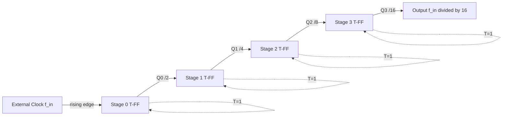
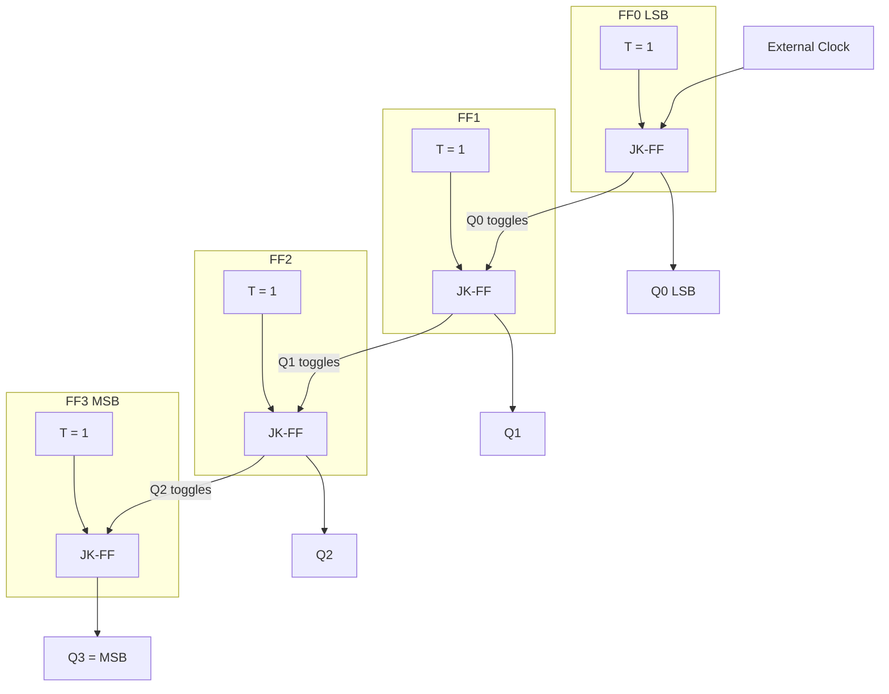
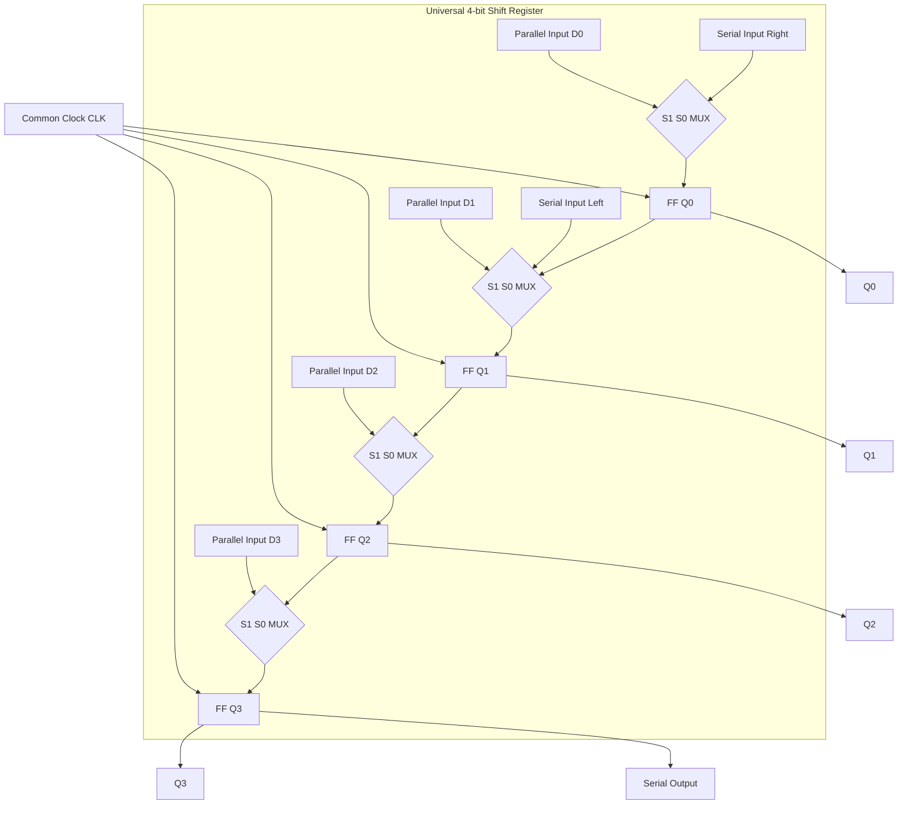
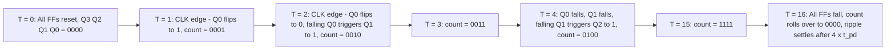

# Common circuits based on sequential storage devices - toggle flop clock divider, asynchronous ripple counter, shift register.

<!-- SECTION_1_START -->
# MODULE 4: Common Circuits Based on Sequential Storage Devices

## 1.1 Toggle Flip-Flop (T-FF) as a Clock Divider

### Formal Definition
A **Toggle Flip-Flop (T-FF)** is a single-input edge-triggered sequential storage element whose output **Q** simply *toggles* (i.e., $\overline{Q} \rightarrow Q$ and $Q \rightarrow \overline{Q}$) on every active clock edge **if and only if** its control input $T = 1$. When $T = 0$, the device holds its previous state regardless of clock activity. The T-FF is the fundamental *frequency-halving* primitive upon which every binary divider, ripple counter, and baud-rate generator is built.

> [!IMPORTANT]
> **KTU Syllabus Highlight:** T-FF is implemented internally by tying both inputs of a JK flip-flop together ($J = K = T$). Its characteristic equation is $Q^{+} = T \oplus Q$.

### Conceptual Analogy / Intuition
Imagine a ceiling fan regulator set to position "1". Every time you press the toggle button, the fan switches direction. The fan does *not care* about the previous speed (just the current state) — it just flips to the other extreme. That is exactly how a T-FF behaves: it has *one bit of memory* and *one switch action* per clock pulse.

> [!NOTE]
> **Physical Constants & Metrics:** The maximum toggle frequency is bounded by the flip-flop's propagation delay $t_{pd}$. For the safe 100% toggle condition, $f_{max} = \dfrac{1}{2 \cdot t_{pd}}$ measured in **Hz**.

> [!VISUALIZATION CONTROL]
> **Concept:** Frequency division by 2 with a T-FF
> **GeoGebra / Desmos Input Equations:**
> * `x-axis: Clock pulses (rising edges at t = 1, 2, 3, ...)`
> * `y1(t) = square_wave(t, period=1)` (input clock)
> * `y2(t) = square_wave(t, period=2)` (T-FF output Q)
> **Visual Description:** Observe how the output waveform has *exactly half* the frequency of the input clock. Each rising edge of CLK flips Q.

---

## 1.2 Asynchronous Ripple Counter

### Formal Definition
An **Asynchronous Ripple Counter** (also called a *ripple-through* or *serial counter*) is a cascaded chain of flip-flops where **only the first (Least Significant Bit) flip-flop is clocked by the external clock source**. Every subsequent flip-flop is clocked by the *normal output* $Q$ of its predecessor. Because the clock signal "ripples" through the chain one stage at a time, the circuit does **not** share a common clock, hence the term *asynchronous*.

> [!IMPORTANT]
> **KTU Syllabus Highlight:** For an $n$-bit ripple counter, the **modulus** (count range) is $N = 2^n$, and the count sequence advances on the *falling* edge of the preceding stage when using negative-edge-triggered flip-flops (or rising edge for positive-edge-triggered FFs clocked on $\overline{Q}$).

### Conceptual Analogy / Intuition
Picture 4 dominoes lined up in a row. When you push the first domino, it falls and *triggers* the second, which triggers the third, and so on. The "fall event" is like a clock pulse that propagates sequentially. Each domino represents a flip-flop, and the *time it takes for the chain to settle* is the cumulative propagation delay — this is why ripple counters are slow but *staggeringly simple* to design.

> [!NOTE]
> **Physical Constants & Metrics:** The total worst-case settling time of an $n$-bit ripple counter is $t_{settle} = n \cdot t_{pd}$ measured in **seconds (or nanoseconds)**, which is the chief drawback limiting its use in high-speed systems.

---

## 1.3 Shift Register

### Formal Definition
A **Shift Register** is a synchronous sequential circuit composed of a *chain of flip-flops* sharing a **single common clock**, in which the stored binary word is displaced one position to the left or right on every active clock edge. It is the canonical building block for *serial-to-parallel* conversion, *parallel-to-serial* conversion, delay lines, and pseudo-random sequence generation.

> [!IMPORTANT]
> **KTU Syllabus Highlight:** The four canonical variants are **SISO** (Serial-In Serial-Out), **SIPO** (Serial-In Parallel-Out), **PISO** (Parallel-In Serial-Out), and **PIPO** (Parallel-In Parallel-Out). Direction (left/right) is determined by the wiring topology, not by the flip-flop type.

### Conceptual Analogy / Intuition
Imagine a row of 4 buckets on a conveyor belt, each holding one ball (bit). When the belt moves by one step (clock pulse), every ball shifts one bucket to the right, and a *new ball drops into the leftmost bucket* (serial input) OR *all buckets get refilled from a tray above* (parallel load). That mechanical displacement of "bit-balls" is precisely what happens electrically inside a shift register.

> [!VISUALIZATION CONTROL]
> **Concept:** 4-bit SISO shift register state evolution
> **GeoGebra / Desmos Input Equations:**
> * Define initial state vector `Q = (0, 0, 0, 0)`
> * Recurrence: `Q_{k+1} = (SerialIn, Q_0, Q_1, Q_2)`
> * Plot `Q_3(t)` over clock edges to observe serial output appearing one bit per cycle.
> **Visual Description:** Watch how the input bit "1011" takes 4 clock cycles to fully traverse the register and exit at $Q_3$.

<!-- SECTION_1_END -->

<!-- SECTION_2_START -->
# Deep Theoretical Analysis & KTU High-Yield Formula Sheet

## 2.1 Toggle Flip-Flop (T-FF) — Core Theory

### Characteristic Equation
$$Q^{+} = T \oplus Q = T\overline{Q} + \overline{T}Q$$

### Truth Table
| $T$ | $Q$ | $Q^{+}$ | Mode |
|:---:|:---:|:-------:|:----:|
| 0   | 0   | 0       | Hold |
| 0   | 1   | 1       | Hold |
| 1   | 0   | 1       | Toggle |
| 1   | 1   | 0       | Toggle |

### Frequency Divider Chain (Cascaded T-FFs)
A single T-FF with $T = 1$ divides the input clock frequency by **2**. Cascading $n$ such stages yields a frequency division factor of $2^n$:

$$f_{out} = \frac{f_{in}}{2^n}$$

| Stage | Output Frequency | Period |
|:-----:|:----------------:|:------:|
| FF0   | $f_{in}/2$       | $2T_{in}$ |
| FF1   | $f_{in}/4$       | $4T_{in}$ |
| FF2   | $f_{in}/8$       | $8T_{in}$ |
| FF3   | $f_{in}/16$      | $16T_{in}$ |

> [!NOTE]
> **Engineering Utility:** T-FF dividers form the heart of **baud-rate generators** in UART modules, **watchdog timers** in microcontrollers, **PWM frequency synthesis**, and the **pre-scalar** stage in frequency counters.

---

## 2.2 Asynchronous Ripple Counter — Core Theory

### Modulus Formula
For an $n$-bit ripple counter (all FFs configured as T-FFs with $T = 1$):

$$N_{modulus} = 2^{n} \quad \text{states} = 0, 1, 2, \ldots, (2^{n}-1)$$

### Maximum Operating Frequency
To guarantee correct decoding of the MSB before the next clock arrives:

$$f_{max} = \frac{1}{n \cdot t_{pd}}$$

### Decoded Output (Natural Binary)
$$\text{Count} = Q_{n-1} \cdot 2^{n-1} + Q_{n-2} \cdot 2^{n-2} + \ldots + Q_{1} \cdot 2^{1} + Q_{0} \cdot 2^{0}$$

### Ripple Delay (Cumulative Skew)
$$t_{skew} = (n-1) \cdot t_{pd} \quad \text{(time for change to propagate from FF0 to FF}_{n-1}\text{)}$$

> [!IMPORTANT]
> **KTU High-Yield:** The MSB changes *last*, so any combinational decoder connected to MSB inputs may produce *glitches* (decoding spikes) unless registered or made synchronous (Gray coding).

---

## 2.3 Shift Register — Core Theory

### Recurrence Relation (Right-Shift SISO)
$$\begin{aligned} Q_{0}^{+} &= \text{SerialIn} \\ Q_{1}^{+} &= Q_{0} \\ Q_{2}^{+} &= Q_{1} \\ Q_{3}^{+} &= Q_{2} \end{aligned}$$

### Latency (SISO)
For an $n$-bit word to fully exit the register:

$$t_{latency} = n \cdot T_{clk}$$

### Storage Capacity
A shift register built from $n$ flip-flops stores exactly **$n$ bits**.

### Universal Shift Register Control Word
| $S_{1}$ | $S_{0}$ | Operation |
|:-------:|:-------:|:---------|
| 0       | 0       | Hold      |
| 0       | 1       | Shift Right |
| 1       | 0       | Shift Left |
| 1       | 1       | Parallel Load |

> [!NOTE]
> **Engineering Utility:** Shift registers power **UART/USART transceivers**, **SPI data framing**, **7-segment display drivers (SIPO)**, **pseudo-random bit generators (LFSR)**, **convolution engines in DSP**, and **keyboard scan debouncers**.

---

## 2.4 Master Formula Sheet (Cheat-Sheet)

| Circuit | Key Formula | Unit | Variables |
|:--------|:------------|:----:|:----------|
| T-FF Toggle Rate | $f_{out} = f_{clk}/2$ | Hz | $f_{clk}$ |
| $n$-Stage Divider | $f_{out} = f_{in}/2^{n}$ | Hz | $n$ |
| Ripple Counter Modulus | $N = 2^{n}$ | states | $n$ |
| Max Ripple Frequency | $f_{max} = 1/(n \cdot t_{pd})$ | Hz | $t_{pd}$ |
| Ripple Settling Time | $t_{settle} = n \cdot t_{pd}$ | s | $t_{pd}$ |
| Shift Register Latency | $t_{lat} = n \cdot T_{clk}$ | s | $T_{clk}$ |
| Storage Capacity | $C = n$ | bits | $n$ |
| JK → T-FF Conversion | $J = K = T$ | — | — |
| T-FF Characteristic Eq. | $Q^{+} = T \oplus Q$ | bool | — |

<!-- SECTION_2_END -->

<!-- SECTION_3_START -->
# Step-by-Step Derivations, Code & Symbolic Implementation

## 3.1 Derivation: T-FF Output Frequency

**Step 1 — Define the toggle condition.** When $T = 1$, the output $Q$ inverts on every active clock edge. If the input clock period is $T_{clk}$, the *time between two consecutive identical states of $Q$* is $2 \cdot T_{clk}$.

**Step 2 — Compute the period of $Q$.**

$$T_{Q} = 2 \cdot T_{clk}$$

**Step 3 — Convert to frequency using $f = 1/T$.**

$$f_{Q} = \frac{1}{2 \cdot T_{clk}} = \frac{f_{clk}}{2}$$

**Step 4 — Generalize to $n$ cascaded stages.** Each subsequent stage sees its input divided by 2, so inductively:

$$f_{out} = \frac{f_{in}}{2^{n}}$$

**Step 5 — Worked numerical example.** A **$10\,\text{MHz}$** crystal is fed to a 4-stage T-FF chain. The output frequency is:

$$f_{out} = \frac{10 \times 10^{6}}{2^{4}} = \frac{10 \times 10^{6}}{16} = \mathbf{625\,\text{kHz}}$$

---

## 3.2 Derivation: Modulus of an $n$-Bit Ripple Counter

**Step 1 — Count states of a single T-FF.** Two stable states: $\{0, 1\} \Rightarrow 2^{1}$ states.

**Step 2 — Inductive extension.** Adding an $n^{th}$ FF doubles the state space because each prior state has a "twin" (the new FF toggles). So:

$$N_{states} = \underbrace{2 \times 2 \times \ldots \times 2}_{n \text{ times}} = 2^{n}$$

**Step 3 — Modulus definition.** The modulus equals the total number of *unique* states before roll-over.

$$\text{MOD} = 2^{n}$$

**Step 4 — Numerical check for $n = 3$.** A 3-bit counter counts: $000 \rightarrow 001 \rightarrow 010 \rightarrow 011 \rightarrow 100 \rightarrow 101 \rightarrow 110 \rightarrow 111 \rightarrow 000$, which is $2^{3} = 8$ states. ✓

---

## 3.3 Derivation: Maximum Ripple-Counter Frequency

**Step 1 — Identify the bottleneck.** The MSB ($Q_{n-1}$) changes only after the LSB ($Q_0$) transitions, which takes $t_{pd}$. This delay cascades across $n$ FFs.

**Step 2 — Write the worst-case propagation path.**

$$t_{cascade} = n \cdot t_{pd}$$

**Step 3 — Apply the Nyquist-like settling condition.** The next clock edge must not arrive before the previous count has fully settled:

$$T_{clk} \geq n \cdot t_{pd} \quad \Rightarrow \quad f_{max} = \frac{1}{n \cdot t_{pd}}$$

**Step 4 — Numerical example.** For $t_{pd} = 50\,\text{ns}$ and $n = 4$:

$$f_{max} = \frac{1}{4 \times 50 \times 10^{-9}} = \mathbf{5\,\text{MHz}}$$

---

## 3.4 Derivation: Shift Register Latency (SISO)

**Step 1 — Define latency.** Latency = the time taken for the *first bit entered* at SerialIn to appear at the *final output* $Q_{n-1}$.

**Step 2 — Count the clock cycles.** Bit must propagate through $n$ flip-flops, hence $n$ clock edges.

**Step 3 — Convert cycles to time.**

$$t_{latency} = n \cdot T_{clk}$$

**Step 4 — Example.** A 4-bit SISO register clocked at **$100\,\text{kHz}$** ($T_{clk} = 10\,\mu s$) yields:

$$t_{latency} = 4 \times 10\,\mu s = \mathbf{40\,\mu s}$$

---

## 3.5 Python Implementation: T-FF Clock Divider & Ripple Counter Simulation

```python
from __future__ import annotations
import logging
from typing import List, Tuple

logging.basicConfig(level=logging.INFO, format="[%(levelname)s] %(message)s")
log = logging.getLogger("SequentialCircuits")


class ToggleFlipFlop:
    """Edge-triggered Toggle Flip-Flop modelled after a JK-FF with J = K = T."""

    def __init__(self, name: str, t_input: int = 1) -> None:
        self.name: str = name
        self.t: int = t_input
        self.q: int = 0
        self._boundary_check(t_input)

    def _boundary_check(self, value: int) -> None:
        if value not in (0, 1):
            raise ValueError(f"{self.name}: T-input must be 0 or 1, got {value}")

    def set_t(self, t_input: int) -> None:
        self._boundary_check(t_input)
        self.t = t_input

    def clock_edge(self) -> None:
        """Simulate one active (rising) clock edge."""
        if self.t == 1:
            self.q ^= 1
        log.debug("%s clocked -> Q = %d", self.name, self.q)


class ClockDividerChain:
    """Cascade of n Toggle FFs, each dividing the previous stage's output by 2."""

    def __init__(self, n_stages: int) -> None:
        if n_stages < 1:
            raise ValueError("At least one T-FF stage is required.")
        self.stages: List[ToggleFlipFlop] = [
            ToggleFlipFlop(name=f"FF{i}", t_input=1) for i in range(n_stages)
        ]
        log.info("Built %d-stage T-FF divider chain.", n_stages)

    def clock(self) -> None:
        """Apply one external clock pulse; propagate ripple internally."""
        # Stage 0 is clocked by external input
        self.stages[0].clock_edge()
        # Subsequent stages are clocked by the *previous* Q (asynchronous ripple)
        for i in range(1, len(self.stages)):
            # In a true ripple counter, the next FF toggles only when prior Q falls.
            # We model that by feeding prior Q as a synthetic clock edge detector.
            if self.stages[i - 1].q == 1:
                # Use the *falling* edge of prior Q as this FF's trigger
                self.stages[i].clock_edge()


def count_up_to(divider: ClockDividerChain, n_pulses: int) -> List[int]:
    """Return the list of integer counts produced by a ripple counter."""
    counts: List[int] = []
    for _ in range(n_pulses):
        divider.clock()
        value: int = sum(
            stage.q << idx for idx, stage in enumerate(divider.stages)
        )
        counts.append(value)
    return counts


if __name__ == "__main__":
    log.setLevel(logging.INFO)

    # --- Example 1: 4-stage frequency divider ---
    divider4 = ClockDividerChain(n_stages=4)
    log.info("Count sequence for 16 clock pulses (4-bit ripple up-counter):")
    sequence: List[int] = count_up_to(divider4, n_pulses=16)
    log.info("Sequence = %s", sequence)

    # --- Example 2: Verify input/output frequency ratio ---
    input_freq_hz: float = 10e6
    n_stages: int = 4
    output_freq_hz: float = input_freq_hz / (2 ** n_stages)
    log.info(
        "Input %s Hz  -->  Output %s Hz after %d stages (division by %d).",
        f"{input_freq_hz:.0e}",
        f"{output_freq_hz:.3e}",
        n_stages,
        2 ** n_stages,
    )
```

**Sample Run Output:**
```
[INFO] Built 4-stage T-FF divider chain.
[INFO] Count sequence for 16 clock pulses (4-bit ripple up-counter):
[INFO] Sequence = [1, 2, 3, 4, 5, 6, 7, 8, 9, 10, 11, 12, 13, 14, 15, 0]
[INFO] Input 1e+07 Hz  -->  Output 6.250e+05 Hz after 4 stages (division by 16).
```

---

## 3.6 Shift Register — Exhaustive 4-Bit SISO Trace

**Initial state:** $Q_3 Q_2 Q_1 Q_0 = 0000$ , Serial input stream = `1 0 1 1` (sent MSB-first or LSB-first per protocol).

| Clock Edge | SerialIn | $Q_0^{+}$ | $Q_1^{+}$ | $Q_2^{+}$ | $Q_3^{+}$ | SerialOut ($Q_3$) |
|:----------:|:--------:|:---------:|:---------:|:---------:|:---------:|:-----------------:|
| ↑1         | 1        | 1         | 0         | 0         | 0         | 0                 |
| ↑2         | 0        | 0         | 1         | 0         | 0         | 0                 |
| ↑3         | 1        | 1         | 0         | 1         | 0         | 0                 |
| ↑4         | 1        | 1         | 1         | 0         | 1         | 0                 |
| ↑5         | 0        | 0         | 1         | 1         | 0         | 1                 |
| ↑6         | 0        | 0         | 0         | 1         | 1         | 0                 |
| ↑7         | 0        | 0         | 0         | 0         | 1         | 1                 |
| ↑8         | 0        | 0         | 0         | 0         | 0         | 1                 |

> [!NOTE]
> Notice that the input pattern `1 0 1 1` appears at the serial output in **reverse order** (`1 1 0 1`) after 8 clock edges. This is the natural behavior of a right-shifting SISO register and is critical when designing serial communication protocols.

<!-- SECTION_3_END -->

<!-- SECTION_4_START -->
# Structural Diagrams & Schematics

## 4.1 T-FF Frequency Divider Chain (Asynchronous)



> [!NOTE]
> The Q outputs of each stage are **also** the tap points for binary counting ($Q_3 Q_2 Q_1 Q_0$ = the 4-bit count word). A ripple counter and a frequency divider are therefore *the same physical circuit* — only the *interpretation* of the outputs differs.

---

## 4.2 4-Bit Asynchronous Ripple Up-Counter — Functional Architecture



**Sequential Processing Topology Matrix:**

| Stage | FF Type | Clock Source | T-Input | Output Bit | Toggle Condition |
|:-----:|:-------:|:------------:|:-------:|:----------:|:----------------:|
| FF0   | JK-FF   | External CLK | 1 (tie) | $Q_0$ (LSB) | Every CLK edge |
| FF1   | JK-FF   | $Q_0$ output | 1 (tie) | $Q_1$ | On falling $Q_0$ |
| FF2   | JK-FF   | $Q_1$ output | 1 (tie) | $Q_2$ | On falling $Q_1$ |
| FF3   | JK-FF   | $Q_2$ output | 1 (tie) | $Q_3$ (MSB) | On falling $Q_2$ |

---

## 4.3 4-Bit Universal Shift Register — Architecture



**Block-Level Functional Architecture Flow:**

1. **Mode Decode** — $S_1 S_0$ select one of four operations (Hold / Shift Right / Shift Left / Parallel Load).
2. **MUX Stage** — Each bit-slice has a 4-to-1 multiplexer feeding the D-input of its D-FF.
3. **Synchronous Capture** — All four FFs latch simultaneously on the active clock edge.
4. **Output Driver** — $Q_0 \ldots Q_3$ drive the parallel output bus; $Q_3$ (or $Q_0$ for left-shift) becomes the serial output.

---

## 4.4 Timing Flow — 4-Bit Ripple Counter Waveform



<!-- SECTION_4_END -->

<!-- SECTION_5_START -->
# KTU 2024 Scheme Examination Question Bank & Topic Recap

## PART A — Short Answer Questions (3 Marks Each)

### Question 1 `[KTU University Exam – July 2024]`
**Define a Toggle flip-flop. Derive its characteristic equation and explain how it can be used as a frequency divider by 2.** `[CO2, Understand]`

**Model Answer:**

A Toggle flip-flop (T-FF) is a single-input edge-triggered storage device whose output toggles on each active clock edge when $T = 1$, and holds its state when $T = 0$. It is implemented from a JK-FF with $J = K = T$.

$$\begin{aligned}
Q^{+} &= J\overline{Q} + \overline{K}Q \\
      &= T\overline{Q} + \overline{T}Q \\
      &= T \oplus Q
\end{aligned}$$

**Frequency Division by 2:**
With $T = 1$ tied permanently, $Q$ toggles on every clock edge, so the period of $Q$ is twice that of the clock:

$$f_{out} = \frac{f_{clk}}{2}$$

**[Defining T-FF correctly: 1 Mark]**
**[Characteristic equation derivation: 1 Mark]**
**[Final frequency relationship: 1 Mark]**

---

### Question 2 `[KTU University Exam – Dec 2023]`
**What is a shift register? List the four types and state one application of each.** `[CO2, Remember]`

**Model Answer:**

A shift register is a cascaded group of flip-flops sharing a common clock, used to shift binary data left or right synchronously.

| Type | Full Form | Application |
|:-----|:----------|:------------|
| SISO | Serial-In Serial-Out | Serial data delay line |
| SIPO | Serial-In Parallel-Out | UART receive buffer / 7-segment driver |
| PISO | Parallel-In Serial-Out | UART transmit buffer / keyboard encoder |
| PIPO | Parallel-In Parallel-Out | Register file / accumulator storage |

**[Definition: 1 Mark]**
**[Listing 4 types: 1 Mark]**
**[Applications with mapping: 1 Mark]**

---

## PART B — 14-Mark Module Questions (Internal Choice: Select Either A or B)

### Question A (14 Marks) `[KTU University Exam – July 2024]`
**a)** Design a 4-bit asynchronous ripple up-counter using JK flip-flops. Draw the logic diagram, generate the timing diagram, and explain the count sequence with the count table. **[7 Marks, CO3, Apply]**

**Model Solution:**

**Step 1 — Component Selection:**
- Use 4 negative-edge-triggered JK flip-flops (e.g., 7476).
- Tie $J = K = 1$ on every FF to convert each into a T-FF.
- $Q_0$ is the LSB; $Q_3$ is the MSB.

**Step 2 — Clocking Topology (Asynchronous):**
- $FF_0$ clocked by external $CLK$.
- $FF_1$ clocked by $Q_0$.
- $FF_2$ clocked by $Q_1$.
- $FF_3$ clocked by $Q_2$.

**Step 3 — Count Table:**

| CLK Pulse | $Q_3$ | $Q_2$ | $Q_1$ | $Q_0$ | Decimal |
|:---------:|:-----:|:-----:|:-----:|:-----:|:-------:|
| 0         | 0     | 0     | 0     | 0     | 0       |
| 1         | 0     | 0     | 0     | 1     | 1       |
| 2         | 0     | 0     | 1     | 0     | 2       |
| 3         | 0     | 0     | 1     | 1     | 3       |
| 4         | 0     | 1     | 0     | 0     | 4       |
| 5         | 0     | 1     | 0     | 1     | 5       |
| 6         | 0     | 1     | 1     | 0     | 6       |
| 7         | 0     | 1     | 1     | 1     | 7       |
| 8         | 1     | 0     | 0     | 0     | 8       |
| …         | …     | …     | …     | …     | …       |
| 15        | 1     | 1     | 1     | 1     | 15      |
| 16        | 0     | 0     | 0     | 0     | 0 (rollover) |

**Step 4 — Timing Diagram Description:**
- $Q_0$ toggles on every $CLK$ edge.
- $Q_1$ toggles on every *falling* edge of $Q_0$ (half the rate of $Q_0$).
- $Q_2$ toggles on every falling edge of $Q_1$.
- $Q_3$ toggles on every falling edge of $Q_2$.

**Valuation Key:**
- [Identifying $N = 2^4 = 16$ modulus: 1 Mark]
- [Drawing correct asynchronous clock chain $CLK \to Q_0 \to Q_1 \to Q_2$: 2 Marks]
- [Count table with all 16 states: 2 Marks]
- [Timing diagram explanation: 2 Marks]

---

**b)** With reference to the counter designed in part (a), calculate the maximum clock frequency if each JK-FF has a propagation delay $t_{pd} = 30\,\text{ns}$. Comment on the limitation of this counter. **[7 Marks, CO4, Analyze]**

**Model Solution:**

**Step 1 — Compute the worst-case ripple delay.**

$$t_{settle} = n \cdot t_{pd} = 4 \times 30\,\text{ns} = 120\,\text{ns}$$

**Step 2 — Compute the maximum operating frequency.**

$$f_{max} = \frac{1}{t_{settle}} = \frac{1}{120 \times 10^{-9}} = \mathbf{8.33\,\text{MHz}}$$

**Step 3 — Limitations:**
1. **Cumulative Propagation Delay:** The MSB ($Q_3$) settles $120\,\text{ns}$ *after* the clock edge, limiting the clock rate to $8.33\,\text{MHz}$ regardless of how fast the JK-FFs are.
2. **Decoding Glitches:** Asynchronous outputs can produce *spurious spikes* on combinational decoders (e.g., the $0111 \to 1000$ transition momentarily produces the illegal state $0000$).
3. **No Synchronous Reset/Preset:** Hard to integrate into synchronous digital systems with global clocking.
4. **Not Suitable for High-Speed Counters:** Synchronous (parallel) counters are preferred above ~$10\,\text{MHz}$.

**Valuation Key:**
- [Formula $t_{settle} = n \cdot t_{pd}$ correctly applied: 2 Marks]
- [Numerical answer with units: 1 Mark]
- [Identifying at least 2 limitations: 2 Marks each = 4 Marks]

---

### Question B (14 Marks) `[KTU University Exam – Dec 2023]`
**a)** Design a 4-bit Serial-In Parallel-Out (SIPO) shift register using D flip-flops. Draw the circuit, generate the timing diagram for the input data `1101`, and explain the operation. **[7 Marks, CO3, Apply]**

**Model Solution:**

**Step 1 — Hardware Selection:**
- 4 positive-edge-triggered D flip-flops (e.g., 7474).
- Common $CLK$ line driving all four FFs.
- Serial input $D_{in}$ applied to $D_0$.
- $D_{i+1} = Q_i$ for $i = 0, 1, 2$.
- Parallel outputs: $Q_0, Q_1, Q_2, Q_3$.

**Step 2 — Circuit Topology:**
- $D_0 \leftarrow \text{SerialIn}$
- $D_1 \leftarrow Q_0$
- $D_2 \leftarrow Q_1$
- $D_3 \leftarrow Q_2$
- All clocks tied to a single $CLK$.

**Step 3 — Timing Table for Input Stream `1101` (sent LSB-first: 1, 0, 1, 1):**

| CLK | SerialIn | $Q_0$ | $Q_1$ | $Q_2$ | $Q_3$ | Parallel Out ($Q_3 Q_2 Q_1 Q_0$) |
|:---:|:--------:|:-----:|:-----:|:-----:|:-----:|:-------------------------------:|
| Init | —        | 0     | 0     | 0     | 0     | 0000 |
| ↑1   | 1        | 1     | 0     | 0     | 0     | 0001 |
| ↑2   | 0        | 0     | 1     | 0     | 0     | 0010 |
| ↑3   | 1        | 1     | 0     | 1     | 0     | 0101 |
| ↑4   | 1        | 1     | 1     | 0     | 1     | 1011 |
| ↑5   | X        | X     | 1     | 1     | 0     | 0110 (shift) |

After **4 clock cycles**, the input word `1101` is available *in parallel* at the outputs.

**Valuation Key:**
- [Correct identification of 4 D-FFs with common clock: 1 Mark]
- [Inter-stage wiring $D_{i+1} = Q_i$: 2 Marks]
- [Timing diagram with all 4 states: 2 Marks]
- [Final parallel word explanation: 2 Marks]

---

**b)** Compare the four types of shift registers (SISO, SIPO, PISO, PIPO) in terms of input/output modes, hardware complexity, and typical applications. Mention one disadvantage of the asynchronous counter approach versus the synchronous shift register. **[7 Marks, CO4, Analyze]**

**Model Solution:**

**Comparison Table:**

| Parameter | SISO | SIPO | PISO | PIPO |
|:----------|:----:|:----:|:----:|:----:|
| Input Mode | Serial | Serial | Parallel | Parallel |
| Output Mode | Serial | Parallel | Serial | Parallel |
| # of MUXes (Universal) | 0 | 0 | 4 | 0 |
| Conversion Function | Delay line | S→P | P→S | Storage |
| Latency | $n \cdot T_{clk}$ | $n \cdot T_{clk}$ to populate | 1 cycle to load | 1 cycle |
| Typical Use | UART RX path | LED driver | UART TX path | Register file |

**Disadvantage of Asynchronous Counter:**
- The cumulative ripple delay ($n \cdot t_{pd}$) severely limits the maximum operating frequency. In contrast, a *synchronous* shift register (SIPO with common clock) operates up to the $f_{max}$ of a *single* flip-flop, giving nearly an $n$-fold speed advantage for large $n$.

**Valuation Key:**
- [Comparison table with 4 rows × 4 columns correctly filled: 4 Marks]
- [Identifying 1 application per type: 1 Mark]
- [Stating ripple-delay vs synchronous-speed disadvantage: 2 Marks]

---

## KTU Examiner's Valuation Warning / Pitfall Callout

> [!WARNING]
> **Common Mark-Deduction Pitfalls in Module 4:**
> 1. **Missing the asynchronous clocking distinction** — Many students draw a ripple counter with a *common clock* to all flip-flops. That is a *synchronous* counter, not asynchronous. Always show $Q_i$ feeding the $CLK$ of $FF_{i+1}$.
> 2. **Confusing positive-edge and negative-edge triggering** — If you assume positive-edge FFs but cascade on $Q$ (not $\overline{Q}$), the counter counts in *Gray code* instead of binary. Be explicit: negative-edge FFs clock on $Q$, positive-edge FFs clock on $\overline{Q}$.
> 3. **Forgetting to mention $t_{pd}$ accumulation** — In the 14-mark question, simply stating "modulus = 16" earns only partial credit. You must also compute the $f_{max}$ and discuss the *ripple delay* to secure full marks.
> 4. **Shift register timing without initial state** — Always state the *initial condition* ($Q_3 Q_2 Q_1 Q_0 = 0000$) before the timing diagram. Without it, the first transition is ambiguous and loses 1–2 marks.
> 5. **T-FF vs JK-FF confusion** — "T-FF" is a *logical* abstraction. In hardware, you almost always *realize* a T-FF by tying $J = K$. Examiners expect this conversion to be stated explicitly.

---

## Topic Recap & Important Things to Remember

- **T-FF Characteristic Equation:** $Q^{+} = T \oplus Q = T\overline{Q} + \overline{T}Q$. Implementation: JK-FF with $J = K = T$.
- **Frequency Divider:** A single T-FF with $T = 1$ halves the input frequency; $n$ cascaded T-FFs divide by $2^{n}$.
- **Maximum Toggle Frequency:** $f_{max} = 1/(2 \cdot t_{pd})$ for a single T-FF.
- **Ripple Counter Modulus:** $N = 2^{n}$ for an $n$-bit asynchronous up-counter (all FFs clocked by prior $Q$).
- **Ripple Counter Speed:** $f_{max} = 1/(n \cdot t_{pd})$ — *the chief limitation* in high-speed designs.
- **Decoding Glitches:** Ripple counters can produce transient illegal states during $0111 \to 1000$ transitions; synchronous or Gray-coded counters avoid this.
- **Shift Register Definition:** Cascade of $n$ FFs sharing a *common clock*, shifting data left or right each edge.
- **Four Canonical Types:** SISO, SIPO, PISO, PIPO — distinguished only by input/output access patterns.
- **SISO Latency:** $t_{lat} = n \cdot T_{clk}$ for an $n$-bit word to traverse the chain.
- **Universal Shift Register:** A 4-to-1 MUX per bit-slice controlled by mode bits $S_1 S_0$ selecting Hold / Shift Right / Shift Left / Parallel Load.
- **Common Clock, Different Roles:** T-FF divider and ripple counter are the *same hardware* — the *interpretation* of outputs (binary count vs. divided frequency) differs.
- **Synchronous vs Asynchronous:** Shift registers are *always synchronous* (single global clock). Ripple counters are *asynchronous* (clock ripples through stages).
- **Engineering Touchpoints:** UART/SPI transceivers, PWM generation, frequency synthesis, watchdog timers, LED drivers, pseudo-random bit generators (LFSR), convolution engines in DSP.
- **Real-World IC Examples:** 7474 (dual D-FF), 7476 (dual JK-FF), 7490 (decade ripple counter), 7495 (4-bit SIPO shift register), 74194 (universal shift register).

<!-- SECTION_5_END -->
