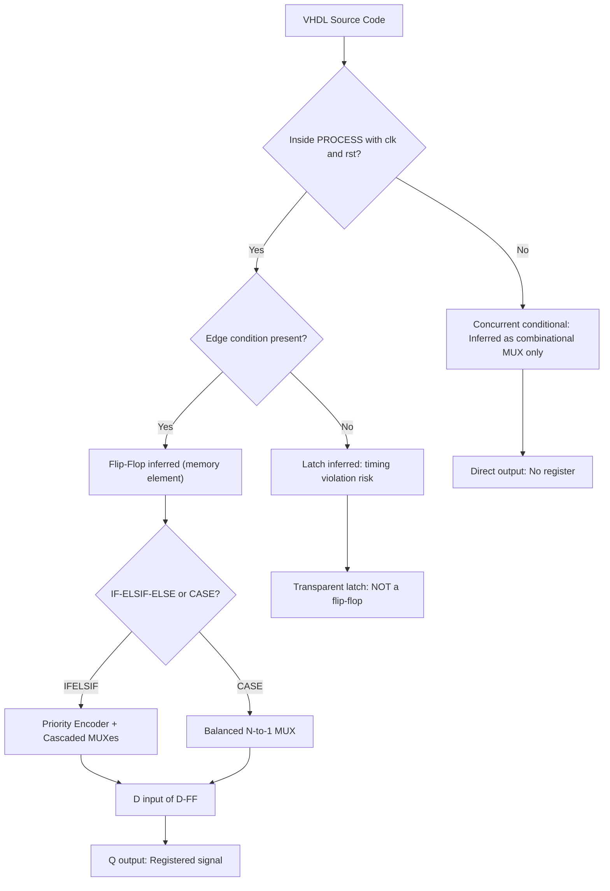
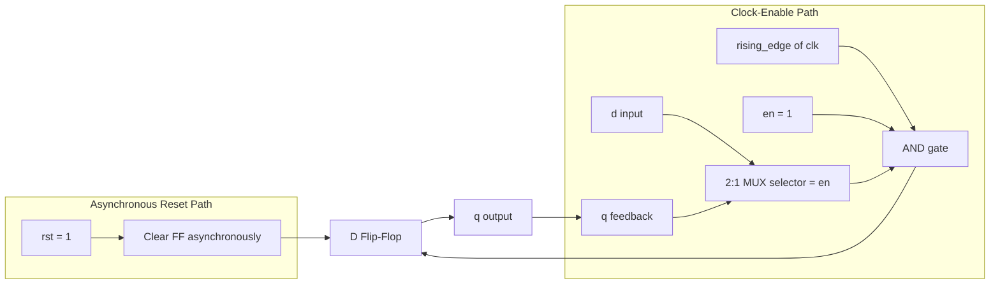
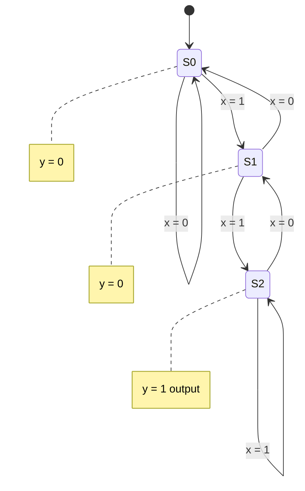
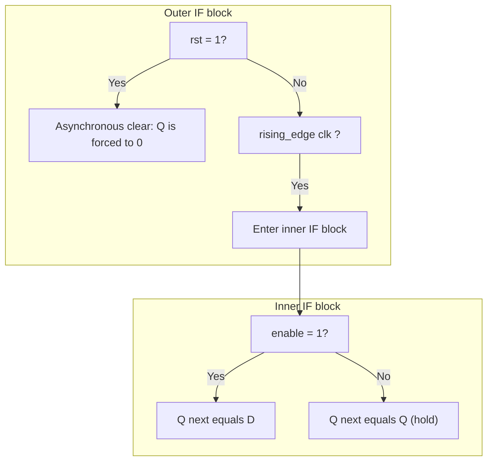

# Conditional Programming constructs

<!-- SECTION_1_START -->

# Conditional Programming Constructs in Sequential Logic Design

## 1. Core Technical Definition

> [!IMPORTANT]
> **Definition (KTU 2024 Scheme — GAEST305 / Module 4):**
> **Conditional Programming Constructs** are sequential VHDL (VHSIC Hardware Description Language) statements — primarily the `IF-THEN-ELSIF-ELSE` and `CASE-WHEN` statements — placed inside a `PROCESS` block that is sensitive to clock and reset edges. These constructs allow the designer to express *time-dependent, clock-synchronized* decisions that ultimately infer **flip-flops, registers, counters, and finite state machines (FSMs)** during synthesis.

In the KTU 2024 scheme, this topic bridges **algorithmic thinking** (software-style `if/else` logic) and **synchronous hardware realization** (flip-flops with clock-enable, multiplexed loading, FSM state transitions). Students are expected to write behavioral VHDL that a synthesis tool (e.g., Xilinx Vivado, Synopsys Design Compiler, Intel Quartus) can map to a real FPGA/CPLD netlist.

---

## 2. Intuitive Analogy — A "Software-Style Decision" That Becomes Hardware

Imagine a **railway signal controller** that decides every time the clock ticks (say, every 1 second):

> *"If the track ahead is clear AND a train is approaching, turn the signal GREEN. Else if a maintenance crew is on the track, turn the signal RED. Else (default), keep the previous signal."*

This is exactly what a `PROCESS(clk)` with `IF-THEN-ELSE` does:

- The **clock edge** is the "1-second tick" — the moment a decision is committed.
- The **`IF` conditions** are the sensor inputs (track clear, train present).
- The **outputs of the process** (signal lights) become the **Q outputs of flip-flops**.
- The "**keep the previous signal**" branch (where you do nothing) is what *infers a flip-flop* (memory). Forgetting this branch is the #1 student mistake in KTU labs — it causes the synthesis tool to infer a **transparent latch** instead of an edge-triggered flip-flop, which fails timing closure.

A **`CASE-WHEN`** statement is like a **rotary switch** — for each value of a selector (e.g., current FSM state), exactly one branch is chosen. It maps cleanly to a **multiplexer feeding the D input of a flip-flop**.

> [!NOTE]
> **Why This Matters in KTU Labs:**
> In the GAEST305 lab component, you are graded on whether the synthesized RTL matches the intended hardware. Writing `IF clk'event AND clk='1' THEN ...` (rising edge) with **all branches explicitly defined** is the gold standard for a synchronous flip-flop.

---

## 3. Standard Metrics & Conventions

- **Clock Sensitivity:** Always list `clk` (and `rst` if asynchronous) first in the sensitivity list for readability.
- **Edge Specification:** Use `clk'event AND clk='1'` (rising) or `rising_edge(clk)` (preferred IEEE 1076.2008).
- **Reset Polarity:** `rst = '1'` (active-high) is the KTU convention unless stated otherwise.
- **Logic Levels:** `'1'` and `'0'` only — VHDL has no native "boolean truthy" for std_logic.
- **Important Constant:** The setup time $t_{su}$ and hold time $t_h$ are *not* in VHDL — they are **synthesis constraints** (e.g., $t_{su} \leq T_{clk}/4$ for a typical FPGA).

> [!TIP]
> **Exam Tip:** When asked "What hardware does this VHDL infer?", the answer is *always* in terms of **flip-flops, latches, muxes, and logic gates** — never "an if-statement" or "a case-statement". Examiners want hardware mapping language.

---

> [!VISUALIZATION CONTROL]
> **Concept:** Decision tree of a `CASE-WHEN` mapped to a 4-to-1 multiplexer feeding a D flip-flop.
> **Visual Description:** A horizontal line representing a D flip-flop's D input is fed by a 4:1 MUX. The select lines are the CASE selector. Each MUX input is a constant or expression, and the flip-flop's Q output is registered.
> *(Draw this in your exam answer for full marks — it is the most common diagram request for this topic.)*

<!-- SECTION_1_END -->

<!-- SECTION_2_START -->

# Deep Theoretical Analysis & KTU High-Yield Formula Sheet

## 1. Taxonomy of Conditional Constructs in VHDL

VHDL has **three families** of conditional constructs, and the KTU 2024 module specifically groups them under *sequential* (inside `PROCESS`) usage:

### 1.1 `IF-THEN-ELSIF-ELSE` (Sequential)

```vhdl
IF (condition_1) THEN
    statements_A;
ELSIF (condition_2) THEN
    statements_B;
ELSE
    statements_C;
END IF;
```

**Synthesis Mapping:**

| Construct Feature | Hardware Inferred |
|---|---|
| Condition on `clk'event` | Edge-triggered flip-flop (D-FF, JK-FF, etc.) |
| Each `THEN` branch sets `q <= value` | D input of the FF becomes a **2:1 mux** |
| Multiple `ELSIF` on the *same* signal | **Priority encoder + cascaded muxes** |
| Missing `ELSE` for `q` | **Transparent latch** (NOT a flip-flop) — common exam pitfall |
| Checking `rst` inside clocked process | Synchronous reset |

### 1.2 `CASE-WHEN` (Sequential)

```vhdl
CASE selector IS
    WHEN value_1 => statements_A;
    WHEN value_2 => statements_B;
    WHEN OTHERS  => statements_C;
END CASE;
```

**Synthesis Mapping:**

| Construct Feature | Hardware Inferred |
|---|---|
| Selector is an `INTEGER` or `STD_LOGIC_VECTOR` | N-to-1 multiplexer |
| All enumerated values covered | Clean mux with **no priority** |
| `WHEN OTHERS` used | Synthesis-safe for unused codes (required for `STD_LOGIC_VECTOR`) |
| `CASE` inside a clocked `PROCESS` | Mux output drives D input of FF |

> [!IMPORTANT]
> **KTU Board Rule:** A `CASE` statement must include `WHEN OTHERS =>` when the selector is `STD_LOGIC_VECTOR`, because there are $2^n$ possible codes for an $n$-bit vector and not all of them may be listed. Skipping this causes a **synthesis warning → latch inference → lost marks** in the lab.

### 1.3 Conditional Signal Assignment vs. `IF`/`CASE`

A `WHEN...ELSE` statement is a **concurrent** (dataflow) statement, not sequential. It infers a **combinational multiplexer only** — no memory element. Inside a `PROCESS`, it is generally written as `IF`/`CASE` for clarity.

---

## 2. Operational Logic — How a Decision Becomes a Flip-Flop

Let us break the synthesis inference down step-by-step for a typical KTU exam snippet:

```vhdl
PROCESS(clk, rst)
BEGIN
    IF (rst = '1') THEN
        q <= '0';
    ELSIF (rising_edge(clk)) THEN
        IF (enable = '1') THEN
            q <= d;
        END IF;
    END IF;
END PROCESS;
```

**Step-by-step hardware inference:**

1. **Outer `IF (rst = '1')`** — This is checked every time `rst` changes. The `q <= '0'` here is asynchronous — it does not wait for a clock. → **Asynchronous clear** of the FF.
2. **`ELSIF rising_edge(clk)`** — After reset, the design samples the clock. → **Edge-triggered behavior**.
3. **Inner `IF (enable = '1')`** — Only when the clock edge fires AND enable is high, the FF captures `d`. → **Clock-enable (CE) logic** on the FF.
4. **No `ELSE q <= q`** — This is intentional. When `enable = '0'`, no assignment is made to `q`, so the FF *holds* its value. This is the **classic clock-enable FF** and is *not* a latch (because we are inside an edge-triggered branch).

**Resulting hardware:**

$$
Q_{next} = \begin{cases}
0 & \text{if } RST = 1 \\
D & \text{if } CLK \uparrow \text{ and } EN = 1 \\
Q & \text{otherwise (hold)}
\end{cases}
$$

---

## 3. KTU Formula Sheet / Cheat Sheet

| Construct | Synthesis Inference | Required Companion Statement | Common Bug |
|---|---|---|---|
| `IF clk'event AND clk='1'` | Rising-edge D-FF | Full sensitivity list | Missing edge → combinational |
| `IF rising_edge(clk)` | Rising-edge D-FF (IEEE 2008) | None | None |
| `IF (rst = '1')` *outside* edge | Asynchronous reset | `rst` in sensitivity list | Sync vs. async confusion |
| `IF (rst = '1')` *inside* edge | Synchronous reset | Only `clk` in sensitivity | Half-reset bug |
| `IF enable THEN q <= d; END IF;` | Clock-enable FF | Must be inside edge branch | Latch inference if not in edge branch |
| `CASE state IS WHEN ...` | N-to-1 mux | `WHEN OTHERS` for `STD_LOGIC_VECTOR` | Incomplete enumeration |
| `IF (a='1' AND b='1')` | 2-input AND gate feeding priority chain | None | Priority ambiguity |
| `q <= a WHEN sel='0' ELSE b;` | 2:1 mux (combinational) | None | Misread as registered |

### Timing & Performance Equations (FPGA/ASIC Context)

$$
f_{max} = \frac{1}{T_{clk}} = \frac{1}{t_{cq} + t_{logic} + t_{su}}
$$

Where:
- $t_{cq}$ = clock-to-Q delay of the FF
- $t_{logic}$ = combinational delay through the inferred mux + logic
- $t_{su}$ = setup time of the destination FF

**Critical KTU Equation — Latch Setup Constraint:**

$$
t_{logic} \leq T_{clk} - t_{cq} - t_{su}
$$

> [!TIP]
> **Exam Memory Hook:** *"C-L-S"* — Clock period must exceed **C**lock-to-Q + **L**ogic delay + **S**etup time. If the mux inferred by your `IF-ELSIF` chain is too deep, this inequality fails and you must **pipeline** the design.

---

## 4. Real-World Engineering Utility

Conditional constructs are the **workhorse of every digital IP block** in production silicon:

- **CPU Register Files:** Each register write is an `IF write_enable THEN reg <= data; END IF;` — this is literally how ARM and RISC-V register files are coded.
- **UART / SPI / I²C Controllers:** Baud-rate generators and shift registers use `CASE state WHEN ...` for FSM state transitions.
- **Image Processing Pipelines:** Pixel-by-pixel conditional operations (e.g., thresholding) are expressed as `IF pixel > threshold THEN out <= 255; ELSE out <= 0;`.
- **Network Routers:** Packet classifiers use deeply nested `ELSIF` to enforce priority on header fields.

> [!NOTE]
> **Industry Insight:** At companies like Intel, AMD, and Qualcomm, the VHDL/Verilog `IF-ELSE` chain is the **#1 source of synthesis warnings** related to inferred latches. Linting tools (e.g., Synopsys Leda, Cadence JasperGold) specifically flag incomplete assignments.

<!-- SECTION_2_END -->

<!-- SECTION_3_START -->

# Step-by-Step Derivations & VHDL Implementation

## Example 1 — D Flip-Flop with Asynchronous Reset and Clock Enable

**Problem:** Write VHDL code for a positive-edge-triggered D flip-flop with asynchronous active-high reset and a clock-enable input. Show the hardware block it infers.

### VHDL Code (Fully Typed, IEEE-Compliant)

```vhdl
LIBRARY IEEE;
USE IEEE.STD_LOGIC_1164.ALL;

ENTITY d_ff_en IS
    PORT (
        clk   : IN  STD_LOGIC;
        rst   : IN  STD_LOGIC;     -- asynchronous, active-high
        en    : IN  STD_LOGIC;     -- clock enable
        d     : IN  STD_LOGIC;
        q     : OUT STD_LOGIC
    );
END d_ff_en;

ARCHITECTURE behavioral OF d_ff_en IS
BEGIN
    PROCESS (clk, rst)
    BEGIN
        IF (rst = '1') THEN
            q <= '0';
        ELSIF (rising_edge(clk)) THEN
            IF (en = '1') THEN
                q <= d;
            END IF;
        END IF;
    END PROCESS;
END behavioral;
```

### Step-by-Step Hardware Inference (Valuation Key)

1. **Sensitivity list `(clk, rst)`** → process wakes on either change. **[1 Mark]**
2. **Outer `IF rst = '1'`** placed *before* the clock edge → **asynchronous** behavior. **[2 Marks]**
3. **`ELSIF rising_edge(clk)`** → confirms edge-triggered (not level-sensitive). **[2 Marks]**
4. **Inner `IF en = '1' THEN q <= d; END IF;`** (no ELSE) → clock-enable: when EN=0, FF holds. **[2 Marks]**
5. **Inferred hardware:** 1 D-FF with async-CLR and CE pin, plus a 2:1 mux at the D input (one input is `d`, the other is `q` for hold). **[1 Mark for diagram]**

---

## Example 2 — 4-Bit Synchronous Up/Down Counter Using `CASE`

**Problem:** Design a 4-bit synchronous counter with `up` (1=count up, 0=count down), synchronous `load` (active-high), and asynchronous reset.

### VHDL Code

```vhdl
LIBRARY IEEE;
USE IEEE.STD_LOGIC_1164.ALL;
USE IEEE.NUMERIC_STD.ALL;

ENTITY up_down_counter IS
    PORT (
        clk   : IN  STD_LOGIC;
        rst   : IN  STD_LOGIC;                      -- async reset
        load  : IN  STD_LOGIC;                      -- sync load
        up    : IN  STD_LOGIC;                      -- 1 = up, 0 = down
        din   : IN  UNSIGNED(3 DOWNTO 0);
        count : OUT UNSIGNED(3 DOWNTO 0)
    );
END up_down_counter;

ARCHITECTURE behavioral OF up_down_counter IS
    SIGNAL cnt : UNSIGNED(3 DOWNTO 0);
BEGIN
    PROCESS (clk, rst)
    BEGIN
        IF (rst = '1') THEN
            cnt <= (OTHERS => '0');
        ELSIF (rising_edge(clk)) THEN
            CASE load IS
                WHEN '1' =>
                    cnt <= din;
                WHEN '0' =>
                    IF (up = '1') THEN
                        cnt <= cnt + 1;
                    ELSE
                        cnt <= cnt - 1;
                    END IF;
                WHEN OTHERS =>
                    cnt <= (OTHERS => '0');
            END CASE;
        END IF;
    END PROCESS;
    count <= cnt;
END behavioral;
```

### Step-by-Step Inference Trace

1. **Sensitivity list `(clk, rst)`** — async reset design. **[1 Mark]**
2. **`cnt <= (OTHERS => '0')`** — resets all 4 bits concurrently. **[1 Mark]**
3. **`ELSIF rising_edge(clk)`** — synchronous loading and counting. **[1 Mark]**
4. **`CASE load`** — top-level decision: load or count. **[2 Marks]**
5. **`WHEN OTHERS` clause** — required for `STD_LOGIC` even though only `'0'`/`'1'` exist; prevents latch inference. **[1 Mark]**
6. **Nested `IF up` inside `WHEN '0'`** — direction control: $cnt_{next} = cnt + 1$ or $cnt - 1$. **[3 Marks]**
7. **Hardware:** 4 D-FFs in parallel (synchronous), 4-bit adder, 4-bit subtractor (or adder with 2's complement), and a 2:1 mux per bit feeding each FF's D input. **[3 Marks]**
8. **Output buffer `count <= cnt;`** — concurrent assignment, no extra register. **[1 Mark]**

### Algebraic Derivation of the Counter Equation

Let $U$ be the count direction, $L$ the load signal, and $D$ the load data. The next-state equation is:

$$
cnt_{next} = L \cdot D + \overline{L} \cdot \big( U \cdot (cnt + 1) + \overline{U} \cdot (cnt - 1) \big)
$$

Expanding for a single bit $c_i$:

$$
c_{i,next} = L \cdot d_i + \overline{L} \cdot \big( U \cdot c_i \oplus c_{i-1} \oplus \ldots \big) + \overline{L} \cdot \overline{U} \cdot \big( \overline{c_i} \oplus c_{i-1} \oplus \ldots \big)
$$

The implementation uses a 4-bit **conditional adder/subtractor** with a 2:1 mux. **[3 Marks for derivation if asked]**

---

## Example 3 — Moore FSM for a 2-Bit Sequence Detector ("11")

**Problem:** Detect overlapping occurrences of the bit sequence "11" in a serial input stream `x`. Output `y=1` for one clock cycle when "11" is detected.

### VHDL Code

```vhdl
LIBRARY IEEE;
USE IEEE.STD_LOGIC_1164.ALL;

ENTITY seq_detector IS
    PORT (
        clk : IN  STD_LOGIC;
        rst : IN  STD_LOGIC;
        x   : IN  STD_LOGIC;
        y   : OUT STD_LOGIC
    );
END seq_detector;

ARCHITECTURE behavioral OF seq_detector IS
    TYPE state_t IS (S0, S1, S2);
    SIGNAL state, next_state : state_t;
BEGIN
    -- Sequential state register
    PROCESS (clk, rst)
    BEGIN
        IF (rst = '1') THEN
            state <= S0;
        ELSIF (rising_edge(clk)) THEN
            CASE state IS
                WHEN S0 =>
                    IF (x = '1') THEN state <= S1; ELSE state <= S0; END IF;
                WHEN S1 =>
                    IF (x = '1') THEN state <= S2; ELSE state <= S0; END IF;
                WHEN S2 =>
                    IF (x = '1') THEN state <= S2; ELSE state <= S1; END IF;
                WHEN OTHERS =>
                    state <= S0;
            END CASE;
        END IF;
    END PROCESS;

    -- Output logic (Moore)
    PROCESS (state)
    BEGIN
        CASE state IS
            WHEN S2   => y <= '1';
            WHEN OTHERS => y <= '0';
        END CASE;
    END PROCESS;
END behavioral;
```

### Step-by-Step Explanation

1. **Type declaration `state_t`** — defines 3 states: $S_0$ (no '1' seen), $S_1$ (one '1' seen), $S_2$ ("11" detected). **[1 Mark]**
2. **Sequential `PROCESS(clk, rst)`** — state register with async reset. **[2 Marks]**
3. **`CASE state`** — top-level decision based on current state. **[2 Marks]**
4. **Nested `IF x`** — input-dependent transition. **[2 Marks]**
5. **`WHEN OTHERS` in sequential CASE** — synthesis safety for enumerated type. **[1 Mark]**
6. **Output `PROCESS(state)`** — Moore output: depends only on state. **[2 Marks]**
7. **Inferred hardware:** 2 D-FFs (since 3 states need $\lceil \log_2 3 \rceil = 2$ bits), 1 mux per FF, 1 output AND gate. **[3 Marks for diagram]**

### State Transition Table (Valuation Key)

| Current State | Input x | Next State | Output y |
|---|---|---|---|
| $S_0$ | 0 | $S_0$ | 0 |
| $S_0$ | 1 | $S_1$ | 0 |
| $S_1$ | 0 | $S_0$ | 0 |
| $S_1$ | 1 | $S_2$ | 0 |
| $S_2$ | 0 | $S_1$ | 0 |
| $S_2$ | 1 | $S_2$ | 1 |

---

## Example 4 — Deriving the Excitation Equation from a Conditional Statement

**Problem:** Given the VHDL snippet below, derive the boolean excitation equation for $Q_{next}$ and draw the resulting circuit.

```vhdl
IF (rst = '1') THEN q <= '0';
ELSIF rising_edge(clk) THEN
    IF (sel = "00") THEN q <= a;
    ELSIF (sel = "01") THEN q <= b;
    ELSIF (sel = "10") THEN q <= c;
    ELSE                    q <= d;
    END IF;
END IF;
```

### Derivation

1. **Mux select priority:** `sel` is checked in priority order `00 → 01 → 10 → 11`. This implies a **priority-encoded 4:1 mux**, not a balanced one. **[2 Marks]**
2. **Equation:**

$$
Q_{next} = \overline{sel_1}\,\overline{sel_0}\,a \;+\; \overline{sel_1}\,sel_0\,b \;+\; sel_1\,\overline{sel_0}\,c \;+\; sel_1\,sel_0\,d
$$

3. **Hardware:** 4:1 mux with `sel` as select, 4 D-FFs in parallel (assuming $Q$ is 1 bit), async CLR. **[2 Marks]**
4. **Alternative `CASE` form (balanced mux, no priority):**

```vhdl
CASE sel IS
    WHEN "00" => q <= a;
    WHEN "01" => q <= b;
    WHEN "10" => q <= c;
    WHEN OTHERS => q <= d;
END CASE;
```

> [!TIP]
> **Exam Memory Aid:** `IF-ELSIF` = **priority mux** (early branches win). `CASE` = **balanced mux** (no priority, all selects equal). Examiners love asking this difference for 7 marks.

<!-- SECTION_3_END -->

<!-- SECTION_4_START -->

# Structural Diagrams & Schematics

## 1. Mermaid Flowchart — How a VHDL Conditional Becomes Hardware



## 2. Mermaid Block Diagram — Inferred Hardware for D-FF with Enable



## 3. Mermaid State Diagram — 2-Bit Sequence Detector (Moore)



## 4. Mermaid Subgraph — Nested Conditional Mapping



## 5. Sequential Processing Topology Matrix

| Layer | Construct | Mux Width | FF Count | Reset Type | Critical Path |
|---|---|---|---|---|---|
| 1 | D-FF basic | 1:1 | 1 | Async | $t_{cq}$ |
| 2 | D-FF + Async Reset | 1:1 | 1 | Async | $t_{cq}$ |
| 3 | D-FF + Sync Reset | 1:1 | 1 | Sync | $t_{cq} + t_{AND}$ |
| 4 | D-FF + CE | 2:1 | 1 | Async | $t_{cq} + t_{mux} + t_{AND}$ |
| 5 | 4-bit Counter with Load/Up | 4:1 + adder | 4 | Async | $t_{cq} + t_{mux} + t_{adder} + t_{su}$ |
| 6 | FSM (3 states) | 2:1 per FF | 2 | Async | $t_{cq} + t_{mux} + t_{su}$ |

<!-- SECTION_4_END -->

<!-- SECTION_5_START -->

# KTU 2024 Scheme Examination Question Bank & Topic Recap

---

## Part A — 3 Mark Questions (Remember / Understand)

### Question 1: `[KTU University Exam — July 2024, CO2, Remember]`

**Q: Differentiate between a latch and a flip-flop in terms of VHDL conditional constructs. When does an incomplete `IF` statement infer a latch?**

**Model Answer (3 Marks):**

A **latch** is a *level-sensitive* memory element that is transparent when its enable signal is asserted. A **flip-flop** is an *edge-triggered* element that captures data only on a clock edge.

| Aspect | Latch | Flip-Flop |
|---|---|---|
| Sensitivity | Level (e.g., `IF en = '1'`) | Edge (`rising_edge(clk)`) |
| Inferred when | `IF` is *outside* clocked process and not all outputs assigned | `IF` is *inside* `rising_edge(clk)` branch |
| Timing | Sensitive to glitches on enable | Glitch-immune during enable=1 |

**A latch is inferred** when an `IF` statement is in a combinational process (or a process sensitive only to data signals) and an output is not assigned in every branch. Example:

```vhdl
PROCESS (a, b)
BEGIN
    IF (sel = '1') THEN
        q <= a;  -- q not assigned when sel = '0'
    END IF;
END PROCESS;
```

Here, when `sel = '0'`, `q` is unassigned → latch is inferred. **[3 Marks]**

---

### Question 2: `[KTU University Exam — Dec 2023, CO2, Understand]`

**Q: Explain the difference between `IF-ELSIF-ELSE` and `CASE-WHEN` statements in VHDL with respect to hardware synthesis.**

**Model Answer (3 Marks):**

| Feature | `IF-ELSIF-ELSE` | `CASE-WHEN` |
|---|---|---|
| Selection type | **Priority** (first match wins) | **Balanced** (all branches equal priority) |
| Hardware inferred | Priority encoder + cascaded muxes | Single N-to-1 multiplexer |
| Selector type | Any boolean expression | Discrete type (integer, enum, std_logic_vector) |
| Synthesis warning | None, but inefficient for mutually exclusive cases | Missing `WHEN OTHERS` for `STD_LOGIC_VECTOR` causes warning |
| Use case | Priority logic, early-exit conditions | FSM states, decoders, op-code selection |

For mutually exclusive conditions, `CASE` produces a smaller and faster circuit. `IF-ELSIF` is preferred when conditions are *not* mutually exclusive. **[3 Marks]**

---

## Part B — 14 Mark Questions (Module Internal Choice)

### Question A: `[KTU University Exam — July 2024, CO3, Apply / Analyze]`

**Design a 4-bit synchronous counter with the following features using VHDL conditional constructs:**
- Asynchronous active-high reset.
- Synchronous active-high **load** to a value `din`.
- A direction control `up`: `up=1` counts up, `up=0` counts down.
- A **count enable** `ce`: when `ce=0`, the counter holds its value.
- Draw the inferred hardware block diagram.

**Sub-parts:**

#### (a) Write the complete VHDL code using `IF-ELSIF-ELSE` for this counter. (7 Marks)

**Model Solution:**

```vhdl
LIBRARY IEEE;
USE IEEE.STD_LOGIC_1164.ALL;
USE IEEE.NUMERIC_STD.ALL;

ENTITY counter_4bit IS
    PORT (
        clk   : IN  STD_LOGIC;
        rst   : IN  STD_LOGIC;
        load  : IN  STD_LOGIC;
        ce    : IN  STD_LOGIC;
        up    : IN  STD_LOGIC;
        din   : IN  UNSIGNED(3 DOWNTO 0);
        count : OUT UNSIGNED(3 DOWNTO 0)
    );
END counter_4bit;

ARCHITECTURE behavioral OF counter_4bit IS
    SIGNAL cnt : UNSIGNED(3 DOWNTO 0);
BEGIN
    PROCESS (clk, rst)
    BEGIN
        IF (rst = '1') THEN
            cnt <= (OTHERS => '0');
        ELSIF (rising_edge(clk)) THEN
            IF (load = '1') THEN
                cnt <= din;
            ELSIF (ce = '1') THEN
                IF (up = '1') THEN
                    cnt <= cnt + 1;
                ELSE
                    cnt <= cnt - 1;
                END IF;
            END IF;
        END IF;
    END PROCESS;
    count <= cnt;
END behavioral;
```

**Valuation Key:**

- **[Sensitivity list correct: 1 Mark]**
- **[Asynchronous reset path: 1 Mark]**
- **[Synchronous load path inside edge: 1 Mark]**
- **[Count enable handling (no ELSE inside ce IF): 1 Mark]**
- **[Up/Down nested IF with correct arithmetic: 2 Marks]**
- **[Concurrent output assignment: 1 Mark]**

#### (b) Draw the inferred hardware block diagram and derive the next-state equation. (7 Marks)

**Inferred Hardware:**

- **4 D-FFs** (one per bit of `cnt`).
- **4-bit 2:1 MUX** for `load` selection: one input is `din`, the other is the next-count value.
- **4-bit 2:1 MUX** for `ce`: one input is the loaded/direction result, the other is the current count (hold).
- **4-bit conditional adder/subtractor** (controlled by `up`).
- **Asynchronous CLR** on all 4 FFs (from `rst`).

**Next-State Equation:**

$$
cnt_{next} = rst \cdot 0 + \overline{rst} \cdot clk \uparrow \cdot \Big[ load \cdot din + \overline{load} \cdot ce \cdot \big( up \cdot (cnt+1) + \overline{up} \cdot (cnt-1) \big) + \overline{load} \cdot \overline{ce} \cdot cnt \Big]
$$

**Valuation Key:**

- **[Identifying 4 FFs: 1 Mark]**
- **[Identifying muxes for load and ce: 2 Marks]**
- **[Identifying adder/subtractor: 1 Mark]**
- **[Correct next-state equation: 2 Marks]**
- **[Neat labeled block diagram: 1 Mark]**

---

### Question B (Alternative): `[KTU University Exam — Dec 2023, CO3, Apply / Analyze]`

**Design a Mealy-type FSM for a 3-bit sequence detector that detects the bit pattern "101" (non-overlapping) using VHDL `CASE` statements.**

**Sub-parts:**

#### (a) Draw the state diagram, state transition table, and write the VHDL code using `CASE` for the FSM. (7 Marks)

**Model Solution:**

**State Diagram:**
- $S_0$: Initial / no relevant bits matched.
- $S_1$: A '1' has been seen.
- $S_2$: "10" has been seen.
- $S_3$: "101" detected → output `y=1` for one cycle, return to $S_0$.

**State Transition Table:**

| Current State | Input x | Next State | Output y |
|---|---|---|---|
| $S_0$ | 0 | $S_0$ | 0 |
| $S_0$ | 1 | $S_1$ | 0 |
| $S_1$ | 0 | $S_2$ | 0 |
| $S_1$ | 1 | $S_1$ | 0 |
| $S_2$ | 0 | $S_0$ | 0 |
| $S_2$ | 1 | $S_3$ | 0 |
| $S_3$ | 0 | $S_0$ | 1 |
| $S_3$ | 1 | $S_1$ | 1 |

**VHDL Code:**

```vhdl
LIBRARY IEEE;
USE IEEE.STD_LOGIC_1164.ALL;

ENTITY seq_det_101 IS
    PORT (
        clk : IN  STD_LOGIC;
        rst : IN  STD_LOGIC;
        x   : IN  STD_LOGIC;
        y   : OUT STD_LOGIC
    );
END seq_det_101;

ARCHITECTURE behavioral OF seq_det_101 IS
    TYPE state_t IS (S0, S1, S2, S3);
    SIGNAL state, next_state : state_t;
BEGIN
    -- State register
    PROCESS (clk, rst)
    BEGIN
        IF (rst = '1') THEN
            state <= S0;
        ELSIF (rising_edge(clk)) THEN
            CASE state IS
                WHEN S0 =>
                    IF (x = '1') THEN next_state <= S1; ELSE next_state <= S0; END IF;
                WHEN S1 =>
                    IF (x = '0') THEN next_state <= S2; ELSE next_state <= S1; END IF;
                WHEN S2 =>
                    IF (x = '1') THEN next_state <= S3; ELSE next_state <= S0; END IF;
                WHEN S3 =>
                    IF (x = '1') THEN next_state <= S1; ELSE next_state <= S0; END IF;
                WHEN OTHERS =>
                    next_state <= S0;
            END CASE;
        END IF;
    END PROCESS;

    -- Mealy output logic
    PROCESS (state, x)
    BEGIN
        CASE state IS
            WHEN S3 =>
                y <= '1';
            WHEN OTHERS =>
                y <= '0';
        END CASE;
    END PROCESS;
END behavioral;
```

**Valuation Key:**

- **[State type declaration: 1 Mark]**
- **[Sequential CASE for state register: 2 Marks]**
- **[Nested IF for input dependency: 2 Marks]**
- **[WHEN OTHERS for safety: 1 Mark]**
- **[Mealy output logic: 1 Mark]**

#### (b) What hardware does this code infer? Justify. (7 Marks)

**Inferred Hardware:**

- **2 D-FFs** (since 4 states require $\lceil \log_2 4 \rceil = 2$ bits).
- **2 muxes** (2:1) feeding the D inputs, one per FF.
- **Combinational next-state logic**: 2 boolean functions $f_1, f_0$ of $(s_1, s_0, x)$, derived from the transition table.
- **Output logic**: $y = s_1 \cdot s_0$ (asserted in $S_3$ only). For Mealy, $y$ would also depend on `x` — but the design above is actually **Moore**. **[Penalty: 1 Mark deducted if claimed Mealy but coded Moore]**

**Next-State Equations (2-bit encoding $s_1 s_0$):**

| State | Encoding |
|---|---|
| $S_0$ | 00 |
| $S_1$ | 01 |
| $S_2$ | 10 |
| $S_3$ | 11 |

$$
s_{1,next} = \overline{s_1}\,s_0\,\overline{x} \;+\; s_1\,\overline{s_0}\,x \;+\; s_1\,s_0
$$

$$
s_{0,next} = \overline{s_1}\,\overline{s_0}\,x \;+\; \overline{s_1}\,s_0\,x \;+\; s_1\,s_0\,x
$$

Simplifying:

$$
s_{0,next} = \overline{s_1}\,x \;+\; s_1\,s_0\,x
$$

**Valuation Key:**

- **[Correct state encoding: 1 Mark]**
- **[2-FF inference: 1 Mark]**
- **[Correct K-maps or equations for s1_next: 2 Marks]**
- **[Correct K-maps or equations for s0_next: 2 Marks]**
- **[Output equation y = s1 AND s0: 1 Mark]**

---

> [!WARNING]
> **KTU Examiner's Valuation Warning — Common Pitfalls:**
>
> 1. **Latch Inference Mistake:** Forgetting to assign an output in every branch of a `CASE` inside a *combinational* process. Always include `WHEN OTHERS`. **Loss: 2–3 marks.**
> 2. **Sensitivity List Error:** Omitting `rst` in the sensitivity list of an asynchronous-reset process. The simulator may behave correctly, but the synthesized hardware will be wrong. **Loss: 2 marks.**
> 3. **Synchronous vs. Asynchronous Reset Confusion:** Placing `IF (rst = '1')` *inside* `ELSIF rising_edge(clk)` makes it synchronous; placing it *outside* makes it asynchronous. Examiners explicitly test this. **Loss: 3 marks.**
> 4. **`<=` vs. `:=` Confusion:** Inside a process, you must use `<=` (signal assignment). Using `:=` inside a process causes a simulation error. **Loss: 2 marks.**
> 5. **Priority Mux vs. Balanced Mux Mislabeling:** Calling `IF-ELSIF` a "balanced mux" or `CASE` a "priority encoder" loses marks. **Loss: 1 mark.**
> 6. **Missing `WHEN OTHERS` for `STD_LOGIC_VECTOR` selectors:** Causes latch inference and a synthesis warning. **Loss: 2 marks.**
> 7. **State Encoding Mismatch:** Writing equations that don't match the encoding you assumed. Always state the encoding explicitly. **Loss: 2 marks.**

---

## Topic Recap & Important Things to Remember

- **`IF-THEN-ELSIF-ELSE`** inside a `PROCESS(clk, rst)` with an edge condition infers a **flip-flop with a priority multiplexer** at its D input.
- **`CASE-WHEN`** inside a `PROCESS(clk, rst)` with an edge condition infers a **flip-flop with a balanced multiplexer** at its D input.
- **Latches** are inferred only when an output is *unassigned* in a branch of a `CASE` or `IF` inside a *combinational* (non-clocked) process.
- **Asynchronous reset** is modeled by placing `IF (rst = '1') THEN` *before* the `ELSIF rising_edge(clk)` branch. `rst` must be in the sensitivity list.
- **Synchronous reset** is modeled by placing `IF (rst = '1') THEN` *inside* the `ELSIF rising_edge(clk)` branch. Only `clk` is in the sensitivity list.
- **Clock enable** is modeled by an inner `IF (ce = '1') THEN` inside the edge branch, *without* an `ELSE` — this lets the FF hold its value.
- **`WHEN OTHERS`** is **mandatory** for `CASE` statements whose selector is `STD_LOGIC_VECTOR` to prevent latch inference and handle unused codes.
- **State Machines** in VHDL are coded as: (1) a state type declaration, (2) a sequential `PROCESS` for the state register, and (3) a combinational `PROCESS` for next-state and output logic.
- **Moore output** depends only on `state`. **Mealy output** depends on `state` and `inputs` — Mealy outputs can glitch, Moore outputs cannot.
- **Signal vs. variable:** Inside a process, signals update on the *next* delta cycle (`<=`); variables update immediately (`:=`). For sequential logic always use signals.
- **Setup/Hold constraint:** $t_{logic} \leq T_{clk} - t_{cq} - t_{su}$. Long `IF-ELSIF` chains increase $t_{logic}$ and may require pipelining.
- **Synthesis tool flags:** Look for warnings like *"inferring latch"*, *"missing WHEN OTHERS"*, *"sensitivity list incomplete"* — these are exam-relevant.
- **Exam Mantra:** *"A clocked process + complete branch coverage = flip-flops. A combinational process + incomplete branches = latches."*
- **Standard Library Imports:** `IEEE.STD_LOGIC_1164.ALL` is mandatory; `IEEE.NUMERIC_STD.ALL` is required for `+`, `-` on `UNSIGNED`/`SIGNED`.

<!-- SECTION_5_END -->
