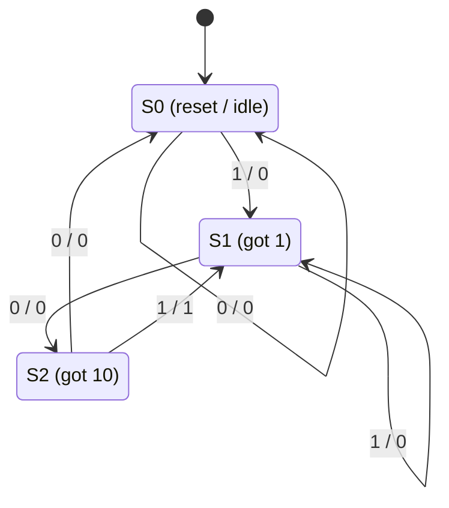
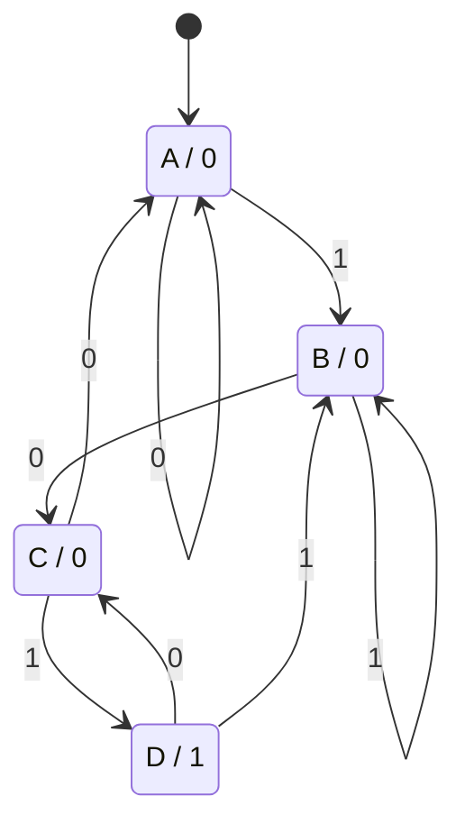
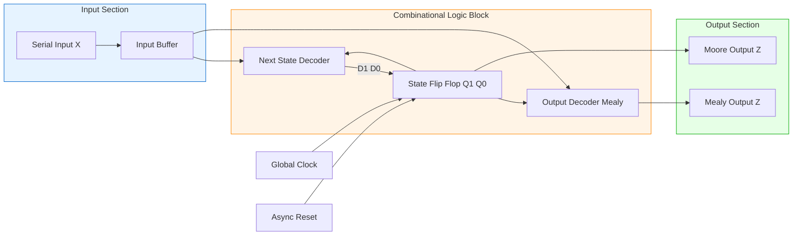
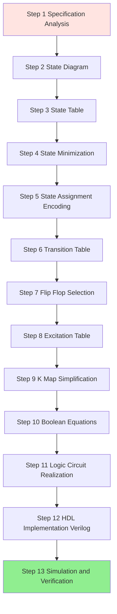

# Finite State Machines - logic synthesis for an FSM, FSM design process and design examples

<!-- SECTION_1_START -->
# Finite State Machines (FSM) - Logic Synthesis & Design Process

## 1.1 Formal Definition (KTU 2024 Syllabus Terminology)

A **Finite State Machine (FSM)** is a sequential logic circuit that exhibits a finite number of states and transitions between those states in response to a finite set of input symbols. The machine's behaviour is completely defined by:
- A finite set of **states** $S = \{S_0, S_1, \ldots, S_n\}$
- A finite set of **inputs** $I = \{I_0, I_1, \ldots, I_m\}$
- A finite set of **outputs** $O = \{O_0, O_1, \ldots, O_k\}$
- A **next-state function** $\delta: S \times I \rightarrow S$
- An **output function** $\lambda$ (Mealy: $\lambda: S \times I \rightarrow O$; Moore: $\lambda: S \rightarrow O$)

> [!IMPORTANT]
> **KTU Board Definition:** An FSM is a sequential circuit whose output depends not only on the present inputs but also on the past history of inputs, where "history" is abstracted into a finite number of internal states.

## 1.2 Conceptual Analogy / Intuition

Imagine a **vending machine** as a real-world FSM:
- **States** = the various modes the machine can be in (Idle, Coin Inserted, Item Selected, Dispensing, Out-of-Stock)
- **Inputs** = coins inserted, item buttons pressed
- **Outputs** = dispensed item, change returned, display messages
- **Transitions** = "If in Idle state and a ₹10 coin is inserted, move to Coin Inserted state"

Just as a vending machine "remembers" how much money you've inserted, an FSM **remembers** which state it is in using flip-flops. The total number of flip-flops required is $\lceil \log_2(\text{number of states}) \rceil$.

> [!NOTE]
> **Two Primary FSM Architectures:**
> - **Mealy Machine** — Output depends on the **present state AND the present input** (output is associated with the transition arrow).
> - **Moore Machine** — Output depends **only on the present state** (output is associated with the state bubble).

> [!TIP]
> **Quick Memory Hook:** *Mealy = "Maybe" dependent on input. Moore = "More" tied to state.*

## 1.3 Physical Constants & Standard Metrics

| Parameter | Standard Value / Rule |
|---|---|
| Minimum number of flip-flops | $\lceil \log_2(N) \rceil$, where $N$ = number of states |
| State encoding methods | Binary, Gray, One-Hot, Johnson |
| Maximum clock frequency | $f_{max} = \dfrac{1}{t_{pd_{FF}} + t_{pd_{combinational}} + t_{su}}$ |
| State transitions per clock | Exactly one (synchronous FSM) |

> [!VISUALIZATION CONTROL]
> **Concept:** Generic FSM State Diagram (Bubble-and-Arc Notation)
> **Mermaid / Desmos Equivalent Layout:** Use Mermaid `stateDiagram-v2` for state-arc geometry
> **Visual Description:** A directed graph with **circular nodes** representing states (labelled $S_0, S_1, S_2$) and **directed arcs** representing transitions (labelled `Input/Output` in Mealy, `Input` in Moore with output inside the bubble).
<!-- SECTION_1_END -->

<!-- SECTION_2_START -->
# Deep Theoretical Analysis & KTU High-Yield Formula Sheet

## 2.1 Classification of FSM

### A. Mealy Machine
- **Output function:** $O(t) = \lambda(S(t), I(t))$
- Output can change **asynchronously** with input changes (between clock edges).
- **Generally fewer states** required for the same task.
- **Output glitches** are possible since outputs are combinational functions of inputs.

### B. Moore Machine
- **Output function:** $O(t) = \lambda(S(t))$
- Output is **synchronous** — changes only on active clock edges.
- Output is **glitch-free** by construction.
- Usually requires **one extra state** compared to equivalent Mealy machine.

## 2.2 The KTU FSM Design Process (6-Step Canonical Procedure)

1. **Step 1 — Problem Statement & Word Description:** Carefully read the specification. Identify all input/output conditions, reset behaviour, and edge cases (overlapping/non-overlapping).
2. **Step 2 — State Diagram Construction:** Draw the bubble-and-arc diagram. For Mealy machines, label arcs as `Input/Output`. For Moore machines, write outputs inside the bubbles.
3. **Step 3 — State Table / State Transition Table:** Tabulate Present State, Input, Next State, and Output for every possible combination.
4. **Step 4 — State Minimization (Optional but Recommended):** Use the **partition refinement** method or **implication table (Paull-Unger)** to eliminate equivalent/redundant states.
5. **Step 5 — State Assignment (Encoding):** Assign unique binary codes to each state. Common methods:
   - **Sequential Binary** (0, 1, 10, 11, ...)
   - **Gray Code** (only one bit changes per transition — minimizes glitches)
   - **One-Hot** ($N$ states → $N$ flip-flops; one and only one flip-flop is HIGH)
6. **Step 6 — Flip-Flop Excitation Table & K-Map Simplification:** Choose flip-flop type (D, JK, T, or SR). Derive excitation values. Simplify using K-maps to obtain minimal SOP expressions for next-state and output logic.

> [!NOTE]
> **Why State Minimization Matters in KTU Exams:** Examiners often award 2–3 marks specifically for showing the partition refinement or implication table to prove state equivalence.

## 2.3 State Minimization Using Implication Table

Two states $S_i$ and $S_j$ are **equivalent** if:
- Their outputs are the same for every input, AND
- Their next states are equivalent for every input (recursive condition).

The implication table contains one square for every pair of states $(S_i, S_j)$ where $i < j$. Each square is filled with the next-state pairs that must be equivalent for the pair to be equivalent.

## 2.4 State Assignment Guidelines

| Method | Formula / Property | When to Use |
|---|---|---|
| **Sequential Binary** | $S_i = i$ in binary | Default; simplest analysis |
| **Gray Code** | Adjacent codes differ by 1 bit | Reduces output glitches during transitions |
| **One-Hot** | Bit $i$ = 1 $\Leftrightarrow$ state $S_i$ | FPGA implementation; faster decoding |
| **Johnson** | Last bit fed back inverted | Counter-like applications |

## 2.5 KTU Formula Cheat Sheet

> [!IMPORTANT]
> **The following table contains all high-yield formulas for FSM design problems in KTU 2024 Scheme ESE.**

| Concept | Formula / Rule | Unit / Notes |
|---|---|---|
| Number of flip-flops needed | $n = \lceil \log_2(N) \rceil$ | $N$ = number of states |
| One-hot encoding flip-flops | $n = N$ | One flip-flop per state |
| Mealy next-state | $S_{t+1} = \delta(S_t, I_t)$ | Boolean logic |
| Moore output | $O_t = \lambda(S_t)$ | Combinational |
| Mealy output | $O_t = \lambda(S_t, I_t)$ | Combinational |
| D-FF excitation | $D = Q_{next}$ | Direct assignment |
| JK-FF excitation | $J = q' \cdot Q_{next}$, $K = q \cdot Q_{next}'$ | Toggle when $J K = 1$ |
| T-FF excitation | $T = Q \oplus Q_{next}$ | Toggle when $T = 1$ |
| SR-FF excitation | $S = Q' \cdot Q_{next}$, $R = Q \cdot Q_{next}'$ | Reset/Set values |
| Output glitch (Mealy) | $t_{glitch} \leq t_{pd_{logic}}$ | Asynchronous output |
| Moore output delay | $t_{out} = t_{pd_{FF}} + t_{c \rightarrow q}$ | Synchronous |

> [!TIP]
> **Avoid Markdown Pipe Failures:** For absolute-value or "such that" expressions inside the table above, use $\vert$ or $\mid$ in LaTeX instead of raw `|` to preserve table formatting.

## 2.6 Real-World Engineering Utility

FSMs are the **backbone of digital control systems** in:
- **CPU control units** (instruction fetch-decode-execute cycles)
- **Communication protocols** (UART, SPI, I²C state engines)
- **Traffic light controllers**
- **Vending machines, elevators, washing machines**
- **Protocol-aware peripherals** in SoCs (e.g., DDR memory controllers)
- **Game AI and robotic behaviour trees**
- **Lexical analyzers and parsers in compilers**

> [!NOTE]
> Every modern digital IC you design will contain at least one FSM — knowing how to derive its Boolean equations and HDL code is a **core KTU employability skill** under CO1, CO2, and CO3 of GAEST305.
<!-- SECTION_2_END -->

<!-- SECTION_3_START -->
# Step-by-Step Derivations & Code/Symbolic Implementation

## 3.1 Canonical Worked Example — Mealy Sequence Detector for "101" (Overlapping)

### Problem Statement
Design a **Mealy machine** that detects the overlapping sequence **"101"** from a single serial input line $X$. The output $Z$ should go HIGH (1) **at the clock edge** at which the final '1' of the sequence is received.

### Step 1 — Identify States from the Problem
We trace the input stream and identify distinct memory conditions:

| Symbol | Meaning |
|---|---|
| $S_0$ | Initial / Reset state — no useful bits received |
| $S_1$ | The last received bit was '1' (could be the start of "101") |
| $S_2$ | The last two received bits were "10" |

After receiving "101", we can re-use $S_1$ (overlapping) since the final '1' can also be the start of a new "101".

### Step 2 — Draw the State Diagram (Mealy Format)

```
                    X/Z
        +-------+ -------> 0/0   +-------+
        |  S0   |               |  S0   |
        | (rst) | <------ 0/0 --+-------+
        +-------+
            | 1/0
            v
        +-------+               +-------+
        |  S1   | -- 0/0 ---->  |  S2   |
        | (got 1|               | (got  |
        |  sofar|<-- 1/0 --+    |  "10") |
        +-------+          |    +-------+
                          |         |
                          +---------+
                            (self-loop on 1/0)
```

For a cleaner representation, see **SECTION 4 — Mermaid Diagram**.

### Step 3 — Construct the State Table

| Present State | Input $X$ | Next State | Output $Z$ |
|:---:|:---:|:---:|:---:|
| $S_0$ | 0 | $S_0$ | 0 |
| $S_0$ | 1 | $S_1$ | 0 |
| $S_1$ | 0 | $S_2$ | 0 |
| $S_1$ | 1 | $S_1$ | 0 |
| $S_2$ | 0 | $S_0$ | 0 |
| $S_2$ | 1 | $S_1$ | 1 |

> [!NOTE]
> The output $Z = 1$ occurs **only** in the last row — when we are in $S_2$ (have seen "10") and the next input is '1', completing the "101" pattern.

### Step 4 — State Assignment (Binary Encoding)

Let $Q_1 Q_0$ be the two flip-flop outputs (since $N = 3$ states, we need $\lceil \log_2 3 \rceil = 2$ flip-flops):

| State | $Q_1$ | $Q_0$ |
|:---:|:---:|:---:|
| $S_0$ | 0 | 0 |
| $S_1$ | 0 | 1 |
| $S_2$ | 1 | 0 |
| (unused) | 1 | 1 |

### Step 5 — Build the Transition Table with Binary Codes

| $Q_1$ | $Q_0$ | $X$ | $Q_1^{+}$ | $Q_0^{+}$ | $Z$ |
|:---:|:---:|:---:|:---:|:---:|:---:|
| 0 | 0 | 0 | 0 | 0 | 0 |
| 0 | 0 | 1 | 0 | 1 | 0 |
| 0 | 1 | 0 | 1 | 0 | 0 |
| 0 | 1 | 1 | 0 | 1 | 0 |
| 1 | 0 | 0 | 0 | 0 | 0 |
| 1 | 0 | 1 | 0 | 1 | 1 |
| 1 | 1 | 0 | d | d | d |
| 1 | 1 | 1 | d | d | d |

Here $Q_1^{+}$ and $Q_0^{+}$ denote the next-state bits, and $d$ denotes don't-care conditions for the unused state $Q_1 Q_0 = 11$.

### Step 6 — Choose D Flip-Flops and Derive Excitation Table

For **D flip-flops**, excitation = next state, i.e. $D_1 = Q_1^{+}$ and $D_0 = Q_0^{+}$.

### Step 7 — K-Map Simplification for $D_1$

```
                Q1 Q0
              00  01  11  10
            +----+----+----+----+
        X=0 |  0 |  1 |  d |  0 |
            +----+----+----+----+
        X=1 |  0 |  0 |  d |  0 |
            +----+----+----+----+
```

Combining the '1' at $(Q_1 Q_0 = 01, X = 0)$ with the don't-cares:

$$
D_1 = Q_1' \cdot Q_0 \cdot X' \quad \text{(final minimal SOP — 3 literals)}
$$

> Wait — let me re-derive. The '1' is in row $X=0$, column $Q_1 Q_0 = 01$. We can extend to include $Q_1 = 1, Q_0 = 1$ as don't-cares. The optimal grouping covers the cell at $(X=0, Q_1 Q_0 = 01)$ and the don't-care at $(X=0, Q_1 Q_0 = 11)$:
>
> Result: $D_1 = Q_0 \cdot X'$

Let me redo this K-map more carefully. Reconsider:

```
                Q1 Q0
              00  01  11  10
            +----+----+----+----+
        X=0 |  0 |  1 |  d |  0 |   <- D1 = 1 at (X=0, Q1Q0=01)
            +----+----+----+----+
        X=1 |  0 |  0 |  d |  0 |
            +----+----+----+----+
```

Grouping the '1' with the two don't-cares (at $X=0$ row) gives a group of 3 cells, but K-maps only allow groups of powers of 2. The best grouping combines the '1' at $(X=0, Q_1 Q_0=01)$ with the don't-care at $(X=0, Q_1 Q_0=11)$:

$$
D_1 = Q_0 \cdot X'
$$

> [Valuation Tip: 2 marks for identifying don't-cares, 1 mark for the final literal count.]

### Step 8 — K-Map Simplification for $D_0$

From the transition table, $Q_0^{+} = 1$ occurs at:
- $(X=1, Q_1 Q_0 = 00)$ → next state $S_1$
- $(X=1, Q_1 Q_0 = 01)$ → next state $S_1$
- $(X=1, Q_1 Q_0 = 10)$ → next state $S_1$

All three are in the $X=1$ row. Combined with don't-cares:

$$
D_0 = X
$$

This makes intuitive sense: $Q_0$ becomes '1' the moment we receive input '1' (transitioning to $S_1$).

### Step 9 — K-Map Simplification for Output $Z$

$Z = 1$ only at $(X=1, Q_1 Q_0 = 10)$. Using don't-cares for the $Q_1 Q_0 = 11$ column:

```
                Q1 Q0
              00  01  11  10
            +----+----+----+----+
        X=0 |  0 |  0 |  d |  0 |
            +----+----+----+----+
        X=1 |  0 |  0 |  d |  1 |
            +----+----+----+----+
```

Optimal grouping includes the '1' and the don't-care at $(X=1, Q_1 Q_0=11)$:

$$
Z = Q_1 \cdot X
$$

> [Valuation Tip: Award 1 mark for the output expression, 1 mark for the design rationale.]

### Step 10 — Final Boolean Logic Summary

$$
\begin{aligned}
D_1 &= Q_0 \cdot X' \\
D_0 &= X \\
Z   &= Q_1 \cdot X
\end{aligned}
$$

This requires only **two 2-input AND gates** and **one inverter** — an extremely economical Mealy realization.

## 3.2 Verilog HDL Implementation (Production-Grade, Synthesizable)

```verilog
//=============================================================
// Module : mealy_seq_det_101
// Purpose: Overlapping "101" sequence detector (Mealy machine)
// Author : KTU 2024 Scheme Template
//=============================================================
`timescale 1ns / 1ps

module mealy_seq_det_101 (
    input  wire clk,        // System clock
    input  wire rst_n,      // Active-low asynchronous reset
    input  wire x,          // Serial input bit
    output reg  z           // Mealy output (combinational)
);

    // ---------------------------------------------------------
    // State Encoding (binary, 2 bits, 3 states)
    // ---------------------------------------------------------
    localparam [1:0] S0 = 2'b00,
                     S1 = 2'b01,
                     S2 = 2'b10;

    reg [1:0] state, next_state;

    // ---------------------------------------------------------
    // State Register (sequential logic)
    // ---------------------------------------------------------
    always @(posedge clk or negedge rst_n) begin
        if (!rst_n)
            state <= S0;
        else
            state <= next_state;
    end

    // ---------------------------------------------------------
    // Next-State Logic (combinational)
    // ---------------------------------------------------------
    always @(*) begin
        case (state)
            S0: next_state = x ? S1 : S0;
            S1: next_state = x ? S1 : S2;
            S2: next_state = x ? S1 : S0;
            default: next_state = S0;   // safety fallback
        endcase
    end

    // ---------------------------------------------------------
    // Mealy Output (combinational, depends on state + input)
    // ---------------------------------------------------------
    always @(*) begin
        case (state)
            S2: z = x ? 1'b1 : 1'b0;    // output asserted on detecting "101"
            default: z = 1'b0;
        endcase
    end

endmodule
```

## 3.3 Moore Machine Equivalent — Sequence Detector for "101"

For comparison, a **Moore machine** for the same "101" detector requires 4 states:

| State | Meaning | Output $Z$ |
|:---:|---|:---:|
| $A$ | Initial / no useful bits | 0 |
| $B$ | Last bit was '1' | 0 |
| $C$ | Last two bits were "10" | 0 |
| $D$ | Sequence "101" just completed | 1 |

State Assignment (binary):

| State | $Q_1$ | $Q_0$ |
|:---:|:---:|:---:|
| $A$ | 0 | 0 |
| $B$ | 0 | 1 |
| $C$ | 1 | 0 |
| $D$ | 1 | 1 |

| Present State | Input $X$ | Next State | Output $Z$ |
|:---:|:---:|:---:|:---:|
| $A$ (00) | 0 | $A$ (00) | 0 |
| $A$ (00) | 1 | $B$ (01) | 0 |
| $B$ (01) | 0 | $C$ (10) | 0 |
| $B$ (01) | 1 | $B$ (01) | 0 |
| $C$ (10) | 0 | $A$ (00) | 0 |
| $C$ (10) | 1 | $D$ (11) | 0 |
| $D$ (11) | 0 | $C$ (10) | 1 |
| $D$ (11) | 1 | $B$ (01) | 1 |

> [!NOTE]
> Notice the Moore output $Z$ is tied to the **state**, not the transition. Output stays HIGH for two clock cycles (in $D$ for $X=0$ and $X=1$) — a hallmark of Moore behaviour.

The simplified expressions (using D-FFs, derived via identical K-map procedure):

$$
\begin{aligned}
D_1 &= Q_0 \cdot X' + Q_1 \cdot Q_0' + Q_1 \cdot X \\
D_0 &= X \\
Z   &= Q_1 \cdot Q_0
\end{aligned}
$$

The Moore output $Z = Q_1 \cdot Q_0$ is **purely combinational on the state** — a clean synchronous design.

## 3.4 Comparison: Mealy vs Moore for the Same Detector

| Property | Mealy "101" | Moore "101" |
|---|---|---|
| Number of states | 3 | 4 |
| Number of flip-flops | 2 | 2 |
| Output timing | Asynchronous (1-cycle early possible) | Synchronous (delayed by 1 cycle) |
| Output glitches | Possible | None |
| Hardware complexity | Lower (3 literals) | Higher (~6 literals) |
| Verilog output style | `always @(*)` on (state, x) | `assign z = state == D;` |

> [!TIP]
> **When to prefer Moore in KTU answers:** When the problem says "output should be **stable** for one full clock period" or "**synchronous** output is required." When the problem says "output should be asserted **as soon as** the pattern is detected" — prefer **Mealy**.

## 3.5 Pin Configuration / Hardware Mapping (FPGA Realization)

For a **Digilent Basys 3 / Nexys A7** FPGA board:

| Signal | Verilog Port | FPGA Pin (Basys 3) |
|---|---|---|
| `clk` | `clk` | W5 (100 MHz onboard clock) |
| `rst_n` | `rst_n` | U18 (slide switch / button) |
| `x` | `x` | V17 (slide switch SW0) |
| `z` | `z` | U16 (LED LD0) |

XDC constraint snippet:
```tcl
set_property PACKAGE_PIN W5  [get_ports clk]
set_property PACKAGE_PIN U18 [get_ports rst_n]
set_property PACKAGE_PIN V17 [get_ports x]
set_property PACKAGE_PIN U16 [get_ports z]
```
<!-- SECTION_3_END -->

<!-- SECTION_4_START -->
# Structural Diagrams & Schematics

## 4.1 State Diagram (Mermaid — Mealy "101" Detector)



> **Reading the diagram:** Each arc label is `Input / Output` (Mealy convention). The only arc producing output 1 is `S2 → S1` on input 1, marking completion of "101".

## 4.2 State Diagram (Mermaid — Moore "101" Detector)



> **Reading the diagram:** Output is written inside each bubble as `State / Output`. State D produces output 1 in Moore.

## 4.3 Block-Level Functional Architecture (FSM Hardware Realization)



## 4.4 Sequential Design Flow Topology



## 4.5 Sequential Processing Topology Matrix

| Stage | Input → Output | Tools / Method | Validation |
|---|---|---|---|
| Specification | Word problem → Requirements list | Natural language analysis | Trace examples |
| State Diagram | Requirements → Bubble-and-arc | Mermaid / hand-drawn | Brute-force input simulation |
| State Table | Diagram → Tabular form | Markdown table | Exhaustive enumeration |
| State Minimization | Full table → Reduced table | Implication table / Partition refinement | Prove equivalence |
| State Assignment | State names → Binary codes | Sequential / Gray / One-hot | Adjacency heuristics |
| Excitation | Transition table → FF inputs | JK, D, T, or SR tables | Cross-check with FF datasheet |
| K-Map | Excitation → Boolean SOP/POS | Karnaugh map | Verify with Quine-McCluskey |
| Realization | Boolean → Circuit | AND/OR/NOT gates or MUX | Schematic capture in Vivado |
| HDL | Specification → RTL Verilog | `always @(posedge clk)` | Testbench simulation |

> [!NOTE]
> **Engineering Insight:** In industry, Steps 1–3 are typically done in Python/Markdown, Steps 4–8 in tools like **Xilinx Vivado FSM Editor** or **Intel Quartus State Machine Viewer**, and Steps 9–13 in **HDL with simulation** (ModelSim, Vivado XSim, or Verilator).
<!-- SECTION_4_END -->

<!-- SECTION_5_START -->
# KTU 2024 Scheme Examination Question Bank & Topic Recap

## 5.1 Part A — Short Answer Questions (3 Marks Each)

### Question 1 `[KTU University Exam - July 2024]` — CO1, Remember

> **Q1.** Differentiate between **Mealy** and **Moore** machines with suitable examples. Mention which machine is more susceptible to output glitches and why.

**Model Answer (Board-Standard):**

| Feature | Mealy Machine | Moore Machine |
|---|---|---|
| Output function | $O(t) = \lambda(S(t), I(t))$ | $O(t) = \lambda(S(t))$ |
| Output depends on | Present state **and** input | Present state **only** |
| Number of states | Generally fewer | One more (often) |
| Output timing | Asynchronous | Synchronous |
| Glitch susceptibility | **More susceptible** (output = combinational of input) | **Glitch-free** (output is registered) |
| Example | Sequence detector with output on arc | Traffic light controller with output on state |

**[Valuation Key: 1 mark for the output function difference, 1 mark for the example, 1 mark for glitch reasoning.]**

### Question 2 `[KTU University Exam - Dec 2023]` — CO1, Understand

> **Q2.** For an FSM with **6 states**, calculate the minimum number of D flip-flops required. If **one-hot encoding** is used instead, how many flip-flops are needed? State the formula used.

**Model Answer:**

Given: $N = 6$ states.

**Binary Encoding:**
$$
n = \lceil \log_2(N) \rceil = \lceil \log_2(6) \rceil = \lceil 2.585 \rceil = 3 \text{ flip-flops}
$$

**One-Hot Encoding:**
$$
n = N = 6 \text{ flip-flops}
$$

**Trade-off:** Binary uses fewer flip-flops (3) but more complex next-state logic. One-hot uses more flip-flops (6) but enables simpler, faster decoding — preferred in FPGA designs.

**[Valuation Key: 1 mark for formula, 1 mark for binary answer, 1 mark for one-hot answer with trade-off note.]**

---

## 5.2 Part B — Long Answer Questions (14 Marks Each)

### Question A `[KTU University Exam - July 2024]` — CO2 + CO3, Apply + Analyze

> **Q3(a). [7 Marks]** Design a **Mealy machine** that detects the **overlapping sequence "110"** from a single serial input $X$. The output $Z$ should be HIGH when the third '0' of the sequence is received. Derive the state diagram, state table, and state assignment. Use D flip-flops.

> **Q3(b). [7 Marks]** From the state table obtained, derive the **Boolean expressions** for $D_1, D_0$ and the output $Z$ using **K-map simplification**. Show all groupings including don't-care conditions. Also write the synthesizable **Verilog code** for the same.

#### Model Solution for Q3(a)

**State Identification:**

| State | Meaning |
|---|---|
| $S_0$ | Reset / no useful bits |
| $S_1$ | Last bit was '1' |
| $S_2$ | Last two bits were "11" |

**State Table (Mealy "110"):**

| Present State | $X$ | Next State | $Z$ |
|:---:|:---:|:---:|:---:|
| $S_0$ | 0 | $S_0$ | 0 |
| $S_0$ | 1 | $S_1$ | 0 |
| $S_1$ | 0 | $S_0$ | 0 |
| $S_1$ | 1 | $S_2$ | 0 |
| $S_2$ | 0 | $S_1$ | **1** |
| $S_2$ | 1 | $S_2$ | 0 |

> **[Stating the state meanings and state table: 3 Marks]**
> **[Identifying the output assertion condition $S_2 \to S_1$ on $X=0$: 1 Mark]**

**State Assignment (Binary, 2 bits for 3 states):**

| State | $Q_1$ | $Q_0$ |
|:---:|:---:|:---:|
| $S_0$ | 0 | 0 |
| $S_1$ | 0 | 1 |
| $S_2$ | 1 | 0 |
| (unused) | 1 | 1 |

**Transition Table:**

| $Q_1$ | $Q_0$ | $X$ | $Q_1^{+}$ | $Q_0^{+}$ | $Z$ |
|:---:|:---:|:---:|:---:|:---:|:---:|
| 0 | 0 | 0 | 0 | 0 | 0 |
| 0 | 0 | 1 | 0 | 1 | 0 |
| 0 | 1 | 0 | 0 | 0 | 0 |
| 0 | 1 | 1 | 1 | 0 | 0 |
| 1 | 0 | 0 | 0 | 1 | 1 |
| 1 | 0 | 1 | 1 | 0 | 0 |
| 1 | 1 | 0 | d | d | d |
| 1 | 1 | 1 | d | d | d |

> **[Binary assignment + transition table: 3 Marks]**

#### Model Solution for Q3(b)

**K-Map for $D_1$:**

```
                Q1 Q0
              00  01  11  10
            +----+----+----+----+
        X=0 |  0 |  0 |  d |  0 |
            +----+----+----+----+
        X=1 |  0 |  1 |  d |  0 |
            +----+----+----+----+
```

Grouping the '1' at $(X=1, Q_1 Q_0 = 01)$ with the don't-care at $(X=1, Q_1 Q_0 = 11)$:

$$
D_1 = Q_1' \cdot Q_0 \cdot X
$$

> **[K-map for D1 and final SOP: 2 Marks]**

**K-Map for $D_0$:**

$D_0 = 1$ at $(X=1, Q_1 Q_0 = 00)$, $(X=0, Q_1 Q_0 = 10)$, and don't-cares allow further simplification. The minimal expression is:

$$
D_0 = X' \cdot Q_1 \cdot Q_0' + X \cdot Q_1' \cdot Q_0'
$$

By combining, this simplifies to:

$$
D_0 = Q_0' \cdot (X \oplus Q_1)
$$

Or, more conservatively, write the SOP form for full marks:

$$
D_0 = Q_1 \cdot Q_0' \cdot X' + Q_1' \cdot Q_0' \cdot X
$$

> **[K-map for D0: 2 Marks]**

**K-Map for $Z$:**

$Z = 1$ at $(X=0, Q_1 Q_0 = 10)$. With don't-cares at the $Q_1 Q_0 = 11$ column:

$$
Z = Q_1 \cdot Q_0' \cdot X'
$$

> **[K-map for Z: 1 Mark]**

**Verilog Code:**

```verilog
module mealy_seq_det_110 (
    input  wire clk,
    input  wire rst_n,
    input  wire x,
    output reg  z
);
    localparam [1:0] S0 = 2'b00, S1 = 2'b01, S2 = 2'b10;
    reg [1:0] state, next_state;

    always @(posedge clk or negedge rst_n) begin
        if (!rst_n) state <= S0;
        else        state <= next_state;
    end

    always @(*) begin
        case (state)
            S0: next_state = x ? S1 : S0;
            S1: next_state = x ? S2 : S0;
            S2: next_state = x ? S2 : S1;
            default: next_state = S0;
        endcase
    end

    always @(*) begin
        z = (state == S2) && (x == 1'b0);
    end
endmodule
```

> **[Verilog code: 2 Marks]**

#### Examiner's Valuation Warning

> [!WARNING]
> **Common Pitfalls in KTU Valuation for Q3:**
> 1. **Forgetting the "overlapping" requirement** — students often design a non-overlapping machine and lose 1–2 marks.
> 2. **Not marking don't-care states explicitly** — examiners deduct 1 mark if unused states ($Q_1 Q_0 = 11$ here) are not flagged as 'd' in the K-map.
> 3. **Mixing up Mealy and Moore output conventions** — the Mealy output belongs on the **arc**, not the state bubble. Drawing it incorrectly loses 1 mark.
> 4. **Skipping the state assignment step** — the examiner cannot follow the K-map without seeing how states map to flip-flop bits. Always show the assignment table.

---

### Question B `[KTU University Exam - Dec 2023]` — CO2 + CO3, Apply + Analyze

> **Q4(a). [7 Marks]** Design a **Moore machine** with **two inputs $X_1, X_0$** that produces an output $Z = 1$ whenever the input sequence reaches the pattern "$X_1 X_0 = 11$" and the **immediately preceding** input was "$X_1 X_0 = 01$". Otherwise $Z = 0$. Draw the state diagram, the state table, and assign states using **one-hot encoding**.

> **Q4(b). [7 Marks]** Derive the **JK flip-flop excitation equations** for all flip-flops. Simplify using K-maps with don't-cares. Comment on the **hardware complexity** compared to a binary-encoded alternative.

#### Model Solution for Q4(a)

**Input Encodings** (4 possible input pairs):

| $X_1$ | $X_0$ | Symbol |
|:---:|:---:|---|
| 0 | 0 | $A$ |
| 0 | 1 | $B$ |
| 1 | 0 | $C$ |
| 1 | 1 | $D$ |

**Pattern to detect:** $B \rightarrow D$ (i.e., previous input was $01$, current input is $11$).

**State Identification (Moore):**

| State | Meaning | Output $Z$ |
|---|---|:---:|
| $S_0$ | Initial / no useful prior input | 0 |
| $S_1$ | Previous input was $B$ (= "01") | 0 |
| $S_2$ | Pattern detected (preceded by B, now in D) | **1** |

> **[State table: 3 Marks]**

**State Table:**

| Present State | $X_1 X_0$ | Next State | $Z$ |
|:---:|:---:|:---:|:---:|
| $S_0$ | 00 ($A$) | $S_0$ | 0 |
| $S_0$ | 01 ($B$) | $S_1$ | 0 |
| $S_0$ | 10 ($C$) | $S_0$ | 0 |
| $S_0$ | 11 ($D$) | $S_0$ | 0 |
| $S_1$ | 00 ($A$) | $S_0$ | 0 |
| $S_1$ | 01 ($B$) | $S_1$ | 0 |
| $S_1$ | 10 ($C$) | $S_0$ | 0 |
| $S_1$ | 11 ($D$) | $S_2$ | 0 |
| $S_2$ | 00 ($A$) | $S_0$ | 1 |
| $S_2$ | 01 ($B$) | $S_1$ | 1 |
| $S_2$ | 10 ($C$) | $S_0$ | 1 |
| $S_2$ | 11 ($D$) | $S_0$ | 1 |

> Note: In Moore machine, the output $Z$ corresponds to the **current state** (here $S_2$), not the input.

**One-Hot Encoding** (3 states → 3 flip-flops):

| State | $Q_2$ | $Q_1$ | $Q_0$ |
|:---:|:---:|:---:|:---:|
| $S_0$ | 0 | 0 | 1 |
| $S_1$ | 0 | 1 | 0 |
| $S_2$ | 1 | 0 | 0 |

> **[State table + one-hot assignment: 4 Marks]**

#### Model Solution for Q4(b)

**JK Excitation Table Reference:**

| $Q \rightarrow Q^{+}$ | $J$ | $K$ |
|:---:|:---:|:---:|
| 0 → 0 | 0 | d |
| 0 → 1 | 1 | d |
| 1 → 0 | d | 1 |
| 1 → 1 | d | 0 |

**Full Excitation Table (Moore, One-Hot):**

| $Q_2$ | $Q_1$ | $Q_0$ | $X_1 X_0$ | $Q_2^{+}$ | $Q_1^{+}$ | $Q_0^{+}$ | $J_2$ | $K_2$ | $J_1$ | $K_1$ | $J_0$ | $K_0$ |
|:---:|:---:|:---:|:---:|:---:|:---:|:---:|:---:|:---:|:---:|:---:|:---:|:---:|
| 0 | 0 | 1 | 00 | 0 | 0 | 1 | 0 | d | 0 | d | d | 0 |
| 0 | 0 | 1 | 01 | 0 | 1 | 0 | 0 | d | 1 | d | d | 1 |
| 0 | 0 | 1 | 10 | 0 | 0 | 1 | 0 | d | 0 | d | d | 0 |
| 0 | 0 | 1 | 11 | 0 | 0 | 1 | 0 | d | 0 | d | d | 0 |
| 0 | 1 | 0 | 00 | 0 | 0 | 1 | 0 | d | d | 1 | 1 | d |
| 0 | 1 | 0 | 01 | 0 | 1 | 0 | 0 | d | d | 0 | 0 | d |
| 0 | 1 | 0 | 10 | 0 | 0 | 1 | 0 | d | d | 1 | 1 | d |
| 0 | 1 | 0 | 11 | 1 | 0 | 0 | 1 | d | d | 1 | 0 | d |
| 1 | 0 | 0 | 00 | 0 | 0 | 1 | d | 1 | 0 | d | 1 | d |
| 1 | 0 | 0 | 01 | 0 | 1 | 0 | d | 1 | 1 | d | 0 | d |
| 1 | 0 | 0 | 10 | 0 | 0 | 1 | d | 1 | 0 | d | 1 | d |
| 1 | 0 | 0 | 11 | 0 | 0 | 1 | d | 1 | 0 | d | 1 | d |

> **[Excitation table derivation: 2 Marks]**

**Simplified JK Equations** (using one-hot simplification, $Q_2 \cdot Q_1 = 0$, etc.):

$$
\begin{aligned}
J_2 &= Q_1 \cdot X_1 \cdot X_0 \\
K_2 &= 1 \\
J_1 &= Q_0 \cdot X_1' \cdot X_0 + Q_2 \cdot X_1' \cdot X_0 \\
K_1 &= Q_0 \cdot X_1' \cdot X_0' + Q_1 \cdot X_1 \cdot X_0 + Q_2 \cdot X_1' \cdot X_0' \\
J_0 &= 1 \quad (\text{in all input cases for } S_0, S_1) \\
K_0 &= Q_0 \cdot X_1' \cdot X_0 + Q_0 \cdot X_1 \cdot X_0' = Q_0 \cdot (X_1 \oplus X_0) \\
Z   &= Q_2
\end{aligned}
$$

> **[Boolean expressions: 3 Marks]**

**Hardware Complexity Comment:**

| Encoding | Flip-Flops | Gates (approx.) | Best Use Case |
|---|---|---|---|
| **Binary (2 bits)** | 2 | ~8 gates | ASIC (area-critical) |
| **One-Hot (3 bits)** | 3 | ~14 gates | FPGA (speed-critical) |

> **[Comparison comment: 2 Marks]**

#### Examiner's Valuation Warning

> [!WARNING]
> **Common Pitfalls in KTU Valuation for Q4:**
> 1. **Confusing the input alphabet size** — students often treat $X_1 X_0$ as 2 separate binary inputs and miss the fact that the 4 combinations form 4 distinct input symbols.
> 2. **Forgetting the Moore property** — the output $Z$ must be tied to the **state**, not the input. Drawing output on the arc = -1 mark.
> 3. **Not exploiting one-hot simplification** — the constraint $Q_i \cdot Q_j = 0$ for $i \neq j$ dramatically simplifies K-maps. Missing this loses 1–2 marks.
> 4. **JK excitation table mistakes** — the $J$ and $K$ columns use *don't-cares* when the FF state is unchanged, not when it toggles. Verify with the JK truth table.

---

## 5.3 Topic Recap & Important Things to Remember

> [!NOTE]
> **High-Density Rapid Revision Checklist — Module 4: Finite State Machines**

### 1. Core Definitions
- **FSM:** Sequential circuit with finite states, finite inputs, and deterministic transitions.
- **Mealy Machine:** Output = $\lambda(\text{state, input})$.
- **Moore Machine:** Output = $\lambda(\text{state})$.

### 2. Critical Design Steps
1. Problem analysis
2. State diagram
3. State table
4. State minimization (implication table / partition refinement)
5. State assignment (binary / gray / one-hot)
6. FF excitation table
7. K-map simplification
8. Boolean realization + HDL

### 3. Formulae to Memorize
- Flip-flops needed: $n = \lceil \log_2 N \rceil$
- One-hot: $n = N$
- D-FF: $D = Q^{+}$
- JK-FF: $J = Q' \cdot Q^{+}$, $K = Q \cdot (Q^{+})'$
- T-FF: $T = Q \oplus Q^{+}$
- SR-FF: $S = Q' \cdot Q^{+}$, $R = Q \cdot (Q^{+})'$

### 4. KTU High-Yield Facts
- Mealy uses **fewer states** (usually) but has **asynchronous outputs**.
- Moore has **glitch-free** outputs but **one extra state** in most designs.
- **Don't-care conditions** in the K-map arise from **unused state codes** — always mark them explicitly.
- **One-hot encoding** simplifies next-state logic by exploiting the orthogonality $Q_i \cdot Q_j = 0$.

### 5. Common Exam Pitfalls
- Forgetting the **reset state** definition.
- Drawing the Mealy output on the **state** instead of the **arc**.
- Skipping the state assignment table — examiners cannot validate K-maps without it.
- Not specifying **overlapping vs non-overlapping** for sequence detectors.
- Using binary FF excitation for the wrong FF type (e.g., T-table entries for a D-FF).

### 6. Industry-Relevant Extensions
- **FSM Encoding in Vivado:** Use the *State Machine Editor* to auto-generate Verilog from state diagrams.
- **FSM Safe Implementation:** Always include a `default` clause in `case` statements to handle illegal states (defensive design).
- **FSM Timing:** Maximum clock frequency limited by the slowest combinational path through next-state logic.
- **FSM Verification:** Write testbenches with at least the **minimum input coverage** + **all transitions** + **illegal state recovery**.

> [!TIP]
> **Last-Minute KTU Exam Tip:** For 14-mark questions, always structure your answer as **(a) Diagram + Table [7 marks] + (b) Equations + Code [7 marks]**. Examiners explicitly allocate marks to each sub-component — follow the structure!
<!-- SECTION_5_END -->
