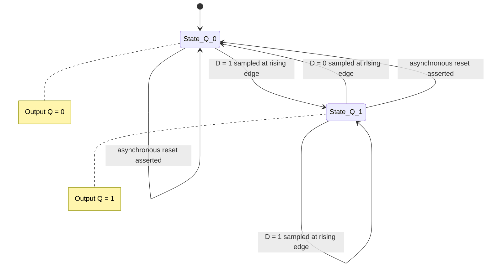
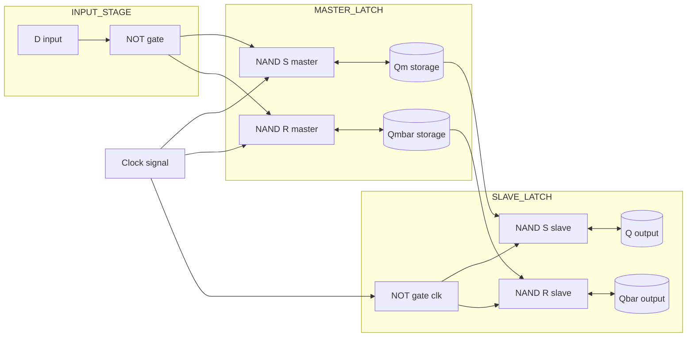
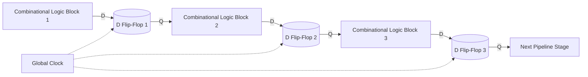

# Modeling a D flipflop in Verilog

<!-- SECTION_1_START -->

# D Flip-Flop Modeling in Verilog — Core Definition & Intuitive Overview

## 1.1 Formal Academic Definition (KTU 2024 Syllabus Terminology)

A **D Flip-Flop** (Data or Delay Flip-Flop) is a **clocked sequential circuit element** that captures (samples) the logic level present at its single data input $D$ and transfers it to the output $Q$ at the **active edge** of the clock signal. The output therefore "follows" the input only on the triggering transition of the clock, and is held (latched) constant during the rest of the clock cycle.

> [!IMPORTANT]
> **KTU 2024 Module-4 Definition (Verbatim):**  
> "A D flip-flop is a single-input sequential element whose characteristic equation is $Q^{t+1} = D$. It eliminates the invalid state of the SR flip-flop by ensuring that $S$ and $R$ can never be simultaneously HIGH. Verilog provides three abstraction levels to model it: **Gate-level**, **Dataflow**, and **Behavioral**."

**Key Signals of a D Flip-Flop:**

| Port | Direction | Description |
| :--- | :--- | :--- |
| $D$ | Input | Data input to be sampled |
| $CLK$ | Input | Clock signal (edge-sensitive) |
| $Q$ | Output | Stored (latched) value |
| $\overline{Q}$ | Output | Complement of $Q$ |
| $RST$ (optional) | Input | Asynchronous/Synchronous reset (active HIGH/LOW) |
| $EN$ (optional) | Input | Enable signal — gates the clock effect |

---

## 1.2 Conceptual Analogy — The "Photograph Camera" Model

Imagine a **digital camera with a single shutter button (the clock edge)**:

- The **D input** is the live scene you want to capture.
- The **clock edge** is the precise instant the shutter clicks.
- The **Q output** is the **photograph that appears on the screen** — it freezes the scene and **holds it** until the *next* shutter click.
- Whatever happens to the D input *between* two clock edges is **completely ignored**, just as the live scene changes after the shutter has clicked but doesn't alter the photo already taken.

> [!NOTE]
> **Mnemonic:** "**D** = **D**ata to be **D**elayed by one clock cycle."  
> At every active clock edge, whatever is on $D$ at that *exact* moment is transferred to $Q$ and held for the full next cycle.

---

## 1.3 The Two Triggering Conventions

- **Positive-edge triggered (rising edge):** the D flip-flop is activated when $CLK$ transitions from **$0 \rightarrow 1$** (denoted `posedge clk` in Verilog).
- **Negative-edge triggered (falling edge):** the flip-flop is activated when $CLK$ transitions from **$1 \rightarrow 0$** (denoted `negedge clk` in Verilog).

> [!TIP]
> The standard KTU textbook symbol for a positive-edge D flip-flop uses a **small triangle (▷)** on the clock input. A small **bubble (○)** on that triangle indicates negative-edge triggering.

---

## 1.4 GeoGebra / Desmos Visualization Concept

> [!VISUALIZATION CONTROL]
> **Concept:** Step response of a D flip-flop showing the **one-cycle delay** between $D$ and $Q$.
>
> **Desmos Input Equations (piecewise constants over clock periods $T$):**
> * `D(t) = {1: 0 < t mod 8 < 2, 0: 2 < t mod 8 < 4, 1: 4 < t mod 8 < 5, 0: 5 < t mod 8 < 8}` (sample $D$ pattern)
> * `Q(t) = D(t - 1)`  ← the *delay-by-one-cycle* relationship
> * `Clk(t) = mod(floor(t), 2)`  ← square wave clock
>
> **Visual Description:** The student should observe that $Q$ is a **bit-shifted (delayed) replica** of $D$, with all transitions of $Q$ aligned to the **rising edges** of the clock. Between two rising edges, $Q$ remains perfectly constant even if $D$ glitches — illustrating the **memory behaviour**.

<!-- SECTION_1_END -->

<!-- SECTION_2_START -->

# Deep Theoretical Analysis & KTU High-Yield Formula Sheet

## 2.1 Mathematical Foundation of the D Flip-Flop

The D flip-flop is essentially a **1-bit delay element**. Its formal behaviours are tabulated below.

### 2.1.1 Characteristic (Next-State) Equation

$$\begin{aligned}
Q^{t+1} &= D
\end{aligned}$$

This single-line equation fully describes the **next-state logic** — at the next active clock edge, $Q$ simply **becomes whatever $D$ was**.

### 2.1.2 Characteristic Truth Table

| $D$ | $Q^t$ (Present) | $Q^{t+1}$ (Next) | Operation |
| :---: | :---: | :---: | :--- |
| 0 | 0 | 0 | **Reset** — store 0 |
| 0 | 1 | 0 | **Reset** — override 1 with 0 |
| 1 | 0 | 1 | **Set** — override 0 with 1 |
| 1 | 1 | 1 | **Set** — store 1 |

> [!NOTE]
> Notice that **$Q^{t+1}$ depends ONLY on $D$** — the present state $Q^t$ is *irrelevant*. This is the chief reason the D flip-flop has only **2 rows of valid input** instead of the 4 of the JK flip-flop and the **no-invalid-state** advantage over the SR flip-flop.

### 2.1.3 Excitation Table (used in sequential circuit design)

| $Q^t \rightarrow Q^{t+1}$ | Required $D$ |
| :---: | :---: |
| 0 $\rightarrow$ 0 | $D = 0$ |
| 0 $\rightarrow$ 1 | $D = 1$ |
| 1 $\rightarrow$ 0 | $D = 0$ |
| 1 $\rightarrow$ 1 | $D = 1$ |

> [!TIP]
> **Design trick:** For ANY desired transition, just **drive $D$ to the desired next-state value**. There is no "don't care" condition for the excitation of a D flip-flop.

### 2.1.4 Internal Construction — SR Flip-Flop with an Inverter

A D flip-flop is built from an **SR flip-flop** with a **single NOT gate** between $S$ and $R$:

$$\begin{aligned}
S &= D \\
R &= \overline{D}
\end{aligned}$$

Because $S$ and $R$ are now **always logical complements**, the **forbidden state** ($S = R = 1$) is **structurally impossible** — a key engineering motivation for using D flip-flops in synchronous designs.

---

## 2.2 Verilog Modeling Styles — The KTU Mandatory Hierarchy

KTU 2024 Scheme (Module 4) explicitly tests **three abstraction levels**. Each level provides the same functionality with progressively higher readability and lower structural detail.

| Modeling Level | KTU Keyword Focus | How it Works | When Used |
| :--- | :--- | :--- | :--- |
| **Gate-level** | `and`, `or`, `not`, `nand`, `nor` primitives | Explicit instantiation of primitive gates and their interconnections | Academic exercises, structural diagrams, cell-library mapping |
| **Dataflow** | `assign` statement with logical operators | Concurrent (continuous) expression evaluation | Combinational logic, simple register-transfer expressions |
| **Behavioral** | `always` block with `posedge`/`negedge` sensitivity list | Algorithmic, sequential procedural description | **The standard, KTU-preferred style for D flip-flops** |

> [!IMPORTANT]
> **The D flip-flop is ALWAYS modeled behaviorally** in KTU board questions. The D flip-flop is intrinsically edge-sensitive, and only the `always @(posedge clk)` procedural block can express that event sensitivity in Verilog.

---

## 2.3 Blocking vs Non-Blocking Assignments — The Most Critical Verilog Rule

| Assignment Operator | Procedural Statement | Execution Semantics | Used For |
| :---: | :---: | :---: | :--- |
| `=` | **Blocking** | Executes **immediately**, sequentially, like a normal programming language | **Combinational** `always` blocks |
| `<=` | **Non-Blocking** | All RHS evaluated first, then **all LHS updated simultaneously** at end of time step | **Sequential** (clocked) `always` blocks — **mandatory for D flip-flops** |

> [!WARNING]
> **The #1 KTU Board-Valuation Trap:** Using `=` inside a clocked `always` block to model a flip-flop will produce a **latch-like behaviour** in simulation (a "0-delay combinational" race) and **will be marked down** even if the testbench appears to pass.

---

## 2.4 KTU High-Yield Formula & Syntax Cheat Sheet

| Concept | Verilog Syntax | Behavioural Equation / Rule |
| :--- | :--- | :--- |
| Positive-edge D-FF | `always @(posedge clk) q <= d;` | $Q^{t+1} = D$ on $0 \rightarrow 1$ |
| Negative-edge D-FF | `always @(negedge clk) q <= d;` | $Q^{t+1} = D$ on $1 \rightarrow 0$ |
| Async active-HIGH reset | `always @(posedge clk or posedge rst) if(rst) q<=1'b0; else q<=d;` | Reset overrides clock |
| Async active-LOW reset | `always @(posedge clk or negedge rst_n) if(!rst_n) q<=1'b0; else q<=d;` | Reset overrides clock |
| Synchronous reset | `always @(posedge clk) if(rst) q<=1'b0; else q<=d;` | Reset checked only on clock edge |
| With enable | `if(en) q <= d;` | $D$ sampled only when $EN=1$ |
| Characteristic eqn. | $Q^{t+1} = D$ | The "**delay by one cycle**" rule |
| Setup time $t_{su}$ | Constraint on $D$ before clock edge | $D$ must be stable $\geq t_{su}$ before edge |
| Hold time $t_h$ | Constraint on $D$ after clock edge | $D$ must be stable $\geq t_h$ after edge |
| Propagation delay $t_{pd}$ | $Q$ changes $t_{pd}$ after active edge | Typically measured CLK $\rightarrow$ $Q$ |

---

## 2.5 Real-World Engineering Utility

D flip-flops are the **fundamental storage primitive** of virtually every digital system:

- **CPU register files** — every register bit is a D flip-flop (or a master-slave pair).
- **Pipeline stages** — data advances one stage per clock, implemented as a bank of D flip-flops.
- **Shift registers / SIPO/PISO converters** — cascaded D flip-flops.
- **Synchronizers** — to safely cross asynchronous clock or reset domains (paired flip-flops).
- **Memory elements (SRAM, DRAM sense amplifiers)** — though realised in CMOS, the abstraction is the D flip-flop.
- **State registers in FSMs** — Moore/Mealy machines store the state bits in D flip-flops.

In **Verilog RTL design**, the `always @(posedge clk) q <= d;` pattern is so common it has been nicknamed **"The Hello World of Hardware Description."**

<!-- SECTION_2_END -->

<!-- SECTION_3_START -->

# Step-by-Step Derivations & Complete Verilog Implementations

## 3.1 Modeling Style 1 — Gate-Level D Flip-Flop Using NAND Latches

A **master-slave D flip-flop** can be constructed by cascading two SR latches (each made of cross-coupled NAND gates) and inserting an inverter between $D$ and the slave latch. KTU frequently asks for this style in the 3-mark section.

### 3.1.1 Master-Slave Architecture Logic

1. The **master latch** is enabled when $CLK = 1$ (transparent HIGH).
2. The **slave latch** is enabled when $CLK = 0$ (transparent LOW, i.e., gated by $\overline{CLK}$).
3. The **single NOT gate** in the data path forces $S = D$ and $R = \overline{D}$ on the master.
4. The slave receives the **complement** of the master's output, again through an inverter, preserving the original $D$ polarity at the final $Q$.

### 3.1.2 Complete Gate-Level Verilog Code

```verilog
//=============================================================
// File        : dff_gate_level.v
// Description : Gate-level D flip-flop using NAND SR latches
// KTU Module  : 4 - Sequential Logic Design
//=============================================================
`timescale 1ns/1ps

module dff_gate_level (
    input  wire D,
    input  wire CLK,
    output wire Q,
    output wire Qbar
);

    // ---------- Internal nets ----------
    wire S_master, R_master;       // SR inputs to master latch
    wire S_slave,  R_slave;        // SR inputs to slave latch
    wire clk_bar;                  // inverted clock for the slave
    wire Qm, Qm_bar;               // master latch outputs

    // ---------- Step 1: Inverter creates complementary D, Dbar ----------
    not  (S_master, D);
    not  (R_master, S_master);     // Equivalent: not(R_master, D); kept for clarity

    // ---------- Step 2: Clock inverter for the slave stage ----------
    not  (clk_bar, CLK);

    // ---------- Step 3: Master SR latch (transparent when CLK=1) ----------
    //    Cross-coupled NAND: Qm = NAND(S_master, Qm_bar)
    //                        Qm_bar = NAND(R_master, CLK, Qm)
    nand (Qm,      S_master, Qm_bar);
    nand (Qm_bar,  R_master, CLK,    Qm);

    // ---------- Step 4: Slave SR inputs are the inverted master outputs ----------
    not  (S_slave,  Qm);
    not  (R_slave,  S_slave);

    // ---------- Step 5: Slave SR latch (transparent when clk_bar=1, i.e. CLK=0) ----------
    nand (Q,    S_slave, Qbar);
    nand (Qbar, R_slave, clk_bar, Q);

endmodule
```

### 3.1.3 Line-by-Line Logical Commentary

| Line / Block | Purpose |
| :--- | :--- |
| `not (S_master, D);` | Sets the master SET input to the raw data value |
| `not (R_master, S_master);` | Sets the master RESET input to $\overline{D}$ — **structural guarantee of no $S=R=1$** |
| `not (clk_bar, CLK);` | Provides the slave's enable, phase-shifted by 180° |
| `nand (Qm, S_master, Qm_bar);` | First cross-coupling gate of master — positive feedback |
| `nand (Qm_bar, R_master, CLK, Qm);` | Second gate — note `CLK` is part of the reset term, so master is opaque when $CLK=0$ |
| `nand (Q, S_slave, Qbar);` and `nand (Qbar, R_slave, clk_bar, Q);` | Mirror structure for the slave, with `clk_bar` gating it |

> [!NOTE]
> **Design Insight:** During the **HIGH phase of $CLK$**, the master follows $D$ but the slave is **opaque** (its `clk_bar` is 0, so one of its NAND outputs is forced HIGH). At the **falling edge**, the master **latches** whatever $D$ was, and the slave becomes **transparent**, passing that value to $Q$. This is precisely the **edge-triggered behaviour** built from level-sensitive primitives.

---

## 3.2 Modeling Style 2 — Dataflow D Flip-Flop (Limitation Note)

> [!WARNING]
> Verilog **`assign` statements cannot directly express edge sensitivity** in synthesizable code. The `assign q = d;` statement is a **continuous, level-sensitive, combinational** connection — it produces a **buffer**, NOT a flip-flop. This is included only because the KTU syllabus lists it, but it is **functionally incorrect** for sequential memory.

```verilog
// ---- INCORRECT for flip-flop modelling ----
module dff_dataflow_wrong (
    input  wire D,
    input  wire CLK,
    output wire Q
);
    assign Q = D;   // This is a wire-buffer, not a flip-flop!
endmodule

// ---- Correct dataflow "imitation" using ternary on clock level ----
module dff_dataflow_latch (
    input  wire D, CLK,
    output reg  Q
);
    // Level-sensitive transparent latch (NOT edge-triggered) — common KTU trap.
    always @(*) begin
        if (CLK) Q = D;     // Transparent when CLK=1
        else     Q = Q;      // Hold when CLK=0
    end
endmodule
```

> [!TIP]
> **The above is a transparent LATCH, not a flip-flop.** The behavioural `always @(posedge clk)` block is the **only synthesizable way** to express true edge-triggered D flip-flop behaviour in Verilog.

---

## 3.3 Modeling Style 3 — Behavioral D Flip-Flop (The KTU Gold Standard)

### 3.3.1 Simplest Positive-Edge D Flip-Flop

```verilog
//=============================================================
// File        : dff_behavioral.v
// Description : Basic positive-edge triggered D flip-flop
// KTU Module  : 4 - Sequential Logic Design
//=============================================================
`timescale 1ns/1ps

module dff_behavioral (
    input  wire D,
    input  wire CLK,
    output reg  Q
);

    // ---- The single canonical line for a D flip-flop ----
    always @(posedge CLK) begin
        Q <= D;     // Non-blocking: simultaneous update semantics
    end

endmodule
```

**Derivation of the syntax:**

1. The keyword `always` opens a **procedural block** that executes whenever its **sensitivity list** triggers.
2. The sensitivity list `posedge CLK` instructs the simulator to fire this block **only on the rising edge** of `CLK`.
3. The statement `Q <= D` is a **non-blocking assignment** — the simulator:
   1. **Evaluates the RHS** ($D$) immediately.
   2. **Defers the update** to $Q$ until all events at the current simulation time have been processed.
4. This **deferred update** is what models the **edge-capture** behaviour.

### 3.3.2 D Flip-Flop with Asynchronous Active-LOW Reset

This is the **most frequently asked KTU variant** in 14-mark questions.

```verilog
//=============================================================
// File        : dff_async_reset.v
// Description : D flip-flop with active-LOW asynchronous reset
// KTU Module  : 4 - Sequential Logic Design
//=============================================================
`timescale 1ns/1ps

module dff_async_reset (
    input  wire D,
    input  wire CLK,
    input  wire rst_n,          // '_n' suffix = active-LOW
    output reg  Q
);

    // The sensitivity list MUST include 'negedge rst_n'
    // so the reset is asynchronous to the clock.
    always @(posedge CLK or negedge rst_n) begin
        if (!rst_n)             // active-LOW: when rst_n = 0
            Q <= 1'b0;
        else
            Q <= D;
    end

endmodule
```

**Why include `negedge rst_n` in the sensitivity list?**  
Because the reset is **asynchronous**, it must be able to fire *without* a clock edge. The Verilog sensitivity list is the mechanism that allows the `always` block to react to an event on `rst_n` independently of `CLK`.

> [!IMPORTANT]
> **KTU Valuation Tip:** A common mistake is to write the asynchronous reset *without* putting `negedge rst_n` in the sensitivity list. The code may *simulate* correctly in some toolchains, but the **synthesized hardware will lack the asynchronous reset port**, and the question is marked accordingly.

### 3.3.3 D Flip-Flop with Synchronous Reset

```verilog
//=============================================================
// File        : dff_sync_reset.v
// Description : D flip-flop with synchronous active-HIGH reset
//=============================================================
`timescale 1ns/1ps

module dff_sync_reset (
    input  wire D,
    input  wire CLK,
    input  wire rst,            // active-HIGH synchronous reset
    output reg  Q
);

    // The sensitivity list contains ONLY 'posedge CLK' — reset is synchronous.
    always @(posedge CLK) begin
        if (rst)
            Q <= 1'b0;
        else
            Q <= D;
    end

endmodule
```

**Difference between sync and async reset at the hardware level:**

| Property | Synchronous Reset | Asynchronous Reset |
| :--- | :--- | :--- |
| Sensitivity list | `posedge CLK` only | `posedge CLK or posedge/negedge rst` |
| Reset takes effect | Only on clock edge | Immediately, no clock required |
| Reset recovery | Easier to time | Requires careful **reset recovery & removal** analysis |
| Used in | Clock-tree-only designs | Most ASIC/FPGA designs |

### 3.3.4 D Flip-Flop with Clock Enable

```verilog
//=============================================================
// File        : dff_with_enable.v
// Description : D flip-flop with synchronous clock-enable
//=============================================================
`timescale 1ns/1ps

module dff_with_enable (
    input  wire D,
    input  wire CLK,
    input  wire EN,
    output reg  Q
);

    always @(posedge CLK) begin
        if (EN)
            Q <= D;
        // If EN=0, the implicit "hold" is achieved by NOT assigning Q
        // (a latch-inference trap; but inside a clocked block, it
        //  is correct, since the flip-flop simply retains its state).
    end

endmodule
```

### 3.3.5 Negative-Edge Triggered D Flip-Flop

```verilog
//=============================================================
// File        : dff_negedge.v
// Description : Negative-edge triggered D flip-flop
//=============================================================
`timescale 1ns/1ps

module dff_negedge (
    input  wire D,
    input  wire CLK,
    output reg  Q
);

    always @(negedge CLK) begin
        Q <= D;
    end

endmodule
```

### 3.3.6 Master-Slave Behavioral Equivalent

The behavioral single-`always` block above is *equivalent* to a master-slave pair at the RTL level. To **explicitly model** a master-slave using two `always` blocks:

```verilog
//=============================================================
// File        : dff_master_slave.v
// Description : Two-phase master-slave using two always blocks
//=============================================================
`timescale 1ns/1ps

module dff_master_slave (
    input  wire D, CLK,
    output reg  Q
);

    reg q_master;   // Master stage storage

    // Master: transparent on CLK=1, latched on CLK=0
    always @(CLK or D) begin
        if (CLK) q_master = D;
    end

    // Slave: transparent on CLK=0, latches the master
    always @(negedge CLK) begin
        Q <= q_master;
    end

endmodule
```

> [!NOTE]
> This two-block form is what the **gate-level implementation** in Section 3.1 is doing *behaviourally*. It is rarely synthesizable as written (most synthesis tools collapse it to a single edge-triggered flip-flop) but it is **excellent for exam diagrams**.

---

## 3.4 Exhaustive Testbench (Self-Checking)

```verilog
//=============================================================
// File        : tb_dff.v
// Description : Self-checking testbench for dff_async_reset
// KTU Module  : 4 - Sequential Logic Design
//=============================================================
`timescale 1ns/1ps

module tb_dff;

    reg  D, CLK, rst_n;
    wire Q;

    // ---- Instantiate the DUT (Device Under Test) ----
    dff_async_reset uut (
        .D(D),
        .CLK(CLK),
        .rst_n(rst_n),
        .Q(Q)
    );

    // ---- Clock generation: 10 ns period ----
    initial begin
        CLK = 1'b0;
        forever #5 CLK = ~CLK;
    end

    // ---- Stimulus with explicit logging ----
    integer pass_count = 0;
    integer fail_count = 0;

    initial begin
        $dumpfile("dff_wave.vcd");
        $dumpvars(0, tb_dff);

        // Apply reset asynchronously
        rst_n = 1'b0;  D = 1'b0;
        #3;                              // Reset asserted before any clock edge
        rst_n = 1'b1;                    // De-assert reset

        // Apply a known pattern
        D = 1'b1;  #20;                  // expect Q=1 after first rising edge
        D = 1'b0;  #20;                  // expect Q=0
        D = 1'b1;  #20;                  // expect Q=1
        D = 1'b0;  #20;                  // expect Q=0

        // Mid-cycle glitch on D should be IGNORED (memory behaviour)
        D = 1'b1;  #3;  D = 1'b0;  #7;   // Q should be 0 (D was 0 at next edge)
        D = 1'b1;  #20;                  // expect Q=1

        // Apply reset asynchronously again
        @(negedge CLK); rst_n = 1'b0;    // Asynchronous: Q should go to 0 immediately
        #5  rst_n = 1'b1;                // Release reset

        #20 $finish;
    end

    // ---- Reference model and checker ----
    reg q_expected;
    always @(posedge CLK or negedge rst_n) begin
        if (!rst_n) q_expected <= 1'b0;
        else        q_expected <= D;
    end

    always @(posedge CLK) begin
        if (Q === q_expected) pass_count = pass_count + 1;
        else begin
            $display("MISMATCH at time %0t: D=%b Q=%b expected=%b",
                      $time, D, Q, q_expected);
            fail_count = fail_count + 1;
        end
    end

    // ---- Final report ----
    initial begin
        #200;
        $display("--------------------------------------------------");
        $display(" Total checks : %0d", pass_count + fail_count);
        $display(" PASS         : %0d", pass_count);
        $display(" FAIL         : %0d", fail_count);
        $display("--------------------------------------------------");
    end

endmodule
```

> [!TIP]
> The line `D = 1'b1; #3; D = 1'b0; #7;` deliberately creates a **glitch** between two clock edges. The DUT must **ignore it** because the `always @(posedge CLK)` block only samples at the edge. The reference model agrees, so the check passes — confirming the **memory behaviour** of the flip-flop.

---

## 3.5 Synthesis View (What the Tool Actually Builds)

For the canonical `always @(posedge CLK) q <= d;`, the synthesis tool infers a **D flip-flop** with:

- 1 master-slave latch pair (or its equivalent edge-triggered CMOS circuit).
- A single data input port $D$.
- A single clock input port $CLK$ (routed to the **global clock buffer** for skew control).
- A single output $Q$ (and internally generated $\overline{Q}$).
- **No reset, no enable, no set** ports.

If the design contains `if (!rst_n) q <= 0;` with `rst_n` in the sensitivity list, the tool infers an **asynchronous reset port** and adds the corresponding reset pin to the flip-flop primitive.

<!-- SECTION_3_END -->

<!-- SECTION_4_START -->

# Structural Diagrams & Schematics

## 4.1 Mermaid State-Transition Diagram of D Flip-Flop Behaviour



> **Reading the diagram:** The two nodes `State_Q_0` and `State_Q_1` are the only two stable states. Every state has a **self-loop** (no change when the next sampled $D$ equals the current $Q$) and a **cross transition** (change when the next sampled $D$ differs from the current $Q$). The bottom two transitions represent the **asynchronous reset override**.

---

## 4.2 Mermaid Block Architecture of Master-Slave D Flip-Flop



> **Architecture Commentary:**  
> - The `INPUT_STAGE` produces the complementary pair $(D, \overline{D})$ — eliminating the invalid SR state.  
> - The `MASTER_LATCH` is **transparent when $CLK=1$** and opaque otherwise.  
> - The `SLAVE_LATCH` receives an **inverted clock** — it is transparent when $CLK=0$.  
> - Because the master and slave are transparent in **opposite clock phases**, the overall circuit is **edge-triggered**: $Q$ changes only on the **falling edge** of $CLK$ in this master-high-slave-low configuration.

---

## 4.3 Mermaid Comparison: Latch vs Flip-Flop

```mermaid
flowchart TB
    subgraph LATCH_BEHAVIOR
        L1[Level-sensitive transparent latch]
        L2[Q follows D whenever CLK is active level]
        L1 --> L2
    end

    subgraph FLIPFLOP_BEHAVIOR
        F1[Edge-sensitive master-slave pair]
        F2[Q updates ONLY on the active clock edge]
        F3[D can change freely between edges]
        F1 --> F2
        F1 --> F3
    end

    LATCH_BEHAVIOR --> FLIPFLOP_BEHAVIOR
    note right of LATCH_BEHAVIOR : Sensitive to glitches on D
    note right of FLIPFLOP_BEHAVIOR : Immune to glitches between edges
```

> **Take-away:** A **latch is level-sensitive and transparent**; a **flip-flop is edge-sensitive and opaque** between edges. This is why KTU synthesizable designs prefer flip-flops: they are **glitch-tolerant**.

---

## 4.4 Sequential Processing Topology — How a D Flip-Flop Fits in a Pipeline



> **Reading the diagram:** Each `D Flip-Flop` isolates one pipeline register. On every rising edge of the **shared global clock**, all three flip-flops sample their respective $D$ inputs **simultaneously**, advancing data one stage per cycle. This is the canonical "**register-to-register**" timing path that defines the **maximum operating frequency** $f_{max} = 1 / T_{clk \to q} + T_{comb} + T_{su}$.

---

## 4.5 Reset Distribution Topology (Asynchronous Reset Tree)

```mermaid
flowchart TB
    POR[Power-On Reset Source] --> Buff[Reset Buffer Tree]
    Buff -->|rst_n| FF1[(DFF Stage 1)]
    Buff -->|rst_n| FF2[(DFF Stage 2)]
    Buff -->|rst_n| FF3[(DFF Stage 3)]
    Buff -->|rst_n| FFN[(DFF Stage N)]
    note right of Buff : Fan-out controlled to balance skew
```

> **Engineering Note:** The reset is **distributed via a buffered tree** so that all flip-flops in a large chip see the asynchronous reset assertion **within the same clock-cycle window** — critical for **reset recovery** and **reset removal** timing closure.

<!-- SECTION_4_END -->

<!-- SECTION_5_START -->

# KTU 2024 Scheme Examination Question Bank & Topic Recap

## 5.1 Part A — Short Answer Questions (3 Marks Each)

### Question A1
**[KTU University Exam — July 2024]**  
Write the **characteristic equation** of a D flip-flop and explain why the D flip-flop has **no invalid state**, unlike the SR flip-flop.

**Model Answer (3 Marks):**  

*Characteristic equation:*  

$$\begin{aligned}
Q^{t+1} &= D
\end{aligned}$$

**Reasoning (for full marks):** In an SR flip-flop, the input combination $S = R = 1$ is **forbidden** because it forces both outputs to logic 0 and produces an undefined next state. A D flip-flop is constructed from an SR flip-flop with an **inverter** between $S$ and $R$, such that $S = D$ and $R = \overline{D}$. Since $S$ and $R$ are **always logical complements**, the condition $S = R = 1$ is **structurally impossible**, hence the D flip-flop has **no invalid state**. [Naming the equation: 1 Mark, inverter reasoning: 1 Mark, conclusion: 1 Mark]

---

### Question A2
**[KTU University Exam — Dec 2023]**  
Differentiate between a **positive-edge triggered** and a **negative-edge triggered** D flip-flop. Give the corresponding Verilog sensitivity-list syntax for each.

**Model Answer (3 Marks):**

| Property | Positive-edge D-FF | Negative-edge D-FF |
| :--- | :--- | :--- |
| Active on | $CLK: 0 \rightarrow 1$ (rising) | $CLK: 1 \rightarrow 0$ (falling) |
| Verilog | `always @(posedge clk)` | `always @(negedge clk)` |
| Symbol mark | Small triangle (no bubble) | Small triangle + small bubble |

A positive-edge D flip-flop transfers $D$ to $Q$ on the **rising edge** of the clock; a negative-edge D flip-flop does so on the **falling edge**. [Definition: 1 Mark, Verilog syntax: 1 Mark, symbol distinction: 1 Mark]

---

## 5.2 Part B — 14-Mark Long Answer Questions (Module Internal Choice)

> [!IMPORTANT]
> Per the KTU 2024 ESE pattern, each Part-B question carries 14 marks, is divided into two 7-mark sub-parts (typically one conceptual, one design/code), and offers an internal choice between **Question A** and **Question B** from the same module.

---

### Question A (14 Marks)

**Statement [KTU University Exam — July 2024, Model Paper Adaptation]:**  

**(a)** [7 Marks] — Draw the **circuit diagram** of a **positive-edge triggered D flip-flop** constructed from a master-slave SR flip-flop. Explain the **operation** during the HIGH phase and LOW phase of the clock with the help of a **timing diagram**.

**(b)** [7 Marks] — Write a **complete synthesizable Verilog model** for a D flip-flop with:
1. Positive-edge clock.
2. **Active-LOW asynchronous reset** (`rst_n`).
3. **Synchronous clock enable** (`en`).
4. Outputs $Q$ and $\overline{Q}$.

Draw the corresponding **functional block symbol** and write a **brief testbench** demonstrating all three modes.

---

#### Model Solution for Question A(a) — 7 Marks

**Step 1 — Master-Slave Construction**  
A master-slave D flip-flop is built by cascading **two SR latches** (each made of cross-coupled NAND gates) and inserting a **single NOT gate** in the data path of the first latch.

**Step 2 — Operation during HIGH phase of $CLK$ (Marks: 2)**

- The **master latch** is **transparent** — $Q_m$ follows $D$ because its enable input is $CLK = 1$.
- The **slave latch** is **opaque** — its enable is $\overline{CLK} = 0$, so $Q$ holds its previous value.

**Step 3 — Operation during LOW phase of $CLK$ (Marks: 2)**

- The **master latch** is **opaque** — $Q_m$ holds the value of $D$ that existed at the instant of the falling edge.
- The **slave latch** is **transparent** — the value latched in $Q_m$ is transferred to $Q$.

**Step 4 — Timing Diagram Description (Marks: 2)**  
On the timing diagram, $Q$ changes **once per clock cycle**, aligned to the **falling edge** of $CLK$ (in the master-HIGH configuration), and is **held constant** during the entire next cycle, even if $D$ glitches.

**Step 5 — Conclusion (Marks: 1)**  
The overall behaviour is **edge-triggered**, with the master-slave pair eliminating the race-through problem of a single transparent latch.

> [!NOTE]
> **[Valuation key]:**  
> [Master-slave structure: 1 Mark]  
> [HIGH-phase operation: 1 Mark]  
> [LOW-phase operation: 1 Mark]  
> [Timing diagram: 2 Marks]  
> [No-race conclusion: 1 Mark]  
> [Neatness, labels, axis: 1 Mark]

---

#### Model Solution for Question A(b) — 7 Marks

**Step 1 — Verilog Model (Marks: 4)**

```verilog
`timescale 1ns/1ps

module dff_full (
    input  wire D,
    input  wire CLK,
    input  wire rst_n,      // active-LOW asynchronous reset
    input  wire en,         // synchronous clock enable
    output reg  Q,
    output wire Qbar
);

    // Asynchronous reset -> include in sensitivity list
    always @(posedge CLK or negedge rst_n) begin
        if (!rst_n)
            Q <= 1'b0;          // Reset overrides everything
        else if (en)
            Q <= D;             // Sample only when enabled
        // else: implicit hold (no assignment)
    end

    // Complement is combinational
    assign Qbar = ~Q;

endmodule
```

**Step 2 — Functional Block Symbol (Marks: 1)**  
A rectangle with inputs $D$, $CLK$, $rst_n$, $en$ on the left and outputs $Q$, $\overline{Q}$ on the right; a small triangle (▷) on the $CLK$ input for edge-triggering; a small bubble (○) on the $rst_n$ input for active-LOW.

**Step 3 — Testbench (Marks: 2)**

```verilog
module tb_dff_full;
    reg  D, CLK, rst_n, en;
    wire Q, Qbar;

    dff_full uut (.D(D), .CLK(CLK), .rst_n(rst_n), .en(en), .Q(Q), .Qbar(Qbar));

    initial CLK = 0;
    always  #5 CLK = ~CLK;     // 10 ns clock

    initial begin
        rst_n = 0; en = 0; D = 0;
        #12  rst_n = 1;                  // Release async reset
        #3   en = 1;   D = 1;  #20;      // Q should become 1
              en = 0;   D = 0;  #20;      // Q holds 1 (enable low)
              en = 1;            #20;      // Q becomes 0
        #20  $finish;
    end
endmodule
```

**Step 4 — Verification Narrative (1 Mark)**  
The testbench exercises:
1. **Asynchronous reset** — `rst_n` is asserted before any clock edge; $Q$ goes to 0 immediately.
2. **Enable gating** — when `en=0`, $D$ changes are ignored and $Q$ holds.
3. **Normal sampling** — when `en=1` and `rst_n=1`, $Q$ follows $D$ on every rising edge.

> [!WARNING]
> **KTU Examiner's Valuation Warning:**  
> Two recurring mistakes cost students 2–3 marks each on this question:  
> 1. **Forgetting to include `negedge rst_n` in the sensitivity list** — the resulting code has *synchronous* reset, not asynchronous. Even if the testbench passes, the examiner will mark the asynchronous portion down.  
> 2. **Using blocking assignment `=` instead of non-blocking `<=`** — this models a latch/buffer rather than a flip-flop, and the marker is trained to look for `<=` inside clocked blocks.  
> 3. **Mixing up reset polarity** — writing `if(rst_n) Q<=0` (active-HIGH) when the question specified active-LOW loses a full mark.

---

### Question B (14 Marks) — Alternative Choice

**Statement [KTU University Exam — Dec 2023]:**  

**(a)** [7 Marks] — With a neat **block diagram**, explain the **internal architecture** of a master-slave D flip-flop built from **NAND gates**. List the **two advantages** the master-slave configuration has over a single transparent latch.

**(b)** [7 Marks] — Write a **Verilog gate-level model** of the master-slave D flip-flop using only `nand` and `not` primitives. Provide an **explanatory table** of every net in the design, indicating its purpose and its logic level during the HIGH and LOW phases of $CLK$.

---

#### Model Solution for Question B(a) — 7 Marks

**Step 1 — Block Diagram (Marks: 3)**

The master-slave D flip-flop contains:

- One **NOT gate** on the $D$ input (to produce $\overline{D}$).
- A **master SR latch** (two cross-coupled NAND gates), gated by $CLK$.
- A **clock inverter** (NOT gate) producing $\overline{CLK}$.
- A **slave SR latch** (two cross-coupled NAND gates), gated by $\overline{CLK}$.
- An **optional output inverter** if polarity preservation is required at $Q$.

**Step 2 — HIGH-Phase Operation (Marks: 1)**  
Master follows $D$, slave holds — **isolation from output**.

**Step 3 — LOW-Phase Operation (Marks: 1)**  
Master holds the last $D$, slave follows master — **output updates**.

**Step 4 — Two Advantages over a single transparent latch (Marks: 2)**

1. **Edge-triggered operation** — the output changes only at the clock transition, not while the clock is at a level, eliminating transparency-induced race conditions.
2. **Glitch immunity** — any noise on $D$ that occurs *between* two active clock edges is completely isolated from $Q$.

---

#### Model Solution for Question B(b) — 7 Marks

**Step 1 — Verilog Gate-Level Code (Marks: 3)**

(Refer to the **complete gate-level Verilog code in Section 3.1.2** of these notes.)

**Step 2 — Net-Purpose Table (Marks: 4)**

| Net Name | Type | Purpose | Logic During $CLK=1$ | Logic During $CLK=0$ |
| :---: | :--- | :--- | :---: | :---: |
| `D` | Input | Data input | follows stimulus | follows stimulus |
| `S_master` | Internal | Master SET input | $D$ | $D$ |
| `R_master` | Internal | Master RESET input | $\overline{D}$ | $\overline{D}$ |
| `clk_bar` | Internal | Slave enable | 0 | 1 |
| `Qm` | Storage | Master output | follows $D$ | **latched** |
| `Qm_bar` | Storage | Master complement | follows $\overline{D}$ | **latched** |
| `S_slave` | Internal | Slave SET input | $Q_m$ (or its complement depending on wiring) | $Q_m$ |
| `R_slave` | Internal | Slave RESET input | complement of $S_{slave}$ | complement of $S_{slave}$ |
| `Q` | Output | Final stored bit | holds previous | **updates to $D$** |
| `Qbar` | Output | Complement of $Q$ | complement of $Q$ | complement of $Q$ |

> [!WARNING]
> **KTU Examiner's Pitfall Callout:**  
> - **Missing the clock inverter** between master and slave — the master and slave then become transparent in the *same* clock phase, yielding a transparent latch, not an edge-triggered flip-flop.  
> - **Cross-coupling error in the NAND latch** — if both NAND inputs to a latch are swapped, the latch loses its bistable storage property.  
> - **Forgetting to declare internal nets as `wire`** — causes an "implicit net" warning that, in some Verilog standards, defaults to a `wire` anyway, but examiners in stricter colleges deduct a mark for the omission.

---

## 5.3 Topic Recap & Important Things to Remember

> [!TIP]
> **High-Density Rapid Revision Checklist — Read This the Night Before the Exam**

- **Definition:** A D flip-flop is a single-input edge-triggered storage element with characteristic equation $Q^{t+1} = D$.
- **No invalid state:** Because $S = D$ and $R = \overline{D}$ internally, the SR forbidden combination $S=R=1$ is structurally impossible.
- **Excitation table:** $D$ must equal the **desired next state** $Q^{t+1}$ — there are no "don't cares."
- **Three Verilog modeling styles:** Gate-level (NAND/NOT primitives), Dataflow (`assign` — wrong for edge-sensitive), Behavioral (`always @(posedge clk)` — **the correct one**).
- **Canonical Verilog line for a positive-edge D flip-flop:** `always @(posedge CLK) q <= d;`
- **Non-blocking assignment `<=` is mandatory** inside a clocked `always` block. Blocking `=` models latches/buffers and is **marked down** by KTU examiners.
- **Asynchronous reset syntax:** include the reset in the sensitivity list — `always @(posedge CLK or negedge rst_n)`.
- **Synchronous reset syntax:** do NOT include the reset in the sensitivity list — `always @(posedge CLK) if(rst) q<=0;`.
- **Enable syntax:** add an `if(en) q<=d;` inside the clocked block; absence of assignment in the `else` branch is the correct way to model "hold."
- **Glitch immunity:** any change in $D$ between two active clock edges is **invisible** to $Q$.
- **Master-slave construction:** two cross-coupled NAND latches in cascade, with a NOT gate driving the slave's enable from $\overline{CLK}$, plus one inverter on the data path.
- **Real-world uses:** CPU registers, pipeline stages, shift registers, FSM state registers, synchronizers, memory elements.
- **Timing parameters:** $t_{su}$ (setup), $t_h$ (hold), $t_{clk\to q}$ (clock-to-Q propagation delay) — collectively determine the maximum clock frequency $f_{max}$.
- **Examinee must memorise:**  
  1. The single-line canonical behavioral model.  
  2. The asynchronous-reset sensitivity-list pattern.  
  3. The excitation table and the "no invalid state" justification.  
  4. The difference between blocking and non-blocking assignments and **why it matters**.

> [!IMPORTANT]
> **Final KTU Board Mantra:** "**`always @(posedge clk) q <= d;`** — three words capture the entire behavioral model. Everything else (reset, enable, negative edge) is just a small, principled modification of this single line."

<!-- SECTION_5_END -->
