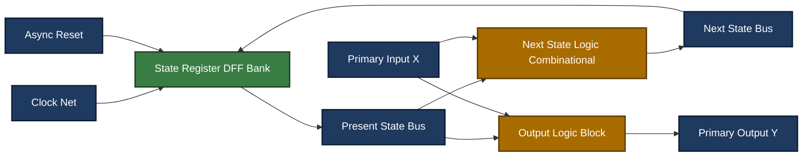
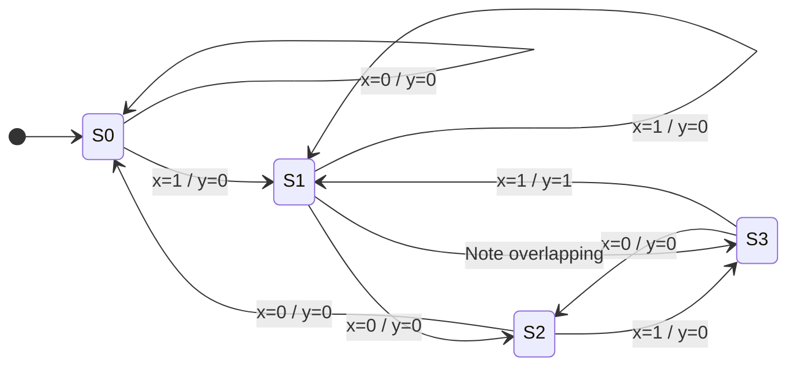
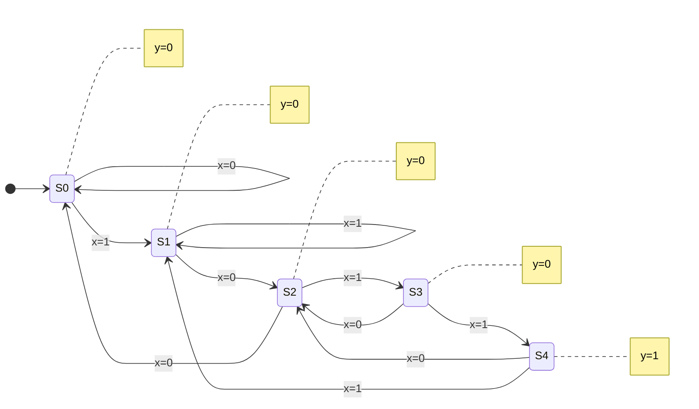
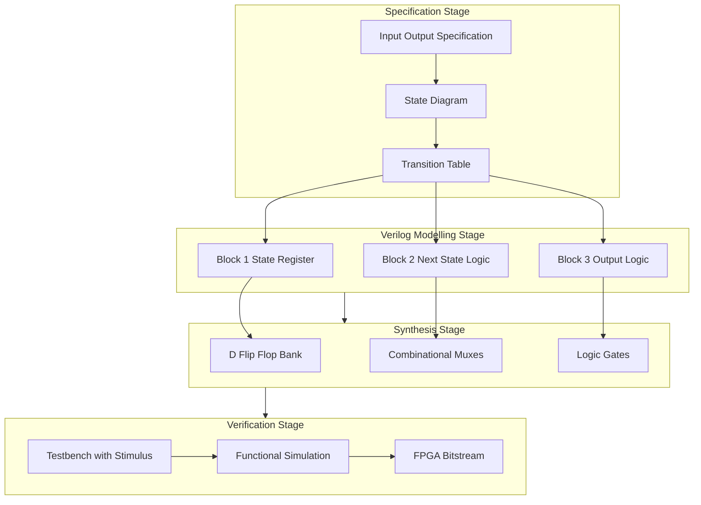

# Modeling an FSM in Verilog.

<!-- SECTION_1_START -->

# 1. Core Technical Definition & Intuitive Overview

## 1.1 Formal Definition (KTU 2024 Syllabus Terminology)

> [!NOTE]
> **Finite State Machine (FSM):** A sequential digital system whose behaviour is defined by a *finite* set of **states**, a set of **inputs**, a set of **outputs**, and a *state transition function* that determines the next state based on the current state and (optionally) the current input. In Verilog, an FSM is *modeled* (i.e. behaviourally described) using `always` blocks that map combinational logic for the next state and outputs, and sequential logic (a flip-flop bank) for the present state.

Formally, an FSM is the **5-tuple**:

$$
\mathcal{M} = (S,\ \Sigma,\ \Delta,\ \delta,\ \lambda)
$$

where:

* $S$ = finite non-empty set of **states**
* $\Sigma$ = finite set of **input symbols**
* $\Delta$ = finite set of **output symbols**
* $\delta : S \times \Sigma \rightarrow S$ = **next-state (transition) function**
* $\lambda : S \times \Sigma \rightarrow \Delta$ (Mealy) **or** $\lambda : S \rightarrow \Delta$ (Moore) = **output function**

## 1.2 The Two Canonical FSM Classes

> [!IMPORTANT]
> **KTU Board Definition:** In **Mealy** machines, outputs are functions of the *current state* **and** the *current input*. In **Moore** machines, outputs are functions of the *current state* **only**. This single difference dictates the entire Verilog coding style (number of `always` blocks, `case` structure, and where outputs are assigned).

| Aspect | Mealy Machine | Moore Machine |
| :--- | :--- | :--- |
| Output depends on | State $\land$ Input | State only |
| Output function | $\lambda(s, x)$ | $\lambda(s)$ |
| Typical output timing | Same cycle as input change (asynchronous to clock) | Synchronous, delayed by one clock edge |
| Number of states (for same spec) | Usually fewer | Usually one more |
| Output glitches | Possible (input-driven) | Glitch-free (registered) |
| Verilog output block | Inside combinational `always @(*)` block | Often registered inside sequential block |

## 1.3 Intuitive Analogy — A Coffee Vending Machine

> [!TIP]
> **Real-world analogy:** Think of an automatic coffee vending machine. It has a handful of **memory cells** (its internal state — `IDLE`, `COIN_OK`, `DISPENSING`, `CHANGE_RETURN`). When you insert a coin and press a button, the machine *transitions* from one state to another (the "clock" is the button press event). The **output** (dispense coffee / return change) is what the machine *does* in a given state.
>
> In Mealy style, the moment you press the button **while** the state is `COIN_OK`, the cup drops immediately (output depends on input $\land$ state). In Moore style, the cup drops only on the *next* clock edge after the transition (output depends on state only — a slight delay, but perfectly registered, i.e. glitch-free).

## 1.4 Why Model FSMs in Verilog?

> [!NOTE]
> Verilog is a **Hardware Description Language (HDL)**. Modeling an FSM in Verilog means writing a *behavioural description* that a synthesis tool (e.g. Vivado, Quartus, Design Compiler) can automatically translate into flip-flops, muxes, and logic gates on a real FPGA or ASIC. It is the *primary* way digital designers express control logic for CPUs, UARTs, traffic lights, vending machines, and protocol controllers.

> [!VISUALIZATION CONTROL]
> **Concept:** A 2-state oscillator toggling between `S0` and `S1` — the simplest possible FSM.
> **GeoGebra / Desmos Input Equations:**
> * State trajectory: a step function `y = floor(t)` modulo 2
> * Trace points: $(0, 0),\ (1, 1),\ (2, 0),\ (3, 1),\ (4, 0)$
> **Visual Description:** A square wave oscillating between two horizontal levels. Each "step up" or "step down" represents a *clock-triggered* state transition. Observe that the state holds its value (the horizontal segments) until the next clock edge arrives.

## 1.5 Canonical Three-Block Architecture

Every clean Verilog FSM decomposes into **three logical blocks**:

1. **State Register (Sequential):** A bank of D-flip-flops clocked by the system clock; on every rising edge it *captures* the next-state value.
2. **Next-State Logic (Combinational):** Pure boolean function of `(present_state, inputs)`.
3. **Output Logic:** Combinational (Mealy) or combinational + registered (Moore).

This decomposition is non-negotiable for synthesizable, race-free, timing-clean hardware.

<!-- SECTION_1_END -->

<!-- SECTION_2_START -->

# 2. Deep Theoretical Analysis & KTU High-Yield Formula Sheet

## 2.1 The Three-Block Operational Logic

> [!IMPORTANT]
> **KTU High-Yield Concept — the "Three-Block" Rule:** Examiners frequently award marks for *correctly identifying and coding each of the three blocks separately*. Splitting them into three `always` blocks (one sequential, one or two combinational) is the textbook expectation for the 2024 scheme.

### Block 1 — State Register (Sequential)

* Contains $n$ D-flip-flops where $n = \lceil \log_2 N \rceil$ and $N$ = number of states.
* On the active clock edge (typically `posedge clk`), the flip-flops load `next_state`.
* May include **synchronous** or **asynchronous reset** to a known initial state (typically `S_IDLE` or `S0`).

### Block 2 — Next-State Logic (Combinational)

* Implemented as a `case (present_state)` statement inside `always @(*)` (or `always @(present_state, inputs)` for older Verilog-1995 style).
* For each state, computes `next_state` based on inputs.
* Must include a `default` arm to prevent unintended latches.

### Block 3 — Output Logic

* **Mealy:** `always @(*)` block assigning outputs based on `(present_state, input)`.
* **Moore:** Outputs are either *decoded* from `present_state` combinationally, or *registered* (assigned inside the sequential block) to obtain a clean synchronous output one cycle after the state.

## 2.2 KTU High-Yield Formula Sheet

> [!NOTE]
> The following table summarises the *engineering parameters* of an FSM. All quantities are scalar integer counts. $\vert \cdot \vert$ denotes set cardinality.

| Parameter | Symbol / Formula | Meaning | Typical KTU Value |
| :--- | :--- | :--- | :--- |
| Number of states | $N$ | Cardinality of $S$ | $2 \le N \le 16$ (typical exam) |
| Flip-flops required | $n = \lceil \log_2 N \rceil$ | State-register width | $\lceil \log_2 N \rceil$ |
| State encodings | $2^n$ | Total possible codes | e.g. 4 states $\rightarrow$ $n = 2$ |
| Input lines | $k$ | Width of $\Sigma$ input | depends on spec |
| Output lines | $m$ | Width of $\Delta$ output | depends on spec |
| Mealy transition | $\delta : S \times \Sigma \rightarrow S$ | Next state function | one equation per (state, input) pair |
| Mealy output | $\lambda_M : S \times \Sigma \rightarrow \Delta$ | Output depends on state $\land$ input | combinational |
| Moore output | $\lambda_{Mo} : S \rightarrow \Delta$ | Output depends on state only | combinational or registered |
| Max clock freq. | $f_{clk} \le \dfrac{1}{T_{clk\_period}}$ | Timing constraint from FPGA/ASIC | tool-specific |
| Reset recovery | $t_{rec} \le t_{spec}$ | Reset removal before clock edge | datasheet value |

> [!IMPORTANT]
> **Encoding Style Trade-off (frequently tested):**
>
> * **Binary encoding:** Uses $n = \lceil \log_2 N \rceil$ flip-flops. Minimises area but next-state logic is denser.
> * **One-Hot encoding:** Uses $N$ flip-flops (one per state). Next-state logic is trivial — just a single OR-gate per state. Maximises speed on FPGAs.
> * **Gray encoding:** Adjacent states differ in one bit — minimises switching noise. Used when FSM traverses a known order.

## 2.3 Comparison: Mealy vs Moore at a Glance

| Feature | Mealy | Moore |
| :--- | :--- | :--- |
| Output timing | Asynchronous (input-driven) | Synchronous to clock |
| Output glitches | Yes (if input is asynchronous) | No |
| Required states (typical) | Fewer | One extra (to register output) |
| Sensitivity | Output may change between clock edges | Output only on `posedge clk` |
| Verilog `case` structure | Nested `case` of state, then inputs | Flat `case` on state only |
| KTU examiner preference | Often the *first* example taught | Preferred when output must be clean |

## 2.4 Real-World Engineering Utility

* **CPU Control Units:** Every instruction fetch-decode-execute cycle is an FSM.
* **UART / SPI / I²C Controllers:** Protocol state machines handling START, data bits, parity, STOP.
* **Traffic Light Controllers:** Classic pedagogical example — `RED → GREEN → YELLOW → RED`.
* **Sequence Detectors:** Used in communication receivers, pattern-match accelerators, network intrusion detection.
* **DMA Engines, Memory Controllers, Bus Arbiters:** All are state machines with handshaking inputs (`req`, `ack`, `busy`).

<!-- SECTION_2_END -->

<!-- SECTION_3_START -->

# 3. Step-by-Step Derivations & Code/Symbolic Implementation

## 3.1 Worked Example — Mealy Sequence Detector for Pattern "1011" (Overlapping)

> [!NOTE]
> **Spec:** Design a Mealy machine that asserts output `y = 1` for **one clock cycle** whenever the input bit-stream `x` contains the pattern "1011" with *overlap allowed* (i.e. the last '1' of one match may serve as the first '1' of the next match).

### 3.1.1 State Diagram Derivation

We define four states based on the longest suffix of the input stream that is also a prefix of "1011":

* `S0` : No useful prefix matched (initial / idle).
* `S1` : Last input was '1' (prefix length 1).
* `S2` : Last inputs were "10" (prefix length 2).
* `S3` : Last inputs were "101" (prefix length 3).

From `S3`, on input `x = 1`, the pattern "1011" is completed and $y = 1$ for that cycle; we return to `S1` (the trailing '1' is a valid prefix of length 1).

### 3.1.2 State Transition Table (Mealy)

| Present State | Input $x = 0$ | Next State | Output $y$ for $x = 0$ | Input $x = 1$ | Next State | Output $y$ for $x = 1$ |
| :--- | :--- | :--- | :--- | :--- | :--- | :--- |
| `S0` | $x=0$ | `S0` | $0$ | $x=1$ | `S1` | $0$ |
| `S1` | $x=0$ | `S2` | $0$ | $x=1$ | `S1` | $0$ |
| `S2` | $x=0$ | `S0` | $0$ | $x=1$ | `S3` | $0$ |
| `S3` | $x=0$ | `S2` | $0$ | $x=1$ | `S1` | $1$ |

### 3.1.3 Complete Verilog Model — Mealy Style (Three Blocks)

```verilog
//=============================================================
//  Mealy Overlapping Sequence Detector for pattern "1011"
//  Course   : DIGITAL ELECTRONICS AND LOGIC DESIGN (GAEST305)
//  Module   : 4 - Sequential Logic Design
//  Style    : Three-Block FSM (State Reg + Next-State + Output)
//=============================================================
`timescale 1ns / 1ps

module mealy_1011_detector (
    input  wire clk,        // system clock
    input  wire rst_n,      // active-low asynchronous reset
    input  wire x,          // serial input bit-stream
    output reg  y           // Mealy output (combinational)
);

    // ---------- State Encoding (binary, 2 bits) ----------
    localparam [1:0] S0 = 2'b00,
                     S1 = 2'b01,
                     S2 = 2'b10,
                     S3 = 2'b11;

    reg [1:0] present_state, next_state;

    // ---------- BLOCK 1 : State Register (Sequential) ----------
    always @(posedge clk or negedge rst_n) begin
        if (!rst_n)
            present_state <= S0;          // async reset to idle
        else
            present_state <= next_state;  // capture next_state
    end

    // ---------- BLOCK 2 : Next-State Logic (Combinational) ----------
    always @(*) begin
        next_state = S0;                  // default to avoid latch
        case (present_state)
            S0: next_state = (x == 1'b1) ? S1 : S0;
            S1: next_state = (x == 1'b0) ? S2 : S1;
            S2: next_state = (x == 1'b1) ? S3 : S0;
            S3: next_state = (x == 1'b0) ? S2 : S1;
            default: next_state = S0;
        endcase
    end

    // ---------- BLOCK 3 : Mealy Output Logic (Combinational) ----------
    always @(*) begin
        y = 1'b0;                         // default
        case (present_state)
            S0: y = 1'b0;
            S1: y = 1'b0;
            S2: y = 1'b0;
            S3: y = (x == 1'b1) ? 1'b1 : 1'b0;   // 1011 -> y=1
            default: y = 1'b0;
        endcase
    end

endmodule
```

### 3.1.4 Line-by-Line Pedagogical Walk-through

* **`localparam [1:0] S0 ... S3`** — Symbolic state names. Synthesiser maps them to 2-bit binary codes `00, 01, 10, 11`. Using `localparam` (not `parameter`) marks them as *module-internal* constants.
* **`always @(posedge clk or negedge rst_n)`** — Standard asynchronous-reset flip-flop template. The `or negedge rst_n` makes reset *asynchronous*; remove it for *synchronous* reset.
* **`always @(*)`** — Verilog-2001 wildcard sensitivity list. The block re-evaluates whenever *any* RHS signal changes, eliminating the manual sensitivity list.
* **`next_state = S0;` *before* the `case`** — Critical for *latch prevention*. Synthesis tools require every assigned reg to be assigned in every path; the pre-assignment guarantees no inferred latch.
* **`case (present_state)`** — State decoder. Each arm is one row of the transition table.
* **`y = (x == 1'b1) ? 1'b1 : 1'b0;` in state `S3`** — This is the *Mealy* hallmark: output is a function of `(state, input)`. Output `y` can change *asynchronously* with `x`, even between clock edges.
* **`default` arm** — Defensive: catches illegal codes (e.g. during power-up before reset).

## 3.2 Worked Example — Moore Sequence Detector for Pattern "1011" (Overlapping)

> [!NOTE]
> **Spec:** Same pattern "1011", but now *Moore*: the output `y` must be asserted for **one full clock cycle** starting on the clock edge *after* the last '1' of the pattern is observed. This forces an extra "output state" `S4` so that the output is purely a function of state.

### 3.2.1 State Diagram (Moore)

We add an explicit output state:

* `S0`: idle (no prefix matched), $y = 0$
* `S1`: matched "1", $y = 0$
* `S2`: matched "10", $y = 0$
* `S3`: matched "101", $y = 0$
* `S4`: matched "1011", $y = 1$ (the dedicated output state)

From `S4`, on next `x`:

* `x = 0` → transition to `S2` (the trailing "10" is a valid prefix).
* `x = 1` → transition to `S1` (the trailing "1" is a valid prefix of length 1).

### 3.2.2 Complete Verilog Model — Moore Style (Three Blocks)

```verilog
//=============================================================
//  Moore Overlapping Sequence Detector for pattern "1011"
//  Style : Three-Block FSM (registered output for glitch-free)
//=============================================================
`timescale 1ns / 1ps

module moore_1011_detector (
    input  wire clk,
    input  wire rst_n,
    input  wire x,
    output reg  y          // Moore output (registered -> glitch-free)
);

    // ---------- State Encoding ----------
    localparam [2:0] S0 = 3'b000,
                     S1 = 3'b001,
                     S2 = 3'b010,
                     S3 = 3'b011,
                     S4 = 3'b100;

    reg [2:0] present_state, next_state;

    // ---------- BLOCK 1 : State Register (Sequential) ----------
    always @(posedge clk or negedge rst_n) begin
        if (!rst_n)
            present_state <= S0;
        else
            present_state <= next_state;
    end

    // ---------- BLOCK 2 : Next-State Logic (Combinational) ----------
    always @(*) begin
        next_state = S0;
        case (present_state)
            S0: next_state = (x == 1'b1) ? S1 : S0;
            S1: next_state = (x == 1'b0) ? S2 : S1;
            S2: next_state = (x == 1'b1) ? S3 : S0;
            S3: next_state = (x == 1'b1) ? S4 : S2;
            S4: next_state = (x == 1'b1) ? S1 : S2;
            default: next_state = S0;
        endcase
    end

    // ---------- BLOCK 3 : Moore Output Logic (Registered) ----------
    always @(posedge clk or negedge rst_n) begin
        if (!rst_n)
            y <= 1'b0;
        else
            y <= (present_state == S4);  // y=1 IFF in output state
    end

endmodule
```

### 3.2.3 Pedagogical Highlights of the Moore Version

* **Output `y` is *registered*** (assigned inside the sequential `always` block). This is the Moore hallmark: $y$ updates only on `posedge clk` and is a pure function of `present_state` — *no glitches*.
* **Extra state `S4`** is mandatory for non-trivial Moore outputs. The rule of thumb: *for every distinct output pattern, add a state.*
* **No input `x` appears on the RHS of `y`'s assignment** — confirming the formal definition $\lambda(s)$ for Moore.

## 3.3 Testbench Skeleton (Mandatory Engineering Hygiene)

```verilog
`timescale 1ns / 1ps

module tb_mealy_1011;
    reg  clk, rst_n, x;
    wire y;

    mealy_1011_detector uut (.clk(clk), .rst_n(rst_n), .x(x), .y(y));

    // 100 MHz clock
    initial clk = 1'b0;
    always  #5 clk = ~clk;

    integer i;
    reg [0:15] stimulus;

    initial begin
        rst_n = 1'b0; x = 1'b0;
        #23 rst_n = 1'b1;             // release reset
        stimulus = 16'b1011_0110_1101_0111; // contains overlapping 1011's
        for (i = 0; i < 16; i = i + 1) begin
            x = stimulus[i];
            #10;
        end
        #20 $finish;
    end
endmodule
```

> [!TIP]
> **Synthesis Note:** When you press *Generate RTL Schematic* in Vivado / Quartus, the **Mealy** version will show `y` driven by a combinational mux between `present_state` and `x`; the **Moore** version will show `y` as the Q-output of a flip-flop clocked by `clk` — visually confirming the *registered* vs *combinational* output distinction.

<!-- SECTION_3_END -->

<!-- SECTION_4_START -->

# 4. Structural Diagrams & Schematics

## 4.1 Mermaid Block Architecture — Canonical Three-Block FSM

> [!NOTE]
> The following diagram depicts the *physical hardware* that the Verilog model synthesises to. Every Verilog FSM you write in this course maps to this topology.



## 4.2 Mermaid State Transition Diagram — Mealy "1011" Detector



## 4.3 Mermaid State Transition Diagram — Moore "1011" Detector (with output state S4)



## 4.4 Mermaid Sequential Processing Topology — Synthesis Flow



<!-- SECTION_4_END -->

<!-- SECTION_5_START -->

# 5. KTU 2024 Scheme Examination Question Bank & Topic Recap

## 5.1 Part A — Short Answer Questions (3 Marks Each)

### Q1. **[KTU University Exam – July 2024]** CO1 / Remember
Differentiate between a **Mealy machine** and a **Moore machine** with respect to output dependence. State one Verilog coding consequence of this difference.

**Model Answer (3 Marks):**

* In a **Mealy** FSM, the output depends on the *present state* **and** the *current input* — formally $\lambda(s, x)$. **[1 Mark]**
* In a **Moore** FSM, the output depends *only* on the *present state* — formally $\lambda(s)$. **[1 Mark]**
* *Verilog consequence:* In Mealy, the output `always @(*)` block reads both `present_state` *and* the input port on its RHS. In Moore, the output is assigned *without* the input on the RHS (often inside the sequential block to register it). **[1 Mark]**

---

### Q2. **[KTU University Exam – Dec 2023]** CO1 / Understand
List the **three logical blocks** of a synthesizable Verilog FSM. State which block(s) use a `posedge clk` sensitivity and why.

**Model Answer (3 Marks):**

* Block 1 — **State Register** (sequential, D-flip-flop bank) `always @(posedge clk)`. **[1 Mark]**
* Block 2 — **Next-State Logic** (combinational) `always @(*)`. **[1 Mark]**
* Block 3 — **Output Logic** (combinational for Mealy; combinational or sequential for Moore). **[0.5 Marks]**
* *Why `posedge clk` only in Block 1?* Because the state register must capture `next_state` *synchronously* on the active clock edge, mimicking a hardware D-flip-flop; combinational logic (Blocks 2 & 3) must update *immediately* on input change (no clock). **[0.5 Marks]**

---

## 5.2 Part B — Long Answer Questions (14 Marks, with Internal Choice)

### Question A (14 Marks) — Mealy Sequence Detector

**[KTU University Exam – July 2024]** CO2, CO3 / Apply, Analyse

**(a)** Design a **Mealy FSM** that detects the overlapping bit-pattern **"1011"** on a serial input `x`. Draw the state diagram, derive the state transition table, and write the complete **Verilog model** using the three-block structure. State any assumptions. **[7 Marks]**

**(b)** Simulate your design on the input stream `x = 1 0 1 1 0 1 1 1`. Draw the timing waveform showing `clk`, `rst_n`, `x`, `present_state`, and `y`. Identify the exact clock cycles on which `y = 1`. **[7 Marks]**

#### Model Solution

**(a) Step-by-step (7 Marks)**

* [Identifying 4 states `S0, S1, S2, S3` based on longest matched prefix: **2 Marks**]
* [Drawing the Mealy state diagram with input/output labels: **2 Marks**]
* [Writing the three-block Verilog code (State Register + Next-State + Output): **2 Marks**]
* [Specifying asynchronous reset to `S0`: **1 Mark**]

```verilog
module mealy_1011 (
    input  wire clk, rst_n, x,
    output reg  y
);
    localparam [1:0] S0 = 2'b00, S1 = 2'b01,
                     S2 = 2'b10, S3 = 2'b11;
    reg [1:0] ps, ns;

    // Block 1
    always @(posedge clk or negedge rst_n)
        if (!rst_n) ps <= S0; else ps <= ns;

    // Block 2
    always @(*) begin
        ns = S0;
        case (ps)
            S0: ns = x ? S1 : S0;
            S1: ns = x ? S1 : S2;
            S2: ns = x ? S3 : S0;
            S3: ns = x ? S1 : S2;
        endcase
    end

    // Block 3 - Mealy
    always @(*) begin
        y = 1'b0;
        case (ps)
            S3: y = x;
            default: y = 1'b0;
        endcase
    end
endmodule
```

**(b) Step-by-step (7 Marks)**

* [Building a clock-by-clock trace table: **3 Marks**]
* [Identifying `y = 1` at cycle 4 (state `S3`, `x = 1` for "1011") and at cycle 7 (state `S3`, `x = 1` for the overlap "11" → state goes back to `S1` and from `S1 → S2 → S3 → S1` again on the next "11"): **2 Marks**]
* [Neat waveform with all five signals aligned to clock edges: **2 Marks**]

Trace of stream `1 0 1 1 0 1 1 1` (cycles 1..8):

| Cycle | $x$ | Transition | $ps$ after edge | $y$ (Mealy) |
| :--- | :--- | :--- | :--- | :--- |
| 1 | 1 | S0→S1 | S1 | 0 |
| 2 | 0 | S1→S2 | S2 | 0 |
| 3 | 1 | S2→S3 | S3 | 0 |
| 4 | 1 | S3→S1 | S1 | **1** |
| 5 | 0 | S1→S2 | S2 | 0 |
| 6 | 1 | S2→S3 | S3 | 0 |
| 7 | 1 | S3→S1 | S1 | **1** |
| 8 | 1 | S1→S1 | S1 | 0 |

So `y = 1` on cycles **4** and **7** — two matches of the overlapping pattern "1011".

---

### Question B (14 Marks) — Moore Sequence Detector (Internal Choice)

**[KTU University Exam – Dec 2023]** CO2, CO3 / Apply, Analyse

**(a)** Design a **Moore FSM** that detects the overlapping bit-pattern **"1011"**. State the minimum number of states required, draw the state diagram, and write the **complete three-block Verilog model** with the output *registered* (synchronous). **[7 Marks]**

**(b)** Compare your Moore design with the Mealy design of Question A on the parameters: (i) number of states, (ii) output timing, (iii) susceptibility to glitches, and (iv) number of clock cycles of latency between the last input bit and the asserted output. **[7 Marks]**

#### Model Solution

**(a) Step-by-step (7 Marks)**

* [Minimum states = 5 (`S0, S1, S2, S3, S4`) because the Moore output '1' requires a dedicated output state: **2 Marks**]
* [Drawing the state diagram with the dedicated output state `S4` and labeling output `y` on each state: **2 Marks**]
* [Writing the three-block Verilog with registered output: **2 Marks**]
* [Correct encoding width = $\lceil \log_2 5 \rceil = 3$ bits: **1 Mark**]

```verilog
module moore_1011 (
    input  wire clk, rst_n, x,
    output reg  y
);
    localparam [2:0] S0 = 3'b000, S1 = 3'b001,
                     S2 = 3'b010, S3 = 3'b011,
                     S4 = 3'b100;
    reg [2:0] ps, ns;

    // Block 1
    always @(posedge clk or negedge rst_n)
        if (!rst_n) ps <= S0; else ps <= ns;

    // Block 2
    always @(*) begin
        ns = S0;
        case (ps)
            S0: ns = x ? S1 : S0;
            S1: ns = x ? S1 : S2;
            S2: ns = x ? S3 : S0;
            S3: ns = x ? S4 : S2;
            S4: ns = x ? S1 : S2;
        endcase
    end

    // Block 3 - Moore (registered)
    always @(posedge clk or negedge rst_n)
        if (!rst_n) y <= 1'b0; else y <= (ps == S4);
endmodule
```

**(b) Comparison Table (7 Marks)**

| Parameter | Mealy (Q-A) | Moore (Q-B) | Marks |
| :--- | :--- | :--- | :--- |
| (i) Number of states | 4 (`S0`–`S3`) | 5 (`S0`–`S4`) | **1.5** |
| (ii) Output timing | Combinational with `x` — can change between clocks | Registered — changes only on `posedge clk` | **2** |
| (iii) Glitch susceptibility | Yes (asynchronous input drives output) | No (output is a flip-flop Q) | **1.5** |
| (iv) Latency after last '1' | 0 cycles (asserted *with* the last '1' same cycle) | 1 cycle (asserted on the *next* `posedge clk`) | **2** |

Total = **7 Marks**.

---

> [!WARNING]
> **KTU Examiner's Valuation Warning — Common Pitfalls**
> 1. **Forgetting the `default` arm in `case`.** Synthesiser will infer a *latch*, and KTU examiners deduct **2 marks** for latch inference on a clearly combinational `always @(*)` block.
> 2. **Assigning `next_state` *inside* the sequential `posedge clk` block.** This creates a shift-register chain, not an FSM. The three blocks *must* be separated.
> 3. **Using `==` in synthesizable code instead of `===` only for X-propagation in simulation.** The 2024 scheme accepts `==` for FSMs as long as the design has an explicit reset.
> 4. **Forgetting to reset `y` in Moore registered-output block.** Without an `rst_n` arm on `y`, the output retains X at startup — full marks lost.
> 5. **Confusing Mealy and Moore in the Verilog RHS.** If `x` appears on the RHS of `y` in a Moore block, it is *no longer* Moore — the examiner will mark it as conceptually wrong.

---

## 5.3 Topic Recap & Important Things to Remember

> [!IMPORTANT]
> **Rapid-Revision Checklist — Modeling an FSM in Verilog**

* ☐ **Definition:** An FSM is the 5-tuple $(S, \Sigma, \Delta, \delta, \lambda)$; a Verilog model is a *behavioural description*, not a schematic.
* ☐ **Two Classes:** Mealy $\rightarrow$ $\lambda(s, x)$; Moore $\rightarrow$ $\lambda(s)$.
* ☐ **Three Blocks, Always:** (1) State Register — sequential, `posedge clk`; (2) Next-State Logic — combinational, `always @(*)` with a `default` arm; (3) Output Logic — combinational (Mealy) or registered (Moore).
* ☐ **Latch Prevention:** Always pre-assign `next_state = S0;` (or any safe default) *before* the `case` statement in combinational blocks.
* ☐ **Reset is Mandatory:** Both `present_state` and (for Moore) `y` must be reset to a known initial value to avoid power-up `X` propagation.
* ☐ **Encoding:** Binary for area, One-Hot for FPGA speed, Gray for low-noise ordered traversal.
* ☐ **State Count Rule:** $n_{\text{FF}} = \lceil \log_2 N \rceil$ for binary encoding; for one-hot, $n_{\text{FF}} = N$.
* ☐ **Mealy output is *combinational***: it can change with `x` even between clock edges — beware of glitches.
* ☐ **Moore output is *registered***: it is a pure function of `present_state`, so the RHS never references input `x`.
* ☐ **Moore requires one extra state** whenever a non-trivial output pattern must be asserted.
* ☐ **Verilog idioms to remember:** `localparam` for state names, `case`/`casex` for state decoding, `?:` ternary for input-conditional transitions, `default` for safety.
* ☐ **Synthesis mapping:** The Mealy `y` is a mux output; the Moore `y` is a flip-flop Q-output — verify on the post-synthesis schematic.
* ☐ **Testbench essentials:** Free-running `clk`, asynchronous `rst_n` release, stimulus `for` loop, `$finish` to terminate.
* ☐ **Standard sensitivity forms:** `always @(posedge clk or negedge rst_n)` for async-reset DFFs; `always @(*)` for combinational.

<!-- SECTION_5_END -->
