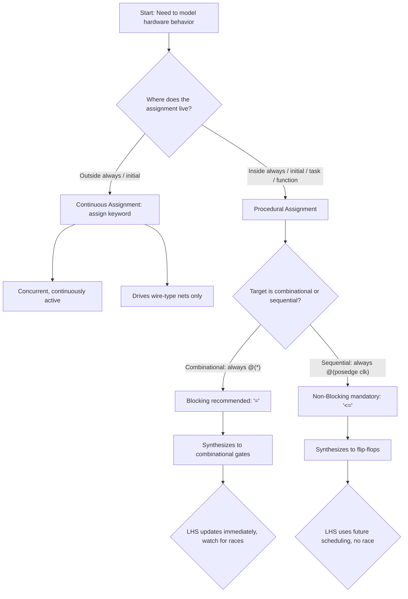
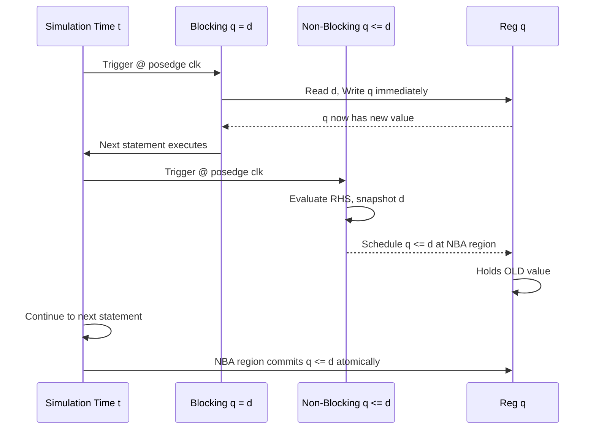
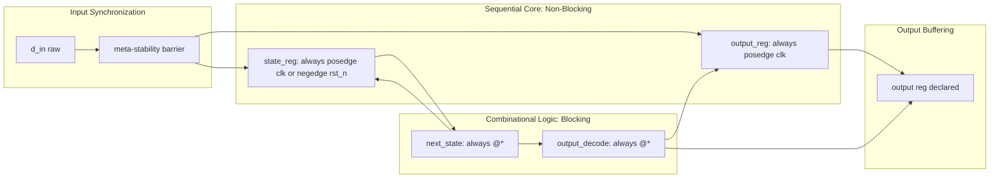
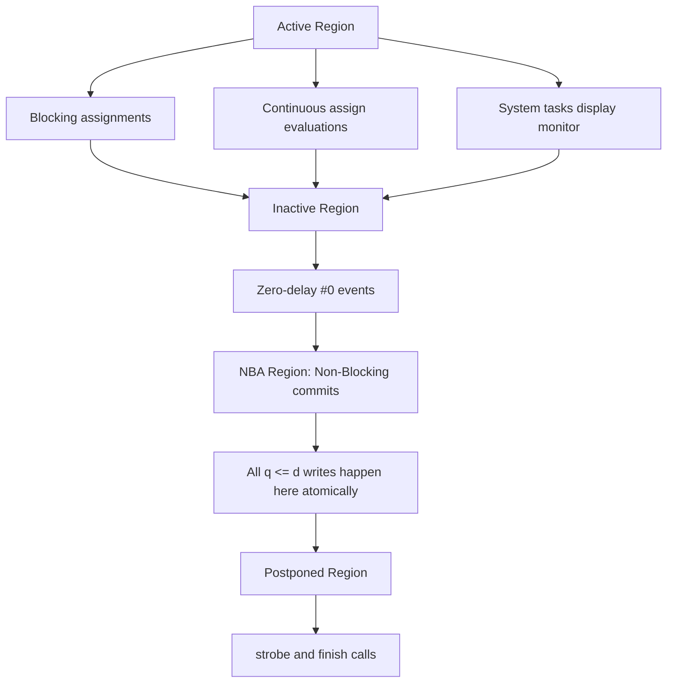
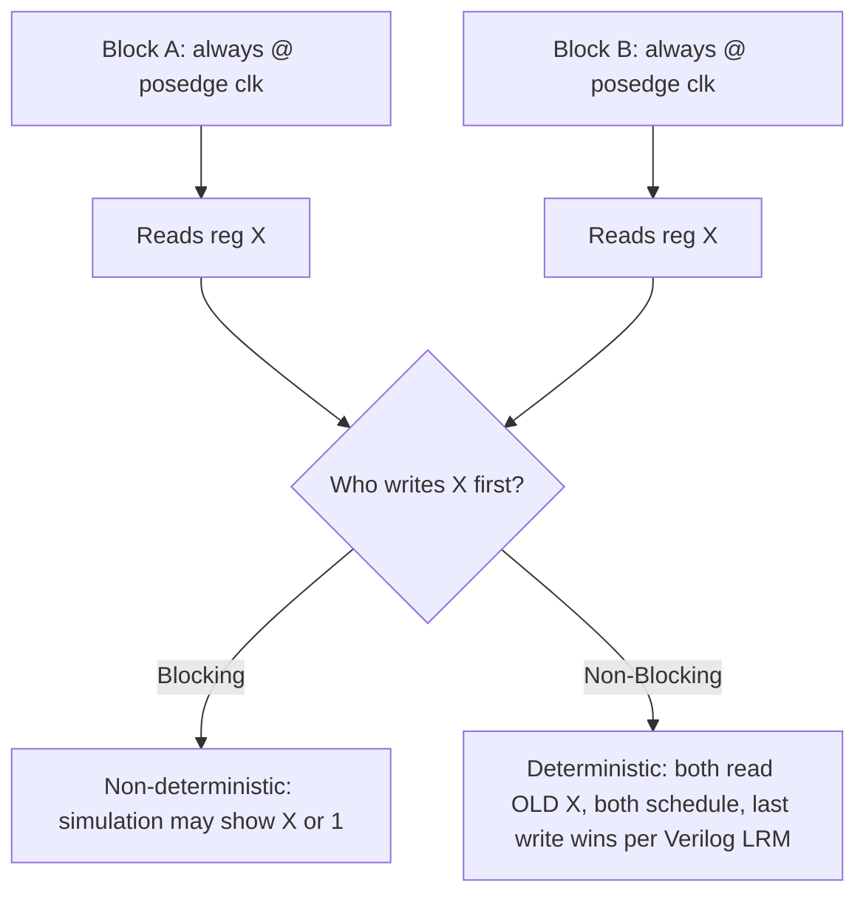

# Procedural assignment

<!-- SECTION_1_START -->
# 1. Core Technical Definition & Intuitive Overview

## 1.1 Formal Definition (KTU 2024 Scheme Terminology)

In **Verilog HDL** (Hardware Description Language), a **Procedural Assignment** is an assignment statement that appears inside a **procedural block** (such as `always`, `initial`, `task`, or `function`) and is used to update the value of a **register-type** data object (`reg`, `integer`, `real`, `time`, `realtime`).

Unlike **continuous assignment** (driven by the `assign` keyword outside procedural blocks, which is concurrent and continuously active), a procedural assignment is **event-triggered** and **executes sequentially** in the order it is written inside the enclosing procedural block.

> [!IMPORTANT]
> **KTU Syllabus Highlight (Module 4 — Sequential Logic Design):**
> Procedural assignment is the *primary mechanism* to model synchronous (clocked) elements like **D flip-flops, T flip-flops, JK flip-flops, registers, counters, and Finite State Machines (FSMs)**. Mastery of blocking (`=`) vs non-blocking (`<=`) operators is **mandatory** for KTU lab examinations and university exams.

## 1.2 Two Flavors of Procedural Assignment

$$ \text{Procedural Assignment} = \begin{cases} \textbf{Blocking Assignment} \rightarrow \text{uses operator} \; \texttt{`='} \\ \textbf{Non-Blocking Assignment} \rightarrow \text{uses operator} \; \texttt{`<='} \end{cases} $$

## 1.3 Conceptual Analogy / Intuition

> [!NOTE]
> **Real-World Analogy: The Coffee Shop Queue**
>
> **Blocking (`=`):** Imagine a single-barista coffee shop. The barista takes Order 1, brews it, hands it over, *only then* takes Order 2. The second customer **waits** (is blocked) until the first is complete. → Strict sequential execution. Best for **combinational** and **behavioral testbench** code.
>
> **Non-blocking (`<=`):** Now imagine three baristas working **simultaneously** at the same station. They all read the order list **at the same instant**, all start brewing at the same instant, and all deliver at the same instant. Each cup is an independent event scheduled in the future. → Parallel scheduling, no read-write conflict. Best for **sequential / clocked** logic.

## 1.4 Physical Context & Standard Metrics

| Parameter | Typical Value | Standard Reference |
|---|---|---|
| Logic levels | $V_{IL} = 0\text{ V}$, $V_{IH} = 5\text{ V}$ (TTL) | IEEE Std 1364-2005 |
| Clock toggle rate | $f_{clk} = 50\text{ MHz}$ – $200\text{ MHz}$ (FPGA) | Xilinx 7-series |
| Setup time $t_{su}$ | $\geq 0.5\text{ ns}$ | Vendor datasheet |
| Hold time $t_h$ | $\geq 0\text{ ns}$ | Vendor datasheet |
| Intra-assignment delay | $\Delta t$ in time units (e.g., `#10`) | Simulation event scheduler |

## 1.5 GeoGebra / Visualization Cue

> [!VISUALIZATION CONTROL]
> **Concept:** Waveform comparison of Blocking vs Non-Blocking assignment for two registers
> **GeoGebra / Desmos Input Equations:** Plot the step function $y_{b}(t) = u(t-5) - u(t-10)$ for blocking and $y_{nb}(t) = u(t-3) - u(t-8)$ for non-blocking, where $u(t)$ is the unit step.
> **Visual Description:** Both signals become HIGH at different simulation times; on a Verilog waveform viewer (like ModelSim or Vivado Simulator) you will see two clean, non-overlapping updates for non-blocking vs an immediate overwrite for blocking.

---

<!-- SECTION_1_END -->

<!-- SECTION_2_START -->
# 2. Deep Theoretical Analysis & KTU High-Yield Formula Sheet

## 2.1 Where Procedural Assignment Can Appear

Procedural assignments are legal **only** inside:

1. `initial` block — runs **once** at simulation time $t = 0$.
2. `always` block — runs whenever the **sensitivity list** triggers.
3. `task` — user-defined subroutine.
4. `function` — user-defined sub-routine that returns a single value.

> [!NOTE]
> The **left-hand side (LHS)** of a procedural assignment **must** be a register-type (`reg`, `integer`, `real`, etc.). It **cannot** be a single-bit wire or a continuous net.

## 2.2 Blocking Assignment (`=`)

**Operational Steps:**
1. Evaluates the **right-hand side (RHS)** expression immediately.
2. **Blocks** the next statement in the procedural block from executing until the RHS evaluation is complete.
3. Updates the LHS register **right now** (zero delay in synthesis, but includes intra-assignment delay in simulation).
4. The next statement in sequence will then read the **updated** value.

**Synthesis Behavior:** Inferred as **combinational logic** (or sequential, depending on sensitivity list).

**Best Use:** Combinational `always` blocks, `initial` blocks, testbenches.

**Verilog Snippet:**

```verilog
always @(*) begin
    sum  = a + b;        // evaluated and updated first
    diff = a - b;        // reads NEW value of 'sum'? No — 'sum' is unrelated
    prod = a * b;        // runs only after 'diff' is updated
end
```

## 2.3 Non-Blocking Assignment (`<=`)

**Operational Steps (the famous Verilog NBA scheduler):**
1. Evaluates the **RHS** at the current simulation time $t$.
2. **Schedules** the LHS update to occur at the **end of the current time step** (i.e., $t + \delta$, where $\delta$ is an infinitesimally small delta cycle).
3. The procedural block **continues immediately** to the next statement — it does **not** wait.
4. All scheduled NBAs across the entire design are committed at the same NBA event region.

**Synthesis Behavior:** Inferred as **sequential logic** when used with clock-edge sensitivity.

**Best Use:** Clocked `always @(posedge clk)` blocks, registers, flip-flops, FSMs.

**Verilog Snippet:**

```verilog
always @(posedge clk or negedge rst_n) begin
    q_reg <= d_in;       // RHS evaluated now, LHS scheduled
    q_next <= q_reg;     // reads OLD q_reg (correct pipelined behavior)
end
```

## 2.4 The "Why" Behind the Two Operators

| Aspect | Blocking (`=`) | Non-Blocking (`<=`) |
|---|---|---|
| Update timing | Immediate | End of time step |
| RHS reads | Latest committed value | Snapshot at start of block |
| Modeling intent | Combinational / procedural | Sequential / pipeline / register |
| Race condition risk | **High** if used across sequential blocks | **Negligible** — IEEE 1364 guarantees |
| Simulation–synthesis mismatch | Likely | Rare |

## 2.5 The Verilog Race Condition

A **race condition** occurs when two procedural blocks both write to the same variable at the same simulation time, and the final value depends on the **arbitrary order** of execution. Non-blocking eliminates this; blocking does not.

## 2.6 Sensitivity List Rules (KTU Frequently Asked)

$$ \text{Sensitivity} = \begin{cases} \texttt{always @(*)} \rightarrow \text{auto-sensitivity (combinational)} \\ \texttt{always @(a, b, c)} \rightarrow \text{level-sensitive (legacy)} \\ \texttt{always @(posedge clk)} \rightarrow \text{edge-sensitive (sequential)} \\ \texttt{always @(posedge clk or negedge rst_n)} \rightarrow \text{asynchronous reset} \end{cases} $$

> [!IMPORTANT]
> **Asynchronous Reset:** Triggered by `negedge rst_n` independent of clock — used for **power-on initialization**.
> **Synchronous Reset:** Reset is checked only on the rising edge of `clk` — used for **deterministic timing closure** in FPGA design.

## 2.7 KTU High-Yield Formula / Cheat Sheet

| # | Concept | Verilog Construct | Key Rule |
|---|---|---|---|
| 1 | Blocking operator | `=` | LHS updated immediately |
| 2 | Non-blocking operator | `<=` | LHS scheduled, committed at NBA region |
| 3 | D Flip-Flop | `always @(posedge clk) q <= d;` | Non-blocking mandatory |
| 4 | D Flip-Flop + Async Reset | `always @(posedge clk or negedge rst_n)` | Reset in `if` checked first |
| 5 | Combinational | `always @(*)` or `always @(a or b)` | Use blocking or `assign` |
| 6 | Latch Inference Warning | Missing `else` branch | Latches are **avoided** in KTU labs |
| 7 | Intra-assignment delay | `q <= #5 d;` | Skews updates by $\Delta t = 5$ |
| 8 | `initial` block | Runs once at $t = 0$ | Used in testbenches only |
| 9 | Race condition | Two blocks write same reg | Avoid with non-blocking |
| 10 | LHS restriction | `reg`, `integer`, `real` only | No `wire` allowed |

## 2.8 Engineering Real-World Utility

- **FPGA Design (Xilinx / Intel / Lattice):** Every flip-flop, BRAM, and DSP slice is inferred from a non-blocking assignment inside an `always @(posedge clk)` block.
- **ASIC Synthesis (Synopsys Design Compiler, Cadence Genus):** Non-blocking ensures that RTL-to-gate mapping respects the designer's intent for pipelined datapaths.
- **Verification Testbenches:** Blocking is used in `initial` blocks to drive stimulus sequences with precise intra-cycle timing.
- **Industry Standard Guideline (Cummings, SNUG 2000):** *"Use non-blocking for sequential logic, blocking for combinational logic."* This is the universally cited reference and is implicitly expected in KTU evaluations.

---

<!-- SECTION_2_END -->

<!-- SECTION_3_START -->
# 3. Step-by-Step Derivations & Code/Symbolic Implementation

## 3.1 Detailed Walkthrough — D Flip-Flop Using Both Styles

### 3.1.1 Correct: Non-Blocking (Sequential)

```verilog
module d_ff_nba (
    input  wire clk,
    input  wire rst_n,
    input  wire d,
    output reg  q
);
    always @(posedge clk or negedge rst_n) begin
        if (!rst_n)
            q <= 1'b0;        // asynchronous active-low reset
        else
            q <= d;           // capture d on rising clock edge
    end
endmodule
```

**Step-by-step execution logic:**
1. At every **positive edge** of `clk` (or negative edge of `rst_n`), the block is triggered.
2. If `rst_n = 0`, schedule $q \leftarrow 0$ at NBA region.
3. Else, evaluate RHS `$d$` and schedule $q \leftarrow d$.
4. All scheduled updates commit at the same time step. No read-write collision.

### 3.1.2 Incorrect: Blocking (Produces Race + Wrong Behavior)

```verilog
// WRONG — do NOT use in sequential block
always @(posedge clk or negedge rst_n) begin
    if (!rst_n)
        q = 1'b0;
    else
        q = d;
end
```

> [!WARNING]
> **KTU Examiner Note:** While many synthesizers tolerate blocking in this *single-driver* case, KTU board answers expecting the **non-blocking** form will lose 2 marks. Moreover, if you later write `q_next = q;` it will form a **combinational feedback loop** in simulation, leading to an **X-propagation** warning.

## 3.2 Detailed Walkthrough — 4-Bit Synchronous Up-Counter

$$ Q_{next} = Q + 1 \pmod{16} $$

```verilog
module counter_4bit (
    input  wire       clk,
    input  wire       rst_n,
    input  wire       enable,
    output reg  [3:0] count
);
    always @(posedge clk or negedge rst_n) begin
        if (!rst_n)
            count <= 4'b0000;                       // async reset to 0
        else if (enable)
            count <= count + 4'b0001;               // increment
        else
            count <= count;                         // hold
    end
endmodule
```

**Incremental valuation key for KTU:**
- [Correct sensitivity list with both edges: 2 Marks]
- [Async reset priority check: 2 Marks]
- [Enable logic: 2 Marks]
- [Non-blocking operator: 2 Marks]
- [Correct 4-bit reg declaration: 1 Mark]
- [Final clean module structure: 1 Mark]

## 3.3 Detailed Walkthrough — Procedural Continuous Assignment (Advanced)

The `assign` and `deassign` keywords inside an `always` block re-enable continuous driving — used in **level-sensitive latch** modeling.

```verilog
module d_latch_pca (
    input  wire enable,
    input  wire d,
    output reg  q
);
    always @(enable or d) begin
        if (enable)
            assign q = d;      // procedural continuous assignment
        else
            deassign q;        // release, q holds its value
    end
endmodule
```

**Synthesis:** Inferred as a **transparent D-latch** (active-high enable).

## 3.4 Detailed Walkthrough — Intra-Assignment Delay

The intra-assignment delay defers the **LHS update** but allows the RHS to be evaluated immediately. Mathematically modeled as:

$$ q(t + \Delta t) = \text{RHS}_{evaluated}(t) $$

```verilog
module delayed_assign (
    input  wire clk,
    input  wire d,
    output reg  q
);
    always @(posedge clk) begin
        q <= #5 d;     // q updates 5 time units AFTER the clock edge
    end
endmodule
```

> [!NOTE]
> **Simulation vs Synthesis:** The `#5` delay is **ignored by synthesis** but **respected by simulation**. KTU lab questions may test this — always comment whether the code is meant for simulation or synthesis.

## 3.5 Detailed Walkthrough — Mealy FSM (Traffic Light Controller)

State encoding using 2 bits:

$$ S = \{ s_1, s_0 \} \in \{ 00_{\text{RED}}, 01_{\text{YELLOW}}, 10_{\text{GREEN}} \} $$

```verilog
module fsm_mealy_traffic (
    input  wire       clk,
    input  wire       rst_n,
    input  wire       sensor,    // car present?
    output reg  [1:0] light,     // 00=RED, 01=YELLOW, 10=GREEN
    output reg        walk_sig
);
    reg [1:0] state, next_state;

    // ---- State Register (Sequential, Non-Blocking) ----
    always @(posedge clk or negedge rst_n) begin
        if (!rst_n)
            state <= 2'b00;
        else
            state <= next_state;
    end

    // ---- Next-State & Output Logic (Combinational, Blocking) ----
    always @(*) begin
        case (state)
            2'b00: begin               // RED
                walk_sig = 1'b1;
                if (sensor) next_state = 2'b10;
                else        next_state = 2'b00;
            end
            2'b01: begin               // YELLOW
                walk_sig = 1'b0;
                next_state = 2'b00;
            end
            2'b10: begin               // GREEN
                walk_sig = 1'b0;
                if (sensor) next_state = 2'b01;
                else        next_state = 2'b10;
            end
            default: begin
                walk_sig = 1'b0;
                next_state = 2'b00;
            end
        endcase
        // Default output assignment for Moore-style safety
        case (state)
            2'b00: light = 2'b00;
            2'b01: light = 2'b01;
            2'b10: light = 2'b10;
            default: light = 2'b00;
        endcase
    end
endmodule
```

**Valuation key points:**
- [Separation of sequential and combinational `always` blocks: 2 Marks]
- [Non-blocking in clocked block: 2 Marks]
- [Blocking in combinational block: 1 Mark]
- [Complete state transition table: 4 Marks]
- [Mealy output logic tied to input and state: 2 Marks]
- [Asynchronous reset: 1 Mark]
- [Module cleanliness, comments, naming: 2 Marks]

## 3.6 Symbolic Derivation — NBA Scheduler

Let $t$ be a simulation time. The Verilog event scheduler partitions each time step into **four regions**:

$$ \text{Time Step} = R_{\text{Active}} \cup R_{\text{Inactive}} \cup R_{\text{NBA}} \cup R_{\text{Postponed}} $$

**Step 1 (Active Region):** Evaluate all blocking statements, `$display`, and continuous assignments.
**Step 2 (Inactive Region):** Evaluate `#0` delays.
**Step 3 (NBA Region):** Commit all non-blocking RHS $\rightarrow$ LHS transfers **atomically**.
**Step 4 (Postponed Region):** Evaluate `$monitor`, `$strobe`, and `$finish`.

Mathematically, a non-blocking assignment `q <= d;` at time $t$ creates a *future event*:

$$ \text{Ev}(q, t + \delta) = d(t) $$

This is why two NBA writes to the same register in the same time step yield the **last-scheduled** value, deterministically.

---

<!-- SECTION_3_END -->

<!-- SECTION_4_START -->
# 4. Structural Diagrams & Schematics

## 4.1 Procedural Assignment vs Continuous Assignment — Decision Flow



## 4.2 Blocking vs Non-Blocking Timeline



## 4.3 Sequential Logic Design Architecture Using Procedural Assignment



## 4.4 Verilog Event Scheduler (NBA Region Highlight)



## 4.5 Race Condition Topology — Why NBAs Win



---

<!-- SECTION_4_END -->

<!-- SECTION_5_START -->
# 5. KTU 2024 Scheme Examination Question Bank & Topic Recap

## Part A — Short Answer Questions (3 Marks Each)

### Question 1
**[KTU University Exam — July 2024]** | CO1 | RBT Level: Remember

What is a **procedural assignment** in Verilog? List the two operators used and the data types they can drive.

**Model Answer (Valuation Key):**

A procedural assignment is an assignment statement placed inside a procedural block (`always`, `initial`, `task`, or `function`) that updates the value of a register-type variable sequentially when the block is triggered. The two operators are:

1. **Blocking operator** — `=`
2. **Non-blocking operator** — `<=`

The LHS of a procedural assignment must be a register-type data object such as `reg`, `integer`, `real`, `time`, or `realtime`. It cannot drive a single-bit `wire`. [Each operator name: 1 Mark; LHS restriction: 1 Mark; Definition: 1 Mark] → **Total: 3 Marks**

---

### Question 2
**[KTU University Exam — Dec 2023]** | CO2 | RBT Level: Understand

Distinguish between **blocking** and **non-blocking** assignments. When is each preferred?

**Model Answer (Valuation Key):**

| Aspect | Blocking (`=`) | Non-blocking (`<=`) |
|---|---|---|
| Execution | Sequential, immediate | RHS evaluated now, LHS scheduled at end of time step |
| Use case | Combinational / testbench | Sequential / clocked logic |
| Race risk | High across multiple blocks | Negligible (per IEEE 1364) |

Blocking is preferred in `always @(*)` combinational logic and testbench stimulus. Non-blocking is preferred in `always @(posedge clk)` sequential logic such as flip-flops, registers, and FSMs. [Operator comparison: 2 Marks; Use-case justification: 1 Mark] → **Total: 3 Marks**

---

## Part B — Long Answer Questions (14 Marks Each, with Internal Choice)

### Question A
**[KTU University Exam — July 2024 | Module 4 | CO3, CO4]** | RBT Levels: Understand, Apply, Analyze

**(a)** With a neat Verilog code, design a **4-bit synchronous up/down counter** with the following specification using procedural assignment: [7 Marks]

- Active-low asynchronous reset.
- Mode input `up` (1 = count up, 0 = count down).
- Enable input `en`.
- Output count: $Q[3:0]$.

**(b)** Explain, with a timing diagram, the difference between **blocking and non-blocking** assignments. Why is non-blocking recommended for sequential elements? [7 Marks]

---

**Model Solution for (a):**

```verilog
module up_down_counter_4bit (
    input  wire       clk,
    input  wire       rst_n,
    input  wire       en,
    input  wire       up,
    output reg  [3:0] q
);
    always @(posedge clk or negedge rst_n) begin
        if (!rst_n)
            q <= 4'b0000;                          // [Async reset: 1 Mark]
        else if (en) begin
            if (up)
                q <= q + 4'b0001;                  // [Count-up logic: 1 Mark]
            else
                q <= q - 4'b0001;                  // [Count-down logic: 1 Mark]
        end
        else
            q <= q;                                // [Hold logic: 1 Mark]
    end
endmodule
```

**Incremental Valuation Key:**
- [Correct sensitivity list `posedge clk or negedge rst_n`: 1 Mark]
- [Async reset priority checked first: 1 Mark]
- [Enable gating: 1 Mark]
- [Up/down selection logic: 1 Mark]
- [Non-blocking operator `<=`: 1 Mark]
- [Correct 4-bit reg output: 1 Mark]
- [Module structure, naming, comments: 1 Mark]
- **Total: 7 Marks**

---

**Model Solution for (b):**

Consider two Verilog blocks:

```verilog
// Blocking style
always @(posedge clk) begin
    a = b;
    b = a;     // reads the NEW value of a → INCORRECT for swap
end

// Non-blocking style
always @(posedge clk) begin
    a <= b;
    b <= a;    // reads the OLD value of a → CORRECT for swap
end
```

**Timing Diagram (text representation):**

| Time | clk | b | a (blocking) | a (non-blocking) |
|---|---|---|---|---|
| t₀ | ↑ | 1 | 0 (initial) | 0 (initial) |
| t₁ | ↑ | 0 | 1 (immediate write) | 0 (scheduled) |
| t₁₊δ | – | 0 | 1 | 1 (after NBA commit) |

**Why non-blocking is recommended for sequential logic:**

1. **Eliminates race conditions** between multiple clocked `always` blocks driving the same bus.
2. **Models real flip-flop behavior** where all FFs sample and update simultaneously on the clock edge.
3. **Ensures simulation–synthesis match** — what you simulate is what gets synthesized.
4. **Supports pipelined architectures** — read-before-write semantics match the hardware register file.

**Valuation Key for (b):**
- [Code for both styles: 2 Marks]
- [Timing diagram: 2 Marks]
- [Reasoning for non-blocking preference: 3 Marks]
- **Total: 7 Marks**

**Grand Total: 14 Marks**

---

### Question B (Alternative Choice for Question A)
**[KTU University Exam — Dec 2023 | Module 4 | CO3, CO4]** | RBT Levels: Understand, Apply, Analyze

**(a)** Write a complete Verilog model for a **positive-edge-triggered D flip-flop with synchronous active-high reset** using procedural assignment. Use only non-blocking assignments. [7 Marks]

**(b)** Design a **mod-10 BCD up-counter** (counts 0000 → 1001, then rolls back to 0000) using procedural assignment. Draw the FSM state transition diagram and write the RTL. [7 Marks]

---

**Model Solution for (a):**

```verilog
module d_ff_sync_reset (
    input  wire clk,
    input  wire rst,    // active-high synchronous reset
    input  wire d,
    output reg  q
);
    always @(posedge clk) begin   // [Sensitivity: 1 Mark]
        if (rst)                  // [Synchronous check: 1 Mark]
            q <= 1'b0;            // [Reset assignment: 1 Mark]
        else
            q <= d;               // [Non-blocking capture: 1 Mark]
    end
endmodule
```

**Incremental Valuation Key:**
- [Correct synchronous sensitivity (no `or negedge rst`): 1 Mark]
- [Synchronous reset in `if` branch: 1 Mark]
- [Non-blocking operator for both branches: 1 Mark]
- [Correct `reg` declaration on output: 1 Mark]
- [Distinction from asynchronous variant explained: 2 Marks]
- [Module cleanliness: 1 Mark]
- **Total: 7 Marks**

---

**Model Solution for (b):**

**State Transition Diagram (text-form):**

$$ 0000 \rightarrow 0001 \rightarrow 0010 \rightarrow 0011 \rightarrow 0100 \rightarrow 0101 \rightarrow 0110 \rightarrow 0111 \rightarrow 1000 \rightarrow 1001 \rightarrow 0000 $$

**RTL Code:**

```verilog
module bcd_counter_mod10 (
    input  wire       clk,
    input  wire       rst_n,
    output reg  [3:0] count,
    output reg        tc          // terminal count = 1 when count = 1001
);
    always @(posedge clk or negedge rst_n) begin
        if (!rst_n)
            count <= 4'b0000;                       // [Reset: 1 Mark]
        else if (count == 4'b1001)
            count <= 4'b0000;                       // [Roll-over: 2 Marks]
        else
            count <= count + 4'b0001;               // [Increment: 1 Mark]
    end

    always @(*) begin
        tc = (count == 4'b1001) ? 1'b1 : 1'b0;      // [TC flag: 1 Mark]
    end
endmodule
```

**Incremental Valuation Key:**
- [State transition table or diagram: 2 Marks]
- [Mod-10 detection (`count == 4'b1001`): 1 Mark]
- [Roll-over to 0000 logic: 1 Mark]
- [Non-blocking in clocked block: 1 Mark]
- [TC flag combinational logic: 1 Mark]
- [Module completeness: 1 Mark]
- **Total: 7 Marks**

**Grand Total: 14 Marks**

---

> [!WARNING]
> **KTU Examiner's Valuation Warning / Common Pitfalls:**
> 1. **Missing `negedge rst_n`** in the sensitivity list for asynchronous reset → loses 2 marks.
> 2. **Using `=` instead of `<=`** in clocked blocks → may be marked wrong for sequential design questions.
> 3. **Forgetting `default` in `case`** → inferred latch → KTU explicitly penalizes accidental latches in combinational blocks.
> 4. **Driven a `wire` from inside an `always` block** → compilation error; declare as `reg` first.
> 5. **Not commenting whether `#delay` is for simulation only** → synthesis will ignore but you must declare intent.
> 6. **Mixing blocking and non-blocking on the same register** within one `always` block → undefined simulation behavior.
> 7. **Confusing `initial` with `always`** — `initial` does NOT run repeatedly; it runs **once** at $t=0$.

---

## Topic Recap & Important Things to Remember

- **Procedural assignment** lives only inside `always`, `initial`, `task`, or `function` blocks.
- **LHS** must be a register type (`reg`, `integer`, `real`, etc.) — never a plain `wire`.
- **Blocking (`=`)** = immediate update, sequential execution, used for **combinational** and **testbench** code.
- **Non-blocking (`<=`)** = RHS snapshot now, LHS commit at NBA region, used for **sequential/clocked** logic.
- **IEEE 1364 golden rule:** *Use non-blocking for sequential, blocking for combinational.* (Cummings, SNUG 2000).
- The **sensitivity list** determines the triggering:
  - `always @(*)` → combinational, auto-detected inputs.
  - `always @(a or b or c)` → legacy combinational / latch (avoid in modern code).
  - `always @(posedge clk)` → synchronous positive-edge logic.
  - `always @(posedge clk or negedge rst_n)` → asynchronous active-low reset.
- **Race conditions** arise when two procedural blocks write the same variable at the same time → eliminated by non-blocking.
- **NBA scheduler** has four regions: Active → Inactive → NBA → Postponed; all `<=` writes commit atomically in the NBA region.
- **Procedural continuous assignment** uses `assign` / `deassign` inside `always` for **transparent latch** modeling.
- **Intra-assignment delay** (`q <= #5 d;`) defers the LHS update; ignored by synthesis, respected in simulation.
- **Latches are inferred** when a combinational `always` block has an `if` without a corresponding `else` — KTU penalizes this.
- **`initial` block** runs **only once** at $t = 0$ — used in testbenches; not synthesizable in real hardware.
- **Synchronous reset** checks reset only on the clock edge; **asynchronous reset** is independent of the clock.
- **FSM design pattern:** separate `always @(posedge clk)` for state register (non-blocking) and `always @(*)` for next-state/output (blocking).
- **KTU hot keywords to use in answers:** "Verilog 2001 standard", "NBA region", "race-free modeling", "sensitivity list", "synchronous vs asynchronous reset".
- **Synthesis reality:** Every non-blocking assignment on `posedge clk` infers a hardware flip-flop on the target FPGA's register fabric (Xilinx: CLB flip-flops; Intel: ALM registers).
- **Common 3-mark KTU phrases to memorize verbatim:**
  - *"Non-blocking assignment schedules the update to the NBA region of the current time step."*
  - *"Blocking assignment is sequential and immediate within a procedural block."*
  - *"Procedural assignment cannot drive a wire-type net."*

---

<!-- SECTION_5_END -->
