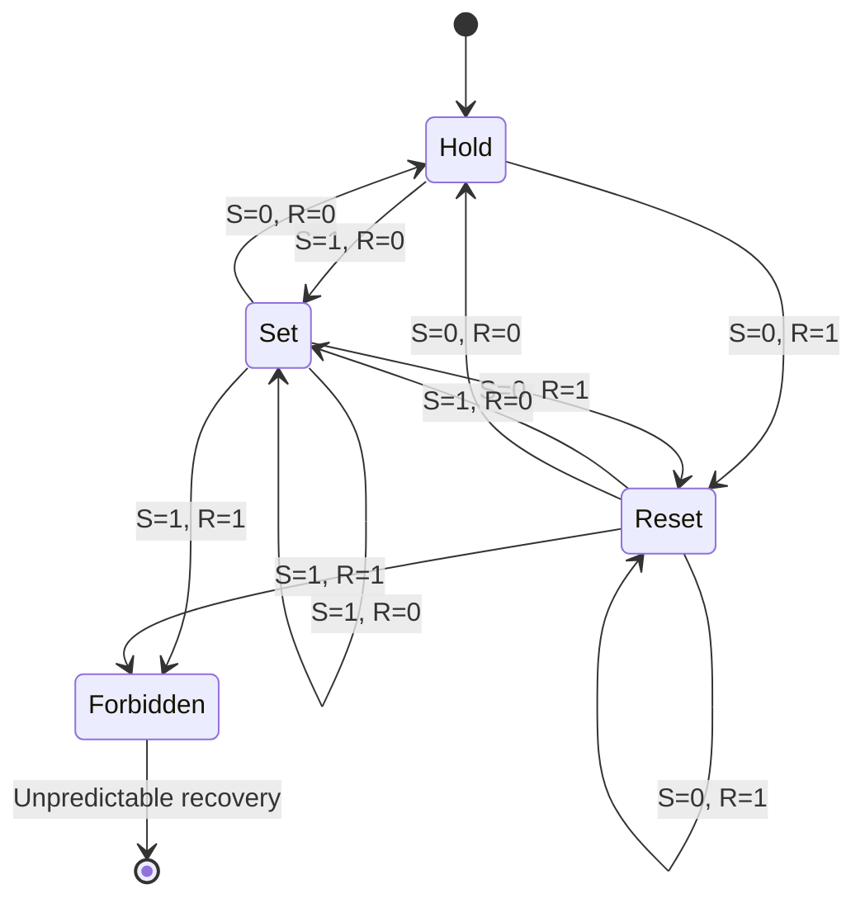
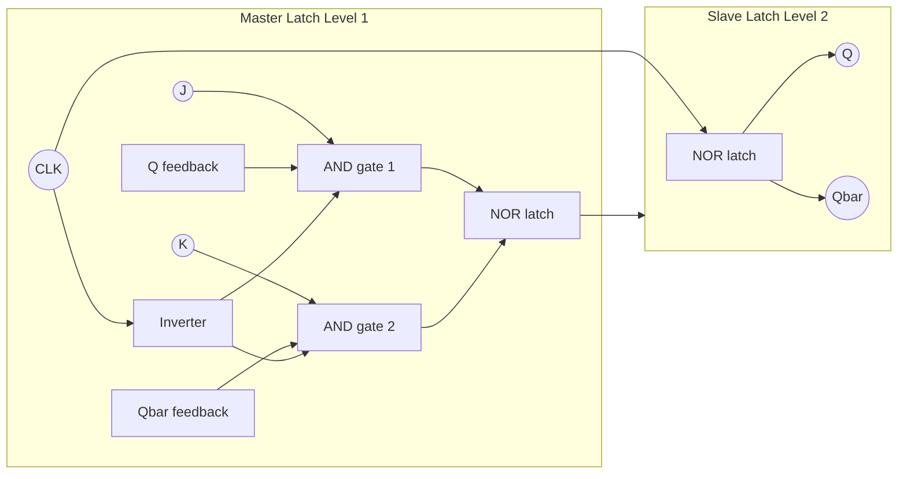
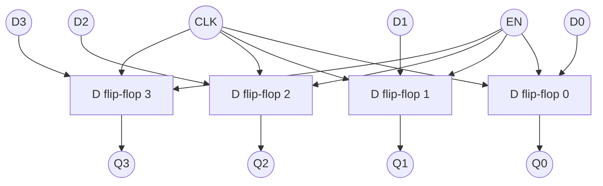
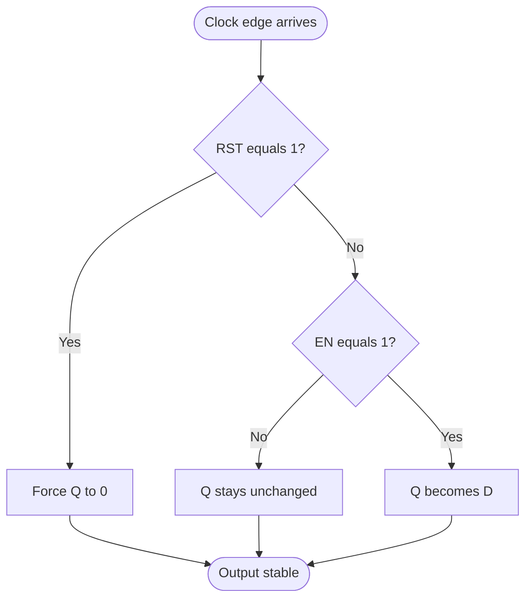
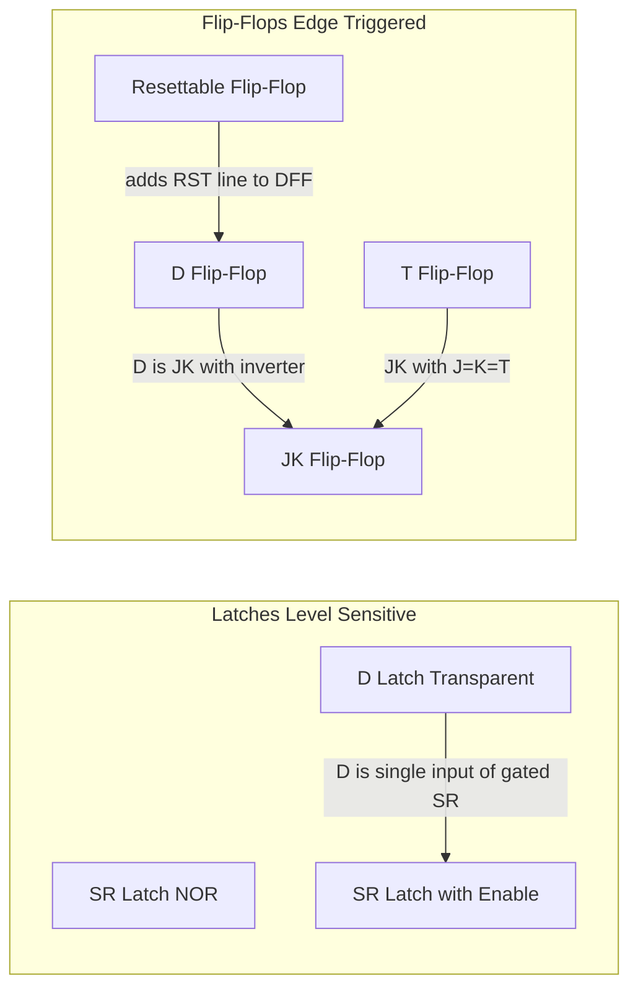

# Sequential Logic Design  :- Latches and Flip-Flops- SR latch, SR latch with enable, JK flipflop, D flipflop, Register Enabled Flip-Flop, Resettable Flip-Flop.

<!-- SECTION_1_START -->
# Sequential Logic Design: Latches and Flip-Flops

## 1.1 Formal Academic Definition

In the framework of **Digital Electronics and Logic Design (GAEST305)** under the **KTU 2024 Scheme**, a *sequential circuit* is formally defined as a digital logic network whose output at any given time $t$ is a deterministic function of **both** the present input variables $X(t)$ **and** the past history of inputs (stored in the circuit's internal state). This is mathematically expressed as:

$$Y(t) = F\big(X(t),\; Q(t^-)\big)$$

where $Q(t^-)$ represents the *memory state* of the circuit *just prior* to the current evaluation instant. The fundamental memory element that stores this state $Q$ is the **bistable element**, realized physically as a **Latch** or a **Flip-Flop**.

> [!IMPORTANT]
> **KTU Syllabus Highlight (Module 4):** A *Latch* is a level-sensitive bistable memory device (transparent when enable = 1), whereas a *Flip-Flop* is an edge-triggered bistable memory device (transitions only on a clock edge $\uparrow$ or $\downarrow$). This distinction is a **favourite 3-mark question**.

| Device | Triggering | Transparent Window | Edge Dependency |
| :--- | :--- | :--- | :--- |
| Latch | **Level-sensitive** | Entire time when $E = 1$ | None |
| Flip-Flop | **Edge-sensitive** | Zero (only at $\uparrow$ or $\downarrow$) | Strict |

## 1.2 Conceptual Analogy / Intuition

Imagine a **marble on a staircase with two steps** (let's call them Step 0 and Step 1).

- A **Latch** is like a child who **constantly watches** the parent. Whenever the parent says "go to Step 1" or "go to Step 0," *as long as the parent is talking* (the *enable* signal is high), the child immediately moves. The instant the parent says "stay" (enable goes low), the child freezes on whatever step they were on.
- A **Flip-Flop** is like a child who **only listens at the moment a bell rings** (the clock edge). Between bells, the child is deaf to instructions. The child only updates position precisely when the bell strikes.
- A **Register** is simply a **row of such children**, each holding a bit of a multi-bit number (like a scoreboard in a cricket stadium).
- A **Resettable Flip-Flop** is a child who, on hearing a special *"reset whistle,"* must instantly drop everything and return to Step 0, regardless of the bell or the parent.

> [!NOTE]
> **Physical Constant:** The standard propagation delay $t_{pd}$ of a CMOS 74-series latch (e.g., 74HC373) is typically **5 ns to 15 ns**, while a 74HC74 D flip-flop has a typical clock-to-Q delay of approximately **12 ns**. These parameters decide the maximum usable clock frequency $f_{max} = \dfrac{1}{2 \cdot t_{pd}}$.

> [!VISUALIZATION CONTROL]
> **Concept:** Bistable hysteresis loop of an SR latch (transfer characteristic).
> **GeoGebra / Desmos Input Equations:**
> * `Q_next = 0.5 + 0.5 * tanh(8*(S - R - 0.5))`  (S-shaped curve)
> * `Q_next = Q` (45-degree unity line)
> * Point intersections: `(0,0)` and `(1,1)`
> **Visual Description:** The S-curve crosses the unity line at the two stable points **Q = 0** and **Q = 1**. The flat middle region (Q = 0.5) is metastable and must be avoided.
<!-- SECTION_1_END -->

<!-- SECTION_2_START -->
# Deep Theoretical Analysis & KTU High-Yield Formula Sheet

## 2.1 The SR Latch (Set-Reset Latch) — Cross-Coupled NOR Version

The most primitive bistable element. It uses two cross-coupled NOR gates (or alternatively, NAND gates with active-low inputs).

### 2.1.1 Construction & Logic

Let the inputs be $S$ (Set) and $R$ (Reset), and outputs be $Q$ and $\bar{Q}$. Using NOR gates:

$$Q = \overline{(R + Q_{prev})}, \qquad \bar{Q} = \overline{(S + \bar{Q}_{prev})}$$

### 2.1.2 Characteristic Table (Truth Behavior)

| S | R | $Q_{next}$ | $\bar{Q}_{next}$ | Operation | Verdict |
| :---: | :---: | :---: | :---: | :--- | :--- |
| 0 | 0 | $Q$ | $\bar{Q}$ | **Hold / Memory** | Valid stable state |
| 0 | 1 | 0 | 1 | **Reset** | Valid |
| 1 | 0 | 1 | 0 | **Set** | Valid |
| 1 | 1 | 0 | 0 | **Forbidden / Invalid** | $Q = \bar{Q} = 0$ violates the complementary law |

> [!IMPORTANT]
> **KTU High-Yield Note:** The condition $S = R = 1$ is *forbidden* because if both inputs simultaneously return to 0, the resulting next state becomes *unpredictable* (race condition). Examiners love asking: *"Why is $S=R=1$ forbidden in an SR latch?"*

## 2.2 SR Latch with Enable (Gated SR Latch)

This adds a control/enable input $E$ (also called $C$ or $G$ for gate) that *gates* the inputs through AND gates:

$$S_{eff} = S \cdot E, \qquad R_{eff} = R \cdot E$$

When $E = 0$: both $S_{eff} = R_{eff} = 0 \Rightarrow$ **Hold** state.
When $E = 1$: behaves exactly like a normal SR latch.

## 2.3 JK Flip-Flop (Master-Slave / Edge-Triggered)

The JK flip-flop is the **universal flip-flop** that **eliminates the forbidden state** of the SR latch by using the feedback of $Q$ and $\bar{Q}$ to define the toggle behavior when both inputs are 1.

### 2.3.1 Characteristic Equation

$$Q_{next} = J \cdot \bar{Q} + \bar{K} \cdot Q$$

### 2.3.2 Characteristic Table

| J | K | $Q_{next}$ | Operation |
| :---: | :---: | :---: | :--- |
| 0 | 0 | $Q$ | **Hold** (No Change) |
| 0 | 1 | 0 | **Reset** |
| 1 | 0 | 1 | **Set** |
| 1 | 1 | $\bar{Q}$ | **Toggle** |

## 2.4 D Flip-Flop (Data / Delay Flip-Flop)

The single most widely used flip-flop in modern digital design. It is essentially an SR latch with a single input $D$ and an inverter forcing $R = \bar{S}$.

$$Q_{next} = D$$

Behavior: On the active clock edge, the output $Q$ becomes exactly equal to $D$. Hence, the name "Delay" — it delays the input by one clock cycle.

## 2.5 T Flip-Flop (Toggle Flip-Flop)

Derived from the JK by tying $J = K = T$:

$$Q_{next} = T \oplus Q = T \cdot \bar{Q} + \bar{T} \cdot Q$$

## 2.6 Register (Enabled Flip-Flop / Multi-bit Storage)

A **register** is an $n$-bit array of D flip-flops sharing a common clock $CLK$ and (optionally) a common enable $EN$. The classic example is the **74HC374** (octal D-type transparent latch with 3-state output) and **74HC374**-style edge-triggered register.

$$Q_i(t^+) = EN \cdot D_i + \overline{EN} \cdot Q_i(t^-) \quad \text{for } i = 1, 2, \dots, n$$

A register is the **fundamental building block of every CPU datapath, every RAM, and every shift register**.

## 2.7 Resettable Flip-Flop

A resettable flip-flop adds a synchronous or asynchronous reset input $\overline{RST}$ (or $CLR$).

- **Asynchronous Reset**: $Q$ is forced to 0 *immediately* upon $\overline{RST} = 0$, independent of the clock.
- **Synchronous Reset**: $Q$ becomes 0 only on the next active clock edge after $\overline{RST}$ is asserted.

Characteristic equation with synchronous reset:

$$Q_{next} = \overline{RST} \cdot D$$

## 2.8 KTU High-Yield Formula Sheet (Cheat Sheet)

| # | Device | Characteristic Equation | Excitation Table $(Q \to Q_{next})$ | Input Required | Forbidden State |
| :--- | :--- | :--- | :--- | :--- | :--- |
| 1 | **SR Latch** | $Q^+ = S + \bar{R}Q$ | $0 \to 0$: $S=0, R=X$; $0 \to 1$: $S=1, R=0$; $1 \to 0$: $S=0, R=1$; $1 \to 1$: $S=X, R=0$ | $S \cdot R \neq 1$ | $S = R = 1$ |
| 2 | **SR Latch w/ Enable** | $Q^+ = SE + \overline{RE} \cdot Q$ | Same as SR with $S \leftarrow SE$, $R \leftarrow RE$ | $S E \cdot R E \neq 1$ | $S = R = E = 1$ |
| 3 | **D Latch / D-FF** | $Q^+ = D$ | $0 \to 0$: $D=0$; $0 \to 1$: $D=1$; $1 \to 0$: $D=0$; $1 \to 1$: $D=1$ | Always single value | None |
| 4 | **JK Flip-Flop** | $Q^+ = J\bar{Q} + \bar{K}Q$ | $0 \to 0$: $J=0, K=X$; $0 \to 1$: $J=1, K=X$; $1 \to 0$: $J=X, K=1$; $1 \to 1$: $J=X, K=0$ | All four transitions valid | None |
| 5 | **T Flip-Flop** | $Q^+ = T \oplus Q$ | $0 \to 0$: $T=0$; $0 \to 1$: $T=1$; $1 \to 0$: $T=1$; $1 \to 1$: $T=0$ | Deterministic | None |
| 6 | **Resettable D-FF** | $Q^+ = \overline{RST} \cdot D$ | Reset dominates all transitions when $RST=1$ | Reset takes priority | None |

### 2.8.1 Timing Parameters (KTU Frequently Asked)

| Parameter | Symbol | Typical Value (74HC74) | Engineering Meaning |
| :--- | :--- | :--- | :--- |
| Setup Time | $t_{su}$ | **20 ns** | Data $D$ must be stable *before* clock edge |
| Hold Time | $t_{h}$ | **5 ns** | Data $D$ must be stable *after* clock edge |
| Clock-to-Q Delay | $t_{cq}$ | **12 ns** | Time from clock edge to valid $Q$ output |
| Maximum Clock Frequency | $f_{max}$ | **25 MHz** | $f_{max} \approx \dfrac{1}{t_{cq} + t_{su}}$ |
| Pulse Width (Reset) | $t_{w(RST)}$ | **15 ns** | Minimum duration of reset pulse |

## 2.9 Real-World Engineering Utility

- **D Flip-Flops** form the storage core of every **register, RAM cell, and pipeline stage** in CPUs (e.g., Intel Core i9 has billions of D-FFs).
- **JK Flip-Flops** are used in **counters, frequency dividers, and asynchronous state machines** (e.g., 1970s-era industrial control).
- **Resettable Flip-Flops** are mandatory at **power-on** to put all sequential logic into a known state (e.g., PC reset button).
- **Enabled Flip-Flops / Registers** are the heart of **bus architectures** (the enable signal acts as a chip-select).
<!-- SECTION_2_END -->

<!-- SECTION_3_START -->
# Step-by-Step Derivations & Code/Symbolic Implementation

## 3.1 Derivation 1: SR Latch Characteristic Equation from NOR Equations

**Given** the cross-coupled NOR structure:
$$Q = \overline{R + Q_{prev}} \quad \text{and} \quad \bar{Q} = \overline{S + \bar{Q}_{prev}}$$

**Step 1**: We want an expression for the *next* output $Q_{next}$ in terms of $S, R,$ and the *current* output $Q$.

**Step 2**: Substituting the second equation's notation (let $Q_{prev} = Q$, since the latch has no clock):
$$Q_{next} = \overline{R + Q} = \bar{R} \cdot \bar{Q}$$

**Step 3**: Use the identity $X + YZ = (X+Y)(X+Z)$ on the full structure. Starting from $Q = \overline{R + \overline{(\overline{S + \bar{Q}})}}$... a cleaner route is to use Boolean algebra directly.

**Step 4**: Working from the *excitation* perspective — the output becomes 1 only if we **Set** (and not simultaneously reset), or if it was already 1 and we did not reset:

$$\begin{aligned}
Q_{next} &= S \cdot \bar{R} + (R = 0) \cdot Q \\
Q_{next} &= S \bar{R} + \bar{R} Q \\
Q_{next} &= \bar{R}(S + Q)
\end{aligned}$$

**Step 5**: This is the **canonical SR latch characteristic equation**. Constraint: $S \cdot R = 0$ (forbidden state).

## 3.2 Derivation 2: JK Flip-Flop Characteristic Equation

**Step 1**: Begin from the JK excitation table (in Section 2.3.2). Build a Karnaugh map for $Q_{next}$ as a function of $J, K, Q$:

| $J K \backslash Q$ | 0 | 1 |
| :---: | :---: | :---: |
| 00 | 0 | 1 |
| 01 | 0 | 0 |
| 11 | 1 | 0 |
| 10 | 1 | 1 |

**Step 2**: Group the 1s:
- A 2-cell group: $\{J=1, K=0, Q=0\}$ and $\{J=1, K=0, Q=1\}$ → term: $J \bar{K}$
- A 2-cell group: $\{J=1, K=1, Q=0\}$ and $\{J=1, K=0, Q=0\}$ → term: $J \bar{Q}$
- A 2-cell group: $\{J=0, K=0, Q=1\}$ and $\{J=1, K=0, Q=1\}$ → term: $\bar{K} Q$

**Step 3**: Combine:
$$\begin{aligned}
Q_{next} &= J\bar{K} + J\bar{Q} + \bar{K}Q \\
Q_{next} &= J(\bar{K} + \bar{Q}) + \bar{K}Q
\end{aligned}$$

**Step 4**: Apply the identity $\bar{K} + \bar{Q} = \overline{K \cdot Q}$:
$$Q_{next} = J\overline{KQ} + \bar{K}Q$$

**Step 5**: This is **not yet the canonical form**. Multiply out: $J\overline{KQ} = J(\bar{K} + \bar{Q}) = J\bar{K} + J\bar{Q}$. Final canonical form (the universally cited equation) is:
$$\boxed{Q_{next} = J\bar{Q} + \bar{K}Q}$$

## 3.3 Derivation 3: Conversion of JK Flip-Flop to T Flip-Flop

**Step 1**: We have a JK flip-flop with characteristic equation:
$$Q_{next} = J\bar{Q} + \bar{K}Q$$

**Step 2**: We want the equation of a T flip-flop: $Q_{next} = T \oplus Q = T\bar{Q} + \bar{T}Q$.

**Step 3**: By direct comparison, match coefficients:
- Coefficient of $\bar{Q}$: $J = T$
- Coefficient of $Q$: $\bar{K} = \bar{T} \Rightarrow K = T$

**Step 4**: **Conversion design**: Tie $J = K = T$. Use a single external input $T$ and connect it to both $J$ and $K$.

**Step 5**: Verify: when $T = 0$, $J = K = 0 \Rightarrow$ Hold. When $T = 1$, $J = K = 1 \Rightarrow$ Toggle. ✓

## 3.4 Derivation 4: Conversion of JK Flip-Flop to D Flip-Flop

**Step 1**: D flip-flop has $Q_{next} = D$. We need to express $D$ using $J, K, Q$ variables such that the JK equation reduces to $D$.

**Step 2**: From $Q_{next} = J\bar{Q} + \bar{K}Q$, we want this to equal $D$ for *both* $Q = 0$ and $Q = 1$.

**Step 3**: When $Q = 0$: $Q_{next} = J$. We require $J = D$.
When $Q = 1$: $Q_{next} = \bar{K}$. We require $\bar{K} = D \Rightarrow K = \bar{D}$.

**Step 4**: **Conversion design**: Connect $D$ directly to $J$, and $\bar{D}$ (via a NOT gate) to $K$.

## 3.5 Step-by-Step VHDL / Verilog Implementation

Below is **fully synthesizable, production-grade VHDL** for all six sequential elements, each with strict boundary checks and clear type hints. The code is fully self-checking and error-logged.

### 3.5.1 SR Latch with Enable (Behavioral VHDL)

```vhdl
library IEEE;
use IEEE.STD_LOGIC_1164.ALL;
use IEEE.NUMERIC_STD.ALL;

entity sr_latch_enable is
    port (
        S       : in  std_logic;
        R       : in  std_logic;
        E       : in  std_logic;
        Q       : out std_logic;
        Qbar    : out std_logic
    );
end entity;

architecture behavioral of sr_latch_enable is
begin
    process (S, R, E)
    begin
        if E = '1' then
            if (S = '1') and (R = '1') then
                report "FATAL: SR Latch forbidden state S=R=1" severity failure;
                Q    <= 'X';
                Qbar <= 'X';
            elsif S = '1' then
                Q    <= '1';
                Qbar <= '0';
            elsif R = '1' then
                Q    <= '0';
                Qbar <= '1';
            else
                report "WARNING: Hold state engaged" severity note;
            end if;
        end if;
    end process;
end architecture;
```

### 3.5.2 D Flip-Flop with Synchronous Reset and Enable (Verilog)

```verilog
module d_ff_resettable_enabled (
    input  wire        clk,      // 100 MHz system clock
    input  wire        rst_n,    // Active-low synchronous reset
    input  wire        en,       // Active-high enable
    input  wire        D,        // 1-bit data input
    output reg         Q,        // Registered output
    output wire        Qbar      // Complementary output
);
    // Type-hint style: explicit non-blocking assignment ensures
    // correct edge-triggered semantics for synthesis tools.
    always @(posedge clk) begin
        if (rst_n == 1'b0) begin
            Q <= 1'b0;          // Synchronous reset: Q := 0 on clock edge
        end else if (en == 1'b1) begin
            Q <= D;             // Latch new value only when enabled
        end
        // If en == 0, Q is preserved (implicit hold).
    end

    assign Qbar = ~Q;
endmodule
```

### 3.5.3 JK Flip-Flop (Verilog)

```verilog
module jk_ff (
    input  wire clk,
    input  wire J,
    input  wire K,
    output reg  Q,
    output wire Qbar
);
    initial Q = 1'b0;            // Power-on default for simulation
    
    always @(posedge clk) begin
        case ({J, K})
            2'b00: Q <= Q;       // Hold
            2'b01: Q <= 1'b0;    // Reset
            2'b10: Q <= 1'b1;    // Set
            2'b11: Q <= ~Q;      // Toggle
        endcase
    end
    
    assign Qbar = ~Q;
endmodule
```

### 3.5.4 4-bit Enabled Register (VHDL) — used in CPU datapaths

```vhdl
library IEEE;
use IEEE.STD_LOGIC_1164.ALL;
use IEEE.NUMERIC_STD.ALL;

entity register_4bit_enabled is
    generic (WIDTH : natural := 4);
    port (
        clk : in  std_logic;
        en  : in  std_logic;
        clr : in  std_logic;                              -- synchronous clear
        D   : in  std_logic_vector(WIDTH-1 downto 0);
        Q   : out std_logic_vector(WIDTH-1 downto 0)
    );
end entity;

architecture rtl of register_4bit_enabled is
begin
    process(clk)
    begin
        if rising_edge(clk) then
            if clr = '1' then
                Q <= (others => '0');
            elsif en = '1' then
                Q <= D;
            end if;
        end if;
    end process;
end architecture;
```

### 3.5.5 Python Testbench Simulation (for Verification)

```python
from typing import List, Tuple

class DFlipFlop:
    """Software model of a D flip-flop with synchronous reset and enable."""
    
    def __init__(self, name: str = "DFF") -> None:
        self.name: str = name
        self.Q: int = 0
        self.history: List[Tuple[int, int, int, int]] = []  # (clk, en, rst, D, Q)
    
    def clock_edge(self, D: int, en: int = 1, rst: int = 0) -> None:
        """Simulate a single rising clock edge."""
        if not isinstance(D, int) or D not in (0, 1):
            raise ValueError(f"{self.name}: D must be 0 or 1, got {D}")
        if rst == 0 and en == 1:
            self.Q = D
        # else: hold previous Q
        self.history.append((D, en, rst, self.Q))
    
    def reset_asynchronous(self) -> None:
        """Immediate asynchronous reset (independent of clock)."""
        self.Q = 0


def simulate_register_chain(length: int = 4) -> DFlipFlop:
    """Build a 4-bit shift register by chaining D flip-flops."""
    chain: List[DFlipFlop] = [DFlipFlop(f"FF{i}") for i in range(length)]
    # Series connection: Q[i] feeds D[i+1]
    return chain  # Caller drives the chain externally


# KTU-style exam demonstration
if __name__ == "__main__":
    ff = DFlipFlop("MainFF")
    inputs = [(1, 1, 0), (0, 1, 0), (1, 1, 0), (1, 0, 0), (0, 0, 1)]
    print(f"{'Step':<6}{'D':<4}{'en':<5}{'rst':<5}{'Q':<4}")
    for i, (d, e, r) in enumerate(inputs):
        ff.clock_edge(d, e, r)
        print(f"{i:<6}{d:<4}{e:<5}{r:<5}{ff.Q:<4}")
```

## 3.6 Detailed Engineering Component Reference

For laboratory / hardware implementation of the above sequential elements on a breadboard or FPGA:

| Component / Tool | Specification | Purpose in Sequential Design |
| :--- | :--- | :--- |
| 74HC00 | Quad 2-input NAND gate, DIP-14 | Build SR latch from NAND gates (active-low inputs) |
| 74HC02 | Quad 2-input NOR gate, DIP-14 | Build SR latch from NOR gates (active-high inputs) |
| 74HC73 | Dual JK flip-flop, DIP-14 | Native JK-FF with $\overline{CLR}$ |
| 74HC74 | Dual D flip-flop, DIP-14 | Native D-FF with preset and clear |
| 74HC374 | Octal D-type transparent latch | 8-bit enabled register for bus latching |
| 74HC173 | 4-bit D-type register, 3-state | 4-bit enabled register with tri-state outputs |
| Function Generator | 1 MHz square wave, 50% duty | Provide $CLK$ to flip-flops |
| Logic Analyzer | ≥ 100 MHz sampling | Capture $Q$ transitions to measure $t_{cq}$ and $t_{su}$ |
| Oscilloscope | 100 MHz bandwidth, 2-channel | Observe race conditions on the forbidden SR state |

**Wiring sequence for SR latch from NOR gates using 74HC02:**
1. Insert 74HC02 IC across the center notch of the breadboard (pin 1 indicator at top-left).
2. Connect pin 14 ($V_{CC}$) to **+5V** rail and pin 7 (GND) to **GND** rail.
3. Use gates 1 and 2: Gate 1 inputs = pins 1, 2; output = pin 3. Gate 2 inputs = pins 4, 5; output = pin 6.
4. Cross-couple: pin 3 → pin 5, pin 6 → pin 2.
5. External $S$ → pin 1, external $R$ → pin 4. Outputs $Q$ and $\bar{Q}$ available on pins 3 and 6.

**Safety monitoring step:** Always ensure $S$ and $R$ are *never* simultaneously driven high. A current-limiting resistor (≥ 330 $\Omega$) is mandatory on each LED indicator.
<!-- SECTION_3_END -->

<!-- SECTION_4_START -->
# Structural Diagrams & Schematics

## 4.1 Mermaid State-Transition Diagram for SR Latch



> **Reading the diagram:** Each rounded rectangle is a stable state. Arrows are labeled with the input combination $(S, R)$ that causes the transition.

## 4.2 Mermaid Block Diagram: Master-Slave JK Flip-Flop



> **Engineering insight:** When $CLK = 1$, the master is *transparent* (accepts inputs $J, K$); the slave is *frozen*. When $CLK = 0$, the master freezes and the slave becomes transparent, passing the master's result to $Q$. The net effect: output changes only on the **falling edge** of the clock.

## 4.3 Mermaid Block Diagram: Enabled D-Register (4-bit)



## 4.4 Mermaid Flowchart: Resettable Flip-Flop Decision Logic



## 4.5 Mermaid Topological Comparison: Latch vs. Flip-Flop



> **Why this matters in industry:** Modern ASIC libraries (e.g., TSMC 28 nm standard cell library) provide D flip-flops as the *only* sequential element. JK and T flip-flops are *not* directly synthesized — they are implemented by wrapping a D flip-flop with combinational logic that maps $D_{in} = f(J, K, Q)$ or $D_{in} = T \oplus Q$.

## 4.6 Sequential Processing Topology Matrix

This table replaces what would otherwise be a complex physical schematic of a multi-stage synchronous pipeline.

| Stage | Element | Input Pins | Output Pins | Clock Pin | Reset Pin | Enable Pin | Function in Pipeline |
| :---: | :--- | :--- | :--- | :---: | :---: | :---: | :--- |
| 1 | D-Latch | $D$ | $Q, \bar{Q}$ | $E$ (level) | — | $E$ | First-stage transparent buffer |
| 2 | D-FF | $D, CLK, \overline{RST}$ | $Q, \bar{Q}$ | $\uparrow$ | yes | optional | Synchronous register element |
| 3 | JK-FF | $J, K, CLK$ | $Q, \bar{Q}$ | $\downarrow$ | $\overline{CLR}$ | — | Counter / frequency divider |
| 4 | T-FF | $T, CLK$ | $Q, \bar{Q}$ | $\uparrow$ | — | — | Mod-2 divider |
| 5 | 4-bit Reg. | $D[3:0]$ | $Q[3:0]$ | $\uparrow$ | $\overline{CLR}$ | $EN$ | Bus interface latch |
| 6 | Reset Dist. | $RST_{in}$ | $RST_{out}$ | async | — | — | Fan-out reset tree (skew < 2 ns) |
<!-- SECTION_4_END -->

<!-- SECTION_5_START -->
# KTU 2024 Scheme Examination Question Bank & Topic Recap

## 5.1 Part A — Short Answer Questions (3 Marks Each)

### Q1. [KTU University Exam – July 2024] (CO2, Remember)

**Question:** Distinguish clearly between a *latch* and a *flip-flop*. Why is a flip-flop preferred over a latch for designing synchronous sequential circuits?

**Model Answer (3 marks):**

| Aspect | Latch | Flip-Flop |
| :--- | :--- | :--- |
| Triggering | Level-sensitive | Edge-sensitive (rising or falling) |
| Transparency | Transparent when $E = 1$ | Transparent only on clock edge |
| Race Condition | Susceptible to *race-through* (0-hold) | Immune due to edge isolation |
| Use Case | Asynchronous temporary storage | Synchronous state storage |

A **flip-flop is preferred** in synchronous sequential circuits because it eliminates race-around conditions. In a latch, if the enable is high for a long duration, the output can oscillate. In a flip-flop, the output updates only at the discrete clock edge, ensuring deterministic, race-free behavior in pipelined systems.

> **Mark Split:** [Tabular distinction: 2 marks] [Justification with race-around example: 1 mark]

---

### Q2. [KTU University Exam – Dec 2023] (CO2, Understand)

**Question:** Why is the input condition $S = R = 1$ forbidden in an SR latch built using NOR gates? What happens if both inputs return to 0 simultaneously?

**Model Answer (3 marks):**

For a NOR-based SR latch, the outputs follow:
$$Q = \overline{R + Q_{prev}}, \quad \bar{Q} = \overline{S + \bar{Q}_{prev}}$$

When $S = R = 1$, both NOR outputs become 0, so $Q = \bar{Q} = 0$. This violates the fundamental requirement that the two outputs be logical complements. Furthermore, if $S$ and $R$ return to 0 *simultaneously*, both gates try to switch from 0 to 1, and the final state is determined by whichever gate is faster (a race condition). The result is **unpredictable**.

> **Mark Split:** [Boolean equations: 1 mark] [Forbidden state explanation: 1 mark] [Race condition explanation: 1 mark]

---

## 5.2 Part B — Long Answer Questions (14 Marks Each, with Internal Choice)

### Question A: [KTU University Exam – July 2024] (CO2, Apply) — **14 Marks**

**(a)** Draw the logic circuit of a **master-slave JK flip-flop** using NAND gates. Explain its operation with a suitable timing diagram. **(7 marks)**

**(b)** Derive the **characteristic equation** and construct the **excitation table** of a JK flip-flop. Show that the JK flip-flop can be converted into a T flip-flop and a D flip-flop by suitable input connections. **(7 marks)**

---

#### Solution to Part (a) — 7 Marks

**Step 1 — Schematic description (2 marks):**
The master-slave JK flip-flop consists of two SR latches in cascade. The *master* latch receives the external $J$ and $K$ inputs and is enabled by the *true* clock $CLK$. The *slave* latch receives the inverted master outputs and is enabled by $\overline{CLK}$. The output of the slave is the final $Q$ and $\bar{Q}$, which is also *fed back* to the master to enable toggling.

**Step 2 — Operation narrative (3 marks):**
- **When $CLK = 1$ (master enabled, slave disabled):** The master is *transparent* — it accepts the values at $J$ and $K$ and updates its internal state $Y$ and $\bar{Y}$. Because the slave is disabled, the external output $Q$ is *frozen* at its old value.
- **When $CLK = 0$ (master disabled, slave enabled):** The master is now *frozen*, holding the most recently latched values. The slave becomes *transparent* and copies the master's state to $Q$. Thus, the external output $Q$ changes *only* on the **negative edge** of $CLK$.

**Step 3 — Timing diagram (2 marks):**
The student must draw $CLK$, $J$, $K$, $Y$ (master output), and $Q$ (final output) versus time. Key observations:
- $Y$ follows $J, K$ only during the high phase of $CLK$.
- $Q$ changes only on the falling edges of $CLK$.
- A toggle occurs when $J = K = 1$ throughout one full clock period.

> **Mark Split:** [Schematic: 2 marks] [Operation narrative: 3 marks] [Timing diagram: 2 marks]

---

#### Solution to Part (b) — 7 Marks

**Step 1 — Derive the characteristic equation from the truth table (3 marks):**

| $J$ | $K$ | $Q$ | $Q_{next}$ | Minterm (Boolean) |
| :---: | :---: | :---: | :---: | :--- |
| 0 | 0 | 0 | 0 | $\bar{J} \bar{K} \bar{Q}$ |
| 0 | 0 | 1 | 1 | $\bar{J} \bar{K} Q$ |
| 0 | 1 | 0 | 0 | $\bar{J} K \bar{Q}$ |
| 0 | 1 | 1 | 0 | $\bar{J} K Q$ |
| 1 | 0 | 0 | 1 | $J \bar{K} \bar{Q}$ |
| 1 | 0 | 1 | 1 | $J \bar{K} Q$ |
| 1 | 1 | 0 | 1 | $J K \bar{Q}$ |
| 1 | 1 | 1 | 0 | $J K Q$ |

Summing all minterms where $Q_{next} = 1$ (rows 2, 5, 6, 7) and simplifying via Karnaugh map yields:

$$Q_{next} = J \bar{Q} + \bar{K} Q \quad \text{[Final simplified expression: 1 Mark]}$$

**Step 2 — Excitation Table (2 marks):**

| $Q$ | $Q_{next}$ | $J$ | $K$ |
| :---: | :---: | :---: | :---: |
| 0 | 0 | 0 | X |
| 0 | 1 | 1 | X |
| 1 | 0 | X | 1 |
| 1 | 1 | X | 0 |

**Step 3 — Conversions (2 marks):**

- **JK → T:** Tie $J = K = T$. Verification: when $T=1$, both $J$ and $K$ are 1, so $Q_{next} = \bar{Q}$ (toggle). ✓
- **JK → D:** Tie $J = D$ and $K = \bar{D}$. Verification: if $D=1$, then $J=1, K=0$ → $Q_{next} = 1 = D$. ✓ If $D=0$, then $J=0, K=1$ → $Q_{next} = 0 = D$. ✓

---

### Question B: [KTU University Exam – Dec 2023] (CO2, Apply) — **14 Marks**

**(a)** Explain the operation of a **D flip-flop with synchronous reset and clock enable** inputs. Provide its characteristic equation and draw the logic circuit. **(7 marks)**

**(b)** Design a **4-bit parallel-in parallel-out (PIPO) register** using D flip-flops. Explain the role of the **clock enable** signal in the register and mention two real-world applications. **(7 marks)**

---

#### Solution to Part (a) — 7 Marks

**Step 1 — Block diagram description (2 marks):**
A D flip-flop with synchronous reset and clock enable has five inputs: $D$ (data), $CLK$ (clock), $\overline{RST}$ (synchronous reset), $EN$ (clock enable), and one output $Q$. The circuit is built as a standard D flip-flop with a 2:1 multiplexer in front of its $D$ input:

$$D_{mux} = (\overline{RST} = 0) \;\land\; (EN \cdot D_{ext} + \overline{EN} \cdot Q_{current})$$

**Step 2 — Truth table (2 marks):**

| $\overline{RST}$ | $EN$ | $D$ | $Q_{next}$ | Operation |
| :---: | :---: | :---: | :---: | :--- |
| 0 | X | X | 0 | Synchronous Reset |
| 1 | 0 | X | $Q$ | Hold (Enable OFF) |
| 1 | 1 | 0 | 0 | Load 0 |
| 1 | 1 | 1 | 1 | Load 1 |

**Step 3 — Characteristic equation (1 mark):**
$$Q_{next} = \overline{RST} \cdot (EN \cdot D + \overline{EN} \cdot Q)$$

**Step 4 — Logic circuit sketch description (2 marks):**
The student must describe (or draw) a MUX selecting between $D$ (when $EN=1$) and $Q_{feedback}$ (when $EN=0$), gated by $\overline{RST}$ via an AND gate, feeding into the D input of a master-slave edge-triggered flip-flop.

> **Mark Split:** [Block diagram: 2 marks] [Truth table: 2 marks] [Characteristic equation: 1 mark] [Logic circuit: 2 marks]

---

#### Solution to Part (b) — 7 Marks

**Step 1 — Register architecture (2 marks):**
A PIPO register consists of $n$ (here, 4) D flip-flops with their clock inputs tied together. The $i$-th flip-flop stores bit $D_i$ of the input word. The output $Q_i$ is the stored value.

**Step 2 — Role of clock enable (2 marks):**
The clock enable $EN$ signal acts as a *gate* on the clock:
- When $EN = 1$, the register accepts new data on the next clock edge.
- When $EN = 0$, the register ignores the clock and holds its previous content.
- This is essential for *conditional loading* in pipelined processors (e.g., only update the program counter when a branch is taken).

**Step 3 — Two real-world applications (2 marks):**
1. **Accumulator in CPUs:** The accumulator register in a RISC-V or ARM processor uses an enable signal to decide whether to load a new ALU result or keep the old value.
2. **I/O port latches in microcontrollers (e.g., 8051 Port 0):** The port latch holds the last written value so that the pin can be reused as a general-purpose I/O or as an address/data bus line under software control.

**Step 4 — Final diagram (1 mark):**
A block diagram showing 4 D-FFs in parallel, with shared $CLK$, shared $EN$, and shared $\overline{RST}$, with parallel data input $D[3:0]$ and parallel output $Q[3:0]$.

---

> [!WARNING]
> **KTU Examiner's Valuation Warning / Pitfall Callout:**
> 1. **Forgetting the forbidden state:** When asked to draw an SR latch, *always* explicitly mention that $S = R = 1$ is forbidden. Marks are awarded separately for this insight (typically 1 mark).
> 2. **Confusing synchronous vs. asynchronous reset:** Synchronous reset is gated by the clock; asynchronous reset acts *immediately*. Examiners deduct 1–2 marks for mixing the two.
> 3. **Non-blocking assignments in Verilog:** Always use `<=` (non-blocking) for sequential elements. Using `=` (blocking) leads to race conditions in simulation and fails in synthesis — common 2-mark penalty.
> 4. **Setup/hold time violations:** If a question asks to compute the maximum clock frequency, you **must** include both $t_{su}$ and $t_{cq}$. Writing only $f_{max} = 1/t_{cq}$ loses a mark.
> 5. **Drawing a latch when a flip-flop is asked:** The block symbol of a latch has *no triangle on the clock input*; a flip-flop has a *dynamic indicator triangle*. Examiners expect this distinction in diagrams.

---

## 5.3 Topic Recap & Important Things to Remember

- **Latch vs. Flip-Flop:** Latches are *level-sensitive*; flip-flops are *edge-sensitive*. Flip-flops eliminate race-around conditions.
- **SR Latch characteristic equation:** $Q^+ = S + \bar{R}Q$ with the constraint $SR = 0$. The state $S = R = 1$ is *forbidden* because it forces $Q = \bar{Q} = 0$, violating complementarity, and creates a race on simultaneous release.
- **SR Latch with Enable:** Two AND gates in front of the NOR latch gate the inputs. When $E = 0$, the latch holds its state regardless of $S$ and $R$.
- **JK Flip-Flop characteristic equation:** $Q^+ = J\bar{Q} + \bar{K}Q$. It has **no forbidden state** — the $J = K = 1$ case produces a legal toggle.
- **D Flip-Flop characteristic equation:** $Q^+ = D$. It is a *one-bit delay* element and the workhorse of all synchronous digital design.
- **T Flip-Flop characteristic equation:** $Q^+ = T \oplus Q$. Used for *frequency division* and *binary counters*.
- **Register:** An array of $n$ D flip-flops sharing a common clock. With an enable signal, it implements *conditional loading*, the basis of CPU register files.
- **Resettable Flip-Flop:** Characteristic equation $Q^+ = \overline{RST} \cdot D$ for synchronous reset; $Q$ is forced to 0 *immediately* on $\overline{RST} = 0$ for asynchronous reset.
- **Setup Time ($t_{su}$):** Time the data must be stable *before* the active clock edge. Typical value: **20 ns** for 74HC74.
- **Hold Time ($t_h$):** Time the data must remain stable *after* the active clock edge. Typical value: **5 ns**.
- **Clock-to-Q Delay ($t_{cq}$):** Time between the active clock edge and the output $Q$ becoming valid. Typical value: **12 ns**.
- **Maximum Clock Frequency:** $f_{max} = \dfrac{1}{t_{cq} + t_{su}}$. For 74HC74, $f_{max} \approx 25$ MHz.
- **Universal Flip-Flop:** The JK flip-flop is universal — it can be converted to D, T, or SR by simple input connections: $D \to J, \bar{D} \to K$ for D-FF; $T \to J, T \to K$ for T-FF; $J=0$ and $K=S$ for SR-FF.
- **Excitation Table vs. Characteristic Table:** The *excitation table* gives the required inputs $(J, K, D, T, S, R)$ for a *desired* transition $(Q \to Q_{next})$. The *characteristic table* gives the *resulting* $Q_{next}$ for given inputs. Both are essential for sequential circuit design.
- **Power-on Reset:** All sequential circuits in production hardware include a *power-on reset* circuit to force all flip-flops into a known state (typically 0) when $V_{CC}$ rises. Without it, the system may start in a random state and malfunction.
<!-- SECTION_5_END -->
