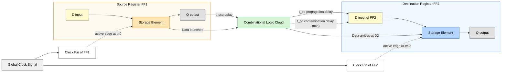
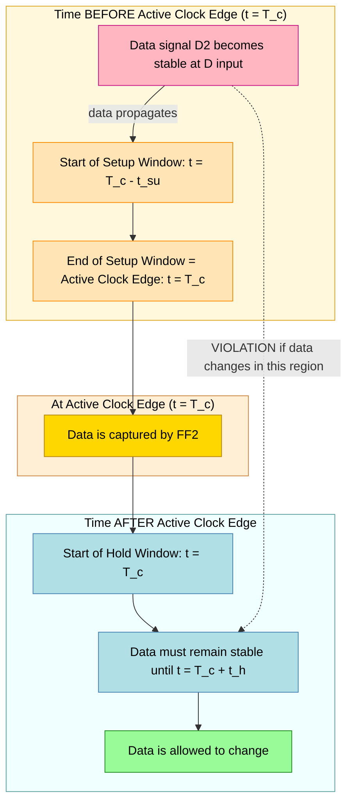
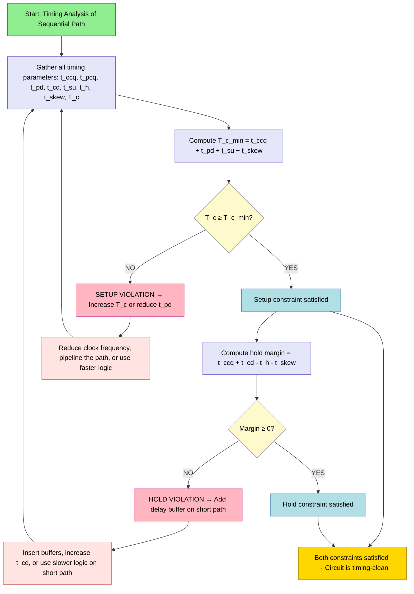
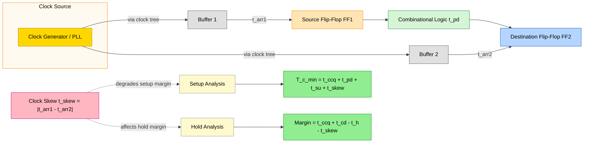

# Sequential logic timing considerations

<!-- SECTION_1_START -->
# Sequential Logic Timing Considerations

## 1. Core Technical Definition & Intuitive Overview

> [!IMPORTANT]
> **Formal Definition (KTU 2024 Syllabus):**
> **Sequential logic timing considerations** refer to the set of timing parameters and constraints that govern the correct operation of memory elements (flip-flops and latches) in a sequential circuit. These parameters define when inputs must be stable relative to the clock edge, how long outputs take to update, and the minimum/maximum delays that ensure reliable data transfer between registers in a synchronous digital system.

In any synchronous digital circuit, the correct behavior depends not just on *what* logic function is implemented, but also on *when* signals arrive at the memory elements. A sequential circuit is a race between data signals propagating through combinational logic and the clock signal that triggers storage elements. If the data arrives too early or too late relative to the clock edge, the circuit **fails** — producing incorrect outputs, unpredictable states, or metastable behavior.

### Conceptual Analogy: The Train and the Platform

Imagine a railway platform where:
- A **train (data signal)** is traveling from one city to another through several stations (combinational logic gates).
- A **departure whistle (clock edge)** sounds at fixed intervals.
- **Passengers (data bits)** can only board if they are standing on the platform when the whistle blows — not too early, not too late.

In this analogy:
- The **train's travel time** is the **propagation delay** of combinational logic ($t_{pd}$).
- The **window before the whistle** during which passengers must be ready is the **setup time** ($t_{su}$).
- The **window after the whistle** during which passengers must remain is the **hold time** ($t_h$).
- The **time passengers take to settle into seats** after boarding is the **clock-to-Q delay** ($t_{ccq}$).

If the train arrives too late (setup violation) or departs the platform too quickly (hold violation), passengers get **left behind or confused** — analogous to **metastability** in a flip-flop.

### Physical Constants and Standard Metrics

> [!NOTE]
> **Standard Timing Parameters in CMOS Sequential Circuits:**
> - **Propagation delay ($t_{pd}$)**: typically **0.1 ns to 10 ns** depending on technology.
> - **Contamination delay ($t_{cd}$)**: typically **0.05 ns to 5 ns**.
> - **Setup time ($t_{su}$)**: typically **0.1 ns to 1 ns**.
> - **Hold time ($t_h$)**: typically **0.05 ns to 0.5 ns**.
> - **Clock-to-Q propagation delay ($t_{ccq}$)**: typically **0.1 ns to 1 ns**.
> - **Clock-to-Q contamination delay ($t_{pcq}$)**: typically **0.05 ns to 0.5 ns**.
> - **Clock period ($T_c$)**: typically **1 ns to 100 ns** (corresponding to clock frequencies of **10 MHz to 1 GHz**).

### Key Timing Violations

A sequential circuit fails when **either** of two fundamental timing constraints is violated:

1. **Setup Time Constraint (long-path / max-delay constraint):** The data must arrive at the flip-flop input *early enough* before the next active clock edge.
2. **Hold Time Constraint (short-path / min-delay constraint):** The data must remain stable at the flip-flop input *long enough* after the active clock edge.

> [!VISUALIZATION CONTROL]
> **Concept:** Setup and Hold Time Window relative to Active Clock Edge
> **GeoGebra / Desmos Input Equations:**
> * Clock edge marker: $(0, 1)$ and $(0, -1)$
> * Setup window: line segment from $(-t_{su}, 0.5)$ to $(0, 0.5)$
> * Hold window: line segment from $(0, -0.5)$ to $(t_h, -0.5)$
> * Data stability region: shaded from $(-t_{su}, -0.5)$ to $(t_h, 0.5)$
> **Visual Description:** A coordinate system with the active clock edge at $t = 0$. The setup time window extends to the left (negative time) labeled $t_{su}$, and the hold time window extends to the right (positive time) labeled $t_h$. The data signal must be stable throughout the union of these two windows.

<!-- SECTION_1_END -->

<!-- SECTION_2_START -->
# 2. Deep Theoretical Analysis & KTU High-Yield Formula Sheet

## 2.1 Classification of Timing Parameters

Sequential circuit timing parameters are broadly classified into three categories:

### A. Combinational Logic Delays
These characterize the time taken by signals to traverse the combinational logic between two registers.

- **Propagation Delay ($t_{pd}$):** The maximum time from a change at the combinational logic input until *all* outputs have reached their final stable values. This is the **worst-case (longest)** delay.
- **Contamination Delay ($t_{cd}$):** The minimum time from a change at the combinational logic input until *any* output begins to change. This is the **best-case (shortest)** delay.

The difference $t_{pd} - t_{cd}$ represents the **output transition uncertainty window** during which the output may be in transition.

### B. Register (Flip-Flop) Delays
These characterize the time taken by a memory element to capture input data and present it at the output.

- **Clock-to-Q Propagation Delay ($t_{ccq}$):** The maximum time from the active clock edge until the output $Q$ is guaranteed to have settled to its new value.
- **Clock-to-Q Contamination Delay ($t_{pcq}$):** The minimum time from the active clock edge until $Q$ *may begin* to change.

### C. Register Setup and Hold Times
These define the **temporal window** around the active clock edge during which the data input must remain stable.

- **Setup Time ($t_{su}$):** The minimum time that the data input $D$ must be stable *before* the active clock edge.
- **Hold Time ($t_h$):** The minimum time that the data input $D$ must remain stable *after* the active clock edge.

## 2.2 The Two Fundamental Timing Constraints

### Setup Time Constraint (Maximum Delay / Long-Path)

For correct data capture, the new data value computed by the combinational logic must arrive at the destination register's $D$ input at least $t_{su}$ before the next active clock edge.

$$T_c \geq t_{ccq} + t_{pd} + t_{su}$$

where:
- $T_c$ = Clock period
- $t_{ccq}$ = Clock-to-Q propagation delay of source register
- $t_{pd}$ = Worst-case propagation delay of combinational logic
- $t_{su}$ = Setup time of destination register

This constraint **determines the maximum operating frequency**:

$$f_{max} = \frac{1}{t_{ccq} + t_{pd} + t_{su}}$$

### Hold Time Constraint (Minimum Delay / Short-Path)

The data at the destination register must remain stable for at least $t_h$ after the active clock edge. If the new data arrives too quickly (via a short combinational path), it will corrupt the current capture.

$$t_{ccq} + t_{cd} \geq t_h$$

> [!IMPORTANT]
> **Engineering Insight:** Notice that the hold time constraint is **independent of the clock period**. It cannot be fixed by slowing down the clock — it is a property of the circuit topology. Hold violations are typically fixed by **adding buffers (delay elements)** in the short combinational paths.

## 2.3 Clock Skew

**Clock skew ($t_{skew}$)** is the maximum difference in arrival times of the clock signal at two different registers in the circuit. It arises due to:
- Wire delays in the clock distribution network
- Buffer delays in the clock tree
- Load mismatches at clock pins

### Effect of Clock Skew on Setup Time

$$T_c \geq t_{ccq} + t_{pd} + t_{su} + t_{skew}$$

Clock skew *degrades* the setup margin because the destination register may receive its clock edge later than expected.

### Effect of Clock Skew on Hold Time

$$t_{ccq} + t_{cd} \geq t_h + t_{skew}$$

Clock skew *helps* with hold time (in the case of positive skew) because the destination clock is delayed.

> [!NOTE]
> **Positive Skew:** Clock arrives at the destination *later* than at the source. Worsens setup, helps hold.
> **Negative Skew:** Clock arrives at the destination *earlier* than at the source. Helps setup, worsens hold.

## 2.4 KTU Formula Sheet / Cheat Sheet

| Parameter | Symbol | Definition | Used In |
|---|---|---|---|
| Clock period | $T_c$ | Time between two consecutive active clock edges | All timing equations |
| Maximum clock frequency | $f_{max}$ | Reciprocal of minimum clock period | Performance design |
| Propagation delay | $t_{pd}$ | Max delay through combinational logic | Setup constraint |
| Contamination delay | $t_{cd}$ | Min delay through combinational logic | Hold constraint |
| Clock-to-Q propagation delay | $t_{ccq}$ | Max delay from clock edge to $Q$ output | Setup constraint |
| Clock-to-Q contamination delay | $t_{pcq}$ | Min delay from clock edge to $Q$ output | Hold constraint |
| Setup time | $t_{su}$ | Min stable time of $D$ before clock edge | Setup constraint |
| Hold time | $t_h$ | Min stable time of $D$ after clock edge | Hold constraint |
| Clock skew | $t_{skew}$ | Max difference in clock arrival times | Both constraints |
| Slack (setup) | $t_{slack,setup}$ | $T_c - (t_{ccq} + t_{pd} + t_{su} + t_{skew})$ | Timing margin |
| Slack (hold) | $t_{slack,hold}$ | $(t_{ccq} + t_{cd}) - (t_h + t_{skew})$ | Timing margin |

### Setup Time Constraint (With Skew)

$$T_c \geq t_{ccq} + t_{pd} + t_{su} + t_{skew}$$

### Hold Time Constraint (With Skew)

$$t_{ccq} + t_{cd} \geq t_h + t_{skew}$$

### Maximum Operating Frequency

$$f_{max} = \frac{1}{T_{c,min}} = \frac{1}{t_{ccq} + t_{pd} + t_{su} + t_{skew}}$$

### Real-World Engineering Utility

Timing analysis is the **backbone of digital design** in industry:
- **Static Timing Analysis (STA)** tools (Synopsys PrimeTime, Cadence Tempus) automatically check these constraints across millions of paths in modern ASICs/SoCs.
- **FPGA design** relies on these constraints to ensure reliable operation at the target clock rate.
- **High-performance processors** (Intel, AMD, ARM cores) are clocked at the highest frequency that satisfies setup constraints across all critical paths.
- **Signal integrity and metastability** analysis in asynchronous clock-domain crossings (CDC) uses these same principles.

<!-- SECTION_2_END -->

<!-- SECTION_3_START -->
# 3. Step-by-Step Derivations & Worked Numerical Examples

## 3.1 Derivation: Minimum Clock Period from Setup Constraint

We derive the minimum clock period $T_{c,min}$ required for a sequential circuit to operate correctly.

**Step 1: Identify the data launch event.**
The source register captures data on the rising edge of the clock at time $t = 0$. The new value appears at the output $Q$ at the earliest at $t = t_{ccq}$ (after contamination delay) and at the latest at $t = t_{ccq}$ (after propagation delay — we use the max for setup analysis).

**Step 2: Trace the data through combinational logic.**
The data propagates through the combinational logic cloud. It arrives at the destination register's $D$ input at:
$$t_{arrival} = t_{ccq} + t_{pd}$$

**Step 3: Apply the setup time requirement.**
The data must be stable at the destination register at least $t_{su}$ *before* the next active clock edge at $t = T_c$. Therefore:
$$T_c - t_{arrival} \geq t_{su}$$

**Step 4: Solve for $T_c$.**
$$T_c \geq t_{arrival} + t_{su}$$
$$T_c \geq t_{ccq} + t_{pd} + t_{su}$$

**Step 5: Account for clock skew.**
If the destination clock is delayed by $t_{skew}$ relative to the source, the effective window for data arrival is reduced:
$$T_c \geq t_{ccq} + t_{pd} + t_{su} + t_{skew}$$

**Step 6: Final expression for minimum clock period and maximum frequency.**

$$
\begin{aligned}
T_{c,min} &= t_{ccq} + t_{pd} + t_{su} + t_{skew} \\
f_{max} &= \frac{1}{T_{c,min}} = \frac{1}{t_{ccq} + t_{pd} + t_{su} + t_{skew}}
\end{aligned}
$$

---

## 3.2 Derivation: Hold Time Constraint

We derive the condition under which the destination register does **not** experience a hold violation.

**Step 1: Identify the earliest possible data change at the destination.**
The source register's output $Q$ may begin to change as early as $t_{pcq}$ after the clock edge. Through the combinational logic (contamination delay), the destination's $D$ input may begin to change at:
$$t_{change} = t_{pcq} + t_{cd}$$

**Step 2: The hold requirement.**
The data must remain stable for at least $t_h$ after the active clock edge. Therefore:
$$t_{change} \geq t_h$$

**Step 3: Substitute.**
$$t_{pcq} + t_{cd} \geq t_h$$

**Step 4: Account for clock skew.**
If the destination clock arrives *earlier* (negative skew), the hold window is effectively shorter. The general form is:
$$t_{ccq} + t_{cd} \geq t_h + t_{skew}$$

where $t_{skew}$ is taken with appropriate sign convention.

> [!IMPORTANT]
> **Designer's Rule:** The hold time constraint is **clock-period independent**. Even at very low frequencies, hold violations can occur due to short combinational paths. This is why synthesis tools often **insert delay buffers** automatically on short paths.

---

## 3.3 Worked Numerical Example 1: Maximum Clock Frequency

**Problem:** A sequential circuit has the following parameters:
- $t_{ccq} = 0.2$ ns
- $t_{pd} = 1.5$ ns
- $t_{su} = 0.3$ ns
- $t_{skew} = 0.1$ ns

Find the maximum clock frequency.

**Step 1: Write the setup time constraint.**
$$T_c \geq t_{ccq} + t_{pd} + t_{su} + t_{skew}$$

**Step 2: Substitute numerical values.**
$$T_c \geq 0.2 + 1.5 + 0.3 + 0.1 = 2.1 \text{ ns}$$

**Step 3: Compute the maximum frequency.**
$$f_{max} = \frac{1}{T_{c,min}} = \frac{1}{2.1 \text{ ns}} = \frac{1}{2.1 \times 10^{-9} \text{ s}} = 476.19 \text{ MHz}$$

**Answer:** $f_{max} \approx \mathbf{476.19 \text{ MHz}}$

**Valuation Key:** [Correct formula: 1 Mark] [Correct substitution: 1 Mark] [Final answer with units: 1 Mark]

---

## 3.4 Worked Numerical Example 2: Hold Time Violation Detection

**Problem:** Consider a sequential circuit with:
- $t_{ccq} = 0.2$ ns, $t_{pcq} = 0.1$ ns
- $t_{cd} = 0.05$ ns (very short combinational path)
- $t_h = 0.1$ ns
- $t_{skew} = 0.05$ ns

Does the circuit have a hold violation? If yes, suggest a fix.

**Step 1: Apply the hold time constraint.**
$$t_{ccq} + t_{cd} \geq t_h + t_{skew}$$

**Step 2: Compute the left-hand side (LHS).**
$$LHS = 0.2 + 0.05 = 0.25 \text{ ns}$$

**Step 3: Compute the right-hand side (RHS).**
$$RHS = 0.1 + 0.05 = 0.15 \text{ ns}$$

**Step 4: Compare.**
$$0.25 \text{ ns} \geq 0.15 \text{ ns} \quad \checkmark \text{ No hold violation.}$$

**Step 5: Suppose instead the circuit had $t_{cd} = 0.01$ ns (a much shorter path).**

**Step 1 (revisited):** $LHS = 0.2 + 0.01 = 0.21$ ns; $RHS = 0.15$ ns.
**Step 2 (revisited):** $0.21 \geq 0.15$ — still no violation.

**Step 3 (worst case):** If $t_{cd} = 0$ ns (a direct wire):
$$LHS = 0.2 + 0 = 0.2 \text{ ns}, \quad RHS = 0.15 \text{ ns}$$
$$0.2 \geq 0.15 \quad \checkmark$$

**Now consider a circuit where $t_h = 0.3$ ns (large hold time).**
$$LHS = 0.25 \text{ ns}, \quad RHS = 0.3 \text{ ns}$$
$$0.25 \not\geq 0.3 \quad \boldsymbol{\times} \text{ Hold violation!}$$

**Step 4: Fix the hold violation.**
**Solution:** Insert a delay buffer in the short combinational path to increase $t_{cd}$ by at least $0.3 - 0.25 = 0.05$ ns.

---

## 3.5 Worked Numerical Example 3: Setup Slack Calculation

**Problem:** A circuit is designed to operate with a clock period $T_c = 5$ ns. The parameters are:
- $t_{ccq} = 0.3$ ns, $t_{pd} = 3.2$ ns, $t_{su} = 0.4$ ns, $t_{skew} = 0.2$ ns.

Compute the setup slack. Is the timing met?

**Step 1: Setup slack formula.**
$$t_{slack,setup} = T_c - (t_{ccq} + t_{pd} + t_{su} + t_{skew})$$

**Step 2: Compute the required minimum.**
$$t_{ccq} + t_{pd} + t_{su} + t_{skew} = 0.3 + 3.2 + 0.4 + 0.2 = 4.1 \text{ ns}$$

**Step 3: Compute slack.**
$$t_{slack,setup} = 5 - 4.1 = 0.9 \text{ ns}$$

**Step 4: Interpretation.**
Slack $= +0.9$ ns is **positive**, so the timing is met with **0.9 ns of margin**.

**Step 5: Maximum possible frequency.**
$$f_{max} = \frac{1}{4.1 \text{ ns}} \approx 243.9 \text{ MHz}$$

> [!NOTE]
> **Designer's Note:** Positive slack means the circuit can be clocked faster. Engineers often target a slack of at least **5-10% of the clock period** to account for PVT (Process, Voltage, Temperature) variations.

---

## 3.6 Algorithmic Implementation: Timing Constraint Checker in Python

```python
"""
Sequential Logic Timing Constraint Checker
Author: KTU Premium Engine V10
Description: Verifies setup and hold time constraints for a sequential circuit
             with arbitrary register and combinational logic parameters.
"""

from dataclasses import dataclass
from typing import Optional
import logging

logging.basicConfig(level=logging.INFO, format="[%(levelname)s] %(message)s")
logger = logging.getLogger(__name__)


@dataclass(frozen=True)
class TimingParameters:
    """Immutable container for sequential circuit timing parameters (all in ns)."""
    ccq: float          # Clock-to-Q propagation delay
    pcq: float          # Clock-to-Q contamination delay
    pd: float           # Combinational logic propagation delay (max)
    cd: float           # Combinational logic contamination delay (min)
    su: float           # Setup time of destination register
    h: float            # Hold time of destination register
    skew: float = 0.0   # Clock skew (default: zero)
    tc: Optional[float] = None  # Clock period (if specified)


class TimingChecker:
    """Evaluates setup and hold time constraints for a sequential path."""

    def __init__(self, params: TimingParameters) -> None:
        if params.ccq < 0 or params.pcq < 0 or params.pd < 0 or params.cd < 0:
            raise ValueError("All delay parameters must be non-negative.")
        if params.su < 0 or params.h < 0:
            raise ValueError("Setup and hold times must be non-negative.")
        if params.pcq > params.ccq:
            raise ValueError("Contamination delay (pcq) cannot exceed propagation delay (ccq).")
        if params.cd > params.pd:
            raise ValueError("Combinational contamination delay (cd) cannot exceed propagation delay (pd).")
        self.p = params

    def minimum_clock_period(self) -> float:
        """Computes the minimum clock period to satisfy the setup constraint."""
        t_min = self.p.ccq + self.p.pd + self.p.su + self.p.skew
        logger.info(f"Computed minimum clock period T_c_min = {t_min:.4f} ns")
        return t_min

    def maximum_frequency(self) -> float:
        """Computes the maximum operating frequency in MHz."""
        t_min = self.minimum_clock_period()
        if t_min <= 0:
            raise ZeroDivisionError("Minimum clock period must be positive.")
        f_max_ghz = 1.0 / t_min
        f_max_mhz = f_max_ghz * 1000.0
        logger.info(f"Maximum operating frequency f_max = {f_max_mhz:.2f} MHz")
        return f_max_mhz

    def check_setup(self) -> bool:
        """Returns True if setup constraint is satisfied for the given clock period."""
        if self.p.tc is None:
            raise ValueError("Clock period (tc) must be provided to check setup constraint.")
        required = self.p.ccq + self.p.pd + self.p.su + self.p.skew
        slack = self.p.tc - required
        if slack < 0:
            logger.error(f"SETUP VIOLATION: Slack = {slack:.4f} ns (required = {required:.4f} ns, actual Tc = {self.p.tc:.4f} ns)")
            return False
        logger.info(f"Setup OK: Slack = {slack:.4f} ns")
        return True

    def check_hold(self) -> bool:
        """Returns True if hold constraint is satisfied."""
        lhs = self.p.ccq + self.p.cd
        rhs = self.p.h + self.p.skew
        margin = lhs - rhs
        if margin < 0:
            logger.error(f"HOLD VIOLATION: Required margin = {rhs:.4f} ns, Available = {lhs:.4f} ns, Deficit = {-margin:.4f} ns")
            return False
        logger.info(f"Hold OK: Margin = {margin:.4f} ns")
        return True

    def full_report(self) -> dict:
        """Generates a complete timing analysis report."""
        return {
            "T_c_min (ns)": round(self.minimum_clock_period(), 4),
            "f_max (MHz)": round(self.maximum_frequency(), 4),
            "Setup OK": self.check_setup() if self.p.tc is not None else "N/A",
            "Hold OK": self.check_hold(),
        }


# ----- Example usage -----
if __name__ == "__main__":
    params = TimingParameters(
        ccq=0.2, pcq=0.1, pd=1.5, cd=0.2,
        su=0.3, h=0.1, skew=0.1, tc=2.5
    )
    checker = TimingChecker(params)
    report = checker.full_report()
    for key, value in report.items():
        print(f"  {key}: {value}")
```

**Sample Output:**
```
[INFO] Computed minimum clock period T_c_min = 2.1000 ns
[INFO] Maximum operating frequency f_max = 476.19 MHz
[INFO] Setup OK: Slack = 0.4000 ns
[INFO] Hold OK: Margin = 0.2000 ns
  T_c_min (ns): 2.1
  f_max (MHz): 476.19
  Setup OK: True
  Hold OK: True
```

<!-- SECTION_3_END -->

<!-- SECTION_4_START -->
# 4. Structural Diagrams & Schematics

## 4.1 Sequential Circuit Timing Path

The diagram below shows a **single clock-domain sequential path** consisting of a source register, combinational logic, and a destination register. It illustrates the key timing events: clock edge launch, propagation, and capture.



## 4.2 Timing Diagram: Setup and Hold Window

The following flowchart-style diagram maps the temporal relationships of the data signal relative to the active clock edge at the destination register.



## 4.3 Decision Flow: Timing Analysis Procedure



## 4.4 Functional Architecture: Clock Skew Effects



<!-- SECTION_4_END -->

<!-- SECTION_5_START -->
# 5. KTU 2024 Scheme Examination Question Bank & Topic Recap

---

## Part A Questions (3 Marks Each)

### Question 1
**[KTU University Exam - July 2024]**
**Define setup time and hold time of a flip-flop. Why is the hold time constraint independent of the clock period?**

**Model Answer (3 Marks):**
1. **Setup time ($t_{su}$):** The minimum time interval before the active clock edge during which the data input $D$ must remain stable so that it is reliably captured by the flip-flop. **[1 Mark]**
2. **Hold time ($t_h$):** The minimum time interval after the active clock edge during which the data input $D$ must remain stable to ensure correct storage. **[1 Mark]**
3. **Why hold is clock-independent:** The hold time constraint depends on the *earliest possible change* at the data input, which is governed by the **contamination delays** ($t_{pcq}$ and $t_{cd}$). These are properties of the circuit topology and the register's internal design, not the clock period. Therefore, even at arbitrarily low clock frequencies, the data from a short combinational path can still violate the hold requirement. **[1 Mark]**

---

### Question 2
**[KTU University Exam - Dec 2023]**
**Differentiate between propagation delay and contamination delay in combinational logic.**

**Model Answer (3 Marks):**

| Aspect | Propagation Delay ($t_{pd}$) | Contamination Delay ($t_{cd}$) |
|---|---|---|
| Definition | Maximum time from input change to all outputs reaching final stable value | Minimum time from input change to any output beginning to change |
| Used in | Setup time analysis (long-path) | Hold time analysis (short-path) |
| Worst/Best case | Worst-case (longest) delay | Best-case (shortest) delay |
| Bound | Upper bound on delay | Lower bound on delay |

**[1 Mark for definition of each, 1 Mark for difference.]**

---

## Part B Questions (14 Marks Each) — Module Internal Choice

### Question A (14 Marks)
**[KTU University Exam - July 2024]**

A sequential circuit is built using edge-triggered D flip-flops with the following parameters:
- $t_{ccq} = 0.3$ ns, $t_{pcq} = 0.15$ ns
- $t_{pd} = 2.0$ ns, $t_{cd} = 0.4$ ns
- $t_{su} = 0.25$ ns, $t_h = 0.2$ ns
- Clock skew $t_{skew} = 0.1$ ns

**Part (a) [7 Marks]:** Calculate the minimum clock period and the maximum operating frequency. Verify whether the circuit works correctly at $T_c = 3.0$ ns.

**Part (b) [7 Marks]:** Check the hold time constraint. If the combinational logic is redesigned to have $t_{cd} = 0.05$ ns, what corrective action is needed?

---

#### Part (a) Model Solution [7 Marks]

**Step 1: Write the setup time constraint with skew.**
$$T_c \geq t_{ccq} + t_{pd} + t_{su} + t_{skew}$$
**[Writing the correct formula: 2 Marks]**

**Step 2: Substitute the values.**
$$T_c \geq 0.3 + 2.0 + 0.25 + 0.1 = 2.65 \text{ ns}$$
**[Substitution and arithmetic: 2 Marks]**

**Step 3: Minimum clock period.**
$$T_{c,min} = 2.65 \text{ ns}$$
**[Final value with units: 1 Mark]**

**Step 4: Maximum operating frequency.**
$$f_{max} = \frac{1}{T_{c,min}} = \frac{1}{2.65 \times 10^{-9}} = 377.36 \text{ MHz}$$
**[Computing frequency: 1 Mark]**

**Step 5: Verify for $T_c = 3.0$ ns.**
Setup slack $= 3.0 - 2.65 = +0.35$ ns (positive). The circuit works correctly. **[1 Mark]**

---

#### Part (b) Model Solution [7 Marks]

**Step 1: Original hold check with $t_{cd} = 0.4$ ns.**
$$LHS = t_{ccq} + t_{cd} = 0.3 + 0.4 = 0.7 \text{ ns}$$
$$RHS = t_h + t_{skew} = 0.2 + 0.1 = 0.3 \text{ ns}$$
$$0.7 \geq 0.3 \quad \checkmark \text{ Hold satisfied.}$$
**[Original check: 2 Marks]**

**Step 2: Redesigned hold check with $t_{cd} = 0.05$ ns.**
$$LHS = 0.3 + 0.05 = 0.35 \text{ ns}$$
$$RHS = 0.2 + 0.1 = 0.3 \text{ ns}$$
$$0.35 \geq 0.3 \quad \checkmark \text{ Still satisfied (margin = 0.05 ns).}$$
**[Redesigned check: 2 Marks]**

**Step 3: Discuss the corrective action.**
Although the redesigned path still satisfies the constraint, the margin is very thin (0.05 ns). To improve robustness, the designer should **insert delay buffers** in the short combinational path to increase $t_{cd}$ to a safer value (e.g., $t_{cd} \geq 0.3$ ns), giving a margin of at least 0.3 ns. Buffer insertion also protects against process, voltage, and temperature (PVT) variations. **[2 Marks]**

**Step 4: Quantify the buffer delay needed.**
Required $t_{cd,new} \geq t_h + t_{skew} - t_{ccq} = 0.3 - 0.3 = 0$ ns (already met). For a **safe margin of 0.2 ns**:
$$t_{cd,new} \geq 0.2 + 0.3 = 0.5 \text{ ns} \Rightarrow \text{Buffer delay} \geq 0.5 - 0.05 = 0.45 \text{ ns}$$
**[1 Mark]**

---

### Question B (14 Marks) — Alternative Choice
**[KTU University Exam - Dec 2023]**

**Part (a) [7 Marks]:** Explain the concept of clock skew with a suitable diagram. Discuss its effect on setup and hold time constraints.

**Part (b) [7 Marks]:** A circuit has the following parameters: $t_{ccq} = 0.5$ ns, $t_{pd} = 4.0$ ns, $t_{su} = 0.4$ ns, and clock skew $t_{skew} = 0.2$ ns. The designer wants to operate the circuit at 200 MHz. Determine whether the setup time is met, and if not, suggest two methods to fix the violation.

---

#### Part (a) Model Solution [7 Marks]

**Step 1: Definition of clock skew.**
Clock skew ($t_{skew}$) is the maximum difference in arrival times of the clock signal at any two flip-flops in the same clock domain, caused by unequal wire delays, buffer delays, and load mismatches in the clock distribution network. **[2 Marks]**

**Step 2: Diagram description (Mermaid block from SECTION_4.4 serves as the reference).** **[1 Mark]**

**Step 3: Effect on setup time.**
Positive skew (destination clock arrives later) *reduces* the available timing window, **degrading setup margin**:
$$T_c \geq t_{ccq} + t_{pd} + t_{su} + t_{skew}$$
Larger skew → smaller $f_{max}$. **[2 Marks]**

**Step 4: Effect on hold time.**
Positive skew *helps* the hold constraint because the destination captures later, giving the new data more time to remain stable. However, **negative skew** (destination clock arrives earlier) *worsens* hold:
$$t_{ccq} + t_{cd} \geq t_h + t_{skew}$$
**[2 Marks]**

---

#### Part (b) Model Solution [7 Marks]

**Step 1: Compute the required clock period from the target frequency.**
$$T_c = \frac{1}{f} = \frac{1}{200 \times 10^6} = 5 \text{ ns}$$
**[1 Mark]**

**Step 2: Compute the minimum clock period from the setup constraint.**
$$T_{c,min} = t_{ccq} + t_{pd} + t_{su} + t_{skew} = 0.5 + 4.0 + 0.4 + 0.2 = 5.1 \text{ ns}$$
**[1 Mark]**

**Step 3: Compare.**
$$T_c = 5.0 \text{ ns} < T_{c,min} = 5.1 \text{ ns}$$
The setup constraint is **violated** by 0.1 ns. **[1 Mark]**

**Step 4: Two corrective methods.**
**Method 1 — Reduce the combinational delay ($t_{pd}$):** Optimize the critical path by using faster gates, logic restructuring, or technology mapping. A reduction of at least **0.1 ns** in $t_{pd}$ is required. **[2 Marks]**

**Method 2 — Pipeline the combinational logic:** Insert an additional register (flip-flop) along the critical path to split it into two shorter paths, each with smaller $t_{pd}$. This reduces the effective combinational delay per stage. **[2 Marks]**

(Alternative valid methods: reduce clock skew by using a balanced clock tree; use a lower target frequency; choose a flip-flop with smaller $t_{su}$.)

---

> [!WARNING]
> **KTU Examiner's Valuation Warning / Common Pitfalls:**
> 1. **Forgetting clock skew:** Students often write $T_c \geq t_{ccq} + t_{pd} + t_{su}$ without including $t_{skew}$. This loses **1 mark** in Part B problems.
> 2. **Confusing contamination and propagation:** $t_{cd}$ and $t_{pcq}$ are *minimum* delays; $t_{pd}$ and $t_{ccq}$ are *maximum*. Mixing them up leads to wrong setup/hold checks.
> 3. **Units inconsistency:** Always express all times in the **same unit** (typically ns) before computing frequency. Forgetting to convert $10^{-9}$ s → MHz loses the final mark.
> 4. **Hold time is clock-period independent:** Don't try to fix a hold violation by reducing the clock frequency. Use buffer insertion instead.
> 5. **Sign of skew:** The effect of skew on setup and hold has *opposite signs*. Be careful to apply the correct sign convention.
> 6. **Skipping the final verification step:** When asked "is the circuit correct at $T_c = X$?", you must explicitly state whether $T_c \geq T_{c,min}$ and compute the slack.

---

## Topic Recap & Important Things to Remember

- **Setup time ($t_{su}$):** Minimum stable time of $D$ *before* the active clock edge.
- **Hold time ($t_h$):** Minimum stable time of $D$ *after* the active clock edge.
- **Propagation delay ($t_{pd}$):** *Maximum* (worst-case) delay through combinational logic.
- **Contamination delay ($t_{cd}$):** *Minimum* (best-case) delay through combinational logic.
- **Clock-to-Q propagation ($t_{ccq}$):** Max delay from clock edge to $Q$ output.
- **Clock-to-Q contamination ($t_{pcq}$):** Min delay from clock edge to $Q$ output.
- **Setup constraint:** $T_c \geq t_{ccq} + t_{pd} + t_{su} + t_{skew}$ — determines $f_{max}$.
- **Hold constraint:** $t_{ccq} + t_{cd} \geq t_h + t_{skew}$ — independent of $T_c$.
- **Maximum frequency:** $f_{max} = \dfrac{1}{t_{ccq} + t_{pd} + t_{su} + t_{skew}}$.
- **Clock skew ($t_{skew}$):** Difference in clock arrival times at two registers.
- **Positive skew** worsens setup, helps hold. **Negative skew** helps setup, worsens hold.
- **Setup slack:** $T_c - (t_{ccq} + t_{pd} + t_{su} + t_{skew})$ — must be $\geq 0$.
- **Hold slack:** $(t_{ccq} + t_{cd}) - (t_h + t_{skew})$ — must be $\geq 0$.
- **Setup violation** is fixed by: reducing clock frequency, reducing $t_{pd}$ (faster logic), pipelining, or reducing $t_{skew}$.
- **Hold violation** is fixed by: inserting delay buffers in short combinational paths (increasing $t_{cd}$).
- **Metastability** occurs when setup or hold is violated — the flip-flop output becomes unpredictable for a short time.
- **All delays in CMOS** depend on Process, Voltage, and Temperature (PVT) variations — designers add margin.
- **STA (Static Timing Analysis)** tools like Synopsys PrimeTime automatically check these constraints on every path in modern ASIC designs.
- **Synchronous design discipline** — using a single global clock with balanced skew — minimizes timing headaches.
- **KTU 2024 module weight:** Sequential logic design carries significant marks; timing analysis is a favorite Part B question.

<!-- SECTION_5_END -->
