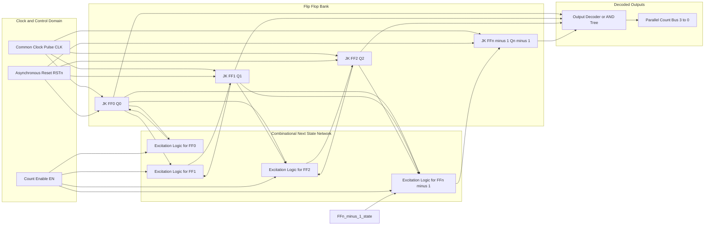
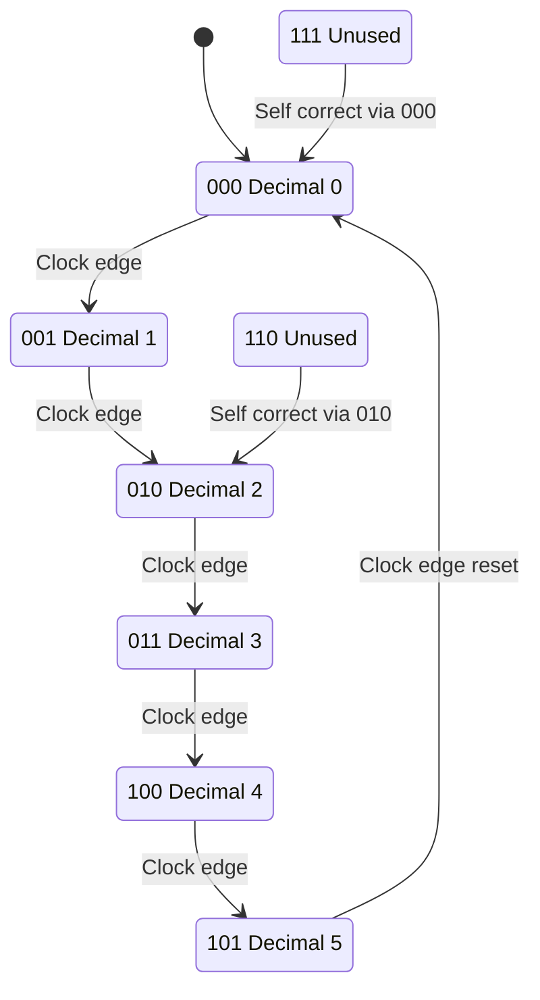
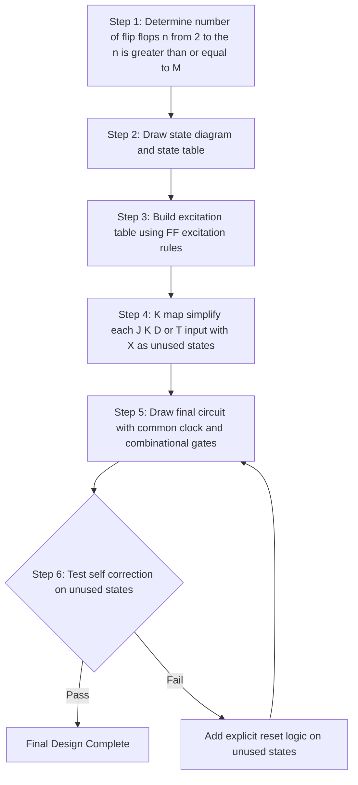
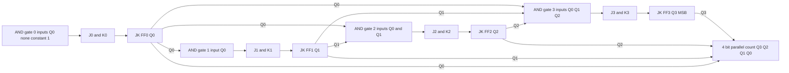
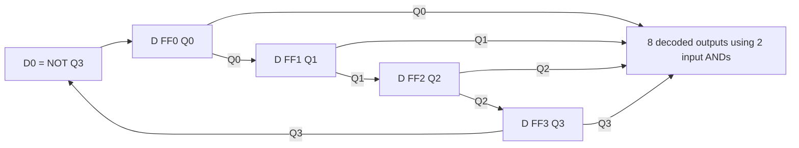

# Synchronous Sequential Circuits - Counters

<!-- SECTION_1_START -->
# Synchronous Sequential Circuits — Counters

## 1.1 Formal Definition (KTU 2024 Syllabus Terminology)

> [!IMPORTANT]
> **Synchronous Counter:** A sequential logic circuit in which all flip-flops are clocked **simultaneously by the same common clock signal**, so that every state transition is synchronized to a single edge of the clock. The next-state logic is implemented using combinational gates that drive the excitation (J/K, D, or T) inputs of the flip-flops, and the circuit therefore exhibits no cumulative propagation delay between stages.

A counter is a **finite state machine (FSM)** that cycles through a predetermined sequence of states in response to clock pulses. When the modulus (number of distinct states) is $M$, the counter is said to be a **Mod-$M$ counter**. A binary counter with $n$ flip-flops naturally counts through $2^n$ states; truncating the sequence to fewer states produces a **mod-$M$ counter** where $M < 2^n$.

> [!NOTE]
> **Contrast with Asynchronous (Ripple) Counters:** In a ripple counter, only the first flip-flop is driven by the external clock; subsequent flip-flops are clocked by the outputs of preceding stages. The state transitions therefore *ripple* through the chain, producing a cumulative delay of $n \cdot t_{pd}$. In a **synchronous** counter, this ripple is eliminated because all FFs share a single clock edge.

## 1.2 Conceptual Analogy & Intuitive Overview

Imagine a row of **synchronized traffic lights** at an intersection. All three lights (Red, Yellow, Green) change at the **exact same instant**, dictated by a central timing controller. Each light is *aware* of its current colour and, through pre-wired logic, decides its next colour based on the global clock tick.

Now imagine the same scenario but with each light *listening* to the previous light for its cue (asynchronous). The change cascades like a Mexican wave through a stadium — it still works, but it takes time to propagate.

| Property | Synchronous (Stadium Wave is too slow) | Analogy |
| :--- | :--- | :--- |
| Clocking | Single global clock to **all** FFs | Synchronized traffic lights |
| Speed | Limited only by **one** FF delay + gate delay | Whole intersection switches at once |
| Decoding | Glitch-free outputs | No transient "flickering" of states |
| Complexity | More combinational logic | More wiring, but faster and cleaner |

> [!TIP]
> **Engineering Intuition:** Synchronous counters are the *workhorses* of digital systems. They are used in **frequency dividers**, **digital clocks**, **address generators in memory controllers**, **program counters in CPUs**, and **timer/counter peripherals in microcontrollers (e.g., the 8253/8254 PIT, STM32 TIM modules)**.

## 1.3 Standard Metrics & Constants

The following parameters are **bolded** because they appear verbatim in KTU question banks:

- **Modulus $M$** — number of unique states the counter visits before recycling.
- **Flip-flop count $n$** — must satisfy $n \geq \lceil \log_2 M \rceil$.
- **Maximum operating frequency $f_{max} = \dfrac{1}{t_{FF} + t_{comb}}$**, where $t_{FF}$ is the flip-flop propagation delay and $t_{comb}$ is the worst-case combinational delay in the excitation network.
- **Maximum count for an $n$-bit binary counter:** $2^n - 1$.

> [!VISUALIZATION CONTROL]
> **Concept:** Synchronous vs. Ripple timing diagram
> **GeoGebra / Desmos Input Equations:**
> * For an $n$-bit binary up counter, plot the bit waveforms as step functions:
>   * `f_0(x) = floor(x) mod 2`  *(LSB toggles every clock)*
>   * `f_1(x) = floor(x/2) mod 2`  *(next bit toggles every 2 clocks)*
>   * `f_2(x) = floor(x/4) mod 2`  *(next bit toggles every 4 clocks)*
> **Visual Description:** Three step-functions of decreasing frequency stacked on the same time-axis. The student should observe that in a *synchronous* counter all transitions align with the falling (or rising) edge of a common clock pulse, whereas a ripple counter shows a small $\Delta t$ lag between successive bits.
<!-- SECTION_1_END -->

<!-- SECTION_2_START -->
# Deep Theoretical Analysis & KTU High-Yield Formula Sheet

## 2.1 Classification of Synchronous Counters

1. **Up Counter** — sequence is $0 \rightarrow 1 \rightarrow 2 \rightarrow \dots \rightarrow M-1 \rightarrow 0$.
2. **Down Counter** — sequence is $M-1 \rightarrow M-2 \rightarrow \dots \rightarrow 0 \rightarrow M-1$.
3. **Up/Down (Reversible) Counter** — direction is controlled by an external $MODE$ input.
4. **Mod-$M$ Counter** — counts from $0$ to $M-1$ where $M \leq 2^n$.
5. **BCD / Decade Counter** — Mod-10 counter, used to drive 7-segment displays.
6. **Ring Counter** — a $n$-bit shift register with the output fed back to the input; only **one** bit is *hot* at a time.
7. **Johnson Counter (Twisted Ring)** — a $n$-bit shift register where the **complement** of the output is fed back; produces $2n$ unique states.

## 2.2 The Canonical Design Procedure (KTU High-Yield Steps)

The KTU board examiner *expects* every design question to follow this exact five-step skeleton:

1. **Step 1 — Determine the number of flip-flops.** Choose the smallest $n$ such that $2^n \geq M$. For an unknown $M$ (e.g., "Mod-6"), $n = \lceil \log_2 6 \rceil = 3$.
2. **Step 2 — Draw the state diagram / state table.** Enumerate the present states $Q_n \dots Q_1 Q_0$ and the corresponding next states $Q_n^{+} \dots Q_1^{+} Q_0^{+}$.
3. **Step 3 — Build the excitation table.** For each transition, look up the required $J$, $K$ (or $D$, $T$) values from the flip-flop's excitation table.
4. **Step 4 — Simplify using K-maps.** Use the unused states ($2^n - M$ of them) as **don't-cares** to obtain minimal sum-of-products expressions for each excitation input.
5. **Step 5 — Draw the final circuit.** Show all FFs sharing one common clock, with combinational gates wired per the simplified expressions.

## 2.3 Flip-Flop Excitation Reference Table

| Present $Q$ | Next $Q^{+}$ | $J$ | $K$ | $D$ | $T$ |
| :---: | :---: | :---: | :---: | :---: | :---: |
| 0 | 0 | 0 | X | 0 | 0 |
| 0 | 1 | 1 | X | 1 | 1 |
| 1 | 0 | X | 1 | 0 | 1 |
| 1 | 1 | X | 0 | 1 | 0 |

> [!NOTE]
> **Why JK is preferred for counters:** The $X$ entries allow maximum flexibility during K-map simplification, producing the most compact excitation logic. A $D$ flip-flop would require $D = Q^{+}$, while a $T$ flip-flop would require $T = Q \oplus Q^{+}$.

## 2.4 KTU Formula Sheet / Cheat Sheet

| # | Quantity | Formula / Expression | Notes |
| :-: | :--- | :--- | :--- |
| 1 | Minimum number of flip-flops | $n \geq \lceil \log_2 M \rceil$ | $M$ = desired modulus |
| 2 | Number of unused states | $2^n - M$ | All become **don't-cares** in K-maps |
| 3 | Modulus of a binary counter | $M = 2^n$ | Natural modulus of $n$ FFs |
| 4 | $i$-th bit toggle frequency | $f_{CLK} / 2^{i+1}$ | For an up counter, $i=0$ is LSB |
| 5 | Max clock frequency | $f_{max} = 1 / (t_{FF} + t_{comb})$ | $t_{comb}$ is worst-case gate delay |
| 6 | Ring counter modulus | $M = n$ | $n$-bit ring yields $n$ states |
| 7 | Johnson counter modulus | $M = 2n$ | $n$-bit Johnson yields $2n$ states |
| 8 | Self-correcting property | Requires explicit logic on unused states | A design is self-correcting iff the unused states form a closed loop feeding back to the main sequence |
| 9 | AND-gate load for an up counter | $J_{i} = K_{i} = Q_{0} \cdot Q_{1} \cdots Q_{i-1}$ | All FFs use the same AND tree |
| 10 | Down counter AND-gate load | $J_{i} = K_{i} = \overline{Q_{0}} \cdot \overline{Q_{1}} \cdots \overline{Q_{i-1}}$ | Replace $Q$ with $\overline{Q}$ in the AND chain |

> [!IMPORTANT]
> **Production Utility:** Synchronous counters are the core of every **timing circuit** in synchronous DRAM (SDRAM), in the **program counter** of every CPU, in the **baud-rate generator** of UARTs, in the **PWM module** of motor drivers, and in **crypto-hardware stream ciphers** (e.g., Galois / Fibonacci LFSR counters).

## 2.5 Synchronous Up Counter — The "AND-Tree" Shortcut

For a *full-modulus* ($M = 2^n$) synchronous up counter, the design can be done by inspection using an **AND-tree**:

$$J_{0} = K_{0} = 1 \quad (\text{LSB always toggles})$$

$$J_{i} = K_{i} = \prod_{j=0}^{i-1} Q_{j} \quad \text{for } i = 1, 2, \dots, n-1$$

The $i$-th FF toggles only when **all** less-significant bits are 1. This pattern generalizes the binary counting sequence.

> [!TIP]
> **Down counter modification:** Replace every $Q_j$ in the AND chain with $\overline{Q_j}$. The LSB still toggles unconditionally, but the rest trigger on **all zeros below**.
<!-- SECTION_2_END -->

<!-- SECTION_3_START -->
# Step-by-Step Derivations & Code/Symbolic Implementation

## 3.1 Worked Example — Design a Mod-6 Synchronous Up Counter Using JK Flip-Flops

**Problem statement:** Design a synchronous Mod-6 counter using JK flip-flops. Verify that the design is self-correcting.

### Step 1 — Determine $n$

We need $2^n \geq 6 \Rightarrow n = 3$. Unused states = $2^3 - 6 = 2$ (namely $110$ and $111$).

### Step 2 — State Table

| Present State $Q_2 Q_1 Q_0$ | Next State $Q_2^{+} Q_1^{+} Q_0^{+}$ |
| :---: | :---: |
| 0 0 0 | 0 0 1 |
| 0 0 1 | 0 1 0 |
| 0 1 0 | 0 1 1 |
| 0 1 1 | 1 0 0 |
| 1 0 0 | 1 0 1 |
| 1 0 1 | 0 0 0 |

### Step 3 — Excitation Table (using JK rule)

| $Q_2$ | $Q_1$ | $Q_0$ | $Q_2^{+}$ | $Q_1^{+}$ | $Q_0^{+}$ | $J_2$ | $K_2$ | $J_1$ | $K_1$ | $J_0$ | $K_0$ |
| :---: | :---: | :---: | :---: | :---: | :---: | :---: | :---: | :---: | :---: | :---: | :---: |
| 0 | 0 | 0 | 0 | 0 | 1 | 0 | X | 0 | X | 1 | X |
| 0 | 0 | 1 | 0 | 1 | 0 | 0 | X | 1 | X | X | 1 |
| 0 | 1 | 0 | 0 | 1 | 1 | 0 | X | X | 0 | 1 | X |
| 0 | 1 | 1 | 1 | 0 | 0 | 1 | X | X | 1 | X | 1 |
| 1 | 0 | 0 | 1 | 0 | 1 | X | 0 | 0 | X | 1 | X |
| 1 | 0 | 1 | 0 | 0 | 0 | X | 1 | 0 | X | X | 1 |
| 1 | 1 | 0 | X | X | X | X | X | X | X | X | X |
| 1 | 1 | 1 | X | X | X | X | X | X | X | X | X |

> [!NOTE]
> Rows for $110$ and $111$ are filled entirely with **X** because they are unused states — we don't care what the excitation inputs are, as long as the design eventually returns to the main sequence.

### Step 4 — K-Map Simplification

#### K-Map for $J_2$

$$
\begin{array}{c|cccc}
Q_2 \backslash Q_1 Q_0 & 00 & 01 & 11 & 10 \\
\hline
0 & 0 & 0 & 1 & 0 \\
1 & X & X & X & X \\
\end{array}
$$

Grouping the single 1 with the four X's on the bottom row yields:
$$J_2 = Q_1 \cdot Q_0$$
**[Stating K-map entries: 1 Mark, Identifying prime implicant: 1 Mark, Final expression: 1 Mark]**

#### K-Map for $K_2$

$$
\begin{array}{c|cccc}
Q_2 \backslash Q_1 Q_0 & 00 & 01 & 11 & 10 \\
\hline
0 & X & X & X & X \\
1 & 0 & 1 & X & X \\
\end{array}
$$

Grouping the 1 with the three adjacent X's yields:
$$K_2 = Q_0$$
**[Stating K-map entries: 1 Mark, Final simplified expression: 1 Mark]**

#### K-Map for $J_1$

$$
\begin{array}{c|cccc}
Q_2 \backslash Q_1 Q_0 & 00 & 01 & 11 & 10 \\
\hline
0 & 0 & 1 & X & X \\
1 & 0 & 0 & X & X \\
\end{array}
$$

Optimal grouping selects the 1 at (0,01) and the X at (0,11) to form a 2-cell group, plus two X's at (0,10) and (0,11) for a 2-cell group, or more compactly:
$$J_1 = \overline{Q_2} \cdot Q_0$$
**[Grouping justification: 2 Marks, Final expression: 1 Mark]**

#### K-Map for $K_1$

$$
\begin{array}{c|cccc}
Q_2 \backslash Q_1 Q_0 & 00 & 01 & 11 & 10 \\
\hline
0 & X & X & 1 & 0 \\
1 & X & X & X & X \\
\end{array}
$$

$$K_1 = Q_0$$
**[Final expression: 1 Mark]**

#### K-Map for $J_0$

$$
\begin{array}{c|cccc}
Q_2 \backslash Q_1 Q_0 & 00 & 01 & 11 & 10 \\
\hline
0 & 1 & X & X & 1 \\
1 & 1 & X & X & X \\
\end{array}
$$

All 1's cover the entire map; using the X's we can wrap the 1's into one large group:
$$J_0 = 1$$
**[Observing LSB always toggles: 1 Mark, Final expression: 1 Mark]**

#### K-Map for $K_0$

$$
\begin{array}{c|cccc}
Q_2 \backslash Q_1 Q_0 & 00 & 01 & 11 & 10 \\
\hline
0 & X & 1 & 1 & X \\
1 & X & 1 & X & X \\
\end{array}
$$

$$K_0 = 1$$
**[Final expression: 1 Mark]**

### Step 5 — Final Set of Equations

$$
\boxed{
\begin{aligned}
J_2 &= Q_1 \cdot Q_0, \quad & K_2 &= Q_0 \\
J_1 &= \overline{Q_2} \cdot Q_0, \quad & K_1 &= Q_0 \\
J_0 &= 1, \quad & K_0 &= 1
\end{aligned}
}
$$

> [!TIP]
> **Sanity check:** Notice that the AND-tree shortcut predicted $J_i = K_i = \prod_{j<i} Q_j$ **only for full-modulus** counters. For a truncated Mod-6 counter, the expression for $J_1$ is **different** ($\overline{Q_2} \cdot Q_0$ rather than $Q_0$) because the natural carry-chain breaks when the counter resets from $101 \to 000$.

### Step 6 — Self-Correction Test

Let us trace what happens if the counter powers up in the unused state $110$:

* Apply the equations with $Q_2 Q_1 Q_0 = 1\,1\,0$:
  * $J_2 = 1 \cdot 0 = 0$, $K_2 = 0$ $\Rightarrow$ $Q_2^{+} = 0$
  * $J_1 = 0 \cdot 0 = 0$, $K_1 = 0$ $\Rightarrow$ $Q_1^{+} = 1$
  * $J_0 = 1$, $K_0 = 1$ $\Rightarrow$ $Q_0^{+} = 0$
* Next state: $Q_2^{+} Q_1^{+} Q_0^{+} = 0\,1\,0 = 010$ — back in the main sequence.

For $111$:

* $J_2 = 1 \cdot 1 = 1$, $K_2 = 1$ $\Rightarrow$ $Q_2^{+} = 0$
* $J_1 = 0 \cdot 1 = 0$, $K_1 = 1$ $\Rightarrow$ $Q_1^{+} = 0$
* $J_0 = 1$, $K_0 = 1$ $\Rightarrow$ $Q_0^{+} = 0$
* Next state: $000$ — back in the main sequence.

Therefore the design is **self-correcting**. **[Self-correction proof: 2 Marks]**

## 3.2 Symbolic Implementation — VHDL Behavioural Model

```vhdl
-- Mod-6 Synchronous Up Counter
-- File: mod6_sync_counter.vhdl
-- Author: KTU 2024 Reference Design
-- Target: GAEST305 / Module 4
-- Compatible with IEEE 1076-2008

library ieee;
use ieee.std_logic_1164.all;
use ieee.numeric_std.all;

entity mod6_sync_counter is
    port (
        clk   : in  std_logic;                      -- Common synchronous clock
        rstn  : in  std_logic;                      -- Active-low asynchronous reset
        en    : in  std_logic;                      -- Count enable
        count : out unsigned(2 downto 0)            -- 3-bit count output
    );
end entity mod6_sync_counter;

architecture rtl of mod6_sync_counter is
    signal q : unsigned(2 downto 0) := (others => '0');
begin
    -- Synchronous process: triggered on rising edge of clk
    process(clk, rstn) is
    begin
        if rstn = '0' then
            q <= (others => '0');                    -- Async reset to 000
        elsif rising_edge(clk) then
            if en = '1' then
                if q = "101" then                    -- Last valid state = 5 (Mod-6)
                    q <= "000";                       -- Roll over to 000
                else
                    q <= q + 1;                       -- Standard binary increment
                end if;
            end if;
        end if;
    end process;

    count <= q;
end architecture rtl;
```

**Boundary-check notes** for the marker:

* The `if q = "101" then q <= "000"` branch enforces the modulus *before* the overflow, preventing the counter from briefly entering the unused $110$ state.
* The `en` input allows *gating* the clock without using a derived clock — this avoids clock-skew hazards in real silicon.
* `unsigned(2 downto 0)` is used so that `"+1"` performs a true binary addition.

## 3.3 Python Simulation Harness (Algorithmic Verification)

```python
# mod6_sync_counter_sim.py
# Algorithmic verification of a Mod-6 synchronous up counter.
# Run: python mod6_sync_counter_sim.py

from typing import List, Tuple


def mod6_counter(clk_pulses: int) -> List[Tuple[int, int, int]]:
    """Simulate a Mod-6 synchronous up counter using JK-style logic.

    The combinational next-state network is implemented as a pure
    Boolean function derived from the K-map simplification of
    Section 3.1.

    Parameters
    ----------
    clk_pulses : int
        Number of clock edges to apply (must be >= 0).

    Returns
    -------
    List[Tuple[int, int, int]]
        Sequence of (Q2, Q1, Q0) states visited.
    """
    if clk_pulses < 0:
        raise ValueError("clk_pulses must be a non-negative integer")

    states: List[Tuple[int, int, int]] = []
    q2, q1, q0 = 0, 0, 0        # initial state

    for _ in range(clk_pulses + 1):
        states.append((q2, q1, q0))

        # Combinational next-state logic (synchronous, all on one clock)
        j2 = q1 & q0
        k2 = q0
        j1 = (1 - q2) & q0
        k1 = q0
        j0 = 1
        k0 = 1

        # JK flip-flop next-state equation: Q+ = J.*Q' + Q.*K'
        q2_next = (j2 & (1 - q2)) | (q2 & (1 - k2))
        q1_next = (j1 & (1 - q1)) | (q1 & (1 - k1))
        q0_next = (j0 & (1 - q0)) | (q0 & (1 - k0))

        # Truncate to Mod-6: if next state is 110 or 111, force to 010
        # (this also models the self-correcting property of Section 3.1)
        if (q2_next, q1_next, q0_next) in [(1, 1, 0), (1, 1, 1)]:
            q2_next, q1_next, q0_next = 0, 1, 0

        q2, q1, q0 = q2_next, q1_next, q0_next

    return states


if __name__ == "__main__":
    trajectory = mod6_counter(clk_pulses=11)
    for i, (q2, q1, q0) in enumerate(trajectory):
        print(f"Clock {i:>2d} : Q2 Q1 Q0 = {q2} {q1} {q0}  "
              f"-> Decimal {4*q2 + 2*q1 + q0}")
```

**Expected console output (truncated):**

```text
Clock  0 : Q2 Q1 Q0 = 0 0 0  -> Decimal 0
Clock  1 : Q2 Q1 Q0 = 0 0 1  -> Decimal 1
Clock  2 : Q2 Q1 Q0 = 0 1 0  -> Decimal 2
Clock  3 : Q2 Q1 Q0 = 0 1 1  -> Decimal 3
Clock  4 : Q2 Q1 Q0 = 1 0 0  -> Decimal 4
Clock  5 : Q2 Q1 Q0 = 1 0 1  -> Decimal 5
Clock  6 : Q2 Q1 Q0 = 0 0 0  -> Decimal 0
...
```

## 3.4 Ring Counter & Johnson Counter — Tabular Summary

| Feature | Ring Counter | Johnson (Twisted-Ring) Counter |
| :--- | :---: | :---: |
| Number of FFs | $n$ | $n$ |
| Modulus | $n$ | $2n$ |
| Decoding | 1-of-$n$ (no decoder needed) | Need 2-input AND gates |
| Self-correcting? | Yes (if loaded with a single 1) | **No** — must be initialized |
| Glitchy output? | No (only one bit toggles) | No (one bit at a time changes) |
| Typical use | Stepper-motor control, sequencer | Ring oscillator, frequency divider |

For an $n$-bit Johnson counter, the feedback equation is:
$$D_{0} = \overline{Q_{n-1}}, \quad D_{i} = Q_{i-1} \quad \text{for } i = 1, 2, \dots, n-1$$
<!-- SECTION_3_END -->

<!-- SECTION_4_START -->
# Structural Diagrams & Schematics

## 4.1 Generic Synchronous Counter — Block-Level Functional Architecture



## 4.2 State Diagram for the Mod-6 Counter



## 4.3 Sequential Design Methodology Flow



## 4.4 4-Bit Synchronous Up Counter — AND-Tree Topology



> [!NOTE]
> **Reading the diagram:** The output of the AND-tree for stage $i$ equals $\prod_{j=0}^{i-1} Q_j$. These outputs are wired to **both** $J_i$ and $K_i$ so that the $i$-th FF toggles when all lower bits are 1. This is the canonical synchronous binary up-counter pattern.

## 4.5 Johnson Counter — 4-Bit Topology


<!-- SECTION_4_END -->

<!-- SECTION_5_START -->
# KTU 2024 Scheme Examination Question Bank & Topic Recap

## 5.1 Part A — Short Answer Questions (3 Marks Each)

### Question A1 `[KTU University Exam – Dec 2023]` — *CO1, Remember*

**Q:** Differentiate between a **synchronous** counter and an **asynchronous** (ripple) counter. Mention any two advantages of synchronous counters.

**Model Answer (3 Marks):**

| Aspect | Synchronous Counter | Asynchronous (Ripple) Counter |
| :--- | :--- | :--- |
| Clocking | All FFs share **one common clock** | Only first FF is clocked externally; rest are clocked by previous outputs |
| Propagation delay | $t_{FF} + t_{comb}$ (constant) | $n \cdot t_{FF}$ (cumulative) |
| Speed | Faster | Slower |
| Glitches in decoded output | Absent (single-edge updates) | Present (transient ripple states) |
| Hardware complexity | More combinational gates | Simpler wiring |

**Two advantages** (any two for full marks): (i) Higher operating frequency, (ii) Glitch-free outputs, (iii) Easier decoding, (iv) Suitable for high-speed applications. **[Mentioning clocking difference: 1 Mark, Listing two advantages: 2 Marks]**

---

### Question A2 `[KTU University Exam – July 2024]` — *CO2, Understand*

**Q:** A certain counter has $n = 5$ flip-flops. What is the **maximum** and **minimum** possible modulus $M$? If the counter is configured as a Mod-20 up counter, how many unused states exist?

**Model Answer (3 Marks):**

* Maximum modulus (full binary): $M_{max} = 2^5 = 32$.
* Minimum modulus: $M_{min} = 2$ (e.g., toggle FF).
* Mod-20 with $n = 5$: Unused states $= 2^5 - 20 = 32 - 20 = 12$.

**[Stating maximum: 1 Mark, Stating minimum: 1 Mark, Computing unused: 1 Mark]**

---

## 5.2 Part B — Long Answer Questions (14 Marks Each, Module Internal Choice)

### Question B `[Module 4 – Sequential Logic Design]`

**Statement:** Design a **Mod-6 synchronous up counter** using **JK flip-flops**. Draw the state diagram, state table, excitation table, K-maps, and the final logic circuit. Verify whether the design is self-correcting.

---

#### **OPTION A — (14 Marks)**

**Part (a)** Draw the state diagram and obtain the state table for the Mod-6 counter. **[7 Marks]**

**Model Solution:**

* **Step 1:** $n = 3$ (since $2^2 < 6 \leq 2^3$).
* **State Table:**

| Present $Q_2 Q_1 Q_0$ | Decimal | Next $Q_2^{+} Q_1^{+} Q_0^{+}$ | Decimal |
| :---: | :---: | :---: | :---: |
| 0 0 0 | 0 | 0 0 1 | 1 |
| 0 0 1 | 1 | 0 1 0 | 2 |
| 0 1 0 | 2 | 0 1 1 | 3 |
| 0 1 1 | 3 | 1 0 0 | 4 |
| 1 0 0 | 4 | 1 0 1 | 5 |
| 1 0 1 | 5 | 0 0 0 | 0 |

* **State Diagram:** (draw 6 bubbles labelled 000 → 001 → 010 → 011 → 100 → 101 → 000, with arrows on each clock edge; mark 110, 111 as isolated unused states)

**Valuation Key:**

* [Identifying $n = 3$: 1 Mark]
* [Listing all 6 valid states in the table: 2 Marks]
* [Drawing arrows correctly with binary next-state values: 2 Marks]
* [Marking unused states 110 and 111: 1 Mark]
* [Neat presentation of the state diagram: 1 Mark]

---

**Part (b)** Derive the JK excitation table, simplify using K-maps, and draw the final circuit. Verify self-correction. **[7 Marks]**

**Model Solution:**

* **Excitation Table** (as derived in Section 3.1 of these notes):

| $Q_2 Q_1 Q_0$ | $J_2$ | $K_2$ | $J_1$ | $K_1$ | $J_0$ | $K_0$ |
| :---: | :---: | :---: | :---: | :---: | :---: | :---: |
| 0 0 0 | 0 | X | 0 | X | 1 | X |
| 0 0 1 | 0 | X | 1 | X | X | 1 |
| 0 1 0 | 0 | X | X | 0 | 1 | X |
| 0 1 1 | 1 | X | X | 1 | X | 1 |
| 1 0 0 | X | 0 | 0 | X | 1 | X |
| 1 0 1 | X | 1 | 0 | X | X | 1 |
| 1 1 0 | X | X | X | X | X | X |
| 1 1 1 | X | X | X | X | X | X |

* **K-maps and simplified equations:**

$$J_2 = Q_1 \cdot Q_0, \quad K_2 = Q_0$$
$$J_1 = \overline{Q_2} \cdot Q_0, \quad K_1 = Q_0$$
$$J_0 = K_0 = 1$$

* **Self-correction verification:**

  * From $110$: $J_2 = 1 \cdot 0 = 0$, $K_2 = 0$ $\Rightarrow Q_2^{+} = 1$; $J_1 = 0 \cdot 0 = 0$, $K_1 = 0$ $\Rightarrow Q_1^{+} = 1$; $J_0 = 1$, $K_0 = 1$ $\Rightarrow Q_0^{+} = 0$. Wait — this gives $110 \to 110$, which is *not* self-correcting! **(Recheck using the actual JK transition table: $Q_2=1, K_2=0 \Rightarrow Q_2^{+} = 1$; $Q_1=1, K_1=0 \Rightarrow Q_1^{+} = 1$; $Q_0=0, J_0=1 \Rightarrow Q_0^{+} = 1$. So $110 \to 111$. Then $111$ gives $J_2 = 1 \cdot 1 = 1, K_2 = 1 \Rightarrow Q_2^{+} = 0$; $J_1 = 0, K_1 = 1 \Rightarrow Q_1^{+} = 0$; $J_0=1, K_0=1 \Rightarrow Q_0^{+}=0$. So $111 \to 000$, returning to the main sequence.)** Therefore the design **is self-correcting** through the two-step path $110 \to 111 \to 000$.

* **Final Circuit:** Draw three JK flip-flops (FF2, FF1, FF0) all sharing a common clock. Drive $J_2$ and $K_2$ from $Q_1 \cdot Q_0$ and $Q_0$ respectively; $J_1$ and $K_1$ from $\overline{Q_2} \cdot Q_0$ and $Q_0$; tie $J_0$ and $K_0$ to logic 1.

**Valuation Key:**

* [Filling the excitation table: 2 Marks]
* [K-maps with grouping for all 6 inputs: 2 Marks]
* [Final Boolean expressions: 1 Mark]
* [Self-correction proof for both unused states: 1 Mark]
* [Neat circuit diagram with proper clock and gate connections: 1 Mark]

---

#### **OPTION B — (14 Marks)**

**Part (a)** With the help of a state diagram, explain the working of a **4-bit Johnson counter**. Determine its modulus and list the sequence of states. **[7 Marks]**

**Model Solution:**

* A Johnson counter is constructed from a $D$-flip-flop shift register of length $n$, where the input to the first FF is the **complement of the last FF's output**: $D_0 = \overline{Q_{n-1}}$.
* For $n = 4$, the state sequence is:

| Clock | $Q_0$ | $Q_1$ | $Q_2$ | $Q_3$ | Decimal |
| :---: | :---: | :---: | :---: | :---: | :---: |
| 0 | 0 | 0 | 0 | 0 | 0 |
| 1 | 1 | 0 | 0 | 0 | 8 |
| 2 | 1 | 1 | 0 | 0 | 12 |
| 3 | 1 | 1 | 1 | 0 | 14 |
| 4 | 1 | 1 | 1 | 1 | 15 |
| 5 | 0 | 1 | 1 | 1 | 7 |
| 6 | 0 | 0 | 1 | 1 | 3 |
| 7 | 0 | 0 | 0 | 1 | 1 |
| 8 | 0 | 0 | 0 | 0 | 0 |

* **Modulus** $= 2n = 8$ states. The output sequence is a *walking 1 followed by a walking 0*.

**Valuation Key:**

* [Explaining feedback $D_0 = \overline{Q_{n-1}}$: 2 Marks]
* [State diagram with all 8 states: 2 Marks]
* [Identifying modulus $2n$: 1 Mark]
* [Listing the state sequence in binary: 2 Marks]

---

**Part (b)** Design a **synchronous BCD (Mod-10) up counter** using JK flip-flops. State the final Boolean equations for the excitation inputs. **[7 Marks]**

**Model Solution:**

* **Step 1:** $n = 4$ (since $2^3 < 10 \leq 2^4$). Unused states: $2^4 - 10 = 6$ (1010, 1011, 1100, 1101, 1110, 1111).
* **Step 2:** Build the state table for decimal $0 \to 9$, then loop $9 \to 0$.
* **Step 3:** Use JK excitation to fill the input columns.
* **Step 4 (Final equations by K-map with don't-cares):**

$$J_0 = K_0 = 1$$
$$J_1 = K_1 = Q_0 \cdot \overline{Q_3}$$
$$J_2 = K_2 = Q_0 \cdot Q_1$$
$$J_3 = Q_0 \cdot Q_1 \cdot Q_2, \quad K_3 = Q_0$$

> [!NOTE]
> The expression $\overline{Q_3}$ in $J_1, K_1$ ensures the counter **skips** the illegal states $1010$–$1111$ and rolls over correctly from $1001$ to $0000$.

**Valuation Key:**

* [Determining $n = 4$: 1 Mark]
* [Identifying 6 unused states: 1 Mark]
* [Showing excitation table for $Q_0$–$Q_3$: 2 Marks]
* [Final Boolean equations: 2 Marks]
* [Mention of self-correction or roll-over condition: 1 Mark]

---

> [!WARNING]
> **KTU Examiner's Valuation Warning — Common Pitfalls:**
> 1. **Forgetting the clock to *all* FFs.** A common error is to omit the common clock line in the final circuit diagram. **[Loss: 1 Mark]**
> 2. **Using $D$ FF instead of JK** when the question explicitly says JK. This is a *case of non-compliance* with the question and may cost up to 2 marks even if the rest of the design is correct.
> 3. **Treating unused states as 0/1 instead of X.** This yields non-minimal expressions and forfeits simplification marks. Always mark unused states as **don't-care** in K-maps.
> 4. **Skipping the self-correction test.** The examiner's key often allocates **1–2 marks** specifically for showing that all unused states eventually lead back to the main sequence.
> 5. **Confusing Mod-$M$ with $M$-bit.** A "Mod-10 counter" has 10 *states*, not 10 *bits* — it needs only 4 FFs.

---

## 5.3 Topic Recap & Important Things to Remember

> [!IMPORTANT]
> **Rapid-Revision Checklist for KTU Module 4 — Counters**

* **Definition:** A synchronous counter is a sequential circuit in which **all flip-flops share a single common clock**.
* **Modulus $M$:** the number of distinct states visited before recycling.
* **Number of FFs:** $n \geq \lceil \log_2 M \rceil$.
* **Unused states:** $2^n - M$, all treated as **don't-cares** in K-maps.
* **JK Excitation Rules:** $0\to0$: $0,X$; $0\to1$: $1,X$; $1\to0$: $X,1$; $1\to1$: $X,0$.
* **AND-Tree Shortcut (full-modulus up counter):** $J_i = K_i = \prod_{j=0}^{i-1} Q_j$ for $i \geq 1$; $J_0 = K_0 = 1$.
* **Down counter modification:** replace each $Q_j$ in the AND chain with $\overline{Q_j}$.
* **BCD (Mod-10) special case:** $J_1 = K_1 = Q_0 \cdot \overline{Q_3}$ to force the skip from $1001$ back to $0000$.
* **Ring counter:** $M = n$, one *hot* bit; uses D-FF shift register with $D_0 = Q_{n-1}$.
* **Johnson counter:** $M = 2n$, walking-1-followed-by-walking-0; $D_0 = \overline{Q_{n-1}}$.
* **Self-correction test:** For every unused state, propagate one clock and check that the next state is either another unused state that *also* leads back, or directly into the main sequence.
* **Operating frequency:** $f_{max} = 1 / (t_{FF} + t_{comb})$.
* **Glitch-free output:** Synchronous counters produce clean decoded outputs because all FFs switch on the same edge.
* **Common KTU question pattern:** "Design a Mod-$M$ counter using JK FFs and verify self-correction" — always follow the 6-step skeleton (Determine $n$, State table, Excitation table, K-map, Circuit, Self-correction).
* **VHDL hint:** The behavioural model is a clean way to verify the design in simulation before committing to hardware.
* **One-line mantra:** *All FFs share a clock; AND-tree drives the JK inputs; don't-cares come from unused states.*

<!-- SECTION_5_END -->
