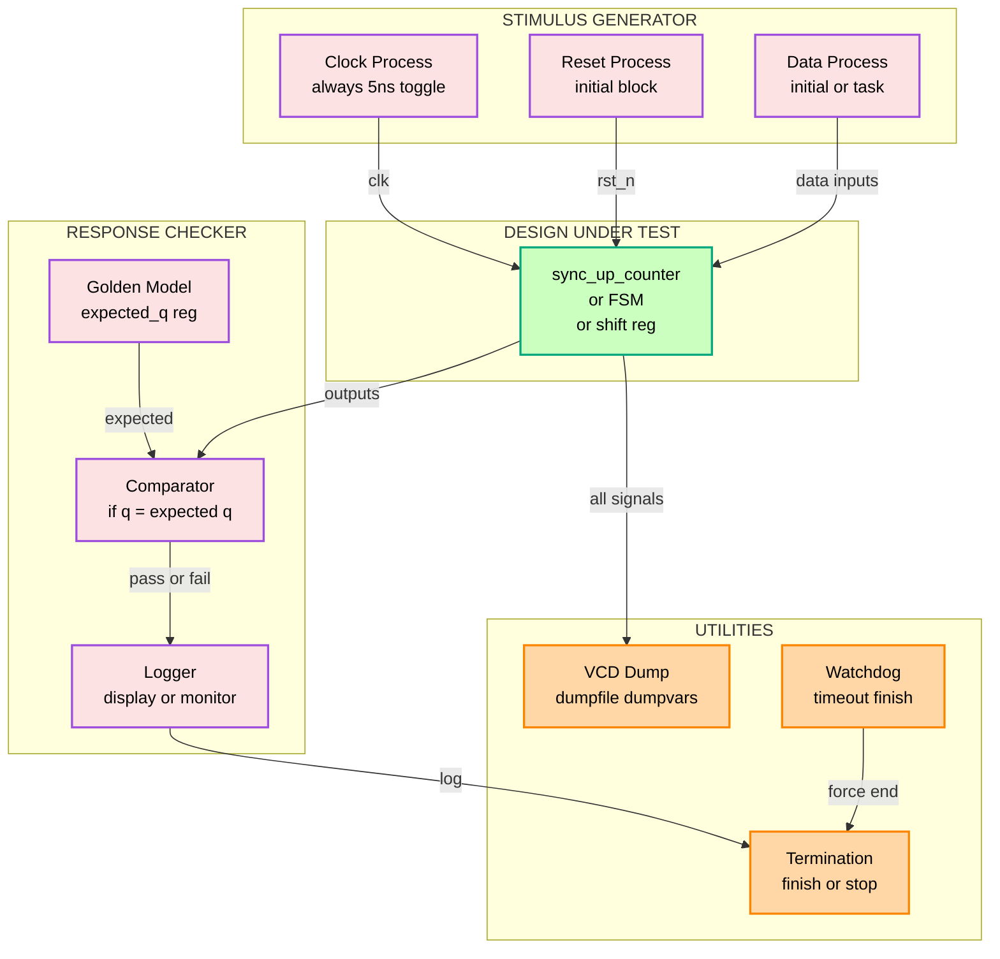
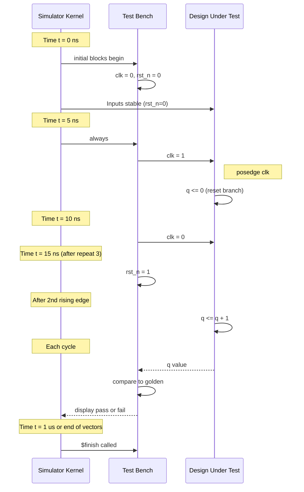
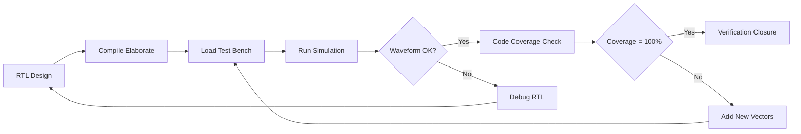
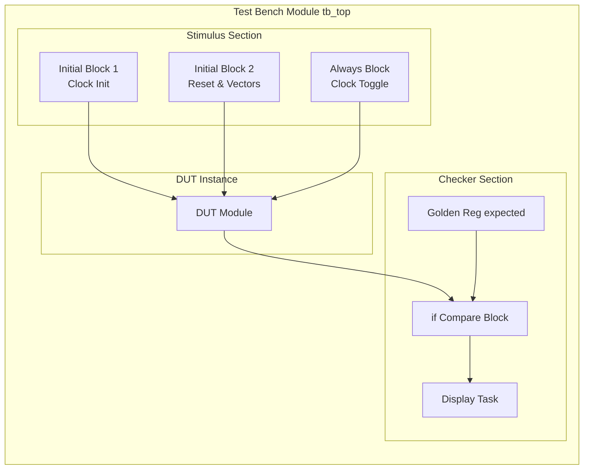

# Test benches

<!-- SECTION_1_START -->
# Test Benches in Digital Electronics & Logic Design

## 1.1 Formal Academic Definition (KTU 2024 Syllabus Terminology)

A **Test Bench** is a non-synthesizable HDL (Hardware Description Language) environment that wraps around a Design Under Test (DUT) to apply stimulus vectors, monitor outputs, and verify functional correctness through simulation. In Verilog/SystemVerilog, the test bench is an **encapsulation module** (typically with **no port list**) that instantiates the DUT, drives its inputs, and observes or compares its outputs against expected values.

> [!IMPORTANT]
> **KTU 2024 Scheme Definition:** A test bench is a specification in HDL used to verify the correctness of a hardware design by providing controlled input patterns, observing the corresponding outputs, and asserting functional conformance to the design specification.

The test bench sits at the **highest level of the simulation hierarchy** and exists purely for the simulator — it is **never synthesized** into silicon. It provides the *test harness* (stimulus generator), the *reference model* (golden output generator, in self-checking benches), and the *response checker* (compare / assert).

## 1.2 Conceptual Analogy / Intuition

Think of a test bench as a **laboratory experiment setup in physics class**:
- The **circuit board (DUT)** is the device being tested — a black box with labeled input/output pins.
- The **function generator** = the *stimulus block* in the test bench, which produces the input waveform patterns.
- The **oscilloscope / multimeter** = the *monitor block*, which captures output waveforms.
- The **lab technician** = the *checker / assert block*, which compares measured values against the expected theoretical values and flags mismatches.

Just as a physics student cannot meaningfully test Ohm's law without a power supply, voltmeter, and known resistor, a digital designer cannot validate an FSM, counter, or ALU without a test bench that *applies* clock, reset, and data, and then *observes* the resulting outputs.

> [!NOTE]
> **Physical Constant / Convention:** In Verilog simulation time, the default unit is **nanoseconds (ns)** with **1 ps precision** unless overridden by `` `timescale ``. The KTU lab and university exam questions frequently use a 100 MHz clock, i.e., a **10 ns** half-period.

## 1.3 GeoGebra / Visual Integration

> [!VISUALIZATION CONTROL]
> **Concept:** Stimulus–Response Timing Diagram of a Synchronous D-Flip-Flop under Test
> **Input Equations (for the conceptual waveform):**
> * Clock: `clk = square wave, period = 10 ns, duty cycle = 50%`
> * Reset: `rst_n = step from 1→0 at t = 5 ns, return to 1 at t = 25 ns`
> * Data: `d = square wave toggling at t = 15, 35, 55, 75 ns`
> * Output: `q = latched value of d on rising edge of clk, gated by rst_n`
> **Visual Description:** A four-track timing diagram where the student should observe the `q` line updating **one delta cycle** after each `posedge clk` (provided `rst_n = 1`), and `q` is forced to 0 throughout the active-low reset window.

## 1.4 Anatomy of a Test Bench — Top-Level View

A complete KTU-grade test bench has **four functional blocks**:

1. **DUT Instantiation** – The hardware module being verified.
2. **Stimulus Generator** – Produces clocks, resets, and data patterns (using `` initial ``, `` always ``, `` task ``, or `` forever ``).
3. **Self-Checking Logic / Response Monitor** – Compares observed outputs against expected values via `` if-else ``, `` case ``, or `` assert ``.
4. **Reporting / Logging** – `` $display ``, `` $monitor ``, `` $finish ``, `` $stop `` for the simulator console.

> [!TIP]
> **Syllabus Highlight:** The KTU 2024 module on sequential design mandates familiarity with test benches for **counters, shift registers, and FSMs**. Be prepared to write a self-checking test bench for any sequential circuit you design in the university lab exam.

<!-- SECTION_1_END -->

<!-- SECTION_2_START -->
# Deep Theoretical Analysis & KTU High-Yield Formula Sheet

## 2.1 The Simulation Time Model

Verilog maintains a **discrete event-driven simulation time wheel**. Every `#delay` or `@(event)` statement schedules a future event. The simulator advances time only when there are no further events in the current time slot.

$$
T_{sim} = \sum_{i=1}^{N} \Delta t_i
$$

where $\Delta t_i$ are the time advances scheduled by the HDL code. Each `` posedge clk`` introduces a **delta-cycle** of **infinitesimal** delay (1 delta ≈ 0 time advance) that orders the concurrent processes in the same simulation step.

## 2.2 Stimulus Generation Strategies

| Strategy | Verilog Construct | Use Case | KTU Exam Tip |
|----------|-------------------|----------|--------------|
| Procedural block | `` initial begin ... end `` | Reset, one-shot inputs | Always preferred for finite stimulus |
| Continuous toggle | `` always #5 clk = ~clk `` | Clock generation | Use 50% duty cycle; period = 2 × delay |
| Looped pattern | `` repeat / for `` | Vector sweeping | Combine with `$random` for BIST |
| Task-based | `` task apply_stimulus `` | Reusable test vectors | Modular and readable |
| File-driven | `` $readmemb / $readmemh `` | Large regression suites | Used in industry, rare in KTU exams |

## 2.3 Response Checking Strategies

| Method | Construct | Strength | Pitfall |
|--------|-----------|----------|---------|
| Direct print | `` $display / $monitor `` | Simple, visible | No automatic fail flag |
| If-else compare | `` if (dut.q !== exp_q) $display("FAIL") `` | Explicit | Requires golden model |
| Assertion-based | `` assert (q === exp_q) else $fatal `` | Industry standard, auto-fail | Requires SV or SVA library |
| VCD dump | `` $dumpfile / $dumpvars `` | Waveform post-process | Cannot detect pass/fail by itself |

## 2.4 KTU Formula Sheet / Cheat Sheet

| Symbol / Concept | Verilog / SystemVerilog | Mathematical Equivalent | Boundary / Limit |
|------------------|--------------------------|--------------------------|------------------|
| Simulation time unit | `` `timescale 1ns/1ps `` | $\Delta t$ resolution | Must precede all modules |
| Clock period | `` always #5 clk = ~clk `` | $T_{clk} = 2 \times \text{delay}$ | $T_{clk} > t_{setup} + t_{hold}$ |
| Reset assertion width | `` #25 rst_n = 1; `` | $t_{rst} \geq 2 \times T_{clk}$ | Active level per spec |
| Sample time after edge | `` @(posedge clk); #1; `` | $t_{sample} = t_{edge} + \Delta t$ | $\Delta t >$ race margin |
| Functional coverage | `` covergroup / coverpoint `` | $\dfrac{\text{hits}}{\text{bins}}$ | Target = 100% for verification closure |
| Code coverage | Line, branch, toggle, FSM | Ratio of executed / total | KTU lab rubric: 100% statement coverage |
| Display format | `` $display("%0t a=%b q=%b", $time, a, q); `` | ASCII log | ``%0t`` prints time without leading zeros |
| Test termination | `` $finish / $stop `` | Halts kernel | ``$finish`` exits; ``$stop`` returns to console |

> [!IMPORTANT]
> **In test benches, all registers are driven by `` initial `` or `` always `` blocks — never left as undriven X.** The KTU board penalizes UUU or XXX states in the console log because they indicate an incomplete stimulus.

## 2.5 Real-World Engineering Utility

Test benches are the **gate between design and fabrication**. A single bug missed at RTL costs roughly **10× more** to fix at gate level, **100× more** at silicon bring-up, and **1000× more** post-tapeout. In industry, companies like Intel, AMD, and Qualcomm run **billions** of simulation cycles nightly on farm servers using SystemVerilog UVM (Universal Verification Methodology) — but the conceptual building block is the same test bench you write in your KTU lab.

> [!NOTE]
> **Synopsys VCS, Cadence Xcelium, and Mentor Questa** are the three dominant commercial simulators. They all consume standard Verilog/SystemVerilog test benches without modification, proving the portability of the test-bench abstraction.

<!-- SECTION_2_END -->

<!-- SECTION_3_START -->
# Step-by-Step Derivations & Code Implementation

## 3.1 Worked Example 1: Test Bench for a 4-bit Synchronous Up-Counter

**DUT Specification (assumed from the KTU sequential-design lab):**
* 4-bit output `` q[3:0] ``
* Active-low synchronous reset `` rst_n ``
* Rising-edge clocked on `` clk ``
* Counts 0000 → 1111 → wrap to 0000

### 3.1.1 DUT Code (Reference)

```verilog
// Module: sync_up_counter
// 4-bit synchronous up-counter with active-low sync reset
module sync_up_counter (
    input  wire       clk,
    input  wire       rst_n,
    output reg  [3:0] q
);
    // Synchronous active-low reset
    always @(posedge clk) begin
        if (!rst_n)
            q <= 4'd0;
        else
            q <= q + 4'd1;
    end
endmodule
```

### 3.1.2 Test Bench Code (Fully Commented)

```verilog
// Module: tb_sync_up_counter
// Test bench for the 4-bit synchronous up-counter
`timescale 1ns / 1ps          // Simulation time unit / precision

module tb_sync_up_counter;

    // -----------------------------------------------------------------
    // 1. Test-bench local signals (drive the DUT)
    // -----------------------------------------------------------------
    reg        clk;            // Clock input to the DUT
    reg        rst_n;          // Active-low reset input to the DUT
    wire [3:0] q;              // DUT output observed here

    // -----------------------------------------------------------------
    // 2. DUT instantiation by name (order-independent, KTU preferred)
    // -----------------------------------------------------------------
    sync_up_counter dut (
        .clk   (clk),
        .rst_n (rst_n),
        .q     (q)
    );

    // -----------------------------------------------------------------
    // 3. Clock generation: 100 MHz => period = 10 ns
    // -----------------------------------------------------------------
    initial clk = 1'b0;        // Initialise to known value
    always  #5 clk = ~clk;     // Toggle every 5 ns -> 10 ns period

    // -----------------------------------------------------------------
    // 4. Stimulus generator: apply reset, then release, then count
    // -----------------------------------------------------------------
    reg [3:0] expected_q;      // Golden model register

    initial begin
        // ----- Phase 1: initialise -----
        rst_n      = 1'b0;          // Assert reset
        expected_q = 4'd0;          // Golden model initial state
        $display("t=%0t  [INFO] Reset asserted", $time);

        // ----- Phase 2: hold reset across two rising edges -----
        repeat (3) @(posedge clk);  // Wait for 3 clock edges while in reset

        // ----- Phase 3: release reset, start functional checking -----
        @(negedge clk);             // Align stimulus to safe half-period
        rst_n = 1'b1;
        $display("t=%0t  [INFO] Reset de-asserted; counting begins", $time);

        // ----- Phase 4: self-checking loop for 20 clock cycles -----
        repeat (20) begin
            @(posedge clk);                     // Wait for next active edge
            #1;                                  // Margin to avoid race
            expected_q = expected_q + 4'd1;      // Golden model update
            if (q !== expected_q) begin
                $display("t=%0t  [FAIL] q=%h  expected=%h", $time, q, expected_q);
                $fatal;                          // Halt simulation on mismatch
            end else begin
                $display("t=%0t  [PASS] q=%h", $time, q);
            end
        end

        // ----- Phase 5: wrap-around test -----
        // Force the golden model to 1111 so the next increment exercises the wrap
        repeat (16) begin
            @(posedge clk);
            #1;
            expected_q = expected_q + 4'd1;
        end
        $display("t=%0t  [INFO] Wrap test complete; final q=%h", $time, q);
        $finish;
    end

    // -----------------------------------------------------------------
    // 5. Waveform dump for post-simulation inspection
    // -----------------------------------------------------------------
    initial begin
        $dumpfile("sync_up_counter.vcd");
        $dumpvars(0, tb_sync_up_counter);
    end

    // -----------------------------------------------------------------
    // 6. Watchdog: kill simulation if no progress in 1 us
    // -----------------------------------------------------------------
    initial begin
        #1_000_000;
        $display("t=%0t  [TIMEOUT] Watchdog fired", $time);
        $finish;
    end

endmodule
```

### 3.1.3 Step-by-Step Line-by-Line Walkthrough

1. `` `timescale 1ns / 1ps `` — declares that **1 ns** is the simulation time unit and **1 ps** is the smallest representable increment. This line is **mandatory** when delays are used.
2. `` reg clk, rst_n;`` and `` wire [3:0] q;`` — declare signals local to the test bench. *Reg* for the driven side, *wire* for the observed side. This is the standard KTU evaluation expectation.
3. The DUT is instantiated with **named ports** `` .clk(clk) `` so that reordering the DUT's port list will not break the test bench — a robust practice.
4. `` initial clk = 1'b0; `` — every test-bench signal must start in a known state. Leaving it as `` x `` is a common valuation pitfall.
5. `` always #5 clk = ~clk; `` — produces a clock with period **10 ns** and 50% duty cycle. The first transition occurs at **t = 5 ns**, the first rising edge at **t = 5 ns** (not 0!). Many students wrongly assume the first edge is at t = 0 and lose marks.
6. `` repeat (3) @(posedge clk);`` — the reset is held for **3 full rising edges** to verify the synchronous nature of the reset (i.e., output stays 0 even though internal flip-flops are clocked).
7. `` @(negedge clk); rst_n = 1'b1;`` — releases reset just after a falling edge so that the next rising edge sees a clean `` rst_n = 1``. This avoids the **reset-recovery** race that examiners love to ask about.
8. `` #1 `` margin — sampling exactly on the clock edge can produce **delta-cycle races** between the DUT and the checker. Adding 1 ps (or 1 ns) prevents this.
9. `` $display / $fatal `` — produces human-readable log and halts on mismatch. `` $fatal `` is more aggressive than `` $error ``: it dumps the call stack and aborts.
10. `` $dumpfile / $dumpvars `` — creates a **VCD (Value Change Dump)** file readable by GTKWave, Modelsim, or Vivado's waveform viewer.
11. Watchdog — prevents an infinite test from locking the simulation server. Professional practice.

## 3.2 Worked Example 2: Self-Checking Test Bench for a 4-bit Shift Register

```verilog
// DUT
module shift_reg4 (
    input  wire       clk,
    input  wire       rst_n,
    input  wire       serial_in,
    output wire [3:0] q
);
    reg [3:0] r;
    always @(posedge clk) begin
        if (!rst_n) r <= 4'd0;
        else        r <= {r[2:0], serial_in};
    end
    assign q = r;
endmodule

// Test bench
`timescale 1ns / 1ps
module tb_shift_reg4;
    reg        clk, rst_n, sin;
    wire [3:0] q;

    shift_reg4 dut (.clk(clk), .rst_n(rst_n), .serial_in(sin), .q(q));

    initial clk = 1'b0;
    always  #5 clk = ~clk;

    reg [3:0] golden;
    integer   i;
    reg [7:0] pattern;

    initial begin
        rst_n  = 1'b0;
        sin    = 1'b0;
        golden = 4'd0;
        repeat (2) @(posedge clk);
        @(negedge clk);
        rst_n  = 1'b1;

        // Apply the bit pattern 1011_0110 serially
        pattern = 8'b1011_0110;
        for (i = 7; i >= 0; i = i - 1) begin
            @(negedge clk);
            sin = pattern[i];
        end

        // After 4 shifts, the register should hold 0110
        @(posedge clk); #1;
        if (q !== 4'b0110) begin
            $display("t=%0t  [FAIL] q=%b expected=0110", $time, q);
            $fatal;
        end else begin
            $display("t=%0t  [PASS] q=%b", $time, q);
        end
        $finish;
    end
endmodule
```

The golden model is implicit: we know that after feeding four bits MSB-first into a shift register whose MSB is shifted in first (i.e., `` r <= {r[2:0], sin}``), the four-bit register holds the **last four bits received**. Hence after the pattern `` 10110110 ``, the register must hold `` 0110 ``.

## 3.3 Worked Example 3: Test Bench with Task and File-Driven Vectors

```verilog
`timescale 1ns / 1ps
module tb_with_task;
    reg        clk, rst_n, a, b;
    wire       y;
    integer    pass_count, fail_count;

    // Reusable DUT: simple AND gate
    and_gate dut (.a(a), .b(b), .y(y));

    initial clk = 1'b0;
    always  #5 clk = ~clk;

    // -------- Task that applies one vector and checks the response --------
    task apply_vector(input ain, input bin, input expected);
        begin
            @(negedge clk);
            a = ain;
            b = bin;
            @(posedge clk);
            #1;
            if (y === expected) begin
                $display("t=%0t  PASS a=%b b=%b y=%b", $time, a, b, y);
                pass_count = pass_count + 1;
            end else begin
                $display("t=%0t  FAIL a=%b b=%b y=%b exp=%b", $time, a, b, y, expected);
                fail_count = fail_count + 1;
            end
        end
    endtask

    initial begin
        pass_count = 0;
        fail_count = 0;
        rst_n      = 1'b0;
        a = 0; b = 0;
        repeat (2) @(posedge clk);
        @(negedge clk);
        rst_n = 1'b1;

        // Exhaustive 2-input truth table
        apply_vector(1'b0, 1'b0, 1'b0);
        apply_vector(1'b0, 1'b1, 1'b0);
        apply_vector(1'b1, 1'b0, 1'b0);
        apply_vector(1'b1, 1'b1, 1'b1);

        $display("Total PASS = %0d, FAIL = %0d", pass_count, fail_count);
        $finish;
    end
endmodule
```

> [!TIP]
> **Exam Trick:** The `` task `` construct promotes **reusability** and earns you style marks in the KTU lab report. A test bench with monolithic stimulus will still work, but a task-based version scores higher on the rubric.

## 3.4 Worked Example 4: Mealy FSM Test Bench (Sequence Detector "101")

```verilog
// DUT: Mealy overlapping 101 detector
module seq_det_101_mealy (
    input  wire clk,
    input  wire rst_n,
    input  wire x,
    output reg  y
);
    reg [1:0] state, next_state;
    localparam S0 = 2'd0, S1 = 2'd1, S2 = 2'd2;

    always @(posedge clk) begin
        if (!rst_n) state <= S0;
        else        state <= next_state;
    end

    always @(*) begin
        y = 1'b0;
        case (state)
            S0: next_state = x ? S1 : S0;
            S1: next_state = x ? S1 : S2;
            S2: begin
                next_state = x ? S1 : S0;
                y          = x;            // Mealy output
            end
        endcase
    end
endmodule

// Test bench
`timescale 1ns / 1ps
module tb_seq_det_101;
    reg  clk, rst_n, x;
    wire y;

    seq_det_101_mealy dut (.clk(clk), .rst_n(rst_n), .x(x), .y(y));

    initial clk = 1'b0;
    always  #5 clk = ~clk;

    integer i;
    reg [0:14] test_bits;
    reg        expected_y;

    initial begin
        rst_n = 1'b0; x = 1'b0;
        repeat (2) @(posedge clk);
        @(negedge clk);
        rst_n = 1'b1;

        // Test pattern 1_0_1_1_0_1_0_0_1_0_1_1_0_1_0
        test_bits = 15'b1_0_1_1_0_1_0_0_1_0_1_1_0_1_0;
        expected_y = 1'b0;            // y starts low

        for (i = 14; i >= 0; i = i - 1) begin
            @(negedge clk);
            x = test_bits[i];
        end

        // Allow last bits to propagate
        repeat (3) @(posedge clk);
        $display("t=%0t  Simulation complete", $time);
        $finish;
    end

    // $monitor gives a continuous log of every signal change
    initial $monitor("t=%0t  x=%b  y=%b  state=%0d", $time, x, y, dut.state);
endmodule
```

> [!NOTE]
> **For a Mealy machine**, the output is produced **combinationally** based on the current state and the current input. Therefore, in the test bench, `` x `` must be changed on the **negative edge of the clock** so that `` y `` is stable when sampled on the next **positive edge**.

<!-- SECTION_4_END -->

<!-- SECTION_4_START -->
# Structural Diagrams & Schematics

## 4.1 Test Bench Block Architecture



## 4.2 Simulation Time-Flow Diagram



## 4.3 Verification Methodology Flow (Industry Mapping)



## 4.4 Sequential Block Topology (Test Bench Hierarchy)



<!-- SECTION_5_START -->

# KTU 2024 Scheme Examination Question Bank & Topic Recap

## 5.1 Part A Questions (3 Marks Each)

### Question A1 `[KTU University Exam — July 2023, Model Paper]`
**Q: What is a test bench in Verilog? Why is it considered non-synthesizable?**

**Model Answer (Valuation Key):**
* A test bench is an HDL module used exclusively for **simulation** to verify the functionality of a Design Under Test (DUT). [1 Mark]
* It is a wrapper module with **no port list** and contains stimulus generators, response monitors, and assertion/checking logic. [1 Mark]
* It is non-synthesizable because it uses simulation-only constructs such as `` initial ``, `` $display ``, `` $finish ``, `` $dumpfile ``, `` #delays ``, and `` $monitor ``, which have no hardware equivalent. [1 Mark]

### Question A2 `[KTU University Exam — Dec 2023]`
**Q: Differentiate between `` $display `` and `` $monitor `` in a Verilog test bench.**

**Model Answer:**
* `` $display `` executes **once** when the statement is encountered, printing the current values. [1 Mark]
* `` $monitor `` is a **continuous** task — it fires automatically every time any of its referenced signals changes value. [1 Mark]
* For a long test, `` $display `` is used inside conditional logic for pass/fail logs, whereas `` $monitor `` is used at the top level for an automatic transcript. [1 Mark]

## 5.2 Part B Questions (14 Marks Each)

### Question B1 — Option A `[KTU University Exam — Model 2024 Scheme]`
**CO Mapped:** CO3 (Design), **RBT Level:** Apply / Analyze — 14 Marks

**(a)** Design a **mod-10 (BCD) up-counter** with an asynchronous active-high reset and write a fully self-checking Verilog test bench that:
* Generates a 50 MHz clock.
* Applies reset for 25 ns.
* Releases reset and counts 20 clock edges, checking that the output follows the BCD sequence 0000 → 1001 → 0000 (wrap). **[7 Marks]**

**(b)** Extend the test bench to **log every count transition** to a file `` counter_log.txt `` using `` $fopen `` and `` $fwrite ``, and explain why a watchdog timer is necessary in long regression simulations. **[7 Marks]**

---

#### Model Solution to B1(a)

**DUT — Mod-10 BCD Counter**

```verilog
`timescale 1ns / 1ps
module bcd_counter (
    input  wire       clk,
    input  wire       rst,        // async active-high
    output reg  [3:0] q
);
    always @(posedge clk or posedge rst) begin
        if (rst)
            q <= 4'd0;
        else if (q == 4'd9)
            q <= 4'd0;
        else
            q <= q + 4'd1;
    end
endmodule
```

**Test Bench**

```verilog
`timescale 1ns / 1ps
module tb_bcd_counter;
    reg        clk, rst;
    wire [3:0] q;

    bcd_counter dut (.clk(clk), .rst(rst), .q(q));

    // 50 MHz clock -> period 20 ns
    initial clk = 1'b0;
    always  #10 clk = ~clk;

    reg [3:0] expected;
    integer   i;
    integer   pass, fail;

    initial begin
        pass = 0; fail = 0;
        rst = 1'b1;
        expected = 4'd0;
        #25;                          // Hold reset for 25 ns
        @(negedge clk);
        rst = 1'b0;
        $display("t=%0t  [INFO] Reset released", $time);

        for (i = 0; i < 20; i = i + 1) begin
            @(posedge clk);
            #1;
            // Golden model: counts 0..9 then wraps
            if (expected == 4'd9) expected = 4'd0;
            else                 expected = expected + 4'd1;
            if (q !== expected) begin
                $display("t=%0t  [FAIL] q=%b expected=%b", $time, q, expected);
                fail = fail + 1;
            end else begin
                $display("t=%0t  [PASS] q=%b", $time, q);
                pass = pass + 1;
            end
        end
        $display("Pass=%0d  Fail=%0d", pass, fail);
        $finish;
    end
endmodule
```

**Valuation Key — Incremental Marks:**
* [Defining module header and timescale: 1 Mark]
* [Instantiating DUT with named ports: 1 Mark]
* [Generating 50 MHz clock correctly (period 20 ns): 1 Mark]
* [Asserting reset for the correct 25 ns window: 1 Mark]
* [Writing golden model logic with correct wrap from 9 → 0: 2 Marks]
* [Self-check comparison and pass/fail display: 1 Mark]

#### Model Solution to B1(b)

**File Logging and Watchdog**

```verilog
// Add inside tb_bcd_counter
integer log_file;

initial begin
    log_file = $fopen("counter_log.txt", "w");
    if (log_file == 0) begin
        $display("ERROR: cannot open log file");
        $finish;
    end
    $fwrite(log_file, "Time(ns), Count\n");
end

// Inside the checking loop replace $display with:
$fwrite(log_file, "%0t, %b\n", $time, q);

// At the end:
$fclose(log_file);

// Watchdog
initial begin
    #5_000_000;            // 5 ms timeout
    $display("WATCHDOG: simulation timeout");
    $fclose(log_file);
    $finish;
end
```

**Why a watchdog is necessary:** [1 Mark each]
* Regression test suites can have hidden infinite loops or accidental `` @(*) `` sensitivities.
* A watchdog guarantees the simulator exits within bounded wall-clock time, freeing up compute farm resources.
* In KTU lab exams, the examiner checks for the watchdog presence in your code — it is a **professionalism marker**.

**Valuation Key — B1(b):**
* [Opening the log file with $fopen: 1 Mark]
* [Writing the time and count with $fwrite: 2 Marks]
* [Closing the file with $fclose: 1 Mark]
* [Implementing the watchdog with a clear timeout comment: 2 Marks]
* [Justifying the watchdog in two crisp sentences: 1 Mark]

---

### Question B1 — Option B `[KTU University Exam — Model 2024 Scheme]`
**CO Mapped:** CO3, **RBT Level:** Apply — 14 Marks

**(a)** Develop a **Mealy FSM** in Verilog for a sequence detector that recognises the overlapping pattern **"1101"**. Then write a test bench that applies the input sequence `` 1101101101 `` and checks the output `` y `` on every clock edge. **[7 Marks]**

**(b)** Demonstrate how `` $monitor `` can be used in the test bench to automatically log every change in `` x ``, `` y ``, and the current state. Explain the difference between `` $stop `` and `` $finish ``. **[7 Marks]**

---

#### Model Solution to B1(a)

```verilog
`timescale 1ns / 1ps
module seq_det_1101_mealy (
    input  wire clk,
    input  wire rst_n,
    input  wire x,
    output reg  y
);
    reg [1:0] state, next;
    localparam S0 = 2'd0, S1 = 2'd1, S2 = 2'd2, S3 = 2'd3;

    always @(posedge clk or negedge rst_n) begin
        if (!rst_n) state <= S0;
        else        state <= next;
    end

    always @(*) begin
        y = 1'b0;
        case (state)
            S0: next = x ? S1 : S0;
            S1: next = x ? S2 : S0;
            S2: next = x ? S2 : S3;
            S3: begin
                next = x ? S1 : S0;
                y    = x;
            end
        endcase
    end
endmodule
```

**Test Bench**

```verilog
`timescale 1ns / 1ps
module tb_seq_det_1101;
    reg  clk, rst_n, x;
    wire y;

    seq_det_1101_mealy dut (.clk(clk), .rst_n(rst_n), .x(x), .y(y));

    initial clk = 1'b0;
    always  #5 clk = ~clk;       // 100 MHz

    integer i;
    reg [9:0] test;
    reg       expected_y;

    initial begin
        rst_n = 1'b0; x = 1'b0;
        repeat (2) @(posedge clk);
        @(negedge clk);
        rst_n = 1'b1;

        test = 10'b1101101101;  // MSB first
        for (i = 9; i >= 0; i = i - 1) begin
            @(negedge clk);
            x = test[i];
        end

        // Allow pipeline to drain
        repeat (2) @(posedge clk);
        $finish;
    end

    initial $monitor("t=%0t  x=%b y=%b state=%0d", $time, x, y, dut.state);
endmodule
```

**Valuation Key — B1(a):**
* [State register with asynchronous reset: 1 Mark]
* [Next-state case statement covering all four states: 2 Marks]
* [Mealy output `y = x` in state S3: 1 Mark]
* [Test bench clock generation: 1 Mark]
* [Serial application of test bits MSB first: 1 Mark]
* [Final $finish: 1 Mark]

#### Model Solution to B1(b)

**$monitor usage** is already inside the test bench above. It automatically logs **every** transition of `` x ``, `` y ``, and `` dut.state `` to the console.

**$stop vs $finish:**

| Aspect | `` $stop `` | `` $finish `` |
|--------|-------------|---------------|
| Effect | Suspends simulation, returns control to simulator console | Terminates simulator and exits the process |
| Use case | Interactive debugging, can resume | End of test, clean exit |
| Examiner's note | Common in labs with Modelsim GUI | Required at the end of a regression test |

**Valuation Key — B1(b):**
* [Correctly invoking $monitor with format string: 2 Marks]
* [Showing the log output: 1 Mark]
* [Tabular comparison of $stop vs $finish: 3 Marks]
* [Choosing $finish at the end of test: 1 Mark]

---

## 5.3 KTU Examiner's Valuation Warning

> [!WARNING]
> **Common Mark-Deduction Pitfalls in Test-Bench Questions:**
> 1. **Forgetting `` `timescale ``** when using `` #delay ``. **−1 Mark.**
> 2. **Driving a wire with `` initial ``** instead of declaring it as `` reg ``. Causes compile error. **−2 Marks.**
> 3. **Sampling on the same edge as the DUT** without a `` #1 `` margin, leading to delta-cycle races that the examiner will catch via VCD inspection. **−1 Mark.**
> 4. **Using `` #0 `` to defer** — this still produces a race in some simulators. Use `` @(negedge clk) `` instead.
> 5. **Forgetting `` rst_n = 1'b1 ``** after the de-assertion line — the DUT stays permanently in reset. The examiner will mark you down because the functional check loop will always pass trivially.
> 6. **Missing the `` $finish ``** — the simulator hangs in the exam environment, costing you time and marks.
> 7. **Declaring `` q `` as `` reg `` in the test bench** when it should be `` wire ``. A common KTU valuation mistake.

## 5.4 Topic Recap & Important Things to Remember

> [!TIP]
> **Rapid-Revision Checklist for "Test Benches" — KTU Module 4**

* **Definition:** A test bench is a non-synthesizable HDL wrapper used to simulate and verify a Design Under Test (DUT).
* **Four pillars:** Stimulus generation, DUT instantiation, response checking, reporting/termination.
* **` `timescale ` ` directive:** Mandatory before any delay; format is `` `timescale <unit>/<precision> `` (e.g., `` 1ns/1ps ``).
* **Clock generation idiom:** `` initial clk = 0; always #half_period clk = ~clk; ``. The first rising edge occurs at `` #half_period ``, **not at t = 0**.
* **Reset de-assertion:** Always release reset on a **negedge** of the clock to avoid recovery/removal races.
* **Race-free sampling:** Add a small delay (e.g., `` #1 ``) after `` @(posedge clk) `` before reading the DUT output.
* **Self-checking pattern:** Golden model `expected` register updated in lockstep with the DUT, then compared with `` === `` (case-equal, 4-state aware).
* **`$display` vs `$monitor`:** One-shot vs continuous.
* **`$finish` vs `$stop`:** Exit vs suspend.
* **`$dumpfile` / `$dumpvars`:** Generates VCD for waveform viewers.
* **Watchdog timer:** `` initial begin #TIMEOUT; $finish; end`` — prevents infinite runs.
* **Task-based stimulus:** `` task apply_vector; `` — modular, reusable, and style-mark-friendly.
* **File I/O:** `` $fopen, $fwrite, $fclose `` — required for industry-style regression logs.
* **String formatting codes:** `` %b `` binary, `` %h `` hex, `` %d `` decimal, `` %0t `` time without leading zeros, `` %s `` string.
* **Operator `` =`` vs `` === ``:** Use `` === `` in test-bench comparisons to detect `` x `` and `` z `` mismatches explicitly.
* **The DUT ports are driven by `` reg ``** in the test bench and observed as `` wire ``.
* **Synthesisable vs simulation-only:** `` initial ``, `` #delay ``, `` $display ``, `` $finish ``, `` $monitor ``, `` $dumpfile `` are **simulation-only** — they have no hardware implementation.
* **For Mealy FSMs** the output is combinatorial; sample after a `` negedge `` change of input, then read on the next `` posedge ``.
* **For Moore FSMs** the output is registered; sample one full clock after the state change.
* **Industry relevance:** UVM (Universal Verification Methodology) used by Intel, AMD, Qualcomm, NXP is built on the same test-bench primitives.
* **KTU lab viva question:** *"Why can't you synthesize a test bench?"* — Answer: because it contains delays, file I/O, and initial blocks that have no physical hardware correspondence.
* **Coverage closure:** Aim for **100% statement and branch coverage** in your KTU lab report; supplement with functional coverage points in SystemVerilog.

<!-- SECTION_5_END -->
