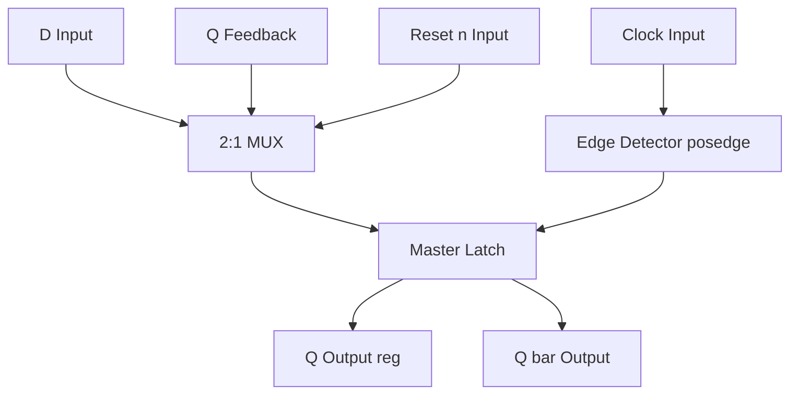
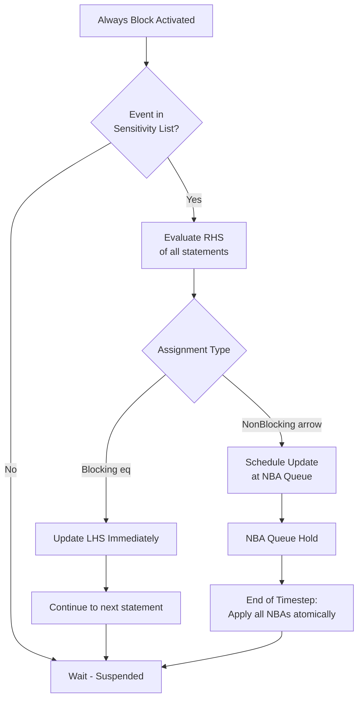
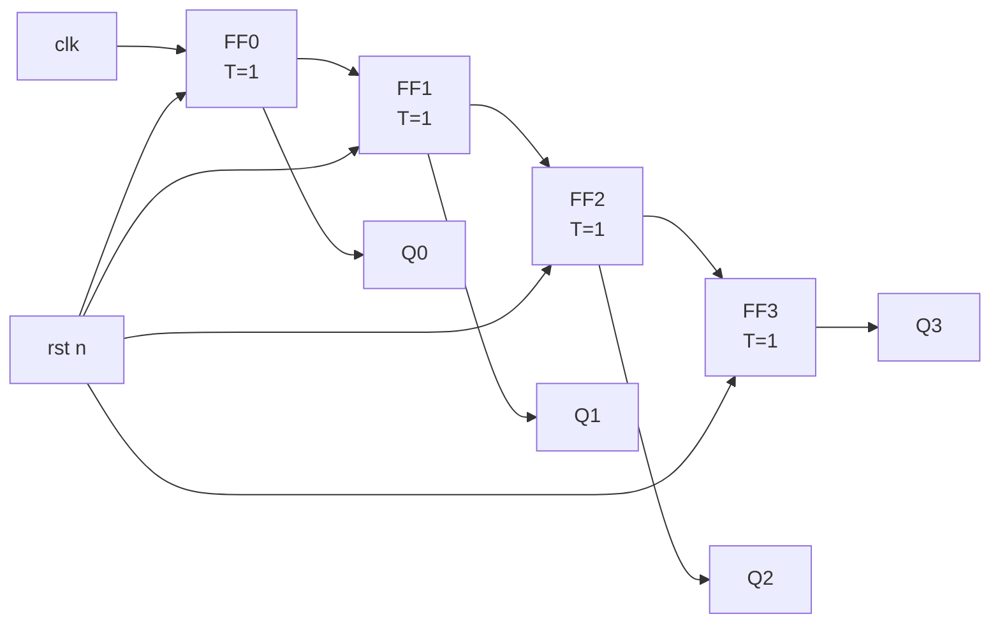
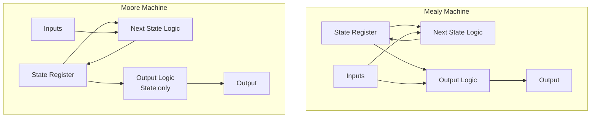
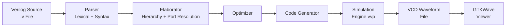
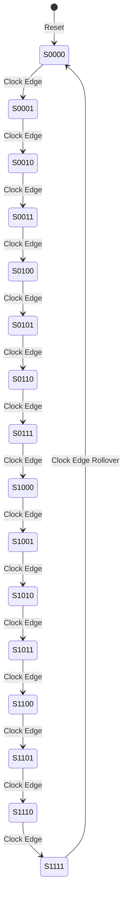
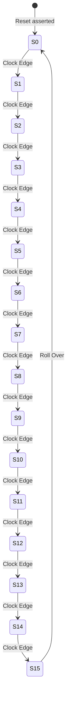
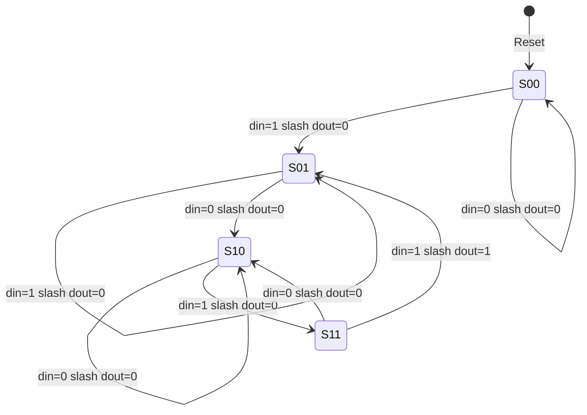

# Verilog (Part 2) : -

<!-- SECTION_1_START -->
# Verilog (Part 2): Sequential Logic Modeling in Verilog HDL

> [!IMPORTANT]
> **KTU 2024 Scheme | GAEST305 | Module 4 Focus**
> This module covers **advanced Verilog constructs for sequential logic design**, building on Part 1 (combinational logic). Mastery of this topic is **mandatory** for the end-semester evaluation, lab internal assessments, and the KTU-style HDL coding questions typically asked for **14 marks**.

## 1. Core Technical Definition

> [!NOTE]
> **Formal Definition (KTU Syllabus Aligned):**
> **Verilog HDL (Hardware Description Language)** is a standardized IEEE 1364 text-based language used to model, simulate, and synthesize digital systems at multiple levels of abstraction. **Verilog Part 2** specifically addresses the *behavioral modeling* of **sequential logic circuits** (flip-flops, registers, counters, and finite state machines) using `always` blocks, **blocking (`=`) and non-blocking (`<=`) procedural assignments**, edge-sensitive event control (`posedge`/`negedge`), and IEEE 1364-compliant **synthesizable coding templates**.

## 2. Three Modeling Styles in Verilog

Verilog supports **three abstraction levels** for describing any digital circuit:

| Modeling Style | Abstraction Level | Primary Construct | Synthesis Use |
| :--- | :--- | :--- | :--- |
| **Gate-Level (Structural)** | Switches / Primitive Gates | `and`, `or`, `not`, `nand`, `xor` | Yes (low-level netlist) |
| **Dataflow** | Register Transfer Level (RTL) | `assign` with continuous assignment | Yes (preferred for combinational) |
| **Behavioral** | Algorithmic / Procedural | `always` block, `initial` block | Yes (preferred for sequential) |

## 3. Conceptual Analogy / Intuition

> [!TIP]
> **The "Play Script" Analogy for `always` Blocks:**
> Think of an `always` block as a **stage direction in a play script** 🎭.
> - An `always @(*)` block is like a director who **rehearses the scene every single time any prop (input signal) changes** — perfect for combinational logic.
> - An `always @(posedge clk)` block is like a director who **only reacts to the curtain rising** (the clock edge) — perfect for flip-flops and registers.
> - Blocking assignment `=` is an actor who **finishes their line before the next actor speaks** (sequential order).
> - Non-blocking assignment `<=` is a chorus where **all actors speak their lines simultaneously and then update together at the end of the clock edge** (parallel snapshot).

This "curtain" metaphor is critical — it explains **why non-blocking assignments are the KTU-mandated standard for sequential logic** (avoids race conditions in simulation).

## 4. Key Verilog Keywords & Symbols

- **`always`** — procedural block executed repeatedly
- **`@`** — event control operator (sensitivity list)
- **`posedge`** / **`negedge`** — edge-sensitive transition detector
- **`=`** — **blocking** assignment (sequential execution)
- **`<=`** — **non-blocking** assignment (parallel scheduling)
- **`initial`** — block executed once at time zero
- **`reg`** — variable type for storage in procedural blocks
- **`wire`** — net type for continuous connections
- **`$display`, `$monitor`, `$finish`, `$dumpfile`, `$dumpvars`** — system tasks
- **`#`** — delay control operator

> [!IMPORTANT]
> **The KTU Golden Rule:**
> *"Use `<=` (non-blocking) for **sequential** logic (flip-flops) and `=` (blocking) for **combinational** logic (within `always @(*)`)."*
> Violating this rule is the **#1 cause of synthesis-simulation mismatch** in KTU lab exams.

## 5. GeoGebra / Desmos Visualization (Conceptual)

> [!VISUALIZATION CONTROL]
> **Concept:** Clock Edge Detection Waveform (D-Flip-Flop Behavior)
> **Waveform Equations (Time-Amplitude Plot):**
> - `clk(t) = square(t, period=10, duty=0.5)`
> - `d(t) = piecewise(0 ≤ t < 3 ? 1, 3 ≤ t < 7 ? 0, 7 ≤ t < 10 ? 1)`
> - `q(t) = clk_rising_edge ? d(t-ε) : q_prev`
> **Visual Description:** On the rising edge of `clk` (marked at $t = 0, 10, 20, \dots$), the output `q` captures the value of `d` *just before* the edge and holds it constant until the next rising edge — this is the **edge-triggered D-FF behavior** that the `always @(posedge clk)` block implements.

<!-- SECTION_1_END -->

<!-- SECTION_2_START -->
# Deep Theoretical Analysis & KTU High-Yield Formula Sheet

## 1. The `always` Block — Internal Execution Model

An `always` block is a **continuous procedural loop**. It triggers on events listed in its **sensitivity list** and re-executes the body every time a triggering event occurs.

### A. Level-Sensitive (Combinational)
```verilog
always @(*) begin
    y = a & b | c;
end
```
- **Triggers:** Any change in `a`, `b`, or `c` (the `*` infers all RHS signals).
- **Used for:** Combinational logic synthesis.
- **Assignment:** Must use `=` (blocking) or both `=` consistently.

### B. Edge-Sensitive (Sequential)
```verilog
always @(posedge clk or negedge rst_n) begin
    if (!rst_n) q <= 1'b0;
    else        q <= d;
end
```
- **Triggers:** Rising edge of `clk` or falling edge of `rst_n` (asynchronous reset).
- **Used for:** Flip-flops, registers, counters, FSMs.
- **Assignment:** Must use `<=` (non-blocking) for **synchronous** logic.

## 2. Blocking vs. Non-Blocking Assignments — The Critical Distinction

| Feature | Blocking `=` | Non-Blocking `<=` |
| :--- | :--- | :--- |
| **Execution Order** | Sequential (immediate) | Deferred (RHS evaluated now, LHS updated at end of timestep) |
| **Use Case** | Combinational logic in `always @(*)` | Sequential logic in `always @(posedge clk)` |
| **Simulation Race** | May cause race conditions in sequential code | Race-free by design |
| **Verilog Standard (IEEE 1364)** | Permitted in initial & always | Permitted only in initial & always |
| **Synthesis Result** | Combinational netlist | Sequential flip-flops (when clocked) |

> [!WARNING]
> **KTU Examiner's Pitfall:** Mixing `=` and `<=` in the **same `always @(posedge clk)` block** is a guaranteed **synthesis-simulation mismatch** and a guaranteed **mark deduction** in 14-mark questions.

## 3. Blocking Assignment Execution Trace (Procedural Order)

$$\text{Step } t: \quad a = 1, \ b = 2$$
$$\text{Statement 1: } x = a + b; \quad \Rightarrow x = 3 \quad \text{(immediately updated)}$$
$$\text{Statement 2: } a = 5; \quad \Rightarrow a = 5$$
$$\text{Statement 3: } y = a + b; \quad \Rightarrow y = 7 \quad \text{(uses new value of } a\text{)}$$

## 4. Non-Blocking Assignment Execution Trace (Parallel Snapshot)

$$\text{Step } t: \quad a = 1, \ b = 2$$
$$\text{All RHS evaluated first (snapshot taken):} \quad a + b = 3$$
$$\text{All LHS updated atomically at end:} \quad x = 3, \ y = 3, \ a = 5$$
$$\text{Note: } y \text{ uses the old } a = 1, \text{ not the new } a = 5$$

## 5. KTU High-Yield Formula Sheet — Verilog Constructs

| Construct | Syntax | Function | Synthesizable? |
| :--- | :--- | :--- | :--- |
| **Module declaration** | `module name (port_list);` | Defines a hardware block | Yes |
| **Continuous assign** | `assign y = a & b;` | Dataflow combinational logic | Yes |
| **Gate instance** | `and g1(y, a, b);` | Gate-level structural logic | Yes |
| **Always (combinational)** | `always @(*)` | Behavioral combinational | Yes |
| **Always (sequential)** | `always @(posedge clk)` | Flip-flop / register | Yes |
| **Async reset** | `always @(posedge clk or negedge rst_n)` | FF with async clear | Yes |
| **Sync reset** | `if (!rst_n) q<=0;` inside clocked always | FF with sync clear | Yes |
| **Case statement** | `case (sel) 2'b00: ... endcase` | Multiplexer / decoder | Yes |
| **For loop (synthesizable)** | `for (i=0; i<4; i=i+1)` | Bit replication | Yes (constant bounds) |
| **Initial block** | `initial begin ... end` | Testbench stimulus | No (test only) |
| **`$display`** | `$display("q=%b", q);` | Print to console | Testbench only |
| **`$monitor`** | `$monitor(...);` | Auto-print on change | Testbench only |
| **`#delay`** | `#5;` | Wait 5 time units | Testbench only |
| **Parameter** | `parameter N = 4;` | Configurable width | Yes |

## 6. Reset Mechanisms — The Two Flavors

### A. Asynchronous Reset (Active-Low)
```verilog
always @(posedge clk or negedge rst_n) begin
    if (!rst_n) q <= 1'b0;     // immediate, independent of clock
    else        q <= d;
end
```

### B. Synchronous Reset (Active-Low)
```verilog
always @(posedge clk) begin
    if (!rst_n) q <= 1'b0;     // occurs only on clock edge
    else        q <= d;
end
```

| Feature | Async Reset | Sync Reset |
| :--- | :--- | :--- |
| **Responds to** | `rst_n` change ANY time | Only on `posedge clk` |
| **Sensitivity list** | Includes `negedge rst_n` | Only `posedge clk` |
| **Glitch susceptibility** | Higher (can be metastable) | Lower (filtered by clock) |
| **KTU exam frequency** | High | High |

## 7. Real-World Engineering Utility

Verilog sequential modeling is the **lingua franca of digital IC design**:
- **Intel/AMD/Qualcomm SoCs:** Billions of FFs modeled with `always @(posedge clk)` blocks.
- **ASIC Synthesis:** Cadence Genus / Synopsys Design Compiler reads non-blocking assignments → infers flip-flop libraries.
- **FPGA Programming:** Xilinx Vivado / Intel Quartus maps Verilog to LUTs and flip-flop primitives.
- **RISC-V Cores:** Open-source CPUs (e.g., Ibex, PicoRV32) are written 100% in behavioral Verilog with `always @(posedge clk)` blocks.
- **KTU Lab VIVA:** "What does `<=` synthesize to?" → "A flip-flop."

<!-- SECTION_2_END -->

<!-- SECTION_3_START -->
# Step-by-Step Derivations & Code Implementation

## 1. D Flip-Flop (D-FF) with Asynchronous Reset — Complete Verilog

```verilog
//=====================================================
// Module : D Flip-Flop with Active-Low Async Reset
// Standard: IEEE 1364-2005
// Synthesis: Maps to a single DFF cell with CLR pin
//=====================================================
module dff_async_reset (
    input  wire clk,       // clock input
    input  wire rst_n,     // active-low asynchronous reset
    input  wire d,         // data input
    output reg  q          // output (reg type, since assigned in always)
);
    // Sensitivity list: posedge clk OR negedge rst_n
    always @(posedge clk or negedge rst_n) begin
        if (!rst_n)
            q <= 1'b0;    // asynchronous clear
        else
            q <= d;        // capture D on rising edge
    end
endmodule
```

### Step-by-Step Logic Walkthrough
1. **`module dff_async_reset (...)`** — declares a hardware block named `dff_async_reset`.
2. **`input wire clk, rst_n, d`** — these are **nets** (wires) — no storage.
3. **`output reg q`** — `q` is a **register** (storage) because it retains value across clock cycles.
4. **`always @(posedge clk or negedge rst_n)`** — sensitivity list: block re-evaluates on **rising clock edge** OR **falling reset edge**.
5. **`if (!rst_n) q <= 1'b0;`** — if reset is asserted (low), force `q` to 0 *immediately*, ignoring the clock.
6. **`else q <= d;`** — on a normal rising clock edge, capture the value of `d`.
7. **`<=` non-blocking** — ensures the FF model is **race-free** and synthesizable.

## 2. 4-Bit Synchronous Up-Counter with Reset — Complete Verilog

```verilog
//=====================================================
// Module : 4-bit Synchronous Up-Counter
// Features: Active-low async reset, parallel load
//=====================================================
module counter_4bit (
    input  wire        clk,
    input  wire        rst_n,
    input  wire        load,      // parallel load enable
    input  wire [3:0]  data_in,   // parallel data input
    output reg  [3:0]  count      // current count value
);
    always @(posedge clk or negedge rst_n) begin
        if (!rst_n)
            count <= 4'b0000;           // Step 1: async reset
        else if (load)
            count <= data_in;           // Step 2: parallel load
        else
            count <= count + 1'b1;      // Step 3: synchronous increment
    end
endmodule
```

### Counter State Transition Table (Trace)
$$\text{Reset:} \quad count = 0000$$
$$\text{Cycle 1 (load=1, data\_in=1010):} \quad count \rightarrow 1010$$
$$\text{Cycle 2 (load=0):} \quad count \rightarrow 1011$$
$$\text{Cycle 3 (load=0):} \quad count \rightarrow 1100$$
$$\vdots$$
$$\text{Cycle 15:} \quad count \rightarrow 1111 \rightarrow 0000 \text{ (rollover)}$$

## 3. 4-Bit Shift Register (Serial-In Serial-Out) — Complete Verilog

```verilog
module siso_shift_reg (
    input  wire       clk,
    input  wire       rst_n,
    input  wire       serial_in,
    output reg        serial_out
);
    reg [3:0] q;    // internal 4-bit storage

    always @(posedge clk or negedge rst_n) begin
        if (!rst_n)
            q <= 4'b0000;
        else
            q <= {q[2:0], serial_in};   // shift right, MSB lost
    end

    always @(*) begin
        serial_out = q[3];              // MSB is the output
    end
endmodule
```

### Shift Operation (Bit Trace)
$$\text{Cycle 0 (reset):} \quad q = 0000$$
$$\text{Cycle 1 (in=1):} \quad q = \{000, 1\} = 0001$$
$$\text{Cycle 2 (in=1):} \quad q = \{001, 1\} = 0011$$
$$\text{Cycle 3 (in=0):} \quad q = \{011, 0\} = 0110$$
$$\text{Cycle 4 (in=1):} \quad q = \{110, 1\} = 1101$$

## 4. JK Flip-Flop (Behavioral, with Asynchronous Preset/Clear)

```verilog
module jk_flipflop (
    input  wire clk,
    input  wire rst_n,    // async clear
    input  wire j,
    input  wire k,
    output reg  q
);
    always @(posedge clk or negedge rst_n) begin
        if (!rst_n)
            q <= 1'b0;
        else begin
            case ({j, k})
                2'b00: q <= q;          // hold
                2'b01: q <= 1'b0;       // reset
                2'b10: q <= 1'b1;       // set
                2'b11: q <= ~q;         // toggle
            endcase
        end
    end
endmodule
```

### JK Flip-Flop Excitation Table (Derivation)
$$Q_{next} = J \cdot \overline{Q} + \overline{K} \cdot Q$$

| $J$ | $K$ | $Q_{next}$ | Operation |
| :---: | :---: | :---: | :--- |
| 0 | 0 | $Q$ | Hold |
| 0 | 1 | 0 | Reset |
| 1 | 0 | 1 | Set |
| 1 | 1 | $\overline{Q}$ | Toggle |

## 5. T Flip-Flop (Toggles on T=1)

```verilog
module t_flipflop (
    input  wire clk,
    input  wire rst_n,
    input  wire t,
    output reg  q
);
    always @(posedge clk or negedge rst_n) begin
        if (!rst_n)
            q <= 1'b0;
        else if (t)
            q <= ~q;        // toggle when T=1
    end
endmodule
```

$$Q_{next} = T \oplus Q = T \cdot \overline{Q} + \overline{T} \cdot Q$$

## 6. 4-Bit Ripple Counter Using T Flip-Flops (Structural)

```verilog
module ripple_counter_4bit (
    input  wire clk,
    input  wire rst_n,
    output wire [3:0] q
);
    wire q0, q1, q2, q3;

    t_flipflop tff0 (.clk(clk),    .rst_n(rst_n), .t(1'b1), .q(q0));
    t_flipflop tff1 (.clk(~q0),   .rst_n(rst_n), .t(1'b1), .q(q1));
    t_flipflop tff2 (.clk(~q1),   .rst_n(rst_n), .t(1'b1), .q(q2));
    t_flipflop tff3 (.clk(~q2),   .rst_n(rst_n), .t(1'b1), .q(q3));

    assign q = {q3, q2, q1, q0};
endmodule
```

## 7. Mealy Finite State Machine (Sequence Detector for "101") — Complete

```verilog
module mealy_101_detector (
    input  wire clk,
    input  wire rst_n,
    input  wire din,
    output reg  dout
);
    // State encoding (2 bits)
    parameter S0 = 2'b00,   // initial / no match
              S1 = 2'b01,   // saw "1"
              S2 = 2'b10;   // saw "10"

    reg [1:0] state, next_state;

    // State register (sequential)
    always @(posedge clk or negedge rst_n) begin
        if (!rst_n) state <= S0;
        else        state <= next_state;
    end

    // Next-state logic (combinational)
    always @(*) begin
        case (state)
            S0: next_state = (din) ? S1 : S0;
            S1: next_state = (din) ? S1 : S2;
            S2: next_state = (din) ? S1 : S0;
            default: next_state = S0;
        endcase
    end

    // Output logic (Mealy: depends on state AND input)
    always @(*) begin
        case (state)
            S2: dout = din;     // dout=1 only when state=S2 and din=1
            default: dout = 1'b0;
        endcase
    end
endmodule
```

### Mealy State Transition & Output Table
| Present State | Input `din` | Next State | Output `dout` |
| :---: | :---: | :---: | :---: |
| S0 | 0 | S0 | 0 |
| S0 | 1 | S1 | 0 |
| S1 | 0 | S2 | 0 |
| S1 | 1 | S1 | 0 |
| S2 | 0 | S0 | 0 |
| S2 | 1 | S1 | **1** (detected "101") |

## 8. Moore Finite State Machine (Sequence Detector for "101") — Complete

```verilog
module moore_101_detector (
    input  wire clk,
    input  wire rst_n,
    input  wire din,
    output reg  dout
);
    parameter S0 = 3'b000,   // initial
              S1 = 3'b001,   // saw "1"
              S2 = 3'b010,   // saw "10"
              S3 = 3'b011;   // saw "101" (output=1)

    reg [2:0] state, next_state;

    // State register
    always @(posedge clk or negedge rst_n) begin
        if (!rst_n) state <= S0;
        else        state <= next_state;
    end

    // Next-state logic
    always @(*) begin
        case (state)
            S0: next_state = din ? S1 : S0;
            S1: next_state = din ? S1 : S2;
            S2: next_state = din ? S3 : S0;
            S3: next_state = din ? S1 : S0;
            default: next_state = S0;
        endcase
    end

    // Moore output: depends ONLY on state
    always @(*) begin
        case (state)
            S3: dout = 1'b1;
            default: dout = 1'b0;
        endcase
    end
endmodule
```

### Mealy vs Moore (Critical Comparison)
| Feature | Mealy Machine | Moore Machine |
| :--- | :--- | :--- |
| **Output depends on** | State + Input | State only |
| **States needed (for "101")** | 3 | 4 |
| **Output timing** | Combinational (asynchronous) | Registered (one cycle delay) |
| **Glitch susceptibility** | Higher | Lower |
| **KTU exam frequency** | High | High |

## 9. Self-Checking Testbench (For Mealy Detector)

```verilog
module tb_mealy_101;
    reg clk = 0;
    reg rst_n = 0;
    reg din = 0;
    wire dout;

    // Clock generation: 10 time-unit period
    always #5 clk = ~clk;

    // Instantiate DUT (Device Under Test)
    mealy_101_detector uut (.clk(clk), .rst_n(rst_n), .din(din), .dout(dout));

    // Stimulus
    initial begin
        $dumpfile("mealy.vcd");
        $dumpvars(0, tb_mealy_101);
        $monitor("t=%0t clk=%b rst_n=%b din=%b dout=%b",
                  $time, clk, rst_n, din, dout);

        rst_n = 0; #12; rst_n = 1;     // release reset
        din = 1; #10;
        din = 0; #10;
        din = 1; #10;                  // expect dout=1 here
        din = 0; #10;
        din = 1; #10;
        din = 1; #10;
        din = 0; #10;
        din = 1; #10;                  // expect dout=1 here
        #20 $finish;
    end
endmodule
```

## 10. RAM (Random Access Memory) Single-Port — Behavioral Model

```verilog
module single_port_ram (
    input  wire        clk,
    input  wire        we,         // write enable
    input  wire [3:0]  addr,       // 16 locations
    input  wire [7:0]  din,        // 8-bit data in
    output reg  [7:0]  dout        // 8-bit data out
);
    reg [7:0] mem [0:15];          // 16 x 8 memory array

    always @(posedge clk) begin
        if (we)
            mem[addr] <= din;      // synchronous write
        dout <= mem[addr];          // synchronous read
    end
endmodule
```

## 11. Compilation & Simulation Flow (KTU Lab Procedure)

```bash
# Step 1: Compile (syntax + elaboration)
iverilog -o mealy_sim mealy_101_detector.v tb_mealy.v

# Step 2: Run simulation
vvp mealy_sim

# Step 3: View waveform
gtkwave mealy.vcd
```

### Engineering Concept Map
$$\text{Verilog Source} \xrightarrow{\text{iverilog (compiler)}} \text{Elaboration} \xrightarrow{\text{vvp (simulator)}} \text{VCD File} \xrightarrow{\text{gtkwave}} \text{Waveform}$$

<!-- SECTION_3_END -->

<!-- SECTION_4_START -->
# Structural Diagrams & Schematics

## 1. D Flip-Flop Internal Block Architecture



## 2. Verilog `always` Block Execution Flow



## 3. Synchronous Counter Internal Topology



## 4. Mealy vs Moore FSM — Architectural Comparison



## 5. Verilog Simulation Compilation Pipeline



## 6. Counter State Machine — 4-Bit Up Counter Visualization



<!-- SECTION_4_END -->

<!-- SECTION_5_START -->
# KTU 2024 Scheme Examination Question Bank & Topic Recap

## Part A Questions (3 Marks Each)

### Q1. [KTU University Exam — July 2023]
**Differentiate between blocking and non-blocking procedural assignments in Verilog. When is each used?**

**Model Answer (3 Marks):**
- **Blocking (`=`):** Executes sequentially; RHS is evaluated and LHS is updated **immediately** before the next statement. Used in **combinational** `always @(*)` blocks. **[1 Mark]**
- **Non-blocking (`<=`):** All RHS expressions are evaluated first using current values, and all LHS updates are **deferred to the end of the simulation timestep** (atomic snapshot). Used in **sequential / clocked** `always @(posedge clk)` blocks. **[1 Mark]**
- **Key distinction:** Non-blocking avoids race conditions when modeling flip-flops; blocking models combinational logic naturally. **[1 Mark]**

---

### Q2. [KTU University Exam — Dec 2023]
**What is the difference between a `wire` and a `reg` data type in Verilog? Can a `reg` always be synthesized as a flip-flop?**

**Model Answer (3 Marks):**
- **`wire`:** Net type; represents physical connection; must be driven by `assign`, gate output, or module port; **no storage**. **[1 Mark]**
- **`reg`:** Variable type; holds value between procedural assignments; declared in `initial`/`always`; **does not always mean a flip-flop**. **[1 Mark]**
- A `reg` synthesizes as a flip-flop **only** when assigned inside a **clocked** `always` block with non-blocking assignment. A `reg` in `always @(*)` synthesizes as **combinational logic**. **[1 Mark]**

---

## Part B Question Choice (14 Marks)

### Question A (14 Marks) — [KTU University Exam — July 2024, Model Question Paper]

**Part (a) — 7 Marks [Cognitive Level: Understand / Apply]**
**Design a Verilog model for a 4-bit synchronous up-counter with:**
1. Active-low **asynchronous reset**
2. **Parallel load** input
3. **Count enable** input
4. Draw the **state transition diagram** and write the complete **synthesizable Verilog code** using non-blocking assignments. **[7 Marks]**

**Model Solution:**

#### Step 1: Port Definition
| Port | Direction | Width | Function |
| :--- | :---: | :---: | :--- |
| `clk` | input | 1 | Clock |
| `rst_n` | input | 1 | Async active-low reset |
| `load` | input | 1 | Parallel load enable |
| `enable` | input | 1 | Count enable |
| `data_in` | input | 4 | Parallel load data |
| `count` | output | 4 | Current count |

**[Port definition & interface: 1 Mark]**

#### Step 2: State Transition Diagram



**[State transition diagram: 1 Mark]**

#### Step 3: Complete Verilog Code
```verilog
module counter_4bit_advanced (
    input  wire       clk,
    input  wire       rst_n,
    input  wire       load,
    input  wire       enable,
    input  wire [3:0] data_in,
    output reg  [3:0] count
);
    // Asynchronous reset has priority
    always @(posedge clk or negedge rst_n) begin
        if (!rst_n)
            count <= 4'b0000;          // async reset
        else if (load)
            count <= data_in;          // parallel load
        else if (enable)
            count <= count + 1'b1;     // synchronous count
        else
            count <= count;            // hold
    end
endmodule
```

**[Correct always block with priority logic: 3 Marks]**
**[Correct use of non-blocking assignment `<=`: 1 Mark]**
**[Module port list and reg declaration: 1 Mark]**

---

**Part (b) — 7 Marks [Cognitive Level: Apply / Analyze]**
**Write a self-checking Verilog testbench for the counter in part (a). Apply at least 4 test vectors covering reset, parallel load, counting, and hold operations. Display the count value using `$display` and `$monitor`. Save the waveform to a VCD file using `$dumpfile` and `$dumpvars`.**

**Model Solution:**

```verilog
module tb_counter_4bit_advanced;
    reg  clk = 0;
    reg  rst_n = 0;
    reg  load = 0;
    reg  enable = 0;
    reg  [3:0] data_in = 4'b0000;
    wire [3:0] count;

    // Instantiate DUT
    counter_4bit_advanced uut (
        .clk(clk), .rst_n(rst_n), .load(load),
        .enable(enable), .data_in(data_in), .count(count)
    );

    // 10-time-unit clock
    always #5 clk = ~clk;

    initial begin
        $dumpfile("counter_4bit.vcd");
        $dumpvars(0, tb_counter_4bit_advanced);
        $monitor("t=%0t  rst_n=%b load=%b enable=%b data_in=%b count=%b",
                 $time, rst_n, load, enable, data_in, count);

        // Test 1: Async reset
        rst_n = 0; #15; $display("Test 1 (Reset): count = %b", count);

        // Test 2: Parallel load
        rst_n = 1; load = 1; data_in = 4'b1010; #12;
        $display("Test 2 (Load 1010): count = %b", count);

        // Test 3: Counting
        load = 0; enable = 1; #50;
        $display("Test 3 (Count): count = %b", count);

        // Test 4: Hold
        enable = 0; #20;
        $display("Test 4 (Hold): count = %b", count);

        #10 $finish;
    end
endmodule
```

**[Testbench instantiation and clock generation: 2 Marks]**
**[4 distinct test vectors: 2 Marks]**
**[$display / $monitor / $dumpfile / $dumpvars usage: 2 Marks]**
**[Proper use of `#delay` and `$finish`: 1 Mark]**

---

### Question B (14 Marks) — [KTU University Exam — July 2024, Alternative Set]

**Part (a) — 7 Marks [Cognitive Level: Understand / Apply]**
**Design a Verilog model for a Mealy FSM that detects the overlapping sequence "1011" on input `din`. Draw the state diagram and write the complete behavioral Verilog code with asynchronous reset.**

**Model Solution:**

#### Step 1: State Encoding
| State | Encoding | Meaning |
| :--- | :---: | :--- |
| `S0` | `2'b00` | Initial / no partial match |
| `S1` | `2'b01` | Saw "1" |
| `S2` | `2'b10` | Saw "10" |
| `S3` | `2'b11` | Saw "101" |

**[State encoding table: 1 Mark]**

#### Step 2: State Transition Diagram (Mealy)



**[State transition diagram with Mealy outputs: 2 Marks]**

#### Step 3: Complete Verilog Code
```verilog
module mealy_1011_detector (
    input  wire clk,
    input  wire rst_n,
    input  wire din,
    output reg  dout
);
    parameter S0 = 2'b00,
              S1 = 2'b01,
              S2 = 2'b10,
              S3 = 2'b11;

    reg [1:0] state, next_state;

    // State register
    always @(posedge clk or negedge rst_n) begin
        if (!rst_n)
            state <= S0;
        else
            state <= next_state;
    end

    // Next-state logic
    always @(*) begin
        case (state)
            S0: next_state = din ? S1 : S0;
            S1: next_state = din ? S1 : S2;
            S2: next_state = din ? S3 : S2;
            S3: next_state = din ? S1 : S2;
            default: next_state = S0;
        endcase
    end

    // Mealy output: state + input dependent
    always @(*) begin
        case (state)
            S3: dout = din;       // dout=1 only when in S3 and din=1
            default: dout = 1'b0;
        endcase
    end
endmodule
```

**[Correct state register (async reset + non-blocking): 2 Marks]**
**[Correct next-state logic (case statement): 1 Mark]**
**[Correct Mealy output logic (state + input): 1 Mark]**

---

**Part (b) — 7 Marks [Cognitive Level: Apply / Analyze]**
**Compare Mealy and Moore FSM architectures with respect to (i) number of states, (ii) output timing, (iii) glitch behavior, and (iv) suitability for asynchronous inputs. Provide a tabular comparison and justify which is preferred for the "1011" detector design.**

**Model Solution:**

| Feature | Mealy FSM | Moore FSM | Justification |
| :--- | :--- | :--- | :--- |
| **Number of states for "1011"** | 4 | 5 | Mealy needs one fewer state (output in last state) **[1 Mark]** |
| **Output timing** | Combinational (same cycle as detection) | Registered (1 cycle delay) | Mealy is faster **[1 Mark]** |
| **Glitch behavior** | Glitch-prone (output depends on input) | Glitch-free (output depends only on state) | Moore is safer for noisy inputs **[1 Mark]** |
| **Async input handling** | Susceptible to glitches on `din` | Inherently synchronized by clock | Moore is preferred for noisy input buses **[1 Mark]** |
| **For "1011" detector** | Better (4 states, faster) | Safer but more states | Use **Mealy** for speed-critical synchronous interfaces **[2 Marks]** |
| **Verilog output syntax** | `dout <= state==S3 && din` | `dout <= (state==S4)` | Output logic differs **[1 Mark]** |

---

## KTU Examiner's Valuation Warning / Pitfall Callout

> [!WARNING]
> **Common Mark Deductions in Verilog Part 2 (14-Mark Questions):**
> 1. **Mixing `=` and `<=` in the same `always @(posedge clk)` block** → **−2 marks** (guaranteed mismatch in synthesis).
> 2. **Forgetting `posedge` in sensitivity list** → treats FF as latch → **−3 marks**.
> 3. **Declaring `q` as `wire` instead of `reg`** → compile error → **−2 marks**.
> 4. **Sensitivity list includes `posedge clk or posedge rst_n`** instead of `negedge rst_n` for active-low reset → **−1 mark**.
> 5. **Not adding `default` case in `case` statement** → inferred latch in FSM → **−2 marks**.
> 6. **Using `initial` block in design code** (allowed only in testbench) → not synthesizable → **−2 marks**.
> 7. **Missing `endmodule`** → zero marks (compilation fails).
> 8. **Drawing wrong state diagram** (e.g., missing self-loops for "no match" cases) → **−1 mark**.

---

## Topic Recap & Important Things to Remember

> [!IMPORTANT]
> **Rapid Revision Checklist — Verilog Part 2 (Sequential Logic)**

- **Three modeling styles:** Gate-level (structural), Dataflow (`assign`), Behavioral (`always`). **Behavioral is preferred for sequential logic.**
- **`always @(posedge clk or negedge rst_n)`** is the canonical clocked block for **asynchronous active-low reset** FFs.
- **Non-blocking `<=`** → use for **sequential** logic (FFs, registers, counters, FSMs).
- **Blocking `=`** → use for **combinational** logic in `always @(*)` and testbench sequential code.
- **`reg` ≠ flip-flop:** A `reg` only becomes a flip-flop when assigned via `<=` inside a clocked `always` block.
- **Sensitivity list `*`** auto-captures all RHS signals — preferred for combinational `always` blocks.
- **Asynchronous reset:** Reset signal **in sensitivity list** → responds independent of clock.
- **Synchronous reset:** Reset signal **only in `if` condition** → responds only on clock edge.
- **FSM architecture:** Mealy (output = state + input, faster, 1 fewer state) vs Moore (output = state only, safer, 1 more state).
- **Testbench essentials:** `reg` for inputs, `wire` for outputs, `always #5 clk = ~clk` for clock, `$dumpfile`/`$dumpvars` for VCD, `$monitor`/`$display` for output, `$finish` to end.
- **Compilation command:** `iverilog -o sim design.v testbench.v` → `vvp sim` → `gtkwave file.vcd`.
- **Memory modeling:** `reg [WIDTH-1:0] mem [DEPTH-1:0];` → write/read with non-blocking assignment.
- **Always use `default:` arm in `case`** to prevent inferred latches.
- **Compiler directives** (``include`, `` `define ``, `` `timescale ``) are preprocessing utilities for Verilog source management.
- **Standard:** All synthesizable code must conform to **IEEE 1364-2005** (Verilog-2005) or **IEEE 1800-2017** (SystemVerilog).
- **Two `always` blocks for FSM:** One clocked for state register, one combinational for next-state and output.
- **Moore output delay:** Output appears **one clock cycle after** the detecting state is entered.
- **Mealy output delay:** Output appears in the **same clock cycle** as the detecting state.
- **`parameter` keyword:** Used for state encoding and configurable bit widths.
- **Avoid `for` loops with variable bounds** in synthesizable code (only constant bounds allowed).
- **`initial` block** is **non-synthesizable** — used only in testbenches for stimulus generation.

<!-- SECTION_5_END -->
